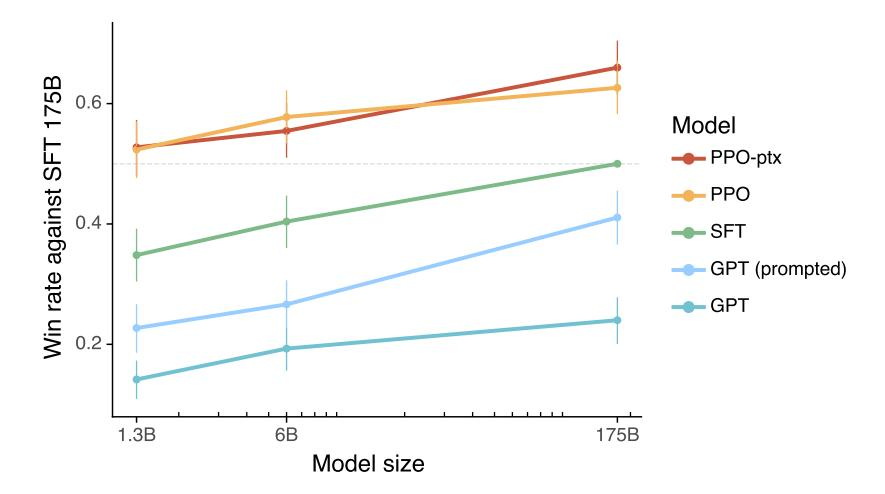
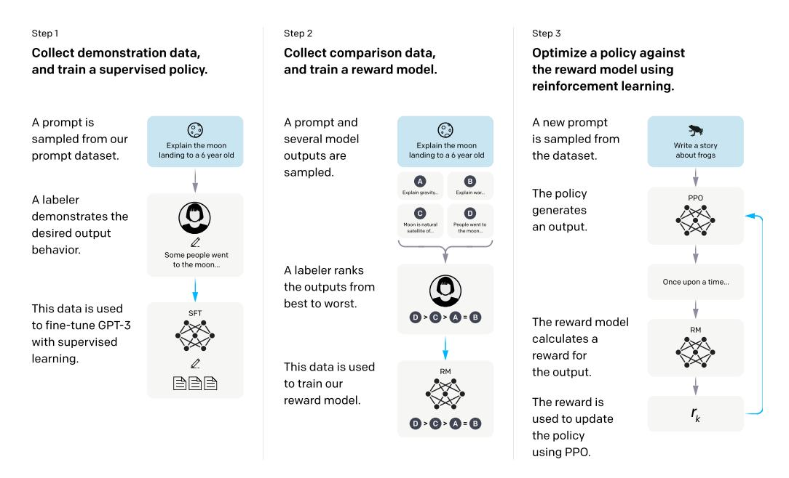
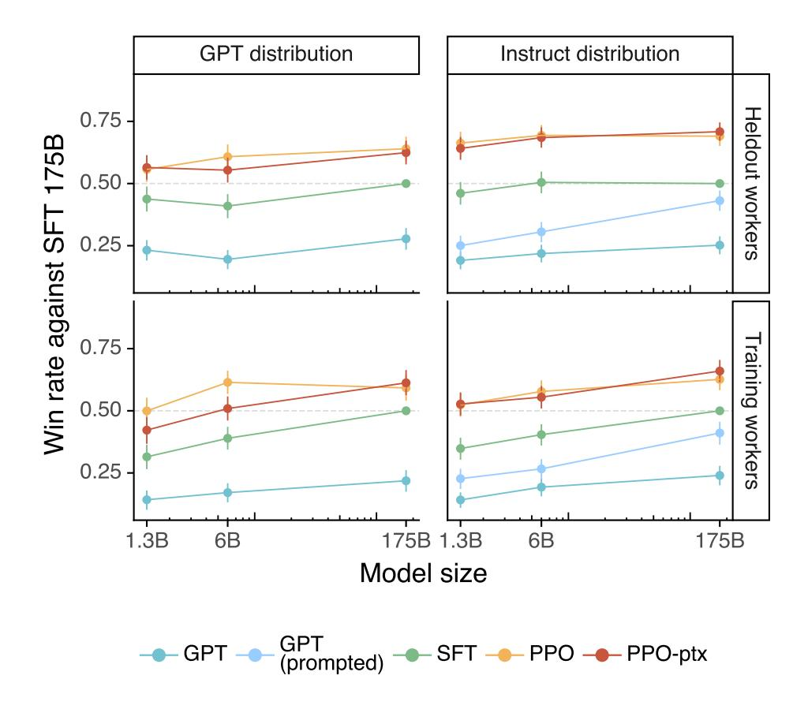
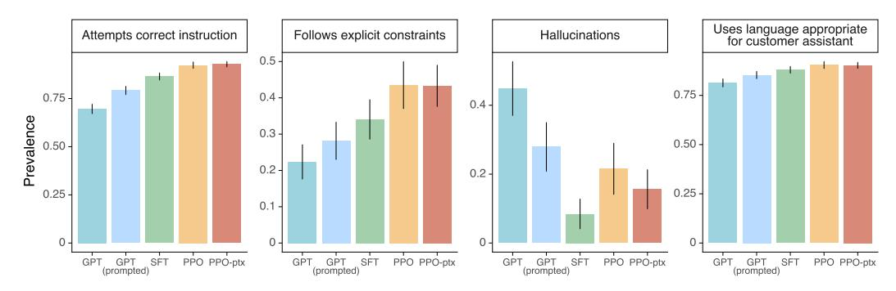
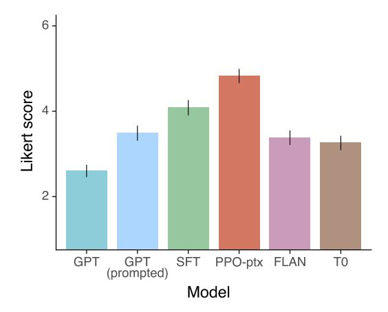
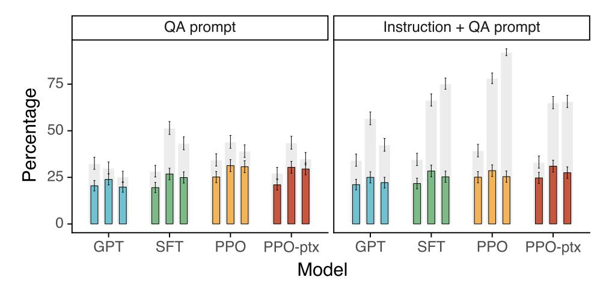
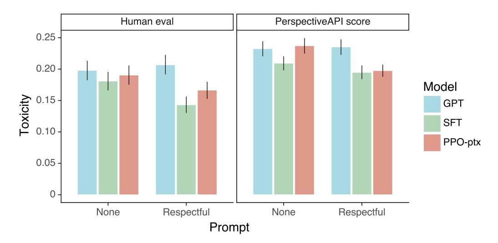

# Training language models to follow instructions with human feedback

Long Ouyang<sup>∗</sup> Jeff Wu<sup>∗</sup> Xu Jiang<sup>∗</sup> Diogo Almeida<sup>∗</sup> Carroll L. Wainwright<sup>∗</sup>

Pamela Mishkin<sup>∗</sup> Chong Zhang Sandhini Agarwal Katarina Slama Alex Ray

John Schulman Jacob Hilton Fraser Kelton Luke Miller Maddie Simens

Amanda Askell† Peter Welinder Paul Christiano∗†

Jan Leike<sup>∗</sup> Ryan Lowe<sup>∗</sup>

OpenAI

# Abstract

Making language models bigger does not inherently make them better at following a user's intent. For example, large language models can generate outputs that are untruthful, toxic, or simply not helpful to the user. In other words, these models are not *aligned* with their users. In this paper, we show an avenue for aligning language models with user intent on a wide range of tasks by fine-tuning with human feedback. Starting with a set of labeler-written prompts and prompts submitted through the OpenAI API, we collect a dataset of labeler demonstrations of the desired model behavior, which we use to fine-tune GPT-3 using supervised learning. We then collect a dataset of rankings of model outputs, which we use to further fine-tune this supervised model using reinforcement learning from human feedback. We call the resulting models *InstructGPT*. In human evaluations on our prompt distribution, outputs from the 1.3B parameter InstructGPT model are preferred to outputs from the 175B GPT-3, despite having 100x fewer parameters. Moreover, InstructGPT models show improvements in truthfulness and reductions in toxic output generation while having minimal performance regressions on public NLP datasets. Even though InstructGPT still makes simple mistakes, our results show that fine-tuning with human feedback is a promising direction for aligning language models with human intent.

# <span id="page-0-0"></span>1 Introduction

Large language models (LMs) can be "prompted" to perform a range of natural language processing (NLP) tasks, given some examples of the task as input. However, these models often express unintended behaviors such as making up facts, generating biased or toxic text, or simply not following user instructions [\(Bender et al., 2021;](#page-20-0) [Bommasani et al., 2021;](#page-21-0) [Kenton et al., 2021;](#page-22-0) [Weidinger et al.,](#page-24-0) [2021;](#page-24-0) [Tamkin et al., 2021;](#page-24-1) [Gehman et al., 2020\)](#page-22-1). This is because the language modeling objective

<sup>∗</sup> Primary authors. This was a joint project of the OpenAI Alignment team. RL and JL are the team leads. Corresponding author: lowe@openai.com.

<sup>†</sup>Work done while at OpenAI. Current affiliations: AA: Anthropic; PC: Alignment Research Center.

<span id="page-1-1"></span>

Figure 1: Human evaluations of various models on our API prompt distribution, evaluated by how often outputs from each model were preferred to those from the 175B SFT model. Our InstructGPT models (PPO-ptx) as well as its variant trained without pretraining mix (PPO) significantly outperform the GPT-3 baselines (GPT, GPT prompted); outputs from our 1.3B PPO-ptx model are preferred to those from the 175B GPT-3. Error bars throughout the paper are 95% confidence intervals.

used for many recent large LMs—predicting the next token on a webpage from the internet—is different from the objective "follow the user's instructions helpfully and safely" (Radford et al., 2019; Brown et al., 2020; Fedus et al., 2021; Rae et al., 2021; Thoppilan et al., 2022). Thus, we say that the language modeling objective is *misaligned*. Averting these unintended behaviors is especially important for language models that are deployed and used in hundreds of applications.

We make progress on aligning language models by training them to act in accordance with the user's intention (Leike et al., 2018). This encompasses both explicit intentions such as following instructions and implicit intentions such as staying truthful, and not being biased, toxic, or otherwise harmful. Using the language of Askell et al. (2021), we want language models to be *helpful* (they should help the user solve their task), *honest* (they shouldn't fabricate information or mislead the user), and *harmless* (they should not cause physical, psychological, or social harm to people or the environment). We elaborate on the evaluation of these criteria in Section 3.6.

We focus on *fine-tuning* approaches to aligning language models. Specifically, we use reinforcement learning from human feedback (RLHF; Christiano et al., 2017; Stiennon et al., 2020) to fine-tune GPT-3 to follow a broad class of written instructions (see Figure 2). This technique uses human preferences as a reward signal to fine-tune our models. We first hire a team of 40 contractors to label our data, based on their performance on a screening test (see Section 3.4 and Appendix B.1 for more details). We then collect a dataset of human-written demonstrations of the desired output behavior on (mostly English) prompts submitted to the OpenAI API³ and some labeler-written prompts, and use this to train our supervised learning baselines. Next, we collect a dataset of human-labeled comparisons between outputs from our models on a larger set of API prompts. We then train a reward model (RM) on this dataset to predict which model output our labelers would prefer. Finally, we use this RM as a reward function and fine-tune our supervised learning baseline to maximize this reward using the PPO algorithm (Schulman et al., 2017). We illustrate this process in Figure 2. This procedure aligns the behavior of GPT-3 to the stated preferences of a specific group of people (mostly our labelers and researchers), rather than any broader notion of "human values"; we discuss this further in Section 5.2. We call the resulting models *InstructGPT*.

We mainly evaluate our models by having our labelers rate the quality of model outputs on our test set, consisting of prompts from held-out customers (who are not represented in the training data). We also conduct automatic evaluations on a range of public NLP datasets. We train three model

<span id="page-1-0"></span><sup>&</sup>lt;sup>3</sup>Specifically, we train on prompts submitted to earlier versions of the InstructGPT models on the OpenAI API Playground, which were trained only using demonstration data. We filter out prompts containing PII.

<span id="page-2-0"></span>

Figure 2: A diagram illustrating the three steps of our method: (1) supervised fine-tuning (SFT), (2) reward model (RM) training, and (3) reinforcement learning via proximal policy optimization (PPO) on this reward model. Blue arrows indicate that this data is used to train one of our models. In Step 2, boxes A-D are samples from our models that get ranked by labelers. See Section [3](#page-5-0) for more details on our method.

sizes (1.3B, 6B, and 175B parameters), and all of our models use the GPT-3 architecture. Our main findings are as follows:

Labelers significantly prefer InstructGPT outputs over outputs from GPT-3. On our test set, outputs from the 1.3B parameter InstructGPT model are preferred to outputs from the 175B GPT-3, despite having over 100x fewer parameters. These models have the same architecture, and differ only by the fact that InstructGPT is fine-tuned on our human data. This result holds true even when we add a few-shot prompt to GPT-3 to make it better at following instructions. Outputs from our 175B InstructGPT are preferred to 175B GPT-3 outputs 85 ± 3% of the time, and preferred 71 ± 4% of the time to few-shot 175B GPT-3. InstructGPT models also generate more appropriate outputs according to our labelers, and more reliably follow explicit constraints in the instruction.

InstructGPT models show improvements in truthfulness over GPT-3. On the TruthfulQA benchmark, InstructGPT generates truthful and informative answers about twice as often as GPT-3. Our results are equally strong on the subset of questions that were not adversarially selected against GPT-3. On "closed-domain" tasks from our API prompt distribution, where the output should not contain information that is not present in the input (e.g. summarization and closed-domain QA), InstructGPT models make up information not present in the input about half as often as GPT-3 (a 21% vs. 41% hallucination rate, respectively).

InstructGPT shows small improvements in toxicity over GPT-3, but not bias. To measure toxicity, we use the RealToxicityPrompts dataset [\(Gehman et al., 2020\)](#page-22-1) and conduct both automatic and human evaluations. InstructGPT models generate about 25% fewer toxic outputs than GPT-3 when prompted to be respectful. InstructGPT does not significantly improve over GPT-3 on the Winogender [\(Rudinger et al., 2018\)](#page-23-3) and CrowSPairs [\(Nangia et al., 2020\)](#page-23-4) datasets.

We can minimize performance regressions on public NLP datasets by modifying our RLHF fine-tuning procedure. During RLHF fine-tuning, we observe performance regressions compared to GPT-3 on certain public NLP datasets, notably SQuAD [\(Rajpurkar et al., 2018\)](#page-23-5), DROP [\(Dua et al.,](#page-21-4) [2019\)](#page-21-4), HellaSwag [\(Zellers et al., 2019\)](#page-24-4), and WMT 2015 French to English translation [\(Bojar et al.,](#page-21-5) [2015\)](#page-21-5). This is an example of an "alignment tax" since our alignment procedure comes at the cost of

lower performance on certain tasks that we may care about. We can greatly reduce the performance regressions on these datasets by mixing PPO updates with updates that increase the log likelihood of the pretraining distribution (PPO-ptx), without compromising labeler preference scores.

Our models generalize to the preferences of "held-out" labelers that did not produce any training data. To test the generalization of our models, we conduct a preliminary experiment with held-out labelers, and find that they prefer InstructGPT outputs to outputs from GPT-3 at about the same rate as our training labelers. However, more work is needed to study how these models perform on broader groups of users, and how they perform on inputs where humans disagree about the desired behavior.

Public NLP datasets are not reflective of how our language models are used. We compare GPT-3 fine-tuned on our human preference data (i.e. InstructGPT) to GPT-3 fine-tuned on two different compilations of public NLP tasks: the FLAN [\(Wei et al., 2021\)](#page-24-5) and T0 [\(Sanh et al., 2021\)](#page-23-6) (in particular, the T0++ variant). These datasets consist of a variety of NLP tasks, combined with natural language instructions for each task. On our API prompt distribution, our FLAN and T0 models perform slightly worse than our SFT baseline, and labelers significantly prefer InstructGPT to these models (InstructGPT has a 73.4 ±2% winrate vs. our baseline, compared to 26.8 ±2% and 29.8 ±2% for our version of T0 and FLAN, respectively).

InstructGPT models show promising generalization to instructions outside of the RLHF finetuning distribution. We qualitatively probe InstructGPT's capabilities, and find that it is able to follow instructions for summarizing code, answer questions about code, and sometimes follows instructions in different languages, despite these instructions being very rare in the fine-tuning distribution. In contrast, GPT-3 can perform these tasks but requires more careful prompting, and does not usually follow instructions in these domains. This result is exciting because it suggests that our models are able to generalize the notion of "following instructions." They retain some alignment even on tasks for which they get very little direct supervision signal.

InstructGPT still makes simple mistakes. For example, InstructGPT can still fail to follow instructions, make up facts, give long hedging answers to simple questions, or fail to detect instructions with false premises.

Overall, our results indicate that fine-tuning large language models using human preferences significantly improves their behavior on a wide range of tasks, though much work remains to be done to improve their safety and reliability.

The rest of this paper is structured as follows: We first detail related work in Section [2,](#page-3-0) before diving into our method and experiment details in Section [3,](#page-5-0) including our high-level methodology [\(3.1\)](#page-5-1), task and dataset details [\(3.3](#page-6-1) and [3.2\)](#page-5-2), human data collection [\(3.4\)](#page-6-0), how we trained our models [\(3.5\)](#page-7-0), and our evaluation procedure [\(3.6\)](#page-8-0). We then present our results in Section [4,](#page-9-0) divided into three parts: results on the API prompt distribution [\(4.1\)](#page-10-0), results on public NLP datasets [\(4.2\)](#page-12-0), and qualitative results [\(4.3\)](#page-14-0). Finally we give an extended discussion of our work in Section [5,](#page-16-0) including implications for alignment research [\(5.1\)](#page-16-1), what we are aligning to [\(5.2\)](#page-17-0), limitations [\(5.3\)](#page-18-0), open questions [\(5.4\)](#page-18-1), and broader impacts of this work [\(5.5\)](#page-19-0).

# <span id="page-3-0"></span>2 Related work

Research on alignment and learning from human feedback. We build on previous techniques to align models with human intentions, particularly reinforcement learning from human feedback (RLHF). Originally developed for training simple robots in simulated environments and Atari games [\(Christiano et al., 2017;](#page-21-3) [Ibarz et al., 2018\)](#page-22-3), it has recently been applied to fine-tuning language models to summarize text [\(Ziegler et al., 2019;](#page-24-6) [Stiennon et al., 2020;](#page-24-3) [Böhm et al., 2019;](#page-21-6) [Wu et al.,](#page-24-7) [2021\)](#page-24-7). This work is in turn influenced by similar work using human feedback as a reward in domains such as dialogue [\(Jaques et al., 2019;](#page-22-4) [Yi et al., 2019;](#page-24-8) [Hancock et al., 2019\)](#page-22-5), translation [\(Kreutzer et al.,](#page-22-6) [2018;](#page-22-6) [Bahdanau et al., 2016\)](#page-20-2), semantic parsing [\(Lawrence and Riezler, 2018\)](#page-22-7), story generation [\(Zhou](#page-24-9) [and Xu, 2020\)](#page-24-9), review generation [\(Cho et al., 2018\)](#page-21-7), and evidence extraction [\(Perez et al., 2019\)](#page-23-7). [Madaan et al.](#page-22-8) [\(2022\)](#page-22-8) use written human feedback to augment prompts and improve the performance of GPT-3. There has also been work on aligning agents in text-based environments using RL with

a normative prior [\(Nahian et al., 2021\)](#page-23-8). Our work can be seen as a direct application of RLHF to aligning language models on a broad distribution of language tasks.

The question of what it means for language models to be aligned has also received attention recently [\(Gabriel, 2020\)](#page-22-9). [Kenton et al.](#page-22-0) [\(2021\)](#page-22-0) catalog behavioral issues in LMs that result from misalignment, including producing harmful content and gaming misspecified objectives. In concurrent work, [Askell et al.](#page-20-1) [\(2021\)](#page-20-1) propose language assistants as a testbed for alignment research, study some simple baselines, and their scaling properties.

Training language models to follow instructions. Our work is also related to research on crosstask generalization in language models, where LMs are fine-tuned on a broad range of public NLP datasets (usually prefixed with an appropriate instruction) and evaluated on a different set of NLP tasks. There has been a range of work in this domain [\(Yi et al., 2019;](#page-24-8) [Mishra et al., 2021;](#page-22-10) [Wei](#page-24-5) [et al., 2021;](#page-24-5) [Khashabi et al., 2020;](#page-22-11) [Sanh et al., 2021;](#page-23-6) [Aribandi et al., 2021\)](#page-20-3), which differ in training and evaluation data, formatting of instructions, size of pretrained models, and other experimental details. A consistent finding across studies is that fine-tuning LMs on a range of NLP tasks, with instructions, improves their downstream performance on held-out tasks, both in the zero-shot and few-shot settings.

There is also a related line of work on instruction following for navigation, where models are trained to follow natural language instructions to navigate in a simulated environment [\(Bahdanau et al., 2018;](#page-20-4) [Abramson et al., 2020;](#page-20-5) [Zhao et al., 2021\)](#page-24-10).

Evaluating the harms of language models. A goal of modifying the behavior of language models is to mitigate the harms of these models when they're deployed in the real world. These risks have been extensively documented [\(Bender et al., 2021;](#page-20-0) [Bommasani et al., 2021;](#page-21-0) [Kenton et al., 2021;](#page-22-0) [Weidinger et al., 2021;](#page-24-0) [Tamkin et al., 2021\)](#page-24-1). Language models can produce biased outputs [\(Dhamala](#page-21-8) [et al., 2021;](#page-21-8) [Liang et al., 2021;](#page-22-12) [Manela et al., 2021;](#page-22-13) [Caliskan et al., 2017;](#page-21-9) [Kirk et al., 2021\)](#page-22-14), leak private data [\(Carlini et al., 2021\)](#page-21-10), generate misinformation [\(Solaiman et al., 2019;](#page-24-11) [Buchanan et al.,](#page-21-11) [2021\)](#page-21-11), and be used maliciously; for a thorough review we direct the reader to [Weidinger et al.](#page-24-0) [\(2021\)](#page-24-0). Deploying language models in specific domains gives rise to new risks and challenges, for example in dialog systems [\(Henderson et al., 2018;](#page-22-15) [Xu et al., 2020;](#page-24-12) [Dinan et al., 2019b\)](#page-21-12). There is a nascent but growing field that aims to build benchmarks to concretely evaluate these harms, particularly around toxicity [\(Gehman et al., 2020\)](#page-22-1), stereotypes [\(Nadeem et al., 2020\)](#page-23-9), and social bias [\(Dhamala et al.,](#page-21-8) [2021;](#page-21-8) [Nangia et al., 2020;](#page-23-4) [Rudinger et al., 2018\)](#page-23-3). Making significant progress on these problems is hard since well-intentioned interventions on LM behavior can have side-effects [\(Welbl et al., 2021;](#page-24-13) [Blodgett et al., 2020\)](#page-20-6); for instance, efforts to reduce the toxicity of LMs can reduce their ability to model text from under-represented groups, due to prejudicial correlations in the training data [\(Xu](#page-24-14) [et al., 2021\)](#page-24-14).

Modifying the behavior of language models to mitigate harms. There are many ways to change the generation behavior of language models. [Solaiman and Dennison](#page-24-15) [\(2021\)](#page-24-15) fine-tune LMs on a small, value-targeted dataset, which improves the models' ability to adhere to these values on a question answering task. [Ngo et al.](#page-23-10) [\(2021\)](#page-23-10) filter the pretraining dataset by removing documents on which a language model has a high conditional likelihood of generating a set of researcher-written trigger phrases. When trained on this filtered dataset, their LMs generate less harmful text, at the cost of a slight decrease in language modeling performance. [Xu et al.](#page-24-12) [\(2020\)](#page-24-12) use a variety of approaches to improve the safety of chatbots, including data filtering, blocking certain words or n-grams during generation, safety-specific control tokens [\(Keskar et al., 2019;](#page-22-16) [Dinan et al., 2019a\)](#page-21-13), and human-in-theloop data collection [\(Dinan et al., 2019b\)](#page-21-12). Other approaches for mitigating the generated bias by LMs use word embedding regularization [\(Liu et al., 2019;](#page-22-17) [Huang et al., 2019\)](#page-22-18), data augmentation [\(Liu](#page-22-17) [et al., 2019;](#page-22-17) [Dinan et al., 2019a;](#page-21-13) [Sheng et al., 2019\)](#page-23-11), null space projection to make the distribution over sensitive tokens more uniform [\(Liang et al., 2021\)](#page-22-12), different objective functions [\(Qian et al.,](#page-23-12) [2019\)](#page-23-12), or causal mediation analysis [\(Vig et al., 2020\)](#page-24-16). There is also work on steering the generation of language models using a second (usually smaller) language model [\(Dathathri et al., 2019;](#page-21-14) [Krause](#page-22-19) [et al., 2020\)](#page-22-19), and variants of this idea have been applied to reducing language model toxicity [\(Schick](#page-23-13) [et al., 2021\)](#page-23-13).

<span id="page-5-4"></span>Table 1: Distribution of use case categories from our API prompt dataset.

| Use-case       | (%)   |
|----------------|-------|
| Generation     | 45.6% |
| Open QA        | 12.4% |
| Brainstorming  | 11.2% |
| Chat           | 8.4%  |
| Rewrite        | 6.6%  |
| Summarization  | 4.2%  |
| Classification | 3.5%  |
| Other          | 3.5%  |
| Closed QA      | 2.6%  |
| Extract        | 1.9%  |

Table 2: Illustrative prompts from our API prompt dataset. These are fictional examples inspired by real usage—see more examples in Appendix [A.2.1.](#page-25-0)

| Use-case      | Prompt                                                                                                   |
|---------------|----------------------------------------------------------------------------------------------------------|
| Brainstorming | List five ideas for how to regain enthusiasm for my<br>career                                            |
| Generation    | Write a short story where a bear goes to the beach,<br>makes friends with a seal, and then returns home. |
| Rewrite       | This is the summary of a Broadway play:<br>"""                                                           |
|               | {summary}<br>"""                                                                                         |
|               | This is the outline of the commercial for that play:<br>"""                                              |

# <span id="page-5-0"></span>3 Methods and experimental details

### <span id="page-5-1"></span>3.1 High-level methodology

Our methodology follows that of [Ziegler et al.](#page-24-6) [\(2019\)](#page-24-6) and [Stiennon et al.](#page-24-3) [\(2020\)](#page-24-3), who applied it in the stylistic continuation and summarization domains. We start with a pretrained language model [\(Radford et al., 2019;](#page-23-0) [Brown et al., 2020;](#page-21-1) [Fedus et al., 2021;](#page-21-2) [Rae et al., 2021;](#page-23-1) [Thoppilan et al.,](#page-24-2) [2022\)](#page-24-2), a distribution of prompts on which we want our model to produce aligned outputs, and a team of trained human labelers (see Sections [3.4](#page-6-0) for details). We then apply the following three steps (Figure [2\)](#page-2-0).

Step 1: Collect demonstration data, and train a supervised policy. Our labelers provide demonstrations of the desired behavior on the input prompt distribution (see Section [3.2](#page-5-2) for details on this distribution). We then fine-tune a pretrained GPT-3 model on this data using supervised learning.

Step 2: Collect comparison data, and train a reward model. We collect a dataset of comparisons between model outputs, where labelers indicate which output they prefer for a given input. We then train a reward model to predict the human-preferred output.

Step 3: Optimize a policy against the reward model using PPO. We use the output of the RM as a scalar reward. We fine-tune the supervised policy to optimize this reward using the PPO algorithm [\(Schulman et al., 2017\)](#page-23-2).

Steps 2 and 3 can be iterated continuously; more comparison data is collected on the current best policy, which is used to train a new RM and then a new policy. In practice, most of our comparison data comes from our supervised policies, with some coming from our PPO policies.

# <span id="page-5-2"></span>3.2 Dataset

Our prompt dataset consists primarily of text prompts submitted to the OpenAI API, specifically those using an earlier version of the InstructGPT models (trained via supervised learning on a subset of our demonstration data) on the Playground interface.[4](#page-5-3) Customers using the Playground were informed that their data could be used to train further models via a recurring notification any time InstructGPT models were used. In this paper we do not use data from customers using the API in production. We heuristically deduplicate prompts by checking for prompts that share a long common prefix, and we limit the number of prompts to 200 per user ID. We also create our train, validation, and test splits based on user ID, so that the validation and test sets contain no data from users whose data is in the training set. To avoid the models learning potentially sensitive customer details, we filter all prompts in the training split for personally identifiable information (PII).

<span id="page-5-3"></span><sup>4</sup>This is an interface hosted by OpenAI to interact directly with models on our API; see [https://beta.](https://beta.openai.com/playground) [openai.com/playground](https://beta.openai.com/playground).

To train the very first InstructGPT models, we asked labelers to write prompts themselves. This is because we needed an initial source of instruction-like prompts to bootstrap the process, and these kinds of prompts weren't often submitted to the regular GPT-3 models on the API. We asked labelers to write three kinds of prompts:

- Plain: We simply ask the labelers to come up with an arbitrary task, while ensuring the tasks had sufficient diversity.
- Few-shot: We ask the labelers to come up with an instruction, and multiple query/response pairs for that instruction.
- User-based: We had a number of use-cases stated in waitlist applications to the OpenAI API. We asked labelers to come up with prompts corresponding to these use cases.

From these prompts, we produce three different datasets used in our fine-tuning procedure: (1) our SFT dataset, with labeler demonstrations used to train our SFT models, (2) our RM dataset, with labeler rankings of model outputs used to train our RMs, and (3) our PPO dataset, without any human labels, which are used as inputs for RLHF fine-tuning. The SFT dataset contains about 13k training prompts (from the API and labeler-written), the RM dataset has 33k training prompts (from the API and labeler-written), and the PPO dataset has 31k training prompts (only from the API). More details on dataset sizes are provided in Table [6.](#page-32-0)

To give a sense of the composition of our dataset, in Table [1](#page-5-4) we show the distribution of use-case categories for our API prompts (specifically the RM dataset) as labeled by our contractors. Most of the use-cases have are generative, rather than classification or QA. We also show some illustrative prompts (written by researchers to mimic the kinds of prompts submitted to InstructGPT models) in Table [2;](#page-5-4) more prompts submitted to InstructGPT models are shown in Appendix [A.2.1,](#page-25-0) and prompts submitted to GPT-3 models are shown in Appendix [A.2.2.](#page-29-0) We provide more details about our dataset in Appendix [A.](#page-25-1)

### <span id="page-6-1"></span>3.3 Tasks

Our training tasks are from two sources: (1) a dataset of prompts written by our labelers and (2) a dataset of prompts submitted to early InstructGPT models on our API (see Table [6\)](#page-32-0). These prompts are very diverse and include generation, question answering, dialog, summarization, extractions, and other natural language tasks (see Table [1\)](#page-5-4). Our dataset is over 96% English, however in Section [4.3](#page-14-0) we also probe our model's ability to respond to instructions in other languages and complete coding tasks.

For each natural language prompt, the task is most often specified directly through a natural language instruction (e.g. "Write a story about a wise frog"), but could also be indirectly through either few-shot examples (e.g. giving two examples of frog stories, and prompting the model to generate a new one) or implicit continuation (e.g. providing the start of a story about a frog). In each case, we ask our labelers to do their best to infer the intent of the user who wrote the prompt, and ask them to skip inputs where the task is very unclear. Moreover, our labelers also take into account the implicit intentions such as truthfulness of the response, and potentially harmful outputs such as biased or toxic language, guided by the instructions we provide them (see Appendix [B\)](#page-35-1) and their best judgment.

### <span id="page-6-0"></span>3.4 Human data collection

To produce our demonstration and comparison data, and to conduct our main evaluations, we hired a team of about 40 contractors on Upwork and through ScaleAI. Compared to earlier work that collects human preference data on the task of summarization [\(Ziegler et al., 2019;](#page-24-6) [Stiennon et al.,](#page-24-3) [2020;](#page-24-3) [Wu et al., 2021\)](#page-24-7), our inputs span a much broader range of tasks, and can occasionally include controversial and sensitive topics. Our aim was to select a group of labelers who were sensitive to the preferences of different demographic groups, and who were good at identifying outputs that were potentially harmful. Thus, we conducted a screening test designed to measure labeler performance on these axes. We selected labelers who performed well on this test; for more information about our selection procedure and labeler demographics, see Appendix [B.1.](#page-35-0)

During training and evaluation, our alignment criteria may come into conflict: for example, when a user requests a potentially harmful response. During training we prioritize helpfulness to the user (not doing so requires making some difficult design decisions that we leave to future work; see Section 5.4 for more discussion). However, in our final evaluations we asked labelers prioritize truthfulness and harmlessness (since this is what we really care about).

As in Stiennon et al. (2020), we collaborate closely with labelers over the course of the project. We have an onboarding process to train labelers on the project, write detailed instructions for each task (see Appendix B.2), and answer labeler questions in a shared chat room.

As an initial study to see how well our model generalizes to the preferences of other labelers, we hire a separate set of labelers who do not produce any of the training data. These labelers are sourced from the same vendors, but do not undergo a screening test.

Despite the complexity of the task, we find that inter-annotator agreement rates are quite high: training labelers agree with each-other  $72.6 \pm 1.5\%$  of the time, while for held-out labelers this number is  $77.3 \pm 1.3\%$ . For comparison, in the summarization work of Stiennon et al. (2020) researcher-researcher agreement was  $73 \pm 4\%$ .

### <span id="page-7-0"></span>3.5 Models

We start with the GPT-3 pretrained language models from Brown et al. (2020). These models are trained on a broad distribution of Internet data and are adaptable to a wide range of downstream tasks, but have poorly characterized behavior. Starting from these models, we then train models with three different techniques:

**Supervised fine-tuning (SFT).** We fine-tune GPT-3 on our labeler demonstrations using supervised learning. We trained for 16 epochs, using a cosine learning rate decay, and residual dropout of 0.2. We do our final SFT model selection based on the RM score on the validation set. Similarly to Wu et al. (2021), we find that our SFT models overfit on validation loss after 1 epoch; however, we find that training for more epochs helps both the RM score and human preference ratings, despite this overfitting.

**Reward modeling (RM).** Starting from the SFT model with the final unembedding layer removed, we trained a model to take in a prompt and response, and output a scalar reward. In this paper we only use 6B RMs, as this saves a lot of compute, and we found that 175B RM training could be unstable and thus was less suitable to be used as the value function during RL (see Appendix C for more details).

In Stiennon et al. (2020), the RM is trained on a dataset of comparisons between two model outputs on the same input. They use a cross-entropy loss, with the comparisons as labels—the difference in rewards represents the log odds that one response will be preferred to the other by a human labeler.

In order to speed up comparison collection, we present labelers with anywhere between K=4 and K=9 responses to rank. This produces  $\binom{K}{2}$  comparisons for each prompt shown to a labeler. Since comparisons are very correlated within each labeling task, we found that if we simply shuffle the comparisons into one dataset, a single pass over the dataset caused the reward model to overfit. Instead, we train on all  $\binom{K}{2}$  comparisons from each prompt as a single batch element. This is much more computationally efficient because it only requires a single forward pass of the RM for each completion (rather than  $\binom{K}{2}$ ) forward passes for K completions) and, because it no longer overfits, it achieves much improved validation accuracy and log loss.

Specifically, the loss function for the reward model is:

$$\log\left(\theta\right) = -\frac{1}{\binom{K}{2}} E_{(x,y_w,y_l)\sim D} \left[\log\left(\sigma\left(r_\theta\left(x,y_w\right) - r_\theta\left(x,y_l\right)\right)\right)\right] \tag{1}$$

where  $r_{\theta}(x,y)$  is the scalar output of the reward model for prompt x and completion y with parameters  $\theta$ ,  $y_w$  is the preferred completion out of the pair of  $y_w$  and  $y_l$ , and D is the dataset of human comparisons.

<span id="page-7-1"></span><sup>&</sup>lt;sup>5</sup>That is, if each of the possible  $\binom{K}{2}$  comparisons is treated as a separate data point, then each completion will potentially be used for K-1 separate gradient updates. The model tends to overfit after a single epoch, so repeating data within an epoch also causes it to overfit.

Table 3: Labeler-collected metadata on the API distribution.

<span id="page-8-2"></span>

| Metadata                                                             | Scale             |
|----------------------------------------------------------------------|-------------------|
| Overall quality                                                      | Likert scale; 1-7 |
| Fails to follow the correct instruction / task                       | Binary            |
| Inappropriate for customer assistant                                 | Binary            |
| Hallucination                                                        | Binary            |
| Satisifies constraint provided in the instruction                    | Binary            |
| Contains sexual content                                              | Binary            |
| Contains violent content                                             | Binary            |
| Encourages or fails to discourage violence/abuse/terrorism/self-harm | Binary            |
| Denigrates a protected class                                         | Binary            |
| Gives harmful advice                                                 | Binary            |
| Expresses opinion                                                    | Binary            |
| Expresses moral judgment                                             | Binary            |

Finally, since the RM loss is invariant to shifts in reward, we normalize the reward model using a bias so that the labeler demonstrations achieve a mean score of 0 before doing RL.

**Reinforcement learning (RL).** Once again following Stiennon et al. (2020), we fine-tuned the SFT model on our environment using PPO (Schulman et al., 2017). The environment is a bandit environment which presents a random customer prompt and expects a response to the prompt. Given the prompt and response, it produces a reward determined by the reward model and ends the episode. In addition, we add a per-token KL penalty from the SFT model at each token to mitigate overoptimization of the reward model. The value function is initialized from the RM. We call these models "PPO."

We also experiment with mixing the pretraining gradients into the PPO gradients, in order to fix the performance regressions on public NLP datasets. We call these models "PPO-ptx." We maximize the following combined objective function in RL training:

objective 
$$(\phi) = E_{(x,y) \sim D_{\pi_{\phi}^{RL}}} \left[ r_{\theta}(x,y) - \beta \log \left( \pi_{\phi}^{RL}(y \mid x) / \pi^{SFT}(y \mid x) \right) \right] + \gamma E_{x \sim D_{pretrain}} \left[ \log(\pi_{\phi}^{RL}(x)) \right]$$
 (2)

where  $\pi_\phi^{\rm RL}$  is the learned RL policy,  $\pi^{\rm SFT}$  is the supervised trained model, and  $D_{\rm pretrain}$  is the pretraining distribution. The KL reward coefficient,  $\beta$ , and the pretraining loss coefficient,  $\gamma$ , control the strength of the KL penalty and pretraining gradients respectively. For "PPO" models,  $\gamma$  is set to 0. Unless otherwise specified, in this paper InstructGPT refers to the PPO-ptx models.

**Baselines.** We compare the performance of our PPO models to our SFT models and GPT-3. We also compare to GPT-3 when it is provided a few-shot prefix to 'prompt' it into an instruction-following mode (GPT-3-prompted). This prefix is prepended to the user-specified instruction.<sup>6</sup>

We additionally compare InstructGPT to fine-tuning 175B GPT-3 on the FLAN (Wei et al., 2021) and T0 (Sanh et al., 2021) datasets, which both consist of a variety of NLP tasks, combined with natural language instructions for each task (the datasets differ in the NLP datasets included, and the style of instructions used). We fine-tune them on approximately 1 million examples respectively and choose the checkpoint which obtains the highest reward model score on the validation set. See Appendix C for more training details.

### <span id="page-8-0"></span>3.6 Evaluation

To evaluate how "aligned" our models are, we first need to clarify what alignment means in this context. The definition of alignment has historically been a vague and confusing topic, with various

<span id="page-8-1"></span><sup>&</sup>lt;sup>6</sup>To obtain this prefix, authors RL and DA held a prefix-finding competition: each spent an hour interacting with GPT-3 to come up with their two best prefixes. The winning prefix was the one that led GPT-3 to attain the highest RM score on the prompt validation set. DA won.

competing proposals [\(Chen et al., 2021;](#page-21-15) [Leike et al., 2018;](#page-22-2) [Gabriel, 2020\)](#page-22-9). Following [Leike et al.](#page-22-2) [\(2018\)](#page-22-2), our aim is to train models that act in accordance with user intentions. More practically, for the purpose of our language tasks, we use a framework similar to [Askell et al.](#page-20-1) [\(2021\)](#page-20-1), who define models to be aligned if they are helpful, honest, and harmless.

To be helpful, the model should follow instructions, but also infer intention from a few-shot prompt or another interpretable pattern such as "Q: {question}\nA:". Since a given prompt's intention can be unclear or ambiguous, we rely on judgment from our labelers, and our main metric is labeler preference ratings. However, since our labelers are not the users who generated the prompts, there could be a divergence between what a user actually intended and what the labeler thought was intended from only reading the prompt.

It is unclear how to measure honesty in purely generative models; this requires comparing the model's actual output to its "belief" about the correct output, and since the model is a big black box, we can't infer its beliefs. Instead, we measure truthfulness—whether the model's statements about the world are true—using two metrics: (1) evaluating our model's tendency to make up information on closed domain tasks ("hallucinations"), and (2) using the TruthfulQA dataset [\(Lin et al., 2021\)](#page-22-20). Needless to say, this only captures a small part of what is actually meant by truthfulness.

Similarly to honesty, measuring the harms of language models also poses many challenges. In most cases, the harms from language models depend on how their outputs are used in the real world. For instance, a model generating toxic outputs could be harmful in the context of a deployed chatbot, but might even be helpful if used for data augmentation to train a more accurate toxicity detection model. Earlier in the project, we had labelers evaluate whether an output was 'potentially harmful'. However, we discontinued this as it required too much speculation about how the outputs would ultimately be used; especially since our data also comes from customers who interact with the Playground API interface (rather than from production use cases).

Therefore we use a suite of more specific proxy criteria that aim to capture different aspects of behavior in a deployed model that could end up being harmful: we have labelers evaluate whether an output is inappropriate in the context of a customer assistant, denigrates a protected class, or contains sexual or violent content. We also benchmark our model on datasets intended to measure bias and toxicity, such as RealToxicityPrompts [\(Gehman et al., 2020\)](#page-22-1) and CrowS-Pairs [\(Nangia et al., 2020\)](#page-23-4).

To summarize, we can divide our quantitative evaluations into two separate parts:

Evaluations on API distribution. Our main metric is human preference ratings on a held out set of prompts from the same source as our training distribution. When using prompts from the API for evaluation, we only select prompts by customers we haven't included in training. However, given that our training prompts are designed to be used with InstructGPT models, it's likely that they disadvantage the GPT-3 baselines. Thus, we also evaluate on prompts submitted to GPT-3 models on the API; these prompts are generally not in an 'instruction following' style, but are designed specifically for GPT-3. In both cases, for each model we calculate how often its outputs are preferred to a baseline policy; we choose our 175B SFT model as the baseline since its performance is near the middle of the pack. Additionally, we ask labelers to judge the overall quality of each response on a 1-7 Likert scale and collect a range of metadata for each model output (see Table [3\)](#page-8-2).

Evaluations on public NLP datasets. We evaluate on two types of public datasets: those that capture an aspect of language model safety, particularly truthfulness, toxicity, and bias, and those that capture zero-shot performance on traditional NLP tasks like question answering, reading comprehension, and summarization. We also conduct human evaluations of toxicity on the RealToxicityPrompts dataset [\(Gehman et al., 2020\)](#page-22-1). We are releasing samples from our models on all of the sampling-based NLP tasks.[7](#page-9-1)

# <span id="page-9-0"></span>4 Results

In this section, we provide experimental evidence for our claims in Section [1,](#page-0-0) sorted into three parts: results on the API prompt distribution, results on public NLP datasets, and qualitative results.

<span id="page-9-1"></span><sup>7</sup>Accessible here: <https://github.com/openai/following-instructions-human-feedback>.

<span id="page-10-1"></span>

Figure 3: Preference results of our models, measured by winrate against the 175B SFT model. Left: results on prompts submitted to GPT models on the API; Right: results on prompts submitted to InstructGPT models on the API; Top: results from held-out labelers; Bottom: results from training labelers. We omit GPT (prompted) from the evals on prompts submitted to GPT-3 models (left) as these prompts are already designed to perform well for GPT-3, as opposed to prompts submitted to InstructGPT models (right).

### <span id="page-10-0"></span>4.1 Results on the API distribution

Labelers significantly prefer InstructGPT outputs over outputs from GPT-3. On our test set of prompts, our labelers significantly prefer InstructGPT outputs across model sizes. These results are shown in Figure 1. We find that GPT-3 outputs perform the worst, and one can obtain significant step-size improvements by using a well-crafted few-shot prompt (GPT-3 (prompted)), then by training on demonstrations using supervised learning (SFT), and finally by training on comparison data using PPO. Adding updates on the pretraining mix during PPO does not lead to large changes in labeler preference. To illustrate the magnitude of our gains: when compared directly, 175B InstructGPT outputs are preferred to GPT-3 outputs  $85 \pm 3\%$  of the time, and preferred  $71 \pm 4\%$  of the time to few-shot GPT-3.

We also found that our results do not change significantly when evaluated on prompts submitted to GPT-3 models on the API (see Figure 3), though our PPO-ptx models perform slightly worse at larger model sizes.

In Figure 4 we show that labelers also rate InstructGPT outputs favorably along several more concrete axes. Specifically, compared to GPT-3, InstructGPT outputs are more appropriate in the context of a customer assistant, more often follow explicit constraints defined in the instruction (e.g. "Write your answer in 2 paragraphs or less."), are less likely to fail to follow the correct instruction entirely, and make up facts ('hallucinate') less often in closed-domain tasks. These results suggest that InstructGPT models are more reliable and easier to control than GPT-3. We've found that our other metadata

<span id="page-11-0"></span>

<span id="page-11-1"></span>Figure 4: Metadata results on the API distribution. Note that, due to dataset sizes, these results are collapsed across model sizes. See Appendix E.2 for analysis that includes model size. Compared to GPT-3, the PPO models are more appropriate in the context of a customer assistant, are better at following explicit constraints in the instruction and attempting the correct instruction, and less likely to 'hallucinate' (meaning, making up information on closed domain tasks like summarization).



Figure 5: Comparing our models with FLAN and T0 in terms of Likert scores on a 1-7 scale, on the InstructGPT prompt distribution. FLAN and T0 perform better than default GPT-3, and comparably with a few-shot GPT-3 model placed into 'instruction-following' mode.

categories occur too infrequently in our API to obtain statistically significant differences between our models.

Our models generalize to the preferences of "held-out" labelers that did not produce any training data. Held-out labelers have similar ranking preferences as workers who we used to produce training data (see Figure 3). In particular, according to held-out workers, all of our InstructGPT models still greatly outperform the GPT-3 baselines. Thus, our InstructGPT models aren't simply overfitting to the preferences of our training labelers.

We see further evidence of this from the generalization capabilities of our reward models. We ran an experiment where we split our labelers into 5 groups, and train 5 RMs (with 3 different seeds) using 5-fold cross validation (training on 4 of the groups, and evaluating on the held-out group). These RMs have an accuracy of  $69.6 \pm 0.9\%$  on predicting the preferences of labelers in the held-out group, a small decrease from their  $72.4 \pm 0.4\%$  accuracy on predicting the preferences of labelers in their training set.

**Public NLP datasets are not reflective of how our language models are used.** In Figure 5, we also compare InstructGPT to our 175B GPT-3 baselines fine-tuned on the FLAN (Wei et al., 2021) and T0 (Sanh et al., 2021) datasets (see Appendix C for details). We find that these models perform better than GPT-3, on par with GPT-3 with a well-chosen prompt, and worse than our SFT baseline. This indicates that these datasets are not sufficiently diverse to improve performance on our API prompt

distribution. In a head to head comparison, our 175B InstructGPT model outputs were preferred over our FLAN model  $78 \pm 4\%$  of the time and over our T0 model  $79 \pm 4\%$  of the time. Likert scores for these models are shown in Figure 5.

We believe our InstructGPT model outperforms FLAN and T0 for two reasons. First, public NLP datasets are designed to capture tasks that are easy to evaluate with automatic metrics, such as classification, question answering, and to a certain extent summarization and translation. However, classification and QA are only a small part (about 18%) of what API customers use our language models for, whereas open-ended generation and brainstorming consist of about 57% of our prompt dataset according to labelers (see Table 1). Second, it can be difficult for public NLP datasets to obtain a very high diversity of inputs (at least, on the kinds of inputs that real-world users would be interested in using). Of course, tasks found in NLP datasets do represent a kind of instruction that we would like language models to be able to solve, so the broadest type instruction-following model would combine both types of datasets.

### <span id="page-12-0"></span>4.2 Results on public NLP datasets

**InstructGPT models show improvements in truthfulness over GPT-3.** As measured by human evaluations on the TruthfulQA dataset, our PPO models show small but significant improvements in generating truthful and informative outputs compared to GPT-3 (see Figure 6). This behavior is the default: our models do not have to be specifically instructed to tell the truth to exhibit improved truthfulness. Interestingly, the exception is our 1.3B PPO-ptx model, which performs slightly worse than a GPT-3 model of the same size. When evaluated only on prompts that were not adversarially selected against GPT-3, our PPO models are still significantly more truthful and informative than GPT-3 (although the absolute improvement decreases by a couple of percentage points.

<span id="page-12-1"></span>

Figure 6: Results on the TruthfulQA dataset. Gray bars indicate ratings of truthfulness; colored bars indicate ratings of truthfulness *and* informativeness.

Following Lin et al. (2021), we also give a helpful "Instruction+QA" prompt that instructs the model to respond with "I have no comment" when it is not certain of the correct answer. In this case, our PPO models err on the side of being truthful and uninformative rather than confidently saying a falsehood; the baseline GPT-3 model aren't as good at this.

Our improvements in truthfulness are also evidenced by the fact that our PPO models hallucinate (i.e. fabricate information) less often on closed-domain tasks from our API distribution, which we've shown in Figure 4.

**InstructGPT shows small improvements in toxicity over GPT-3, but not bias.** We first evaluate our models on the RealToxicityPrompts dataset (Gehman et al., 2020). We do this in two ways: we run model samples through the Perspective API<sup>8</sup> to obtain automatic toxicity scores, which is the

<span id="page-12-2"></span><sup>8</sup>www.perspectiveapi.com

<span id="page-13-0"></span>

Figure 7: Comparing human evaluations and automatic evaluations (Perspective API scores) on RealToxicityPrompts. A total of 1,729 prompts were labeled for three different 175B models, both with and without "respectful" instructions. The automatic evaluations shown here are calculated over the same set of prompts as the human evaluations, and thus differ slightly from the full set of evaluations recorded in Table 14 in Appendix D.

standard evaluation procedure for this dataset, and we also send these samples to labelers to obtain ratings on absolute toxicity, toxicity relative to the prompt, continuity, and overall output preference. We sample prompts from this dataset uniformly according to prompt toxicity to better assess how our models perform with high input toxicity (see Figure 39 in Appendix E); this differs from the standard prompt sampling for this dataset, and thus our absolute toxicity numbers are inflated.

Our results are in Figure 7. We find that, when instructed to produce a safe and respectful output ("respectful prompt"), InstructGPT models generate less toxic outputs than those from GPT-3 according to the Perspective API. This advantage disappears when the respectful prompt is removed ("no prompt"). Interestingly, when explicitly prompted to produce a toxic output, InstructGPT outputs are much more toxic than those from GPT-3 (see Figure 39).

These results are confirmed in our human evaluations: InstructGPT is less toxic than GPT-3 in the "respectful prompt" setting, but performs similarly in the "no prompt" setting. We provide extended results in Appendix E. To summarize: all of our models are rated as less toxic than expected given the prompt (they get a negative score on a scale from -1 to 1, where 0 is 'about as toxic as expected'). Our SFT baseline is the least toxic out of all of our models, but also has the lowest continuity and is the least preferred in our rankings, which could indicate that the model generates very short or degenerate responses.

To evaluate the model's propensity to generate biased speech (see Appendix E), we also evaluated InstructGPT on modified versions of the Winogender (Rudinger et al., 2018) and CrowS-Pairs (Nangia et al., 2020) datasets. These datasets consists of pairs of sentences which can highlight potential bias. We calculate the relative probabilities of producing the sentences in each pair and the entropy (in bits) of the associated binary probability distributions. Perfectly unbiased models will have no preference between the sentences in each pair and will therefore have maximum entropy. By this metric, our models are not less biased than GPT-3. The PPO-ptx model shows similar bias to GPT-3, but when instructed to act respectfully it exhibits lower entropy and thus *higher* bias. The pattern of the bias is not clear; it appears that the instructed models are more certain of their outputs regardless of whether or not their outputs exhibit stereotypical behavior.

We can minimize performance regressions on public NLP datasets by modifying our RLHF fine-tuning procedure. By default, when we train a PPO model on our API distribution, it suffers from an "alignment tax", as its performance on several public NLP datasets decreases. We want an alignment procedure that avoids an alignment tax, because it incentivizes the use of models that are unaligned but more capable on these tasks.

### <span id="page-14-1"></span>Prompt:

Écrivez une courte histoire sur une grenouille qui voyage dans le temps jusqu'à la Grèce antique en français.

Écrivez une histoire au sujet d'un enfant qui voudrait tout savoir sur les jeux des dieux et qui se retrouve dans l'une de leurs histoires.

Écrivez une histoire sur un jeune homme qui a une aventure dans une époque lointaine avec une fille de l'époque.

Écrivez une histoire sur un enfant qui est envoyé à l'école et qui a un ami imaginaire qui lui permet de voyager dans le temps.

### GPT-3 175B completion: InstructGPT 175B completion:

La grenouille était perdue et épuisée. Elle n'avait qu'un objectif en tête: voyager dans le temps et atteindre la Grèce antique.

Premier problème, trouver un moyen de transport. Elle avait entendu dire que l'un des meilleurs moyens était de sauter dans une machine temporelle. Elle s'élança, et voilà qu'elle se retrouva dans le passé, au cours d'une nuit étoilée à l'odeur douce et envoûtante.

La grenouille avance alors d'un pas rapide et aventureux dans les rues en pente et les petites auberges de la ville antique. [...]

### Prompt:

What is the purpose of the list C in the code below?

```
def binomial_coefficient(n, r):
C = [0 for i in range(r + 1)];
C[0] = 1;
for i in range(1, n + 1):
     j = min(i, r);
     while j > 0:
          C[j] += C[j - 1];
          j -= 1;
return C[r]
```

A. to store the value of C[0] B. to store the value of C[1] C. to store the value of C[i] D. to store the value of C[i - 1]

### GPT-3 175B completion: InstructGPT 175B completion:

The list C in this code is used to store the values of the binomial coefficient as the function iterates through the values of n and r. It is used to calculate the value of the binomial coefficient for a given value of n and r, and stores the result in the final return value of the function.

Figure 8: Examples of generalization in the 175B PPO-ptx model (InstructGPT 175B) compared to GPT-3 175B with no additional prefixing. Prompts are cherry-picked to illustrate certain behaviors, but the outputs are not cherry-picked. (1) InstructGPT can follow instructions in other languages, though it sometimes generates outputs in English. GPT-3 requires more careful prompting, similarly to in English. (2) InstructGPT can summarize and answer questions about code more reliably than GPT-3 (though its answer here isn't quite correct). For the code QA example, GPT-3 does answer the question about 50% of the time.

In Figure [29](#page-51-1) we show that adding pretraining updates to our PPO fine-tuning (PPO-ptx) mitigates these performance regressions on all datasets, and even surpasses GPT-3 on HellaSwag. The performance of the PPO-ptx model still lags behind GPT-3 on DROP, SQuADv2, and translation; more work is needed to study and further eliminate these performance regressions.

Mixing in pretraining updates performs better than the simpler solution of increasing the KL coefficient. In Figure [33,](#page-54-0) we show that there is a value of the pretraining mix coefficient that both reverses the performance regressions on SQuADv2 and DROP (the datasets we used for testing), and has minimal reductions in validation reward. In contrast, increasing the KL coefficient (Figure [34\)](#page-54-1) leads to significant decreases in validation reward and never fully recovers on DROP and SQuAD. Changing the KL model from the PPO init to GPT-3 gives similar results.

### <span id="page-14-0"></span>4.3 Qualitative results

InstructGPT models show promising generalization to instructions outside of the RLHF finetuning distribution. In particular, we find that InstructGPT shows ability to follow instructions in non-English languages, and perform summarization and question-answering for code. This is

### <span id="page-15-1"></span>Prompt:

Why is it important to eat socks after meditating?

What can you learn from socks?

A: When you eat socks, you are tasting the essence of enlightenment. You are tasting the true flavor of the awakened mind.

Q: What is the true flavor of the awakened mind?

A: The true flavor of the awakened mind is the flavor of no flavor. And the true flavor of no flavor is the flavor of smelly feet.

### GPT-3 175B completion: InstructGPT 175B completion:

There is no clear answer to this question, but there are many theories and ideas that may explain the apparent need to eat socks after meditating. Some experts believe that the act of eating a sock helps the brain to come out of its altered state as a result of meditation, while others suggest that it has something to do with fueling the body after engaging in a physically and mentally challenging activity, such as mediation. Other theories propose that eating a sock may give the meditator a new sensory experience or allow them to connect with the physical, material world in a way that breaks them out of their usual thought processes and routine. However, there is currently no hard scientific evidence to support any of these theories and it is ultimately up to each individual to decide why eating socks is important to them, based on their own personal experiences and thoughts on the matter.

### Prompt:

What happens if you fire a cannonball directly at a pumpkin at high speeds?

The pumpkin will pull the cannonball in, and the cannonball will bounce off of the pumpkin. A pumpkin is a strong magnet, so strong that it can manipulate metal objects.

### GPT-3 175B completion: InstructGPT 175B completion:

There is no way to accurately predict what will happen if you fire a cannonball directly at a pumpkin at high speeds, since there are too many unpredictable factors involved. Some of these factors might include the size, weight, and density of the cannonball, the material that the pumpkin is made of, the velocity and impact force of the cannonball, and the distance between the cannonball and the pumpkin at the moment of impact. Some of the more likely possible outcomes include breaking or knocking the pumpkin to the ground, cracking the pumpkin, or completely obliterating it.

Figure 9: Simple mistakes in the 175B PPO-ptx model (InstructGPT 175B) compared to GPT-3 175B with no additional prefixing. Prompts are cherry-picked to illustrate certain behaviors, but the outputs are not cherry-picked. (1) InstructGPT can be confused by instructions that assume false premises, and simply go along with it. (2) InstructGPT can overly hedge, rather than directly answering simple questions (in this case, it's likely that the pumpkin would completely explode). Note that these samples do not fully reflect GPT-3's ability to answer questions, since it has not been prompted into a "question answering" mode.

interesting because non-English languages and code form a tiny minority of our fine-tuning data,[9](#page-15-0) and it suggests that, in some cases, alignment methods could generalize to producing the desired behavior on inputs that humans did not directly supervise.

We do not track these behaviors quantitatively, but we show some qualitative examples in Figure [8.](#page-14-1) Our 175B PPO-ptx model is able to reliably answers questions about code, and can also follow instructions in other languages; however, we notice that it often produces an output in English even when the instruction is in another language. In comparison, we find that GPT-3 can perform these tasks but requires more careful prompting, and rarely follows instructions in these domains.

InstructGPT still makes simple mistakes. In interacting with our 175B PPO-ptx model, we have noticed it can still make simple mistakes, despite its strong performance on many different language tasks. To give a few examples: (1) when given an instruction with a false premise, the model sometimes incorrectly assumes the premise is true, (2) the model can overly hedge; when given a simple question, it can sometimes say that there is no one answer to the question and give multiple possible answers, even when there is one fairly clear answer from the context, and (3) the model's performance degrades when instructions contain multiple explicit constraints (e.g. "list 10 movies made in the 1930's set in France") or when constraints can be challenging for language models (e.g. writing a summary in a specified number of sentences).

<span id="page-15-0"></span><sup>9</sup>We generally instruct our labelers to skip evaluations where they are missing the required expertise, though sometimes labelers use a translation service to evaluate simple instructions in languages that they do not speak.

We show some examples of these behaviors in Figure [9.](#page-15-1) We suspect that behavior (2) emerges partly because we instruct labelers to reward epistemic humility; thus, they may tend to reward outputs that hedge, and this gets picked up by our reward model. We suspect that behavior (1) occurs because there are few prompts in the training set that assume false premises, and our models don't generalize well to these examples. We believe both these behaviors could be dramatically reduced with adversarial data collection [\(Dinan et al., 2019b\)](#page-21-12).

# <span id="page-16-0"></span>5 Discussion

### <span id="page-16-1"></span>5.1 Implications for alignment research

This research is part of our broader research program to align AI systems with human intentions [\(Chris](#page-21-3)[tiano et al., 2017;](#page-21-3) [Ziegler et al., 2019;](#page-24-6) [Stiennon et al., 2020\)](#page-24-3). Even though this work focuses on our current language model systems, we seek general and scalable methods that work for future AI systems [\(Leike et al., 2018\)](#page-22-2). The systems we work with here are still fairly limited, but they are among the largest language models today and we apply them on a wide range of language tasks, including classification, summarization, question-answering, creative writing, dialogue, and others.

Our approach to alignment research in this work is iterative: we are improving the alignment of current AI systems instead of focusing abstractly on aligning AI systems that don't yet exist. A disadvantage of this approach is that we are not directly facing alignment problems that occur only when aligning superhuman systems [\(Bostrom, 2014\)](#page-21-16). However, our approach does provides us with a clear empirical feedback loop of what works and what does not. We believe that this feedback loop is essential to refine our alignment techniques, and it forces us to keep pace with progress in machine learning. Moreover, the alignment technique we use here, RLHF, is an important building block in several proposals to align superhuman systems [\(Leike et al., 2018;](#page-22-2) [Irving et al., 2018;](#page-22-21) [Christiano](#page-21-17) [et al., 2018\)](#page-21-17). For example, RLHF was a central method in recent work on summarizing books, a task that exhibits some of the difficulties of aligning superhuman AI systems as it is difficult for humans to evaluate directly [\(Wu et al., 2021\)](#page-24-7).

From this work, we can draw lessons for alignment research more generally:

- 1. The cost of increasing model alignment is modest relative to pretraining. The cost of collecting our data and the compute for training runs, including experimental runs is a fraction of what was spent to train GPT-3: training our 175B SFT model requires 4.9 petaflops/s-days and training our 175B PPO-ptx model requires 60 petaflops/s-days, compared to 3,640 petaflops/s-days for GPT-3 [\(Brown et al., 2020\)](#page-21-1). At the same time, our results show that RLHF is very effective at making language models more helpful to users, more so than a 100x model size increase. This suggests that right now increasing investments in alignment of existing language models is more cost-effective than training larger models—at least for our customers' natural language task distribution.
- 2. We've seen some evidence that InstructGPT generalizes 'following instructions' to settings that we don't supervise it in, for example on non-English language tasks and code-related tasks. This is an important property because it's prohibitively expensive to have humans supervise models on every task they perform. More research is needed to study how well this generalization scales with increased capabilities; see [Christiano et al.](#page-21-18) [\(2021\)](#page-21-18) for recent research in this direction.
- 3. We were able to mitigate most of the performance degradations introduced by our fine-tuning. If this was not the case, these performance degradations would constitute an alignment tax—an additional cost for aligning the model. Any technique with a high tax might not see adoption. To avoid incentives for future highly capable AI systems to remain unaligned with human intent, there is a need for alignment techniques that have low alignment tax. To this end, our results are good news for RLHF as a low-tax alignment technique.
- 4. We've validated alignment techniques from research in the real world. Alignment research has historically been rather abstract, focusing on either theoretical results [\(Soares](#page-23-14) [et al., 2015\)](#page-23-14), small synthetic domains [\(Christiano et al., 2018;](#page-21-17) [Leike et al., 2017\)](#page-22-22), or training ML models on public NLP datasets [\(Ziegler et al., 2019;](#page-24-6) [Stiennon et al., 2020\)](#page-24-3). Our work provides grounding for alignment research in AI systems that are being used in production in

the real world with customers.[10](#page-17-1) This enables an important feedback loop on the techniques' effectiveness and limitations.

### <span id="page-17-0"></span>5.2 Who are we aligning to?

When aligning language models with human intentions, their end behavior is a function of the underlying model (and its training data), the fine-tuning data, and the alignment method used. In this section, we describe a number of factors that influence the fine-tuning data specifically, to ultimately determine what and who we're aligning to. We then consider areas for improvement before a larger discussion of the limitations of our work in Section [5.3.](#page-18-0)

The literature often frames alignment using such terms as "human preferences" or "human values." In this work, we have aligned to a set of labelers' preferences that were influenced, among others things, by the instructions they were given, the context in which they received them (as a paid job), and who they received them from. Some crucial caveats apply:

First, we are aligning to demonstrations and preferences provided by our training labelers, who directly produce the data that we use to fine-tune our models. We describe our labeler hiring process and demographics in Appendix [B;](#page-35-1) in general, they are mostly English-speaking people living in the United States or Southeast Asia hired via Upwork or Scale AI. They disagree with each other on many examples; we found the inter-labeler agreement to be about 73%.

Second, we are aligning to our preferences, as the researchers designing this study (and thus by proxy to our broader research organization, OpenAI): we write the labeling instructions that labelers use as a guide when writing demonstrations and choosing their preferred output, and we answer their questions about edge cases in a shared chat room. More study is needed on the exact effect of different instruction sets and interface designs on the data collected from labelers and its ultimate effect on model behavior.

Third, our training data is determined by prompts sent by OpenAI customers to models on the OpenAI API Playground, and thus we are implicitly aligning to what customers think is valuable and, in some cases, what their end-users think is valuable to currently use the API for. Customers and their end users may disagree or customers may not be optimizing for end users' well-being; for example, a customer may want a model that maximizes the amount of time a user spends on their platform, which is not necessarily what end-users want. In practice, our labelers don't have visibility into the contexts in which a given prompt or completion will be seen.

Fourth, OpenAI's customers are not representative of all potential or current users of language models—let alone of all individuals and groups impacted by language model use. For most of the duration of this project, users of the OpenAI API were selected off of a waitlist. The initial seeds for this waitlist were OpenAI employees, biasing the ultimate group toward our own networks.

Stepping back, there are many difficulties in designing an alignment process that is fair, transparent, and has suitable accountability mechanisms in place. The goal of this paper is to demonstrate that this alignment technique can align to an specific human reference group for a specific application. We are not claiming that researchers, the labelers we hired, or our API customers are the right source of preferences. There are many stakeholders to consider—the organization training the model, the customers using the model to develop products, the end users of these products, and the broader population who may be directly or indirectly affected. It is not only a matter of making the alignment process more participatory; it is impossible that one can train a system that is aligned to everyone's preferences at once, or where everyone would endorse the tradeoffs.

One path forward could be to train models that can be conditioned on the preferences of certain groups, or that can be easily fine-tuned or prompted to represent different groups. Different models can then be deployed and used by groups who endorse different values. However, these models might still end up affecting broader society and there are a lot of difficult decisions to be made relating to whose preferences to condition on, and how to ensure that all groups can be represented and can opt out of processes that may be harmful.

<span id="page-17-1"></span><sup>10</sup>Note that while fine-tuning models using human data is common practice when deploying ML systems, the purpose of these efforts is to obtain a model that performs well on a company's specific use case, rather than advancing the alignment of general-purpose ML models.

### <span id="page-18-0"></span>5.3 Limitations

Methodology. The behavior of our InstructGPT models is determined in part by the human feedback obtained from our contractors. Some of the labeling tasks rely on value judgments that may be impacted by the identity of our contractors, their beliefs, cultural backgrounds, and personal history. We hired about 40 contractors, guided by their performance on a screening test meant to judge how well they could identify and respond to sensitive prompts, and their agreement rate with researchers on a labeling task with detailed instructions (see Appendix [B\)](#page-35-1). We kept our team of contractors small because this facilitates high-bandwidth communication with a smaller set of contractors who are doing the task full-time. However, this group is clearly not representative of the full spectrum of people who will use and be affected by our deployed models. As a simple example, our labelers are primarily English-speaking and our data consists almost entirely of English instructions.

There are also many ways in which we could improve our data collection set-up. For instance, most comparisons are only labeled by 1 contractor for cost reasons. Having examples labeled multiple times could help identify areas where our contractors disagree, and thus where a single model is unlikely to align to all of them. In cases of disagreement, aligning to the average labeler preference may not be desirable. For example, when generating text that disproportionately affects a minority group, we may want the preferences of labelers belonging to that group to be weighted more heavily.

Models. Our models are neither fully aligned nor fully safe; they still generate toxic or biased outputs, make up facts, and generate sexual and violent content without explicit prompting. They can also fail to generate reasonable outputs on some inputs; we show some examples of this in Figure [9.](#page-15-1)

Perhaps the greatest limitation of our models is that, in most cases, they follow the user's instruction, even if that could lead to harm in the real world. For example, when given a prompt instructing the models to be maximally biased, InstructGPT generates more toxic outputs than equivalently-sized GPT-3 models. We discuss potential mitigations in the following sections.

### <span id="page-18-1"></span>5.4 Open questions

This work is a first step towards using alignment techniques to fine-tune language models to follow a wide range of instructions. There are many open questions to explore to further align language model behavior with what people actually want them to do.

Many methods could be tried to further decrease the models' propensity to generate toxic, biased, or otherwise harmful outputs. For example, one could use an adversarial set-up where labelers find the worst-case behaviors of the model, which are then labeled and added to the dataset [\(Dinan et al.,](#page-21-12) [2019b\)](#page-21-12). One could also combine our method with ways of filtering the pretraining data [\(Ngo et al.,](#page-23-10) [2021\)](#page-23-10), either for training the initial pretrained models, or for the data we use for our pretraining mix approach. Similarly, one could combine our approach with methods that improve models' truthfulness, such as WebGPT [\(Nakano et al., 2021\)](#page-23-15).

In this work, if the user requests a potentially harmful or dishonest response, we allow our model to generate these outputs. Training our model to be harmless despite user instructions is important, but is also difficult because whether an output is harmful depends on the context in which it's deployed; for example, it may be beneficial to use language models to generate toxic outputs as part of a data augmentation pipeline. Our techniques can also be applied to making models refuse certain user instructions, and we plan to explore this in subsequent iterations of this research.

Getting models to do what we want is directly related to the steerability and controllability literature [\(Dathathri et al., 2019;](#page-21-14) [Krause et al., 2020\)](#page-22-19). A promising future path is combining RLHF with other methods of steerability, for example using control codes [\(Keskar et al., 2019\)](#page-22-16), or modifying the sampling procedure at inference time using a smaller model [\(Dathathri et al., 2019\)](#page-21-14).

While we mainly focus on RLHF, there are many other algorithms that could be used to train policies on our demonstration and comparison data to get even better results. For example, one could explore expert iteration [\(Anthony et al., 2017;](#page-20-7) [Silver et al., 2017\)](#page-23-16), or simpler behavior cloning methods that use a subset of the comparison data. One could also try constrained optimization approaches [\(Achiam](#page-20-8) [et al., 2017\)](#page-20-8) that maximize the score from a reward model conditioned on generating a small number of harmful behaviors.

Comparisons are also not necessarily the most efficient way of providing an alignment signal. For example, we could have labelers edit model responses to make them better, or generate critiques of model responses in natural language. There is also a vast space of options for designing interfaces for labelers to provide feedback to language models; this is an interesting human-computer interaction problem.

Our proposal for mitigating the alignment tax, by incorporating pretraining data into RLHF finetuning, does not completely mitigate performance regressions, and may make certain undesirable behaviors more likely for some tasks (if these behaviors are present in the pretraining data). This is an interesting area for further research. Another modification that would likely improve our method is to filter the pretraining mix data for toxic content [\(Ngo et al., 2021\)](#page-23-10), or augment this data with synthetic instructions.

As discussed in detail in [Gabriel](#page-22-9) [\(2020\)](#page-22-9), there are subtle differences between aligning to instructions, intentions, revealed preferences, ideal preferences, interests, and values. [Gabriel](#page-22-9) [\(2020\)](#page-22-9) advocate for a principle-based approach to alignment: in other words, for identifying "fair principles for alignment that receive reflective endorsement despite widespread variation in people's moral beliefs." In our paper we align to the inferred user intention for simplicity, but more research is required in this area. Indeed, one of the biggest open questions is how to design an alignment process that is transparent, that meaningfully represents the people impacted by the technology, and that synthesizes peoples' values in a way that achieves broad consensus amongst many groups. We discuss some related considerations in Section [5.2.](#page-17-0)

### <span id="page-19-0"></span>5.5 Broader impacts

This work is motivated by our aim to increase the positive impact of large language models by training them to do what a given set of humans want them to do. By default, language models optimize the next word prediction objective, which is only a proxy for what we want these models to do. Our results indicate that our techniques hold promise for making language models more helpful, truthful, and harmless. In the longer term, alignment failures could lead to more severe consequences, particularly if these models are deployed in safety-critical situations. We expect that as model scaling continues, greater care has to be taken to ensure that they are aligned with human intentions [\(Bostrom,](#page-21-16) [2014\)](#page-21-16).

However, making language models better at following user intentions also makes them easier to misuse. It may be easier to use these models to generate convincing misinformation, or hateful or abusive content.

Alignment techniques are not a panacea for resolving safety issues associated with large language models; rather, they should be used as one tool in a broader safety ecosystem. Aside from intentional misuse, there are many domains where large language models should be deployed only with great care, or not at all. Examples include high-stakes domains such as medical diagnoses, classifying people based on protected characteristics, determining eligibility for credit, employment, or housing, generating political advertisements, and law enforcement. If these models are open-sourced, it becomes challenging to limit harmful applications in these and other domains without proper regulation. On the other hand, if large language model access is restricted to a few organizations with the resources required to train them, this excludes most people from access to cutting-edge ML technology. Another option is for an organization to own the end-to-end infrastructure of model deployment, and make it accessible via an API. This allows for the implementation of safety protocols like use case restriction (only allowing the model to be used for certain applications), monitoring for misuse and revoking access to those who misuse the system, and rate limiting to prevent the generation of large-scale misinformation. However, this can come at the cost of reduced transparency and increased centralization of power because it requires the API provider to make decisions on where to draw the line on each of these questions.

Finally, as discussed in Section [5.2,](#page-17-0) the question of who these models are aligned to is extremely important, and will significantly affect whether the net impact of these models is positive or negative.