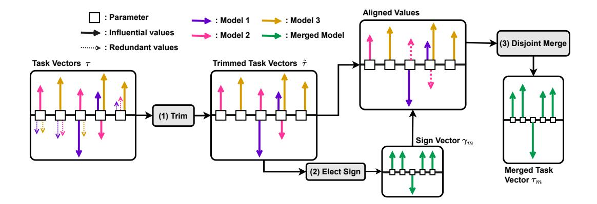
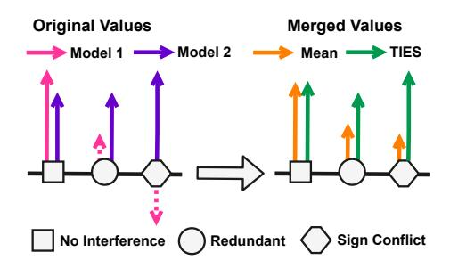
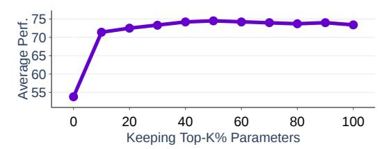
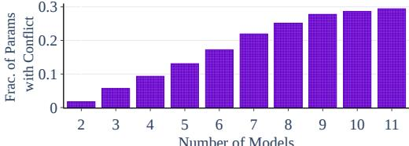
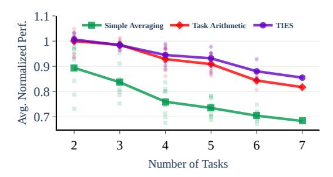
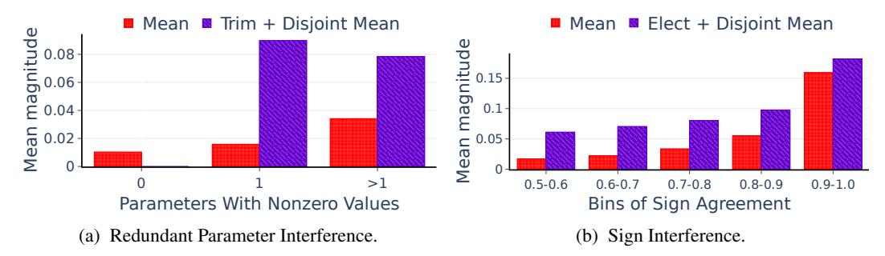
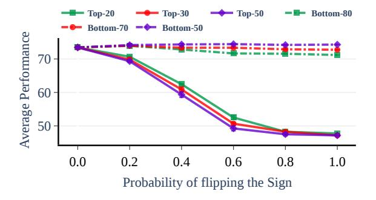

# TIES-MERGING: Resolving Interference When Merging Models

Prateek Yadav<sup>1</sup> Derek Tam<sup>1</sup> Leshem Choshen2,<sup>3</sup> Colin Raffel<sup>1</sup> Mohit Bansal<sup>1</sup> <sup>1</sup> University of North Carolina at Chapel Hill <sup>2</sup> IBM Research <sup>3</sup> MIT leshem.choshen@ibm.com {praty,dtredsox,craffel,mbansal}@cs.unc.edu

# Abstract

Transfer learning – i.e., further fine-tuning a pre-trained model on a downstream task – can confer significant advantages, including improved downstream performance, faster convergence, and better sample efficiency. These advantages have led to a proliferation of task-specific fine-tuned models, which typically can only perform a single task and do not benefit from one another. Recently, model merging techniques have emerged as a solution to combine multiple task-specific models into a single multitask model without performing additional training. However, existing merging methods often ignore the interference between parameters of different models, resulting in large performance drops when merging multiple models. In this paper, we demonstrate that prior merging techniques inadvertently lose valuable information due to two major sources of interference: (a) interference due to redundant parameter values and (b) disagreement on the sign of a given parameter's values across models. To address this, we propose our method, TRIM, ELECT SIGN & MERGE (TIES-MERGING), which introduces three novel steps when merging models: (1) resetting parameters that only changed a small amount during fine-tuning, (2) resolving sign conflicts, and (3) merging only the parameters that are in alignment with the final agreed-upon sign. We find that TIES-MERGING outperforms several existing methods in diverse settings covering a range of modalities, domains, number of tasks, model sizes, architectures, and fine-tuning settings. We further analyze the impact of different types of interference on model parameters, and highlight the importance of resolving sign interference.[1](#page-0-0)

# 1 Introduction

Pre-trained models (PTMs) have become widespread in many real-world applications [\[91,](#page-15-0) [6\]](#page-10-0). Using PTMs typically involves fine-tuning them to specialize on a specific task [\[69,](#page-14-0) [12\]](#page-10-1), which can lead to improved performance with less task-specific labeled data. These benefits have resulted in the release of thousands of finetuned checkpoints [\[81\]](#page-15-1) derived from popular PTMs such as ViT [\[14\]](#page-10-2) for vision and T5 [\[58\]](#page-13-0) for language. However, having a separate fine-tuned model for each task has various drawbacks: (1) for each new application, a separate model has to be stored and deployed [\[17,](#page-11-0) [89\]](#page-15-2), and (2) models trained in isolation cannot leverage information from related tasks to improve in-domain performance or out-of-domain generalization [\[66,](#page-14-1) [58,](#page-13-0) [75\]](#page-14-2). Multitask learning [\[66,](#page-14-1) [57\]](#page-13-1) could address these concerns but requires costly training and simultaneous access to all tasks [\[17\]](#page-11-0). Moreover, it can be complex and resource-intensive to determine how best to mix datasets to ensure that multitask training is beneficial for all tasks [\[55,](#page-13-2) [54,](#page-13-3) [80,](#page-14-3) [52,](#page-13-4) [2,](#page-10-3) [17\]](#page-11-0).

<span id="page-0-0"></span><sup>1</sup>Our code is available at <https://github.com/prateeky2806/ties-merging>



<span id="page-1-1"></span>Figure 1: A depiction of the steps involved in TIES-MERGING. We visualize each parameter in a model as a square. The arrows depict the update (task vector, τ ) to a parameter produced by fine-tuning on different tasks (coded by colors), with direction denoting sign and length denoting magnitude. We first *trim* the task vector values based on their magnitude, then we *elect* the sign for each parameter (γm, green vector containing +1 or −1) by resolving sign conflicts. Finally, we pick only the values that align with the elected sign and take their mean as the final parameter value.

Recently, a growing body of research has focused on *model merging* [\[40\]](#page-12-0). One application of merging involves combining multiple task-specific models into a single multitask model without performing additional training. Previous works merge models by summing the individual model weights with different weighting schemes, either via a simple average [\[9,](#page-10-4) [28,](#page-11-1) [83\]](#page-15-3), via more sophisticated means that incorporate parameter importance [\[45\]](#page-12-1) or account for permutation invariances [\[1,](#page-10-5) [31,](#page-11-2) [70,](#page-14-4) [74,](#page-14-5) [42\]](#page-12-2). Combining fine-tuned models in this way can be seen as adding together *task vectors* [\[29\]](#page-11-3) that are computed by subtracting the pre-trained model's parameter values from those of the fine-tuned model.

While weighted averaging of model parameters has proven effective for merging, all of these methods ignore the possibility that values may interfere across models, thereby harming the performance of the merged model. In this paper, we first demonstrate that interference can stem from two major causes (see Fig. [2\)](#page-1-0), both of which can reduce parameter magnitudes in the merged model and eliminate subtle distinctions among values: (1) INTERFERENCE FROM REDUNDANT PARAMETERS: Previous studies on model pruning [\[25,](#page-11-4) [76\]](#page-14-6) have shown that during fine-tuning, many model parameters can change over the course of fine-tuning [\[63\]](#page-13-5) but only have a small impact on performance. However, when merging a parameter that is influential for one model but redundant (i.e. not influential) for other models, the influential value may be obscured by the redundant values, lowering the overall model performance (# in



<span id="page-1-0"></span>Figure 2: Different types of conflict and merged outputs produced by either averaging or TIES-MERGING. The parameters causing interference are denoted by dotted arrows.

Fig. [2\)](#page-1-0). (2) INTERFERENCE FROM SIGN DISAGREEMENT: A given parameter might have a positive value for some models and a negative value for others. Consequently, employing simple averaging might compromise the performance on both tasks (<sup>7</sup> in Fig. [2\)](#page-1-0). In both of these situations, simply aggregating the values lead to interference that shrinks the parameter's value in the merged model. This interference between influential parameters might explain why the performance gap between the merged model and multitask-trained model increases as the number of models increases [\[31\]](#page-11-2).

To address these sources of interference, we propose TIES-MERGING (TRIM, ELECT SIGN & MERGE) method, a method for merging models by combining task vectors that has three steps (visualized in Fig. [1\)](#page-1-1): First, we trim each task vector to retain only the influential parameter values by setting the redundant values in each task vector to zero (or, equivalently, resetting the fine-tuned parameter value back to the value from the pre-trained model). After this step, sign conflicts may still persist among influential parameter values, as visualized in Fig. [4.](#page-3-0) Our second step therefore resolves the sign conflicts between different values and our last step only averages parameters whose sign agrees with the direction of the largest total movement across models.

We demonstrate the effectiveness of our proposed TIES-MERGING method in various setups with: (1) different modalities, including language and vision benchmarks, (2) distinct model sizes and families, such as T5-base and T5-large [\[58\]](#page-13-0) as well as ViT-B/32 and ViT-L/14 [\[14\]](#page-10-2), (3) in-domain and out-ofdomain tasks, (4) full finetuning or parameter-efficient finetuning, and (5) in the presence or absence of a validation set for setting merging hyperparameters. We show that TIES-MERGING outperforms other merging methods, such as Task Arithmetic [\[29\]](#page-11-3), RegMean [\[31\]](#page-11-2), Fisher Merging [\[45\]](#page-12-1), and weight averaging [\[9,](#page-10-4) [82\]](#page-15-4) across all these experimental settings. Notably, for in-domain evaluation, TIES-MERGING outperforms the strongest baseline by an average of 2.3% and 1.7% absolute in NLP and vision settings (Table [1\)](#page-5-0), respectively. For out-of-domain generalization (Table [2\)](#page-6-0), TIES-MERGING outperforms the strongest baseline by 1.0% and 4.4% absolute for T5-base and T5-large models respectively. In Section [7,](#page-8-0) we perform ablations on our method components and demonstrate the impact of interference on parameter values. Additionally, we showcase the increased advantage of TIES-MERGING over task arithmetic [\[29\]](#page-11-3) as the number of tasks increases. Finally, we examine the importance of obtaining the correct sign vector. Our results and analysis establish TIES-MERGING as a powerful and effective method for combining fine-tuned models into a single multi-task model.

# 2 Related Work

Loss Landscape and Weight Interpolation. While the loss function of a neural network is generally non-convex, recent work has demonstrated that the parameter values from different training runs can sometimes be interpolated without increasing the loss (i.e. they are *mode-connected*) [\[15,](#page-11-5) [20,](#page-11-6) [21,](#page-11-7) [32,](#page-12-3) [22\]](#page-11-8). For example, Frankle et al. [\[19\]](#page-11-9) showed that if a part of the optimization trajectory is shared between two neural networks then they can be interpolated without lowering accuracy. On the other hand, Neyshabur et al. [\[48\]](#page-12-4) showed that naively interpolating two neural networks with completely disjoint optimization trajectories can result in a catastrophic drop in their accuracies. Entezari et al. [\[16\]](#page-11-10) hypothesized that if we account for the permutation symmetry of neural networks, then all neural networks of a given architecture trained on the same dataset are linear mode connected. Ainsworth et al. [\[1\]](#page-10-5), Singh and Jaggi [\[70\]](#page-14-4), Wang et al. [\[79\]](#page-14-7) therefore used techniques based on finding permutations [\[79,](#page-14-7) [1\]](#page-10-5) and optimal transport [\[70\]](#page-14-4) to better align neural networks trained from scratch so that they can be interpolated without increasing the loss.

Model Merging and Different Use Cases. Different fine-tuned models initialized from the same pre-trained model effectively share a part of the optimization trajectory, and can therefore often be merged without accounting for permutation symmetry [\[82,](#page-15-4) [83,](#page-15-3) [29,](#page-11-3) [31\]](#page-11-2). Therefore, merging fine-tuned models can improve performance on a single target task [\[30,](#page-11-11) [23,](#page-11-12) [82,](#page-15-4) [9\]](#page-10-4), improving out-of-domain generalization [\[31,](#page-11-2) [29,](#page-11-3) [7,](#page-10-6) [4,](#page-10-7) [60,](#page-13-6) [59\]](#page-13-7), creating a multitask models from different tasks [\[31,](#page-11-2) [29,](#page-11-3) [38\]](#page-12-5), for federated learning [\[46,](#page-12-6) [41\]](#page-12-7), compression [\[39\]](#page-12-8), multimodal merging models [\[72\]](#page-14-8), continual learning [\[86,](#page-15-5) [85\]](#page-15-6), and other settings [\[38,](#page-12-5) [13\]](#page-10-8). The range of applications has led to a proliferation of methods to improve beyond simple parameter averaging. *RegMean* [\[31\]](#page-11-2) proposed a closed-form solution for the merged model's parameters by solving a local linear regression problem for each individual linear layer in the model. However, this requires transmitting additional data statistics that are the same size as the model and requires additional inference steps to calculate them. *Fisher Merging* [\[45\]](#page-12-1) goes beyond simple averaging to identify the importance of individual parameters using Fisher Information Matrix [\[18,](#page-11-13) [3,](#page-10-9) [34\]](#page-12-9) and uses it to weigh the parameters in each model when merging. However, this shows little gains when merging multiple checkpoints and also requires computing gradients which has a high memory cost. *Task Arithmetic* [\[29\]](#page-11-3) presented a method for merging models by generating task vectors and performing arithmetic operations, such as addition, to obtain a multitask checkpoint. A concurrent work by Ortiz-Jiménez et al. [\[51\]](#page-13-8) provided theoretical insights on model merging based on the weight disentanglement property that arises during pretraining. They showed that finetuning models in their tangent space enhance this property, leading to better-merged models. Our method follows these past works on model merging but additionally takes into account the interference between different parameters during merging.



<span id="page-3-0"></span>

across eleven tasks. Keeping only the top-20\% of els being merged. the parameter does not degrade the performance.

<span id="page-3-1"></span>Figure 3: Performance depends on a small Figure 4: Sign conflicts occur even after trimfraction of high-magnitude parameters. For ming and increase with the number of models. each task vector, we keep only the largest - top- We plot the fraction of parameters that have a sign k% parameters and plot the average performance conflict after trimming versus the number of mod-

# **Background and Motivation**

**Problem Setting** Given a set of tasks  $\{t_1, \ldots, t_n\}$  and a pre-trained model such as T5 [58] or ViT [14], we either finetune the entire model or employ a parameter-efficient finetuning (PEFT) method [43, 26]. In both cases, we denote the trainable parameters as  $\theta$ , the initialization as  $\theta_{\text{init}}$ , and the finetuned parameters as  $\theta_{\rm ft}$ . In this paper, we assume access to finetuned model parameters  $\theta_{\rm ft}$ for multiple tasks and devise a method to merge the weights of these models into a single multitask model proficient on both in-domain and out-of-domain datasets. We follow Ilharco et al. [29] and perform merging with task vectors. Specifically, for a task t, the task-vector  $\tau_t \in \mathbb{R}^d$  is defined as  $au_t = heta_{
m ft}^t - heta_{
m init}^t$ . This operation allows us to focus on the changes that happen during the fine-tuning phase of each task-specific model and is equivalent to computing a weighted average of the models' weights with appropriate scaling.

## Redundancies in Model Parameters.

First, we demonstrate that in a given task vector, many values are redundant (denoted by  $\bigcirc$  in Fig. 2), and removing them does not affect the performance of the task. Specifically, Fig. 3 shows the average performance across eleven task-specific models when "trimming" each task vector to retain only the top-k% largest-magnitude values and resetting the rest to their initial value (i.e. setting the corresponding value in the task vector to 0). Fig. 3 shows the average performance across varying values of k, demonstrating that keeping only the top-20\% of values delivers comparable results to retaining all parameters. additional details and the results on the T5 model, please refer to Appendix C.3. This shows that many parameter changes introduced during fine-tuning are redundant. Hence, disregarding those values during merging could prevent interference with the influential parameters without compromising the task's performance.

# <span id="page-3-2"></span>Algorithm 1 TIES-MERGING Procedure.

```
Input: Fine-tuned models \{\theta_t\}_{t=1}^n, Initialization \theta_{\text{init}},
           k, and \lambda.
Output: Merged Model \theta_m
forall t in 1, ..., n do
     D Create task vectors.
     \tau_t = \theta_t - \theta_{\text{init}}

    ▷ Step 1: Trim redundant parameters.

     \hat{\tau}_t \leftarrow \text{keep\_topk\_reset\_rest\_to\_zero}(\tau_t, k)
     \hat{\gamma}_t \leftarrow sgn(\hat{\tau}_t)
    \hat{\mu}_t \leftarrow |\hat{\tau_t}|
end

    ▷ Step 2: Elect Final Signs.

\gamma_m = sgn(\sum_{t=1}^n \hat{\tau}_t)

    Step 3: Disjoint Merge.

end
D Obtain merged checkpoint
\theta_m \leftarrow \theta_{\text{init}} + \lambda * \tau_m
```

**Disagreement between Parameter Signs:** Different fine-tuned models might introduce opposing changes to a parameter in their task vectors, causing interference due to conflicting signs (denoted by ○ in Fig. 2). Fig. 4 presents an analysis of the frequency of sign conflicts when merging varying numbers of models. We first trim the task vectors for eleven tasks by keeping only the top 20% of influential parameters. Then, we plot the percentage of parameters that have a sign conflict as we

return  $\theta_m$ 

increase the number of models to be merged from 2 to 11. Notably, sign conflicts occur even when merging only 2 models from different tasks or when merging multiple models from the same task (see Appendix Figure 10), and the likelihood of a sign conflict increases with the number of models being merged. For additional details and the results on the T5 model, please refer to Appendix C.3.

#### 4 TIES-MERGING: TRIM, ELECT SIGN & MERGE

To address the aforementioned issues, we present TIES-MERGING (TRIM, ELECT SIGN & MERGE), which aims to address the kinds of interference mentioned above before performing merging.

#### 4.1 Preliminaries

A task vector  $\tau_t \in \mathbb{R}^d$  represents a direction and the amount of movement required in the d-dimensional parameter space relative to the initialization that leads to a low loss region for the task t. Each entry in  $\tau_t$  (corresponding to a particular parameter) can be thought of as an axis in the d-dimensional space. The sign of a parameter denotes the direction along this axis (positive or negative) that decreases the loss on task t. Hence, a given task-vector  $\tau_t$  can be decomposed into a  $sign\ vector\ \gamma_t \in \mathbb{R}^d$  and a  $magnitude\ vector\ \mu_t \in \mathbb{R}^d$  as  $\tau_t = \gamma_t \odot \mu_t$ , where  $\odot$  is the elementwise product. Formally,  $\gamma_t = sgn(\tau_t)$ , where sgn(x) \* |x| = x and returns a value of +1, 0, or -1. The magnitude vector  $\mu_t$  is defined as  $\mu_t = |\tau_t|$  and the value  $\mu_t^i$  tells us the movement required in the i-th dimension from the initialization.

#### 4.2 Steps in TIES-MERGING

To merge multiple task-specific models  $\{\theta_t\}_{t=1}^n$ , we first create corresponding task vectors  $\{\tau_t\}_{t=1}^n$ . Given these task vectors, TIES-MERGING method follows three steps in order to perform a merge (see Fig. 1 for a diagram and Algorithm 1):

- 1. **Trim:** For each task t, we trim the redundant parameters from the task vector  $\tau_t$  to create  $\hat{\tau}_t$  by keeping the top-k% values according to their magnitude and trimming the bottom (100-k)% of the redundant parameters by resetting them to 0. This can be decomposed further as  $\hat{\tau}_t = \hat{\gamma}_t \odot \hat{\mu}_t$ .
- 2. **Elect:** Next, we create an aggregate elected sign vector  $\gamma_m$  for the merged model that resolves the disagreements in the sign for each parameter p across different models. To create the elected sign vector, we choose the sign with the highest total magnitude across all relevant models. For each parameter  $p \in \{1, 2, \dots, d\}$ , we separate the values  $\{\hat{\tau}_t^p\}_{t=1}^n$  based on their sign (+1 or -1) and take their sum to calculate the total mass (i.e., total magnitude) in the positive and the negative direction. We then assign  $\gamma_m^p$  as the sign with greater total movement. This can be efficiently computed using  $\gamma_m^p = \text{sgn}(\sum_{t=1}^n \hat{\tau}_t^p)$ .
- 3. **Disjoint Merge:** Then, for each parameter p, we compute a *disjoint mean* by only keeping the parameter values from the models whose signs are the same as the aggregated elected sign and calculate their mean. Formally, let  $\mathcal{A}^p = \{t \in [n] \mid \hat{\gamma}^p_t = \gamma^p_m\}$ , then  $\tau^p_m = \frac{1}{|\mathcal{A}^p|} \sum_{t \in \mathcal{A}^p} \hat{\tau}^p_t$ . Note that the disjoint mean always ignores the zero values.

Given the final merged task vector  $\tau_m$ , we scale it and add it to the initial parameter values to obtain the merged model parameters  $\theta_m$  as  $\theta_m = \theta_{\text{init}} + \lambda * \tau_m$ , where  $\lambda$  is a scaling hyperparameter (as used in past work [29]).

## 5 Experimental Setup

**Baseline Methods.** We compare TIES-MERGING with four baseline merging methods: (1) **Simple Averaging** [9, 82] calculates the element-wise mean of all the individual models and can be expressed as  $\theta_m = \sum_{t=1}^n \theta_t/n$ . (2) **Fisher Merging** [45] uses a diagonal approximation of the Fisher Information Matrix  $\hat{F}_t$  [34, 3, 18] to measure the importance of each parameter for task t, where  $\hat{F}_t = \mathbb{E}_{x \sim D_t} \mathbb{E}_{y \sim p_{\theta_t}(y|x)} \nabla_{\theta_t} (\log p_{\theta_t}(y|x_t))^2$ . The final merged model is obtained by reweighting each parameter in each fine-tuned model by the corresponding value in the model's approximate Fisher matrix as  $\theta_m = \sum_{t=1}^n \hat{F}_t \theta_t / \sum_{t=1}^n \hat{F}_t$ . (3) **RegMean** [31] computes a closed-form solution to

| Method (↓)                                          | Validation         | PEFT                | Full Finetuning    |                    |                    |                    |
|-----------------------------------------------------|--------------------|---------------------|--------------------|--------------------|--------------------|--------------------|
| $\mathbf{Model}\ (\rightarrow)$                     |                    | $\overline{(IA)^3}$ | T5-Base            | T5-Large           | ViT-B/32           | ViT-L/14           |
| FINE-TUNED                                          | -                  | 71.4                | 82.8               | 88.8               | 90.5               | 94.2               |
| MULTITASK                                           |                    | 73.1                | 83.6               | 88.1               | 88.9               | 93.5               |
| AVERAGING [82, 9] TASK ARITHMETIC [29] TIES-MERGING | X                  | -                   | 65.9               | 59.6               | 65.8               | 79.6               |
|                                                     | X                  | -                   | <b>73.2</b>        | 73.5               | 60.4               | 83.3               |
|                                                     | X                  | -                   | 69.7 [-3.2]        | <b>74.4</b> [+0.9] | <b>72.4</b> [+6.6] | <b>86.0</b> [+2.7] |
| FISHER MERGING [45]                                 | \frac{1}{\sqrt{1}} | 62.2                | 68.9               | 64.6               | 68.3               | 82.2               |
| REGMEAN [31]                                        |                    | 58.0                | 71.2               | 73.2               | 71.8               | 83.7               |
| TASK ARITHMETIC [29]                                |                    | 63.9                | 73.2               | 73.3               | 70.1               | 84.5               |
| TIES-MERGING                                        |                    | <b>66.4</b> [+2.5]  | <b>73.9</b> [+0.7] | <b>76.9</b> [+3.6] | <b>73.6</b> [+1.8] | <b>86.0</b> [+1.5] |

<span id="page-5-0"></span>Table 1: Comparing model merging methods across multiple fine-tuning settings and modalities (NLP and Vision) with and without the availability of a validation set.

a least-squares regression problem that aims to minimize the distance between the merged model's activations and the individual models' activations as  $\theta_m = (\sum_{t=1}^n X_t^T X_t)^{-1} \sum_{t=1}^n (X_t^T X_t \theta_t)$ , where  $X_t$  is the input activation of a given layer. (4) **Task Artithmetic** [29] scales and then adds the task vectors to the initial model to produce the merged model as  $\theta_m = \theta_{\text{init}} + \lambda * \sum_{t=1}^n \tau_t$ . In addition to these baselines, we present the performance of the individual **fine-tuned models** involved in the merging process as well as the performance of a **multi-task model** trained on the concatenation of all tasks' datasets. For more details on compute resources, dataset licenses, and the finetuning procedures, refer to Appendix C.1, C.2, and C.6.

Merging in Absence of the Validation Set. Prior works [29, 45, 82] on model merging assume access to a validation set, which is utilized to compute the Fisher matrix or tune hyper-parameters. To avoid the need for a validation set, RegMean [31] proposed storing and transmitting inner product matrices of the training data for each task that are the same size as the original model. This can quickly become expensive for large models as the storage and transmission scale linearly with model size and the number of tasks.

To consider the setting where no validation set is available, we developed a generic recipe of TIES-MERGING with fixed hyperparameters that could be applied in any setting without hyperparameter tuning on a validation set. The recipe keeps the top-20% parameters in the task vector resetting the rest to 0 and sets  $\lambda=1$ . We chose this recipe based on results in the parameter-efficient fine-tuning (PEFT) setting, so we only apply it to the unseen settings of full model fine-tuning on ViT (vision) and T5 (language) models. We also compare TIES-MERGING with the Task Arithmetic method without a validation set by utilizing the recommended value of  $\lambda=0.4$  [29]. For further details on how this recipe was created please refer to Appendix C.4.

#### <span id="page-5-1"></span>6 Main Results

Our main goal is to merge multiple task-specific models into a single multitask model that can perform well on both in-domain and out-of-domain scenarios. In this section, we evaluate the performance of TIES-MERGING with other methods across multiple different experimental settings.

Merging PEFT Models. Consider the setting where task vectors are computed based on parameters introduced during parameter-efficient fine-tuning. Specifically, we focus on (IA)<sup>3</sup> [43], a PEFT method that scales the base model activations with learned vectors. We follow Liu et al. [43] and use T0-3B [66] as the base model and finetune (IA)<sup>3</sup> models on the train split of eleven datasets including sentence completion (COPA [61], H-SWAG [88], and Story Cloze [68] datasets), natural language inference (ANLI [49], CB [44], and RTE [11]), coreference resolution (WSC [37] and Winogrande [64]), and word sense disambiguation (WiC [53]). When fine-tuning (IA)<sup>3</sup> parameters added to the T0-3B model, we use prompt templates from the Public Pool of Prompts (P3 [5]) to convert each example in each dataset to a prompted text-to-text format where each label corresponds to a different string. For experiments with (IA)<sup>3</sup>, for each dataset, we report the median score across all templates.

| Model                    | T5-Base     | T5-Large   |
|--------------------------|-------------|------------|
| Zeroshot                 | 31.1        | 27.6       |
| Simple Averaging [9, 82] | 31.7        | 30.4       |
| Fisher [45]              | 33.8        | 32.0       |
| RegMean [31]             | 34.3        | 36.0       |
| Task Arithmetic [29]     | 31.9        | 32.3       |
| TIES-MERGING             | 35.3 [+1.0] | 40.4 [+4.4 |

<span id="page-6-1"></span>

Table 2: TIES-MERGING generalizes better. Figure 5: TIES-MERGING scales better. Averand T5-Large on six held-out tasks.

<span id="page-6-0"></span>Out of Distribution Generalization for T5-Base age performance when merging a different number of tasks.

Table 1 using TIES-MERGING to merge models trained with (IA)<sup>3</sup> exceeds the performance of all other merging methods - with a validation set, TIES-MERGING shows an average enhancement of 2.5% across 11 tasks compared to the top baseline. For detailed results, refer to Appendix Table 8.

Merging Fully Finetuned Vision Models. For image classification, we adhere to the experimental setting from Ilharco et al. [29, 28]. We employ two variants of the CLIP model [56] with ViT-B/32 and ViT-L/14 models [14] as visual encoders. Subsequently, we finetune the visual encoder on the eight tasks derived from Ilharco et al. [28, 29], Radford et al. [56] while keeping the text encoder fixed. This setting considers a variety of classification domains such as remote sensing, traffic classification, and satellite imagery recognition. Specifically, we work with the following datasets: Cars [35], DTD [10], EuroSAT [24], GTSRB [71], MNIST [36], RESISC45 [8], SUN397 [84], and SVHN [47].

Table 1 shows that using TIES-MERGING to merge fully fine-tuned ViT-B/32 and ViT-L/14 models leads to an average improvement of 1.8% and 1.5% over 8 tasks, given the availability of a validation set. In the absence of a validation set, TIES-MERGING improves by 6.6% and 2.7% over other methods for ViT-B/32 and ViT-L/14, respectively. Notably, TIES-MERGING without validation outperforms Task Arithmetic [29] with validation by 2.3% and 1.5% for ViT-B/32 and ViT-L/14. For more detailed results, refer to Appendix Table 11 and 12.

Merging Fully Finetuned NLP Models. For the NLP domain, we use the T5-base and T5-large [57] models, which are encoder-decoder transformers [77] pretrained via masked language modeling on a large text corpus. We finetune both T5-base and T5-large on seven tasks: question answering (QASC [33], WikiQA [87], and QuaRTz [73]), Paraphrase Identification (PAWS [90]), Sentence Completion (Story Cloze [68]), and Coreference Resolution (Winogrande [64] and WSC [37]).

Table 1 shows that using TIES-MERGING on T5-base and T5-large models with a validation set produces an improvement of 0.7% and 3.6% respectively over 7 tasks compared to the state-of-the-art. Moreover, for T5-large TIES-MERGING without validation outperforms all baselines (even with a validation set) by 1.1%. For more detailed results, refer to Appendix Table 9 and 10.

Out-of-Domain Generalization. In many use-cases, multitask models are used for their ability to generalize better to domain shift. Hence, we use the T5-base and T5-large models merged on the seven in-domain datasets from the previous experiments and evaluate them on six held-out datasets from T0 mixture [65] to measure out-of-domain generalization. Specifically, we report the average performance over the following tasks and datasets: Cosmos QA [27], Social IQA [67], and QuAIL [62] for question answering; WiC [53] for word sense disambiguation; and COPA [61], and H-SWAG [88] for sentence completion. Table 2 shows that TIES-MERGING outperforms the strongest baseline for both T5-base and T5-Large by 1.0% and 4.4% respectively, demonstrating better out-of-domain generalization. For more elaborate results please refer to Appendix B.6 and Table 13 and 14.

Merging Different Number of Tasks. We evaluate the performance of the merged model on the in-domain tasks as we vary the number of tasks being merged. In Fig. 5, we normalize the accuracy of each task by its fine-tuned model performance and report the average normalized accuracy on the in-domain tasks. We compare with the strongest baseline – Task Arithmetic [29] – as well as

|                 | RTE  | MRPC | WNLI |
|-----------------|------|------|------|
| Averaging       | 59.9 | 78.2 | 56.3 |
| Fisher          | 65.7 | 81.4 | 52.1 |
| Ensembling      | 70.8 | 86.0 | 45.1 |
| Task Arithmetic | 71.8 | 86.0 | 59.2 |
| TIES-MERGING    | 72.2 | 86.8 | 58.8 |

<span id="page-7-0"></span>

| Table 3: Model soups experimental setup. TIES  |
|------------------------------------------------|
| improves performance when merging check-       |
| points on the same tasks. For each task, we    |
| merge 10 checkpoints from Huggingface hub and  |
| evaluate on the one task they were trained on. |

| Init Method     | RTE  | MRPC | WNLI |
|-----------------|------|------|------|
| PTM Init        | 66.4 | 81.8 | 56.3 |
| Average         | 75.8 | 86.5 | 56.3 |
| Task Arithmetic | 78.3 | 86.2 | 50.7 |
| TIES-MERGING    | 80.1 | 88.0 | 54.9 |

<span id="page-7-1"></span>Table 4: A TIES-merged model is a better initialization for finetuning. For each task, we merge the checkpoints from the 7 other GLUE tasks and then finetune and evaluate on the selected task.

<span id="page-7-2"></span>

Figure 6: **Trimming Parameters and Electing Signs prevents interference.** Demonstration of parameter interference between different models and its impact on parameter values. The Standard Mean (red) shrinks magnitudes and does it more when there is less agreement on the sign (right) or the parameter is influential for multiple tasks (left).

simple averaging [82]. Each data point signifies merging a subset of the tasks, with the solid line representing the mean performance across multiple subsets. For similar results with the T5-base model, please refer to Appendix C.5 and Figure 13.

From Fig. 5, we observe the following: (1) As the number of merged tasks increases, the performance of all methods decreases. (2) When merging two tasks, both TIES-MERGING and Task Arithmetic achieve an average normalized accuracy close to one, indicating negligible performance loss. In contrast, Simple Averaging suffers from a 10% performance drop. (3) As the number of tasks increases, the merging performance of Task Arithmetic declines more rapidly than TIES-MERGING. This suggests that task interference is present when merging multiple tasks and that TIES-MERGING is more effective at mitigating this issue.

Merging Checkpoints of the Same Task For Better Robustness We perform additional experiments to merge multiple checkpoints trained on the same task (as done in ModelSoups [82]) to see if it can improve robustness. Typically, ensembling is used to combine different models on the same task for better generalization. We use the experimental setting and the code from Fisher Merging [45] to merge top-10 fine-tuned base sized BERT models from huggingface for RTE, MRPC, and WNLI datasets from GLUE. From the results presented in Table 3, we observe that TIES-MERGING works the best in all cases except WNLI, where it only slightly underperforms Task Vectors. Notably, TIES-MERGING provides a dramatic boost over both Fisher Merging, averaging, and outperforms ensembling in all cases. Moreover, in Appendix B.4, we show that interference exists even between differently finetuned checkpoints of the same tasks.

Merging Models for Better Initialization. Next, we perform experiments following the setting [9], where we merge checkpoints from different tasks for a better initialization when fine-tuning on a downstream task. We take the finetuned bert-base-uncased checkpoints for 8 GLUE [78] tasks (wnli, sst2, rte, qnli, mrpc, cola, mnli, qqp) from Huggingface [81]. We consider three of these GLUE tasks (RTE, MRPC, WNLI) as our downstream tasks. When fine-tuning on a particular



<span id="page-8-1"></span>Figure 7: Flipping the signs of high magnitude parameters leads to catastrophic performance drops. Average Performance when flipping the directions of Top-k% and Bottom-k% parameters for each task. We report the results averaged over eleven (IA)<sup>3</sup> tasks.

| Method                     | Average          |
|----------------------------|------------------|
| Fine-Tuned                 | 71.4             |
| Multitask                  | 73.1             |
| Averaging [9, 82]          | 58.0             |
| Task Vectors [29]          | 63.9             |
| TIES-MERGING               | 66.4             |
| TIES-MERGING (Oracle Sign) | <b>72.0</b> [+5. |

<span id="page-8-2"></span>Table 5: TIES-MERGING can perform close to multitask models if the signs can be estimated correctly. We use the signs from the multitask vector as the elected sign and perform merging and report the performance.

downstream task (say RTE), we merge all the checkpoints from the other seven tasks together (apart from the chosen task). From Table 4, we find that TIES-MERGING works well in this setting and outperforms all other merging methods by a significant margin (apart from Averaging for WNLI).

## <span id="page-8-0"></span>7 Additional Results and Analysis

### 7.1 Types of Interference and Their Effect on Merging

- (a) Importance of Removing Redundant Parameters. To better disentangle the effect of redundant parameters on the resulting magnitude of merged parameters, we separate the parameters into three groups: redundant parameters (using a trimming threshold of 20%), parameters that are influential to exactly one model, and parameters that are influential to more than one model. We then compare the parameter values when they are directly merged versus when they are first trimmed and then (disjointly) merged without electing signs. Specifically, we only take the mean of non-trimmed values. The results are shown for the PEFT setting in Fig. 6a, which demonstrates that redundant parameters cause interference. Specifically, we find that when a parameter is not an influential parameter for any of the task-specific models, the mean value is low, and therefore may be considered noise. However, when only one model sees the parameter as influential, the merged value can still be low since other models assign a small value to this parameter. The merged value is larger when more models see the parameter as influential. When trimming, we see this interference is mostly avoided, and the average size is mostly the same whether one or more models consider a parameter influential. This is because we remove the effect of noisy parameters that unnecessarily decrease the magnitude (see  $\bigcirc$  in Fig. 2). In the Appendix B.5, we bring a more detailed view, including a comparison to applying TIES-MERGING and show reducing interference encourages diversity in specific parameter values (std) together with the similarity of their influence (mean).
- **(b) Importance of Resolving Sign Interference.** To quantify the impact of sign interference, we group the parameters by their *sign agreement*. A value of 0.5 indicates an equal number of positive and negative signs for a given parameter across different models, whereas 1 implies all the parameters have the same sign. We compare the parameter values when those are merged, or when sign disagreement is first resolved by election and then they are (disjointly) merged. The results in the PEFT setting are shown in Fig. 6b, where we demonstrate that the ELECT step preserves the relative parameter magnitudes to avoid sign interference. Specifically, we find that resolving signs increases the overall parameter magnitudes across different ranges of sign agreements. Parameters with low agreement tend to be smaller on average regardless of the interference. One potential cause could be that the sign from noisy parameters pulls the average down, as seen in Fig. 6a. We show in Appendix B.5 that combining both methods indeed reduces some of the difference, but not all, suggesting that a high agreement is correlated with overall influential parameters.

#### 7.2 Relevance of Signs of the Top-k% Parameters

In this experiment, we work with the  $(IA)^3$  models and aim to quantify the importance of the top-k% parameters and their directions on a task's performance. For each task vector  $\tau_t$ , we flip the direction of each of the top-k% parameters (by magnitude) with a probability p to obtain  $\tilde{\tau}_t$ . Flipping the direction is done by multiplying the parameters with -1. Then we add back this direction flipped  $\tilde{\tau}_t$  to the initialization to get  $\tilde{\theta}_t = \theta_{\text{init}} + \tilde{\tau}_t$ . Finally, we evaluate  $\tilde{\theta}_t$  and compute the average performance over all tasks t for each value of k and k. As a baseline, we also flip the directions of the bottom (100-k)% of the parameters. We report the results averaged over three independent runs.

In Fig. 7, we plot the average performance as a function of p, the probability of flipping the direction. A probability of 0 means that the direction of none of the top-k% parameters is flipped and a value of 1 means that the direction of all the top-k% parameters is flipped. For the top-20/30% of the parameters (solid lines), we observe that the performance monotonically decreases as we increase the probability of flipping the direction. In contrast, flipping the directions of the bottom-80/70% of the parameters (dashed lines) has little impact on the performance. These results establish the importance of having the right directions for the parameters with a high magnitude and show the catastrophic performance drop that happens with incorrect directions.

## 7.3 Ablation of TIES-MERGING Components

We perform ablations on the individual components of TIES-MERGING to assess their importance. In Table 6, we start with TIES-MERGING and remove one component at a time and report the performance on the validation set for full model merging (T5-base) and merging PEFT models ((IA)³ on T03B). Removing elect while keeping the disjoint mean refers to taking the mean of values with signs +1 and -1 but not including the 0 values of the trimmed task vectors in the mean. Removing disjoint mean but trimming and electing refers to taking the mean

| Method                            | T5-base | $(IA)^3$ |
|-----------------------------------|---------|----------|
| TIES-MERGING                      | 74.5    | 70.7     |
| - Trim                            | 73.0    | 70.6     |
| - Elect                           | 73.1    | 69.6     |
| <ul> <li>DISJOINT MEAN</li> </ul> | 72.6    | 67.5     |
| - Scale                           | 72.0    | 65.5     |

<span id="page-9-0"></span>Table 6: Ablation on all the steps of TIES-MERGING.

of the values with the elected signs and the 0 for the trimmed values. Removing scaling means using  $\lambda=1$ . Table 6 shows that all components of the method are crucial for optimal performance. Specifically, scaling and the disjoint mean emerge as the most crucial, causing performance declines of 2.5% and 3.9% in T5-base, and 5.2% and 3.2% in (IA)<sup>3</sup>, respectively.

#### 7.4 Importance of Estimating Correct Signs When Merging Models

Given the importance of sign vectors, we now aim to understand the performance that can be obtained by TIES-MERGING if we can use the oracle sign vector from the multitask model. To test this, we train a multitask (IA)³ model,  $\theta_{\text{mult}}$ , on the eleven tasks under consideration (as in § 6). We then create the multitask vector  $\tau_{\text{mult}}$  and the multitask sign vector  $\gamma_{\text{mult}}$ . Next, while merging models using TIES-MERGING, we assume access to the oracle multitask-sign-vector  $\gamma_{\text{mult}}$ . Hence, we skip the conflict resolution step and directly set  $\gamma_m = \gamma_{\text{mult}}$ . Surprisingly, from Table 5, we observe that when merging tasks by using the oracle sign vector, we get a performance of 72% compared to 73.1% for the multitask trained model. Moreover, on average the merged model performs better task-specific models. This implies that if we can obtain the correction directions for the merged model, then we can closely bridge the gap to multitask models. In Appendix B.1 and Table 7, we attempt to estimate the multitask-sign-vector by using limited data.

# 8 Conclusion

We introduced TIES-MERGING to address interference when merging models. TIES-MERGING trims low-magnitude changes in fine-tuned model's values and then resolves sign disagreements across the models being merged. We found experimentally that TIES-MERGING enhances the performance of the merged multitask model across various settings and domains, despite being simple with fixed hyperparameters. Our study also sheds light on the impact of different types of interference on model parameters and emphasizes the importance of signs in the merging process. For some discussion on limitations and future directions please refer to Appendix A.