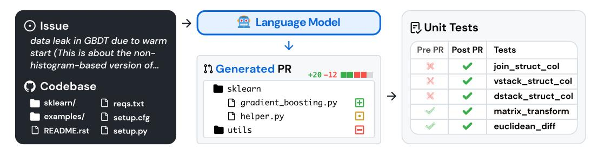
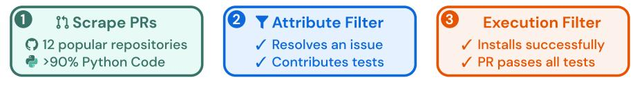
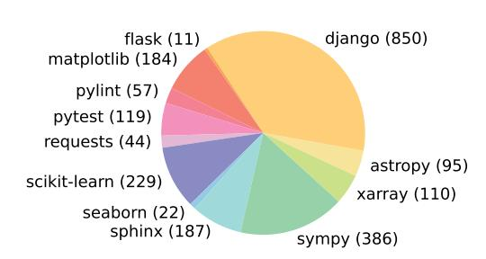
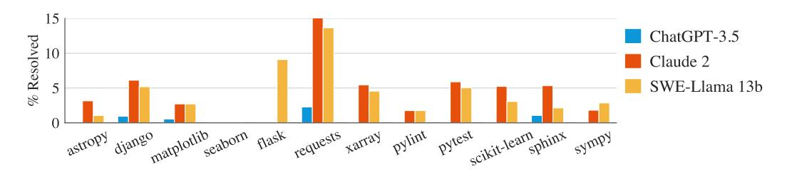
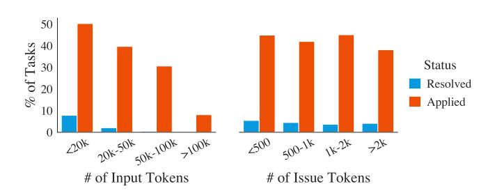
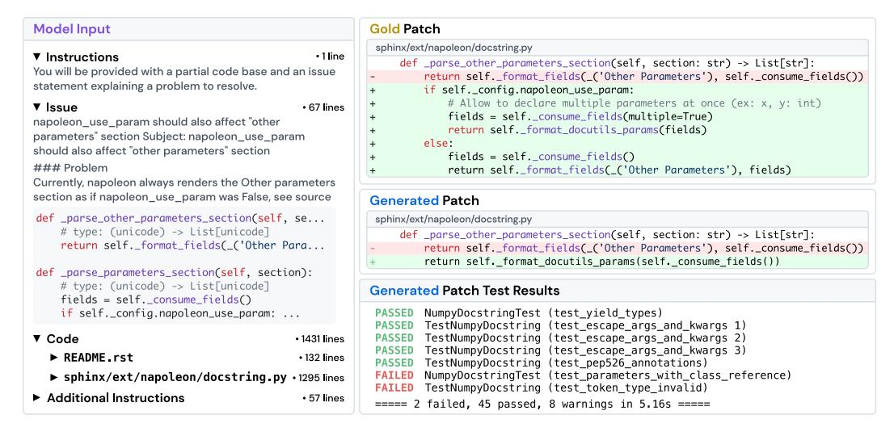

# SWE-BENCH: CAN LANGUAGE MODELS RESOLVE REAL-WORLD GITHUB ISSUES?

Carlos E. Jimenez\* 1,2 John Yang\* 1,2 Alexander Wettig1,2 Shunyu Yao1,2 Kexin Pei3 Ofir Press1,2 Karthik Narasimhan1,2

# ABSTRACT

Language models have outpaced our ability to evaluate them effectively, but for their future development it is essential to study the frontier of their capabilities. We find real-world software engineering to be a rich, sustainable, and challenging testbed for evaluating the next generation of language models. To this end, we introduce SWE-bench, an evaluation framework consisting of 2,294 software engineering problems drawn from real GitHub issues and corresponding pull requests across 12 popular Python repositories. Given a codebase along with a description of an issue to be resolved, a language model is tasked with editing the codebase to address the issue. Resolving issues in SWE-bench frequently requires understanding and coordinating changes across multiple functions, classes, and even files simultaneously, calling for models to interact with execution environments, process extremely long contexts and perform complex reasoning that goes far beyond traditional code generation tasks. Our evaluations show that both state-ofthe-art proprietary models and our fine-tuned model SWE-Llama can resolve only the simplest issues. The best-performing model, Claude 2, is able to solve a mere 1.96% of the issues. Advances on SWE-bench represent steps towards LMs that are more practical, intelligent, and autonomous.

# 1 INTRODUCTION

Language models (LMs) are rapidly being deployed in commercial products such as chatbots and coding assistants. At the same time, existing benchmarks have become saturated [\(Kiela et al.,](#page-12-0) [2021;](#page-12-0) [Ott et al.,](#page-13-0) [2022\)](#page-13-0) and fail to capture the frontier of what state-of-the-art LMs can and cannot do. There is a need for challenging benchmarks that more accurately reflect real-world applications of LMs to help shape their future development and usage [\(Srivastava et al.,](#page-13-1) [2023\)](#page-13-1).

Figure 1: SWE-bench sources task instances from real-world Python repositories by connecting GitHub issues to merged pull request solutions that resolve related tests. Provided with the issue text and a codebase snapshot, models generate a patch that is evaluated against real tests.

Building a good benchmark is difficult since tasks must be challenging enough to stump existing models, but model predictions must also be easy to verify [\(Mart´ınez-Plumed et al.,](#page-13-2) [2021\)](#page-13-2). Coding

1Princeton University 2Princeton Language and Intelligence 3University of Chicago

∗Equal contribution. Correspondence to [carlosej@princeton.edu](mailto:carlosej@princeton.edu), [johnby@stanford.edu](mailto:johnby@stanford.edu). Data, code, and leaderboard at [swebench.com](https://swebench.com)

tasks are appealing as they pose challenging problems to LMs yet generated solutions can be easily verified by running unit tests. However, existing coding benchmarks, such as HumanEval [\(Chen](#page-11-0) [et al.,](#page-11-0) [2021\)](#page-11-0), mostly involve self-contained problems that can be solved in a few lines of code.

In the real world, software engineering is not as simple. Fixing a bug might involve navigating a large repository, understanding the interplay between functions in different files, or spotting a small error in convoluted code. Inspired by this, we introduce SWE-bench, a benchmark that evaluates LMs in a realistic software engineering setting. As shown in Figure [1,](#page-0-0) models are tasked to resolve issues (typically a bug report or a feature request) submitted to popular GitHub repositories. Each task requires generating a patch describing changes to apply to the existing codebase. The revised codebase is then evaluated using the repository's testing framework.

SWE-bench offers several advantages over existing LM programming benchmarks. These include, a realistic setting that utilizes user-submitted issues and solutions, diverse inputs featuring unique code problems from 12 repositories, a robust framework for execution-based evaluation, and the ability to continuously update the benchmark with new instances, requiring minimal human intervention.

We evaluate multiple state-of-the-art LMs on SWE-bench and find that they fail to solve all except the simplest issues. Using a BM25 retriever, Claude 2 is only able to resolve 1.96% of the issues.

In addition to SWE-bench our contributions include the release of a training dataset, SWE-benchtrain, which is essential for advancing open model development in this challenging domain. This dataset comprises a collection of 19,000 non-testing task instances derived from 37 repositories. Utilizing SWE-bench-train, we release two fine-tuned models, SWE-Llama 7b and 13b, based on the CodeLlama [\(Roziere et al.](#page-13-3) ` , [2023\)](#page-13-3) model. We find that in some settings SWE-Llama 13b is competitive with Claude 2 and is capable of processing contexts exceeding 100,000 tokens.

# 2 SWE-BENCH

SWE-bench is a benchmark featuring GitHub *issues* from popular repositories that report bugs or request new features, and *pull requests* that make changes to the repository to resolve these issues. The task is to generate a pull request that addresses a given issue and passes tests related to the issue.

### 2.1 BENCHMARK CONSTRUCTION

GitHub is a rich data source for software development, but repositories, issues, and pull requests can be noisy, ad-hoc, or poorly documented or maintained. To find high-quality task instances at scale, we use a 3-stage pipeline as follows.

Figure 2: SWE-bench task instances are created from merged pull requests that resolve an issue, contributes tests, and install successfully.

Stage I: Repo selection and data scraping. We start by collecting pull requests (PRs) from 12 popular open-source Python repositories on GitHub, producing about ∼ 90,000 PRs in total. We focus on popular repositories as they tend be better maintained, have clear contributor guidelines, and have better test coverage. Each PR has an associated codebase specified by it's base commit.

Stage II: Attribute-based filtering. We create candidate tasks by selecting the *merged* PRs that (1) resolve a GitHub issue and (2) make changes to the test files of the repository, which indicates that the user likely contributed tests to check whether the issue has been resolved.

Stage III: Execution-based filtering. For each candidate task, we apply the PR's test content, and log the associated test results *before* and *after* the PR's other content is applied. We filter out task instances without at least one test where its status changes from a *fail* to *pass* (henceforth referred to as *fail-to-pass* test). We also filter out instances that result in installation or runtime errors.

Through these stages of filtering, the original 90,000 PRs are filtered down to the 2,294 task instances which comprise SWE-bench. A final breakdown of these task instances across repositories is presented in Figure [3,](#page-3-0) and Table [1](#page-3-0) highlights the key features of SWE-bench task instances. We highlight that the codebases are large with thousands of files, and the reference pull requests often make changes to multiple files at once. Technical details about SWE-bench's construction pipeline are discussed in Appendix [A.](#page-15-0) Additional dataset statistics are in Appendix [A.5.](#page-20-0)

# 2.2 TASK FORMULATION

Model input. A model is given an issue text description and a complete codebase. The model is then tasked to make an edit to the codebase to resolve the issue. In practice, we represent edits as patch files, which specify which lines in the codebase to modify in order to resolve the issue.

Evaluation metrics. To evaluate a proposed solution, we apply the generated patch, using unix's patch program, to the codebase and then execute the unit and system tests associated with the task instance. If the patch applies successfully and all of these tests pass we consider the proposed solution to have successfully resolved the issue. The metric for our benchmark is the percentage of task instances that are resolved. Additional technical details in Appendix [A.4.](#page-19-0)

### 2.3 FEATURES OF SWE-BENCH

Traditional benchmarks in NLP typically involve only short input and output sequences and consider somewhat "contrived" problems created specifically for the benchmark. In contrast, SWE-bench's realistic construction setting imbues the dataset with unique properties, which we discuss below.

Real-world software engineering tasks. Since each task instance in SWE-bench consists of a large and complex codebase and a description of a relevant issue, solving SWE-bench requires demonstrating sophisticated skills and knowledge possessed by experienced software engineers but are not commonly evaluated in traditional code generation benchmarks.

Continually updatable. Our collection process can be easily applied to any Python repository on GitHub and requires minimal human intervention. Therefore, we can extend SWE-bench with a continual supply of new task instances and evaluate LMs on issues created after their training date, which ensures that the solution was not included in their training corpus.

Diverse long inputs. Issue descriptions are typically long and detailed (195 words on average), and codebases regularly contain many thousands of files. Solving SWE-bench requires identifying the relatively small number of lines that need to be edited to solve an issue amongst a sea of context.

Robust evaluation. For each task instance, there is at least one *fail-to-pass* test which was used to test the reference solution, and 40% of instances have at least two fail-to-pass tests. These tests evaluate whether the model addressed the problem in the issue. In addition, a median of 51 additional tests run to check whether prior functionality is properly maintained.

Cross-context code editing. Unlike prior settings that may constrain edit scope to an individual function or class (e.g., [Chen et al.,](#page-11-0) [2021;](#page-11-0) [Cassano et al.,](#page-11-1) [2022\)](#page-11-1) or provide *cloze*-style fill-in blanks (e.g., [Lu et al.,](#page-13-4) [2021;](#page-13-4) [Fried et al.,](#page-11-2) [2023\)](#page-11-2), SWE-bench does not provide such explicit guidance. Rather than merely having to produce a short code snippet, our benchmark challenges models to generate revisions in multiple locations of a large codebase. SWE-bench's reference solutions average editing 1.7 files, 3.0 functions, and 32.8 lines (added or removed).

Wide scope for possible solutions. The task of repository-scale code editing can serve as a level playing field to compare approaches ranging from retrieval and long-context models to decisionmaking agents, which could reason and act in code. SWE-bench also allows creative freedom, as models can generate novel solutions that may deviate from the reference PR.

# 2.4 SWE-BENCH LITE

Evaluating LMs on SWE-bench can be time-consuming and, depending on the model, require a costly amount of compute or API credits. Given that initial performance returns as presented in Section [5](#page-5-0) are quite low, SWE-bench's difficulty makes it useful for gauging LM progress in the long term, but potentially intimidating for initial systems that attempt to make progress in the short term.

Figure 3: Distribution of SWE-bench tasks (in parenthesis) across 12 open source GitHub repositories that each contains the source code for a popular, widely downloaded PyPI package.

Table 1: Average and maximum numbers characterizing different attributes of a SWE-bench task instance. Statistics are micro-averages calculated without grouping by repository.

|            |                    | Mean  | Max   |
|------------|--------------------|-------|-------|
| Issue Text | Length (Words)     | 195.1 | 4477  |
| Codebase   | # Files (non-test) | 3,010 | 5,890 |
|            | # Lines (non-test) | 438K  | 886K  |
| Gold Patch | # Lines edited     | 32.8  | 5888  |
|            | # Files edited     | 1.7   | 31    |
|            | # Func. edited     | 3     | 36    |
| Tests      | # Fail to Pass     | 9.1   | 1633  |
|            | # Total            | 120.8 | 9459  |

To encourage adoption of SWE-bench, we create a Lite subset of 300 instances from SWE-bench that have been sampled to be more self-contained, with a focus on evaluating functional bug fixes. The full filtering criteria and dataset information is included in SWE-bench Lite covers 11 of the original 12 repositories, with a similar diversity and distribution of task instances across repositories as the original. Full details of the Lite split and filtering details are included in Appendix [A.7.](#page-24-0)

# 3 SWE-LLAMA: FINE-TUNING CODELLAMA FOR SWE-BENCH

It is important to benchmark the performance of open models on SWE-bench alongside proprietary models. At the time of writing, only the CodeLlama models [\(Roziere et al.](#page-13-3) ` , [2023\)](#page-13-3) are able to handle the very long contexts necessary. However, we observe that the off-the-shelf CodeLlama variants are not capable of following the detailed instructions to generate repository-wide code edits, and typically output placeholder responses or unrelated code. To better evaluate the capabilities of these models, we perform supervised fine-tuning on the 7 billion- and 13 billion-parameter CodeLlama-Python models. The resulting models are specialized repository editors that can run on consumer hardware and resolve GitHub issues.

Training data. We follow our data collection procedure and collect 19,000 issue-PR pairs from an additional 37 popular Python package repositories. In contrast to Section [2.1,](#page-1-0) we do not require that pull requests contribute test changes. This allows us to create a much larger training set to use for supervised fine-tuning. To eliminate the risk of data contamination, the set of repositories in the training data is disjoint from those included in the evaluation benchmark.

Training details. Given the instructions, an issue text from GitHub and the relevant code files as the prompt, we finetune SWE-Llama to generate the patch that solved the given issue (the "gold patch"). For memory efficiency, we fine-tune only the weights of the attention sublayer using LoRA [Hu et al.](#page-12-1) [\(2022\)](#page-12-1), and exclude training sequences with more than 30,000 tokens, reducing the effective size of the training corpus to 10,000 instances. More details are provided in Appendix [B.](#page-24-1)

# 4 EXPERIMENTAL SETUP

In this section we explain how inputs are constructed to run SWE-bench evaluation. In addition, we review the models that we evaluate in this work.

### 4.1 RETRIEVAL-BASED APPROACH

SWE-bench instances provide an issue description and a codebase as input to the model. While issues descriptions are usually short (195 words on average as shown in Table [1\)](#page-3-0), codebases consist of many more tokens (438K lines on average) than can typically be fit into an LMs context window. Then the question remains of exactly how to choose the relevant context to provide to the model?

To address this issue for our baselines, we simply use a generic retrieval system to select the files to insert as context. In particular, we evaluate models under two relevant context settings: 1) sparse retrieval and 2) an oracle retrieval.

Sparse retrieval. Dense retrieval methods are ill-suited to our setting due to very long key and query lengths, and especially the unusual setting of retrieving code documents with natural language queries. Therefore, we choose to use BM25 retrieval [\(Robertson et al.,](#page-13-5) [2009\)](#page-13-5) to retrieve relevant files to provide as context for each task instance. We experiment with three different maximum context limits, and simply retrieve as many files as fits within the specified limit. We evaluate each model on all limits that fit within its context window and report the best performance. From observation, models perform best on the shortest context window, as shown in Table [2.](#page-4-0)

"Oracle" retrieval. For analysis purposes we also consider a setting where we "retrieve" the files edited by the reference patch that solved the issue on GitHub. This "oracle" setting is less realistic, since an engineer working on addressing an issue may not know a priori which files need to be modified. In addition, this setting is also not necessarily comprehensive since edited files alone may not include all the required context to understand exactly how software will behave when interacting with unseen parts of the code.

We compare the BM25 retrieval results with those of the "oracle" retrieval setting, as shown in Table [3.](#page-4-0) We observe that in approximately 40% of instances, BM25 retrieves a superset of the oracle files for the 27,000-token context limit. However, in almost half of the instances with the 27,000-token limit, it retrieves none of the files from the "oracle" context.

### 4.2 INPUT FORMAT

Once the retrieved files are selected using one of the two methods above, we construct the input to the model consisting of task instructions, the issue text, retrieved files and documentation, and finally an example patch file and prompt for generating the patch file. Examples of instances and further details on this formulation are provided in Appendix [D.](#page-29-0)

# 4.3 MODELS

Due to the need to process long sequence lengths, there are only a few models that are currently suitable for SWE-bench. Thus we evaluate ChatGPT-3.5 (gpt-3.5-turbo-16k-0613), GPT-4 (gpt-4-32k-0613), Claude 2, and SWE-Llama with their context limits shown in Table [4.](#page-4-1)

Table 2: Model resolve rates with BM25 retrieval, with different maximum context lengths.

Table 3: BM25 recall with respect to oracle files for different maximum context lengths.

|               | Max. Content |      |      | BM25 Recall |       |       |       |
|---------------|--------------|------|------|-------------|-------|-------|-------|
| Model         | 13k          | 27k  | 50k  |             | 13k   | 27k   | 50k   |
| Claude 2      | 1.96         | 1.87 | 1.22 | Avg.        | 29.58 | 44.41 | 51.06 |
| SWE-Llama 7b  | 0.70         | 0.31 | 0.00 | All         | 26.09 | 39.83 | 45.90 |
| SWE-Llama 13b | 0.70         | 0.48 | 0.00 | Any         | 34.77 | 51.27 | 58.38 |

Table 4: We compare the different context lengths and proportion of the "oracle" retrieval setting covered. Models with shorter context lengths are thus inherently disadvantaged. Note that descriptions of token-lengths is a relative non-standard measure (e.g. Llama-tokenized sequences are 42% longer on average than the equivalent sequence tokenized for GPT-4).

|                | ChatGPT-3.5 | GPT-4  | Claude 2 | SWE-Llama |
|----------------|-------------|--------|----------|-----------|
| Max. Tokens    | 16,385      | 32,768 | 100,000  | ≥100,000  |
| % of Instances | 58.1%       | 84.1%  | 96.4%    | ≥94.8%    |

|               | SWE-b      | ench    | SWE-bench Lite |         |  |
|---------------|------------|---------|----------------|---------|--|
| Model         | % Resolved | % Apply | % Resolved     | % Apply |  |
| Claude 3 Opus | 3.79       | 46.56   | 4.33           | 51.67   |  |
| Claude 2      | 1.97       | 43.07   | 3.00           | 33.00   |  |
| ChatGPT-3.5   | 0.17       | 26.33   | 0.33           | 10.00   |  |
| GPT-4-turbo   | 1.31       | 26.90   | 2.67           | 29.67   |  |
| SWE-Llama 7b  | 0.70       | 51.74   | 1.33           | 38.00   |  |
| SWE-Llama 13b | 0.70       | 53.62   | 1.00           | 38.00   |  |

Table 5: We compare models against each other using the BM25 retriever as described in Section 4.

Figure 4: Resolution rate for three models across the 12 repositories represented in SWE-bench in the "Oracle" retrieval setting.

### 5 RESULTS

We report results for models using different retrieval mechanisms and prompting styles, then provide some analysis and insight into model performance and difficulty. We summarize models' performance using BM25 retrieval in Table 5. Across the board, models struggle significantly to resolve issues. The best performing model, Claude 2, is only able to resolve 1.96% of the issues.

To analyze the importance of the retriever to the overall system results, we present the "oracle" retrieval results in Appendix Table 18. There, Claude 2 is able to resolve 4.8% of issues using the "oracle" retriever. We further analyze the importance of context in the discussion below.

**Difficulty differs across repositories.** When breaking performance down by repository, all models trend similarly across different repositories as show in Figure 4. Despite this, the issues resolved by each model do not necessarily overlap extensively. For example, in the "oracle" setting Claude 2 and SWE-Llama 13b perform comparably, with each model resolving 110 and 91 instances respectively. Yet of these instances, Claude 2 only solves 42% of the instances solved by SWE-Llama.

This may also be related to the presence of images in issues, which can be encoded into the issue markdown with embedded image links (i.e. ![image][https://...]). Some repositories naturally feature more instances with images; for example 32% of matplotlib and 10% of seaborn instances contain embedded images in their issue text compared to just 2% of all instances. Solving these instances may require multi-modal LMs or some kind of external tool use to process images.

Difficulty correlates with context length. Chat models may be pre-trained on long sequences of code but are typically asked to generate shorter coder snippets with limited context provided to frame the question. As shown in Figure 5, we see that as total context length increases, Claude 2's performance drops considerably; behavior that is also observed in other models. In our evaluation settings, models see a lot of code that may not be directly related to solving the issue at hand, and they seem to frequently struggle with localizing problematic code needing to be updated. This result corroborates other studies showing that models become distracted by additional context and may be sensitive to the relative location of target sequences (Liu et al., 2023b). Even when increasing the maximum context size for BM25 would increase recall with respect to the oracle files, performance drops, as shown in Table 2, as models are simply ineffective at localizing problematic code.

Further investigating this, we provide an input ablation on the "oracle" retrieval context, "oracle"-collapsed, where retrieved files are collapsed entirely, except for the lines actually edited by the

Figure 5: We compare the performance of Claude 2 on tasks partitioned by total input length and by only the issue length.

Table 6: We show the results for the "Oracle"-collapsed retrieval setting, which uses oracle files but collapses code that isn't directly modified by the PR  $\pm 15$  lines.

| Model         | "Oracle"-collapsed |         |  |  |
|---------------|--------------------|---------|--|--|
| Wodel         | Resolved           | Applied |  |  |
| Claude 3 Opus | 9.39               | 48.00   |  |  |
| Claude 2      | 5.93               | 68.18   |  |  |
| GPT-4         | 3.40               | 48.65   |  |  |
| ChatGPT-3.5   | 1.09               | 40.93   |  |  |

true pull request (with  $\pm 15$  lines of buffer) shown in Table 6. In this setting, we see increases in performance, with GPT-4 jumping from 1.3% to 3.4% and Claude 2 from 4.8% to 5.9%.

**Difficulty does not correlate with issue resolution date.** In Table 7 we show model results in the "oracle" retrieval setting, partitioned by date, for PRs created before or after 2023. We find that for most models there's little difference in performance before or after this date, with the exception of GPT-4. We consider this result to be largely promising as it suggests that despite models having been exposed to some version of an repository's codebase, they are unlikely to "cheat" to address issues simply by generating a more recent version of the repository.

Table 7: We compare performance on task instances from before and after 2023 in the "Oracle" retrieval setting. Most models show little difference in performance. \*Due to budget constraints, GPT-4 is evaluated on a 25% random subset of SWE-bench tasks, which may impact performance.

|                           | Claude 2         | ChatGPT-3.5         | GPT-4*          | SWE-Llama 7b        | SWE-Llama 13b       |
|---------------------------|------------------|---------------------|-----------------|---------------------|---------------------|
| Before 2023 After 2023 | <b>4.87</b> 4.23 | 0.49 <b>0.77</b> | <b>1.96</b> 0.0 | 2.95 <b>3.46</b> | <b>3.98</b> 3.85 |

**Finetuned models are sensitive to context distribution shifts.** The finetuned models SWE-Llama 7b and 13b perform surprisingly poorly with BM25 retrieved context. As these models were finetuned using the "oracle" retrieval as context, we suspect this shift in context makes it difficult for the model to perform reliably. For instance, SWE-Llama was trained to edit every file included as context whereas in the BM25 setting many files provided in context are not expected to be changed.

Generating patches is easier than generating whole files. Models are often trained using standard code files and likely rarely see patch files. We generally formulate our task to have models generate patch files as opposed to recreating the entire file with their proposed change, since patch files will usually be a much more efficient representation of a file change. As shown in Table 5, we observe that models still struggle with generating well-formatted patch files. So we experiment with asking models to instead regenerate entire files with their proposed changes to resolve the issue. In this setting, we find that models generally perform worse at this task than when generating patch files; for instance, Claude 2 scores at 2.2% compared to 4.8% in the main table for "oracle" retrieval. Even when controlling for instance length, generating on the shorter half of the task instances by input tokens yields 3.9% compared to 7.8% for generating patches with Claude 2.

Language models tend to generate shorter, simpler edits. Model generated patch files tend to add and remove fewer lines than their respective gold patch. As shown in Table 8, compared to an average gold patch, model generated patch files that apply correctly are less than half the total length (74.5 versus 30.1 lines) of gold edit patch files, and rarely edit more than a single file.

#### 5.1 A QUALITATIVE ANALYSIS OF SWE-LLAMA GENERATIONS

We select 11 generations from SWE-Llama and Claude 2 to better understand the quality of the task and generated patches under the "oracle" retrieval setting. Here we discuss an example from SWE-Llama and our overall findings, with in-depth analyses for other examples shown in Appendix F.

Table 8: Average edits of model generated patches in the "oracle" retrieval setting across successfully applied patches. For the task instances specific to each model, we calculate the same statistics across the gold patches. Avg Gold shows statistics macro-averaged over each models' respective gold patches. All Gold shows statistics for all gold patches unconditioned on model performance.

| Model         | Total Lines | Added | Removed | Functions | Files |
|---------------|-------------|-------|---------|-----------|-------|
| Claude 2      | 19.6        | 4.2   | 1.9     | 1.1       | 1.0   |
| Gold          | 44.1        | 12.0  | 5.8     | 2.1       | 1.2   |
| ChatGPT-3.5   | 30.1        | 3.8   | 2.7     | 1.6       | 1.0   |
| Gold          | 39.6        | 9.5   | 6.1     | 1.9       | 1.2   |
| GPT-4         | 20.9        | 4.4   | 1.5     | 1.0       | 1.0   |
| Gold          | 33.6        | 8.4   | 3.8     | 1.9       | 1.1   |
| SWE-Llama 13b | 17.6        | 1.6   | 1.2     | 1.2       | 1.1   |
| Gold          | 37.8        | 10.0  | 4.4     | 1.9       | 1.1   |
| SWE-Llama 7b  | 16.7        | 1.3   | 1.2     | 1.2       | 1.1   |
| Gold          | 40.2        | 11.3  | 4.9     | 1.9       | 1.1   |
| Avg Gold      | 39.1        | 10.2  | 5.0     | 1.9       | 1.1   |
| All Gold      | 74.5        | 22.3  | 10.5    | 3.0       | 1.7   |

Figure 6: We show an example of an formatted task instance, a model prediction, and the testing framework logs. In the patches, red highlights are deletions. Green highlights are additions.

We'll consider the task instance <code>sphinx-doc\_sphinx-8713</code> from the Sphinx documentation generator, shown in Figure 6. The issue states that the <code>napoleon</code> extension of Sphinx is not properly formatting the documentation keyword "Other Parameters" when the config setting <code>napoleon.use\_param</code> is set to <code>True</code>. The issue text further provides a detailed code snippet of where the problematic source code is suspected to be, as well as some code examples for reproducing the error and additional information related to package versions. For this particular instance, the model did not resolve the task, failing to pass some of the tests resolved by the gold solution.

In the "oracle" retrieval setting, the model input provides this issue text along with some instructions, the full contents of files edited by the gold patch, and an example of the diff format we expect the answer to be in. The total model input consists of 1,558 lines of context or 20,882 tokens. When comparing the gold patch and the model's patch, we find an obvious mistake. While the model edits the correct function, <code>\_parse\_other\_parameters\_section</code> at line 684 in <code>sphinx/ext/napoleon/docstring.py</code>, it changes the function to behave as if <code>\_napoleon.use\_parameters</code> were always True instead of checking the config setting first and copying what the <code>parse\_parameters\_section</code> does, like the gold patch. In the tests, <code>test\_parameters</code>

\_with\_class\_reference directly compares the documentation produced using a config where napoleon\_use\_param is set to False, which catches the model's error immediately.

Comparing results across all the examples we consider, we notice a few prominent trends in behavior. Models tend to write primitive Python code and do not leverage existing third-party libraries or the rest of the codebase for their solutions. Models' generations also reflect a "greedy" approach of solving the problem *exactly*, with little regard for code style or logical constraints that might be reflected by the codebase (i.e. using relative instead of absolute imports). In contrast, we observe that many gold patches will make structural improvements that cover a much larger scope of the codebase; these edits not only resolve the issue, but also anticipate and solve potential future issues.

# 6 RELATED WORK

Evaluation of LMs. Several recent works for evaluating LMs have either proposed a collection of mutually distinct tasks spanning across multiple domains [\(Hendrycks et al.,](#page-12-2) [2021;](#page-12-2) [Liang et al.,](#page-12-3) [2022;](#page-12-3) [Srivastava et al.,](#page-13-1) [2023\)](#page-13-1) or turned to the web as an interactive setting featuring tasks that require multiple steps to solve [\(Yao et al.,](#page-14-0) [2022;](#page-14-0) [Zhou et al.,](#page-14-1) [2023;](#page-14-1) [Deng et al.,](#page-11-3) [2023;](#page-11-3) [Liu et al.,](#page-13-7) [2023d\)](#page-13-7). There are several drawbacks with such a "potpourri" style setup. First, each task tends to narrowly focus on one or a few skills, resulting in challenges that are typically too simple, pigeonhole the model into a reduced role, and do not provide models with the bandwidth to exercise their versatility or potentially demonstrate new abilities [\(Srivastava et al.,](#page-13-1) [2023\)](#page-13-1). Consequently, a model's performance on such task conglomerations may not yield actionable, deep insights regarding its capabilities and how to improve them [\(Schlangen,](#page-13-8) [2019;](#page-13-8) [Mart´ınez-Plumed et al.,](#page-13-2) [2021;](#page-13-2) [Bowman & Dahl,](#page-11-4) [2021\)](#page-11-4). SWEbench addresses these shortcomings, as our work demonstrates that it is significantly challenging, presents a wide range of possibilities for improving LMs to solve this task, and is easy to refresh over time with new task instances, each of which introduce novel, nuanced, and practical challenges.

Code Generation Benchmarks. HumanEval [\(Chen et al.,](#page-11-0) [2021\)](#page-11-0) is the current standard in a longstanding pursuit of synthesizing code from natural language descriptions [\(Yu et al.,](#page-14-2) [2018;](#page-14-2) [Austin](#page-11-5) [et al.,](#page-11-5) [2021;](#page-11-5) [Hendrycks et al.,](#page-12-2) [2021;](#page-12-2) [Li et al.,](#page-12-4) [2022a;](#page-12-4) [Zan et al.,](#page-14-3) [2023\)](#page-14-3). In the past year, subsequent benchmarks have sought to augment HumanEval with extensions to different languages [\(Cassano](#page-11-1) [et al.,](#page-11-1) [2022;](#page-11-1) [Athiwaratkun et al.,](#page-11-6) [2023;](#page-11-6) [Orlanski et al.,](#page-13-9) [2023\)](#page-13-9), variations in edit scope [\(Yu et al.,](#page-14-4) [2023;](#page-14-4) [Du et al.,](#page-11-7) [2023\)](#page-11-7), similar but novel code completion tasks [\(Muennighoff et al.,](#page-13-10) [2023\)](#page-13-10), and more testing [\(Liu et al.,](#page-13-11) [2023a\)](#page-13-11). Simultaneously, separate works have sought to introduce new coding paradigms [\(Yin et al.,](#page-14-5) [2022;](#page-14-5) [Yang et al.,](#page-14-6) [2023\)](#page-14-6) or design library-specific problems [\(Lai et al.,](#page-12-5) [2022;](#page-12-5) [Zan et al.,](#page-14-7) [2022\)](#page-14-7). Instead of partitioning problems into siloed datasets and curtailing them for simplicity's sake, SWE-bench's collection procedure transforms the source code with minimal post-processing, preserving a much broader set of challenges grounded in real-world software engineering beyond closed form completion, such as patch generation, reasoning over long contexts, navigating a codebase directory, and capturing dependency-based relationships across modules.

ML for Software Engineering. To overcome traditional program analysis techniques that may not scale or incorporate natural language, one direction of current software engineering research is to use neural networks, including LMs, to automate real-world software development processes [\(Ma](#page-13-12)[niatis et al.,](#page-13-12) [2023;](#page-13-12) [Zheng et al.,](#page-14-8) [2023;](#page-14-8) [Hou et al.,](#page-12-6) [2023\)](#page-12-6). Use cases include automating commit generation [\(Jung,](#page-12-7) [2021;](#page-12-7) [Liu et al.,](#page-13-13) [2023c\)](#page-13-13), PR review [\(Yang et al.,](#page-14-9) [2016;](#page-14-9) [Li et al.,](#page-12-8) [2022b;](#page-12-8) [Tufano](#page-13-14) [et al.,](#page-13-14) [2021\)](#page-13-14), bug localization [\(Kim et al.,](#page-12-9) [2019;](#page-12-9) [Chakraborty et al.,](#page-11-8) [2018\)](#page-11-8), testing [\(Kang et al.,](#page-12-10) [2023;](#page-12-10) [Xia et al.,](#page-14-10) [2023;](#page-14-10) [Wang et al.,](#page-14-11) [2023\)](#page-14-11), and program repair [\(Gupta et al.,](#page-11-9) [2017;](#page-11-9) [Allamanis et al.,](#page-11-10) [2017;](#page-11-10) [Monperrus,](#page-13-15) [2018;](#page-13-15) [Jiang et al.,](#page-12-11) [2018;](#page-12-11) [Goues et al.,](#page-11-11) [2019;](#page-11-11) [Gao et al.,](#page-11-12) [2022;](#page-11-12) [Dinh et al.,](#page-11-13) [2023;](#page-11-13) [Motwani](#page-13-16) [& Brun,](#page-13-16) [2023\)](#page-13-16). Most relevant to SWE-bench are works that have sought to apply LMs towards automated program repair [\(Xia & Zhang,](#page-14-12) [2022;](#page-14-12) [2023;](#page-14-13) [Fan et al.,](#page-11-14) [2023;](#page-11-14) [Sobania et al.,](#page-13-17) [2023\)](#page-13-17), guiding code editing with commits [\(Chakraborty & Ray,](#page-11-15) [2021;](#page-11-15) [Zhang et al.,](#page-14-14) [2022;](#page-14-14) [Fakhoury et al.,](#page-11-16) [2023\)](#page-11-16). However, none of the existing datasets [\(Just et al.,](#page-12-12) [2014;](#page-12-12) [Karampatsis & Sutton,](#page-12-13) [2019\)](#page-12-13) present code context at the scale of SWE-bench. Moreover, SWE-bench can be easily extended to new programming languages and repositories, and it provides a significantly more realistic and challenging arena to carry out experiments towards augmenting LMs with software engineering tools and practices.

# 7 DISCUSSION

Limitations and future directions. SWE-bench task instances are all in Python; we hope to apply SWE-bench's task instance collection procedure to expand its coverage to more programming languages and domains. Second, our experiments aim to establish a baseline of the simplest and most straight-forward approaches for this task; we do not intend to constrain future methodologies to the same type of approach and encourage future work to investigate different methods (e.g., agent-based approaches, tool augmented LMs).

Lastly, while this work evaluates models using execution-based code testing, relying solely on this method is insufficient to guarantee reliable performance of model generations, as we find automated code generations from LMs can frequently be less comprehensive, efficient, or readable compared to human-written solutions.

Conclusion. The complexity of real-world software development processes extends far beyond just code completion. By drawing on the open-source collaborative pipeline, SWE-bench creates a faithful mirror of real world coding environments. This more realistic environment encourages creative solutions that can have immediate applicability in open-source software development. We hope that this benchmark and our other contributions can serve as valuable assets in the future development of LMs that are more practical, intelligent, and autonomous.