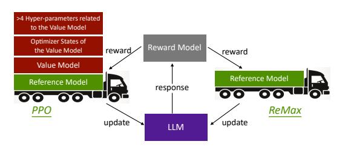
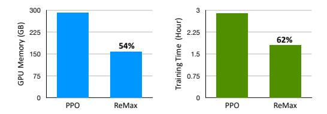
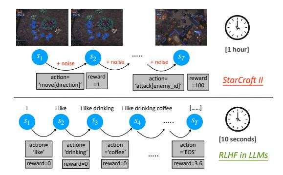
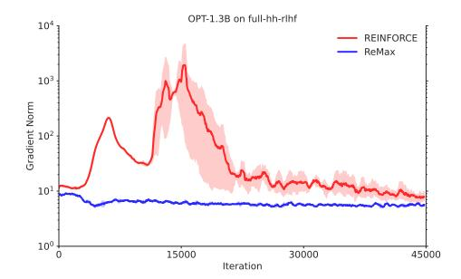
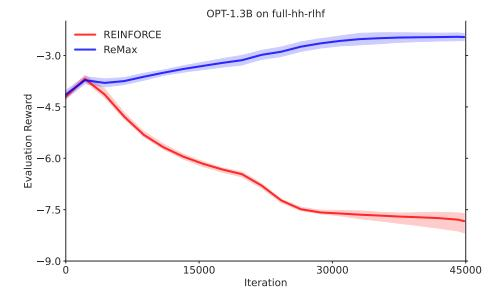
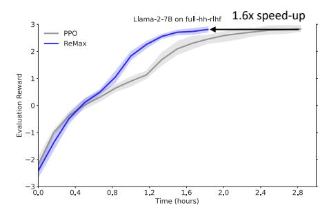
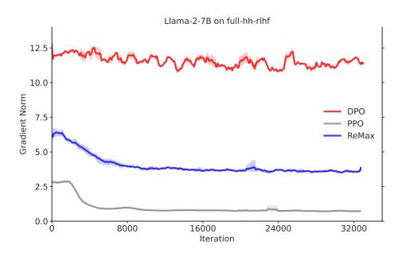
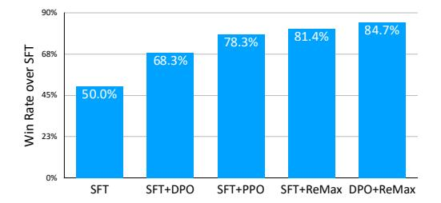

# ReMax: A Simple, Effective, and Efficient Reinforcement Learning Method for Aligning Large Language Models

Ziniu Li 12 Tian Xu 34 Yushun Zhang 12 Zhihang Lin 1 Yang Yu 345† Ruoyu Sun 162† Zhi-Quan Luo 12

## **Abstract**

Reinforcement Learning from Human Feedback (RLHF) is key to aligning Large Language Models (LLMs), typically paired with the Proximal Policy Optimization (PPO) algorithm. While PPO is a powerful method designed for general reinforcement learning tasks, it is overly sophisticated for LLMs, leading to laborious hyper-parameter tuning and significant computation burdens. To make RLHF efficient, we present ReMax, which leverages 3 properties of RLHF: fast simulation, deterministic transitions, and trajectory-level rewards. These properties are *not* exploited in PPO, making it less suitable for RLHF. Building on the renowned REINFORCE algorithm, ReMax does not require training an additional value model as in PPO and is further enhanced with a new variance reduction technique. ReMax offers several benefits over PPO: it is simpler to implement, eliminates more than 4 hyper-parameters in PPO, reduces GPU memory usage, and shortens training time. ReMax can save about 46% GPU memory than PPO when training a 7B model and enables training on A800-80GB GPUs without the memory-saving offloading technique needed by PPO. Applying ReMax to a Mistral-7B model resulted in a 94.78% win rate on the AlpacaEval leaderboard and a 7.739 score on MT-bench, setting a new SOTA for open-source 7B models. These results show the effectiveness of ReMax while addressing the limitations of PPO in LLMs.

Proceedings of the 41<sup>st</sup> International Conference on Machine Learning, Vienna, Austria. PMLR 235, 2024. Copyright 2024 by the author(s).

<span id="page-0-0"></span>

Figure 1. Building blocks of PPO and ReMax. ReMax keeps the reference model (for calculating KL penalty) and removes all the components related to the value model in PPO.

#### 1. Introduction

Alignment is crucial for instructing Large Language Models (LLMs) to adhere to human preferences. Two approaches are commonly employed for this purpose: instruction tuning (Wei et al., 2022; Chung et al., 2022; Longpre et al., 2023) and Reinforcement Learning from Human Feedback (RLHF) (Christiano et al., 2017; Stiennon et al., 2020; Ouyang et al., 2022; Bai et al., 2022b;a). The former approach relies on a large amount of pre-prepared humanannotated data, necessitating practitioners to determine LLM behavior upfront, which can be laborious. In contrast, RLHF, the latter approach, does not require pre-defining everything. In a nutshell, RLHF reformulates the text generation task as a sequential decision-making problem and applies Reinforcement Learning (RL) algorithms to solve it. The effectiveness of RLHF is emphasized in the GPT-4 technical report (OpenAI, 2023).

Despite its notable success, the wide application of RLHF is hindered by its heavy computation burden (Yao et al., 2023). We recap that RLHF unfolds in three principal steps:

- **Step 1 (SFT):** supervised fine-tuning of a LLM is carried out to find a good initialization.
- Step 2 (RM): a reward model is learned from human preference data.
- **Step 3 (RL):** a LLM is fine-tuned on prompt-only datasets utilizing an RL algorithm.

The challenge arises in the third RL step, where the LLM must generate and enhance its responses to achieve high

<sup>&</sup>lt;sup>†</sup> Corresponding authors. <sup>1</sup>School of Data Science, The Chinese University of Hong Kong, Shenzhen <sup>2</sup>Shenzhen Research Institute of Big Data <sup>3</sup>National Key Laboratory for Novel Software Technology, Nanjing University <sup>4</sup>Polixir.ai <sup>5</sup>Pazhou Laboratory (Huangpu) <sup>6</sup>China Shenzhen International Center For Industrial and Applied Mathematics. Email: Ziniu Li <ziniuli@link.cuhk.edu.cn>, Yang Yu <yuy@nju.edu.cn>, Ruoyu Sun <sunruoyu@cuhk.edu.cn>.

<span id="page-1-3"></span>

Figure 2. GPU memory consumption and training time by PPO and ReMax, respectively. These measurements are conducted on a Llama-2-7B model using A800-80GB GPUs. Further details are provided in the main text and Appendix E.3.

rewards. The commonly used algorithm for this step is Proximal Policy Optimization (PPO) (Schulman et al., 2017), as seen in the mentioned research and open-source software (von Werra et al., 2020; Li et al., 2023a; Yao et al., 2023). However, PPO brings heavy computational demands due to its extra *value model* and related training components for optimization of the LLM. In practice, training with PPO could take  $4\times$  longer than the first two steps and increases GPU memory consumption by at least  $2\times$  (see e.g., Table 4 and 5 in (Yao et al., 2023)), which makes RLHF cannot be afforded with limited computation resources.

Motivated by the above observations, this paper focuses on the third step of RLHF to make it easier and cheaper to use. We acknowledge that researchers have attempted to address this issue by employing techniques such as gradient checkpointing (Sohoni et al., 2019), the Zero Redundancy Optimizer (ZeRO) (Rajbhandari et al., 2020), the offload technique (Ren et al., 2021), and a hybrid training engine (Yao et al., 2023). However, these techniques result in slow computation. Even with these methods, the heavy GPU memory consumption of PPO remains a challenge.

#### 1.1. Our Contribution

We revisit the formulation of RLHF and aim to design new algorithms. We identify three important properties of RLHF that are quite different from general RL tasks: *fast simulation, deterministic transitions*, and *trajectory-level rewards*. The first property means that a trajectory (i.e., a complete response of a LLM) can be quickly obtained with minimal time overhead. The second property indicates that the text context relies solely on past tokens and the presently generated token. Finally, the third property implies that the reward model provides a single value only upon the completion of a response. Please refer to Figure 3 for illustration. These three properties are *not* exploited in PPO, so we believe that PPO is not the best fit for RLHF in LLMs.

Based on the observations above, we propose a new algorithm tailored for RLHF, named **ReMax**. ReMax is built upon the well-known REINFORCE algorithm (Williams, 1987; 1992). The pseudo-code for ReMax is provided in Algorithm 1 (also see Figure 1). To improve LLMs, Re-

<span id="page-1-0"></span>

Figure 3. Illustration of StarCraft II (a general RL task example) and RLHF in LLMs. Compared to general RL tasks, which feature stochastic transitions, dense rewards, and slow simulations, RLHF tasks in LLMs exhibit deterministic transitions, trajectory-level rewards, and fast simulations.

Max uses a stochastic (policy) gradient estimator in Line 7 of Algorithm 1, which amounts to reward-weighted likelihood maximization. This estimator is unbiased, like PPO, but unlike PPO, it does *not* rely on a value model. This is significant because the value model, introduced in PPO for stable training, doubles the GPU memory consumption and increases the training time. To manage training without a value model, we introduce a new variance reduction technique (refer to Lines 4 and 5 of Algorithm 1).

## <span id="page-1-1"></span>**Algorithm 1** ReMax for Aligning LLMs

```
Input:reward_model(rm),language_model(lm)

for prompt in datasets:

seq=lm.sample(prompt,greedy=False)

seq_max=lm.sample(prompt,greedy=True)

rew=rm(prompt,seq)-rm(prompt,seq_max)

logp=lm.inference(prompt,seq)

loss=-(logp.sum(dim=-1)*rew).mean()

lm.minimize(loss)

Output:language_model
```

We highlight the advantages of ReMax over PPO below:

- Simplicity: ReMax is simpler to implement than PPO, requiring only 6 lines of main code compared with PPO's 30+. In addition, it eliminates 4 hyper-parameters in PPO (e.g., importance sampling clipping, GAE coefficient, value model learning rate, and off-policy training epochs), which are laborious to tune (Engstrom et al., 2020; Zheng et al., 2023c). This is crucial, as hyper-parameter tuning is expensive for LLMs.
- **Memory Efficiency:** ReMax can significantly reduce GPU memory usage, which allows RLHF training with

<span id="page-1-2"></span><sup>&</sup>lt;sup>1</sup>For fine-tuning a LLM with 7B parameters, the reward model consumes 4% of the GPU memory, whereas the value model and its associated training components (e.g., activations, gradients, and optimizer states) use 46% of the GPU memory.

limited resources where PPO might exhaust memory. For example, PPO cannot train a Llama-2-7B model (Touvron et al., 2023) on A800-80GB GPUs without optimizer offloading, which saves memory but slows down training (see Section 5). In contrast, ReMax can accomplish this without such memory-saving compromises.

- Computation Efficiency: ReMax offers a reduction in wall-clock time per iteration by removing the need to train a value model. Its memory savings allow for larger batch sizes, enhancing throughput. In our evaluation, ReMax operates about 1.6× as fast as PPO (see Figure 2).
- Effectiveness: Our theoretical study (Section 4) justifies ReMax in terms of convergence and variance reduction. In addition, our empirical results (Section 5) demonstrate that ReMax matches or surpasses PPO, possibly due to simpler hyper-parameter tuning. Our top model, based on Mistral-7B (Jiang et al., 2023), achieves a win rate of 94.78% against the text-davinci-003 on the AlpacaEval Leaderboard (Li et al., 2023b) and a score of 7.739 on the MT-bench (Zheng et al., 2023b), setting a new opensource 7B model state-of-the-art.

The computational efficiency of ReMax is also comparable with reward-model-free approaches (e.g., DPO (Rafailov et al., 2023)), but it has superior performance to them. Our implementation of ReMax is available at https://github.com/liziniu/ReMax.

## 2. Related Work

We briefly review the relevant works on RLHF and LLM below and provide a detailed discussion in Appendix A.

RLHF has been meticulously explored in various studies (Stiennon et al., 2020; Ouyang et al., 2022; Bai et al., 2022b;a; Lee et al., 2023). We refer interested readers to the recent survey and analysis in (Casper et al., 2023; Chaudhari et al., 2024). To name a few, Gao et al. (2023) focused on the scaling laws of reward model overoptimization, Zhu et al. (2023) studied the sample complexity of RLHF, and Li et al. (2023d) analyzed the optimization errors in RLHF.

Many recent studies have attempted to improve the RL step in RLHF. For example, Ramamurthy et al. (2023) presented benchmarks and baselines for applying RL in NLP tasks. Santacroce et al. (2023) investigated how to efficiently use LoRA (Hu et al., 2022) in PPO. Moreover, Zheng et al. (2023c) explored the implementation details of PPO when used in RLHF. Dong et al. (2023) and Yuan et al. (2023) studied reward ranking for optimization. In addition to RL approaches, Rafailov et al. (2023) introduced Direct Policy Optimization (DPO), a method that can directly learn from preferences without training a reward model.

Our work differs from prior studies by leveraging unique properties of RLHF tasks. It is worth noting that PPO often outperforms alternatives, as shown by Dubois et al. (2023), and is favored in open-source software (von Werra et al., 2020; Li et al., 2023a; Yao et al., 2023).

## 3. Problem Formulation

A Large Language Model (LLM), e.g., a transformer (Vaswani et al., 2017), is denoted as  $\pi_{\theta}$ , with  $\theta \in \mathbb{R}^d$  being the training parameters. It generates tokens from a finite vocabulary  $\mathcal{V} = \{1,\ldots,|\mathcal{V}|\}$ . Given a context of tokens  $(a_1,\ldots,a_t)$ , the LLM models the sampling process as  $a_{t+1} \sim \pi_{\theta}(\cdot|a_1,\ldots,a_t)$ . This process continues until an End-Of-Sentence (EOS) token is encountered or a maximum length T is reached. For notational simplicity, we assume that the response length is exactly T, with any necessary padding occurring after the EOS token is generated.

LLMs are pre-trained on extensive corpora, optimizing for next-token prediction (Radford et al., 2019; Brown et al., 2020). However, they often struggle to generate text that aligns closely with human preferences, such as following instructions or creating human-like responses. To address this gap, fine-tuning LLMs through RLHF is common practice.

In the RLHF setup, a reward model r provides a scalar value  $r(x, a_1, \ldots, a_T)$  to a complete response  $(a_1, \ldots, a_T)$  for a prompt x. A higher reward value is generally preferable. Such a reward model is learned from human preference data using a binary classification objective (Ouyang et al., 2022):

$$\max_{r} \mathbb{E}_{(x,a_{1:T},a_{1:T}') \sim D} \left[ \log(\sigma(r(x,a_{1:T}) - r(x,a_{1:T}'))) \right].$$

where D denotes the preference dataset,  $a_{1:T}$  represents a positively-preferred response  $(a_1, \ldots, a_T)$ , and  $a'_{1:T}$  is its negatively-preferred counterpart. The symbol  $\sigma$  refers to the sigmoid function. In practice, this reward model is initialized with the LLM's parameters.

The goal of a LLM is reward maximization:

<span id="page-2-0"></span>
$$\max_{\theta} \mathbb{E}_{x \sim \rho} \mathbb{E}_{a_{1:T} \sim \pi_{\theta}}[r(x, a_{1:T})], \tag{1}$$

with  $\rho$  indicating the distribution of prompts, which may cover training prompts in the preference data D and new prompts with unknown preference annotations. For simplicity, we omit the presentation of KL regularization (with a reference model), as a KL-associated penalty can be introduced to the reward. For details, please see Appendix B.

#### 3.1. Reward Maximization by RL

In this section, we delve into the formulation of casting the reward maximization in Eq. (1) into a sequential decision-making problem by RL, used in existing studies (Stiennon et al., 2020; Ouyang et al., 2022).

The reward-maximization problem, presented in Eq. (1), is framed as a Markov Decision Process (MDP) (Puterman, 2014). In this MDP, represented as  $\mathcal{M} = (\mathcal{S}, \mathcal{A}, P, r, \rho, T)$ ,

 $\mathcal S$  and  $\mathcal A$  are the state and action spaces, P is the transition function defining state transitions  $(s' \sim P(\cdot|s,a)), r: \mathcal S \times \mathcal A \to \mathbb R$  is the reward function assigning values to stateaction pairs, and  $\rho$  indicates the initial state distribution, generating trajectories over T steps. The main objective in the MDP framework is to optimize the (expected) long-term return, which is the cumulative sum of one-step rewards:

<span id="page-3-0"></span>
$$\max_{\theta} \mathbb{E}_{s_1 \sim \rho} \mathbb{E}_{a_1: T \sim \pi_{\theta}} \left[ \sum_{t=1}^{T} r(s_t, a_t) | s_{t+1} \sim P(\cdot | s_t, a_t) \right]. \tag{2}$$

In the context of LLMs, a state  $s_t$  is represented by a sequence of previously generated tokens, denoted as  $s_t = (x, a_1, \ldots, a_{t-1})$ . An action,  $a_t$ , pertains to selecting a token from the vocabulary set  $\mathcal{V}$ . The initial state,  $s_1$ , corresponds to a prompt x, aligning  $\rho$  with the distribution of this prompt. While the reward  $r(x, a_{1:T})$  evaluates the quality of a complete response, not individual tokens, we can adapt this for the MDP framework. Specifically, we designate a reward of 0 for intermediate tokens:

$$r(s_t, a_t) = \begin{cases} 0 & \text{if } t \neq T \\ r(x, a_{1:T}) & \text{otherwise.} \end{cases}$$
 (3)

The transition function P appends the current token to the history, shaping the subsequent state:

$$P(s_{t+1}|s_t, a_t) = \begin{cases} 1 & \text{if } s_{t+1} = (*s_t, a_t) \\ 0 & \text{otherwise.} \end{cases}$$
 (4)

Here,  $*s_t$  denotes the elements in tuple  $s_t$ . With the above formulation, any RL algorithm designed for problem (2) can equivalently solve problem (1).

#### 3.2. A Natural Solution to Problem (2): PPO

Proximal Policy Optimization (PPO) (Schulman et al., 2017) is an effective algorithm for solving general RL problems. The implementation of PPO is complicated, and we will not delve into all details here. Instead, we will give a concise overview of PPO, which is enough for discussion.

PPO maximizes a (surrogate) proximal objective:

$$L_{\text{surr}}(\theta) = \mathbb{E}_{x \sim \rho} \mathbb{E}_{a_{1:T} \sim \pi_{\theta_{\text{old}}}} \left[ \sum_{t=1}^{T} A(s_t, a_t) \min \left\{ \psi(s_t, a_t), \text{clip} \left( \psi(s_t, a_t), 1 - \delta, 1 + \delta \right) \right\} \right]. \tag{5}$$

Here trajectories are sampled from an old policy  $\pi_{\theta_{\text{old}}}$ , with importance sampling used to reduce bias, as shown in the ratio  $\psi(s_t, a_t) \triangleq \pi_{\theta}(a_t|s_t)/\pi_{\theta_{\text{old}}}(a_t|s_t)$ . A clipping hyperparameter  $\delta > 0$  helps stabilize training. The advantage function  $A(s_t, a_t)$ , key for policy gradient estimation, is calculated using the one-step reward  $r(s_t, a_t)$  and a value model V, i.e.,  $A(s_t, a_t) \approx r(s_t, a_t) + V(s_{t+1}) - V(s_t)$ . The value model V(s) is trained with a Temporal Difference (TD) learning objective (Sutton, 1988) to estimate long-term returns from any state s. Additionally, Generalized Advantage Estimation (GAE) (Schulman et al., 2016) is

used in calculating  $A(s_t, a_t)$ , involving a GAE coefficient that requires tuning but is omitted from Eq. (5) for brevity. In short, PPO introduces a (trainable) value model V and a lot of related hyper-parameters for optimization.

#### 3.3. PPO is not the Best Fit for RLHF

In RLHF tasks, we find that the value model V in PPO substantially increases computational load, primarily for two reasons: it is comparable in scale to the language model (Yao et al., 2023), and it requires training, involving gradients computation and optimizer states storage. This results in the value model consuming more than  $4\times$  the GPU memory during training than during inference. For a 7B model, about 50% of GPU usage in PPO is for training the value model, with the remainder for language model learning; see Appendix E.3 for details. Thus, reducing the computational load imposed by the value model is essential.

<span id="page-3-4"></span>To achieve our goal, we first revisit the motivation of introducing a value model in PPO. According to MDP's theory, the long-term expected return in Eq. (2) is used to calculate gradients via the advantage function in Eq. (5) (Sutton & Barto, 2018). As mentioned, the value model learns about this expected return. It is useful when a) the transition P is stochastic, helping make better use of past data (Konda & Tsitsiklis, 1999; Cai et al., 2020); and b) simulations (or rollouts) are slow, where it offers a fast estimate of the expected return (Silver et al., 2016; Vinyals et al., 2019).

<span id="page-3-3"></span>However, we observe that these motivations are not directly applicable to RLHF tasks for LLMs. As a result, PPO is not the best fit for RLHF. Specifically, we discover three important properties of RLHF that are quite different from general RL tasks (see Figure 3 for illustration).

- **Property 1: fast simulation.** While the long-term return in Eq. (2) is expensive to get in classical RL applications (e.g., StarCraft II, Atari games, and robotics), it is cheap and easy to obtain in the RLHF setup. As shown in Eq. (1), the long-term return in RLHF is nothing but the trajectory reward of one response by LLM. Getting this reward is simple: it only needs one query of the language model and reward model. For models with less than 7B parameters, it usually takes no more than 10 seconds on modern GPUs.
- <span id="page-3-1"></span>• **Property 2: deterministic environment.** As shown in Eq. (4), the transition is deterministic. That is, give an  $(s_t, a_t)$  pair, the next state  $s_{t+1}$  is known without randomness. Furthermore, the reward function  $r(s_t, a_t)$  is also deterministic since it is from the neural network. Therefore, the whole environment of RLHF is deterministic. Note that the agent (i.e., the LLM) follows a randomized

<span id="page-3-2"></span><sup>&</sup>lt;sup>2</sup>The reward model (and the reference model) in PPO does not require training and can use memory-efficient techniques like parameter offloading and ZeRO-3 (Ren et al., 2021), which slightly increases inference time but consumes minimal GPU resources.

policy  $\pi_{\theta}$  to generate responses, but the randomness of agents is *not* counted in the environment.

• Property 3: trajectory-level reward. As shown in Eq. (3),  $r(s_t, a_t)$  is non-zero only when the whole trajectory ends at t=T. This means that RLHF tasks are close to "single-stage" optimization problems since the rewards of the intermediate stages are 0. As such, the value function and the associated TD learning used in PPO may not be as useful here.

Based on the above observations, we claim that the expected long-term return in RLHF can be obtained both computation efficiently and sample efficiently without the value model. Consequently, the value model designed in PPO does not fit the RLHF problem. With this understanding, we propose a new algorithm tailored for RLHF tasks in the next section.

## <span id="page-4-0"></span>4. Proposed Method

#### 4.1. A Brief Review on REINFORCE

Before we introduce our proposed method, let us first review the classical algorithm REINFORCE (Williams, 1987; 1992), which can exploit the properties of RLHF tasks to solve the problem defined in Eq. (1). Consider a fixed prompt x, REINFORCE uses the (policy) gradient:

$$\nabla_{\theta} \mathbb{E}_{a_{1:T} \sim \pi_{\theta}} [r(x, a_{1:T})]$$

$$= \sum_{a_{1:T}} \nabla_{\theta} \Big[ \prod_{t=1}^{T} \pi_{\theta}(a_{t}|x, a_{1:t-1}) \Big] r(x, a_{1:T})$$

$$= \mathbb{E}_{a_{1:T} \sim \pi_{\theta}} \Big[ \sum_{t=1}^{T} \nabla_{\theta} \log \pi_{\theta}(a_{t}|x, a_{1:t-1}) r(x, a_{1:T}) \Big].$$

The last equation employs the so-called log-derivative trick. The main punchline of the above derivation is the exchange of the order of the expectation and gradient operators. In this way, we can easily get a stochastic gradient estimator. Specifically, let us define the score function:

$$s_{\theta}(x, a_{1:t}) = \nabla_{\theta} \log \pi_{\theta}(a_t | x, a_{1:t-1}).$$
 (6)

Now, given a set of N prompts  $(x^1, \ldots, x^N)$ , the stochastic (policy) gradient estimator can be derived as:

<span id="page-4-3"></span>
$$\widehat{g}(\theta) = \frac{1}{N} \sum_{i=1}^{N} \sum_{t=1}^{T} s_{\theta}(x^{i}, a_{1:t}^{i}) r(x^{i}, a_{1:T}^{i}), \tag{7}$$

where  $a_t^i \sim \pi_\theta(\cdot | x^i, a_{1:t-1}^i)$  for all  $t = 1, \dots, T$ .

To optimize its performance, a single step of gradient ascent can be executed as:  $\theta_{k+1} \leftarrow \theta_k + \eta_k \widehat{g}(\theta_k)$ , where  $\eta_k$  denotes the learning rate at the k-th iteration. In fact, this corresponds to reward-weighted likelihood maximization with samples generated from the rollouts. It differs from supervised learning, where the optimal responses are known a priori and the sample distribution is fixed.

REINFORCE appears well-suited for RLHF as it efficiently estimates the gradient with a single query of the language and reward model. Furthermore, it does not require training a value model, thus making it computationally efficient. Nevertheless, REINFORCE does not address all the drawbacks of PPO in RLHF. In particular, we find it suffers from a large variance in its stochastic gradients. Please see Figure 4 below<sup>3</sup>; more evidence is provided in Appendix F.1.

<span id="page-4-1"></span>

(a) Gradient norm of fine-tuning an OPT-1.3B model.



(b) Evaluation reward of fine-tuning an OPT-1.3B model.

Figure 4. Unlike ReMax, REINFORCE suffers the large variance of stochastic gradients and poor performance.

Why does REINFORCE exhibit a large variance? It is well-documented that the REINFORCE algorithm suffers from a large variance in stochastic gradients (Sutton & Barto, 2018). In theory, this variance can be attributed to two main sources: the external randomness inherent in MDP's transitions and the **internal** randomness from the policy decisions of the language model (i.e., token generation). The former is often used to criticize REINFORCE in generic RL tasks. However, in RLHF applications within LLMs, where transitions are deterministic and the reward function is given, external randomness is eliminated. Consequently, REINFORCE has demonstrated effectiveness in small-scale language model applications (Ranzato et al., 2016; Li et al., 2016). Nevertheless, when scaling up to large-scale language models, as tested in our paper, the internal randomness becomes problematic.

<span id="page-4-2"></span><sup>&</sup>lt;sup>3</sup>The gradient variance is difficult to compute since storing gradients is memory-intensive. Instead, we choose the proxy of gradient norm. For a random variable Z, we have  $\mathbb{E}[|Z|] \leq \sqrt{\mathbb{E}[Z^2]} = \sqrt{\operatorname{Var}[Z] + (\mathbb{E}[Z])^2}$ . Thus, a smaller gradient variance comes with a smaller gradient norm.

The gradient variance of REINFORCE increases with the reward scale (see Eq. (7)), which can vary widely across prompts. For example, in our experiments with the Llama-2-7B model, we observed that over a mini-batch of prompts and responses, the reward values ranged from -14.25 to 7.25. In reality, reward distributions for open-ended prompts like "write a short story about your best friend" are quite different from closed-ended prompts like "what is the capital of New Zealand" (Song et al., 2023). This significant variation persisted even after a full epoch of training, where rewards ranged from -8.125 to 7.56. In contrast, supervised fine-tuning, where  $r(x, a_{1:T}) = 1$ , ensures stable training with a consistent reward scale. We address reward variation across prompts and in the training process below.

#### <span id="page-5-5"></span>4.2. From REINFORCE to ReMax

Our proposed method draws inspiration from the REIN-FORCE with Baseline approach (Weaver & Tao, 2001; Sutton & Barto, 2018), we modify the gradient estimation by incorporating a subtractive baseline value:

<span id="page-5-3"></span>
$$\widetilde{g}(\theta) = \frac{1}{N} \sum_{i=1}^{N} \sum_{t=1}^{T} \left[ s_{\theta}(x^{i}, a_{1:t}^{i}) \times (r(x^{i}, a_{1:T}^{i}) - b_{\theta}(x^{i})) \right],$$
(8)

where the action  $a_t^i \sim \pi_\theta(\cdot|x^i, a_{1:t-1}^i)$ , and  $b_\theta(x^i)$  is a baseline value. Our choice for  $b_\theta(x^i)$  is

$$b_{\theta}(x^{i}) = r(x^{i}, \bar{a}_{1:T}^{i}), \ \bar{a}_{t}^{i} \in \operatorname{argmax} \pi_{\theta}(\cdot | x^{i}, \bar{a}_{1:t-1}^{i}).$$
 (9)

This baseline value can be obtained by greedily sampling a response and calculating the associated reward value. We name this algorithm "ReMax", due to its foundation in REINFORCE and the use of the argmax operator.

**Interpretation of our method:** The proposed baseline value serves as a kind of **normalization** by comparing the rewards of a random response with those of the greedy response. It helps reduce the variance in gradient estimation and balances the reward magnitudes across prompts. We will later show that, although a baseline value is introduced, the gradient estimator remains unbiased.

**Comparison with REINFORCE:** ReMax builds upon the computational efficiency of REINFORCE but significantly enhances its effectiveness. Specifically, REINFORCE typically fails to balance the reward weights across prompts over the training process<sup>4</sup>. This ineffectiveness is related to the large variance in stochastic gradients, as previously observed. This issue becomes significant, especially when the reward distribution behaves differently across prompts or changes over the course of training. To address these

<span id="page-5-2"></span>*Table 1.* An overall comparison of alignment methods.

|                                | PPO | REINFORCE | DPO | ReMax    |
|--------------------------------|-----|-----------|-----|----------|
| Adaptive Reward across Prompts | /   | Х         | 1   | 1        |
| Adaptive Reward in Training    | 1   | Х         | X   | 1        |
| Online Update                  | 1   | ✓         | Х   | <b>✓</b> |
| Computation Efficiency         | X   | ✓         | 1   | ✓        |

challenges, ReMax employs a greedy baseline value that is **adaptive to both the prompts and the training process**. PPO can also achieve this, but at the cost of introducing a heavy value model.

**Comparison with DPO:** We notice an alternative method for RLHF is the Direct Preference Optimization (DPO) in (Rafailov et al., 2023). We note that ReMax and DPO are totally different optimization methods.

<span id="page-5-4"></span>First, ReMax is a generic RL method, while DPO is specifically designed for the KL-regularized preference learning problem. In more detail, DPO's training objective in Eq. (10) is based on two key assumptions: first, the reward function is derived from the Bradley-Terry-Luce model (Plackett, 1975; Luce, 2005); second, the LLM is optimized to maximize reward while also incurring a KL penalty relative to a reference model. In contrast, ReMax is not bound by these assumptions, enhancing its applicability across a broader range of scenarios. Practically, this means that one can employ ReMax to fine-tune any LLM with an arbitrary reward model (possibly developed by others) on various prompt datasets, even those lacking preference annotations, a level of flexibility that DPO does not provide.

<span id="page-5-1"></span>
$$\underbrace{-\sum_{x,a_{1:T},a'_{1:T}} \log \sigma \left(\beta \log \frac{\pi_{\theta}(a_{1:T}|x)}{\pi_{\text{REF}}(a_{1:T}|x)} - \beta \log \frac{\pi_{\theta}(a'_{1:T}|x)}{\pi_{\text{REF}}(a'_{1:T}|x)}\right)}_{=\mathcal{L}_{\text{DPO}}}$$
(10)

Second, ReMax employs an **online** learning paradigm, whereas DPO updates its models **offline**. In practice, this means that ReMax samples responses directly from the current LLM and refines them on-the-fly. In contrast, DPO relies on a static preference dataset, with responses that are collected once and remain unchanged. Consequently, DPO faces the out-of-distribution generalization issue (Li et al., 2023d). We validate that the training quality of DPO could be fall short of that achieved by ReMax in later experiments.

Third, we realize that DPO learns an implicit reward  $r(x,a_{1:T}) \propto [\log \pi_{\theta}(a_{1:T}|x) - \log \pi_{\text{REF}}(a_{1:T}|x)]$  (refer to Sections 4 and 5 in (Rafailov et al., 2023)). This can be viewed as a kind of *fixed* baseline value with  $\log \pi_{\text{REF}}(a_{1:T}|x)$ , which adapts to prompts but not the optimization process, unlike ReMax.

<span id="page-5-0"></span><sup>&</sup>lt;sup>4</sup>Alternative solutions have their limitations: normalizing rewards in advance, as suggested in (Zheng et al., 2023c), lacks adaptability throughout the training process, while using an online exponential moving average of rewards, as described in (Zhao et al., 2011), does not adjust effectively across different prompts.

Finally, We highlight that ReMax is comparable with DPO in computation efficiency. This efficiency can be attributed to the fast training of the reward model; once trained, it requires minimal GPU resources for inference, especially when leveraging ZeRO-3 and offloading techniques. Additionally, the online generation introduced in ReMax is conducted at high speed, especially when using vLLM (Kwon et al., 2023) or the hybrid engine in DeepSpeed (Yao et al., 2023). An overall comparison of methods is give in Table 1.

#### 4.3. Theory of ReMax

To justify the algorithm design, we first confirm that the proposed gradient estimator remains unbiased.

**Proposition 1.** The gradient estimator in Eq. (8) and Eq. (9) is unbiased for the objective function in (1), i.e.,  $\mathbb{E}[\widetilde{g}(\theta)] = \nabla_{\theta} \mathbb{E}_{x \sim \rho} \mathbb{E}_{a_1:T \sim \pi_{\theta}}[r(x, a_{1:T})]$ . Furthermore, its variance is bounded by  $c \times r_{\max}^2 \times T^2 \times S^2/N$ , where c is a universal constant, S is an upper bound of  $\|\nabla_{\theta} \log \pi_{\theta}(a_t|x, a_{1:t-1})\|$  for all  $(\theta, x, a_{1:T})$ , and  $r_{\max} = \max_{x, a_{1:T}} |r(x, a_{1:T})|$ .

The proof is provided in Appendix C. The proof of unbiasedness requires only that the baseline value be statistically independent of the response sample. The baseline value in ReMax, defined by the reward of the greedy response and corresponding to the mode of the reward distribution, is straightforward to implement for this purpose.

Since the optimization problem in Eq. (1) is non-convex (Agarwal et al., 2020), we derive the following convergence to a local optimum result, which builds on prior work (Bottou et al., 2018) on stochastic optimization.

**Proposition 2** (Informal; see Proposition 4 in the Appendix for a formal version). With learning rates  $\eta_k = \mathcal{O}(1/\sqrt{k})$ , ReMax converges to a stationary point in expectation.

We note that the above theoretical results indicate that Re-Max is principled, in contrast to heuristic methods designed for reward maximization. We explore the variance reduction property of ReMax below. We restrict our analysis to a 2-armed bandit task<sup>5</sup>, which is exactly the same assumption used in the seminal work (Dayan, 1991). We note that variance reduction analysis is very challenging. Since the work by Dayan (1991), to the best of our knowledge, there have been no significant advances in the analysis of a practical baseline value. We gain insights from this 2-armed bandit case and leave the general cases for future work.

<span id="page-6-2"></span>**Proposition 3.** For any 2-armed bandit, consider the parameterization  $\pi_{\theta}(a|x) = \exp(\theta_{x,a}) / \sum_{a'} \exp(\theta_{x,a'})$ , where  $\theta_{x,a} \in \mathbb{R}^{|\mathcal{X}| \times 2}$  with  $|\mathcal{X}|$  being the context size and 2 being the action size. Without loss of generality, assume  $a_1$  is the

optimal action and rewards are positive. Then, we have

$$\operatorname{Var}[\widetilde{g}(\theta)] < \operatorname{Var}[\widehat{g}(\theta)],$$

if  $\pi_{\theta}(a_1|x) \leq 0.5 + 0.5r(x,a_1)/(r(x,a_1) - r(x,a_2))$  (in particular,  $\pi_{\theta}(a_1|x) \leq 0.5$ ) for any x.

Proposition 3 discloses that ReMax achieves the variance reduction when the optimal action has not dominated (e.g.,  $\pi_{\theta}(a_1|x) \leq 0.5$ ), and it may increase the variance at the worst-case. We clarify three points. First, the variance of ReMax in the worst-case is still bounded and the convergence result is not affected. Second, this theoretical drawback is not due to a single-sample estimation; indeed, Dayan (1991) has found that the expected baseline value  $\mathbb{E}_{\pi}[r(x,a_{1:T})]$  also has this drawback; see Proposition 6 in the Appendix for this re-statement. Third, this theoretical drawback actually can be a practical merit. This is because for RLHF in LLMs, we do not aim to over-optimize the LLM; otherwise, overfitting may happen (Gao et al., 2023). Hence, it is acceptable that the variance is relatively large and convergence is relatively slow in over-optimized regime.

## <span id="page-6-0"></span>5. Experiments

In this section, we validate ReMax's superiority in RLHF through experiments. We use the widely-used distributed training framework from (Yao et al., 2023) for RLHF. Our experiments comprise two parts:

- Part I: Assessing effectiveness and efficiency with the Llama-2-7B model (Touvron et al., 2023) and the *full-hh-rlhf* dataset (Bai et al., 2022a), where we implement all three RLHF steps. We make such a choice since both the model and datasets are representative.
- Part II: Advancing practical applications using ReMax with the Mistral-7B SFT model (Jiang et al., 2023) and the UltraRM-13B reward model (Cui et al., 2023), focusing on comparing ReMax-trained models with other opensource and private models.

Experiment details are given in Appendix E. As mentioned before, ReMax is a generic optimization method for LLMs, and we explore its application in traditional NLP tasks, where a reward metric is easily avaiable, in Appendix F.4.

# 5.1. Part I (a): On the Effectiveness of ReMax

As mentioned, we study the *full-hh-rlhf* (Bai et al., 2022a) dataset, which consists of 112k samples for training and 12.5k for evaluation. Following (Ouyang et al., 2022), we divide this dataset into three parts: 20% for supervised finetuning (SFT), 40% for reward learning, and the remaining 40% for reward maximization through RL. Alongside SFT and PPO baselines, we explore Direct Preference Optimization (DPO) (Rafailov et al., 2023). Our experiments were conducted on 4×A800-80GB GPUs using bf16 training. Further experimental details are provided in Appendix E.

<span id="page-6-1"></span><sup>&</sup>lt;sup>5</sup>Generating T tokens with a vocabulary size of  $|\mathcal{V}|$  can be recast as a (contextual) multi-armed bandit with a combinatorial action space size of  $|\mathcal{V}|^T$  (Lattimore & Szepesvári, 2020).

First, the training curves in Figure 5 show that ReMax achieves a reward comparable with PPO. Second, ReMax's training is stable, as evidenced by the gradient norm in Figure 6, with no significant gradient variance often seen in RL algorithms. Interestingly, the gradient norms for both PPO and ReMax are lower than those observed in DPO. We believe there are two reasons for this: DPO's gradient estimator involves calculating two different score functions, whereas ReMax requires only one. Furthermore, DPO is unable to normalize the log-likelihood across tokens; otherwise, its modeling is wrong (as detailed in Eq. (10)). In contrast, ReMax can implement this normalization (see Line 7 of Algorithm 1) to stabilize training.

<span id="page-7-0"></span>

<span id="page-7-1"></span>Figure 5. Evaluation rewards for fine-tuning a Llama-2-7B model on the full-hh-rlhf dataset.



Figure 6. Training gradient norm of DPO, PPO, and ReMax.

In addition, we used the AlpacaEval dataset (Li et al., 2023b) to assess response quality from 805 diverse prompts. Because there is no reference for these test questions, we employed GPT-4 to evaluate the binary win rate. By treating the SFT as baseline, we display the win-rate over it by using techniques like DPO, PPO, and ReMax in Figure 7. Samples of the generated responses are provided in Appendix G.

We find that with the same initialization, SFT, ReMax achieves the largest improvement by 31.4 points. We also investigate a notable approach where we use the DPO-trained model as the initialization and further fine-tune it with the reward model on prompts-only data (DPO+ReMax in Figure 7). This approach achieves the highest win rate of 84.7%, indicating that DPO is a good initialization for RL optimization and that ReMax can address the out-of-distribution shift issue of DPO through online learning.

<span id="page-7-2"></span>

Figure 7. Win rate over the SFT model when fine-tuning Llama-2-7B on the full-hh-rlhf dataset.

## 5.2. Part I (b): On the Efficiency of ReMax

**Training memory improvement.** As discussed in Section 4.2, ReMax can save about 50% memory usage compared with PPO when fine-tuning a 7B model, which is achieved by eliminating the need to train a value model. This brings two practical benefits. First, ReMax can support training when GPU memory resources are limited, whereas PPO may not be in the same setting. Second, the memory savings from ReMax can be allocated to larger batch size training, which is crucial for increasing throughput and speeding up the entire training process.

Specifically, we observe that ReMax can support training without offloading the optimizer states, while PPO cannot. Furthermore, with optimizer state offloading, ReMax can uses a 1.4 times ( $\approx 152/112$ ) larger batch size; see Table 2.

<span id="page-7-3"></span>Table 2. Computational results for training a Llama-2-7B on A800-80GB GPUs with 33k samples of length 512. "Offload" means offloading the optimizer states in AdamW (Loshchilov & Hutter, 2017). The symbol "BS" refers to the maximum allowed total batch size. The symbols  $T_{\rm G}$ ,  $T_{\rm B}$ ,  $T_{\rm all}$  refer to the total generation time, backward time, and training time of one epoch, respectively.

| GPUs | Offload | Method | BS  | $T_{ m G}$ | $T_{ m B}$ | $T_{ m all}$ |
|------|---------|--------|-----|------------|------------|--------------|
| 4    | False   | PPO    | X   | X          | X          | X            |
| 4    | False   | ReMax  | 96  | 9.2s       | 4.0s       | 1.8h         |
| 4    | True    | PPO    | 112 | 4.7s       | 24.6s      | 2.9h         |
| 4    | True    | ReMax  | 152 | 10.4s      | 14.0s      | 2.0h         |
| 1    | False   | PPO    | X   | X          | X          | X            |
| 1    | False   | ReMax  | X   | X          | X          | ×            |
| 1    | True    | PPO    | 30  | 5.2s       | 30.4s      | 12.8h        |
| 1    | True    | ReMax  | 38  | 11.0s      | 16.7s      | 9.1h         |

**Training speed improvement.** Training duration primarily depends on two factors: batch size and per-iteration training time. ReMax surpasses PPO in batch size efficiency. Regarding per-iteration training time, even when using identical batch sizes, ReMax may still be superior. This per-iteration time comprises two components: total generation time ( $T_{\rm G}$ ) and backward time ( $T_{\rm B}$ ). We estimate  $T_{\rm G}+T_{\rm B}$  as follows:

(PPO) 
$$T_{\rm G} + T_{\rm B} = t_{\rm gene} + 2t_{\rm back},$$
  
(ReMax)  $T_{\rm G} + T_{\rm B} = 2t_{\rm gene} + t_{\rm back}.$ 

Here, tgene means the generation time of a response and tback includes the backward and optimizer's update time of a model. PPO's calculation follows that it needs to generate a response and train the language model and the value model. ReMax generates two responses, but does not train a value model. In our experiments, we find that the generation is usally faster than backward. Please refer to Table [2.](#page-7-3) we see that with 4 GPUs, ReMax achieves a speed-up of about 1.6 times (≈ 2.9/1.8). Note that this speed-up is more significant on a machine with slow memory-reading speed.

We find that the computational efficiency of ReMax is comparable to that of DPO. In terms of GPU memory, DPO's maximum allowed batch size is 96, the same as ReMax, when using 4 GPUs without the offloading technique. The training time for one epoch with DPO is 1.4 hours, and ReMax is 1.3 times slower due to online sampling. The online sampling in ReMax can be accelerated by lookahead decoding [\(Fu et al., 2024\)](#page-10-15) and truncated sampling (refer to Appendix [F.3\)](#page-27-0), which we plan to investigate in the future.

## 5.3. Part II: ReMax on LeaderBoard

To advance the application of ReMax, we fine-tune the Mistral-7B-Instruct-v0.2 SFT model and employ the opensource UltraRM-13B reward model[6](#page-8-0) . This approach, a form of weakly supervised learning, is unachievable through preference learning algorithms such as DPO.

But, what kind of prompts should be selected? This question is underexplored. Our approach considers three types of dataset: a) *ultrafeedback* [\(Cui et al., 2023\)](#page-9-10), with prompts from reward model training, thus being in-distribution; b) *lmsys-chat-1m* [\(Zheng et al., 2023a\)](#page-13-4), featuring real user prompts; and c) *sharegpt-en*[7](#page-8-1) , a high-quality instruction tuning dataset. We measure the performance of trained models on two benchmarks: the AlpacaEval [\(Li et al., 2023b\)](#page-10-3) and MT-Bench [\(Zheng et al., 2023b\)](#page-13-1) benchmarks. AlpacaEval assesses the win-rate against text-davinci-003 on 805 test questions, while MT-Bench evaluates multi-turn dialogue ability on 80 questions. Ratings are by GPT-4, with a maximum of 100% on AlpacaEval and 10 on MT-Bench.

We present our findings in Table [3](#page-8-2) with two observations. First, there is a consistent improvement in performance across all cases. Second, we encounter an over-optimization issue where performance deteriorates when the data size increases to 40k, indicating the need for regularization. Currently, we do not know how to effectively choose prompts for optimization. Future work may explore this more with tools of data selection (e.g., [\(Li et al., 2023c\)](#page-10-16)).

<span id="page-8-2"></span>Table 3. Performance of training the SFT model Mistral-7B-Instruct-v0.2 with the reward model UltraRM-13B via ReMax.

| Data Source              | Data Size | Performance |          |  |
|--------------------------|-----------|-------------|----------|--|
|                          |           | AlpacaEval  | MT-bench |  |
| Mistral-7B-Instruct-v0.2 | 0k        | 92.78%      | 7.516    |  |
| ultrafeedback            | 10k       | 94.29%      | 7.578    |  |
|                          | 20k       | 93.41%      | 7.569    |  |
|                          | 40k       | 93.11%      | 7.538    |  |
| lmsys-chat-1m            | 10k       | 94.40%      | 7.584    |  |
|                          | 20k       | 93.91%      | 7.659    |  |
|                          | 40k       | 92.86%      | 7.638    |  |
| sharegpt-en              | 10k       | 94.28%      | 7.606    |  |
|                          | 20k       | 94.78%      | 7.739    |  |
|                          | 40k       | 92.80%      | 7.534    |  |

<span id="page-8-3"></span>Table 4. Performance against strong open-source and private models: Llama-2-Chat models (7B and 70B) apply RLHF (via PPO) using secret datasets; Zephyra-7B-beta [\(Tunstall et al., 2023\)](#page-12-17) is based on the pretrained Mistral-7B-v0.1 with DPO. GPT-3.5 and GPT-4 utilize RLHF (via PPO) with secret datasets.

|                          | AlpacaEval | MT-Bench |
|--------------------------|------------|----------|
| Llama-2-7B-Chat          | 71.37%     | 6.269    |
| Zephyr-7B-beta           | 90.60%     | 7.356    |
| Mistral-7B-Instruct-v0.2 | 92.78%     | 7.516    |
| Mistral-7B-ReMax         | 94.78%     | 7.739    |
| Llama-2-70B-Chat         | 92.66%     | 6.856    |
| GPT-3.5-turbo            | 93.42%     | 7.944    |
| GPT-4-turbo              | 95.28%     | 8.991    |

Notably, training with 20k prompts from the *sharegpt-en* dataset yields promising results compared with other opensource and private models (refer to Table [4\)](#page-8-3). This demonstrates ReMax's superior performance, setting a new standard for 7B models. While PPO might achieve similar results, it requires more hyper-parameter tuning and computational resources than currently available to us.

# 6. Conclusion

Our work identifies the fundamental differences between the RLHF tasks in LLMs and the generic RL tasks and points out their impact on algorithm design. Our work suggests that the REINFORCE algorithm is suitable in computational aspects. To scale up this algorithm for large-scale models, however, we need to address the variance issue of stochastic gradients. To this end, we introduce ReMax, which uses a greedy baseline value for variance reduction. Compared with the commonly used algorithm PPO in this area, ReMax simplifies implementation, reduces memory usage, minimizes hyper-parameters, speeds up training, and improves task performance. Overall, ReMax facilitates easier application of RLHF in LLMs.

<span id="page-8-0"></span><sup>6</sup>[https://huggingface.co/openbmb/](https://huggingface.co/openbmb/UltraRM-13b) [UltraRM-13b](https://huggingface.co/openbmb/UltraRM-13b)

<span id="page-8-1"></span><sup>7</sup>[https://huggingface.co/datasets/](https://huggingface.co/datasets/theblackcat102/sharegpt-english) [theblackcat102/sharegpt-english](https://huggingface.co/datasets/theblackcat102/sharegpt-english)