## Language Models are Super Mario: Absorbing Abilities from Homologous Models as a Free Lunch

Le Yu 1 Bowen Yu 1 Haiyang Yu 1 Fei Huang 1 Yongbin Li 1

## Abstract

In this paper, we unveil that Language Models (LMs) can acquire new capabilities by assimilating parameters from homologous models without retraining or GPUs. We first introduce DARE to set most delta parameters (i.e., the disparity between fine-tuned and pre-trained parameters) to zeros without affecting the abilities of Supervised Fine-Tuning (SFT) LMs, which randomly Drops delta parameters with a ratio p And REscales the remaining ones by 1/(1 − p) to approximate the original embeddings. Then, we use DARE as a versatile plug-in to sparsify delta parameters of multiple SFT homologous models for mitigating parameter interference and merge them into a single model by parameter fusing. We experiment with encoder- and decoder-based LMs, showing that: (1) SFT delta parameter value ranges are typically small (within 0.002) with extreme redundancy, and DARE can effortlessly eliminate 90% or even 99% of them; (2) DARE can merge multiple task-specific LMs into one LM with diverse capabilities. Notably, this phenomenon is more pronounced in large-scale LMs, where the merged LM reveals the potential to surpass the performance of any source LM, providing a new discovery. We also utilize DARE to create a merged LM that ranks first among models with 7 billion parameters on the Open LLM Leaderboard.

## 1. Introduction

Human beings have harbored a longstanding desire to acquire additional abilities through various ways, as expressed in mediums like movies and games. For example, in X-Men's Apocalypse, the character can absorb the powers

*Proceedings of the* 41 st *International Conference on Machine Learning*, Vienna, Austria. PMLR 235, 2024. Copyright 2024 by the author(s).

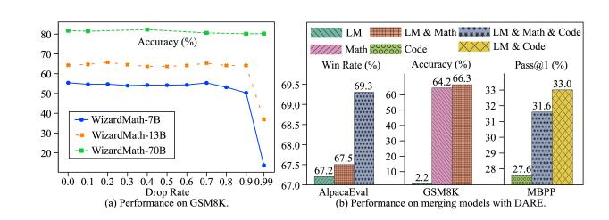

Figure 1: (Left) DARE can effectively eliminate 90% or even 99% delta parameters of WizardMath on GSM8K. (Right) DARE can merge multiple task-specific SFT language models into a single model with all the abilities. LM, MATH, and Code are abbreviations of WizardLM-13B, WizardMath-13B, and llama-2-13b-code-alpaca.

of other mutants to strengthen himself. Likewise, the protagonist in the Super Mario games can gain superpowers like throwing fireballs by absorbing in-game items. In this paper, we astonishingly find that Language Models (LMs), similar to Apocalypse and Super Mario, can enhance their capabilities by absorbing other models without the need for retraining or even GPUs.

Formally, Supervised Fine-Tuning (SFT) is the most widely adopted strategy for unlocking task-specific abilities to LMs by optimizing their parameters [\(Dodge et al.,](#page-9-0) [2020;](#page-9-0) [Zhao](#page-12-0) [et al.,](#page-12-0) [2023\)](#page-12-0). The effectiveness of SFT is fully evident in the alteration of the model parameters before and after SFT, referred to as *delta parameters* [\(Ding et al.,](#page-9-1) [2023\)](#page-9-1). We first show that SFT LM (either encoder- or decoder-based) always tends to acquire excessively redundant delta parameters. To be specific, we present DARE (Drop And REscale), which randomly sets certain delta parameters to zeros with a drop rate p and subsequently rescales the remaining ones by a factor of 1/(1−p). Although conceptually simple, DARE can eliminate up to 99% delta parameters with minimal impact on the performance when the LM's parameters reach 70 billion (see Figure [1\(](#page-0-0)a)). Moreover, the more parameters the LM has, the larger p it can tolerate. We attribute the effectiveness of DARE to its ability to approximate the original embeddings, which is verified theoretically and empirically.

Furthermore, we can merge multiple homologous SFT LMs (fine-tuned from the same backbone) based on DARE with-

1Alibaba Group. Correspondence to: Bowen Yu <yubowen.ybw@alibaba-inc.com>, Yongbin Li <shuide.lyb@alibaba-inc.com>.

out compromising their capabilities. As long as a small portion of the delta parameters remain unaffected during merging, the abilities of LMs unlocked by SFT can still be preserved. We first employ DARE to eliminate redundant delta parameters in each model before merging, which can potentially mitigate the interference of parameters among multiple models [\(Yadav et al.,](#page-12-1) [2023\)](#page-12-1). Then, we apply established model merging techniques [\(Wortsman et al.,](#page-12-2) [2022;](#page-12-2) [Ilharco et al.,](#page-10-0) [2023;](#page-10-0) [Matena & Raffel,](#page-11-0) [2022;](#page-11-0) [Jin et al.,](#page-10-1) [2023;](#page-10-1) [Yadav et al.,](#page-12-1) [2023\)](#page-12-1) to fuse the parameters with reduced redundancy for creating one model with diverse capabilities.

We conduct extensive experiments with encoder-based LMs on GLUE benchmark, and decoder-based LMs with three distinct abilities: instruction-following, mathematical reasoning, and code-generating. We observe that:

- (1) SFT LMs exhibit a substantial number of redundant delta parameters regardless of their backbones (e.g., BERT, RoBERTa, LLaMA, Llama 2, or Code Llama). DARE can *remove 90% or even 99% delta parameters* without significantly affecting the model performance. DARE is able to approximate the original embeddings well and provide very similar embeddings for each layer of the LM. The rescale operation is crucial to guarantee the success of DARE, and dropping 30% or 40% delta parameters without rescaling would noticeably lead to worse results.
- (2) DARE often retains or enhances the performance of various model merging methods on encoder-based LMs. For decoder-based LMs, simply averaging the parameters can already yield satisfactory results. As shown in Figure [1\(](#page-0-0)b), we merge various decoder-based LMs by DARE and Task Arithmetic [\(Ilharco et al.,](#page-10-0) [2023\)](#page-10-0), leading to considerable improvements. For example, 3.10% for LM & Math & Code vs. LM on AlpacaEval, 3.18% for LM & Math vs. Math on GSM8K, and 19.57% for LM & Code vs. Code on MBPP. We also use DARE to create a merged LM with 7 billion parameters, *attaining the top-ranking position on the Open LLM Leaderboard*. It is fascinating that all the benefits are achieved by solely using CPUs without retraining.
- (3) SFT delta parameters usually stay within 0.002, indicating minimal modifications to the pre-trained LM, and DARE works for delta parameters with relatively small value ranges. However, once models undergo continuous pre-training, the delta parameters can rapidly reach around 0.03, making DARE infeasible. Moreover, dropping only 10% fine-tuned parameters (i.e., the combination of pretrained and delta parameters) would lead to a catastrophic decrease in performance, even approaching zero. This finding further confirms that SFT primarily unlocks the abilities of pre-trained LMs, rather than introducing new capabilities.

The used resources are publicly available at [https://](https://github.com/yule-BUAA/MergeLM) [github.com/yule-BUAA/MergeLM](https://github.com/yule-BUAA/MergeLM).

## 2. Related Work

Supervised Fine-tuning of Language Models. SFT of LMs aims to impart pre-trained LMs with particular abilities by optimizing them on task-specific data, which has become the de facto standard paradigm in natural language processing [\(Dodge et al.,](#page-9-0) [2020;](#page-9-0) [Zhao et al.,](#page-12-0) [2023\)](#page-12-0). Generally, SFT can be divided into two categories: full fine-tuning [\(Radford](#page-11-1) [et al.,](#page-11-1) [2018;](#page-11-1) [Devlin et al.,](#page-9-2) [2019\)](#page-9-2) and parameter-efficient finetuning [\(Houlsby et al.,](#page-10-2) [2019;](#page-10-2) [Liu et al.,](#page-11-2) [2021;](#page-11-2) [Li & Liang,](#page-10-3) [2021;](#page-10-3) [Lester et al.,](#page-10-4) [2021;](#page-10-4) [Hu et al.,](#page-10-5) [2022\)](#page-10-5). Indeed, the effects of SFT are reflected by the difference between parameters of LMs before and after SFT, i.e., delta parameters. In this paper, we reveal the extreme redundancy of various SFT LMs' delta parameters by proposing an innovative approach DARE, achieving competitive performance with standard SFT LMs by removing 90% or even 99% delta parameters.

Network Pruning Technique. With the rapidly increasing size of neural networks, network pruning technique has been widely applied to reduce the computational costs [\(Cheng](#page-9-3) [et al.,](#page-9-3) [2017;](#page-9-3) [Liang et al.,](#page-10-6) [2021\)](#page-10-6). The objective of network pruning is to eliminate unnecessary parameters while maintaining the model performance [\(Zhu & Gupta,](#page-12-3) [2018;](#page-12-3) [Liu](#page-11-3) [et al.,](#page-11-3) [2019b;](#page-11-3) [Frankle & Carbin,](#page-9-4) [2019;](#page-9-4) [Gale et al.,](#page-9-5) [2019;](#page-9-5) [Xia et al.,](#page-12-4) [2022\)](#page-12-4). Magnitude-based pruning is one classical pruning method, which selects parameters according to their magnitudes (i.e., absolute parameter values) [\(Han](#page-10-7) [et al.,](#page-10-7) [2015;](#page-10-7) [Li et al.,](#page-10-8) [2018;](#page-10-8) [Lee et al.,](#page-10-9) [2021\)](#page-10-9). To be specific, parameters with magnitudes lower than a certain threshold are removed, and others are preserved. In fact, DARE is relevant to the concept of network pruning as it can also drop parameters. But DARE differs from existing pruning techniques in: (1) DARE focuses on delta parameters while most pruning methods deal with fine-tuned parameters; (2) DARE can work well without any retraining or extra data, which are often inevitably required by pruning methods.

Model Merging. Model merging has become a trending research direction in recent years, aiming to merge multiple task-specific models into a single model with diverse abilities [\(Wortsman et al.,](#page-12-2) [2022;](#page-12-2) [Matena & Raffel,](#page-11-0) [2022;](#page-11-0) [Ilharco et al.,](#page-10-0) [2023;](#page-10-0) [Jin et al.,](#page-10-1) [2023;](#page-10-1) [Yadav et al.,](#page-12-1) [2023;](#page-12-1) [Zhang et al.,](#page-12-5) [2023\)](#page-12-5). The superiority of model merging over multi-task learning [\(Crawshaw,](#page-9-6) [2020;](#page-9-6) [Zhang & Yang,](#page-12-6) [2022\)](#page-12-6) (which also intends to obtain one model with several abilities) is that model merging pays attention to the fusion of model parameters without accessing the original training data [\(Matena & Raffel,](#page-11-0) [2022;](#page-11-0) [Jin et al.,](#page-10-1) [2023\)](#page-10-1). Average Merging [\(Wortsman et al.,](#page-12-2) [2022\)](#page-12-2) is one common model merging approach, which utilizes averaged parameters to construct the merged model. Task Arithmetic [\(Ilharco et al.,](#page-10-0) [2023\)](#page-10-0) employs a pre-defined scaling term to distinguish the importance of various models. Fisher Merging [\(Matena](#page-11-0) [& Raffel,](#page-11-0) [2022\)](#page-11-0) performs weighted fusions of parameters,

where the weights are calculated by the Fisher information matrix (Fisher, 1922). RegMean (Jin et al., 2023) masterly solves model merging by optimizing a linear regression problem with closed-form solutions. TIES-Merging (Yadav et al., 2023) tackles the task conflicts in Ilharco et al. (2023) by trimming low-magnitude parameters, resolving sign disagreements, and disjointly merging parameters with consistent signs. In this paper, we use DARE as a versatile plug-in for existing model merging methods by first sparsifying delta parameters of several SFT homologous models and then merging them into a single model, which is equipped with the capabilities of all the SFT models.

### 3. Methodology

**SFT Delta Parameters**. Let  $\theta_{\text{PRE}} \in \mathbb{R}^d$  denote the parameters of a pre-trained LM (d is the parameter dimension), such as LLaMA (Touvron et al., 2023a) or Llama 2 (Touvron et al., 2023b). For task t, SFT can provide a fine-tuned LM with parameters  $\theta_{\text{SFT}}^t \in \mathbb{R}^d$  by optimizing the pre-trained model on task-specific data. Give the parameters of both pre-trained LM ( $\theta_{\text{PRE}}$ ) and SFT LM ( $\theta_{\text{SFT}}^t$ ), delta parameters are defined as the difference between parameters of LMs before and after SFT, i.e.,  $\delta^t = \theta_{\text{SFT}}^t - \theta_{\text{PRE}} \in \mathbb{R}^d$ . Since delta parameters reflect the changes in parameters during the SFT process, analyzing the properties of delta parameters can offer a better understanding of SFT.

**Model Merging Problem**. Given a set of K tasks  $\{t_1, t_2, \cdots, t_K\}$  and K corresponding SFT models with parameters  $\{\boldsymbol{\theta}_{SFT}^{t_1}, \boldsymbol{\theta}_{SFT}^{t_2}, \cdots, \boldsymbol{\theta}_{SFT}^{t_K}\}$ , model merging aims to fuse the parameters of K models into a single model with parameters  $\boldsymbol{\theta}_{M}$  that can well handle K tasks simultaneously. Following Matena & Raffel (2022); Jin et al. (2023); Yadav et al. (2023), we focus on merging fine-tuned models that are optimized from the same pre-trained backbone.

# 3.1. DARE: A Simple Approach for Reducing Delta Parameter Redundancy

In this work, we reveal the extremely redundant properties of the delta parameters of SFT LMs and propose DARE to effectively reduce delta parameter redundancy (see Figure 2(a)). DARE is conceptually simple and consists of two steps: drop and rescale. Given delta parameters  $\delta^t = \theta^t_{SFT} - \theta_{PRE}$ , DARE first performs random drop on  $\delta^t$  based on a drop rate p (setting their values to zeros) and then rescales the remaining ones by a factor of 1/(1-p) as follows,

$$m{m}^t \sim \mathrm{Bernoulli}(p),$$
  $m{\tilde{\delta}}^t = \left(\mathbf{1} - m{m}^t\right) \odot m{\delta}^t,$  (1)  $m{\hat{\delta}}^t = m{\tilde{\delta}}^t/(1-p).$ 

Finally, we combine  $\hat{\delta}^t$  and  $\theta_{\text{PRE}}$  via addition to obtain the parameters for inference, i.e.,  $\theta_{\text{DARE}}^t = \hat{\delta}^t + \theta_{\text{PRE}}$ . We prove

that even after removing most delta parameters, DARE can well preserve the model performance by approximating the original embeddings.

**Theoretical Analysis.** We discuss linear transformation since most parameters of LMs play a role in this basic operation (e.g., the computations in feed-forward networks, the projections of queries, keys, values, and outputs in self-attention modules). Let  $W/\Delta W \in \mathbb{R}^{m \times n}$  and  $b/\Delta b \in \mathbb{R}^m$  be the pre-trained/delta parameters. The input is a vector  $x \in \mathbb{R}^n$ . Expectation of the i-th  $(1 \le i \le m)$  dimension of the original embeddings  $h \in \mathbb{R}^m$  is computed by

$$\mathbb{E}[h_i] = \mathbb{E}[\sum_{j=1}^{n} (w_{ij} + \Delta w_{ij}) x_j + (b_i + \Delta b_i)]$$

$$= \sum_{j=1}^{n} x_j \mathbb{E}[w_{ij}] + \mathbb{E}[b_i] + \sum_{j=1}^{n} x_j \mathbb{E}[\Delta w_{ij}] + \mathbb{E}[\Delta b_i]$$

$$= \sum_{j=1}^{n} w_{ij} x_j + b_i + \sum_{j=1}^{n} \Delta w_{ij} x_j + \Delta b_i = h_i^{\text{PRE}} + \Delta h_i,$$

where  $w_{ij}/\Delta w_{ij}$  is the entry located at the intersection of the i-th row and j-th column within  $W/\Delta W$ . Similarly,  $b_i/\Delta b_i$  denotes the element positioned at the i-th dimension of  $b/\Delta b$ . Assuming DARE randomly drops delta parameters with a ratio p and rescales others by a factor of  $\gamma$ . After using DARE, the delta parameters change to  $\Delta \widehat{W} \in \mathbb{R}^{m \times n}$  and  $\Delta \widehat{b} \in \mathbb{R}^m$ . Therefore, the expectation of the i-th dimension of embeddings becomes

$$\mathbb{E}[\hat{h}_i] = \mathbb{E}[\sum_{j=1}^n \left(w_{ij} + \Delta \hat{w}_{ij}\right) x_j + \left(b_i + \Delta \hat{b}_i\right)]$$

$$= \sum_{j=1}^n x_j \mathbb{E}[w_{ij}] + \mathbb{E}[b_i] + \sum_{j=1}^n x_j \mathbb{E}[\Delta \hat{w}_{ij}] + \mathbb{E}[\Delta \hat{b}_i]$$

$$= \sum_{j=1}^n w_{ij} x_j + b_i + \sum_{j=1}^n x_j ((1-p) \cdot \gamma \cdot \Delta w_{ij} + p \cdot 0)$$

$$+ ((1-p) \cdot \gamma \cdot \Delta b_i + p \cdot 0)$$

$$= h_i^{\text{PRE}} + (1-p) \cdot \gamma \cdot \left(\sum_{j=1}^n \Delta w_{ij} x_j + \Delta b_i\right)$$

$$= h_i^{\text{PRE}} + (1-p) \cdot \gamma \cdot \Delta h_i.$$

By setting  $\gamma=1/(1-p)$ , we have  $\mathbb{E}[h_i]=\mathbb{E}[\hat{h}_i]$ , concluding that DARE can approximate the original embeddings.

*Remark.* We have given a rough proof of why DARE works. In practice, we find that DARE is applicable when the drop rate p is properly set, and the tolerance of p grows with LMs' parameter sizes. Moreover, removing fine-tuned rather than

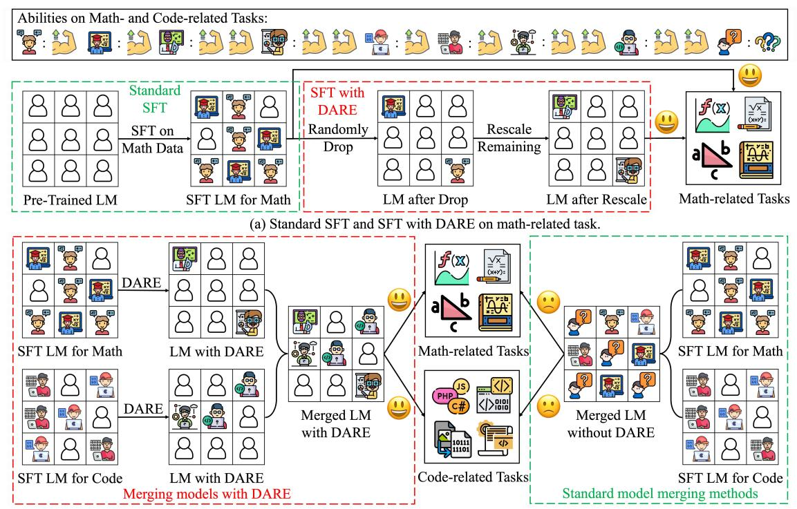

(b) Merging models with and without DARE on math- and code-related tasks.

Figure 2: Illustrations of DARE and merging models with DARE. DARE can achieve comparable performance with standard SFT with 90% or even 99% delta parameters removed. Moreover, DARE tackles the parameter interference issue when merging models and yields consistent improvements. At the top, we mark each icon with one or two muscle logos, indicating its ability for specific tasks. For example, the first or second icon has one muscle logo for math-related tasks, while the third or fourth icon can perform better in math with two muscle logos. The rescale operation in DARE multiplies the remaining parameters by 1/(1-p), which enhances the task-specific abilities and leads to changes in icons after rescaling.

delta parameters would cause a catastrophically decreased performance. A promising future direction is to explore DARE more deeply, such as inferring the upper bound of p with respect to LM capacities and illustrating the intrinsic difference between fine-tuned and delta parameters.

Last, we highlight the connections and differences between DARE and Dropout (Srivastava et al., 2014). Both methods involve random dropping and rescaling operations, but they differ in two key aspects: (1) DARE handles delta parameters while Dropout operates on model outputs; (2) DARE aims to reduce delta parameter redundancy without training, which permanently eliminates delta parameters and only retains others for inference. Dropout is used to prevent models from overfitting, which temporarily removes part of outputs during training but preserves all the outputs for inference.

#### 3.2. Merging Models with DARE

As DARE effectively reduces the redundancy of delta parameters by setting most of them to zeros, we hypothesize that DARE can help address the interference of parameters

when merging multiple models (Yadav et al., 2023). Take Figure 2(b) as an example, when merging math- and code-related models, DARE can assist existing model merging methods to better absorb the abilities of two models with less or no parameter interference.

Formally, given K models that are fine-tuned on K corresponding tasks with parameters  $\{\boldsymbol{\theta}_{\text{SFT}}^{t_1}, \boldsymbol{\theta}_{\text{SFT}}^{t_2}, \cdots, \boldsymbol{\theta}_{\text{SFT}}^{t_K}\}$ , we first apply DARE on each parameters  $\boldsymbol{\theta}_{\text{SFT}}^{t_k}$  ( $1 \leq k \leq K$ ), and derive  $\{\boldsymbol{\theta}_{\text{DARE}}^{t_1}, \boldsymbol{\theta}_{\text{DARE}}^{t_2}, \cdots, \boldsymbol{\theta}_{\text{DARE}}^{t_K}\}$ . Then, we adopt established model merging methods to fuse the derived parameters and obtain the merged single model with parameters  $\boldsymbol{\theta}_{\text{M}}$ . Let us take Task Arithmetic (Ilharco et al., 2023) as an instance, whose official computation process is denoted by

$$\boldsymbol{\theta}_{\mathrm{M}} = \boldsymbol{\theta}_{\mathrm{PRE}} + \lambda \cdot \sum_{k=1}^{K} \boldsymbol{\delta}^{t_k} = \boldsymbol{\theta}_{\mathrm{PRE}} + \lambda \cdot \sum_{k=1}^{K} (\boldsymbol{\theta}_{\mathrm{SFT}}^{t_k} - \boldsymbol{\theta}_{\mathrm{PRE}}),$$
 (2)

where  $\lambda$  is the scaling term to determine the importance of the models to be merged. When equipped with DARE, the

calculation process of Task Arithmetic is rewritten as

$$\begin{aligned} \boldsymbol{\theta}_{\text{DARE}}^{t_k} &= \text{ DARE}\left(\boldsymbol{\theta}_{\text{SFT}}^{t_k}, \boldsymbol{\theta}_{\text{PRE}}, p\right), \text{ for } 1 \leq k \leq K, \\ \boldsymbol{\theta}_{\text{M}} &= \boldsymbol{\theta}_{\text{PRE}} + \lambda \cdot \sum_{k=1}^{K} \hat{\boldsymbol{\delta}}^{t_k} = \boldsymbol{\theta}_{\text{PRE}} + \lambda \cdot \sum_{k=1}^{K} (\boldsymbol{\theta}_{\text{DARE}}^{t_k} - \boldsymbol{\theta}_{\text{PRE}}). \end{aligned} \tag{3}$$

The expression DARE  $(\theta_{SFT}^{t_k}, \theta_{PRE}, p)$  signifies the process of deriving delta parameters from  $\theta_{SFT}^{t_k}$  and  $\theta_{PRE}$ , eliminating delta parameters based on drop rate p following Equation (3.1), and finally combining the sparsified delta parameters with  $\theta_{PRE}$  to obtain  $\theta_{DARE}^{t_k}$ . In Section 4.3, we find that DARE can effectively improve the performance of Task Arithmetic when merging multiple LMs. It is also worth noticing that DARE is a versatile plug-and-play module and can be applied to any model merging methods, such as Average Merging (Wortsman et al., 2022), Fisher Merging (Matena & Raffel, 2022), RegMean (Jin et al., 2023), and TIES-Merging (Yadav et al., 2023).

## 4. Experiments

We conduct extensive experiments on encoder- and decoderbased LMs to show the effectiveness of DARE in reducing SFT delta parameter redundancy and merging models.

#### 4.1. Experimental Setup

Datasets and Pre-Trained Backbones for Decoder-based LMs. We choose AlpacaEval (Li et al., 2023) for evaluating instruction-following models (WizardLM (Xu et al., 2023)). We use GSM8K (Cobbe et al., 2021) and MATH (Hendrycks et al., 2021b) for testing mathematical reasoning models (WizardMath (Luo et al., 2023a)). HumanEval (Chen et al., 2021) and MBPP (Austin et al., 2021) are adopted for estimating code-generating models (WizardCoder-Python (Luo et al., 2023b) and Ilama-2-13b-code-alpaca (Chaudhary, 2023)). These models are fine-tuned based on pre-trained backbones including LLaMA (Touvron et al., 2023a), Llama 2 (Touvron et al., 2023b), and Code Llama (Rozière et al., 2023). Please see Table 3 in Section A.1 for their versions and correspondences with pre-trained backbones.

Datasets and Pre-Trained Backbones for Encoder-based LMs. For encoder-based LMs, the GLUE benchmark (Wang et al., 2019) is used, containing one sentence acceptability dataset CoLA (Warstadt et al., 2019), one sentiment detection dataset SST-2 (Socher et al., 2013), two paraphrase datasets MRPC (Dolan & Brockett, 2005) and QQP (Shankar et al., 2017), one sentence similarity dataset STS-B (Cer et al., 2017), and three natural language inference datasets MNLI (Bowman et al., 2015; Williams et al., 2018), QNLI (Rajpurkar et al., 2016), and RTE (Dagan et al., 2005; Haim et al., 2006; Giampiccolo et al., 2007; Bentivogli et al.,

2009). As the test labels of GLUE are not publicly available, we split the original training data into training and validation sets with ratios of 90% and 10%. The original validation data is used as the test set. We choose bert-base-uncased (Devlin et al., 2019) and roberta-base (Liu et al., 2019a) as pre-trained backbones, and further fine-tune them to get SFT models on the eight datasets.

**Evaluation Metrics**. We calculate win rate for AlpacaEval, zero-shot accuracy for GSM8K and MATH, pass@1 for HumanEval and MBPP, Matthews correlation coefficient for CoLA, accuracy for SST-2, QNLI, and RTE, matched accuracy for MNLI, accuracy and F1 score for MRPC and QQP, and Pearson and Spearman correlation for STS-B.

Implementation Details. Following Xu et al. (2023); Luo et al. (2023a;b), the inference of decoder-based LMs is implemented by vLLM (Kwon et al., 2023). Temperature is set to 0.0 for greedy decoding. The maximal number of generated tokens is 1,024 on GSM8K, and 2,048 on the other four datasets. For encoder-based LMs, We fine-tune bert-base-uncased and roberta-base for 10 epochs with a warmup strategy. The weight decay is 0.01. We use 1e-5 and 5e-5 as learning rates and list the optimal setting of each fine-tuned model in Table 4 in Section A.2. Experiments are conducted on NVIDIA Tesla V100 and A100 GPUs.

#### 4.2. Extreme Redundancy in SFT Delta Parameters

We show the extremely redundant property of SFT delta parameters of both decoder- and encoder-based LMs. We vary drop rate p in  $[0.0, 0.1, 0.2, \cdots, 0.9, 0.99]$  and apply DARE to get models after removing the corresponding ratio of delta parameters. When p is equal to 0.0, we actually obtain the standard SFT LMs. We report the performance of decoder-based LMs on GSM8K and HumanEval as well as encoder-based LMs on eight GLUE datasets in Figure 3 and Figure 4. Please see results of decoder-based LMs on AlpacaEval, MATH, and MBPP in Figure 12 in Section B.1.

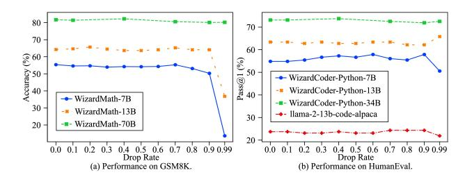

Figure 3: Performance of decoder-based LMs on GSM8K and HumanEval with various drop rates.

We conclude that: (1) the SFT delta parameters of both encoder- and decoder-based LMs are highly redundant. DARE can effectively remove 90% delta parameters without significantly decreasing the performance. In some cases,

Table 1: Performance of merging decoder-based WizardLM-13B (LM), WizardMath-13B (Math), and llama-2-13b-code-alpaca (Code) on all the datasets. The best and second-best results are marked in **bold** and <u>underlined</u> fonts.

| Merging Methods | Models    | Use DARE | Instruction- | Mathematical Reasoning |              | Code-generating |              |
|--------------------|-----------|-------------|--------------|------------------------|--------------|-----------------|--------------|
|                    |           |             | following    |                        |              |                 |              |
|                    |           |             | AlpacaEval   | GSM8K                  | MATH         | HumanEval       | MBPP         |
| /                  | LM        | No          | 67.20        | 2.20                   | 0.04         | 36.59           | 34.00        |
|                    | Math      | No          | /            | 64.22                  | 14.02        | /               | /            |
|                    | Code      | No          | /            | /                      | /            | 23.78           | 27.60        |
| Task Arithmetic | LM        | No          | 67.04        | 66.34                  | 13.40        | 28.66           | 30.60        |
|                    | & Math    | Yes         | 67.45        | <u>66.26</u>           | 12.86        | 26.83           | <u>32.40</u> |
|                    | LM        | No          | 68.07        | /                      | /            | 31.70           | 32.40        |
|                    | & Code    | Yes         | <u>67.83</u> | /                      | /            | 35.98           | 33.00        |
|                    | Math      | No          | /            | <u>64.67</u>           | 13.98        | 8.54            | 8.60         |
|                    | & Code    | Yes         | /            | 65.05                  | 13.96        | <u>10.37</u>    | <u>9.80</u>  |
|                    | LM & Math | No          | <u>69.03</u> | <u>58.45</u>           | 9.88         | 18.29           | 29.80        |
|                    | & Code    | Yes         | 69.28        | 56.48                  | <u>10.16</u> | 23.17           | 31.60        |
| TIES- Merging   | LM        | No          | 68.63        | 15.77                  | 2.04         | 37.80           | 35.60        |
|                    | & Math    | Yes         | 68.70        | <u>36.16</u>           | <u>4.56</u>  | 36.59           | 37.00        |
|                    | LM        | No          | 63.63        | /                      | /            | 0.0             | 0.0          |
|                    | & Code    | Yes         | <u>67.15</u> | /                      | /            | <u>18.29</u>    | <u>26.40</u> |
|                    | Math      | No          | /            | 63.23                  | 13.56        | 9.76            | 22.40        |
|                    | & Code    | Yes         | /            | 64.82                  | <u>13.88</u> | <u>10.37</u>    | <u>23.60</u> |
|                    | LM & Math | No          | 65.91        | <u>62.55</u>           | 9.54         | 21.95           | 30.40        |
|                    | & Code    | Yes         | 72.50        | 58.00                  | 9.20         | 29.27           | 31.40        |

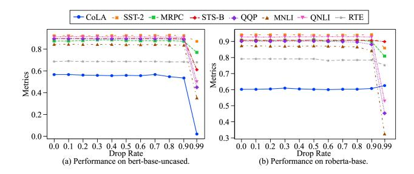

Figure 4: Performance of encoder-based LMs on GLUE with different drop rates.

the drop rate p can even reach 99%; (2) the tolerance of drop rate increases with the sizes of LMs, i.e., LMs with more parameters can withstand higher drop rate. For example, WizardMath-70B performs well when p=0.99 while WizardMath-7B and WizardMath-13B fail. This depicts some connections with the scaling laws of LMs (Kaplan et al., 2020; Hoffmann et al., 2022), indicating that there may exist quantifiable correlations between model sizes and drop rates they can afford.

#### 4.3. Merging Models with DARE on SFT LMs

We combine DARE with five model merging methods, including Average Merging (Wortsman et al., 2022), Task Arithmetic (Ilharco et al., 2023), Fisher Merging (Matena & Raffel, 2022), RegMean (Jin et al., 2023), and TIES-Merging (Yadav et al., 2023). Please see Section A.3

for more descriptions of the methods. For feasible computations, we merge decoder-based LMs based on Task Arithmetic and TIES-Merging. The scaling term in both methods is chosen from [0.5, 1.0], and the retain ratio of largest-magnitude parameters in TIES-Merging is selected from [0.5, 0.7, 0.9]. We merge WizardLM-13B, WizardMath-13B, and llama-2-13b-code-alpaca since all of them adopt Llama-2-13b as the pre-trained backbone. WizardCoder-Python-13B is not selected as it is fine-tuned from CodeLlama-13b-Python. We merge encoder-based LMs with all five methods and perform grid search on some hyperparameters (see Table 5 in Section A.4 for more details). Following Jin et al. (2023); Yadav et al. (2023), we also fine-tune the models under the multi-task learning setting and report the oracle results. We show the performance of merging decoder-based LMs in Table 1 and present partial results of merging encoder-based LMs in Figure 5. Please refer to Figure 13 in Section B.2 for the complete results.

From Table 1, we find that: 1) DARE often facilitates Task Arithmetic and TIES-Merging on merging decoder-based LMs, which even yields better results than the source model in many cases, offering a novel discovery unobserved in previous works. For instance, the improvements brought by Task Arithmetic with DARE are 3.10% for LM & Math & Code vs. LM on AlpacaEval, 3.18% for LM & Math vs. Math on GSM8K, and 19.57% for LM & Code vs. Code on MBPP; 2) Compared with Task Arithmetic, TIES-Merging tends to benefit more from DARE. This is because TIES-Merging first eliminates delta parameters with lower

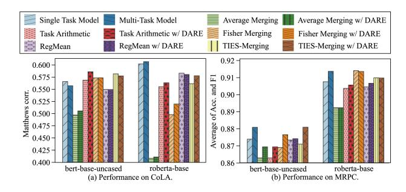

Figure 5: Performance of merging encoder-based bert-base-uncased and roberta-base on CoLA and MRPC.

magnitudes for each model, which potentially decreases the performance. When using DARE, delta parameters can be effectively removed by resetting them to zeros without adversely affecting the performance. Thus, TIES-Merging just drops delta parameters sparsified by DARE (with zero as the smallest magnitude), avoiding performance reduction in the first step; 3) It seems that llama-2-13b-code-alpaca is not well fine-tuned for generating codes since it performs worse than WizardLM-13B, which may affect the model merging performance. We additionally evaluate the codegenerating ability of the merger of WizardLM-13B and WizardMath-13B, which obtains better results than llama-2-13b-code-alpaca, explaining the suboptimal performance of the amalgamation of WizardMath-13B and llama-2-13bcode-alpaca. Therefore, an essential prerequisite for effective model merging is that each source model to be merged should be well fine-tuned.

From Figure 5, we observe that DARE often yields modestly better results of various merging methods, achieving an average improvement of 0.58%, 0.36%, 0.37%, -0.03%, and 0.84% on Average Merging, Task Arithmetic, Fisher Merging, RegMean, and TIES-Merging. However, the merged model still struggles to surpass the single model in some cases, which is in line with the conclusions in Matena & Raffel (2022); Jin et al. (2023); Yadav et al. (2023).

Last but not least, from both Table 1 and Figure 5, we further conclude that the improvements caused by DARE are more pronounced in decoder-based LMs compared to encoder-based LMs. One possible reason is that decoder-based LMs are able to accommodate more abilities than encoder-based LMs due to their substantially larger sizes.

We further verify the effectiveness of DARE in merging decoder-based LMs apart from the Llama 2 backbone (e.g., Mistral-7B (Jiang et al., 2023)). We provide two merged decoder-based LMs with 7 billion parameters (namely, supermario\_v1 and supermario\_v2) and evaluate them on Open LLM Leaderboard (Beeching et al., 2023). Please see Section A.5 for more details of the source models and benchmarks. From Table 2, we find that the merged LMs beat

Table 2: Results of 7B LMs on the Open LLM Leaderboard.

| Models            | Average | ARC   | Hella. | MMLU  | TQA   | Wino. | GSM8K |
|-------------------|---------|-------|--------|-------|-------|-------|-------|
| NeuralBeagle14-7B | 74.74   | 72.95 | 88.34  | 64.55 | 69.93 | 82.40 | 70.28 |
| Beagle14-7B       | 74.76   | 72.95 | 87.95  | 64.70 | 68.88 | 82.64 | 71.42 |
| supermario_v1     | 74.85   | 73.72 | 88.71  | 64.57 | 68.23 | 85.64 | 68.23 |
| WildMarcoroni-7B  |         |       |        | 64.81 |       |       |       |
| WestSeverus-7B    | 75.29   | 71.42 | 88.27  | 64.79 | 72.37 | 83.27 | 71.65 |
| supermario_v2     | 75.49   | 72.95 | 88.53  | 64.99 | 71.22 | 83.90 | 71.34 |

the source models they are built upon, achieving a certain degree of improvement. Notably, until January 28th, 2024, *supermario\_v2 achieves the first rank on the Open LLM Leaderboard.* It is thrilling that these benefits can be cheaply acquired by merely utilizing CPUs.

#### 4.4. Importance of the Rescale Operation

As analyzed in Section 3.1, the rescale operation in DARE is essential to approximate the original embeddings. To verify this, we introduce DropOnly which randomly drops delta parameters without rescaling. We calculate the similarities of embeddings between the original LM and LM with DARE or DropOnly. Specifically, we obtain the embeddings of each input token layer-by-layer and report the average cosine similarities. Results of WizardMath-7B on GSM8K and bert-base-uncased on CoLA are shown in Figure 6.

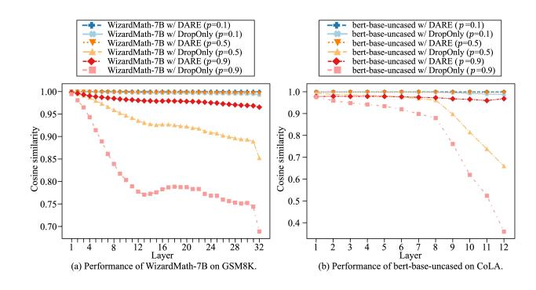

Figure 6: Cosine similarities of each layer's embeddings between the original LM and LM with DARE or DropOnly.

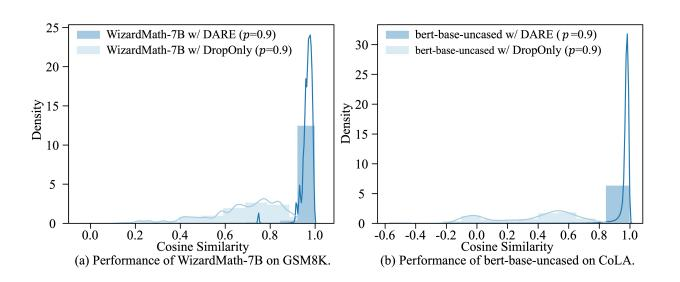

Figure 7: Distributions of cosine similarities of the last layer's embeddings between the original LM and LM with DARE or DropOnly.

We observe that DARE can perfectly maintain the original embeddings in each layer with similarities higher than 0.95 even when removing 90% delta parameters. However, DropOnly just preserves the original embeddings with p = 0.1 and the similarities sharply decline when p is higher. For example, the similarities on WizardMath-7B decrease to about 0.85/0.68 when p is 0.5/0.9). We further show the distributions of embeddings' cosine similarities in the last layer in Figure [7,](#page-6-3) demonstrating the ability of DARE in approximating original embeddings. Note that similar findings can be obtained on other LMs and datasets but they are not presented due to page limits.

We also report the performance of LMs with DARE and DropOnly in Figure [8.](#page-7-0) See Figure [14](#page-16-0) and Figure [15](#page-16-1) in Section [B.3](#page-15-4) for additional results. We observe that discarding the rescale operation usually leads to worse results, and the performance gaps between DARE and DropOnly become more significant with the increase of p. This validates the effectiveness of the rescale operation in DARE once again.

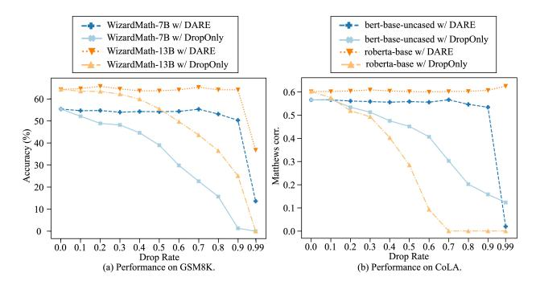

Figure 8: Comparisons between DARE and DropOnly on GSM8K and CoLA on various LMs.

#### 4.5. Comparison with Magnitude-based Pruning

We compare DARE with the commonly used Magnitudebased Pruning (MP) [\(Han et al.,](#page-10-7) [2015;](#page-10-7) [Li et al.,](#page-10-8) [2018;](#page-10-8) [Lee](#page-10-9) [et al.,](#page-10-9) [2021\)](#page-10-9), which chooses parameters based on their magnitudes. For more fair and credible comparisons, we adapt MP to operate on delta parameters and discard the retraining process. We show partial results of LMs with DARE and MP in Figure [9.](#page-7-1) Please refer to Figure [16](#page-16-2) and Figure [17](#page-17-0) in Section [B.4](#page-17-1) for extra results.

We find that DARE outperforms MP in most cases and the superiority of DARE is more obvious when the drop rate becomes higher, verifying the superiority of DARE in abandoning delta parameters. The reason is that MP fails to preserve the original embeddings since it neglects the contributions of delta parameters with lower magnitudes. We have also tried to combine MP with the rescale operation but got worse results than using MP separately. For example, when

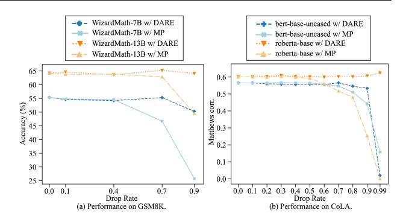

Figure 9: Comparisons between DARE and MP on GSM8K and CoLA on various LMs.

the drop rate is 0.7, the performance of MP on 7B LMs decreases from 43.85 to 10.61 on AlpacaEval, from 46.70 to 0.37 on GSM8K, and from 21.34 to 3.05 on HumanEval. This is because MP removes parameters with smaller magnitudes and retains certain parameters with larger magnitudes. Simply rescaling the remaining parameters would result in unpredictable performance.

#### 4.6. When Can DARE Be Used?

We investigate the prerequisites that DARE can work. We choose Llama-2-13b instead of CodeLlama-13b-Python as the pre-trained backbone for WizardCoder-Python-13B and apply DARE to derive the model after dropping certain delta parameters for evaluation. We find that the pass@1 metric on HumanEval/MBPP drastically decreases from 63.41/55.4 to 0.0/0.0 when only 10% delta parameters are removed. We deduce this is because Code Llama models are additionally trained with 500B tokens of code-related data [\(Roziere](#page-11-9) ` [et al.,](#page-11-9) [2023\)](#page-11-9), resulting in more obvious changes in parameter values with respect to Llama 2 models. Since WizardCoder-Python-13B is fine-tuned based on CodeLlama-13b-Python, when it uses Llama-2-13b as the pre-trained backbone, the ranges of SFT delta parameters would become much larger, making DARE infeasible. To verify this, we depict the *absolute values* of SFT delta parameters of 13B decoder-based LMs vs. various pre-trained backbones in Figure [10.](#page-8-0) Please see Figure [18,](#page-18-0) Figure [19](#page-18-1) and Figure [20](#page-19-0) in Section [B.5](#page-17-2) for the SFT delta parameter ranges on decoder- and encoderbased LMs. Additionally, we present the statistics on the percentiles of delta parameter ranges of both decoder- and encoder-based LMs in Table [6](#page-20-0) in Section [B.5.](#page-17-2)

From the results, we observe the absolute values of delta parameters of WizardCoder-Python-13B vs. Llama-2-13b (often greater than 0.01) are several orders of magnitude bigger than those of WizardCoder-Python-13B vs. CodeLlama-13b-Python (usually within 0.0002), causing the failure of DARE. For other 13B decoder-based LMs fine-tuned from Llama-2-13b, most of their absolute values of delta parame-

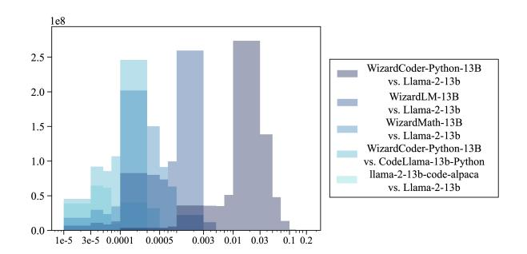

Figure 10: Delta parameter absolute values of 13B decoderbased LMs vs. the pre-trained backbones.

ters are less than 0.002, making DARE a proper choice. To this end, we conclude that DARE can work well when the absolute values of SFT delta parameters are relatively small (e.g., within 0.002). Otherwise, DARE may fail.

#### 4.7. Can DARE Drop Fine-tuned Parameters?

As previous network pruning methods mainly operate on the fine-tuned instead of delta parameters, we also conduct experiments under this setting with both decoder- and . For decoder-based LMs, we find they perform badly when removing fine-tuned parameters even with 0.1 as the drop rate. Quantitatively, the performance sharply drops from 67.20 to 8.56 on AlpacaEval for WizardLM-13B, from 64.22/14.02 to 0.38/0.16 on GSM8K/MATH for WizardMath-13B, from 63.41/55.40 to 0.0/0.20 on HumanEval/MBPP for WizardCoder-Python-13B. Similar observations can also be found on MP or decoder-based LMs with 7B, 34B, or 70B sizes. Partial results on encoder-based LMs are shown in Figure [11](#page-8-1) and please see Figure [21](#page-19-1) in Section [B.6](#page-17-3) for additional results. We observe that directly

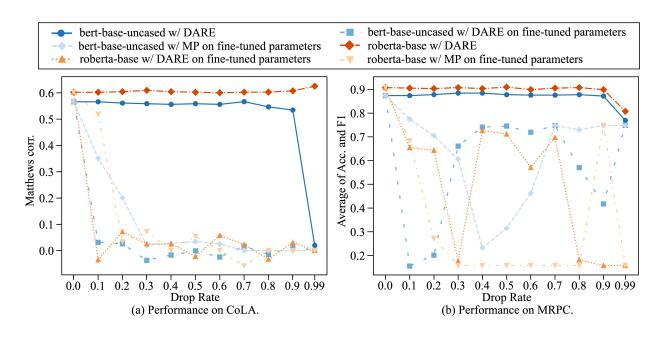

Figure 11: Results of DARE and MP by dropping fine-tuned parameters on CoLA and MRPC on encoder-based LMs.

eliminating the fine-tuned parameters by either DARE or MP would lead to worse performance on encoder-based LMs. The above results confirm that the knowledge is inherent in pre-trained LMs, and SFT is responsible for unlocking instead of introducing new capabilities. Moreover, decoderbased LMs are more susceptible than encoder-based LMs when removing fine-tuned parameters. This could be attributed to the fact that decoder-based LMs exhibit a higher degree of capability and have a stronger correlation with the fine-tuned parameters. Consequently, even the removal of a relatively small proportion of fine-tuned parameters can significantly degrade their performance.

## 5. Conclusion

In this work, we first discussed the extremely redundant properties of SFT delta parameters in LMs and proposed a simple approach DARE to effectively reduce the number of delta parameters needed for SFT without any data, retraining, or even GPUs. DARE can impressively drop 90% or even 99% SFT delta parameters without sacrificing much performance compared with using all SFT delta parameters. We further employed DARE as a versatile plug-and-play approach for existing model merging methods to merge multiple task-specific fine-tuned models into a single model with diverse abilities. Extensive experimental results on both encoder- and decoder-based LMs demonstrated the effectiveness of DARE in reducing SFT delta parameter redundancy and facilitating the model merging performance. We also provided a deeper analysis of why DARE works as well as the prerequisites for using DARE. We hope that our findings can advance the understanding of model alignment from the perspective of analyzing model parameters.

## Impact Statement

Recently, merging language models has become a promising research direction. Our work allows researchers to obtain a single model with diverse capabilities at a low cost. Thanks to our method, *hundreds of models with different functionalities have been created on the Hugging Face community*[1](#page-8-2) *. Several popular toolkits on the GitHub platform have also integrated our work, including huggingface/peft* [2](#page-8-3) *and arceeai/mergekit*[3](#page-8-4) *.* Even though this work has no direct social impacts, the potentially harmful information generated by LLMs (e.g., gender bias, racial discrimination) may still exist when using our approach. It is necessary to advocate for careful regulation by the communities as well as authorities on this matter.

## Acknowledgements

We would like to express our sincere gratitude to the anonymous reviewers for their insightful comments and suggestions, which have significantly enriched this paper.

1[https://huggingface.co/models?other=](https://huggingface.co/models?other=arxiv:2311.03099) [arxiv:2311.03099](https://huggingface.co/models?other=arxiv:2311.03099)

2<https://github.com/huggingface/peft>

3<https://github.com/arcee-ai/mergekit>