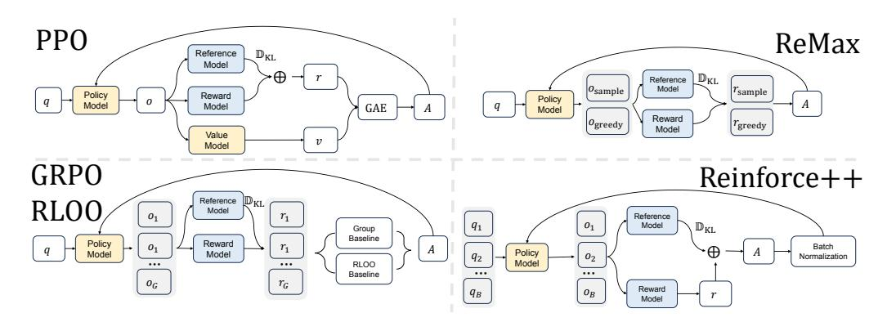
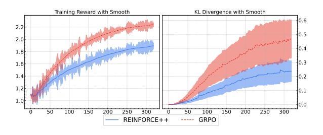
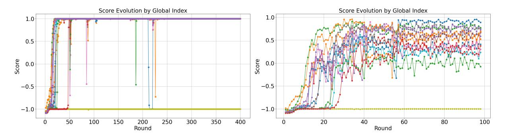
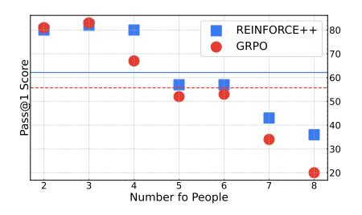

# REINFORCE++: Stabilizing Critic-Free Policy Optimization with Global Normalization

Jian Hu janhu9527@gmail.com

Jason Klein Liu jasonkleinlove@gmail.com

Haotian Xu 1034351332@qq.com

Wei Shen ∗ shenwei0917@126.com

## Abstract

Reinforcement Learning from Human Feedback (RLHF) plays a crucial role in aligning Large Language Models (LLMs). The dominant algorithm, Proximal Policy Optimization (PPO), employs a critic network to estimate advantages, which introduces significant computational and memory overhead. To address this, a family of critic-free algorithms (e.g., GRPO, RLOO) has emerged. However, these methods typically rely on prompt-level (local) advantage normalization, which suffers from inaccurate advantage estimation, a tendency to overfit, and, as we show, is a theoretically biased estimator. To solve these challenges, we introduce REINFORCE++ , a critic-free framework centered on Global Advantage Normalization. By normalizing advantages across the entire global batch rather than small, prompt-specific groups, our method provides a more stable and theoretically sound, effectively unbiased estimate (whose bias vanishes as batch size increases). We introduce two variants: REINFORCE++ , a highly efficient and general algorithm (k ≥ 1) for general-domain RLHF, and REINFORCE++w/ Baseline , a robust group-sampling variant (k > 1) for complex reasoning tasks. Our empirical evaluation demonstrates that each variant shows superior stability and performance in its respective domain, outperforming existing methods and even PPO in complex agentic settings.

## 1 Introduction

Reinforcement Learning from Human Feedback (RLHF) is a key technique for aligning Large Language Models (LLMs) with human values and preferences [\(Vemprala et al.,](#page-9-0) [2023;](#page-9-0) [Achiam](#page-8-0) [et al.,](#page-8-0) [2023;](#page-8-0) [Ouyang et al.,](#page-8-1) [2022;](#page-8-1) [Shen and](#page-9-1) [Zhang,](#page-9-1) [2024;](#page-9-1) [Shen et al.,](#page-9-2) [2025;](#page-9-2) [Hu et al.,](#page-8-2) [2024\)](#page-8-2).

Despite the emergence of non-RL alternatives like DPO [\(Rafailov et al.,](#page-8-3) [2023\)](#page-8-3), state-ofthe-art applications such as ChatGPT/GPT-4 [\(Vemprala et al.,](#page-9-0) [2023;](#page-9-0) [OpenAI,](#page-8-4) [2023\)](#page-8-4), Claude [\(Anthropic,](#page-8-5) [2023\)](#page-8-5), and Gemini [\(Team et al.,](#page-9-3) [2023\)](#page-9-3) continue to rely on RL algorithms.

The dominant RL algorithm in this space is Proximal Policy Optimization (PPO) [\(Schul](#page-9-4)[man et al.,](#page-9-4) [2017\)](#page-9-4). PPO employs an "Actor-Critic" architecture, where a dedicated critic network is trained to estimate the advantage function (i.e., the extent to which an action yields a higher expected return than the mean). However, this critic network introduces substantial computational overhead and memory demands, making training very expensive and limiting large model alignment in small-scale clusters [\(Shao et al.,](#page-9-5) [2024\)](#page-9-5).

To address PPO's efficiency issues, a family of REINFORCE-based methods has emerged without the critic model, including ReMax [\(Li](#page-8-6) [et al.,](#page-8-6) [2023\)](#page-8-6), RLOO [\(Ahmadian et al.,](#page-8-7) [2024\)](#page-8-7), and GRPO [\(Shao et al.,](#page-9-5) [2024\)](#page-9-5). These algorithms remove the critic network and instead estimate the advantage using statistics from multiple responses to the same prompt.

However, this critic-free approach introduces a new, critical challenge: advantage estimation. Methods like GRPO and RLOO use promptlevel (local) normalization, calculating the baseline and standard deviation only from the small group of responses generated for a single prompt. This approach suffers from several critical flaws. First, as demonstrated in Appendix Section [A,](#page-10-0) the prompt-level advantage estimator is mathematically biased, as the numerator (centered reward) and the denominator (local standard deviation) are not independent. Second, the advantage estimate is sensitive to the small number of samples in the local group (e.g., k = 4 or k = 8), where the high variance

∗Corresponding author

leads to instability. If all samples receive similar rewards, the local  $std(\cdot)$  approaches zero, causing the advantage to explode and destabilizing training. Finally, the method encourages overfitting to specific prompts, as the policy is optimized to "win" within its local group rather than achieving a globally high reward, which harms generalization.

We introduce two distinct variants of this framework, each tailored to a specific use case. REINFORCE++ is an efficient algorithm with  $k \geq 1$ . In its k = 1 configuration (detailed in Algorithm 1), it maximizes prompt diversity for general-domain RLHF. It can also be applied with k > 1 (Section 4.2), using the same global normalization principle. REINFORCE++ $_{w/}$  Baseline is a specialized variant for complex tasks (k > 1) that benefits from group sampling. It fixes the flaws of GRPO by first subtracting the *group mean* (for reward reshaping) and then normalizing by the global standard deviation (for stability). It also employs a more stable  $k_2$  for the KL estimator, as detailed in Appendix Section B.1. In summary, our contributions are as follows:

- We provide a theoretical proof that the prompt-level (local) advantage normalization used in methods like GRPO is a biased estimator (Appendix Section A).
- We propose REINFORCE++, a critic-free framework centered on Global Advantage Normalization, as a stable, efficient, and theoretically sound alternative.
- We present two specialized algorithms: REINFORCE++  $(k \ge 1)$  for efficient general-purpose RLHF and reasoning, and REINFORCE++ $_{w/\text{ Baseline}}$  (k > 1) for robust complex agentic tasks.
- We empirically demonstrate that RE-INFORCE++ achieves superior token-efficiency and Out-Of-Distribution (OOD) generalization in its domain. At the same time, REINFORCE++ $_{w/}$  Baseline prevents overfitting and outperforms both GRPO and PPO in complex agentic reasoning tasks.

#### 2 Background and Related Work

#### 2.1 PPO and Critic-Free RLHF

PPO optimizes LLMs by maximizing the following surrogate objective:

$$\mathcal{L}_{\text{PPO}}(\theta) = \mathbb{E}_{q \sim P(Q), o \sim \pi_{\theta_{\text{old}}}(O|q)} \left[ \frac{1}{|o|} \sum_{t=1}^{|o|} \min \left( s_t(\theta) A_t, \operatorname{clip}(s_t(\theta), 1 - \epsilon, 1 + \epsilon) A_t \right) \right]$$
(1)

where  $s_t(\theta) = \frac{\pi_{\theta}(o_t|q,o_{< t})}{\pi_{\theta_{\text{old}}}(o_t|q,o_{< t})}$  is the probability ratio. The advantage  $A_t$  is typically calculated using Generalized Advantage Estimation (GAE) (Schulman et al., 2018):

$$A_{q,o_t} = \sum_{l=0}^{\infty} (\gamma \lambda)^l \delta_{t+l}$$
 (2)

where  $\delta_{q,o_t} = r_t + \gamma V(o_{t+1}) - V(o_t)$  is the temporal difference error, and  $V(\cdot)$  is the critic network.

Critic-free methods in Figure 1 remove the critic  $V(\cdot)$  and compute the advantage  $A_t$  directly from rewards.

- ReMax (Li et al., 2023) uses a greedy decoding response  $\hat{o}$  as the baseline:  $A_{q,o_t} = r(o) r(\hat{o})$ .
- **RLOO** (Ahmadian et al., 2024) samples k responses and uses the mean of others as the baseline:  $A_{q,o_i^{(i)}} = r(o^{(i)}) \frac{1}{k-1} \sum_{j \neq i} r(o^{(j)})$ .
- **GRPO** (Shao et al., 2024) also samples k responses but normalizes the advantage using the mean and standard deviation of the *local group*:

$$A_{q,o_t^{(i)}} = \frac{r(o^{(i)}) - \operatorname{mean}(\{r(o^{(j)})\}_{j=1}^k)}{\operatorname{std}(\{r(o^{(j)})\}_{j=1}^k) + \epsilon}$$
(3)

## 2.2 The Problem with Local Normalization

The core issue with methods like GRPO lies in Eq. (3). The usage of **prompt-level (lo-cal) normalization** is problematic for three reasons:

1. **Theoretical Bias**: As formally proven in Appendix Section A, the estimator is biased. Therefore, the numerator (centered

Figure 1: The comparison of PPO, ReMax, GRPO, RLOO, and REINFORCE++. REINFORCE++, as shown in the figure, removes the critic model and uses global batch normalization. REINFORCE++ $_{w/}$  Baseline uses group sampling, similar to GRPO/RLOO, but replaces the local group baseline with a group-mean subtraction followed by global batch normalization.

reward) and the denominator (local standard deviation  $std(\cdot)$ ) are not independent. The denominator's value is correlated with the rewards in the small group, introducing a systematic error in the advantage estimate (Mai et al., 2025).

- 2. **Practical Instability**: In practice, the group size k is small (e.g., 4 or 8). If all sampled responses for a prompt happen to get similar rewards, the local  $std(\cdot)$  approaches zero, causing the advantage to explode. It results in high variance and unstable training.
- 3. Task Overfitting: The policy is rewarded for being "better than other samples from the same prompt," not for being "globally good." It can lead to overfitting on simple prompts where it's easy to generate diverse rewards, while failing to improve on complex prompts.

#### 3 Method

Our method addresses the instability of criticfree RLHF by replacing biased local normalization with stable global normalization. We propose two variants for different use cases.

#### 3.1 Global Normalization

The primary REINFORCE++ algorithm is designed for general-purpose RLHF. In its k=1 configuration, it is designed for maximum efficiency and prompt diversity.

It optimizes the PPO objective in Eq. (1) but redefines the advantage  $A_{q,o_t}$ . We use the

standard PPO reward formulation, which incorporates the k1-style KL penalty directly into the reward:

$$A_{q,o_t} = r(o_{1:T}, q) - \beta \cdot \sum_{i=t}^{T} KL(i) \qquad (4)$$

where 
$$\mathrm{KL}(t) = \log \left( \frac{\pi_{\theta_{\text{old}}}(o_t|q,o_{< t})}{\pi_{ref}(o_t|q,o_{< t})} \right)$$
.

The key innovation is our normalization strategy. Instead of a non-existent (for k = 1) or biased local norm, we use Global Advantage Normalization (Andrychowicz et al., 2020):

$$A_{q,o_t}^{\text{norm}} = \frac{A_{q,o_t} - \text{mean} (A|A \in \mathcal{D}_{\text{batch}})}{\text{std} (A|A \in \mathcal{D}_{\text{batch}}) + \epsilon}$$
 (5)

This global normalization is the core of REIN-FORCE++. As the global batch size  $\mathcal{D}_{\text{batch}}$  is typically large (e.g., 1024 or more), the mean(·) and std(·) converge to stable constants. It makes the gradient estimator effectively less biased (as  $N \to \infty$ ) and robust to outliers, drastically improving training stability (see Appendix Section A.2). The algorithm for the efficient k=1 case is detailed in Algorithm Algorithm 1.

#### 3.2 Local Baseline

For more complex tasks, such as multi-step reasoning, sampling multiple responses per prompt (k>1) can be beneficial (Yue et al., 2025). For this, we introduce REINFORCE++ $_{w/}$  Baseline. This variant combines the benefits of group-sampling with the stability of global normalization. The advantage calculation is a two-step process:

## Algorithm 1 REINFORCE++ when k = 1

**Require:** Initial policy model  $\pi_{ref}$ , reward models R, task prompts  $\mathcal{D}$ 

- 1: policy model  $\pi_{\theta} \leftarrow \pi_{ref}$
- 2: for step =  $1, \ldots, M$  do
- 3: Sample a batch  $\mathcal{D}_{batch}$  from  $\mathcal{D}$
- 4: Update the old policy model  $\pi_{\text{old}} \leftarrow \pi_{\theta}$
- 5: Sample output (k = 1)  $o \sim \pi_{\text{old}}(\cdot \mid q)$  for each question  $q \in \mathcal{D}_{batch}$
- 6: Compute rewards  $r_i$  for each sampled  $o_i$  using R
- 7: Compute advantage  $A_{q,o_t}$  via Eq. (4)
- 8: Normalize advantages globally across  $\mathcal{D}_{batch}$  to get  $A_{q,ot}^{\text{norm}}$  via Eq. (5)
- 9: **for** iteration =  $1, \ldots, k$  **do**
- 10: Update  $\pi_{\theta}$  by maximizing the objective in Eq. (1) using  $A_{q,ot}^{\text{norm}}$
- 11: end for

12: end for Ensure:  $\pi_{\theta}$ 

• Group Mean Subtraction for Reshaping: We first subtract the group mean reward. It serves as a local baseline, reshaping rewards to be robust to different reward scales (e.g., 0/1 vs. -1/1).

$$A'_{q,o_t} = R_{q,o_t} - \text{mean}_{\text{group}}(R_{q,o_t})$$
 (6)

• Global Batch Normalization for Stability: We then normalize this initial advantage using the global batch statistics, not the unstable local group statistics.

$$A_{q,o_t}^{\text{norm}} = \frac{A'_{q,o_t} - \text{mean}_{\text{batch}}(A')}{\text{std}_{\text{batch}}(A') + \epsilon}$$
 (7)

This combination avoids the bias and instability of local standard deviation in GRPO.

Furthermore, this variant employs a separate KL loss term for regularization. We adopt the  $k_2$  estimator. As shown in Appendix Section B.1, the  $k_2$  estimator provides a stable, unbiased gradient for the Reverse KL divergence, unlike the  $k_3$  estimator (used in GRPO), which is an unstable approximation (Liu et al., 2025a). The final objective is:

$$\mathcal{L} = \mathcal{L}_{PPO}(A^{\text{norm}}) - \lambda \cdot \mathcal{J}_{k_2 \text{ as loss}}(\theta) \quad (8)$$

where  $\mathcal{J}_{k_2 \text{ as loss}}(\theta) = \mathbb{E}\left[\frac{1}{2}\left(\log \frac{\pi_{\theta}}{\pi_{ref}}\right)^2\right]$ .

#### 3.3 Relationship with PPO

REINFORCE++ $_{w/}$  Baseline can be viewed as a simplified and more stable variant of PPO. It is formally equivalent to a PPO agent where: (1) The critic network is removed; (2) The GAE parameters are set to  $\lambda = 1$  and  $\gamma = 1$ ; and (3) A two-step global batch normalization is used as the baseline instead of a learned value function.

#### 3.4 Summary

To address these challenges, we propose REIN-FORCE++, a method centered on a simple yet powerful idea without the critic model: **Global Advantage Normalization**. Instead of normalizing within a prompt's local group, REIN-FORCE++ normalizes the advantage function across the *entire global training batch*. This approach is:

- Theoretical Stability: As the global batch size grows (e.g., N=1024), the batch mean and standard deviation converge to constants, resulting in an effectively unbiased (bias vanishes as  $N \to \infty$ ) and low-variance advantage estimator (see Appendix Section A.2).
- Training Efficiency: It retains the criticfree architecture, significantly reducing computational and memory overhead compared to PPO.
- Strong Generalization: Using a global baseline prevents overfitting to specific prompts and encourages a more robust policy.

#### 4 Experiments

We evaluate our two algorithms, REIN-FORCE++ and REINFORCE++ $_{w/\text{Baseline}}$ , in their respective target domains using the Open-RLHF framework (Hu et al., 2024).

#### 4.1 General RLHF

First, we evaluate the REINFORCE++ in its k=1 configuration, focusing on general-domain RLHF, where efficiency and prompt diversity are key.

**Experimental Setup** We use an instruction-following policy model (Llama-3-8B-SFT) and refine it using a Bradley-Terry reward model

[\(Bai et al.,](#page-8-11) [2022\)](#page-8-11) trained on ∼700K human preference pairs. The policy is trained on 20,000 diverse prompts. We compare REIN-FORCE++ (k = 1) with other critic-free methods: GRPO (k = 4), RLOO (k = 4), and ReMax (k = 1 + 1).

Experimental Results As shown in Table [1,](#page-5-0) the single-sample REINFORCE++ (k = 1) achieves a score of 46.7, statistically tied with the group-sampling GRPO (46.8). However, it produces shorter responses (832 tokens vs. 860), resulting in a higher and more efficient per-token score (0.0561). This result highlights that for general tasks, group sampling (k > 1) is not necessary and may even be suboptimal.

Results Analysis Figure [2](#page-4-0) shows the training dynamics. GRPO's reward rises quickly, but its KL divergence also increases rapidly, suggesting it is "hacking" the reward model. In contrast, REINFORCE++ shows a more stable reward increase with a much smaller KL divergence. It highlights the stability of global normalization and its higher "KL-to-reward" conversion efficiency, avoiding the reward hacking seen in local normalization methods, which is often linked to length exploitation [\(Dubois](#page-8-12) [et al.,](#page-8-12) [2024\)](#page-8-12).

Figure 2: Comparison of smoothed Training Reward and KL Divergence. REINFORCE++ (k = 1) achieves strong rewards with significantly more stable (lower) KL divergence, avoiding GRPO's reward-hacking behavior.

#### 4.2 Reasoning Experiments

Next, we evaluate REINFORCE++ (groupsample, k > 1) in its target domain: complex reasoning, where group sampling is standard and reward signals are often sparse (e.g., 0/1). We compare it directly with GRPO (k > 1).

#### 4.2.1 Long Reasoning Task

We use rule-based rewards (RLVR) in mathematical reasoning settings [\(Guo et al.,](#page-8-13) [2025;](#page-8-13) [Seed et al.,](#page-9-8) [2025\)](#page-9-8).

Analysis on Small-Scale Datasets To test for overfitting, we trained on only 30 questions from AIME-24 and evaluated on AIME-25. As shown in Table [2,](#page-5-1) GRPO (local norm) achieves a near-perfect 95.0% on the training set but completely fails on the test set (0.0 Pass@1), demonstrating catastrophic overfitting. In contrast, REINFORCE++ with global norm, while scoring lower on the training set (71.0), shows significantly better generalization (2.5 Pass@1, 40.0 Pass@16).

Figure [3](#page-5-2) confirms this. GRPO (left) immediately overfits, mastering the training questions in just a few steps. REINFORCE++ (right) learns more gradually, enabled by the stable global normalization signal.

Logical Reasoning (K&K Puzzles) We also tested on the Knights and Knaves (K&K) puzzles [\(Xie et al.,](#page-9-9) [2025,](#page-9-9) [2024\)](#page-9-10), where difficulty increases with the number of "people." Figure [4](#page-5-3) shows that while GRPO is competitive on easy tasks (2-3 people), its performance collapses on harder, OOD tasks (8 people). RE-INFORCE++ is more robust, outperforming GRPO on all tasks with four or more people and achieving a much higher average score (62.1 vs. 55.7).

RL from Zero Setting Finally, we trained a Qwen2.5-Math-Base model from zero on MATH dataset splits [\(Guo et al.,](#page-8-13) [2025\)](#page-8-13). Table [3](#page-5-4) shows that REINFORCE++ again achieves better OOD generalization on the more challenging AIME-24 and AMC-23 datasets, while remaining competitive on the in-distribution MATH-500 test set.

#### 4.3 Multi-step Reinforcement Learning

Finally, to test performance in a complex, multistep environment, we utilize the zero-shot agent setup from [\(Mai et al.,](#page-8-8) [2025\)](#page-8-8), where a Qwen 2.5 Base 7B model must learn to use Python tools to solve mathematical problems. It is a challenging scenario where group sampling (k > 1) and reward reshaping are crucial (see Appendix Section [5\)](#page-6-0).

Experimental Setup We adhere to the training and evaluation protocols of the ZeroTIR environment [\(Mai et al.,](#page-8-8) [2025\)](#page-8-8). The backbone model is Qwen 2.5 Base 7B, trained

|                   | Score | Length | Per Token |
|-------------------|-------|--------|-----------|
| REINFORCE++ (k=1) | 46.7  | 832    | 0.0561    |
| GRPO (k=4)        | 46.8  | 860    | 0.0544    |
| RLOO (k=4)        | 44.6  | 866    | 0.0515    |
| ReMax (k=1+1)     | 45.1  | 805    | 0.0560    |

Table 1: Comparison on Chat-Arena-Hard [\(Li et al.,](#page-8-14) [2024\)](#page-8-14). The single-sample REINFORCE++ (k = 1) achieves a top-tier score while being more token-efficient than the group-sampling GRPO.

|                        | AIME-24 (Train) AIME-25 (Test) |       |        |
|------------------------|-----------------------------------|-------|--------|
| Pass@N                 | N = 1                             | N = 1 | N = 16 |
| GRPO                   | 95.0                              | 0.0   | 0.4    |
| REINFORCE++ (k > 1) | 71.0                              | 2.5   | 40.0   |

Table 2: Comparison on a small training dataset. GRPO (local norm) overfits completely, while REIN-FORCE++ (global norm) generalizes.

Figure 3: Training curves on a small prompt dataset. Left: GRPO (local norm) immediately overfits. Right: REINFORCE++ (global norm) learns more stably.

| Pass@N      | AIME-24 (OOD) | AMC-23 (OOD) | MATH-500 (ID) |
|-------------|---------------|--------------|---------------|
|             | N = 8         | N = 8        | N = 1         |
| GRPO        | 18.96         | 59.22        | 73.00         |
| REINFORCE++ | 21.04         | 60.47        | 72.00         |

Table 3: Comparison on RL from Zero. REINFORCE++ shows superior OOD performance.

Figure 4: Comparison on logic benchmarks. REIN-FORCE++ 's global normalization provides better robustness to increasing task difficulty and OOD challenges (8 people).

using OpenRLHF [\(Hu et al.,](#page-8-15) [2025a\)](#page-8-15) with datasets from ORZ [\(Hu et al.,](#page-8-16) [2025b\)](#page-8-16) and DAPO [\(Yu et al.,](#page-9-11) [2025\)](#page-9-11). We assess performance on benchmarks including AIME 2024 [\(Jia,](#page-8-17) [2024\)](#page-8-17), AIME-2025 [\(math ai,](#page-8-18) [2025\)](#page-8-18), HMMT FEB-2024/2025, and CMIMC, using the average@32 metric.

Experimental Result As shown in Table [4,](#page-7-0) REINFORCE++w/ Baseline achieves the highest average accuracy (24.10) across all benchmarks. It significantly outperforms both GRPO (22.58) and the full-critic PPO (21.85). It demonstrates that our stable, critic-free approach is highly effective for complex agentic tasks, surpassing even the heavyweight PPO algorithm. The combination of group-mean reshaping, stable global normalization, and the correct 'k2' KL loss proves to be a superior strategy.

## 5 Best Practices

## 5.1 General Principle

This paper introduces two algorithms: REIN-FORCE++ and REINFORCE++w/ Baseline [n], with a key focus on selecting the appropriate algorithm based on task conditions.

Empirical evidence from the opensource community suggests that REINFORCE++w/ Baseline [n] is particularly effective for sample filtering or more complex scenarios. For instance, in the multiturn tool-calling setting, a high proportion of void (i.e., non-informative or incorrect) samples can destabilize the training process. In such cases, incorporating a baseline by subtracting the intra-group mean reward significantly improves training stability by effectively filtering out void samples. Moreover, this automatic reward reshaping reduces the need for designing complex reward structures. For example, REINFORCE++w/ Baseline [n] supports both 0/1 and -1/1 reward schemes, while REINFORCE++ performs best with symmetric rewards, such as -1/1 in RLVR tasks.

In contrast, for general-domain tasks where prompt diversity and efficiency are paramount, or for tasks where obtaining multiple reward signals for distinct responses is challenging—such as training with Process-Supervised Reward Models (PRMs) or online realtime sampling—we recommend using REIN-FORCE++ (k = 1). Our experiments (Section 4.1) show that it provides superior OOD generalization in these settings.

## 5.2 Third-Party Validation

The core principle of REINFORCE++ , global advantage normalization, has been independently validated and adopted in several subsequent large-scale reasoning systems, confirming its stability and effectiveness.

LitePPO [\(Liu et al.,](#page-8-19) [2025c\)](#page-8-19), which effectively combines REINFORCE++w/ Baseline with a token-level loss, conducted experiments demonstrating

that the global standard deviation is superior to the local standard deviation used in GRPO. Their results show more stable training and better generalization, aligning perfectly with our findings.

ScaleRL [\(Khatri et al.,](#page-8-20) [2025\)](#page-8-20) performed a detailed ablation study on advantage estimation methods in large-scale (16,000 GPU-hour) experiments. They directly compared batchlevel normalization in REINFORCE++ with prompt-level normalization in GRPO. Their findings concluded that batch-level normalization was "slightly superior in both compute efficiency and final performance," confirming the advantages of global normalization at scale.

DLER [\(Liu et al.,](#page-8-21) [2025b\)](#page-8-21) found that when using truncation to control the output length of an LLM, batch-wise (global) normalization remains stable while group-wise (local) normalization shows declining accuracy. The study provides further evidence that global normalization is more robust to variations in training conditions and reward landscapes.

## 6 Conclusion

In this paper, we present REINFORCE++ , a critic-free RLHF framework designed to enhance training stability by addressing fundamental flaws in existing methods. We identified that prior critic-free algorithms, such as GRPO, rely on prompt-level (local) advantage normalization, which we prove to be theoretically biased (Appendix Section [A\)](#page-10-0) and demonstrate to be practically unstable.

Our solution, Global Advantage Normalization, normalizes advantages across the entire batch, providing a stable and effectively unbiased estimator (whose bias vanishes as batch size increases). We proposed two variants tailored for different needs:

- 1. REINFORCE++ : For general-domain RLHF, we show the single-sample (k = 1) approach is highly efficient and achieves superior OOD generalization. We also show that its k > 1 application is robust for reasoning tasks (Section 4.2).
- 2. REINFORCE++w/ Baseline : For complex reasoning and agent tasks, this variant

| Algorithm                   | AIME 24 | AIME 25 | HMMT 2025 | HMMT 2024 | CMIMC | Avg   |
|-----------------------------|---------|---------|-----------|-----------|-------|-------|
| GRPO (local norm)           | 31.66   | 21.87   | 16.97     | 17.70     | 24.68 | 22.58 |
| PPO (critic-based)          | 30.20   | 21.66   | 15.00     | 18.43     | 23.95 | 21.85 |
| RF++-Baseline (global norm) | 30.83   | 27.18   | 17.91     | 18.95     | 25.62 | 24.10 |

Table 4: Performance Comparison on complex tool-use benchmarks (average@32). REINFORCE++w/ Baseline outperforms both GRPO (local norm) and PPO (critic-based) models.

combines group-mean reshaping with stable global normalization and a theoretically sound k2 estimator for KL.

Our empirical results, supported by independent validation from multiple thirdparty systems, confirmed this specialized approach. REINFORCE++ demonstrated stateof-the-art generalization in general RLHF. REINFORCE++w/ Baseline showed dramatic improvements in stability, preventing overfitting in low-data regimes and outperforming both GRPO and full-critic PPO in complex, long-horizon tool-use tasks. This work demonstrates that a theoretically sound and stable approach without the critic model can be more efficient and effective than traditional PPO.