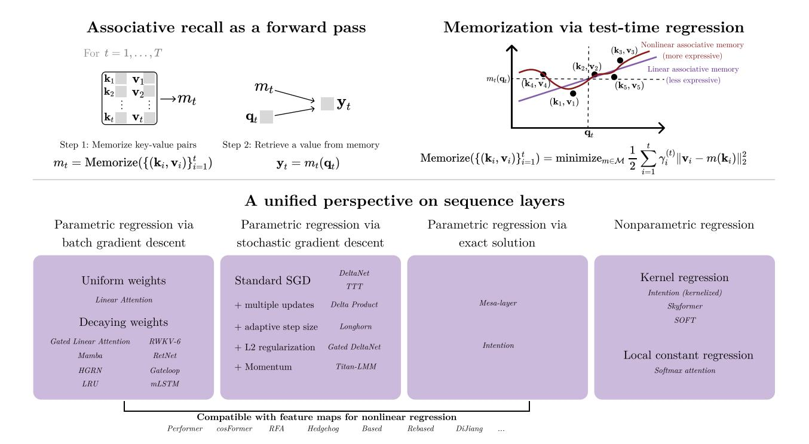
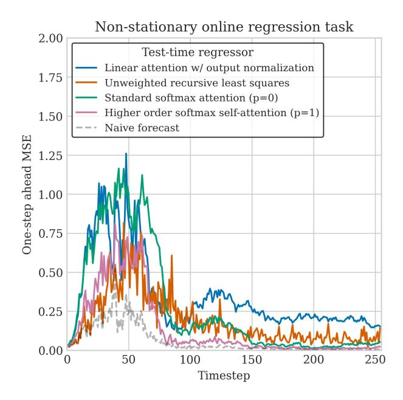
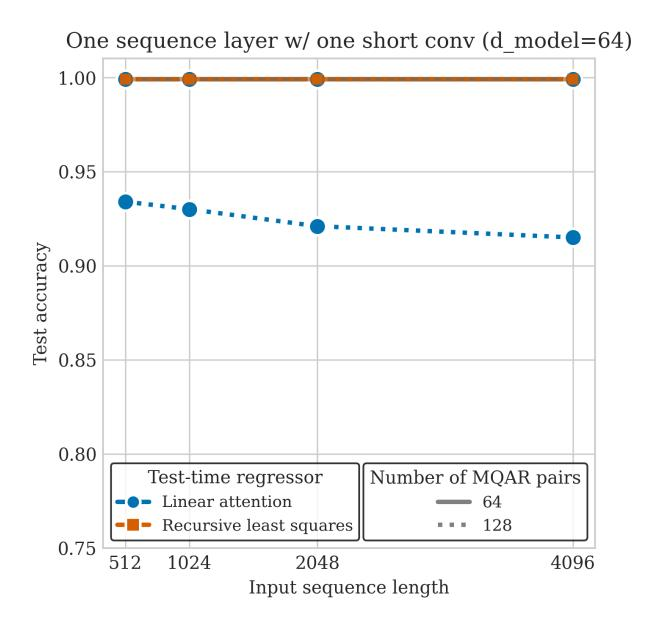

Test-time regression: a unifying framework for designing sequence models with associative memory

> Ke Alexander Wang∗ 1 , Jiaxin Shi† 2 , and Emily B. Fox12

1 Department of Computer Science, Stanford University 2 Department of Statistics, Stanford University

#### Abstract

Sequence models lie at the heart of modern deep learning. However, rapid advancements have produced a diversity of seemingly unrelated architectures, such as Transformers and recurrent alternatives. In this paper, we introduce a unifying framework to understand and derive these sequence models, inspired by the empirical importance of associative recall, the capability to retrieve contextually relevant tokens. We formalize associative recall as a two-step process, memorization and retrieval, casting memorization as a regression problem. Layers that combine these two steps perform associative recall via "test-time regression" over its input tokens. Prominent layers, including linear attention, state-space models, fast-weight programmers, online learners, and softmax attention, arise as special cases defined by three design choices: the regression weights, the regressor function class, and the test-time optimization algorithm. Our approach clarifies how linear attention fails to capture intertoken correlations and offers a mathematical justification for the empirical effectiveness of query-key normalization in softmax attention. Further, it illuminates unexplored regions within the design space, which we use to derive novel higher-order generalizations of softmax attention. Beyond unification, our work bridges sequence modeling with classic regression methods, a field with extensive literature, paving the way for developing more powerful and theoretically principled architectures.

## 1 Introduction

Sequences play a vital role in modern machine learning by providing a powerful abstraction: any computational task can be viewed as transforming one sequence into another [\(Sutskever et al.,](#page-28-0) [2014\)](#page-28-0). This sequential perspective has spread across diverse domains, including natural language processing [\(Sutskever](#page-28-0) [et al.,](#page-28-0) [2014;](#page-28-0) [Devlin et al.,](#page-23-0) [2019;](#page-23-0) [Brown et al.,](#page-22-0) [2020\)](#page-22-0), computer vision [\(Dosovitskiy et al.,](#page-23-1) [2021;](#page-23-1) [Bertasius](#page-22-1) [et al.,](#page-22-1) [2021\)](#page-22-1), time series analysis [\(Salinas et al.,](#page-27-0) [2020;](#page-27-0) [Gruver et al.,](#page-24-0) [2023;](#page-24-0) [Ansari et al.,](#page-21-0) [2024\)](#page-21-0), and computational biology [\(Jumper et al.,](#page-24-1) [2021;](#page-24-1) [Zhou and Troyanskaya,](#page-29-0) [2015;](#page-29-0) [Nguyen et al.,](#page-26-0) [2024\)](#page-26-0), highlighting the importance of building generically applicable sequence layers [\(Vaswani et al.,](#page-28-1) [2017\)](#page-28-1).

This development has produced a diversity of architectures, each with its own unique characteristics and performance trade-offs. While these architectures have achieved considerable success, they have largely emerged through separate lines of investigation. Such a fragmented and often empirically-driven approach to model development limits our ability to systematically understand and improve design choices. Moreover, the idiosyncratic notations of each architecture obscures their underlying connections [\(Rush,](#page-27-1) [2024\)](#page-27-1). Given the wide variety of sequence models, a natural question to ask is whether there is an underlying principle that explains why some sequence models work better than others.

∗Correspondence to [alxwang@cs.stanford.edu](mailto:alxwang@cs.stanford.edu)

†Now at Google Deepmind

One empirical discovery that ties together disparate architectures is the strong correlation between an architecture's associative recall ability and its language modeling performance (Olsson et al., 2022; Arora et al., 2023a). Associative recall is the act of retrieving contextually relevant information based on an association with a query. (Arora et al., 2023a) gives the following example of how associative memory and retrieval can improve language modeling. Consider the example sentence from Arora et al. (2023b): "Hakuna Matata, it means no worries for the rest of your days. Hakuna \_\_\_\_\_\_\_." To predict the next word, we can first memorize the previous occurrence of "Hakuna" and its associated value "Matata"; the next time we encounter "Hakuna" again we can retrieve its associated value from memory as our prediction. Notice that we can perform this task using only in-context information and we can make an accurate prediction even if we have never encountered this strange phrase before. Indeed, transformer-based language models have been discovered to exhibit this kind of behavior via "induction heads" that emerge during training (Olsson et al., 2022).

Given the empirical importance of associative recall, how can we systematically design neural network layers that can perform associative recall (AR)? In this paper, we introduce a simple but principled framework for deriving sequence layers designed to perform associative recall, which we call "test-time regression layers". From the "Hakuna Matata" example, we see that associative recall has two-steps: memorization and retrieval. Our crucial observation is that we can implement the memorization step by solving a weighted regression problem. We can then generate an output by applying the regressor to a cue/query token, retrieving the most relevant token from our associative memory. Combining both memorization and retrieval into the forward pass of a sequence layer results in a layer that performs regression over the input tokens, a procedure that we call "test-time regression", visualized in Figure 1. Our terminology reflects that the regressor is regenerated with each forward pass and depends only on the input tokens rather than a fixed training dataset.

Since any regression method can be used, our framework provides a general recipe to derive a large class of sequence layers. Under our framework, an AR-based sequence layer is a mathematical consequence of choosing (1) the regression weights, (2) the regressor parameterization, and (3) the optimization algorithm for finding the regressor. In this paper, we consider a few choices of these three "ingredients", and show how to *derive* many recently proposed classes of sequence layers, illustrating the generality of our framework. Our derivations reveal that linear attention (Katharopoulos et al., 2020), its feature-mapped variants (e.g. (Peng et al., 2020; Qin et al., 2021; Kasai et al., 2021; Zhang et al., 2023a; Aksenov et al., 2024; Chen et al., 2024)), its gated variants (Sun et al., 2023; Orvieto et al., 2023; Katsch, 2024; De et al., 2024; Qin et al., 2024; Peng et al., 2024; Yang et al., 2024b; Beck et al., 2024), state-space model layers (Gu and Dao, 2024; Dao and Gu, 2024), fast-weights layers (Schlag et al., 2021; Yang et al., 2024a,a), online learning layers (Liu et al., 2024; Sun et al., 2024; Yang et al., 2024a; Behrouz et al., 2024), and softmax self-attention (Vaswani et al., 2017) *are all test-time regression layers*, implicitly performing memorization followed by retrieval in their forward passes, despite being developed from different perspectives. Figure 1 previews how existing architectures are instantiations of test-time regression layers within our framework.

Our derivations also lead to new understandings of existing sequence layers. We show that layers based on linear attention underperform because they fail to account for the correlation between tokens. We also show that query-key normalization, an important technique in stabilizing the training of large language models (Dehghani et al., 2023; Wortsman et al., 2023), is mathematically necessary to ensure that softmax self-attention is a proper local constant regressor. Finally, we propose a higher order generalization of softmax attention, motivated by local linear regression.

**Outline of our paper.** We start in Section 2 by examining a few of the most prominent classes of sequence layers. Although each class of layers was developed from distinct motivations, their similar computation pattern hints at a common unifying theme that underlies their effectiveness. We then introduce

Figure 1: Our framework provides a systematic way to derive sequence models that can perform associative recall, following a two step process of memorization and retrieval. The memorization step can be formalized as a solving a regression problem at test-time. Our perspective results in a "recipe" for derving sequence layers by making three choices: the importance of each association  $\{\gamma_i^{(t)}\}_{i=1}^t$ , the regressor function class  $\mathcal{M}$ , and the optimization algorithm. Parametric regression layers tend to have an efficient recurrence for updating the memory  $m_t$ , while non-parametric layers like softmax-attention do not. For simplicity, we discuss causal sequence models where prefix key-value pairs are memorized, but the same principles also apply to non-causal ones (e.g. generically masked attention).

our test-time regression framework in Section 3 to formalize the connection between associative memorization and regression. Our perspective provides a systematic approach to designing sequence layers that produce its outputs via associative recall. In Section 4, we show that indeed all of the aforementioned classes of sequence layers can be understood from a *single unified perspective* using the principles of test-time regression and associative recall. We demonstrate the generality of our framework by deriving these layers simply by varying how we minimize the regression objective. Section 5 empirically validates that test-time regression layers implicitly perform regression over its input tokens with a single forward pass. Then, in Section 6 we examine how to construct effective key-value pairs for associative recall in next-token prediction tasks. We discuss prior work related to associative recall and memory in Section 7. We finish in Section 8 by discussing the broader implications of viewing sequence models through the lens of regression, including future directions for new architectures.

# 2 Background on existing sequence modeling layers

The goal of sequence modeling is to transform a sequence of input tokens  $\mathbf{x}_1, \dots, \mathbf{x}_T$  into output tokens  $\mathbf{y}_1, \dots, \mathbf{y}_T$  (Sutskever et al., 2014). A common design pattern, first proposed by Vaswani et al. (2017) is to transform the input tokens into key-value pairs  $(\mathbf{k}_1, \mathbf{v}_1), \dots, (\mathbf{k}_T, \mathbf{v}_T) \in \mathbb{R}^{D_k} \times \mathbb{R}^{D_v}$  and queries

 $\mathbf{q}_1, \dots, \mathbf{q}_T \in \mathbb{R}^{D_k}$  before applying operations that "mix" the sequences together to produce the output tokens. Typically, each  $\mathbf{q}_t, \mathbf{k}_t$ , and  $\mathbf{v}_t$  is a linear transform of the corresponding input token  $\mathbf{x}_t$ , which can be thought of as different "views" of  $\mathbf{x}_t$ . Most subsequent sequence layers have kept this pattern but propose other ways of "mixing" queries, keys, and values. We begin by reviewing a few classes of existing sequence layers that follow this pattern before unifying them under our test-time regression framework.

**Softmax attention.** Given input tokens  $\mathbf{x}_1, \dots, \mathbf{x}_T$ , and their query, key, value vectors, softmax attention (Vaswani et al., 2017) computes each output token by

$$\mathbf{y}_t = \sum_{i=1}^t \mathbf{v}_i \frac{s(\mathbf{k}_i, \mathbf{q}_t)}{\sum_{j=1}^t s(\mathbf{k}_j, \mathbf{q}_t)}$$
(1)

for  $t \in [T]$  where  $s(\mathbf{k}, \mathbf{q}) = \exp(\mathbf{k}^{\top} \mathbf{q}/\sqrt{D_k})$ . Each output  $\mathbf{y}_t$  is a weighted sum of values  $\{\mathbf{v}_i\}_{i=1}^t$ , weighted by the similarity between the query  $\mathbf{q}_t$  and the keys  $\{\mathbf{k}_i\}_{i=1}^t$  associated with the values. This mechanism can be seen as a continuous-valued lookup table, using  $\mathbf{q}_t$  to lookup an interpolated value for  $\mathbf{y}_t$ . Though highly effective, self-attention requires  $\mathcal{O}\left(T^2\right)$  time to autoregressively compute the entire length T sequence even after caching the keys and values, which can be prohibitively slow for generating long sequences.

**Linear attention.** To address the computational challenges of self-attention, there has been a wealth of methods that seek to develop more efficient alternatives; see the survey by Tay et al. (2022). One particular class of more efficient sequence models has its origins in a recurrent variant of attention, known as linear attention (Katharopoulos et al., 2020). To achieve this efficiency, linear attention uses the standard inner product  $\mathbf{k}^{\top}\mathbf{q}$ , rather than using the exponentiated inner product  $s(\mathbf{k}_i, \mathbf{q}_t)$ , producing outputs of the form  $\mathbf{y}_t \propto \sum_{i=1}^t \mathbf{v}_i \mathbf{k}_i^{\top} \mathbf{q}_t$  up to a normalization. This change allows all T outputs to be recurrently computed in  $\mathcal{O}(T)$  time, an asymptotic speedup, by updating a  $D_v \times D_k$  "matrix-valued state"  $\mathbf{M}_t = \sum_{i=1}^t \mathbf{v}_i \mathbf{k}_i^{\top}$ , following the recurrence

$$\mathbf{M}_t = \mathbf{M}_{t-1} + \mathbf{v}_t \mathbf{k}_t^{\top}, \quad \mathbf{y}_t = \mathbf{M}_t \mathbf{q}_t = \sum_{i=1}^t \mathbf{v}_i \mathbf{k}_i^{\top} \mathbf{q}_t.$$
 (2)

Each rank-1 outer product  $\mathbf{v}_t \mathbf{k}_t^{\top}$  can be thought of as writing a new key-value pair into memory. Although Katharopoulos et al. (2020)'s original formulation of linear attention included a normalization like softmax attention, we drop the normalization here since later works found that this normalization method causes training instabilities (Qin et al., 2022; Dao and Gu, 2024).

To increase expressiveness, Katharopoulos et al. (2020) also proposed a variant of linear attention, inspired by the kernel trick (Schölkopf and Smola, 2001), that replaces the inner product  $\mathbf{k}^{\top}\mathbf{q}$  with an inner product in a feature space  $\phi(\mathbf{k})^{\top}\phi(\mathbf{q})$  where  $\phi$  is a feature map  $\phi:D_k\to D_{\phi}$ . This modification results in the recurrence

$$\mathbf{M}_t = \mathbf{M}_{t-1} + \mathbf{v}_t \phi(\mathbf{k}_t)^\top, \quad \mathbf{y}_t = \mathbf{M}_t \phi(\mathbf{q}_t) = \sum_{i=1}^t \mathbf{v}_i \phi(\mathbf{k}_i)^\top \phi(\mathbf{q}_t).$$
(3)

Katharopoulos et al. (2020) used  $\phi = 1 + \text{ELU}$ , but numerous alternative choices of feature maps have since been proposed, including the cosine function (Qin et al., 2021), deterministic parameter-free projections (Schlag et al., 2021), polynomial maps (Zhang et al., 2023a; Aksenov et al., 2024; Arora et al., 2024), random features (Peng et al., 2020; Choromanski et al., 2020; Chen et al., 2024), and more.

State-space models and linear attention with forgetting. Since the recurrent state  $\mathbf{M}_t$  of linear attention has finite size ( $D_v \times D_k$  numbers),  $\mathbf{M}_t$  can only store a bounded amount of information. In Equation 2,  $\mathbf{M}_t$  weighs all key value pairs equally across timesteps, trying to compress all key-value pairs equally well into its finite-sized state. As a result, the performance of linear attention can degrade as the sequence length increases. To address this limitation, various works have proposed adding a forgetting factor  $\gamma_t$  to allow  $\mathbf{M}_t$  to retain only the most recent information, decaying out key-value pairs over time. This produces the recurrence

$$\mathbf{M}_t = \gamma_t \mathbf{M}_{t-1} + \mathbf{v}_t \mathbf{k}_t^{\top}, \quad \mathbf{y}_t = \mathbf{M}_t \mathbf{q}_t. \tag{4}$$

At each step t, all previous values in  $\mathbf{M}_{t-1}$  are attenuated by a factor of  $\gamma_t \in [0,1]$  before the new value is stored. When  $\gamma_t$  depends on  $\mathbf{x}_t$ , this forgetting factor can be seen as a forgetting gate, akin to that of an LSTM (Hochreiter and Schmidhuber, 1997). This class of linear attention with forgetting includes RetNet (Sun et al., 2023), gated linear attention (Yang et al., 2024b), Gateloop (Katsch, 2024), mLSTM (Beck et al., 2024), LRU (Orvieto et al., 2023), HGRN (Qin et al., 2024), and RWKV-6 (Peng et al., 2024). See Table 1 of Yang et al. (2024b) for how each model implements  $\gamma_t$ .

The forgetting factor in linear attention is also equivalent to another class of sequence layers known as state-space models (SSMs), which includes Mamba (Gu and Dao, 2024) and Mamba-2 (Dao and Gu, 2024). State-space models originated from a line of work on optimal online orthogonal polynomial projections (Gu et al., 2020, 2021, 2022) that enabled the architecture to retain information over long sequences. However, many recent works (Han et al., 2024; Trockman et al., 2024; Ren et al., 2024), including the Mamba-2 followup (Dao and Gu, 2024), have since shown that SSM layers are equivalent to linear attention with forgetting; the forgetting factor maps onto the time-varying step size and transition matrix used in SSMs.

Fast-weight layers and test-time training layers. An alternative to attenuating *all* past information in  $\mathbf{M}_{t-1}$  is to forget only the values whose keys are most similar to the new key  $\mathbf{k}_t$ . This was the motivation behind DeltaNet (Schlag et al., 2021), which is a revival of classic fast weight layers (Schmidhuber, 1992). DeltaNet follows a recurrence

$$\mathbf{M}_{t} = \mathbf{M}_{t-1} - \underbrace{(\mathbf{M}_{t-1}\mathbf{k}_{t})}_{\mathbf{v}_{t}^{\text{old}}} \mathbf{k}_{t}^{\top} + \underbrace{[\beta_{t}\mathbf{v}_{t} + (1-\beta_{t})\underbrace{\mathbf{M}_{t-1}\mathbf{k}_{t}}_{\mathbf{v}_{t}^{\text{new}}}]}_{\mathbf{v}_{t}^{\text{new}}} \mathbf{k}_{t}^{\top}$$
(5)

$$= \mathbf{M}_{t-1}(\mathbf{I} - \beta_t \mathbf{k}_t \mathbf{k}_t^{\top}) + \beta_t \mathbf{v}_t \mathbf{k}_t^{\top}$$
(6)

where the first equation follows the notation of Schlag et al. (2021) in defining  $\beta_t \in [0, 1]$ ,  $\mathbf{v}_t^{\text{old}}$ , and  $\mathbf{v}_t^{\text{new}}$ . Like previous layers, the output at step t is also  $\mathbf{y}_t = \mathbf{M}_t \mathbf{q}_t$ . Comparing the recurrence of DeltaNet (Equation 5) to that of linear attention (Equation 2), we can interpret the update rule as rewriting the value that was bound to key  $\mathbf{k}_t$ . The update rule deletes an old value  $\mathbf{v}_t^{\text{old}} = \mathbf{M}_{t-1}\mathbf{k}_t$  retrieved from the previous timestep's memory  $\mathbf{M}_{t-1}$  but using the new key  $\mathbf{k}_t$ . The layer then updates the recurrent state with a new interpolated value  $\mathbf{v}_t^{\text{new}}$ , binding it to  $\mathbf{k}_t$ .

The iterates  $\mathbf{M}_t$  are also known as "fast-weights", originally proposed by Schmidhuber (1992). These weights/iterates are "fast" because they change with each timestep, rapidly adapting to the input tokens, in contrast to the "slow-weights" in the rest of the neural network, such as the linear projections weights, which are only adjusted at training time. The traditional "slow-weights" can be seen as the weights of a metalearner (Clark et al., 2022), learning to use the "fast-weights" to learn from the input sequence (Sun et al., 2024).

Online learning layers. The recurrences we have reviewed so far all share a common high-level behavior: at each timestep t, the recurrent state must be adapted to incorporate information from the latest key-value pair  $(\mathbf{k}_t, \mathbf{v}_t)$ . This property can be seen as making an online sequence of decisions, balancing between retaining historical information and adapting to new information.

Motivated by this sequential decision making perspective, Liu et al. (2024) proposed to derive recurrences by minimizing an online sequence of objectives:

$$\mathbf{M}_{t} = \underset{\mathbf{M}}{\operatorname{argmin}} \ d(\mathbf{M}_{t-1}, \mathbf{M}) + \ell_{t}(\mathbf{M})$$
(7)

where  $d(\mathbf{M}_{t-1}, \mathbf{M})$  is a measure of the discrepancy between  $\mathbf{M}$  and the previous iterate  $\mathbf{M}_{t-1}$ , encouraging retention of older information, and  $\ell_t$  is a loss function that encourages adapting to new information. Once again, the output is computed by  $\mathbf{y}_t = \mathbf{M}_t \mathbf{q}_t$ . Recurrent layers derived via Equation 7 are called "online learning layers" or "online learners". Recent examples of such layers include Longhorn (Liu et al., 2024), Gated DeltaNet(Yang et al., 2024a), and Titans (Behrouz et al., 2024), each of these layers was derived from specific choice of functions d and  $\ell_t$ . See Table 2 from Yang et al. (2024a) for each layer's choice of d and  $\ell_t$ .

### 3 Test-time regression as a framework for designing sequence layers

Having discussed a number of existing sequence layers, each motivated by an atomic architectural modification, we now present a unified framework to clarify their relationship to each other. Our approach is motivated by empirical findings that a model's associative recall ability strongly correlates with its performance and in-context learning capabilities (Olsson et al., 2022; Arora et al., 2023a). We formalize the two step process of memorization and retrieval, presenting a principled recipe for deriving sequence layers with mathematically grounded recall abilities.

Step 1: Memorization as regression. From our everyday experience, we already have an intuition for how associative memory should behave; for example, hearing a friend's name should trigger a mental impression of that friend. This pairing of a "cue" and a "response" is known as an association. To reflect terminology in deep learning (Vaswani et al., 2017), we will refer to cues as "keys" and responses as "values". With this intuition, we can define a mathematical model for associative memory. Given key-value pairs  $(\mathbf{k}_1, \mathbf{v}_1), \dots, (\mathbf{k}_t, \mathbf{v}_t) \in \mathbb{R}^{D_k} \times \mathbb{R}^{D_v}$  to be memorized, an associative memory system is a function  $m: \mathbb{R}^{D_k} \to \mathbb{R}^{D_v}$  such that  $m(\mathbf{k}_i) \approx \mathbf{v}_i$  for  $i = 1, \dots, t$  (Kohonen, 1972, 1989). Such a mapping m between two sets of related objects is also known as a hetero-associative memory in classic signal processing and neurocomputing literature (Hinton and Anderson, 1989).

Our main observation is that finding a memory map that satisfies these constraints reduces to finding a vector-valued regressor m. We can then store a set of key-value associations into an associative memory system by solving the weighted regression problem

Memorize associations: 
$$m_t \approx \underset{m \in \mathcal{M}}{\operatorname{argmin}} \frac{1}{2} \sum_{i=1}^t \gamma_i^{(t)} \|\mathbf{v}_i - m(\mathbf{k}_i)\|_2^2,$$
 (8)

where the importance of each association is controlled by adjusting the relative weights  $\{\gamma_i^{(t)}\}_{i=1}^t$  Classic works on associative memory are restricted to linear memory maps, corresponding to linear regression (Kohonen, 1989, Chapter 6.6), but here we allow  $\mathcal M$  to be any function class. We refer to this relationship between regression and associative memory as the "regression-memory correspondence".

Step 2: Memory retrieval as function application. Having derived a regression-based procedure to memorize a set of associations into m, we can now retrieve values from memory by applying m to a new vector, which we call a "query"  $\mathbf{q}$ , producing output

Memory retrieval: 
$$\mathbf{y}_t = m_t(\mathbf{q}_t)$$
. (9)

The retrieval performance depends on how well Equation 8 is minimized. When Equation 8 attains zeroloss,  $m_t$  memorizes all associations perfectly, and we get perfect retrieval:  $m_t(\mathbf{k}_i) = \mathbf{v}_i$  for  $i = 1, \dots, t$ . For certain function classes  $\mathcal{M}$ , e.g. smooth functions, m can also extrapolate outside of the existing set of keys. In those cases,  $m_t(\mathbf{q})$  instead retrieves a value based on the proximity of  $\mathbf{q}$  to the existing set of keys.

Sequence layers that memorize then retrieve. Having formalized memorization and retrieval via our regression framework, we can now combine the two to produce sequence layers that directly performs associative recall as a forward pass. Recall that we are given  $\{\mathbf{q}_i\}_{i=1}^T, \{\mathbf{k}_i\}_{i=1}^T, \text{ and } \{\mathbf{v}_i\}_{i=1}^T, \text{ and we seek to produce a set of outputs } \{\mathbf{y}_i\}_{i=1}^T \text{ with our sequence layer. The forward pass of a test-time regression layer first memorizes a set of key-value pairs and then produces <math>\mathbf{y}_t$  by retrieving a value from its associative memory. More specifically, in causal modeling, at each timestep t, we first solve Equation 8 to get a regressor  $m_t$  that memorizes the prefix  $\{(\mathbf{k}_i, \mathbf{v}_i)\}_{i=1}^t$ ; then we apply  $m_t$  to  $\mathbf{q}_t$  to get  $\mathbf{y}_t = m_t(\mathbf{q}_t)$ . This naturally generalizes to non-causal tasks where  $m_t$  can depend on suffix key-value pairs  $\{\mathbf{k}_i, \mathbf{v}_i\}_{i>t}$  as well. Our procedure is compatible with multihead design patterns inspired by multihead attention (Vaswani et al., 2017), multi-query attention (Shazeer, 2019), and grouped query attention (Ainslie et al., 2023). For example, multihead test-time regression can be implemented using H independent sets of queries, keys, and values, resulting in H independent associative memory maps at each timestep.

A recipe for designing your own sequence layer. Although Equation 8 succinctly summarizes the memorization step of our framework, it leaves many details unspecified. For example, over which class of regressors  $\mathcal{M}$  should we consider? Additionally, which associations should we prioritize memorizing? Finally, which optimization procedure should we use to minimize the loss? The regression-memory correspondence thus allows for a vast design space. We partition this wide landscape into three simple design choices:

- 1. the relative importance of each association, specified through weights in Equation 8,
- 2. the function class  $\mathcal{M}$  over which we search,
- 3. the minimization algorithm,

giving us a formulaic "recipe" for deriving sequence layers that can perform associative recall.

# 4 Deriving existing architectures from regression

To demonstrate how our framework unifies our understanding of sequence models, we succinctly derive a swath of recently proposed sequence layers. We categorize existing sequence layers into four distinct classes: linear attention (possibly with feature maps), linear attention with gating (which includes statespace models like Mamba), fast-weight layers, online learners, and softmax self-attention.

**Notation.** We first explain the mathematical notation we will use in our derivations. We use bold lower-case letters to refer to vectors (e.g.  $\mathbf{x}, \mathbf{k}, \mathbf{v}$ ) and bold uppercase letters to refer to matrices (e.g.  $\mathbf{M}, \mathbf{K}, \mathbf{V}$ ). Assume we have a sequence of T inputs  $\mathbf{x}_1, \dots, \mathbf{x}_T$  which have already transformed into a sequence of keys and values ( $\mathbf{k}_1, \mathbf{v}_1$ ), ..., ( $\mathbf{k}_T, \mathbf{v}_T$ ). We will use these keys and values as the dataset for our test-time regression problem. Let  $\mathbf{K}_t = \begin{bmatrix} \mathbf{k}_1 \dots \mathbf{k}_t \end{bmatrix}^\top \in \mathbb{R}^{t \times D_k}$  and  $\mathbf{V}_t = \begin{bmatrix} \mathbf{v}_1 \dots \mathbf{v}_t \end{bmatrix}^\top \in \mathbb{R}^{t \times D_v}$  be matrices that contain t keys and t values respectively, for  $t = 1, \dots, T$ . Each key/value vector is a row of the key/value matrix.

#### Vignette 1: Linear attention is (suboptimal) linear least squares regression

We start by deriving an architecture from linear least squares, the most classic regression method. Linear least squares corresponds to the following choices in our recipe.

1. Choice of weights: assign equal weight  $\gamma_i^{(t)} = 1$  to each association,

$$m_{\text{LINEAR}, t} = \underset{m \in \mathcal{M}_{\text{LINEAR}}}{\operatorname{argmin}} \frac{1}{2} \sum_{i=1}^{t} ||\mathbf{v}_i - m(\mathbf{k}_i)||_2^2.$$
(10)

- 2. Choice of function class: linear functions  $\mathcal{M}_{\text{LINEAR}} = \{m \mid m(\mathbf{k}) = \mathbf{M}\mathbf{k}, \ \mathbf{M} \in \mathbb{R}^{D_v \times D_k}\}.$
- 3. Choice of minimization algorithm: analytical solution equivalent to one step of Newton's method1.

Since  $m_{\text{LINEAR}, t}$  is a linear function, it is equivalent to a linear map  $\mathbf{M}_t \in \mathbb{R}^{D_v \times D_k}$ . Minimizing the linear least squares objective results in the solution:

$$\mathbf{M}_{t} = \underset{\mathbf{M}}{\operatorname{argmin}} \frac{1}{2} \sum_{i=1}^{t} \|\mathbf{v}_{i} - \mathbf{M} \mathbf{k}_{i}\|_{2}^{2} = \begin{cases} \mathbf{V}_{t}^{\top} \mathbf{K}_{t} (\mathbf{K}_{t}^{\top} \mathbf{K}_{t})^{-1}, \text{ overdetermined, e.g. } t \geq D_{k}, \\ \mathbf{V}_{t}^{\top} (\mathbf{K}_{t} \mathbf{K}_{t}^{\top})^{-1} \mathbf{K}_{t}, \text{ underdetermined, e.g. } t < D_{k}, \end{cases}$$
(11)

where we choose the min-norm solution in the underdetermined case. The overdetermined case corresponds to  $\mathbf{K}_t$  having rank  $D_k$  (linearly independent columns) and the underdetermined case corresponds to  $\mathbf{K}_t$  having rank t (linearly independent rows). In general, we can express the solution in terms of a Moore-Penrose pseudoinverse:  $\mathbf{M}_t = \mathbf{V}_t^{\top}(\mathbf{K}_t^{\dagger})^{\top}$ . We restrict our discussion to the case of  $t \geq D_k$  with linearly independent columns, which is the case for typical applications.

**Relationship to linear attention.** Although  $m_{\text{LINEAR},\,t}$  is the optimal linear memory with respect to our objective function, it can be expensive to compute, requiring us to invert a  $D_k \times D_k$  matrix at every timestep. One crude but hardware-efficient simplification would be to assume that  $\mathbf{K}_t^{\top}\mathbf{K}_t = \mathbf{I}$ , avoiding matrix inversion completely, at the cost of some recall ability. After making this rough approximation, we arrive exactly at the equations for linear attention:

$$\mathbf{y}_t = m_{\text{LINEAR}}(\mathbf{q}_t) = \mathbf{V}_t^{\top} \mathbf{K}_t (\mathbf{K}_t^{\top} \mathbf{K}_t)^{-1} \mathbf{q}_t \approx \mathbf{V}_t^{\top} \mathbf{K}_t \mathbf{q}_t = \sum_{i=1}^t \mathbf{v}_i \mathbf{k}_i^{\top} \mathbf{q}_t.$$
(12)

Our derivation clarifies exactly how linear attention underperforms as an associative memory. When the keys are zero mean,  $\mathbf{K}_t^{\top} \mathbf{K}_t$  is proportional to the empirical covariance matrix of the keys. Thus linear attention is a crude associative memory that ignores the covariance between the dimensions of the key vectors. In fact, it is an optimal linear memory only when  $t \leq D_k$  and the keys are orthonormal  $\mathbf{k}_i^{\top} \mathbf{k}_j = \delta_{ij}$ .

&lt;sup>1Since the objective function is quadratic, the analytical solution is equivalent to one iteration of Newton's method initializing from the origin.

From a training stability perspective, the inverse covariance factor helps prevent the output  $y_t$  from becoming unbounded. We can bound the norm of the output of a least squares layer (Equation 11) by

$$\|\mathbf{y}_{t}\|_{2} = \|\mathbf{V}_{t}^{\top}\mathbf{K}_{t}(\mathbf{K}_{t}^{\top}\mathbf{K}_{t})^{-1}\mathbf{q}_{t}\|_{2} \leq \frac{\|\mathbf{q}_{t}\|_{2}\left(\sum_{i=1}^{t}\|\mathbf{v}_{i}\|_{2}\|\mathbf{k}_{i}\|_{2}\right)}{\lambda_{\min}(\mathbf{K}_{t}^{\top}\mathbf{K}_{t})}$$
(13)

where  $\lambda_{\min}(\mathbf{K}_t^{\top}\mathbf{K}_t)$  is the minimum eigenvalue of  $\mathbf{K}_t^{\top}\mathbf{K}_t$ . See Appendix A for the derivation. When we ignore the covariance matrix, approximating it with the identity, the denominator disappears and the output  $\mathbf{y}_t$  can grow arbitrarily large with the sequence length, leading to training instability. This instability indeed shows up in practice for linear attention, and Qin et al. (2022) proposed output normalization to stabilize training. Our derivation shows that output normalization works by approximately restoring the self-normalizing property of Equation 11 that linear attention loses.

Regardless of training stability, we will see in Section 6 that ignoring the covariance causes linear attention to perform worse at associative recall.

Efficient computation. Conveniently, we can compute  $\mathbf{M}_t$  in Equation 11 for  $t=1,\ldots T$  in parallel or sequentially. To compute them in parallel, we solve a batch of T independent linear systems. To compute them sequentially, we note that  $(\mathbf{K}_t^{\top}\mathbf{K}_t)^{-1} = (\mathbf{K}_{t-1}^{\top}\mathbf{K}_t + \mathbf{k}_t\mathbf{k}_t^{\top})^{-1}$ , allowing us to autoregressively compute the inverses via the Woodbury matrix identity. The sequential form is known as online linear regression or recursive least squares (RLS) (Haykin, 2014). Thus during training we can parallelize across the sequence axis by solving a batch of T linear systems, and during testing we can unroll the recurrence into a recurrent neural network. In prior deep learning literature, this idea of linear-regression-as-a-layer has been explored by Garnelo and Czarnecki (2023) and von Oswald et al. (2023) under the names "intention" and "mesa-layer", respectively, motivated by heuristic similarities to softmax attention, rather than deriving them from first principles via enforcing associative recall as we do here.

Nonlinear associative memory. So far we have only considered *linear* associative memory implemented by linear functions in  $\mathcal{M}_{\text{LINEAR}}$ , which have limited expressiveness. We can derive *nonlinear* memory by using a feature map  $\phi: \mathbb{R}^{D_k} \to \mathbb{R}^{D_\phi}$ , replacing each key  $\mathbf{k}_i$  with  $\phi(\mathbf{k}_i)$ . Then our function class is defined by  $\mathcal{M}_\phi = \{m \mid m(\mathbf{k}) = \mathbf{M}\phi(\mathbf{k}), \ \mathbf{M} \in \mathbb{R}^{D_v \times D_\phi}\}$  and we solve the least-squares objective  $\underset{i=1}{\text{argmin}} \mathbf{M} \sum_{i=1}^t \|\mathbf{v}_i - \mathbf{M}\phi(\mathbf{k}_i)\|_2^2/2$ . Solving this least squares objective for  $\mathbf{M}$  results in an optimal associative memory that is nonlinear with respect to the input keys. Parameterizing associative memory with a nonlinear feature map has a long history, dating back to Poggio (1975) which found polynomial feature maps to be highly effective, consistent with more recent works (Zhang et al., 2023a; Arora et al., 2024).

If we make the same crude approximation as linear attention of disregarding the covariance among  $\{\phi(\mathbf{k}_i)\}_{i=1}^t$ , we arrive at a suboptimal nonlinear memory. Thus, recent works that apply linear attention with a nonlinear feature map, such as Schlag et al. (2021); Kasai et al. (2021); Zhang et al. (2023a); Chen et al. (2024), and others, can be understood within our framework as suboptimal nonlinear memory as well.

# Vignette 2: Gated linear attention and state-space models are (suboptimal) weighted linear least squares regression

For many kinds of sequential data, such as time-series data and text data, recent tokens are more informative of predicting the next token. Thus a natural requirement is to encourage our memory  $m_t$  to focus more on the recent history by downweighting the past. Fortunately, this can be straightforwardly enforced through classic *weighted* linear least squares regression together with geometrically decaying weights to *forget* older key-value pairs.

To develop an architecture from weighted linear least squares, we only need to add weights to the optimization objective relative to ordinary least squares:

1. Choice of weights: assign time-decaying weights to associations,

$$m_{\text{LINEAR}, t} = \underset{m \in \mathcal{M}_{\text{LINEAR}}}{\operatorname{argmin}} \frac{1}{2} \sum_{i=1}^{t} \gamma_i^{(t)} \| \mathbf{v}_i - m(\mathbf{k}_i) \|_2^2, \tag{14}$$

Here, to connect to past literature, we focus on weights are geometrically decaying in time:  $\gamma_i^{(t)} = \prod_{j=i+1}^t \gamma_j$  and  $\gamma_i \in [0,1]$  for  $i=1,\ldots,t$ . Each association is down-weighted based on how far it is from the current timestep t:  $\gamma_1^{(t)} \leq \ldots \gamma_{t-1}^{(t)} \leq \gamma_t^{(t)} = 1$ .

- 2. Choice of function class: linear functions  $\mathcal{M}_{\text{LINEAR}} = \{m \mid m(\mathbf{k}) = \mathbf{M}\mathbf{k}, \ \mathbf{M} \in \mathbb{R}^{D_v \times D_k}\}.$
- 3. Choice of minimization algorithm: analytical solution equivalent to one step of Newton's method.

We can solve weighted linear regression by instead solving an unweighted regression problem involving rescaled keys and values,  $\mathbf{V}_t \mapsto \mathbf{\Gamma}_t^{1/2} \mathbf{V}_t$  and  $\mathbf{K}_t \mapsto \mathbf{\Gamma}_t^{1/2} \mathbf{K}_t$ , where we defined a diagonal matrix  $\mathbf{\Gamma}_t \in \mathbb{R}^{t \times t}$  with entries  $(\mathbf{\Gamma}_t)_{ii} = \gamma_i^{(t)}$ . Making the rescaled substitution and reusing the analytical min-norm solution that we had before, we see that

$$\mathbf{M}_{t} = \begin{cases} \mathbf{V}_{t}^{\top} \mathbf{\Gamma}_{t} \mathbf{K}_{t} (\mathbf{K}_{t}^{\top} \mathbf{\Gamma}_{t} \mathbf{K}_{t})^{-1}, \text{ overdetermined, e.g. } t \geq D_{k} \\ \mathbf{V}_{t}^{\top} (\mathbf{K}_{t} \mathbf{K}_{t}^{\top})^{-1} \mathbf{K}_{t}, \text{ underdetermined, e.g. } t < D_{k}. \end{cases}$$
(15)

The underdetermined case has the same solution in both the weighted and unweighted case; intuitively this is because when the system is underdetermined, there are infinitely many solutions that interpolate the data points and attain zero regression loss, rendering the weights irrelevant.

Relationship to linear attention with gating and state-space models. Once again, computing  $\mathbf{M}_t$  requires matrix inversion which is not efficient on matrix-multiplication based hardware. Making a crude approximation similar to before of  $\mathbf{K}_t^{\top} \mathbf{\Gamma}_t \mathbf{K}_t \approx \mathbf{I}$  results in  $\mathbf{M}_t \approx \mathbf{V}_t^{\top} \mathbf{\Gamma}_t \mathbf{K}_t = \sum_{i=1}^t \gamma_i^{(t)} \mathbf{v}_i \mathbf{k}_i^{\top}$ . We can further unroll this equation into a recurrence due to the multiplicative structure of our weights:

$$\mathbf{M}_{t} \approx \sum_{i=1}^{t} \gamma_{i}^{(t)} \mathbf{v}_{i} \mathbf{k}_{i}^{\top} = \sum_{i=1}^{t} \left( \prod_{j=i+1}^{t} \gamma_{j} \right) \mathbf{v}_{i} \mathbf{k}_{i}^{\top} = \gamma_{t} \sum_{i=1}^{t-1} \gamma_{i}^{(t-1)} \mathbf{v}_{i} \mathbf{k}_{i}^{\top} + \mathbf{v}_{t} \mathbf{k}_{t}^{\top} = \gamma_{t} \mathbf{M}_{t-1} + \mathbf{v}_{t} \mathbf{k}_{t}^{\top}.$$
(16)

This is exactly the recurrence implemented by gated variants of linear attention, such as GLA (Yang et al., 2024b), RetNet (Sun et al., 2023), Gateloop (Katsch, 2024), RWKV-6 (Peng et al., 2024), mLSTM (Beck et al., 2024), LRU (Orvieto et al., 2023), as well as state-space models like Mamba-2 (Dao and Gu, 2024). Forgetting older tokens significantly improves performance, which was first discovered *empirically* (Hochreiter and Schmidhuber, 1997; Greff et al., 2017; van der Westhuizen and Lasenby, 2018). Our derivation of gating from weighted least squares provides a mathematical grounding for the forgetting heuristic upon which these sequence layers were based.

**Efficient computation.** Like before, we can compute the memory of our architecture (without approximation) sequentially or in parallel as long as we are willing to invest FLOPs in matrix inversion. Parallel computation can be done by solving a batch of T  $D_k \times D_k$  linear systems. The sequential version can be derived by applying the Woodbury matrix inversion formula while taking into account our geometrically-decaying weights. Geometrically-weighted recursive least squares (RLS) is a classic method from the adaptive filtering literature (Johnstone et al., 1982).

# Vignette 3: Fast weight programmers and online learners are first-order methods for solving streaming least-squares

Up until now we have derived linear associative memory architectures through direct analytical solution, equivalent to one step of Newton's method, a second-order optimization method. However, second-order iterative methods are computationally expensive, requiring matrix inversions at each step. On the other hand, disregarding the matrix inversion as done by linear attention leads to poor performance, since it ignores the covariance structure of the data.

A computationally cheaper alternative is to apply a first-order gradient-descent method. We consider this here with the following design choices:

1. Choice of weights: assign equal weight  $\gamma_i^{(t)} = 1$  to each association,

$$m_{\text{LINEAR}, t} = \underset{m \in \mathcal{M}_{\text{LINEAR}}}{\operatorname{argmin}} \frac{1}{2} \sum_{i=1}^{t} ||\mathbf{v}_i - m(\mathbf{k}_i)||_2^2.$$
(17)

- 2. Choice of function class: linear functions  $\mathcal{M}_{\text{LINEAR}} = \{m \mid m(\mathbf{k}) = \mathbf{M}\mathbf{k}, \ \mathbf{M} \in \mathbb{R}^{D_v \times D_k}\}.$
- 3. Choice of minimization algorithm: gradient descent, possibly with adaptive step sizes, momentum, or weight decay (L2 regularization).

We can now derive the test-time regression layer corresponding to a first-order iterative method. Since we consider linear functions, solving Equation 17 is equivalent to minimizing the objective

$$\mathcal{L}_t(\mathbf{M}) = \sum_{i=1}^t L_i(\mathbf{M}) = \sum_{i=1}^t \frac{1}{2} \|\mathbf{v}_i - \mathbf{M}\mathbf{k}_i\|_2^2,$$
(18)

using its gradient

$$\nabla \mathcal{L}_t(\mathbf{M}) = \sum_{i=1}^t \nabla L_i(\mathbf{M}) = \sum_{i=1}^t (\mathbf{M} \mathbf{k}_i - \mathbf{v}_i) \mathbf{k}_i^{\top} = (\mathbf{M} \mathbf{K}_t^{\top} - \mathbf{V}_t^{\top}) \mathbf{K}_t.$$
(19)

to find  $\mathbf{M}_t$ . Let the initialization be at the origin  $\mathbf{M}_t^{(0)} = \mathbf{0}$ . Iteratively solving this objective with full-batch gradient descent and step size  $\beta_t^{(i)}$  at each iteration results in

$$\mathbf{M}_t^{(i)} = \mathbf{M}_t^{(i-1)} - \beta_t^{(i)} \nabla \mathcal{L}_t(\mathbf{M}_t^{(i-1)})$$
(20)

$$= \mathbf{M}_{t}^{(i-1)} - \beta_{t}^{(i)} \sum_{j=1}^{t} \nabla L_{j}(\mathbf{M}_{t}^{(i-1)})$$
(21)

$$= \mathbf{M}_t^{(i-1)} - \beta_t^{(i)} \sum_{j=1}^t (\mathbf{M}_t^{(i-1)} \mathbf{k}_j - \mathbf{v}_j) \mathbf{k}_j^{\top}$$
(22)

$$= \mathbf{M}_t^{(i-1)} (\mathbf{I} - \sum_{j=1}^t \beta_t^{(i)} \mathbf{k}_j \mathbf{k}_j^{\mathsf{T}}) + \beta_t^{(i)} \sum_{j=1}^t \mathbf{v}_j \mathbf{k}_j^{\mathsf{T}}.$$
(23)

After I iterations, we produce the linear memory represented by  $\mathbf{M}_t = \mathbf{M}_t^{(I)}$ .

**Linear attention and variants as one-step of batch gradient descent** Consider the I=1 case with step size  $\beta_t^{(i)}=1$ . Since we initialize at the origin, we obtain the equation for linear attention

$$\mathbf{M}_t^{(1)} = \mathbf{M}_t^{(0)} - \nabla \mathcal{L}_t(\mathbf{M}_t^{(0)}) = \mathbf{V}_t^{\mathsf{T}} \mathbf{K}_t = \sum_{i=1}^t \mathbf{v}_i \mathbf{k}_i^{\mathsf{T}}.$$
 (24)

This is exactly the result of performing one-step of full batch gradient descent on the least square objective  $\mathcal{L}_t$ . A similar result can be shown for layers that implement linear attention with forgetting, performing one step of full batch gradient descent on the weighted least square objective.

A standard technique to accelerate the convergence of gradient descent is to precondition the gradient (Boyd and Vandenberghe, 2004). The optimal preconditioner in this case, due to the quadratic objective, is the *constant* Hessian of  $\mathcal{L}_t$ ,  $\mathbf{H}_{\mathcal{L}_t}(\mathbf{M}) = \mathbf{K}_t^{\top} \mathbf{K}_t$ . This preconditioner allows gradient descent to converge in a *single update* 

$$\mathbf{M}_{t}^{(1)} = \mathbf{M}_{t}^{(0)} - \nabla \mathcal{L}_{t}(\mathbf{M}_{t}^{(0)}) \mathbf{H}_{\mathcal{L}_{t}}(\mathbf{M}_{t}^{(0)})^{-1} = \mathbf{V}_{t}^{\mathsf{T}} \mathbf{K}_{t} (\mathbf{K}_{t}^{\mathsf{T}} \mathbf{K}_{t})^{-1}, \tag{25}$$

reproducing the analytic solution from Equation 11. The preconditioned recurrence is equivalent to one step of Newton's method, a second order iterative method.

By taking this iterative optimization perspective, we see that *linear attention and the ideal linear associative memory lie on two extremes: one-step of batch gradient descent with no preconditioning (Equation 2) versus one-step of batch gradient descent with perfect preconditioning (Equation 11).* The difference in performance comes from whether the optimizer accounts for the curvature of the objective, governed by the covariance of the keys (Boyd and Vandenberghe, 2004). Exploring other preconditioners, e.g. quasi-Newton methods, that interpolates between the two extremes may be an interesting direction for future research.

Stochastic gradient descent as a layer. An alternative to full-batch gradient descent is stochastic gradient descent (SGD) where we use a subset of the samples to compute the gradient at each step. This is particularly convenient in causal sequence modeling where keys and values typically are presented one at a time, rather than all at once. In this streaming setting, we can instead perform single-example SGD to iteratively minimize Equation 8. In the case of linear memories  $\mathcal{M}_{\text{LINEAR}}$ , Equation 21 with a single-example and variable step sizes  $\beta_t^{(i)}$  becomes

$$\mathbf{M}_{t}^{(i)} = \mathbf{M}_{t}^{(i-1)} - \beta_{t}^{(i)} \nabla L_{t}(\mathbf{M}_{t}^{(i-1)})$$
(26)

$$= \mathbf{M}_t^{(i-1)} + \beta_t^{(i)} (\mathbf{v}_t - \mathbf{M}_t^{(i-1)} \mathbf{k}_t) \mathbf{k}_t^{\mathsf{T}}$$
(27)

$$= \mathbf{M}_{t}^{(i-1)} (\mathbf{I} - \beta_{t}^{(i)} \mathbf{k}_{t} \mathbf{k}_{t}^{\mathsf{T}}) + \beta_{t}^{(i)} \mathbf{v}_{t} \mathbf{k}_{t}^{\mathsf{T}},$$
(28)

where  $\mathbf{M}_t$  is the matrix representation of  $m_t$ . When we take only one gradient update per timestep t and initialize our iterate using the previous timestep's linear map,  $\mathbf{M}_t^{(0)} = \mathbf{M}_{t-1}$ , we end up with the recurrence of DeltaNet (Schlag et al., 2021; Yang et al., 2024c) from Equation 6:

$$\mathbf{M}_{t} = \mathbf{M}_{t}^{(1)} = \mathbf{M}_{t-1}(\mathbf{I} - \beta_{t}\mathbf{k}_{t}\mathbf{k}_{t}^{\top}) + \beta_{t}\mathbf{v}_{t}\mathbf{k}_{t}^{\top}.$$
 (29)

As we perform stochastic gradient descent, we produce an online sequence  $\{\mathbf{M}_i\}_{i=1}^t$ , each of which is an associative memory  $m_i$  for key-value pairs up to  $(\mathbf{k}_i, \mathbf{v}_i)$ . The stochastic gradient approach to streaming inputs has the advantage that  $m_t$  focuses more on recent key-value pairs, rather than uniformly over all timesteps as in the case of unweighted RLS and unweighted linear attention.

Equation 29 is known by many names, such as the delta rule or the Widrow-Hoff algorithm (Widrow and Hoff, 1988). Within the adaptive filtering literature this recurrence is known as Least-Mean Squares (LMS) (Haykin, 2014), serving as one of the most common algorithms for streaming signals processing. From this derivation, we see that the prevalence of the update across disciplines comes from the fact that the update rule is actually an SGD update.

In our case of sequence layers, the SGD update occurs within the layer as part of the forward pass. One extension to Equation 29 is to consider SGD with nonlinear parametric regressors  $m_t$ . Indeed, this extension is equivalent to test-time training (TTT) layers proposed by Sun et al. (2024), which apply SGD to a nonlinear memory  $m_t$ , e.g. multilayer perceptrons or linear maps with layer normalizations. In contrast to our associative memory derivation here, Sun et al. (2024) motivated their method by viewing the squared loss as an self-supervised auto-encoding objective. Another extension is to take multiple gradient steps per example ( $\mathbf{k}_t$ ,  $\mathbf{v}_t$ ), which was recently explored by DeltaProduct (Siems et al., 2025).

**Including adaptive step sizes.** To further improve the performance of a gradient-descent-based sequence layer, we can consider adaptive step sizes. A common way to derive adaptive step sizes is to use the relationship between gradient descent and online learning (Cesa-Bianchi et al., 2004; Zinkevich, 2003), a connection that has produced many successful algorithms in the past, such as Adagrad (Duchi et al., 2011) and Adam (Kingma and Ba, 2015).

Consider the Longhorn sequence layer derived by Liu et al. (2024) by solving the online learning objective

$$\mathbf{M}_{t} = \underset{\mathbf{M}}{\operatorname{argmin}} \frac{1}{2} \|\mathbf{M} - \mathbf{M}_{t-1}\|_{F}^{2} + \frac{\delta_{t}}{2} \|\mathbf{v}_{t} - \mathbf{M}\mathbf{k}_{t}\|_{2}^{2}.$$
(30)

This corresponds to  $d(\mathbf{M}_{t-1}, \mathbf{M}) = \|\mathbf{M} - \mathbf{M}_{t-1}\|_F^2/2$  and  $\ell_t(\mathbf{M}) = \delta \|\mathbf{v}_t - \mathbf{M}\mathbf{k}_t\|_2^2/$  in Equation 7. The solution to Equation 30 is the recurrence

$$\mathbf{M}_{t} = \mathbf{M}_{t-1} \left( \mathbf{I} - \frac{\delta_{t}}{1 + \delta_{t} \|\mathbf{k}_{t}\|_{2}^{2}} \mathbf{k}_{t} \mathbf{k}_{t}^{\top} \right) + \frac{\delta_{t}}{1 + \delta_{t} \|\mathbf{k}_{t}\|_{2}^{2}} \mathbf{v}_{t} \mathbf{k}_{t}^{\top}.$$
(31)

However, by comparing the Longhorn update in Equation 31 to the SGD update in Equation 29, we see that Longhorn's recurrence implements SGD but with a conservative adaptive step size of  $\beta_t = \delta_t/(1 + \delta_t ||\mathbf{k}_t||_2^2)$ . Thus although the Longhorn layer was derived from an online learning perspective, its global objective is still the least squares regression objective.

We can better understand the effects of this adaptive step size by looking at  $\delta_t$ , which controls how much we care about memorizing the latest association  $(\mathbf{k}_t, \mathbf{v}_t)$ . When  $\delta_t = 0$ , we see that  $\mathbf{M}_t = \mathbf{M}_{t-1}$  and the latest association is excluded completely. When  $\delta_t \to \infty$ , Equation 30 becomes equivalent to a constrained optimization problem

$$\mathbf{M}_{t} = \underset{\mathbf{M}}{\operatorname{argmin}} \ \frac{1}{2} \|\mathbf{M} - \mathbf{M}_{t-1}\|_{F}^{2} \quad \text{subject to } \mathbf{M}_{t} \mathbf{k}_{t} = \mathbf{v}_{t}.$$
 (32)

Solving this constrained optimization problem results in a hyperparameter-free step size  $\beta_t = 1/\|\mathbf{k}_t\|_2^2$  with update

$$\mathbf{M}_{t} = \mathbf{M}_{t-1} \left( \mathbf{I} - \frac{1}{\|\mathbf{k}_{t}\|_{2}^{2}} \mathbf{k}_{t} \mathbf{k}_{t}^{\top} \right) + \frac{1}{\|\mathbf{k}_{t}\|_{2}^{2}} \mathbf{v}_{t} \mathbf{k}_{t}^{\top}.$$
(33)

This special case is also known as the normalized LMS (NLMS) update in adaptive filtering (Castoldi and de Campos, 2009) and known as the projection method (Tanabe, 1971) or Kaczmarz's method (Kaczmarz, 1937) in optimization theory. The advantage of Equation 33 is that it is hyperparameter-free, which may make it easier to tune. However, to our knowledge, the recurrence in Equation 33 has not been explored as a sequence layer.

**Including L2 regularization.** In addition to adaptive step sizes, we can add regularization. Consider adding L2 regularizing to the least squares objective Equation 18

$$\mathcal{L}_{\text{reg},t}(\mathbf{M}) = \sum_{i=1}^{t} L_i(\mathbf{M}) + \frac{\lambda_i}{2} ||\mathbf{M}||_2^2$$
(34)

where  $\lambda_i \in [0, 1]$  is the regularization strength. When we minimize this regularized objective with single-example stochastic gradient descent like in Equation 29, we obtain the recurrence

$$\mathbf{M}_{t} = \mathbf{M}_{t-1} - \beta_{t} \left[ \nabla L_{t}(\mathbf{M}_{t-1}) + \lambda_{t} \mathbf{M}_{t-1} \right]$$
(35)

$$= (1 - \beta_t \lambda_t) \mathbf{M}_{t-1} - \beta_t \nabla L_t(\mathbf{M}_{t-1})$$
(36)

$$= (1 - \beta_t \lambda_t) \mathbf{M}_{t-1} + \beta_t (\mathbf{v}_t - \mathbf{M}_{t-1} \mathbf{k}_t) \mathbf{k}_t^{\mathsf{T}}, \tag{37}$$

which is known as Leaky LMS in adaptive filtering (Haykin, 2014). Notably, the first term of our new recurrence resembles Equation 27 but also includes a multiplicative factor similar to a forget gate.

Recently, Yang et al. (2024a) proposed Gated DeltaNet motivated by combining DeltaNet (Schlag et al., 2021) with the forget gating of Mamba-2 (Dao and Gu, 2024), following the online learning perspective of Liu et al. (2024). Here we show that the Gated DeltaNet recurrence is actually an equivalent reparameterization of our recurrence in Equation 37. Starting with Equation 37, we have

$$\mathbf{M}_{t} = (1 - \beta_{t}\lambda_{t})\mathbf{M}_{t-1} + \beta_{t}(\mathbf{v}_{t} - \mathbf{M}_{t-1}\mathbf{k}_{t})\mathbf{k}_{t}^{\mathsf{T}}$$
(38)

$$= \mathbf{M}_{t-1} \left[ \underbrace{(1 - \beta_t \lambda_t)}_{Qt} \mathbf{I} - \beta_t \mathbf{k}_t \mathbf{k}_t^{\top} \right] + \beta_t \mathbf{v}_t \mathbf{k}_t^{\top}$$
(39)

$$= \mathbf{M}_{t-1} \alpha_t \left[ \mathbf{I} - \underbrace{\frac{\beta_t}{\alpha_t}}_{\mathbf{R}_t} \mathbf{k}_t \mathbf{k}_t^{\top} \right] + \frac{\beta_t}{\alpha_t} \underbrace{(\alpha_t \mathbf{v}_t)}_{\mathbf{v}_t'} \mathbf{k}_t^{\top}$$

$$(40)$$

$$= \mathbf{M}_{t-1} \alpha_t \left( \mathbf{I} - \eta_t \mathbf{k}_t \mathbf{k}_t^{\mathsf{T}} \right) + \eta_t \mathbf{v}_t' \mathbf{k}_t^{\mathsf{T}} \quad \text{(Gated DeltaNet recurrence)}$$
(41)

Thus Gated DeltaNet is equivalent to L2-regularized regression via SGD where the regularization strength  $\lambda_t$  is coupled with the step size  $\beta_t$  and  $\mathbf{v}_t$  is rescaled by  $\alpha_t$ . We can transform Equation 41 into Equation 37 via the invertible mapping  $(\alpha_t, \eta_t, \mathbf{v}_t') = (1 - \beta_t \lambda_t, \beta_t/(1 - \beta_t \lambda_t), (1 - \beta_t \lambda_t)\mathbf{v}_t)$ . The inverse map is given by  $(\lambda_t, \beta_t, \mathbf{v}_t) = ((1 - \alpha_t)/(\alpha_t \eta_t), \alpha_t \eta_t, \mathbf{v}_t'/\alpha_t)$ . Past works have shown that decoupling weight decay from the step size results in better generalization and easier-to-tune hyperparameters (Loshchilov and Hutter, 2019), suggesting that similar modifications to Gated DeltaNet may improve model performance.

### Vignette 4: Softmax attention is nonparametric regression

Having exhaustively derived multiple associative memory architectures via linear and nonlinear parametric regression, we can now derive self-attention-like architectures using the tools of nonparametric regression.

Unnormalized softmax attention is (suboptimal) kernel regression. We start first from kernel regression as the most common nonparametric regression method (Schölkopf and Smola, 2001), and applying the kernel trick to our feature-mapped linear memory. Let  $k: \mathbb{R}^{D_k \times D_k} \to \mathbb{R}$  be a Mercer kernel such that  $k(\mathbf{k}_i, \mathbf{k}_j) = \phi(\mathbf{k}_i)^\top \phi(\mathbf{k}_j) = (\Phi \Phi^\top)_{ij}$  where  $\Phi = \left[\phi(\mathbf{k}_1) \dots \phi(\mathbf{k}_t)\right]^\top \in \mathbb{R}^{t \times D_\phi}$  and  $\phi: \mathbb{R}^{D_k} \to \mathbb{R}^{D_\phi}$  is a possibly infinite-dimensional feature map. Following our recipe for model design, we make the following design choices:

1. Choice of weights: assign equal weight  $\gamma_i^{(t)}=1$  to each association

$$m_{k,t} = \underset{m \in \mathcal{M}_k}{\operatorname{argmin}} \frac{1}{2} \sum_{i=1}^{t} ||\mathbf{v}_i - \mathbf{M}\phi(\mathbf{k}_i)||_2^2,$$
(42)

where  $\phi$  is possibly an infinite-dimensional feature map.

- 2. Choice of function class: linear functions  $\mathcal{M}_k = \{m \mid m(\mathbf{k}) = \mathbf{M}\phi(\mathbf{k}), \ \mathbf{M} \in \mathbb{R}^{D_v \times D_\phi}\}.$
- 3. Choice of minimization algorithm: analytical solution.

The output of the optimal kernelized nonlinear associative memory induced by the kernel k at timestep t is the standard kernel regression prediction equation (Schölkopf and Smola, 2001)

$$m_{k,t}(\mathbf{q}) = \mathbf{V}_t^{\mathsf{T}} k(\mathbf{K}_t, \mathbf{K}_t)^{-1} k(\mathbf{K}_t, \mathbf{q}). \tag{43}$$

Here we follow standard shorthand notation from the kernel learning literature:  $k(\mathbf{K}_t, \mathbf{K}_t)$  is a shorthand for the matrix with  $k(\mathbf{k}_i, \mathbf{k}_j)$  in entry (i, j);  $k(\mathbf{K}_t, \mathbf{q})$  is a shorthand for the vector with  $k(\mathbf{k}_i, \mathbf{q})$  in entry i. When we use an exponential kernel  $k(\mathbf{k}_i, \mathbf{k}_j) = \exp(\mathbf{k}_i^{\top} \mathbf{k}_j / \sqrt{D_k})$ , corresponding to an infinite-dimensional feature map, and make the crude approximation  $k(\mathbf{K}_t, \mathbf{K}_t) \approx \mathbf{I}$ , we obtain

$$m_{k,t}(\mathbf{q}) = \mathbf{V}_t^{\mathsf{T}} k(\mathbf{K}_t, \mathbf{K}_t)^{-1} k(\mathbf{K}_t, \mathbf{q})$$
(44)

$$\approx \mathbf{V}_t^{\mathsf{T}} k(\mathbf{K}_t, \mathbf{q})$$
 (45)

$$= \sum_{i=1}^{t} \mathbf{v}_i \, k(\mathbf{k}_i, \mathbf{q}) \tag{46}$$

$$= \sum_{i=1}^{t} \mathbf{v}_{i} \exp\left(\frac{\mathbf{k}_{i}^{\top} \mathbf{q}}{\sqrt{D_{k}}}\right), \tag{47}$$

an associative memory map equivalent to an *unnormalized* softmax attention. This relationship with kernel regression has been used by many previous works to derive more efficient versions of self-attention (Peng et al., 2020; Chen et al., 2021; Choromanski et al., 2020; Lu et al., 2021; Chen et al., 2024), borrowing techniques from kernel approximation methods. However unnormalized softmax attention is empirically known to be unstable to train (Lu et al., 2021). Thus we do not stop our derivations here; instead, we will see how the standard normalized softmax attention comes from another kind of nonparametric regressor.

Softmax attention with QKNorm is a locally-constant nonparametric regressor. Local polynomial regression is another classic class of nonparametric estimators (Wasserman, 2006), which have been historically used as nonlinear smoothing functions in data analysis (Fan, 2018). Here, we consider the function class  $\mathcal{M}^p$ , which is the set of all vector-valued functions that are *locally* approximated by a degree p polynomial around each point  $\mathbf{q} \in \mathbb{R}^{D_k}$ . Here locality is measured by some similarity function s that only depends on the distance to  $\mathbf{q}$ , i.e.  $s(\mathbf{k}, \mathbf{q}) = s(\|\mathbf{k} - \mathbf{q}\|_2)$ . A classic example is the exponential smoothing kernel  $s_{\text{exp}, B}(\mathbf{k}, \mathbf{q}) = \exp(-\|\mathbf{k} - \mathbf{q}\|_2^2/B)$  where B is a parameter controlling the local neighborhood size around  $\mathbf{q}$ . Local polynomial regression is most often discussed for one-dimensional data, but here we generalize it to the multivariate case.

Nonparametric regression with local polynomial estimators corresponds to the following design choices:

1. Choice of weights: assign weights to associations based on similarity to q,

$$m_{p,t}(\mathbf{q}) = \underset{m \in \mathcal{M}^p}{\operatorname{argmin}} \frac{1}{2} \sum_{i=1}^t \gamma_i^{(t)} \|\mathbf{v}_i - m(\mathbf{k}_i)\|_2^2$$
(48)

with weights given by  $\gamma_i^{(t)} = s(\mathbf{k}_i, \mathbf{q}) = s(\|\mathbf{k}_i - \mathbf{q}\|_2)$ .

2. Choice of function class:  $\mathcal{M}^p$ , the class of functions  $m_p$  such that for all points  $\mathbf{q} \in \mathbb{R}^{D_k}$ , the function can be locally approximated by a polynomial

$$\hat{m}_{\mathbf{q}}(\mathbf{k}) = \mathbf{M}^{[0]} + \mathbf{M}^{[1]}(\mathbf{k} - \mathbf{q}) + \mathbf{M}^{[2]}(\mathbf{k} - \mathbf{q}, \mathbf{k} - \mathbf{q}) + \dots + \mathbf{M}^{[p]}(\underbrace{\mathbf{k} - \mathbf{q}, \dots, \mathbf{k} - \mathbf{q}}_{p \text{ arguments}})$$
(49)

where  $\mathbf{M}^{[j]}$  is an order j multilinear map. Intuitively,  $\mathcal{M}^p$  is the class of functions that can be well approximated by an order p Taylor expansion around each point. Consequently, the value retrieved from  $m_{p,t}$  at a point  $\mathbf{q}$  is given by the constant term of the polynomial:  $m_p(\mathbf{q}) = \hat{m}_{\mathbf{q}}(\mathbf{q}) = \mathbf{M}^{[0]}$ .

3. Choice of minimization algorithm: analytical solution. Solving for the minimum is equivalent to solving for the set of tensors  $(\mathbf{M}^{[0]}, \dots, \mathbf{M}^{[p]})$  that minimize the least squares objective. Note that we need to jointly solve for all of  $(\mathbf{M}^{[0]}, \dots, \mathbf{M}^{[p]})$  to get the retrieved value  $\mathbf{M}^{[0]} = m_{p,t}(\mathbf{q})$ .

Let us consider the simplest case of p=0, corresponding to the class of *locally constant functions* around  $\mathbf{q}$ , also known as Nadaraya-Watson estimators (Fan, 2018; Zhang et al., 2024; Goel and Bartlett, 2024). With this simplification, the output of our nonparametric associative memory is

$$m_{0,t}(\mathbf{q}) = \underset{\mathbf{M}^{[0]} \in \mathbb{R}^{D_k}}{\operatorname{argmin}} \frac{1}{2} \sum_{i=1}^{t} s(\mathbf{k}_i, \mathbf{q}) \|\mathbf{v}_i - \mathbf{M}^{[0]}\|_2^2 = \sum_{i=1}^{t} \frac{s(\mathbf{k}_i, \mathbf{q})}{\sum_{j=1}^{t} s(\mathbf{k}_j, \mathbf{q})} \mathbf{v}_i.$$
 (50)

We may be disappointed at first that s needs to be a monotonic function of the distance  $\|\mathbf{k} - \mathbf{q}\|_2$  to enforce the local approximation property of the estimator in Equation 48; in contrast, softmax attention relies on an exponentiated inner product. However, if we normalize keys and queries such that  $\|\mathbf{k}\|_2 = \|\mathbf{q}\|_2 = 1$ , the exponential smoothing kernel with bandwidth  $B = 2\sqrt{D_k}$  is equivalent to the exponential scaled dot product:

$$s_{\exp,2\sqrt{D_k}}(\mathbf{k}, \mathbf{q}) = \exp\left(\frac{-\|\mathbf{k} - \mathbf{q}\|_2^2}{2\sqrt{D_k}}\right) = \exp\left(\frac{-\|\mathbf{k}\|_2^2 - \|\mathbf{q}\|_2^2 + 2\mathbf{k}^{\mathsf{T}}\mathbf{q}}{2\sqrt{D_k}}\right) \propto \exp\left(\frac{\mathbf{k}^{\mathsf{T}}\mathbf{q}}{\sqrt{D_k}}\right), \quad (51)$$

allowing us to exactly derive softmax attention in Equation 50. Moreover, this preprocessing step lines up with an existing technique called query-key normalization (QKNorm), empirically known to stablize the training of large Transformers (Dehghani et al., 2023; Wortsman et al., 2023) but lacks theoretical justification. Our derivation provides a simple explanation: softmax attention with QKNorm is a locally zeroth order non-parametric approximation of the true key-value map.

By deriving self-attention from the same framework as the previous recurrent sequence layers, we can more clearly compare them through the perspective of how they do associative recall. Previous sequence layers that we derived maintained an explicit matrix-valued recurrent state to compress the prefix key-value pairs, relying on this constant-sized matrix to perform retrieval. In contrast, self-attention stores the entire set of prefix key-value pairs as its associative memory system, using all of them for retrieval. As a result, its memory (and expressiveness) grows with the sequence length, a typical property of non-parametric methods (Wang et al., 2019; Wasserman, 2006).

**Higher-order attention.** Equation 48 suggests a path to higher-order generalizations of self-attention by considering p > 0 at the cost of more computation. By reducing Equation 48 to a weighted least squares problem, we see the p = 1 case of higher-order softmax self-attention is

$$\begin{bmatrix} \mathbf{M}^{[0]} & \mathbf{M}^{[1]} \end{bmatrix} = (\mathbf{V}_t^{\mathsf{T}} \mathbf{W}_t \mathbf{X}_t) (\mathbf{X}_t^{\mathsf{T}} \mathbf{W}_t \mathbf{X}_t)^{-1}, \qquad \mathbf{W}_t \triangleq \operatorname{diag}(s(\mathbf{k}_1, \mathbf{q}), \dots, s(\mathbf{k}_t, \mathbf{q}))$$
(52)

$$\mathbf{X}_{t} = \begin{bmatrix} 1 & \dots & 1 \\ \mathbf{k}_{1} - \mathbf{q} & \dots & \mathbf{k}_{t} - \mathbf{q} \end{bmatrix}^{\top} \qquad \mathbf{V}_{t} = \begin{bmatrix} \mathbf{v}_{1} & \dots & \mathbf{v}_{t} \end{bmatrix}^{\top}, \tag{53}$$

where  $\mathbf{W}_t \in \mathbb{R}^{t \times t}$ ,  $\mathbf{X}_t \in \mathbb{R}^{t \times (1+D_k)}$ ,  $\mathbf{M}^{[0]} \in \mathbb{R}^{D_v}$ , and  $\mathbf{M}^{[1]} \in \mathbb{R}^{D_v \times D_k}$ . These equations correspond to the standard prediction equations for local linear regression (Fan, 2018).

An alternate form for the prediction  $M^{[0]}$  that is more intuitive is

$$\mathbf{M}^{[0]} = \bar{\mathbf{v}} - \mathbf{M}^{[1]}\bar{\mathbf{d}}, \quad \bar{\mathbf{v}} \triangleq \sum_{i=1}^{t} \frac{s(\mathbf{k}_i, \mathbf{q})}{\sum_{j=1}^{t} s(\mathbf{k}_j, \mathbf{q})} \mathbf{v}_i, \quad \bar{\mathbf{d}} \triangleq \sum_{i=1}^{t} \frac{s(\mathbf{k}_i, \mathbf{q})}{\sum_{j=1}^{t} s(\mathbf{k}_j, \mathbf{q})} \mathbf{d}_i, \quad \mathbf{d}_i \triangleq \mathbf{k}_i - \mathbf{q}, \quad (54)$$

resulting in an offset softmax attention as the output:  $m_{1,t}(\mathbf{q}) = \mathbf{M}^{[0]} = \bar{\mathbf{v}} - \mathbf{M}^{[1]}\bar{\mathbf{d}}$ . This alternate form comes from the fact that if we already know  $\mathbf{M}^{[1]}$ , then we can solve the p=0 case with an alternate regression problem with preprocessed data  $\{(\mathbf{k}_i, \mathbf{v}_i - \mathbf{M}^{[1]}\mathbf{d}_i)\}_{i=1}^t$ , resulting in  $\mathbf{M}^{[0]}$  being a normalized weighted sum of  $\mathbf{v}_i - \mathbf{M}^{[1]}\mathbf{d}_i$ . Unlike standard softmax attention (the p=0 case), which only considers the interaction between keys and queries, the p=1 case in Equation 52 also accounts for the covariance between keys through the inverse term, similar to how linear regression improves upon linear attention from before.

Unfortunately, directly computing Equation 52 for  $\mathbf{q} \in \{\mathbf{q}_1, \dots, \mathbf{q}_T\}$  in parallel to fully leverage hardware-acceleration is impractical for all but the smallest sequence problems. Materializing all T prefix set of input tokens  $\{\mathbf{X}_t\}_{t=1}^T$  requires  $\mathcal{O}\left(T^2D_k\right)$  space, and materializing all T prefix weighted sums of outer products  $\{\mathbf{X}_t^{\mathsf{T}}\mathbf{W}_t\mathbf{X}_t\}_{t=1}^T$  requires  $\mathcal{O}\left(TD_k^2\right)$  space. Computing  $\{\mathbf{X}_t^{\mathsf{T}}\mathbf{W}_t\mathbf{X}_t\}_{t=1}^T$  requires  $\mathcal{O}\left(T^2D_k\right)$  time, and solving a batch of T linear systems requires  $\mathcal{O}\left(TD_k^3\right)$  time. These challenges makes the current form computationally impractical for practical sequence tasks. Developing hardware-aware optimizations to compute Equation 52 similar to FlashAttention (Dao et al., 2022) is a promising future direction.

### 5 Online regression with sequence layers

We now empirically illustrate that the sequence layers discussed so far do in fact perform regression implicitly via a single forward pass. We generate a sequence of keys according to a non-stationary, switching, autoregressive process:

$$\mathbf{k}_{t+1} = \begin{cases} 0.9\mathbf{k}_t + 0.02\varepsilon_t, \ t < T/4\\ 0.999\mathbf{k}_t + 0.02\varepsilon_t, \ t \ge T/4 \end{cases}$$
 (55)

with  $D_k = 64$  and T = 256. Each  $\varepsilon_t \sim \text{Normal}(0, \Sigma)$  where  $\Sigma$  has unit diagonals and non-zero off-diagonals. The choice of a non-identity  $\Sigma$  creates instantaneous correlation between the dimensions of the keys so that  $\mathbf{K}_t^{\top} \mathbf{K}_t \neq \mathbf{I}$ . We set the value vectors to be  $\mathbf{v}_t = \mathbf{k}_{t+1}/\|\mathbf{k}_{t+1}\|_2$ , such that the dataset  $\{(\mathbf{k}_i, \mathbf{v}_i)\}_{i=1}^T$  imitates a next-token prediction task. We make one-step-ahead predictions by setting  $\mathbf{q}_t = \mathbf{k}_{t+1}$  so that  $\mathbf{y}_t = m_t(\mathbf{q}_t) = m_t(\mathbf{k}_{t+1})$  is the test-time regressor's out-of-sample prediction of the next timestep, conditioned on the prefix  $\{(\mathbf{k}_i, \mathbf{v}_i)\}_{i=1}^t$ . To solve this online regression problem, we simply compute a single forward pass through each sequence layer.

We evaluate layers derived both from parametric regression and non-parametric regression. For our parametric regression layers we choose linear attention (Equation 2) and recursive least squares (Equation 11) to show the effects of accounting for correlations between keys. For our non-parametric regression layers, we chose softmax attention (Equation 1) and our p=1 generalization of softmax attention based on local linear regression (Equation 52). We also show the naive one-step forecaster baseline where we simply use  $\mathbf{v}_{t-1}$  as the prediction given  $\mathbf{k}_t$ .

We plot the one-step out-of-sample test loss  $\|\mathbf{v}_{t+1} - m_t(\mathbf{k}_{t+1})\|_2^2$  in Figure 2. During the initial T/4 timesteps, the dynamical system has a faster decay time with more rapid changes, making it less predictable. In the latter 3T/4 timesteps, the system slows down and is more predictable. However, unweighted recursive least squares is unable to adapt to this change since it cannot discount datapoints from

Figure 2: Solving a non-stationary online regression task without any learnable parameters. The regressionmemory correspondence enables us to perform regression via a single forward pass of a test-time regression layer. The inputs change more rapidly in initial T /4 timesteps, making it harder for regressors to learn. The latter 3T /4 timesteps are more stable; however, without decaying weights, linear attention and unweighted RLS are unable to adjust to the resulting non-stationary data.

before the transition; as a result, it maintains a high error throughout the latter timesteps. In contrast, the nonparametric regressors are able to adapt quickly to the transition since earlier keys are dissimilar to the later keys. Interestingly, increasing our nonparametric softmax regressor from p = 0 to p = 1 allows the model to better adapt to both the initial fast-changing period and the sudden regime change. As expected, linear attention performs the worst since Kt ⊤Kt ̸= I in our dynamical system[2](#page-17-2) .

# 6 Constructing effective key-value pairs for next-token recall

Having shown that models derived via regression are able to perform associative recall, we now discuss the importance of constructing test-time key-value pairs that are pertinent to the task at hand. This echoes an unchanging principle in machine learning: a well-designed model is only as effective as the data it processes.

Historically, query-key-value sequences were constructed via a linear projection on the corresponding input xt at that timestep, e.g. kt = WKxt [\(Vaswani et al.,](#page-28-1) [2017\)](#page-28-1). Recent work on recurrent models, starting with [Fu et al.](#page-23-9) [\(2022\)](#page-23-9), identified the importance of performing a "short convolution" in addition to the per-timestep projection:

$$\mathbf{k}_{t} = \sum_{i=0}^{K-1} w_{i} \mathbf{W}_{K} \mathbf{x}_{t-i} \tag{56}$$

where K is the length of the short convolution filter. The short convolution imitates the induction heads behavior learned by self-attention layers near the start of the neural network, which allow Transformers

2We used a standard output normalization for linear attention [\(Qin et al.,](#page-26-7) [2022\)](#page-26-7) to prevent the output from scaling linearly with the sequence length.

to "look back" at previous tokens. Setting  $w_0 = i$  and  $w_j = 0$  for  $j \neq 0$  in Equation 56 enables other sequence layers to also "look back" at the token from timestep i.

The short convolution is a crucial component of purely recurrent language models; removing the short convolution results in severe performance drops (Yang et al., 2024b,c,a; Sun et al., 2024). Including a short convolution before each self-attention layer can even improve the performance of Transformers, by freeing the earlier self-attention layers from having to learn the induction head behavior (Xu et al., 2024). In this section, we provide a partial explanation for why this short convolution is so crucial, through our perspective of associative memory. Specifically, we show that this short convolution allows the sequence layer to memorize and retrieve bigram-like key-value pairs, which has been shown to be important for language modeling (Arora et al., 2023a).

One short conv is all you need for next-token recall. Consider a standard associative recall task introduced by Arora et al. (2023a), in which a model must be able to recall multiple key-value pairings, known as multi-query associative recall (MQAR). In this task, there are P pairs of unique and consistent cue-response3 tokens  $\{(\mathbf{u}_j, \mathbf{v}_j)\}_{j \in [P]}$  with each cue  $\mathbf{u}_j$  mapping one-to-one to its response  $\mathbf{v}_j$ . The model is given a contextual sequence of randomly drawn, possibly repeated, cue-response pairs followed by a previously seen cue:  $(\mathbf{x}_1, \mathbf{x}_2, \dots, \mathbf{x}_{T-1}, \mathbf{x}_T, \mathbf{x}_{T+1}) = (\mathbf{u}_{i_1}, \mathbf{v}_{i_1}, \dots, \mathbf{u}_{i_{T/2}}, \mathbf{v}_{i_{T/2}}, \mathbf{u}_{i_j})$ .  $\mathbf{u}_{i_j}$  is a cue that appeared earlier (the jth pair) and the model is expected to output the paired response  $\mathbf{v}_{i_j}$  at timestep T+1. This benchmark abstracts the "Hakuna Matata" example "Hakuna Matata, it means no worries for the rest of your days. Hakuna \_\_\_\_\_\_ " from Arora et al. (2023a), which we also discussed in Section 1.

We now show that a single test-time regression layer (e.g. as simple as linear attention) with one short convolution is sufficient to solve MQAR, without any parameters other than the embeddings, as long as it is provided with the appropriate key-value pairs to regress.

To solve this task, it suffices to test-time memorize all the bigram pairing  $\{(\mathbf{u}_j, \mathbf{v}_j)\}$ . Given  $\mathbf{x}_1, \dots, \mathbf{x}_T$ , we causally construct our test-time regression dataset as follows. Let the keys be constructed via a short convolution  $\mathbf{k}_t = w_0 \mathbf{x}_t + w_1 \mathbf{x}_{t-1} = \mathbf{x}_{t-1}$  where  $w_0 = 0, w_1 = 1$ . Let the queries and values be the same as the inputs:  $\mathbf{q}_t = \mathbf{v}_t = \mathbf{x}_t$ . In other words, our AR sequence layer will first memorize  $\{(\mathbf{k}_t, \mathbf{v}_t)\}_{t=1}^{T+1} = \{(\mathbf{x}_{t-1}, \mathbf{x}_t)\}_{t=1}^{T+1}$  into its associative memory map  $m_{T+1}$ . Then we retrieve from  $m_{T+1}$  using  $\mathbf{q}_{T+1} = \mathbf{x}_{T+1} = \mathbf{u}_{i_j}$ , which has previously appeared in the sequence of cues as the  $i_j$ th bigram. The output is then

$$\mathbf{y}_{T+1} = m_{T+1}(\mathbf{q}_{T+1}) = m_{T+1}(\mathbf{u}_{i_i}). \tag{57}$$

For simplicity, suppose  $m_{T+1}$  is implemented via linear attention, following Equation 2. Then

$$\mathbf{y}_{T+1} = m_{T+1}(\mathbf{u}_{i_j}) = \left(\sum_{t=1}^{T+1} \mathbf{v}_t \mathbf{k}_t^{\top}\right) \mathbf{u}_{i_j} = \sum_{t=1}^{T+1} \mathbf{x}_t \mathbf{x}_{t-1}^{\top} \mathbf{u}_{i_j}.$$
 (58)

When the embedding space is large enough, we can set the embeddings such that all tokens are orthonormal. Then  $\mathbf{x}_{t-1}^{\top}\mathbf{u}_{i_j}$  is nonzero only when  $\mathbf{x}_{t-1} = \mathbf{u}_{i_j}$ , simplifying the output to a sum of only tokens that are followed by  $\mathbf{u}_{i_j}$ . Since the cue-response map is one-to-one, the remaining tokens are all  $\mathbf{v}_{i_j}$ , producing the output  $\mathbf{y}_{T+1} \propto \mathbf{v}_{i_j}$ , solving the MQAR task.

Memory capacity, not sequence length, limits model performance. Typical evaluations of models on the MQAR task look at model performance with respect to the length of the sequence, possibly varying the model capacity. A few examples include Figure 2 of Arora et al. (2023a), Figure 8 of Dao and Gu (2024), Figure 2 of Yang et al. (2024c), and likely others. However, our above construction shows that the

&lt;sup>3We use the "cue" and "response" terminology to avoid confusion with "keys" and "values" in the context of test-time regression.

Figure 3: A single test-time regression layer with one short convolution suffices to solve MQAR with P=64 cue-response pairs. When a model has sufficient capacity to memorize all P pairs, it can solve MQAR regardless of the sequence length. The regression problem is stationary (the cue-response map doesn't change over time), hence no forgetting mechanism is needed to solve the task.

sequence length doesn't matter for memorizers with a large enough memory capacity; once the memory is large enough, the difficulty of MQAR is *independent* of the sequence length T, which may be counter to the intuitive notion of longer sequences being more difficult. Instead, models are *limited by their ability to fully memorize all* P  $key-value\ pairs$ .

Although our construction in Equation 58 relied on the embedding space being large enough to allow orthonormality, trained models can still succeed without perfectly orthonormal embeddings, which we empirically show in Figure 3. We train on the MQAR task following the procedure of (Arora et al., 2023a). However, we use only one test-time regression layer and one length-2 convolution (for constructing the keys), following our construction. We also remove the typical MLP block following the sequence layer, since our construction shows that additional nonlinearities are unnecessary for this synthetic associative recall task. We fix our key dimensions  $D_k$  to be the same as the embedding size,  $d_{\text{model}} = 64$ . We compare two test-time regression architectures, linear attention and unweighted recursive least squares (RLS) of Equation 11. We do not use gated variants of linear attention since this task does not require any forgetting; the cue-response mapping is unchanged throughout the sequence. As shown by our previous construction, even linear attention is able to solve the task perfectly when the appropriate keys are constructed. In the case where  $d_{\text{model}} = P = 64$ , linear attention solves MQAR perfectly, independent of sequence length as predicted. Once the number of keys increases to P = 128, linear attention can no longer perfectly solve MQAR, since it is impossible for 128 keys to be orthogonal in a  $d_{\text{model}} = 64$  dimensional space. In contrast, an unweighted RLS layer (Equation 11) improves upon linear attention by accounting for the key covariance matrices  $\{\mathbf{K}_t^{\top}\mathbf{K}_t\}$ , allowing it to better test-time memorize the cue-response map, even when  $P > d_{\rm model}$ . As a result, RLS is able to solve MQAR regardless of the sequence length.

## 7 Related works

Our test-time regression framework was derived by formalizing the notion of associative recall, resulting in sequence layers that first memorize then retrieve. Designing neural networks motivated with associative memory has a long history, dating back as early as the works of [Hopfield](#page-24-12) [\(1982\)](#page-24-12), [Willshaw et al.](#page-28-13) [\(1969\)](#page-28-13)[,Will](#page-28-14)[shaw](#page-28-14) [\(1989\)](#page-28-14)[,Kohonen](#page-25-4) [\(1972\)](#page-25-4), and [Hinton and Anderson](#page-24-8) [\(1989\)](#page-24-8). Many more contemporary works have also sought to understand and derive neural network layers from the perspective of memory, drawing inspiration from both neuroscience and dynamical systems [\(Bietti et al.,](#page-22-11) [2023;](#page-22-11) [Krotov and Hopfield,](#page-25-10) [2016,](#page-25-10) [2021;](#page-25-11) [Ramsauer et al.,](#page-27-10) [2021;](#page-27-10) [Millidge et al.,](#page-25-12) [2022;](#page-25-12) [Behrouz et al.,](#page-22-4) [2024\)](#page-22-4). Indeed, even the feedforward layers of an MLP can be seen as a persistent associative memory [\(Sukhbaatar et al.,](#page-27-11) [2019;](#page-27-11) [Zhang et al.,](#page-29-6) [2025;](#page-29-6) [Bietti](#page-22-11) [et al.,](#page-22-11) [2023;](#page-22-11) [Nichani et al.,](#page-26-9) [2024;](#page-26-9) [Cabannes et al.,](#page-22-12) [2023\)](#page-22-12).

The ability to reference and retrieve past tokens for further computation is believed to be key to incontext learning and zero-shot/few-shot learning in large language models [\(Olsson et al.,](#page-26-1) [2022;](#page-26-1) [Dong et al.,](#page-23-10) [2024\)](#page-23-10). There have been many attempts at understanding how sequence models are able to learn in-context [\(Garg et al.,](#page-23-11) [2022;](#page-23-11) [Zhang et al.,](#page-29-7) [2023b\)](#page-29-7). Some works have shown that Transformers, due to their selfattention layers, learn linear functions in-context by learning to perform gradient descent, where the iterates are updated per layer [\(Oswald et al.,](#page-26-10) [2023;](#page-26-10) [Ahn et al.,](#page-21-7) [2023\)](#page-21-7). This phenomenon is sometimes known as mesa-optimization [\(von Oswald et al.,](#page-28-6) [2023\)](#page-28-6) where the model learns to solve an auxiliary optimization problem in order to minimize its training objective. However, sometimes these intermediate optimization processes are actually implicitly in the architecture itself, as we showed in [Equation 24](#page-11-2) where each linear attention layer (and its gated variant) explicitly performs one step of gradient descent. Note that this behavior is different from the class of recurrent models that perform stochastic gradient descent within the layer, as defined by [Equation 26.](#page-11-3)

## 8 Conclusion and discussion

We have presented a unifying framework that derives sequence models that can explicitly perform associative recall via test-time regression. Each architecture emerges naturally by specifying three aspects: the relative importance of each association, the function class, and the optimization algorithm. Through this lens, we derived linear attention and its variants as approximations to the linear least squares solution, online learning layers and fast-weight layers as first-order least-squares solvers, and softmax attention as a local constant regressor. This perspective provided principled explanations for architectural choices like QKNorm and derived higher-order generalizations of attention that go beyond pairwise interactions. We also demonstrated that for multi-query associative recall (MQAR), a single short convolution and a sequence layer suffices, in contrast to typical approaches that use multiple layers and unnecessary feedforward blocks [\(Arora et al.,](#page-21-1) [2023a\)](#page-21-1).

Our paper focuses specifically on sequence architectures that use query-key-value patterns for associative recall. Several important architectural families lie outside this scope, including structured statespace models with more general structured masks [\(Dao and Gu,](#page-22-3) [2024\)](#page-22-3), convolutional architectures [\(Shi](#page-27-12) [et al.,](#page-27-12) [2023;](#page-27-12) [Poli et al.,](#page-26-11) [2023;](#page-26-11) [Gehring et al.,](#page-23-12) [2017;](#page-23-12) [Gu et al.,](#page-24-5) [2021;](#page-24-5) [Bradbury et al.,](#page-22-13) [2017;](#page-22-13) [Smith et al.,](#page-27-13) [2023;](#page-27-13) [Hochreiter and Schmidhuber,](#page-24-3) [1997\)](#page-24-3), and more novel computational patterns [\(Qin et al.,](#page-26-12) [2023;](#page-26-12) [Ren et al.,](#page-27-14) [2023\)](#page-27-14). Moreover, complementary research on model backbones and initialization continues to yield important advances and performance improvements [\(Gu and Dao,](#page-24-2) [2024;](#page-24-2) [Dao and Gu,](#page-22-3) [2024;](#page-22-3) [Orvieto et al.,](#page-26-4) [2023;](#page-26-4) [Mehta et al.,](#page-25-13) [2023;](#page-25-13) [Hua et al.,](#page-24-13) [2022\)](#page-24-13).

Our framework opens rich directions for future research by connecting to the extensive literature on regression and optimization. While initial successes like TTT-MLP [\(Sun et al.,](#page-27-4) [2024\)](#page-27-4) hint at the potential of neural test-time regressors, the space of nonlinear neural regression models remains largely unexplored.