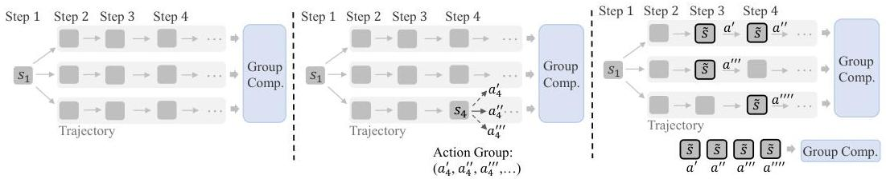
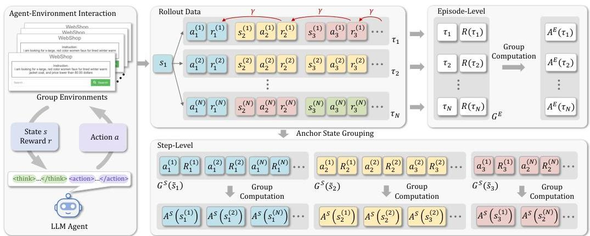
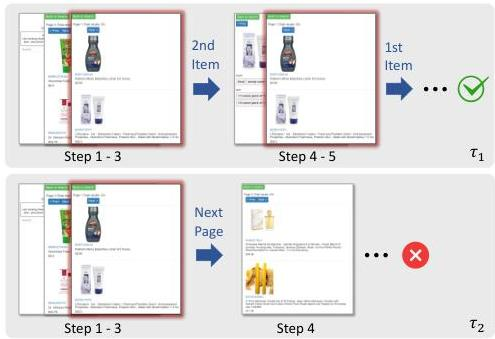
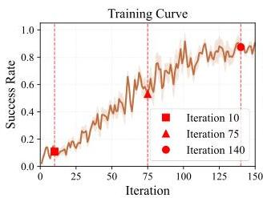
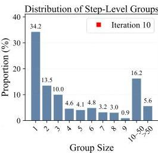
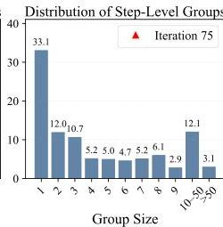
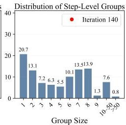
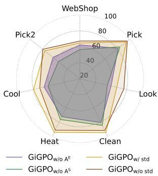
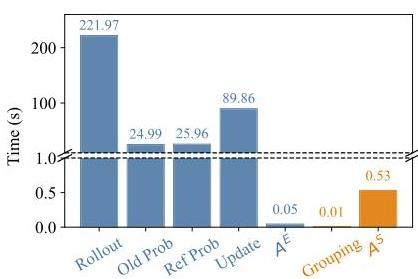

# Group-in-Group Policy Optimization for LLM Agent Training

Lang Feng^{1} Zhenghai Xue^{1} Tingcong Liu^{1} Bo An^{1,2,}
^{1}Nanyang Technological University, Singapore
^{2}Skywork AI, Singapore
{lang005,zhenghai001,tingcong001}@e.ntu.edu.sg, boan@ntu.edu.sg [Corresponding author
Code: https://github.com/langfengQ/verl-agent]

###### Abstract

Recent advances in group-based reinforcement learning (RL) have driven frontier large language models (LLMs) in single-turn tasks like mathematical reasoning. However, their scalability to multi-turn LLM agent training remains limited. Unlike static tasks, agent-environment interactions unfold over many steps and often yield sparse or delayed rewards, making credit assignment across individual steps significantly more challenging. In this work, we propose *Group-in-Group Policy Optimization (GiGPO)*, a novel RL algorithm that achieves fine-grained credit assignment for LLM agents while preserving the appealing properties of group-based RL: critic-free, low memory, and stable convergence. GiGPO introduces a two-level structure for estimating relative advantage: (i) At the *episode-level*, GiGPO computes macro relative advantages based on groups of complete trajectories; (ii) At the *step-level*, GiGPO introduces an *anchor state grouping* mechanism that retroactively constructs step-level groups by identifying repeated environment states across trajectories. Actions stemming from the same state are grouped together, enabling micro relative advantage estimation. This hierarchical structure effectively captures both global trajectory quality and local step effectiveness without relying on auxiliary models or additional rollouts. We evaluate GiGPO on challenging agent benchmarks, including ALFWorld and WebShop, as well as tool-integrated reasoning on search-augmented QA tasks, using Qwen2.5-1.5B/3B/7B-Instruct. Crucially, GiGPO delivers fine-grained per-step credit signals, achieves performance gains of > 12% on ALFWorld and > 9% on WebShop over GRPO, and obtains superior performance on QA tasks (42.1% on 3B and 47.2% on 7B): all while maintaining the same GPU memory overhead, identical LLM rollout, and incurring little to no additional time cost.

## 1 Introduction

Large Language Models (LLMs) *[1, 2, 3, 4]* have leapt from static question-answer systems to versatile *agents* that perceive, reason, and act in open-ended environments. For instance, they now power embodied assistants that navigate simulated homes *[5, 6]*, mobile and web navigators that plan multi-step browsing sessions *[7, 8, 9, 10]*, and autonomous explorers in interactive games *[11, 12]*. In these settings, LLM agents need to perceive, reason, and act in multi-turn loops, which requires not only language understanding but also long-horizon planning and decision-making.

Reinforcement learning (RL) *[13]* has become a crucial recipe for post-training LLMs, leading to frontier models like OpenAI o1 *[14]* and DeepSeek R1 *[15]*. In particular, group-based RL algorithms such as RLOO *[16, 17]* and GRPO *[18]* have proven especially effective in large-scale training. These

---

methods replace value-function estimation with simple yet powerful relative advantage estimation within groups of rollouts. This group-based advantage computation enjoys favorable properties such as low memory overhead, critic-free optimization, and scalability to large models. However, their successes have so far been largely limited to single-turn tasks such as math problem solving *[19, 20]* and code generation *[21]*, where reward arrives immediately and credit assignment is straightforward.

In contrast, LLM agents operating in external environments face fundamentally different learning landscapes. Their behavior unfolds over long episodes with tens of decision steps and tens of thousands of tokens (e.g., an ALFWorld *[5]* episode may include up to 50 steps and over 20k tokens). Rewards are typically sparse (sometimes arriving only at the end of an episode), and the impact of any individual action may only manifest much later in the trajectory. This substantially complicates the credit assignment for individual steps and increases the challenge of policy optimization. Naively applying existing group-based RL algorithms in such settings collapses step-level distinctions, undermining their effectiveness. Hence, these limitations raise a core question:

Can we preserve the critic-free, low-memory, and stable convergence properties of group-based RL while introducing fine-grained credit assignment for multi-turn LLM agent training?

To address this, we introduce Group-in-Group Policy Optimization (GiGPO), a new group-based RL algorithm that nests two-dimensional notions of credit assignment, better-suited for the multi-turn optimization of LLM agents. (i) At the episode level, GiGPO samples a group of complete trajectories under identical task and initial-state conditions, and computes macro relative advantages based on total returns like vanilla GRPO *[18]*. This captures the overall effectiveness of each trajectory and reflects the completeness of task execution. (ii) At the step level, GiGPO introduces a novel anchor state grouping mechanism for fine-grained relative advantages estimation. Specifically, it retroactively identifies the repeated environment states, termed as anchor states, across trajectories and uses them as anchors to construct step-level groups that allow for localized credit assignment.

The key insight behind GiGPO is that, under identical tasks and initial environment conditions, many trajectories within the group encounter the same states multiple times due to ineffective actions or loops, such as revisiting the same webpage, room, or game scene. These shared states provide a natural basis for step-level group construction and computing more granular advantage estimates. GiGPO uses these step-level groups to assign localized credit to actions based on their relative performance at a common state, enabling more precise optimization while avoiding the cost explosion of per-step extra rollouts. As such, GiGPO remains fully critic-free and requires no auxiliary value models while dramatically introducing finer credit signals for training LLM agents.

We first evaluate GiGPO on long-horizon agent benchmarks: ALFWorld *[5]*, which tests embodied task planning in simulated household environments, and WebShop *[22]*, which simulates complex, goal-driven web interactions. In addition, we study multi-turn tool-integrated reasoning on search-augmented QA tasks. Our experiments with Qwen2.5-1.5B/3B/7B-Instruct *[3]* show that GiGPO consistently outperforms prompt-based agents, actor-critic baselines, and prior group-based RL methods. In particular, GiGPO injects fine-grained, step-level credit signals that sharpen policy learning of agents over horizons and achieves performance gains of > 12% on ALFWorld and > 9% on WebShop over GRPO, along with remarkable performance on search-based QA tasks (42.1% on 3B and 47.2% on 7B). These gains come without compromising the core strengths of group-based RL (only < 0.002% time cost), making GiGPO a versatile and high-utility algorithm for LLM agents.

## 2 Related Work

#### LLMs as decision-making agents.

The use of large language models (LLMs) as autonomous agents has expanded rapidly across domains such as program generation *[23]*, smart device operation *[24, 25, 26, 27]*, interactive gameplay *[11]*, and robot behavior control *[28]*. Early works typically relied on leveraging pre-trained, frozen models through carefully designed prompting methods (like ReAct *[29]* and Reflexion *[30]*), enhanced memory and retrieval systems *[12, 31]*, and integration with external tools *[32, 33, 34]*. More recent research has shifted toward adapting model parameters with supervised fine-tuning (SFT) *[24]* or RL *[13]*, enabling agents to learn directly from environment interaction rather than static prompts or handcrafted workflows, which we introduce below.

Reinforcement learning for LLM agents. RL has played a pivotal role in enabling LLM agents to operate in dynamic, open-ended environments. Early work applied classical RL algorithms such as

---

DQN *[35]* to train LLM agents in text-based games *[36]* and later research *[37, 38, 39, 40, 41]* started to employ value-based methods, such PPO *[42]* and AWR *[43]*, in more diverse and interactive agent scenarios including Android device control *[44]*, embodied ALFWorld *[5]*, and card games *[45]*. More recent approaches have extended RL training to complex web-based and application-centered tasks. For instance, ArCHer *[46]* and AgentQ *[47]* target the WebShop benchmark *[22]*, but require intricate designs and computation overhead such as additional value networks or Monte Carlo Tree Search (MCTS) *[48]*. CoSo *[10]* introduces an entropy-based RL method that enhances the performance of agents. Going further, LOOP *[49]* introduces a hybrid method combining REINFORCE leave-one-out (RLOO) *[16, 17]* with PPO-style updates, achieving state-of-the-art results in AppWorld *[50]*. RAGEN *[51]* introduces a trajectory-level GRPO that concatenates all states, intermediate reasoning, and actions into a unified episode-level response. However, it faces scalability challenges in long-horizon tasks (e.g., in ALFWorld, which involves up to 50 steps).

Reinforcement learning for large language models. An early and influential application of RL in LLMs is the Reinforcement Learning from Human Feedback (RLHF) *[52, 53, 54, 55]*, which focuses on aligning LLMs to human preferences. Most recent works have explored using RL to enhance the capabilities of reasoning and logical deduction in LLMs *[56, 15]*. In particular, group-based RL algorithms have emerged as promising alternatives to traditional methods like PPO *[42]*. These methods, such as RLOO *[16, 17]*, GRPO *[18]*, Dr. GRPO *[19]*, DAPO *[20]*, and CPPO *[57]*, avoid introducing extra value functions by leveraging a group of samples from the same query and estimate the advantages accordingly. This enables the large-scale RL training and has shown strong results in tasks such as mathematical reasoning *[15]*, search *[58, 59]*, and tool use *[60, 61]*. Our work is closely related to this line of research, with a focus on training LLM agents. We aim to retain the benefits of group-based RL, such as critic-free learning and efficiency, while introducing finer-grained credit assignment. Moreover, the hierarchical core of GiGPO is orthogonal to existing group-based RL approaches, making it fully compatible and capable of incorporating them to enhance performance.

## 3 Preliminaries

#### Problem setup.

We consider a general setting in which an LLM agent interacts with an environment to complete multi-step tasks based on a task description $x\in p(X)$. At each discrete time step $t=1,2,\ldots,T$, the agent observes a state $\bm{s}_{t}\in\mathcal{S}$ and generates a textual action $\bm{a}_{t}\in\mathcal{V}^{n}$, where $\mathcal{V}$ denotes the token vocabulary and $n$ is the maximum generation length. The environment then returns a scalar reward $r_{t}\in\mathbb{R}$ and the next state $\bm{s}_{t+1}$. A full episode consists of a trajectory $\bm{\tau}=\{(\bm{s}_{1},\bm{a}_{1},r_{1}),(\bm{s}_{2},\bm{a}_{2},r_{2}),\ldots,(\bm{s}_{T},\bm{a}_{T},r_{T})\}$. The agent’s behavior is governed by an LLM policy $\pi_{\theta}(\bm{a}_{t}|\bm{s}_{t},x)$, parameterized by $\theta$, which defines a distribution over outputs conditioned on the current state $\bm{s}_{t}$ and the task prompt $x$. In many realistic scenarios, the environment may provide sparse or delayed rewards (e.g., success and failure signals at the end of an episode) or weak feedback signals for intermediate steps. As the agent generates $T$ consecutive textual actions ($\bm{a}_{1},\ldots,\bm{a}_{T}$), each potentially spanning thousands of tokens, it becomes particularly challenging to assign credit to individual tokens over the course of an episode.

#### Group-based RL.

Recent RL works converge on a simple recipe for training LLMs: for a given task description $x$, the LLM samples a group of $N$ candidate trajectories $\{\bm{\tau}_{1},\bm{\tau}_{2},\ldots,\bm{\tau}_{N}\}$, each corresponding to one full episode rollout under $\pi_{\theta_{\text{obj}}}$. Each trajectory $\bm{\tau}_{i}$ receives a scalar reward $R(\bm{\tau}_{i})$ reflecting the overall quality or success of the generated outcome. Instead of estimating advantages using separate value functions like PPO *[42]*, group-based RL methods compute advantages purely based on the statistics internal to the sampled group:

$A(\bm{\tau}_{i})=\texttt{GroupComputation}(\{R(\bm{\tau}_{i})\}_{i=1}^{N}).$ (1)

For example, in GRPO *[18]*, the advantage of each trajectory is estimated by normalizing its reward with respect to the group’s mean and standard deviation. This design is highly memory-efficient and can scale effectively to the large batch sizes and model sizes typical in modern LLM training, making it a practical and scalable choice for large-scale RL training.

## 4 Training LLM Agents with GiGPO

While group-based RL algorithms *[18, 15]* have proven highly effective for training LLMs in single-turn tasks, their extension to multi-step agent settings faces critical challenges in credit assignment.

---

Figure 1: Comparison of multi-turn LLM agent training. Left: Vanilla GRPO rolls out a group of full trajectories and computes episode-level advantages. Middle: Constructing step-level groups via additional per-state rollouts (e.g., $a_{4}^{\prime}$, $a_{4}^{\prime\prime}$, $a_{4}^{\prime\prime\prime}$, $\ldots$) enables fine-grained feedback but incurs prohibitive computational cost. Right: GiGPO efficiently achieves fine-grained credit assignment by aggregating distinct actions ($a^{\prime}$, $a^{\prime\prime}$, $a^{\prime\prime\prime}$, $a^{\prime\prime\prime\prime}$) taken from the same environment state $\tilde{s}$ across the trajectories.

Figure 1 illustrates this gap. Vanilla GRPO (left) treats each trajectory as a whole and computes a single relative advantage for the entire episode, which fails to provide actionable feedback for individual steps. A natural remedy is to roll out multiple single-step actions for each state $\boldsymbol{s}_{t}$ via $\pi_{\theta_{\mathrm{old}}}$ as shown in Figure 1 (middle). However, this approach quickly becomes impractical due to the substantial overhead of extra LLM forward passes and the difficulty of evaluating rewards for hypothetical actions never actually executed.

To overcome these challenges, we propose our Group-in-Group Policy Optimization (GiGPO) in this section. Similar to prior works *[49, 51]*, GiGPO begins by sampling groups of trajectories under identical tasks and initial environment states. It then introduces a two-level grouping structure: preserving episode-level grouping for holistic performance comparison, while dynamically constructing an additional set of step-level groups by retroactively aggregating actions encountering the same environment states. This “group-in-group” construction yields two complementary advantages: (1) Episode relative advantages capture the holistic effectiveness of each trajectory, providing a stable, global training signal. (2) Step relative advantages zoom in on which actions outperform their peers within the same state, endowing the gradient with fine-grained credit.

Figure 2 presents an overview of the GiGPO training pipeline. In the remainder of this section, we will detail the computation of episode-level relative advantages, elaborate on the anchor state grouping mechanism, describe the derivation of step-level relative advantages, and finally present the overall GiGPO objective.

### 4.1 Episode Relative Advantages

We first introduce the episode-level relative advantages, which represent the coarse-grained component of GiGPO and mirror the naive application of GRPO at the trajectory level. We roll out the agent’s policy $\pi_{\theta_{\mathrm{old}}}$ in the environment to collect $N$ complete trajectories under a fixed task $x$ and identical initial states. Formally, this process yields a group of trajectories $\{\boldsymbol{\tau}_{i}\}_{i=1}^{N}$, where each trajectory is denoted as $\boldsymbol{\tau}_{i}=\{(\boldsymbol{s}_{1}^{(i)},\boldsymbol{a}_{1}^{(i)},r_{1}^{(i)}),\ldots,(\boldsymbol{s}_{T}^{(i)},\boldsymbol{a}_{T}^{(i)},r_{T}^{(i)})\}$ and the initial states satisfy $\boldsymbol{s}_{1}^{(1)}=\boldsymbol{s}_{1}^{(2)}=\ldots=\boldsymbol{s}_{1}^{(N)}$. For each trajectory, we utilize the total return $R(\boldsymbol{\tau}_{i})=\sum_{t}r_{i}^{(i)}$ as a holistic measure of how effectively the agent completes the task. In settings where only a binary reward is given at the end of the episode, this simplifies to $R(\boldsymbol{\tau}_{i})=1$ for success and $R(\boldsymbol{\tau}_{i})=0$ for failure. Then, we organize the trajectories and their corresponding returns into an episode-level group:

$G^{E}=\Big{\{}\big{(}\boldsymbol{\tau}_{1},R(\boldsymbol{\tau}_{1})\big{)},\big{(}\boldsymbol{\tau}_{2},R(\boldsymbol{\tau}_{2})\big{)},\ldots,\big{(}\boldsymbol{\tau}_{N},R(\boldsymbol{\tau}_{N})\big{)}\Big{\}}.$ (2)

To evaluate the global relative quality of each trajectory within the group, we compute an episode relative advantage $A^{E}(\boldsymbol{\tau}_{i})$ for each $\boldsymbol{\tau}_{i}$ by normalizing the total return with the group’s mean and a normalization factor:

$A^{E}(\boldsymbol{\tau}_{i})=\frac{R(\boldsymbol{\tau}_{i})-\text{mean}\big{(}\{R(\boldsymbol{\tau}_{j})\}_{j=1}^{N}\big{)}}{F_{\text{norm}}\big{(}\{R(\boldsymbol{\tau}_{j})\}_{j=1}^{N}\big{)}}.$ (3)

In GRPO *[18]*, the default normalization factor is defined as the standard deviation, i.e., $F_{\text{norm}}=\text{std}$. However, this may introduce a difficulty bias *[19]*, where trajectories from low-variance groups (e.g., very easy or hard tasks) receive disproportionately large gradients. In the context of the LLM

---

Figure 2: Overview of GiGPO. The agent interacts with a group of environments initialized with identical states to generate a set of trajectories $\{\bm{\tau}_i\}_{i=1}^N$. States with the same color represent the same environment state. GiGPO performs two-dimensional group computations (episode-level $A^E$ and step-level $A^S$) to produce hierarchical relative advantages that guide fine-grained policy optimization.

agent, where tasks often involve very long horizons, this effect tends to emerge frequently, potentially affecting the stability of updates. As an alternative, we also consider a fixed normalization factor $F_{\mathrm{norm}} = 1$, which yields an unbiased Leave-One-Out estimator [16] (see Appendix C for details). This simple adjustment helps stabilize training in some challenging agent scenarios.

Overall, the episode relative advantage captures whether the agent successfully completes the assignment across the entire decision horizon $T$. Similar to the vanilla GRPO for multi-step optimization shown in Figure 1 (left), it primarily focuses on macro credit assignment, encouraging the policy to develop coherent, trajectory-wide behaviors that maximize overall task performance.

## 4.2 Step Relative Advantages

While the episode relative advantage offers a macro, trajectory-wide signal, it cannot distinguish between the contributions of individual actions within the trajectory. To obtain this fine-grained feedback, we need to form step-level groups: for the same state, we gather the different actions and compare their outcomes, thereby learning which choices are relatively better or worse. A naive way to do so would be to roll out fresh actions from every state (Figure 1, middle), but that is prohibitively expensive. Instead, we introduce anchor state grouping below, avoiding extra LLM overhead.

**Anchor state grouping.** As all trajectories $\{\tau_1, \dots, \tau_N\}$ arise from the same task $x$ and identical initial conditions, many environment states naturally recur across episodes and even across time steps within a single trajectory. We leverage this redundancy by identifying and grouping identical states across trajectories, thereby dynamically constructing step-level groups. Specifically, let $\mathcal{U} = \{\bar{s}_1, \bar{s}_2, \dots, \bar{s}_U\}$ denote the set of all distinct environment states appearing in the trajectory group $\{\tau_1, \dots, \tau_N\}$. We treat each such unique state $\tilde{s} \in \mathcal{U}$ as an implicit anchor and use it to gather all matching occurrences of that state, and therefore call $\tilde{s}$ as "anchor state". Based on this, we can construct $|\mathcal{U}|$ step-level groups (one for each unique anchor state $\tilde{s}$), which is defined as follows:

$$
G ^ {S} (\tilde {\boldsymbol {s}}) = \left\{\left(\boldsymbol {a} _ {t} ^ {(i)}, r _ {t} ^ {(i)}\right) \mid \boldsymbol {s} _ {t} ^ {(i)} = \tilde {\boldsymbol {s}}, 1 \leq i \leq N, 1 \leq t \leq T \right\}. \tag {4}
$$

Unlike per-state rollout, this procedure incurs no extra rollouts: it is entirely offline and requires only lightweight key-based grouping using hashmaps. Each group $G^{S}(\tilde{s})$ contains multiple instances of the same environment state paired with potentially different actions. Hence, this structure effectively builds the step-level group, forming the basis for subsequent step-level advantage estimation.

**Relative advantage computation.** Although each tuple $(\pmb{a}_t^{(i)},r_t^{(i)})$ contains an immediate reward $r_t^{(i)}$, it may be sparse, especially in long-horizon tasks. To better capture long-term impact, we associate a discounted return with each step. Let $\gamma \in (0,1]$ be the standard RL discount factor. For each element in $G^{S}(\tilde{s})$, we compute its discounted return $R_{t}^{(i)}$ by

$$
R _ {t} ^ {(i)} = \sum_ {k = t} ^ {T} \gamma^ {k - t} r _ {k} ^ {(i)}. \tag {5}
$$

---

This quantity captures the future impact of action $\boldsymbol{a}_{t}^{(i)}$ on subsequent rewards, rather than relying solely on the immediate reward $r_{t}^{(i)}$. Accordingly, the step-level group for each $\tilde{\boldsymbol{s}} \in \mathcal{U}$ becomes:

$$
G^{S}(\tilde{\boldsymbol{s}}) = \left\{ \left( \boldsymbol{a}_{t}^{(i)}, R_{t}^{(i)} \right) \mid \boldsymbol{s}_{t}^{(i)} = \tilde{\boldsymbol{s}}, 1 \leq i \leq N, 1 \leq t \leq T \right\}. \tag{6}
$$

Once these step-level groups are formed, we compute the step relative advantage for each $\tilde{s} \sim \mathcal{U}$ and each action $\boldsymbol{a}_{t}^{(i)}$ in $G^{S}(\tilde{s})$:

$$
A^{S}(\boldsymbol{a}_{t}^{(i)}) = \frac{ R_{t}^{(i)} - \operatorname{mean} \left( \left\{ R_{t}^{(j)} \mid (\boldsymbol{a}_{t}^{(j)}, R_{t}^{(j)}) \in G^{S}(\tilde{\boldsymbol{s}}) \right\} \right) }{ F_{\text{norm}} \left( \left\{ R_{t}^{(j)} \mid (\boldsymbol{a}_{t}^{(j)}, R_{t}^{(j)}) \in G^{S}(\tilde{\boldsymbol{s}}) \right\} \right)}. \tag{7}
$$

$A^{S}$ provides micro credit assignment and fine-grained feedback on the relative quality of individual actions taken from the same state. In contrast to the coarse, trajectory-wide signal of $A^{E}$, it offers step-level guidance that is essential for refining decisions in long-horizon agent tasks.

How does step-level group work? We present an intuitive illustration in Figure 3 to show the utility of the step relative advantages. We consider two example trajectories from the set $\{\tau_i\}_{i=1}^N$. In $\tau_1$, the agent first selects the 2nd Item (incorrect), then returns to the previous page and selects the 1st Item (correct), successfully completing the task. Due to temporal discounting (Equation (5)), the earlier action (2nd Item) receives a lower discounted return than the later correct one (1st Item). In $\tau_2$, the agent clicks the Next Page, ultimately failing to find the target and receiving no reward. By aggregating these actions into the same step-level group based on their shared anchor state, GiGPO computes their relative advantages and yields a clear preference ordering: $A^S(1\text{st Item}) &gt; A^S(2\text{nd Item}) &gt; A^S(\text{Next Page})$. This ranking successfully captures fine-grained distinctions in long-term utility that are missed by prior group-based RL methods [17, 18, 20]. While this example illustrates GiGPO's effectiveness in sparse

Figure 3: Illustration of step-level grouping in WebShop. Both $\tau_{1}$ and $\tau_{2}$ encounter the same environment state multiple times: a search results page (highlighted by the red border). Top: $\tau_{1}$ eventually succeeds. Bottom: $\tau_{2}$ leads to failure.

reward environments, its advantages extend naturally to dense-reward scenarios, where per-step rewards can be fully leveraged to assess the relative quality of individual actions within shared states.

## 4.3 Group-in-Group Policy Optimization

We finally combine the two levels of advantage signals into a single group-in-group advantage to assign credit at both global (episode) and local (step) scales:

$$
A(\boldsymbol{a}_{t}^{(i)}) = A^{E}(\boldsymbol{\tau}_{i}) + \omega \cdot A^{S}(\boldsymbol{a}_{t}^{(i)}), \tag{8}
$$

where $\omega \in \mathbb{R}_{\geq 0}$ is a weighting coefficient that balances episode relative advantage and step relative advantage. $A^{E}(\boldsymbol{\tau}_{i})$ captures how good an episode is compared to others in the group, while $A^{S}(\boldsymbol{a}_{t}^{(i)})$ refines step-level performance within shared environment state conditions. Jointly, they provide hierarchical supervision for the policy optimization of LLM agents. Then the clipped policy optimization objective of GiGPO is:

$$
\begin{array}{l}
\mathcal{J}_{\mathrm{GiGPO}}(\theta) = \mathbb{E}_{\substack{x \sim p(X) \\ \{\boldsymbol{\tau}_{i}\}_{i=1}^{N} \sim \pi_{\theta_{\mathrm{old}}}}} \left[ \frac{1}{NT} \sum_{\epsilon=1}^{N} \sum_{t=1}^{T} \min \left( \rho_{\theta}(\boldsymbol{a}_{t}^{(i)}) A(\boldsymbol{a}_{t}^{(i)}), \operatorname{clip} \left( \rho_{\theta}(\boldsymbol{a}_{t}^{(i)}), 1 \pm \epsilon \right) A(\boldsymbol{a}_{t}^{(i)}) \right) \right] \\
- \beta \mathbb{D}_{\mathrm{KL}} \left( \pi_{\theta}(\cdot \mid x) \| \pi_{\mathrm{ref}}(\cdot \mid x) \right). \tag{9}
\end{array}
$$

where $\rho_{\theta}(\boldsymbol{a}_{t}^{(i)}) = \frac{\pi_{\theta}(\boldsymbol{a}_{t}^{(i)}|\boldsymbol{s}_{t}^{(i)},x)}{\pi_{\theta_{\mathrm{old}}}(\boldsymbol{a}_{t}^{(i)}|\boldsymbol{s}_{t}^{(i)},x)}$ is the importance sampling ratio, $\beta$ controls the strength of the KL penalty encouraging proximity to a reference policy $\pi_{\mathrm{ref}}$. We present the pseudo code in Appendix D.

---

5 Experiment

In this section, we present empirical evaluations of GiGPO across a variety of agentic tasks. Specifically, we aim to demonstrate: (1) the strong ability of GiGPO in training LLM agents; (2) the ablation study of GiGPO; (3) the dynamic trend of step-level group $G^{S}(\tilde{\bm{s}})$ over the course of training; (4) the computational budget of GiGPO.

### 5.1 Experiment Setup

#### Benchmarks.

We first train the LLM agents on two challenging benchmarks: ALFWorld *[5]* and WebShop *[22]*. *ALFWorld* is an embodied environment designed to assess the ability of LLM agents to perform multi-step decision-making. In each episode, the agent receives a text goal and must accomplish it through multi-turn interaction with the environment. It includes 3,827 task instances across six categories of common household activities: Pick & Place (Pick), Examine in Light (Look), Clean & Place (Clean), Heat & Place (Heat), Cool & Place (Cool), and Pick Two & Place (Pick2). *WebShop* is a complex, web-based interactive environment designed to test the LLM agents in realistic online shopping scenarios. To complete the task, the agent must interact with a simulated HTML-based shopping website to search for, navigate to, and ultimately purchase a suitable item. It contains over 1.1 million products and 12k user instructions, providing a rich and diverse action space. In addition, we also evaluate the multi-turn tool calling performance of GiGPO on *search-augmented QA tasks*, including single-hop QA datasets (NQ *[62]*, TriviaQA *[63]*, and PopQA *[64]*) and multi-hop QA datasets (HotpotQA *[65]*, 2Wiki *[66]*, MuSiQue *[67]*, and Bamboogle *[68]*).

#### Baselines.

For ALFWorld and WebShop, we compare our approach with a range of competitive baselines: (1) Closed-source LLMs: GPT-4o *[1]* and Gemini-2.5-Pro *[2]*, which represent state-of-the-art capabilities in general-purpose reasoning and language understanding. (2) Prompting agents: ReAct *[29]* and Reflexion *[30]*, which rely on in-context prompting to guide multi-step behavior without parameter updates. (3) RL training methods: PPO *[42]*, a widely used actor-critic algorithm that requires an additional value model, and group-based critic-free methods RLOO *[16, 17]* and GRPO *[18]*, which perform advantage estimation over trajectory groups. For search-augmented QA, we compare GiGPO with R1-Instruct, Search-R1 *[58]*, ZeroSearch *[59]*, and StepSearch *[69]*.

#### Training details.

We use Qwen2.5-1.5B/3B/7B-Instruct *[3]* as our base models. The weighting coefficient $\omega$ is set to $1$ with no further tuning. For ALFWorld and WebShop, all RL training methods (including ours and the baselines) use exactly the same hyperparameter configurations. The rollout group size $N$ for group-based RL methods is set to 8. For search-augmented QA, we follow the same settings in Search-R1 *[58]*. We use E5 *[70]* as the retriever. The rollout group size $N$ is set to 5 and the max turn is set to 4. Moreover, we incorporate similarity-based GiGPO, where anchor state grouping is performed by grouping two states if their similarity (longest matching subsequence) exceeds the threshold of 0.9. Full training settings and hyperparameter details are provided in Appendix E.1.

### 5.2 Performance on ALFWorld and WebShop

Table 1 demonstrates the strong performance of GiGPO across both ALFWorld and WebShop. As shown, closed-source LLMs offer only moderate performance: Gemini-2.5-Pro reaches 60.3% success on ALFWorld and 35.9% on WebShop, while GPT-4o lags further behind. Open-source prompt-only agents (e.g., ReAct and Reflexion) show marginal improvements over vanilla prompting but still underperform, underscoring the difficulty of long-horizon control without post-training. RL training brings substantial gains: PPO improves average ALFWorld success to 54.4% on the 1.5B model and 80.4% on the 7B model, with WebShop scores also increasing significantly. However, this comes at the expense of increased complexity: requiring a separate critic network, hyperparameter tuning, and longer training durations *[71, 49]*. GRPO and RLOO also yield strong performance while being more computationally efficient, demonstrating the effectiveness of group-based RL in large-scale LLM training. Nevertheless, their lack of fine-grained per-step feedback limits their ability to provide precise credit assignment across long horizons. In contrast, GiGPO overcomes this limitation with a two-level advantage estimation, enabling both $\text{GiGPO}_{\text{w/ std}}$ and $\text{GiGPO}_{\text{w/o std}}$ to consistently surpass GRPO and RLOO. In particular, $\text{GiGPO}_{\text{w/o std}}$ surpasses GRPO by 13.3% on ALFWorld and 10.6% on WebShop at 1.5B, and by 12.6% and 9.1%, respectively, at 7B. These results highlight GiGPO’s superior ability to train LLM agents more effectively and more efficiently. We also find that GiGPO enables agents to exhibit emergent reasoning behavior (see Appendix F).

---

Table 1: Performance on ALFWorld and WebShop. Results are averaged over 3 random seeds. For ALFWorld, we report the average success rate (\%) for each subtask as well as the overall result. For WebShop, we report both the average score and the average success rate (\%).  $\mathrm{GiGPO}_{\mathrm{w / std}}$  denotes using  $F_{\mathrm{norm}} = \mathrm{std}$ , while  $\mathrm{GiGPO}_{\mathrm{w / o std}}$  uses  $F_{\mathrm{norm}} = 1$ .

<table><tr><td rowspan="2">Type</td><td rowspan="2">Method</td><td colspan="7">ALFWorld</td><td colspan="2">WebShop</td></tr><tr><td>Pick</td><td>Look</td><td>Clean</td><td>Heat</td><td>Cool</td><td>Pick2</td><td>All</td><td>Score</td><td>Succ.</td></tr><tr><td colspan="11">Closed-Source Model</td></tr><tr><td>Prompting</td><td>GPT-4o</td><td>75.3</td><td>60.8</td><td>31.2</td><td>56.7</td><td>21.6</td><td>49.8</td><td>48.0</td><td>31.8</td><td>23.7</td></tr><tr><td>Prompting</td><td>Gemini-2.5-Pro</td><td>92.8</td><td>63.3</td><td>62.1</td><td>69.0</td><td>26.6</td><td>58.7</td><td>60.3</td><td>42.5</td><td>35.9</td></tr><tr><td colspan="11">Qwen2.5-1.5B-Instruct</td></tr><tr><td>Prompting</td><td>Qwen2.5</td><td>5.9</td><td>5.5</td><td>3.3</td><td>9.7</td><td>4.2</td><td>0.0</td><td>4.1</td><td>23.1</td><td>5.2</td></tr><tr><td>Prompting</td><td>ReAct</td><td>17.4</td><td>20.5</td><td>15.7</td><td>6.2</td><td>7.7</td><td>2.0</td><td>12.8</td><td>40.1</td><td>11.3</td></tr><tr><td>Prompting</td><td>Reflexion</td><td>35.3</td><td>22.2</td><td>21.7</td><td>13.6</td><td>19.4</td><td>3.7</td><td>21.8</td><td>55.8</td><td>21.9</td></tr><tr><td>RL Training</td><td>PPO (with critic)</td><td>64.8±2.5</td><td>40.5±6.9</td><td>57.1±4.9</td><td>60.6±6.6</td><td>46.4±4.0</td><td>47.4±1.9</td><td>54.4±3.1</td><td>73.8±3.8</td><td>51.5±2.9</td></tr><tr><td>RL Training</td><td>RLOO</td><td>88.3±3.0</td><td>52.8±8.6</td><td>71.0±5.9</td><td>62.8±8.7</td><td>66.4±5.5</td><td>56.9±4.7</td><td>69.7±2.5</td><td>73.9±5.6</td><td>52.1±6.7</td></tr><tr><td>RL Training</td><td>GRPO</td><td>85.3±1.5</td><td>53.7±8.0</td><td>84.5±6.8</td><td>78.2±7.9</td><td>59.7±5.0</td><td>53.5±5.6</td><td>72.8±3.6</td><td>75.8±3.5</td><td>56.8±3.8</td></tr><tr><td>RL Training</td><td>GiGPOw/std</td><td>94.4±5.9</td><td>67.5±4.6</td><td>94.8±3.8</td><td>94.4±7.8</td><td>79.8±4.7</td><td>76.4±5.4</td><td>86.7±1.7</td><td>83.1±1.6</td><td>65.0±3.2</td></tr><tr><td>RL Training</td><td>GiGPOw/o std</td><td>96.0±1.4</td><td>76.5±3.9</td><td>91.8±5.5</td><td>91.3±6.3</td><td>71.7±8.4</td><td>79.5±7.7</td><td>86.1±4.7</td><td>83.5±1.8</td><td>67.4±4.5</td></tr><tr><td colspan="11">Qwen2.5-7B-Instruct</td></tr><tr><td>Prompting</td><td>Qwen2.5</td><td>33.4</td><td>21.6</td><td>19.3</td><td>6.9</td><td>2.8</td><td>3.2</td><td>14.8</td><td>26.4</td><td>7.8</td></tr><tr><td>Prompting</td><td>ReAct</td><td>48.5</td><td>35.4</td><td>34.3</td><td>13.2</td><td>18.2</td><td>17.6</td><td>31.2</td><td>46.2</td><td>19.5</td></tr><tr><td>Prompting</td><td>Reflexion</td><td>62.0</td><td>41.6</td><td>44.9</td><td>30.9</td><td>36.3</td><td>23.8</td><td>42.7</td><td>58.1</td><td>28.8</td></tr><tr><td>RL Training</td><td>PPO (with critic)</td><td>92.3±4.0</td><td>64.0±8.4</td><td>92.5±2.4</td><td>89.5±7.0</td><td>80.3±2.0</td><td>68.8±8.3</td><td>80.4±2.7</td><td>81.4±3.1</td><td>68.7±5.1</td></tr><tr><td>RL Training</td><td>RLOO</td><td>87.6±4.3</td><td>78.2±8.3</td><td>87.3±5.8</td><td>81.3±7.6</td><td>71.9±5.2</td><td>48.9±8.4</td><td>75.5±4.6</td><td>80.3±3.2</td><td>65.7±4.0</td></tr><tr><td>RL Training</td><td>GRPO</td><td>90.8±5.1</td><td>66.1±6.7</td><td>89.3±5.4</td><td>74.7±6.9</td><td>72.5±5.4</td><td>64.7±7.3</td><td>77.6±5.2</td><td>79.3±2.8</td><td>66.1±3.7</td></tr><tr><td>RL Training</td><td>GiGPOw/std</td><td>97.7±1.6</td><td>82.7±7.9</td><td>98.8±1.6</td><td>83.7±7.2</td><td>89.3±8.2</td><td>79.2±6.6</td><td>90.8±1.3</td><td>84.4±2.9</td><td>72.8±3.2</td></tr><tr><td>RL Training</td><td>GiGPOw/o std</td><td>91.8±5.4</td><td>88.6±6.3</td><td>95.9±3.2</td><td>90.2±2.6</td><td>86.5±5.5</td><td>85.2±7.5</td><td>90.2±2.3</td><td>86.2±2.6</td><td>75.2±3.8</td></tr></table>

Table 2: Performance on search-augmented QA tasks. GiGPO is trained on NQ and HotpotQA with  $F_{\mathrm{norm}} = \mathrm{std}$ . † and  $\star$  indicate in-domain and out-of-domain datasets, respectively.

<table><tr><td rowspan="2">Type</td><td rowspan="2">Method</td><td colspan="3">Single-Hop QA</td><td colspan="4">Multi-Hop QA</td><td rowspan="2">Avg.</td></tr><tr><td>NQ†</td><td>TriviaQA*</td><td>PopQA*</td><td>HotpotQA†</td><td>2Wiki*</td><td>MuSiQue*</td><td>Bamboogle*</td></tr><tr><td colspan="10">Qwen2.5-3B-Instruct</td></tr><tr><td>RL Training</td><td>R1-Instruct</td><td>27.0</td><td>53.7</td><td>19.9</td><td>23.7</td><td>29.2</td><td>7.2</td><td>29.3</td><td>27.1</td></tr><tr><td>RL Training</td><td>Search-R1</td><td>34.1</td><td>54.5</td><td>37.8</td><td>32.4</td><td>31.9</td><td>10.3</td><td>26.4</td><td>32.5</td></tr><tr><td>RL Training</td><td>ZeroSearch</td><td>41.4</td><td>57.4</td><td>44.8</td><td>27.4</td><td>30.0</td><td>9.8</td><td>11.1</td><td>31.7</td></tr><tr><td>RL Training</td><td>StepSearch</td><td>-</td><td>-</td><td>-</td><td>34.5</td><td>32.0</td><td>17.4</td><td>34.4</td><td>-</td></tr><tr><td>RL Training</td><td>GiGPO</td><td>42.0</td><td>59.5</td><td>42.4</td><td>36.9</td><td>37.0</td><td>12.6</td><td>64.1</td><td>42.1</td></tr><tr><td colspan="10">Qwen2.5-7B-Instruct</td></tr><tr><td>RL Training</td><td>R1-Instruct</td><td>21.0</td><td>44.9</td><td>17.1</td><td>20.8</td><td>27.5</td><td>6.0</td><td>19.2</td><td>22.4</td></tr><tr><td>RL Training</td><td>Search-R1</td><td>39.3</td><td>61.0</td><td>39.7</td><td>37.0</td><td>40.1</td><td>14.6</td><td>36.8</td><td>38.5</td></tr><tr><td>RL Training</td><td>ZeroSearch</td><td>43.6</td><td>61.8</td><td>51.5</td><td>34.6</td><td>35.2</td><td>18.4</td><td>27.8</td><td>39.1</td></tr><tr><td>RL Training</td><td>StepSearch</td><td>-</td><td>-</td><td>-</td><td>38.6</td><td>36.6</td><td>22.6</td><td>40.0</td><td>-</td></tr><tr><td>RL Training</td><td>GiGPO</td><td>46.4</td><td>64.7</td><td>46.1</td><td>41.6</td><td>43.6</td><td>18.9</td><td>68.9</td><td>47.2</td></tr></table>

Lastly, we observe that the normalization factor  $F_{\mathrm{norm}}$  is task-dependent rather than universally helpful. On relatively difficult tasks (such as Look, Pick2, and WebShop), standard-deviation scaling ( $F_{\mathrm{norm}} = \mathrm{std}$ ) could exaggerate gradients from overly difficult samples or highly imbalanced groups, harming update stability; fixing  $F_{\mathrm{norm}} = 1$  therefore yields higher success. Yet,  $F_{\mathrm{norm}} = 1$  offers no clear advantage on other tasks and both variants perform similarly, which aligns with findings in [72]. This suggests that  $F_{\mathrm{norm}} = \mathrm{std}$  can still be beneficial when reward variance is stable.

# 5.3 Performance on QA tasks

As shown in Table 2, GiGPO achieves strong and consistent gains on multi-turn search-augmented QA tasks, reaching  $42.1\%$  at 3B and  $47.2\%$  at 7B, and significantly outperforming prior strong baselines such as Search-R1 and StepSearch. Although search-augmented QA is relatively short-horizon, the step-level signals of GiGPO still yield meaningful improvements. Furthermore, we observe that GiGPO is markedly more tool-efficient. Under a limit of at most 3 tool calls per query, the 7B model requires only  $\sim 0.9$  calls on average for single-hop tasks and  $\sim 1.6$  calls on average for multi-hop tasks: matching the superior performance of OTC [61], which achieves  $\sim 1.0$  and  $\sim 1.7$  calls, respectively, on the same tasks. This efficiency likely stems from GiGPO's ability to effectively identify and suppress redundant queries in multi-turn decision-making. For instance, in repetitive patterns such as query1

---

Figure 5: Dynamics of step-level groups during the training in ALFWorld. Left: Success rate over training iterations. Vertical red markers denote selected checkpoints (Iterations 10, 75, 140). Right: Distribution of step-level group sizes at those checkpoints. For each anchor state  $\tilde{s} \in \mathcal{U}$ , the group size is given by  $|G^{S}(\tilde{s})|$ .

$\rightarrow$  info1  $\rightarrow$  query1  $\rightarrow$  info1  $\rightarrow$  query1  $\rightarrow$  info1, GiGPO groups them into the same step-level group and eliminates unnecessary repeated calls during the training, similar to the example we introduced in Figure 3.

# 5.4 Ablation Study

Next, we conducted an ablation study, comparing  $\mathrm{GiGPO}_{\mathrm{w/o std}}$  ( $F_{\mathrm{norm}} = 1$ ),  $\mathrm{GiGPO}_{\mathrm{w/ std}}$  ( $F_{\mathrm{norm}} = \mathrm{std}$ ),  $\mathrm{GiGPO}_{\mathrm{w/o} A^S}$  (without step relative advantages), and  $\mathrm{GiGPO}_{\mathrm{w/o} A^E}$  (without episode relative advantages) to evaluate the impact of each component on performance. We use Qwen2.5-1.5B-Instruct as the policy of the agent. The results are presented in Figure 4.

As illustrated, eliminating either component of the two-level advantage significantly degrades performance. Removing the episode relative advantages  $(\mathrm{GiGPO}_{\mathrm{w/o}A^E})$  leads to a substantial drop across all tasks, as the policy no longer receives a stable, trajectory-wide signal to encourage long-range coherence. Similarly, discarding the step relative advantages  $(\mathrm{GiGPO}_{\mathrm{w/o}A^S})$  results in pronounced declines, particularly on more complex and demanding tasks such as Cool, Pick2, and WebShop, which may require nuanced training feedback at each decision step. In such cases, precise per-step credit assignment is essential for effective learning and policy refinement. Moreover, we can see that the relative performance gap between  $\mathrm{GiGPO}_{\mathrm{w/ std}}$  and  $\mathrm{GiGPO}_{\mathrm{w/o std}}$

Figure 4: Ablation results. The y-axis shows success rate  $(\%)$ .

is comparatively minor compared to that observed in structural ablations. This suggests that the combination of episode- and step-level signals is the primary driver of performance gains, and that each component is crucial for training LLM agents effectively.

# 5.5 Dynamics of Step-Level Group

In this part, we examine how the distribution of step-level groups evolves throughout training to better understand the utility of GiGPO. We use Qwen2.5-1.5B-Instruct as the base model. We train the LLM agent in ALFWorld and track changes in step-level group sizes throughout training.

As shown in Figure 5, we observe that step-level groups of size 1 (i.e., those with  $|G^{S}(\tilde{s})| = 1$ ) only account for  $&lt; 35\%$  throughout training. This indicates that the majority of states (over  $65\%$ ) recur across trajectories and therefore contribute to anchor state grouping. Moreover, at iteration 10, large group sizes  $|G^{S}(\tilde{s})| \geq 10$  account for over  $20\%$ , reflecting behavioral redundancy in the early stages of training. This is consistent with the fact that immature policies often produce invalid actions or fall into repetitive loops. As training progresses, the group size distribution changes markedly. By iteration 75, we observe a substantial reduction in extreme group sizes:  $10 \leq |G^{S}(\tilde{s})| &lt; 50$  drops from  $16.2\%$  to  $12.1\%$  and  $|G^{S}(\tilde{s})| \geq 50$  drops from  $5.6\%$  to  $3.1\%$ . This shift suggests that the agent is learning to avoid previously common dead ends and invalid actions, and is beginning to exhibit more diverse and purposeful decision-making. At iteration 140, the distribution becomes tightly concentrated around group sizes of 6 to 8. Given that  $N$  is set to 8, this convergence implies that

---

all 8 trajectories within an episode group are now behaving consistently: LLM agent has learned a coherent and robust policy for completing the task, aligning with the plateau in success rate ( $&gt;80\%$ ).

# 5.6 Computational Budget

Figure 6: Per-iteration training time breakdown of GiGPO. Blue bars indicate shared components with GRPO. Orange bars show GiGPO-specific additions. The y-axis uses a broken scale to accommodate small values.

Lastly, we analyze the computational budget of GiGPO. GiGPO shares the same core architecture as GRPO, including multi-turn rollouts, computation of old and reference probabilities, and clipped policy updates. Both approaches are critic-free and operate with a single actor LLM, thereby resulting in identical GPU memory usage and LLM rollout costs. The primary additions introduced by GiGPO are the step-relative advantage estimation components, as described in Section 4.2. To evaluate their costs, we train an LLM agent in ALFWorld using Qwen2.5-1.5B-Instruct and record a detailed breakdown of per-iteration training time.

As shown in Figure 6, the additional components incur little to no additional time cost compared to dominant operations such as rollouts, computation of old and reference probabilities, and policy updates, whose total time cost reaches 362.83s per iteration. In contrast, anchor state grouping (involving hashmap lookups) takes only 0.01s per iteration, and the step-relative advantage computation (involving simple

arithmetic) adds just 0.53s. These operations account for  $&lt; 0.002\%$  of the total per-iteration training time, demonstrating that GiGPO shares the same high computational efficiency as GRPO.

# 6 Conclusions and Limitations

In this work, we proposed GiGPO, a novel group-based RL algorithm to tackle the credit assignment challenge in long-horizon LLM agent training. GiGPO introduces a hierarchical advantage estimation that enables fine-grained per-step credit assignment while retaining the efficiency and stability of group-based RL. By retroactively grouping steps that share the same state across trajectories, it achieves this without incurring additional LLM rollout or GPU memory overhead. Empirical evaluations across complex agentic environments (ALFWorld and WebShop) and search-augmented QA tasks demonstrate that GiGPO significantly outperforms both prompt-based agents and prior RL methods. A potential limitation of GiGPO is its reliance on state matching for anchor group construction. In highly complex environments, identical states may be hard to detect due to noise or subtle differences. Despite this, GiGPO still retains a strong performance lower bound: in the extreme case where no states are repeated across trajectories (i.e.,  $A^S = 0$ ), it naturally degrades to GRPO, preserving GRPO's effectiveness and stability in credit assignment. Although this issue is partly mitigated by incorporating similarity-based grouping, exploring more robust state-matching strategies, such as embedding-based representations or domain-specific structural equivalence, remains an important direction.

# Acknowledgements

This research is supported by the Ministry of Education, Singapore, under its Academic Research Fund Tier 1 (RG18/24).