#

ROLL

2025-06-13

# Reinforcement Learning Optimization for Large-Scale Learning: An Efficient and User-Friendly Scaling Library

ROLL Team

https://github.com/alibaba/ROLL

# Abstract

The remarkable success of Reinforcement Learning (RL) in advancing Large Language Models (LLMs) has spurred the development of efficient RL training frameworks. These frameworks, however, entail the coordinated management of multiple models and multi-stage pipelines, presenting challenges in efficiency, scalability, and usability. To respond, we introduce ROLL, an efficient, scalable, and user-friendly library designed for Reinforcement Learning Optimization for Large-scale Learning. ROLL caters to three primary user groups: tech pioneers aiming for cost-effective, fault-tolerant large-scale training, developers requiring flexible control over training workflows, and researchers seeking agile experimentation. ROLL is built upon the following key modules to effectively serve these user groups: (1) A single-controller architecture combined with an appropriate abstraction of the Parallel Worker simplifies the development of the training pipeline. (2) The Parallel Strategy and Data Transfer modules enable efficient and scalable training. (3) The Rollout Scheduler offers fine-grained management of each sample's lifecycle during the rollout generation stage. (4) The Environment Worker and Reward Worker support rapid and flexible experimentation with agentic RL algorithms and reward designs, respectively. (5) AutoDeviceMapping allows users to assign resources to different models across various stages flexibly. The in-house training of a Mixture-of-Experts (MoE) model with over 200B total parameters using ROLL successfully scales to thousands of GPUs for around two weeks without interruption, demonstrating its scalability and fault tolerance. We benchmark ROLL on a multi-domain task with verifiable rewards and three agentic RL tasks to validate its usability and effectiveness in handling a wide range of RL scenarios.

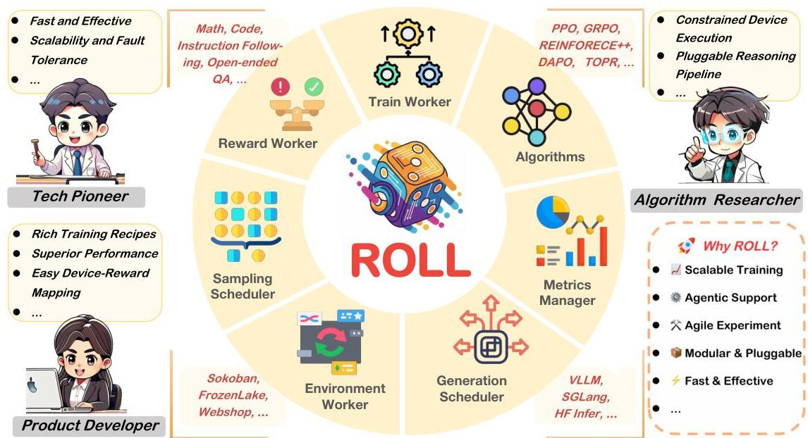
Figure 1: For three primary user groups, we introduce an efficient, scalable, and user-friendly library ROLL, which provides specific key features for large-scale RL optimization.

---

1 Introduction

The successful adoption of Reinforcement Learning (RL) in Large Language Models (LLMs), pioneered by RL from Human Feedback, has instigated the development of advanced RL techniques for reference alignment *(Ouyang et al., 2022; Bai et al., 2022)*, reasoning enhancement *(DeepSeek-AI et al., 2025; qwq, 2025)*, and agentic tool use *(Cao et al., 2025)*. Many leading LLMs including OpenAI o4 *(ope, 2024)*, QwQ *(qwq, 2025)*, Seed1.5-thinking *(Seed et al., 2025)*, and Deepseek-R1 *(DeepSeek-AI et al., 2025)* have all leveraged RL to achieve outstanding performance across a range of AI tasks, including coding *(Open-R1, 2025)*, mathematics *(max, 2025)*, and tool use *(Pan et al., 2024; Feng et al., 2025)*.

Existing RL optimization algorithms for LLM contain several types of paradigms as follows:

- RL from human Feedback *(Knox, 2012; Knox and Stone, 2009; Maclin et al., 2005; Judah et al., 2010)*.
- RL with verifiable rewards (RLVR) *(Zelikman et al., 2022; Lambert et al., 2024; Yu et al., 2025)*.
- RL with multi-turn agentic interaction *(Cao et al., 2025; Zhou et al., 2024b; Abdulhai et al., 2025)*.

They typically require maintaining multiple LLMs and orchestrating a multi-stage training pipeline. A standard RL training workflow involves up to four distinct LLMs *(Bai et al., 2022; Ouyang et al., 2022)*: the Actor, Critic, Ref, and Reward models (illustrated in Section 2.1). Each training iteration contains three stages. Generation: The Actor generates responses based on a batch of input prompts. In agentic RL settings, the Actor may also interact with the environment over multiple turns. Inference: The Critic, Ref, and Reward models perform forward passes over the generated responses to compute supervision signals or reward estimates. Recent RL endeavors have simplified it by reducing the number of LLMs in this stage even removing this stage *(Rafailov et al., 2023; Li et al., 2025a; Shao et al., 2024)*. Training: The Actor and Critic models update the parameters with the reward signal obtained in the inference stage. In certain RL algorithms *(Yu et al., 2025; Shao et al., 2024; Li et al., 2023b)*, the Critic model remains inactive. Most RL optimization approaches still fall within the broader family of these multi-model, multi-stage training paradigms. To support efficient RL optimization for LLMs, numerous system frameworks *(Harper et al., 2025; Hu et al., 2024; Zhong et al., 2024; Mei et al., 2024; Lei et al., 2024; Zhong et al., 2025)* have been proposed. However, most of these efforts introduce several classical system design approaches including single-controller *(Sheng et al., 2024)*, colocation *(Mei et al., 2024)*, and disaggregated architectures *(Zhong et al., 2025)* to accelerate RL training for LLMs.

Inspired by these seminal efforts, as shown in Figure 1, we introduce ROLL, an efficient, scalable, and user-friendly library crafted to supercharge RL optimization for large-scale learning. ROLL delivers several key features to serve for three primary user groups. For tech pioneers, ROLL supports fast, cost-effective, scalable, and fault-tolerant RL training in large-scale GPU clusters with heterogeneous hardware. For product developers, ROLL provides flexible and fine-grained control to route input samples to the appropriate agent environments, reward workers, and devices, delivering strong performance with minimal engineering effort. For algorithm researchers, ROLL facilitates efficient training on resource-constrained GPU setups and enables agile experimentation with new ideas through well-designed abstractions of RL training pipelines.

Specifically, ROLL consists of following pivotal key modules that empower its advanced features.

- We build upon the single-controller architecture proposed in *(Sheng et al., 2024)* and introduce a well-defined abstraction of the Parallel Worker to enable a flexible and modular RL training pipeline, thus easing the experimentation with new ideas.
- We introduce the optimized Parallel Strategy and Data Transfer to enable execution on resource-constrained devices, as well as fast, scalable, and fault-tolerant training.
- We provide the Rollout Scheduler to support fine-grained lifecycle management of each prompt sample during the generation stage, simplifying the orchestration of execution flow across response generation, environment interaction, and reward computation.
- We dedicate the Environment Worker and Reward Worker to provide efficient and scalable agentic environment interaction and reward computation.
- We implement the Resource Pool and leverage the AutoDeviceMapping to achieve efficient worker placement and optimized resource allocation.

Our ROLL is built atop Ray *(Moritz et al., 2018)* and integrate existing LLM optimization systems including vLLM *(Kwon et al., 2023)*, SGLang *(SGLang Team, 2025)*, DeeepSpeed *(Microsoft, 2021)*, and Megatron *(Shoeybi et al., 2019)*. Our in-house training of 200B+ MoE models on thousands of GPUs over two weeks without interruption demonstrates the efficiency and fault tolerance of ROLL in scalable RL training. Additionally, we benchmark ROLL on a multi-domain RLVR task encompassing code, math, and other verifiable domains, as well as on three agentic RL tasks, to validate its correctness and usability.

---

2 Background

### 2.1 RL for LLMs

RL is a pivotal technique adopted in post-training for LLMs. Here, we brief several key concepts in RL for LLMs, followed by the workflow to training RL for LLMs.

Key Concepts. RL training for LLMs typically employs policy gradient methods, particularly PPO (Proximal Policy Optimization) and its variants. The training pipeline usually consists of several key components: an Actor model that generates responses, a Critic that estimates value functions, a Ref model for preventing excessive divergence from initial behaviors, and a Reward model that evaluates response quality. For a given prompt, the Actor model continuously generates a trajectory of tokens until the termination criteria yield the response. In this context, each token generated by the model represents an action in the RL framework, where the optimization objective is to maximize the expected cumulative reward by adjusting the policy (i.e., Actor) to generate sequences that better align with human preferences and task requirements. The reference model (Ref) is usually initialized from the actor model and its weight is usually frozen during training. It serves as a regularization to ensure the actor model does not deviate overly from its initialized state. The reward model (Reward) is to provide a signal to guide the Actor to generate responses that align with specific goals, e.g., human preferences, tool use, and mathematical and code reasoning. It can be trained on human-labeled preference data using an LLM or we can use rule-based verification or sandbox execution to derive the reward value. The critic model (Critic) estimates the value function in RL and evaluates the expected future rewards of the current state (i.e., the generated text sequence so far) to help reduce variance in policy gradient updates and guide the policy optimization of the Actor.

Optimization Workflow. Each iteration in RL optimization for LLMs contains the generation, inference, and training stages as follows:

Generation Stage: The actor model interacts with the environment and generates responses for a batch of prompts. This process involves prefill phase, decoding phase, and environment interaction phase. The prefill phase is a compute-bound GPU task, which proceeds the prompt to compute its key-value cache. The decoding phase is a memory-bound GPU task, autogressively generating tokens until meeting the termination criterion. The environment interaction phase involves executing complex environments and facilitating interactions between these environments and the actor model, utilizing intensive CPU resources.

The single-turn tasks including mathematical and code reasoning, the actor model usually entails stateless environment interactions and only contains the prefill and decoding phase. In multi-turn tasks such as tool use, the actor model engages in multiple rounds of interaction with the environment, making the environment interaction phase a significant performance bottleneck.

In the generation stage, a rollout sample consists of tokens produced during prefill, decoding, and environment interaction and is utilized for later inference and training stages. A batch of responses are generated in this stage to accelerate convergence, albeit at the cost of substantial computational overhead.

Inference Stage: During the RL training process, each generated sequence from the actor model is evaluated through a single forward pass by the reference, critic, and reward models. The reference model provides KL penalties to prevent excessive policy deviation, the critic model estimates value scores for advantage computation, and the reward model assigns quality scores. These outputs are then combined to compute the final training objective, which typically includes policy loss, value loss, and KL penalty terms. The above process only entails the prefill phase, a compute-bound process.

One exception case is the reward computation. The LLM-based reward computation can be considered as the prefill phase and runs on GPUs. The computation of the verifiable rewards including rule-based mathematical verification, and sandbox verification, is similar to the environment interaction phase and usually needs many CPU resources to obtain the reward targets quickly.

Training Stage: The actor and critic model are updated with the produced samples in the generation stage and the reward signals in the inference stage. The updated parameters are synchronized for the generation stage in the subsequent iteration. Compared with the generation and inference stages, the training stage usually consumes substantial GPU memory and necessitates a variety of LLM parallelization strategies to enable its efficient execution.

### 2.2 System Optimization for RL-enhanced LLMs

Training. LLM training can be accelerated by 5D parallelism including Data Parallelism (DP) *(Rajbhandari et al., 2020; Zhao et al., 2023)*, Tensor Parallelism (TP) *(Shoeybi et al., 2019)*, Pipeline Parallelism

---

(PP) *(Huang et al., 2019)*, Context Parallel (CP) *(Li et al., 2021)*, and Expert Parallel (EP) *(Rajbhandari et al., 2022)*. Moreover, ZeRO *(Rajbhandari et al., 2020)*, activation recomputation *(Chen et al., 2016)*, and offloading *(Ren et al., 2021)* can be adopted to alleviate the memory overhead.

Inference/Generation. Many efficient LLM serving frameworks including SGLang *(SGLang Team, 2025)* and vLLM *(Kwon et al., 2023)* support DP, TP, PP, and EP efficiently. Besides, many LLM serving optimization works optimize the attention computation *(Li et al., 2023a, 2025b)* and KV cache usage *(Liu et al., 2024b; Hooper et al., 2024; Gao et al., 2025)*.

RL Optimizations. RL training for LLMs possesses distinct computations, including generation, inference, and training and different sizes of LLMs. Particularly, the Actor model performs the generation and training stage, the Critic model performs the training and inference stage, the Ref model performs the inference stage, and the Reward model performs the inference stage. Thus, distinct parallel strategies can be tailored for different models across various stages to maximize the overall performance. NeMo *(Harper et al., 2025)* and OpenRLHF *(Hu et al., 2024)* divide the GPU cluster into several partitions and allocate them to different stages. In each stage, they run LLMs with optimized parallelization strategies. To improve the resource utilization, Verl *(Sheng et al., 2024)*, RLHFuse *(Zhong et al., 2024)*, ReaL *(Mei et al., 2024)*, and PUZZLE *(Lei et al., 2024)* colocate LLMs of different stages in the same resource pool. StreamRL *(Zhong et al., 2025)* proposes to disaggregate the training and generation stages and asynchronously run the generation and training stages in a pipeline manner. Furthermore, the rollout generation can be accelerated owing to the high memory-bandwidth advantages in the inference cluster.

### 2.3 RL Algorithms

RL from Human Feedback. The early success of RL optimization for LLMs is to guide LLMs in attaining human preferences. In the early stages, RL from Human Feedback (RLHF) methods mainly centered around learning directly from human rewards *(Knox, 2012; Knox and Stone, 2009)*, learning from action advice *(Maclin et al., 2005)*, or learning from action critique *(Judah et al., 2010)*. For example, TAMER *(Warnell et al., 2018)* interprets human feedback as samples of the optimal action-value function. The COACH *(Arumugam et al., 2019)* considers the human feedback in a policy-dependent manner. Recently, after the release of ChatGPT, many RLHF methods *(Ouyang et al., 2022; Schulman et al., 2017)* have been proposed to align LLMs with human preferences and values, which typically includes three phases: supervised fine-tuning, reward model training, and policy optimization. However, these RLHF methods necessitate considerable human-annotated samples to train a reward model, preventing from their widespread adoption.

RL with Verifiable Rewards. Some researchers *(Zelikman et al., 2022; Zhang et al., 2024; Lambert et al., 2024; DeepSeek-AI et al., 2025; Yu et al., 2025)* propose the RL with Verifiable Rewards (RLVR) on several representation reasoning tasks (e.g., math, code). Specifically, the accuracies of these reasoning tasks are generally determined by whether the final answer is correct. This approach stems from the fact that reliably evaluating intermediate steps remains difficult, especially when those steps lack labeled ground truth. For example, researchers often employ rule-based policies to assess solutions in mathematical tasks, while they use the sandbox to judge whether the generated code successfully passes all test cases in coding tasks. In some cases, it is difficult to obtain the correctness of the answers, so the LLM-as-a-Judge *(Son et al., 2024)* is adopted, which uses an LLM to identify the correctness of the generated answer. Recently, the dynamic sampling *(Yu et al., 2025)* strategy has been widely used to filter samples based on the difficulties and improve the reasoning performance.

RL with Multi-turn Agentic Interaction. Unlike single-turn settings, where LLMs only perform one-pass response generation without ongoing environment interaction, multi-turn RL targets at more realistic agent scenarios *(Zhou et al., 2024b; Abdulhai et al., 2025)*. Specifically, LLM-based agents need to perform a trajectory of actions to accomplish certain tasks, i.e., managing a terminal *(Liu et al., 2024a)*, traversing web-based interfaces *(Zhou et al., 2024a)*. The slow execution of environments, the difficulty in obtaining reward feedback from actions, and the complex interactions between environments and LLMs collectively pose a significant challenge to adopting RL optimization for LLMs in multi-turn agentic interaction scenarios.

## 3 Key Features in ROLL

We provide several key features to support efficient execution and user-friendly RL development. Hereafter, we discuss these key features from the dimension of the user groups. Particularly, we concentrate on the user experience of tech pioneers, product developers, and algorithm researchers. Moreover, we elaborate on the specifications for the agentic RL training pipeline.

---

3.1 Tech Pioneer

The tech pioneers seek the leading role in the LLM community and they possess a large-scale GPU cluster to facilitate the scalable RL training of LLMs. The advantages of ROLL manifest in three aspects to attract such a user group.

- [leftmargin=*]
- Fast and Cost Effective: ROLL can fully exploit the high-performance hardware resources to expedite the RL training and achieve considerable training cost and time reduction in a large GPU cluster.
- Scalability and Fault Tolerance: ROLL supports a wide range of LLM training and serving optimization techniques, enabling the scalable training of a 200B-parameter model across thousands of GPUs without interruption for about two weeks. It also features an efficient checkpoint and resumption mechanism, allowing the training task to be restarted with minimal engineering effort.
- Flexible Hardware Usage: ROLL supports running RL training across a variety of hardware types. Users can choose between colocation or disaggregation, and configure synchronous or asynchronous execution modes, to fully leverage the advantages of different hardware architectures.

### 3.2 Product Developer

The product developers have enough GPUs to conduct RL training for in-house LLMs and they focus on configuring the task and reward to enhance LLMs with human alignment, reasoning capability, tool use, and business metrics. We recommend the product developers to choose ROLL for the following reasons.

- [leftmargin=*]
- Diverse and Extensible Rewards/Environments: ROLL implements a set of Reward Workers and Environment Workers. Product developers can readily customize their own reward and environment by building upon our in-situ implementations.
- Compositional Sample-Reward Route: ROLL provides a user-friendly interface to control the prompt sampling ratio across different tasks and dynamically route each sample to the corresponding Reward Worker (e.g., mathematical verifiers, sandbox environments, and LLM-as-a-judge). As production-level LLMs often encompass a diverse range of capabilities, this feature enables developers to optimize model performance across a mixture of domains and tasks.
- Easy Device-Reward Mapping: ROLL develops the device-reward mapping interface to easily configure the device mapping of the Reward Worker. This feature isolates the reward computation from other computational workloads in multi-task RL training for LLMs, preventing interference and performance bottlenecks.
- Rich Training Recipes: ROLL provides various RL algorithms, LLMs, tasks, and datasets to reduce the engineering effort required for developing new training features.
- Superior Performance: ROLL consists of a set of tuned training configurations that reach satisfactory performance across many tasks, relieving the burden of laborious hyperparameter search.

### 3.3 Algorithm Researcher

Most algorithm researchers have access to a limited number of GPUs, and they require flexible, fine-grained control over each component of RL training for LLMs in order to efficiently experiment with new ideas. ROLL is well-suited for this purpose, offering the following key features.

- [leftmargin=*]
- Constrained Device Execution: ROLL enables efficient training on constrained GPU resources via a set of memory optimization techniques, including single-GPU setups. This allows algorithm researchers to conduct multiple trial-and-error experiments and obtain timely feedback without requiring extensive high-grade GPUs.
- Pluggable Reasoning Pipeline: ROLL abstracts each stage of the RL training pipeline at an appropriate level of granularity, enabling agile experimentation with new ideas. Researchers can flexibly orchestrate the execution of individual stages, facilitating the implementation and customization of diverse RL algorithms.
- Transparent Experimentation: ROLL provides transparent logging and monitoring capabilities, making it easy to track and analyze each experiment.
- Fair Academic Baselines: ROLL offers classical algorithms, models, and tasks to facilitate fair baseline comparisons on standard benchmarks.

### 3.4 Specifications for Agentic RL

The recent surge in agentic RL calls for efficient support for agent-based RL training with LLMs. To address this, we equip ROLL with the following features to enable scalable agentic RL training.

---

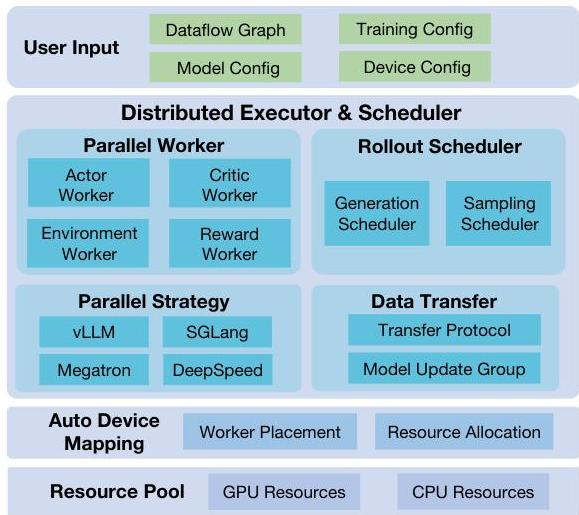
(a) Architecture

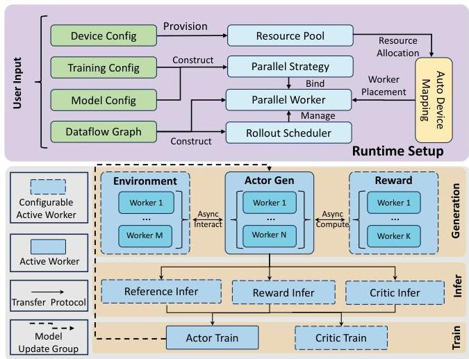
(b) Workflow
Figure 2: (a) The architecture of ROLL, which consists of the user input layer, a distributed executor &amp; scheduler, an Auto Device Mapping module, and a resource pool. (b) The runtime setup and the training workflow of ROLL.

- Scalable Multi-Turn Agent-Environment Interaction: Inspired by RAGEN (Wang et al., 2025), ROLL supports multi-turn interaction between agents and environments, scaling to long-horizon tasks.
- Sample-wise Scalable Environments: ROLL flexibly performs environment scaling to match the size of the input sample to enable the high-throughput rollout.
- Asynchronous Parallelized Agent-Environment Interaction: ROLL performs environment execution and actor generation asynchronously through sample-wise environment management, and enables parallelized environment execution via environment scaling, reducing GPU idle time and maximizing resource utilization.

# 4 Framework Design

In this section, we discuss the design of ROLL to underpin relevant key features discussed in Section 3.

# 4.1 System Architecture and Modules

Architecture. Figure 2a illustrates the architecture of ROLL. ROLL takes as input a user-defined RL dataflow graph along with its associated configurations. Based on this input, the distributed executor and scheduler orchestrate the workers and schedulers. The AutoDeviceMapping module manages resources within the provisioned resource pool and efficiently binds workers and schedulers to its allocated resources.

Parallel Worker. Parallel Worker is the owner of a collective of resources (i.e., PlacementGroup in ray), and ROLL uses the Cluster to represent a group of Parallel Workers that share the same role (e.g., actor training, critic inference) in the RL training to simplify the collective management of these workers. ROLL provides several types of Parallel Workers. The Actor Worker can be instantiated to serve as either an Actor or a Ref. The Critic Worker implements the functionality of the Critic, while the Reward Worker handles the Reward component, delivering various reward computation methods including rule-based verification (He et al., 2025), sandbox execution (Dou et al., 2024), and LLM-as-a-Judge (Son et al., 2024). The Environment Worker supports multi-turn interaction between various types of environments and LLMs.

Parallel Strategy. RL training in ROLL encompasses the training, inference, and generation stages. We integrate MegatronCore and DeepSpeed to accelerate LLM training, supporting advanced 5D parallelism strategies including DP, PP, TP, CP, and EP. ROLL also supports ZeRO2, ZeRO3, and ZeRO-offload (Ren et al., 2021) thanks to DeepSpeed (Rajbhandari et al., 2022). Additionally, we provide gradient checkpointing and offloading strategies to significantly reduce GPU memory consumption, enabling efficient execution on resource-constrained devices. For the inference and generation stage, we integrate the vLLM (Kwon et al., 2023) and SGLang (SGLang Team, 2025) to equip ROLL with TP, EP, PP to expedite the

---

inference and generation stage.

##### Rollout Scheduler.

The Rollout Scheduler allows users to schedule the lifecycle of each request at the granularity of individual samples, rather than batches, during the generation stage. Particularly, the Rollout Scheduler can dynamically add and abort requests based on current resource availability and the progress of response generation.

##### Data Transfer.

The Transfer Protocol was first introduced in HybridFlow *(Sheng et al., 2024)*, and we reuse it to reshard the input and output data across different stages. The ModelUpdateGroup is implemented to enable fast parameter synchronization between the training and generation/inference stages, supported by the NCCL communication backend, even in collocated training scenarios.

##### AutoDeviceMapping and Resource Pool.

The AutoDeviceMapping module orchestrates a set of CPU and GPU resources in the Resource Pool and binds them to the workers and scheduler.

### 4.2 System Workflow

Figure 2(b) depicts the workflow including the runtime setup (Top) and the training iteration (Bottom).

Runtime Setup. ROLL provisions a resource pool comprising GPU and CPU resources based on the provided device configurations. Guided by the RL dataflow, it creates a Rollout Scheduler and multiple Parallel Workers. The Rollout Scheduler oversees the lifecycle of each prompt sample request during the generation stage. Based on the training and model configurations, ROLL instantiates the Parallel Strategy to decide the parallelization strategy and execution backend for each Parallel Worker. Once the Parallel Workers are established, ROLL follows the device mapping configurations specified by the users and employ AutoDeviceMapping to allocate resources from the resource pool to the respective Parallel Workers.

Training Iteration. In the generation stage, a batch of samples is first fed to the Rollout Scheduler to generate responses. During this phase, the Actor model may interact with the EnvironmentWorker to perform multi-turn environment interactions in agentic RL tasks. It also invokes the Reward Worker to compute reward signals, enabling advanced sampling techniques (e.g., dynamic sampling *(Yu et al., 2025)*) to enhance sampling efficiency.

The subsequent inference stage involves forward passes by the Critic, Reward, and Ref models, provided they are activated in the RL dataflow graph. The Transfer Protocol then shards the responses from the generation stage and feeds them to each active Parallel Worker.

In the training stage, the Critic and Actor models update their parameters using the prepared reward signals. Besides, the Actor model also synchronizes model parameters with the generation stage via the ModelUpdateGroup in the next training iteration.

### 4.3 How to Underpin Key Features

We explain how our system modules in ROLL to support key features discussed in Section 3.

##### Single-Controller Pipeline.

We follow the hybrid programming model of HybridFlow *(Sheng et al., 2024)* to implement the training pipelines for RLHF, RLVR, and agentic RL within a single controller, simplifying the development and management of RL training workflows.

##### Worker Abstraction for RL Pipeline.

The abstractions of Parallel Worker and RolloutScheduler enable users to define and experiment with new pipelines with minimal engineering effort, by following our provided training workflow example. Particularly, the Actor Worker, Critic Worker, Reward Worker, and Environment Worker encapsulate the distinct roles in RL training. The well-defined abstraction allows users to concentrate on developing and customizing individual components without overhauling the entire codebase.

##### Optimized LLM Execution.

We fully capitalize on the advanced features of existing LLM execution engines, including DeepSpeed, Megatron, vLLM, and SGLang, to facilitate RL optimization in both large-scale GPU clusters and resource-constrained device environments.

##### User-defined Device Mapping.

Prior RL systems including OpenRLHF *(Hu et al., 2024)* and NeMo *(Akter et al., 2025)* enforce exclusive resource usage across different training stages. Recent research efforts *(Sheng et al., 2024; Zhong et al., 2024)* support the colocation of LLMs from different stages within

---

the same device group. In ROLL, the AutoDeviceMapping module supports flexible, user-defined device mapping, allowing a single device to be shared across multiple LLMs from different stages. This enables users to reallocate a portion of the GPUs assigned to the generation stage of the Actor model to its training stage, improving overall resource utilization.

This capability stems from two key functionalities. First, ROLL is implemented on top of Ray, which allows us to bind each device to specific workers while also allowing multiple workers to share the same device. Second, the ModelUpdateGroup facilitates model synchronization across different stages. As previously discussed, a group of Parallel Workers that share the same LLM role in RL training can be organized into a Cluster. Once synchronizing model parameters between the Actor_Train Cluster and the Actor_Infer Cluster, each worker in the training stage broadcasts its model parameters to corresponding workers in the generation stage in bucketed chunks, thereby improving the transfer speed. This design avoids enforcing co-location of training and inference processes, thereby supporting much more flexible, user-defined device mapping than prior RL systems *(Akter et al., 2025; Hu et al., 2024; Sheng et al., 2024; Zhong et al., 2024)*

##### Sample-level Rollout Lifecycle Control.

Most RL systems *(Akter et al., 2025; Hu et al., 2024; Sheng et al., 2024; Zhong et al., 2024)* process a batch of prompt samples during the generation stage to improve the throughput. However, long-tail issues in the generation stage *(Zhong et al., 2024)* lead to imbalanced resource utilization across different workers. To address this, the Rollout Scheduler provides a request rollout lifecycle control in the granularity of each prompt sample during the generation stage.

The optimization of dynamical sampling provided by ROLL is a successful adoption of sample-level rollout lifecycle control. Dynamic sampling refers to the strategy of oversampling prompts and filtering out those with accuracy scores of either 1 or 0, while retaining only those that contribute effective gradients. Sample-level rollout lifecycle control can significantly accelerate dynamic sampling in three key aspects. (1) Async Reward Computation: ROLL removes the synchronization barrier between the generation and reward computation phases by initiating reward computation for completed samples immediately, rather than waiting for all prompts in the batch to finish the response generation. (2) Add request: ROLL continuously monitors worker completion states and dynamically dispatches new prompt samples based on real-time demand, thereby improving resource utilization. (3) Abort Request: Once the number of prompts yielding effective gradients reaches the target threshold, ROLL can proactively terminate other ongoing response generation tasks, reducing unnecessary generation overhead.

##### Sample-Wise Management of Rewards and Environments.

The generation phase of the training workflow in Figure 2(b) depicts the asynchronous reward computation and asynchronous environment interaction. ROLL can spawn multiple Reward Workers and Environment Workers based on job load at scale, distributing them across resource pools to prevent performance bottlenecks. Sample-level rollout lifecycle control allows users to flexibly route each sample to the corresponding Reward Worker and Environment Worker.

ROLL leverages ray to support asynchronous reward computation. During RL training, multiple types of Reward Workers including rule-based verification, sandbox execution, and LLM-as-a-Judge can be activated. These workers dynamically perform reward computation at runtime based on the current job load, while sample-level rollout control allows for flexible and compositional routing of samples to the appropriate Reward Worker on demand. Owing to AutoDeviceMapping, each Reward Worker is assigned to user-specified devices, simplifying the allocation of reward modules to hardware resources.

Similar to the Reward Worker, ROLL allocates sufficient resources to deploy scalable Environment Workers and facilitates efficient interactions between Actor models and environments at scale. Furthermore, it supports parallelized environment interactions, enhancing environment throughput and reducing delays caused by waiting for responses. Sample-level rollout lifecycle control allows the Actor to process other samples without waiting for responses from the Environment Workers. In this scenario, ROLL can asynchronously initiate new prompt samples for generation, thereby preventing resource underutilization. This mechanism is referred to as asynchronous environment interaction. Given that these Environment Workers may be CPU-intensive, ROLL carefully distributes them across available resource pools to minimize interference with other workloads and among workers themselves.

## 5 Experiments

### 5.1 RLVR Pipeline

##### Data Collection.

The experimental data for ROLL on RLVR pipeline is systematically curated from established sources across three domains: (1) Math domain: DeepMath-103K *(He et al., 2025)*, from which

---

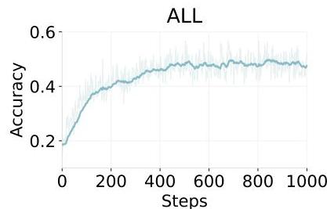

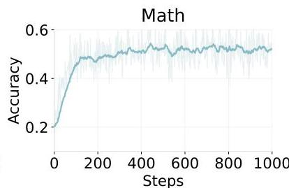

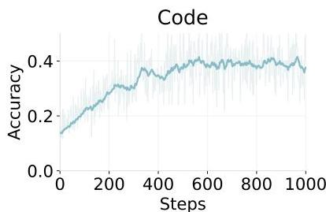

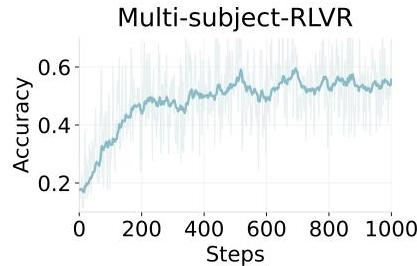
Figure 3: Accuracy Trends Across Different Tasks on Qwen2.5-7B-Base.

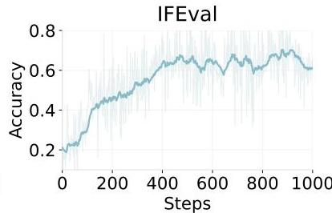

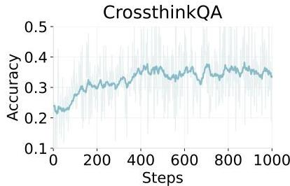

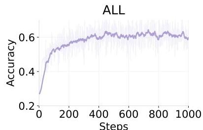

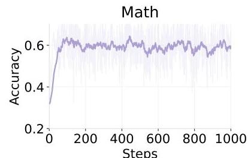

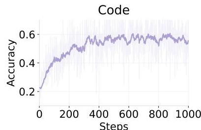

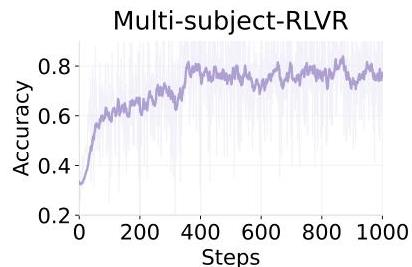
Figure 4: Accuracy Trends Across Different Tasks on Qwen3-30B-A3B-Base.

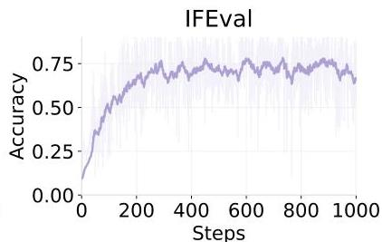

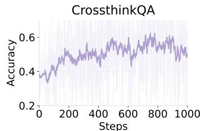

we sample 5,000 examples proportionally according to the difficulty; (2) Code domain: KodCode (Xu et al., 2025), from which we first filter out low-quality data and evenly sample 2,000 records based on the difficulty; (3) General domain: Multi-subject-RLVR (Su et al., 2025), Nemotron-CrossThink (Akter et al., 2025) and RLVR-IFeval (Lambert et al., 2024), from which we intentionally remove low-quality data.

Training Setting. We experiment with two LLMs: Qwen2.5-7B-base and Qwen3-30B-A3B-base. For policy optimization, we utilize PPO loss where the advantage value is computed using REINFORCE returns instead of GAE-based estimates (Schulman et al., 2015). The sampling ratio across domains is set to  $40\%$  for math,  $30\%$  for code, and  $30\%$  for general reasoning. We incorporate rule-based verification, sandbox execution for code, and both rule-based verification and LLM as a judge for general reasoning. More detailed training configurations can be found in the following files $^{1,2}$ .

Performance. As shown in Figure 3, the accuracy of the Qwen2.5-7B-Base model on average rises from 0.18 to 0.52, representing a  $2.89 \times$  improvement. Task-level analysis reveals marked gains in math reasoning (from 0.20 to 0.53) and code generation (from 0.13 to 0.41), highlighting the correctness and effectiveness of ROLL in task-specific tasks.

Figure 4 illustrates the accuracy of Qwen3-30B-A3B-Base on different tasks, which improves from

---

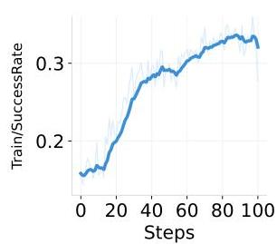
Figure 5: Performance metrics for the SimpleSokoban environment training. SuccessRate denotes the success rate of reaching the goal. EffectiveActionRate represents the proportion of valid actions executed.

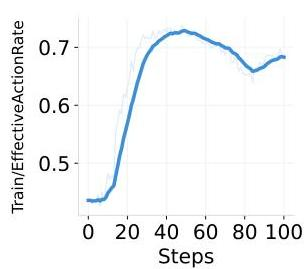

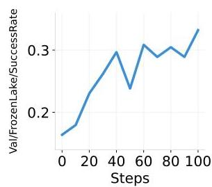

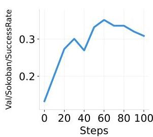

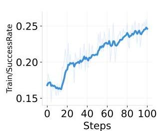
Figure 6: Performance metrics for the FrozenLake environment training.

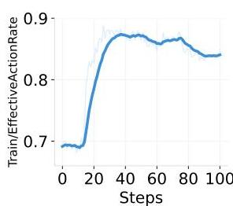

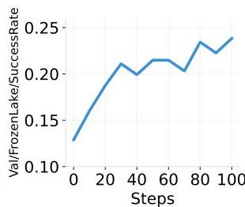

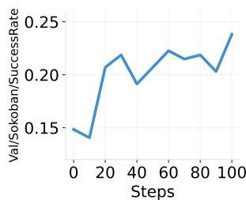

0.27 to 0.62, yielding a  $2.30 \times$  increase. Although the Qwen3-30B-A3B-Base model, which employs a mixture-of-experts architecture, exhibits greater accuracy fluctuations during training compared to the Qwen2.5-7B-Base model, it still demonstrates a clear upward trend and ultimately achieves superior performance. Overall, both models exhibit stable and consistent accuracy improvements throughout the training process without experiencing model collapse, indicating the robustness and practicality of ROLL.

# 5.2 Agentic Pipeline

We conduct extensive experiments across three distinct environments to rigorously evaluate the capabilities and adaptability of our agentic pipeline.

# 5.2.1 Sokoban

Environment Configuration. The Sokoban environment is a classic puzzle where the agent pushes boxes onto target locations within a grid. We configure three variants: (1) SimpleSokoban, a  $6 \times 6$  grid with one box; (2) LargerSokoban, an  $8 \times 8$  grid with two boxes; and (3) SokobanDifferentGridVocab, a  $6 \times 6$  grid using different symbols. Actions allowed are directional moves (Up, Down, Left, Right).

Training Setting. We employ the Qwen2.5-0.5B-Instruct model as the base model for training in the Sokoban environment. Training tasks are distributed across 8 GPUs, using a rollout batch size of 1024. For policy optimization, we utilize PPO loss where the advantage value is computed using REINFORCE returns instead of GAE-based estimates, incorporating advantage clipping at 10.0 and reward clipping at 20 to maintain training stability. A format penalty with a weight of -0.001 is applied to encourage properly formatted action outputs. More detailed training configurations can be found here $^3$ .

Performance. Figure 5 presents the training results in the SimpleSokoban environment. The model achieves a substantial performance gain, with the success ratio in training increasing from  $16.8\%$  to  $26.0\%$ . The success rate in the validation environment rises from  $13.3\%$  to  $35.2\%$ , and the proportion of effective actions grows from  $43.6\%$  to  $73.4\%$ , indicating steady improvement in agent capabilities. Moreover, these gains generalize well to the FrozenLake environment, demonstrating the robustness of our RL training framework.

# 5.2.2 FrozenLake

Environment Configuration. The FrozenLake environment requires an agent to navigate from a start to a goal position on a frozen surface while avoiding holes. The optional slippery ice mechanism introduces

---

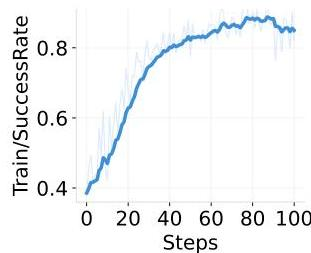
Figure 7: Performance metrics for the WebShop environment training. AvgSteps indicates the average number of steps required to complete the task, where fewer steps imply higher action efficiency.

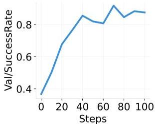

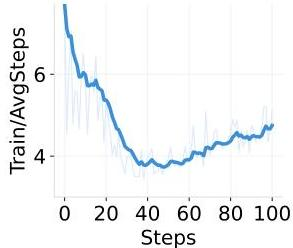

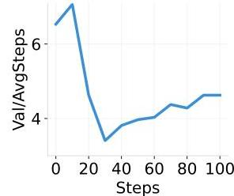

stochasticity by causing unintended movements, thus challenging the agent's adaptability to uncertainty.

Training Setting. We utilize the same Qwen2.5-0.5B-Instruct model and training configurations as the one in Sokoban environment for consistency. We refer readers to the repository for detailed training configurations $^4$ .

Performance. Figure 6 presents the training results in the FrozenLake environment. The model demonstrates steady performance gains, with the success ratio in training increasing from  $16.8\%$  to a peak of  $26.0\%$ , representing a  $55\%$  improvement. Concurrently, the proportion of effective actions rises from  $69.1\%$  to a peak of  $88.8\%$ , indicating enhanced action quality during training. On the validation set, the success rate demonstrates a corresponding pattern, rising from  $12.9\%$  at the beginning of training to a maximum of  $23.8\%$ . Meanwhile, the model also exhibits cross-environment transfer learning capabilities, with SimpleSokoban validation success rates reaching  $23.8\%$  despite being trained exclusively on FrozenLake.

# 5.2.3 WebShop

Environment Configuration. The WebShop environment simulates an online shopping task where the agent finds specific products using natural-language instructions. The agent performs iterative actions, including keyword searches, selecting product links, examining product details (e.g., description, features, size, color), and making purchase decisions. Actions vary by webpage context, and each trajectory is limited to 50 steps, highlighting the complexity of decision-making and instruction-following capabilities required.

Training Setting. We use the Qwen-2.5-7B-Instruct model for training in the WebShop environment to support long interactions and rich context. The sequence length is set as 8192 tokens. We retain the REINFORCE algorithm and use the same clipping parameters for advantage estimation. We increase the format penalty to -0.05 to encourage well-formed responses. More detailed training configurations can be found here $^{5}$ .

Performance. Figure 7 shows a substantial improvement in task success rate, increasing from  $37\%$  to over  $85\%$  on both training and validation environments. The average number of actions per episode decreases from over 7 to around 4, indicating that the LLM learns to complete tasks more efficiently. Overall, LLMs can effectively possess the capability of task competence and operational efficiency to cope with real-world environments.

# 6 Conclusion

In this report, we introduce ROLL, a framework designed to optimize RL training for LLMs at scale. ROLL caters to three primary user groups: tech pioneers, product developers, and RL researchers. At its core, ROLL is built upon a suite of system modules, including Parallel Worker, Rollout Scheduler, Parallel Strategy, and AutoDeviceMapping, which together form the foundation of ROLL. Our extensive empirical evaluation demonstrates the effectiveness of ROLL in accelerating and scaling RL training for LLMs.

---

12

# 7 Authors

Within each role, authors are listed alphabetically.

## Project Lead

- Weixun Wang
- Shaopan Xiong

## Core Contributors

- Gengru Chen
- Wei Gao
- Sheng Guo
- Yancheng He
- Ju Huang
- Jiaheng Liu
- Zhendong Li
- Xiaoyang Li
- Zichen Liu
- Haizhou Zhao

## Contributors

- Dakai An
- Lunxi Cao
- Qiyang Cao
- Wanxi Deng
- Feilei Du
- Yiliang Gu

- Jiahe Li
- Xiang Li
- Mingjie Liu
- Yijia Luo
- Zihe Liu
- Yadao Wang
- Pei Wang
- Tianyuan Wu
- Yanan Wu
- Yuheng Zhao
- Shuaibing Zhao
- Jin Yang
- Siran Yang
- Yingshui Tan
- Huimin Yi
- Yuchi Xu
- Yujin Yuan
- Xingyao Zhang

## Supervision

- Lin Qu
- Wenbo Su
- Wei Wang
- Jiamang Wang
- Bo Zheng

---

References

- [1] Introducing openai o3 and o4-mini. https://openai.com/index/introducing-o3-and-o4-mini/, 2024.
- [2] AIME 2024 Dataset, 2025. URL https://huggingface.co/datasets/Maxwell-Jia/AIME_2024.
- [3] Qwq-32b: Embracing the power of reinforcement learning. https://qwenlm.github.io/blog/qwq-32b/, 2025.
- [4] Marwa Abdulhai, Isadora White, Charlie Victor Snell, Charles Sun, Joey Hong, Yuexiang Zhai, Kelvin Xu, and Sergey Levine. LMRL gym: Benchmarks for multi-turn reinforcement learning with language models, 2025. URL https://openreview.net/forum?id=EdKSI2ijUY.
- [5] Syeda Nahida Akter, Shrimai Prabhumoye, Matvei Novikov, Seungju Han, Ying Lin, Evelina Bakhturi, Eric Nyberg, Yejin Choi, Mostofa Patwary, Mohammad Shoeybi, et al. Nemotron-crossthink: Scaling self-learning beyond math reasoning. arXiv preprint arXiv:2504.13941, 2025.
- [6] Dilip Arumugam, Jun Ki Lee, Sophie Saskin, and Michael L. Littman. Deep Reinforcement Learning from Policy-Dependent Human Feedback, 2019. arXiv: 1902.04257. preprint.
- [7] Yuntao Bai, Andy Jones, Kamal Ndousse, Amanda Askell, Anna Chen, Nova DasSarma, Dawn Drain, Stanislav Fort, Deep Ganguli, Tom Henighan, et al. Training a helpful and harmless assistant with reinforcement learning from human feedback. arXiv preprint arXiv:2204.05862, 2022.
- [8] Shiyi Cao, Sumanth Hegde, Dacheng Li, Tyler Griggs, Shu Liu, Eric Tang, Jiayi Pan, Xingyao Wang, Akshay Malik, Graham Neubig, Kourosh Hakhamaneshi, Richard Liaw, Philipp Moritz, Matei Zaharia, Joseph E. Gonzalez, and Ion Stoica. Skyrl-v0: Train real-world long-horizon agents via reinforcement learning, 2025.
- [9] Tianqi Chen, Bing Xu, Chiyuan Zhang, and Carlos Guestrin. Training deep nets with sublinear memory cost. arXiv preprint arXiv:1604.06174, 2016.
- [10] DeepSeek-AI, Daya Guo, Dejian Yang, Haowei Zhang, Junxiao Song, Ruoyu Zhang, Runxin Xu, Qihao Zhu, Shirong Ma, Peiyi Wang, Xiao Bi, Xiaokang Zhang, Xingkai Yu, Yu Wu, Z. F. Wu, Zhibin Gou, Zhihong Shao, Zhuoshu Li, Ziyi Gao, Aixin Liu, Bing Xue, Bingxuan Wang, Bochao Wu, Bei Feng, Chengda Lu, Chenggang Zhao, Chengqi Deng, Chenyu Zhang, Chong Ruan, Damai Dai, Deli Chen, Dongjie Ji, Erhang Li, Fangyun Lin, Fucong Dai, Fuli Luo, Guangbo Hao, Guanting Chen, Guowei Li, H. Zhang, Han Bao, Hanwei Xu, Haocheng Wang, Honghui Ding, Huajian Xin, Huazuo Gao, Hui Qu, Hui Li, Jianzhong Guo, Jiashi Li, Jiawei Wang, Jingchang Chen, Jingyang Yuan, Junjie Qiu, Junlong Li, J. L. Cai, Jiaqi Ni, Jian Liang, Jin Chen, Kai Dong, Kai Hu, Kaige Gao, Kang Guan, Kexin Huang, Kuai Yu, Lean Wang, Lecong Zhang, Liang Zhao, Litong Wang, Liyue Zhang, Lei Xu, Leyi Xia, Mingchuan Zhang, Minghua Zhang, Minghui Tang, Meng Li, Miaojun Wang, Mingming Li, Ning Tian, Panpan Huang, Peng Zhang, Qiancheng Wang, Qinyu Chen, Qiushi Du, Ruiqi Ge, Ruisong Zhang, Ruizhe Pan, Runji Wang, R. J. Chen, R. L. Jin, Ruyi Chen, Shanghao Lu, Shangyan Zhou, Shanhuang Chen, Shengfeng Ye, Shiyu Wang, Shuiping Yu, Shunfeng Zhou, Shuting Pan, S. S. Li, Shuang Zhou, Shaoqing Wu, Shengfeng Ye, Tao Yun, Tian Pei, Tianyu Sun, T. Wang, Wangding Zeng, Wanjia Zhao, Wen Liu, Wenfeng Liang, Wenjun Gao, Wenqin Yu, Wentao Zhang, W. L. Xiao, Wei An, Xiaodong Liu, Xiaohan Wang, Xiaokang Chen, Xiaotao Nie, Xin Cheng, Xin Liu, Xin Xie, Xingchao Liu, Xinyu Yang, Xinyuan Li, Xuecheng Su, Xuheng Lin, X. Q. Li, Xiangyue Jin, Xiaojin Shen, Xiaosha Chen, Xiaowen Sun, Xiaoxiang Wang, Xinnan Song, Xinyi Zhou, Xianzu Wang, Xinxia Shan, Y. K. Li, Y. Q. Wang, Y. X. Wei, Yang Zhang, Yanhong Xu, Yao Li, Yao Zhao, Yaofeng Sun, Yaohui Wang, Yi Yu, Yichao Zhang, Yifan Shi, Yiliang Xiong, Ying He, Yishi Piao, Yisong Wang, Yixuan Tan, Yiyang Ma, Yiyuan Liu, Yongqiang Guo, Yuan Ou, Yuduan Wang, Yue Gong, Yuheng Zou, Yujia He, Yunfan Xiong, Yuxiang Luo, Yuxiang You, Yuxuan Liu, Yuyang Zhou, Y. X. Zhu, Yanhong Xu, Yanping Huang, Yaohui Li, Yi Zheng, Yuchen Zhu, Yunxian Ma, Ying Tang, Yukun Zha, Yuting Yan, Z. Z. Ren, Zehui Ren, Zhangli Sha, Zhe Fu, Zhean Xu, Zhenda Xie, Zhengyan Zhang, Zhewen Hao, Zhicheng Ma, Zhigang Yan, Zhiyu Wu, Zihui Gu, Zijia Zhu, Zijun Liu, Zilin Li, Ziwei Xie, Ziyang Song, Zizheng Pan, Zhen Huang, Zhipeng Xu, Zhongyu Zhang, and Zhen Zhang. Deepseek-r1: Incentivizing reasoning capability in llms via reinforcement learning. arXiv preprint arXiv:2501.12948, 2025.
- [11] Shihan Dou, Jiazheng Zhang, Jianxiang Zang, Yunbo Tao, Weikang Zhou, Haoxiang Jia, Shichun Liu, Yuming Yang, Zhiheng Xi, Shenxi Wu, Shaoqing Zhang, Muling Wu, Changze Lv, Limao Xiong, Wenyu Zhan, Lin Zhang, Rongxiang Weng, Jingang Wang, Xunliang Cai, Yueming Wu, Ming Wen, Rui Zheng, Tao Ji, Yixin Cao, Tao Gui, Xipeng Qiu, Qi Zhang, and Xuanjing Huang. Multi-programming language sandbox for llms, 2024. URL https://arxiv.org/abs/2410.23074.

##

---

Lang Feng, Zhenghai Xue, Tingcong Liu, and Bo An. Group-in-group policy optimization for llm agent training. arXiv preprint arXiv:2505.10978, 2025.

Wei Gao, Xinyu Zhou, Peng Sun, Tianwei Zhang, and Yonggang Wen. Rethinking key-value cache compression techniques for large language model serving. CoRR, abs/2503.24000, 2025. doi: 10.48550/ARXIV.2503.24000. URL https://doi.org/10.48550/arXiv.2503.24000.

Eric Harper, Somshubra Majumdar, Oleksii Kuchaiev, Li Jason, Yang Zhang, Evelina Bakhturina, Vahid Noroozi, Sandeep Subramanian, Koluguri Nithin, Huang Jocelyn, Fei Jia, Jagadeesh Balam, Xuesong Yang, Micha Livne, Yi Dong, Sean Naren, and Boris Ginsburg. NeMo: a toolkit for Conversational AI and Large Language Models, 2025. URL https://github.com/NVIDIA/NeMo.

Zhiwei He, Tian Liang, Jiahao Xu, Qiuzhi Liu, Xingyu Chen, Yue Wang, Linfeng Song, Dian Yu, Zhenwen Liang, Wenxuan Wang, et al. Deepmath-103k: A large-scale, challenging, decontaminated, and verifiable mathematical dataset for advancing reasoning. arXiv preprint arXiv:2504.11456, 2025.

Coleman Hooper, Sehoon Kim, Hiva Mohammadzadeh, Michael W Mahoney, Yakun Sophia Shao, Kurt Keutzer, and Amir Gholami. Kvquant: Towards 10 million context length llm inference with kv cache quantization. arXiv preprint arXiv:2401.18079, 2024.

Jian Hu, Xibin Wu, Weixun Wang, Dehao Zhang, Yu Cao, et al. Openrlhf: An easy-to-use, scalable and high-performance rlhf framework. arXiv preprint arXiv:2405.11143, 2024.

Yanping Huang, Youlong Cheng, Ankur Bapna, Orhan Firat, Dehao Chen, Mia Chen, HyoukJoong Lee, Jiquan Ngiam, Quoc V Le, Yonghui Wu, et al. Gpipe: Efficient training of giant neural networks using pipeline parallelism. Advances in neural information processing systems, 32, 2019.

Kshitij Judah, Saikat Roy, Alan Fern, and Thomas Dietterich. Reinforcement Learning Via Practice and Critique Advice. In Proceedings of the AAAI Conference on Artificial Intelligence, volume 24, 2010. doi: 10.1609/aaai.v24i1.7690.

W. Bradley Knox. Learning from Human-generated Reward. PhD thesis, The University of Texas at Austin, 2012. URL https://repositories.lib.utexas.edu/items/20b9e8a1-a78d-4844-816f-3c0b0a4c848a.

W. Bradley Knox and Peter Stone. Interactively shaping agents via human reinforcement: The TAMER framework. In Proceedings of the International Conference on Knowledge Capture (K-CAP). Association for Computing Machinery, 2009. doi: 10.1145/1597735.1597738.

Woosuk Kwon, Zhuohan Li, Siyuan Zhuang, Ying Sheng, Lianmin Zheng, Cody Hao Yu, Joseph E. Gonzalez, Hao Zhang, and Ion Stoica. Efficient memory management for large language model serving with pagedattention. In Proceedings of the ACM SIGOPS 29th Symposium on Operating Systems Principles, 2023.

Nathan Lambert, Jacob Morrison, Valentina Pyatkin, Shengyi Huang, Hamish Ivison, Faeze Brahman, Lester James V Miranda, Alisa Liu, Nouha Dziri, Shane Lyu, et al. T$\backslash$” ulu 3: Pushing frontiers in open language model post-training. arXiv preprint arXiv:2411.15124, 2024.

Kinman Lei, Yuyang Jin, Mingshu Zhai, Kezhao Huang, Haoxing Ye, and Jidong Zhai. {PUZZLE}: Efficiently aligning large language models through {Light-Weight} context switch. In 2024 USENIX Annual Technical Conference (USENIX ATC 24), pp. 127–140, 2024.

Dacheng Li, Rulin Shao, Anze Xie, Eric P Xing, Xuezhe Ma, Ion Stoica, Joseph E Gonzalez, and Hao Zhang. Distflashattn: Distributed memory-efficient attention for long-context llms training. arXiv preprint arXiv:2310.03294, 2023a.

Shenggui Li, Fuzhao Xue, Yongbin Li, and Yang You. Sequence parallelism: Making 4d parallelism possible. arXiv preprint arXiv:2105.13120, 2021.

Shilong Li, Yancheng He, Hui Huang, Xingyuan Bu, Jiaheng Liu, Hangyu Guo, Weixun Wang, Jihao Gu, Wenbo Su, and Bo Zheng. 2D-DPO: Scaling direct preference optimization with 2-dimensional supervision. In Luis Chiruzzo, Alan Ritter, and Lu Wang (eds.), Findings of the Association for Computational Linguistics: NAACL 2025, pp. 8149–8173, Albuquerque, New Mexico, April 2025a. Association for Computational Linguistics. ISBN 979-8-89176-195-7. URL https://aclanthology.org/2025.findings-naacl.455/.

Yucheng Li, Huiqiang Jiang, Chengruidong Zhang, Qianhui Wu, Xufang Luo, Surin Ahn, Amir H Abdi, Dongsheng Li, Jianfeng Gao, Yuqing Yang, and Lili Qiu. MMlference: Accelerating pre-filling for long-context vlms via modality-aware permutation sparse attention. In Forty-second International Conference on Machine Learning, 2025b. URL https://openreview.net/forum?id=me6PfbATWM.

---

Ziniu Li, Tian Xu, Yushun Zhang, Yang Yu, RUoyu Sun, and Zhi-Quan Luo. Remax: A simple, effective, and efficient method for aligning large language models. 2023b.

Xiao Liu, Hao Yu, Hanchen Zhang, Yifan Xu, Xuanyu Lei, Hanyu Lai, Yu Gu, Hangliang Ding, Kaiwen Men, Kejuan Yang, Shudan Zhang, Xiang Deng, Aohan Zeng, Zhengxiao Du, Chenhui Zhang, Sheng Shen, Tianjun Zhang, Yu Su, Huan Sun, Minlie Huang, Yuxiao Dong, and Jie Tang. Agentbench: Evaluating LLMs as agents. In The Twelfth International Conference on Learning Representations, 2024a. URL https://openreview.net/forum?id=zAdUB0aCTQ.

Zirui Liu, Jiayi Yuan, Hongye Jin, Shaochen Zhong, Zhaozhuo Xu, Vladimir Braverman, Beidi Chen, and Xia Hu. Kivi: A tuning-free asymmetric 2bit quantization for kv cache. arXiv preprint arXiv:2402.02750, 2024b.

Richard Maclin, Jude Shavlik, Lisa Torrey, Trevor Walker, and Edward Wild. Giving advice about preferred actions to reinforcement learners via knowledge-based kernel regression. In Proceedings of the AAAI Conference on Artificial Intelligence. AAAI Press, 2005. URL https://aaai.org/papers/00819-AAAI05.

Zhiyu Mei, Wei Fu, Kaiwei Li, Guangju Wang, Huanchen Zhang, and Yi Wu. Realhf: Optimized rlhf training for large language models through parameter reallocation. arXiv preprint arXiv:2406.14088, 2024.

Microsoft. Deepspeed autotuning. [online]. available: https://www.deepspeed.ai/tutorials/autotuning. 2021.

Philipp Moritz, Robert Nishihara, Stephanie Wang, Alexey Tumanov, Richard Liaw, Eric Liang, Melih Elibol, Zongheng Yang, William Paul, Michael I. Jordan, and Ion Stoica. Ray: A distributed framework for emerging AI applications. In 13th USENIX Symposium on Operating Systems Design and Implementation (OSDI 18), pp. 561–577, Carlsbad, CA, October 2018. USENIX Association. ISBN 978-1-939133-08-3. URL https://www.usenix.org/conference/osdi18/presentation/moritz.

Open-R1. Codeforces Dataset, 2025. URL https://huggingface.co/datasets/open-r1/codeforces.

Long Ouyang, Jeffrey Wu, Xu Jiang, Diogo Almeida, Carroll Wainwright, Pamela Mishkin, Chong Zhang, Sandhini Agarwal, Katarina Slama, Alex Ray, et al. Training language models to follow instructions with human feedback. Advances in Neural Information Processing Systems, 35:27730–27744, 2022.

Jiayi Pan, Xingyao Wang, Graham Neubig, Navdeep Jaitly, Heng Ji, Alane Suhr, and Yizhe Zhang. Training software engineering agents and verifiers with swe-gym, 2024. URL https://arxiv.org/abs/2412.21139.

Rafael Rafailov, Archit Sharma, Eric Mitchell, Stefano Ermon, Christopher D. Manning, and Chelsea Finn. Direct preference optimization: Your language model is secretly a reward model. ArXiv, abs/2305.18290, 2023. URL https://api.semanticscholar.org/CorpusID:258959321.

Samyam Rajbhandari, Jeff Rasley, Olatunji Ruwase, and Yuxiong He. Zero: Memory optimizations toward training trillion parameter models. In SC20: International Conference for High Performance Computing, Networking, Storage and Analysis, pp. 1–16. IEEE, 2020.

Samyam Rajbhandari, Conglong Li, Zhewei Yao, Minjia Zhang, Reza Yazdani Aminabadi, Ammar Ahmad Awan, Jeff Rasley, and Yuxiong He. Deepspeed-moe: Advancing mixture-of-experts inference and training to power next-generation ai scale. In International conference on machine learning, pp. 18332–18346. PMLR, 2022.

Jie Ren, Samyam Rajbhandari, Reza Yazdani Aminabadi, Olatunji Ruwase, Shuangyan Yang, Minjia Zhang, Dong Li, and Yuxiong He. {Zero-offload}: Democratizing {billion-scale} model training. In 2021 USENIX Annual Technical Conference (USENIX ATC 21), pp. 551–564, 2021.

John Schulman, Philipp Moritz, Sergey Levine, Michael Jordan, and Pieter Abbeel. High-dimensional continuous control using generalized advantage estimation. arXiv preprint arXiv:1506.02438, 2015.

John Schulman, Filip Wolski, Prafulla Dhariwal, Alec Radford, and Oleg Klimov. Proximal policy optimization algorithms. arXiv preprint arXiv:1707.06347, 2017.

ByteDance Seed, Yufeng Yuan, Yu Yue, Mingxuan Wang, Xiaochen Zuo, Jiaze Chen, Lin Yan, Wenyuan Xu, Chi Zhang, Xin Liu, et al. Seed-thinking-v1. 5: Advancing superb reasoning models with reinforcement learning. arXiv preprint arXiv:2504.13914, 2025.

SGLang Team. Sglang: Fast serving framework for large language models. https://github.com/sgl-project/sglang, 2025. Version 0.4.

---

Zhihong Shao, Peiyi Wang, Qihao Zhu, Runxin Xu, Junxiao Song, Xiao Bi, Haowei Zhang, Mingchuan Zhang, YK Li, Y Wu, et al. Deepseekmath: Pushing the limits of mathematical reasoning in open language models. arXiv preprint arXiv:2402.03300, 2024.
- [11] Guangming Sheng, Chi Zhang, Zilingfeng Ye, Xibin Wu, Wang Zhang, Ru Zhang, Yanghua Peng, Haibin Lin, and Chuan Wu. Hybridflow: A flexible and efficient rlhf framework. arXiv preprint arXiv:2409.19256, 2024.
- [12] Mohammad Shoeybi, Mostofa Patwary, Raul Puri, Patrick LeGresley, Jared Casper, and Bryan Catanzaro. Megatron-lm: Training multi-billion parameter language models using model parallelism. arXiv preprint arXiv:1909.08053, 2019.
- [13] Guijin Son, Hyunwoo Ko, Hoyoung Lee, Yewon Kim, and Seunghyeok Hong. Llm-as-a-judge and reward model: What they can and cannot do, 2024. URL https://arxiv.org/abs/2409.11239.
- [14] Yi Su, Dian Yu, Linfeng Song, Juntao Li, Haitao Mi, Zhaopeng Tu, Min Zhang, and Dong Yu. Crossing the reward bridge: Expanding rl with verifiable rewards across diverse domains. arXiv preprint arXiv:2503.23829, 2025.
- [15] Zihan Wang, Kangrui Wang, Qineng Wang, Pingyue Zhang, Linjie Li, Zhengyuan Yang, Xing Jin, Kefan Yu, Minh Nhat Nguyen, Licheng Liu, Eli Gottlieb, Yiping Lu, Kyunghyun Cho, Jiajun Wu, Li Fei-Fei, Lijuan Wang, Yejin Choi, and Manling Li. Ragen: Understanding self-evolution in llm agents via multi-turn reinforcement learning, 2025. URL https://arxiv.org/abs/2504.20073.
- [16] Garrett Warnell, Nicholas Waytowich, Vernon Lawhern, and Peter Stone. Deep TAMER: Interactive Agent Shaping in High-Dimensional State Spaces. In Proceedings of the AAAI Conference on Artificial Intelligence, volume 32, 2018. doi: 10.1609/aaai.v32i1.11485.
- [17] Zhangchen Xu, Yang Liu, Yueqin Yin, Mingyuan Zhou, and Radha Poovendran. Kodcode: A diverse, challenging, and verifiable synthetic dataset for coding. arXiv preprint arXiv:2503.02951, 2025.
- [18] Qiying Yu, Zheng Zhang, Ruofei Zhu, Yufeng Yuan, Xiaochen Zuo, Yu Yue, Weinan Dai, Tiantian Fan, Gaohong Liu, Lingjun Liu, Xin Liu, Haibin Lin, Zhiqi Lin, Bole Ma, Guangming Sheng, Yuxuan Tong, Chi Zhang, Mofan Zhang, Wang Zhang, Hang Zhu, Jinhua Zhu, Jiaze Chen, Jiangjie Chen, Chengyi Wang, Hongli Yu, Yuxuan Song, Xiangpeng Wei, Hao Zhou, Jingjing Liu, Wei-Ying Ma, Ya-Qin Zhang, Lin Yan, Mu Qiao, Yonghui Wu, and Mingxuan Wang. Dapo: An open-source llm reinforcement learning system at scale, 2025. URL https://arxiv.org/abs/2503.14476.
- [19] Eric Zelikman, Yuhuai Wu, Jesse Mu, and Noah Goodman. Star: Bootstrapping reasoning with reasoning. Advances in Neural Information Processing Systems, 35:15476–15488, 2022.
- [20] Yuxiang Zhang, Yuqi Yang, Jiangming Shu, Yuhang Wang, Jinlin Xiao, and Jitao Sang. Openrft: Adapting reasoning foundation model for domain-specific tasks with reinforcement fine-tuning. arXiv preprint arXiv:2412.16849, 2024.
- [21] Yanli Zhao, Andrew Gu, Rohan Varma, Liang Luo, Chien-Chin Huang, Min Xu, Less Wright, Hamid Shojanazeri, Myle Ott, Sam Shleifer, et al. Pytorch fsdp: experiences on scaling fully sharded data parallel. arXiv preprint arXiv:2304.11277, 2023.
- [22] Yinmin Zhong, Zili Zhang, Bingyang Wu, Shengyu Liu, Yukun Chen, Changyi Wan, Hanpeng Hu, Lei Xia, Ranchen Ming, Yibo Zhu, and Xin Jin. Rlhfuse: Efficient rlhf training for large language models with inter- and intra-stage fusion, 2024. URL https://arxiv.org/abs/2409.13221.
- [23] Yinmin Zhong, Zili Zhang, Xiaoniu Song, Hanpeng Hu, Chao Jin, Bingyang Wu, Nuo Chen, Yukun Chen, Yu Zhou, Changyi Wan, Hongyu Zhou, Yimin Jiang, Yibo Zhu, and Daxin Jiang. Streamrl: Scalable, heterogeneous, and elastic rl for llms with disaggregated stream generation, 2025. URL https://arxiv.org/abs/2504.15930.
- [24] Shuyan Zhou, Frank F. Xu, Hao Zhu, Xuhui Zhou, Robert Lo, Abishek Sridhar, Xianyi Cheng, Tianyue Ou, Yonatan Bisk, Daniel Fried, Uri Alon, and Graham Neubig. Webarena: A realistic web environment for building autonomous agents. In The Twelfth International Conference on Learning Representations, 2024a. URL https://openreview.net/forum?id=oKn9c6ytLx.
- [25] Yifei Zhou, Andrea Zanette, Jiayi Pan, Sergey Levine, and Aviral Kumar. ArCHer: Training language model agents via hierarchical multi-turn RL. In Forty-first International Conference on Machine Learning, 2024b. URL https://openreview.net/forum?id=b6rA0kAHT1.