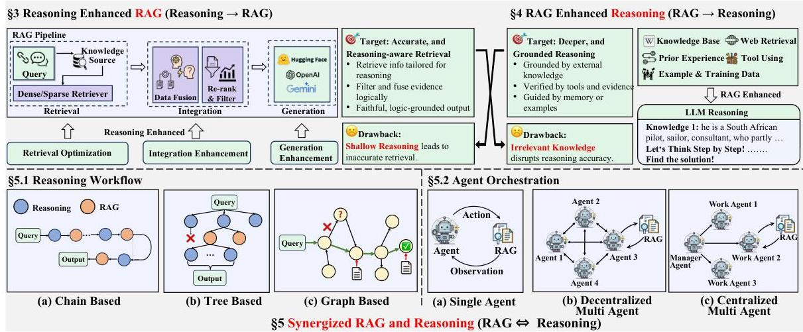
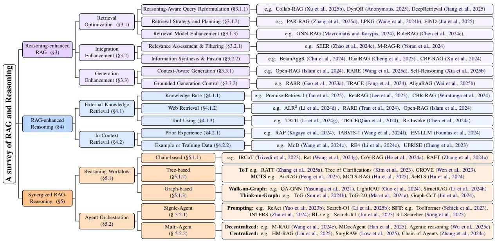

# Towards Agentic RAG with Deep Reasoning: A Survey of RAG-Reasoning Systems in LLMs

Yangning Li^{1} , Weizhi Zhang^{2} , Yuyao Yang^{2}, Wei-Chieh Huang^{2}, Yaozu Wu^{3}
Junyu Luo^{4}, Yuanchen Bei^{5}, Henry Peng Zou^{2}, Xiao Luo^{6}, Yusheng Zhao^{4}
Chunkit Chan^{7}, Yankai Chen^{2}, Zhongfen Deng^{2}, Yinghui Li^{1}, Hai-Tao Zheng^{1},
Dongyuan Li^{3}, Renhe Jiang^{3}, Ming Zhang^{4}, Yangqiu Song^{7}, Philip S. Yu^{1}
^{1}Tsinghua University ^{2}University of Illinois Chicago ^{3}The University of Tokyo
^{4}Peking University ^{5}University of Illinois Urbana-Champaign
^{6}University of California, Los Angeles ^{7}HKUST
ynli23@mails.tsinghua.edu.cn, wzhan42@uic.edu [ Equal Contribution.]

###### Abstract

Retrieval-Augmented Generation (RAG) lifts the factuality of Large Language Models (LLMs) by injecting external knowledge, yet it falls short on problems that demand multi-step inference; conversely, purely reasoning-oriented approaches often hallucinate or mis-ground facts. This survey synthesizes both strands under a unified reasoning-retrieval perspective. We first map how advanced reasoning optimizes each stage of RAG (Reasoning-Enhanced RAG). Then, we show how retrieved knowledge of different type supply missing premises and expand context for complex inference (RAG-Enhanced Reasoning). Finally, we spotlight emerging Synergized RAG-Reasoning frameworks, where (agentic) LLMs iteratively interleave search and reasoning to achieve state-of-the-art performance across knowledge-intensive benchmarks. We categorize methods, datasets, and open challenges, and outline research avenues toward deeper RAG-Reasoning systems that are more effective, multimodally-adaptive, trustworthy, and human-centric. The collection is available at https://github.com/DavidZWZ/Awesome-RAG-Reasoning.

## 1 Introduction

The remarkable progress in Large Language Models (LLMs) has transformed a wide array of fields, showcasing unprecedented capabilities across diverse tasks *(Zhao et al., 2023)*. Despite these advancements, the effectiveness of LLMs remains hindered by two fundamental limitations: knowledge hallucinations, due to the static and parametric manner of their knowledge storage *(Huang et al., 2025b)*; and struggles with complex reasoning, especially when tackling real-world problems *(Chang et al., 2024)*. These limitations have driven the development of two major directions: Retrieval-Augmented Generation (RAG) *(Fan et al., 2024a)*, which provides LLMs with external knowledge; and various methods aimed at enhancing their inherent reasoning abilities *(Chen et al., 2025c)*.

The two limitations are inherently intertwined: missing knowledge can impede reasoning, and flawed reasoning hinders knowledge utilization *(Tonmoy et al., 2024)*. Naturally, researchers have increasingly explored combining retrieval with reasoning, though early work followed two separate, one-way enhancements. The first, Reasoning-enhanced RAG *(Gao et al., 2023b)* (Reasoning $\rightarrow$ RAG), leverages reasoning to improve specific stages of the RAG pipeline. The second path, RAG-enhanced Reasoning *(Fan et al., 2024a)* (RAG $\rightarrow$ Reasoning), supplies external factual grounding or contextual cues to bolster LLM reasoning.

While beneficial, the above methods remain bound to a static Retrieval-Then-Reasoning (RTR) framework, offering only localized improvements to individual components. Several inherent limitations persist: (1) Retrieval Adequacy and Accuracy cannot be guaranteed; Pre-retrieved knowledge may fail to align with the actual knowledge needs that emerge during reasoning, especially in complex tasks *(Zheng et al., 2025; Li et al., 2025d)*. (2) Reasoning Depth remains constrained. When retrieved knowledge contains errors or conflicts, it can adversely interfere with the model’s inherent reasoning capabilities *(Li et al., 2025b; Chen et al., 2025a)*. (3) System Adaptability proves insufficient. The RTR framework lacks mechanisms for iterative feedback or dynamic retrieval during reasoning. This rigidity limits its effectiveness in scenarios that require adaptive reasoning, such as open-domain QA or scientific discovery *(Xiong et al., 2025; Alzubi et al., 2025)*.

As shown in Figure 1, these shortcomings have catalyzed a paradigm shift toward Synergized Re

---

Figure 1: Overview of the RAG-Reasoning System. The Reasoning-Enhanced RAG methods and RAG-Enhanced Reasoning methods represent one-way enhancements. In contrast, the Synergized RAG-Reasoning System performs reasoning and retrieval iteratively, enabling mutual enhancements.

trieval and Reasoning within LLMs (RAG  $\Leftrightarrow$  Reasoning). These methods support a dynamic, iterative interplay where reasoning actively guides retrieval, and newly retrieved knowledge, in turn, continuously refines the reasoning process. This trend is further exemplified by recent "Deep Research" products from OpenAI $^1$ , Gemini $^2$ , Perplexity $^3$ , and others, which emphasize tightly coupled retrieval and reasoning (Zhang et al., 2025f). These systems employ agentic capabilities to orchestrate multi-step web search and leverage reasoning to comprehensively interpret retrieved content, solving problems demanding in-depth investigation.

This survey charts the shift from isolated enhancements to cutting-edge synergized frameworks where retrieval and reasoning are deeply interwoven and co-evolve. While surveys on RAG (Fan et al., 2024a; Gao et al., 2023b) and LLM Reasoning (Chen et al., 2025c; Li et al., 2025e) exist, a dedicated synthesis focusing on their integration remains lacking. Our goal is to provide a comprehensive overview of how the symbiosis between retrieval and reasoning is advancing LLM capabilities, with particular emphasis on the move towards a synergized RAG and Reasoning framework.

The survey is structured as follows: Section 2 introduces the background; Section 3 and 4 review two one-way enhancements, respectively. Section 5

unifies both lines into synergized RAG-Reasoning frameworks. Section 6 lists benchmarks, and Section 7 outlines open challenges.

# 2 Background and Preliminary

RAG mitigates knowledge cut-off of LLMs through three sequential stages: (i) Retrieval, fetching task-relevant content from external knowledge stores; (ii) Integration, deduplicating, resolving conflicts, and re-ranking the retrieved content; and (iii) Generation, reasoning over the curated context to produce the final answer. Concurrently, Chain-of-Thought technique has significantly enhanced the reasoning capabilities of modern LLMs by encouraging them to "think step by step" before answering. The synergy between the structured RAG pipeline and these multi-step reasoning capacities grounds the emerging RAG-Reasoning paradigm explored in this survey.

# 3 Reasoning-Enhanced RAG

Traditional RAG methods first retrieve relevant documents, then concatenate the retrieved knowledge with the original query to generate the final answer. These methods often fail to capture the deeper context or intricate relationships necessary for complex reasoning tasks. By integrating reasoning capabilities across Retrieval, Integration, and Generation stages of the RAG pipeline, the system can identify and fetch the most relevant information, reducing hallucinations and improving response accuracy. $^4$

---

Figure 2: Taxonomy of Recent Advances in RAG-Reasoning System.

# 3.1 Retrieval Optimization

Retrieval optimization leverages reasoning to improve result relevance and quality. Existing methods are broadly categorized (1) Reasoning-Aware Query Reformulation, (2) Retrieval Strategy and Planning, and (3) Retrieval Model Enhancement.

# 3.1.1 Reasoning-Aware Query Reformulation

It reformulates the original query to better retrieve reasoning-relevant context. First, query decomposition breaks down complex queries into simpler sub-queries (Xu et al., 2025b). Second, query reformulation recasts ambiguous queries into more clear ones. To align with reasoning needs of generator, certain works train rewrites with RL signals (Anonymous, 2025; Wang et al., 2025c). Third, query expansion enrich the semantic richness of the query via CoT reasoning (Dhuliawala et al., 2024; Li et al., 2024e; Lee et al., 2024).

# 3.1.2 Retrieval Strategy and Planning

This section covers global retrieval guidance. Advance planning uses a reasoning model to generate a complete retrieval blueprint prior to execution. PAR-RAG (Zhang et al., 2025d) applies CoT for multi-step planning, mitigating local optima. LPKG (Wang et al., 2024b) fine-tunes LLMs on knowledge graphs to encode relational structure. In contrast, adaptive retrieval decision methods make a one-step prediction on whether and how to retrieve. FIND (Jia et al., 2025) and adaptive RAG

§3.3. In contrast, if reasoning dynamically triggers new retrieval, it is discussed in §5.

(Jeong et al., 2024) use classifiers to assess query complexity and select retrieval strategies, reducing unnecessary calls. Marina et al. (2025) further adds features like entity popularity and question type.

# 3.1.3 Retrieval Model Enhancement

A line of work enhances retrievers with reasoning via two strategies. The first one leverages structured knowledge: GNN-RAG (Mavromatis and Karypis, 2024) encodes knowledge graphs with GNNs for implicit multi-hop reasoning, while RuleRAG (Chen et al., 2024c) appends symbolic rules to guide retrieval toward logical consistency. Another strategy integrates explicit reasoning: Ji et al. (2024) combines CoT with the query to improve intermediate knowledge recall in multi-hop QA.

# 3.2 Integration Enhancement

Integration enhancement uses reasoning to assess relevance and merge heterogeneous evidence, preventing irrelevant content from disrupting generation. Methods fall into two categories: (1) relevance assessment and (2) information synthesis.

# 3.2.1 Relevance Assessment &amp; Filtering

These methods assess the relevance of each retrieved fragment to the user query through deeper reasoning. SEER (Zhao et al., 2024c) employs assessor experts to select faithful, helpful, and concise evidence while discarding irrelevant content. Yoran et al. (2024) improves robustness by filtering non-entailing passages using an NLI model, then

---

fine-tuning the LLM on mixed relevant/irrelevant contexts to help it ignore residual noise.

#### 3.2.2 Information Synthesis & Fusion

Once relevant snippets are identified, the challenge is to fuse them into a coherent evidence set. BeamAggR *(Chu et al., 2024)* enumerates sub-question answer combinations and aggregates them via probabilistic reasoning. DualRAG *(Cheng et al., 2025)* combines reasoning-augmented querying with progressive knowledge aggregation to filter and organize retrieved information into an evolving outline. CRP-RAG *(Xu et al., 2024)* builds a reasoning graph to retrieve, evaluate, and aggregate knowledge at each node, dynamically selecting knowledge-sufficiency paths before generation.

### 3.3 Generation Enhancement

Even with retrieved context, traditional RAG may still generate unfaithful content without reasoning. Reasoning during generation addresses this issue through two main approaches: (1) context-aware synthesis and (2) grounded generation control.

#### 3.3.1 Context-Aware Synthesis Strategies

Context-aware generation ensures outputs remain relevance while reducing noise. Selective–context utilization prunes or re-weights content based on task relevance. Open-RAG *(Islam et al., 2024)* uses a sparse expert mixture to dynamically select knowledge modules, while RARE *(Wang et al., 2025d)* adds domain knowledge to prompts to promote reliance on external context over memorization. Reasoning path generation builds explicit logical chains to enhance transparency, e.g., *Ranaldi et al. (2024)* generate contrasting explanations by comparing paragraph relevance step-by-step, guiding the model toward accurate conclusions. Self-Reasoning *(Xia et al., 2025b)* constructs structured reasoning chains through sequential evidence selection and verification.

#### 3.3.2 Grounded Generation Control

Grounded generation control introduces verification mechanisms to ensure outputs remain anchored to retrieved evidence through reasoning. Fact verification methods use reasoning to assess factual consistency between generated content and retrieved evidence, e.g., Self-RAG *(Asai et al., 2023)* introduces reflection markers during decoding to trigger critical review and correction. Citation generation links generated content to source materials to enhance traceability and credibility, as in RARR *(Gao et al., 2023a)*, which inserts citations while preserving stylistic coherence. Faithful reasoning ensures that each reasoning step adheres to retrieved evidence without introducing unverified content. TRACE *(Fang et al., 2024)* builds knowledge graphs to form coherent evidence chains, while AlignRAG *(Wei et al., 2025b)* applies criticism alignment to refine reasoning paths.

## 4 RAG-Enhanced Reasoning

Integrating external knowledge or in-context knowledge during reasoning can help LLMs reduce hallucinations and bridge logical gaps. External retrieval leverages structured sources like databases or web content, providing factual grounding, like IAG *(Zhang et al., 2023)*. In-context retrieval utilizes internal contexts like prior interactions or training examples, enhancing contextual coherence, like RA-DT *(Schmied et al., 2024)*. Both strategies collectively improve factual accuracy, interpretability, and logical consistency of reasoning processes.

### 4.1 External Knowledge Retrieval

External knowledge retrieval incorporates web content, database information, or external tools into reasoning, effectively filling knowledge gaps. Targeted retrieval improves factual accuracy, enabling language models to reliably address complex queries by grounding reasoning steps in verified external evidence.

#### 4.1.1 Knowledge Base

Knowledge base (KB) typically stores arithmetic, commonsense, or logical knowledge in databases, books, or documents, with retrieval approaches varying by task. For question answering (QA) reasoning, AlignRAG *(Wei et al., 2025b)*, MultiHopRAG *(Tang and Yang, 2024)*, and CRP-RAG *(Xu et al., 2025a)* retrieve interconnected factual entries from general KBs to enhance sequential reasoning. In specialized reasoning tasks, mathematical approaches like Premise-Retrieval *(Tao et al., 2025)* and ReaRAG *(Lee et al., 2025)* utilize formal lemmas from theorem libraries for structured deduction; legal approaches like CASEGPT *(Yang, 2024)* and CBR-RAG *(Wiratunga et al., 2024)* extract judicial precedents for analogical reasoning. For code generation tasks, CodeRAG *(Li et al., 2025a)* and *Koziolek et al. (2024)* access code snippets from repositories, ensuring syntactic correctness.

---

4.1.2 Web Retrieval

Web retrieval accesses dynamic online content like web pages, news or social media. Specifically, in fact-checking tasks, approaches such as VeraCT Scan *(Niu et al., 2024)*, Ragar *(Khaliq et al., 2024)*, PACAR *(Zhao et al., 2024b)*, and STEEL *(Li et al., 2024b)* verify claims step-by-step using evidence from news or social media, enhancing logical reasoning. Meanwhile, QA-based reasoning like RARE *(Tran et al., 2024)*, RAG-Star *(Jiang et al., 2024)*, MindSearch *(Chen et al., 2024b)*, and OPEN-RAG *(Islam et al., 2024)* iteratively refine reasoning with broad web content, aligning with current trends in agentic search, which involve synthesizing complex online materials to enhance context-aware and robust reasoning. Conversely, in specialized areas like medical reasoning, approaches such as FRVA *(Fan et al., 2024b)* and ALR^{2} *(Li et al., 2024d)*, retrieve literature for accurate diagnostics.

#### 4.1.3 Tool Using

Tool-using approaches leverage external resources like calculators, libraries, or APIs to enhance reasoning interactively. In QA-based reasoning, Re-Invoke *(Chen et al., 2024a)*, AVATAR *(Wu et al., 2024)*, ToolkenGPT *(Hao et al., 2023)*, and Tool-LLM *(Qin et al., 2023)* invoke calculators or APIs (e.g., Yahoo Finance, Wikidata), improving numerical accuracy and factual precision. Within the context of scientific modeling, SCIAGENT *(Ma et al., 2024b)* and TRICE *(Qiao et al., 2024)* integrate symbolic computation tools (e.g., WolframAlpha), strengthening computational robustness. Similarly, in mathematical computation, llm-tool-use *(Luo et al., 2025b)* autonomously employs calculators for accurate numerical reasoning. Distinctively in code generation tasks, RAR *(Dutta et al., 2024)* retrieves code documentation via OSCAT libraries, ensuring syntactic accuracy and executable logic.

### 4.2 In-context Retrieval

In-context retrieval leverages a model’s internal experiences or retrieved examples from demonstrations and training data to guide reasoning. This retrieval provides relevant exemplars, guiding models to emulate reasoning patterns and enhancing accuracy and logical coherence in novel questions.

#### 4.2.1 Prior Experience

Prior experience refers to past interactions or successful strategies stored in a model’s internal memory, with retrieval varying by task. In tasks involving planning and decision-making tasks such as robot path finding, RAHL *(Sun et al., 2024a)* and RA-DT *(Schmied et al., 2024)* leverage past decisions and reinforcement signals for sequential reasoning. For interactive reasoning tasks, JARVIS-1 *(Wang et al., 2024f)*, RAP *(Kagaya et al., 2024)*, and EM-LLM *(Fountas et al., 2024)* dynamically recall multimodal interactions and conversational histories, facilitating adaptive reasoning for personalized interactions. In the domain for logical reasoning, CoPS *(Yang et al., 2024a)* retrieves structured prior cases like medical and legal cases for robust logical reasoning in medical and legal scenarios.

#### 4.2.2 Example or Training Data

Unlike approaches relying on prior experiences, example-based reasoning retrieves external examples from demonstrations or training data. For example, In complex text-understanding, RE4 *(Li et al., 2024c)* and *Fei et al. (2024)* utilize annotated sentence pairs to enhance relation recognition. Addressing QA-based reasoning, OpenRAG *(Zhou and Chen, 2025)*, UPRISE *(Cheng et al., 2023)*, MoD *(Wang et al., 2024c)*, and Dr.ICL *(Luo et al., 2023)* select demonstrations closely matching queries, improving generalization. Additionally, in code generation tasks, PERC *(Yoo et al., 2025)* retrieves pseudocode by semantic or structural similarity from datasets like HumanEval, ensuring alignment with target code.

## 5 Synergized RAG-Reasoning

Many real-world problems, such as open-domain question answering *(Yang et al., 2015; Chen and Yih, 2020)* and scientific discovery *(Lu et al., 2024; Wang et al., 2023; Baek et al., 2024; Schmidgall et al., 2025)*, require an iterative approach where new evidence continuously informs better reasoning and vice versa. A single retrieval step may not provide sufficient information, and a single round of reasoning may overlook key insights *(Trivedi et al., 2023)*. By tightly integrating retrieval and reasoning in a multi-step, interactive manner, these systems can progressively refine both the search relevance of retrieved information and the reasoning-based understanding of the original query. We focus on two complementary perspectives within existing approaches: reasoning workflows, which emphasize structured, often pre-defined inference formats for multi-step reasoning; and agent orches

---

tration, which focus on how agents interact with environment and coordinate with each others.

### 5.1 Reasoning Workflow

Broadly, the reasoning workflows can be categorized as chain-based, tree-based, or graph-based, reflecting an evolution from linear reasoning chains to branching and expressive reasoning structures.

#### 5.1.1 Chain-based

Chain-of-Thought (CoT) *Wei et al. (2022)* structures the reasoning process as a linear sequence of intermediate steps. However, relying solely on the parametric knowledge of LLMs can lead to error propagation. To solve this, IRCoT *Trivedi et al. (2023)* and Rat *Wang et al. (2024g)* interleave retrieval operations between reasoning steps. Several recent methods further improve the robustness and rigor of this chain-based paradigm via verification and filtering. CoV-RAG *He et al. (2024a)* introduces a chain-of-verification that checks and corrects each reasoning step against retrieved references. To combat noisy or irrelevant context, approaches like RAFT *Zhang et al. (2024a)* fine-tune LLMs to ignore distractor documents, while Chain-of-Note *Yu et al. (2024)* prompts the model to take sequential “reading notes” on retrieved documents to filter out unhelpful information.

#### 5.1.2 Tree-based

Tree-based reasoning methods typically adopt either Tree-of-Thought (ToT) *Yao et al. (2023a)* or Monte Carlo Tree Search (MCTS) *Browne et al. (2012)* approaches. ToT extends the CoT to explicitly construct a deterministic reasoning tree and branch multiple logical pathways. Examples include RATT *Zhang et al. (2025a)*, which construct retrieval-augmented thought trees to simultaneously evaluate multiple reasoning trajectories. Such ToT principles avoid LLM being trapped by an early mistaken assumption and have been applied to address ambiguous questions *Kim et al. (2023)*, to cover different diagnostic possibilities *Yang and Huang (2025)*, and to create complex stories *Wen et al. (2023)*. Conversely, MCTS-based approaches like AirRAG *Feng et al. (2025)*, MCTS-RAG *Hu et al. (2025)*, and SeRTS *Hu et al. (2024)* employ probabilistic tree search, dynamically prioritizing exploration based on heuristic probabilities. To ensure retrieval and reasoning quality, AirRAG *Feng et al. (2025)* incorporates self-consistency checks, and MCTS-RAG *Hu et al. (2025)* integrates adaptive MCTS retrieval to refine evidence and reduce hallucinations.

#### 5.1.3 Graph-based

Walk-on-Graph methods mainly rely on graph learning techniques for the retrieval and reasoning. For example, PullNet *Sun et al. (2019)*, QA-GNN *Yasunaga et al. (2021)*, and GreaseLM *Zhang et al. (2022b)* directly integrate graph neural networks (GNNs) to iteratively aggregate information from neighbor nodes, excelling at modeling the intricate relationships inherent in graph-structured data. Methods such as SR *Zhang et al. (2022a)*, LightRAG *Guo et al. (2024)*, and StructRAG *Li et al. (2024h)* employ lightweight graph techniques such as vector indexing and PageRank to efficiently retrieve and reason in multi-hop context, providing the LLM with high-quality, structured content tailored for the queries. In contrast, Think-on-Graph methods integrate graph structures directly into the LLM reasoning loop, enabling dynamic and iterative retrieval and reasoning processes guided by the LLMs themselves. In the Think-on-Graph (ToG) framework *Sun et al. (2024b); Ma et al. (2024a)*, the LLM uses the KG as a “reasoning playground”: at each step, it decides which connected entity or relation to explore next, gradually building a path that leads to the answer. While Graph-CoT *Jin et al. (2024)* introduces a three-stage iterative loop (reasoning, graph interaction, and execution), KGP *Wang et al. (2024d)* prioritize first constructing a document-level KG, both enabling LLM-driven graph traversal agent to navigate passages in each step with globally coherent context. GraphReader *Li et al. (2024f)* further refines this paradigm by coupling LLM reasoning with explicit subgraph retrieval and evidence anchoring at each step

### 5.2 Agent Orchestration

According to agent architectures *Luo et al. (2025a)*, we organize existing work into single-agent and multi-agent. Particularly, we have attached recent advances in agentic deep research and implementations in Appendix B.

#### 5.2.1 Single-Agent

Single agentic system interweaves knowledge retrieval (search) into an LLM’s reasoning loop, enabling dynamic information lookup at each step of problem solving and incentivizing it to actively seek out relevant evidence when needed.

---

The ReAct *(Yao et al., 2023b)* paradigm and its derivatives *(Li et al., 2025b; Alzubi et al., 2025)* have pioneered this prompting strategy by guiding LLMs to explicitly alternate between reasoning steps and external tool interactions, such as database searches. Different from ReAct that separates reasoning and action, with explicit commands like “search” triggering external retrieval, methods such as Self-Ask *(Press et al., 2023)* and IR-CoT *(Trivedi et al., 2023)* prompt the model to recursively formulate and answer sub-questions, enabling interleaved retrieval within the Chain-of-Thought (step-by-step retrieval and reasoning). Involving self-reflection strategies, DeepRAG *(Guan et al., 2025)* and Self-RAG *(Asai et al., 2024)* empower LLMs to introspectively assess their knowledge limitations and retrieve only when necessary.

Rather than relying solely on prompting or static retrievers, Toolformer *(Schick et al., 2023)* and INTERS *(Zhu et al., 2024)* represent a complementary approach via supervised fine-tuning (SFT) LLMs on instruction-based or synthetic datasets that interleave search and reasoning. Synthetic data generation *(Schick et al., 2023; Mao et al., 2024; Zhang et al., 2024a)* aims to create large-scale, diverse, and task-specific datasets for search without the need for extensive human annotation. In contrast, instruction-based data reformulation *(Zhu et al., 2024; Wang et al., 2024a; Lin et al., 2023; Nguyen et al., 2024)* repurposes existing datasets into instructional formats to fine-tune models for improved generalization and alignment with human-like reasoning. INTERS *(Zhu et al., 2024)* exemplifies this approach by introducing a SFT dataset encompassing 20 tasks, derived from 43 distinct datasets with manually written templates.

Reinforcement learning (RL)-incentivized approaches provides a mechanism to optimize answer quality via reward signals on incentivizing agents’ behaviors – what to search, how to integrate retrieved evidence, and when to stop, aiming at complex knowledge-intensive tasks (or “deep research” questions). Notable efforts like WebGPT *(Nakano et al., 2021)* and RAG-RL *(Huang et al., 2025a)* focus on improving reasoning fidelity by rewarding outputs based on factual correctness or human preference. More recent contributions operate directly in dynamic environments (e.g., live web search, local search tools), training agents to explore, reflect, and self-correct in noisy real-world conditions. For example, Search-R1 *(Jin et al., 2025)* learns to generate <search> token during reasoning and concurrently R1-Searcher *(Song et al., 2025)* builds on RL-driven search demonstrating strong generalization across domains. Deep-Researche *(Zheng et al., 2025)* make step further by introducing the first end-to-end RL-trained research agent that interacts with the open web. These settings showcase emergent capabilities, like decomposition, iterative verification, and retrieval planning, that supervised methods often hard to instill. Moreover, ReSearch *(Chen et al., 2025b)* and ReARTeR *(Sun et al., 2025c)* tackle a deeper challenge: not just producing correct answers, but aligning reasoning steps with both factuality and interpretability.

#### 5.2.2 Multi-Agent

The exploration of multi-agent collaboration within RAG and reasoning has led to diverse orchestrations: centralized architectures (harness collective intelligence from workers-manager paradigm) and decentralized architectures (leverage complementary capabilities from role-specialized agents).

Decentralized architectures deploy multiple agents to collaboratively perform retrieval, reasoning, and knowledge integration, aiming to broaden coverage of relevant information and fully exploit the heterogeneous strengths of specialized agents. *Wang et al. (2024e)* and *Salve et al. (2024)* introduce multi-agent systems where each agent retrieves from a partitioned database or a specific data source (relational databases, NoSQL document stores, etc.). Beyond retrieval, Collab-RAG *(Xu et al., 2025b)* and RAG-KG-IL *(Yu and McQuade, 2025)* integrate different model capacities and assign them different roles in reasoning and knowledge integration. This philosophy extends to multi-modal settings as in MDocAgent *(Han et al., 2025)*, which employs a team of text and image agents to process and reason the document-based QA. A general formulation is seen in Agentic reasoning *(Wu et al., 2025c)*, which unites tool-using agents for search, computation, and structured reasoning, orchestrated to solve complex analytical tasks.

Centralized architectures structure agents in hierarchical centralized patterns, supporting efficient task decomposition and progressive refinement. HM-RAG *(Liu et al., 2025)* and SurgRAW *(Low et al., 2025)* both employ decomposer-retriever-decider architectures, where different agent roles isolate subproblems such as multimodal processing or surgical decision-making. *Wu et al. (2025a)* and *Iannelli et al. (2024)* emphasize dynamic routing and system reconfiguration, respectively—enabling

---

intelligent agent selection based on task relevance or resource constraints. Chain of Agents *(Zhang et al., 2024c)* and the cooperative multi-agent control framework for on-ramp merging *(Zhang et al., 2025c)* illustrate hierarchical agent designs where layered processing enables long-context summarization or policy refinement. Collectively, these works demonstrate how centralized control and hierarchical pipelining foster efficiency and adaptability in multi-agent RAG-reasoning systems.

## 6 Benchmarks and Datasets

Benchmarks and datasets for simultaneously evaluating knowledge (RAG) and reasoning capability cover a wide range of complexities, from basic fact retrieval to intricate multi-step reasoning in general or specific domains. We categorize notable benchmarks in several tasks and list them in Table 1 and highlight their details and properties. These representative tasks include Web browsing, such as BrowseComp *(Wei et al., 2025a)*, single-hop QA, such as TriviaQA *(Joshi et al., 2017)*, multi-hop QA, such as HotpotQA *(Yang et al., 2018)*, multiple-choice QA, such as MMLU-Pro *(Wang et al., 2025b)*, mathematics, such as MATH *(Hendrycks et al., 2021)*, and code-centric evaluations from LiveCodeBench *(Jain et al., 2024)*. More tasks can refer to Appendix A and Table 2.

## 7 Future Work

Future research directions for Synergized RAG-Reasoning systems center around enhancing both reasoning and retrieval capabilities to meet real-world demands for accuracy, efficiency, trust, and user alignment. We outline several key challenges and opportunities below.

- [leftmargin=*]
- Reasoning Efficiency. Despite their advantages in complex reasoning, Synergized RAG-Reasoning systems can suffer significant latency due to iterative retrieval and multi-step reasoning loops *(Sui et al., 2025)*. For instance, executing a single deep research query can take over 10 minutes in practical settings. This issue is especially pronounced in chain-based workflows discussed in Section 5. Future research should explore reasoning efficiency through latent reasoning approaches and strategic control over reasoning depth via thought distillation and length-penalty *(Xia et al., 2025a; Zhang et al., 2025b)*. Beyond reasoning itself, emerging directions in models compression like quantization, pruning, and knowledge distillation is worth to explore for efficient small RAG-reasoning systems.
- Retrieval Efficiency. On the retrieval side, efficiency demands budget-aware query planning and memory-aware mechanisms that cache prior evidence or belief states to reduce redundant access *(Zhao et al., 2024a)*. Additionally, adaptive retrieval control, learning when and how much to retrieve based on uncertainty signals can reduce wasteful operations. These technical paths push the system beyond static RAG, toward dynamic self-regulation of efficient retreival behaviors under real-world constraints.
- Human-Agent Collaboration. Many applications of RAG-Reasoning, such as literature reviews or interactive programming, are inherently personalized and cannot assume users know precisely what to ask or how to process retrieved results *(Sun et al., 2025b)*. Corresponding to Section 5.2, humans can act as advanced agents, providing nuanced feedback to steer reasoning processes. Future systems should develop methods for modeling user intent under uncertainty *(Zhang et al., 2025e; Yang et al., 2025)*, building interactive interfaces for iterative clarification, and designing agents that adapt reasoning strategies based on user expertise and preferences *(Zhang et al., 2025g)*. This human-in-the-loop approach *(Zou et al., 2025)* is essential for creating robust and user-aligned RAG-Reasoning systems in open-ended domains.
- Agentic Structures and Capabilities. A key feature of Synergized RAG-Reasoning is its agentic architecture, where the system autonomously decides the roles of different agents and which tools or retrieval strategies to invoke during inference stages *(Luo et al., 2025a; Bei et al., 2025)*. To fully exploit this potential, future research should focus on developing agent frameworks capable of dynamic tool selection, retrieval planning, and adaptive orchestration across reasoning workflows. Such capabilities enable flexible, context-aware problem solving and are critical for handling diverse, complex tasks *(Schneider, 2025)*.
- Multimodal Retrieval. As also shown in our benchmark analysis, most existing Synergized RAG-Reasoning systems remain confined to text-only tasks. However, real-world applications increasingly require the ability to retrieve and integrate multimodal content *(Liang et al., 2024)*.

---

<table><tr><td>Task</td><td>Dataset</td><td>Domain</td><td>Knowledge Source</td><td>Knowledge Type</td><td>Reasoning</td><td>Size</td><td>Input</td><td>Output</td></tr><tr><td rowspan="3">Web-Browsing</td><td>BrowseComp (Wei et al., 2025a)</td><td>General</td><td>Human, Internet</td><td>Commonsense, Logical</td><td>Deductive</td><td>1,266</td><td>Question/Text</td><td>Natural Language</td></tr><tr><td>GAIA (Mialon et al., 2023)</td><td>General</td><td>Internet, Tool,</td><td>Commonsense, Logical</td><td>Deductive</td><td>466</td><td>Question/Text, Image/File/Code</td><td>Natural Language</td></tr><tr><td>WebWalkerQA (Wu et al., 2025b)</td><td>General</td><td>Human, LLM</td><td>Commonsense, Logical</td><td>Deductive</td><td>680</td><td>Question/Text</td><td>Natural Language</td></tr><tr><td rowspan="2">Single-hop QA</td><td>TriviaQA (Joshi et al., 2017)</td><td>General</td><td>Internet</td><td>Commonsense, Logical</td><td>Deductive</td><td>650,000+</td><td>Question/Text</td><td>Natural Language</td></tr><tr><td>NQ (Kwiatkowski et al., 2019)</td><td>General</td><td>Internet</td><td>Commonsense, Logical</td><td>Deductive</td><td>307,373</td><td>Question/Text</td><td>Natural Language</td></tr><tr><td rowspan="3">Multi-hop QA</td><td>2WikiMultiHopQA (Ho et al., 2020)</td><td>General</td><td>Internet</td><td>Commonsense, Logical</td><td>Deductive</td><td>192,606</td><td>Question/Text</td><td>Natural Language</td></tr><tr><td>HopestQA (Yang et al., 2018)</td><td>General</td><td>Internet</td><td>Commonsense</td><td>Deductive</td><td>113,000</td><td>Question/Text</td><td>Natural Language</td></tr><tr><td>MuSiQue (Trivedi et al., 2022)</td><td>General</td><td>Previous Resource, Internet</td><td>Commonsense, Logical</td><td>Deductive</td><td>25,000</td><td>Question/Text</td><td>Natural Language</td></tr><tr><td rowspan="2">Multi-choice QA</td><td>QuALITY (Pang et al., 2022)</td><td>Narrative</td><td>Books</td><td>Commonsense, Logical</td><td>Deductive, Abductive</td><td>6,737</td><td>Question/Text, Options</td><td>Options</td></tr><tr><td>MMLU-Pro (Wang et al., 2025b)</td><td>Science</td><td>Previous Resource, Internet</td><td>Arithmetic, Commonsense, Logical</td><td>Deductive, Inductive</td><td>12,032</td><td>Question/Text, Options</td><td>Natural Langue, Number, Options</td></tr><tr><td rowspan="2">Math</td><td>MATH (Hendrycki et al., 2021)</td><td>Math</td><td>Exam</td><td>Arithmetic, Logic</td><td>Deductive</td><td>12,500</td><td>Question/Text, Figure, Equation</td><td>Natural Langue, Number</td></tr><tr><td>AQuA (Ling et al., 2017)</td><td>Math</td><td>Exam, Internet, Previous Resource</td><td>Arithmetic, Logic</td><td>Deductive</td><td>100,000</td><td>Question/Text, Options, Equation</td><td>Natural Langue, Options</td></tr><tr><td rowspan="2">Code</td><td>Refactoring Oracle (Tsantalis et al., 2020)</td><td>Software</td><td>Internet, Human</td><td>Logical</td><td>Deductive</td><td>7,226</td><td>Code, Instruction</td><td>Code</td></tr><tr><td>LiveCodeBench (Jain et al., 2024)</td><td>Context</td><td>Internet</td><td>Logical</td><td>Deductive, Abductive</td><td>500+</td><td>Question/Text, Code, Instruction</td><td>Code, Text Output</td></tr></table>

Table 1: Overview of representative knowledge and reasoning intensive benchmarks by task category.

Future research should move beyond the traditional vision-text paradigm to achieve genuine multimodality. This advancement necessitates strengthening foundational abilities of MLLMs, including grounding and cross-modal reasoning (Liang et al., 2024). Additionally, enhancing the agentic capabilities of these models through hybrid-modal chain-of-thought reasoning is crucial, enabling interaction with the real world via multimodal search tools (Wang et al., 2025a). Concurrently, developing unified multimodal retrievers that can jointly embed images, tables, text, and heterogeneous documents is essential.

- Retrieval Trustworthiness. Synergized RAG-Reasoning systems remain vulnerable to adversarial attacks through poisoned or misleading external knowledge sources. Ensuring the trustworthiness of retrieved content is therefore crucial for maintaining fully reliable downstream reasoning (Huang et al., 2024). Techniques like watermarking and digital fingerprinting have been employed to enhance system traceability. However, there's a pressing need to develop more dynamic and adaptive methods that can keep pace with the evolving landscape of LLMs, emerging attack techniques, and shifting model contexts (Liu et al., 2024). Existing studies have also individually explored uncertainty quantification and robust generation to bolster system reliability (Shorinwa et al., 2025). Future research should aim to integrate these approaches, as their combination can mutually reinforce system robustness and trustworthiness. Moreover, future efforts should also focus on extending current benchmarks to encompass multi-dimensional trust

metrics beyond mere accuracy.

# 8 Conclusion

This survey charts the rapid convergence of retrieval and reasoning in LLMs. We reviewed three evolutionary stages: (1) Reasoning-Enhanced RAG, which uses multi-step reasoning to refine each stage of RAG; (2) RAG-Enhanced Reasoning, which leverages retrieved knowledge to bridge factual gaps during long CoT; and (3) Synergized RAG-Reasoning systems, where single- or multi-agents iteratively refine both search and reasoning, exemplified by recent "Deep Research" platforms. Collectively, these lines demonstrate that tight retrieval-reasoning coupling improves factual grounding, logical coherence, and adaptability beyond one-way enhancement. Looking forward, we identify research avenues toward synergized RAG-Reasoning systems that are more effective, multimodally-adaptive, trustworthy, and human-centric.

# Limitations

While this survey synthesizes over 200 research papers across RAG and reasoning with large language models, its scope favors breadth over depth. In striving to provide a unified and comprehensive taxonomy, we may not delve deeply into the technical nuances or implementation details of individual methods—especially within specialized subfields of either RAG (e.g., sparse vs. dense retrieval, memory-augmented retrievers) or reasoning (e.g., formal logic solvers, symbolic methods, or long-context reasoning). Moreover, our cate

---

gorization framework (reasoning-enhanced RAG, RAG-enhanced reasoning, and synergized RAG and reasoning) abstracts across diverse methodologies. While this facilitates a high-level understanding of design patterns, it may obscure the finer-grained trade-offs, assumptions, and limitations unique to each class of approach.