# Part II: ROLL Flash - Accelerating RLVR and Agentic Training with Asynchrony

Han Lu $^{12*}$ , Zichen Liu $^{1*†}$ , Shaopan Xiong $^{1*†}$ , Yancheng He $^{1*}$ , Wei Gao $^{3*}$ , Yanan Wu $^{*,1}$ , Weixun Wang $^{1*†}$ , Jiashun Liu $^{13}$ , Yang Li $^{12}$ , Haizhou Zhao $^{1}$ , Ju Huang $^{1}$ , Siran Yang $^{1}$ , Xiaoyang Li $^{1}$ , Yijia Luo $^{1}$ , Zihe Liu $^{1}$ , Ling Pan $^{3}$ , Junchi Yan $^{2}$ , Wei Wang $^{3}$ , Wenbo Su $^{1}$ , Jiamang Wang $^{1}$ , Lin Qu $^{1}$ , Bo Zheng $^{1}$

$^{1}$ Alibaba Group,  $^{2}$ Shanghai Jiaotong University,  $^{3}$ Hong Kong University of Science and Technology

https://github.com/alibaba/ROLL

# Abstract

Synchronous Reinforcement Learning (RL) post-training has emerged as a crucial step for enhancing Large Language Models (LLM) with diverse capabilities. However, many systems designed to accelerate RL post-training still suffer from low resource utilization and limited scalability. We present ROLL Flash, a system that extends ROLL with native support for asynchronous RL post-training. ROLL Flash is built upon two core design principles: fine-grained parallelism and rollout-train decoupling. Guided by these principles, ROLL Flash provides flexible programming interfaces that enable a fully asynchronous training architecture and support efficient rollout mechanisms, including queue scheduling and environment-level asynchronous execution. Through comprehensive theoretical analysis and extensive experiments, we demonstrate that ROLL Flash significantly improves resource utilization and scalability over synchronous RL post-training. ROLL Flash achieves up to  $2.24 \times$  speedup on RLVR tasks, and  $2.72 \times$  on agentic tasks, using the same GPU budget as synchronous baselines. Furthermore, we implement several popular off-policy algorithms and verify that asynchronous training can achieve performance on par with synchronous training.

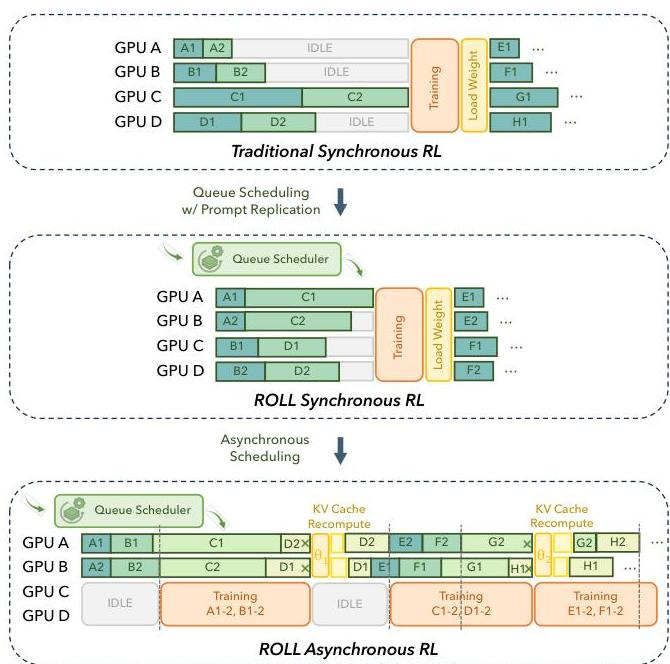
(a) Overview of ROLL-Sync and Async Framework.

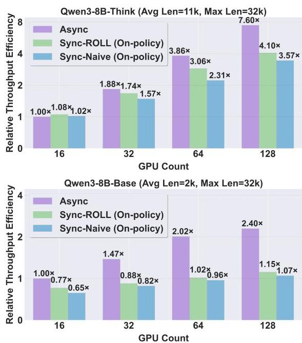
(b) Throughput Efficiency Scaling with GPUs.
Figure 1: (a) We illustrate vanilla synchronous training alongside several optimizations introduced by ROLL Flash: queue scheduling (Section 5.1.1), prompt replication (Section 5.1.2), and an asynchronous architecture (Section 4). (b) We present how the throughput of the training architectures illustrated in (a) scales with the number of GPUs on the Qwen3-8B-Base and Think models. In the top panel of Figure 1b, the asynchronous approach achieves higher efficiency and exhibits strong scalability with increasing GPU count, delivering  $2.12 \times$  throughput over synchronous structure on 128 GPUs. In the bottom of Figure 1b, all methods scale poorly at low average sequence lengths. Nevertheless, the asynchronous approach mitigates the impact of long-tail rollouts and is significantly more efficient than the synchronous approach ( $1.53 \times$  to  $2.24 \times$  faster). More detailed experiments and analyses can be found in Section 3.

---

1 Introduction

Reinforcement learning (RL) has emerged as a pivotal technique for endowing large language models (LLMs) with strong reasoning capabilities in mathematics *(max, 2025)*, code generation *(Open-R1, 2025)*, and tool use *(Pan et al., 2024; Feng et al., 2025)* during the post-training phase. The RL post-training workflow consists of two stages, rollout and training, which are repeated to iteratively optimize the LLM. In the rollout stage, an actor LLM generates a batch of responses and assigns a reward signal to each response until the rollout terminates. In agentic RL tasks, the actor also interacts with the environment to produce sequences of actions and feedback that synthesize responses. In the training stage, the actor updates the model weights based on the generated responses and corresponding rewards.

Many RL post-training systems *(Sheng et al., 2024; Mei et al., 2024; Hu et al., 2024; Wang et al., 2025b; Xiaomi et al., 2025)* aim to accelerate RL post-training and improve resource efficiency. Nevertheless, they often suffer from severe resource bubbles, particularly during the rollout stage, which accounts for over 70% of total training time *(He et al., 2025; Gao et al., 2025)*. Response lengths vary widely across prompts and exhibit a long-tail distribution. The longest responses can exceed the median length by more than 20$\times$ *(Gao et al., 2025)*. A common practice is to enforce synchronization barriers between response generation, environment interaction, and reward assessment. As a result, long-tail responses lead to substantial idle time on GPUs, causing pronounced resource waste.

Moreover, existing RL post-training systems exhibit poor resource scalability. During the rollout stage, LLM generation performs thousands of autoregressive decoding steps to produce each complete response. Decoding is predominantly memory-bandwidth bound, so scaling out to more GPUs does not increase decoding speed. Because this decoding cost is a major contributor to end-to-end training time, adding GPUs does not substantially reduce it. The RL post-training pipeline also imposes a synchronization barrier between the rollout and training stages, i.e., the training stage begins only after rollout completes. Although additional GPUs can shorten the training compute time, they only marginally mitigate long-tail rollout overhead. Consequently, the speedup achievable through resource scaling is limited, and overall resource scalability remains poor. A seminal work AReaL *(Fu et al., 2025)* presents a scalable RL post-training framework that relaxes the synchronization barrier between rollout and training. As a result, rollout proceeds continuously without blocking, and adding GPUs can scale parallelized LLM generation for more prompts. Many concurrent works *(Zhu et al., 2025; Han et al., 2025; Luo et al., 2025)* also enable asynchronous training to improve the training throughput. However, asynchronous training introduces off-policy drift that can degrade model accuracy, motivating dedicated off-policy algorithms *(Hilton et al., 2022; Munos et al., 2016; Espeholt et al., 2018; Chen et al., 2025; Roux et al., 2025)* to preserve accuracy. Thanks to combined system and algorithmic advances, asynchronous RL post-training can improve rollout throughput and resource scalability without sacrificing model performance.

In this report, we present ROLL Flash, which strengthens ROLL *(Wang et al., 2025b)* with asynchronous execution, thereby improving resource utilization and scalability for RL post-training. ROLL Flash satisfies two key design principles. First, fine-grained parallelism offers sample-level lifecycle control during the rollout stage, enabling overlap among LLM generation, environment interaction, and reward computation, thereby reducing idle time and improving GPU utilization. Leveraging this capability, we implement prompt replication and redundant environment rollouts, then provide a detailed empirical analysis validating their effectiveness. Second, rollout–train decoupling places the rollout and training stages on separate resources and executes them in parallel. Consequently, the rollout stage does not wait for training to complete, and training can optimize the LLM using responses generated under stale policy. This decoupling is a cornerstone of asynchronous training, enabling flexible control and enhancing resource scalability. To realize these principles, ROLL Flash introduces LLMProxy, EnvManager, SampleBuffer, and AsyncController. Together, these system components facilitate the implementation of the asynchronous training architecture and enable the fine-grained parallelism via queue scheduling, prompt replication, environment-level asynchronous rollout, and redundant environment rollout. To ensure training stability in asynchronous RL post-training, ROLL Flash introduces asynchronous ratio, which bounds the policy version gap between the current policy and the one that initiated a sample’s generation. This per-sample freshness constraint prevents stale rollouts from degrading training performance while enabling high resource utilization.

Theoretically, we prove that asynchronous training is inherently more efficient than synchronous training. Asynchronous training follows a producer–consumer model, where the rollout stage remains saturated with continuous response generation and does not stall for the training stage. This effectively mitigates resource waste caused by long-tail rollouts. Practically, the resource allocation of training and rollout is coarse-grained, motivating empirical investigation for asynchronous training.

Empirically, we analyze across four key dimensions: resource scalability, resource utilization, asynchronous ratio, and training stability. As shown in Figure 1, our method achieves substantial speedups over synchronous training under both Qwen3-Base and Think models *(Yang et al., 2025)*, with gains

---

growing consistently as GPU resources scale. Notably, ROLL Flash demonstrates strong advantages in both scalability and utilization—reaching up to  $2.24 \times$  higher throughput at hundreds of GPU scale. We further find that a small asynchronous ratio is often sufficient to realize near-maximal acceleration while preserving sample freshness. Moreover, the existing off-policy algorithms (Shao et al., 2024; Hilton et al., 2022; Munos et al., 2016; Chen et al., 2025; Roux et al., 2025) can effectively compensate for potential degradation from stale samples, matching the final performance of synchronous training. Finally, we extend our evaluation to agentic settings, where asynchronous rollout strategies yield  $2.72 \times$  speedup on ALFWorld and  $1.81 \times$  on SWE. Together, these comprehensive experiments validate the broad effectiveness and efficiency of our approach across diverse RL and agentic workloads.

Overall, the contributions of this paper can be summarized in the following three main aspects:

1. ROLL Flash Structure: A system design enabling fine-grained parallelism and rollout-train decoupling, which not only supports async training but also boosts async generation efficiency.
2. Async-Sync Analysis: Theoretical and empirical characterization of when asynchronous training excels, revealing ROLL-Async's strong resource scalability and high utilization.
3. RLVR &amp; Agentic Acceleration: In comprehensive experiments and ablation study, ROLL-Flash delivers substantial speedups, up to  $2.24 \times$  in RLVR tasks and  $2.72 \times$  in agentic tasks.

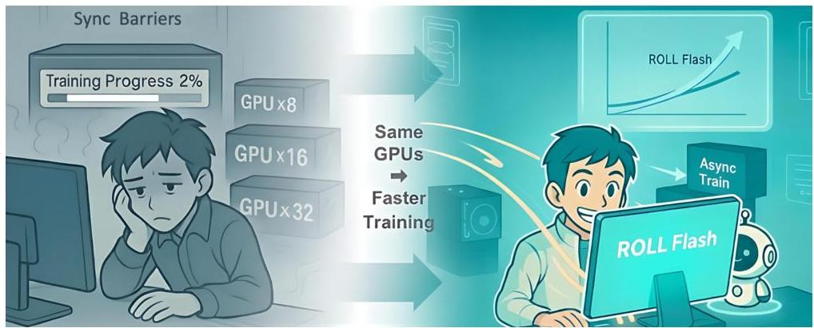
Figure 2: An illustration of Training Acceleration with ROLL Flash.

# 2 Background and Preliminaries

# 2.1 Synchronous RL Post-Training

The RL post-training comprises three stages: rollout, reward, and training. We use an agentic task to illustrate the workflow. During rollout, the agent LLM interacts with environments over multiple turns, producing tuples of states and actions that form a trajectory. Then, a reward worker assigns each trajectory a score. Last, the LLM updates its weights using these trajectories and rewards during training.

The synchronous training requires strict synchronization of the model weights in each training step, thus creating barriers between the rollout stage and the training stage, leading to substantial resource bubbles and underutilization. Many algorithms are employed to maximize the learning efficiency of RL post-training. Two representative examples are PPO and GRPO.

Proximal Policy Optimization (PPO). PPO (Schulman et al., 2017) is a widely used policy gradient algorithm based on the actor-critic framework. It enhances stability by optimizing a clipped surrogate objective, which restricts how much the updated policy  $\pi_{\theta}$  can deviate from the old policy  $\pi_{\theta_{\mathrm{old}}}$  at each update step. The objective is defined as:

$$
\begin{array}{l} \mathcal {J} _ {\mathrm {P P O}} (\theta) = \mathbb {E} _ {\left[ q \sim P (Q), o \sim \pi_ {\theta_ {\mathrm {o l d}}} (O | q) \right]} \\ \frac {1}{| o |} \sum_ {t = 1} ^ {| o |} \min  \left(\frac {\pi_ {\theta} \left(o _ {t} \mid q , o _ {&lt;   t}\right)}{\pi_ {\theta_ {\text {o l d}}} \left(o _ {t} \mid q , o _ {&lt;   t}\right)} A _ {t}, \operatorname {c l i p} \left(\frac {\pi_ {\theta} \left(o _ {t} \mid q , o _ {&lt;   t}\right)}{\pi_ {\theta_ {\text {o l d}}} \left(o _ {t} \mid q , o _ {&lt;   t}\right)}, 1 - \epsilon , 1 + \epsilon\right) A _ {t}\right), \tag {1} \\ \end{array}
$$

---

$\pi_{\theta}$ and $\pi_{\theta_{\text{old}}}$ represent the current and previous policies, respectively. Here $q$ denotes a sampled question, $o$ is the generated sequence, with $o_{t}$ representing the $t$-th token in $o$ and advantage $A_{t}$, typically computed via Generalized Advantage Estimation (GAE) *(Schulman et al., 2015)*; $\epsilon$ is the hyperparameter controlling the clipping range. The combination of min and clip ensures that, whether the advantage is positive or negative, the policy update remains controlled, thereby maximizing positive rewards while suppressing overadjustments that could lead to negative outcomes, ultimately maintaining the stability and effectiveness of the learning process.

#### Group Relative Policy Optimization (GRPO).

Despite PPO’s robustness across tasks, its reliance on a critic reveals limitations in language generation: advantage estimation becomes unstable under sparse rewards for long sequences, and unreliable value estimation may exacerbate policy convergence in suboptimal landscapes while incurring non-negligible extra computational overhead. To address this, Group Relative Policy Optimization (GRPO) *(Shao et al., 2024)* proposes a critic-free alternative that constructs advantage signals by sampling multiple responses per prompt and normalizing their rewards. Specifically, given a prompt $q$ and $G$ output sequences with rewards $\left\{r_{i}\right\}_{i=1}^{G}$, GRPO defines the normalized advantage for the $t$-th token of the $i$-th sequence as:

$\hat{A}_{i,t}=\frac{r_{i}-\text{mean}(\left\{r_{i}\right\}_{i=1}^{G})}{\text{std}(\left\{r_{i}\right\}_{i=1}^{G})}.$ (2)

GRPO standardizes rewards via group statistics (mean and std), enabling meaningful learning signals through relative ranking—even under sparse or similar rewards. Theoretically, it acts as reward shaping that emphasizes intra-group differences to preserve gradient discriminability *(Hu et al., 2020)*. GRPO adds KL divergence explicitly as a regularization term in the loss. The objective function is

\[ \mathcal{J}_{\text{GRPO}}(\theta)=\mathbb{E}_{q\sim P(Q),~{}\left\{o_{t}\right\}_{i=1}^{G}\sim\pi_{\theta_{\text{old}}}(O|q)}\\
\frac{1}{G}\sum_{i=1}^{G}\frac{1}{|o_{i}|}\sum_{i=1}^{|o_{i}|}\bigg{\{}\text{min}\left(r_{i,t}(\theta)\;\hat{A}_{i,t},\;\text{clip}\big{(}r_{i,t}(\theta),\;1-\epsilon,\;1+\epsilon\big{)}\;\hat{A}_{i,t}\right)-\beta D_{\text{KL}}[\pi_{\theta}\parallel\pi_{\text{ref}}]\bigg{\}}, \] (3)

where $r_{i,t}(\theta)=\frac{\pi_{\theta}(o_{i,t}|q,o_{i,<t})}{\pi_{\theta_{\text{old}}}(o_{i,t}|q,o_{i,<t})}$ and $\beta$ is the regularization weight, and $D_{\text{KL}}$ denotes the KL divergence between current policy and the reference policy.

### 2.2 Asynchronous LLM Post-Training

As observed in prior RL post-training systems *(Gao et al., 2025; He et al., 2025)*, the rollout stage typically accounts for over 70% of the total training time, and long-tail rollouts incur substantial resource idleness and underutilization. Moreover, scaling out GPUs does not mitigate these long-tail rollouts and yields only marginal computational gains. The asynchronous training emerges as a promising technique to alleviate this issue and improve the resource utilization and scalability *(Mnih et al., 2016; Wu et al., 2025; Fu et al., 2025)*. Asynchronous training decouples the rollout and training stages and runs them in parallel on separate resources, eliminating the strict synchronization barrier. In other words, the training stage can consume responses generated using stale model weights from the rollout stage, while the rollout stage concurrently produces new responses without waiting for model updates.

While asynchronous training can improve computational efficiency, it introduces policy staleness that can degrade model accuracy *(Fu et al., 2025)*, underscoring the need for dedicated off-policy algorithmic support. Specifically, responses are sampled from the old distribution $\pi_{\text{old}}$, which typically differs from the current policy $\pi_{\theta}$. When we apply synchronous training algorithms (e.g., PPO) in this asynchronous setting, the divergence between the old and current policies can induce policy collapse *(Chen et al., 2023)* and bias the gradients, leading to training instability and severe performance degradation. To restore accuracy, we adopt off-policy training algorithms to stabilize the training dynamics. The mainstream off-policy RL post-training algorithms typically fall into two categories: (1) Gradient truncation, which truncates gradients for tokens whose importance-sampling (IS) ratios lie outside a trust region; e.g., Decoupled PPO *(Hilton et al., 2022)*. (2) Importance-sampling optimization, which retains gradients for all samples but clips the importance sampling weights to stabilize training; e.g., Truncated IS *(Munos et al., 2016; Espeholt et al., 2018)*, CISPO *(Chen et al., 2025)* and TOPR *(Roux et al., 2025)*.

Notation. In the following formulations, $R(\tau)$ denotes the learning signal associated with trajectory $\tau$, which can also be advantage estimate $A(\tau)$ in practice. We use $\textbf{sg}(\cdot)$ to denote the stop-gradient operator (gradients are not backpropagated through this term) and $\textbf{1}_{\{\cdot\}}$ for the indicator function. The shorthand $(x)_{b}^{a}$ denotes $\text{clip}(x,b,a)$, i.e., $x$ is constrained to lie between a lower bound $b$ and an upper bound $a$.

###

---

Loss Objective for Off-policy Algorithms

PPO (Standard) : $\mathcal{J}^{\text{PPO}}(\pi_{\theta})=\mathbb{E}_{\tau\sim\pi_{\text{old}}}\left[\min\left(R(\tau)\frac{\pi_{\theta}(\tau)}{\pi_{\text{old}}(\tau)},R(\tau)\left(\frac{\pi_{\theta}(\tau)}{\pi_{\text{old}}(\tau)}\right)_{1-\epsilon}^{1+\epsilon}\right)\right]$

Decoupled PPO : $\mathcal{J}^{\text{DPPO}}(\pi_{\theta})=\mathbb{E}_{\tau\sim\pi_{\text{old}}}\left[\min\left(R(\tau)\frac{\pi_{\theta}(\tau)}{\pi_{\text{old}}(\tau)},R(\tau)\frac{\pi_{\text{prox}}(\tau)}{\pi_{\text{old}}(\tau)}\left(\frac{\pi_{\theta}(\tau)}{\pi_{\text{prox}}(\tau)}\right)_{1-\epsilon}^{1+\epsilon}\right)\right]$

Truncated IS : $\mathcal{J}^{\text{TIS}}(\pi_{\theta})=\mathbb{E}_{\tau\sim\pi_{\text{old}}}\left[\mathbf{sg}\left(\frac{\pi_{\theta}(\tau)}{\pi_{\text{old}}(\tau)}\right)_{0}^{\epsilon}R(\tau)\log\pi_{\theta}(\tau)\right]$

CISPO : $\mathcal{J}^{\text{CISPO}}(\pi_{\theta})=\mathbb{E}_{\tau\sim\pi_{\text{old}}}\left[\mathbf{sg}\left(\frac{\pi_{\theta}(\tau)}{\pi_{\text{old}}(\tau)}\right)_{1-\epsilon_{\text{low}}^{\text{IS}}}^{1+\epsilon_{\text{high}}^{\text{IS}}}R(\tau)\log\pi_{\theta}(\tau)\right]$

TOPR : $\mathcal{J}^{\text{TOPR}}(\pi_{\theta})=\mathbb{E}_{\tau\sim\pi_{\text{old}}}\left[\left(\mathbf{1}_{\{\tau\in T^{+}\}}+\mathbf{1}_{\{\tau\in T^{-}\}}\mathbf{sg}\left(\frac{\pi_{\theta}(\tau)}{\pi_{\text{old}}(\tau)}\right)_{0}^{\epsilon}\right)R(\tau)\log\pi_{\theta}(\tau)\right]$

Decoupled PPO introduces a proximal policy $\pi_{\text{prox}}$ to better regulate policy updates. TIS and TOPR both employ a truncation threshold $c$ to cap the importance sampling ratio from above, mitigating variance and instability. In contrast, PPO and CISPO constrain the ratio within a symmetric or asymmetric interval around 1, controlled by $\epsilon_{\text{low}}^{\text{IS}}$ and $\epsilon_{\text{high}}^{\text{IS}}$. Notably, TOPR partitions trajectories into two sets: $T^{+}$ (high-return/correct) and $T^{-}$ (low-return/incorrect), applying truncation only to $T^{-}$ to preserve learning signals from good trajectories while suppressing noise from poor ones. ROLL Flash has integrated the above off-policy algorithms to facilitate performance of asynchronous training.

## 3 Performance-Preserving Asynchronous Acceleration

### 3.1 Theoretical Analysis

In the ROLL Flash architecture, we adopt two designs: (1) Queue Scheduling with Prompt Replication (Section 5.1), where responses are scheduled individually and immediately on any idle worker; (2) in Async, the same total number of GPUs is partitioned between training and inference. The *asynchrony ratio* $\alpha$ (Section 4.3) denotes how many model updates the rollout policy is allowed to lag behind the current training model, and it directly determines the size of the generation data pool.

###### Proposition 1: Generation Time Bound

Let there be $K$ workers executing in a Queue Scheduling manner (a new task is assigned immediately once a worker finishes). Suppose $Q$ samples need to be generated, where the generation time of each sample lies in $[0,L_{\text{gen}}]$ with mean $\mu_{\text{gen}}$. Then the total completion time satisfies:

$T_{\text{completion}}\leq\frac{Q}{K}\mu_{\text{gen}}+L_{\text{gen}}.$ (4)

Consequently, the average completion time per sample is bounded by:

$\frac{T_{\text{completion}}}{Q}\leq\frac{\mu_{\text{gen}}}{K}+\frac{L_{\text{gen}}}{Q}.$ (5)

- In the Sync setting ($Q=N$), the average per-sample completion time satisfies:

$\overline{T}_{\text{sync}}\leq\frac{\mu_{\text{gen}}}{K}+\frac{L_{\text{gen}}}{N}.$ (6)
- In the Async setting ($Q=(\alpha+1)N$, with $\alpha$ denoting the *asynchrony ratio* (details in §4.3)):

$\overline{T}_{\text{async}}\leq\frac{\mu_{\text{gen}}}{K}+\frac{L_{\text{gen}}}{(\alpha+1)N}.$ (7)

As $\alpha\to\infty$, the per-sample completion time converges to $\mu_{\text{gen}}/K$. When $K=N$, the maximum theoretical speedup achievable by Async over Sync setting is at most $(L_{\text{gen}}+\mu_{\text{gen}})/\mu_{\text{gen}}$.

---

Proposition 2: End-to-End Efficiency with Resource Partitioning

Consider a system with $K$ workers. The resource allocation strategy are as follows:

- Sync: All $K$ workers generate $N$ samples and train sequentially afterward.
- Async: Workers are partitioned into two disjoint pools controlled by a parameter $\beta\in(0,1)$:

- $(1-\beta)K$ workers are allocated to continuous sample generation,
- $\beta K$ workers are used for parallel training.

Let $\mu_{\text{gen}}$ denote the average sample generation time (maximum $L_{\text{gen}}$), $\mu_{\text{train}}$ denote the average training time per sample. Define $E$ as the number of each generated sample reused during training.

1. The end-to-end completion time for Sync (sequential pipeline) is:

$T_{\text{sync}}\leq\frac{N}{K}\mu_{\text{gen}}+L_{\text{gen}}+E\frac{N}{K}\mu_{\text{train}}=\frac{N}{K}(\mu_{\text{gen}}+E\mu_{\text{train}})+L_{\text{gen}}.$ (8)
2. The end-to-end completion time for Async (parallel, resource-isolated pipeline) is:

$T_{\text{async}}\leq\max\left(\frac{N}{(1-\beta)K}\mu_{\text{gen}}+\frac{L_{\text{gen}}}{(\alpha+1)(1-\beta)},\ \frac{EN}{\beta K}\mu_{\text{train}}\right).$ (9)

The optimal worker allocation ratio $\beta^{*}$ that minimizes the upper bound on $T_{\text{async}}$ is

$\beta^{*}=\frac{EN\mu_{\text{train}}}{N\mu_{\text{gen}}+\frac{KL_{\text{gen}}}{\alpha+1}+EN\mu_{\text{train}}}.$ (10)

At this optimal $\beta^{*}$, the two components are balanced, and the resulting upper bound becomes:

$T_{\text{async}}\leq\frac{N}{K}(\mu_{\text{gen}}+E\mu_{\text{train}})+\frac{L_{\text{gen}}}{\alpha+1}.$ (11)

The Async setting yields a tighter theoretical bound and strictly improves upon it when $\alpha>0$. As $\alpha\to\infty$, the maximum theoretical speedup of Async over Sync converges to $1+\frac{KL_{\text{gen}}}{N(\mu_{\text{gen}}+E\mu_{\text{train}})}$.

### 3.2 Experimental Validation

We further provide a detailed empirical analysis of asynchronous training, revealing four key takeaways: resource scalability, resource utilization, asynchronous ratio, and training stability.

Experimental Setup. Unless otherwise specified, all experiments in this section are conducted using the Qwen3-8B-Base or Think models *(Yang et al., 2025)*, with a sequence length of 32k, 256 rollouts, and a group size of 32 prompts per minibatch on the DAPO-Math-18K *(Yu et al., 2025)* dataset (other details in Appendix A). In the following experiments, we conduct a detailed ablation study by varying several key parameters, including: (1) the choice of base model—either Qwen3-8B-Base (average length 2k) or Qwen3-8B-Think (average length 11k); (2) the number of GPUs, ranging from 16 to 128; (3) the rollout batch size, varied from 32 to 512; and (4) different GPU allocation ratios between training and inference.

In Figure 1(b), the evaluated paradigms include: (1) Async: ROLL’s asynchronous architecture with an Async Ratio of 2; (2) Sync-ROLL (On-policy): A synchronous architecture enhanced with ROLL-specific optimizations, including Queue Scheduling and Prompt Replication; (3) Sync-Naive (On-policy): A standard synchronous reinforcement learning setup. The default training-to-inference GPU ratio is 1:1.

Takeaway 1: Async Architecture Achieves Superior Throughput Scalability.

Increasing GPU resources causes Sync to suffer more from the impact of long-tail samples, whereas Async exhibits better scaling behavior and achieves higher resource utilization.

Figure 1(b) illustrates the throughput efficiency of different training paradigms as the number of GPUs scales. Under the Qwen3-8B-Think model, the asynchronous (Async) approach achieves near-linear throughput scaling with GPU resources—reaching an impressive $7.6\times$ speedup with $8\times$ GPUs, which is $2.13\times$ higher than that of the traditional synchronous (Sync-Naive) baseline. Under the Qwen3-8B-Base model where the average generation length is significantly shorter, the system is no longer compute-bound. Consequently, resource utilization drops substantially across all architectures. While throughput

---

under synchronous methods (Sync-Naive and Sync-ROLL) plateaus, the Async architecture continues to scale effectively, achieving  $2.24 \times$  higher throughput than Sync-Naive at 128 GPUs.

This behavior arises because increasing the number of GPUs reduces the per-GPU workload (i.e., rollouts per device), thereby amplifying the impact of long-tail effects. This issue is further exacerbated in the Base setting, where response lengths exhibit high variance. Traditional synchronous training suffers severe efficiency degradation under such conditions, while our Sync-ROLL variant partially alleviates the problem through ROLL-specific optimizations (e.g., queue scheduling and prompt replication).

In contrast, the Async architecture fundamentally eliminates the straggler bottleneck by decoupling generation and training. These results lead to a clear conclusion: in resource-rich regimes or scenarios with pronounced long-tail generation latency, the asynchronous architecture enables significantly more efficient resource utilization and should be the preferred choice.

# Takeaway 2: Async Accelerates Training in Almost All Cases.

Async effectively mitigates training stalls caused by long-tail generation latencies, delivering substantial speedups when the allocation of training and inference resources is well balanced.

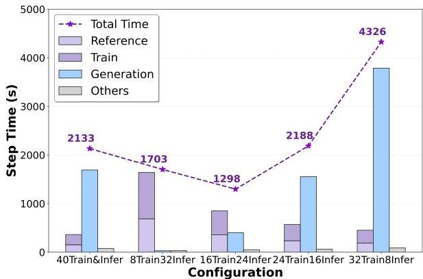
(a) Time across Training-Inference Resource Allocation.

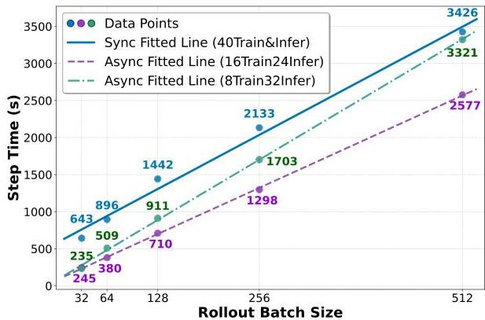
(b) Async &amp; Sync Scaling of Step Time vs. Rollout Size.
Figure 3: Efficiency Comparison using Async and Sync under different rollout batch size and training-inference resource ratios. (a) Given a fixed GPU resource budget, optimal efficiency can be achieved by tuning the allocation ratio between training and inference. (b) shows the efficiency scaling curves of Async and the ROLL-Sync. Async exhibits a clear advantage in almost all cases.

The core acceleration benefit of Async stems from eliminating resource waste and idle waiting caused by long-tail generation latencies. In an idealized scenario, the consumption rate (training) should roughly match the production rate (generation), with the Async Ratio serving to absorb tail latency and prevent training stalls. A critical design decision, therefore, is to optimally allocate resources between training and inference to maximize overall efficiency.

Figure 3a illustrates efficiency gains under varying Train-Inference resource allocations. A well-tuned Async configuration (16 GPUs for training and 24 GPUs for inference) achieves nearly  $2 \times$  speedup over baseline $^{1}$ . In contrast, ROLL-Sync spends substantial time waiting for sample generation. Under the 32Infer setting, although training never needs to wait for data generation, computational resources are excessively underutilized during generation. In contrast, the 24Infer configuration achieves the best overall performance. Interestingly, a modest amount of waiting for freshly generated samples not only avoids waste but also helps stabilize training by enabling the use of more up-to-date data.

Figure 3b shows the per-step training time of Sync and Async as a function of rollout batch size. For a fixed number of samples, training time scales approximately linearly with sample count, with fixed constant overheads such as model loading and offloading. As predicted by Equation 5, generation time is governed by the interplay between average and tail-case latencies, and the observed step times indeed exhibit near-linear scaling. The slope of each curve reflects the marginal cost of processing additional samples. The rollout sizes in Figure 3b already correspond to realistic on-policy or off-policy training regimes. As further confirmed by Figure 1, Async scales more favorably than Sync with increasing GPU count. Therefore, Async can accelerate training in nearly all practical scenarios.

---

# Takeaway 3: Async Ratio Can Be Small Enough.

In typical configurations, setting the Asynchronous Ratio to 2 achieves the highest throughput, effectively balancing learning efficiency and the degree of off-policy learning.

In Async architecture, the Async Ratio is a critical hyperparameter. If set too low, sample generation may lag behind training, causing long-tail samples as a bottleneck that limits overall throughput. Conversely, if set too high, training samples become excessively stale, degrading both training stability and effectiveness due to outdated policy sampling.

We aim to identify the optimal Async Ratio that maximizes throughput. To this end, we evaluate under a standard configuration:

Table 1: Async Ratio Required in various Configuration.

<table><tr><td>Model Size</td><td>0.6B</td><td>1.7B</td><td>4B</td><td>8B</td></tr><tr><td>Async Ratio</td><td>2</td><td>2</td><td>2</td><td>2</td></tr><tr><td>Length</td><td>4K</td><td>8K</td><td>16K</td><td>32K</td></tr><tr><td>Async Ratio</td><td>1</td><td>1</td><td>1</td><td>2</td></tr><tr><td>Rollout Size</td><td>32</td><td>64</td><td>128</td><td>256</td></tr><tr><td>Async Ratio</td><td>4</td><td>2</td><td>2</td><td>2</td></tr></table>

Qwen3-8B-Think, sequence length of 32K, and rollout batch size of 256. The optimal Async Ratio depends on generation throughput. In a 32Train8Infer setup, an Async Ratio of 1 yields a  $25\%$  throughput improvement over the fully synchronous baseline—the highest achievable in this setting. In contrast, under a 24Train16Infer configuration, an Async Ratio of 1 provides a  $28\%$  speedup, while a ratio of 2 unlocks the full benefit, delivering a  $64\%$  throughput gain. Further increasing the Async Ratio beyond this point yields no additional improvement, as it no longer alleviates the long-tail bottleneck.

Building on the highest-throughput configuration (24Train16Infer) in Figure 3, we conduct ablation studies to analyze how individual components influence the optimal Async Ratio. As summarized in Table 1, the optimal Async Ratio is largely insensitive to model size, increases monotonically with sequence length, and decreases monotonically with rollout batch size. Surprisingly, a value as low as 2 suffices for most practical scenarios. Interestingly, we can achieve substantial speedups from the Async framework without incurring significant off-policy penalties.

# Takeaway 4: Async Training Can Be Stable and Nearly Performance-Lossless.

Under Async Ratio 2 and 8 settings, various off-policy methods, as well as widely used GRPO algorithm, can consistently deliver performance gains on par with synchronous training.

While a small Async Ratio suffices under balanced workloads (Takeaway 3), a critical question remains: does increasing the Async Ratio hurt stability or final performance? We investigate this on Qwen3-8B-Base using standard GRPO-style training with small rollout batch size 32, evaluating popular off-policy algorithms under varying Async Ratios in a controlled setting.

As shown in Figure 4, all methods achieve comparable Pass@1 accuracy across benchmarks and differences are minimal. Async variants slightly outperform the Sync baseline on Math500 and OlympiadBench, while lagging marginally on Minerva Math. Notably, vanilla GRPO alone yields strong performance. Simply clipping tokens outside the target response region after importance sampling already provides a robust baseline. We also introduce Weighted TOPR, which improves stability by flexibly balancing positive and negative samples, thereby enhancing stability across diverse training scenarios.

In summary, Async training reliably achieves competitive performance without relying on algorithm-specific tricks or heavy engineering, demonstrating high throughput and training fidelity can coexist.

# 4 Framework Design

# 4.1 Design Principles

To fully harness the benefits of asynchronous training and provide users with a flexible programming model for asynchrony, we introduce ROLL Flash, underpinned by two design principles: rollout-train decoupling and fine-grained parallelism.

Rollout-Train Decoupling. Enabling asynchronous training requires managing staleness to prevent significant accuracy loss and allocating resources between rollout and training to maximize efficiency. To provide flexible control, we adopt a rollout-training decoupling architecture: execution workers for the two stages are placed on user-specified resources and run as a pipeline. At its core, users can configure the rollout model-update policy, transitioning from blocking, synchronous updates to non-blocking,

---

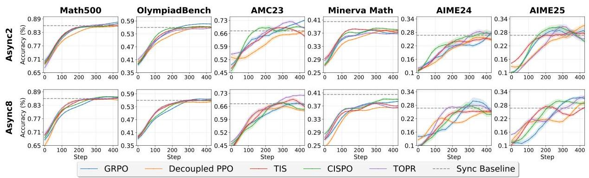
Figure 4: Off-Policy Algorithm Performance Comparison under Async Ratio 2 and 8. To ensure clarity and intuitiveness in the qualitative analysis, all curves are consistently smoothed using identical parameters. Specifically, the mean values are computed using an 11-step moving window. The shaded regions around the curves represent the range mean± (stdmultiplier × standard deviation), providing a visual representation of the oscillation amplitude. The Sync baseline uses the performance at 400 steps.

asynchronous updates. Once updates become non-blocking, the rollout and training stages proceed in parallel, maximizing resource utilization and end-to-end throughput. Users can also adjust the frequency of asynchrony (e.g., asynchrony ratio) to mitigate accuracy loss.

Fine-grained Parallelism. We enable a fine-grained parallelism to execute LLM generation, environment interaction, and reward computation within the rollout stage. Instead of proceeding these phases in a full batch, fine-grained parallelism operates at the sample level. This allows users to control the lifecycle of each sample, determining when and where to execute each phase for a given sample. This enables a rollout pipeline where LLM generation for one sample overlaps with environment interaction for another and reward computation for a third. In addition, fine-grained parallelism distributes LLM generation workload evenly across GPUs via prompt replication, preventing long-tail rollouts from concentrating on a few devices and amplifying their adverse effects.

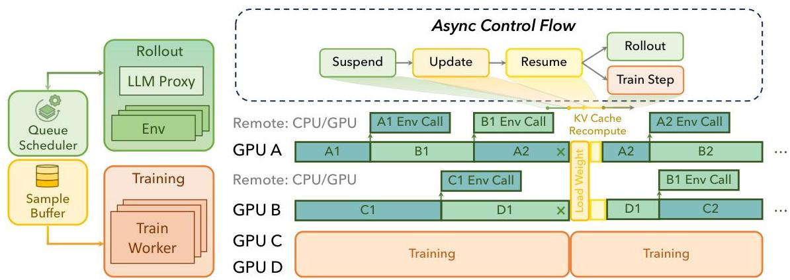
Figure 5: Asynchronous Execution Workflow of ROLL Flash for RLVR and Agentic Post-Training. It consists of LLMProxy, EnvManagers, SampleBuffer, and AsyncController, which together orchestrate an asynchronous training workflow with fine-grained parallelism.

# 4.2 Asynchronous Execution Workflow

Figure 5 illustrates the asynchronous execution workflow of ROLL Flash for RLVR and agentic posttraining. The asynchronous workflow centers on the rollout stage. Within the stage, the fine-grained parallelism maximizes the overlap between LLM generation, environment, and reward. Across stages, the rollout-train decoupling architecture parallelizes the execution of rollout and training. For clarity, we describe the system using the agentic RL training workflow.

LLMProxy. To orchestrate LLM inference, ROLL Flash introduces the LLMProxy, which acts as an orchestrator for a fleet of internal backend workers and is shared by multiple EnvManagers. Each worker centers around a command-driven event loop that manages an inference engine (e.g., vLLM). The loop is designed to maximize GPU utilization and enable full asynchrony. It operates continuously and

---

non-blockingly, with three core services: (1) Step-wise Inference: at each iteration, it advances the engine by executing a single decoding or prefill step over a batch of requests, saturating GPU resources. (2) Post-Processing: whenever the engine completes a request, it immediately triggers a registered callback that post-processes the output and returns the result to the originating client (e.g., EnvManager). (3) Process Commands: The loop continuously proceeds commands dispatched from the proxy, ADD to enqueue new requests and ABORT to interrupt running requests and reclaim them into the SampleBuffer for subsequent recomputation and generation.

EnvManager. It is the basic execution worker, enabling fine-grained parallel rollouts. Each EnvManager starts a loop by resetting its environment via reset, then enters an independent event loop that mediates between its BaseEnv and the shared LLMProxy. In this loop, the EnvManager receives the response as an action from the LLMProxy, applies it to BaseEnv via step, processes the resulting observation, and repeats until a termination condition is met.

With this fine-grained rollout, ROLL Flash overlaps LLM decoding with the execution of thousands of environments. Upon trajectory completion, the EnvManager immediately triggers reward computation, which proceeds in parallel with ongoing rollouts. By decoupling sample-level and environment-level execution, the design enables sample-level execution across components, achieving a high degree of parallelism and maximizing throughput.

AsyncController. ROLL Flash runs an asynchronous training pipeline via a AsyncController and a shared SampleBuffer. A pool of EnvManager processes act as independent producers: they generate trajectories and enqueue them into SampleBuffer. At each training step, the AsyncController performs weight synchronization between the rollout and training stage in three phases: it issues suspend to pause trajectory collection, executes model_update by fetching and broadcasting the latest weights to all LLM serving workers, and then sends resume so the EnvManagers continue collecting trajectories with the updated model. In practice, the overhead of model update is a small fraction of total training time and does not impede rollout progress.

During each training iteration, the AsyncController issues a blocking get_batch to SampleBuffer to obtain a minibatch of trajectories, then executes train_step on the retrieved data. In the asynchronous mode, the training stage overlaps with the rollout stage, and the EnvManagers together with the LLM serving workers continue collecting the next batch in parallel. ROLL Flash can also be easily switched to synchronous mode: invoking suspend immediately after get_batch pauses trajectory collection, ensuring that all subsequent trajectories are generated using the most up-to-date model weights. Through this asynchronous design, users need not implement complex concurrency control or bespoke communication schemes. Optional barriers can be placed in LLMProxy, EnvManager, and AsyncController to support diverse training regimes (e.g., asynchronous training, batch rollout). In the absence of such barriers, the pipeline remains fully asynchronous, allowing the training process to continuously saturate available resources. Based on these components, we can configure an asynchronous ratio to control the degree of asynchrony, thereby achieving a trade-off between performance and training efficiency.

### 4.3 Asynchronous Ratio

In Figure 1(a) and Figure 5, we present our rollout–train decoupling architecture. In the SampleBuffer, response generation may be interrupted and resumed under newer policy LLMs. Consequently, response samples are generated from multiple policy LLM versions. Samples produced by stale policies can introduce high variance, undermining training stability. AReaL *(Fu et al., 2025)* mitigates this by controlling the average sample freshness within a batch. In contrast, ROLL Flash introduces asynchronous ratio $\alpha$ to regulate per-sample freshness. Specifically, asynchronous ratio $\alpha$ is defined on per sample as the maximum allowable gap in policy version numbers between the current policy and the policy version that initiated generation of that sample. If the policy network has advanced to version $n$, then any sample in SampleBuffer must have been initiated by a policy version no older than $(n-\alpha)$. Consequently, the SampleBuffer is upper-bounded by $(1+\alpha)\times$ batchsize samples and no sample is wasted, since we never generate samples that violate the freshness constraint. $\alpha$ is be a non-negative integer or real number.

## 5 Detailed Design in RLVR and Agentic Pipeline

### 5.1 RLVR Pipeline

#### 5.1.1 Queue Scheduling

In conventional RL post-training pipelines, rollouts are strictly synchronous and batched: a set of prompts is processed as one batch, and the LLM must complete generation for all prompts before any reward

---

computation or filtering begins. This creates a straggler bottleneck because the longest sequence gates the batch, causing significant GPU underutilization, high rollout latency, and substantial overhead.

ROLL Flash focuses on fine-grained parallelism and employs Queue Scheduling to address these limitations. Each prompt is treated as an independent rollout task and enqueued for dynamic scheduling. Once a response is generated, it is immediately dispatched to a reward worker for evaluation, without waiting for the remainder of the batch. Reward computation overlaps with ongoing generation, which removes pipeline bubbles and reduces GPU idle time. This design delivers two key benefits: (1) it dramatically improves GPU utilization by keeping compute resources continuously engaged across responses with various lengths; (2) in dynamic filtering scenarios with redundant prompts, it accelerates the collection of high-quality samples, thereby increasing overall training throughput. Figure 6 clearly illustrates the advantages conferred by queue scheduling rollout.

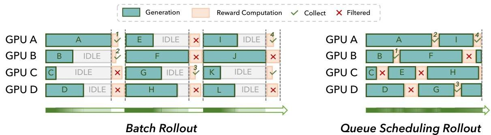
Figure 6: Comparison of Batch Rollout and Queue Scheduling Rollout. Batch Rollout introduces substantial GPU idle time and leads to wasted generations when filtering is applied. In contrast, Queue Scheduling mitigates these issues by maintaining high GPU utilization throughout, computing rewards promptly, and terminating generation as soon as the desired number of qualifying samples is obtained.

Experimental Evaluation. We empirically evaluate the effectiveness of queue scheduling under dynamic filtering. In the synchronous baseline, reward computation is deferred until the entire batch completes generation. In our setup, we generate  $k = 8$  responses per prompt, allow up to 16 additional concurrent prompts, and filter out samples with zero intra-group variance. We compare queue scheduling, with and without redundant generation, against the baseline across varying batch sizes. As shown in Figure 7, queue scheduling reduces average per-step generation time. For example, with 16 redundant prompts and an  $8 \times 8$  configuration (8 prompts, each with 8 responses), the average per-step generation time drops from 125 seconds to 37 seconds ( $3.4 \times$  speedup). Similar gains are observed for larger batch sizes, and the benefit grows with higher redundancy and stronger filtering. These results confirm that queue scheduling effectively improves rollout pipeline efficiency, especially in dynamic filtering scenarios.

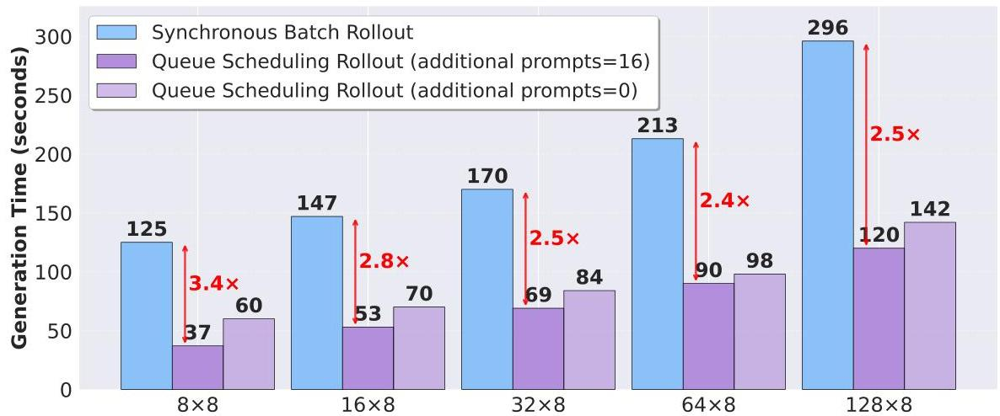
Figure 7: Efficiency comparison of generation time across different batch size  $\times 8$  configurations. The blue bars represent conventional Synchronous Batch Rollout, while the purple bars show Queue Scheduling Rollout with maxadditional_running_prompts set as 16 and 0, respectively. Red double-headed arrows indicate speedup ratios using Queue Scheduling Rollout (additional prompts= 16).

---

# 5.1.2 Prompt Replication

ROLL Flash implements prompt replication to further improve rollout efficiency. This mechanism alleviates the synchronization bottlenecks inherent in multi-candidate decoding. Prior work (Sheng et al., 2024) typically sets num_return_sequences  $&gt;1$  to generate multiple responses for a single prompt during rollout (Shao et al., 2024), which forces a single worker to synchronously decode all  $n$  responses. ROLL Flash instead expands each prompt into  $n$  independent rollout tasks, each producing a single response, via the flag is_num_return_sequences Expand. This decoupling allows candidates from the same prompt to run on separate GPUs and be scheduled independently, reducing pipeline bubbles caused by heterogeneous response lengths. As illustrated in Figure 1a, replicating prompt C and scheduling its candidate responses (C1 and C2) on different GPUs effectively reduces these bubbles.

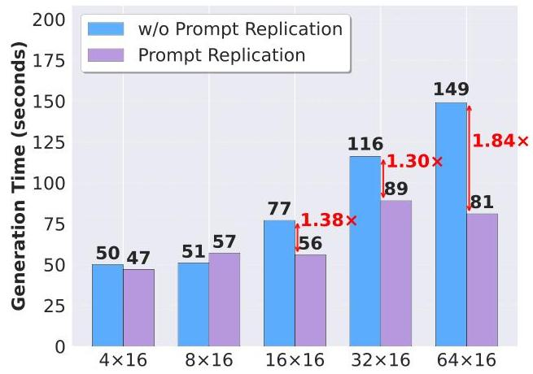
Figure 8: Efficiency of using prompt replication across different rollout configurations. Left: Varying batch size with num_return_sequences=16. Right: Varying num_return_sequences with batch size=16. In both cases, prompt replication substantially reduces generation time by alleviating straggler effects, achieving up to  $1.84 \times$  speedup under large-batch or large-response per prompt configurations.

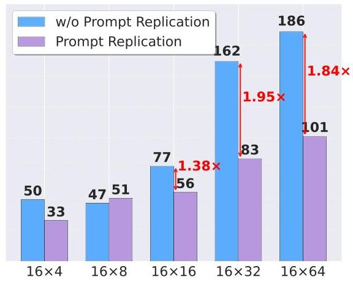

Experimental Evaluation. We quantify the impact of prompt replication under varying batch_size and num_return_sequences configurations. Firstly, we fix num_return_sequences as 16 and scale batch_size from 4 to 64. As shown in Figure 8, prompt replication yields limited gains at small batch sizes but delivers substantial improvements beyond moderate scales by mitigating long-tail stragglers and reducing mean step time. For instance, at  $32 \times 16$ , latency drops from 116 seconds to 89 seconds ( $1.30 \times$  speedup); at  $64 \times 16$ , latency reduces from 149 seconds to 81 seconds ( $1.84 \times$  speedup). Secondly, we fix batch_size as 16 and increase num_return_sequences from 4 to 64. Prompt replication consistently enhances efficiency as the number of candidates grows. At  $16 \times 32$ , step time decreases from 162 s to 83 s ( $1.95 \times$  speedup), and at  $16 \times 64$ , it still achieves a  $1.84 \times$  speedup. Overall, these results confirm that prompt replication enables fine-grained intra-rollout parallelism, effectively delivering significant efficiency gains.

# 5.2 Agentic Pipeline

In agentic pipelines, a single trajectory involves multiple rounds of interaction with complex external environments, such as SWE (Jimenez et al., 2023), ALFWorld (Shridhar et al., 2020), and ShopSimulator (Wang et al., 2025a), where execution latency varies widely and failures are common. Although most rollouts complete within seconds, some extend to minutes due to environment initialization and network latency. This pronounced long-tail latency significantly degrades the training efficiency and motivates two key designs: environment-level asynchronous rollout and redundant environment rollout.

# 5.2.1 Environment-Level Asynchronous Rollout

To reduce GPU idleness during environment interactions, we devise an environment-level asynchronous rollout. We decompose each trajectory into a sequence of fine-grained, environment-level interaction units. Once a trajectory begins interacting with an environment to receive feedback, the pending trajectories in the SampleBuffer are immediately dispatched to available LLM serving workers for continued response (i.e., action) generation.

---

Experimental Evaluation. We first conduct controlled simulations in which environment latencies are sampled from Gaussian distributions with mean  $(\mu)$  and standard deviation  $(\sigma)$ . As shown in Figure 9, a clear trend emerges: larger variance yields greater speedup. When latencies are nearly uniform, e.g., (10, 1), the benefit is modest, limited to  $1.16 \times$  at batch size 512. As variance increases, the gains become substantial. With (10, 10), the average step time drops from 892 seconds to 362 seconds at batch size 512, a  $2.46 \times$  improvement. Similar results hold for (10, 7), where the speedup reaches  $2.12 \times$ , and for (50, 5), where it is  $1.20 \times$ . These results show that asynchronous scheduling shortens overall step time and sustains high throughput, with benefits that grow as environment latency variance increases.

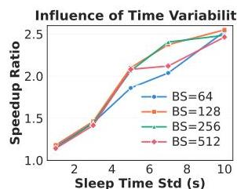
Figure 9: Simulation results of environment-level asynchronous rollout under varying environment latency distributions. Left: Speedup increases with higher standard deviation of environment latency at fixed mean  $(\mu = 10s)$ . Right: Speedup decreases as the mean step time grows while keeping std fixed  $(\sigma = 5s)$ , since the impact of stragglers diminishes.

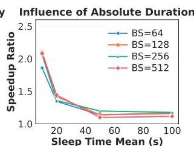

We further validate this mechanism in real environments. As shown in Figure 11, even in Sync training, environment-level asynchronous rollout can reduce the end-to-end training time from  $10.22\mathrm{h}$  to  $8.32\mathrm{h}$  on SWE  $(1.23\times)$  and from  $13.37\mathrm{h}$  to  $8.44\mathrm{h}$  on ALFWorld  $(1.58\times)$ . These results confirm that environment-level asynchronous rollout is consistently effective beyond simulation and brings satisfactory gains in practice. Detailed experimental configurations are provided in Appendix A.

# 5.2.2 Redundant Environment Rollout

We introduce redundant environment rollout to mitigate the negative impact of environment instability on agentic RL training efficiency. This mechanism offers two tunable controls: (1) increasing num_env_groups to spawn more concurrent environment groups, and (2) increasing group_size to generate more candidate trajectories per group. Since ROLL Flash terminates rollout once a predefined number of trajectories has been collected, increasing num_env_groups and group_size helps prevent fail-slow and fail-stop environments from becoming system bottlenecks. Empirically, we observe that increasing num_env_groups can deliver stronger resilience to fail-slow and fail-stop behavior than increasing group_size.

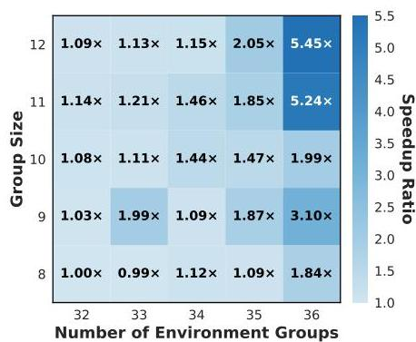
Figure 10: Heatmap of speedup across group size and env group count.

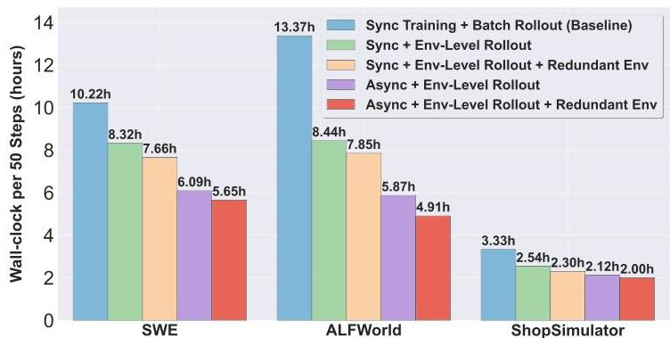
Figure 11: Real-environment evaluation of environment-level asynchronous and redundant environment rollout.

Experimental Evaluation. We simulate different configurations by fixing the total rollout batch size at 256 and varying num_env_groups and group_size where environment latency is modeled by Gaussian distributions with varying mean  $\mu = 10$  and standard deviation  $\sigma = 5$ . The results in Figure 10 show that increasing the number of groups is consistently more effective than enlarging group size. For instance, scaling from  $32 \times 8$  (baseline) to  $36 \times 12$  reduces step time from 243 seconds to 45 seconds, a  $5.45 \times$  speedup. Similar improvements are observed for  $36 \times 11$  ( $5.24 \times$ ) and  $36 \times 9$  ( $3.10 \times$ ). The heatmap visualization highlights that higher group counts lead to more stable step times and better robustness against latency variance.

We also validate this design in real environments. As shown in Figure 11, redundant environment rollout yields additional gains on top of both synchronous and asynchronous rollouts. On SWE, the training time reduces from 8.32h to 7.66h under synchronous rollout  $(-7.9\%)$ , and from 6.09h to 5.65h under asynchronous rollouts  $(-7.2\%)$ . On ALFWorld, the corresponding reductions are from 8.44h to 7.85h  $(-7.0\%)$  and from 5.87h to 4.91h  $(-16.4\%)$ , respectively. These results demonstrate that

---

redundant environment rollout complements env-level asynchronous rollout, providing an extra 7%-16% throughput improvement in real agentic environments. Together, both techniques form an effective design to sustain training efficiency under stochastic and failure-prone conditions..

## 6 Conclusion

In this report, we present theoretical and empirical evidence for the benefits of asynchronous training, motivating the design of ROLL Flash, which extends ROLL with native support for asynchrony. ROLL Flash is grounded in two core design principles: fine-grained parallelism and decoupling between rollout and training. Guided by these principles, ROLL Flash implements queue scheduling, prompt replication, and an asynchronous training architecture. In particular, ROLL Flash introduces environment-level asynchronous rollout and redundant environment rollout to expedite the agentic RL pipeline. Our extensive experiments demonstrate the efficiency of ROLL Flash.

---

References

AIME 2024 Dataset, 2025. URL https://huggingface.co/datasets/Maxwell-Jia/AIME_2024.

Aili Chen, Aonian Li, Bangwei Gong, Binyang Jiang, Bo Fei, Bo Yang, Boji Shan, Changqing Yu, Chao Wang, Cheng Zhu, et al. Minimax-m1: Scaling test-time compute efficiently with lightning attention. arXiv preprint arXiv:2506.13585, 2025.

Xing Chen, Dongcui Diao, Hechang Chen, Hengshuai Yao, Haiyin Piao, Zhixiao Sun, Zhiwei Yang, Randy Goebel, Bei Jiang, and Yi Chang. The sufficiency of off-policyness and soft clipping: Ppo is still insufficient according to an off-policy measure. In Proceedings of the AAAI Conference on Artificial Intelligence, pp. 7078–7086, 2023.

Lasse Espeholt, Hubert Soyer, Remi Munos, Karen Simonyan, Vlad Mnih, Tom Ward, Yotam Doron, Vlad Firoiu, Tim Harley, Iain Dunning, et al. Impala: Scalable distributed deep-rl with importance weighted actor-learner architectures. In International conference on machine learning, pp. 1407–1416. PMLR, 2018.

Lang Feng, Zhenghai Xue, Tingcong Liu, and Bo An. Group-in-group policy optimization for llm agent training. arXiv preprint arXiv:2505.10978, 2025.

Wei Fu, Jiaxuan Gao, Xujie Shen, Chen Zhu, Zhiyu Mei, Chuyi He, Shusheng Xu, Guo Wei, Jun Mei, Jiashu Wang, et al. Areal: A large-scale asynchronous reinforcement learning system for language reasoning. arXiv preprint arXiv:2505.24298, 2025.

Wei Gao, Yuheng Zhao, Dakai An, Tianyuan Wu, Lunxi Cao, Shaopan Xiong, Ju Huang, Weixun Wang, Siran Yang, Wenbo Su, Jiamang Wang, Lin Qu, Bo Zheng, and Wei Wang. Rollpacker: Mitigating long-tail rollouts for fast, synchronous rl post-training, 2025. URL https://arxiv.org/abs/2509.21009.

Zhenyu Han, Ansheng You, Haibo Wang, Kui Luo, Guang Yang, Wenqi Shi, Menglong Chen, Sicheng Zhang, Zeshun Lan, Chunshi Deng, Huazhong Ji, Wenjie Liu, Yu Huang, Yixiang Zhang, Chenyi Pan, Jing Wang, Xin Huang, Chunsheng Li, and Jianping Wu. Asyncflow: An asynchronous streaming rl framework for efficient llm post-training, 2025. URL https://arxiv.org/abs/2507.01663.

Jingkai He, Tianjian Li, Erhu Feng, Dong Du, Qian Liu, Tao Liu, Yubin Xia, and Haibo Chen. History rhymes: Accelerating llm reinforcement learning with rhymerl, 2025. URL https://arxiv.org/abs/2508.18588.

Jacob Hilton, Karl Cobbe, and John Schulman. Batch size-invariance for policy optimization. Advances in Neural Information Processing Systems, 35:17086–17098, 2022.

Jian Hu, Xibin Wu, Weixun Wang, Dehao Zhang, Yu Cao, et al. Openrlhf: An easy-to-use, scalable and high-performance rlhf framework. arXiv preprint arXiv:2405.11143, 2024.

Yujing Hu, Weixun Wang, Hangtian Jia, Yixiang Wang, Yingfeng Chen, Jianye Hao, Feng Wu, and Changjie Fan. Learning to utilize shaping rewards: A new approach of reward shaping. Advances in Neural Information Processing Systems, 33:15931–15941, 2020.

Naman Jain, Jaskirat Singh, Manish Shetty, Liang Zheng, Koushik Sen, and Ion Stoica. R2e-gym: Procedural environments and hybrid verifiers for scaling open-weights swe agents, 2025. URL https://arxiv.org/abs/2504.07164.

Carlos E Jimenez, John Yang, Alexander Wettig, Shunyu Yao, Kexin Pei, Ofir Press, and Karthik Narasimhan. Swe-bench: Can language models resolve real-world github issues? arXiv preprint arXiv:2310.06770, 2023.

Woosuk Kwon, Zhuohan Li, Siyuan Zhuang, Ying Sheng, Lianmin Zheng, Cody Hao Yu, Joseph Gonzalez, Hao Zhang, and Ion Stoica. Efficient memory management for large language model serving with pagedattention. In Proceedings of the 29th symposium on operating systems principles, pp. 611–626, 2023.

Michael Luo, Sijun Tan, Justin Wong, Xiaoxiang Shi, William Y. Tang, Manan Roongta, Colin Cai, Jeffrey Luo, Li Erran Li, Raluca Ada Popa, and Ion Stoica. Deepscaler: Surpassing o1-preview with a 1.5b model by scaling rl, 2025. Notion Blog.

Zhiyu Mei, Wei Fu, Kaiwei Li, Guangju Wang, Huanchen Zhang, and Yi Wu. Realhf: Optimized rlhf training for large language models through parameter reallocation. arXiv preprint arXiv:2406.14088, 2024.

---

Volodymyr Mnih, Adria Puigdomenech Badia, Mehdi Mirza, Alex Graves, Timothy Lillicrap, Tim Harley, David Silver, and Koray Kavukcuoglu. Asynchronous methods for deep reinforcement learning. In International conference on machine learning, pp. 1928–1937. PmLR, 2016.

Rémi Munos, Tom Stepleton, Anna Harutyunyan, and Marc Bellemare. Safe and efficient off-policy reinforcement learning. Advances in neural information processing systems, 29, 2016.

Open-R1. Codeforces Dataset, 2025. URL https://huggingface.co/datasets/open-r1/codeforces.

Jiayi Pan, Xingyao Wang, Graham Neubig, Navdeep Jaitly, Heng Ji, Alane Suhr, and Yizhe Zhang. Training software engineering agents and verifiers with swe-gym, 2024. URL https://arxiv.org/abs/2412.21139.

Nicolas Le Roux, Marc G Bellemare, Jonathan Lebensold, Arnaud Bergeron, Joshua Greaves, Alex Fréchette, Carolyne Pelletier, Eric Thibodeau-Laufer, Sándor Toth, and Sam Work. Tapered off-policy reinforce: Stable and efficient reinforcement learning for llms. arXiv preprint arXiv:2503.14286, 2025.

John Schulman, Philipp Moritz, Sergey Levine, Michael Jordan, and Pieter Abbeel. High-dimensional continuous control using generalized advantage estimation. arXiv preprint arXiv:1506.02438, 2015.

John Schulman, Filip Wolski, Prafulla Dhariwal, Alec Radford, and Oleg Klimov. Proximal policy optimization algorithms. arXiv preprint arXiv:1707.06347, 2017.

Zhihong Shao, Peiyi Wang, Qihao Zhu, Runxin Xu, Junxiao Song, Xiao Bi, Haowei Zhang, Mingchuan Zhang, YK Li, et al. Deepseekmath: Pushing the limits of mathematical reasoning in open language models. arXiv preprint arXiv:2402.03300, 2024.

Guangming Sheng, Chi Zhang, Zilingfeng Ye, Xibin Wu, Wang Zhang, Ru Zhang, Yanghua Peng, Haibin Lin, and Chuan Wu. Hybridflow: A flexible and efficient rlhf framework. arXiv preprint arXiv: 2409.19256, 2024.

Mohammad Shoeybi, Mostofa Patwary, Raul Puri, Patrick LeGresley, Jared Casper, and Bryan Catanzaro. Megatron-lm: Training multi-billion parameter language models using model parallelism. arXiv preprint arXiv:1909.08053, 2019.

Mohit Shridhar, Xingdi Yuan, Marc-Alexandre Côté, Yonatan Bisk, Adam Trischler, and Matthew Hausknecht. Alfworld: Aligning text and embodied environments for interactive learning. arXiv preprint arXiv:2010.03768, 2020.

Pei Wang, Yanan Wu, Xiaoshuai Song, Weixun Wang, Gengru Chen, Zhongwen Li, Kezhong Yan, Ken Deng, Qi Liu, Shuaibing Zhao, et al. Shopsimulator: Evaluating and exploring rl-driven llm agents for multi-turn personalized recommendation in e-commerce. arXiv preprint arXiv:2510.05879, 2025a.

Weixun Wang, Shaopan Xiong, Gengru Chen, Wei Gao, Sheng Guo, Yancheng He, Ju Huang, Jiaheng Liu, Zhendong Li, Xiaoyang Li, Zichen Liu, Haizhou Zhao, Dakai An, Lunxi Cao, Qiyang Cao, Wanxi Deng, Feilei Du, Yiliang Gu, Jiahe Li, Xiang Li, Mingjie Liu, Yijia Luo, Zihe Liu, Yadao Wang, Pei Wang, Tianyuan Wu, Yanan Wu, Yuheng Zhao, Shuaibing Zhao, Jin Yang, Siran Yang, Yingshui Tan, Huimin Yi, Yuchi Xu, Yujin Yuan, Xingyao Zhang, Lin Qu, Wenbo Su, Wei Wang, Jiamang Wang, and Bo Zheng. Reinforcement learning optimization for large-scale learning: An efficient and user-friendly scaling library, 2025b. URL https://arxiv.org/abs/2506.06122.

Bo Wu, Sid Wang, Yunhao Tang, Jia Ding, Eryk Helenowski, Liang Tan, Tengyu Xu, Tushar Gowda, Zhengxing Chen, Chen Zhu, et al. Llamarl: A distributed asynchronous reinforcement learning framework for efficient large-scale llm trainin. arXiv preprint arXiv:2505.24034, 2025.

LLM-Core Xiaomi, ; Bingquan Xia, Bowen Shen, Cici, Dawei Zhu, Di Zhang, Gang Wang, Hailin Zhang, Huaqiu Liu, Jiebao Xiao, Jinhao Dong, Liang Zhao, Peidian Li, Peng Wang, Shihua Yu, Shimao Chen, Weikun Wang, Wenhan Ma, Xiangwei Deng, Yi Huang, Yifan Song, Zihan Jiang, Bowen Ye, Can Cai, Chenhong He, Dong Zhang, Duo Zhang, Guoan Wang, Hao Tian, Haochen Zhao, Heng Qu, Hongshen Xu, Jun Shi, Kainan Bao, Kai Fang, Kang Zhou, Kangyang Zhou, Lei Li, Menghang Zhu, Nuo Chen, Qiantong Wang, Shaohui Liu, Shicheng Li, Shuhao Gu, Shuhuai Ren, Shuo Liu, Sirui Deng, Weiji Zhuang, Weiwei Lv, Wenyu Yang, Xin Zhang, Xing Yong, Xing Zhang, Xingchen Song, Xinzhe Xu, Xu Wang, Yihan Yan, Yu Tu, Yuanyuan Tian, Yudong Wang, Yue Yu, Zhenru Lin, Zhichao Song, and Zihao Yue. Mimo: Unlocking the reasoning potential of language model – from pretraining to posttraining, 2025. URL https://arxiv.org/abs/2505.07608.

An Yang, Anfeng Li, Baosong Yang, Beichen Zhang, Binyuan Hui, Bo Zheng, Bowen Yu, Chang Gao, Chengen Huang, Chenxu Lv, et al. Qwen3 technical report. arXiv preprint arXiv:2505.09388, 2025.

---

Feng Yao, Liyuan Liu, Dinghuai Zhang, Chengyu Dong, Jingbo Shang, and Jianfeng Gao. Your efficient rl framework secretly brings you off-policy rl training, August 2025. URL https://fengyao.notion.site/off-policy-rl.
- Qiying Yu, Zheng Zhang, Ruofei Zhu, Yufeng Yuan, Xiaochen Zuo, Yu Yue, Weinan Dai, Tiantian Fan, Gaohong Liu, Lingjun Liu, et al. Dapo: An open-source llm reinforcement learning system at scale. arXiv preprint arXiv:2503.14476, 2025.
- Lianmin Zheng, Liangsheng Yin, Zhiqiang Xie, Chuyue Livia Sun, Jeff Huang, Cody Hao Yu, Shiyi Cao, Christos Kozyrakis, Ion Stoica, Joseph E Gonzalez, et al. Sglang: Efficient execution of structured language model programs. Advances in neural information processing systems, 37:62557–62583, 2024.
- Zilin Zhu, Chengxing Xie, Xin Lv, and slime Contributors. slime: An llm post-training framework for rl scaling. https://github.com/THUDM/slime, 2025. GitHub repository. Corresponding author: Xin Lv.

---

A Training Details

### A.1 RLVR Pipeline

Datasets. We use DAPO-MATH-18K *(Yu et al., 2025)* as the training dataset. For evaluation, we use MATH-500, OLYMPIADBENCH, MINERVAMATH, AMC 2023, AIME 2024, and AIME 2025.

Implementation Details. The async_generation_ratio controls asynchrony: 0 denotes synchronous (Sync) mode, while any positive integer or fractional value specifies the async ratio. In async mode, GPU allocations for generation and training are set via actor_infer and actor_train, respectively. Advantage estimates are computed using group-normalized rewards and applied across off-policy algorithms selected by pg_variant. We use SGLANG *(Zheng et al., 2024)* v0.4.6 and vLLM *(Kwon et al., 2023)* v0.8.4 as generation backends, and Megatron *(Shoeybi et al., 2019)* for distributed training.

⬇
seed: 42
pg_variant: ppo # can be decoupled_ppo, topr, tis, cispo
gamma: 1.0 # discount factor
lambd: 1.0 # GAE lambda

pretrain: Qwen/Qwen3-8B-Base

rollout_batch_size: 256 # prompt count
num_return_sequences_in_group: 16 # group size per prompt
ppo_epochs: 1 # per sample usage

prompt_length: 2048
response_length: 30720

generate_opt_level: 0 # whether to use Queue Scheduling
is_num_return_sequences_expand: false # whether to use Prompt Replication

async_generation_ratio: 0 # 0 represnets Sync, > 0 represnet Async

# use GRPO
adv_estimator: "reinforce"
reward_norm: group

actor_train:
data_args:
template: qwen2_5
file_name:
- data/train_data_math_dapo_18k.jsonl # use DAPO dataset
training_args:
learning_rate: 1.0e-6
weight_decay: 0
per_device_train_batch_size: 1
gradient_accumulation_steps: 256 # control on-policy or 4 minibatches update
warmup_steps: 20
# Use Train Speed Up
use_remove_padding: true
use_dynamic_batching_in_train: true
device_mapping: list(range(0,16))
actor_infer:
generating_args:
max_new_tokens: ${response_length}
top_p: 1
top_k: 1000000
num_beams: 1
temperature: 1
num_return_sequences: ${num_return_sequences_in_group}
device_mapping: list(range(0,16)) # can be different from train in Async Setting
...

---

In practice, we enforce temperature = 1 and top-$p$ = 1 to obtain raw, unmodified logits, following the same practice as AReaL *(Fu et al., 2025)*. This is necessary because our inference engine must produce the original token probabilities; any modification of sampling parameters would alter the output distribution and prevent us from recovering the true logits. While this ensures fidelity, it also restricts the flexibility of sampling hyperparameters. The limitation can be resolved with future architectural interface support.

Moreover, due to inherent discrepancies between the inference engine (e.g., vLLM or SGLang) and the training engine (e.g., Megatron), we adopt truncated importance sampling (IS) to stabilize training. Specifically, we cap the importance weight at a threshold $C$ (e.g., $C=5$):

$\min\left(\frac{\pi_{\text{megatron}}(a\mid\theta)}{\pi_{\text{vllm}}(a\mid\theta)},C\right).$ (12)

This issue also arises in synchronous (Sync) architectures, and we address it using the same off-policy correction as in VeRL *(Yao et al., 2025)*.

### A.2 Agentic Pipeline

#### Datasets.

We utilized R2E-Gym-Lite *(Jain et al., 2025)* as the training dataset for the SWE domain. For the others, we employed ALFWorld-Train *(Shridhar et al., 2020)* and ShopSimulator-SingleTurn *(Wang et al., 2025a)* as the training datasets for ALFWorld and ShopSimulator, respectively. During evaluation, we adopted SWE-Bench-Verified *(Jimenez et al., 2023)*, ALFWorld, and ShopSimulator-SingleTurn as the test benchmarks to ensure comprehensive and consistent assessment across distinct task domains.

#### Implementation Details.

The async ratio and generation backend adopt the same implementation details as employed in the RLVR Pipeline. Beyond these shared components, we introduce a Redundant Env experimental configuration. In the default mode, the train_env_manager satisfies the relation group_size $\times$ num_env_groups = rollout_batch_size, whereas in the Redundant Env mode this condition is relaxed such that group_size $\times$ num_env_groups $>$ rollout_batch_size. Concretely, across all three scenarios, the default configuration sets the train_env_manager with group_size = 16 and num_env_groups = 8, and the val_env_manager with group_size = 1 and num_env_groups = 128. Under the Redundant Env mode, the settings are adjusted to train_env_manager: group_size = 17, num_env_groups = 9 and val_env_manager: group_size = 1, num_env_groups = 144.

⬇
pretrain: Qwen/Qwen3-8B # Qwen/Qwen3-14B for SWE, Qwen/Qwen3-8B for others
async_generation_ratio: 1 # 0 represnets Sync, > 0 represnet Async

rollout_batch_size: 128 # env count for train
sequence_length: 32768 # max sequence length

train_env_manager:
num_env_groups: 8 # can be different from train in Redundant Env
group_size: 16 # can be different from train in Redundant Env
val_env_manager:
num_env_groups: 128 # > ${val_batch_size} for Redundant Env
group_size: 1

actor_train:
device_mapping: list(range(0,32))
actor_infer:
device_mapping: list(range(32,64))

# Env Special Parameters
custom_envs:
SWEEnv:
max_steps: 50
max_new_tokens: 8192
AlfworldEnv:
max_steps: 30
max_new_tokens: 4096
ShopSimulator:
max_steps: 30
max_new_tokens: 2048
...

###