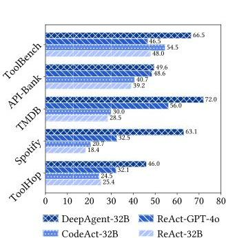
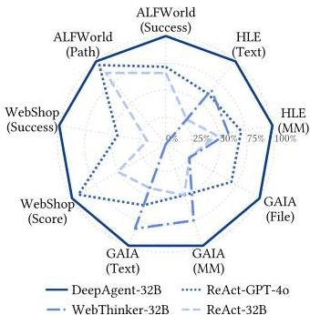
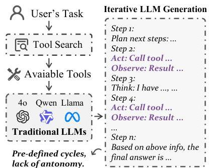
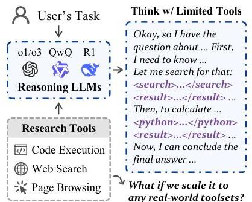
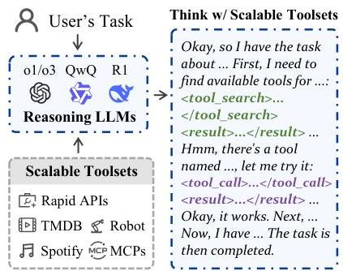
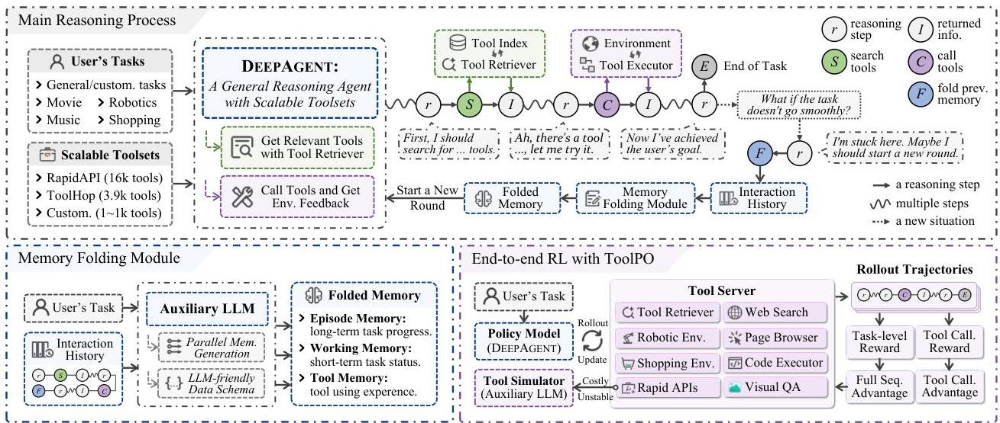
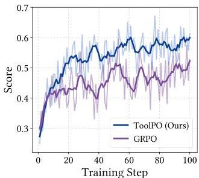
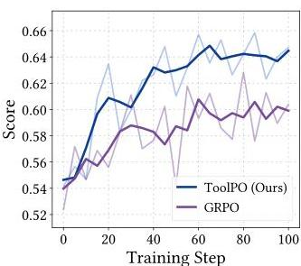
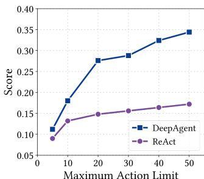
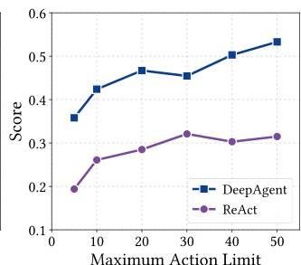

# DeepAgent: A General Reasoning Agent with Scalable Toolsets

Xiaoxi Li*

Renmin University of China

Beijing, China

xiaoxi_li@ruc.edu.cn

Yinuo Wang

Tsinghua University

Beijing, China

Ji-Rong Wen

Renmin University of China

Beijing, China

jrwen@ruc.edu.cn

Wenxiang Jiao

Jiarui Jin

Xiaohongshu Inc.

Beijing, China

Hao Wang

Xiaohongshu Inc.

Beijing, China

Yuan Lu

Xiaohongshu Inc.

Beijing, China

luyuan3@xiaohongshu.com

Guanting Dong

Jiajie Jin

Renmin University of China

Beijing, China

Yutao Zhu

Renmin University of China

Beijing, China

Zhicheng Dou†

Renmin University of China

Beijing, China

dou@ruc.edu.cn

# Abstract

Large reasoning models have demonstrated strong problem-solving abilities, yet real-world tasks often require external tools and long-horizon interactions. Existing agent frameworks typically follow predefined workflows, which limit autonomous and global task completion. In this paper, we introduce DeepAgent, an end-to-end deep reasoning agent that performs autonomous thinking, tool discovery, and action execution within a single, coherent reasoning process. To manage long-horizon interactions, we introduce an autonomous memory folding mechanism that compresses past interactions into structured episodic, working, and tool memories, reducing error accumulation while preserving critical information. To teach general-purpose tool use efficiently and stably, we develop an end-to-end reinforcement learning strategy, namely ToolPO, that leverages LLM-simulated APIs and applies tool-call advantage attribution to assign fine-grained credit to the tool invocation tokens. Extensive experiments on eight benchmarks, including general tool-use tasks (ToolBench, API-Bank, TMDB, Spotify, ToolHop) and downstream applications (ALFWorld, WebShop, GAIA, HLE), demonstrate that DeepAgent consistently outperforms baselines across both labeled-tool and open-set tool retrieval scenarios. The code and demo are available at https://github.com/RUC-NLPIR/DeepAgent.

# CCS Concepts

- Computing methodologies  $\rightarrow$  Planning and scheduling.

# Keywords

Large Reasoning Models, Autonomous Agents, Tool Retrieval, Memory Mechanism, Reinforcement Learning

*Work done during internship at Xiaohongshu Inc.

† Corresponding author.

(a) General Tool Usage Tasks
Figure 1: Overall performance on (a) general tool usage tasks and (b) downstream applications (best score as  $100\%$ ).

(b) Downstream Applications

# ACM Reference Format:

Xiaoxi Li, Wenxiang Jiao, Jiarui Jin, Guanting Dong, Jiajie Jin, Yinuo Wang, Hao Wang, Yutao Zhu, Ji-Rong Wen, Yuan Lu, and Zhicheng Dou. 2026. DeepAgent: A General Reasoning Agent with Scalable Toolsets. In Proceedings of the ACM Web Conference 2026 (WWW '26), April 13-17, 2026, Dubai, United Arab Emirates. ACM, New York, NY, USA, 12 pages. https://doi.org/10.1145/3774904.3792460

# 1 Introduction

The rapid advancement of Large Language Models (LLMs) has inspired the development of LLM-powered agents, which have found broad applications in scenarios such as web information seeking, software engineering, and personal assistance [19, 39]. Most existing agents follow predefined workflows (e.g., ReAct [68] and Plan-and-Solve [52]) with iterative "Reason-Act-Observe" loops (Figure 2(a)). Although effective in simpler tasks, these approaches suffer from several critical limitations: (1) lack of autonomy in execution steps and overall procedure; (2) inability to dynamically discover tools during task execution; (3) deficiency in fully autonomous management of interactive memory; and (4) insufficient depth and coherence in reasoning about the entire task. These limitations hinder agents from real-world problems, particularly for complex tasks that demand general and multiple tool-use.

---

WWW '26, April 13-17, 2026, Dubai, United Arab Emirates.

Xiaoxi Li et al.

(a) Traditional Agent Workflows

(b) Deep Research Agents
Figure 2: Comparison of agent paradigms: (a) Traditional agents with predefined workflows, (b) Deep Research agents that can autonomously call limited tools, and (c) Our DeepAgent, a fully autonomous reasoning agent that dynamically discovers and invokes helpful tools, all within a continuous agentic reasoning process.

(c) Ours: DeepAgent

Recently, the advent of Large Reasoning Models (LRMs) has demonstrated the capability to solve complex problems in domains like mathematics, programming, and scientific reasoning through a step-by-step "slow thinking" process [2, 30, 55]. However, many real-world tasks necessitate the use of external tools for their completion. Recent approaches integrate tool use into reasoning [25, 29, 72], but typically rely on a small, fixed tool set such as search, browsing, and coding (Figure 2(b)), limiting their generality.

To address these challenges, we introduce DeepAgent, an end-to-end deep reasoning agent that can complete an entire task by dynamically retrieving and calling tools within a single, coherent agentic reasoning process. As depicted in Figure 2(c), DeepAgent operates by autonomously thinking, searching for tools, and executing actions. This paradigm shifts away from traditional, predefined workflows that rely on predefined tools, task planning, and iterative tool use. Instead, DeepAgent maintains a global perspective on the entire task, unconstrained by the need to deliberate on specific, isolated operations. Tools are not pre-retrieved in advance but are dynamically discovered on an as-needed basis, thereby fully unlocking the autonomous potential of the large reasoning model.

To facilitate robust exploration in long-horizon environments, we equip DeepAgent with Autonomous Memory Folding. This strategy allows the agent to dynamically consolidate its reasoning process and interaction history into a structured memory schema. Beyond reducing token overhead, this mechanism enables the agent to "take a breath"—pausing to reconsider strategies and avoid erroneous paths. To minimize information loss during consolidation, we introduce a brain-inspired memory architecture comprising episodic, working, and tool memory, all structured with an agent-usable data schema to ensure the stability and utility of the folded memory.

To enhance DeepAgent's proficiency in mastering these mechanisms, we propose ToolPO, an end-to-end reinforcement learning (RL) training method tailored for general tool use. Existing agentic RL training in general domains presents two significant challenges: (1) The reliance on a multitude of real-world APIs during training can lead to instability, slow execution, and high costs. To prevent this, we leverage LLM-simulated APIs, which enhance the stability and efficiency of the training process. (2) A sparse reward based solely on the final outcome is often insufficient to guarantee the

accuracy of intermediate tool calls. We address this by implementing tool-call advantage attribution, which precisely assigns credit to the specific tokens responsible for correct tool invocations, thereby providing a more granular and effective learning signal.

We conduct extensive experiments on a wide range of benchmarks. For (1) General Tool-Use Tasks, we evaluate DeepAgent on ToolBench, API-Bank, TMDB, Spotify, and ToolHop, which feature toolsets scaling from tens to over ten thousand distinct tools. For (2) Downstream Applications, we test its performance on ALFWorld, WebShop, GAIA, and Humanity's Last Exam (HLE), which require the use of domain-specific toolsets. The overall results in Figure 1 show that DeepAgent achieves superior performance across all scenarios.

Our main contributions are summarized as follows:

(1) We propose DeepAgent, the first agentic framework that enables reasoning models to autonomously think, discover tools, and execute actions within a unified reasoning process, empowering LRMs to harness toolsets of arbitrary scale and generalize to complex real-world tasks.
(2) We introduce an autonomous memory folding mechanism, complemented by a brain-inspired memory design. This endows the agent with the ability to "take a breath" and reconsider its exploration strategies following unsuccessful attempts.
(3) We propose an end-to-end reinforcement learning training methodology for general-purpose tool use, ensuring stability and efficiency in large-scale tool execution during training, as well as accuracy in tool invocation during reasoning.
(4) We conduct extensive experiments across eight benchmarks, demonstrating DeepAgent's superior tool-use capabilities and high adaptability to real-world tasks.

# 2 Related Work

# 2.1 Large Reasoning Models

Large Reasoning Models (LRMs) [4, 16] have demonstrated significant performance improvements in mathematical, scientific, and coding tasks by employing step-by-step slow thinking processes before generating final responses. Existing research has explored

---

DeepAgent: A General Reasoning Agent with Scalable Toolsets

WWW '26, April 13-17, 2026, Dubai, United Arab Emirates.

Figure 3: Overview of the DeepAgent framework. The main reasoning model autonomously discovers tools, executes actions, and folds previous memory to restart with structured memories, all within a unified thinking process. The DeepAgent is trained end-to-end with ToolPO, an RL method that uses a tool simulator to simulate large-scale real-world tool APIs, and rewards both final task success and correct intermediate tool calls through fine-grained advantage attribution.

various approaches to elicit extended Chain-of-Thought (CoT) reasoning [60] from models, including data synthesis for Supervised Fine-Tuning (SFT) [36, 54], and end-to-end RL [4]. Additionally, substantial work has investigated optimization strategies for reasoning models, such as advanced RL training algorithms [58] and improving reasoning efficiency [66]. However, models relying solely on parametric knowledge face inherent limitations and cannot interact with the real world. Recent studies have begun exploring tool-augmented reasoning approaches, including Search-o1 [25], Search-R1 [18], ToRL [29], DeepResearcher [72], and SimpleTIR [64]. However, these methods typically support only a limited set of research-oriented tools, such as web search, page browsing, and code execution, which constrains their applicability to real-world scenarios that demand access to more diverse tools.

# 2.2 Autonomous Agents

LLM-powered autonomous agents accomplish real-world tasks by invoking external tools to interact with their environment [6, 7, 13-15, 20, 22, 27, 28, 31, 38, 46, 49, 57, 61, 71]. Current agent methodologies, including ReAct [68], Plan-and-Solve [52], Reflexion [44], and CodeAct [56], predominantly follow predefined workflows with fixed execution patterns. This rigid structure limits their ability to fully leverage the autonomous decision-making and deep reasoning capabilities of advanced reasoning models. Recent efforts have investigated training LLMs to autonomously invoke tools through data synthesis and SFT methods [9, 63] and RL training frameworks [3, 5, 8, 10, 17, 23, 32, 48, 59]. However, most existing methods rely on pre-selected, labeled tools, which limit their applicability to real-world scenarios. Real-world tasks are highly variable and require access to diverse toolsets that cannot be predetermined, aligning with the emerging Model Context Protocol (MCP) [12] paradigm. Although some prior work has explored tool retrieval

mechanisms [37, 42, 53], most approaches conduct only a single upfront retrieval step and incorporate the retrieved tools, with limited exploration of dynamic tool discovery during task execution. Therefore, we aim to develop a deep reasoning agent capable of dynamically discovering and invoking helpful tools from scalable toolsets to address more generalized real-world tasks.

# 3 Methodology

# 3.1 Problem Formulation

We frame the agent's task as a sequential decision-making process. The agent receives a user-provided question  $Q$  and an instruction  $I$ , and interacts with an environment over a series of steps  $t = 1, \dots, T$  to accomplish the specified goal. The environment provides access to a collection of tools  $\mathcal{T}$  at an arbitrary scale.

At each step  $t$ , the agent's state  $s_t$  consists of the history of all previous actions and their resulting observations, i.e.,  $s_t = (a_1, o_1, \ldots, a_{t-1}, o_{t-1})$ . The agent, driven by a policy  $\pi$  parameterized by  $\theta$ , selects an action  $a_t$  based on the current state, the user question, and the instruction:

$$
a _ {t} \sim \pi_ {\theta} (\cdot | s _ {t}, Q, I). \tag {1}
$$

An action  $a_{t}$  can be one of four types:

- Internal Thought  $(o_{t}^{\mathrm{think}})$ : A textual reasoning step generated by the LRM to analyze the problem or plan its next steps. The corresponding observation  $o_{t}$  is typically empty.
- Tool Search  $(o_{t}^{\mathrm{search}})$ : A natural language query  $q_{s}$  to find relevant tools from  $\mathcal{T}$ . The observation  $o_{t}$  is a list of retrieved tools.
- Tool Call  $(o_{t}^{\mathrm{call}})$ : The invocation of a specific tool  $\tau \in \mathcal{T}$  with a set of arguments. The observation  $o_{t}$  is the execution result returned by the tool.

---

- Memory Fold ($a_{t}^{\text{fold}}$): A special action to compress the interaction history $s_{t}$ into a structured memory summary. The subsequent state $s_{t+1}$ is then initialized with this compressed memory.

The sequence of states, actions, and observations forms a trajectory $\tau=(s_{1},a_{1},o_{1},\ldots,s_{T},a_{T},o_{T})$. The process terminates when the agent completes the task or reaches a maximum step limit. Suppose $R(\tau)$ is a reward function that evaluates the overall success of the trajectory $\tau$, the objective is to learn an optimal policy $\pi_{\theta}^{*}$ that maximizes the expected cumulative reward for a given task:

(2) $\pi_{\theta}^{*}=\arg\max_{\pi_{\theta}}\mathbb{E}_{\tau\sim\pi_{\theta}}[R(\tau)].$

### 3.2. Overview of the DeepAgent Framework

As illustrated in Figure 3, the DeepAgent framework is architected around a main reasoning process, which is supported by several auxiliary mechanisms to ensure robustness and efficiency.

- Main Reasoning Process: The core of DeepAgent is a powerful large reasoning model that drives the entire task-completion process. In a single stream of thought, the LRM autonomously reasons about the task, dynamically discovers necessary tools, executes actions, and manages its own memory. This unified approach departs from traditional, rigid agent workflows, allowing the LRM to maintain a global perspective on the task.
- Auxiliary Mechanisms: DeepAgent employs an auxiliary LLM to handle complex interactions with large toolsets and manage long histories. This background model enhances system stability by: (1) filtering and summarizing retrieved tool documentation if it’s too lengthy, (2) denoising and condensing verbose information returned from tool calls, and (3) compressing long interaction histories into a structured memory. This division of labor allows the main LRM to concentrate on high-level strategic reasoning.

### 3.3. Autonomous Tool Search and Calling

DeepAgent’s main LRM performs all actions by generating specific textual prompts within its continuous reasoning process. These actions are then intercepted and executed by the system.

#### Tool Search

When the agent determines it needs a tool, it generates a tool search query $q_{s}$ encapsulated within special tokens: <tool_search> $q_{s}$ </tool_search>. The system’s tool retriever operates via dense retrieval. First, we build an index by pre-computing an embedding $E(d_{i})$ for the documentation $d_{i}$ of each tool $\tau_{i}\in\mathcal{T}$ using an embedding model $E$. During inference, given the query $q_{s}$, the system retrieves the top-$k$ tools by ranking them based on the cosine similarity $\text{sim}(\cdot,\cdot)$:

(3) $\mathcal{T}_{\text{retrieved}}=\underset{\tau_{i}\in\mathcal{T}}{\text{top-k}}\left(\text{sim}\left(E\left(q_{s}\right),E\left(d_{i}\right)\right)\right).$

The retrieved tool documentation is then processed by the auxiliary LLM —summarized if too lengthy, otherwise provided directly— and returned to the main LRM’s context: <tool_search_result> relevant tools </tool_search_result>.

#### Tool Call

To execute a tool, the agent generates a structured call including the tool’s name and arguments: <tool_call> {"name": "tool_name", "arguments": …} </tool_call>. The framework parses this call, executes the tool, and captures the output. This output is, if necessary, summarized by the auxiliary LLM to ensure it is concise and helpful, before being fed back into the reasoning context: <tool_call_result> helpful information </tool_call_result>.

### 3.4. Autonomous Memory Folding and Brain-Inspired Memory Schema

The agent can trigger memory folding at any logical point in its reasoning process—such as after completing a sub-task or realizing an exploration path was incorrect—by generating a special token: <fold_thought>. Upon detecting this token, the system initiates the memory folding process. The auxiliary LLM (parameterized by $\theta_{\text{aux}}$) processes the entire preceding interaction history $s_{t}$ and generates three structured memory components in parallel:

(4) $\left(M_{E},M_{W},M_{T}\right)=f_{\text{compress}}(s_{t};\theta_{\text{aux}}).$

These compressed episodic ($M_{E}$), working ($M_{W}$), and tool ($M_{T}$) memories then replace the raw interaction history, enabling the agent to proceed with a refreshed and condensed view of its progress while avoiding entrapment in incorrect exploration paths.

Inspired by human cognitive systems, the structured memory $M_{t}$ is composed of three distinct components that are generated in parallel: $M_{t}=(M_{E},M_{W},M_{T})$, where $M_{E},M_{W},M_{T}$ denote episodic, working, and tool memories, respectively.

- Episodic Memory ($M_{E}$): This component serves as a high-level log of the task, recording key events, major decision points, and sub-task completions. It provides the agent with long-term context regarding the overall task structure and its overarching goals.
- Working Memory ($M_{W}$): This contains the most recent information, such as the current sub-goal, obstacles encountered, and near-term plans. It is the core component that ensures the continuity of the agent’s reasoning across the memory fold.
- Tool Memory ($M_{T}$): This consolidates all tool-related interactions, including which tools have been used, how they were invoked, and their effectiveness. It allows the agent to learn from its experiences, refining its tool selection and usage strategies.

To ensure that the compressed memory is stable and easily parsed by the agent, we employ an agent-usable data schema in JSON format instead of unstructured natural language. It offers two main benefits: maintaining a controllable and predictable structure, and mitigating the loss of critical details that can occur when summarizing long-form text. Details of the data schema are in Appendix C.

### 3.5. End-to-end RL Training with ToolPO

We train DeepAgent end-to-end with Tool Policy Optimization (ToolPO), an RL approach designed for general tool-using agents.

#### Training Data Collection

We first collect a diverse training dataset spanning four categories. To instill general tool-use capabilities, we use ToolBench *(37)*. For real-world interaction, we leverage ALFWorld *(45)* and WebShop *(67)*. To enhance deep research skills, we incorporate data from WebDancer *(61)* and WebShaperQA *(50)*. Lastly, to improve mathematical reasoning with code, we use DeepMath *(11)*. Further details are available in Appendix A.1.

#### Tool Simulator

Training an agent that interacts with thousands of real-world APIs is often impractical due to instability, latency, and cost. To address this, we develop an LLM-based Tool Simulator.

---

DeepAgent: A General Reasoning Agent with Scalable Toolsets

WWW '26, April 13-17, 2026, Dubai, United Arab Emirates.

Table 1: Main results on general tool usage tasks, encompassing scenarios with both labeled tools and open-set tool retrieval over large-scale toolsets. We report Pass@1 metric for all tasks. For 32B models, the best results are in bold and the second are underlined. Results from larger or closed-sourced models are in gray color for reference.

<table><tr><td rowspan="2">Method</td><td rowspan="2">Backbone</td><td colspan="2">ToolBench</td><td colspan="2">API-Bank</td><td colspan="2">TMDB</td><td colspan="2">Spotify</td><td colspan="2">ToolHop</td></tr><tr><td>Success</td><td>Path</td><td>Success</td><td>Path</td><td>Success</td><td>Path</td><td>Success</td><td>Path</td><td>Correct</td><td>Path</td></tr><tr><td colspan="12">Scenario 1: Completing Tasks w/ Ground-truth Tools</td></tr><tr><td colspan="12">Workflow-based Methods</td></tr><tr><td>ReAct</td><td>Qwen2.5-32B</td><td>41.0</td><td>64.7</td><td>60.4</td><td>68.3</td><td>46.0</td><td>65.3</td><td>29.8</td><td>56.3</td><td>37.6</td><td>49.1</td></tr><tr><td>CodeAct</td><td>Qwen2.5-32B</td><td>53.0</td><td>68.3</td><td>62.4</td><td>70.6</td><td>48.0</td><td>67.4</td><td>33.3</td><td>58.7</td><td>34.7</td><td>48.8</td></tr><tr><td>Plan-and-Solve</td><td>Qwen2.5-32B</td><td>52.0</td><td>65.4</td><td>58.4</td><td>67.5</td><td>51.0</td><td>71.6</td><td>28.1</td><td>54.8</td><td>39.2</td><td>49.7</td></tr><tr><td>ReAct</td><td>QwQ-32B</td><td>52.0</td><td>61.6</td><td>73.3</td><td>78.6</td><td>43.0</td><td>65.3</td><td>47.4</td><td>69.4</td><td>47.4</td><td>51.6</td></tr><tr><td>CodeAct</td><td>QwQ-32B</td><td>54.0</td><td>63.4</td><td>74.3</td><td>79.4</td><td>55.0</td><td>74.5</td><td>52.6</td><td>75.4</td><td>43.2</td><td>53.4</td></tr><tr><td>Plan-and-Solve</td><td>QwQ-32B</td><td>55.0</td><td>64.7</td><td>70.3</td><td>75.4</td><td>48.0</td><td>61.3</td><td>49.1</td><td>70.6</td><td>45.4</td><td>50.6</td></tr><tr><td>ReAct</td><td>Qwen2.5-72B</td><td>56.0</td><td>69.3</td><td>73.3</td><td>78.6</td><td>47.0</td><td>67.7</td><td>57.9</td><td>76.6</td><td>44.8</td><td>55.4</td></tr><tr><td>ReAct</td><td>GPT-4o</td><td>52.0</td><td>53.9</td><td>79.2</td><td>83.3</td><td>77.0</td><td>89.3</td><td>47.4</td><td>70.6</td><td>40.0</td><td>53.7</td></tr><tr><td>ReAct</td><td>DeepSeek-R1</td><td>57.0</td><td>68.3</td><td>71.3</td><td>76.2</td><td>76.0</td><td>89.0</td><td>64.9</td><td>81.3</td><td>50.2</td><td>61.8</td></tr><tr><td colspan="12">Autonomous Tool Usage within Reasoning</td></tr><tr><td>DeepAgent-32B-Base</td><td>QwQ-32B</td><td>63.0</td><td>74.3</td><td>76.2</td><td>81.0</td><td>85.0</td><td>92.0</td><td>70.2</td><td>89.3</td><td>49.1</td><td>59.8</td></tr><tr><td>DeepAgent-32B-RL</td><td>QwQ-32B</td><td>69.0</td><td>78.6</td><td>75.3</td><td>80.2</td><td>89.0</td><td>94.8</td><td>75.4</td><td>92.0</td><td>51.3</td><td>62.5</td></tr><tr><td colspan="12">Scenario 2: Completing Tasks w/ Open-Set Tool Retrieval</td></tr><tr><td colspan="12">Workflow-based Methods</td></tr><tr><td>ReAct</td><td>Qwen2.5-32B</td><td>55.0</td><td>20.8</td><td>16.0</td><td>42.0</td><td>11.0</td><td>34.5</td><td>7.0</td><td>25.4</td><td>13.2</td><td>17.9</td></tr><tr><td>CodeAct</td><td>Qwen2.5-32B</td><td>51.0</td><td>19.0</td><td>22.0</td><td>49.6</td><td>19.0</td><td>46.8</td><td>10.5</td><td>31.6</td><td>12.7</td><td>17.4</td></tr><tr><td>Plan-and-Solve</td><td>Qwen2.5-32B</td><td>54.0</td><td>20.4</td><td>18.0</td><td>42.8</td><td>15.0</td><td>40.5</td><td>8.8</td><td>26.3</td><td>12.0</td><td>16.3</td></tr><tr><td>ReAct</td><td>QwQ-32B</td><td>44.0</td><td>19.0</td><td>20.0</td><td>52.7</td><td>18.0</td><td>40.3</td><td>22.8</td><td>45.5</td><td>27.1</td><td>22.3</td></tr><tr><td>CodeAct</td><td>QwQ-32B</td><td>48.0</td><td>21.6</td><td>16.0</td><td>45.0</td><td>31.0</td><td>52.8</td><td>24.6</td><td>49.6</td><td>29.0</td><td>26.1</td></tr><tr><td>Plan-and-Solve</td><td>QwQ-32B</td><td>45.0</td><td>19.6</td><td>18.0</td><td>44.3</td><td>24.0</td><td>46.8</td><td>19.3</td><td>42.7</td><td>25.7</td><td>20.8</td></tr><tr><td>ReAct</td><td>Qwen2.5-72B</td><td>52.0</td><td>21.6</td><td>14.0</td><td>38.9</td><td>28.0</td><td>50.7</td><td>21.1</td><td>48.5</td><td>21.1</td><td>19.9</td></tr><tr><td>ReAct</td><td>GPT-4o</td><td>41.0</td><td>28.9</td><td>18.0</td><td>42.8</td><td>35.0</td><td>56.8</td><td>17.5</td><td>26.3</td><td>24.1</td><td>28.6</td></tr><tr><td>ReAct</td><td>DeepSeek-R1</td><td>47.0</td><td>22.3</td><td>12.0</td><td>57.3</td><td>34.0</td><td>53.1</td><td>29.8</td><td>51.7</td><td>36.2</td><td>32.9</td></tr><tr><td colspan="12">Autonomous Tool Retrieval and Usage within Reasoning</td></tr><tr><td>DeepAgent-32B-Base</td><td>QwQ-32B</td><td>60.0</td><td>35.7</td><td>22.0</td><td>61.8</td><td>52.0</td><td>71.8</td><td>49.1</td><td>68.6</td><td>38.4</td><td>40.3</td></tr><tr><td>DeepAgent-32B-RL</td><td>QwQ-32B</td><td>64.0</td><td>37.2</td><td>24.0</td><td>64.9</td><td>55.0</td><td>74.3</td><td>50.9</td><td>74.4</td><td>40.6</td><td>40.5</td></tr></table>

This simulator, powered by an auxiliary LLM, mimics the responses of real-world APIs (e.g., RapidAPI). This approach provides a stable, efficient, and low-cost environment for robust RL training.

Global and Tool-Call Advantage Attribution. For each input prompt, we sample a group of  $K$  trajectories  $\{\tau_1,\dots ,\tau_K\}$ . ToolPO defines two distinct reward components. The first is a reward for overall task success,  $R_{\mathrm{suc}}(\tau)$ , which is a task-success score that reflects the quality of the final outcome (e.g., the accuracy of the final answer). The second is a tool-call reward,  $R_{\mathrm{action}}(\tau)$ , which reflects the quality of intermediate actions. This action-level reward is composed of rewards for correct tool invocations and efficient memory folding. Specifically,  $R_{\mathrm{action}}(\tau) = \lambda_1\sum_{i = 1}^{I}C(a_i^{\mathrm{call}}) + \lambda_2S_{\mathrm{pref}}(\tau)$ , where  $C(a_i^{\mathrm{call}})$  is 1 if a tool call is correct and 0 otherwise.  $S_{\mathrm{pref}}(\tau)$  is a preference score encouraging efficient use of memory folding, defined by comparing a trajectory with folding ( $\tau_{\mathrm{fold}}$ ) to one without ( $\tau_{\mathrm{direct}}$ ):  $S_{\mathrm{pref}} = (L(\tau_{\mathrm{direct}}) - L(\tau_{\mathrm{fold}})) / (L(\tau_{\mathrm{direct}}) + L(\tau_{\mathrm{fold}}))$ .

Based on these rewards, we compute two separate group-relative advantages. The task success advantage for trajectory  $\tau_{k}$  is:

$$
A _ {\text {s u c c}} \left(\tau_ {k}\right) = R _ {\text {s u c c}} \left(\tau_ {k}\right) - \frac {1}{K} \sum_ {j = 1} ^ {K} R _ {\text {s u c c}} \left(\tau_ {j}\right), \tag {5}
$$

which is attributed to all generated tokens in  $\tau_{k}$ , providing a global learning signal. Similarly, the action-level advantage is:

$$
A _ {\text {a c t i o n}} \left(\tau_ {k}\right) = R _ {\text {a c t i o n}} \left(\tau_ {k}\right) - \frac {1}{K} \sum_ {j = 1} ^ {K} R _ {\text {a c t i o n}} \left(\tau_ {j}\right). \tag {6}
$$

Crucially, this advantage is attributed only to the specific tokens that constitute the tool call and memory folding actions. This fine-grained credit assignment provides a more targeted signal for learning correct and efficient tool use.

Optimization Objective. The total advantage for a given token  $y_{i}$  in trajectory  $\tau_{k}$  is the sum of the global and local advantages:

$$
A \left(y _ {i}\right) = A _ {\text {s u c c}} \left(\tau_ {k}\right) + M \left(y _ {i}\right) \cdot A _ {\text {a c t i o n}} \left(\tau_ {k}\right), \tag {7}
$$

where  $M(y_{i})$  is a mask that is 1 if  $y_{i}$  is part of a tool-call or memory-fold token sequence, and 0 otherwise. ToolPO then optimizes the policy using a clipped surrogate objective function:

$$
\begin{array}{l} \mathcal {L} _ {\text {T o o l P O}} (\theta) = \\ \mathbb {E} _ {\tau_ {k}} \left[ \sum_ {i = 1} ^ {| \tau_ {k} |} \min  \left(\rho_ {i} (\theta) A (y _ {i}), \operatorname {c l i p} \left(\rho_ {i} (\theta), 1 - \epsilon , 1 + \epsilon\right) A (y _ {i})\right) \right]. \tag {8} \\ \end{array}
$$

---

WWW '26, April 13-17, 2026, Dubai, United Arab Emirates.

Xiaoxi Li et al.

Table 2: Main results on downstream task applications, spanning Embodied AI (ALFWorld), Online Shopping (WebShop), General AI Assistants (GAIA), and Humanity's Last Exam (HLE). We report Pass@1 for all tasks. For 32B models, the best results are in bold and the second are underlined. Results from larger or closed-sourced models are in gray color for reference.

<table><tr><td rowspan="2">Method</td><td rowspan="2">Backbone</td><td colspan="2">ALFWorld</td><td colspan="2">WebShop</td><td colspan="4">GAIA</td><td colspan="3">HLE</td></tr><tr><td>Success</td><td>Path</td><td>Success</td><td>Score</td><td>Text</td><td>MM</td><td>File</td><td>All</td><td>Text</td><td>MM</td><td>All</td></tr><tr><td colspan="13">Completing Tasks w/ Task-specific Toolsets</td></tr><tr><td colspan="13">Workflow-based Methods</td></tr><tr><td>ReAct</td><td>Qwen2.5-32B</td><td>60.4</td><td>79.1</td><td>6.0</td><td>28.8</td><td>25.2</td><td>16.7</td><td>13.2</td><td>21.2</td><td>6.5</td><td>7.1</td><td>6.6</td></tr><tr><td>CodeAct</td><td>Qwen2.5-32B</td><td>65.7</td><td>83.3</td><td>12.4</td><td>34.5</td><td>28.2</td><td>20.8</td><td>18.4</td><td>24.8</td><td>7.5</td><td>8.0</td><td>7.6</td></tr><tr><td>Reflexion</td><td>Qwen2.5-32B</td><td>66.4</td><td>86.0</td><td>9.2</td><td>31.6</td><td>29.1</td><td>20.8</td><td>18.4</td><td>25.5</td><td>5.9</td><td>5.3</td><td>5.8</td></tr><tr><td>Plan-and-Solve</td><td>Qwen2.5-32B</td><td>63.4</td><td>80.4</td><td>7.6</td><td>29.3</td><td>27.2</td><td>16.7</td><td>15.8</td><td>23.0</td><td>7.2</td><td>6.2</td><td>7.0</td></tr><tr><td>ReAct</td><td>QwQ-32B</td><td>82.1</td><td>87.8</td><td>17.2</td><td>45.3</td><td>35.0</td><td>8.3</td><td>36.8</td><td>31.5</td><td>13.2</td><td>8.8</td><td>12.2</td></tr><tr><td>CodeAct</td><td>QwQ-32B</td><td>78.4</td><td>86.2</td><td>18.0</td><td>46.4</td><td>38.8</td><td>20.8</td><td>31.6</td><td>34.5</td><td>14.2</td><td>8.0</td><td>12.8</td></tr><tr><td>Reflexion</td><td>QwQ-32B</td><td>85.1</td><td>88.4</td><td>21.6</td><td>50.4</td><td>37.9</td><td>20.8</td><td>36.8</td><td>35.2</td><td>11.9</td><td>7.1</td><td>10.8</td></tr><tr><td>Plan-and-Solve</td><td>QwQ-32B</td><td>79.1</td><td>84.7</td><td>16.0</td><td>43.8</td><td>36.9</td><td>16.7</td><td>34.2</td><td>33.3</td><td>12.9</td><td>9.7</td><td>12.2</td></tr><tr><td>AgentLM*</td><td>Llama2-70B</td><td>86.0</td><td>-</td><td>-</td><td>64.9</td><td>-</td><td>-</td><td>-</td><td>-</td><td>-</td><td>-</td><td>-</td></tr><tr><td>ReAct</td><td>Qwen2.5-72B</td><td>86.5</td><td>86.5</td><td>22.0</td><td>44.5</td><td>32.0</td><td>20.8</td><td>31.6</td><td>30.3</td><td>9.0</td><td>8.0</td><td>8.8</td></tr><tr><td>ReAct</td><td>DeepSeek-R1</td><td>79.1</td><td>85.8</td><td>19.6</td><td>49.7</td><td>43.7</td><td>29.2</td><td>39.5</td><td>40.6</td><td>14.2</td><td>8.8</td><td>13.0</td></tr><tr><td>ReAct</td><td>GPT-4o</td><td>65.7</td><td>87.8</td><td>15.6</td><td>52.5</td><td>35.0</td><td>16.7</td><td>36.8</td><td>32.7</td><td>13.2</td><td>10.6</td><td>12.6</td></tr><tr><td>ReAct</td><td>Claude-4</td><td>93.3</td><td>91.5</td><td>20.4</td><td>56.6</td><td>56.3</td><td>37.5</td><td>52.6</td><td>52.7</td><td>15.5</td><td>16.8</td><td>15.8</td></tr><tr><td colspan="13">Autonomous Tool Usage within Reasoning</td></tr><tr><td>Deep Research</td><td>OpenAI (o3)</td><td>-</td><td>-</td><td>-</td><td>-</td><td>-</td><td>-</td><td>-</td><td>67.4</td><td>-</td><td>-</td><td>26.6</td></tr><tr><td>WebThinker</td><td>QwQ-32B</td><td>-</td><td>-</td><td>-</td><td>-</td><td>48.5</td><td>25.0</td><td>13.2</td><td>37.0</td><td>14.2</td><td>8.8</td><td>13.0</td></tr><tr><td>HiRA</td><td>QwQ-32B</td><td>84.3</td><td>87.6</td><td>23.2</td><td>51.9</td><td>44.7</td><td>33.3</td><td>42.1</td><td>42.5</td><td>14.5</td><td>10.6</td><td>13.6</td></tr><tr><td>DeepAgent-32B-Base</td><td>QwQ-32B</td><td>88.1</td><td>91.4</td><td>32.0</td><td>55.4</td><td>49.5</td><td>37.5</td><td>44.7</td><td>46.7</td><td>19.1</td><td>13.3</td><td>17.8</td></tr><tr><td>DeepAgent-32B-RL</td><td>QwQ-32B</td><td>91.8</td><td>92.0</td><td>34.4</td><td>56.3</td><td>58.3</td><td>33.3</td><td>52.6</td><td>53.3</td><td>21.7</td><td>15.0</td><td>20.2</td></tr></table>

Here,  $\rho_{i}(\theta) = \frac{\pi_{\theta}(y_{i}|y_{&lt; i,s})}{\pi_{\theta_{\mathrm{old}}}(y_{i}|y_{&lt; i,s})}$  is the probability ratio for token  $y_{i}$ . This objective encourages the model to increase the probability of both intermediate actions and end-to-end task accomplishment that exhibit positive relative advantage, thereby ensuring stable and effective policy updates.

# 4 Experimental Settings

# 4.1 Tasks and Datasets

We conduct extensive experiments on a wide range of benchmarks, including general tool-use and downstream applications.

General Tool-Use. These benchmarks cover toolsets from tens to  $&gt;10k$  tools, and thus stress scalability. They evaluate core capabilities for general tool use, including tool planning, tool retrieval, and accurate multi-step tool calling. We use ToolBench [37] (16k+ real-world APIs; G3 subset with multi-step/multi-tool calls), APIBank [24] (314 dialogues; 73 APIs; 753 calls), RestBench [47] (TMDB: 54 tools, 2.3 calls/question; Spotify: 40 tools, 2.6 calls/question), and ToolHop [69] (3,912 executable tools; 3-7 calls/task). We evaluate two settings: provided ground-truth tools and open-set tool retrieval from the full toolset.

Downstream Applications. We also evaluate downstream applications with domain-specific toolsets: ALFWorld [45] (text embodied tasks with nine actions, e.g., move/take), WebShop [67] (shopping with 'search' and 'click'), GAIA [33] (web search/browsing, VQA, code, file reading), and Humanity's Last Exam (HLE) [35] (code, search, browsing, VQA). These tasks test long-horizon interaction

in more realistic environments, requiring state tracking, error recovery, and coordination across heterogeneous tools; we equip agents with task-specific toolsets.

# 4.2 Baselines

Our baselines include: (1) Workflow-based Methods: ReAct [68] alternates explicit reasoning with environment actions in a Reason-Act-Observe loop. CodeAct [56] expresses actions as executable Python code that runs in an interpreter. Plan-and-Solve [52] first sketches a high-level plan and then executes it step by step. Reflexion [43] enhances learning through verbal self-reflection after failed attempts. AgentLM [70] uses instruction tuning to enhance general agent capabilities of LLMs. (2) Autonomous Tool Usage within Reasoning: WebThinker [26] interleaves thinking with web search and deep web exploration. HiRA [21] introduces a hierarchical agent architecture where a meta planner decomposes tasks, a coordinator routes subtasks, and specialized executors solve them with dual-channel memory. OpenAI Deep Research [34] is an agentic system based on reasoning models.

# 4.3 Implementation Details

We use QwQ-32B [51] as DeepAgent's backbone model, with Qwen2.5-32B-Instruct [40] as the auxiliary model in our main results. Text generation employs a maximum of 81,920 tokens with temperature 0.7, top_p 0.8, top_k 20, and repetition penalty 1.05. Web search and page browsing are implemented using Google Serper API and

---

DeepAgent: A General Reasoning Agent with Scalable Toolsets

WWW '26, April 13-17, 2026, Dubai, United Arab Emirates.

(a) Reward Scores

(b) Validation Scores
Figure 4: Visualization of training dynamics, including (a) reward scores and (b) validation scores across training steps.

Table 3: Ablation studies on the components of DeepAgent, where the best results are in bold.

<table><tr><td rowspan="2">Method</td><td colspan="2">Tool-Usage</td><td colspan="2">Application</td><td rowspan="2">Avg.</td></tr><tr><td>ToolB.</td><td>ToolH.</td><td>WebS.</td><td>GAIA</td></tr><tr><td>DeepAgent-32B-RL</td><td>64.0</td><td>40.6</td><td>34.4</td><td>53.3</td><td>48.1</td></tr><tr><td>w/o Training (Base)</td><td>60.0</td><td>38.4</td><td>32.0</td><td>46.7</td><td>44.3</td></tr><tr><td>w/o Memory Folding</td><td>63.0</td><td>36.6</td><td>32.4</td><td>44.7</td><td>44.2</td></tr><tr><td>w/o Tool Simulation</td><td>62.0</td><td>35.2</td><td>33.6</td><td>48.5</td><td>44.8</td></tr><tr><td>w/o Tool Adv. Attribution</td><td>62.0</td><td>39.6</td><td>33.2</td><td>49.5</td><td>46.1</td></tr></table>

Jina Reader API, respectively. The VQA tool is based on Qwen2.5-VL-32B-Instruct [1]. Tool retrieval is performed using bge-large-en-v1.5 [62]. Training consists of 100 steps of ToolPO with batch size  $64$ ,  $\lambda_1 = \lambda_2 = 1$ , rollout size  $K = 8$ , and maximum sequence length 32,768. Additional details are provided in Appendix B. All experiments are conducted on 64 NVIDIA H20-141GB GPUs.

# 5 Experimental Results

# 5.1 Main Results on General Tool Usage Tasks

Table 1 summarizes results on general tool-use tasks and yields three observations. (1) DeepAgent's End-to-End Reasoning Surpasses Workflow-Based Methods. DeepAgent consistently outperforms workflow-based agents. On labeled-tool tasks, DeepAgent-32B-RL reaches  $89.0\%$  on TMDB and  $75.4\%$  on Spotify, exceeding the best 32B baselines  $(55.0\%$  and  $52.6\%)$ . This highlights the advantage of end-to-end agentic reasoning over rigid, predefined action loops. (2) DeepAgent Maintains Robustness in Open-Set Scenarios. Gains are larger in open-set settings where tool discovery is required: on ToolBench and ToolHop, DeepAgent-32B-RL achieves  $64.0\%$  and  $40.6\%$ , surpassing the best baselines  $(54.0\%$  and  $29.0\%)$ . This suggests that on-demand tool discovery within the reasoning process is both more robust and more scalable in realistic open-set tool environments. (3) ToolPO Training Further Improves ToolUsage Capabilities. ToolPO yields consistent improvements over the base model, increasing ToolBench success by up to  $6.0\%$  and Spotify (labeled) by  $5.2\%$ . These gains indicate that our RL training better aligns intermediate tool calls with end-task success.

Table 4: Effectiveness analysis of autonomous tool retrieval strategy in open-set scenarios compared to pre-retrieved tool methods. Numbers in parentheses indicate toolset sizes.

<table><tr><td>Method</td><td>ToolB. (16k)</td><td>ToolH. (3.9k)</td><td>TMDB (54)</td><td>Spotify (40)</td><td>Avg.</td></tr><tr><td colspan="6">ReAct Workflow</td></tr><tr><td>Input Retrieved Tool</td><td>35.0</td><td>25.4</td><td>14.0</td><td>15.0</td><td>22.4</td></tr><tr><td>Auto. Tool Retrieval</td><td>34.0</td><td>37.1</td><td>18.0</td><td>27.8</td><td>28.0</td></tr><tr><td colspan="6">Plan-and-Solve Workflow</td></tr><tr><td>Input Retrieved Tool</td><td>37.0</td><td>24.8</td><td>19.0</td><td>16.0</td><td>24.2</td></tr><tr><td>Auto. Tool Retrieval</td><td>45.0</td><td>25.7</td><td>24.0</td><td>19.3</td><td>28.5</td></tr><tr><td colspan="6">End-to-end Agentic Reasoning (DeepAgent)</td></tr><tr><td>Input Retrieved Tool</td><td>53.0</td><td>37.0</td><td>34.0</td><td>43.9</td><td>42.0</td></tr><tr><td>Auto. Tool Retrieval</td><td>64.0</td><td>40.6</td><td>55.0</td><td>50.9</td><td>52.6</td></tr></table>

# 5.2 Main Results on Downstream Applications

Table 2 reports the downstream results that require long-horizon interaction and more complex environment dynamics. (1) The autonomous reasoning paradigm generally outperforms the workflow-based methods. Methods that integrate tool use into continuous reasoning outperform workflow-based agents. On GAIA, DeepAgent-32B-Base (46.7) and HiRA (42.5) exceed the best workflow baseline CodeAct (34.5); on WebShop, DeepAgent-32B-Base scores 32.0 vs. 18.0. This supports that long-horizon tasks benefit from flexible, integrated reasoning-and-action rather than fixed workflows. (2) DeepAgent demonstrates superior performance across various application tasks. DeepAgent achieves the best performance among 32B models: 53.3 on GAIA (vs. 42.5 for HiRA) and  $91.8\%$  on ALFWorld (vs. 84.3). We attribute this to DeepAgent's coherent reasoning process and its support for robust long-horizon interaction (e.g., autonomous memory folding). (3) ToolPO training further improves performance on downstream applications. ToolPO further improves downstream performance: GAIA  $46.7 \rightarrow 53.3(+6.6)$  and ALFWorld  $88.1\% \rightarrow 91.8\% (+3.7)$ . This shows the tool-use improvements learned by ToolPO transfer to interactive downstream settings.

# 5.3 Analysis of Training Dynamics

Figure 4 shows the training dynamics of DeepAgent, including the reward scores and validation scores across training steps. As shown in the figure, (1) DeepAgent trained with ToolPO achieves higher upper bounds on both reward and validation scores compared to the commonly used GRPO. (2) Moreover, the training reward exhibits less fluctuation than GRPO, demonstrating better training stability. This indicates that using tool simulators instead of directly training with unstable real-world APIs, along with employing tool-call process supervision, enables more stable and effective training of tool-usage capabilities.

# 5.4 Ablation Studies

We conduct ablation studies in Table 3 to validate the effectiveness of each component in DeepAgent. (1) Importance of ToolPO Training: Removing ToolPO training (the Base model) results in the most significant performance drop (from 48.1 to 44.3). This

---

WWW '26, April 13-17, 2026, Dubai, United Arab Emirates.

Xiaoxi Li et al.

(a) WebShop

(b) GAIA
Figure 5: Scaling analysis of performance with respect to maximum action limits on WebShop and GAIA datasets.

highlights the central role of our end-to-end RL method in enhancing tool use and complex task completion. (2) Effectiveness of Memory Folding: The absence of memory folding also leads to a substantial performance decline (average score drops to 44.2), particularly on the long-horizon task GAIA (from 53.3 to 44.7). This confirms that the autonomous memory folding mechanism, allowing the agent to "take a breath" and replan, is crucial for robust long-term interaction. (3) Contribution of Training Strategies: Removing the tool simulator and tool-call advantage attribution both lead to performance degradation. This validates that the tool simulator enables more stable training, and fine-grained advantage attribution provides precise learning signals.

# 5.5 Effectiveness of Tool Retrieval Strategies

To compare pre-retrieving tools versus autonomous discovery during task execution, we conduct experiments shown in Table 4. We find: (1) The on-demand nature of dynamic tool discovery yields superior performance and robust scalability. Autonomous tool retrieval during reasoning consistently outperforms pre-retrieved tools across all frameworks, demonstrating the superiority of on-demand tool access in open-set scenarios. Performance gains are most pronounced on large toolsets like ToolBench (16k tools) and ToolHop (3.9k tools), indicating robust scalability for real-world tasks. (2) DeepAgent synergizes better with dynamic retrieval. Combined with autonomous tool retrieval, our framework achieves the best results by a large margin, scoring 52.6 on average versus 28.5 for the best workflow-based method. This demonstrates that DeepAgent's architecture is uniquely suited for dynamic tool discovery.

# 5.6 Scaling Analysis of Action Limits

Figure 5 illustrates the performance of DeepAgent and ReAct on the WebShop and GAIA datasets as the maximum action limit is varied. The results yield several key insights. (1) DeepAgent consistently and significantly outperforms the ReAct baseline across all tested action limits on both datasets, demonstrating its superior effectiveness. (2) For both agents, performance generally improves as the maximum number of actions increases. This suggests that complex tasks benefit from a longer interaction horizon, allowing for more thorough exploration and reasoning. (3) DeepAgent exhibits stronger scalability. As the action limit increases, the performance gap between DeepAgent

Table 5: Performance with different reasoning model backbones: MOE-based models with 30B and 235B parameters.

<table><tr><td rowspan="2">Method</td><td colspan="2">Tool-Usage</td><td colspan="3">Application</td><td rowspan="2">Avg.</td></tr><tr><td>ToolB.</td><td>ToolH.</td><td>ALF.</td><td>WebS.</td><td>GAIA</td></tr><tr><td colspan="7">Qwen3-30B-A3B-Thinking</td></tr><tr><td>ReAct</td><td>52.0</td><td>22.0</td><td>67.9</td><td>18.4</td><td>34.5</td><td>35.7</td></tr><tr><td>Plan-and-Solve</td><td>50.0</td><td>23.6</td><td>68.7</td><td>20.4</td><td>35.2</td><td>37.0</td></tr><tr><td>DeepAgent (Base)</td><td>59.0</td><td>47.5</td><td>69.4</td><td>31.4</td><td>39.4</td><td>46.9</td></tr><tr><td colspan="7">Qwen3-235B-A22B-Thinking</td></tr><tr><td>ReAct</td><td>61.0</td><td>40.9</td><td>79.9</td><td>21.6</td><td>36.4</td><td>45.1</td></tr><tr><td>Plan-and-Solve</td><td>63.0</td><td>43.0</td><td>78.4</td><td>24.4</td><td>38.4</td><td>46.0</td></tr><tr><td>DeepAgent (Base)</td><td>67.0</td><td>48.2</td><td>85.8</td><td>37.2</td><td>51.5</td><td>55.7</td></tr></table>

and ReAct widens, particularly on WebShop. This sustained gain suggests DeepAgent strategically selects effective, task-relevant actions, avoiding the wasteful steps that limit ReAct's scalability.

# 5.7 Generalization Across Different Backbones

Table 5 shows the performance of DeepAgent with different backbone large reasoning models, including Qwen3-30B-A3B-Thinking and Qwen3-235B-A22B-Thinking [65]. (1) DeepAgent consistently outperforms workflow-based methods. With both the 30B and 235B MoE-based reasoning models as backbones, DeepAgent maintains a significant performance margin over ReAct and Plan-and-Solve, demonstrating the generalizability of its agentic reasoning approach. (2) DeepAgent scales effectively with larger models. While all methods benefit from scaling the backbone from a 30B to a 235B model, DeepAgent shows the largest absolute performance gains on complex application tasks.

# 6 Conclusion

In this work, we introduce DeepAgent, an end-to-end reasoning agent that unifies thinking, tool discovery, and execution into a single, coherent agentic reasoning process. To enable robust long-horizon interaction, we propose an autonomous memory folding mechanism that compresses interaction history into a structured memory, allowing the agent to "take a breath" and reconsider its strategy. We also introduce ToolPO, an end-to-end RL method that leverages LLM simulated APIs for stable training and fine-grained advantage attribution for precise credit assignment to tool invocations. Extensive experiments on general tool-use and downstream applications demonstrate that DeepAgent significantly outperforms various baseline agents, particularly in open-set scenarios requiring dynamic tool discovery over scalable toolsets. This work opens new avenues for developing more general and scalable LLM agents for broader real-world applications.