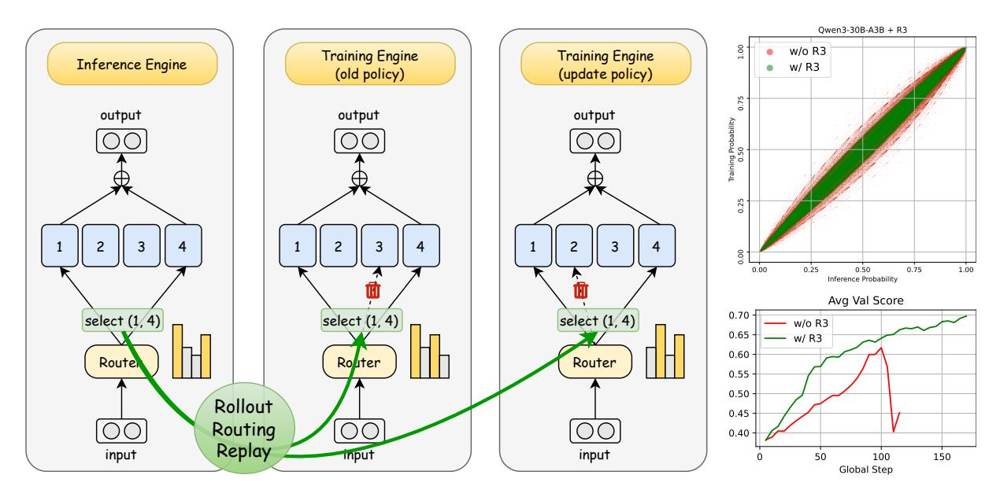
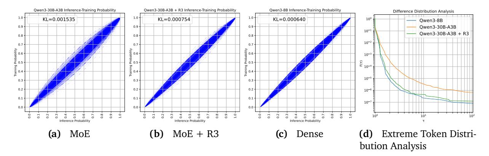
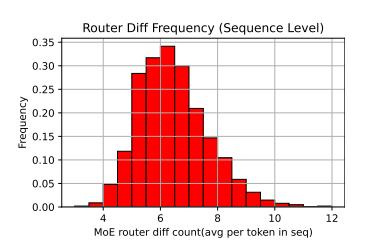
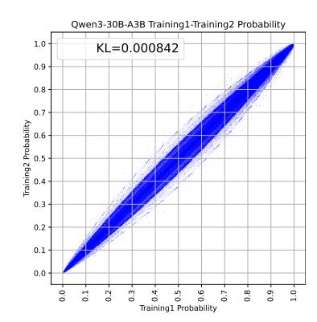
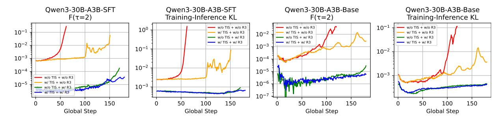
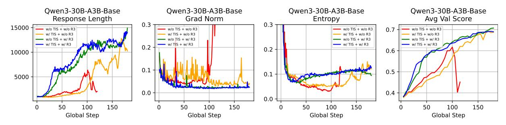

# **Stabilizing MoE Reinforcement Learning by Aligning Training and Inference Routers**

Wenhan Ma†‡∗ Hailin Zhang‡ Liang Zhao‡ Yifan Song†‡ Yudong Wang†‡ Zhifang Sui†⋄ Fuli Luo⋄

†State Key Laboratory of Multimedia Information Processing, School of Computer Science, Peking University ‡LLM-Core Xiaomi

# **Abstract**

Reinforcement learning (RL) has emerged as a crucial approach for enhancing the capabilities of large language models. However, in Mixture-of-Experts (MoE) models, the routing mechanism often introduces instability, even leading to catastrophic RL training collapse. We analyze the training-inference consistency of MoE models and identify a notable discrepancy in routing behaviors between the two phases. Moreover, even under identical conditions, the routing framework can yield divergent expert selections across repeated forward passes. To address this foundational inconsistency, we propose **Rollout Routing Replay (R3)**, a method that records routing distributions from the inference engine and replays them during training. R3 significantly reduces training-inference policy KL divergence and mitigates extreme discrepancies without compromising training speed. Extensive experiments on various settings confirm that R3 succeeds in stabilizing RL training, preventing collapse and outperforming methods such as GSPO and TIS. We believe this work can offer a new solution for stabilizing RL in MoE models.

# **1 Introduction**

Reinforcement learning (RL) has become a cornerstone in the post-training of large language models (LLMs) [\(Guo et al., 2025;](#page-10-0) [OpenAI, 2024;](#page-11-0) [Ouyang et al., 2022\)](#page-11-1). By leveraging large-scale RL, LLMs acquire the advanced capabilities necessary to tackle complex problems, including competition-level mathematics [\(Guo et al., 2025\)](#page-10-0) and practical code agent tasks [\(Luo et al.,](#page-11-2) [2025a\)](#page-11-2), through more profound and extended reasoning.

A critical challenge in LLM-based RL is balancing efficiency and stability, with the latter being essential for reliable performance. Modern RL frameworks typically employ distinct engines for inference and training phases (e.g., SGLang [\(Zheng et al., 2024\)](#page-13-0) for rollout and Megatron [\(Shoeybi](#page-11-3) [et al., 2019\)](#page-11-3) for training). This architectural separation can lead to divergent token probabilities, potentially causing catastrophic RL collapse [\(He and Lab, 2025\)](#page-10-1). To mitigate this discrepancy, [Yao](#page-12-0) [et al.](#page-12-0) [\(2025\)](#page-12-0) incorporate importance sampling mechanism in policy updating, while [He and Lab](#page-10-1) [\(2025\)](#page-10-1) introduce specialized compute kernels to reduce nondeterminism during LLM Inference. However, in practice, existing approaches do not fully resolve the intensified off-policy issue that arises during RL training on Mixture-of-Experts (MoE) models.

In this work, we identify the routing distribution as a pivotal factor contributing to the instability

∗Work done during internship at Xiaomi Corporation.

⋄Co-corresponding authors.

**Figure 1** Left: Illustration of the Rollout Routing Replay (R3). Top right: Training and inference discrepancies before and after applying R3. Bottom right: Reinforcement learning training performance before and after applying R3.

of MoE RL. Within MoE models, the router dynamically selects and activates a subset of experts for each input token. The varied routing decisions result in greater policy discrepancies between training and inference in MoE models compared to their dense counterparts. Rather than resorting to workarounds such as discarding data with large discrepancies (Zhao et al., 2025a), we propose to tackle this instability by addressing its root cause: the routing distribution itself.

Specifically, we propose **Rollout Routing Replay (R3)**, a simple yet effective method for stabilizing RL training of MoE models. R3 works by capturing the routing distributions from the inference engine during sequence generation and replaying them directly into the training engine. This process significantly narrows the gap between training and inference, marked by a substantial reduction in KL divergence of logits produced by the different engines. As a result, the number of tokens with significant probability discrepancies between the two phases is reduced by approximately an order of magnitude.

On realistic RLVR tasks with MoE models, R3 demonstrates significant superiority in training stability, and performance. Our method consistently shows marked improvements in both efficiency and overall performance when compared against existing approaches designed to stabilize RL training. Furthermore, its applicability to both on-policy and mini-batch style off-policy RL scenarios underscores the robustness of our approach.

#### Our main contributions are as follows:

- 1. We systematically identify and analyze routing distribution discrepancies between training and inference in MoE models, highlighting their role in training instability.
- 2. We proposed Rollout Routing Replay, which reuses inference-time routing distributions inside the training engine to align routing behavior between training and inference.
- 3. We apply R3 in multiple RL settings (multi-/single-mini-step and Base/SFT models) for MoE reinforcement learning and show that R3 outperforms GSPO and TIS in terms of stability and overall performance.

#### 2 Preliminaries

**Notation** We consider an autoregressive language model, parameterized by  $\theta$ , represented as a policy  $\pi_{\theta}$  that generates a response y from a query  $x \in \mathcal{D}$ . The likelihood of the sequence is given by the factorization  $\pi_{\theta}(y|x) = \prod_{t=1}^{|y|} \pi_{\theta}(y_t|x, y_{< t})$ , where |y| is the sequence length.  $\pi_{\text{infer}}$  and  $\pi_{\text{train}}$  denote the policy as it operates within the inference and training engines, respectively.

**Proximal Policy Optimization (PPO)** (Schulman et al., 2017) is a cornerstone algorithm for policy optimization in reinforcement learning. For a given query x, PPO updates the policy  $\pi_{\theta}$  by maximizing:

$$\mathcal{J}_{PPO}(\theta) = \mathbb{E}_{x \sim \mathcal{D}, y \sim \pi_{infer}(\theta_{old})(\cdot|x)} \left[ \frac{1}{|y|} \sum_{t=1}^{|y|} \min \left( w_t(\theta) \hat{A}_t, \text{clip}(w_t(\theta), 1 - \varepsilon, 1 + \varepsilon) \hat{A}_t \right) \right]. \tag{1}$$

The importance sampling ratio  $w_t(\theta)$  for token  $y_t$  in sequence y is defined as:

$$w_t(\theta) = \frac{\pi_{\text{train}}(\theta)(y_t|x, y_{< t})}{\pi_{\text{train}}(\theta_{\text{old}})(y_t|x, y_{< t})}.$$

The advantage  $\hat{A}_t$  for token  $y_t$  is typically estimated by a separate value model, and  $\varepsilon$  is the clipping range for the importance ratio. For brevity, we omit the KL regularization term.

A critical inconsistency arises from the common practice of using separate engines for rollout and training, where data is sampled via an inference policy ( $\pi_{infer}$ ) but the loss is computed using a training policy ( $\pi_{train}$ ), as shown in Equation 1. This policy mismatch drives training instability in reinforcement learning, an issue that, within MoE models, we identify as stemming primarily from router inconsistency. The proposed solution alleviates this fundamental issue, making it broadly applicable, orthogonal to, and compatible with recent policy optimization frameworks like GRPO (Shao et al., 2024), GSPO (Zheng et al., 2025) and DAPO (Yu et al., 2025).

# 3 Training-Inference Discrepancies

Training-inference discrepancies in RL frameworks frequently lead to unstable training and model collapse. In this section, we demonstrate that this policy mismatch is significantly amplified in MoE models, primarily stemming from inconsistent routing distributions Furthermore, we observe that even multiple runs of the same training framework can produce divergent token probabilities, further contributing to RL training instability.

#### 3.1 Policy Discrepancies between Training and Inference in MoE Models

Here we employ an MoE model, Qwen3-30B-A3B (Yang et al., 2025), for our experiments to analyze the policy discrepancy between the training and inference engines. First, we use the SGLang inference engine to generate responses for 2,048 mathematics problems, saving the token probabilities for each generated token. This process yields about 20 million response tokens. Then these responses are passed through Megatron to obtain the corresponding probabilities assigned by the training engine. We use several metrics to quantify the divergence between these two probability distributions.

**KL Divergence Estimation** Let T be the set of all response tokens, we use the  $k_3$  method proposed in Schulman (2020) to estimate the KL-divergence between the training and inference probability

**Figure 2** (a): Illustration of the training-inference discrepancy in the MoE model. (b): Illustration of the training-inference discrepancy in the MoE+R3 model. (c): Illustration of the training-inference discrepancy in the Dense model. (d): Extreme Token Distribution Function, calculated based on Equation 3.

distributions:

$$\mathcal{D}_{\text{KL}}(\pi_{\text{train}}(\theta)||\pi_{\text{infer}}(\theta)) \approx \frac{1}{|T|} \sum_{t \in T} \left[ \frac{\pi_{\text{train}}(\theta)(t)}{\pi_{\text{infer}}(\theta)(t)} - 1 - \log \frac{\pi_{\text{train}}(\theta)(t)}{\pi_{\text{infer}}(\theta)(t)} \right]. \tag{2}$$

Our calculations show that the estimated KL divergence of Qwen3-30B-A3B (MoE) is  $1.535 \times 10^{-3}$ , while that of Qwen3-8B (Dense baseline) is  $6.4 \times 10^{-4}$ .

**Visualization** To visualize the training-inference discrepancies of the MoE model, we randomly sample 10 million response tokens and plot a scatter diagram with SGLang probabilities on the x-axis and Megatron probabilities on the y-axis. The degree of concentration around the y = x line indicates the degree of consistency. As shown in Figure 2a and 2c, compared to Qwen3-8B, Qwen3-30B-A3B exhibits a much wider scatter band, revealing a larger training-inference discrepancy.

**Extreme Token Distribution Analysis** To quantify the discrepancy between the model's behavior during training and inference, we introduce the Extreme Token Distribution Function,  $F(\tau)$ , defined as:

$$F(\tau) = \frac{1}{|T|} \sum_{t \in T} \mathbf{I} \left[ \max \left( \frac{\pi_{\text{train}}(\theta)(t)}{\pi_{\text{infer}}(\theta)(t)}, \frac{\pi_{\text{infer}}(\theta)(t)}{\pi_{\text{train}}(\theta)(t)} \right) > \tau \right]. \tag{3}$$

This function measures the proportion of *extreme tokens*—those for which the probability ratio between the training distribution  $\pi_{\text{train}}(\theta)$  and the inference distribution  $\pi_{\text{infer}}(\theta)$  surpasses a threshold  $\tau$ . Figure 2d plots this function  $F(\tau)$  against the threshold  $\tau$ . The plot reveals that for  $\tau > 2$ , the Qwen3-30B-A3B model exhibits a fraction of extreme tokens an order of magnitude larger than that of the Qwen3-8B model. This significant gap indicates a substantially higher degree of training-inference variability in the MoE model.

#### 3.2 Routing Discrepancies between Training and Inference in MoE Models

From the perspective of functional continuity, the key difference between MoE and Dense models lies in the non-continuity introduced by routing. In MoE models, small perturbations in the router input can lead to entirely different experts being selected, causing large changes in layer outputs. Dense models, lacking an explicit expert selection process, do not exhibit this phenomenon.

(b) Token-level Difference

**(c)** Sequence-level Difference

Figure 3 Router discrepancy analysis

Based on this, we further analyze router distribution discrepancies between training and inference in MoE models. We use SGLang (Zheng et al., 2024) to generate responses for 2048 mathematical problems with Qwen3-30B-A3B (Yang et al., 2025). For each response, we collect the routing distribution of all tokens (including input tokens) from the inference engine. Then, we feed these sequences into the Megatron engine for forward propagation. This process yields the routing distribution observed from training engine. We compare these two sets of routing information at different levels:

**Router-level Comparison**: For each token and each MoE layer, we count the number of differing expert choices made by the MoE Router and calculate the frequency of these differences. Figure 3a illustrates the results. It is observed that approximately 10% of the routers select different experts during training compared to inference.

**Token-level Comparison**: For each token, we count the number of differing expert choices made by the MoE Router across all layers. We also determine the frequency of these occurrences. Figure 3b presents these findings. It shows that 94% of tokens select a different expert in at least one layer during the forward pass.

**Sequence-level Comparison**: For a sequence, we compute the router distribution difference of each token, then average over tokens to obtain the mean difference per sequence and plot a histogram 3c. Results show that the mean difference per token is approximately 6 routers.

These findings demonstrate that during training and inference, MoE models exhibit router distribution discrepancies. In 4 we will show empirically that routing discrepancies is the main contributor to the additional training-inference discrepancies of MoE compared to Dense models.

**Figure 4** Probabilities obtained by performing forward propagation twice using the Megatron

# 3.3 Variation in Repeated Forward Passes of the Same Sequence within the Same Framework

We conduct two forward passes of the same sequence set under the Megatron framework and obtain two probability distributions. Following the procedure in Section 3.1, we compute the KL divergence between these distributions and plot the results (scatter plot shown in Figure 4, KL divergence =  $8.4 \times 10^{(-4)}$ ).

The results show that, for MoE models in the Megatron engine, even when the input sequence is identical, the final output probabilities from two forward passes may differ. In a reinforcement

learning setting, this variation adds noise to the computation of the old policy train(old). Such noise makes the importance sampling ratio unreliable, which can destabilize and even break the reinforcement learning process.

# **4 Rollout Routing Replay**

This section provides a detailed description of the implementation of Rollout Routing Replay (R3), its caching support in multi-turn dialogue, and an analysis of its effects on training-inference discrepancies.

#### **4.1 Implementation**

We first describe the conventional forward pass of a MoE layer within a training framework. Consider a sequence at the -th token and the MoE layer in the -th Transformer block. Let the input to this layer during training be **x**train. The router logits are calculated by:

$$\mathbf{s}_{\text{train}} = \mathbf{x}_{\text{train}} \mathbf{W}_r, \tag{4}$$

where **W** denotes the router's linear weight matrix. Let the number of experts be and the number of experts to select be . During training, the router selects the top- experts based on the logits. This is represented by a binary mask:

$$\mathbf{I}_{\text{train}} = \text{TopKMask}(\mathbf{s}_{\text{train}}, K), \tag{5}$$

where **I**train ∈ {0, 1} and Í train, = . The gating weights are then produced by applying a softmax over the logits of the selected experts:

$$g_{\text{train},i} = \frac{I_{\text{train},i} \exp(s_{\text{train},i})}{\sum_{j=1}^{M} I_{\text{train},j} \exp(s_{\text{train},j})} \quad \text{for } i = 1, \dots, M.$$
 (6)

Finally, the MoE layer's output is computed as a weighted sum of the expert outputs:

$$\mathbf{y}_{\text{train}} = \sum_{i=1}^{M} g_{\text{train},i} \, \mathcal{E}_i(\mathbf{x}_{\text{train}}), \tag{7}$$

where E(·) represents the -th expert network.

Now we introduce the Rollout Routing Replay. Assume that during the inference stage, the input to the MoE layer is **x**infer. The router then computes the inference logits **s**infer = **x**infer**W** , from which the routing mask **I**infer = TopKMask(**s**infer, ) is obtained. The main idea of Rollout Routing Replay is to reuse the inference routing mask **I**infer during the training forward pass while still applying the softmax to the training logits to preserve gradient flow. Specifically, along this replay path, the "replay" gating weights replay are computed as:

$$g_{\text{replay},i} = \frac{I_{\text{infer},i} \exp(s_{\text{train},i})}{\sum_{j=1}^{M} I_{\text{infer},j} \exp(s_{\text{train},j})} \quad \text{for } i = 1, \dots, M.$$
 (8)

These replay weights are then used to combine the training experts' outputs, producing the replay output **y**replay:

$$\mathbf{y}_{\text{replay}} = \sum_{i=1}^{M} g_{\text{replay},i} \, \mathcal{E}_i(\mathbf{x}_{\text{train}}). \tag{9}$$

This design serves two main purposes: (a) **Aligning training and inference:** Using **I**infer ensures that the experts used during training replay match those selected during inference, eliminating mismatch in expert selection. (b) **Preserving the gradient data flow:** By replaying only the mask, the gradients can still flow back to the logits without interfering with the computation graph, which helps to optimize the router effectively.

#### **4.2 Router Mask Caching and Multi-Turn Dialogue Support**

Many inference engines use a KVCache prefix caching strategy [\(Kwon et al., 2023;](#page-11-7) [Zheng et al.,](#page-13-0) [2024\)](#page-13-0) to prevent redundant prefill computations on previously seen context, which significantly reduces the total computation in multiple-turn interactions. We observe that the cached router masks share a similar property: for the same prefix tokens, the MoE router should yield identical results. Therefore, routing masks from inference engines **I**infer can be cached along with the prefix KVcache. Concretely, for each layer and token prefix, the corresponding routing masks are stored with KVCache. When the same prefix occurs and hits the cache, the masks can be reused, eliminating the need for recomputation. This allows Rollout Routing Replay to integrate seamlessly with prefix caching mechanisms.

Caching routing masks is especially beneficial in agent scenarios. Many agent tasks, like software engineering [\(Jimenez et al., 2024\)](#page-11-8) and web browsing [\(Wei et al., 2025\)](#page-12-5), involve multiple turns of interactions between autoregressive generation and tool calling. To improve efficiency, these processes directly reuse the KVCache from previous turns, so they do not have to regenerate data that's already been computed. Routing mask caching enables R3 to remain efficient in RL agent tasks without re-prefilling to generate the routing masks, which is crucial for training large-scale, advanced MoE models.

#### **4.3 Empirical Analysis of R3 on Training-Inference Discrepancies**

To evaluate the effectiveness of R3 in reducing training-inference discrepancies, we repeat the procedure described in Section [3.1](#page-2-1) with Qwen3-30B-A3B model. In this process, we cache the routing distributions obtained during inference on SGLang and replay them within the Megatron framework. After obtaining the inference engine probability and training engine probability, using the equation [2,](#page-3-2) we estimate the KL divergence between training and inference. Results shows that after applying R3, the KL divergence between training and inference decrease from 1.5 × 10−3 to 7.5 × 10−4 , which is near the 6.4 × 10−4 observed for the dense model. This intuitively indicates a reduction in the training-inference discrepancy. We also drew the cumulative distribution plot of the ratio of training-inference discrepancies in Fig. [2d](#page-3-1) with R3. The plot indicates that, for the MoE model, applying R3 reduces by an order of magnitude the frequency of tokens with large training-inference discrepancies.

# **5 Experiments**

In this section, we evaluate the performance improvement of our R3 method for reinforcement learning and compare it with other baseline methods.

#### **5.1 Setting**

**Task and Dataset** We choose mathematical reasoning as the target task for training. For the training dataset, we collect and filter problems from many open-source datasets, including BigMath [\(Albalak et al., 2025\)](#page-10-2), ORZ [\(Hu et al., 2025\)](#page-10-3), and others, yielding approximately

| Best Metric(Best Global Step)                        |            |            |            |                |            |            |
|------------------------------------------------------|------------|------------|------------|----------------|------------|------------|
| Method                                               | AIME24(↑)  | AIME25(↑)  | AMC23(↑)   | MATH500 Lv5(↑) | Avg(↑)     | Crash Step |
| Qwen3-30B-A3B-SFT, mini_step=8, max_global_step=180  |            |            |            |                |            |            |
| GRPO                                                 | 32.81(65)  | 20.73(90)  | 74.84(60)  | 71.83(100)     | 48.84(100) | 120        |
| GSPO                                                 | 55.52(165) | 38.23(160) | 90.16(125) | 86.38(125)     | 66.76(125) | -          |
| GRPO+R3                                              | 57.92(180) | 38.02(155) | 90.16(155) | 88.62(170)     | 68.05(180) | -          |
| GSPO+R3                                              | 58.44(160) | 39.17(160) | 92.50(165) | 87.87(165)     | 69.00(165) | -          |
| Qwen3-30B-A3B-SFT, mini_step=1, max_global_step=180  |            |            |            |                |            |            |
| GRPO                                                 | 49.06(45)  | 32.08(50)  | 86.41(55)  | 83.77(55)      | 62.23(55)  | 60         |
| GRPO+TIS                                             | 54.90(85)  | 36.67(90)  | 88.59(90)  | 85.63(85)      | 66.24(90)  | 105        |
| GRPO+R3                                              | 62.92(165) | 41.98(170) | 93.91(165) | 89.93(155)     | 71.83(165) | -          |
| GRPO+TIS+R3                                          | 58.75(180) | 41.15(180) | 91.87(175) | 88.99(180)     | 70.14(175) | -          |
| Qwen3-30B-A3B-Base, mini_step=1, max_global_step=180 |            |            |            |                |            |            |
| GRPO                                                 | 50.63(100) | 32.60(100) | 83.13(100) | 80.78(90)      | 61.69(100) | 105        |
| GRPO+TIS                                             | 56.77(170) | 40.10(170) | 92.50(165) | 89.37(180)     | 69.22(170) | -          |
| GRPO+R3                                              | 60.94(180) | 41.35(180) | 92.81(175) | 89.74(175)     | 70.73(180) | -          |
| GRPO+TIS+R3                                          | 56.67(170) | 40.42(170) | 93.12(175) | 88.99(165)     | 69.17(175) | -          |

**Table 1** Main evaluation results. This table presents the best scores (with corresponding global step in parentheses) achieved by various methods on evaluation benchmarks under three training configurations . The table also reports the average score (Avg) and the step at which training collapse occurred (Crash Step).

100,000 verifiable math problems. For the evaluation dataset, we adopt AIME24, AIME25, AMC23, and MATH500 (level 5) as our benchmark datasets. We report Avg@32 for AIME24 and AIME25, Avg@16 for AMC23, and Avg@4 for MATH500 (level 5). During training, some models may experience performance degradation or even collapse in later stages. To ensure a fair evaluation, we measure model performance every 5 global steps throughout a single training run. We then report the highest observed performance along with the corresponding training step at which it occurs.

**Models** We select two models for our experiments: (a) Qwen3-30B-A3B-Base [\(Yang et al.,](#page-12-4) [2025\)](#page-12-4) (b) Qwen3-30B-A3B-SFT, which is fine-tuned from Qwen3-30B-A3B-Base on our general instruction-following dataset.

**Baseline Methods** We consider the following baseline optimization methods for comparison: (a) **GRPO** [\(Shao et al., 2024\)](#page-11-5), additionally applies the *Clip Higher* technique from DAPO [\(Yu et al.,](#page-12-3) [2025\)](#page-12-3), with parameters low = 0.2 and high = 0.27; (b) **TIS** [\(Yao et al., 2025\)](#page-12-0), uses an upper clipping threshold = 2; (c) **GSPO** [\(Zheng et al., 2025\)](#page-12-2), employs sequence-level importance sampling, with parameters low = 3×10−4 and high = 4×10−4 . Since our R3 method is orthogonal to optimizers such as GSPO or TIS, we also evaluate various combinations of these techniques.

**Multiple Mini Steps vs. Single Mini Step** In PPO-like algorithms, a batch of samples collected in one global step is typically divided into multiple mini steps so that the policy can be updated several times. However, previous research has shown that applying a strictly on-policy strategy with only a single mini step can yield better performance. We investigate both settings. For multiple mini steps, we set the mini step count to 8, meaning each PPO mini step trains 2048/8 = 256 samples with 8 optimizer updates and a learning rate of 1 × 10−6 . In the multiple mini-step scenario, for R3 method we replayed the routing both when recomputing the old policy and updating policy. For the single mini step scenario, we set the mini step count to 1, meaning all

**Figure 5** Analysis of training–inference collapse. The plot shows the estimated training–inference KL divergence and the extreme token distribution function ( = 2) (Eq. [3\)](#page-3-0) at each training step.

**Figure 6** Training dynamics of Qwen3-30B-A3B-Base, including response length, gradient norm, entropy, and average validation score throughout the training process

2048 samples are updated once. Due to fewer updates, we increase the learning rate to 3 × 10−6 . We don't recompute old policy in this scenario.

**Other Setting** We implement R3 using the VeRL [\(Sheng et al., 2024\)](#page-11-9) framework, use Megatron [\(Shoeybi et al., 2019\)](#page-11-3) for training, and SGLang [\(Zheng et al., 2024\)](#page-13-0) for inference. We set the batch size to 256 and = 8, totaling 2048 samples per round. The maximum prompt length is 2048, and the maximum generation length is 30720. We adopt the Dynamic Sampling strategy from [Yu et al.](#page-12-3) [\(2025\)](#page-12-3), retaining only partially correct samples during generation until a sufficient batch size is accumulated for training. No auxiliary loss for expert balancing is introduced.

#### **5.2 Experimental Results and Analysis**

The main evaluation results are shown in Table [1.](#page-7-0) More detailed evaluation results and training logs, including per-evaluation scores as well as training metrics such as entropy, average reward, gradient norm, and training-inference KL divergence, are provided in the appendix [A](#page-14-0) and [B](#page-14-1)

**Overall Performance.** R3 achieves better results across different scenarios. In the multi mini-step setting, GRPO+R3 outperforms GSPO by 1.29. Furthermore, combining R3 with GSPO further improves performance by 0.95 points. In the single mini-step setting, R3 outperforms TIS by 5.58 on SFT model and 1.51 on base model. However, combining R3 with TIS does not yield clear gains and may even degrade performance; for instance, in the single mini-step on SFT model, TIS+R3 scores 1.69 points lower than R3 alone. Since R3 already significantly reduces the policy discrepancy between training and inference, the additional correction from TIS offers negligible benefit [\(Yao et al., 2025\)](#page-12-0).

**Training Stability.** In the single mini-step setting, three reinforcement learning processes without R3 collapsed during training. To investigate the causes of these collapses, we plotted the estimated training–inference KL divergence and the extreme token distribution function ( = 2) (eq. [3\)](#page-3-0) at each training step(see Fig. [5\)](#page-8-0). We observed that, in each training process, both the KL divergence and ( = 2) values increased over training process. Moreover, collapsed training runs were almost always accompanied by abnormally high KL and ( = 2) values. For instance, in the SFT model trained using GRPO under the single mini-step setting, after 60 global steps, the value of ( = 2) exceeded 0.1. This indicates that for 10% of the tokens, the probability under the training framework differed from that under the inference framework by more than a factor of 2, demonstrating severe training–inference inconsistency. In contrast, for the majority of the time during training processes using R3, the value of ( = 2) remained below 10−4 . By aligning the training and inference distributions, R3 effectively stabilized reinforcement learning for MoE models.

**Optimization and Generation Behavior.** During training, R3 also enhances optimization stability, exploration behavior, and generation dynamics. We plotted the sequence length, gradient norm, generation entropy, and evaluation score throughout training for the single mini-step + base model group (see Fig. [6\)](#page-8-1). It shows that R3 has smaller gradient norms, a smoother sequence growth pattern, and more stable entropy. (a) **Sequence Length:** With R3, the generated sequence length rises rapidly at the beginning of training, indicating that R3 can quickly capture the correct optimization direction. By contrast, the other two training processes increase only slowly after step 80 and show more pronounced fluctuations. (b) **Gradient Norm:** R3 maintains consistently lower gradient norms, indicating a more stable optimization process. (c) **Generation Entropy:** With R3, entropy begins to increase steadily after about 25 step, suggesting that the model starts exploring better strategies earlier. Without R3, entropy increases much later and fluctuates heavily.

# **6 Related Works**

# **6.1 Mixture of Experts**

The Mixture-of-Experts (MoE) architecture, originating as an ensemble method to route inputs to specialized subnetworks [\(Jacobs et al., 1991;](#page-10-4) [Jordan and Jacobs, 1994\)](#page-11-10), has become a cornerstone for scaling modern language models. By employing a gating network to sparsely activate only a subset of expert parameters per token, MoE decouples a model's total parameter count from its inference cost, enabling a substantial increase in model capacity. This computational efficiency has driven its adoption in state-of-the-art Transformer models [\(Jiang et al., 2024;](#page-11-11) [Liu et al., 2024;](#page-11-12) [Team et al., 2025;](#page-12-6) [Yang et al., 2025\)](#page-12-4). However, MoE models are susceptible to training instability stemming from the sensitivity of the gating network [\(Dai et al., 2022;](#page-10-5) [Thérien et al., 2025\)](#page-12-7), which renders router robustness a central challenge for effective model convergence.

#### **6.2 Instability in Reinforcement Learning for LLMs**

Reinforcement Learning with verifiable rewards (RLVR) has become a standard method for refining the complex reasoning [\(Xie et al., 2025\)](#page-12-8), mathematical [\(Hu et al., 2025;](#page-10-3) [Shao et al., 2024\)](#page-11-5), and code abilities [\(Luo et al., 2025b\)](#page-11-13) of large language models. Algorithms such as GRPO [\(Shao et al.,](#page-11-5) [2024\)](#page-11-5) and DAPO [\(Yu et al., 2025\)](#page-12-3) are now widely adopted. However, this training paradigm also faces challenges with training instability, which can hinder convergence and risk model collapse [\(Chen et al., 2025;](#page-10-6) [Xia et al., 2025;](#page-12-9) [Yang et al., 2025\)](#page-12-4). Recent research has identified several root causes and proposed corresponding solutions. For instance, [Zhao et al.](#page-12-10) [\(2025b\)](#page-12-10) aim to stabilize training by optimizing the geometric mean of token-level rewards. Separately, [Zheng](#page-12-2) [et al.](#page-12-2) [\(2025\)](#page-12-2) posit that GRPO's instability stems from a misapplication of importance sampling weights and introduce a new sequence-level importance ratio to correct it.

[Yao et al.](#page-12-0) [\(2025\)](#page-12-0) propose Truncated Importance Sampling (TIS) to mitigate the inconsistency stemming from discrepancies between training frameworks (e.g., FSDP [\(Zhao et al., 2023\)](#page-12-11) and inference engines (e.g., vLLM [\(Kwon et al., 2023\)](#page-11-7)). Alternatively, [He and Lab](#page-10-1) [\(2025\)](#page-10-1) attribute instability to non-determinism in compute kernels, proposing batch-invariant operations, though this incurs significant performance overhead and has not been explored for RL on MoE models. These stability challenges are critically exacerbated in Mixture-of-Experts (MoE) architectures. We find this heightened instability is primarily caused by routing inconsistencies: the router's sensitivity, combined with the framework gap, causes expert assignments for the same response to differ between the rollout and training phases. To directly address this core issue, our proposed method, Rollout Routing Replay, explicitly records and replays the inference-time routing decisions during the training pass. This simple strategy enforces consistency, enabling MoE models to achieve training stability comparable to their dense counterparts without incurring computational overhead.

# **7 Conclusion**

In this work, we identify training-inference routing discrepancies as the primary source of instability in MoE reinforcement learning. To address this, we propose Rollout Routing Replay (R3), which reuses inference-time routing distributions during training to align expert selection while preserving gradient flow. Experiments across multiple RL settings demonstrate that R3 substantially reduces training-inference divergence, stabilizes training, and consistently outperforms existing methods. Our results demonstrate the importance of aligning training and inference in MoE models and show that R3 provides a practical solution for improving stability.

# **References**

- A. Albalak, D. Phung, N. Lile, R. Rafailov, K. Gandhi, L. Castricato, A. Singh, C. Blagden, V. Xiang, D. Mahan, and N. Haber. Big-math: A large-scale, high-quality math dataset for reinforcement learning in language models, 2025. URL <https://arxiv.org/abs/2502.17387>.
- A. Chen, A. Li, B. Gong, B. Jiang, B. Fei, B. Yang, B. Shan, C. Yu, C. Wang, C. Zhu, et al. Minimax-m1: Scaling test-time compute efficiently with lightning attention. arXiv preprint arXiv:2506.13585, 2025.
- D. Dai, L. Dong, S. Ma, B. Zheng, Z. Sui, B. Chang, and F. Wei. Stablemoe: Stable routing strategy for mixture of experts. arXiv preprint arXiv:2204.08396, 2022.
- D. Guo, D. Yang, H. Zhang, J. Song, R. Zhang, R. Xu, Q. Zhu, S. Ma, P. Wang, X. Bi, et al. Deepseek-r1: Incentivizing reasoning capability in llms via reinforcement learning. arXiv preprint arXiv:2501.12948, 2025.
- H. He and T. M. Lab. Defeating nondeterminism in llm inference. Thinking Machines Lab: Connectionism, 2025. doi: 1 0 . 6 4 4 3 4 / t m l . 2 0 2 5 0 9 1 0. https://thinkingmachines.ai/blog/defeating-nondeterminism-in-llm-inference/.
- J. Hu, Y. Zhang, Q. Han, D. Jiang, X. Zhang, and H.-Y. Shum. Open-reasoner-zero: An open source approach to scaling up reinforcement learning on the base model, 2025. URL [https:](https://arxiv.org/abs/2503.24290) [//arxiv.org/abs/2503.24290](https://arxiv.org/abs/2503.24290).
- R. A. Jacobs, M. I. Jordan, S. J. Nowlan, and G. E. Hinton. Adaptive mixtures of local experts. Neural computation, 3(1):79–87, 1991.