# The Art of Scaling Reinforcement Learning Compute for LLMs

Devvrit Khatri2,∗,† , Lovish Madaan1,3,∗ , Rishabh Tiwari4† , Rachit Bansal5† , Sai Surya Duvvuri2† , Manzil Zaheer1† , Inderjit S. Dhillon2 , David Brandfonbrener1 , Rishabh Agarwal6,†

Reinforcement learning (RL) has become central to training large language models (LLMs), yet the field lacks predictive scaling methodologies comparable to those established for pre-training. Despite rapidly rising compute budgets, there is no principled understanding of how to evaluate algorithmic improvements for scaling RL compute. We present the first large-scale systematic study, amounting to more than 400,000 GPU-hours, that defines a principled framework for analyzing and predicting RL scaling in LLMs. We fit sigmoidal compute-performance curves for RL training and ablate a wide range of common design choices to analyze their effects on asymptotic performance and compute efficiency. We observe: (1) Not all recipes yield similar asymptotic performance, (2) Details such as loss aggregation, normalization, curriculum, and off-policy algorithm primarily modulate compute efficiency without materially shifting the asymptote, and (3) Stable, scalable recipes follow predictable scaling trajectories, enabling extrapolation from smaller-scale runs. Combining these insights, we propose a best-practice recipe, ScaleRL, and demonstrate its effectiveness by successfully scaling and predicting validation performance on a single RL run scaled up to 100,000 GPU-hours. Our work provides both a scientific framework for analyzing scaling in RL and a practical recipe that brings RL training closer to the predictability long achieved in pre-training.

Correspondence: [{lovish, brandfon}@meta.com](mailto:\{lovish, brandfon\}@meta.com), [{devvrit.03, rishabhagarwal.467}@gmail.com](mailto:\{devvrit.03, rishabhagarwal.467\}@gmail.com)

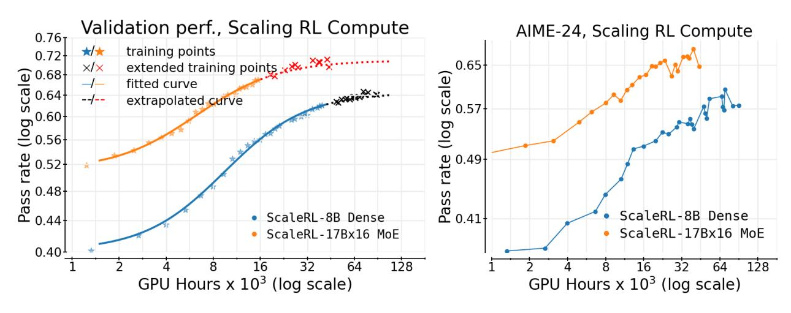

Figure 1 Predicatably Scaling RL compute to 100,000 GPU Hours (a) We run ScaleRL for 100k GPU hours on an 8B dense model, and 50k GPU hours on a 17Bx16 MoE (Scout). We fit a sigmoid curve [\(Equation \(1\)\)](#page-1-0) on pass rate (mean@16) on iid validation dataset up to 50k (and 16k) GPU hours and extrapolate to 100k (and 45k) on the 8B (Scout MoE) models respectively. We trained for 7400 steps for 8B and 7100 steps for Scout, which is 3.5× larger than ProRL [\(Liu](#page-14-0) [et al.,](#page-14-0) [2025a\)](#page-14-0). The extrapolated curve (× markers) closely follows extended training, demonstrating both stability at large compute and predictive fits–establishing ScaleRL as a reliable candidate for RL scaling. (b) Downstream evaluation on AIME-24 shows a consistent scaling trend for ScaleRL, thus generalizing beyond the training data distribution. Moreover, scaling model size substantially improves the downstream and asymptotic RL performance.

1Meta, 2UT Austin, 3UCL, 4UC Berkeley, 5Harvard University, 6Periodic Labs

∗Equal contribution, †Work done at Meta

## 1 Introduction

Scaling reinforcement learning (RL) compute is emerging as a critical paradigm for advancing large language models (LLMs). While pre-training establishes the foundations of a model; the subsequent phase of RL training unlocks many of today's most important LLM capabilities, from test-time thinking [\(OpenAI,](#page-14-1) [2024;](#page-14-1) [Guo et al.,](#page-13-0) [2025\)](#page-13-0) to agentic capabilities [\(Kimi Team et al.,](#page-13-1) [2025a\)](#page-13-1). For instance, Deepseek-R1-Zero used 100,000 H800 GPU hours for RL training – 3.75% of its pre-training compute [\(Guo et al.,](#page-13-0) [2025\)](#page-13-0). This dramatic increase in RL compute is amplified across frontier LLM generations, with more than 10× increase from o1 to o3 [\(OpenAI,](#page-14-2) [2025\)](#page-14-2) and a similar leap from Grok-3 to Grok-4 [\(xAI Team,](#page-15-0) [2025\)](#page-15-0).

While RL compute for LLMs has scaled massively, our understanding of how to scale RL has not kept pace; the methodology remains more art than science. Recent breakthroughs in RL are largely driven by isolated studies on novel algorithms (e.g., [Yu et al.](#page-15-1) (DAPO, [2025\)](#page-15-1)) and model-specific training reports, such as, [MiniMax et al.](#page-14-3) [\(2025\)](#page-14-3) and Magistral [\(Rastogi et al.,](#page-14-4) [2025\)](#page-14-4). Critically, these studies provide ad-hoc solutions tailored to specific contexts, but not how to develop RL methods that scale with compute. This lack of scaling methodology stifles research progress: with no reliable way to identify promising RL candidates a priori, progress is tied to large-scale experimentation that sidelines most of the academic community.

This work lays the groundwork for science of RL scaling by borrowing from the well-established concept of scaling laws from pre-training. While pre-training has converged to algorithmic recipes that scale predictably with compute [\(Kaplan et al.,](#page-13-2) [2020;](#page-13-2) [Hoffmann et al.,](#page-13-3) [2022;](#page-13-3) [Owen,](#page-14-5) [2024\)](#page-14-5), the RL landscape lacks a clear standard. As a result, RL practitioners face an overwhelming array of design choices, leaving the fundamental questions of how to scale and what to scale unanswered. To address these questions, we establish a predictive framework for RL performance using a sigmoid-like saturating curve between the expected reward (RC ) on an iid validation set and training compute (C):

$$Reward Gain Asymptotic Reward Gain$$

$$R_C - R_0 = (A - R_0) \times \frac{1}{(1 + (C_{\text{mid}}/C)^B)}$$
Compute Efficiency (fixed model and training data) (1)

where 0 ≤ A ≤ 1 represents the asymptotic pass rate, B > 0 is a scaling exponent that determines the compute efficiency, and Cmid sets the midpoint of the RL performance curve. A schematic interpretation of these parameters is provided in [Figure 3.](#page-4-0)

This framework in [Equation \(1\)](#page-1-0) allows researchers to extrapolate performance from lower-compute runs to higher compute budgets, enabling them to evaluate scalability of RL methods without incurring the compute cost of running every experiment to its computational limit.

Guided by this framework, we develop ScaleRL, an RL recipe that scales predictably with compute. In a massive 100,000 GPU-hours training run, we show that ScaleRL's performance closely matches the scaling curve predicted by our framework (Figure [1\)](#page-0-0). Critically, scaling curves extrapolated from only the initial stages of training closely match the final observed performance, confirming the predictive ability of our framework to extreme compute scales.

The design of ScaleRL is grounded in a comprehensive empirical study of RL scaling that spanned over 400,000 GPU-hours (on Nvidia GB200 GPUs). This study explored numerous design choices at an 8B model parameters scale, where individual runs use up to 16,000 GPU-hours, making them 6× cheaper than experimenting at our largest training run scale. This investigation yielded three key principles:

- RL Performance Ceilings are Not Universal: As we scale training compute for different methods, they encounter different ceilings on their achievable performance (A). This limit can be shifted by choices such as the loss type and batch size.
- Embracing the Bitter Lesson: Methods that appear superior at small compute budgets can be worse when extrapolated to large-compute regimes [\(Figure 2\)](#page-2-0). We can still identify scalable methods by estimating the scaling parameters (A, B) from the early training dynamics using our framework [\(Equation \(1\)\)](#page-1-0).

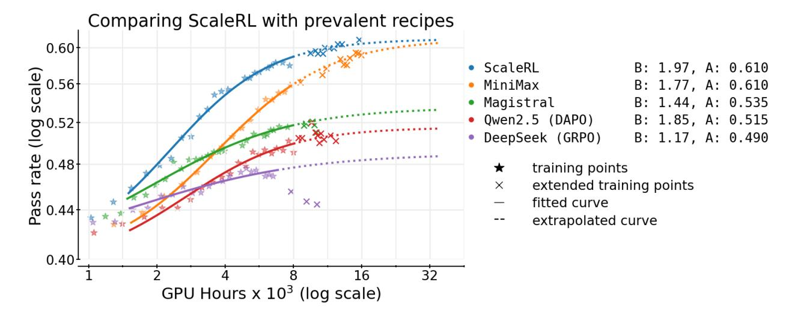

Figure 2 ScaleRL is more scalable than prevalent RL methods. We fit sigmoid curves (Equation [1\)](#page-1-0) on iid validation dataset to commonly-used training recipes like DeepSeek (GRPO) [\(Guo et al.,](#page-13-0) [2025\)](#page-13-0), Qwen-2.5 (DAPO) [\(Yu et al.,](#page-15-1) [2025\)](#page-15-1), Magistral [\(Rastogi et al.,](#page-14-4) [2025\)](#page-14-4), and Minimax-M1 [\(MiniMax et al.,](#page-14-3) [2025\)](#page-14-3), and compare them with ScaleRL. ScaleRL surpasses all other methods, achieving an asymptotic reward of A = 0.61. Stars denote evaluation points; solid curves show the fitted curve over the range used for fitting; dashed curves extrapolate beyond it. We validate the predictability by running each method for longer ("×" markers), which align closely with the extrapolated curves for stable recipes like ScaleRL and MiniMax. Further description of the individual recipes compared are given in Appendix [A.16.](#page-25-0)

• Re-evaluating Common Wisdom: Common interventions thought to improve peak performance (e.g., loss aggregation, data curriculum, length penalty, advantage normalization) mainly adjust compute efficiency (B), while not changing the performance ceiling considerably.

Based on these insights, ScaleRL achieves predictable scaling by integrating existing methods, rather than inventing novel methods. Specifically, ScaleRL combines asynchronous Pipeline-RL setup ([§3.1\)](#page-4-1), forced length interruptions, truncated importance sampling RL loss (CISPO), prompt-level loss averaging, batch-level advantage normalization, FP32 precision at logits, zero-variance filtering, and No-Positive-Resampling – with each component's contribution validated in a leave-one-out ablation, consuming 16,000 GPU-hours per run.

ScaleRL not only scales predictably but also establishes a new state-of-the-art [\(Figure 2\)](#page-2-0) – it achieves higher asymptotic performance and compute efficiency compared to established RL recipes. Moreover, ScaleRL maintains predictable scaling when increasing compute across multiple training axes (§ [5\)](#page-8-0) – including 2.5× larger batch sizes, longer generation lengths up to 32,768 tokens, multi-task RL using math and code, and larger MoE (Llama-4 17B×16); with benefits that consistently transfer to downstream tasks. Overall, this work establishes a rigorous methodology for cost-effectively predicting the scalability of new RL algorithms.

## 2 Preliminaries & Setup

We consider reinforcement learning with LLMs, where prompts x are sampled from a data distribution D. Our setup follows a generator–trainer split across GPUs: a subset of GPUs (generators) use optimized inference kernels for high-throughput rollout generation, while the remaining GPUs (trainers) run the training backend (FSDP) and update parameters. We denote by π θ gen and π θ train the model with parameters θ on the generator and training backends, respectively. For each prompt, the old policy π θold gen on the generator GPUs produces candidate completions, which are then assigned scalar rewards. Policy optimization proceeds by maximizing a clipped surrogate objective, taking expectations over x ∼ D and rollouts from π θold gen .

Training Regimen All experiments are conducted on the RL for reasoning domain, where the model produces a thinking trace enclosed with special tokens (<think> . . . </think>) and a final solution. Unless noted, training uses a sequence length of 16, 384 tokens: 12, 288 for thinking, 2, 048 for the solution, and an additional

2,048 for the input prompt. We adopt the 12,288 thinking budget for faster iteration, and show in Section 5 that ScaleRL extrapolations remain predictive when training with larger thinking budgets (32,768). For math RL experiments, we use the Polaris-53K dataset (An et al., 2025) with a batch size of 768 (48 prompts with 16 generations each). In our setup, scaling RL compute corresponds to running multiple epochs over the training prompts. More details about training, including SFT and hyper-parameters, are in Appendix A.3.

Base RL Algorithm As our starting point in § 3, we start with a "base" algorithm that resembles GRPO (Shao et al., 2024) without any KL regularization term, in line with large-scale training reports (Rastogi et al., 2025; MiniMax et al., 2025). Additionally, we include the asymmetric DAPO clipping (Yu et al., 2025), because of its widespread adoption as a default approach to avoid entropy collapse and maintain output diversity.

For a given prompt x, the old policy  $\pi_{\text{gen}}(\theta_{\text{old}})$  generates G candidate completions  $\{y_i\}_{i=1}^G$ , each assigned a scalar reward  $r_i$ . We compute advantages  $\hat{A}_i$  and group-normalized advantages using:

$$\hat{A}_i = r_i - \text{mean}(\{r_j\}_{j=1}^G), \quad \hat{A}_i^G = \hat{A}_i/(\text{std}(\{r_j\}_{j=1}^G) + \epsilon).$$

Each completion  $y_i$  of length  $|y_i|$  contributes at the token-level importance sampling (IS) ratios  $\rho_{i,t}(\theta)$ , with asymmetric upper and lower clipping thresholds, akin to DAPO (Yu et al., 2025):

$$\rho_{i,t}(\theta) := \frac{\pi_{train}^{\theta}(y_{i,t} \mid x, y_{i,< t})}{\pi_{gen}^{\theta_{old}}(y_{i,t} \mid x, y_{i,< t})} = \frac{\pi_{train}^{\theta}(y_{i,t})}{\pi_{gen}^{\theta_{old}}(y_{i,t})}; \quad \operatorname{clip}_{asym}(\rho, \epsilon^{-}, \epsilon^{+}) := \operatorname{clip}(\rho, 1 - \epsilon^{-}, 1 + \epsilon^{+}). \tag{2}$$

We aggregate losses at the *sample level*, i.e., averaging per-sample token losses before averaging across samples. The surrogate objective is given by:

$$\mathcal{J}(\theta) = \mathbb{E}_{\substack{x \sim D, \\ \{y_i\}_{i=1}^G \sim \pi_{\text{gen}}^{\theta_{\text{old}}}(\cdot|x)}} \left[ \frac{1}{G} \sum_{i=1}^G \frac{1}{|y_i|} \sum_{t=1}^{|y_i|} \min \left( \rho_{i,t}(\theta) \hat{A}_i^G, \text{ clip}_{\text{asym}}(\rho_{i,t}(\theta), \epsilon^-, \epsilon^+) \hat{A}_i^G \right) \right]. \tag{3}$$

Controlling Generation Lengths To prevent reasoning output lengths from exploding during training, which harms training stability and efficiency, we use interruptions (GLM-V Team et al., 2025; Yang et al., 2025) that forcibly stop overly long generations by appending an end-of-thinking phrase (e.g., "

 /\* (think>"), signaling the LLM to terminate its reasoning and produce a final answer. We revisit this choice later in Section 4 and compare it with length-penalty that penalizes long generations (Yu et al., 2025; Kimi Team et al., 2025b).

#### 2.1 Predictive compute-scaling and fitting curves

Unlike pre-training, which typically uses power-law to fit predictive curves, we model pass rate versus  $\log(compute)$  with a sigmoidal function (Equation (1)). We do so because we found the sigmoidal fit to be much more robust and stable compared to power law empirically, which we discuss further in Appendix A.4. Moreover, our choice is consistent with prior work that use sigmoid-like power laws to capture bounded metrics such as accuracy (Ruan et al., 2024; Srivastava et al., 2022).

Similar to pre-training studies (Li et al., 2025b; Porian et al., 2025), we find that excluding the very early low-compute regime yields more stable fits, after which training follows a predictable trajectory. Unless noted otherwise, all our scaling fits begin after  $\sim 1.5$ k GPU hours. Further details of the fitting procedure are provided in Appendix A.5 and the robustness of our curve fitting is discussed in Appendix A.7.

Intuitively, a sigmoidal curve captures saturating returns - grows slowly in the low-compute regime, accelerates sharply through a mid-range of efficient scaling, and then saturates at high compute. We also provide a schematic interpretation of the parameters A, B, and  $C_{mid}$  of the sigmoidal curve in Figure 3. We see that  $B, C_{mid}$  primarily affects the efficiency of the run, and A denotes the asymptotic performance at large compute scale. Further discussion of these parameters is provided in Appendix A.8.

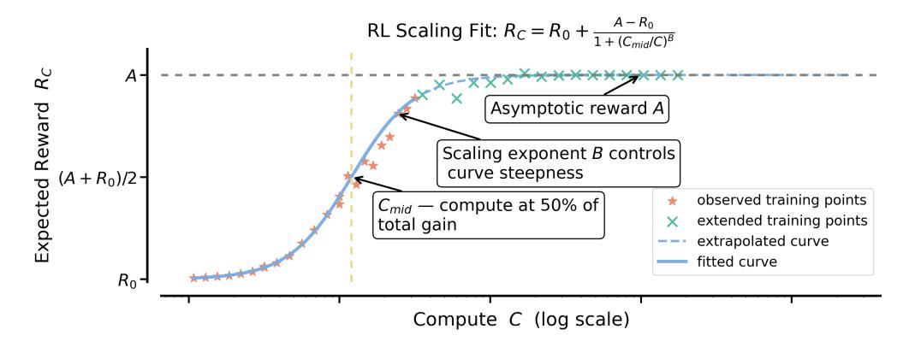

Figure 3 Interpreting equation (1). We provide an example fit illustrating the roles of parameters A, B, and  $C_{\text{mid}}$ .  $C_{\text{mid}}$  determines the compute point at which half of the total gain is achieved - smaller values correspond to faster ascent toward the asymptote. B controls the curve's steepness, with larger values indicating greater efficiency. A represents the asymptotic performance reached at large compute scales. Further discussion is provided in Appendix A.8.

Scaling curve on held-out validation Consistent with pre-training practice (Hoffmann et al., 2022; Porian et al., 2025), we measure predictive performance on in-distribution validation data. Since our training runs span multiple epochs, we hold out randomly selected 1,000 prompts from the Polaris-53k dataset for validation and use the remainder for training. The scaling curves are fitted on the validation points, which measure the average pass rate every 100 training steps, with 16 generations per prompt on the 1,000 held-out prompts.

## 3 An Empirical Study of RL Scaling

In this section, we conduct RL experiments using an 8B dense model on verifiable math problems. Using the setup described in Section 2, we study several design axes in terms of their predictable compute-scaling behavior, namely asymptotic performance (A) and compute efficiency (B), as shown in Figure 3.

We structure our experiments in three stages – we first ablate design choices on top of the baseline at 3.5k to 4k GPU-hours since some experimental choices destabilize beyond this scale (Appendix A.15). Whenever a design change proved stable, we trained it for longer. Then, we combine the best choices into **ScaleRL** and run leave-one-out (LOO) experiments for 16k GPU-hours in Section 4. Here, we assess predictability by fitting on the first 8k GPU-hours and extrapolating the remainder of the run. Finally, to demonstrate predictable scaling with **ScaleRL**, we also consider training setups with larger batch sizes, mixture-of-experts model, multiple tasks (math and code), and longer sequence lengths in Section 5.

#### 3.1 Asynchronous RL Setup

We first investigate the choice of asynchronous off-policy RL setup (Noukhovitch et al., 2024), as it governs training stability and efficiency, generally independent of all other design choices. Specifically, we consider two approaches for off-policy learning: PPO-off-policy-k and PipelineRL-k.

**PPO-off-policy-**k is the default approach for asynchronous RL and has been used previously by Qwen3 (Yang et al., 2025) and ProRL (Liu et al., 2025a). In this setup, the old policy  $\pi_{gen}^{\theta_{\text{old}}}$  generates reasoning traces for a batch of B prompts. Each gradient update processes a mini-batch of  $\hat{B}$  prompts, resulting in  $k = B/\hat{B}$  gradient updates per batch. In our experiments, we fix  $\hat{B} = 48$  prompts (with 16 generations each), and vary  $k \in \{1, 8\}$  by setting  $B = k \times 48$ .

**PipelineRL-**k is a recent approach from Piche et al. (2025) and used by Magistral (Rastogi et al., 2025). In this regimen, generators continuously produce reasoning traces in a streaming fashion. Whenever trainers finish a policy update, the new parameters are immediately pushed to the generators, which continue generating with the updated weights but a stale KV cache from the old policy. Once a full batch of traces is generated, it is passed to the trainers for the next update. In our setup we introduce a parameter k: the trainers wait if they

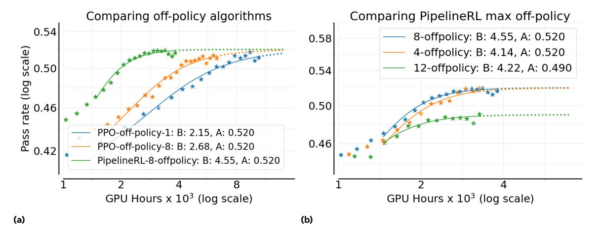

Figure 4 (a) Comparing "compute-scaling" of asynchronous off-policy RL setups. We report only the B (scaling exponent) and A (asymptotic pass rate) parameters of the fitted sigmoid curve (Equation [1\)](#page-1-0). PipelineRL-k is much more efficient and slightly better in the large compute limit. (b) Different max off-policyness with PipelineRL.

get k steps ahead of the generators.

We compare these approaches in [Figure 4a.](#page-5-0) PipelineRL and PPO-off-policy achieve similar asymptotic performance A, but PipelineRL substantially improves the compute efficiency B; thus reaching the ceiling A faster. This is because PipelineRL reduces the amount of idle time in the training process. This choice yields reliable gains with fewer tokens, making larger sweeps at a lower compute budget possible. We also vary the maximum off-policyness for PipelineRL and find k = 8 to be optimal as shown in [Figure 4b,](#page-5-1) which we discuss further in Appendix [A.11.](#page-21-0)

#### 3.2 Algorithmic Choices

Building on the results above, we adopt PipelineRL-8 as our updated baseline. We then study six additional algorithmic axes: (a) loss aggregation, (b) advantage normalization, (c) precision fixes, (d) data curriculum, (e) batch definition, and (f) loss type. In [Section 4,](#page-7-0) we combine the best options into a unified recipe, termed ScaleRL(Scale-able RL), and conduct leave-one-out experiments on a larger scale of 16, 000 GPU-Hours.

Loss type We compare the asymmetric DAPO loss (Eq. [8\)](#page-18-2) with two recently proposed alternatives: GSPO [\(Zheng et al.,](#page-15-6) [2025a\)](#page-15-6) and CISPO [\(MiniMax et al.,](#page-14-3) [2025;](#page-14-3) [Yao et al.,](#page-15-7) [2025\)](#page-15-7). GSPO applies importance sampling at the sequence level as opposed to GRPO's token-level formulation. Specifically, GSPO alters the token-level IS ratio (Eq. [2\)](#page-3-0) to sequence-level ratios: ρi(θ) = πtrain(yi|x,θ)/πgen(yi|x,θold). CISPO simply combines truncated IS with vanilla policy gradient [\(Ionides,](#page-13-7) [2008\)](#page-13-7), where sg is the stop-gradient function:

$$\mathcal{J}_{\text{CISPO}}(\theta) = \underset{\substack{x \sim D, \\ \{y_i\}_{i=1}^G \sim \pi_{gen}(\cdot|x,\theta_{\text{old}})}}{\mathbb{E}} \left[ \frac{1}{T} \sum_{i=1}^G \sum_{t=1}^{|y_i|} \operatorname{sg}(\min(\rho_{i,t}, \epsilon_{\max})) \hat{A}_i \log(\pi_{train}(y_{i,t}|x, y_{i < t}, \theta)) \right]$$
(4)

Figure [5a](#page-6-0) shows that both GSPO and CISPO substantially outperform DAPO, improving the asymptotic pass-rate A by a large margin. CISPO exhibits a prolonged near-linear reward increase, and is marginally better than GSPO later in training, so we opt for CISPO as our best loss type. Further discussion on off-policy loss types, and their hyperparameter robustness is detailed in [Section 4](#page-7-0) and Appendix [A.17.](#page-25-1)

FP32 Precision for LLM logits The generators and trainers rely on different kernels for inference and training, leading to small numerical mismatches in their token probabilities [\(He & Lab,](#page-13-8) [2025\)](#page-13-8). RL training is highly sensitive to such discrepancies, since they directly affect the IS ratio in the surrogate objective. [MiniMax](#page-14-3) [et al.](#page-14-3) [\(2025\)](#page-14-3) identified that these mismatches are especially pronounced at the language model head, and

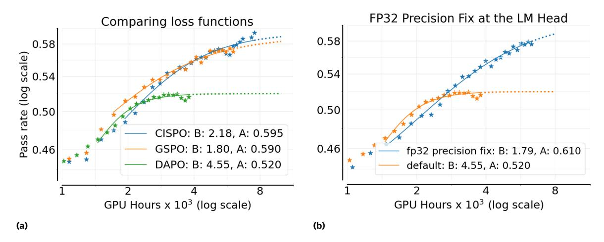

Figure 5 (a) Comparing popular loss functions: DAPO [\(Yu et al.,](#page-15-1) [2025\)](#page-15-1), GSPO [\(Zheng et al.,](#page-15-6) [2025a\)](#page-15-6), and CISPO [\(MiniMax et al.,](#page-14-3) [2025\)](#page-14-3). We find CISPO/GSPO achieve a higher asymptotic reward compared to DAPO. (b) Using FP32 precision in the final layer (LM head) gives a considerable boost in the asymptotic reward.

mitigate this by FP32 computations at the head for both the generator and trainer. As shown in [Figure 5b,](#page-6-1) the precision fix dramatically improves the asymptotic performance A from 0.52 to 0.61. Given this clear benefit, we include the FP32 precision fix in our ScaleRL recipe.

Loss Aggregation We evaluate three strategies for aggregating the RL loss: (a) Sample average where each rollout contributes equally (as in GRPO, Appendix [A.2\)](#page-17-0). (b) Prompt average where each prompt contributes equally (as in DAPO, Appendix [A.2\)](#page-17-0). (c) Token average where all token losses in the batch are averaged directly, without intermediate grouping. The comparison results are shown in Appendix [A.9](#page-20-2) [\(Figure 14a\)](#page-22-0). We find prompt-average achieves the highest asymptotic performance and therefore use this choice for ScaleRL.

Advantage Normalization We compare three variants of advantage normalization: (a) Prompt level where advantages are normalized by the standard deviation of rewards from the rollouts of the same prompt (as in GRPO, Appendix [A.2\)](#page-17-0). (b) Batch level where advantages are normalized by the standard deviation across all generations in the batch, as used by [Hu et al.](#page-13-9) [\(2025a\)](#page-13-9); [Rastogi et al.](#page-14-4) [\(2025\)](#page-14-4). (c) No normalization where advantages are computed as raw rewards centered by the mean reward of the prompt's generations, without variance scaling (as proposed in Dr. GRPO [\(Liu et al.,](#page-14-9) [2025b\)](#page-14-9)). A comparison plot is shown in Appendix [A.9](#page-20-2) [\(Figure 14b\)](#page-22-1), and all three methods are oberseved to yield similar performance. We therefore adopt batch-level normalization as it is theoretically sound and marginally better. This choice is also further corroborated at a larger scale by the leave-one-out experiments in [Section 4.](#page-7-0)

Zero-Variance Filtering Within each batch, some prompts yield identical rewards across all their generations. These "zero-variance" prompts have zero advantage and therefore contribute zero policy gradient. The default baseline includes such prompts in loss computation, but it is unclear whether they should be included in the effective batch. To test this, we compare the default setting against an effective batch approach, where only prompts with non-zero variance are included in the loss calculation, as done by [Seed et al.](#page-15-8) [\(2025\)](#page-15-8). Note that zero-variance filtering differs from dynamic sampling in DAPO [\(Yu et al.,](#page-15-1) [2025\)](#page-15-1). The former merely drop the prompts, while latter resamples more prompts until the batch is full. We show in [Figure 6a](#page-7-1) that using the effective batch performs better asymptotically; and we adopt it in our ScaleRL recipe.

Adaptive Prompt Filtering A number of data curriculum strategies have been proposed for RL training to improve sample efficiency [\(An et al.,](#page-12-0) [2025;](#page-12-0) [Zhang et al.,](#page-15-9) [2025b;](#page-15-9) [Zheng et al.,](#page-16-0) [2025b\)](#page-16-0). Here we evaluate a simple variant, introduced by [An et al.](#page-12-0) [\(2025\)](#page-12-0), with the key observation that once a prompt becomes too easy for a policy, it typically remains easy. Since such prompts consume some compute but no longer contribute useful gradient signal [\(Section 3.2\)](#page-6-2), it is better to exclude them from future training. We implement this

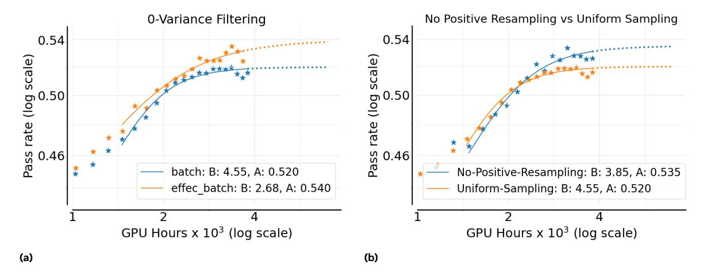

Figure 6 (a) "Zero" variance filtering: We filter out "zero" variance (accuracy 0 or 1) samples in a batch since they contribute zero policy gradient and find it achieves a higher asymptote, and (b) Adaptive prompt sampling: Filtering out prompts with pass rate  $\geq 0.9$  in subsequent epochs results in a higher asymptotic performance.

by maintaining a history of pass rates and permanently removing any prompt with pass rate  $\geq 0.9$  from subsequent epochs—we call this **No-Positive-Resampling**. In Figure 6b we compare this curriculum against the default setting where all prompts are resampled uniformly throughout training. We see that the curriculum improves scalability and the asymptotic reward A.

#### 4 ScaleRL: Scaling RL Compute Effectively & Predictably

From the design axes studied above, we consolidate the best-performing settings into a single recipe, which we term ScaleRL (Scale-able RL). ScaleRL is an asynchronous RL recipe that uses PipelineRL with 8 steps off-policyness, interruption-based length control for truncation, FP32 computation for logits, and optimizes the  $\mathcal{J}_{\text{ScaleRL}}(\theta)$  loss. This loss combines prompt-level loss aggregation, batch-level advantage normalization, truncated importance-sampling REINFORCE loss (CISPO), zero-variance filtering, and no-positive resampling:

$$\begin{split} \mathcal{J}_{\text{ScaleRL}}(\theta) &= \underset{\substack{x \sim D, \\ \{y_i\}_{i=1}^G \sim \pi_{gen}^{\theta_{old}}(\cdot|x)}}{\mathbb{E}} \left[ \frac{1}{\sum_{g=1}^G |y_g|} \sum_{i=1}^G \sum_{t=1}^{|y_i|} \operatorname{sg}(\min(\rho_{i,t}, \epsilon)) \hat{A}_i^{\text{norm}} \log \pi_{train}^{\theta}(y_{i,t}) \right], \\ \rho_{i,t} &= \frac{\pi_{train}^{\theta}(y_{i,t})}{\pi_{gen}^{\theta_{old}}(y_{i,t})}, \ \hat{A}_i^{\text{norm}} &= \hat{A}_i/\hat{A}_{\text{std}}, \ 0 < \operatorname{mean}(\{r_j\}_{j=1}^G) < 1, \ \operatorname{pass\_rate}(x) < 0.9, \end{split}$$

where sg is the stop-gradient function,  $A_{std}$  is the standard deviation of all advantages  $A_i$  in a batch and pass\_rate(x) denotes the historical pass rate of a prompt x. For forced interruptions, we use the end-of-thinking phrase: "Okay, time is up. Let me stop thinking and formulate a final answer now. </think>".

**Leave-One-Out (LOO) Ablations** To validate that these choices remain optimal when combined, we conduct *leave-one-out* (LOO) experiments: starting from **ScaleRL**, we revert one axis at a time to its baseline counterpart from Section 2. This ensures that each design decision contributes positively even in the presence of all others. Figure 7 reports these experiments, each scaled to 16k GPU hours.

Across all axes, **ScaleRL** consistently remains the most effective configuration, slightly outperforming LOO variants either in asymptotic reward or in compute efficiency (refer to the last column in the Figure 7 table). Since most LOO variants reach similar asymptotic pass rates, we transform the sigmoidal fit to a power-law fit, to highlight efficiency differences via the slope B (details in Figure 7). Concretely, we average the asymptotic reward A across all runs, re-fit the curves with this fixed A, and then compare slopes (measuring efficiency) in Figure 7. The corresponding non-transformed pass-rate vs. compute curves are provided in Appendix A.2.

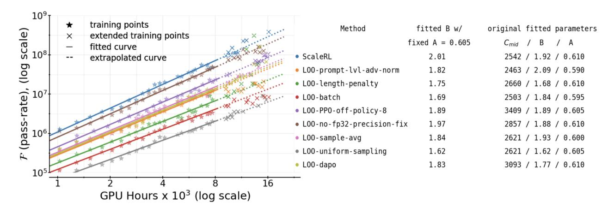

Figure 7 Leave-One-Out (LOO) Experiments: Starting from ScaleRL, we revert one design choice at a time to its baseline counterpart and re-train. Most LOO variants reach a similar asymptotic reward, with ScaleRL outperforming slightly overall. The main difference in these methods lies in efficiency. To highlight this, we re-arrange Equation (1) into  $\mathcal{F}(R_c) = C^B$ , where  $\mathcal{F}(R_c) = C^{B}_{\text{mid}}/(\frac{A-R_0}{R_c-R_0}-1)$ , and plot  $\log \mathcal{F}(R_c)$  vs.  $\log C$ . This form makes slope B directly visible, showing that ScaleRL achieves the highest compute efficiency.

Error margin in fitting scaling curves Since RL training is known to exhibit high variance (Agarwal et al., 2021), we use three independent ScaleRL runs (Figure 8a) to estimate the variability in fitted scaling coefficients. The observed variance in asymptotic reward and efficiency parameters serves as our empirical error margin, used to determine whether changes in compute efficiency or asymptotic performance are statistically meaningful for two different runs (Madaan et al., 2024).

**Extrapolating Scaling Curves** In all our LOO experiments as well as independent **ScaleRL** runs, we fit the sigmoidal curve up to 8000 GPU-hours and extrapolate to 16000 GPU-hours, observing that the predicted curves align closely with both training and extended points. This demonstrates the stability and predictability of **ScaleRL** and other stable, scalable recipes under large-scale RL training.

Are the design choices worth it? In Section 3.2, certain design choices alter asymptotic performance, such as loss type (Figure 5a) and FP32 precision (Figure 5b). However, in our LOO experiments with ScaleRL (Figure 7), these components appear less critical individually (last column in the figure). This raises the question of whether certain design choices can be safely left at their "default" values.

We argue the answer is no. Even when a choice seems redundant in the combined recipe, it can still provide stability or robustness that can become decisive in other regimes. For example, while the FP32 precision fix makes little difference with dense 8B trained with **ScaleRL** (Figure 7), it provides large gains in GRPO/DAPO-style losses by mitigating numerical instabilities. This indicates that its benefits extend beyond the specific **ScaleRL** configuration we study. To further test this, we ran a leave-one-out experiment on the Scout 17Bx16 MoE and observed that FP32 precision improves overall scalability (Figure 8b).

A similar case arises with the loss type. In Figure 7, reverting to DAPO yields similar asymptotic performance to CISPO within **ScaleRL**. Nonetheless, as we discuss in Appendix A.17, CISPO is markedly more robust to the choice of IS-clipping parameter  $\epsilon_{\text{max}}$ , reducing the sensitivity of training to hyperparameter tuning. Moreover, it's also more efficient than DAPO, as seen in LOO experiment (B = 2.01 vs B = 1.77). This justifies preferring CISPO, even if a carefully tuned DAPO variant can perform similar asymptotically.

In summary, even when individual design choices appear redundant within the combined recipe, they often enhance training stability, robustness, or efficiency in ways that generalize across models and setups. **ScaleRL** retains such components not just for marginal gains in a specific configuration, but because they address recurring sources of instability and variance that arise across reinforcement learning regimes.

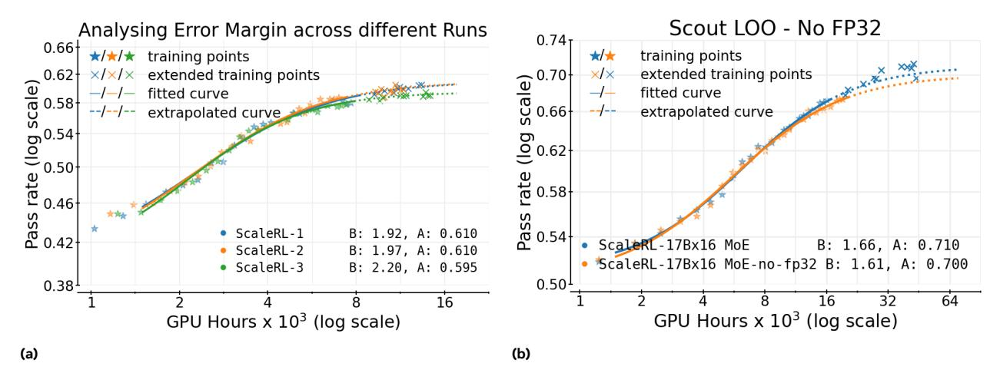

Figure 8 (a) Variance in scaling fits. We train 3 independent runs of ScaleRL to measure variance. We observe a ±0.02 error margin for asymptotic performance A. (b) FP32 LOO on Scout: Comparing ScaleRL on Scout with and without FP32 precision fix at the LM Head. ScaleRL performs better with the FP32 fix.

## 5 Predictable Scaling Returns Across RL Compute Axes

Given a fixed or growing compute budget, which scaling knob –context length, batch size, generations per prompt, and model size – buys the most reliable performance gain, and how early can we predict that return? We answer this by (i) fitting the saturating power-law in [equation \(1\)](#page-1-0) early in training for each setting (precisely, half the target budget), (ii) extrapolating to the target budget, and (iii) extending training to verify the forecast. Across all axes below we observe clean, predictive fits whose extrapolated curves align with the extended trajectories, mirroring the behavior seen in our 100,000 GPU-hour run [\(Figure 1\)](#page-0-0), and the cross-recipe comparison in [Figure 2.](#page-2-0)

Model scale (MoE) Does ScaleRL remain predictive and stable on larger models? Training the 17B×16 Llama-4 Scout MoE with ScaleRL exhibits the same predictable scaling behavior as the 8B model, with low truncation rates and no instability pathologies (Appendix [A.15,](#page-23-0) [A.17\)](#page-25-1). [Figure 1](#page-0-0) shows the training curve. The extended points align with the fitted curve, supporting the model-scale invariance of our recipe. Moreover, the larger 17B×16 MoE exhibits much higher asymptotic RL performance than the 8B dense model, outperforming the 8B's performance using only 1/6 of its RL training compute.

Generation length (context budget) Increasing the generation length from 14k to 32k tokens slows early progress (lower B and higher Cmid) but consistently lifts the fitted asymptote (A), yielding higher final performance once sufficient compute is provided [\(Figure 9\)](#page-10-0). This validates long-context RL as a ceiling-raising knob rather than a mere efficiency trade-off. Extrapolations made from the fit correctly forecast the higher 32k-token trajectory when training is extended.

Global batch size (prompts) Smaller-batch runs show early stagnation on downstream benchmarks even as in-distribution validation performance continues to improve. Larger batches reliably improve the asymptote and avoid the downstream stagnation we observe in smaller-batch runs. [Figure 10a](#page-10-1) shows the same qualitative pattern at mid-scale: small batches may appear better early but are overtaken as compute grows. In our largest math run in [Figure 1,](#page-0-0) moving to batch size of 2048 prompts both stabilized training and yielded a fit that extrapolated from up to 50k GPU hours to the final 100k point.

Generations per prompt (fixed total batch) For a fixed total batch, is it better to allocate more prompts or more generations per prompt? Sweeping generations per prompt 8,16,24,32 and adjusting prompts to keep total batch fixed leaves fitted scaling curves essentially unchanged (Appendix [A.13\)](#page-23-1), suggesting that, at

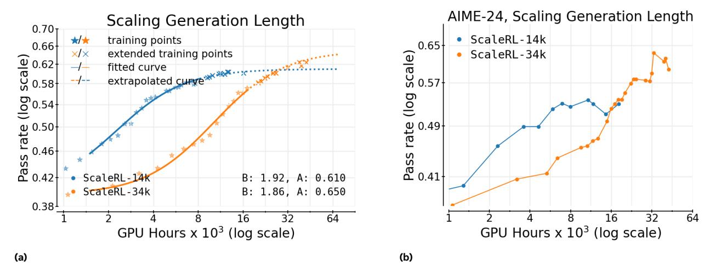

Figure 9 Scaling RL Generation Length. While long-context RL is less efficient initially, it eventually surpasses the performance of the smaller-context run. This trend is observed on both the iid validation set (left) as well as downstream evaluations (right).

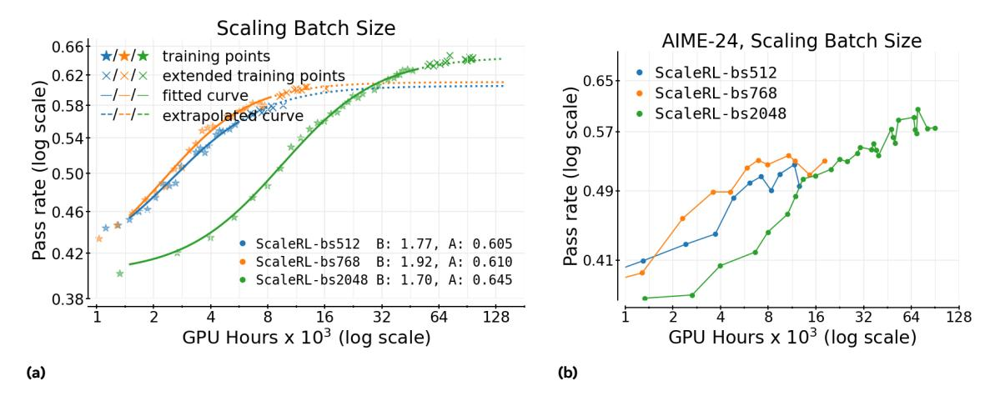

Figure 10 Scaling RL batch size. larger batch size is slower in training but settles at a higher asymptote. Batch size show an inverse trend initially where smaller values seem better at lower compute budget, but reach a higher asymptotic performance at larger scale.

moderate batch, this allocation is a second-order choice for both A and B. Clearer differences may emerge at much larger batches (e.g., 2k+), which we leave for future work.

#### 6 Related Work

We detail two most relevant works to our study in this section. ProRL [\(Liu et al.,](#page-14-0) [2025a\)](#page-14-0) demonstrates that prolonged RL fine-tuning on LLMs (∼ 2000 optimization steps, 64 batch size) for 16K GPU-hours using a mix of reasoning tasks uncovers novel solution strategies beyond a model's base capabilities. This longer training regimen delivered significant gains on a 1.5B model, rivaling the performance of larger models on some benchmarks. ProRL's contributions lie in specific heuristics for stability (KL-regularization, policy resetting, entropy controls, etc.) to achieve high performance out of a 1.5B model.

[Liu et al.](#page-14-11) [\(2025c\)](#page-14-11) offer a complementary perspective and ablates various design choices under consistent conditions on Qwen-3 4B/8B [\(Yang et al.,](#page-15-3) [2025\)](#page-15-3), and presents a minimalist combination, LitePPO, that outperforms more complex methods like GRPO [\(Shao et al.,](#page-15-2) [2024\)](#page-15-2) and DAPO [\(Yu et al.,](#page-15-1) [2025\)](#page-15-1) on smaller

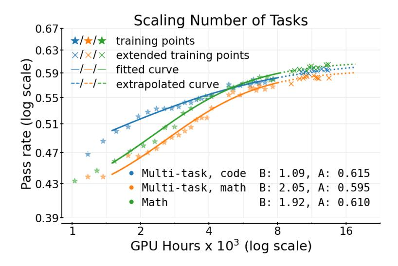

Figure 11 ScaleRL scales predictably on math and code. We report both the code and math validation set performance on the joint math+code RL run; along with the math only ScaleRL run as a reference. These results demonstrate that our sigmoidal compute–performance relationship holds across task mixtures, and that ScaleRL's scalability generalizes beyond a single domain training.

scale models and compute. This yields valuable algorithmic insights, but the focus is on comparative empirical findings, rather than on scaling behaviour.

None of these work study "scaling" properties of these methods. In fact, the main comparisons are done on downstream evaluations, which may not be not the right metric to study predictable scaling. Rather, as done in pre-training and in our work here, we study performance on in-distribution held out eval set. In contrast to the mentioned related works, our work develops and validates a compute-performance framework with predictive fits, while operating at a much larger compute budget (e.g, 6x larger than ProRL) and model scale compared to the above studies. Additionally, our findings yield a near state-of-the-art RL recipe that can scale predictably to over 100,000 GPU-hours without any stability issues. The rest of the related work is deferred to Appendix [A.1.](#page-17-1)

#### 7 Discussion & Conclusion

In this work, we study the scaling properties of different techniques used in RL for LLMs in pursuit of a predictable scalable recipe. With this mission, we derive a method for fitting predictive scaling fits for accuracy on the validation set that allows us to quantify the asymptotic performance and compute efficiency of an RL method. Using this methodology, our primary contribution is to conduct a careful series of ablations of several algorithmic options that go into the RL recipe. For each ablation, we choose the option with higher asymptotic performance when possible and improved efficiency otherwise. Combining these choices yields the ScaleRL recipe which scales better than all existing recipes in our experiments.

A few observations are in order:

- Compute scaling extrapolation. An important insight of our scaling methodology is that we can use smaller-scale ablations in a systematic way to predict performance at larger scales. This allows us to create our final scalable recipe.
- Most important decisions. The off-policy algorithm, loss function, and model precision are the most important decisions from our ablations. Each of the other decisions does not have a large individual effect, but as we see from the leave-one-out experiments, they still do have some cumulative impact (in terms of efficiency) when all combined.
- Asymptotic performance vs. efficiency. For many of our ablations, we found the better option to

improve both efficiency and asymptotic performance, but this is not always the case (e.g. for FP32, [Figure 5b\)](#page-6-1). When doing the "forward" ablations starting from the baseline method, we opt for asymptotic performance first and foremost. Interestingly, when doing the "backward" leave-one-out ablations from the ScaleRL recipe, we find very little impact on asymptotic performance from each decision, but each component of the algorithm seems to help efficiency. This shows that the cumulative effect of the changes is quite robust.

- Generalization. While we report transfer to downstream evaluations, our primary focus is on studying predictive scaling, which is characterized through in-distribution performance curves on a held-out dataset from training prompts [\(Li et al.,](#page-13-6) [2025b;](#page-13-6) [Muennighoff et al.,](#page-14-12) [2025\)](#page-14-12). This still leaves the question of how well the LLM would generalize from the training distribution to held out test sets. While a full characterization of generalization is beyond the scope of our work, we do observe correlation between in-distribution validation and downstream generalization performance. However, there are some algorithmic choices that seem to help generalization more, that we want to note here including: larger batch size [\(Section A.14\)](#page-23-2), reducing truncations [\(Section A.15\)](#page-23-0), longer generation lengths [\(Section 5,](#page-8-0) [Figure 9\)](#page-10-0), and larger model scale [\(Section 5,](#page-8-0) [Figure 1\)](#page-0-0).
- Multi-task RL. While our experiments focus mainly on the math domain, we also evaluate ScaleRL under multi-task RL training. As shown in [Figure 11,](#page-11-0) joint training on math and code yields clean, parallel power-law trends for each domain, with extended runs remaining aligned with the extrapolated curves. While our preliminary results are promising, it would be interesting to thoroughly study predictability of compute scaling for multi-task RL with different training data mixtures.

Future work A natural next step is to derive predictive "scaling laws" for RL across pre-training compute, model size, and RL training data. Future studies can also include other axes of RL compute scaling, such as incorporating structured or dense rewards [\(Setlur et al.,](#page-15-10) [2024\)](#page-15-10) and more compute-intensive generative verifiers [\(Zhang et al.,](#page-15-11) [2025a\)](#page-15-11), to find optimal compute allocation for RL training. Finally, the methodological framework introduced here can be applied to study the scaling behavior of other post-training regimes, including multi-turn RL, agentic interaction, and long-form reasoning.

There are of course many design choices in RL, so we don't think that our ScaleRL recipe is the end of the story. We hope that our focus on scalable RL and methodology for predicting scalability can inspire future work to push the frontier of RL for LLMs even further. To enable future studies to fit compute-performance RL scaling curves, we release a minimal code repository at [www.devvrit.com/scalerl\\_curve\\_fitting.](https://www.devvrit.com/scalerl_curve_fitting)

# 8 Acknowledgments

The authors would like to thank Sneha Kudugunta and Niladri Chatterji for helpful discussions on pre-training and scaling laws. Additionally, the authors are grateful to Aviral Kumar, Prateek Jain, Lewis Turnstall, Nathan Lambert, Dzmitry Bahdanau, and John Quan for helpful feedback on earlier drafts. Finally, the authors would also like to thank Jenya Lee and Abhinav Jauhri for infrastructure and compute support.

#### References

Rishabh Agarwal, Max Schwarzer, Pablo Samuel Castro, Aaron C Courville, and Marc Bellemare. Deep reinforcement learning at the edge of the statistical precipice. Advances in Neural Information Processing Systems, 34:29304–29320, 2021.

Chenxin An, Zhihui Xie, Xiaonan Li, Lei Li, Jun Zhang, Shansan Gong, Ming Zhong, Jingjing Xu, Xipeng Qiu, Mingxuan Wang, and Lingpeng Kong. Polaris: A post-training recipe for scaling reinforcement learning on advanced reasoning models, 2025. URL <https://hkunlp.github.io/blog/2025/Polaris>.

AoPS. AIME problem set 1983-2025, 2025. URL [https://artofproblemsolving.com/wiki/index.php/AIME\\_](https://artofproblemsolving.com/wiki/index.php/AIME_Problems_and_Solutions) [Problems\\_and\\_Solutions](https://artofproblemsolving.com/wiki/index.php/AIME_Problems_and_Solutions).

Quentin Carbonneaux, Gal Cohen, Jonas Gehring, Jacob Kahn, Jannik Kossen, Felix Kreuk, Emily McMilin, Michel