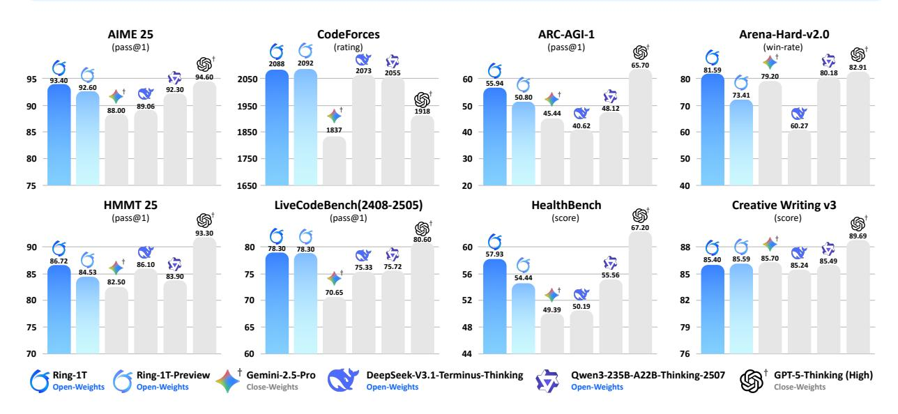
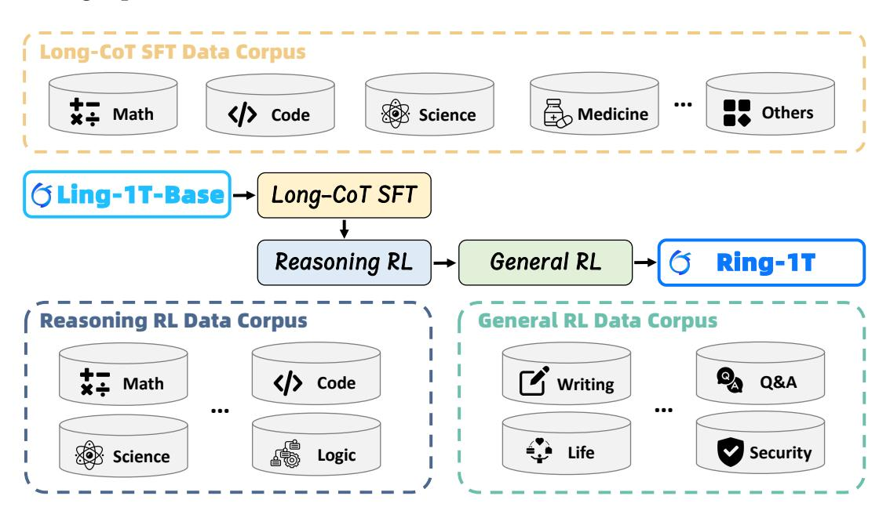
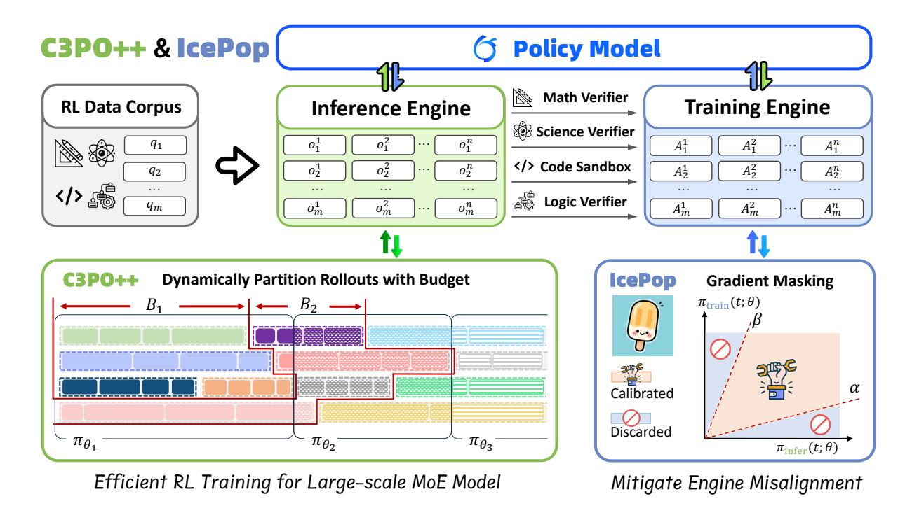
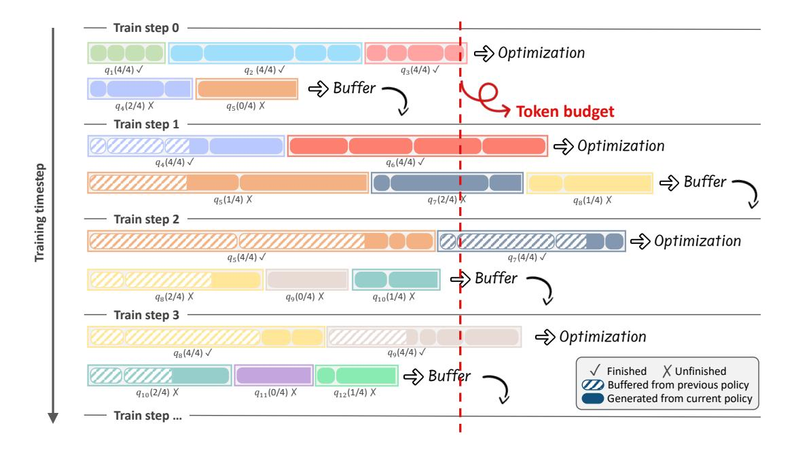
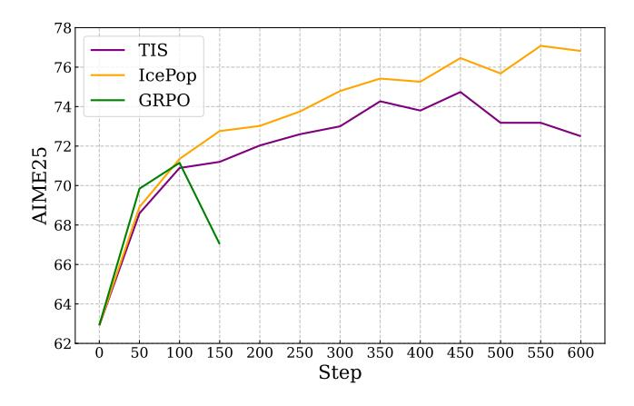
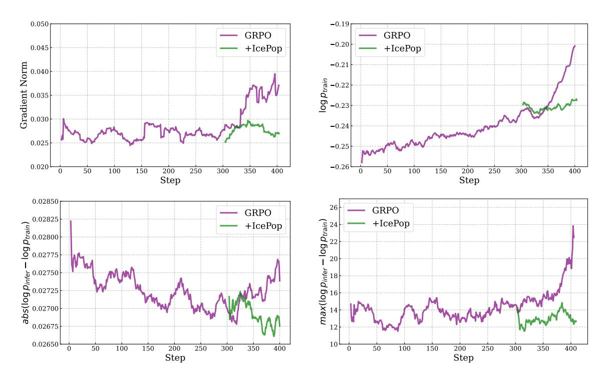
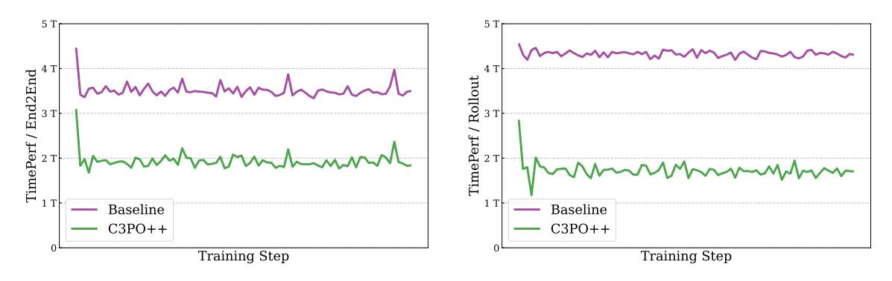
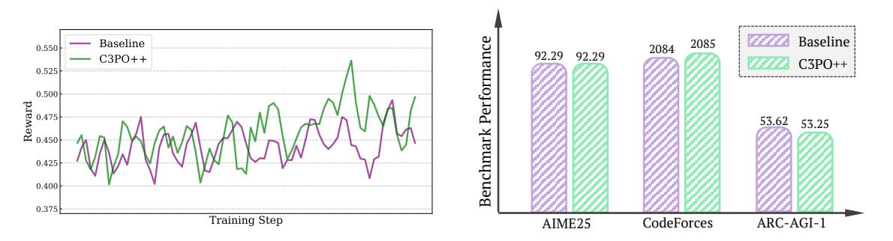
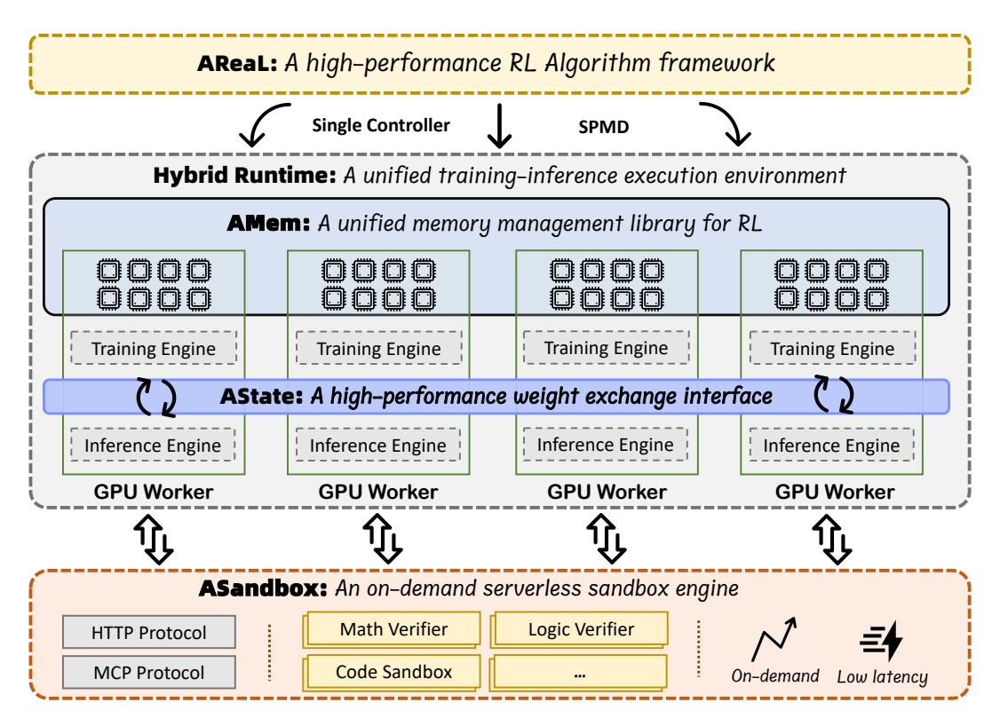

# **Every Step Evolves:** Scaling Reinforcement Learning for Trillion-Scale Thinking Model

Ling Team, Inclusion AI\*

\*See Contributions section (Sec. 6) for full author list.

We present Ring-1T, the first open-source, state-of-the-art thinking model with a trillionscale parameter. It features 1 trillion total parameters and activates approximately 50 billion per token. Training such models at a trillion-parameter scale introduces unprecedented challenges, including train-inference misalignment, inefficiencies in rollout processing, and bottlenecks in the RL system. To address these, we pioneer three interconnected innovations: (1) IcePop stabilizes RL training via token-level discrepancy masking and clipping, resolving instability from training-inference mismatches; (2) C3PO++ improves resource utilization for long rollouts under a token budget by dynamically partitioning them, thereby obtaining high time efficiency; and (3) ASystem, a high-performance RL framework designed to overcome the systemic bottlenecks that impede trillion-parameter model training. Ring-1T delivers breakthrough results across critical benchmarks: 93.4 on AIME-2025, 86.72 on HMMT-2025, 2088 on CodeForces, and 55.94 on ARC-AGI-1. Notably, it attains a silver medal-level result on the IMO-2025, underscoring its exceptional reasoning capabilities. By releasing the complete 1T parameter MoE model to the community, we provide the research community with direct access to cutting-edge reasoning capabilities. This contribution marks a significant milestone in democratizing large-scale reasoning intelligence and establishes a new baseline for open-source model performance.

Date: Oct 22, 2025

Code: https://github.com/inclusionAI/Ring-V2
Model: https://huggingface.co/inclusionAI/Ring-1T




Figure 1 Performance comparison of Ring-1T and existing open-weights and close-weights<sup>†</sup> models across benchmarks.

# **1 Introduction**

Artificial intelligence is undergoing a pivotal transition: Large Language Models (LLMs) are advancing beyond static corpora of human knowledge, becoming dynamic processors that transform information into actionable insights and understanding [\(Team et al.,](#page-20-0) [2025;](#page-20-0) [DeepSeek-AI,](#page-18-0) [2025\)](#page-18-0). This progression towards more general intelligence is empirically validated by their core capability – complex, adaptive problem-solving. Recent breakthroughs in solving high-difficulty human competition problems provide concrete evidence of significantly advanced reasoning abilities in large language models. For instance, models [\(OpenAI,](#page-19-0) [2025;](#page-19-0) [Team,](#page-20-1) [2025\)](#page-20-1) have achieved 100% accuracy on the AIME-2025 [\(AIME,](#page-18-1) [2025\)](#page-18-1) and HMMT-2025 [1](#page-1-0) , and reached medal-level performance at the International Mathematical Olympiad (IMO) [\(OpenAI,](#page-19-0) [2025\)](#page-19-0)—a hallmark of sophisticated human intellect. This evolution beyond static knowledge repositories is driven by training on trillions of tokens across diverse domains, coupled with reinforcement learning-optimized reasoning techniques [\(OpenAI,](#page-19-1) [2024;](#page-19-1) [DeepSeek-AI,](#page-18-0) [2025\)](#page-18-0) that enable models to dynamically scale their capabilities with thinking effort, pointing toward higher levels of general intelligence.

While related work [\(DeepSeek-AI,](#page-18-0) [2025;](#page-18-0) [Zhipu-AI,](#page-20-2) [2025\)](#page-20-2) has made valuable contributions to the open-source community, the frontier of trillion-parameter thinking models remains uncharted territory. Scaling to this level introduces formidable challenges, such as severe training instability and prohibitive computational costs. In this work, we introduce Ring-1T, a novel Mixture-of-Experts (MoE) thinking model scaled to unprecedented size—and demonstrate breakthrough methodologies for efficient trillion-parameter training. By solving fundamental stability and efficiency challenges at this scale, we enable robust large-scale reasoning training while providing extensive implementation insights.

Our Ring-1T, the first open-source reasoning model with one trillion total parameters, is built upon the Ling 2.0 [\(Ling-Team,](#page-19-2) [2025\)](#page-19-2) architecture and trained from the Ling-1T-base. With approximately 50 billion activated parameters per token, Ring-1T achieves state-of-the-art performance across multiple challenging benchmarks—despite relying solely on natural language reasoning capabilities. It significantly outperforms existing open-source models, achieving scores of 93.4 on AIME-2025, 86.72 on HMMT-2025, 2088 on CodeForces, and 55.94 on ARC-AGI-v1. Remarkably, in the IMO-2025 evaluation within AWorld [2](#page-1-1) , Ring-1T achieved a silver medal-level result by correctly solving four problems and partially proving Problem 2, all within a single submission, and without relying on code generation or external symbolic solvers. Realizing this breakthrough required addressing fundamental challenges in trillion-scale RL training. We pioneered three interconnected innovations:

- **IcePop** eliminates catastrophic training-inference misalignment in RL training by clipping excessive-discrepancy tokens. This selective correction pops out unstable contributions while preserving efficient updates, thereby stabilizing training without slowing inference.
- **C3PO++** introduces a budget-controlled rollout scheduling mechanism that eliminates rolloutstage bottlenecks. Thus, it avoids inefficient single-pass processing of oversized sequences, reducing computational overhead while enabling their efficient reuse through batched continuation.
- **ASystem** is a high-performance reinforcement learning (RL) framework designed for largescale asynchronous training. It adopts a SingleController + SPMD (Single Program, Multiple

<span id="page-1-0"></span><sup>1</sup>https://www.hmmt.org/www/archive/problems

<span id="page-1-1"></span><sup>2</sup>https://github.com/inclusionAI/AWorld

Data) to enable fully asynchronous operations, multi-phase masking acceleration, and efficient data packing/sharding.

The structure of this paper is organized as follows: Section 2 describes our comprehensive training methodology, which includes Long Chain-of-Thought Supervised Fine-Tuning (Long-CoT SFT) and large-scale reinforcement learning (RL), including our key algorithmic contributions, IcePop and C3PO++, as well as the underlying training framework, Asystem. Finally, Section 3 presents a thorough evaluation of our model's performance against leading open-weights and closed-weights models on established benchmarks.

## <span id="page-2-0"></span>2 Approach

The Ring-1T model was developed via a multi-stage pipeline, commencing with long-CoT SFT and advancing through reasoning and general RL phases. While the complete pipeline is integral to the model's performance, the primary focus of this report is on RL components. We first summarize the long-CoT SFT process that primes the model for RL in Section 2.2. The core of our discussion then turns to the novel RL algorithm, which is elaborated upon in Section 2.3. Additionally, we introduce ASystem in Section 2.5, the distributed system that enabled the large-scale RL training necessary for this project.

## 2.1 Training Pipeline



Figure 2 The training pipeline of Ring-1T.

We use Ling-1T-base model (Ling-Team, 2025), a novel Mixture-of-Experts model with a total of **1 Trillion** parameters and an activation of **50 Billion** parameters, as our base model. The training of Ring-1T consists of three stages, comprising long-CoT SFT, reasoning-oriented RL, and general-oriented RL, to cultivate a powerful thinking model.

• Long-CoT SFT: We collect and synthesize a large amount of multi-domain reasoning trajectory data covering mathematics, code, science, etc. Through large-scale supervised fine-tuning, the model learns general reasoning patterns and domain-specific reasoning skills, establishing a

solid foundation for large-scale RL training.

- **Reasoning RL:** We construct a comprehensive, challenging, and high-quality RL dataset encompassing math, code, science, and logic tasks with verifiable outcomes. The model's comprehensive reasoning performance is enhanced via *RLVR (Reinforcement Learning from Verifiable Rewards)*. This process involves sampling extensive reasoning trajectories and refining the policy using verifiable rewards, which are provided by carefully designed multi-domain verifiers.
- **General RL:** Following large-scale reinforcement learning on verifiable tasks, we conduct a second RL stage focused on general tasks. This phase employs *RLHF (Reinforcement Learning from Human Feedback)* to recalibrate the model's capability distribution, preserving its core reasoning strength while enhancing human alignment, instruction following, creative writing, safety, and overall usability.

## <span id="page-3-0"></span>**2.2 Long-CoT SFT**

In this stage, we aim to endow the base model with fundamental long-chain reasoning abilities through Long Chain-of-Thought Supervised Fine-Tuning (Long-CoT SFT). This process serves as the foundation for subsequent reinforcement learning, equipping it with the capability to sustain coherent, multi-step thinking processes for complex problems.

*Data Collection* A comprehensive, high-quality dataset featuring Long-CoT reasoning patterns was constructed to effectively activate the base model's reasoning capability. The query pool originates from a tripartite sourcing strategy: open-source repositories, expert manual generation, and LLM-based synthesis. Following data collection, rigorous data-cleansing protocols were applied. To ensure the resulting dataset's quality, we designed a rigorous data processing pipeline comprising four sequential steps: 1) Deduplication, where we employed exact matching to remove repetitive samples; 2) Harmful Content Filtering, where data samples containing toxic or harmful information were identified and purged; 3) Data Decontamination, where we utilized both hashing and exact string matching techniques to detect and eliminate any samples that overlap with existing benchmarks; and 4) Low-Quality Sample Filtering, which removeed various noise sources including invisible control codes and extraneous Unicode characters. The final data is predominantly composed of four domains: Mathematics (46%), STEM (26%), Code (20%), and Others (8%).

*Training* We conduct Long-CoT SFT on our Ling-1T-base model [\(Ling-Team,](#page-19-2) [2025\)](#page-19-2) to obtain a model with preliminary thinking capabilities. The training data are packed into 64k-length sequences. For this stage, the model was trained for 3 epochs with a learning rate of 2 × 10−<sup>4</sup> . We employed a cosine decay scheduler with 30 warmup steps and applied a weight decay of 0.1 throughout the process.

## <span id="page-3-1"></span>**2.3 Large-Scale Reinforcement Learning**

Reinforcement learning (RL) is the critical next step for translating knowledge from pre-training and SFT into advanced thinking. To enable RL at the unprecedented scale of **1 Trillion** parameters, we developed a novel RL algorithm and a specialized infrastructure, Asystem. This integrated solution overcomes fundamental challenges in training efficiency and stability, allowing us to systematically explore the model's complex problem-solving capabilities.

## **2.3.1 RL Data**

High-quality and diverse data are critical for effective reinforcement learning. To this end, we introduce a carefully curated, multi-domain dataset spanning five core areas: math, code, science, logic, and general domains:

- **Math:** We extend the dataset from [Ling-Team et al.](#page-19-3) [\(2025\)](#page-19-3) with mathematically rigorous problems from authoritative sources. Our curation ensures completeness, high complexity, and verifiable solutions, yielding a high-quality corpus for large-scale reinforcement learning.
- **Code:** Aside from the dataset employed in [Ling-Team et al.](#page-19-3) [\(2025\)](#page-19-3), we develop a multi-phase workflow for synthesizing, validating, quality-scoring, and selecting additional test cases. This process ensures that each problem is equipped with a sufficient number of high-quality test cases. The final dataset contains programming problems with verified correct solutions and carefully tested cases.
- **Science:** We developed a crowdsourced science dataset of high-difficulty problems spanning physics, chemistry, and biology. To ensure complexity for reinforcement learning, all multiplechoice questions were reformatted into an open-ended format. For organic chemistry, we established a dedicated image-semantization pipeline that converts visual information such as molecular structures into structured textual descriptions. Finally, we applied a Pass-rate filtering strategy to select only the highest-quality items.
- **Logic:** Our logic reasoning dataset spans five domains: visual pattern induction [\(Chollet](#page-18-2) [et al.,](#page-18-2) [2025\)](#page-18-2), grid puzzles (Sudoku), pathfinding (mazes), arithmetic reasoning (24 Game), and propositional logic (Knights and Knaves). We synthesized problems by integrating public resources such as [Hodel](#page-18-3) [\(2024\)](#page-18-3), [Li et al.](#page-19-4) [\(2025\)](#page-19-4), and [Liu et al.](#page-19-5) [\(2025\)](#page-19-5) into an in-house game generator, enabling scalable and controlled creation. A quality control process ensures each task is solvable and non-trivial during both generation and post-processing. The final curated collection balanced across domains and complexity levels for reinforcement learning.
- **General Data:** We constructed a comprehensive dataset for general reasoning by aggregating problems from two primary sources: public repositories and real-world user interactions. From public sources, we incorporated established general datasets including Magpie [\(Xu et al.,](#page-20-3) [2024\)](#page-20-3), WMT [\(Feng et al.,](#page-18-4) [2025\)](#page-18-4), RLVR-IFEval [3](#page-4-0) , and AutoIF [4](#page-4-1) . To enhance practical alignment, we further integrated real-world user preference data such as arena-human-preference-100k and arena-human-preference-140k [5](#page-4-2) . Additionally, we augmented this collection with problems sourced from social media platforms such as Zhihu and StackOverflow.

Finally, we employ a multi-stage curation pipeline involving parsing, reformulation, and deduplication, with quality assured by a dual scoring system of LLMs and rule-based metrics. Furthermore, fine-grained metadata annotations on each sample enable dynamic sampling and cross-domain blending, a strategy that significantly improves training efficiency and model performance on complex tasks.

## **2.3.2 IcePop: Discard All Noisy Gradient Updates**

Contemporary reinforcement learning training frameworks typically utilize distinct engines for model training and inference processes. Throughout our experiments, we have observed that this

<span id="page-4-0"></span><sup>3</sup>https://huggingface.co/datasets/allenai/RLVR-IFeval

<span id="page-4-1"></span><sup>4</sup>https://huggingface.co/datasets/Post-training-Data-Flywheel/AutoIF-instruct-61k

<span id="page-4-2"></span><sup>5</sup>https://huggingface.co/datasets/lmarena-ai



Figure 3 We integrate C3PO++ and IcePop into Ring-1T, which enhances both training efficiency and effectiveness of RL.

separation may lead to discrepancies in probability calculations, potentially introducing instability to RL training. This problem is particularly pronounced in the training of MoE models with RL due to the inherent usage of the dynamic routing mechanism. Additionally, in long CoT settings, these discrepancies can gradually accumulate across iterations and become further amplified.

**Theorem 1.** (Compounding Probability Discrepancy) Let  $\pi_{infer}(\cdot;\theta)$  and  $\pi_{train}(\cdot;\theta)$  be the policy model loaded by inference and training engines, and  $\delta_t = D_{KL}(\pi_{infer}(\cdot;\theta_t) \| \pi_{train}(\cdot;\theta_t))$  be probability discrepancy at step t. Under certain conditions and a step size  $\mu > 0$ , there exist a constant  $\eta > 0$  such that  $\delta_{t+1} \geq (1 + \frac{\eta}{2}\mu) \delta_t$ .

To address this compounding mismatch issue in MoE RL, we propose **IcePop**, a variant of GRPO that suppresses unstable training updates through double-sided masking calibration. IcePop only calibrates gradients within the acceptable region and discards all noisy gradient updates beyond that boundary, effectively aligning  $\pi_{\text{train}}$  with  $\pi_{\text{infer}}$ . This is achieved through two key techniques:

- **Double-sided calibration**: We calibrate token-level gradients within a region defined by lower and upper limits, well preserving the alignments between training and inference probabilities.
- **Masking**: We exclude tokens with excessive probability deviation from gradient computation, constraining gradient updates in a stable region.

Integrating these techniques yields the following objective function for IcePop:

$$\mathcal{J}_{\text{IcePop}}(\theta) = \mathbb{E}_{x \sim \mathcal{D}, \{y_i\}_{i=1}^{G} \sim \pi_{\text{infer}}(\cdot | x; \theta_{\text{old}})} \left[ \frac{1}{G} \sum_{i=1}^{G} \frac{1}{|y_i|} \sum_{t=1}^{|y_i|} \left[ \mathcal{M}\left(\frac{\pi_{\text{train}}(y_{i,t} \mid x, y_{i, < t}; \theta_{\text{old}})}{\pi_{\text{infer}}(y_{i,t} \mid x, y_{i, < t}; \theta_{\text{old}})}; \alpha, \beta\right) \right] \right],$$

$$\cdot \min\left(r_{i,t} \widehat{A}_{i,t}, \operatorname{clip}\left(r_{i,t}, 1 - \varepsilon, 1 + \varepsilon\right) \widehat{A}_{i,t}\right) - \gamma D_{\text{KL}}(\pi_{\theta} \| \pi_{\text{ref}})\right],$$

$$(1)$$

where  $r_{i,t} = \frac{\pi_{\text{train}}(y_{i,t}|x_i,y_{i,< t};\theta)}{\pi_{\text{train}}(y_{i,t}|x_i,y_{i,< t};\theta_{\text{old}})}$ ,  $\mathcal{M}(k)$  is the masking function defined as below:

$$\mathcal{M}(k) = \begin{cases} k & \text{if } k \in [\alpha, \beta], \\ 0 & \text{otherwise} \end{cases}$$
 (2)

where  $\alpha$ ,  $\beta$  controls the lower and upper limits. Thus, the gradient of IcePop is

$$\nabla_{\theta} \mathcal{J}_{\text{IcePop}}(\theta) \sim \mathbb{E}_{a \sim \pi_{\text{infer}}(\theta_{\text{old}})} \left[ \mathcal{M} \left( \frac{\pi_{\text{train}}(a; \theta_{\text{old}})}{\pi_{\text{infer}}(a; \theta_{\text{old}})} \right) \cdot \nabla_{\theta} \log \pi_{\text{train}}(a; \theta) \cdot \hat{A} \cdot r(a) \right) \right]. \tag{3}$$

For  $\frac{\pi_{\text{train}}(a;\theta_{\text{old}})}{\pi_{\text{infer}}(a;\theta_{\text{old}})} < \alpha$  and  $\frac{\pi_{\text{train}}(a;\theta_{\text{old}})}{\pi_{\text{infer}}(a;\theta_{\text{old}})} > \beta$ , IcePop discards all noisy gradients outside the region that may introduce potential instability into the training process. A more detailed introduction of IcePop could refer to our blog  $^6$ .

## 2.3.3 C3PO++: Dynamically Partition Rollouts with Budget



**Figure 4** C3PO++ improves reinforcement learning efficiency for large thinking models by maintaining a rollout buffer across policy model versions. Once the rollout in an iteration reaches the token budget, optimization is performed; unfinished rollouts are stored in the buffer and resumed by the updated policy in the next iteration.

We introduce C3PO++, an extension of C3PO (Ling-Team et al., 2025) that incorporates a budget-controlled rollout partition mechanism. This approach dynamically partitions rollout generation to prevent idleness of computational resources caused by individual long rollouts. The system incorporates two modules: a high-throughput inference pool  $P_{\rm infer}$  with capacity  $\Omega_{\rm infer}$  for parallel generation, and a training pool  $Q_{\rm train}$  with capacity  $\Omega_{\rm train}$  for collecting completed trajectories. Similar to the idea of C3PO, we regulate the rollout generation with a *token budget* ( $\Phi$ ), which stabilizes the training updates and enables a highly efficient rollout process.

<span id="page-6-0"></span><sup>&</sup>lt;sup>6</sup>https://ringtech.notion.site/icepop

The C3PO++ procedure is detailed in Algorithm [1.](#page-7-0) At iteration *t*, the inference engine *π*infer;*θ<sup>t</sup>* populates the inference pool by generating rollouts in parallel, while tracking the cumulative number of generated tokens *C* in real-time. When a rollout reaches a terminal state (i.e., [EOS]), it will be moved from *P*infer to the training pool *Q*train and counted towards the training tokens *C*. Inference proceeds until *C* reaches the token budget Φ. At this point, the training engine *π*train;*θ<sup>t</sup>* updates the parameters with the completed trajectories in *Q*train regulated by the token budget, which may include samples resumed from earlier inference versions. We denote the number of partitions a sequence has undergone as the retention period. For each iteration, the retention period of unfinished rollouts will be automatically increased by 1. Before each iteration, rollouts whose retention period exceeds a threshold *σ* are purged from *P*infer. Meanwhile, new prompts may be sampled to refill *P*infer until it reaches capacity Ωinfer. After the model parameters are updated to *θt*+1, the inference engine *π*infer;*θt*+<sup>1</sup> initiates a new iteration of rollout generation, continuing the process for rollouts within the valid retention period and monitored by the token budget.

## **Algorithm 1:** C3PO++

```
Input: initial parameters θ0; inference engine πinfer;θ
                                                        ; training engine πtrain;θ
                                                                                 ; token budget Φ;
       inference pool capacity Ωinfer; retention threshold σ.
```

```
Output: Sequence of parameter updates θ0 → θ1 → · · ·
1 State: Inference pool Pinfer (capacity Ωinfer); training pool Qtrain. begin
2 Pinfer ← ∅; Qtrain ← ∅; t ← 0 ;
3 while not converged do
4 C ← 0;
5 for o ∈ Pinfer do in parallel
6 if retention(o, σ) then
7 Pinfer ← Pinfer\{o} ; // remove overextended rollouts from inference pool
8 while (C < Φ) do
9 if |Pinfer| < Ωinfer then
10 Pinfer ← Pinfer ∪ sample_prompt() ; // maintain a full inference pool
11 for o ∈ Pinfer do in parallel
12 o ← πinfer;θt
                     (o) ; // generate the next token for rollouts in parallel
13 if terminal(o) then
14 C ← C + |o| ; // cumulate token amount
15 Qtrain ← Qtrain ∪ {o} ; // save completed rollouts for training
16 Pinfer ← Pinfer\{o} ; // remove completed rollouts from inference
17 θt+1 ← Update(θt
                     , Qtrain) ;
18 Qtrain ← ∅ ;
19 t ← t + 1 ;
20 return θt
```

## **2.3.4 Training Recipe**

All policy optimization was conducted using the ASystem framework. We employ the AdamW optimizer with hyperparameters *β*<sup>1</sup> = 0.9, *β*<sup>2</sup> = 0.999, weight decay of 0.01, and with the MoE router bias held fixed. **For the reasoning RL stage**, we implemented the proposed IcePop (*α* = 0.5,  $\beta$  = 5) and C3PO++ algorithms. The training configuration used a learning rate of 2 × 10<sup>-6</sup>, a KL coefficient of 0.0, and a sampling temperature of 1.0. Each training step utilized 480 unique prompts, with 8 rollouts sampled per prompt and a maximum length of 65,536 tokens. **For the general RL stage**, we utilized GRPO with a learning rate of 3 × 10<sup>-6</sup>, a KL coefficient of 0.0, and a sampling temperature of 1.0. Each step in this stage consisted of 80 unique questions with 8 outputs each, and a maximum length of 32,768 tokens.

## 2.4 Experiments and Analysis

This section presents experiments to validate the effectiveness of our proposed methods: IcePop, which ensures stable policy optimization, and C3PO++, which enables efficient rollout generation.

## 2.4.1 IcePop

Setup To evaluate the effectiveness of IcePop, we conduct preliminary experiments on the Ringmini-2.0<sup>7</sup> model, which is a MoE model with 16.8B total parameters and 0.75B activated parameters. We compare three settings: (1) IcePop with  $\alpha=0.5$ ,  $\beta=5$ , (2) TIS (Yao et al., 2025) with the officially recommended setting, which mitigates the training-inference mismatch issue with importance-sampling correction, and (3) Vanilla GRPO without the KL-term. For fair comparison, we use the same training dataset for all models.

<span id="page-8-1"></span>*Preliminary results on Ring-mini-2.0.* As shown in Figure 5, we can see that IcePop consistently outperforms TIS on the challenging benchmark AIME25, with a large gain along the training process, and finally improves the base score (63%) by over 14%, and expands the performance gap with TIS by relative 6%.



Figure 5 The performance comparison on AIME25 (Avg@64). We evaluate all models using the same setting.

**Experiments on Ring-1T.** As training progresses, we can see from Figure 6 that the original GRPO suffers from training instability, as both the gradient norms and the probability discrepancy between the inference and training engines tend to increase rapidly. However, after applying IcePop, we can observe that the mismatch issue has been largely mitigated, stabilizing the RL training process.

<span id="page-8-0"></span><sup>&</sup>lt;sup>7</sup>https://huggingface.co/inclusionAI/Ring-mini-2.0

<span id="page-9-0"></span>

**Figure 6** The training dynamics before and after applying IcePop.

#### 2.4.2 C3PO++

We compare C3PO++ with the baseline setting that omits our budget-controlled rollout partition mechanism, assessing training efficiency and effectiveness in terms of training time, training reward, and benchmark performance.

• **Training Time.** As illustrated in Figure 7, C3PO++ substantially reduces the time of the rollout phase, achieving an approximately 2.5 times speedup per step. Since rollout duration usually accounts for a large portion of training time in RL, the training optimization designed by C3PO++ yields about a 1.5 times speedup for the end-to-end phase per step, significantly boosting the training efficiency for reinforcement learning.

<span id="page-9-1"></span>

Figure 7 Comparison of time cost between C3PO++ and the baseline.

• **Reward and Performance.** As shown in Figure 8, the reward curve of C3PO++ remains close to that of the baseline, suggesting that our optimization in rollout management maintains

comparable training dynamics in the reinforcement learning process. On the representative reasoning benchmarks, C3PO++ achieves performance on par with the baseline, demonstrating its strength in producing competitive results.

<span id="page-10-1"></span>

Figure 8 Comparison of reward and benchmark performance between C3PO++ and the baseline.

## <span id="page-10-2"></span><span id="page-10-0"></span>2.5 Large-Scale RL Infrastructure: ASystem



Figure 9 An overview of ASystem RL training framework.

Training Ring-1T with reinforcement learning requires a specialized infrastructure that can manage its unprecedented scale. The sheer size of the model, coupled with the inherent complexity of distributed RL workflows, poses unique challenges in memory management, state synchronization, and computational throughput. To this end, we developed ASystem, a high-performance RL framework whose components are co-designed with the requirements of Ring-1T in mind.

As illustrated in Figure 9, ASystem's architecture is built around a unified execution environment and includes the following key components, each engineered to address a specific bottleneck in the

RL training for a trillion-parameter model:

- **Hybrid Runtime**: The core of ASystem, this runtime seamlessly integrates training and inference workloads. For Ring-1T, this means we can conduct massive parallel policy evaluation (inference) and model weight updates (training), eliminating the overhead of data transfer between separate systems and ensuring efficient utilization of thousands of GPUs.
- **AMem**: AMem is a GPU memory management library designed to overcome the critical memory bottleneck in large-scale RL training, like that of our 1T model. It optimizes memory usage and data transfer, enabling larger batches, fewer OOM errors, and faster deployment with minimal code changes and no loss of accuracy.
- **AState**: AState is a high-performance weight synchronization framework for RL. It efficiently addresses the challenge of distributing updated model parameters from trainers to inference actors using a zero-redundancy peer-to-peer mechanism, enabling synchronization of trillionparameter models in under 10 seconds.
- **ASandbox**: A serverless environment for rapid scenario validation. By offering millisecondscale cold start and high-throughput isolation, ASandbox accelerates evaluation of Ring-1T rollouts during large-scale RL training.

This foundational design, based on a SingleController + SPMD (Single Program, Multiple Data) architecture, delivers significant advantages for robust large-scale training. It provides plugand-play support for training, inference, and reward model backends, facilitating independent debugging and development at scale. Crucially, by separating the control flow from the data flow, ASystem effectively mitigates the single-point data flow bottlenecks prevalent in mainstream SingleController frameworks. Furthermore, the system incorporates mechanisms for fast-fail reporting and automatic recovery from slow training and hangs, thereby enhancing overall training stability and efficiency for demanding workloads like our Ring-1T model.

## **2.5.1 Hybrid Runtime: A Unified Training-Inference Execution Environment**

Hybrid Runtime is an integrated training-inference system designed for large-scale LLM reinforcement learning. It provides a high-performance, elastic, and scalable foundation by unifying efficient resource scheduling, linear scalability, comprehensive parallelism strategies, and a unified execution engine. The system is architected to support models of diverse architectures, scales, and training paradigms on large-scale clusters.

To bridge the gap between dynamic training and real-time inference in reinforcement learning (RL), we introduce **AState**, a high-speed framework for synchronizing weights between training and inference. AState provides a unified weight management API that supports diverse model architectures, deployment topologies, and pipeline paradigms without requiring framework modifications. At its core, a zero-redundancy peer-to-peer transmission mechanism delivers only necessary weight shards, enabling in-place updates on inference engines to eliminate costly data copies. This is complemented by a hardware–software co-design that optimizes data movement through NUMA topology and CPU-GPU affinity awareness, alongside a multi-transport communication layer (integrating RDMA, NCCL, and shared memory) that dynamically selects the optimal protocol based on data size and hardware topology. Consequently, AState achieves sub-second parameter updates, ensuring inference rollouts use the latest model and maintaining the critical training-inference alignment essential for stable policy optimization.

To enhance GPU memory efficiency, we introduce **AMem**, a memory and data transfer library optimized for RL workloads on GPU clusters. AMem enhances memory management efficiency through three key mechanisms: (1) Memory Switching, for the transparent release and resumption of training state, including NCCL communications and CUDA graphs; (2) Distributed Multipath Transfer [Shen et al.](#page-19-6) [\(2025\)](#page-19-6), which aggregates bandwidth across multiple channels; and (3) Unified Memory Pooling, for dynamic allocation across GPUs and nodes. By enabling larger batch sizes, reducing out-of-memory (OOM) errors, and accelerating system startup, AMem alleviates common bottlenecks in large-scale RL. The library is designed for transparency, requiring no model modifications and ensuring no impact on RL convergence, thereby providing robust infrastructure support for the Hybrid Runtime and AState components.

## **2.5.2 ASandbox: An On-Demand Serverless Sandbox Engine**

ASandbox is a serverless sandbox engine for RL, providing rapid, isolated environments for tasks like code execution and terminal simulation. Integrated with Kubernetes and deployable as a standalone FaaS cluster, it executes RL tasks via function calls. It offers specialized sandboxes (e.g., math, code, STEM, terminal) supporting HTTP and MCP protocols. To ensure the consistent, stable feedback critical for RL training, it features: 1) Security: Kernel-level isolation via secure containers (runsc, kata); 2) Availability: Automatic node failure detection and isolation; 3) Speed: 100ms startup via image caching, cgroups, and fork; 4) Scalability: 5,000 QPS/200ms throughput via scheduling partitions.

## **2.5.3 AReaL: A High-Performance RL Algorithm Framework**

ASystem is a unified, high-performance foundation for distributed reinforcement learning. Its reinforcement learning component, AReaL, is an open-source framework [\(Fu et al.,](#page-18-5) [2025\)](#page-18-5) built to prioritize algorithm development by balancing ease of use with system flexibility. It offers both single-controller and SPMD interfaces through minimalist APIs and an extensible plugin mechanism, allowing researchers to focus on algorithmic innovation.

AReaL is characterized by several key features as follows:

- **Asynchronous Multi-Stage Pipeline:** A fully decoupled architecture that concurrently executes trajectory generation, reward computation, and training. This overlap eliminates rollout long-tail issues and maximizes hardware utilization.
- **Efficient Data Management:** Intelligent data packing and sharding minimize padding and rebalancing overhead, reducing computational waste and training stalls.
- **Fault Tolerance:** The system features automated error detection, retry, and recovery mechanisms to ensure stability amidst hardware and software failures.
- **Massive Scalability:** By separating control and data planes, AReaL avoids the single-controller bottleneck, enabling seamless scaling across large clusters.

# <span id="page-12-0"></span>**3 Evaluation**

This section presents the performance of our Ring-1T on a suite of challenging benchmarks spanning mathematics, coding, and logical reasoning, as well as other general tasks, comparing it against leading reasoning models.

## **3.1 Benchmarks**

To comprehensively assess Ring-1T, we conduct evaluations across a wide range of benchmarks, primarily covering 8 domains: knowledge, coding, math, reasoning, alignment, healthcare, multiturn, and agent.

- **Knowledge:** GPQA-Diamond [\(Rein et al.,](#page-19-7) [2023\)](#page-19-7), MMLU-Pro [\(Wang et al.,](#page-20-5) [2024\)](#page-20-5), C-Eval [\(Huang](#page-18-6) [et al.,](#page-18-6) [2023\)](#page-18-6), Phybench [\(Qiu et al.,](#page-19-8) [2025\)](#page-19-8), AGIEval [\(Zhong et al.,](#page-21-0) [2023\)](#page-21-0), TriviaQA [\(Joshi et al.,](#page-18-7) [2017\)](#page-18-7), CMMLU [\(Li et al.,](#page-19-9) [2023\)](#page-19-9).
- **Coding:** LiveCodeBench-v6 (2408 to 2505) [\(Jain et al.,](#page-18-8) [2025\)](#page-18-8), CodeForces [8](#page-13-0) , Aider [9](#page-13-1) .
- **Math:** AIME 2025 [\(AIME,](#page-18-1) [2025\)](#page-18-1), Omni-MATH [\(Gao et al.,](#page-18-9) [2024\)](#page-18-9), HMMT 2025, CNMO 2024, FinanceReasoning [\(Tang et al.,](#page-20-6) [2025\)](#page-20-6), UGMathBench [\(Xu et al.,](#page-20-7) [2025\)](#page-20-7).
- **Reasoning:** ARC-AGI-1 [\(Chollet et al.,](#page-18-10) [2024\)](#page-18-10), BBEH [\(Kazemi et al.,](#page-18-11) [2025\)](#page-18-11), ZebraLogic [\(Lin](#page-19-10) [et al.,](#page-19-10) [2025\)](#page-19-10), HLE [\(Phan et al.,](#page-19-11) [2025\)](#page-19-11).
- **Alignment:** ArenaHard v2 [\(Li et al.,](#page-19-12) [2024\)](#page-19-12), Creative Writing v3 [\(Paech,](#page-19-13) [2025\)](#page-19-13), IFEval [\(Zhou](#page-21-1) [et al.,](#page-21-1) [2023\)](#page-21-1).
- **Healthcare:** HealthBench [\(Arora et al.,](#page-18-12) [2025\)](#page-18-12).
- **Multi-turn:** MultiChallenge [\(Sirdeshmukh et al.,](#page-19-14) [2025\)](#page-19-14).
- **Agent:** BFCL v3 [\(Yan et al.,](#page-20-8) [2024\)](#page-20-8).

We benchmark Ring-1T against leading open-weights models (DeepSeek-V3.1-Terminus-Thinking, and Qwen-35B-A22B-Thinking-2507) and proprietary API models (Gemini-2.5-pro, GPT-5-Thinking). All evaluations use controlled experimental conditions with standardized configurations.

## **3.2 Evaluation Settings**

All thinking models are evaluated under a standardized pipeline for a fair comparison. Benchmarks including AIME 2025, LiveCodeBench-v6, ARC-AGI-1, CodeForces, HMMT 2025, ZebraLogic, HLE, and BFCL v3 are assessed with a 128K context window, extended via YaRN [\(Peng et al.,](#page-19-15) [2023\)](#page-19-15) for models with insufficient native context. Benchmarks including Aider, CNMO 2024, and BBEH use a 64K context window. Other benchmarks use a 32K context window. For baseline models, we use their official hyperparameters for open-weights models, while using vendor-recommended settings for proprietary APIs. For baselines with officially reported results, we report the higher score between our reproduction and the official release.

## **3.3 Results**

Table [1](#page-14-0) provides a comprehensive comparison of Ring-1T against leading thinking models. The following sections provide a detailed analysis of its performance across different aspects:

*Mathematical Reasoning* Ring-1T demonstrates leading mathematical reasoning capabilities, as evidenced by its performance on challenging benchmarks. By relying solely on natural language reasoning, it achieves 93.40% on AIME 25 and 86.72% on HMMT 25, securing the second-highest rank overall and leading all open-weights models. Furthermore, the model delivers competitive

<span id="page-13-1"></span><span id="page-13-0"></span><sup>8</sup>The Codeforces was assessed through problems from 14 Div. 2 contests of Codeforces, combined with expert-designed test cases, followed by the computation of expected ratings and competitor proportions. It is worth noting that the highest rating attainable is 2209. <sup>9</sup>https://aider.chat/docs/benchmarks.html#the-benchmark

Table 1 Performance comparison across multiple benchmarks.

<span id="page-14-0"></span>

| Benchmark                  | Open Weights |                                     |                                  | Close Weights      |                           |
|----------------------------|--------------|-------------------------------------|----------------------------------|--------------------|---------------------------|
|                            | Ring-1T      | DeepSeek-V3.1-<br>Terminus-Thinking | Qwen3-235B-A22-<br>Thinking-2507 | Gemini-<br>2.5-Pro | GPT-5-<br>Thinking (High) |
| Architecture               | MoE          | MoE                                 | MoE                              | -                  | -                         |
| # Total Params             | 1T           | 671B                                | 235B                             | -                  | -                         |
| # Activated Params         | 50B          | 37B                                 | 22B                              | -                  | -                         |
| Math                       |              |                                     |                                  |                    |                           |
| AIME 2025 (Avg@64)         | 93.40        | 89.06                               | 92.30                            | 88.00              | 94.60                     |
| Omni-MATH                  | 82.63        | 81.93                               | 82.52                            | 82.14              | 82.90                     |
| HMMT25 (Avg@16)            | 86.72        | 86.10                               | 83.90                            | 82.50              | 93.30                     |
| CNMO 2024                  | 88.54        | 85.42                               | 89.50                            | 80.64              | 87.93                     |
| FinanceReasoning           | 87.42        | 87.76                               | 87.65                            | 87.33              | 89.33                     |
| UGMathBench                | 76.47        | 77.19                               | 77.00                            | 74.50              | 80.18                     |
| Coding                     |              |                                     |                                  |                    |                           |
| LCB-v6 (2408-2505) (Avg@4) | 78.30        | 75.33                               | 75.72                            | 70.65              | 80.60                     |
| CodeForces (rating)        | 2088         | 2073                                | 2055                             | 1837               | 1918                      |
| CodeForces (percentile)    | 97.85        | 97.76                               | 97.55                            | 93.47              | 86.18                     |
| Aider                      | 78.57        | 92.86                               | 88.91                            | 94.36              | 95.49                     |
| Reasoning                  |              |                                     |                                  |                    |                           |
| ARC-AGI-1                  | 55.94        | 40.62                               | 48.12                            | 45.44              | 65.70                     |
| BBEH                       | 59.63        | 61.04                               | 60.00                            | 51.51              | 72.78                     |
| ZebraLogic                 | 95.15        | 96.33                               | 97.03                            | 92.40†             | 98.00                     |
| HLE                        | 16.03        | 17.82                               | 13.95                            | 21.60†             | 24.84                     |
| Knowledge                  |              |                                     |                                  |                    |                           |
| GPQA-Diamond               | 78.63        | 81.00†                              | 81.10†                           | 86.40†             | 86.05                     |
| MMLU-Pro                   | 80.54        | 85.00 †                             | 84.40†                           | 85.62              | 86.21                     |
| C-Eval                     | 91.53        | 91.22                               | 93.13                            | 90.14              | 88.27                     |
| Phybench                   | 42.65        | 47.91                               | 42.61                            | 55.01              | 48.53                     |
| AGIEval                    | 88.13        | 89.83                               | 90.01                            | 88.99              | 88.56                     |
| TriviaQA                   | 78.59        | 82.77                               | 79.63                            | 84.45              | 86.32                     |
| CMMLU                      | 89.14        | 89.20                               | 90.64                            | 88.83              | 87.09                     |
|                            |              | Alignment                           |                                  |                    |                           |
| ArenaHard v2 (win-rate)    | 81.59        | 60.27                               | 80.18                            | 79.20              | 82.91                     |
| ArenaHard v2 (Elo)         | 84.52        | 62.73                               | 81.72                            | 80.92              | 83.18                     |
| Creative Writing v3        | 85.40        | 85.24                               | 85.49                            | 85.70              | 89.69                     |
| IFEval                     | 85.21        | 89.09                               | 87.80 †                          | 88.72              | 95.38                     |
|                            |              | Healthcare                          |                                  |                    |                           |
| HealthBench                | 57.93        | 50.19<br>Multi-turn                 | 55.56                            | 49.39              | 67.20                     |
| MultiChallenge             | 50.92        | 45.79                               | 52.75                            | 54.58              | 69.60†                    |
| Agent                      |              |                                     |                                  |                    |                           |
| BFCL v3                    | 68.82        | 62.01                               | 73.53                            | 61.36              | 57.21                     |
|                            |              |                                     |                                  |                    |                           |

<sup>†</sup> Results reported in official model documentation.

**Bold** indicates first place overall performance.

Underline indicates second place overall performance.

Blue denotes Ring-1T achieving state-of-the-art among open-source models.

results across specialized mathematical domains, scoring 82.63% on Omni-MATH and 88.54% on CNMO 2024. These results highlight a particular proficiency in complex, Olympiad-style problem-solving. This demonstrates that a stable and efficient RL training recipe, together with a diverse and high-quality math training dataset, drives superior mathematical reasoning across competition-level benchmarks.

Moreover, we evaluate the mathematical reasoning capabilities of Ring-1T on the IMO 2025. Specifically, Ring-1T is integrated into the multi-agent framework AWorld [\(Yu et al.,](#page-20-9) [2025\)](#page-20-9) and tasked with solving the problems through pure natural language reasoning, without relying on code generation or external symbolic solvers. The model successfully solved Problems 1, 3, 4, and 5 on its first attempt, a performance corresponding to the IMO silver medal level. On its third attempt, it generated a nearly complete geometric proof for Problem 2. For the most challenging Problem 6, which no AI participant solved correctly during IMO 2025, Ring-1T converged to the same incorrect answer (4048) as Gemini 2.5 Pro, whereas the correct answer is 2112. A detailed case study is available in Appendix [E.](#page-27-0) We believe the outstanding natural language reasoning ability will generalize to a broader range of tasks, paving the way for enhanced overall performance.

*Coding Capabilities* As the results show, Ring-1T demonstrates exceptional performance in programming tasks that demand iterative refinement and deep logical reasoning, establishing a leading position among both open-weights and closed-weights models. On LiveCodeBench-v6 (2408-2505), it achieves a top score of 78.30%, outperforming DeepSeek-V3.1 by 2.97 points and Qwen3-235B-A22B-Thinking-2507 by 2.58 percentage points. Furthermore, on CodeForces (rating), Ring-1T attains a score of 2088, which is the highest score among all models and exceeds the performance of both open-source competitors and closed-source APIs. It indicates that our carefully synthesized dataset shapes Ring-1T's robust performance on programming applications, which forms a strong foundation for future endeavors on agentic applications.

*Logical Reasoning* Ring-1T demonstrates promising capabilities in other logical reasoning tasks. Powered by sourcing carefully selected logical games from multiple domains, Ring-1Tachieves a score of 55.94% on the challenging ARC-AGI-1 benchmark, ranking second overall. This performance places it only behind GPT-5-Thinking (65.70%) and represents a substantial improvement of +15.32 percentage points over DeepSeek-V3.1 (40.62%) and +7.82 points over Qwen3-235B-A22B-Thinking-2507 (48.12%).

*Human Alignment* In addition to the reasoning RL training, we also leverage a general RL training stage to equip the reasoning model with strong performance on general tasks. From Table [1,](#page-14-0) Ring-1T achieves strong alignment with human preferences in complex scenarios. On the ArenaHard v2 benchmark, it attains an 81.59% win-rate, ranking second overall and trailing GPT-5-Thinking by only 1.32 percentage points. It also leads all models with an Elo rating of 84.52. In Creative Writing v3, Ring-1T scores 85.40%, performing within 0.1 percentage points of the leading open-source model. These results confirm Ring-1T's effectiveness in balancing human preference alignment with broad capabilities—a critical advantage for real-world deployment.

*Healthcare Capabilities* On HealthBench, Ring-1T attains a score of 57.93%, ranking second overall and leading the field of open-source models. This performance indicates proficient clinical knowledge integration and suggests the model's viability for complex healthcare tasks.

# **4 Conclusion**

In this work, we have presented Ring-1T, a landmark achievement as the first open-weights 1 **Trillion** parameter thinking model. This project successfully addressed the profound and unprecedented system and algorithmic challenges inherent in scaling reinforcement learning to a trillion-parameter regime. The core of our contribution lies in three interconnected innovations: the IcePop for resolving training-inference mismatches, the C3PO++ for efficient long-trajectory rollouts, and the ASystem framework that eliminates scalability bottlenecks and ensures training stability. Together, these advancements enabled the stable and efficient training of Ring-1T, which has demonstrated breakthrough, state-of-the-art performance across a rigorous set of benchmarks spanning mathematical reasoning, competitive programming, and general intelligence. These results validate our approach and systems, demonstrating that trillion-parameter reasoning models are not only feasible but also exhibit exceptional capability.

## **5 Limitations & Future Work**

Despite its landmark achievements, Ring-1T and its associated training systems have several limitations that point to fruitful directions for future research.

- **Model Architecture & Inference Efficiency:** The model's use of GQA [\(Ainslie et al.,](#page-18-13) [2023\)](#page-18-13) provides a solid balance between performance and speed. However, for our Ring-1T thinking model, which generates extensive internal "thought" processes, the inference cost imposed by GQA remains non-trivial. Future work will therefore explore alternative mechanisms, such as MoBA [\(Lu et al.,](#page-19-16) [2025\)](#page-19-16) or advanced linear attention variants, to achieve the higher throughput required for efficient inference.
- **Training-Inference Consistency:** While our IcePop methodology mitigates the major traininginference mismatch, it does not achieve perfect training-inference consistency. Underlying numerical discrepancies between the training and inference computational operators persist as a latent source of instability. Resolving this fundamental systems challenge is imperative for the stable scaling of future models.
- **Capability Deficiencies:** The training strategy for Ring-1T was optimized for foundational natural language reasoning, leaving advanced agentic skills (e.g., tool use) under-optimized. Future iterations will position Ring-1T as a base for such capabilities, integrating specialized data and training paradigms like agentic RL to cultivate sophisticated autonomous problemsolving. Additionally, minor issues such as identity confusion and linguistic code-switching, attributed to data impurity and insufficient regularization, will be addressed through refined data curation techniques.