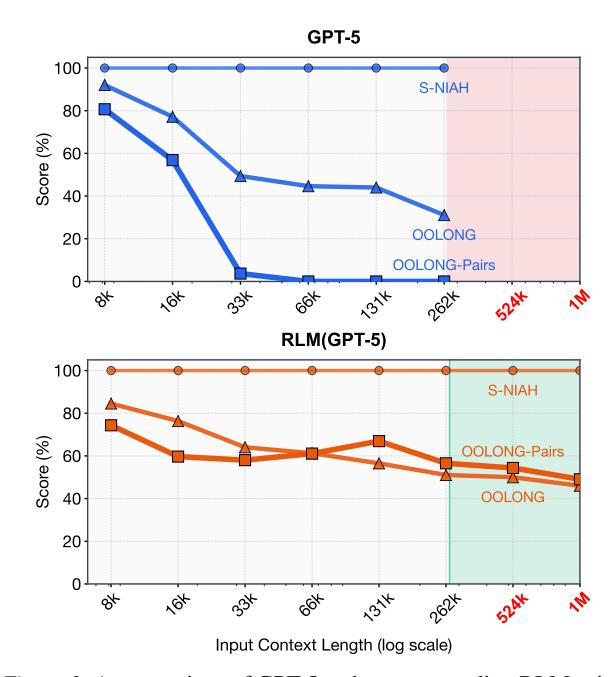
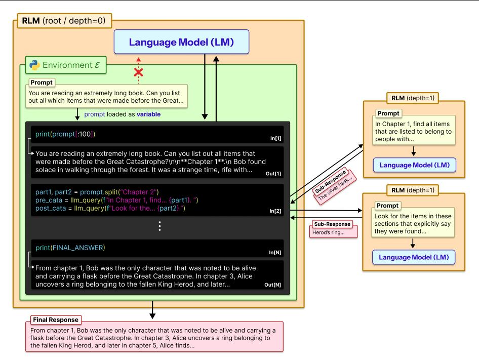
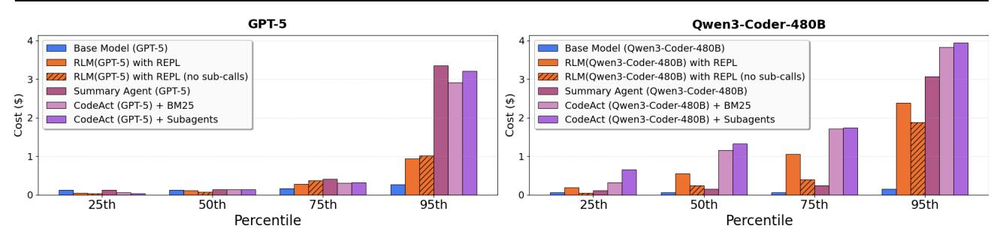

# **Recursive Language Models**

#### Alex L. Zhang 1 Tim Kraska 1 Omar Khattab 1

#### **Abstract**

We study allowing large language models (LLMs) to process arbitrarily long prompts through the lens of inference-time scaling. We propose **Re**cursive Language Models (RLMs), a general inference paradigm that treats long prompts as part of an external environment and allows the LLM to programmatically examine, decompose, and recursively call itself over snippets of the prompt. We find that RLMs can successfully process inputs up to two orders of magnitude beyond model context windows and, even for shorter prompts, dramatically outperform the quality of vanilla frontier LLMs and common long-context scaffolds across four diverse longcontext tasks while having comparable cost. At a small scale, we post-train the first natively recursive language model. Our model, RLM-**Qwen3-8B**, outperforms the underlying Qwen3-8B model by 28.3% on average and even approaches the quality of vanilla GPT-5 on three long-context tasks. Code is available at https:

//github.com/alexzhang13/rlm.

#### 1. Introduction

Frontier reasoning models have limited context windows and, even within their limits, tend to exhibit context rot (Hong et al., 2025), a phenomenon illustrated in Figure 1 where quality degrades steeply as prompts get longer. Though we expect context lengths to steadily rise through improvements to training, architecture, and infrastructure, we are interested in whether it is possible to scale the context size of general-purpose LLMs by orders of magnitude. This is increasingly urgent as LLMs begin to be widely adopted for long-horizon tasks, in which they must routinely process tens if not hundreds of millions of tokens.

We study this question through the lens of scaling inferencetime compute. We are inspired by the way that reasoning models have become the fundamental interface to LLMs,

Preprint. January 29, 2026.

<span id="page-0-0"></span>

Figure 1. A comparison of GPT-5 and a corresponding RLM using GPT-5 on three long-context tasks of increasing complexity: S-NIAH, OOLONG, and OOLONG-Pairs. For each task, we scale the input length from  $2^{13}$  to  $2^{18}$ . GPT-5 performance degrades significantly as a function of both input length and task complexity, while the RLM maintains strong performance. Inputs beyond the red region do not fit in GPT-5's context window of 272K tokens, but the RLM handles them effectively. Additional experiments across other models and benchmarks are in §3.

resulting not only in empirical gains but also additional theoretical expressive power (Merrill & Sabharwal, 2024) compared to vanilla Transformers. Though most inference-time methods for dealing with long context are task-specific (Wu et al., 2021; Chang et al., 2024), the most popular general approach is *context condensation* or *compaction* (Khattab et al., 2021; Smith, 2025; OpenAI, 2025b; Wu et al., 2025), where context from user requests or agent trajectories is repeatedly summarized once it exceeds a length threshold. Unfortunately, compaction is rarely expressive enough for tasks that require dense access throughout the prompt. It presumes that some details that appear early in the prompt can safely be forgotten to make room for new content.

We introduce Recursive Language Models (RLMs), a general-purpose inference paradigm for dramatically scaling the effective input and output lengths of LLMs. The key

<sup>&</sup>lt;sup>1</sup>MIT CSAIL, Cambridge, MA, USA. Correspondence to: Alex L. Zhang, Omar Khattab <altzhang@mit.edu, okhattab@mit.edu>.

<span id="page-1-0"></span>

*Figure 2.* A Recursive Language Model (RLM) treats prompts as part of the environment. It loads the input prompt as a variable inside a REPL environment E and writes code to peek into, decompose, and invoke itself recursively over programmatic snippets of the variable.

insight is that arbitrarily long user prompts should not be fed into the neural network (e.g., Transformer) directly but should instead be treated as *part of the environment that the LLM is tasked to symbolically and recursively interact with*.

As Figure [2](#page-1-0) shows, an RLM exposes the same external interface as an LLM or a reasoning model: it accepts a string prompt of arbitrary structure and produces a string response. Given a prompt P, the RLM initializes a Read-Eval-Print Loop (REPL) programming environment in which P is set as the value of a variable. It then offers the LLM general context about the REPL environment (e.g., the length of the string P), and permits it to write code that peeks into and decomposes P, and to iteratively observe any side effects from execution. Crucially, RLMs encourage the LLM to understand, transform, and execute the input prompt by *writing symbolic programs that invoke the LLM itself* on as many slices of the input as necessary.

By treating the prompt itself as an external object and enabling symbolic recursion, RLMs tackle limitations of expressive power in recent work on coding agents, retrieval agents, and sub-agent delegation. In particular, prior coding agents and retrieval agents treat some designated external data source (e.g., a filesystem or a corpus of search documents) as an environment for fetching snippets. However, they *can only fill up the underlying LLM's context window with snippets before breaking down*. Similarly, prior selfdelegation approaches [\(Anthropic,](#page-8-1) [2025;](#page-8-1) [Sentient AI,](#page-10-0) [2025;](#page-10-0) [Schroeder et al.,](#page-10-1) [2025;](#page-10-1) [Sun et al.,](#page-11-3) [2025\)](#page-11-3) allow LLMs to invoke themselves as sub-agents. However, they *are hand-* *icapped by the underlying LLM's limited output lengths* because they are designed to verbalize sub-calls autoregressively rather than producing them programmatically.

We evaluate RLMs using a frontier closed model (GPT-5; [Singh et al.](#page-10-2) [2025\)](#page-10-2) and a frontier open model (Qwen3- Coder-480B-A35B; [Qwen Team](#page-10-3) [2025b\)](#page-10-3) across four tasks with varying levels of complexity: deep research [\(Chen](#page-8-2) [et al.,](#page-8-2) [2025\)](#page-8-2), information aggregation [\(Bertsch et al.,](#page-8-3) [2025\)](#page-8-3), code repository understanding [\(Bai et al.,](#page-8-4) [2025\)](#page-8-4), and a synthetic pairwise reasoning task where even frontier models fail catastrophically. We compare RLMs against direct LLM calls as well as context compaction, retrieval tool-use agents, and code-generation agents.

We find that RLMs demonstrate extremely strong performance even at the 10M+ token scale, and substantially outperform all other approaches at long-context processing, in many cases by double-digit percentage gains while maintaining comparable cost. In particular, as demonstrated in Figure [1,](#page-0-0) RLMs exhibit far less severe degradation for longer contexts and more sophisticated tasks.

Finally, at a small scale, we post-train the first natively recursive language model, demonstrating that RLMs can be improved quickly with little additional training. While a small open model (Qwen3-8B; [Yang et al.](#page-11-4) [2025\)](#page-11-4) struggles to solve long context tasks even in an RLM scaffold, our simple general-purpose training recipe uses only 1,000 samples from unrelated domains to improve its performance by a median of 28.3% across the four evaluation tasks.

# 2. Recursive Language Models

Given a base neural language model M with maximum context size K, a Recursive Language Model (RLM) is an inference-time scaffold around M that treats the user prompt as part of the environment without giving up the ability to densely process its content through different calls to M. Given an arbitrary-length prompt string P ∈ Σ ⋆ , an RLM interacts with a persistent external environment E and returns a response string Y ∈ Σ ⋆ (Figure [2\)](#page-1-0). We would like effectively *unbounded input tokens* (|P| ≫ K), *unbounded output tokens*, and an *unbounded semantic horizon*, e.g. the ability to do Ω(|P|) or Ω(|P| 2 ) semantic work.

Algorithm [1](#page-2-0) describes how an RLM achieves this. Given a prompt P, the RLM initializes a persistent REPL programming environment with a variable containing the user prompt as a string and a function for invoking a sub-RLM with a new prompt. Then, it starts the RLM loop. In the first iteration, the algorithm invokes the *root* neural model M with only (constant-size) metadata about the user prompt, like its length, a short prefix, and how to access parts of it.

The root is instructed via prompting (Appendix [C\)](#page-14-0) and/or fine-tuning (Appendix [A\)](#page-12-0) to operate like an RLM: that is, to *generate code that helps it understand and transform its parts of its prompt* P, and to build up intermediate values and the final response into new variables, potentially by *invoking the sub-RLM within loops*. In Section [4,](#page-4-0) we find that existing LLMs can be prompted to do this and that training an 8B model to be natively recursive is promising.

Each iteration of the RLM loop executes code in the REPL, updates REPL state (intermediate variables), and collects in stdout any printed text. Only (constant-size) metadata about stdout, like a short prefix and length, is appended to M's history for the next iteration.[1](#page-2-1) Once the RLM sets the variable Final inside the REPL, iteration stops and the value in Final is returned as the response.

RLMs make three simple design choices that are missing from existing scaffolds. To highlight these, we include Algorithm [2](#page-2-2) to illustrate a deceptively "similar" algorithm that is far less expressive. Both algorithms support some notion of sub-calls, external objects, and code execution, but they differ in terms of where the prompt and intermediate values live and where recursion occurs.

First, an RLM must give the underlying LLM M a *symbolic handle* to the user prompt P, so the model can manipulate it

```
Algorithm 1 A recursive language model, around LLM M
Input: prompt P
Output: response Y
state ← InitREPL(prompt=P)
state ← AddFunction(state, sub_RLMM)
hist ← [Metadata(state)]
while True do
   code ← LLMM(hist)
   (state, stdout) ← REPL(state, code)
   hist ← hist ∥ code ∥ Metadata(stdout)
   if state[Final] is set then
      return state[Final]
```

<span id="page-2-2"></span>Algorithm 2 Alternate scaffold with standard (poor) design choices for prompts, sub-calls, and code execution

```
Input: prompt P
Output: response Y
actions ← {Finish, Exec, Search, sub_LLMM}
hist ← [Metadata(actions), P] // Flaw #1
while True do
  (action, val) ← LLMM(hist)
  if action is Finish then
     return val // Flaw #2
  out ← RUN(action, val) // Flaw #3
  hist ← hist ∥ (action, val, out)
  if Tok(hist) > K then
     hist ← Compact(hist)
```

without copying text into the root context window. Instead, ineffective Algorithm [2](#page-2-2) starts by putting the user prompt P into the LLM context window (hist) and thus inherits the window limitations of M and falls back to heuristics like context compaction. Even though the scaffold can access external data with, say, a Search action or filesystem access, it is fatally bounded with respect to user input.

Second, ineffective Algorithm [2](#page-2-2) asks M to autoregressively generate the output directly, via a Finish action. This may seem innocuous, but it means that it also cannot generate longer outputs than the context window of M permits.

Third, and perhaps most importantly, an RLM requires *symbolic recursion*. That is, code running *inside* E must be able to invoke M on programmatically constructed transformations of P (e.g., inside arbitrarily large loops), storing intermediate results symbolically. Though Algorithm [2](#page-2-2) includes both a code execution action and a "sub-LLM" action separately, it is not able to invoke the sub-LLM programmatically and hence can only delegate a few *explicitly verbalized tasks* rather than writing short programs that can, say, loop over slices of the prompt and launch Ω(|P|) or even Ω(|P| 2 ) processes to understand or transform all parts of P.

<span id="page-2-1"></span><sup>1</sup>This is key: it forces M to rely on variables and sub-calls to manage long strings instead of polluting its window. In principle, if we trim each turn to c tokens, we will have at most K/c root iterations, each of which can launch arbitrarily many sub-calls. This is not a fundamental limitation, e.g. one could move the root horizon itself into a variable, but we typically want to limit the iterations at any level of recursion irrespective.

# <span id="page-3-0"></span>3. Scaling Long Context Tasks

We hypothesize that the effective context window [\(Hsieh](#page-9-4) [et al.,](#page-9-4) [2024;](#page-9-4) [Goldman et al.,](#page-8-5) [2025;](#page-8-5) [Hong et al.,](#page-9-0) [2025\)](#page-9-0) of an LLM cannot be understood independently of the *specific task*. That is, more "complex" problems will exhibit degradation at even *shorter* lengths than simpler ones. Because of this, we must characterize tasks in terms of how their complexity *scales with prompt length*.

For example, needle-in-a-haystack (NIAH) problems generally keep 'needles' constant as prompt length is scaled. As a result, frontier models can now reliably solve these tasks in RULER [\(Hsieh et al.,](#page-9-4) [2024\)](#page-9-4) in the 1M+ token settings but struggle at far shorter lengths on OOLONG [\(Bertsch et al.,](#page-8-3) [2025\)](#page-8-3), a task where the answer depends explicitly on almost every line in the prompt.[2](#page-3-1)

#### 3.1. Tasks

We design our evaluation around tasks where we can vary the lengths of the prompts, so we can consider problems whose difficulties scale differently with context length.

S-NIAH. Following the single needle-in-the-haystack task in RULER [\(Hsieh et al.,](#page-9-4) [2024\)](#page-9-4), we consider a set of 50 single tasks that require finding a specific phrase or number in a large set of unrelated text. Here, the information being sought scales as O(1) with respect to input length.

BrowseComp-Plus (1K documents) [\(Chen et al.,](#page-8-2) [2025\)](#page-8-2). A multi-hop question-answering benchmark for DeepResearch [\(OpenAI,](#page-9-5) [2025a\)](#page-9-5) questions that requires reasoning over multiple different documents. The benchmark provides a verified offline corpus that is guaranteed to contain gold, evidence, and hard negative documents for each question. Following [Sun et al.](#page-11-3) [\(2025\)](#page-11-3), we use 150 randomly sampled instances as our evaluation set; we provide 1000 randomly chosen documents as input, in which the gold and evidence documents are guaranteed to exist. We report the percentage of correct answers. The answer to each task requires piecing together information from several documents, making this harder than S-NIAH despite also requiring a constant number of documents.

OOLONG [\(Bertsch et al.,](#page-8-3) [2025\)](#page-8-3). A long reasoning benchmark that requires transforming chunks of the input semantically, then aggregating these chunks to form a final answer. We report scoring based on the original paper, which scores numerical answers as score(ˆy) = 0.75<sup>|</sup>y−yˆ<sup>|</sup> and other answers as exact match. We focus specifically on the trec\_coarse split, a set of 50 tasks over a dataset of

questions with semantic labels. Each task requires using nearly all entries of the dataset, and therefore scales linearly in processing complexity relative to the input length.

OOLONG-Pairs. We modify the trec\_coarse split of OOLONG to include 20 new queries that specifically require aggregating *pairs* of chunks to construct the final answer. We report F1 scores over the answer. Each task requires using nearly all *pairs* of entries of the dataset, and therefore requires processing quadratically-many items relative to the input length. In Appendix [D.1,](#page-19-0) we provide all queries in this benchmark.

LongBench-v2 CodeQA [\(Bai et al.,](#page-8-4) [2025\)](#page-8-4). A multi-choice code repository understanding split from LongBench-v2 that is challenging for modern frontier models. We report the score as the percentage of correct answers. Each instance requires reasoning over a fixed number of files in a codebase to find the right answer.

#### <span id="page-3-2"></span>3.2. Methods and Baselines

We compare RLMs against commonly used task-agnostic inference methods, using two modern LMs, GPT-5 with medium reasoning [\(Singh et al.,](#page-10-2) [2025\)](#page-10-2) and default sampling parameters, and Qwen3-Coder-480B-A35B [\(Yang et al.,](#page-11-4) [2025\)](#page-11-4) using the sampling parameters described in [Qwen](#page-10-3) [Team](#page-10-3) [\(2025b\)](#page-10-3). For Qwen3-Coder-480B-A35B, we compute costs based on the compute provider Fireworks [\(Fireworks](#page-8-6) [AI,](#page-8-6) [2025\)](#page-8-6). In addition to evaluating the base model on all tasks, we also evaluate the following methods and baselines:

CodeAct (+ BM25). We compare directly to a Code-Act [\(Wang et al.,](#page-11-5) [2024\)](#page-11-5) agent that can execute code inside of a ReAct [\(Yao et al.,](#page-11-6) [2023\)](#page-11-6) loop. Unlike an RLM, CodeAct does not offload the user prompt to the code environment, and instead provides it directly to the LM. Furthermore, following [Jimenez et al.](#page-9-6) [\(2024\)](#page-9-6); [Chen et al.](#page-8-2) [\(2025\)](#page-8-2), we equip this agent with a BM25 [\(Robertson & Zaragoza,](#page-10-4) [2009\)](#page-10-4) retriever that indexes the input context for tasks where a retriever is appropriate.

CodeAct with sub-calls. To specifically ablate offloading the context as a variable in the REPL, we evaluate a Code-Act [\(Wang et al.,](#page-11-5) [2024\)](#page-11-5) baseline with the ability to invoke sub-LM calls. Compared to RLMs, this method loads the context directly into the model.

Summary agent. Following [Sun et al.](#page-11-3) [\(2025\)](#page-11-3); [Wu et al.](#page-11-2) [\(2025\)](#page-11-2); [Yu et al.](#page-11-7) [\(2025\)](#page-11-7), we consider an iterative agent that compacts the context as it is filled. For example, given a corpus of documents, it will iteratively accumulate the documents and summarize when full. In cases where a single document exceeds the model window, the agent will chunk it to fit within the model context window and invoke the same strategy over these chunks. For the GPT-5 experiments, due to the extremely high cost of applying this strategy to

<span id="page-3-1"></span><sup>2</sup>This helps explain the patterns seen in Figure [1](#page-0-0) earlier: GPT-5 scales effectively on the S-NIAH task, where the needle size is constant despite longer prompts, but shows faster degradation at increasingly *shorter* context lengths on the *linear*-complexity OOLONG and the *quadratic*-complexity OOLONG-Pairs.

<span id="page-4-1"></span>*Table 1.* Performance comparison of different methods across long-context benchmarks of varying complexity. In gray is the average API cost ± the standard deviation of each method on each task. <sup>∗</sup> indicates runs where a method (sometimes) ran into input context limits. Provider costs were computed under OpenAI for GPT-5 and Fireworks for other models. Non-zero scores are rounded to at least 0.1.

| Model                                       | CodeQA            | BrowseComp+ (1K)  | OOLONG            | OOLONG-Pairs      |
|---------------------------------------------|-------------------|-------------------|-------------------|-------------------|
| N<br>Task Length<br>(tokens)                | 23K-4.2M          | 6M-11M            | 131K              | 32K               |
| GPT-5<br>(with RLM sub-calls to GPT-5-mini) |                   |                   |                   |                   |
| Base Model                                  | 24.0∗             | 0.0∗              | 44.0              | 0.1               |
|                                             | (\$0.13 ± \$0.07) | (N/A) ± (N/A)     | (\$0.14 ± \$0.02) | (\$0.16 ± \$0.10) |
| CodeAct (+ BM25)                            | 22.0∗             | 51.0              | 38.0              | 24.7              |
|                                             | (\$0.06 ± \$0.08) | (\$0.71 ± \$1.20) | (\$0.61 ± \$1.06) | (\$0.75 ± \$0.43) |
| CodeAct (+ sub-calls)                       | 24.0∗             | 0.0∗              | 40.0              | 28.4              |
|                                             | (\$0.06 ± \$0.08) | (N/A) ± (N/A)     | (\$0.85 ± \$1.27) | (\$1.11 ± \$0.62) |
| Summary agent                               | 58.0              | 70.5              | 46.0              | 0.1               |
|                                             | (\$1.31 ± \$1.46) | (\$0.57 ± \$0.10) | (\$0.13 ± \$0.01) | (\$0.13 ± \$0.09) |
| RLM                                         | 62.0              | 91.3              | 56.5              | 58.0              |
|                                             | (\$0.11 ± \$0.10) | (\$0.99 ± \$1.22) | (\$0.43 ± \$0.85) | (\$0.33 ± \$0.20) |
| RLM (no sub-calls)                          | 58.0              | 88.0              | 36.0              | 43.9              |
|                                             | (\$0.18 ± \$0.56) | (\$0.44 ± \$0.90) | (\$0.37 ± \$0.42) | (\$0.69 ± \$1.16) |
| Qwen3-Coder-480B-A35B                       |                   |                   |                   |                   |
| Base Model                                  | 20.0∗             | 0.0∗              | 36.0              | 0.1               |
|                                             | (\$0.13 ± \$0.08) | (N/A) ± (N/A)     | (\$0.06 ± \$0.00) | (\$0.05 ± \$0.01) |
| CodeAct (+ BM25)                            | 24.0∗             | 12.7              | 38.0              | 0.3               |
|                                             | (\$0.17 ± \$0.08) | (\$0.39 ± \$0.50) | (\$1.51 ± \$1.09) | (\$1.54 ± \$0.35) |
| CodeAct (+ sub-calls)                       | 26.0∗             | 0.0∗              | 32.0              | 0.1               |
|                                             | (\$0.28 ± \$0.30) | (N/A) ± (N/A)     | (\$1.83 ± \$1.14) | (\$1.49 ± \$0.46) |
| Summary agent                               | 50.0              | 38.0              | 44.1              | 0.31              |
|                                             | (\$1.26 ± \$1.50) | (\$8.98 ± \$2.12) | (\$0.15 ± \$0.01) | (\$0.05 ± \$0.00) |
| RLM                                         | 56.0              | 44.7              | 48.0              | 23.1              |
|                                             | (\$0.92 ± \$1.23) | (\$0.84 ± \$0.63) | (\$0.61 ± \$0.49) | (\$1.02 ± \$0.52) |
| RLM (no sub-calls)                          | 66.0              | 46.0              | 43.5              | 17.3              |
|                                             | (\$0.18 ± \$0.58) | (\$0.82 ± \$0.69) | (\$0.32 ± \$0.13) | (\$1.77 ± \$1.23) |
| Qwen3-8B                                    |                   |                   |                   |                   |
| Base Model                                  | 4.0∗              | 0.0∗              | 0.0∗              | 0.1               |
|                                             | (\$0.01 ± \$0.00) | (N/A) ± (N/A)     | (N/A) ± (N/A)     | (\$0.01 ± \$0.00) |
| RLM                                         | 26.0              | 2.0               | 24.0              | 4.3               |
|                                             | (\$0.04 ± \$0.13) | (\$0.03 ± \$0.06) | (\$0.19 ± \$0.26) | (\$0.05 ± \$0.05) |
| RLM (fine-tuned)                            | 32.0              | 14.0              | 32.0              | 5.2               |
|                                             | (\$0.02 ± \$0.02) | (\$0.01 ± \$0.03) | (\$0.04 ± \$0.09) | (\$0.02 ± \$0.02) |

millions of tokens, we use GPT-5-nano for compaction and GPT-5 to provide the final answer.

RLM with REPL. We implement an RLM with a Python REPL environment, which loads a module for querying a sub-LM and uses a system prompt presented in Appendix [C.](#page-14-0) For the GPT-5 experiments, we use GPT-5-mini for the recursive LMs and GPT-5 for the root LM, as we found this choice to strike a good balance between the capabilities of RLMs and the cost of the recursive calls. We notate a RLM using a model as RLM(model), e.g. RLM(GPT-5).

RLM with REPL, no sub-calls. We provide an ablation of our method, in which the prompt is loaded in a REPL environment without the ability to invoke sub-LM calls.

Finetuning. To create RLM-Qwen3-8B, we finetune Qwen3-8B on 1,000 filtered trajectories of Qwen3-Coder-480B-A35B as an RLM with Qwen3-8B sub-calls on Long-BenchPro [\(Chen et al.,](#page-8-7) [2026\)](#page-8-7) tasks. We use sampling parameters described in [Qwen Team](#page-10-5) [\(2025a\)](#page-10-5), and evaluate the fine-tuned RLM-Qwen3-8B as an RLM on our long context tasks. The key insight for training is that being an effective

sub-call model is roughly similar to being a general purpose reasoning model, so we can make the training much more tractable (and seemingly short-horizon) at small scale by focusing on improving the root model's ability to manipulate the REPL and to launch recursive calls. We provide more training details in Appendix [A.](#page-12-0)

# <span id="page-4-0"></span>4. Results and Discussion

Table [1](#page-4-1) reports our main results. We additionally explore how vanilla frontier model performance and RLM performance degrades as input contexts grow in Figure [1.](#page-0-0)

Observation 1: RLMs can scale to the 10M+ token regime and can outperform base LMs and existing taskagnostic agent scaffolds on long context tasks. Across all tasks, RLMs demonstrate strong performance on prompts well beyond the effective context window of a frontier LM, outperforming base models and common long-context scaffolds by up to 2× the performance while maintaining comparable or cheaper average token costs. Notably, RLMs scale well beyond the base models' context window. For

<span id="page-5-0"></span>

*Figure 3.* Cost of RLM and baselines described in [§3.2](#page-3-2) plotted at the 25th, 50th, 75th, and 95th percentile of total API cost. We observe comparable or even lower costs for RLMs at the 50th percentile, but sharp increases at the tail end due to potentially long RLM trajectories.

instance, on BrowseComp-Plus (1K), a linearly extrapolated cost for GPT-5-mini ingesting 6-11M input tokens is \$1.50 − \$2.75, while RLM(GPT-5) has an average cost of \$0.99 and outperforms both the summarization and retrieval baselines by over 29%.

Furthermore, on tasks where processing costs scale with the input context, RLMs make significant improvements over the base model, even on tasks within the model's context window. On OOLONG, the RLM with GPT-5 and Qwen3- Coder outperform the base model by 28.4% and 33.3% respectively. On OOLONG-Pairs, both GPT-5 and Qwen3- Coder make little progress with F1 scores of <0.1%, while the RLM using these models achieve F1 scores of 58.0% and 23.1% respectively, highlighting the emergent capability of RLMs to handle extremely information-dense tasks.

Observation 2: The REPL is necessary for handling long inputs, while the recursive sub-calling of RLMs provides strong benefits on information-dense inputs. A key characteristic of RLMs is offloading the context as a variable in an environment E that the model can interact with. Even without sub-calling capabilities, our ablation of the RLM is able to scale beyond the context limit of the model and outperform other task-agnostic baselines on most long context settings. On the CodeQA and BrowseComp+ tasks with Qwen3-Coder, this ablation is able to outperform the RLM by 17.9% and 3% respectively.

On information-dense tasks like OOLONG or OOLONG-Pairs, we observed several cases where recursive LM subcalling is necessary. In [§4.1,](#page-6-0) we see RLM(Qwen3-Coder) perform the necessary semantic transformation line-by-line through recursive sub-calls, while the ablation without subcalls is forced to use keyword heuristics to solve these tasks. Across all information-dense tasks, RLMs outperform the ablation without sub-calling by 10%-59%.

Observation 3: LM performance degrades as a function of input length and problem complexity, while RLM performance scales better. The benchmarks S-NIAH, OO-LONG, and OOLONG-Pairs contain a fixed number of tasks over contexts with lengths ranging from 2 <sup>13</sup> to 2 <sup>18</sup>. Each

benchmark can be loosely categorized by different processing complexity of the input context with respect to length (roughly constant, linear, and quadratic respectively). In Figure [1,](#page-0-0) we directly compare an RLM using GPT-5 to base GPT-5 on each task. We find that GPT-5 performance degrades significantly faster for more complex tasks, while RLM performance degrades at a much slower rate, which aligns with the findings of [Goldman et al.](#page-8-5) [\(2025\)](#page-8-5). For context lengths beyond 2 <sup>14</sup>, the RLM consistently outperforms GPT-5.

Furthermore, RLM costs scale proportionally to the complexity of the task, while still remaining in the same order of magnitude of cost as GPT-5 (see Figure [11](#page-37-0) in Appendix [F\)](#page-33-0). In [§4.1,](#page-6-0) we explore the choices that the RLM makes that cause these differences in cost. Lastly, in this setting, we also observe that the base LM outperforms RLM in the small input context regime. By construction, a RLM has strictly more representation capacity than an LM. In practice, however, we observe that RLM performance is slightly worse on smaller input lengths, suggesting a tradeoff point between when to use a base LM and when to use an RLM.

Observation 4: The inference cost of RLMs remains comparable to a base LM call but has high variance due to differences in trajectory lengths. RLMs iteratively interact with their context until they find a suitable answer, leading to large differences in iteration length depending on task complexity. In Figure [3,](#page-5-0) we plot the quartile costs for each method across all experiments in Table [1](#page-4-1) excluding BrowseComp-Plus (1K), as the base models cannot fit any of these tasks in context. For GPT-5, the median RLM run is cheaper than the median base model run, but many outlier RLM runs are significantly more expensive than any base model query. However, compared to the summarization agent which ingests the entire input context, RLMs are up to 3× cheaper while maintaining stronger performance across all tasks because the RLM is able to selectively view context.

We additionally report runtime numbers of each method in Figures [7,](#page-34-0) [8](#page-34-1) in Appendix [F,](#page-33-0) but we note several important caveats. Unlike API costs, these numbers are heavily dependent on implementation details such as the machine used,

API request latency, and the asynchrony of LM calls. In our implementation of the baselines and RLMs, all LM calls are blocking / sequential. Nevertheless, similar to costs, we observe a wide range of runtimes, especially for RLMs.

Observation 5: RLMs are a model-agnostic inference strategy, but different models exhibit different overall decisions on context management and sub-calling. While GPT-5 and Qwen3-Coder-480B both exhibit strong performance as RLMs relative to their base model and other baselines, they also exhibit different performance and behavior across all tasks. On BrowseComp-Plus (1k) in particular, RLM(GPT-5) nearly solves all tasks while RLM(Qwen3- Coder) struggles to solve half.

We note that the RLM system prompt is fixed for each model across all experiments and is not tuned for any particular benchmark. Between GPT-5 and Qwen3-Coder, the only difference in the prompt is an extra line in the RLM(Qwen3- Coder) prompt warning against using too many sub-calls (see Appendix [C\)](#page-14-0). We provide an explicit example of this difference in example [E.3,](#page-30-0) where RLM(Qwen3-Coder) launches a sub-call per line in OOLONG while GPT-5 is conservative about sub-querying LMs.

Observation 6: Training RLMs on one domain can improve general downstream RLM performance. Certain behavior in RLM trajectories are common among different domains, such as probing the input and recursively sub-calling on shorter contexts. In Table [1,](#page-4-1) we find that RLM-Qwen3-8B, a Qwen3-8B model that we fine-tuned on RLM(Qwen3-Coder-480B-A35B) trajectories on a small, *unrelated* set of tasks (LongBenchPro; [Chen et al.](#page-8-7) [2026\)](#page-8-7) considerably outperforms the base Qwen3-8B as an RLM by 28.3% on average. Furthermore, its inference costs are much lower due to better decision making and fewer mistakes as an RLM.

#### <span id="page-6-0"></span>4.1. Emergent Patterns in RLM Trajectories

Even without explicit training, RLMs exhibit interesting context and problem decomposition behavior. We select several examples of snippets from RLM trajectories to understand how they solve long context problems and where they can improve. We discuss particular examples of interesting behavior here, with additional examples in Appendix [E.](#page-23-0)

Chunking and recursively sub-calling LMs. RLMs defer essentially unbounded-length reasoning chains to sub-LM calls. The choice of decomposition can greatly affect task performance, especially for information-dense problems. In our experiments, we did not observe complicated partitioning strategies beyond uniform chunking or keyword searches. In Figure [4b](#page-7-0), RLM(Qwen3-Coder) chunks by newline in a 1000+ line context from OOLONG.

Filtering input information using code execution based

on model priors. A key intuition for why the RLM abstraction can maintain strong performance on huge inputs without exploding costs is the LM's ability to filter input context without explicitly seeing it. Furthermore, model priors enable the RLM to narrow the search space and process fewer input tokens. As an example, in Figure [4a](#page-7-0), we observed RLM(GPT-5) using regex queries to search for chunks containing keywords in the original prompt (e.g. "festival") and phrases it has a prior about (e.g. "La Union").

Passing recursive LM outputs through variables for long output tasks. RLMs are able to produce essentially unbounded tokens well beyond the limit of the base LM by returning variables in the REPL as output. Through the REPL, the RLM can iteratively construct these variables as a mixture of programmatic and sub-(R)LM output calls. We observed this strategy used heavily in OOLONG-Pairs trajectories, where the RLM stored the output of sub-LM calls over the input in variables and stitched them together to form a final answer (see Figure [4c](#page-7-0)).

# 5. Related Works

Long-Context LM Systems. There have primarily been two orthogonal directions for long-context management in language model systems: 1) directly changing the architecture of and retraining the base LM to handle longer contexts [\(Press et al.,](#page-10-6) [2022;](#page-10-6) [Gu et al.,](#page-9-7) [2022;](#page-9-7) [Munkhdalai](#page-9-8) [et al.,](#page-9-8) [2024\)](#page-9-8), and 2) building a scaffold around the LM that implicitly handles the context – RLMs focus on the latter. One popular class of such strategies is *lossy* context management, which uses summarization or truncation to compress the input context at the cost of potentially losing fine-grained information. For example, MemWalker [\(Chen](#page-8-8) [et al.,](#page-8-8) [2023\)](#page-8-8) constructs a tree-like data structure of the input that the LM can navigate when answering long context questions. ReSum [\(Wu et al.,](#page-11-2) [2025\)](#page-11-2) is another work that adds a summarization tool to periodically compress the context of a multi-turn agent. Another class of strategies implement an explicit memory hierarchy in the agent scaffold [\(Packer et al.,](#page-9-9) [2024;](#page-9-9) [Chhikara et al.,](#page-8-9) [2025;](#page-8-9) [Zhang et al.,](#page-11-8) [2025\)](#page-11-8). RLMs differ from these works in that all context window management is implicitly handled by the LM itself.

Task Decomposition through sub-LM calls. Many LMbased agents [\(Guo et al.,](#page-9-10) [2024;](#page-9-10) [Anthropic,](#page-8-1) [2025\)](#page-8-1) use multiple, well-placed LM calls to solve a problem; however, many of these calls are placed based on human-engineered workflows. Several methods like ViperGPT [\(Surís et al.,](#page-11-9) [2023\)](#page-11-9), THREAD [\(Schroeder et al.,](#page-10-1) [2025\)](#page-10-1), DisCIPL [\(Grand](#page-9-11) [et al.,](#page-9-11) [2025\)](#page-9-11), ReDel [\(Zhu et al.,](#page-11-10) [2024\)](#page-11-10), Context Folding [\(Sun](#page-11-3) [et al.,](#page-11-3) [2025\)](#page-11-3), and AgentFold [\(Ye et al.,](#page-11-11) [2025\)](#page-11-11) have explored deferring the choice of sub-LM calls to the LM. These techniques emphasize *task* decomposition through recursive LM calls, but are unable to handle long context inputs beyond

*Figure 4.* RLMs have common patterns in their trajectories when solving tasks. (a) We frequently observed RLMs filtering and interacting with their context through regex code. (b) We found that RLMs can effectively decompose their context through recursive sub-calls (c) On long-output tasks, RLMs are able to solve sub-problems using recursive sub-LM calls and stitch their outputs to form a final output.

the length of the base LM. RLMs, on the other hand, are enabled by an extremely simple intuition (i.e., placing the prompt in the external environment) to *symbolically* manipulate arbitrarily long strings and to iteratively refine their recursion via execution feedback from the persistent REPL.

# 6. Limitations and Future Work

While RLMs show strong performance on tasks beyond the context window limitations of existing LMs at reasonable inference costs, evaluations for more difficult and natural long-context processing tasks and the best mechanisms for implementing RLMs both remain highly under-explored. We focused on synchronous sub-calls inside of a Python REPL environment, but we note that alternative strategies involving asynchronous sub-calls and sandboxed REPLs can potentially significantly reduce the runtime and inference cost of RLMs. Furthermore, we chose to use a max recursion depth of one (i.e. sub-calls are LMs); while we found strong performance on existing long-context benchmarks, we believe that future work should investigate deeper levels of recursion or even new hybrids between symbolic recursion and neural attention. We include additional limitations and negative results in Appendix [B.](#page-13-0)

Lastly, we focused our experiments on evaluating RLMs using *existing* frontier models, but show initial evidence on a Qwen3-8B model that explicitly training a model to be used as a RLM provides very rapid performance improvements, even outside the training domain. We hypothesize that RLM trajectories can be viewed as a form of reasoning [\(OpenAI](#page-9-12) [et al.,](#page-9-12) [2024;](#page-9-12) [DeepSeek-AI et al.,](#page-8-10) [2025\)](#page-8-10), which can be trained by bootstrapping existing models [\(Zelikman et al.,](#page-11-12) [2022;](#page-11-12) [2024\)](#page-11-13). We hope that training native RLMs can be treated as a new axis of scale to improve LM performance on general and long-horizon tasks.

# 7. Conclusion

We introduced Recursive Language Models (RLMs), a general inference framework for language models that offloads the input context and enables language models to recursively sub-query language models before providing an output. We explored an instantiation of this framework that offloads the context into a Python REPL environment as a variable in memory, enabling the LM to reason over its context in code and recursive LM calls, rather than purely in token space. Our results across multiple settings and models demonstrated that RLMs are an effective task-agnostic paradigm for both long-context problems and general reasoning. Building on our small fine-tuning experiments, we are excited to see future work that explicitly trains models to reason as RLMs, which could result in another axis of scale for the next generation of language model systems.