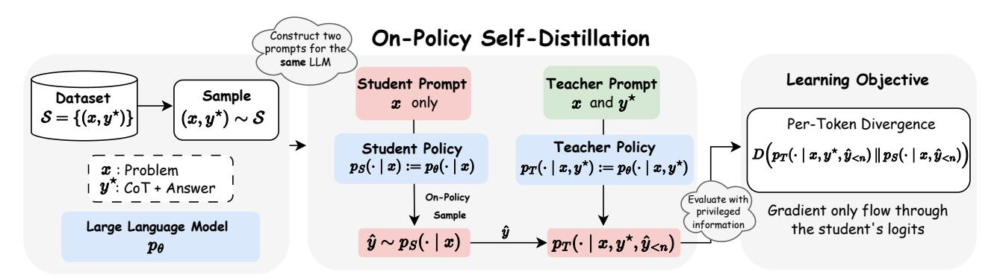
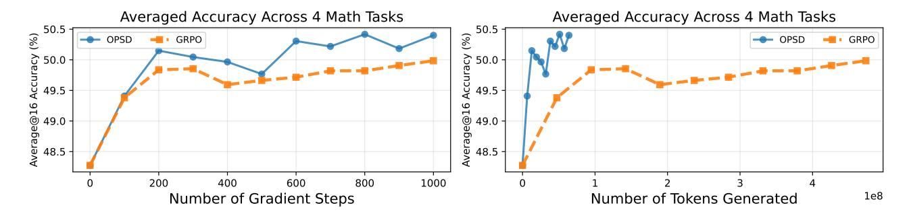
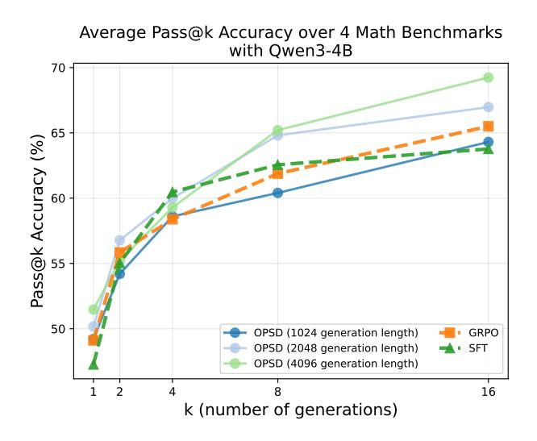

# Self-Distilled Reasoner: On-Policy Self-Distillation for Large Language Models

Siyan Zhao† 1 Zhihui Xie2 Mengchen Liu3 Jing Huang3 Guan Pang3 Feiyu Chen\*,‡ 3 Aditya Grover\* 1

# **Abstract**

Knowledge distillation improves large language model (LLM) reasoning by compressing the knowledge of a teacher LLM to train smaller LLMs. On-policy distillation advances this approach by having the student sample its own trajectories while a teacher LLM provides dense token-level supervision, addressing the distribution mismatch between training and inference in off-policy distillation methods. However, onpolicy distillation typically requires a separate, often larger, teacher LLM and does not explicitly leverage ground-truth solutions available in reasoning datasets. Inspired by the intuition that a sufficiently capable LLM can rationalize external privileged reasoning traces and teach its weaker self (i.e., the version without access to privileged information), we introduce *On-Policy* Self-Distillation (OPSD), a framework where a single model acts as both teacher and student by conditioning on different contexts. The teacher policy conditions on privileged information (e.g., verified reasoning traces) while the student policy sees only the question; training minimizes the pertoken divergence between these distributions over the student's own rollouts. We demonstrate the efficacy of our method on multiple mathematical reasoning benchmarks, achieving 4-8× token efficiency compared to reinforcement learning methods such as GRPO and superior performance over off-policy distillation methods.

# 1. Introduction

Recent advances in large language models (LLMs) have demonstrated impressive capabilities in reasoning and instruction following. Achieving these capabilities during

Preprint.

post-training typically relies on reinforcement learning methods such as Reinforcement Learning with Verifiable Rewards (RLVR) (e.g., GRPO (Shao et al., 2024; Guo et al., 2025; Team et al., 2025; Rastogi et al., 2025; Yu et al., 2025)), supervised fine-tuning (SFT) on high-quality reasoning datasets (Guha et al., 2025; Team et al., 2025; Xiaomi, 2026), or knowledge distillation, where recent work has shown that distillation from advanced teacher models can outperform RL in both performance and training efficiency (Yang et al., 2025; Xiaomi, 2026; Lu & Lab, 2025).

Despite their respective successes, each approach has inherent limitations. RLVR suffers from inefficiencies including: (1) sampling a group of responses per prompt is computationally expensive and can introduce high variance in estimating the true value function; moreover, when all samples are either correct or incorrect, the gradient signal vanishes (Yu et al., 2025; Zhao et al., 2025); and (2) the reward signal is sparse and uniformly applied across all tokens in the generated output, neglecting fine-grained token-level feedback. Supervised fine-tuning suffers from exposure bias and weaker generalization (Agarwal et al., 2024; Chu et al., 2025). Traditional knowledge distillation provides dense token-level supervision from a teacher model but relies on off-policy data (Hinton et al., 2015). Recent advances in on-policy distillation—where a student model samples its own trajectories while a teacher policy provides dense token-level supervision—have demonstrated superior sample efficiency by combining the distributional realism of on-policy training with dense feedback (Agarwal et al., 2024; Lu & Lab, 2025).

While on-policy distillation has shown strong performance, it relies on a distinct teacher model to supervise the student. Given that modern LLMs already exhibit strong reasoning capabilities, we ask this research question: *can a model effectively serve as its own teacher through self-distillation?* Our approach is inspired by human learning: after solving a problem incorrectly, a student can examine the correct solution, rationalize its steps, and identify where their reasoning failed. Prior work has shown that for LLMs, evaluation is often easier than generation (Sun et al., 2024; Naor, 1996). We hypothesize that *rationalization*—explaining a given correct answer—is similarly easier than generation. Motivated

\*Equal advising,† Work done at UCLA and during Siyan's parttime internship at Meta.,‡ Work done at Meta. ¹UCLA ²HKU ³Meta Superintelligence Labs. Correspondence to: Siyan Zhao <siyanz@g.ucla.edu>.

Figure 1. Overview of On-Policy Self-Distillation (OPSD): Given a reasoning dataset  $S = \{(x_i, y_i^*)\}_{i=1}^N$ , we instantiate two policies from the same LLM: a *student policy*  $p_S(\cdot \mid x)$  and a *teacher policy*  $p_T(\cdot \mid x, y^*)$ . The student generates an on-policy response  $\hat{y} \sim p_S(\cdot \mid x)$ . Both policies then evaluate this trajectory to produce next-token distributions  $p_S(\cdot \mid x, \hat{y}_{\leq n})$  and  $p_T(\cdot \mid x, y^*, \hat{y}_{\leq n})$  at each step  $p_S(\cdot \mid x, \hat{y}_{\leq n})$  along the student's rollout. Crucially, gradients backpropagate only through the student's logits, allowing the model to self-distil.

by this, we instantiate both the teacher and student policies from a single LLM. The teacher policy is provided with privileged information  $y^*$ , such as the ground-truth answer or a reference chain-of-thought, while the student policy conditions only on the problem x. Concretely, the teacher policy  $p_T(\cdot \mid x, y^*)$  conditions on both the problem and the privileged answer, whereas the student policy  $p_S(\cdot \mid x)$  observes only the problem. We preserve the on-policy training paradigm by sampling trajectories  $\hat{y}$  exclusively from the student policy, which then receives dense, token-level supervision from the privileged teacher policy.

We therefore propose **On-Policy Self-Distillation (OPSD)**, a framework in which a single model plays both teacher and student roles. The student samples its own trajectories  $\hat{y} \sim p_S(\cdot \mid x)$ ; we then compute the per-token divergence between the student and teacher distributions and minimize it over the student's own rollouts. This formulation (i) uses on-policy supervision (the student's own trajectories), (ii) provides dense per-token feedback, (iii) exploits ground-truth solutions  $y^*$ , and (iv) requires no separate teacher model. The learning process is captured by the loss

$$\mathcal{L}_{\text{OPSD}}(\theta) = \mathbb{E}_{(x,y^{\star}) \sim \mathcal{S}} \, \mathbb{E}_{\hat{y} \sim p_{S}(\cdot \mid x)} \sum_{n=1}^{|\hat{y}|} D\Big(p_{T}(\cdot \mid x, y^{\star}, \hat{y}_{< n}) \, \Big\| \, p_{S}(\cdot \mid x, \hat{y}_{< n})\Big). \quad (1)$$

In summary, our contributions are as follows:

- We introduce On-Policy Self-Distillation, a novel framework that enables a single model to act as both teacher and student, leveraging ground-truth answers to provide dense token-level supervision on student rollouts.
- We evaluate OPSD on four competition-level mathematical reasoning tasks, demonstrating that it outperforms

- both RLVR (e.g., GRPO) and supervised fine-tuning baselines.
- We show that OPSD achieves better performance with nearly 8× improved token efficiency and lower computational cost than GRPO.
- We analyze the impact of model scale, finding that moderate model capacity is necessary for successful self-distillation. We further compare different divergence objectives and analyze the effect of student generation length.

#### 2. Background

# 2.1. Knowledge Distillation for Autoregressive Large Language Models

Knowledge distillation transfers knowledge from a larger teacher model to a smaller student model by training the student to mimic the teacher's behavior (Hinton et al., 2015; Kim & Rush, 2016; Sanh et al., 2019). The core insight is that the teacher's soft probability distribution over classes contains richer information than hard labels alone, as it reveals the teacher's learned similarities between classes. For auto-regressive language models, given a dataset  $\mathcal{S} = \{(x, y^\star)\}$  where x denotes an input and  $y^\star$  is the corresponding reference output, both teacher  $p_T$  and student  $p_S$  define token-level distributions over vocabulary  $\mathcal{V}$ . Traditional supervised distillation minimizes a divergence D between teacher and student distributions averaged over a fixed dataset:

$$\mathcal{L}_{\text{Supervised Distillation}}(\theta) = \mathbb{E}_{(x,y)\sim\mathcal{S}}[D(p_T||p_S)(y|x)], \quad (2)$$

where 
$$D(p_T || p_S)(y|x) = \frac{1}{|y|} \sum_{n=1}^{|y|} D(p_T(\cdot | y_{< n}, x) || p_S(\cdot | y_{< n}, x))$$
 measures per-token discrepancy. However, this off-policy approach suffers from distribution mismatch: the student encounters

|                       | SFT/Off-Policy Distillation | GRPO | On-Policy Distillation | On-Policy Self-Distillation (Ours) |
|-----------------------|--------------------------------|------|---------------------------|---------------------------------------|
| On-Policy Data        | X                              | ✓    | ✓                         | ✓                                     |
| Dense Learning Signal | ✓                              | X    | ✓                         | ✓                                     |
| Low Sampling Cost     | ✓                              | X    | ✓                         | ✓                                     |
| No External Teacher   | ✓                              | ✓    | ×                         | ✓                                     |

*Table 1.* Comparison of training methods for reasoning tasks. On-Policy Self-Distillation (OPSD) combines the advantages of on-policy training with dense feedback without requiring an external teacher model.

different partial sequences  $y_{< n}$  during auto-regressive generation at inference than those seen during training on the fixed dataset, leading to compounding errors. On-policy distillation (Agarwal et al., 2024; Lu & Lab, 2025; Xu et al., 2024a) addresses this by training the student on its own generated sequences  $\hat{y} \sim p_S(\cdot|x)$ , obtaining dense token-level feedback from the teacher on these on-policy samples:

$$\mathcal{L}_{\text{On-Policy Distillation}}(\theta) = \mathbb{E}_{x \sim \mathcal{S}}[\mathbb{E}_{\hat{y} \sim p_S(\cdot|x)}[D(p_T || p_S)(\hat{y}|x)]]. \tag{3}$$

This approach connects distillation to imitation learning (Ross et al., 2011), where the student iteratively improves by learning from the teacher's guidance on its own outputs, combining the on-policy relevance of reinforcement learning with the dense reward signal of supervised learning, thereby mitigating exposure bias while maintaining computational efficiency.

#### 2.2. Reinforcement Learning with Verifiable Rewards

Reinforcement learning with verifiable rewards (RLVR) has emerged as a popular approach for post-training large language models, particularly on tasks with easily verifiable outcomes such as mathematics and coding, using algorithms like Proximal Policy Optimization (PPO) (Schulman et al., 2017) and Group Relative Policy Optimization (GRPO) (Shao et al., 2024).

GRPO trains by sampling a group of G responses  $\{o_1,o_2,\ldots,o_G\}$  from the current policy  $\pi_\theta$  for each problem x. Each response  $o_i$  receives a binary reward  $r_i \in \{0,1\}$  indicating correctness. The method then assigns advantages to all tokens  $k=1,\ldots,|o_i|$  within response  $o_i$  using a group-normalized reward:

$$A_{i} = \frac{r_{i} - \operatorname{mean}(\{r_{j}\}_{j=1}^{G})}{\operatorname{std}(\{r_{j}\}_{j=1}^{G})}.$$
 (4)

This formulation can be understood through the value function lens:  $\operatorname{mean}(\{r_j\}_{j=1}^G)$  serves as a G-sample Monte Carlo estimate of the value function V(x), while the sparse binary reward  $r_i$  represents the (undiscounted) state-action value  $Q(x, o_i)$ . Critically, all tokens within a response share

the same advantage, as the reward signal is provided only at the sequence level. The GRPO objective incorporates a clipped surrogate loss to moderate policy updates, along with a reverse KL penalty to prevent excessive deviation from a reference policy:

$$\mathcal{L}_{GRPO}(\theta) = \mathbb{E} \sum_{\substack{o_1, \dots, o_G \sim \pi_{\theta}(\cdot | x)}} \left[ \frac{1}{G} \sum_{i=1}^{G} \frac{1}{|o_i|} \sum_{n=1}^{|o_i|} \right]$$

$$\min \left( \rho_i^n A_i, \operatorname{clip} \left( \rho_i^n, 1 - \varepsilon, 1 + \varepsilon \right) A_i \right)$$

$$-\beta D_{KL} \left[ \pi_{\theta}(\cdot | x) \| \pi_{ref}(\cdot | x) \right]$$
(5)

where  $\rho_i^n = \frac{\pi_\theta(o_i^n|x,o_i^{< n})}{\pi_{\theta_{\text{old}}}(o_i^n|x,o_i^{< n})}$  is the importance ratio,  $\pi_{\theta_{\text{old}}}$  is the policy before the update, and  $\varepsilon$  controls the clipping range.

While RLVR methods have demonstrated strong empirical performance, they face two key limitations: (1) the reward signal is sparse, providing only sequence-level feedback rather than token-level guidance on where errors occur, and (2) when all sampled responses receive identical rewards (all correct or all incorrect), the advantages become zero, preventing any policy update despite the computational cost of sampling.

#### 3. Methods

# 3.1. Learning from Verifiable Reasoning Dataset

We consider a dataset of problem-solution pairs  $\mathcal{S} = \{(x_i, y_i^\star)\}_{i=1}^N$ , where each  $x_i$  denotes a problem and  $y_i^\star$  is the corresponding reference solution, which may include chain-of-thought reasoning. For brevity, we omit the sample index i and use  $(x, y^\star)$  to denote a generic sample from the dataset. We can exploit learning signals from this dataset from different ways: Standard supervised fine-tuning (SFT) on  $\mathcal S$  can be viewed as off-policy distillation/imitation learning using expert trajectories, but it suffers from distribution mismatch between training and inference. Reinforcement learning from verifiable rewards (RLVR), such as GRPO, addresses this by optimizing on-policy samples and assigning binary rewards by comparing generated answers against

# Student Prompt

Problem: Find the derivative of f(x) = 3x 2 + 2x − 5 at x = 2

Answer:

# Teacher Prompt

Problem: Find the derivative of f(x) = 3x 2 + 2x − 5 at x = 2 Here is a reference solution: First find f ′ (x) = 6x + 2, then evaluate at x = 2: f ′ (2) = 6(2) + 2 = 14

**After understanding the reference solution, please try to solve this problem using your own approach below:**

Answer:

*Figure 2.* Prompt example for student and teacher policies. Both policies share the same parameters θ but differ in conditioning context. The teacher receives the ground-truth solution y ⋆ as privileged information before generation. To ensure a natural transition before evaluating the student's rollout, the teacher is prompted to rationalize and generate its own solution.

y ⋆ . However, RLVR is computationally expensive and the reward signal is sparse, providing same feedback across all tokens regardless of where errors occur. Alternatively, one can train a process reward model (PRM) to provide dense, token-level feedback during RL. However, acquiring labels for PRM training is prohibitively expensive and difficult to scale [\(Lightman et al.,](#page-9-7) [2023;](#page-9-7) [Zhang et al.,](#page-11-1) [2025\)](#page-11-1). On-policy distillation works [\(Agarwal et al.,](#page-9-3) [2024;](#page-9-3) [Xu et al.,](#page-10-9) [2024a;](#page-10-9) [Lu](#page-9-2) [& Lab,](#page-9-2) [2025\)](#page-9-2) address distribution shift by training on the student's own samples, but require a separate, often larger, teacher model to provide supervision. We instead seek a training signal that is *dense*, *on-policy*, and *does not require external teachers or reward models*. This motivates our On-Policy Self-Distillation approach. We summarize the differences of these methods in Table [1.](#page-2-0)

# 3.2. On-Policy Self-Distillation

Motivation: Learning by understanding solutions. We propose a different perspective inspired by how students learn: when struggling with a problem, rather than extended trial-and-error, a student can examine the solution, understand the reasoning, and internalize the approach. Similarly, if a model has access to the correct answer or reasoning y ⋆ and is sufficiently capable, it can rationalize the reasoning steps and teach itself—analogous to a student reviewing a solution and retracing why it works. This intuition motivates our framework: we exploit the ground-truth solution y ⋆ directly as privileged information during training, enabling the model to serve as its own teacher without requiring external reward models or larger teacher models.

Teacher and student policies. We instantiate two conditional distributions from the same language model pθ by varying the conditioning context. The *teacher policy* conditions on privileged information—both the problem x and the reference solution y ⋆ :

$$p_T(\cdot \mid x, y^*) \triangleq p_{\theta}(\cdot \mid x, y^*).$$

The *student policy* observes only the problem statement, matching the inference-time condition:

$$p_S(\cdot \mid x) \triangleq p_{\theta}(\cdot \mid x).$$

Critically, both policies share the same parameters θ but differ only in their conditioning context. The teacher has access to information unavailable at test time, allowing it to provide informed guidance. To encourage the teacher to naturally evaluate the student's generation, we add a prompt asking the teacher to generate a new solution after rationalization, as shown in Figure [2.](#page-3-0)

On-policy sampling from the student. Given a problem x, the student generates an on-policy response

$$\hat{y} = (\hat{y}_1, \dots, \hat{y}_{|\hat{y}|}) \sim p_S(\cdot \mid x).$$

Both policies then evaluate this student-generated trajectory. At each position n, they induce *next-token* distributions over yn ∈ V conditioned on the same student prefix:

$$p_S(y_n \mid x, \hat{y}_{\leq n}), \qquad p_T(y_n \mid x, y^*, \hat{y}_{\leq n}),$$

where 
$$\hat{y}_{\leq n} \triangleq (\hat{y}_1, \dots, \hat{y}_{n-1}).$$

#### Algorithm 1 On-Policy Self-Distillation (OPSD)

**Require:** Reasoning dataset  $S = \{(x_i, y_i^*)\}_{i=1}^N$ ; language model  $p_\theta$ ; divergence D (e.g.,  $JSD_{\beta}$ )

- 1: Define student policy  $p_S(\cdot \mid x) := p_{\theta}(\cdot \mid x)$
- 2: Define teacher policy  $p_T(\cdot \mid x, y^*) := p_{\theta}(\cdot \mid x, y^*)$

- 3: while not converged do
- 4: Sample a minibatch  $\mathcal{B} \subset \mathcal{S}$
- 5: for all  $(x, y^*) \in \mathcal{B}$  do
- 6: Sample on-policy response  $\hat{y} \sim p_S(\cdot \mid x)$
- 7: Compute the token-wise divergence along the student rollout:

$$\ell(x, y^{\star}) \leftarrow D(p_T \| p_S)(\hat{y} \mid x) = \frac{1}{|\hat{y}|} \sum_{n=1}^{|\hat{y}|} D(p_T(\cdot \mid \hat{y}_{< n}, x, y^{\star}) \| p_S(\cdot \mid \hat{y}_{< n}, x))$$

- 8: Batch loss  $\mathcal{L}_{\text{OPSD}}(\theta) \leftarrow \frac{1}{|\mathcal{B}|} \sum_{(x,y^{\star}) \in \mathcal{B}} \ell(x,y^{\star})$
- 9: Update  $\theta \leftarrow \theta \eta \nabla_{\theta} \mathcal{L}_{OPSD}(\theta)$
- 10: **Return** trained parameters  $\theta$  for inference-time policy  $p_S(\cdot \mid x)$

Training objective: Full-vocabulary divergence. We instantiate a *full-vocabulary divergence objective* that matches the teacher and student next-token distributions at each position. Given a student-generated sequence  $\hat{y}$ , define the trajectory-averaged, token-wise divergence

$$D(p_T \parallel p_S)(\hat{y} \mid x) \triangleq \frac{1}{|\hat{y}|} \sum_{n=1}^{|\hat{y}|} D(p_T(\cdot \mid x, y^*, \hat{y}_{< n}))$$

$$\parallel p_S(\cdot \mid x, \hat{y}_{< n})),$$
(6)

where  $p_S(\cdot \mid x, \hat{y}_{< n})$  and  $p_T(\cdot \mid x, y^*, \hat{y}_{< n})$  denote distributions over the next token  $y_n \in \mathcal{V}$ . Here, D can be any distribution divergence measure such as the *generalized Jensen-Shannon divergence*  $JSD_{\beta}$ , defined for a weight  $\beta \in [0, 1]$  as:

$$JSD_{\beta}(p_T || p_S) = \beta D_{KL}(p_T || m) + (1 - \beta) D_{KL}(p_S || m)$$
(7)

where  $m=\beta p_T+(1-\beta)p_S$  is the interpolated mixture distribution. This full-vocabulary formulation provides dense, token-level feedback: the teacher, informed by  $y^*$ , exposes the student to the entire distribution over plausible next tokens and guides it toward reasoning paths that lead to the correct answer.

We minimize the expected divergence between teacher and student over on-policy student samples:

$$\mathcal{L}(\theta) = \mathbb{E}_{(x,y^{\star}) \sim \mathcal{S}} \left[ \mathbb{E}_{\hat{y} \sim p_S(\cdot \mid x)} \left[ D(p_T \parallel p_S)(\hat{y} \mid x) \right] \right]. \tag{8}$$

Gradients are backpropagated only through the student policy  $p_S$ , while the teacher  $p_T$  acts as a fixed full-distribution target conditioned on privileged information  $(x, y^*)$ .

Alternative objective: Sampled-token distillation through policy gradient. Alternatively, following recent on-policy distillation methods (Lu & Lab, 2025), we form a sampled-token shaping signal (equivalently, a reverse-KL signal on sampled actions) and optimize with policy gradient. For each position n in a sampled sequence  $\hat{y}$ , define the advantage term

$$A_n(x, \hat{y}) = \log p_T(\hat{y}_n \mid x, y^*, \hat{y}_{< n}) - \log p_S(\hat{y}_n \mid x, \hat{y}_{< n}),$$

and optimize the policy-gradient-style objective

$$\mathcal{L}(\theta) = -\mathbb{E}_{(x,y^*)\sim\mathcal{S}} \left[ \mathbb{E}_{\hat{y}\sim p_S(\cdot|x)} \left[ \frac{1}{|\hat{y}|} \sum_{n=1}^{|\hat{y}|} A_n(x,\hat{y}) \log p_S(\hat{y}_n \mid x, \hat{y}_{< n}) \right] \right].$$
(9)

In practice,  $A_n(x,\hat{y})$  is treated as a constant with respect to  $\theta$  (i.e., gradients do not flow through the advantage), so that gradients take the usual policy-gradient form  $A_n \nabla_\theta \log p_S$ . Compared to the full-vocabulary divergence objective, this on-policy shaping objective operates only on sampled tokens, using the teacher's log-probabilities to provide dense, trajectory-level shaping signals without explicitly matching the full distribution at each step.

# 4. Experiments

In this section, we conduct comprehensive experiments to answer the following research questions:

(1) How does OPSD compare to SFT and GRPO in terms of mathematical reasoning performance and what's the improved sample efficiency? (§4.2)

*Table 2.* Performance comparison across mathematical reasoning benchmarks for Qwen3 models from 1.7B to 8B. We report average@16 using suggested sampling parameters from the Qwen3 blog with temperature of 1.2 and generation length of 38k, with detailed parameter in Table [5.](#page-12-0)

| Method          | AIME24 | AIME25 | HMMT25 | AMO-Bench | Average |
|-----------------|--------|--------|--------|-----------|---------|
| Qwen3-8B        |        |        |        |           |         |
| Base (Instruct) | 75.2   | 68.3   | 43.1   | 13.4      | 50.0    |
| + SFT           | 76.3   | 66.2   | 44.7   | 12.9      | 50.0    |
| + GRPO          | 76.7   | 68.7   | 45.0   | 14.8      | 51.3    |
| + OPSD          | 77.5   | 69.8   | 47.1   | 14.3      | 52.2    |
| Qwen3-4B        |        |        |        |           |         |
| Base (Instruct) | 74.6   | 65.8   | 40.3   | 12.4      | 48.3    |
| + SFT           | 75.2   | 66.3   | 44.4   | 12.5      | 49.6    |
| + GRPO          | 75.6   | 67.1   | 42.7   | 12.8      | 49.6    |
| + OPSD          | 76.0   | 66.9   | 45.8   | 13.5      | 50.6    |
| Qwen3-1.7B      |        |        |        |           |         |
| Base (Instruct) | 50.2   | 35.2   | 25.4   | 4.3       | 28.8    |
| + SFT           | 48.3   | 36.3   | 23.3   | 3.9       | 28.0    |
| + GRPO          | 52.1   | 38.3   | 26.7   | 4.5       | 30.5    |
| + OPSD          | 51.4   | 39.5   | 25.8   | 5.0       | 30.4    |

- (2) How does OPSD scale across different model sizes, does self-distillation require more powerful model ability? ([§4.3.1\)](#page-6-0)
- (3) What is the effect of generation length on training performance and sample efficiency? ([§4.3.2\)](#page-6-1)
- (4) Does computing divergence over the full vocabulary logits provide benefits compared to computing it only over sampled tokens and optimizing through policy gradient? ([§4.3.3\)](#page-6-2)

# 4.1. Experimental Setup

Models and datasets. We experiment with the Qwen3 [\(Team,](#page-10-12) [2025b\)](#page-10-12) model family at three scales: Qwen3- 1.7B, Qwen3-4B, and Qwen3-8B, using the instruct-tuned versions. For training data, we use the mathematical reasoning subset of OpenThoughts [\(Guha et al.,](#page-9-1) [2025\)](#page-9-1), sampling up to 30K problem-solution pairs with chain-of-thought reasoning. We evaluate on competition-level mathematics benchmarks including AIME 2024, AIME 2025, HMMT 2025 and Amo-Bench [\(An et al.,](#page-9-8) [2025b\)](#page-9-8).

Baselines. We compare against two methods trained on the same dataset: (1) SFT, standard supervised fine-tuning on expert trajectories, which can be seen as off-policy distillation from a more powerful LLM that generated the reasoning traces; (2) GRPO [\(Shao et al.,](#page-10-0) [2024\)](#page-10-0), group relative policy optimization with binary outcome rewards verified against ground-truth answers.

Implementation details. For GRPO, we sample 8 re-

sponses per problem. For OPSD, we sample 1 response per problem. We use Adam optimizer with a learning rate of 1e-5, warmup ratio of 0.1, and cosine learning rate decay. For the divergence measure in Eq. [6,](#page-4-0) we use JSDβ=0.5. Importantly, we fix the teacher policy to be the initial policy, rather than the currently updating learning policy, as we find this helps stabilize training and implicitly acts as regularization to prevent excessive deviation from the initial policy. All experiments are conducted on 8×A100 GPUs with LoRA [\(Hu et al.,](#page-9-9) [2022\)](#page-9-9). More experimental details are in Appendix [8.1.](#page-12-1)

#### 4.2. Main Results

Table [2](#page-5-1) reports results on competition-level mathematical reasoning benchmarks. OPSD consistently outperforms SFT and improves over the base model across scales; it matches or exceeds GRPO at 4B/8B, and is comparable at 1.7B. Notably, OPSD accomplishes these gains using only a single rollout per problem, whereas GRPO requires 8 rollouts, demonstrating improved sample efficiency.

Superior Token Efficiency from Dense Teacher Feedback. In addition to improved accuracy, OPSD is significantly more token-efficient than GRPO. Figure [3](#page-6-3) compares the two methods under the same effective training batch size on Qwen3-4B. While GRPO relies on 8 rollouts with long generation budgets of 16k, OPSD achieves higher performance using substantially fewer generated tokens of 2k and needs only 1 rollout per prompt. This efficiency stems from dense token-level supervision from the teacher distribution,

Figure 3. **Token Efficiency of OPSD.** We compare OPSD and GRPO on Qwen3-4B under the same effective training batch size, reporting average@16 performance as a function of gradient update steps and total generated tokens. Both methods are trained with the same effective batch size in terms of sampled generations per update, but differ in generation length: each generation is capped at 2048 tokens for OPSD and 16384 tokens for GRPO. OPSD achieves comparable or better performance with substantially fewer generated tokens, resulting in lower sampling cost and reduced training time. In this experiment, OPSD can be 4-8× more token-efficient than GRPO.

reducing sampling cost and training time without sacrificing performance. We hypothesize that the early tokens are more important for distillation than the later tokens, as the earlier tokens can represent more important branching points.

Figure 4. Pass@K performance averaged across four mathematical reasoning benchmarks for Qwen3-4B. We study the effect of the generation length of on-policy sampled student responses in OPSD, comparing 1024, 2048, and 4096 tokens. Longer generations provide more teacher signals. Increasing the generation length from 1k to 2k and 4k consistently improves pass@K, with both 2k and 4k substantially outperforming the 1k setting.

#### 4.3. Discussions

### 4.3.1. EFFECT OF MODEL SCALE

Our method relies on the teacher policy's ability to rationalize reference solutions when conditioned on privileged information. Under a fixed dataset, this capability depends on sufficient model capacity and is expected to scale with model size. We therefore hypothesize that OPSD becomes increasingly effective as models grow more capable of leveraging privileged context. To evaluate this, we apply OPSD to the Qwen3 family at three scales: 1.7B, 4B, and 8B parameters. As shown in Table 2, OPSD provides limited gains over GRPO at the 1.7B scale although OPSD still improves over base and SFT at 1.7B., while yielding progressively larger improvements at the 4B and 8B scales, consistent with our hypothesis.

#### 4.3.2. Effect of Generation Length

Since our objective operates at the token level (Eq. 6), the number of generated tokens per sample directly determines the amount of supervision signal available to the student. Longer sequences expose the student to more teacher feedback, but they also increase computational cost and may introduce noisy or uninformative continuations.

To study this trade-off, we conduct an ablation on Qwen3-4B by varying the generation length of on-policy sampled student responses among 1024, 2048, and 4096 tokens and use full-vocabulary logit distillation. As shown in Figure 4, increasing the generation length leads to clear improvements in pass@K performance. In particular, both the 2048-token and 4096-token settings significantly outperform the 1024-token baseline, indicating that longer generations provide more effective reasoning supervision.

# 4.3.3. LEARNING OBJECTIVE COMPARISON: FULL VOCABULARY LOGITS DISTILLATION VS. SAMPLED-TOKEN DISTILLATION

Our objective in Eq. 6 is defined as a per-token discrepancy between the teacher and student *distributions*. In practice, OPSD can instantiate this objective in two ways. (1) **Full-vocabulary logit distillation** (as in GKD (Agarwal et al., 2024)): for each token position, we compute  $D(p_T \parallel p_S)$  over the entire vocabulary via a full softmax, yielding a proper token-level f-divergence between the two policies.

*Table 3.* Ablation on divergence computation strategies for OPSD on Qwen3-4B with 2048 generation length for distillation. We report pass@8 accuracy on AIME25 and HMMT25. Full-distribution objectives (logit distillation) outperform sampled-token objectives.

| Method Variant                                                    | AIME25 | HMMT25 |
|-------------------------------------------------------------------|--------|--------|
| OPSD w/ Full-vocabulary logit distillation (Agarwal et al., 2024) | 84.1   | 60.0   |
| OPSD w/ Sampled-token distillation (Lu & Lab, 2025)               | 82.1   | 57.3   |

(2) Sampled-token advantage policy-gradient objective (as in the on-policy distillation method of [Lu & Lab](#page-9-2) [\(2025\)](#page-9-2)): we evaluate teacher and student log-probabilities only at the token actually sampled by the student, yˆn, and use the reverse-KL term as a scalar advantage inside a policygradient-style loss. Thus, the first variant directly matches full token distributions, whereas the second optimizes an onpolicy RL objective shaped by the teacher's log-probabilities rather than a full-distribution divergence. We compare these variants on Qwen3-4B using a 2048-token generation budget during distillation. Table [3](#page-7-0) summarizes the results. The full-vocabulary divergence objective provides a consistent gain over the sampled-token objective, improving AIME25 from 82.1% to 84.1% and HMMT25 from 57.3% to 60.0%. This suggests that exposing the student to the full teacher distribution offers richer supervision than relying solely on per-token on-policy shaping. However, the full-vocabulary computation incurs higher peak memory usage due to storing vocabulary-sized logits at every position, indicating a trade-off between performance and efficiency.

# 5. Related Work

On-Policy Distillation methods train a student model directly on trajectories sampled from its own policy, while a teacher model provides per-token guidance through KLbased regularization or related objectives [\(Agarwal et al.,](#page-9-3) [2024;](#page-9-3) [Xu et al.,](#page-10-9) [2024a;](#page-10-9) [Gu et al.,](#page-9-10) [2024;](#page-9-10) [Lu & Lab,](#page-9-2) [2025;](#page-9-2) [Xiaomi,](#page-10-4) [2026;](#page-10-4) [Yang et al.,](#page-10-5) [2025\)](#page-10-5). These approaches mitigate distribution shift by optimizing directly on the student's visitation distribution, but they typically rely on a distinct and often larger teacher model. In this work, we explore whether an LLM can teach itself by conditioning on more privileged answer information and leveraging its own reasoning capability to guide a weaker version of itself toward improved reasoning. On-policy training paradigms are also widely used in robotics and deep reinforcement learning, such as DAgger [\(Ross et al.,](#page-10-10) [2011\)](#page-10-10), where a human teacher provides corrective supervision on the states visited by the student policy.

Improving LLM Reasoning through SFT and RL. SFT and RL are two primary methods for improving LLM reasoning ability. SFT on high-quality reasoning traces has demonstrated strong performance [\(Yu et al.,](#page-10-13) [2023;](#page-10-13) [LI et al.,](#page-9-11) [2024;](#page-9-11) [Paster et al.,](#page-10-14) [2023;](#page-10-14) [Team,](#page-10-15) [2025a\)](#page-10-15), and that smaller,

carefully curated datasets can outperform larger but noisier collections [\(Ye et al.,](#page-10-16) [2025;](#page-10-16) [Muennighoff et al.,](#page-9-12) [2025;](#page-9-12) [Zhou](#page-11-2) [et al.,](#page-11-2) [2023\)](#page-11-2). However, prior work shows that SFT-based reasoning often relies on memorization rather than robust generalization [\(Chu et al.,](#page-9-4) [2025\)](#page-9-4). In contrast, RL-based approaches optimize directly for outcome-based objectives can exhibit stronger transfer to novel problems [\(Huan et al.,](#page-9-13) [2025\)](#page-9-13). More recent algorithms such as GRPO [\(Guo et al.,](#page-9-0) [2025;](#page-9-0) [Shao et al.,](#page-10-0) [2024\)](#page-10-0) enable scalable RL by estimating advantages from group-level rewards without requiring an explicit critic as in PPO [\(Schulman et al.,](#page-10-11) [2017\)](#page-10-11). Building on this line of work, a growing body of research highlights the effectiveness of reinforcement learning with verifiable rewards (RLVR) for reasoning tasks [\(Yu et al.,](#page-10-3) [2025;](#page-10-3) [Liu](#page-9-14) [et al.,](#page-9-14) [2025;](#page-9-14) [Yue et al.,](#page-11-3) [2025;](#page-11-3) [An et al.,](#page-9-15) [2025a;](#page-9-15) [Zheng et al.,](#page-11-4) [2025\)](#page-11-4).

LLM Self-Training. Our work is related to a growing body of research demonstrating that LLMs can improve by generating and exploiting their own supervision signals [\(Allen-Zhu & Li,](#page-9-16) [2020;](#page-9-16) [Xu et al.,](#page-10-17) [2024b;](#page-10-17) [Chen et al.,](#page-9-17) [2024\)](#page-9-17). Self-Instruct [\(Wang et al.,](#page-10-18) [2023\)](#page-10-18) and Self-Align [\(Sun](#page-10-19) [et al.,](#page-10-19) [2023\)](#page-10-19) demonstrate that large language models can bootstrap instruction-following and alignment with minimal human supervision by leveraging small sets of humanwritten seeds—either instructions or principles—to generate synthetic training data. Context distillation [\(Snell](#page-10-20) [et al.,](#page-10-20) [2022\)](#page-10-20) shows that models can internalize the benefits of privileged context tokens (e.g., instructions or scratchpads) by training a student to reproduce the same outputs without access to such context at inference time through SFT. Recent work on in-context editing [\(Qi et al.,](#page-10-21) [2025\)](#page-10-21) demonstrates that models can learn new knowledge by optimizing toward self-induced contextual distributions rather than one-hot targets for knowledge editing. In the reasoning domain, ReST [\(Gulcehre et al.,](#page-9-18) [2023\)](#page-9-18) and STaR [\(Zelikman](#page-11-5) [et al.,](#page-11-5) [2022\)](#page-11-5) improve performance through iterative loops of rationale generation, filtering based on rewards or groundtruth answers, and fine-tuning on successful samples. LLM can also be used as a judge to generate RL rewards [\(Yuan](#page-10-22) [et al.,](#page-10-22) [2024\)](#page-10-22) for itself. While aligned with this self-training paradigm, OPSD introduces a distinct approach: we perform on-policy, token-level self-distillation where the model learns from its own outputs conditioned on privileged access to ground-truth solutions. This transforms reasoning improvement into learning a conditional distribution induced

by both the dataset's ground-truth answers and the model's own understanding of how to reach them.

# 6. Conclusion

We introduced On-Policy Self-Distillation (OPSD), a simple yet effective framework for post-training large language models on reasoning tasks. The intuition behind OPSD is that a sufficiently capable reasoning LLM can teach itself when it has access to privileged information about the answer to a reasoning problem, utilizing its own rationalization ability to grade its weaker self without access to the ground truth. We experimentally demonstrated that OPSD achieves better performance than off-policy distillation/SFT, and performs on par with or better than GRPO, while exhibiting significantly better sample efficiency than GRPO. Our ablation studies reveal that sufficiently large language models are required for successful self-distillation, and that generating more tokens during the online sampling phase and full-vocabulary logit distillation leads to improved learning.

# 7. Limitations and Future Directions

Due to computational constraints, our experiments are limited to models up to 8B parameters. While we observe that larger models benefit more from OPSD—consistent with our hypothesis that self-rationalization requires sufficient model capacity—it remains an open question whether this trend continues at scales beyond 8B parameters, such as 70B or larger frontier models. Several promising directions warrant further investigation. First, our current framework does not explicitly leverage correctness verification of generated answers; incorporating such signals could provide additional learning objectives beyond distribution matching. Finally, problem difficulty plays a crucial role in self-distillation: if reasoning problems exceed the model's comprehension threshold, the teacher policy cannot provide meaningful supervision even with access to ground-truth solutions. This suggests that curriculum learning strategies—gradually increasing problem difficulty as the model improves—could enhance training effectiveness. Exploring adaptive curricula that maintain problems at the frontier of model capabilities represents an important direction for scaling OPSD to more challenging reasoning tasks.