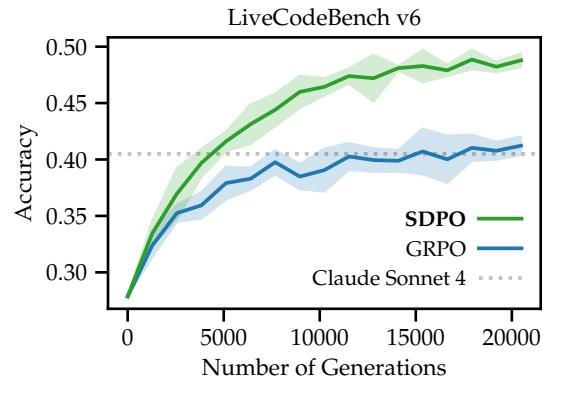
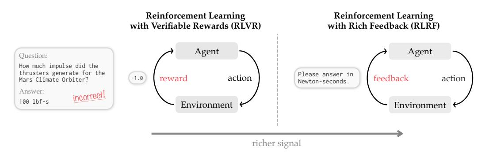
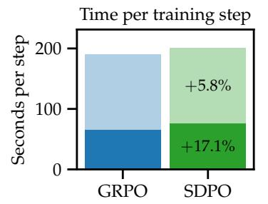
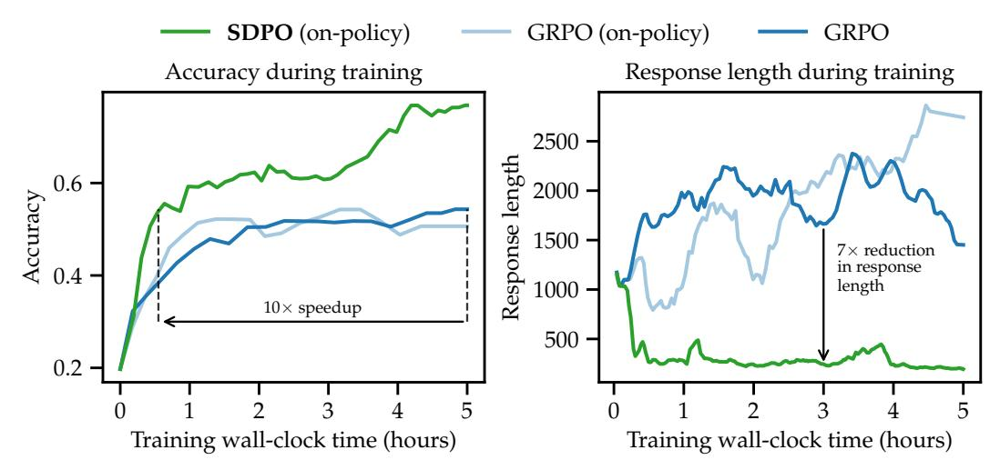
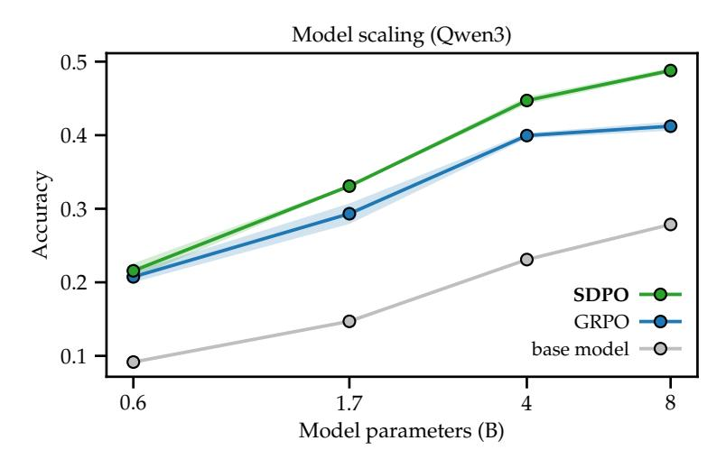
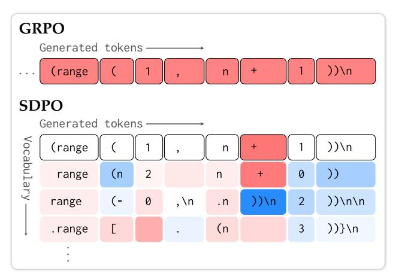
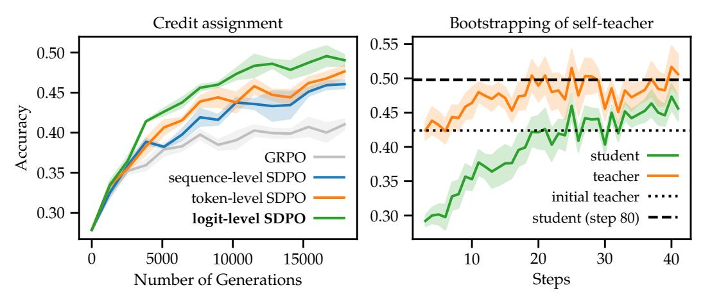
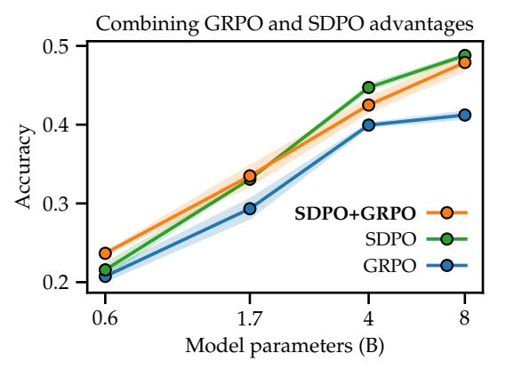
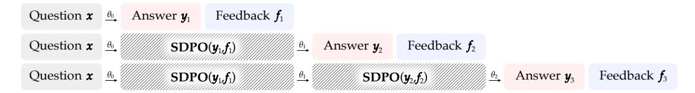
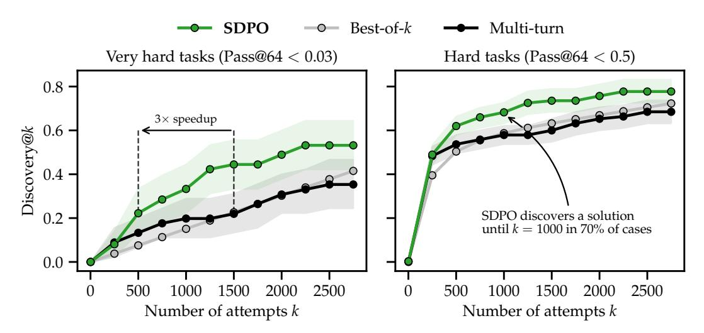

# Reinforcement Learning via Self-Distillation

Jonas Hübotter<sup>1</sup> Frederike Lübeck\*, 1,2 Lejs Behric\*, 1 Anton Baumann\*, 1 Marco Bagatella<sup>1,2</sup> Daniel Marta<sup>1</sup> Ido Hakimi<sup>1</sup> Idan Shenfeld<sup>3</sup> Thomas Kleine Buening<sup>1</sup> Carlos Guestrin<sup>4</sup> Andreas Krause<sup>1</sup>
<sup>1</sup>ETH Zurich <sup>2</sup>Max Planck Institute for Intelligent Systems <sup>3</sup>MIT <sup>4</sup>Stanford

https://github.com/lasgroup/SDPO

#### **Abstract**

Large language models are increasingly post-trained with reinforcement learning in verifiable domains such as code and math. Yet, current methods for reinforcement learning with verifiable rewards (RLVR) learn only from a scalar outcome reward per attempt, creating a severe credit-assignment bottleneck. Many verifiable environments actually provide rich textual feedback, such as runtime errors or judge evaluations, that explain why an attempt failed. We formalize this setting as reinforcement learning with rich feedback and introduce **Self-Distillation Policy Optimization** (SDPO), which converts tokenized feedback into a dense learning signal without any external teacher or explicit reward model. SDPO treats the current model conditioned on feedback as a self-teacher and distills its feedback-informed next-token predictions back into the policy. In this way, SDPO leverages the model's ability to retrospectively identify its own mistakes in-context. Across scientific reasoning, tool use, and competitive programming on LiveCodeBench v6, SDPO improves sample efficiency and final accuracy over strong RLVR baselines. Notably, SDPO also outperforms baselines in standard RLVR environments that only return scalar feedback by using successful rollouts as implicit feedback for failed attempts. Finally, applying SDPO to individual questions at test time accelerates discovery on difficult binary-reward tasks, achieving the same discovery probability as best-of-k sampling or multi-turn conversations with  $3\times$  fewer attempts.

## 1 Introduction

Progress in deep reinforcement learning has shown that iterating on experience—acting, receiving feedback, and updating a policy—can unlock capabilities that are difficult to obtain from static supervision alone (Mnih et al., 2015; Silver et al., 2016; 2017; Berner et al., 2019). The same theme now appears in large language models (LLMs): large-scale post-training with reinforcement learning (RL) has substantially improved performance on reasoning-heavy tasks, especially in settings with programmatic or otherwise verifiable evaluation (Jaech et al., 2024; Guo et al., 2025; Kimi et al., 2025; Olmo et al., 2025).

Nevertheless, the dominant RL recipe for LLM post-training remains bottlenecked by

<span id="page-0-0"></span>

Figure 1: SDPO substantially outperforms an improved version of Group Relative Policy Optimization (GRPO) on LCB v6 with Qwen3-8B. Further, SDPO achieves GRPO's final accuracy in  $4\times$  fewer generations. Claude Sonnet 4 is the strongest instruct model on the public LCBv6 leaderboard. Shaded regions show the standard deviation across 3 seeds.

<sup>\*</sup>Equal second authorship. Correspondence to jonas.huebotter@inf.ethz.ch.

<span id="page-1-0"></span>

Figure 2: **Comparison of RLVR and RLRF settings.** In Reinforcement Learning with Verifiable Rewards (RLVR), the agent learns from a scalar reward *r*, which often acts as an information bottleneck by masking the underlying environment state. In contrast, Reinforcement Learning with Rich Feedback (RLRF) utilizes tokenized feedback. This provides a significantly richer signal than a scalar reward, as the feedback can encapsulate both the reward as well as detailed observations of the state (such as runtime errors from a code environment or feedback from an LLM judge).

credit assignment. Most current approaches operate in the setting of reinforcement learning with verifiable rewards (RLVR): given a question *x*, the model samples an answer *y* ∼ *π<sup>θ</sup>* (· | *x*) and receives a scalar reward *r* ∈ **R**, often binary (e.g., unit-tests pass/fail in code generation). Modern policy gradient RLVR methods such as Group Relative Policy Optimization (GRPO; [Shao et al.,](#page-22-1) [2024\)](#page-22-1) estimate advantages from these sparse outcome rewards. Furthermore, when all rollouts in a group receive the same (often zero) reward, GRPO advantages collapse to zero and learning stalls. To overcome this sparsity, one might prefer distillation from a strong teacher [\(Guo et al.,](#page-20-1) [2025;](#page-20-1) [Yang et al.,](#page-24-0) [2025;](#page-24-0) [Lu & Thinking](#page-21-1) [Machines Lab,](#page-21-1) [2025;](#page-21-1) [Guha et al.,](#page-19-0) [2026\)](#page-19-0), which provides dense, token-level supervision. However, strong teachers are often unavailable in online learning, where the goal is to raise the capability ceiling beyond existing models.

In this work, we argue that the key limitation is not RL per se, but the information bottleneck imposed by scalar outcome rewards. Many verifiable environments expose *rich tokenized feedback* beyond scalar rewards *r*, such as runtime errors, failing unit tests, or evaluations from an LLM judge. This feedback not only reveals *whether* a rollout was wrong, but also *what* went wrong. We formalize this more general setting as **Reinforcement Learning with Rich Feedback** (**RLRF**) and illustrate its difference to RLVR in Figure [2.](#page-1-0) Here, feedback can be any tokenized representation of any state reached by an agentic system. The central question becomes: how can we convert rich feedback into effective credit assignment without requiring external supervision from a strong teacher?

Our starting point is the observation that LLMs already possess a powerful mechanism for using feedback: in-context learning [\(Brown et al.,](#page-18-1) [2020;](#page-18-1) [Wei et al.,](#page-23-2) [2022\)](#page-23-2). When conditioned on feedback, the same model can often identify plausible mistakes and propose a corrected approach. A common example of such feedback is the summary of failed test cases on coding platforms like LeetCode (Figure [3\)](#page-1-1). Many recent works leverage this capability to iteratively generate corrections [\(Chen et al.,](#page-19-1) [2021a;](#page-19-1) [Madaan et al.,](#page-21-2) [2023;](#page-21-2) [Shinn et al.,](#page-22-2) [2023;](#page-22-2)

```
Runtime Error
ZeroDivisionError: division by zero
Line 73 in separateSquares (Solution.py)
Last Executed Input
[[26,30,2],[11,23,1]]
```

Figure 3: Example of feedback from our code environment, inspired by LeetCode. Listings [5,](#page-48-0) [6,](#page-48-1) and [7](#page-49-0) in the appendix show examples of feedback in case of a wrong answer, a memory error, and an index error.

[Yao et al.,](#page-24-1) [2024;](#page-24-1) [Yuksekgonul et al.,](#page-24-2) [2025;](#page-24-2) [Lee et al.,](#page-21-3) [2025\)](#page-21-3). In contrast, we use the current policy as a "self-teacher" that, rather than sampling a new response, re-evaluates the *existing* rollout after receiving rich feedback. Including the feedback in-context transforms the model's next-token distribution, allowing the self-teacher to agree or disagree with the student's original choices at specific tokens. This yields dense, logit-level credit assignment.

<span id="page-2-0"></span>

| Method                                        | Sampling       | Signal    | Feedback         |
|-----------------------------------------------|----------------|-----------|------------------|
| SFT / Distillation (Hinton et al., 2015)      | × off-policy   | ✓<br>rich | × strong teacher |
| On-Policy Distillation (Agarwal et al., 2024) | ✓<br>on-policy | ✓<br>rich | × strong teacher |
| RLVR (such as GRPO) (Lambert et al., 2025)    | ✓<br>on-policy | × weak    | ✓<br>environment |
| RL via Self-Distillation (SDPO) (ours)        | ✓<br>on-policy | ✓<br>rich | ✓<br>environment |

Table 1: Comparison of self-distillation to alternative methods for post-training LLMs.

For example, when provided with the feedback from Figure [3,](#page-1-1) the self-teacher can identify how the initial attempt should be modified to avoid the runtime error. Crucially, this mechanism incurs no sampling overhead: we simply re-compute the log-probabilities of the original attempt under the self-teacher's feedback-augmented context.

Building on this idea, we introduce **Self-Distillation Policy Optimization** (**SDPO**), an on-policy algorithm that performs RL via self-distillation. SDPO samples rollouts from the current policy, obtains rich environment feedback, and then minimizes a logit-level distillation loss that matches the current policy's next-token distribution to that of the self-teacher. Conceptually, SDPO addresses the central limitation of applying distillation to online learning: the absence of a stronger external teacher. Instead of relying on a fixed teacher, SDPO leverages the model's ability to recognize its own mistakes in hindsight. By conditioning the current policy on the rich feedback it just received, we construct a selfteacher that provides the dense supervision of distillation while retaining the exploration benefits of on-policy RL. Table [1](#page-2-0) summarizes how this positions SDPO relative to RLVR and distillation baselines. We include a comprehensive summary of related work in Section [6.](#page-15-0)

We show that SDPO is a policy gradient algorithm whose advantages are estimated using the self-teacher. This enables the implementation of SDPO with minor changes to standard RLVR pipelines, simply by swapping out the advantages.

**Summary of evaluation results.** We evaluate SDPO in three online RL settings:

- **Learning without rich feedback** ([§3\)](#page-5-0): We evaluate standard RLVR environments that do not return any feedback beyond scalar rewards. Here, SDPO treats successful attempts sampled in the current batch as "feedback" for failed attempts on the same question. We perform training runs on scientific reasoning and tool use, starting with Qwen3-8B and Olmo3-7B-Instruct. We find that SDPO outperforms a strong GRPO baseline that integrates recent improvements: 68.8% vs. 64.1% final accuracy on aggregate. SDPO achieves higher accuracy with up to 7× shorter generation lengths compared to GRPO, demonstrating that effective reasoning need not be verbose.
- **Learning with rich feedback** ([§4\)](#page-7-0): We evaluate competitive programming problems from LiveCodeBench v6 with LeetCode-style feedback. As shown in Figure [1,](#page-0-0) SDPO substantially improves over GRPO, reaching a higher final accuracy (48.8% vs. 41.2%) and achieving GRPO's final accuracy in 4× fewer generations. SDPO's gains grow with model scale, suggesting that the ability for self-teaching emerges as models become stronger in-context learners.
- **Discovering novel solutions to hard tasks at test-time** ([§5\)](#page-12-0): Finally, we demonstrate that SDPO can accelerate the discovery of solutions to difficult binary-reward questions. This contrasts with RLVR methods, which only begin learning once the first solution has been found. We leverage SDPO for **Test-Time Self-Distillation**, a form of test-time training where the model specializes to an individual test question. We consider very difficult LiveCodeBench questions, for which the base model's pass@64 is below 0.03, and show that SDPO accelerates the discovery of solutions by 3×.

## **2 SDPO: Self-Distillation Policy Optimization**

We propose an algorithm that uses the in-context learning ability of the current policy for assigning credit. Our key object is the *self-teacher*, *π<sup>θ</sup>* (· | *x*, *f*), which refers to the

#### <span id="page-3-1"></span>SDPO: Self-Distillation Policy Optimization

```
1. Ouestion x
                                                 2. Answer y \sim \pi_{\theta}(\cdot \mid x)
                                                 ```python
Write a python function that returns
all numbers from 1 to n. Answer
                                                 def numbers_up_to_n(n):
                                                      return list(range(1, n + 1))
briefly.
3. Feedback f
Don't include n.
                         4. Credit assignment by self-teacher \pi_{\theta}(y \mid x, f)
```

Figure 4: Example of self-teaching with Qwen3-8B. The answer is generated by the model before seeing the feedback. Then, we re-evaluate the log-probs of the original attempt with the self-teacher after seeing the feedback. We show the per-token  $\log(\mathbb{P}(\text{self-teacher})/\mathbb{P}(\text{student}))$ , with red indicating negative values (self-teacher disagrees) and white indicating values around zero. Notably, in this example, Qwen3-8B identifies the error through retrospection without an explicit solution. Further, the activation is sparse, identifying where mistakes happen and adjusting to the students' response distribution.

current policy (the "student") prompted with the question x and the rich feedback f. Next to the students' original attempt y, f may incorporate two key kinds of feedback: any environment output (such as runtime errors from a code environment) and a sample solution if x was already solved with another attempt in the rollout group. As discussed before, the self-teacher  $\pi_{\theta}(\cdot \mid x, f)$  should have a higher accuracy than the student  $\pi_{\theta}(\cdot \mid x)$ since it sees additional information in-context. This leads us to observe:

We can use the same policy in two different roles: As the student for the initial attempt and as the teacher to determine the value of actions in hindsight.

We introduce Self-Distillation Policy Optimization (SDPO) which repeatedly distills the self-teacher into the student. Given a question x, we first sample rollouts from the student  $\pi_{\theta}$  and obtain corresponding environment feedback. We then use the KL-divergence,  $\mathrm{KL}(p\|q) = \sum_i p(i) \log p(i)/q(i)$ , as a distance measure for the next-token distributions of student and teacher, and optimize a standard logit distillation loss:

$$\mathcal{L}_{\text{SDPO}}(\theta) := \sum_{t} \text{KL}(\pi_{\theta}(\cdot \mid x, y_{< t}) || \text{stopgrad}(\pi_{\theta}(\cdot \mid x, f, y_{< t})))$$
 (1)

where the stopgrad operator blocks gra- Algorithm 1 SDPO dients from flowing through the teacher, and thus prevents it from regressing towards the student and ignoring f. The intuitive role of the teacher is to determine where and how the students' original attempt y was wrong through retrospection based on the feedback f. Figure 4 shows an example of self-teaching with Qwen3-8B as student and self-teacher. We summarize SDPO in Algorithm 1 and display the teachers' reprompt template in Table 2.

<span id="page-3-2"></span>**Input:** Language model  $\pi_{\theta}$ ; dataset with questions x; number of rollouts *G* per question; environment to obtain feedback for attempts.

- 1: repeat
- Sample question *x* from dataset.
- Sample responses:  $\{y_i\}_{i=1}^G \sim \pi_{\theta}(\cdot \mid x)$ .
- Evaluate responses to obtain feedback  $f_i$ . **▷** Self-distillation:
- Compute log-probs of self-teacher 5:  $\log \pi_{\theta}(y_{i,t} \mid x, f_i, y_{i, < t}).$
- Update  $\theta$  with gradient descent on  $\mathcal{L}_{SDPO}(\theta)$ . 7: **until** converged

We can derive the SDPO gradient as follows (see Appendix B.1 for details):

**Proposition 2.1.** Let V be the set of tokens in the vocabulary. The gradient of  $\mathcal{L}_{SDPO}$  is

<span id="page-3-3"></span>
$$\nabla_{\theta} \mathcal{L}_{\text{SDPO}}(\theta) = \mathbb{E}_{y \sim \pi_{\theta}(\cdot \mid x)} \left[ \sum_{t=1}^{|y|} \sum_{\hat{y}_t \in \mathcal{V}} \nabla_{\theta} \log \pi_{\theta}(\hat{y}_t \mid x, y_{< t}) \cdot \log \frac{\pi_{\theta}(\hat{y}_t \mid x, y_{< t})}{\pi_{\theta}(\hat{y}_t \mid x, f, y_{< t})} \right]. \quad (2)$$

<span id="page-3-0"></span><sup>&</sup>lt;sup>1</sup>In standard RLVR implementations a rollout group contains multiple simultaneous attempts for x.

<span id="page-4-0"></span>User: prompt

Correct solution:

successful\_previous\_rollout

The following is feedback from your unsuccessful earlier attempt:

environment\_output

Correctly solve the original question.

**Assistant:** original\_response

Table 2: Template for self-teacher. prompt is replaced with the question. A sample solution previously generated by the student is substituted for successful\_previous\_rollout (if available for this question; otherwise the paragraph is skipped). environment\_output is replaced with the environment output (see, e.g., Figure 3) from the models' original attempt (if it was not successful and there is no solution; otherwise the paragraph is skipped). If the models' original attempt was successful, this attempt is passed as the correct solution. original\_response is replaced with the models' original attempt to re-evaluate its log-probabilities under the self-teacher.

#### 2.1 Comparison to RLVR

Note that the SDPO gradient is a (negated) logit-level policy gradient where the advantages are estimated using the self-teacher. We can therefore reuse standard RLVR implementations and simply swap out the advantages. Let  $y_i$  be the i-th rollout from a rollout group of size G for question x, then we have:

$$A_{i,t}^{\text{GRPO}}(\hat{y}_{i,t}) := \mathbb{1}\{y_{i,t} = \hat{y}_{i,t}\} \left(r_i - \text{mean}\{r_i\}_{i=1}^G\right), \quad A_{i,t}^{\text{SDPO}}(\hat{y}_{i,t}) = \log \frac{\pi_{\theta}(\hat{y}_{i,t} \mid x, f_i, y_{i,< t})}{\pi_{\theta}(\hat{y}_{i,t} \mid x, y_{i,< t})}.$$

The GRPO advantages are zero on any non-generated token and constant within a rollout  $y_i$ .<sup>3</sup> In contrast, the SDPO advantages are zero only for tokens where student and teacher perfectly agree. The SDPO advantage is positive for tokens which are more likely under the teacher while being negative for tokens which are less likely under the teacher. Thus, SDPO can be seen as a direct extension of standard RLVR methods in two ways:

- 1. from 1-bit feedback to allowing arbitrary sequences of tokens as feedback, and
- 2. leveraging this rich feedback to estimate dense logit-level advantages.

This tight connection to RLVR methods also enables a straightforward extension of the SDPO gradient from Equation (2) to off-policy data via PPO-style clipped importance sampling (Schulman et al., 2017), see Appendix A.3.

#### 2.2 Compute time & memory

The only computational overhead of SDPO compared to GRPO is the additional computation of log-probs from the self-teacher, which can be effectively parallelized and is substantially faster than sequential generation. Figure 5 compares the compute time of SDPO and GRPO. As expected, the compute overhead of SDPO is relatively small. Here, we use a micro batch size of 2;<sup>4</sup> compute time can be further reduced by using larger micro batch sizes.

Naively computing the KL divergence between student and teacher requires holding full logits of both models in memory. To avoid this, we approximate the KL divergence

<span id="page-4-3"></span>

Figure 5: Time per step for SDPO vs GRPO (solid: without code environment, light: with code environment).

<span id="page-4-2"></span><span id="page-4-1"></span><sup>&</sup>lt;sup>2</sup>See Appendix A.3 for a detailed comparison of the SDPO gradient to the standard policy gradient. <sup>3</sup>We use the GRPO (Shao et al., 2024) advantage without normalization (Liu et al., 2025b).

<span id="page-4-4"></span><sup>&</sup>lt;sup>4</sup>The micro batch size corresponds to # rollouts we train on at a time while accumulating gradients.

<span id="page-5-1"></span>

Figure 6: Training progression of Olmo3-7B-Instruct on Chemistry. We report the average accuracy across 16 samples per question and a rolling average of response lengths over 5 steps. We report GRPO with the optimal hyperparameters for this model and task.

in the SDPO loss by performing top-K distillation (i.e., only computing the top-K logits of the student and the corresponding logits of the teacher alongside a term capturing the tail probability; cf. Appendix A.2). With a reasonable choice of K (e.g., K = 100), this avoids virtually any memory overhead while capturing most of the information.

#### <span id="page-5-3"></span>2.3 Stability improvements

We find that two practical modifications significantly enhance the training stability of SDPO. First, we employ a regularized self-teacher, implemented either via an exponential moving average (EMA) of the student parameters or by interpolating the current teacher with the initial teacher (cf. Appendix A.1). As detailed later, both strategies effectively stabilize learning. Second, we adopt the symmetric Jensen-Shannon divergence for the distillation loss; this formulation has similarly been shown to improve stability in on-policy distillation from external teachers (Agarwal et al., 2024).

### <span id="page-5-0"></span>3 Learning without Rich Environment Feedback

We first evaluate SDPO in standard RLVR environments, where feedback is limited to scalar rewards. Instead of using the scalar reward, SDPO treats successful attempts sampled in the current batch as "feedback" for failed attempts on the same question. By comparing the student's attempt with a correct solution, the self-teacher can identify where the student was wrong and provide dense credit assignment.

#### <span id="page-5-2"></span>3.1 Experimental setting

We evaluate tasks on which the model has not been explicitly fine-tuned:

- Science Q&A (Chemistry, Physics, Biology, Materials science): Undergraduate-level scientific reasoning using reasoning subsets (L3) from SciKnowEval (Feng et al., 2024).
- Tool use: Mapping a tool-API specification and user request to the correct tool call, using ToolAlpaca (Tang et al., 2023).

We perform a train-test split to test in-domain generalization. We use Qwen3-8B (Yang et al., 2025) and Olmo3-7B-Instruct (Olmo et al., 2025) as initial checkpoints and report avg@16 relative to wall-clock training time, excluding initialization & validation.

<span id="page-6-0"></span>

|                    |      | Chemistry |      | Physics |      | Biology |      | Materials |      | Tool use |
|--------------------|------|-----------|------|---------|------|---------|------|-----------|------|----------|
|                    | 1h   | 5h        | 1h   | 5h      | 1h   | 5h      | 1h   | 5h        | 1h   | 5h       |
| Qwen3-8B           |      | 35.6      |      | 59.2    |      | 27.9    |      | 58.9      |      | 57.5     |
| + GRPO             | 54.7 | 60.0      | 63.8 | 72.7    | 34.3 | 51.8    | 74.3 | 77.1      | 64.9 | 67.7     |
| + GRPO (on-policy) | 54.2 | 69.6      | 63.6 | 63.6    | 44.4 | 44.4    | 73.9 | 74.1      | 60.2 | 65.7     |
| + SDPO (on-policy) | 60.0 | 70.1      | 66.6 | 75.6    | 51.5 | 52.9    | 72.1 | 78.4      | 68.0 | 68.5     |
| Olmo3-7B-Instruct  |      | 18.8      |      | 37.7    |      | 18.1    |      | 36.7      |      | 39.3     |
| + GRPO             | 32.7 | 46.8      | 55.3 | 63.3    | 47.8 | 62.0    | 70.9 | 75.0      | 56.4 | 65.0     |
| + GRPO (on-policy) | 48.8 | 54.3      | 62.7 | 62.7    | 54.2 | 63.8    | 73.3 | 73.5      | 56.8 | 60.6     |
| + SDPO (on-policy) | 59.2 | 76.8      | 59.9 | 66.1    | 56.1 | 58.3    | 73.7 | 79.1      | 60.8 | 62.1     |

Table 3: **Comparison of SDPO and GRPO on reasoning-related benchmarks.** We report the highest achieved avg@16 within 1 hour and 5 hours of wall-clock training time, respectively. Both SDPO and on-policy GRPO perform one gradient step per generation batch, while GRPO performs 4 off-policy mini batch steps. We select optimal hyperparameters for SDPO and baselines based on 5h accuracy. Each run is performed on a node with 4 NVIDIA GH200 GPUs. Together with initialization and validation, each run takes approximately 6 hours.

**Baselines.** We compare SDPO to an improved variant of **GRPO** [\(Shao et al.,](#page-22-1) [2024\)](#page-22-1), which incorporates several recent modifications [\(Olmo et al.,](#page-22-0) [2025;](#page-22-0) [Khatri et al.,](#page-20-4) [2026\)](#page-20-4) such as asymmetric clipping [\(Yu et al.,](#page-24-3) [2025\)](#page-24-3), avoiding biased normalization [\(Liu et al.,](#page-21-5) [2025b\)](#page-21-5), and correcting for off-policy data when using efficient inference frameworks [\(Yao et al.,](#page-24-4) [2025\)](#page-24-4). We integrate these modifications into a GRPO implementation that represents a strong baseline, as detailed in Equation [\(8\)](#page-29-2) in Appendix [A.3.](#page-29-0) GRPO enables off-policy training through PPO's clipped importance weighting [\(Schulman et al.,](#page-22-3) [2017\)](#page-22-3). We additionally report the special case of **on-policy GRPO** (matching the hyperparameters of vanilla SDPO). For both baselines, we perform a hyperparameter sweep and report results for the models that achieve the highest validation performance across all target tasks. Hyperparameters and training details are provided in Appendix [E.](#page-41-0) We use the verl library [\(Sheng et al.,](#page-22-4) [2025\)](#page-22-4) for fast multi-GPU training.

## **3.2 Results**

Table [3](#page-6-0) summarizes our results. We find that SDPO outperforms GRPO across almost all runs, often leading to substantial improvements. SDPO learns notably faster than GRPO, performing close to 5 hours of GRPO training after only 1 hour of training with SDPO in several cases. SDPO achieves a particularly substantial improvement over GRPO on the Chemistry task, as is displayed in Figure [6](#page-5-1) [\(left\).](#page-5-1) With Olmo3-7B-Instruct, *SDPO achieves the 5h GRPO accuracy in 30 minutes of wall-clock training time*, a 10× speedup. Moreover, SDPO's 5h accuracy is more than 20%-points higher than that of GRPO.

We remark that our results with SDPO use strictly on-policy training (i.e., one gradient step per generation batch). Given the known efficiency gains of off-policy methods that perform multiple gradient updates per generation batch, we believe that studying SDPO with off-policy updates is an exciting direction for future work.

#### **Takeaway 1**

We demonstrate that SDPO can learn to reason effectively, generalizing to challenging reasoning tasks. Without requiring any modification to existing RLVR environments, SDPO outperforms GRPO substantially in several cases.

#### **3.3 Self-distillation learns to reason concisely**

We consistently observe that SDPO produces substantially shorter generations than GRPO while achieving higher accuracy. SDPO's responses are more than 3× shorter on average

```
. Alternatively...
                                                      .. At pH 7.4, all functional groups are neu-
Closer to D? No...
                                                     tral... maintaining a balance between hy-
Wait I'm going in circles... Wait, perhaps the
                                                     drophobic and hydrophilic character... [The]
correct answer is B... 10^{1.85} \approx 69.3.
                                                     overall polarity... keeps logD from being very
Ah, this works... Wait I think I messed up...
                                                     high... or very low... [typically falling] in the
Hmm... 10^{1.85} \approx 69.3...
                                                     2.0-3.0 range, with 2.61 (C) being a reasonable
Thus, the correct answer is likely B: 1.85.
                                                     estimate...
<answer>
                                                     <answer>
</answer>
                                                     </answer>
```

(a) GRPO (5,549 tokens)

(b) SDPO (764 tokens)

Figure 7: Example responses from GRPO and SDPO after 50 training steps to the following question: "What is the correct octanol/water distribution coefficient logD under the circumstance of pH 7.4 for the molecule 0=C10[C0@H](C0c2ccon2)CN1c1ccc(C2=CC0CC2)c(F)c1?" The answer options are A: 1.32, B: 1.85, C: 2.61, D: 3.76. The correct answer is **C**. GRPO's answer contains  $5 \times$  "Hmm.",  $9 \times$  "No.", and  $25 \times$  "Wait". Further, GRPO's answer repeats calculations such as " $10^{1.85} \approx 69.3$ ", which appears four times, and the model even explicitly generates "Wait I'm going in circles". SDPO's answer avoids any circular reasoning and is more than  $7 \times$  shorter. The base model is Qwen3-8B.

across tasks (cf. Table 8 in Appendix D). On Chemistry with Olmo3-7B-Instruct, SDPO even achieves a 7× reduction in response length relative to GRPO while maintaining higher accuracy (Figure 6 (right)). While recent progress in RLVR has demonstrated that scaling response length is a powerful driver of emergent reasoning capabilities (Jaech et al., 2024; Guo et al., 2025; Muennighoff et al., 2025), our results suggest that effective reasoning need not always be verbose. We find that SDPO improves the *efficiency* of reasoning.

Qualitatively, we observe that the longer responses from GRPO often stem from "superficial" reasoning rather than necessary cognitive steps. GRPO frequently generates filler phrases like "Hmm" and "Wait" or enters circular logical loops that repeat previous steps verbatim. Figure 7 displays a representative example of this phenomenon. Remarkably, SDPO's generations remain concise and avoid these superficial patterns. This may be explained by SDPO's dense credit assignment, which assigns a specific advantage to each next-token prediction, leading to sparse advantages (cf. Figure 21 in Appendix F). By improving the efficiency of reasoning, SDPO reduces inference generation time and demonstrates that reasoning performance can be improved by refining *how* the model reasons, not just how *long* it reasons.

#### <span id="page-7-0"></span>4 Learning with Rich Environment Feedback

We next evaluate SDPO on coding tasks. Coding is a canonical example of an RL environment that provides rich feedback, such as runtime errors and failed unit tests. Learning to solve these coding problems requires strong credit assignment since the student must identify its precise mistakes to avoid repeating them in the future. LiveCodeBench (LCB; Jain et al., 2025) provides a set of contest-style coding problems, ranging from simple to competition-level. We restrict our evaluation to the most recent LCBv6 subset of LCB, which contains 131 questions released between February and May 2025. We consider a setting with public and private unit tests, common for code contests and coding platforms like LeetCode, where the public tests are used for evaluation during training and the private tests are used for validation (Chen et al., 2022; Le et al., 2022; El-Kishky et al., 2025; Samadi et al., 2025).<sup>5</sup>

We use the Qwen3 (Yang et al., 2025) model family for our experiments, with Qwen3-8B as default unless otherwise specified. We report the average accuracy over 4 rollouts and use the same GRPO baseline as outlined in Section 3.1.

<span id="page-7-2"></span><sup>&</sup>lt;sup>5</sup>We select public tests as a 50% random subset of private tests.

<span id="page-8-1"></span>

Figure 8: **SDPO improves with model size.** We compare the final LCBv6 validation accuracy of SDPO and GRPO at train step 80, across model sizes from Qwen3. The ability of SDPO's teacher to perform accurate retrospection appears to be an emergent phenomenon with scale. We include an additional scaling study with Qwen2.5-Instruct in the appendix (cf. Figure [17\)](#page-37-0) which further supports this finding. Error bars indicate the standard error across 3 seeds.

**Results.** Figure [1](#page-0-0) compares the learning curves of SDPO and GRPO on LCBv6. We find that SDPO achieves a substantially higher final accuracy (48.8%) than GRPO (41.2%) while also outperforming the strongest instruct models on the public LCBv6 leaderboard[:](#page-8-0)<sup>6</sup> Claude Sonnet 4 (40.5%) and Claude Opus 4 (39.7%). Furthermore, SDPO reaches the final accuracy of GRPO in 4× fewer generations. We include an extended comparison to other RLVR baselines that perform similarly to GRPO in Table [9](#page-38-0) in the appendix. Differentiating between the easy, medium, and hard questions of LCB, we find that SDPO particularly improves over GRPO in solving medium and hard questions (cf. Figure [15](#page-36-0) in the appendix).

#### **4.1 Self-distillation benefits from stronger models**

A central question for our work is whether SDPO is sensitive to the in-context learning ability of the base model. Intuitively, we expect that SDPO benefits from a strong in-context learner, since this enables the teacher to perform more accurate retrospection.

To answer this question, we perform a scaling study with different model sizes from the Qwen3 [\(Yang et al.,](#page-24-0) [2025\)](#page-24-0) family. As shown by extensive prior work, the ability to learn in-context increases with model size (e.g., [Brown et al.,](#page-18-1) [2020\)](#page-18-1). As depicted in Figure [8,](#page-8-1) SDPO significantly outperforms GRPO on larger models while only slightly improving over GRPO on smaller models. To determine whether SDPO can also underperform GRPO on a model weaker than Qwen3-0.6B, we performed an additional scaling study with Qwen2.5- Instruct [\(Qwen et al.,](#page-22-6) [2024\)](#page-22-6). While outperforming GRPO with Qwen2.5-7B and performing similarly with Qwen2.5-8B, we find that SDPO underperforms GRPO on Qwen2.5-1.5B, as seen in Figure [17](#page-37-0) in Appendix [D.](#page-35-1)

## **Takeaway 2**

Our results suggest that the marginal improvement of SDPO over GRPO is tightly coupled with the strength of the base model, and motivates future study on models stronger than Qwen3-8B. In the same way that in-context learning is an emergent phenomenon with scale, the self-teacher's ability to perform accurate retrospection in SDPO appears to be emergent with scale.

<span id="page-8-0"></span><sup>6</sup>On the public leaderboard, the LCBv6 subset can be obtained by selecting February to May 2025.

#### 4.2 Self-distillation performs dense credit assignment

Whereas GRPO assigns a constant advantage to each generated token, SDPO assigns an individual advantage to each possible next to*ken* along the generated sequence based on the agreement of student and teacher. At each position t in the generated sequence *y*, there are  $|\mathcal{V}|$  possible next tokens where  $\mathcal V$  is the vocabulary. In distillation, this level is typically called the *logit-level* since it corresponds to the logits of the model. In practice, we approximate the full nexttoken distribution by the top-K tokens, and as such, SDPO assigns  $|y| \cdot K$  unique advantages per sequence. This is illustrated in Figure 9 and allows SDPO to perform dense credit assignment.

<span id="page-9-0"></span>

Figure 9: Dense credit assignment in SDPO in the example from Figure 4. Shown in blue are tokens which become more likely under the self-teacher. The self-teacher identifies how the returned range has to be modified so that it does not contain n.

A natural question is whether the performance gains of SDPO are due to leveraging rich feedback in RLRF or due to the dense credit assignment of SDPO. To answer this question, we ablate the performance of SDPO in three configurations:

- Logit-level SDPO: credit assignment over the 100 most likely tokens (under the student) at each position.
- Token-level SDPO: credit assignment over the most likely token at each position.
- **Sequence-level SDPO:** We compute SDPO advantages for all generated tokens and average them to produce a single scalar advantage per sequence (as in GRPO). This does not perform denser credit assignment than GRPO but still leverages the rich feedback *f*.

As shown in Figure 10 (left), the dense credit assignment of logit-level SDPO leads to significant performance gains over token-level SDPO and sequence-level SDPO. Nevertheless, even sequence-level SDPO outperforms GRPO, indicating that leveraging rich feedback in RLRF can lead to substantial gains over RLVR methods even without dense credit assignment.

## 4.3 The self-teacher improves during training

Contrary to standard distillation, the self-teacher in SDPO is not frozen, but updated throughout training. This is a critical component of SDPO, since it enables the teacher to improve over time, which means that the student can learn from a stronger target. To investigate whether the self-teacher improves during training, we plot the average accuracy when *generating* using the self-teacher in Figure 10 (right). We find that the self-teacher improves significantly during training. Most notably, the student's

<span id="page-9-1"></span>

| Teacher                 | Accuracy       | Avg accuracy   |
|-------------------------|----------------|----------------|
| 9θ                      | $36.1 \pm 1.6$ | $29.8 \pm 1.3$ |
| $q_{	heta_{	ext{ref}}}$ | $48.8 \pm 0.7$ | $44.4 \pm 0.2$ |
| Trust-region            | $50.6 \pm 0.9$ | $45.6 \pm 0.2$ |
| EMA                     | $49.3 \pm 0.3$ | $45.3 \pm 0.2$ |

Table 4: Best/average accuracy until step 90 of various methods for teacher regularization. Trust-region and EMA teachers use  $\alpha = 0.01$ . Training of the  $q_{\theta}$  eventually diverges. Error ranges indicate standard errors across 3 seeds.

accuracy surpasses the initial teacher's accuracy in later stages of training. This demonstrates that SDPO enables true bootstrapping of a weak model to a strong model, without the initial self-teacher's performance limiting the final student.

<span id="page-10-0"></span>

Figure 10: Left: Rich feedback in RLRF and dense credit assignment of SDPO are complementary. We compare logit-level, token-level, and sequence-level SDPO advantages to GRPO. While denser credit assignment in SDPO is beneficial (logit-level > token-level > sequence-level), even sequence-level SDPO significantly outperforms GRPO due to leveraging the rich feedback. Error bars indicate the standard error across 3 seeds. Right: The self-teacher improves during training. We display the generative accuracy of the self-teacher compared to student on the current training batch (with a rolling average over 5 steps). The final student score is taken at step 80. Notably, the performance of the student significantly surpasses the initial teacher's accuracy. Error bars indicate the standard deviation across 3 seeds.

As described in Section 2.3, SDPO uses a regularized teacher to stabilize training. As can be seen in Table 4, a non-regularized teacher significantly underperforms the regularized teachers. Furthermore, trust-region and EMA teachers outperform the teacher frozen at the initial teacher's parameters, showing that the teacher improves through parameter sharing with the student. Yet, SDPO performs well even with a frozen teacher.

#### 4.4 On-policy self-distillation avoids catastrophic forgetting

Prior work has shown that a key benefit of on-policy algorithms, such as GRPO, is that models tend not to forget previously obtained capabilities (Shenfeld et al., 2026; Chen et al., 2025b; Lu & Thinking Machines Lab, 2025). This is practically desirable since it enables continual training pipelines where a model is trained sequentially on diverse tasks without the need to retrain from scratch. To evaluate forgetting, we test the final checkpoints of GRPO and SDPO on diverse holdout tasks: IFEval (Zhou et al., 2023), which tests the ability of a model to follow precise format instructions; ArenaHard-v2 (Li et al., 2025), which is an LLM-judged benchmark of real-world instruction-following prompts derived from LMArena (Chiang et al., 2024); and MMLU-Pro (Wang et al., 2024b), which tests broad multi-task knowledge and reasoning. As displayed in Table 5, SDPO learns the new task while mitigating degradation of initial capabilities, overall achieving a better performance–forgetting tradeoff than GRPO.

Off-policy self-distillation baseline. As an additional baseline, we consider training the student via supervised fine-tuning (SFT) on successful generations from the self-teacher (Scheurer et al., 2023; Dou et al., 2024). This requires  $2 \times$  the generations of SDPO for the same number of steps, since we have to generate from both the student and the teacher. We report SFT on the successes of the self-teacher, which achieves a higher accuracy than also including initial successes from the student in the SFT data. As shown in Table 5, SFT on the self-teacher significantly underperforms SDPO on LCBv6, while leading to worse forgetting of prior capabilities. This mirrors prior findings on the instability of off-policy imitation (see, e.g., Agarwal et al., 2024).

<span id="page-10-1"></span><sup>&</sup>lt;sup>7</sup>SFT on a teacher's predictions is a standard off-policy distillation approach (Kim & Rush, 2016).

<span id="page-11-0"></span>

|                                     | Task:                |                      | Holdout tasks:                |                                 |                      |                      |  |  |
|-------------------------------------|----------------------|----------------------|-------------------------------|---------------------------------|----------------------|----------------------|--|--|
|                                     | LCBv6                | IFEval               | ArenaHard-v2<br>(hard prompt) | ArenaHard-v2 (creative writing) | MMLU-Pro             | Avg. (holdout)       |  |  |
| Base                                | 27.9                 | 83.9                 | 14.0                          | 13.7                            | 62.5                 | 43.5                 |  |  |
| SFT on self-teacher<br>GRPO<br>SDPO | 42.7<br>41.2<br>48.8 | 83.7<br>82.2<br>83.2 | 11.2<br>12.0<br>12.3          | 8.9<br>10.8<br>11.1             | 61.9<br>62.3<br>62.9 | 41.4<br>41.8<br>42.4 |  |  |

Table 5: **On-policy methods do not suffer from catastrophic forgetting.** We compare the accuracy of the final checkpoint on the training task LCBv6 and on holdout tasks IFEval, ArenaHard-v2, and MMLU-Pro. We compare to a baseline that trains directly on responses generated by the initial self-teacher with SFT. Overall, SDPO achieves the best performance-forgetting tradeoff. We include additional baseline results in Table 9 in the appendix.

#### 4.5 Can GRPO and SDPO be combined?

GRPO utilizes Monte Carlo advantages, which are unbiased with respect to the objective of maximizing expected reward  $J(\theta) := \mathbb{E}_{y \sim \pi_{\theta}(\cdot|x)}[r(y\mid x)]$ . In contrast, SDPO advantages are inherently biased with respect to  $J(\theta)$  due to being computed from rich feedback and a self-teacher. This dichotomy parallels the fundamental distinction between Monte Carlo and bootstrapped advantages in RL: while the latter are biased, they typically yield lower variance (Sutton & Barto, 1998; Schulman et al., 2016). This motivates a hybrid approach that combines reward-derived GRPO advantages with feedback-derived SDPO advantages:

$$A_{i,t}^{\text{SDPO}+\text{GRPO}}(\hat{y}_{i,t}) := \lambda A_{i,t}^{\text{GRPO}}(\hat{y}_{i,t}) + (1 - \lambda) A_{i,t}^{\text{SDPO}}(\hat{y}_{i,t}), \quad \lambda \in [0, 1].$$
 (3)

As shown in Figure 11, SDPO+GRPO appears to be more robust to weaker models than SDPO. Intuitively, in a weaker model such as Qwen3-0.6B, the SDPO advantages are less reliable, and hence including the GRPO advantage helps to stabilize training. In contrast, we find that SDPO+GRPO slightly underperforms SDPO on stronger models such as Qwen3-8B. This suggests that the signal of GRPO, only informed by a scalar reward, can be actively harmful with a strong initial model.

#### 4.6 Which feedback is most informative?

To understand which type of rich feedback is most informative, we ablate the three types of feedback present in a verifiable environment like code generation: the sample solution (if a successful rollout is available in the current rollout group), the environment output (such as runtime errors), and the student's original attempt.

<span id="page-11-1"></span>

Figure 11: We compare the LCBv6 validation accuracy at step 80, across model sizes from Qwen3. SDPO+GRPO significantly outperforms SDPO on the weaker Qwen3-0.6B, while slightly underperforming SDPO on stronger models. We use  $\lambda = 0.9$ . Error bars indicate the standard error across 3 seeds.

**Sample solutions.** Including a sample solution from a failed attempt's rollout group (if available) closely mirrors the group-relative advantages of GRPO. We emphasize that these sample solutions are always generated by the student, as in GRPO, and do not require an expert model. They allow for disincentivizing unsuccessful approaches if the model is already able to solve the question. However, unlike GRPO where all tokens receive the same negative advantage, the self-teacher can identify specific mistakes and provide feedback on how to fix them.

<span id="page-12-1"></span>

|                           | Teache         | r before training | Student trained with SDPO |                |  |  |
|---------------------------|----------------|-------------------|---------------------------|----------------|--|--|
|                           | ↑ Acc. (%)     | ↓ Same output (%) | ↑ Acc. (%)                | Avg. entropy   |  |  |
| f = output                | $32.5 \pm 0.5$ | $13.7 \pm 0.6$    | $39.8 \pm 0.2$            | $0.40 \pm 0.0$ |  |  |
| f = solution              | $42.4 \pm 1.0$ | $12.1 \pm 0.7$    | $36.8 \pm 2.7$            | $0.07 \pm 0.0$ |  |  |
| f = output + solution     | $42.5 \pm 1.2$ | $10.1 \pm 0.2$    | $48.9 \pm 0.9$            | $0.37 \pm 0.0$ |  |  |
| f = y + output + solution | $39.3 \pm 0.8$ | $30.0 \pm 0.9$    | $44.5 \pm 1.8$            | $0.23 \pm 0.0$ |  |  |

Table 6: **Performance of varying kinds of feedback.** We evaluate informativeness of feedback based on SDPO training (until step 70) as well as the direct impact on the self-teacher. "Same output" measures the percentage of cases where the teacher receives the same environment output as the student's initial attempt (i.e., not exploring alternative approaches). We observe that environment output and sample solutions are complementary and each provide informative feedback. Naively including only solutions or initial attempts *y* significantly reduces diversity in the teacher and student. We remark that the sample solutions are generated by the student, enabling similar group-relative advantage estimation to GRPO. Error bars indicate standard deviation across 3 seeds.

**Environment output.** The environment output describes the state of the environment after the student's attempt. This is complementary to sample solutions since it can provide useful signal even if the student has never solved the question before (a setting we explore extensively in Section 5). Leveraging environment output is a key differentiating factor between RLRF and RLVR settings.

**Student's original attempt.** The student's original attempt *y* does not have to be included in the reprompting template of the teacher. Indeed, we find that including it biases the teacher towards the student's attempt (cf. Table 6). This reduces the entropy of the student's distribution (particularly for initially uncertain tokens), thereby reducing exploration.

We summarize results in Table 6 where we evaluate the effect on SDPO training as well as the direct impact on the self-teacher. We find that environment output & sample solutions are complementary, each providing informative feedback. Generally, we observe that performance is not sensitive to syntactic variations of the reprompting template from Table 2.

#### <span id="page-12-0"></span>5 Solving Hard Questions via Test-Time Self-Distillation

In Sections 3 and 4, we have demonstrated that SDPO can substantially improve over RLVR methods when performing "train-time RL" for reasoning tasks. We now turn to a test-time setting where the model is given only a single hard (binary-reward) question x and must discover a solution as quickly as possible:

**Definition 5.1** (Discovery time). The discovery time is the number of trials needed until a solution is found (i.e., the smallest k with the k-th attempt  $y_k$  receiving reward 1).

Based on this notion, we can define a measure of the efficacy of discovery:

discovery@
$$k := \mathbb{P}(\text{discovery time } \le k)$$
  
=  $\mathbb{P}(r(y_1 \mid x) = 1 \text{ or } r(y_2 \mid x) = 1 \text{ or } \dots \text{ or } r(y_k \mid x) = 1),$  (4)

where the probability is over any randomness in the algorithm producing  $y_k$  and the rewards. Thus, the discovery@k metric quantifies the probability of discovering the solution within k steps. While prior work has studied discovery with continuous rewards (e.g., Novikov et al., 2025; Yuksekgonul et al., 2026), discovery with language models in sparse or binary-reward settings does not allow "hill-climbing" a continuous reward and has remained less well understood.

The most naive approach to discovery in binary-reward tasks is to sample repeatedly i.i.d. from the base model, also known as **best-of-**k. The canonical pass@k metric for

<span id="page-12-2"></span><sup>&</sup>lt;sup>8</sup>Our proposed discovery@k metric is a canonical metric in the study of runtime speedup (i.e., time until termination, Dolan & Moré (2002)).

<span id="page-13-1"></span>

Figure 12: **Compressing context into model weights via self-distillation.** We illustrate the process of distilling the interaction history (context c) into the model parameters  $\theta$ . The model  $\pi_{\theta}$  repeatedly attempts a fixed hard question x, generating an answer y and receiving feedback f. Rather than appending this history to the context window, the model updates its weights  $\theta_t \to \theta_{t+1}$  with SDPO (batch size 1) based on the feedback, effectively "fixing" mistakes by encoding  $\pi_{\theta}(\cdot \mid x, c)$  directly into the policy  $\pi_{\theta'}(\cdot \mid x)$ .

best-of-k sampling is exactly the probability of discovering at least one solution within k independent samples from a fixed model, coinciding with discovery@k. The discovery@k metric generalizes pass@k to algorithms that sample attempts sequentially. A common sequential approach re-prompts the base model with additional context from previous attempts (Madaan et al., 2023; Shinn et al., 2023). We refer to this as **multi-turn** sampling. Here, the model itself does not change, only its context evolves over time.

Performing RLVR on the question x does not improve over best-of-k sampling from the base model, since a binary reward provides no signal until the first solution has already been found. An RLRF method like SDPO does not face the same limitation, as it receives rich feedback from the environment after each attempt. This rich feedback enables the model to repeatedly "correct" its mistakes as it encounters them and receives feedback, even before ever discovering a solution. In contrast to multi-turn sampling, SDPO repeatedly compresses context  $c = (y_k, f_k)$  by distilling  $\pi_{\theta}(\cdot \mid x, c)$  into a model  $\pi_{\theta'}(\cdot \mid x)$  as we illustrate in Figure 12. This self-distillation enables SDPO to continually learn over long contexts, whereas the memory bottleneck of transformers inherently limits the context length of multi-turn sampling (Vaswani et al., 2017). In this section, we seek to answer the question:

Can repeatedly compressing context into model weights via self-distillation accelerate discovery for hard questions?

#### 5.1 Experimental setting

We consider a particularly challenging subset of questions from LCBv6 that are at Qwen3-8B's performance ceiling and require significant test-time sampling to find any solution. Concretely, we define two groups using Qwen3-8B's pass@k: Hard tasks with pass@64 < 0.5 and very hard tasks with pass@64 < 0.03. Among these, we retain questions for which any of best-of-k, multi-turn, or SDPO find at least one solution within 512 steps across 5 seeds. This results in 19 hard and 9 very hard questions.

For best-of-*k* sampling under the base model, we report the standard pass@*k* estimate (Chen et al., 2021b) from 2944 independent rollouts. As multi-turn sampling, we sequentially reprompt the model in-context using the concatenated feedback from previous attempts. To remain within Qwen3-8B's 40k-token context limit, we employ a first-in, first-out sliding window, discarding the earliest feedback once the maximum prompt length (32k tokens) is reached. We ablate the multi-turn reprompting strategy in Figure 19 in Appendix D and find that retaining only past feedback while forgetting earlier attempts significantly outperforms the baseline that additionally retains past attempts. We evaluate SDPO with a batch size of 16. We ablate this choice in Figure 19 in Appendix D and find that overall performance differences are marginal, yet smaller batch sizes are beneficial for improvements at low generation budgets, while larger batch sizes result in more stable updates that still learn to solve questions at later stages into the run.

<span id="page-13-0"></span><sup>&</sup>lt;sup>9</sup>For this reason, several works consider explicitly constructing curricula of solvable questions (e.g., Zhao et al., 2025; Huang et al., 2026; Diaz-Bone et al., 2025; Hübotter et al., 2025b), which self-distillation avoids. Other work found that RLVR yields limited improvement on hard questions (Yue et al., 2025).

<span id="page-14-0"></span>

Figure 13: Self-distillation at test-time solves LiveCodeBench questions that neither the base model nor multi-turn conversations can solve. Left: Very hard questions (9 total) from LCBv6 where the base model achieves pass@64 < 0.03, i.e., in less than 3% cases, sampling 64 responses yields any success. **Right:** Hard questions (19 total) from LCBv6 where the base model achieves pass@64 < 0.5. We report the discovery@k metric, representing the probability of discovering at least one solution within k total generations. Across both difficulty levels, SDPO achieves higher discovery@k rates at almost all generation budgets, compared to the base model and a multi-turn conversation baseline that receives the feedback in-context. We report the mean and bootstrapped 90% confidence intervals of the mean across 5 random seeds per question.

#### 5.2 Results

Figure 13 compares discovery@k for SDPO, multi-turn sampling, and best-of-k sampling on very hard (left) and hard (right) questions from LCBv6. Across both difficulty levels, SDPO achieves substantially higher discovery@k rates at almost all generation budgets.

On very hard tasks, multi-turn and best-of-k largely fail to solve questions within the available generation budget, achieving discovery@2750 of only 35.6% and 41.5%, respectively, whereas SDPO discovers a solution in 53.2% of cases. SDPO not only solves more questions overall but also does so with substantially fewer attempts. Notably, to reach a 22% discovery probability on very hard questions, SDPO requires approximately  $3\times$  fewer generations than best-of-k and multi-turn sampling. On hard tasks, SDPO reaches a 78% discovery@2750 probability while achieving a 67% discovery probability with roughly  $2.4\times$  fewer generations than best-of-k and multi-turn sampling. Overall, multi-turn and best-of-k sampling solve only 68.4% and 72.3% of questions, respectively. The context window length for multi-turn sampling is reached after 837 ( $\pm 466$ ) steps for hard questions and after 1007 ( $\pm 349$ ) steps for very hard questions, offering a possible explanation for its diminishing gains at high generation budgets.

**Question 3 is only solved by SDPO.** SDPO solves all questions that are solved by best-of-k and multi-turn sampling. Beyond that, SDPO uniquely discovers a solution for Q3, which is neither solvable with multi-turn sampling nor with best-of-k sampling within 2750 attempts. In contrast, SDPO first discovers a solution for Q3 after 321 attempts, which corresponds to 20 iteration steps of self-distillation based on feedback with a batch size of 16. We include detailed per-question results in Table 10 in Appendix D.

The initial self-teacher does not solve hard questions. Notably, the self-teacher's initial accuracy is < 1% for almost all questions, and even exactly 0% on 78% of them (Table 11 in Appendix D). This shows that a single turn of in-context feedback is insufficient to solve the

problem. Despite this, the self-teacher's credit assignment is sufficiently effective for SDPO to iteratively refine the policy and eventually solve these questions.

## **Takeaway 3**

We demonstrate that rich environment feedback enables SDPO to significantly accelerate discovery for hard questions. This is in contrast to RLVR methods, which only receive a binary reward signal, and therefore only begin learning once the first solution has already been found.

## <span id="page-15-0"></span>**6 Related Work**

#### **6.1 Reinforcement Learning with LLMs**

Recently, large-scale RL training on diverse tasks has significantly improved the performance of LLMs on general reasoning tasks [\(Guo et al.,](#page-20-1) [2025;](#page-20-1) [Kimi et al.,](#page-20-2) [2025;](#page-20-2) [Olmo et al.,](#page-22-0) [2025;](#page-22-0) [Jaech](#page-20-0) [et al.,](#page-20-0) [2024;](#page-20-0) [Lambert et al.,](#page-21-4) [2025\)](#page-21-4). This progress is primarily enabled by RLVR methods that use Monte Carlo estimates of rewards, such as STaR or GRPO [\(Zelikman et al.,](#page-24-9) [2022;](#page-24-9) [Shao](#page-22-1) [et al.,](#page-22-1) [2024\)](#page-22-1), similar to the classical REINFORCE algorithm [\(Williams,](#page-24-10) [1992\)](#page-24-10). While several traditional RLVR algorithms rely on learning separate value networks [\(Schulman et al.,](#page-22-3) [2017\)](#page-22-3), they incur substantial memory costs and retain the information bottleneck of scalar rewards.

In the RLVR setting, it is common for an (outcome) reward to be given only at the end of a sequence. To improve credit assignment, several works learn so-called process reward models (PRMs) that estimate rewards for each step in the sequence [\(Lightman et al.,](#page-21-10) [2023;](#page-21-10) [Wang et al.,](#page-23-7) [2024a;](#page-23-7) [Setlur et al.,](#page-22-10) [2025\)](#page-22-10). Unlike our RLRF setting, PRMs are typically trained on scalar rewards, either on value estimates for intermediate states or on outcome rewards [\(Cui](#page-19-11) [et al.,](#page-19-11) [2025\)](#page-19-11). Unlike the self-teacher in SDPO, PRMs are a distinct model from the student, introducing significant memory overhead. Our work shows that *each language model is implicitly a PRM* through retrospection if given rich feedback.

Conceptually, our work is related to "expert iteration" [\(Anthony et al.,](#page-18-3) [2017\)](#page-18-3) where a student is bootstrapped by repeatedly imitating an improved version of itself (called the "expert"). Canonically, the expert combines the student with test-time search, such as tree search [\(Anthony et al.,](#page-18-3) [2017\)](#page-18-3) or majority voting [\(Zuo et al.,](#page-25-0) [2025\)](#page-25-0). In contrast, SDPO leverages the student's ability to learn from rich feedback provided in-context.

#### **6.2 Learning from Rich Feedback and through Retrospection**

Beyond scalar outcome rewards, recent works have leveraged rich execution or verbal feedback to guide generation [\(Gehring et al.,](#page-19-12) [2025;](#page-19-12) [Yuksekgonul et al.,](#page-24-2) [2025\)](#page-24-2). A primary line of research focuses on translating verbal feedback into reward functions for RL. This is often achieved by mapping feedback to discrete token-level rewards using an external frozen model [\(Wang et al.,](#page-23-8) [2026\)](#page-23-8), or by employing strong external LLMs to explicitly construct state-wise reward functions [\(Goyal et al.,](#page-19-13) [2019;](#page-19-13) [Xie et al.,](#page-24-11) [2024;](#page-24-11) [Urcelay et al.,](#page-23-9) [2026\)](#page-23-9).

Alternatively, feedback can be utilized without explicit reward modeling. Several approaches focus on in-context improvement without integrating the process into the RL optimization loop [\(Chen et al.,](#page-19-1) [2021a;](#page-19-1) [Madaan et al.,](#page-21-2) [2023;](#page-21-2) [Shinn et al.,](#page-22-2) [2023;](#page-22-2) [Yao et al.,](#page-24-1) [2024;](#page-24-1) [Yuksekgonul et al.,](#page-24-2) [2025;](#page-24-2) [Lee et al.,](#page-21-3) [2025\)](#page-21-3). Others manually curate preference datasets by pairing responses before and after feedback to train with direct preference optimization [\(Stephan et al.,](#page-23-10) [2024;](#page-23-10) [Lee et al.,](#page-21-11) [2024\)](#page-21-11), though this requires additional generation and lacks the direct credit assignment of SDPO. Various recent works bootstrap thinking traces from known answers, using these answers as rich feedback [\(Zhou et al.,](#page-25-1) [2026;](#page-25-1) [Hatamizadeh](#page-20-9) [et al.,](#page-20-9) [2026;](#page-20-9) [Zhang et al.,](#page-24-12) [2025\)](#page-24-12).

A central object in several recent works is a feedback-conditioned policy *π<sup>θ</sup>* (*y* | *x*, *f*), which learns answers *y* that lead to feedback *f* [\(Liu et al.,](#page-21-12) [2023;](#page-21-12) [Zhang et al.,](#page-24-13) [2023;](#page-24-13) [Luo et al.,](#page-21-13) [2025\)](#page-21-13), typically through supervised objectives. The idea behind these approaches is to deploy a

policy conditioned on desirable (i.e., positive) feedback for deployment. This approach is conceptually related to goal-conditioned RL [\(Schaul et al.,](#page-22-11) [2015;](#page-22-11) [Liu et al.,](#page-21-14) [2025a\)](#page-21-14), where one can learn from negative examples through goal relabeling [\(Andrychowicz et al.,](#page-18-4) [2017\)](#page-18-4). Feedback-conditioned policies view feedback as a goal, whereas RLRF views feedback as a state that can be used to determine whether the goal *x* is achieved. Unlike SDPO, these methods do not use feedback for credit assignment in negative trajectories, but rather as a data transformation for goal relabeling.

## **6.3 Distillation**

Distillation is frequently employed as an alternative to supervised fine-tuning (SFT) when a strong teacher model is available. This approach transfers capabilities by training a student to mimic the output distribution or intermediate representations of the teacher [\(Hinton et al.,](#page-20-3) [2015;](#page-20-3) [Romero et al.,](#page-22-12) [2015;](#page-22-12) [Kim & Rush,](#page-20-6) [2016;](#page-20-6) [Sanh et al.,](#page-22-13) [2019;](#page-22-13) [Xie et al.,](#page-24-14) [2020\)](#page-24-14). Distillation is typically performed on fixed off-policy datasets. To address the distribution shift between training and inference, recent works explore on-policy distillation, where the student learns from feedback of an external teacher on its own generations [\(Agarwal et al.,](#page-18-2) [2024;](#page-18-2) [Gu et al.,](#page-19-14) [2024;](#page-19-14) [Yang et al.,](#page-24-0) [2025;](#page-24-0) [Lu & Thinking Machines Lab,](#page-21-1) [2025\)](#page-21-1). This mitigates the train-test mismatch, which relates closely to earlier work on online imitation learning [\(Ross et al.,](#page-22-14) [2011\)](#page-22-14).

#### **6.4 Self-Distillation**

The concept of self-distillation was first proposed by [Snell et al.](#page-23-11) [\(2022\)](#page-23-11) in a setting akin to supervised learning, introducing the idea of sampling from a model provided with extra context and training the same model to mimic these predictions without that context. This mechanism has proven effective for compressing behavior [\(Bai et al.,](#page-18-5) [2022;](#page-18-5) [Choi et al.,](#page-19-15) [2022\)](#page-19-15) and factual information [\(Eyuboglu et al.,](#page-19-16) [2026;](#page-19-16) [Kujanpää et al.,](#page-20-10) [2025\)](#page-20-10) into model weights. Beyond compressing a fixed context into model weights, recent works have used self-distillation to learn from environment feedback [\(Scheurer et al.,](#page-22-8) [2023;](#page-22-8) [Dou et al.,](#page-19-7) [2024;](#page-19-7) [Mitra & Ulukus,](#page-21-15) [2025\)](#page-21-15). These approaches use an *off-policy* self-distillation objective, which substantially underperforms SDPO's on-policy learning. Off-policy self-distillation trains the student on generations from the teacher, whereas SDPO trains the student to avoid mistakes in its own generations. In concurrent work, [Chen et al.](#page-19-17) [\(2025c\)](#page-19-17) apply on-policy self-distillation to grid world settings where feedback is a scalar reward, and a reflection stage in the self-teacher diagnoses possible mistakes, showing improved credit assignment compared to learning value networks for advantage estimation.

## **7 Conclusion, Limitations, and Future Work**

We introduced **Reinforcement Learning with Rich Feedback** (RLRF), a paradigm where environments provide tokenized feedback beyond scalar rewards, and argued that this removes a key information bottleneck of RLVR. We then proposed **Self-Distillation Policy Optimization** (SDPO), which uses the current policy as a feedback-conditioned *self-teacher* and distills its corrected log-probabilities into the student. This leverages the model's ability to learn from context for dense credit assignment. We further demonstrated that SDPO can be implemented as a minimal, drop-in modification to standard RLVR pipelines.

Empirically, SDPO demonstrates superior sample efficiency and wall-clock convergence compared to GRPO on reasoning tasks, even when training in standard RLVR environments without rich feedback. SDPO's gains grow with model scale, suggesting that the capacity for self-correction scales with the model's in-context learning capabilities. Moreover, we show that performing SDPO at test-time on individual hard binary-reward tasks accelerates the discovery of solutions compared to strong baselines.

SDPO enables learning from rich feedback in a way that parallels human cognition: utilizing precise outcomes rather than just binary rewards. By allowing the model to determine retrospectively how it should have acted, we demonstrate that language models can convert diverse tokenized feedback into effective self-supervision.