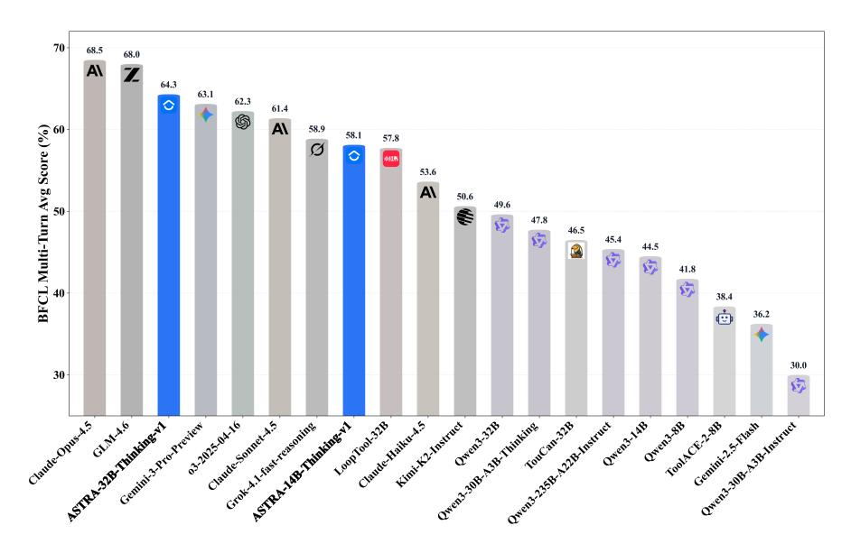
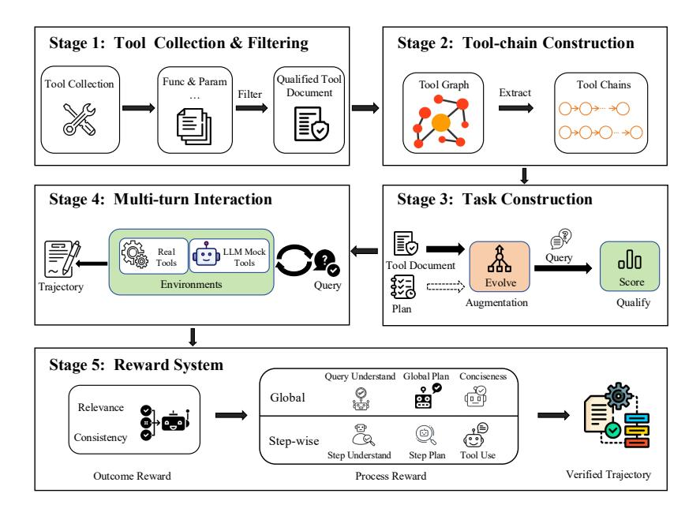
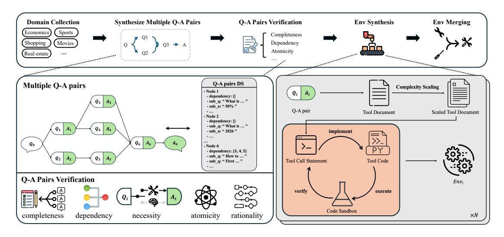
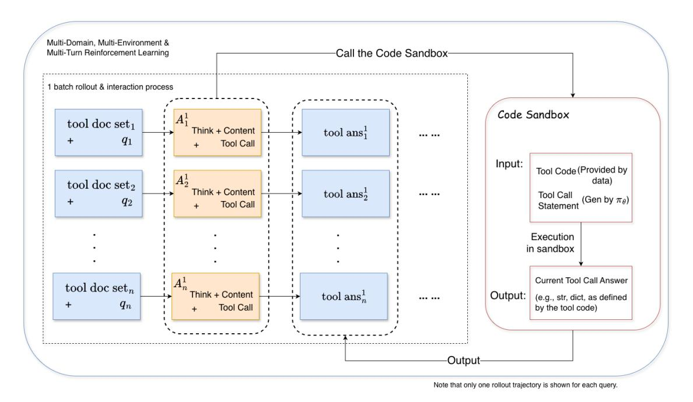
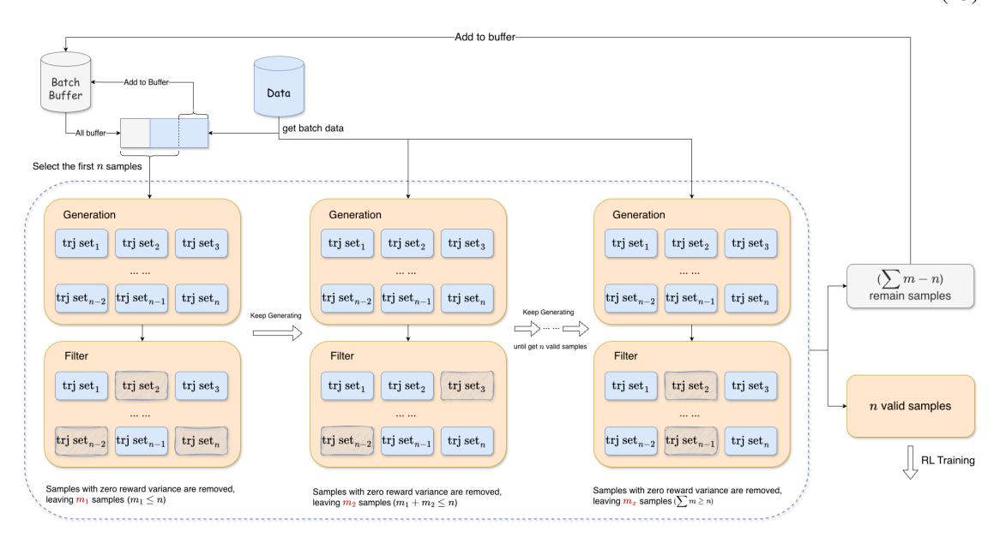

# ASTRA: Automated Synthesis of agentic Trajectories and Reinforcement Arenas

# Abstract

Large language models (LLMs) are increasingly used as tool-augmented agents for multistep decision making, yet training robust tool-using agents remains challenging. Existing methods still require manual intervention, depend on non-verifiable simulated environments, rely exclusively on either supervised fine-tuning (SFT) or reinforcement learning (RL), and struggle with stable long-horizon, multi-turn learning. To address these challenges, we introduce ASTRA, a fully automated end-to-end framework for training tool-augmented language model agents via scalable data synthesis and verifiable reinforcement learning. ASTRA integrates two complementary components. First, a pipeline that leverages the static topology of tool-call graphs synthesizes diverse, structurally grounded trajectories, instilling broad and transferable tool-use competence. Second, an environment synthesis framework that captures the rich, compositional topology of human semantic reasoning converts decomposed question–answer traces into independent, code-executable, and rule-verifiable environments, enabling deterministic multi-turn RL. Based on this method, we develop a unified training methodology that integrates SFT with online RL using trajectory-level rewards to balance task completion and interaction efficiency. Experiments on multiple agentic tool-use benchmarks demonstrate that ASTRA-trained models achieve state-of-the-art performance at comparable scales, approaching closed-source systems while preserving core reasoning ability. We release the full pipelines, environments, and trained models at [https://github.com/LianjiaTech/astra.](https://github.com/LianjiaTech/astra)

Figure 1: Comparison of Model Performance on BFCL v3 Multi-Turn.

1Beike Language and Intelligence (BLI). For the complete list of authors, please refer to the [Contribution](#page-19-0) section.

# 1 Introduction

Large language models (LLMs) are increasingly deployed as tool-augmented agents that interact with external environments, invoke APIs, and perform multi-step decision making. By integrating reasoning with action, such agents enable applications ranging from information retrieval and data analysis to interactive dialogue systems, making tool use a core capability of modern language models.

Despite rapid progress, training robust and generalizable tool agents remains challenging. Recent work [\[1,](#page-20-0) [2\]](#page-20-1) has begun to reduce human intervention by automatically synthesizing tool-use data and environments through model-driven simulation, significantly improving scalability and coverage.

However, many of these approaches rely on LLM-simulated environments, where tool executions, state transitions, and feedback are generated through language-model rather than explicit rules or executable backends. That is, their reinforcement learning (RL) setups are not rule-verifiable. This lack of verifiability fundamentally limits stable long-horizon, multi-turn online RL, where deterministic transitions and reliable reward signals are critical. Moreover, several methods [\[2,](#page-20-1) [3\]](#page-20-2) generate multi-turn trajectories offline but decompose them into isolated single-step training instances, which limits the agent's ability to learn coherent long-horizon, multi-turn decision making.

In addition, many existing approaches focus on only a single training regime—either supervised fine-tuning (SFT) or RL [\[4,](#page-20-3) [5,](#page-20-4) [6\]](#page-20-5). SFT-only methods lack online learning signals from environment interaction, while RL-only approaches are fundamentally constrained by the capability of the original model, limiting their effectiveness when starting from weaker initial policies.

To address these challenges, we present ASTRA, a fully automated, end-to-end framework for training toolaugmented language model agents via scalable data synthesis and verifiable multi-turn online reinforcement learning. ASTRA removes human intervention throughout both data construction and validation, and is fully open-sourced.

ASTRA integrates two complementary components. For SFT, we propose a trajectory synthesis pipeline that leverages the static topology of tool-call graphs to construct diverse multi-turn tool-use trajectories grounded in real MCP servers, and automatically scores them for quality—enabling high-quality supervised fine-tuning without manual annotation. For RL, we introduce an environment synthesis framework that captures the rich, compositional topology of human semantic reasoning, converting decomposed question–answer traces into independent, code-executable, and rule-verifiable environments, thereby supporting multi-turn, long-horizon RL with deterministic rewards.

Building on these components, we develop a complete training methodology for tool agents.We use SFT to learn a stronger initial policy that is better adapted to multi-turn tool interaction and then perform online, multi-turn RL over diverse synthesized environments, incorporating irrelevant-tool mixing and an F1-style trajectory-level reward to jointly optimize task completion and interaction efficiency.

This two-stage method first broadens an agent's tool-use competence over a static tool topology, then deepens its capability by learning within a complex semantic topology. As a result, ASTRA effectively balances generalization across tools with robustness in realistic, high-complexity scenarios.

Our contributions are summarized as follows:

- We propose a fully automated, end-to-end data construction pipeline for tool-agent training, leveraging the static topology of tool-call graphs for multi-turn trajectory synthesis and capturing the rich, compositional topology of human semantic reasoning for QA-derived, rule-verifiable environment construction.
- We propose a complete training methodology consisting of (i) supervised fine-tuning for a stronger initial policy that is better adapted to multi-turn tool interaction, and (ii) multi-turn online reinforcement learning over code-executable, rule-verifiable environments across multiple domains, enabling reliable and scalable agent training.
- ASTRA-trained models achieve state-of-the-art performance among the same scale on multiple agentic tool-use benchmarks, approaching closed-source systems while preserving core reasoning ability, and we make the data synthesis pipelines and trained models publicly available to support reproducibility and future research.

# 2 Tool-Integrated Trajectory and Verifiable Environment Synthesis

We first present the tool-chain-based trajectory synthesis pipeline for SFT, followed by the QA-based environment synthesis framework for RL.

### 2.1 Multi-turn Trajectory Synthesis with MCP Services and Tool Emulators

Figure 2: Overview of the Tool-Chain-Based Trajectory Synthesis Pipeline.

As illustrated in Figure [2,](#page-2-0) the pipeline begins with tool document collection and normalization, followed by tool-chain synthesis and validation. We then generate tasks with enhanced realism and diversity, and finally perform trajectory rollouts using an agent framework that integrates both real and simulated tools.

### 2.1.1 Tool Document Collection and Filtering

We begin by collecting tool documents from heterogeneous sources, including (i) open MCP registries and API platforms (e.g., Smithery [\[7\]](#page-20-6) and RapidAPI [\[8\]](#page-20-7)), (ii) internal tool specifications, and (iii) tool documentation extracted from public datasets. Then, the tool documentations are processed in the following two stages.

Schema normalization. We convert all tools into a unified schema compatible with the OpenAI client tool-calling protocol. This normalization yields a consistent representation across tool providers, which simplifies integration during deployment and inference.

Grouping and filtering. Tool documents from different sources are first grouped by their originating service. For clarity, we refer to each group as an MCP server in the remainder of this section. We then apply quality filters to keep only groups that can support non-trivial multi-step interactions:

- Sufficient number of tools We discard MCP servers with fewer than three tools or functions, as they rarely support meaningful multi-turn workflows.
- Clear and actionable descriptions We discard tool documents whose descriptions are too vague to determine intended functionality (e.g., missing descriptions or irreducible ambiguity after cleaning).
- Convertible to the unified format We exclude tools whose schemas cannot be reliably mapped into the OpenAI-style tool-calling format used in our normalization step.

After grouping and filtering, we retained 1,585 MCP servers, comprising 19,036 tool documents spanning 41 domains.

#### 2.1.2 Tool-chain Construction

Formally, for an MCP server s, let  $\mathcal{F}^{(s)} = \{f_1^{(s)}, \dots, f_{m_s}^{(s)}\}$  denote the set of tools exposed by s. Each tool  $f \in \mathcal{F}^{(s)}$  provides an input schema  $\mathcal{I}(f)$ , along with natural-language documentation (e.g., a tool description and per-argument descriptions). In this work, we restrict composition to tools within the same MCP server and do not compose tools across servers.

**Tool-chains as task-conditioned execution sequences.** For each server s, we use an LLM to jointly synthesize (i) a possible tool-relative task and (ii) a plausible tool-chain that could be used to solve it. A tool-chain is a length-n sequence  $\mathbf{c} = (f_1, \dots, f_n)$  with  $f_i \in \mathcal{F}^{(s)}$ . The synthesis conditions on each tool's input schema and natural-language documentation, encouraging chains whose successive calls are supported by the task specification and information implied by earlier tools.

Candidate chain construction via transition-graph walks. For each server s, we run the joint synthesis procedure to obtain a multiset of tool-chains  $\mathcal{C}^{(s)} = \{\mathbf{c}_1, \dots, \mathbf{c}_N\}$ , where each  $\mathbf{c}_\ell = (f_1^{(\ell)}, \dots, f_{n_\ell}^{(\ell)})$  and  $f_i^{(\ell)} \in \mathcal{F}^{(s)}$ .

We then aggregate  $\mathcal{C}^{(s)}$  into a directed transition graph  $\widehat{G}^{(s)}=(V^{(s)},\widehat{E}^{(s)},w)$ , where  $V^{(s)}$  contains one node per tool in  $\mathcal{F}^{(s)}$ , and an edge  $(f_i \to f_j) \in \widehat{E}^{(s)}$  is added if the ordered pair appears consecutively in any synthesized chain.

Finally, we sample candidate tool-chains by performing length-bounded random walks on  $\widehat{G}^{(s)}$  (biased by w), and keep walks that satisfy basic validity constraints (e.g., maximum length and optional acyclicity). The resulting walks constitute our final candidate chains for server s.

**Dependency verification.** We apply two checks to each sampled chain. First, we verify inter-tool dependencies: required arguments for each tool can be supported by the task specification and fields implied by earlier tools, yielding a well-formed dependency structure. Second, we validate task—chain coherence by filtering out chains paired with ill-posed or nonsensical tasks. Chains failing either check are discarded.

#### 2.1.3 Task Construction, Augmentation, and Scoring

For each MCP server s with tool set  $\mathcal{F}^{(s)}$ , we synthesize user tasks that are (i) plausible as genuine requests and (ii) solvable via tool usage provided by the server. Our pipeline combines complementary construction modes to balance realism and coverage, then applies controlled augmentation and quality-based filtering.

**Task construction.** We generate an initial task set  $\mathcal{T}^{(s)}$  by combining two complementary sources,  $\mathcal{T}^{(s)} = \mathcal{T}^{(s)}_{\text{chain}} \cup \mathcal{T}^{(s)}_{\text{server}}$ , where the two components emphasize executability and coverage respectively:

- Chain-conditioned construction (\( T\_{\text{chain}}^{(s)} \)) Given a server specification and a validated tool-chain, we condition the LLM 2 to generate tasks whose solutions naturally follow a coherent multi-step workflow consistent with validated tool-chain. This setting biases generation toward tasks that correspond to executable tool interactions.
- Server-only construction ( $\mathcal{T}_{\text{server}}^{(s)}$ ) Given only the server specification, we generate task candidates that can be solved using tools from  $\mathcal{F}^{(s)}$ . This setting promotes broader topical and linguistic coverage, reducing redundancy and overly constrained scenarios.

Task augmentation with consistency constraints. Starting from  $\mathcal{T}^{(s)}$ , we expand the distribution by applying an augmentation operator  $\mathcal{A}(\cdot)$ , yielding an augmented set  $\widetilde{\mathcal{T}}^{(s)} = \mathcal{T}^{(s)} \cup \mathcal{A}(\mathcal{T}^{(s)})$ . We instantiate  $\mathcal{A}$  along three complementary axes:

- **Diversity augmentation** Paraphrastic and content-varied rewrites (e.g., alternative wording, preference expressions, or contextual backgrounds) that preserve the same intent.
- **Complexity augmentation** Introduce additional requirements (e.g., multi-constraint preferences, implicit references, or follow-up needs) while keeping the core goal unchanged.

&lt;sup>2We use GLM-4.6-FP8 [9] as the default LLM unless otherwise specified

• **Persona-conditioned augmentation** Rewrite tasks under user personas (e.g., *novice* vs. *expert*, *concise* vs. *verbose*) to cover diverse communication patterns.

To mitigate distribution drift, for each original task  $t \in \mathcal{T}^{(s)}$  and its augmented variant  $\tilde{t} \in \mathcal{A}(\mathcal{T}^{(s)})$ , we enforce **language consistency** by requiring  $\operatorname{lang}(\tilde{t}) = \operatorname{lang}(t)$ , where  $\operatorname{lang}(\cdot)$  denotes the task's language category. Furthermore, we constrain augmentation to preserve the semantic intent and logical requirements of the original task.

Task scoring and filtering. We score each candidate task  $\hat{t} \in \widetilde{\mathcal{T}}^{(s)}$  (including both original tasks in  $\mathcal{T}^{(s)}$  and augmented tasks in  $\mathcal{A}(\mathcal{T}^{(s)})$ ) along three dimensions:

- Question quality  $S_{oq}(\hat{t})$  clarity, completeness, and effectiveness as a realistic user query.
- Scenario realism  $S_{sr}(\hat{t})$  authenticity and plausibility of the described scenario.
- Tool-use necessity  $S_{tn}(\hat{t})$  whether tool use is necessarily required and appropriately selected (i.e., the task is not trivially solvable without tools).

We retain a candidate only if it passes all thresholds:

$$S_{qq}(\hat{t}) \ge \theta_{qq}, \quad S_{sr}(\hat{t}) \ge \theta_{sr}, \quad S_{tn}(\hat{t}) \ge \theta_{tn}.$$
 (1)

Candidates failing Eq. (1) are discarded.

### 2.1.4 Trajectory Collection via Multi-turn Interaction

We use Qwen-Agent [10] to handle the tool-calling loop.

**Tool composition and hybrid execution.** Our tool pool consists of two categories:

- **Deployed MCP servers** Tool calls are executed directly at runtime, and returned outputs are logged as environment feedback.
- **Doc-only MCP servers** We employ a stateful tool-response emulation module to synthesize plausible outputs. The emulator retains session-level invocation histories and synthesized outputs to ensure coherent multi-turn interactions. To approximate real-world unreliability, we additionally inject tool failures into the emulation process, causing emulated calls to fail with a probability of 20% (e.g., due to timeouts or unreachable calls).

#### 2.1.5 Reward Modeling

To enable high-quality supervised fine-tuning for tool-augmented language models, we design an automated trajectory quality assessment pipeline without human annotation. We define a trajectory as an ordered sequence

$$\tau = \{m_0, m_1, \dots, m_{k-1}\},\tag{2}$$

where k is the total number of messages in the trajectory,  $m_0$  is the system prompt,  $m_1$  denotes the user query q, and  $m_{i\geq 2}$  represents the subsequent interaction turns, including assistant responses, tool invocations, and environment responses.

Query Understanding and Planning. The initial assistant response  $m_2$  both interprets the user query and proposes an initial plan that guides subsequent tool use and interaction. We therefore evaluate these two aspects separately (while using the same trajectory-level input), so that failures due to misunderstanding can be distinguished from failures due to infeasible planning. In both cases, we exclude the system prompt from the evaluator input:

$$QU(\tau) = \mathcal{J}_{understand}(\tau \setminus \{m_0\}) \in \{0, 0.5, 1\}, \tag{3}$$

$$QP(\tau) = \mathcal{J}_{plan}(\tau \setminus \{m_0\}) \in \{0, 0.5, 1\}. \tag{4}$$

A score of 1 indicates correct understanding (or a complete and executable plan), 0.5 corresponds to partial understanding (or a partially feasible plan), and 0 indicates misunderstanding (or an infeasible/incorrect plan).

**Tool Response Understanding and Planning.** We define two trajectory-level metrics:

- Tool-response Context Understanding (TCU) a trajectory-level score that measures whether each tool-call round reflects correct understanding of the immediately preceding tool response.
- Tool-response Context-conditioned Planning (TCP) a trajectory-level score that measures whether each tool-call round's plan/tool invocation(s) correctly incorporate that tool response.

If a turn contains multiple tool calls, we merge them into one grouped round. Let  $\{u_j\}_{j=1}^J$  denote the grouped tool-call rounds in temporal order, and let  $t_j$  be the index of the assistant message that issues  $u_j$ . Since  $u_1$  has no preceding tool response, we score from j=2 using the same history-plus-current-round input:

$$c_i \triangleq \{m_1, \dots, m_{t_i}\}, \qquad j = 2, \dots, J. \tag{5}$$

We compute the trajectory-level scores by averaging per-round judgments with inputs  $(c_i, u_i)$ :

$$TCU(\tau) = \frac{1}{J-1} \sum_{j=2}^{J} \mathcal{J}_{understand}(c_j, u_j), \tag{6}$$

$$TCP(\tau) = \frac{1}{J-1} \sum_{j=2}^{J} \mathcal{J}_{plan}(c_j, u_j). \tag{7}$$

**Tool Call Status.** Let n denote the total number of tool calls in trajectory  $\tau$ . For the i-th tool call, we assign a binary indicator  $S_i \in \{0,1\}$ , where  $S_i = 1$  if the call succeeds (i.e., returns a valid response) and  $S_i = 0$  otherwise. The trajectory-level tool-call status score is computed as the mean success rate:

$$TCS(\tau) = \frac{1}{n} \sum_{i=1}^{n} S_i.$$
 (8)

**Tool Conciseness.** For the *i*-th tool call, we assign a binary indicator  $TC_i \in \{0, 1\}$ , where  $TC_i = 1$  if the call is necessary and non-redundant given the task and prior context, and 0 otherwise. We report the trajectory-level conciseness score as:

$$TC(\tau) = \frac{1}{n} \sum_{i=1}^{n} TC_i.$$
(9)

A higher score indicates efficient tool usage without redundant calls, while lower scores indicate unnecessary or inefficient invocations.

**Final Answer Quality.** The final answer quality evaluates whether the last assistant message  $m_{k-1}$  is both (i) semantically aligned with the original task specification and (ii) faithful to the trajectory content. Specifically, we measure semantic correlation between the user prompt and the final answer, and assess faithful summarization over the trajectory excluding the system prompt:

$$FA(\tau) = \frac{Corr(m_1, m_{k-1}) + Summ(\tau \setminus \{m_0\})}{2}.$$
 (10)

The above modules produce a set of seven trajectory-level scores. We aggregate them into a single scalar reward by taking the arithmetic mean across the seven dimensions.

### 2.2 Automated Verifiable Environment Synthesis

Overall, our environment synthesis pipeline consists of four major stages: **Q-A Instance Synthesis**, **Quality Validation**, **Environment Synthesis**, and **Sub-Environment Merging**, as depicted in Figure 3.

# 2.2.1 Q-A Instance Synthesis as Semantic Topology Extraction

We argue that an LLM's agent capability depends on its ability to learn the latent planning and tool-use patterns underlying human cognition—selecting actions, updating task state from tool feedback, and replanning over multiple turns.

Figure 3: Overview of the QA-Based Environment Synthesis Framework.

Unlike static path-supervised tool chains,we model multi-turn tool use as navigation over a latent semantic topology, verify only sub-tasks attainment, and optimize a composite reward that optimizes for success while penalizing interaction cost—rather than prescribing a fixed tool chain.

We formalize each instance as a **main question**  $q_0$  together with its **main answer**  $a_0$ . During the solution process, the model often needs to resolve a set of intermediate sub-tasks. We explicitly represent these intermediate steps as a collection of **sub-questions** and **sub-answers**:

$$S = \{(q_i, a_i)\}_{i=1}^m, \tag{11}$$

where each pair  $(q_i, a_i)$  corresponds to a necessary or helpful intermediate step for deriving  $a_0$ , and m denotes the total number of such intermediate pairs. We model the derivation of the final answer as aggregating the sub-answers according to their dependency graph:

$$a_0 = \Phi(\lbrace a_i \rbrace_{i=1}^m, \mathcal{G}),\tag{12}$$

where  $\mathcal G$  denotes the dependency structure among sub-questions (e.g., an ordered chain or a DAG), and  $\Phi(\cdot)$  denotes an aggregation procedure that combines sub-answers following  $\mathcal G$ . By jointly generating  $(q_0,a_0)$  and the intermediate steps  $\mathcal S$ , we obtain an explicit and verifiable representation of the solution process.

**Synthesis Mode.** Each instance is synthesized conditioned on a domain-specific knowledge source K (e.g., a text corpus) and a complexity constraint H (hop budget). The synthesis process follows two modes:

- Question-Conditional Generation If a specific main question  $q_0$  is provided, the module decomposes it into a sub-QA set S and derives  $a_0$  based on K.
- Unconditional Generation If  $q_0$  is not provided, the module first generates a candidate question  $q_0$  grounded in  $\mathcal{K}$  that requires approximately H reasoning hops, and subsequently produces the corresponding  $(q_0, a_0)$  and  $\mathcal{S}$ .

# 2.2.2 Quality Validation

We observe that a subset of synthesized Q-A instances contains intermediate sub-questions that do not require tool invocation. These sub-questions correspond to purely linguistic operations, such as evaluation, summarization, recommendation, advice, ranking, matching, and format transformation. Such steps cannot be grounded in executable tools and thus disrupt the continuity of the tool-use chain, preventing the construction of a fully verifiable agent environment.

Specifically, we allow sub-questions that do not require tool invocation only at leaf nodes and prohibit them at non-leaf nodes. Leaf nodes typically correspond to final linguistic aggregation or answer formulation steps, which do not require external tools and do not introduce downstream dependencies.

We first filter out samples whose intermediate Q-A pairs do not require tool usage using LLM. After filtering, we assign a quality score to each remaining Q-A pair along four complementary dimensions.

**Dependency Consistency.** We formalize a decomposed Q-A instance as a set of m sub-questions:

$$\tau = \{ (q_1, a_1, d_1), (q_2, a_2, d_2), \dots, (q_m, a_m, d_m) \},$$
(13)

where  $q_i$  and  $a_i$  denote the *i*-th sub-question and its corresponding answer, and  $d_i$  represents the dependency set of sub-question  $q_i$ , specifying which preceding sub-questions and their corresponding answers it depends on.

To assess dependency consistency, we leverage LLM to verify each dependency set  $d_i$  by judging whether all listed dependencies are semantically and logically necessary for answering  $q_i$ . For each sub-question, the dependency score is defined as a binary indicator:

$$DC_i = \begin{cases} 1, & \text{if all dependencies in } d_i \text{ are correct,} \\ 0, & \text{otherwise.} \end{cases}$$
 (14)

The overall dependency consistency score for a Q–A instance is then computed as the average over all sub-questions:

$$DC(\tau) = \frac{1}{m} \sum_{i=1}^{m} DC_i.$$
 (15)

**Sub-Question Atomicity.** Sub-question atomicity evaluates whether each sub-question corresponds to an indivisible unit that cannot be further decomposed. Given a decomposed Q-A instance  $\tau = \{(q_i, a_i, d_i)\}_{i=1}^m$ , each sub-question is evaluated by LLM to determine whether it is atomic. An atomic sub-question receives a score of 1; otherwise, it receives a score of 0:

$$SA_i = \begin{cases} 1, & \text{if } q_i \text{ is atomic,} \\ 0, & \text{otherwise.} \end{cases}$$
 (16)

The overall atomicity score is computed as the average over all sub-questions:

$$SA(\tau) = \frac{1}{m} \sum_{i=1}^{m} SA_i. \tag{17}$$

**Sequential Rationality.** When synthesizing Q–A instances, we explicitly specify the expected number of reasoning hops. We observe that, in some cases, the language model introduces logically inconsistent or unnatural transitions solely to satisfy the prescribed hop count, resulting in irrational execution orders within the Q–A instance. To address this issue, we design a sequential rationality checking module to assess whether the ordering of sub-questions is logically valid.

Formally, given a decomposed Q-A instance  $\tau = \{(q_i, a_i, d_i)\}_{i=1}^m$ , we evaluate sequential rationality based on the dependency sets  $d_i$ . A sub-question is considered rational if each sub-question  $q_i$  is executed only after all its dependencies in  $d_i$  have been satisfied, and no superfluous intermediate steps are introduced. For each sub-question, the sequential rationality score is defined as a binary indicator:

$$SR_i = \begin{cases} 1, & \text{if the execution order implied by } d_i \text{ is rational,} \\ 0, & \text{otherwise.} \end{cases}$$
 (18)

The overall sequential rationality score for a Q-A instance is computed as the average over all subquestions:

$$SR(\tau) = \frac{1}{m} \sum_{i=1}^{m} SR_i.$$
 (19)

**Task Completeness.** To verify that the decomposition is logically consistent, we evaluate task completeness by checking whether the set of sub-questions is sufficient to solve the original task. Given a decomposed Q-A instance  $\tau = \{(q_i, a_i, d_i)\}_{i=1}^m$ , we define an instance-level binary score:

$$TC(\tau) = \begin{cases} 1, & \text{if } \{(q_i, a_i)\}_{i=1}^m \text{ is sufficient to solve the main question } q_0, \\ 0, & \text{otherwise.} \end{cases}$$
 (20)

We combine the four quality dimensions–dependency consistency, sub-question atomicity, sequential rationality, and task completeness–to obtain an overall quality score for each decomposed Q–A instance. Formally, for a decomposition instance  $\tau$ , we define  $QS(\tau)$  as its aggregated quality score, computed by averaging the four dimension-specific scores:

$$QS(\tau) = \frac{1}{4} \Big( DC(\tau) + SA(\tau) + SR(\tau) + TC(\tau) \Big). \tag{21}$$

## 2.2.3 Environment Synthesis

Following quality validation, we obtain a filtered dataset  $\mathcal{D}_{\text{filtered}}$ . As illustrated in Figure 3, we synthesize an independent environment for each Q-A instance. Formally, each instance is represented as a decomposed execution trace  $\tau = \{(q_i, a_i, d_i)\}_{i=1}^m$ , where each triplet  $(q_i, a_i, d_i)$  denotes a sub-task node consisting of a sub-question  $q_i$ , its ground-truth answer  $a_i$ , and the associated dependency set  $d_i$ .

We skip leaf nodes and synthesize sub-environments only for the remaining ones, treating each sub-task  $(q_i, a_i, d_i)$  as an independent sub-environment.

**Tool Specification Synthesis and Complexity Scaling.** We first feed  $(q_i, a_i, d_i)$  into LLM to generate a tool specification document that describes the tool's functionality, input parameters, and expected outputs. To improve expressiveness and better support diverse tool-invocation patterns, we further augment the generated specification by scaling its complexity, e.g., expanding parameter lists and enriching parameter value spaces through additional arguments or extended enumerated ranges.

**Tool Implementation and Sandbox Verification.** Conditioned on  $q_i$  and the augmented tool document, we then generate a tool invocation statement. Subsequently, we use  $(q_i, a_i)$  together with the tool specification and invocation statement to synthesize a Python-based tool implementation. The generated code is executed in a sandboxed environment for validation, where a sub-environment is considered successful if the execution result contains the target answer  $a_i$ . Otherwise, we restart the process from the tool invocation statement generation step and repeat for a fixed number of attempts.

After all sub-task nodes in  $\tau$  have been successfully synthesized and validated, we aggregate the resulting sub-environments into a unified collection. This collection constitutes a complete, standalone, and executable environment for the original Q–A instance, enabling deterministic execution and verification across the entire decomposed trace.

#### 2.2.4 Sub-Environment Merging

To avoid action space inflation caused by functionally equivalent sub-questions, we perform **intra-instance sub-environment merging** to remove such redundancies. We carry out sub-environment merging in two stages.

**Homogeneous Sub-Question Identification.** Given a Q-A decomposed trace  $\tau = \{(q_i, a_i, d_i)\}_{i=1}^m$ , we use LLM to identify homogeneous sub-questions that share the same functional intent but differ in their parameter values (e.g., weather queries for different cities). Based on this classification, we group sub-questions into n homogeneous sets( $n \le m$ ) and obtain a merged representation:

$$\tau' = \{s_1, s_2, \dots, s_n\},\tag{22}$$

where each  $s_i$  denotes a set of triplets corresponding to homogeneous sub-questions.

**Database Expansion.** For each homogeneous set  $s_j$ , we randomly select one triplet as the base instance and treat its synthesized tool implementation as the initial sub-environment. We then iteratively insert the remaining triplets in  $s_j$  into the Python implementation by extending the underlying data structures, while the corresponding invocation statements are generated by an LLM. After each insertion, we execute all existing invocation statements in a sandboxed environment to verify that the tool can still return correct answers for all associated sub-questions.

After completing this procedure for all  $s_j$ , we obtain a merged set of sub-environments in which functionally equivalent tools are consolidated into a single implementation while preserving correctness for all original triplets in  $\tau$ .

# 3 Training and Evaluation of Tool Agents

This section describes how we train and evaluate ASTRA. First, we summarize the key improvements in our training infrastructure. Second, we detail the two-stage training settings, covering both SFT and RL. Finally, we introduce the benchmarks and report evaluation results.

# 3.1 Infrastructure

We summarize the key infrastructure improvements for both SFT and RL that enable efficient training and stable online optimization in ASTRA.

SFT Infrastructure. We perform SFT using the HuggingFace Transformers library[3](#page-0-0) . To characterize tool-use learning dynamics, we save checkpoints at a high frequency for fine-grained tracking. Each full checkpoint in Transformers typically bundles both model parameters and the complete training state (e.g., optimizer and scheduler states), which substantially increases storage overhead under frequent saving. To mitigate the I/O overhead that can slow training and the storage overhead incurred by frequent checkpointing , we modify the checkpointing pipeline to decouple parameter snapshots from training-state serialization: we persist model weights at high frequency, while retaining training-state checkpoints only for the most recent 1–2 saves. This design preserves fine-grained observability for analysis and ablations, while keeping storage requirements practical at scale.

RL Infrastructure. Our reinforcement learning pipeline is implemented using verl[4](#page-0-0) . We frame reinforcement learning as interactive tool-use over a collection of instance-specific, fully isolated simulators: each training instance is paired with an independent environment, and no state or information is shared across instances. Unlike prior approaches that roll out a single trajectory and apply updates only at individual tool-invocation nodes, we adopt an online, multi-turn agentic reinforcement learning paradigm.

Figure 4: Rollout Procedure in Reinforcement Learning.

As illustrated in Figure [4,](#page-9-0) at each interaction step the policy model generates a tool invocation statement. This statement, together with the corresponding tool implementation code, is passed into a code sandbox. The sandbox executes the tool call and returns the tool output produced under the current environment

3 https://github.com/huggingface/transformers

4 https://github.com/volcengine/verl

state. The returned result is then fed back to the model as an observation, enabling the agent to condition subsequent decisions on the accumulated interaction history.

For each data instance, the multi-turn interaction terminates when any of the following conditions is met:

- The interaction reaches a predefined maximum number of turns or a maximum sequence length
- The model stops issuing tool calls, i.e., no further tool invocation is generated

Under these termination criteria, the collected trajectory—comprising inputs, observations, tool calls, tool outputs, and rewards—is used directly for online policy optimization. This formulation allows the model to learn long-horizon decision-making strategies over tool-augmented environments, rather than optimizing isolated single-step actions.

For policy optimization, we build on the GRPO [\[11\]](#page-20-10) objective (Equation [23\)](#page-10-0). In our implementation, we omit both the KL-divergence regularizer and the entropy bonus for simplicity and empirical stability. However, under this simplified objective, if all samples within a group G receive identical rewards, the resulting advantage estimates collapse to zero, yielding no gradient signal and effectively reducing the number of learning-active samples per nominal batch. This mismatch can introduce training instability.

$$\mathcal{J}_{GRPO}(\theta) = \mathbb{E}\left[q \sim P(Q), \ \{o_{i}\}_{i=1}^{G} \sim \pi_{\theta_{old}}(\cdot \mid q)\right] 
\frac{1}{G} \sum_{i=1}^{G} \frac{1}{|o_{i}|} \sum_{t=1}^{|o_{i}|} \left\{ \min\left(\frac{\pi_{\theta}(o_{i,t} \mid q, o_{i, < t})}{\pi_{\theta_{old}}(o_{i,t} \mid q, o_{i, < t})} \hat{A}_{i,t}, \operatorname{clip}\left(\frac{\pi_{\theta}(o_{i,t} \mid q, o_{i, < t})}{\pi_{\theta_{old}}(o_{i,t} \mid q, o_{i, < t})}, 1 - \epsilon, 1 + \epsilon\right) \hat{A}_{i,t} \right) 
- \beta D_{KL}(\pi_{\theta} \parallel \pi_{ref}) \right\}.$$
(23)

Figure 5: One-Step Adaptive Batch Filling.

To address this problem, we adopt Adaptive Batch Filling, a simple yet effective batching strategy illustrated in Figure [5.](#page-10-1) Let n denote the target batch size. Here, we call a rollout valid if it yields a non-zero learning signal–operationally, if the reward variance within its GRPO group is non-degenerate (e.g., Std(R) > δ, cf. Equation [32\)](#page-12-0). We maintain a data buffer that is initially empty and always satisfies |buffer| < n. Before each rollout, we retrieve all samples currently stored in the buffer and concatenate them with newly batch samples.

If the concatenated set contains more than n valid samples, we select the first n samples to form the current training batch, while the remaining valid samples are placed back into the buffer. Rollout generation