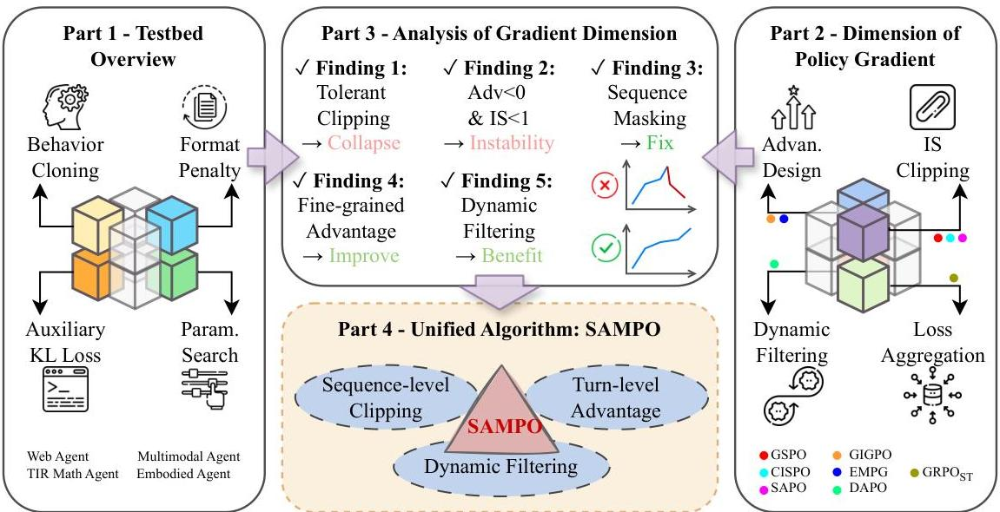
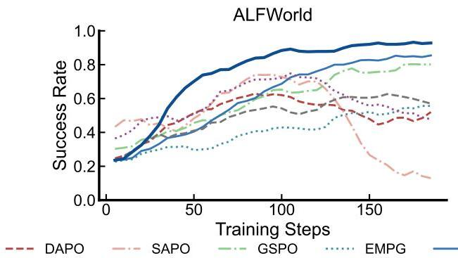
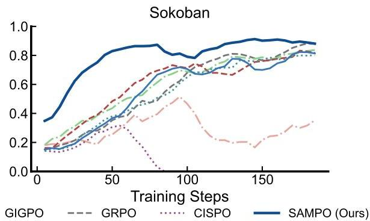
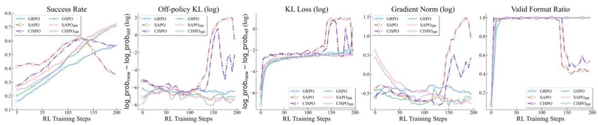
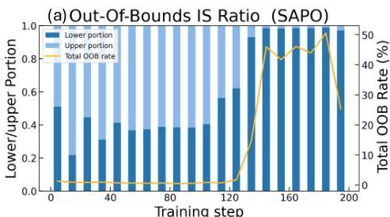
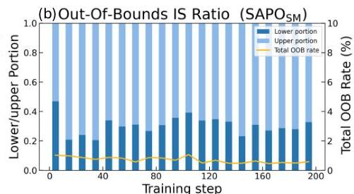
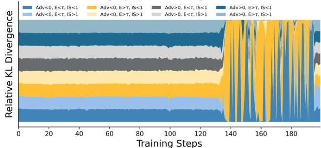
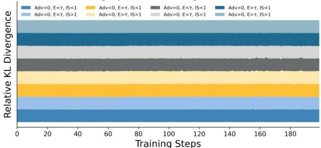

UCLA

ScAi

# ARLArena: A Unified Framework for Stable Agentic Reinforcement Learning

Xiaoxuan Wang $^{1,*}$ , Han Zhang $^{1,*}$ , Haixin Wang $^{1,*}$ , Yidan Shi $^{1,\dagger}$ , Ruoyan Li $^{1,\dagger}$ , Kaiqiao Han $^{1,\dagger}$ , Chenyi Tong $^{2}$ , Haoran Deng $^{1}$ , Renliang Sun $^{1}$ , Alexander Taylor $^{1}$ , Yanqiao Zhu $^{1}$ , Jason Cong $^{1}$ , Yizhou Sun $^{1}$ , Wei Wang $^{1}$

$^{1}$ University of California, Los Angeles,  $^{2}$ University of Wisconsin-Madison

*These authors share first authorship. †These authors share second authorship.

Agentic reinforcement learning (ARL) has rapidly gained attention as a promising paradigm for training agents to solve complex, multi-step interactive tasks. Despite encouraging early results, ARL remains highly unstable, often leading to training collapse. This instability limits scalability to larger environments and longer interaction horizons, and constrains systematic exploration of algorithmic design choices. In this paper, we first propose ARLArena, a stable training recipe and systematic analysis framework that examines training stability in a controlled and reproducible setting. ARLArena first constructs a clean and standardized testbed. Then, we decompose policy gradient into four core design dimensions and assess the performance and stability of each dimension. Through this fine-grained analysis, we distill a unified perspective on ARL and propose SAMPO, a stable agentic policy optimization method designed to mitigate the dominant sources of instability in ARL. Empirically, SAMPO achieves consistently stable training and strong performance across diverse agentic tasks. Overall, this study provides a unifying policy gradient perspective for ARL and offers practical guidance for building stable and reproducible LLM-based agent training pipelines.

GitHub: https://github.com/WillDreamer/ARL-Arena

HuggingFace: https://huggingface.co/UCLA-SCAI/models

Figure 1 | Overview of ARLArena. Part 1: A standardized testbed via behavior cloning, format penalty, KL regularization, and hyperparameter search. Part 2: Policy gradient decomposition into four dimensions with representative methods mapped to each. Part 3: Key findings on training stability and collapse modes. Part 4: Insights unified into SAMPO for stable ARL training.

---

Figure 2 | Training curves on ALFWorld (left) and Sokoban (right). SAMPO (ours) achieves the highest success rates on both environments with stable, monotonic improvement throughout training, while baseline methods exhibit varying degrees of instability. These results demonstrate that principled integration of sequence-level clipping, advantage design, and dynamic filtering, as combined in SAMPO, is critical for both training stability and final performance in multi-turn agentic RL.

# 1 Introduction

Large language models (LLMs) have been increasingly deployed as autonomous agents for complex, multi-step interactive tasks spanning web navigation (Zhou et al., 2024), embodied environments (Shridhar et al., 2020), games (Xi et al., 2024), and deep research (Guan et al., 2025; Jin et al., 2025). These tasks demand planning, tool use, and long-horizon decision-making, necessitating training objectives that capture multi-turn interactions. Reinforcement learning (RL) offers a principled post-training framework for this purpose, building on its success in static reasoning tasks (e.g., DeepSeek-R1 (Guo et al., 2025), OpenAI o1 (Jaech et al., 2024)), and early results in the agentic setting are promising (Cheng et al., 2025; Jin et al., 2025; Xi et al., 2024).

However, agentic RL (ARL) training remains highly unstable and prone to collapse (Xi et al., 2025). This instability arises from the interactive, multi-turn nature of agentic environments, which introduce compounding challenges such as invalid actions, sparse rewards, long-horizon credit assignment, and non-stationary agent-environment dynamics (Wang et al., 2025b; Xu et al., 2026). Small deviations in early decisions can cascade across turns, causing distribution shifts that amplify credit-assignment noise and produce degenerate rollouts (Xia et al., 2026; Xie et al., 2026). Consequently, ARL outcomes are difficult to reproduce across runs and environments, and scaling to longer horizons or more complex interaction spaces remains severely limited (Abdulhai et al., 2023; Xi et al., 2025). These challenges underscore the need for stable and scalable training solutions for ARL.

This paper addresses this gap by introducing ARLArena, a stable training recipe and systematic analysis framework for agentic reinforcement learning. We first construct a clean, standardized testbed through format correction, behavior cloning initialization, and KL-based regularization, establishing reliable baseline performance. We then decompose policy-gradient-based RL into four orthogonal design dimensions and evaluate the effectiveness and stability of each across diverse agentic tasks. Each dimension is examined in isolation using representative policy optimization (PO) methods; for methods that exhibit training collapse, we further diagnose the underlying failure modes and develop targeted stabilization strategies.

This systematic analysis yields three key findings: (1) tolerant clipping induces training collapse, whereas sequence-level clipping ensures stable improvement; (2) incorporating environment-level information into advantage design improves both stability and performance; and (3) dynamic sampling combined with fine-grained advantage design further benefits ARL training. Motivated by these insights, we propose Stable Agentic Multi-turn Policy Optimization (SAMPO), a unified PO method that directly addresses the dominant sources of instability identified in our analysis. SAMPO consistently improves training stability and performance, achieving an average  $25.2\%$  improvement over the GRPO baseline. We additionally study the impact of off-policy staleness in agentic environments and conduct comparative evaluations against proprietary models, demonstrating the robustness and generality of our approach.

---

<table><tr><td rowspan="2">Method</td><td rowspan="2">Loss Objective</td><td rowspan="2">Advantage (Ai)</td><td colspan="2">IS (wi) Clipping</td><td rowspan="2">Dynamical Sampling</td></tr><tr><td>Adv &lt; 0</td><td>Adv &gt; 0</td></tr><tr><td>GRPO</td><td>1/∑i=1GTi∑i=1GTi-1min(wtAi, clip(wt, 1±ε)Ai)</td><td>rt-mean(rt)/std(rt)</td><td>{1-ε, wt, wt &lt; 1-ε, otherwise.</td><td>{1+ε wt, wt &gt; 1+ε, otherwise.</td><td>×</td></tr><tr><td>GRPO27</td><td>1/Ci∑i=1GTi-1min(wtAi, clip(wt, 1±ε)Ai)</td><td>rt-mean(rt)/std(rt)</td><td>{1-ε, wt, wt &lt; 1-ε, otherwise.</td><td>{1+ε, wt, wt &gt; 1+ε, otherwise.</td><td>×</td></tr><tr><td rowspan="2">GRPO28</td><td>1/∑i=1GTi∑i=1GTi-1min(wtAi, clip(wt, 1±ε)Ai)</td><td>rt-mean(rt)/std(rt)</td><td>{1-ε, wt, wt &lt; 1-ε, otherwise.</td><td>{1+ε, wt, wt &gt; 1+ε, otherwise.</td><td>×</td></tr><tr><td>Mi=1[Ai≥0 or 1/|Ti|∑i=0Ti-1log πθsi(yi|x,y&lt;t)/πθ(yi|x,y&lt;t) ≤δ]</td><td>rt-mean(rt)/std(rt)</td><td>{1-ε, wt, wt &lt; 1-ε, otherwise.</td><td>{1+ε, wt, wt &gt; 1+ε, otherwise.</td><td>×</td></tr><tr><td>SAPO</td><td>1/∑i=1GTi∑i=1GTi-1fi,r(wt)Ai</td><td>rt-mean(rt)/std(rt)</td><td>σ(τbrg(wt-1))·4/τbrg</td><td>σ(τpre(wt-1))·4/τpre</td><td>×</td></tr><tr><td>CISPO</td><td>1/∑i=1GTi∑i=1GTi-1mg(wt)Ai log πθ</td><td>rt-mean(rt)/std(rt)</td><td>{1-εlow, wt &lt; 1-εlow; sg(wt), otherwise.</td><td>{1+εhigh, wt &gt; 1+εhigh; sg(wt), otherwise.</td><td>×</td></tr><tr><td rowspan="2">GSPO</td><td>1/∑i=1GTi∑i=1GTi-1min(siAi, clip(st, 1±ε)Ai)</td><td>rt-mean(rt)/std(rt)</td><td>{1-ε, si, si &lt; 1-ε, otherwise.</td><td>{1+ε, si, si &gt; 1+ε, otherwise.</td><td>×</td></tr><tr><td>si=exp{1/|Ti|∑i=0Ti-1log πθ(yt|x,y&lt;t)/πθsi(yt|x,y&lt;t)}</td><td>rt-mean(rt)/std(rt)</td><td>{1-ε, si, si &lt; 1-ε, otherwise.</td><td>{1+ε, si, si &gt; 1+ε, otherwise.</td><td>×</td></tr><tr><td>GIGPO</td><td>1/∑i=1GTi∑i=1GTi-1min(wtAi, clip(wt, 1±ε)Ai,k)</td><td>Ai+ω·Asup(ŷi,k)</td><td>{1-ε, wt, wt &lt; 1-ε, otherwise.</td><td>{1+ε, wt, wt &gt; 1+ε, otherwise.</td><td>×</td></tr><tr><td>EMPG</td><td>1/∑i=1GTi∑i=1GTi-1min(wtAi, clip(wt, 1±ε)Ai)</td><td>g(Hi)Ai+ζf(Hi+1)</td><td>{1-ε, wt, wt &lt; 1-ε, otherwise.</td><td>{1+ε, wt, wt &gt; 1+ε, otherwise.</td><td>×</td></tr><tr><td>DAPO</td><td>1/∑i=1GTi∑i=1GTi-1min(wtAi, clip(wt, 1±ε)Ai)</td><td>rt-mean(rt)/std(rt)</td><td>{1-εlow, wt, wt &lt; 1-εlow; otherwise.</td><td>{1+εhigh, wt, wt &gt; 1+εhigh, otherwise.</td><td>✓</td></tr></table>

Table 1 | A summary of policy optimization methods studied in ARLArena, decomposed along four design dimensions: loss objective formulation, advantage  $(A_{i})$ , importance sampling (IS) clipping, and dynamic sampling. Colored entries highlight distinctive design choices: purple denotes modified loss aggregation (seq-mean-token-mean), violet indicates alternative IS clipping strategies (tolerant or sequence-level), and green marks novel advantage designs. The importance sampling weight is  $w_{t} = \pi_{\theta}(y_{t} \mid x, y_{&lt;t}) / \pi_{\theta_{\mathrm{old}}}(y_{t} \mid x, y_{&lt;t})$ , and  $\mathrm{sg}(\cdot)$  denotes the stop-gradient operator.

In summary, our contributions are: (i) a unifying policy gradient perspective and four-dimensional categorization of PO methods for ARL; (ii) a standardized, reproducible testbed and diagnostic methodology for multi-turn ARL stability; (iii) principled, task-robust findings and remedies for common collapse modes; and (iv) SAMPO, a new PO method that achieves both reliable training and strong final performance. We hope this study provides a foundation for more reproducible and principled progress in LLM agent post-training.

# 2 Problem Formulation

# 2.1 Policy Gradient for Agentic RL

During RL optimization for LLMs, the policy  $\pi_{\theta}$  generates a response trajectory  $y = (y_0,\dots ,y_T)$  conditioned on a prompt  $x$ , which is subsequently used for policy updates (Ouyang et al., 2022). Following PPO-style optimization (Schulman et al., 2017), trajectories collected under a behavior policy  $\pi_{\theta_{\mathrm{old}}}$  are used to update the current policy  $\pi_{\theta}$ . The corresponding policy gradient can be written as:

$$
\nabla_ {\theta} \mathcal {L} (\theta) = \mathbb {E} _ {y \sim \pi_ {\theta_ {\mathrm {o l d}}}} \left[ \sum_ {t = 0} ^ {T} w _ {t} (y) \nabla_ {\theta} \log \pi_ {\theta} \left(y _ {t} \mid x, y _ {&lt;   t}\right) A (x, y) \right], \tag {1}
$$

where the importance sampling weight is given by:

$$
w _ {t} (y) = \frac {P _ {\theta} \left(y _ {t} \mid x , y _ {&lt;   t}\right)}{P _ {\theta_ {\mathrm {o l d}}} \left(y _ {t} \mid x , y _ {&lt;   t}\right)} = \frac {\pi_ {\theta} \left(y _ {t} \mid x , y _ {&lt;   t}\right)}{\pi_ {\theta_ {\mathrm {o l d}}} \left(y _ {t} \mid x , y _ {&lt;   t}\right)}. \tag {2}
$$

Here,  $A(x,y)$  represents the advantage of the sampled sequence.

---

#### Agentic RL.

An agent interacts with the environment over $K$ turns, forming a long-horizon decision-making process *(Luo et al., 2026; Wei et al., 2026)*. At each turn, the policy conditions on the accumulated history to generate a response, from which an action is extracted and executed to transition the environment state.

The initial user prompt is $x^{(1)}$. At turn $k\in\{1,\ldots,K\}$, the policy generates a response $y^{(k)}\sim\pi_{\theta}(\cdot\mid x^{(k)})$. Given the environment state $s^{(k)}$, actions $a^{(k)}$ are extracted from $y^{(k)}$, and the environment transitions to the next state $s^{(k+1)}$ according to an update function $f$: $s^{(k+1)}=f\big{(}a^{(k)},s^{(k)}\big{)}$, where $f(\cdot)$ is the state transition function that incorporates tool calls, environment observations, or retrieved information. The user prompt for turn $k+1$, denoted $x^{(k+1)}$, is constructed from the updated state $s^{(k+1)}$. Finally, the complete multi-turn interaction trajectory is defined as $\tau=\big{(}x^{(1)},y^{(1)},x^{(2)},y^{(2)},\ldots,x^{(K)},y^{(K)}\big{)}$.

In the multi-turn agent–environment setting described above, we decompose a $K$-turn trajectory into single-turn updates. This yields the following policy gradient formulation for agentic LLM interaction:

$\nabla_{\theta}\mathcal{L}(\theta)=\mathbb{E}_{\tau\sim\pi_{\theta_{\text{old}}}}\Big{[}\sum_{k=1}^{K}\sum_{t=0}^{T_{k}}\underbrace{w_{t}(y^{(k)})}_{\text{IS}}\underbrace{\nabla_{\theta}\log\pi_{\theta}\Big{(}y^{(k)}_{t}\mid x^{(k)},y^{(k)}_{<t}\Big{)}}_{\text{Log prob}}\underbrace{A(x^{(k)},y^{(k)})}_{\text{Advantage}}\Big{]}.$ (3)

### 2.2 Policy Gradient Decomposition Dimensions

According to Equation 3, the policy gradient formulation for agentic LLMs can be decomposed into four key research dimensions: Loss Aggregation, Importance Sampling (IS) clipping, Trajectory Filtering and Resampling, and Advantage Design. To study each dimension in isolation, we analyze the batch-level loss objective without loss of generality. We summarize mainstream PO algorithms across the different design dimensions of the policy gradient in Table 1.

#### Loss Aggregation.

In practice, we approximate the loss objective using different loss aggregation schemes.

$\mathcal{L}(\theta)$ $=\mathbb{E}_{y^{(i)}\sim\pi_{\theta_{\text{old}}}}\Big{[}\mathbb{E}_{t}\big{[}\ell_{i,t}(\theta)\big{]}\Big{]}$
$\triangleq\frac{1}{N}\sum_{i=1}^{N}\frac{1}{T_{i}}\sum_{t=0}^{T_{i}-1}\ell_{i,t}(\theta)\text{ (seq-mean-token-mean)}$ (4)
$\triangleq\frac{1}{\sum_{i=1}^{N}T_{i}}\sum_{i=1}^{N}\sum_{t=0}^{T_{i}-1}\ell_{i,t}(\theta)\quad\text{(token-mean)},$ (5)

where $\ell_{i,t}(\theta):=\min\big{(}w_{i,t}(\theta)\,A_{i},\;\operatorname{clip}\big{(}w_{i,t}(\theta),\,1-\varepsilon,\,1+\varepsilon\big{)}\,A_{i}\big{)}$. $N$ denotes the total number of decomposed turns over trajectories. $A_{i}$ denotes the advantage of sequence $y^{(i)}$, and $w_{i,t}(\theta)$ is the importance sampling ratio at token $t$ of sequence $y^{(i)}$. Seq-mean-token-mean weights each token by the inverse of its trajectory length, biasing optimization toward shorter trajectories and potentially introducing response-level length bias. Token-mean assigns equal weight to all unmasked tokens in the batch. Additional aggregation strategies are provided in the Appendix A.1.

#### IS Clipping.

Clipping methods constrain the magnitude of policy updates by limiting the change in action probabilities relative to the old policy. By constraining the deviation between the new and old policies within a bounded range, clipping mitigates performance degradation and instability caused by excessively large policy updates. The loss objective is formulated as follows:

$\mathcal{L}(\theta)=\frac{1}{\sum_{i=1}^{N}T_{i}}\sum_{i=1}^{N}\sum_{t=0}^{T_{i}-1}\min\Big{(}w_{i,t}(\theta)\,A_{i},\;\operatorname{clip}\big{(}w_{i,t}(\theta),1\pm\varepsilon\big{)}\,A_{i}\Big{)}.$ (6)

Within the GRPO *(Guo et al., 2025)* framework, several clipping variants are considered, including CISPO *(Chen et al., 2025)*, SAPO *(Gao et al., 2025)*, and GSPO *(Zheng et al., 2025)*. CISPO employs a stop-gradient mechanism to avoid hard clipping of out-of-bounds tokens while preserving their gradient information. SAPO adopts a soft-clipping strategy, in which excessively large ratios are smoothly attenuated rather than truncated. GSPO performs clipping by using the sequence-level importance ratio as the clipping criterion. Detailed formulations of these variants are provided in Table 1 and further introduced in Appendix A.2.

---

<table><tr><td>Algorithm</td><td>Strategy</td><td>Task Score</td><td>Success Rate</td></tr><tr><td rowspan="3">GRPO</td><td>+ Behavior Cloning</td><td>+ 2.56</td><td>+ 20.71</td></tr><tr><td>+ Rformat</td><td>+ 0.49</td><td>+ 7.34</td></tr><tr><td>+ KL k3(x)</td><td>+ 0.95</td><td>+ 18.10</td></tr><tr><td rowspan="2">GSPO</td><td>ε: e-2 → e-3</td><td>+ 0.70</td><td>+ 3.36</td></tr><tr><td>ε: e-3 → e-4</td><td>- 1.16</td><td>- 9.88</td></tr><tr><td>DAPO</td><td>Max_try: 2 → 3</td><td>+ 0.59</td><td>+ 22.15</td></tr><tr><td rowspan="2">SAPO</td><td>Temperature: 1 → 2</td><td>- 1.20</td><td>- 9.85</td></tr><tr><td>Temperature: 2 → 3</td><td>- 0.70</td><td>- 9.20</td></tr></table>

Table 2 | Incremental stabilization strategies for constructing a standardized testbed on ALFWorld, evaluated using GRPO as the base policy optimizer. Each row adds one stabilization technique or adjusts a method-specific hyperparameter. Task Score and Success Rate report the absolute improvement (+) or degradation (-) relative to the preceding configuration.

Trajectory Filtering and Resampling. Dynamic sampling addresses inefficiency caused by zero-gradient trajectories in long-horizon agent training (Yu et al., 2025a).

$$
\mathcal {L} (\theta) = \frac {1}{\sum_ {i = 1} ^ {N} T _ {i}} \sum_ {i = 1} ^ {N} \sum_ {t = 0} ^ {T _ {i} - 1} \min  \left(w _ {i, t} (\theta) A _ {i}, \operatorname {c l i p} \left(w _ {i, t} (\theta), 1 \pm \varepsilon\right) A _ {i}\right), \tag {7}
$$

$$
\text {s . t .} \quad 0 &lt;   \left| \left\{y ^ {(i)} \mid \text {i s \_ e q u i v a l e n t} (a, y ^ {(i)}) \right\} \right| &lt;   G.
$$

Here,  $a$  denotes the ground-truth task completion target, and equivalence is determined by whether the agent successfully completes the task. It adaptively filters out trajectories whose sampled output groups receive identical rewards (e.g., all correct or all incorrect) and resamples additional trajectories to increase the proportion of samples with informative gradient signals.

Advantage Design. Multi-turn agentic reinforcement learning introduces additional interaction steps and explicit agent-environment state transitions, which motivates specialized advantage designs. GiGPO (Feng et al., 2025) defines advantages at the state level by grouping actions conditioned on the same preceding environment state and assigning them a shared relative advantage. EMPG (Wang et al., 2025a) augments the advantage function with an entropy-dependent term, which modulates the learning signal at each turn to better account for uncertainty across interaction steps. Detailed formulations of these variants are provided in Table 1 and further introduced in Appendix A.3.

# 3 Experimental Setup

## 3.1 Standardized Testbed

A primary challenge is constructing a fair and effective testbed for comparing different algorithms. To address this issue, we progressively apply a sequence of stabilization strategies shown in Table 2. Specifically, we start with behavior cloning, followed by format penalty enforcement and KL regularization when necessary, and finally PO-specific hyperparameter tuning. This process yields a standardized and stable testbed that provides a solid foundation for systematically comparing different policy optimization strategies.

(1) Behavior Cloning. We first perform behavior cloning (BC) on supervised interaction traces to initialize the policy within a reasonable behavioral manifold. Specifically, we construct a multi-turn SFT dataset by deploying the Qwen3 series model (Yang et al., 2025) in the target training environments, collecting self-generated interaction trajectories, and retaining only high-scoring rollouts for supervision. This self-bootstrapped SFT stage initializes the policy within a reasonable behavioral manifold aligned with the environment dynamics.

---

<table><tr><td rowspan="2">Dimension</td><td rowspan="2">Method</td><td colspan="2">ALFWorld</td><td colspan="2">WebShop</td><td colspan="2">Sokoban</td><td colspan="2">TIR Math</td><td rowspan="2">Avg</td></tr><tr><td>Score</td><td>Success</td><td>Score</td><td>Success</td><td>Score</td><td>Success</td><td>AIME</td><td>AIME25</td></tr><tr><td>Base</td><td>GRPO</td><td>3.70</td><td>62.36</td><td>75.32</td><td>57.71</td><td>5.51</td><td>83.90</td><td>49.96</td><td>30.78</td><td>46.16 (48.08)</td></tr><tr><td>Loss Agg</td><td>GRPOST</td><td>4.41↑19.2%</td><td>72.61↑16.4%</td><td>64.57↓14.3%</td><td>51.29↓11.1%</td><td>3.03↓45.0%</td><td>68.73↓38.1%</td><td>27.55↓44.9%</td><td>21.63↓35.7%</td><td>39.23↓25.0%</td></tr><tr><td rowspan="3">Importance Sampling</td><td>SAPO</td><td>0.80↓78.4%</td><td>25.16↓79.7%</td><td>73.85↓1.9%</td><td>52.10↓9.7%</td><td>-0.23↓104%</td><td>30.25↓63.9%</td><td>45.00↓9.9%</td><td>30.85↑11.2%</td><td>32.22↓30.2%</td></tr><tr><td>CISPO</td><td>2.16↓41.6%</td><td>54.42↓12.7%</td><td>67.96↓9.8%</td><td>54.71↓3.2%</td><td>-0.47↓109%</td><td>26.02↓69.0%</td><td>36.53↓26.9%</td><td>30.87↑11.1%</td><td>34.03↓26.3%</td></tr><tr><td>GSPO</td><td>5.19↑40.3%</td><td>78.61↑24.1%</td><td>85.29↑11.1%</td><td>72.48↑25.4%</td><td>5.22↓5.1%</td><td>82.22↓1.7%</td><td>51.29↑2.7%</td><td>37.95↑23.3%</td><td>52.28↑11.1%</td></tr><tr><td rowspan="2">Advantage Design</td><td>GIGPO</td><td>4.97↑16.3%</td><td>81.09↑10.0%</td><td>67.76↓10.0%</td><td>56.55↓2.0%</td><td>5.19↓3.8%</td><td>82.67↓1.5%</td><td>-</td><td>-</td><td>49.71↑3.4%</td></tr><tr><td>EMPG</td><td>3.32↓10.3%</td><td>57.91↓7.1%</td><td>79.16↑3.1%</td><td>64.32↑11.5%</td><td>4.48↓18.7%</td><td>79.16↓3.6%</td><td>-</td><td>-</td><td>48.06↓9.1%</td></tr><tr><td rowspan="2">Dynamic Sampling</td><td>DAPOGRPO</td><td>1.95↓47.3%</td><td>49.58↓26.5%</td><td>62.43↓17.1%</td><td>46.17↓20.0%</td><td>5.16↓6.4%</td><td>82.40↓1.8%</td><td>54.66↑5.4%</td><td>38.97↑26.6%</td><td>42.67↓7.6%</td></tr><tr><td>DAPOGGPO</td><td>2.49↓32.7%</td><td>60.55↓2.9%</td><td>88.10↑17.0%</td><td>76.82↑33.1%</td><td>6.01↑9.1%</td><td>86.20↑2.7%</td><td>-</td><td>-</td><td>53.36↑11.0%</td></tr><tr><td>Ours</td><td>SAMPO</td><td>7.04↑90.3%</td><td>92.72↑44.7%</td><td>88.37↑17.3%</td><td>77.73↑54.7%</td><td>6.56↑19.1%</td><td>88.86↑5.6%</td><td>-</td><td>-</td><td>60.21↑25.2%</td></tr></table>

Table 3 | Performance comparison of policy optimization methods across four agentic tasks, evaluated on the SFT version of Qwen3-4B. Methods are organized by their primary design dimension: loss aggregation, importance sampling clipping, advantage design, and dynamic sampling. Green/red subscripts denote the percentage improvement/degradation relative to the GRPO baseline. SAMPO (ours) achieves the highest average score (59.55) with consistent gains across ALFWorld (92.72% success), WebShop (74.08% success), and Sokoban (88.86% success). The evaluation metric for TIR Math is Pass@4; “-” indicates the method is not applicable. For GRPO, the value in parentheses reports the average over the first three tasks only.

(2) Format Penalty. We incorporate  $\mathcal{R}_{\mathrm{format}}$  that enforces structured outputs with explicit <think> </think> and <action> </action> tags. If the generated output violates this format (e.g., missing tags, malformed nesting, or extraneous content outside the tags), we apply a fixed penalty to the final reward. This explicit structural constraint provides dense shaping signals during early training and substantially reduces invalid rollouts that would otherwise corrupt policy updates.
(3) Auxiliary KL Loss. Unconstrained updates may cause the policy to drift excessively from the reference model. To regularize policy updates and preserve the pretrained knowledge embedded in the base model, we introduce a KL divergence penalty between the current policy  $\pi_{\theta}$  and a reference policy  $\pi_{\mathrm{ref}}$ . This constraint encourages conservative policy improvement while still allowing sufficient exploration in the action space. We adopt the commonly used Bregman divergence estimator  $k_{3}$  for KL approximation, which leverages control variates to achieve unbiasedness and low variance (Schulman, 2017). Specifically,  $k_{3}$  is defined as  $k_{3}(x) = \delta(x) - 1 - \log \delta(x)$ , where  $\delta(x) = \frac{p(x)}{q(x)}$  denotes the likelihood ratio.
(4) PO-specific Hyper-parameter Grid Search. A natural question is how to ensure that each PO method is fairly evaluated in the multi-turn setting. Our solution is to first run each method with its default configuration, and then perform a PO-specific hyperparameter grid search. We continue tuning until the training trajectory becomes stable, measured by the variance of the success rate over the final  $20\%$  of training steps falling below a predefined threshold. As shown in Table 1, hyperparameters related to IS clipping are particularly sensitive. The best-performing configurations and full results are reported in Appendix B.

# 3.2 Tasks and Training Details

We adapt ALFWorld (Shridhar et al., 2020), WebShop (Yao et al., 2022), Sokoban (Schrader, 2018), and TIR Math (Xue et al., 2025) as the agentic tasks. Our entire codebase is built upon the ver1 RL framework (Sheng et al., 2024). We employ an agentic-loop architecture to coordinate rollouts and environment interactions, after which we segment each complete trajectory into multiple single-turn samples for policy optimization. For mathematical tasks, we use Qwen3-4B-base as the policy model, while for all other tasks we initialize from the SFT-tuned variant Qwen3-4B. For consistency validation, we additionally employed SFT-tuned Qwen3-8B, and the corresponding experimental results are provided in Appendix C. All experiments are conducted on NVIDIA H200 or B200 GPUs. Key hyperparameters and training details are reported in Appendix B.

---

Figure 3 | Training dynamics of six IS variants on ALFWorld: GRPO, GSPO, SAPO, CISPO, and their sequence-masked counterparts  $\mathrm{SAPO}_{\mathrm{SM}}$  and  $\mathrm{CISPO}_{\mathrm{SM}}$ . Panels show (from left to right) success rate, off-policy KL divergence between the current and behavior policies, KL loss between the current and reference policies, gradient norm, and valid-format ratio of rollout actions.

# 4 Exploring Gradient Dimensions on ARL

The experimental results for all policy optimization methods are reported in Table 3. GRPO $_{\text{ST}}$  denotes GRPO with sequence-mean-token-mean loss aggregation. DAPO $_{\text{GRPO}}$  and DAPO $_{\text{GIGPO}}$  denote GRPO and GIGPO augmented with dynamic filtering, respectively.

# 4.1 Impact of IS on ARL

We study GSPO, CISPO, and SAPO along the importance-sampling (IS) dimension. GSPO adopts sequence-level clipping, while CISPO and SAPO employ tolerant clipping techniques. For CISPO and SAPO, we further apply sequence masking (denoted as  $\mathrm{CISPO}_{\mathrm{SM}}$  and  $\mathrm{SAPO}_{\mathrm{SM}}$ ) to improve training stability. Detailed training dynamics are reported in Figure 3, with IS token-level and sequence-level analyses presented in Figure 4.

Table 3 shows that CISPO and SAPO perform substantially worse than GRPO across all tasks, achieving average scores of 34.03 and 32.22, respectively, compared to 46.16 for GRPO. In contrast, GSPO consistently outperforms all other policy optimization methods, achieving an average improvement of  $13.3\%$  compared to GRPO.

To understand training behavior beyond final performance, we analyze training dynamics from multiple perspectives across several metrics. Different IS designs induce varying distances between the current policy and both the behavior and reference policies during training. These distance variations, in turn, influence optimization behavior (reflected by gradient norms), impact data quality (through the valid action ratio), and ultimately affect task success rates. Jointly examining these metrics enables a more comprehensive understanding of training stability and failure modes. Figure 3 reports success rate, off-policy KL divergence (between the new and old policies), KL loss (between the new and reference policies), gradient norm, and the valid-format ratio of rollout action tokens.

As shown in Figure 3, CISPO and SAPO with tolerant clipping exhibit rapid initial performance gains, characterized by higher success rates, larger policy updates relative to the reference model, and faster format ratio adaptation compared to GRPO and GSPO. This behavior indicates more aggressive optimization that departs quickly from the reference policy and adapts rapidly to the task. A possible explanation is that tolerant clipping may preserve gradient contributions from tokens that deviate substantially from the current policy, resulting in overly exploratory updates. However, such aggressiveness leads to training instability, with collapse occurring around step 130. This collapse is marked by exploding gradient norms and KL divergence, accompanied by a sharp drop in the valid-format ratio, ultimately resulting in a severe degradation of success rate. In contrast, GSPO demonstrates a substantially more stable training pattern, with gradual performance improvement accompanied by steady KL divergence and gradient norms. These results indicate that sequence-level clipping is effective for stabilizing training, while overly tolerant clipping thresholds may yield short-term gains at the cost of long-term stability. Furthermore, IS design substantially impacts both performance and training stability in ARL, making it an important dimension in ARL system design.

# Finding 1

ARL is highly sensitive to IS design: tolerant clipping yields fast early gains but causes training collapse, whereas sequence-level clipping ensures stable improvement.

---

(c) Streamgraph of KL Divergence (SAPO)

(d) Streamgraph of KL Divergence  $(\mathsf{SAPO}_{\mathsf{SM}})$
Figure 4 | Token-level and sequence-level IS analysis of SAPO and its sequence-masked variant  $\mathrm{SAPO}_{\mathrm{SM}}$ . (a, b) Fraction of tokens with importance ratios outside the clipping range, decomposed into lower-bound (negative advantage) and upper-bound (positive advantage) portions. (c, d) Rollout groups partitioned by advantage sign, entropy level, and IS ratio magnitude, with KL divergence normalized for relative comparison.

Rooted cause of training collapse. To investigate the root causes of training collapse along the IS dimension, we analyze token-level importance ratio statistics and stratify sequences by IS ratio, advantage, and entropy for SAPO and  $\mathrm{SAPO}_{\mathrm{SM}}$ , where  $\mathrm{SAPO}_{\mathrm{SM}}$  denotes a stabilized variant of SAPO introduced later. Figure 4 reports token-level and sequence-level IS ratio analysis. Subfigures (a) and (b) present the statistics of tokens whose importance sampling ratios fall outside the standard clipping range. Specifically, we report the proportion of out-of-bounds tokens and decompose it into lower- and upper-bound portions. The lower-bound portion corresponds to negative-advantage tokens with importance ratios below  $\epsilon_{\mathrm{low}}$ , while the upper-bound portion corresponds to positive-advantage tokens with ratios exceeding  $\epsilon_{\mathrm{high}}$ .

As shown in Figure 4, During the collapse stage, SAPO exhibits a rapidly growing number of out-of-bounds tokens, predominantly from negative-advantage sequences with small importance ratios (the lower-bound portion) In contrast, for stable training runs, the portion of out-of-bounds tokens remains fairly low, and lower- and upper-bound ratio portions remain relatively balanced. This growing pattern and imbalance during collapse suggests that negative-advantage samples with low IS ratios are the main contributors the observed training instability.

Beyond token-level analysis, we conduct a sequence-level comparison across training steps in Subfigures (c) and (d). Rollout samples are partitioned according to three factors: the sign of the advantage, whether the importance ratio is smaller or larger than one, and whether policy entropy falls below or exceeds a predefined threshold. This yields eight groups per training step. The vertical area denotes the normalized KL divergence between the current policy and the reference policy. A larger area therefore corresponds to a greater deviation from the reference policy, indicating a stronger contribution to policy shift during training. For collapsed experiments, the proportion of KL divergence attributed to sequences with negative advantages and low importance ratios increases abruptly, whereas for stable training this KL distribution remains relatively balanced across groups. Entropy is less impactful than advantage and IS ratio. This pattern further reinforces the conclusion that negative-advantage samples with low importance ratios are a primary source of training instability.

Stabilization Strategies for SAPO and CISPO. We explore several strategies to stabilize SAPO and CISPO training, reported in Table 4. First, we consider increasing the KL coefficient to regularize optimization, and enlarging the mini-update batch size to mitigate off-policy effects. As shown in Table 4, increasing the KL coefficient overly constrains training and yields limited performance gains (full success-rate plots reported in Appendix C). Similarly, increasing the mini-update batch size degrades performance. Motivated by the IS-token analysis during training collapse, we adopt sequence masking following (Liu et al., 2025) to directly control negative samples that induce instability. Specifically, sequences with negative advantages and low importance ratios are masked (see Table 1 for the detailed formulation), a variant we denote as  $\mathrm{GRPO}_{\mathrm{SM}}$ . We apply sequence masking to SAPO and CISPO, denoted as  $\mathrm{SAPO}_{\mathrm{SM}}$  and  $\mathrm{CISPO}_{\mathrm{SM}}$ .

---

<table><tr><td>Method</td><td>Metric</td><td>Original</td><td>KL (0.05)</td><td>Off-Policy (1024)</td><td>Seq-Mask</td></tr><tr><td rowspan="2">CISPO</td><td>Score</td><td>2.16</td><td>1.60</td><td>0.98</td><td>5.25</td></tr><tr><td>Success</td><td>54.42</td><td>38.46</td><td>21.59</td><td>78.88</td></tr><tr><td rowspan="2">SAPO</td><td>Score</td><td>0.80</td><td>2.40</td><td>3.82</td><td>4.88</td></tr><tr><td>Success</td><td>25.16</td><td>48.05</td><td>64.30</td><td>76.92</td></tr></table>

Table 4 | Effect of different stabilization strategies on CISPO and SAPO in ALFWorld. We evaluate three stabilization techniques applied to the tolerant-clipping methods CISPO and SAPO: increasing the KL penalty coefficient to 0.05, enlarging the off-policy mini-update batch size to 1024, and applying sequence-level masking (Seq-Mask).

According to Figure 4 and Table 4, applying sequence masking improves the success rate from 54.12 to 78.88 for CISPO and from 25.16 to 76.92 for SAPO.  $\mathrm{SAPO}_{\mathrm{SM}}$  and  $\mathrm{CISPO}_{\mathrm{SM}}$  effectively stabilizes training, yielding success rates comparable to GSPO, along with steady KL divergence and gradient norms (Figures 3, 4).

# Finding 2

Training collapse is largely driven by the accumulation of negative-advantage sequences with low IS ratios. Sequence masking of such sequences stabilizes training.

# 4.2 Impact of Advantage Design on ARL

We study GIGPO and EMPG along the advantage-design dimension. GIGPO incorporates both global and local advantage information from the environment, enabling fine-grained advantage estimation, while EMPG reshapes advantages by incorporating uncertainty information from the training data.

Table 3 shows that GIGPO generally outperforms GRPO, achieving an average score of 49.71 compared to 48.08, with a particularly strong improvement of  $34.4\%$  on ALFWorld. In addition, EMPG exhibits task-dependent performance, improving the success rate on WebShop by  $11.5\%$  while degrading performance on ALFWorld by  $7.1\%$ , resulting in an average score difference of 0.1 compared to GRPO. This suggests that fine-grained advantage design incorporating richer environmental information improves performance and alleviates reward sparsity in ARL, whereas advantage reshaping based on uncertainty signals has a smaller effect.

# Finding 3

Incorporating fine-grained environmental advantage in ARL improves performance.

# 4.3 Impact of Dynamic Filtering on ARL

Dynamic filtering is well known for delivering strong performance improvements on mathematical reasoning tasks (Xue et al., 2025; Yu et al., 2025a). However, we find that these gains do not always transfer to agentic reinforcement learning settings. As shown in Table 3, dynamic filtering improves performance more consistently when combined with GIGPO than with GRPO. This difference stems from how dynamic filtering interacts with format learning. In early training, many rollout groups fail entirely due to format errors, which amplifies the format penalty and produces strong implicit advantage signals for format correction. As a result, the model rapidly acquires correct formatting from early rollouts. Meanwhile, dynamic filtering removes such all-failure groups. For GRPO, whose advantage signals have limited diversity, filtering substantially reduces format-related learning signals, leading to unstable format behavior and limited gains. In contrast, GIGPO produces more diverse advantage signals, which stabilize format learning even after filtering, allowing  $\mathrm{DAPO}_{\mathrm{GIGPO}}$  to achieve better and more stable performance. The detailed evidence supporting the above analyses is provided in Appendix G.

# Finding 4

Dynamic filtering with GIGPO is beneficial for training stability and performance in ARL.

---

<table><tr><td rowspan="3">Degree</td><td colspan="2">ALFWorld</td><td colspan="4">Math</td></tr><tr><td rowspan="2">Score</td><td rowspan="2">Success</td><td colspan="2">AIME</td><td colspan="2">AIME25</td></tr><tr><td>k@1</td><td>k@32</td><td>k@1</td><td>k@32</td></tr><tr><td>Low</td><td>3.50</td><td>60.80</td><td>26.95</td><td>87.34</td><td>24.61</td><td>50.00</td></tr><tr><td>Medium</td><td>3.83</td><td>58.38</td><td>24.22</td><td>75.00</td><td>17.97</td><td>48.59</td></tr><tr><td>High</td><td>2.33</td><td>52.71</td><td>19.53</td><td>74.99</td><td>16.41</td><td>43.85</td></tr></table>

Table 5 | Effect of off-policy staleness on ALFWorld and MATH. We vary the degree of off-policy staleness (Low, Medium, High) and report task score, success rate (ALFWorld), and pass@k accuracy (AIME, AIME25).

# 4.4 Impact of Loss Aggregation on ARL

As shown in Table 3, sequence-mean-token-mean loss aggregation  $(\mathrm{GRPO}_{\mathrm{ST}})$  degrades performance from 46.16 to 39.23 relative to token-mean aggregation (GRPO). Although  $\mathrm{GRPO}_{\mathrm{ST}}$  yields a  $16.4\%$  improvement on ALFWorld, it leads to a substantial decline on TIR-Math, with a  $44.9\%$  decrease on AIME. Notably, math rollouts exhibit higher variance in sequence length compared to other tasks, ranging from brief solutions to extended reasoning traces. These findings suggest that the unbalanced token weighting induced by sequence-level aggregation may negatively affect ARL training, particularly in tasks characterized by high length variability.

# 4.5 Further Stability Considerations

Exploration on Off-Policy Staleness. Due to infrastructure and efficiency constraints, policy training is typically performed in batched rollouts, where groups of trajectories are generated and updated sequentially before proceeding to the next rollout stage. Off-policy effects arise because later updates within the same rollout stage use data from an earlier policy while the current policy has already evolved. Such off-policy mismatch is further amplified in multi-turn settings, where turn-wise decomposition increases the number of samples subject to staleness.

Experiment Setup and Results. We control off-policy degree through rollout configuration while holding the update batch size fixed. For TIR Math, rollout batch sizes of 128, 512, and 1024 correspond to low, medium, and high off-policy degrees, respectively. For ALFWorld, we vary the off-policy degree by adjusting the number of groups per rollout to 8, 16, and 32. The effects of off-policy staleness are summarized in Table 5. TIR Math achieves higher performance under a low off-policy ratio (rollout batch size = 128), with  $87.34\%$  and  $50.00\%$  for avg@32, compared to  $74.99\%$  and  $43.85\%$  under a high off-policy ratio. Similarly, ALFWorld attains its highest success rate of  $60.80\%$  under low off-policy settings, which decreases to  $52.71\%$  under high off-policy settings. These results suggest that policy gradient optimization for agentic tasks exhibits sensitivity to the off-policy ratio.

# 5 SAMPO

# 5.1 Motivation

Can we derive a unified understanding of ARL training based on these insights? By systematically analyzing POs along orthogonal design dimensions in ARL, we identify key factors that determine training stability and optimization efficacy. At initialization, formatting errors and invalid action tokens induce severe optimization noise. We eliminate these failure modes through behavior cloning and explicit format correction, constraining learning to a valid behavioral manifold. Along the importance sampling dimension, sequence-level clipping, rather than token-wise constraints, is critical for long-horizon ARL. This mechanism addresses off-policy drift by suppressing harmful trajectories and yields substantial improvements in training stability. For advantage design, our analysis reveals that increasing advantage diversity across finer scales is essential to overcoming reward sparsity. Integrating global and local signals significantly enhances credit assignment. Finally, we show that dynamic trajectory filtering helps stabilize gradient updates by removing samples with degenerate advantages, leading to more informative and effective policy gradients.

---

5.2 Our Method

Guided by this unified understanding, we propose SAMPO, a new PO paradigm built on these principles. SAMPO integrates sequence-level clipping, fine-grained advantage estimation, and dynamic filtering into a unified framework, yielding a stable and scalable solution for ARL. It is formulated as:

$\mathcal{L}(\theta)=\frac{1}{\sum_{i=1}^{N}T_{i}}\sum_{i=1}^{N}\sum_{t=0}^{T_{i}-1}\min\Big{(}s_{i}(\theta)\,A_{i}^{{}^{\prime}},\ \mathrm{clip}\big{(}s_{i}(\theta),1\pm\varepsilon\big{)}\,A_{i}^{{}^{\prime}}\Big{)},$ (8)
$\mathrm{s.t.}\quad 0<|\{y\ |\ \mathrm{is\_equivalent}(a,y)\}|<G.$

Here, $A_{i,k}^{{}^{\prime}}=A_{i}+\omega\cdot A_{\text{step}}(\hat{y}_{i,k})$, $s_{i}(\theta)=\exp\Big{(}\frac{1}{|T_{i}|}\sum_{t=0}^{|T_{i}|-1}\log\frac{\pi_{\theta}(y_{t}|x,y_{<t})}{\pi_{\theta_{\text{old}}}(y_{t}|x,y_{<t})}\Big{)}$. Across all evaluated agentic tasks, SAMPO consistently achieves the strongest overall performance shown in Table 1. Compared to methods that modify only one dimension, SAMPO demonstrates that combining multiple design dimensions is necessary for stable and effective ARL. Notably, SAMPO delivers particularly large improvements on long-horizon interactive tasks such as ALFWorld, highlighting the importance of sequence-aware control in agentic settings. These results validate our central claim that stable agentic PO method requires satisfying multiple necessary conditions simultaneously, rather than relying on isolated algorithmic modifications.

### 5.3 Benchmarking against Inference Paradigms

To further contextualize the performance of SAMPO and evaluate whether a small open-source model trained with stable RL can compete with state-of-the-art inference strategies, we benchmark ARLArena against frontier closed-source models and complex multi-agent workflows. This comparison verifies a key hypothesis: principled RL training may offer greater gains in agentic tasks than heavy inference-time engineering on generic models.

##### Experiment Setup and Results.

We evaluate GPT-5.2 *(OpenAI, 2025a)*, o3 *(OpenAI, 2025b)*, and Gemini 2.5 Pro *(Comanici et al., 2025)* on ALFWorld and WebShop, under two paradigms: (i) Single LLM as Agent (SLA), following a standardized protocol; (ii) Multi-Agent System (MAS), with Debate and Aggressive Debate coordination strategies (details in Appendix F.5). Qwen3-4B-RFT post-trained with SAMPO achieves 92.72% all-task success on ALFWorld, outperforming GPT-5.2 (51.56%) and o3-based MAS (56.25%). Open-source models with SAMPO consistently exceed larger closed-source models, showing that scale and complex inference cannot replace stable, environment-aligned ARL training.

## 6 Insights for Future Work

Based on our systematic dissection of policy gradient design choices in ARL, we identify several promising directions that merit deeper exploration.

##### (1) Clean training recipes are foundational for complex reasoning.

ARLArena reveals that ARL is extraordinarily sensitive to initialization and early-stage training dynamics. A carefully constructed clean setting, combining short supervised cold-start SFT, format-enforcing structural constraints, and conservative KL regularization, proves essential for unlocking stable multi-turn reasoning behaviors. Without such a controlled recipe, policy gradient signals are easily corrupted by malformed trajectories or premature collapse. This suggests that future research should treat training recipes not as auxiliary tricks, but as essential algorithmic components that define the feasible region in which sophisticated reasoning policies can emerge. Our codebase also provides detailed training recipes for reference.

##### (2) IS clipping is highly sensitive, while advantage design offers a comparatively stable gain.

Among the policy gradient dimensions we examine, IS clipping strategies exhibit high sensitivity: minor changes in clipping thresholds or ratio parameterization can drastically affect stability. In contrast, advantage design tends to provide more stable but relatively modest improvements across tasks. These observations indicate that IS clipping strategy represents a *high-risk, high-reward* direction, whereas advantage design offers a more predictable but limited performance gains in ARL.

---

(3) Stable ARL unlocks long-horizon scaling opportunities.

Once training collapse is mitigated, we observe that agentic policies can sustain performance improvements over substantially more optimization steps without degradation. This stability opens the door to scaling both interaction horizon and environment size, analogous to scaling laws in supervised pretraining. Consequently, future progress in the field will increasingly depend on scaling environment diversity, interaction data volume, and multi-task curricula.

## 7 Conclusion

This work systematically analyzes how policy gradient design choices impact training stability for agentic LLMs in multi-turn environments. ARLArena demonstrates that sequence-level clipping is critical for stability, while advantage design and dynamic filtering offer smaller but consistent gains, and loss aggregation has limited effect. Based on these insights, we introduce SAMPO, a unified policy optimization framework that achieves stable and effective agentic RL training. Overall, this study underscores the importance of principled policy design and reproducible evaluation for advancing ARL.

# Supplementary Materials for ARLArena

## A More Details on Research Dimension
A.1 Loss Aggregation ... 17
A.2 Importance Sampling Clipping ... 18
A.3 Advantage Design ... 19

---

A More Details on Research Dimension

### A.1 Loss Aggregation

As discussed in Section 2.2, the policy gradient objective for agentic LLMs is implemented through a batch-level loss aggregation over token-level surrogate losses. For a batch of $N$ sampled trajectories $\{y_{i}\}_{i=1}^{N}$, where trajectory $i$ has length $T_{i}$, we define the token-level loss as

$\ell_{i,t}(\theta)\;:=\;\min(w_{i,t}(\theta)A_{i},\;\mathrm{clip}(w_{i,t}(\theta),1-\varepsilon,1+\varepsilon)\,A_{i})\,,$ (S1)

where $w_{i,t}(\theta)=\pi_{\theta}(y_{i,t}\mid x_{i},y_{i,<t})/\pi_{\theta_{\text{six}}}(y_{i,t}\mid x_{i},y_{i,<t})$ and $A_{i}$ denotes the (sequence-level) advantage associated with trajectory $y_{i}$.

Different loss aggregation strategies correspond to different empirical estimators of the expectation over trajectories and tokens. Below we summarize several commonly used schemes.

##### Token-mean.

The token-mean estimator averages the loss uniformly over all unmasked tokens in the batch:

$\mathcal{L}_{\text{token-mean}}(\theta)\;=\;\frac{1}{\sum_{i=1}^{N}T_{i}}\sum_{i=1}^{N}\sum_{t=0}^{T_{i}-1}\ell_{i,t}(\theta).$ (S2)

This scheme assigns equal weight to each token across the entire batch and is invariant to trajectory length at the sequence level. Token-mean has been adopted in several recent works (e.g., DAPO) as a means of stabilizing optimization. However, because trajectories with longer responses contribute more tokens, they implicitly receive larger total weight, which may bias optimization toward long trajectories.

##### Sequence-mean token-mean (Seq-mean-token-mean).

This estimator first averages over tokens within each trajectory and then averages across trajectories:

$\mathcal{L}_{\text{seq-mean-token-mean}}(\theta)\;=\;\frac{1}{N}\sum_{i=1}^{N}\frac{1}{T_{i}}\sum_{t=0}^{T_{i}-1}\ell_{i,t}(\theta).$ (S3)

Under this scheme, each trajectory contributes equally regardless of its length. Equivalently, each token is weighted by $1/T_{i}$. As a result, shorter trajectories assign larger per-token weight, while longer trajectories are relatively down-weighted. This behavior can introduce response-level length bias, rewarding short correct trajectories more strongly and penalizing long incorrect trajectories less.

##### Sequence-mean token-sum (Seq-mean-token-sum).

An alternative aggregation removes the per-trajectory normalization over tokens:

$\mathcal{L}_{\text{seq-mean-token-sum}}(\theta)\;=\;\frac{1}{N}\sum_{i=1}^{N}\sum_{t=0}^{T_{i}-1}\ell_{i,t}(\theta).$ (S4)

This formulation corresponds to maximizing the expected cumulative surrogate objective over full trajectories. Compared to Seq-mean-token-mean, longer trajectories receive proportionally larger weight.

##### Sequence-mean token-sum with length normalization (Seq-mean-token-sum-norm).

In practice, some implementations normalize by a fixed maximum generation length $T_{\max}$:

$\mathcal{L}_{\text{seq-mean-token-sum-norm}}(\theta)\;=\;\frac{1}{NT_{\max}}\sum_{i=1}^{N}\sum_{t=0}^{T_{i}-1}\ell_{i,t}(\theta).$ (S5)

This estimator enforces a uniform upper bound on the contribution of each trajectory and assigns equal weight to tokens across batches under a fixed-length budget.

---

Discussion.

These aggregation schemes differ primarily in how they trade off trajectory-level fairness, token-level weighting, and variance control. Seq-mean-token-mean and token-mean are the two most commonly used estimators in practice and are the focus of our empirical analysis in Section 4.4. The remaining variants are included here for completeness and to clarify their implicit inductive biases in agentic reinforcement learning.

### A.2 Importance Sampling Clipping

As discussed in Section 2.2, importance sampling (IS) clipping plays a central role in stabilizing off-policy policy optimization. While all methods considered in this work rely on the same token-level importance ratio

$w_{i,t}(\theta)=\frac{\pi_{\theta}(y_{i,t}\mid x_{i},y_{i,<t})}{\pi_{\theta_{\text{std}}}(y_{i,t}\mid x_{i},y_{i,<t})},$ (S6)

they differ substantially in *where* and *how* clipping is applied. Below we summarize the clipping mechanisms of GRPO, CISPO, SAPO, and GSPO.

#### A.2.1 GRPO

Group Relative Policy Optimization (GRPO) adopts the standard PPO-style hard clipping applied independently at each token:

$\ell_{i,t}^{\text{GRPO}}(\theta)=\min(w_{i,t}(\theta)A_{i},\ \operatorname{clip}(w_{i,t}(\theta),1-\varepsilon,1+\varepsilon)\,A_{i})\,.$ (S7)

Clipping is performed directly on the token-level importance ratio. When $w_{i,t}$ falls outside the clipping range, the gradient contribution of that token is truncated.

#### A.2.2 CISPO

Clipped Importance Sampling Policy Optimization (CISPO) modifies GRPO by clipping the importance ratio itself rather than the surrogate objective. Specifically, the clipped ratio is defined as

\[ \tilde{w}_{i,t}(\theta)=\begin{cases}1+\varepsilon,&w_{i,t}(\theta)>1+\varepsilon,\\
w_{i,t}(\theta),&\text{otherwise},\end{cases} \] (S8)

and is treated as a stop-gradient quantity. The resulting loss takes the form

$\ell_{i,t}^{\text{CISPO}}(\theta)=\operatorname{sg}(\tilde{w}_{i,t}(\theta))~{}A_{i}\,\log\pi_{\theta}(y_{i,t}\mid x_{i},y_{i,<t}),$ (S9)

where $\operatorname{sg}(\cdot)$ denotes the stop-gradient operator. By avoiding hard truncation of token updates, CISPO preserves gradient flow for clipped tokens while still bounding their influence. However, clipping remains token-local and does not explicitly enforce sequence-level coherence.

#### A.2.3 SAPO

Soft Adaptive Policy Optimization (SAPO) replaces hard clipping with a smooth, temperature-controlled gating function. The surrogate loss is defined as

$\ell_{i,t}^{\text{SAPO}}(\theta)=f_{i,t}(w_{i,t}(\theta))\,A_{i},$ (S10)

where

\[ f_{i,t}(x)=\sigma\big{(}\tau_{i,t}(x-1)\big{)}\cdot\frac{4}{\tau_{i,t}},\qquad\tau_{i,t}=\begin{cases}\tau_{\text{pos}},&A_{i}>0,\\
\tau_{\text{neg}},&A_{i}<0.\end{cases} \] (S11)

Here $\sigma(\cdot)$ denotes the sigmoid function. SAPO implements a continuous trust region: near on-policy updates are preserved, while off-policy updates are smoothly attenuated rather than abruptly clipped. The asymmetric temperature design further suppresses high-variance negative-advantage updates. Despite improved smoothness, SAPO remains a token-level method and does not explicitly prevent a few extreme tokens from destabilizing a full trajectory.

####

---

A.2.4 GSPO

Group Sequence Policy Optimization (GSPO) fundamentally changes the unit of clipping by operating at the sequence level. The sequence-level importance ratio is defined as

$s_{i}(\theta)=\exp(\frac{1}{T_{i}}\sum_{t=0}^{T_{i}-1}\log w_{i,t}(\theta))=\left(\frac{\pi_{\theta}(y_{i}\mid x_{i})}{\pi_{\theta_{\text{el4}}}(y_{i}\mid x_{i})}\right)^{1/T_{i}}.$ (S12)

Clipping is then applied once per sequence:

$\ell_{i}^{\text{GSPO}}(\theta)=\min(s_{i}(\theta)A_{i},\;\text{clip}(s_{i}(\theta),1-\varepsilon,1+\varepsilon)\,A_{i})\,.$ (S13)

All tokens within a trajectory share the same clipped update. This design aligns the unit of importance sampling with the unit of reward and enforces strong sequence-level coherence. As a result, GSPO effectively suppresses high-variance token outliers and yields substantially more stable optimization in long-horizon agentic reinforcement learning.

##### Summary.

In summary, GRPO, CISPO, and SAPO apply clipping at the token level with increasing degrees of smoothness, whereas GSPO performs clipping at the sequence level. Our empirical results in Section 4.1 demonstrate that sequence-level clipping is a key factor for stabilizing multi-turn agentic RL training.

### A.3 Advantage Design

This section provides detailed formulations of the advantage designs introduced in Section 2.2, including Group-in-Group Policy Optimization (GiGPO) and Entropy-Modulated Policy Gradients (EMPG). Both methods extend standard group-based advantage estimation to better handle long-horizon agentic reinforcement learning.

##### Notation.

We consider a batch of $N$ trajectories $\{\tau_{i}\}_{i=1}^{N}$, where each trajectory $\tau_{i}=\{(s_{i,k},a_{i,k},r_{i,k})\}_{k=1}^{K_{i}}$ is generated under the behavior policy $\pi_{\theta_{\text{el4}}}$. The total return of a trajectory is denoted by

$R(\tau_{i})=\sum_{t=1}^{T_{i}}r_{i,k}.$ (S14)

#### A.3.1 Group-in-Group Policy Optimization (GiGPO)

GiGPO introduces a hierarchical advantage structure that combines trajectory-level and step-level relative advantages. The design preserves the critic-free and group-based nature of GRPO while enabling finer-grained credit assignment.

##### Episode-level relative advantage.

GiGPO first computes a trajectory-level (episode-level) relative advantage by normalizing total returns within the rollout group:

$A_{i}=\frac{R(\tau_{i})-\mathrm{mean}\left(\{R(\tau_{j})\}_{j=1}^{N}\right)}{F_{\mathrm{norm}}\left(\{R(\tau_{j})\}_{j=1}^{N}\right)},$ (S15)

where $F_{\mathrm{norm}}(\cdot)$ is a normalization factor. In the original formulation, $F_{\mathrm{norm}}$ may be chosen as the standard deviation or a fixed constant.

---

##### Step-level relative advantage via anchor state grouping.

To assign fine-grained credit within a trajectory, GiGPO constructs step-level groups based on repeated environment states. Let $\mathcal{U}$ denote the set of distinct environment states appearing in the trajectory batch. For each anchor state $\tilde{s}\in\mathcal{U}$, a step-level group is defined as

$\mathcal{G}_{S}(\tilde{s})=\left\{\left(a_{i,k},R_{i,k}\right)\ \middle|\ s_{i,k}=\tilde{s}\right\},$ (S16)

where $R_{i,k}$ denotes the discounted return from step $k$ reward:

$R_{i,k}=\sum_{m=t}^{T_{i}}\gamma^{m-t}r_{i,m}.$ (S17)

Within each step-level group, GiGPO computes a relative advantage for individual actions:

$A_{\text{step}}(\hat{y}_{i,k})=\frac{R_{i,k}-\mathrm{mean}\left(\left\{R_{j,k^{\prime}}\mid(a_{j,k^{\prime}},R_{j,k^{\prime}})\in\mathcal{G}_{S}(\tilde{s})\right\}\right)}{F_{\mathrm{norm}}\left(\left\{R_{j,k^{\prime}}\mid(a_{j,k^{\prime}},R_{j,k^{\prime}})\in\mathcal{G}_{S}(\tilde{s})\right\}\right)}.$ (S18)

##### Combined advantage.

The final advantage used for policy optimization is a linear combination of episode-level and step-level components:

$A_{i,k}^{{}^{\prime}}=A_{i}+\omega\,A_{\text{step}}(y_{i,k}),$ (S19)

where $\omega\geq 0$ is a weighting coefficient controlling the contribution of step-level credit.

#### A.3.2 Entropy-Modulated Policy Gradients (EMPG)

Entropy-Modulated Policy Gradients (EMPG) augments the advantage function by incorporating step-wise uncertainty measured via policy entropy. The method reshapes the learning signal at each decision step while preserving a trajectory-level optimization objective, making it suitable for long-horizon agentic reinforcement learning.

##### Step-level entropy.

For a trajectory $\tau_{i}$ and its $t$-th step, EMPG defines a step-level entropy $H_{i,t}$ as the average token-level entropy over the tokens generated at that step:

$H_{i,t}=-\frac{1}{|y_{i,t}|}\sum_{j=1}^{|y_{i,t}|}\sum_{v\in\mathcal{V}}\pi_{\theta}(v\mid y_{i,t,<j})\log\pi_{\theta}(v\mid y_{i,t,<j})\,,$ (S20)

where $|y_{i,t}|$ is the number of tokens in step $t$, $y_{i,t,<j}$ denotes the prefix before token $j$ within that step, and $\mathcal{V}$ is the vocabulary.

##### Entropy-modulated advantage.

Let $A(\tau_{i})$ denote the trajectory-level advantage (e.g., computed via group-based normalization as described in Section 2.2). EMPG defines a step-wise modulated advantage as

$A_{\mathrm{mod}}(i,t)=g(H_{i,t})\ A(\tau_{i})\ +\ \zeta\,f(H_{i,t+1})\,,$ (S21)

where $g(\cdot)$ is a self-calibrating scaling function based on current-step entropy, $f(\cdot)$ is a future-clarity bonus depending on the next step, and $\zeta\geq 0$ controls the contribution of the future-clarity term.

##### Self-calibrating gradient scaling.

The scaling function $g(\cdot)$ reweights the trajectory-level advantage according to the relative entropy of each step within a batch:

$g(H_{i,t})=\frac{\exp\Bigl{(}-k\,\tilde{H}_{i,t}\Bigr{)}}{\frac{1}{\sum_{j}T_{j}}\sum_{j,t^{\prime}}\exp\Bigl{(}-k\,\tilde{H}_{j,t^{\prime}}\Bigr{)}},$ (S22)

where $\tilde{H}_{i,t}$ denotes a batch-normalized entropy value, $T_{j}$ is the length of trajectory $\tau_{j}$, and $k>0$ is a temperature parameter. This normalization ensures that the average scaling factor over the batch equals one.

---

Future clarity bonus. To encourage transitions toward lower-uncertainty future states, EMPG introduces a future-clarity bonus defined as

$f(H_{i,t+1})=\exp\left(-k^{\prime}\,\tilde{H}_{i,t+1}\right),$ (S23)

where $k^{\prime}>0$ controls sensitivity to the entropy of the next step.

##### Final advantage normalization.

After computing $A_{\mathrm{mod}}(i,t)$ for all steps in the batch, EMPG applies a final batch-level normalization (e.g., zero-mean normalization) before using the resulting advantages in policy gradient updates.

