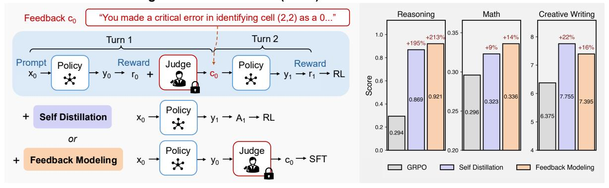
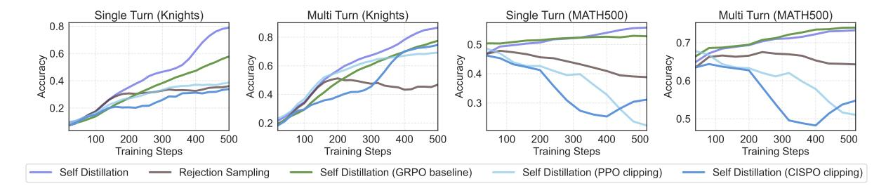
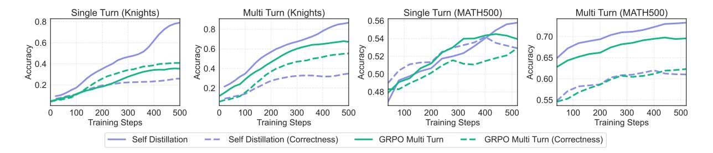
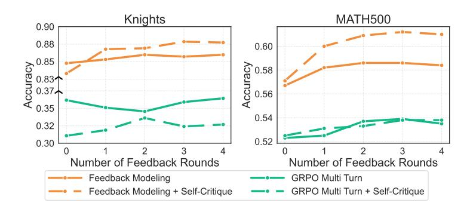

# Expanding the Capabilities of Reinforcement Learning via Text Feedback

Yuda  $Song^{*,1}$  Lili Chen $^{*,1}$  Fahim Tajwar $^1$  Rémi Munos $^2$  Deepak Pathak $^1$  J. Andrew Bagnell $^{1,3}$  Aarti Singh $^1$  Andrea Zanette $^1$  Carnegie Mellon University  $^2$ Inria  $^3$ Aurora Innovation {yudas,lilic}@andrew.cmu.edu

### Abstract

The success of RL for LLM post-training stems from an unreasonably uninformative source: a single bit of information per rollout as binary reward or preference label. At the other extreme, distillation offers dense supervision but requires demonstrations, which are costly and difficult to scale. We study text feedback as an intermediate signal: richer than scalar rewards, yet cheaper than complete demonstrations. Textual feedback is a natural mode of human interaction and is already abundant in many real-world settings, where users, annotators, and automated judges routinely critique LLM outputs. Towards leveraging text feedback at scale, we formalize a multi-turn RL setup, RL from Text Feedback (RLTF), where text feedback is available during training but not at inference. Therefore, models must learn to internalize the feedback in order to improve their test-time single-turn performance. To do this, we propose two methods: Self **Distillation** (RLTF-SD), which trains the single-turn policy to match its own feedback-conditioned second-turn generations; and Feedback Modeling (RLTF-FM), which predicts the feedback as an auxiliary objective. We provide theoretical analysis on both methods, and empirically evaluate on reasoning puzzles, competition math, and creative writing tasks. Our results show that both methods consistently outperform strong baselines across benchmarks, highlighting the potential of RL with an additional source of rich supervision at scale. Our website is available at: https://rl-textfeedback.github.io.

#### Reinforcement Learning from Text Feedback (RLTF)

Figure 1: Left: overview of reinforcement learning from text feedback, which uses a feedback provider (judge) to generate critiques  $c_0$ . RLTF-SD trains the policy to match the feedback-conditioned second-turn generations  $y_1$ , and RLTF-FM predicts the critiques  $c_0$  as an auxiliary objective. Right: performance of our two methods, Self Distillation (RLTF-SD) and Feedback Modeling (RLTF-FM), on reasoning puzzles, competition math, and creative writing tasks. Both methods outperform standard single-turn GRPO.

\*Equal contribution.

## 1 Introduction

Reinforcement learning (RL) has become the foundational technique in modern LLM post-training, often delivering large gains in instruction-following, helpfulness, and reasoning quality [\(Ouyang et al.,](#page-15-0) [2022;](#page-15-0) [Guo](#page-13-0) [et al.,](#page-13-0) [2025a\)](#page-13-0). Yet the standard RL signal in these systems is typically a sparse scalar reward (or one-bit preference label) per rollout. This creates a fundamental tension: RL can be remarkably effective at scale, but the outcome of each individual trajectory contains very little information about what went wrong and how to fix it, making learning extremely inefficient when the base model is unable to solve the task.

At the other extreme, distillation [\(Buciluˇa et al.,](#page-12-0) [2006;](#page-12-0) [Ba and Caruana,](#page-12-1) [2014;](#page-12-1) [Hinton et al.,](#page-14-0) [2015\)](#page-14-0) and imitation learning provide information-dense supervision: a single demonstration can convey a full solution, or token-level correction for on-policy imitation learning [\(Ross et al.,](#page-15-1) [2011;](#page-15-1) [Agarwal et al.,](#page-12-2) [2024;](#page-12-2) [Lu and Lab,](#page-15-2) [2025\)](#page-15-2). However, distillation is not applicable to training frontier models, and collecting demonstrations from humans is not scalable.

Natural-language text feedback is both a natural mode of human interaction and already abundant in practice. Users routinely critique chatbot outputs; tool-mediated workflows (e.g., code execution, unit tests, compiler errors, symbolic checkers) produce structured traces that describe failures; and more broadly, natural-language feedback is the primary medium through which humans teach and correct one another. Beyond its abundance, text feedback also occupies a favorable middle ground in information density, offering the best of both worlds: it is richer than a scalar reward, yet cheaper than a complete demonstration—feedback can localize an error, name a violated constraint, or suggest a fix.

A natural framework for incorporating feedback is multi-turn interaction: the model generates an attempt, feedback is appended to form an extended prompt, and the model revises. One might apply standard multiturn RL to this setting, treating the conversation as a sequential decision-making problem and optimizing cumulative reward across turns [\(Zhou et al.,](#page-17-0) [2024;](#page-17-0) [Shani et al.,](#page-15-3) [2024\)](#page-15-3). However, this creates a fundamental asymmetry: during training, feedback can guide revision, but at test time, feedback is often unavailable—users want good outputs on the first try, not a back-and-forth dialogue. Without feedback, the second turn is not even well-defined.[1](#page-1-0) With naive multi-turn RL, the policy learns to respond well—leveraging it for test-time refinement with feedback—but this does not translate into better first-turn performance when feedback is unavailable. Empirically, we find that naive multi-turn RL improves second-turn performance but yields little gain on the first turn (cf. [Section 5\)](#page-6-0). To internalize feedback rather than merely condition on it, we need learning objectives that explicitly transform feedback into first-turn supervision. By internalizing text feedback during training, RL can succeed in settings where sparse scalar rewards alone provide insufficient learning signal—effectively expanding the frontier of what reinforcement learning can accomplish.

To address this challenge, we study the setting of RL from Text Feedback (RLTF) and propose two methods to improve first-turn performance from training-time feedback: Self Distillation (RLTF-SD), which treats feedback-conditioned second attempts as implicit demonstrations for the single-turn policy, and Feedback Modeling (RLTF-FM), which learns from feedback itself by predicting critiques as an auxiliary objective. Notably, RLTF-FM can elicit test-time refinement without feedback, by rolling out the model's self-critiques during inference. Concretely, our contributions are as follows:

## Contributions.

- A formalization of reinforcement learning from text feedback for improving single-turn test-time performance by using feedback during training.
- Two methods to incorporate text feedback into model capabilities: RLTF-SD and RLTF-FM.
- A theoretical justification of our design choices for RLTF-SD, and an extensive theoretical analysis of RLTF-FM via the lens of representation learning.
- Empirical investigation with extensive comparisons and ablations on a suite of diverse benchmarks: Reasoning Gym [\(Stojanovski et al.,](#page-16-0) [2025\)](#page-16-0), MATH500 [\(Hendrycks et al.,](#page-13-1) [2021\)](#page-13-1), AIME24, LitBench [\(Fein](#page-13-2) [et al.,](#page-13-2) [2025\)](#page-13-2) and WritingBench [\(Wu et al.,](#page-17-1) [2025\)](#page-17-1). Our experiments demonstrate that both of our proposed methods significantly improve single-turn test-time performance over strong baselines that use rewards and text feedback.

1This highlights a significant distinction between different modes of text feedback: while some text feedback such as code execution is available during test time (e.g., through tool use), most text feedback such as human feedback is unavailable during test time. In this work we focus on the latter and more challenging setting, and study how to generalize when the feedback is unavailable during test time.

#### 2 RL from Text Feedback

Let  $\mathcal{X}$  be the prompt space and let  $\mathcal{X}_0 \subset \mathcal{X}$  be the set of initial prompts that defines the task. Let  $\mu \in \Delta(\mathcal{X})$  be the distribution of the initial prompts. We use  $\mathcal{Y}$  to denote the output space, and an (LLM) policy  $\pi$  maps prompts to distributions over outputs, i.e.,  $\pi: \mathcal{X} \to \Delta(\mathcal{Y})$ . Similarly, let  $\mathcal{C}$  be the text feedback space and  $\mathcal{M}$  a text feedback provider (human, interpreter, etc.).  $\mathcal{M}$  samples text feedback given a prompt and output, i.e.,  $\mathcal{M}: \mathcal{X} \times \mathcal{Y} \to \Delta(\mathcal{C})$ . Finally, let  $R: \mathcal{X}_0 \times \mathcal{Y} \to [0, 1]$  be the reward function (that is always evaluated on the original prompt) and H be the horizon of the interaction.

**Interaction protocol.** At the first timestep h = 0, a prompt  $x_0 \sim \mu(\mathcal{X}_0)$  is sampled, the policy samples an output  $y_0 \sim \pi(\cdot \mid x_0)$ , receives reward  $r_0 = R(x_0, y_0)$ , and the feedback provider supplies  $c_0 \sim \mathcal{M}(\cdot \mid x_0, y_0)$ . For any timestep h > 0, the prompt is updated as a function of previous information,

$$x_h = f(x_{h-1}, y_{h-1}, c_{h-1}),$$

where f may be as simple as concatenation (e.g., appending  $y_{h-1}$  and  $c_{h-1}$  to the conversation). The rest follows the first turn: the policy samples  $y_h \sim \pi(\cdot \mid x_h)$ , obtains reward  $r_h = R(x_0, y_h)$ , and receives feedback  $c_h \sim \mathcal{M}(\cdot \mid x_h, y_h)$ . In realistic deployments,  $\mathcal{M}$  (or the environment) may terminate the episode early when the output reaches a desired quality (e.g.,  $r_h = 1$ ); we will make this explicit whenever early termination is used. We use  $\mathbb{P}^{\pi}$  and  $\mathbb{E}^{\pi}$  to denote the law and expectation over the above interaction process induced by  $\pi$ ,  $\mathcal{M}$ , and f.

**Learning objective.** One natural objective is to maximize the expected sum of rewards over the H-turn interaction:

$$J_{\mathsf{MultiTurn}}(\pi) = \mathbb{E}^{\pi} \left[ \sum_{h=0}^{H-1} r_h \right]. \tag{1}$$

This objective can be optimized using standard multi-turn RL algorithms by treating the interaction as an episodic MDP over the augmented prompts  $x_h$  (Zhou et al., 2024; Shani et al., 2024). However, Eq. (1) alone does not isolate the role of text feedback: the policy could maximize reward while treating  $c_h$  merely as additional context. Indeed, the objective remains well-defined even if feedback were replaced by uninformative tokens; the policy might simply learn to ignore it. We verify this empirically in Section 5, where naive RL improves multi-turn performance but yields little gain in single-turn competence.

**RL** from text feedback (RLTF). Our goal is to leverage text feedback as a *learning* signal that improves the model's single-turn competence, not merely its ability to improve *test-time refinement with* feedback. To formalize this, we define the single-turn objective:

$$J_{\mathsf{SingleTurn}}(\pi) = \mathbb{E}_{x_0 \sim \mu} \big[ \mathbb{E}_{y \sim \pi(\cdot \mid x_0)} [R(x_0, y)] \big], \tag{2}$$

which evaluates the policy on initial prompts  $x_0$  without additional feedback at test time. In RLTF, while optimizing Eq. (1) is straightforward with multi-turn RL algorithms, the central research question is then:

Given access to feedback-augmented trajectories  $\tau$  during training, how can we design learning objectives and algorithms that improve  $J_{\mathsf{SingleTurn}}(\pi)$ ?

We address this question with two complementary methods, described in Sections 3 and 4.

#### 3 Self Distillation

Text feedback is particularly valuable because it often turns an incorrect first attempt into a correct second attempt: after receiving a critique, the same policy can revise its answer and improve. Our goal is to convert this feedback-conditioned competence into improvement on the single-turn metric (Eq. (2)), so that the policy performs well even when feedback is unavailable at test time. We propose to do this via Self Distillation: we treat the policy acting under the post-feedback prompt as an implicit teacher, and distill it into the original one-shot policy. In this sense, distillation "compiles away" the need for feedback by turning test-time refinement into a training signal. This gives us higher-quality trajectories than sampling directly from  $\pi(\cdot \mid x_0)$ , reducing the exploration burden and turning sparse reward learning into learning from corrected solutions.

Concretely, (focusing on the two-turn case,) for each initial prompt  $x_0$  we sample a first-turn output  $y_0 \sim \pi(\cdot \mid x_0)$ , obtain feedback  $c_0$ , and form the feedback-augmented prompt  $x_1 = f(x_0, y_0, c_0)$ . We then sample a revised output  $y_1 \sim \pi(\cdot \mid x_1)$  and use  $y_1$  to update  $\pi(\cdot \mid x_0)$  (not  $\pi(\cdot \mid x_1)$ ), thereby directly targeting single-turn performance. This leads to the following RL-style distillation objective that learns from the  $y_1$  distribution:

$$\ell_{\text{distill}}(\pi) = \mathbb{E}_{x_1 \sim \mathbb{P}^{\pi}, y_1 \sim \pi(\cdot \mid x_1)} \left[ \frac{\pi(y_1 \mid x_0)}{\pi_{\text{ref}}(y_1 \mid x_1)} A(x_0, y_1) \right]. \tag{3}$$

Here  $\pi_{\text{ref}}$  denotes a reference distribution used for correction, and  $A(x_0, y_1)$  is an estimator of the reward  $R(x_0, y_1)^2$ , and sg denotes the stop-gradient operator. In the following we will omit the dependency on  $x_1 \sim \mathbb{P}^{\pi}$  when it is clear from context. We introduce Eq. (3) to unify several natural objectives with different instantiations of  $\pi_{\text{ref}}$  and  $A(\cdot)$ .

When we set  $\pi_{\text{ref}}(\cdot \mid x_1) = \pi(\cdot \mid x_1)$  (i.e., the data-collection distribution for  $y_1$ ), Eq. (3) recovers an off-policy objective with importance-sampling correction. Moreover, taking  $A(y_1) = R(x_0, y_1)$  recovers the original single-turn objective in expectation:

$$\mathbb{E}_{y_1 \sim \pi(\cdot \mid x_1)} \left[ \frac{\pi(y_1 \mid x_0)}{\pi(y_1 \mid x_1)} R(x_0, y_1) \right] = \mathbb{E}_{y \sim \pi(\cdot \mid x_0)} [R(x_0, y)] = J_{\mathsf{SingleTurn}}(\pi). \tag{4}$$

Taking gradient with respect to  $\pi$  on Eq. (4) gives an unbiased gradient estimator for  $\nabla J_{\mathsf{SingleTurn}}(\pi)$  (under the standard support condition, and note that this in general does not hold for other choices of  $\pi_{\mathrm{ref}}$ ). Thus, we can obtain an (unbiased) gradient for the single-turn objective  $J_{\mathsf{SingleTurn}}(\pi)$  using samples from the second-turn policy, effectively leveraging feedback-conditioned rollouts to improve first-attempt performance. Next, we describe some natural choices of  $A(\cdot)$  and  $\pi_{\mathrm{ref}}$  and their pitfalls, and our design choices that lead to the Self Distillation algorithm. All derivations and proofs from this section can be found in Section B.

#### 3.1 Baselines

For stability and efficiency of policy gradient algorithms, baseline design (i.e., control variates) is crucial to reduce the variance of the policy gradient estimator (Williams, 1992; Schulman et al., 2015; Guo et al., 2025a; Zeng et al., 2025). Thus it is important to derive the most effective baselines for the distillation objective (Eq. (3)) as it inherits the form of the policy gradient objective.

Second-turn baseline and gradient-signal collapse. A natural choice is to use the GRPO-style (Guo et al., 2025a) group-mean baseline computed from second-turn rewards, as this is the standard baseline in multi-turn LLM RL (Team et al., 2025; Tan et al., 2025). Concretely, for each prompt  $x_0$ , given  $\{(y_0^i, y_1^i)\}_{i=1}^N$  where  $y_0^i \sim \pi(\cdot \mid x_0)$  and  $y_1^i \sim \pi(\cdot \mid x_1^i)$  with  $x_1^i = f(x_0, y_0^i, c_0^i)$ , the advantage estimator is defined as

$$A_i^{(1)} := R(x_0, y_1^i) - \frac{1}{N} \sum_{j=1}^N R(x_0, y_1^j).$$
 (5)

In the setting of self-distillation (Eq. (3)), with importance-sampling correction  $\pi_{\text{ref}}(\cdot) = \pi(\cdot \mid x_1)$ , this yields an unbiased gradient up to a constant multiplicative factor:

$$\mathbb{E}\left[\frac{\pi(y_1^i \mid x_0)}{\pi(y_1^i \mid x_1^i)} A_i^{(1)} \nabla \log \pi(y_1^i \mid x_0)\right] = \left[1 - \frac{1}{N}\right] \nabla J(\pi),\tag{6}$$

Note that this bias can be removed by using a leave-one-out baseline  $\frac{1}{N-1}\sum_{j\neq i}R(x_0,y_1^j)$  instead of the in-sample mean, but generally this does not matter in practice as the optimizer is agnostic to constant scaling of the gradient.

However, this baseline has a more serious issue: **gradient-signal collapse under second-turn mean baselines**. A second-turn group-mean baseline centers rewards using the same second-turn samples: this can be unbiased in expectation, but it exhibits a *point-wise* degeneracy: whenever the group rewards are (nearly) constant, the centered reward-estimations vanish and the update is exactly (or approximately) zero. This failure mode is not rare in the multi-turn setting. Let  $R(x_0, y_1) \in \{0, 1\}$  with second-turn

&lt;sup>2We adopt the notation  $A(\cdot)$  because the most common unbiased estimator of the reward is an unbiased estimator of the advantage function.

success probability  $p_1$  for a fixed prompt  $x_0$ . Then a second-turn mean baseline yields an exactly zero update whenever the group is constant, which occurs with probability  $p_1^N + (1-p_1)^N$ . In particular, when feedback makes the second-turn policy highly reliable  $(p_1 \to 1)$ , the probability of a non-zero update scales as  $1 - p_1^N \approx N(1 - p_1)$ , so there is no learning signal for the first turn even though the teacher is consistently correct (at the second turn).

**First-turn baseline.** Baselines computed based on first-turn quantities do not suffer from the above in-sample coupling with  $y_1^i$ , or the gradient collapse issue. Let

$$b^{(0)} := \frac{1}{N} \sum_{i=1}^{N} R(x_0, y_0^i), \qquad A_i^{(0)} := R(x_0, y_1^i) - b^{(0)}, \tag{7}$$

we have (with  $\pi_{\text{ref}}(\cdot) = \pi(\cdot \mid x_1)$ ) that the baseline term  $b^{(0)}$  is 0 in expectation, and therefore

$$\mathbb{E}\bigg[\frac{\pi(y_1^i\mid x_0)}{\pi(y_1^i\mid x_1^i)}\,A_i^{(0)}\,\nabla\log\pi(y_1^i\mid x_0)\bigg] = \nabla J_{\mathsf{SingleTurn}}(\pi).$$

In addition, the first-turn baseline  $b^{(0)}$  does not normalize by post-feedback rewards. When  $p_1$  is high but the first-turn policy is still imperfect  $(b^{(0)} < 1)$ , we have  $A_i^{(0)} = R(x_0, y_1^i) - b^{(0)} \neq 0$ , so the update remains non-trivial and only vanishes when the student itself is already correct. Note that another natural variant that avoids this issue is taking  $A_i = R(x_0, y_1^i) - R(x_0, y_0^i)$ , which can be interpreted as the improvement from feedback for each specific trajectory, but potentially result in higher variance than Eq. (7). We defer detailed discussions to Sections B.2 and B.3.

#### 3.2 Bias-variance tradeoff in importance weighting

Recall that an unbiased estimator of the single-turn policy gradient can be obtained by importance weighting with  $\pi_{\text{ref}} = \pi(\cdot \mid x_1)$ ), but its variance is controlled by the second moment, an expectation over the directly policy ratios between  $\pi(\cdot \mid x_1)$  and  $\pi(\cdot \mid x_0)$ , instead of the logarithmic of the ratio. Therefore, even moderate distribution shift between first- and second-turn policies can induce heavy-tailed weights. For LLM outputs y (long token sequences), this shift compounds across tokens, making the whole gradient estimation high-variance, which hurts the stability and performance of the training. We provide a rigorous statement of the above intuition and empirical validation in Section D.5.

This motivates alternatives to full importance sampling. A standard way is to clip the importance ratio, yielding a CISPO-style objective (Chen et al., 2025):

$$\ell_{\mathsf{distill}}^{\mathsf{clip}}(\pi,\varepsilon) \ := \ \mathbb{E}_{y_1 \sim \pi(\cdot \mid x_1)} \bigg[ \mathsf{clip} \bigg[ \frac{\pi(y_1 \mid x_0)}{\pi_{\mathrm{ref}}(y_1 \mid x_1)}, \ 1 - \varepsilon, \ 1 + \varepsilon \bigg] \ A(y_1) \bigg]. \tag{8}$$

Clipping controls variance by truncating rare but high-magnitude ratios, at the cost of a controlled bias that is governed by  $\varepsilon$ , an additional hyperparameter to tune.

The other extreme is to discard importance weighting entirely, which introduces higher bias but gives the low-variance objective (here we directly provide the gradient):

$$\nabla \ell_{\mathsf{distill}}^{\mathsf{awr}}(\pi) = \mathbb{E}_{y_1 \sim \pi(\cdot \mid x_1)} [A(y_1) \nabla \log \pi(y_1 \mid x_0)],$$

which resembles advantage-weighted regression (AWR) (Peng et al., 2019; Nair et al., 2020) applied to distillation from feedback-conditioned rollouts.

In the experiment we find that variance dominates bias: setting  $\pi_{\text{ref}}(\cdot \mid x_1) = \pi(\cdot \mid x_0)$  (note that this is a special case because  $x_0$  is part of  $x_1$ ), which removes the importance weighting, consistently improves stability and final performance compared to using  $\pi_{\text{ref}}(\cdot \mid x_1) = \pi(\cdot \mid x_1)$  with full importance correction or the clipped objective. We provide ablation over all variants in Section 5.2. We therefore view mild bias as benign relative to the variance induced by importance sampling in distillation.

**Remark 3.1.** For clarity, the analysis uses the sequence-level importance weight  $W(y_1) := \frac{\pi(y_1|x_0)}{\pi(y_1|x_1)}$ . For an autoregressive policy this factorizes exactly as

$$W(y_1) = \prod_{t=1}^{T} r_t, \qquad r_t := \frac{\pi(y_{1,t} \mid x_0, y_{1, < t})}{\pi(y_{1,t} \mid x_1, y_{1, < t})}.$$

Thus, token-level IS simply computes W via per-token ratios and is not an approximation. In contrast, CISPO-style or PPO-style token-level objectives can be viewed as a first-order approximation in the per-token log-ratios  $\Delta_t := \log r_t$  via  $W = \exp(\sum_t \Delta_t) \approx 1 + \sum_t \Delta_t$  when  $\Delta_t$  are small. All experiments in this paper use the token-level surrogate following the standard practice (Sheng et al., 2024).

Rejection sampling. Our framework also recovers the commonly used Rejection Sampling (or Supervised Finetuning (SFT)) [\(Scheurer et al.,](#page-15-7) [2023\)](#page-15-7) for distillation: for each {x0, y0, x1, y1}, perform a likelihood maximization of log(π(y1 | x0)) if y1 is a better response than y0. This procedure can be recovered by [Eq.](#page-3-1) [\(3\)](#page-3-1) by taking a binary advantage A(x0, y1) = R(x0, y1) ∈ {0, 1}, and choosing the reference as the same single-turn policy with stop-gradient, i.e., πref(· | x1) = sg[π(· | x0)]. With this choice, we similarly remove the importance weighting. In particular, the induced update direction becomes

$$\nabla \ell_{\mathsf{distill}}^{\mathsf{SFT}}(\pi) = \mathbb{E}_{y_1 \sim \pi(\cdot \mid x_1)}[R(x_0, y_1) \, \nabla \log \pi(y_1 \mid x_0)].$$

Therefore, in our setting Rejection Sampling is precisely the special case that distills only the correct second-round generations, without any importance-weight variance from off-policy correction.

While simple, the negative samples (i.e., those with R(x0, y1) = 0) do not contribute to the learning due to the lack of a baseline. In practice, we indeed observe that Rejection Sampling underperforms methods with baselines, as we will show in [Section 5.2.](#page-8-0)

#### 3.3 Final algorithm

In conclusion, we adopt (1) πref(· | x1) = π(· | x0) for AWR-style RL distillation and (2) using first-turn mean reward as baseline [\(Eq. \(7\)\)](#page-4-0). We summarize the full RLTF-SD algorithm in [Algorithm 1.](#page-18-0)

## 4 Feedback Modeling

Beyond using feedback-conditioned rollouts to improve the policy, we can also treat the critique itself as a supervision signal and explicitly model the feedback provider. This is appealing because feedback ch is observed at every turn and is far richer than a scalar reward: it pinpoints the mistakes, providing dense token-level gradients on failure rollouts. To leverage the dense feedback signal, we propose Feedback Modeling: training the policy to predict the feedback itself.

Feedback-prediction loss. Recall that at each timestep h the feedback provider samples ch ∼ M(· | xh, yh). We define a feedback-prediction distribution:

$$p_{\pi}(c \mid x, y) := \pi(c \mid f_{\mathsf{FeeMol}}(x, y)),$$

where fFeeMol is a prompt template that elicits critique-style feedback given (x, y); see examples in [Section D.1.](#page-32-0) Using tuples (xh, yh, ch) collected from interaction trajectories, we optimize the cross-entropy objective

$$\ell_{\mathsf{FeeMol}}(\pi) := \mathbb{E}_{\pi} \left[ \sum_{h=0}^{H-1} -\log p_{\pi}(c_h \mid x_h, y_h) \right]. \tag{9}$$

Note that we treat yh as constants (i.e., no gradient) so that ℓFeeMol is pure supervised learning on the feedback tokens, rather than introducing additional credit assignment through the sampling process.

Joint objective with RL. Similar to the self distillation loss, feedback modeling is used as an auxiliary loss in addition to the regular RL objective:

$$\max_{\pi} J_{\text{MultiTurn}}(\pi) - \lambda_{\text{FeeMol}} \ell_{\text{FeeMol}}(\pi), \tag{10}$$

where JMultiTurn(π) is the multi-turn RL objective [\(Eq. \(1\)\)](#page-2-0) and λFeeMol ≥ 0 controls the strength of the auxiliary feedback loss.

#### 4.1 Theoretical analysis

RLTF-FM trains the model to predict feedback, not to explicitly output a corrected answer, so its benefit is not obvious a priori. [Section C](#page-25-0) provides an early-stage analysis through the lens of representation learning in a frozen-rollout regime (a batch RL setting, where data are effectively drawn from a fixed distribution d0) with log-linear (i.e., softmax) policy with learned representation. The central question is: what representation directions are statistically identifiable from the available training signal under base rollouts? With the batch setting and log-linear policy, our setting is rather idealized, but the analysis yields useful insights into the benefit of RLTF-FM, which we summarize below.

Reward-only signal can be both rare and geometrically concentrated. With sparse rewards, especially early in training when the base policy performs poorly, only a small fraction of rollouts succeed. Let ε0 denote this base pass rate. Then the per-sample policy-gradient estimator has low signal-to-noise ratio, and reliably estimating even a single gradient component can require on the order of 1/ε0 rollouts. Beyond this finite-sample bottleneck, we identify a population-level geometric limitation: even conditioning on success, the reward-only learning signal can concentrate on a small set of representation directions. Equivalently, there can exist a large subspace of directions that are weakly identified by reward-only updates under base-policy sampling. In the frozen-rollout regime, we formalize this by defining a low-signal subspace Slow from success-conditioned score statistics at initialization, and we show that progress in Slow along the optimization trajectory is controlled by the cumulative magnitude of the success-conditioned score in that subspace. Intuitively, reward-only RL can therefore behave like an effectively low-rank update under base rollouts, making some task-relevant representation directions difficult to learn without auxiliary supervision.

Feedback modeling supplies a better-conditioned representation signal. In contrast, naturallanguage feedback is dense and structured. We show that under the same batch regime, RLTF-FM induces nontrivial movement of the shared representation under a coverage assumtion, which is analogous to standard coverage in linear/low-rank MDPs [\(Jin et al.,](#page-14-1) [2021;](#page-14-1) [Uehara and Sun,](#page-16-5) [2021\)](#page-16-5) or LLM preference learining [\(Chang et al.,](#page-12-4) [2024;](#page-12-4) [Song et al.,](#page-16-6) [2024a\)](#page-16-6). This matches the high-level intuition that reward-only RL may provide a narrow (often nearly rank-1) representation signal under base rollouts, whereas feedback modeling yields a better-conditioned information source that can "fill in" missing representation directions. We summarize the main results informally below; formal statements are in [Section C.](#page-25-0)

Proposition 4.1 (Reward-only bottlenecks under base rollouts (informal)). Under the batch regime, and rewards are sparse with base success rate ε0. Then reward-only learning faces two bottlenecks:

- (i) Rare-event estimation. Because reward is supported on a low-probability success event, the directional policy-gradient estimator has low signal-to-noise ratio: for any direction, SNR scales at most as √ ε0. Consequently, reliably estimating even a single gradient component requires on the order of 1/ε0 rollouts.
- (ii) Weak identifiability of representation directions. Even conditioning on success, the reward-weighted gradient signal concentrates on a small set of directions in representation space. Equivalently, there can exist a nontrivial low-signal subspace of directions that are weakly identified by reward-only updates under base rollouts. In the frozen-rollout regime, reward-only updates can have negligible projection onto these directions over many steps.

Proposition 4.2 (Feedback modeling yields a well-conditioned representation signal (informal)). In the same early-stage frozen-rollout regime, feedback modeling (*RLTF-FM*) provides an additional supervised learning signal on the shared representation. Under mild conditions on the feedback coverage [\(Assumption](#page-28-0) [C.3\)](#page-28-0), *RLTF-FM* is informative in representation directions that are weakly identified by sparse reward under base rollouts. As a result, *RLTF-FM* can learn representation degrees of freedom that reward-only RL fails to identify early on.

The analysis explains why RLTF-FM helps without explicitly teaching revision: predicting critiques supplies an additional supervised signal that is informative in representation directions that are weakly identified by sparse reward under base rollouts. In the batch regime, this feedback signal can induce substantial representation learning in a low-signal subspace. From this perspective, RLTF-FM acts like a representation preconditioner : it improves the identifiability and conditioning of the representation degrees of freedom that reward-only RL struggles to learn early on. Beyond offering insights into RLTF-FM, our theory provides a framework and techniques with standalone merits and broader applicability.

## 4.2 Test-time scaling via self-feedback

Because pθ(c | x, y) is produced by the same policy, the model can be run in a "feedback mode" at inference time to generate critiques and perform iterative refinement: sample y0 ∼ πθ(· | x0), generate c˜0 ∼ pθ(· | x0, y0), update x1 = f(x0, y0, c˜0), and resample y1 ∼ πθ(· | x1). This enables test-time scaling without requiring a separate learned judge model; the auxiliary training simply makes the policy's self-critique distribution more faithful to the external feedback channel. We further explore this direction in [Section 5.4.](#page-9-0) The complete training and inference pseudocode is in [Algorithm 2.](#page-18-1)

## 5 Experiments

Our experiments evaluate our two proposed methods for RL from text feedback: RLTF-SD, which uses feedback-conditioned rollouts to improve the single-turn policy via RL, and RLTF-FM, which adds an

Table 1: Comparison of baselines across reasoning puzzles, competition math, and creative writing tasks. We report single-turn accuracy after 2-turn training (i.e., JSingleTurn(π)) of the last checkpoint. For the reasoning tasks and LitBench, we report the mean@1 accuracy, judged by either verifiable reward or LLM-as-a-judge. For the math tasks, we report the mean@32 accuracy from the last checkpoint from the training. The parentheses denote the training dataset. For WritingBench, we follow the official protocol with GPT-4.1-mini as the judge. The accuracy in reasoning and math is normalized between 0 and 1, and the score in creative writing is normalized between 1 and 10. Note that RLTF-SD and RLTF-FM consistently outperform all baselines across tasks.

|                    | Base Model | GRPO Single turn | GRPO Multi turn | Feedback Descent | RLTF-SD | RLTF-FM |
|--------------------|------------|---------------------|--------------------|---------------------|---------|---------|
| Reasoning          |            |                     |                    |                     |         |         |
| Knights and Knaves | 0.058      | 0.373               | 0.352              | 0.055               | 0.802   | 0.880   |
| Binary Matrix      | 0.001      | 0.125               | 0.950              | 0.005               | 0.976   | 0.978   |
| Shortest Path      | 0.034      | 0.385               | 0.384              | 0.035               | 0.830   | 0.905   |
| Math               |            |                     |                    |                     |         |         |
| MATH500 (DAPO)     | 0.376      | 0.526               | 0.523              | 0.415               | 0.548   | 0.567   |
| AIME24 (DAPO)      | 0.025      | 0.058               | 0.025              | 0.045               | 0.088   | 0.083   |
| MATH500 (DeepMath) | 0.376      | 0.558               | 0.578              | 0.424               | 0.598   | 0.636   |
| AIME24 (DeepMath)  | 0.025      | 0.042               | 0.050              | 0.054               | 0.058   | 0.058   |
| Creative Writing   |            |                     |                    |                     |         |         |
| LitBench           | 4.20       | 6.83                | 6.41               | 8.25                | 8.80    | 8.40    |
| WritingBench       | 5.71       | 5.92                | 6.29               | 5.30                | 6.71    | 6.39    |

auxiliary objective that predicts critiques. The goal of our experiments is twofold: (i) quantify how much these components improve performance over standard RL baselines, and (ii) isolate the design choices that make them effective in practice. Concretely, we seek to answer the following research questions:

RQ1: How well do self distillation and feedback modeling work across a wide range of tasks?

RQ2: Which design choices matter for distillation? In particular, does the proposed design choices (use of baseline, advantage weighted regression) consistently outperform their alternatives?

RQ3: How much of the gain remains if we remove rich critiques and provide only a correctness-style signal?

RQ4: How does feedback modeling enable effective test-time scaling by generating multiple rounds of self-feedback at inference time?

Experiment setup and baselines. In our experiments, we use the Qwen3-235B-A22B-Instruct-2507 [\(Yang et al.,](#page-17-3) [2025\)](#page-17-3) model to simulate the feedback provider (M), and we use Llama-3.1-8B-Instruct [\(Grattafiori et al.,](#page-13-3) [2024\)](#page-13-3) as the learner. We use early termination (c.f. [Section 2\)](#page-2-3) unless otherwise specified. We defer the details of each environment and benchmark, as well as prompts for feedback provider and learner to [Sections D.1](#page-32-0) and [D.3.](#page-38-0)

We compare with a comprehensive set of baselines: for reward-only RL, we use GRPO [\(Shao et al.,](#page-15-8) [2024\)](#page-15-8), training with both single-turn (JSingleTurn) and multi-turn (JMultiTurn) objectives; for text feedback aware baselines, we compare with the latest method Feedback Descent [\(Lee et al.,](#page-14-2) [2025\)](#page-14-2), which performs optimization directly in text space without modifying model weights via pairwise comparisons. In our ablations, we also compare with common baselines including Rejection Sampling (adopted in e.g., [Scheurer](#page-15-7) [et al.](#page-15-7) [\(2023\)](#page-15-7)), as well as objective variants such as off-policy CISPO [\(Chen et al.,](#page-12-3) [2025\)](#page-12-3) and off-policy PPO [\(Schulman et al.,](#page-15-9) [2017\)](#page-15-9).

#### 5.1 General Results

To investigate RQ1, we compare RLTF-SD and RLTF-FM with the baselines across a wide range of tasks, including reasoning puzzles (Knights and Knaves, Binary Matrix, Shortest Path) [\(Stojanovski et al.,](#page-16-0) [2025;](#page-16-0) [Tajwar et al.,](#page-16-7) [2025\)](#page-16-7), competition math (training on DAPO [\(Yu et al.,](#page-17-4) [2025\)](#page-17-4) and Deepmath [\(He et al.,](#page-13-4) [2025\)](#page-13-4) and testing on MATH500 [\(Hendrycks et al.,](#page-13-1) [2021\)](#page-13-1) and AIME24), and creative writing (LitBench

Figure 2: Evaluation curves on Knights and Knaves and MATH500 (trained on DAPO) for ablations on self distillation design choices. For each environment: Left: single-turn accuracy; Right: multi-turn accuracy. RLTF-SD (GRPO baseline) denotes using AWR objective with second turn mean baseline. RLTF-SD (PPO clipping) denotes using PPO style clipping on importance weighting with first turn baseline. RLTF-SD (CISPO clipping) denotes using CISPO style clipping on importance weighting with first turn baseline. Note that our proposed design choices consistently outperform the alternatives in both single-turn and multi-turn performance.

(Fein et al., 2025) and WritingBench (Wu et al., 2025)). We defer the details of benchmarks, prompts, and hyperparameters to Sections D.1, D.3 and D.4 respectively.

We focus on the 2-turn setting and compare the final single-turn performance  $J_{\mathsf{SingleTurn}}(\pi)$ . We summarize the main results in Table 1 and we defer the multi-turn performance and evaluation curves to Section D.6. We observe that both RLTF-SD and RLTF-FM consistently outperform all baselines across tasks, demonstrating the effectiveness of learning from text feedback. Notably, in terms of single-turn performance GRPO with multi-turn training demonstrates similar performance to single-turn training, suggesting that naively incorporating feedback as additional context is insufficient to internalize its learning signal. Feedback Descent also underperforms our methods, indicating the importance of parameter space optimization instead of text space optimization. Although both proposed methods outperform the other baselines across the board, the improvement is more significant in the reasoning tasks and LitBench, where the train-test distribution mismatch is small, and thus feedback can significantly accelerate learning. Still, incorporating feedback also helps in domains like math and WritingBench3, indicating the generalization of feedback incorporation. Finally, to compare RLTF-SD and RLTF-FM, we observe that RLTF-SD outperforms in creative writing tasks where the teacher-student distribution mismatch is small, and RLTF-FM obtains better results under math and reasoning tasks where the feedback is more subjective and thus the auxiliary prediction loss is easier to optimize.

Case studies. To better understand how text feedback shapes model behavior during training, we qualitatively examine first- and second-turn generations, and show a few examples in Section D.2. These examples demonstrate that feedback can help the model escape local optima that RL can get stuck in (e.g., claiming that all problems are infeasible), correct flawed reasoning chains, and identify arithmetic errors. In this way, text feedback provides targeted, actionable information that scalar rewards cannot convey.

#### 5.2 Ablation on Self Distillation

In this section, we investigate **RQ2** by performing ablations on the design choices and feedback signal of RLTF-SD. We ablate two major design choices: (i) the use of a baseline for advantage estimation/variance reduction, where we compare the GRPO style baseline in Eq. (5) and our first-turn baseline in Eq. (7). (ii) bias-variance tradeoff in importance weighting, where we compare our AWR-style objective with importance weighting with two different clipping objectives: CISPO style clipping (Eq. (8)) and PPO style clipping (Schulman et al., 2017). Finally we also compare with the Rejection Sampling baseline (Scheurer et al., 2023), which adds an SFT auxiliary loss to imitate the correct second-turn responses.

We perform ablation on the Knights and Knaves and math reasoning training with DAPO and summarize the results in Figure 2. We observe that introducing importance weighting introduces instability during training, even with different mechanisms of clipping on the importance weighting. Without importance weighting, our first-turn baseline provides significant performance improvement over the regular GRPO-style baseline, indicating the empirical benefit of our design beyond the didactic setting considered in Section 3.

 $^3$ For WritingBench evaluation, we use the same checkpoint from training on the LitBench training set, but WritingBench has tasks beyond story writing, which is the only task in LitBench.

Figure 3: Evaluation curves on Knights and Knaves and MATH500 (trained on DAPO) for text feedback vs. correctness-only feedback. We compare single- and multi-turn accuracy on two algorithms: multi-turn GRPO and RLTF-SD. Overall, using text feedback outperforms using correctness-only feedback for single-turn and multi-turn accuracy on both algorithms.

Notably, Rejection Sampling also underperforms RLTF-SD and RLTF-SD with GRPO baseline, indicating the benefit of variance reduction via baselines.

#### 5.3 Ablation on Feedback

To answer RQ3, we compare to a correctness-only version of RLTF-SD that does not use text feedback and only provides a correctness signal. Specifically, we replace the judge critique after the first turn with simply the sentence "Your previous answer was {correct/incorrect}". Figure 3 shows the performance of using correctness-only feedback on two algorithms: 1) multi-turn GRPO, and 2) RLTF-SD. We find that the correctness-only baseline does not perform well compared to RLTF-SD, indicating that semantically rich text feedback is critical. One notable exception is the single-turn Knights and Knaves accuracy using multi-turn GRPO. Without distillation, neither text feedback nor correctness-only feedback can significantly influence the model's first-turn response, so there is little difference between the two in this setting.

#### 5.4 Test-time Scaling of Feedback Modeling

Finally, for **RQ4**, we investigate the test-time scaling ability of RLTF-FM by generating multiple rounds of self-feedback at inference time. Specifically, we evaluate the model trained with RLTF-FM on Knights and Knaves and MATH500 (trained with DAPO) by allowing it to generate up to 5 rounds of generation with self-feedback at inference time. We introduce an additional baseline where we use RL to improve model's self-critique using second-turn reward (Algorithm 4), and we disable early termination during the training under this setting.

We summarize the results in Figure 4. We make the following observations: first, using RL for learning self-critique is not sufficient: in the math experiment, we observe that GRPO with and without self-critique training achieve similar test-time improvement. Second, adding RLTF-FM loss in addition to self-critique RL training brings significant test-time improvement. Third, the benefit of RLTF-FM is mainly in terms of the magnitude of improvement, not in terms of the number of rounds of improvement. The test-time improvement saturates after a handful of rounds, but this is expected and corroborates with the self-improvement literature (Huang et al., 2023; Song et al., 2024b).

#### 6 Related Work

Learning from text feedback. A well-studied area of human-robot interaction explores learning from natural language corrections (Broad et al., 2017; Sharma et al., 2022; Bucker et al., 2022; Liu et al., 2023b; Cui et al., 2023; Lynch et al., 2023; Liang et al., 2024; Shi et al., 2024). In these approaches, humans provide corrections such as "move a bit to the left," grounded in the robot's perception and action space and used to update policies or value functions. Zhao et al. (2026a) incorporates text feedback for image generation by prompting VLMs to provide critiques of generated images. We study learning from text feedback in the context of RL for LLM reasoning (Shao et al., 2024; Guo et al., 2025a; Hu et al., 2025), which typically relies on a single scalar reward. In contrast, learning directly from text feedback preserves semantic structure and compositionality. The theoretical benefit of learning from text feedback has been shown in Pukdee et al. (2023); Xu et al. (2025). Feng et al. (2024); Hong et al. (2025); Zhang et al. (2025b); Yang et al. (2026) study how to incorporate self-critiques into the model (e.g., via policy and value distillation), but the setting differs in that they do not assume access to external text feedback. Another class of methods (Chang et al., 2023; Amani et al., 2025; Li et al., 2025; Zhang et al., 2025c) bridges SFT and RL by revealing partial prefixes of an expert solution to guide RL training. Wang et al.

Figure 4: Test-time scaling results on Knights and Knaves and MATH500 (trained on DAPO). We allow the model to generate multiple rounds of self-feedback at inference time (denoted in the x-axis). We compare RLTF-FM with multi-turn scalar-based RL, and the dashed line ("+ Self-Critique") denotes further using RL to improve the self-critique during training (Algorithm 4). We use skipped y-axis for the plot on the left for ease of presentation.

(2025a) converts text feedback to denser span-level rewards, but this ultimately collapses the text into the same order of numerical signals as regular RL. Furthermore, several works (Madaan et al., 2023; Cheng et al., 2024; Yuksekgonul et al., 2024; Lee et al., 2025) have also proposed learning from text feedback by propagating minimal subgraphs, or performing optimization in text space. Finally, in the spirit of goal relabeling (Andrychowicz et al., 2017), feedback-conditioned policies (Liu et al., 2023a; Zhang et al., 2023; Luo et al., 2025) use feedback as a goal in hindsight rather than an intermediate step in a multi-turn interaction.

**LLM distillation.** In knowledge distillation (Hinton et al., 2015; Kim and Rush, 2016; Sanh et al., 2019), a student model aims to mimic a teacher model's soft probability distribution. On-policy distillation (Agarwal et al., 2024; Xu et al., 2024b; Gu et al., 2023; Lu and Lab, 2025; Xiao et al., 2026; Yang et al., 2025) trains the student on its own generations instead of the teacher's generations. In self-distillation (Askell et al., 2021; Snell et al., 2022; Choi et al., 2022; Kujanpää et al., 2025; Mitra and Ulukus, 2025; Eyuboglu et al., 2025; Caccia et al., 2025), a student model learns from a teacher that has access to privileged information through its prompt. The teacher and student are typically the same base model; the teacher is not inherently more capable, but instead benefits from additional context embedded in the prompt. Prior work has explored self-distillation across a range of applications, including alignment (Askell et al., 2021), instruction following (Snell et al., 2022), and persona-conditioned dialogue (Choi et al., 2022). Kujanpää et al. (2025); Eyuboglu et al. (2025); Caccia et al. (2025); Qu et al. (2025) study how models can learn from unstructured, free-form documents via prompt distillation. Javalath et al. (2025) synthesizes a target for distillation by combining multiple samples from the model. Mitra and Ulukus (2025) apply self-distillation to reasoning tasks, via a teacher model with access to both correct and incorrect solutions. Zhao et al. (2026b); Shenfeld et al. (2026); Hübotter et al. (2026) are concurrent works in this space; their settings differ as the teacher provides demonstrations of successful attempts instead of feedback on the model's generations. Hübotter et al. (2026) also studies text feedback from interpreters (e.g., runtime errors), which, however, is available at test time, and the proposed approaches do not directly optimize a reward-based objective.

LLM world models. World modeling (Sutton, 1991; Ha and Schmidhuber, 2018; Hafner et al., 2020a,b, 2023) has long been used to improve the sample efficiency of RL. An agent learns to predict future states and rewards given the current state and action, and this internal model enables planning through imagined rollouts rather than direct interaction with the environment. More recently, this idea has been adapted to LLMs (Gu et al., 2024; Guo et al., 2025b; Chae et al., 2024; Hao et al., 2023). In this direction, Zhang et al. (2025a) proposed to have LLMs learn from their own collected interaction data ("early experience"), via an implicit world modeling strategy, which uses next-state prediction to learn the environment dynamics. Copet et al. (2025) released Code World Model (CWM), a 32-billion-parameter LLM trained on large amounts of state-action pairs of Python interpreter traces and interactions with Docker environments. Some works have studied learning to model text feedback ("forward prediction") in the context of dialogue generation (Weston, 2016; Li et al., 2016) and detecting harmful content (Xu et al., 2024a); in our work, we study how to combine feedback modeling and reinforcement learning.

Multi-turn RL. In the context of LLMs, generating a complete response and receiving a reward signal without intermediate intervention is often sufficient as there is no need for interaction. However, as LLMs are increasingly deployed as autonomous agents, the need for multi-turn RL has grown significantly. Recently, multi-turn RL [\(Zhou et al.,](#page-17-0) [2024;](#page-17-0) [Kumar et al.,](#page-14-15) [2024;](#page-14-15) [Abdulhai et al.,](#page-12-15) [2023\)](#page-12-15) has been studied more extensively for agentic settings where interacting with an external environment is beneficial, such as interacting with the terminal [\(Liu et al.,](#page-15-17) [2023c\)](#page-15-17) or the Internet [\(Zhou et al.,](#page-17-17) [2023\)](#page-17-17). Several methods [\(Wang](#page-16-16) [et al.,](#page-16-16) [2025b;](#page-16-16) [Ji et al.,](#page-14-16) [2024;](#page-14-16) [Zhou et al.,](#page-17-18) [2025\)](#page-17-18) have been developed to improve sample complexity and long-horizon performance for multi-turn RL. In our work, this "environment" is the feedback provider, which impacts the model's second-turn generation by critiquing its first-turn response.

## 7 Conclusion and Discussion

We study RL from text feedback, addressing the sparsity of scalar rewards while providing a scalable alternative to expert demonstration. Our two methods, Self Distillation (RLTF-SD) and Feedback Modeling (RLTF-FM), enjoy favorable theoretical properties and demonstrate strong empirical performance across reasoning, math, and creative writing tasks. As text feedback becomes increasingly abundant through human-AI interaction, we see RL from text feedback as a natural next step beyond reward optimization. Several limitations suggest directions for future work. First, real-world feedback may be noisy or subjective, likely requiring data curation and filtering. Second, while our methods generalize to arbitrary horizons, truly long-horizon feedback interaction may require techniques such as summarization to address distribution shift and context limits. Third, our theory focuses on representation learning near the base policy's distribution; a fully end-to-end analysis would strengthen understanding of feedback modeling. Finally, exploring interplay with other fine-grained supervision methods, such as process reward models [\(Lightman et al.,](#page-14-17) [2023\)](#page-14-17) is a promising direction.

## Acknowledgments

The authors are grateful to Thinking Machines for their generous support of this research through the Tinker Research Grant. The authors are are grateful to Daman Arora, Clare Birch, Yoonho Lee, Bingbin Liu, Samuel Sokota, Wen Sun, Cyril Zhang and Yifei Zhou for their insightful discussion and support. AS and YS acknowledge and thank the support of NSF AI Institute for Societal Decision Making AI-SDM grant IIS2229881 and Simons Foundation grant 888970. YS thanks the support of the Two Sigma Fellowship. LC is supported by the NDSEG Fellowship.