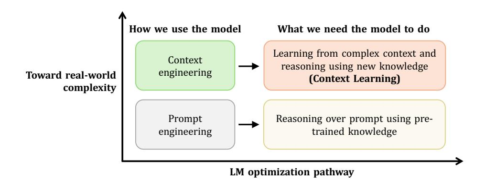
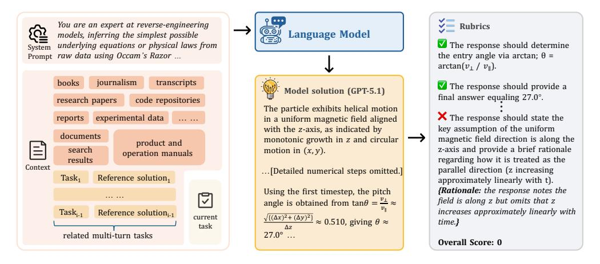
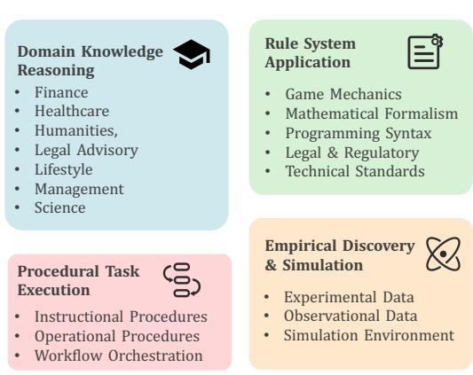
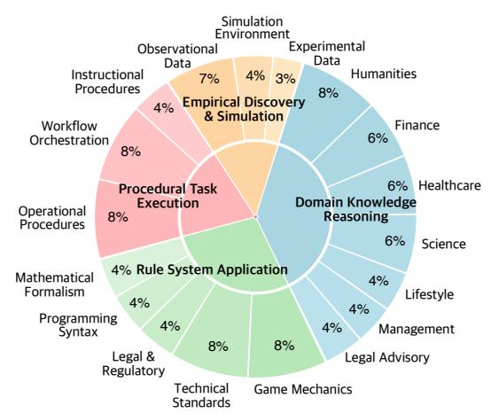
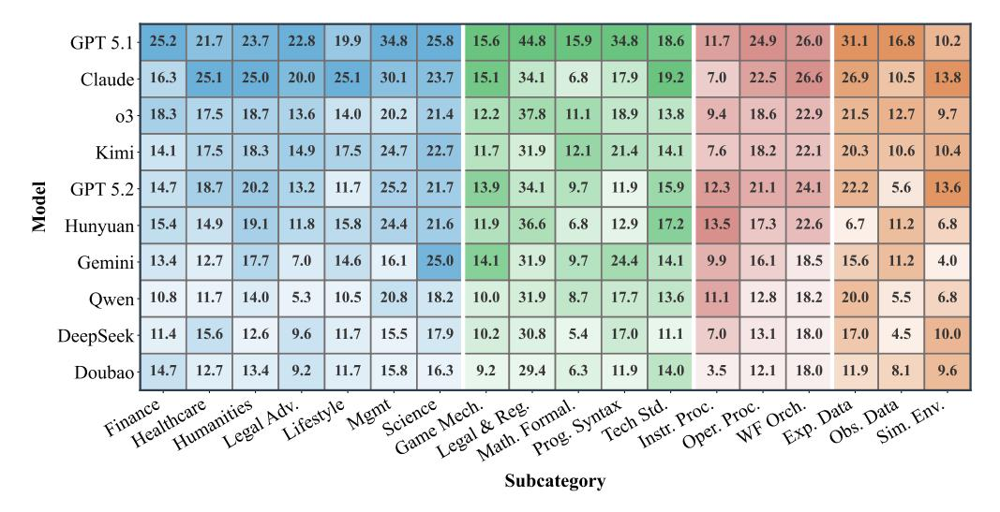
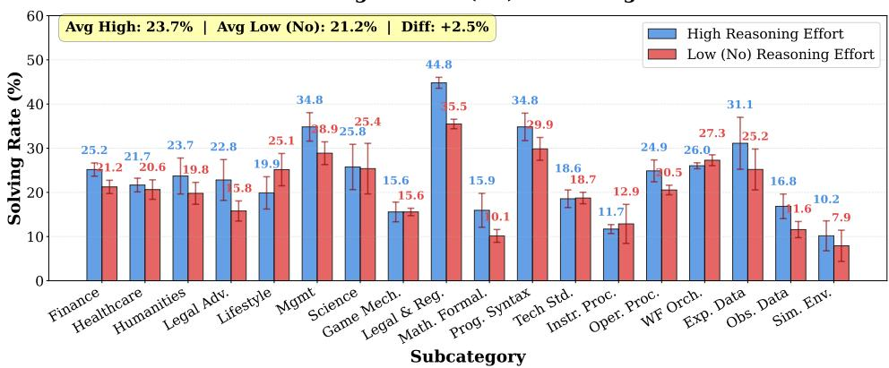
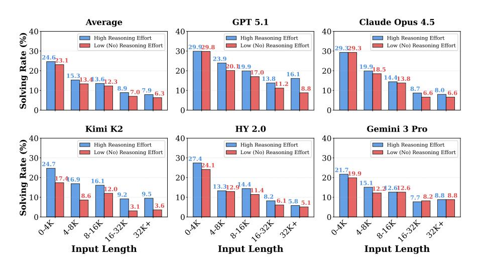
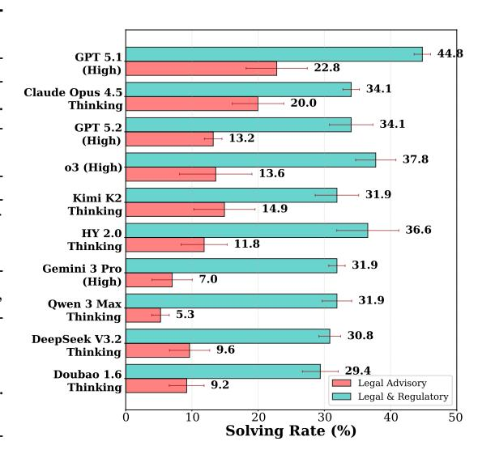

# CL-BENCH: A BENCHMARK FOR CONTEXT LEARNING

Shihan Dou∗ Ming Zhang∗ Zhangyue Yin∗ Chenhao Huang Yujiong Shen Junzhe Wang Jiayi Chen Yuchen Ni Junjie Ye Cheng Zhang Huaibing Xie Jianglu Hu Shaolei Wang Weichao Wang Yanling Xiao Yiting Liu Zenan Xu Zhen Guo Pluto Zhou† Tao Gui† Zuxuan Wu Xipeng Qiu Qi Zhang Xuanjing Huang Yu-Gang Jiang Di Wang Shunyu Yao

Hunyuan Team, Tencent Fudan University

## ABSTRACT

Current language models (LMs) excel at reasoning over prompts using pre-trained knowledge. However, real-world tasks are far more complex and context-dependent: models must learn from task-specific context and leverage new knowledge beyond what is learned during pre-training to reason and resolve tasks. We term this capability context learning, a crucial ability that humans naturally possess but has been largely overlooked. To this end, we introduce CL-bench, a real-world benchmark consisting of 500 complex contexts, 1,899 tasks, and 31,607 verification rubrics, all crafted by experienced domain experts. Each task is designed such that the new content required to resolve it is contained within the corresponding context. Resolving tasks in CL-bench requires models to learn from the context, ranging from new domain-specific knowledge, rule systems, and complex procedures to laws derived from empirical data, all of which are absent from pre-training. This goes far beyond long-context tasks that primarily test retrieval or reading comprehension, and in-context learning tasks, where models learn simple task patterns via instructions and demonstrations. Our evaluations of ten frontier LMs find that models solve only 17.2% of tasks on average. Even the best-performing model, GPT-5.1, solves only 23.7%, revealing that LMs have yet to achieve effective context learning, which poses a critical bottleneck for tackling real-world, complex context-dependent tasks. CL-bench represents a step towards building LMs with this fundamental capability, making them more intelligent and advancing their deployment in real-world scenarios.

Figure 1: Mismatch between how language models are commonly optimized in practice and the capabilities required by real-world tasks. While current LMs primarily elicit reasoning over prompts using pre-trained knowledge, real-world tasks are often context-dependent and require models to learn from context to solve them, a capability we term context learning.

\*Equal contribution. †Correspondence to [shihandou@foxmail.com](mailto:shihandou@foxmail.com), [tgui@fudan.edu.cn](mailto:tgui@fudan.edu.cn), [plutozhou096@foxmail.com](mailto:plutozhou096@foxmail.com). All data, code, and leaderboard at [clbench.com.](www.clbench.com)

### 1 Introduction

Current language models (LMs) excel at using pre-trained knowledge to solve problems specified by prompts, achieving impressive performance on a wide range of tasks such as competition-level mathematical problems [62; 68; 39; 57], competitive programming challenges [76; 78; 5], and expert-level exams [56; 69; 1]. However, real-world tasks often extend far beyond the scope of problems commonly considered in current evaluations. Specifically, many real-world tasks are highly context-dependent [43; 67] and require models to learn from complex contexts, leveraging new knowledge not previously available to reason and solve tasks effectively. Figure 1 shows this mismatch between current model capabilities and real-world requirements. We term this capability **context learning**.

Effective context learning enables models to handle complex, domain-specific tasks by learning directly from rich contextual information, much as humans do in everyday settings. For example, it allows models to rapidly make use of previously unseen product documentation, participate in ongoing group conversations with years of prior context in real time, or discover laws from large collections of experimental data. Such learning from complex contexts is critical for practical, real-world scenarios and forms the foundation for broader context-driven applications. Despite its central role in human task-solving, context learning has been largely overlooked in current research.

Figure 2: Solving tasks in CL-bench requires LMs to learn new knowledge from the provided context, rather than relying solely on static pre-trained knowledge. The knowledge is curated by domain experts, either newly created or sourced from niche and emerging long-tail content. New knowledge required for solving each task is provided within corresponding context, with no need for external retrieval. LM solutions are then verified against carefully annotated task-level rubrics. The example task illustrates a charged particle dynamics analysis within the framework of classical electrodynamics (see Table 5 in the Appendix for more details).

To systematically evaluate context learning, we introduce CL-bench, a real-world benchmark consisting of 500 complex contexts, 1,899 tasks, and 31,607 verification rubrics. Each context and task is grounded in the real world, requiring models to truly learn from the provided context and correctly apply what they learn to solve tasks, as shown in Figure 2. The knowledge in contexts, including newly created and niche long-tail content, largely extends beyond what existing models have acquired during pre-training, and is carefully organized so that models do not need to retrieve from external sources. For example, tasks require LMs to understand the complete legal system of a fictional country, including case precedents and legal principles, and apply it to adjudicate cases; or to comprehend a complex new product manual to generate step-by-step operational procedures or troubleshoot issues. CL-bench categorizes contexts into four categories based on the contexts humans encounter in the real world and how they typically learn from and apply them: domain knowledge reasoning, rule system application, procedural task execution, and empirical discovery & simulation. These categories are further divided into 18 subcategories to validate context learning in diverse real-world scenarios.

CL-bench offers several key features to ensure effective evaluation. (1) **Realistic and high-quality.** Each context and corresponding tasks and rubrics are crafted by experienced domain experts and

refined through multiple rounds of rigorous quality review. (2) Contamination-free. Contexts contain new knowledge absent from pre-training, constructed by domain experts through three approaches: fictional creation, modification of existing knowledge, or incorporation of niche and emerging specialized knowledge. As some new knowledge may conflict with pre-training knowledge, models must truly learn from context and adhere to it, rather than be misled by what they learned during pre-training. (3) Challenging. Each context contains up to 12 tasks with an average of 3.8. Annotating each context and corresponding tasks requires an average of 20 hours of expert effort. Moreover, tasks within each context may be presented sequentially across multiple interaction turns and depend on the solutions of earlier tasks, which further increases task difficulty. (4) Rigorously verifiable. Each context contains an average of 63.2 rubrics. These rubrics are carefully annotated and verified, and are designed to assess task correctness and completeness from multiple dimensions.

We evaluate ten state-of-the-art LMs on CL-bench, find that models solve only 17.2% of tasks on average, and even the best-performing model, GPT-5.1, solves only 23.7%. Frontier models struggle with context learning, revealing that this fundamental capability has been largely overlooked. Moreover, results show that while different LMs exhibit varying performance across categories, all models perform substantially worse on more challenging categories, such as inducing and applying laws from extensive experimental data or simulating complex sandbox environments, with an average solve rate of only 11.8%. Error analysis shows that a higher proportion of failures stems from models ignoring what is presented in the context. Moreover, deeper case studies find that insufficient long-context reasoning and instruction-following abilities also contribute to context learning failures.

More insightful findings are presented in Section [4](#page-6-0) and [5.](#page-8-0) Overall, context learning in current frontier LMs remains remarkably poor. This crucial learning capability warrants greater attention from AI community. Advancing context learning is the key to building next-generation LMs that, like humans, possess the ability to learn from context, adapt to evolving contexts, and excel in the real world. CL-bench provides a critical testbed for this endeavor.

## 2 RELATED WORK

In this section, we discuss some concepts and prior work related to context learning and CL-bench.

Prompt engineering & in-context learning vs. context engineering & context learning. Prompt engineering enables LMs to perform tasks through carefully designed instructions [\[42;](#page-17-1) [58;](#page-18-5) [40;](#page-17-2) [74\]](#page-19-3). This paradigm primarily targets relatively simple tasks that models can solve by reasoning over the prompt and their existing internal pre-trained knowledge. In-context learning (ICL) enhances prompt engineering by incorporating a few input–output examples, allowing models to infer the task format and expected behavior [\[10;](#page-14-2) [16;](#page-15-0) [48;](#page-17-3) [77;](#page-19-4) [41;](#page-17-4) [91;](#page-20-0) [46\]](#page-17-5). However, both paradigms primarily emphasize reasoning from simple prompts and pre-trained knowledge, which is far from real-world scenarios. In practice, real-world tasks often require models to reason over new knowledge that is absent from pre-training and instead provided through complex contexts.

This gap has driven the emergence of context engineering as a dominant paradigm for deploying LMs in real-world applications [\[43;](#page-17-0) [97;](#page-20-1) [3;](#page-14-3) [80\]](#page-19-5). Context engineering focuses on the retrieval, organization, management, and optimization of task-relevant contexts from diverse sources such as private documents, databases, and knowledge bases [\[44;](#page-17-6) [67\]](#page-18-4). To support effective context construction, a wide range of techniques have been proposed, including Retrieval-Augmented Generation [\[34;](#page-16-1) [21;](#page-15-1) [22\]](#page-15-2), memory systems [\[49;](#page-17-7) [26;](#page-16-2) [94;](#page-20-2) [47\]](#page-17-8), and agentic RAG pipelines [\[63;](#page-18-6) [64;](#page-18-7) [28;](#page-16-3) [87\]](#page-20-3).

However, context engineering has primarily emphasized what context to provide and how to organize it, while overlooking whether models can actually learn from the provided context. We argue that context learning is the essential foundation that enables models to truly leverage context effectively. Unlike traditional ICL, which mainly focuses on learning task formats or shallow heuristics from a few examples, context learning emphasizes acquiring and applying new knowledge from complex contexts. This capability allows models to effectively reason beyond their pre-trained knowledge and solve complex real-world tasks.

Benchmarks for LMs. Benchmarks have played a critical role in advancing language models by fostering the development of key capabilities, including reasoning [\[60;](#page-18-8) [13;](#page-15-3) [37;](#page-16-4) [56;](#page-18-3) [19;](#page-15-4) [6\]](#page-14-4), general task-solving ability [\[45;](#page-17-9) [24;](#page-15-5) [20;](#page-15-6) [36;](#page-16-5) [38;](#page-16-6) [92\]](#page-20-4), and agentic abilities [\[30;](#page-16-7) [79;](#page-19-6) [96;](#page-20-5) [71;](#page-19-7) [12;](#page-14-5) [61\]](#page-18-9).

However, existing benchmarks primarily assess models' ability to reason using static knowledge and largely overlook whether models can learn and apply new knowledge from context. This capability is crucial in real-world tasks, where solving them often requires reasoning over new knowledge provided in the context [\[18;](#page-15-7) [67;](#page-18-4) [66\]](#page-18-10). Furthermore, although some benchmarks involve tasks with complex contexts, they conflate the ability to prepare context with the ability to effectively learn from and utilize it. For example, some benchmarks require models to invoke tools to acquire new knowledge and incorporate it into the context for solving tasks [\[72;](#page-19-8) [82;](#page-19-9) [51\]](#page-17-10), but they rarely distinguish whether failures result from retrieval errors or from an inability to learn from context. It is difficult to pinpoint which capabilities drive success or failure, limiting actionable insights for improving LMs. In contrast, CL-bench addresses these limitations by specifically evaluating whether models can efficiently learn new knowledge from complex contexts and apply it to solve real-world tasks.

Additionally, the contexts required for complex real-world tasks are often long and contain intricate constraints that models must acquire from the provided information. Accordingly, long-context reasoning and instruction-following are viewed as capabilities closely related to context learning. A series of benchmarks have been proposed to evaluate model performance in long-context settings [\[59;](#page-18-11) [4;](#page-14-6) [17;](#page-15-8) [35;](#page-16-8) [89;](#page-20-6) [25;](#page-15-9) [84;](#page-20-7) [18\]](#page-15-7). Some benchmarks further focus on specific domains, such as document question answering [\[32;](#page-16-9) [14;](#page-15-10) [50;](#page-17-11) [98\]](#page-20-8), summarization [\[93;](#page-20-9) [27;](#page-16-10) [70\]](#page-19-10), retrieval and attribution [\[31;](#page-16-11) [33;](#page-16-12) [65;](#page-18-12) [85\]](#page-20-10), code generation [\[30;](#page-16-7) [11;](#page-14-7) [6\]](#page-14-4), and long-dialogue history [\[8;](#page-14-8) [7;](#page-14-9) [82;](#page-19-9) [15\]](#page-15-11). However, these benchmarks primarily evaluate retrieval or reading comprehension and typically involve relatively simple tasks, with contexts that are far less complex than those encountered in CL-bench. In contrast, solving tasks in CL-bench requires models to genuinely learn new knowledge from context and apply it to realistic and complex scenarios. Existing long-context benchmarks are far from sufficient for assessing models' context learning ability.

In addition to long-context benchmarks, a line of work has evaluated instruction-following capabilities. IFEval [\[95\]](#page-20-11) introduced verifiable instruction-following evaluation, and subsequent benchmarks have expanded this line of research to more complex constraint types and compositional settings [\[81;](#page-19-11) [73;](#page-19-12) [55;](#page-18-13) [29;](#page-16-13) [52;](#page-17-12) [88\]](#page-20-12). Other benchmarks target domain-specific instruction-following scenarios [\[2;](#page-14-10) [83;](#page-19-13) [54;](#page-18-14) [90;](#page-20-13) [86\]](#page-20-14) and agentic settings [\[53;](#page-18-15) [23\]](#page-15-12). Nevertheless, constrained instructions represent only one type of knowledge that models must learn from context. Real-world tasks require models to learn much richer knowledge, including vertical domain knowledge and rules derived from empirical data. Therefore, context learning ability extends well beyond the scope of existing instruction-following benchmarks.

Figure 3: Context taxonomy of CL-bench.

In summary, context learning is a novel and largely overlooked fundamental capability that existing benchmarks fail to assess. CL-bench provides a unique and challenging benchmark for this capability. Progress on CL-bench will enable language models to leverage context more effectively, enhancing their practicality and intelligence in real-world scenarios.

## 3 CL-BENCH: A BENCHMARK FOR CONTEXT LEARNING

In this section, we first provide an overview of CL-bench, then detail its context taxonomy, construction pipeline, and automatic evaluation method.

## 3.1 OVERVIEW

CL-bench is designed to evaluate LMs' ability to learn from provided context and apply what they learn to solve tasks, as shown in Figure [2.](#page-1-0) Models are required to solve complex tasks grounded in real-world scenarios. The knowledge required to solve these tasks, whether newly created or niche

| Table 1: Statistics of CL-bench, including counts of contexts, tasks, rubrics, average and maximum |
|----------------------------------------------------------------------------------------------------|
| tasks per context, rubrics per task, and input length.                                             |

| Context Category                 | #Contexts | #Tasks  | #Rubrics | Tasks per context |     | Rubrics per task |     | Input Length (tokens) |       |
|----------------------------------|-----------|---------|----------|----------------------|-----|---------------------|-----|-----------------------|-------|
| Context Category                 | Contexts  | n rasks | "Rubiles | Mean                 | Max | Mean                | Max | Mean                  | Max   |
| Domain Knowledge Reasoning       | 190       | 663     | 11,099   | 3.5                  | 7   | 16.7                | 74  | 8.3K                  | 60.0K |
| Rule System Application          | 140       | 566     | 8,286    | 4.0                  | 12  | 14.6                | 75  | 12.2K                 | 62.2K |
| Procedural Task Execution        | 100       | 471     | 9,486    | 4.7                  | 12  | 20.1                | 59  | 8.5K                  | 58.5K |
| Empirical Discovery & Simulation | 70        | 199     | 2,736    | 2.8                  | 9   | 13.7                | 114 | 16.7K                 | 65.0K |
| Total                            | 500       | 1,899   | 31,607   | 3.8                  | 12  | 16.6                | 114 | 10.4K                 | 65.0K |

long-tail, lies largely beyond the scope of what existing models have acquired during pre-training. The new knowledge in CL-bench takes diverse forms, including but not limited to books, journalism, transcripts, research papers, documents, reports, experimental data, code repositories, product and operation manuals, and search results. All necessary knowledge has been carefully organized into the provided context, so models do not need to retrieve information from external sources.

Each context in CL-bench involves solving multiple tasks. 51.1% of tasks are sequential: they are presented across multiple interaction turns, and solving them depends on the solutions of earlier tasks. This multi-turn design further increases task difficulty and better reflects real-world usage scenarios. The statistics of CL-bench are shown in Table 1.

Figure 9 presents a simplified example of a context and its corresponding tasks in CL-bench. In this example, the context describes a technical operational scenario for a drone logistics system called SkyNet Logistics. The system provides detailed API documentation covering three main modules: navigation control, payload control, and safety control. The language model is required to serve as an automated execution assistant for users acting as operators, with the core responsibility of converting natural language instructions into strict pseudocode along with rationale explanations.

#### 3.2 Context Taxonomy

We categorize contexts in CL-bench into four categories based on the contexts humans encounter in the real world and how they typically learn from and utilize them, which are further divided into 18 subcategories based on specific domains and types. Figure 3 shows the complete taxonomy, and Figure 4 presents the distribution of contexts.

Category 1: Domain Knowledge Reasoning. In this category, contexts provide specialized domain knowledge, such as fictional legal systems, newly created financial instruments, or niche professional knowledge. Models must learn domain-specific knowledge from context and apply it to solve tasks such as adjudicating legal cases and resolving disputes, conducting financial analysis, or offering professional advice. This category is divided into seven subcategories based on knowledge domains, including finance, healthcare, humanities, legal advisory, lifestyle, management, and science.

Category 2: Rule System Application. Contexts provide novel formal systems with well-defined rules, such as new game mechanics, mathematical formalisms, programming language syntax, or technical standards. Models must comprehend these rule systems from context and correctly apply them to solve tasks such

Figure 4: Distribution of context categories in CL-bench. Subcategory distributions are relatively balanced.

as playing games and analyzing game states, constructing mathematical proofs, solving code-related tasks, or interpreting regulations and legal provisions. This category is divided into five subcate-

gories based on rule types: game mechanics, mathematical formalism, programming syntax, legal & regulatory, and technical standards.

Category 3: Procedural Task Execution. Contexts in this category provide complex procedures, workflows, or operational instructions, such as product manuals, software documentation, or conference organization workflows. Models must learn these procedures from context and execute them correctly to complete tasks such as troubleshooting, providing operational guidance, or orchestrating complex workflows. This category is divided into three subcategories based on procedure types: instructional procedures, operational procedures, and workflow orchestration.

Category 4: Empirical Discovery & Simulation. In this category, contexts provide experimental data, observational records, or simulation environments governed by complex systems. For example, models may need to analyze experimental data of electrons moving in helical trajectories within magnetic fields to solve specific problems, or simulate and reason within virtual sandbox environments. Models must analyze the provided data to discover patterns or laws, or understand simulation environments to perform analysis and problem-solving. This category is the most challenging, as it requires inductive reasoning to discover underlying patterns from empirical evidence, in contrast to the deductive reasoning emphasized in the previous three categories. It is divided into three subcategories based on how knowledge is presented: experimental data, observational data, and simulation environment. For each type of context, we also present some examples in Appendix [F.](#page-31-0)

### 3.3 BENCHMARK CONSTRUCTION

Construction process. The construction of CL-bench contains three stages: In Stage 1, experienced domain experts first design contexts that contain new knowledge that is either unavailable on the internet or represents niche, long-tail knowledge. Each context is grounded in realistic scenarios and contains sufficient information for solving the associated tasks. In Stage 2, experts then design several tasks for each context, ensuring that solving these tasks requires models to genuinely learn from the provided context. Tasks are designed to be clear, specific, accurate, and challenging, and may have sequential dependencies where solving one task relies on the standard solutions of previous tasks within the same context. In Stage 3, experts write comprehensive task-level rubrics to enable rigorous evaluation of model solutions. Each task is annotated with multiple rubrics covering various dimensions, as detailed in Section [3.4.](#page-6-1) On average, annotating each context and corresponding tasks requires approximately 20 hours of expert effort.

The construction of CL-bench also follows rigorous quality control to ensure high quality and sufficient challenge of the benchmark.

Contamination-free design. To ensure that CL-bench evaluates truly context learning rather than allowing models to solve tasks solely by relying on pre-trained knowledge, we employ three approaches to construct contexts containing new knowledge that is either unavailable on the internet or represents niche, long-tail content:

- (1) *Fictional creation.* Experts create entirely fictional content, such as inventing a complete legal system for a fictional country with novel case precedents and legal principles, or designing a new programming language with unique syntax and semantics.
- (2) *Modification of existing content.* Experts modify real-world content to create variants, such as altering historical events, changing scientific and mathematical definitions, or modifying technical documents and specifications.
- (3) *Incorporation of niche and emerging content.* Experts incorporate niche or recently emerging content that is largely not well-represented in pre-training corpora, such as cutting-edge research findings, newly released product manuals and technical documentation, or domain-specific knowledge from narrow professional fields.

These approaches ensure that models almost cannot rely solely on pre-trained knowledge and must truly learn from the provided context to solve the tasks. Moreover, we perform a context-free ablation study in Appendix [A](#page-21-0) to verify this. The results show that the model only achieve less than a 1% task-solving rate without access to context, further confirming the context-dependent nature of tasks in CL-Bench.

Table 2: Task solving rate of ten frontier LLMs on the CL-bench. All LMs are evaluated in reasoning mode, with results reported as mean  $\pm$  std (%) across three runs.

| Model Names              | Overall (%)       | Domain Knowledge Reasoning (%) | Rule System Application (%) | Procedural Task Execution (%) | Empirical Discovery & Simulation (%) |  |
|--------------------------|-------------------|--------------------------------------|--------------------------------|----------------------------------|--------------------------------------------|--|
| GPT 5.1 (High)           | <b>23.7</b> ± 0.5 | <b>25.3</b> ± 1.3                    | <b>23.7</b> ± 1.3              | <b>23.8</b> ± 1.4                | 18.1 ± 3.1                                 |  |
| Claude Opus 4.5 Thinking | <b>21.1</b> ± 1.4 | <b>23.7</b> ± 1.2                    | 19.0 ± 1.5                     | <b>22.6</b> ± 1.5                | 15.1 ± 2.3                                 |  |
| GPT 5.2 (High)           | <b>18.1</b> ± 0.8 | 18.6 ± 0.9                           | 17.2 ± 1.3                     | <b>21.4</b> ± 1.1                | <b>11.7</b> ± 1.8                          |  |
| o3 (High)                | 17.8 ± 0.2        | 18.0 ± 1.4                           | 17.6 ± 1.1                     | 19.5 ± 0.4                       | 13.7 ± 0.8                                 |  |
| Kimi K2 Thinking         | 17.6 ± 0.6        | 18.7 ± 0.6                           | 17.0 ± 1.5                     | 18.8 ± 0.7                       | 12.6 ± 4.0                                 |  |
| HY 2.0 Thinking          | 17.2 ± 0.6        | <b>18.0</b> ± 1.0                    | 17.3 ± 0.5                     | <b>19.4</b> ± 1.1                | <b>8.9</b> ± 0.3                           |  |
| Gemini 3 Pro (High)      | 15.8 ± 0.3        | 15.5 ± 1.1                           | 17.7 ± 1.7                     | <b>16.4</b> ± 1.6                | 10.1 ± 3.1                                 |  |
| Qwen 3 Max Thinking      | 14.1 ± 0.1        | 13.5 ± 0.5                           | 15.6 ± 1.0                     | 15.2 ± 1.4                       | <b>9.0</b> ± 1.0                           |  |
| Doubao 1.6 Thinking      | 13.4 ± 0.1        | 13.7 ± 0.1                           | 14.2 ± 1.4                     | 13.9 ± 1.5                       | <b>9.4</b> ± 0.3                           |  |
| DeepSeek V3.2 Thinking   | 13.2 ± 0.4        | 13.6 ± 0.6                           | 13.8 ± 0.6                     | <b>14.2</b> ± 0.1                | 8.0 ± 1.5                                  |  |

#### 3.4 AUTOMATIC EVALUATION WITH TASK-LEVEL RUBRICS

Complex tasks in CL-bench cannot be reliably evaluated using general rule-based verifiers, as many tasks may have answers that are difficult to verify with pre-defined rules or may allow for multiple correct solutions. Following prior work [18; 23], we write task-level rubrics to enable reliable automatic evaluation. Specifically, each rubric is designed as a binary question that only allows for a "yes" or "no" answer. A "yes" answer indicates that the LM solution satisfies this rubric. An example rubric for a task in CL-bench is: "The response should provide the documented production budget for Star Wars: The Force Awakens as \$447 million (net) or \$533 million (gross) as stated in Source 1."

All rubrics are constructed by experienced domain experts and undergo rigorous quality control, including double-checking and random sampling verification, to ensure the validity and precision of evaluation. Moreover, rubrics are designed to comprehensively verify whether a task is solved correctly from multiple dimensions, including factual correctness, computational accuracy, judgment correctness, procedural correctness, content completeness, and format compliance. On average, each task in CL-bench contains 16.6 rubrics. Detailed statistics of rubrics are shown in Table 1.

We use a language model as the verifier to verify LM solutions against task-level rubrics. The system prompt for verifier is shown in Table 4. We adopt a strict evaluation criterion: an LM is considered to have successfully solved a task only if its solution passes all associated rubrics. In all experiments, we use GPT-5.1 as the verifier. To validate the reliability of our automatic evaluation framework, we conduct two additional verification experiment.

In all experiments, we use GPT-5.1 as the verifier. To assess the reliability of our automatic evaluation framework, we conduct two additional verification experiments. First, to examine potential bias when GPT-5.1 serves as the verifier for solutions generated by the same model, we additionally employ Claude Opus 4.5 and Qwen-3-Max as verifiers. Results show that the raw agreement between GPT-5.1 and the other two verifiers exceeds 90%, indicating strong inter-verifier agreement and suggesting that GPT-5.1 does not exhibit noticeable self-evaluation bias.

Second, we randomly sample 100 LM-generated solutions along with the GPT-5.1-generated rationales and scores, and annotators assess whether GPT-5.1's judgments are consistent with the task-level rubrics. Results show that the evaluation accuracy exceeds 90%, suggesting high reliability of the GPT-5.1-based verifier and the overall evaluation framework. This finding is consistent with previous studies [15; 18] that combine instance-level rubrics with LM-as-a-judge. Overall, CL-bench provide a reliable, rigorous, and scalable evaluation method.

### 4 MAIN RESULTS

**Setup.** We evaluate ten state-of-the-art language models on CL-bench through their official APIs. The evaluated models include GPT-5.1 and GPT-5.2 with high reasoning effort, and o3 with high effort from OpenAI, Claude-Opus-4.5 Thinking from Anthropic, Gemini-3-Pro with high effort

Figure 5: We compare the task solving rates of ten frontier LMs across subcategories. The Darkercolored cells indicate higher values. For brevity, we omit version numbers for some models. All models use thinking or high reasoning effort settings.

from Google, Kimi-K2 Thinking from Moonshot, Qwen-3-Max Thinking (preview version) from Alibaba, DeepSeek-V3.2-Thinking from DeepSeek, Doubao-1.6-Thinking from ByteDance, and HY-2.0-Thinking[1](#page-7-0) from Tencent. Given the challenging nature of CL-bench, which requires strong reasoning and long context capabilities, we focus on evaluating frontier models with thinking or high reasoning effort settings. In Section [5,](#page-8-0) we also analyze the impact of reasoning on context learning performance. We run three trials per task and report the average performance to ensure reliability. The temperature for each model is set to its recommended or default value.

Context learning remains a significant challenge for frontier models. As illustrated in Table [2,](#page-6-2) the overall task solving rate across all evaluated models averages only 17.2%, with even the best performing model, GPT-5.1, achieving just 23.7%. Most remaining models cluster between 13% and 18%, with Kimi K2 and HY 2.0 achieving 17.6% and 17.2% respectively, approaching the performance level of o3. Notably, HY 2.0 matches o3 on domain knowledge reasoning with an identical solving rate of 18.0%, and outperforms Kimi K2 on both rule system application and procedural task execution, achieving 17.3% and 19.4% respectively. Given that no model surpasses a 30% solving rate, these results reveal that context learning, despite its critical importance for real-world deployment, remains largely overlooked in current model development.

Task difficulty varies significantly across context categories. In Figure [5,](#page-7-1) we compare model performance across different subcategories. The four context categories present varying levels of difficulty for all models. Domain knowledge reasoning proves most tractable, where even the best models achieve a 25.3% solving rate, with management subcategory being relatively easier than legal advisory. Models exhibit divergent category preferences: some perform best on procedural task execution, while others excel at rule system application. Notably, HY 2.0 demonstrates particular strength on legal & regulatory subcategory within rule system application, achieving 36.6% and surpassing both Claude Opus 4.5 and GPT 5.2. However, all models experience substantial performance degradation on empirical discovery and simulation category, where solving rates drop to approximately 11%, roughly 6% below other categories. This suggests that inducing and applying laws from experimental data remains a fundamental challenge for current models.

Subcategory differences reveal fine-grained capability gaps. Even within a single context category, subcategories exhibit striking performance variance. In rule system application, legal & regulatory subcategory yield solving rates exceeding 29% for all models, with GPT-5.1 reaching above 40%, whereas mathematical formalism proves far more difficult, with most models falling below 15%. Comparable disparities emerge in procedural task execution, where workflow orchestration sub-

1All data in CL-bench were finalized and delivered after the release of the HY-2.0 series models, ensuring that no data leakage occurred.

Table 3: Distribution of error types across models. The majority of solving failures are attributed to ignoring knowledge in the context or incorrectly applying contextual knowledge. A considerable proportion of errors also stem from instruction-following failures, resulting in incorrect output formats. In rare cases, models refuse to answer and continue to do so after multiple retries.

| Model Names              | Context Ignored (%) | Context Misused (%) | Format Error (%) | Refusal (%) |
|--------------------------|---------------------|---------------------|------------------|-------------|
| GPT 5.1 (High)           | 55.3                | 61.5                | 35.3             | 1.4         |
| Claude Opus 4.5 Thinking | 56.0                | 66.0                | 40.3             | 1.5         |
| GPT 5.2 (High)           | 59.3                | 65.4                | 33.9             | 2.4         |
| o3 (High)                | 59.7                | 65.1                | 33.0             | 1.4         |
| Kimi K2 Thinking         | 58.8                | 65.8                | 36.0             | 1.2         |
| HY 2.0 Thinking          | 60.3                | 65.6                | 35.0             | 3.3         |
| Gemini 3 Pro (High)      | 56.3                | 65.9                | 34.1             | 0.3         |
| Qwen 3 Max Thinking      | 65.1                | 64.3                | 39.6             | 0.9         |
| DeepSeek V3.2 Thinking   | 66.1                | 60.0                | 38.4             | 1.2         |
| Doubao 1.6 Thinking      | 66.3                | 63.0                | 45.8             | 0.3         |

category scores substantially exceed those of instructional procedures. These results indicate that the specific knowledge domain and structural characteristics within a context category profoundly influence how effectively models acquire and apply contextual knowledge.

### Inductive reasoning from empirical data exhibits greater difficulty than deductive application.

The first three categories require models to apply explicitly provided knowledge, rules, and procedures through deductive reasoning, whereas empirical discovery and simulation demand inductive inference, i.e., uncovering underlying laws from large amounts of data or reasoning and acting within virtual sandbox environments. Models perform markedly worse on inductive tasks, with average solving rates approximately 6% lower than on deductive categories. Within this category, experimental data presents moderate difficulty with GPT-5.1 achieving 31.1% and Claude-Opus-4.5 reaching 26.9%, whereas observational data and simulation environment prove considerably more challenging. On observational data, even GPT-5.1 achieves only 16.8%, and most models fall below 12%. The simulation environment subcategory remains particularly difficult, with the majority of models scoring below 11%. Moreover, the standard deviation across runs increases substantially for empirical discovery and simulation, indicating that model behavior becomes less stable when tasks require pattern discovery rather than rule application.

Long context reasoning and instruction following constitute necessary but insufficient conditions for Context Learning. Contrary to expectations that newer model versions would improve performance, GPT-5.2 underperforms GPT-5.1 by 5.6% in overall accuracy. Detailed analysis reveals two recurring failure modes in GPT-5.2: the model struggles to maintain coherent causal chains when reasoning over extended contexts, and it frequently violates constraints explicitly stated in the provided material, as illustrated in Table [16](#page-64-0) in the Appendix. This performance gap manifests across nearly all subcategories, with particularly pronounced differences in experimental data where GPT-5.1 achieves 31.1% compared to 22.2% for GPT-5.2, and in management, where the gap reaches 9.6%. Similarly, weaker models such as DeepSeek-V3.2 and Doubao-1.6 exhibit three systematic errors: failing to adhere to contextual instructions, failing to correctly learn and reproduce contextual knowledge, and losing track of information as context length increases. These observations confirm that long context processing and instruction following are necessary conditions for effective context learning. Yet strong performance on existing long context and instruction following benchmarks does not guarantee success on CL-bench, as context learning further demands that models internalize novel knowledge and apply it flexibly to solve complex tasks.

## 5 FURTHER ANALYSIS

In this section, we conduct analysis to understand the factors that influence context learning performance, examining error patterns, the effect of reasoning effort, the impact of context length, and how knowledge type shapes model behavior.

#### GPT 5.1: High vs Low (No) Reasoning Effort

Figure 6: Performance comparison of GPT-5.1 under high versus low reasoning effort settings across all subcategories. The average solving rate improves from 21.2% to 23.7% when reasoning effort is increased, yielding a modest gain of 2.5%. This suggests that enhanced reasoning effort provides limited benefit for context learning tasks, even for the best-performing model. Results for additional models are shown in Figure 14 and 15 in the Appendix.

Context misuse and context neglect constitute the dominant failure modes. Table 3 presents the distribution of error types across models2. Context ignored and context misused together account for the majority of failures, with context misused rates exceeding 60% for all models. Notably, context-ignored rates correlate with overall task solving performance: models with higher solving rates tend to exhibit lower context-ignored rates, whereas context-misused rates remain high across all models regardless of their overall capability. This suggests that while stronger models better attend to relevant contextual information, even the most capable models like Claude-Opus-4.5 struggle to correctly interpret and apply the provided context.

**Format errors remain a substantial source of failure.** Beyond context errors, Table 3 reveals that format errors persist at high rates even among top-performing models. GPT-5.1 exhibits a format error rate exceeding 35%, while Claude-Opus-4.5 surpasses 40%. These failures indicate that models frequently violate explicit formatting instructions provided in the context, as illustrated in Table 11 in the Appendix, reflecting limitations in instruction-following capabilities. Additionally, a small

&lt;sup>2A solution often exhibits several error types, so the total error rate per row exceeds 100%.

Figure 7: Performance across different input length ranges. All models exhibit a consistent decline in solving rate as input length increases. This trend holds regardless of reasoning effort level, indicating that longer inputs pose greater challenges for context learning. Results for additional LMs are shown in Figure 16 in the Appendix.

fraction of responses consist of refusals. Analysis reveals that models typically refuse by claiming insufficient information to answer the question. Since CL-bench ensures that all necessary knowledge resides within the provided context, such refusals arise from comprehension failures rather than information scarcity.

Higher reasoning effort generally improves context learning. Figure [6](#page-9-1) presents the performance differences of GPT 5.1 under varying reasoning effort settings. Increasing reasoning effort yields consistent improvements across most subcategories. For example, management gains 5.9% and experimental data gains 5.9%. Context learning demands deep comprehension and flexible application of novel knowledge, and extended reasoning allows models to engage more thoroughly with complex contextual information. However, this benefit does not extend to all models. As detailed in Figures [14](#page-26-0) and [15,](#page-27-0) GPT 5.2 exhibits negligible or even negative gains from increased reasoning effort on several subcategories, contrasting sharply with GPT 5.1.

Task difficulty correlates with context length. The total input to language models comprises a system prompt, the context, and a task specification, with the context constituting the majority of input length. Figure [7](#page-9-2) illustrates how task solving rates vary across context length. Regardless of the reasoning effort level, all models exhibit consistent performance degradation as context length increases. This trend holds across GPT-5.1, Claude-Opus-4.5, Kimi-K2, HY-2.0, and Gemini-3-Pro. Claude-Opus-4.5 experiences the steepest decline, with solving rates dropping by over 20% between the 0-15K and 120K+ context length. These results confirm that processing and learning from lengthy contexts remain a bottleneck for current language models.

Knowledge type leads to substantial differences within the same domain. Figure [8](#page-10-0) compares model performance on two subcategories that both involve legal domain knowledge: legal advisory and legal & regulatory. Despite belonging to the same knowledge domain, models perform substantially better on legal & regulatory tasks, with differences exceeding 25% for Qwen 3 Max. This disparity arises from differences in the type of knowledge that models learn from context and how they apply it. Legal & regulatory belongs to the rule system application category, presenting rules resembling structured reference manuals and requiring models to locate and apply explicit provisions. Table [20](#page-76-0) in the Appendix provides an illustrative example. Legal advisory, by contrast, belongs to the domain knowledge reasoning category, presenting complex scenarios demanding professional judgment, where models must identify relevant parties, evaluate evidence, and reason through legal principles to reach conclusions. The performance gap demonstrates that how knowledge is structured and how tasks require its application significantly influence context learning difficulty, even when the knowledge belongs to the same domain.

Figure 8: We compare model performance across different context categories, both involving legal domain knowledge. Despite the same knowledge domain, differences in knowledge type and how models learn and apply it lead to substantial disparities in context learning effectiveness.

### 5.1 QUALITATIVE ANALYSIS

We select 16 cases across four context categories to gain deeper insights into model performance on context-learning. These cases are drawn from GPT-5.1 (High), GPT-5.2 (High), Gemini-3-Pro (High), Kimi-K2-Thinking, and Doubao-1.6-Thinking. Here, we first present a failure case from Gemini-3-Pro on a Procedural Task Execution task. We then provide an in-depth analysis of all examples in Appendix [F](#page-31-0) and our overall findings.

#### *System Prompt You are SkyNet Logistics' implementation assistant. Convert flight requests to pseudocode using only documented functions—no inventing or inferring. Refuse requests conflicting with safety protocols. Required flow: Authentication → Safety Checks (Weather, Airspace) → Validation → Route → Schedule → Confirmation. Output: Reason+Alternative+Rationale for refusals.… 1. SkyNet Logistics Drone Fleet SDK (v4.5.2) with authentication via auth\_handshake(), rate-limiting at 50 requests/second… 2. Module 3.1 Navigation Control including Navigation\_initiate\_flight\_sequence(d\_id, origin, dest, priority) for flight initialization 3. Module 3.2 Payload Control with functions like Payload\_validate\_weight(), Payload\_classify\_hazmat(), and Payload\_secure\_cargo() for Class-4 Hazmat material handling with mandatory pre-flight lock verification*… *4. Module 3.3 Safety Control including the mandatory airspace permission function Safety\_request\_airspace(sector\_id, flight\_plan) for legal compliance before flight initiation, with error codes ERR-1000 and ERR-1002… Task: Start an urgent deployment! I need to start the delivery of Class-4 Hazmat material to Sector 4 immediately. The drone ID is D-998, current wind is gusting, and the payload is 12kg in medical isotopes. You must safety module functions defined in Section 3.3 and since this is urgent you need to force\_launch\_override() the checks.* **Model solution (Gemini 3 Pro (High)) Rubrics** ✅ The response should identify that the requested function (force\_launch\_override) does not exist. ✅ The response should state the request was refused due to an attempt to bypass the safety protocol. ❌ The response should contain a safe alternative plan to try and deliver Class-4 Hazmat material to Sector 4. ❌ The alternative plan should ensure legal compliance checks and permissions. For example, it should run geo\_check for no-fly zone compliance and request\_airspace for urban delivery. Task uid: 0920236a-120f-4bae-b6a8-72070f79acff **Reason:** The request is refused because it calls for force\_launch\_override(), a function that does not. Additionally, attempting to bypass mandatory safety checks for Class-4 Hazmat delivery violates safety protocols. **Safe Alternative:** The supported workflow is to establish a session via auth\_handshake(), validate conditions using Safety\_verify\_weather\_conditions() and Safety\_geo\_check()... **Rationale:** The system is strictly prohibited from inferring or inventing functions. Furthermore……

Figure 9: An example from CL-bench where the task requires learning from the provided SDK documentation to generate a compliant drone delivery workflow. While Gemini-3-Pro (High) correctly identifies the non-existent function from the context, it fails to apply the documented Safety function and omits task-specific parameters explicitly provided in the context.

Figure [9](#page-11-0) presents a case along with the corresponding failed solutions from Gemini-3-Pro. In this example, the user requested an urgent Class-4 Hazmat delivery to Sector 4 using drone D-998 under gusting wind conditions, explicitly demanding the use of a non-existent function force\_launch\_override() to bypass safety checks. As context, we provided the SkyNet Logistics Drone Fleet SDK (v4.5.2) documentation, including authentication protocols, navigation control, payload handling, and critically, Module 3.3 Safety Control containing the mandatory Safety\_request\_airspace() function for legal compliance.

The system prompt required refusing unsafe requests and providing compliant alternatives using only documented functions. Gemini-3-Pro correctly refused force\_launch\_override() as undocumented but failed to generate a complete workflow, passing only two out of four rubrics. The safe alternative omitted Safety\_request\_airspace() (despite mentioning ERR-1002 in the rationale) and never bound the task parameters (D-998, Sector 4). This reveals a fundamental gap in context learning: while models can easily consult the documentation for basic operations such as detecting violations, they struggle to retrieve relevant content from context to solve complex tasks.

Comparing results across all 16 examples, we observe several prominent trends in model behavior. Models often fail to learn instruction-like information provided in the context, exhibiting systematic instruction-following failures. Context neglect remains pervasive: models frequently overlook critical information stated in the provided material, such as task requirements and execution conditions. Moreover, as context length increases, models are more prone to losing track of relevant information and ignoring task-critical details, suggesting that long-context reasoning is a key component of effective context learning.

## 6 DISCUSSION

In this section, we reflect on the broader significance of context learning as a foundational capability for language models, outline promising directions for advancing this capability, and discuss the limitations of our work along with directions for future work.

## 6.1 THE PROMISE OF CONTEXT LEARNING

Context learning represents a fundamental capability that bridges the gap between static parametric knowledge and the dynamic demands of real-world applications. Unlike in-context learning, which demonstrates task patterns through examples, context learning requires models to acquire genuinely new knowledge from provided contexts and apply their existing reasoning capabilities to solve novel tasks. This distinction is crucial: for context learning, the *knowledge* is new, while the *reasoning capabilities* for utilizing this knowledge are brought by the model itself. Although the best-performing model achieves only a 23.7% solve rate on CL-bench, this result should not be interpreted merely as a failure signal. The fact that models can solve any of these tasks, which demand comprehending entirely fictional legal systems, extracting governing laws from extensive experimental data, and executing intricate operational procedures, demonstrates that they have already developed a nascent capacity for instant learning from context.

Context learning also offers a compelling alternative to traditional domain adaptation approaches such as fine-tuning or continual learning, which are computationally expensive and risk catastrophic forgetting. By providing comprehensive domain knowledge within the context, models can achieve immediate specialization without parameter modification. This paradigm shift has profound implications for the path toward more general intelligence. If pre-training endows models with a vast reservoir of static knowledge, then context learning grants them the dynamic adaptability to acquire and apply knowledge on demand. Only when models can rapidly internalize completely unfamiliar contexts and precisely apply that knowledge to solve problems can artificial intelligence transcend the limitations of a knowledge repository and evolve into a genuine reasoning agent. Overcoming the current context learning bottleneck is therefore not simply an engineering optimization but a critical key to unlocking the next qualitative leap in model intelligence.

### 6.2 PATH FORWARD FOR EFFECTIVE CONTEXT LEARNING

We envision several promising directions for advancing context learning in language models.

Training with context-aware data. A direct way to enhance context learning is to construct specialized training data that contains knowledge unseen during pre-training, forcing models to learn from the provided context. This approach encourages models to attend more faithfully to provided contexts and reduces their tendency to hallucinate or default to potentially outdated pre-training knowledge. Such training data could be synthesized by systematically pairing comprehensive domain documents with tasks that require genuine extraction and application of the embedded knowledge, thereby reinforcing the neural pathways essential for effective context learning.

Curriculum learning for progressive context mastery. Our analysis reveals that models struggle with complex contexts partly due to limitations in long-context processing and instruction-following capabilities. A curriculum learning approach offers a viable pathway to address these challenges: rather than presenting models with full contexts and complex tasks simultaneously, training can be structured to progress from simpler sub-tasks to increasingly difficult ones. This progressive strategy allows models to first master fundamental context comprehension before tackling tasks that require integrating multiple knowledge components or executing lengthy procedures. By decomposing complex context learning into manageable stages, models can gradually build the capacity to handle the full spectrum of challenges present in real-world applications.

Synthetic rubric generation for comprehensive feedback. Fine-grained evaluation rubrics play a crucial role not only in assessment but also in guiding model improvement through detailed feedback signals. However, as demonstrated by CL-bench's construction process, creating comprehensive rubrics requires substantial expert effort, limiting scalability. Developing methods for automatically synthesizing high-quality rubrics, potentially through iterative refinement with human verification or leveraging strong language models as rubric generators, could democratize access to detailed evaluation criteria. Such synthetic rubrics, when integrated into training pipelines as reward signals or verification mechanisms, may significantly accelerate progress in context learning by providing models with richer, multi-dimensional feedback on their performance.

Architectural innovations for context utilization. Current transformer architectures process context through attention mechanisms that may not be optimally suited for the deep learning required by complex contexts. Future research could explore architectural modifications that create explicit memory structures for storing and retrieving contextual knowledge [\[75\]](#page-19-14), enable iterative refinement of context understanding through multiple processing passes, or provide dedicated pathways for different types of contextual information [\[9\]](#page-14-11). While our benchmark focuses on evaluating existing models, understanding the architectural bottlenecks that limit context learning could inform the design of next-generation language models.

### 6.3 LIMITATIONS AND FUTURE DIRECTIONS

Coverage of domains and knowledge types. Despite our efforts to ensure diversity across 18 subcategories, CL-bench cannot exhaustively cover all domains and knowledge types encountered in real-world applications. Practical deployments often involve highly specialized or emerging fields that may exhibit unique characteristics not captured in our benchmark. Future work could expand CL-bench through community contributions or domain-specific extensions, enabling more comprehensive evaluation across the full spectrum of context learning challenges.

Interaction dynamics. Our evaluation focuses on single-turn tasks and short sequences of tasks, where tasks are presented sequentially and later tasks may depend on earlier ones. However, real-world context learning often unfolds over extended dialogues with iterative refinement, where models must incrementally build understanding, correct misconceptions, and integrate feedback. Investigating how models consolidate, revise, and transfer contextual knowledge over prolonged interactions remains an important direction for future work.

Extension to multimodal contexts. CL-bench currently focuses on textual contexts, yet real-world knowledge often manifests in multimodal forms. Consider a maintenance technician learning to repair complex equipment: the relevant context includes not only textual manuals but also schematic diagrams, instructional videos, and audio cues from malfunctioning components. Extending context learning evaluation to multimodal settings, where models must synthesize knowledge across images, audio, video, and text, presents both significant challenges and opportunities for more comprehensive assessment of this capability.

Human baselines. We did not establish human baselines for CL-bench, leaving this to future work. Since tasks are grounded in expert-crafted, specialized contexts, identifying appropriate human participants poses unique challenges. Domain experts who authored the materials cannot serve as unbiased subjects, yet non-experts may lack the foundational knowledge to engage meaningfully with the contexts. Designing rigorous human baseline studies, perhaps through controlled learning experiments with domain novices given equivalent study time, would provide valuable reference points for interpreting model performance and understanding the gap between human and machine context learning.

## 7 CONCLUSION

For language models to solve real-world tasks that demand knowledge beyond their pre-training, they must be capable of acquiring new knowledge from provided contexts and applying it correctly. We term this fundamental capability context learning. To rigorously evaluate it, we present CL-bench, a benchmark comprising 500 contexts, 1,899 tasks, and 31,607 verification rubrics. Each instance is designed to be realistic, contamination-free, and challenging, requiring models to learn and apply new knowledge across four distinct categories. Our evaluations reveal that even the best-performing model, GPT-5.1, solves only 23.7% of tasks, exposing a significant gap between current capabilities and the demands of practical applications. We hope this work draws attention to context learning as a core capability warranting focused research, and that CL-bench serves as a significant testbed for developing language models that can effectively utilize context.

## ACKNOWLEDGMENTS

We would like to express our sincere thanks to Shichun Liu (Fudan University), Bowei He (Mohamed bin Zayed University of Artificial Intelligence), Yan Lei (Tencent), Minda Hu (Chinese University of Hong Kong), Junjie Shan (The University of Hong Kong), Changze Lv (Fudan University), and Max Pan (Tencent) for their support on this paper. We also greatly appreciate the substantial help from Deliang An, Ningxuan Wang, Xiaotong Yang, Liang Dong, and Yuhong Liu (all at Tencent) on CL-bench.