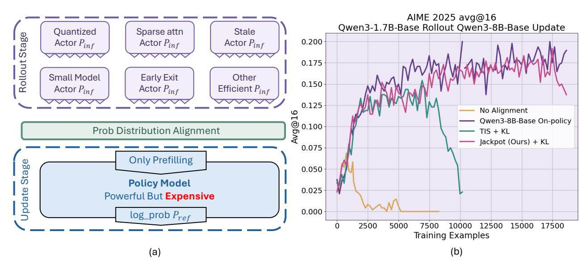
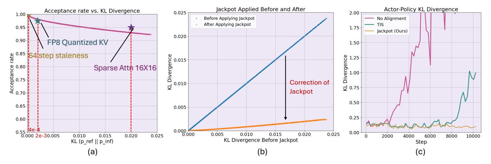
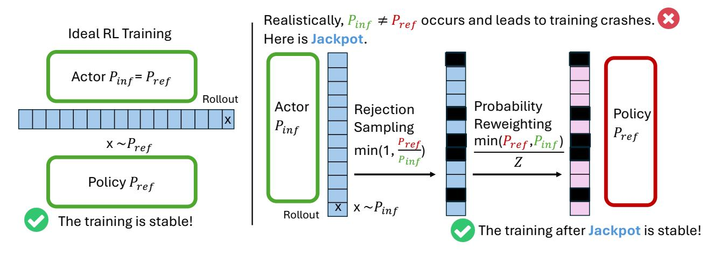
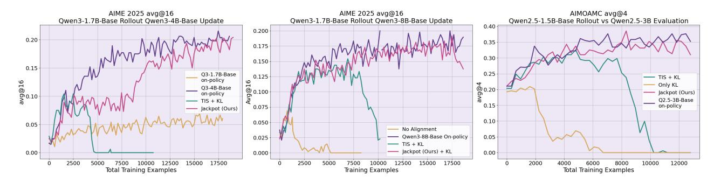
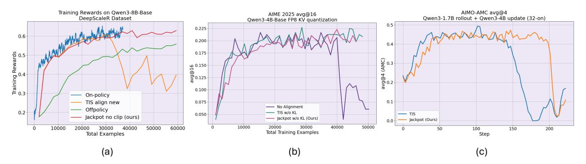

# Jackpot: Optimal Budgeted Rejection Sampling for Extreme Actor-Policy Mismatch Reinforcement Learning

Zhuoming Chen\*, Hongyi Liu\*, Yang Zhou\*, Haizhong Zheng, Beidi Chen

Carnegie Mellon University

Reinforcement learning (RL) for large language models (LLMs) remains expensive, particularly because the rollout is expensive. Decoupling rollout generation from policy optimization (e.g., leveraging a more efficient model to rollout) could enable substantial efficiency gains, yet doing so introduces severe distribution mismatch that destabilizes learning. We propose JACKPOT, a framework that leverages Optimal Budget Rejection Sampling (OBRS) to directly reduce the discrepancy between the rollout model and the evolving policy. JACKPOT integrates a principled OBRS procedure, a unified training objective that jointly updates the policy and rollout models, and an efficient system implementation enabled by top-k probability estimation and batch-level bias correction. Our theoretical analysis shows that OBRS consistently moves the rollout distribution closer to the target distribution under a controllable acceptance budget. Empirically, JACKPOT substantially improves training stability compared to importance-sampling baselines, achieving performance comparable to on-policy RL when training Qwen3-8B-Base for up to 300 update steps of batchsize 64. Taken together, our results show that OBRS-based alignment brings us a step closer to practical and effective decoupling of rollout generation from policy optimization for RL for LLMs.

Github: https://github.com/Infini-AI-Lab/jackpot Website: https://infini-ai-lab.github.io/jpt\_website/

# 1 Introduction

Reinforcement learning (RL) has demonstrated substantial effectiveness in the post-training of large language models (LLMs), yielding significant improvements in domains such as mathematics (Guo et al., 2025; Azerbayev et al., 2023), coding (Jimenez et al., 2023; Ouyang et al., 2025), and other agentic tasks (Liu et al., 2023; Jin et al., 2025). Despite these successes, RL remains expensive (Sheng et al., 2025; Fu et al., 2025; Zheng et al., 2025c), with the majority of the training cost, often 80% (Qin et al., 2025), attributed to rollouts, during which LLMs auto-regressively generate trajectories.

Many approaches have been explored to reduce rollout costs by improving hardware utilization through asynchronous training (Zheng et al., 2025b; Fu et al., 2025; Wu et al., 2025b), or through inference optimizations such as 8-bit quantization (Liu et al., 2025b), request balancing (Qin et al., 2025), and speculative decoding (Together-AI). However, these methods all require the target LLM to actively participate in the rollout process to collect trajectories and signals, which ultimately limits their flexibility (Kiran et al., 2021) and efficiency. This leads to a question:

Is it possible to perform rollouts using a completely different model from the one we ultimately want to train?

Ideally, switching to a smaller variant from the same model family should give huge efficiency gain. By prior work on test-time compute (Brown et al., 2024; Sadhukhan et al., 2025), even relatively small models can obtain non-zero rewards (i.e., training signals) on challenging problems by leveraging multiple attempts, a behavior that is inherently aligned with the standard RL training paradigm (Guo et al., 2025).

Despite the availability of training signals, the decoupled RL training triggers a severe **distribution mismatch** between the rollout and trained models, which is known to severely affect the stability and convergence of

\* indicates equal contribution, order decided by the lastnames

Figure 1 (a) Off-policy RL training is desirable for alleviating the severely high cost from the rollout stage of on-policy RL. The strong but inference costly policy model can be approximated by cheap but crappy counterparts to speedup the rollout stage. However, the trajectories rollout by the actor model must be aligned in probability distribution with the policy model's distribution to make offpolicy training viable. In (b) we show an extreme off-policy case where we show training setting use a QWEN3-1.7B-BASE model training rollout to train a QWEN3-8B-BASE model policy. Without any alignment procedures, training collapses (pink). Prior method TIS (green) also shows a significant gap towards QWEN3-8B-BASE on-policy baseline (purple), while collapsing, using TIS sees KL divergence also violently increasing. Our proposed point JACKPOT provides much more stable training under the setting.

RL (Liu et al., 2025a), primarily due to inaccurate advantage estimates. Existing methods aim to mitigate this issue with various importance-sampling (IS) corrections (Fu et al., 2025; Wu et al., 2025b; Liu et al., 2025b; Zheng et al., 2025a; Team et al., 2025). However, we find that the KL divergence between different models is often an order of magnitude larger than that observed in asynchronous training or quantised variants, casting doubt on whether prior correction techniques remain effective under such a large mismatch.

Given the limitations of purely post-hoc corrections, it is desirable also to reduce the mismatch at the source. Rejection sampling, which simulates a target distribution from an accessible proposal distribution, offers such a direct mechanism by selectively excluding undesired tokens from contributing to the backward pass and policy updates. It effectively narrows the distribution gap between the rollout and training models, naturally complementing existing importance-sampling corrections.

However, applying rejection sampling in RL systems for LLMs poses three key technical challenges. ① **Low Sample Efficiency.** Let p denote the trained model distribution and q denote the rollout model distribution. In standard rejection sampling, a token i proposed from q is accepted with probability  $\frac{p_i}{\lambda q_i}$ , where the constant  $\lambda$  must satisfy  $\lambda \ge \max_i \frac{p_i}{q_i}$ . For LLMs, which operate over vocabularies exceeding 100,000 tokens, this requirement leads to an extremely large  $\lambda$  because even small local differences between the two distributions can cause the ratio  $\frac{p_i}{q_i}$  to spike on certain rare tokens. Consequently, the acceptance probability becomes vanishingly small for almost all proposed tokens. ② **Widening Gap.** A naïve implementation of decoupled training keeps the rollout model fixed while the trained model continually improves. As learning progresses, the discrepancy between the two models increases, further exacerbating the distribution mismatch and potentially destabilising training. ③ **Efficiency and System Support.** Current RL frameworks (Sheng et al., 2025; Fu et al., 2025; von Werra et al., 2020; Hu et al., 2024) assume that the rollout and training models are identical. It remains unclear how to efficiently support decoupled RL, especially when combined with new algorithms, objectives, or loss functions.

To tackle these challenges, we propose Jackpot. Our framework leverages optimal budget rejection sampling (OBRS) (Verine et al., 2024) as a relaxed alternative to classical rejection sampling. Although OBRS does not enforce exact equality between the actor and target policy distributions, it provides a provable guarantee that, for any specified rejection budget, the adjusted actor distribution becomes strictly closer to the target distribution

than the original proposal. To prevent the distribution gap from widening as training progresses, we further apply a reverse-KL loss to progressively align the rollout model with the trained model. In addition, we develop an end-to-end RL system that efficiently supports decoupled training, incorporating several approximations to reduce the memory overhead introduced by OBRS, which otherwise requires accessing the full vocabulary when reweighting accepted tokens. Taken together, our empirical results show that JACKPOT substantially improves the stability of RL training compared to IS-based baselines, even enabling performance comparable to on-policy training on QWEN3-8B-BASE for 300 training steps (Figure 1).

We organize the remainder of this paper as follows.

- In Section 2, we formalize the notion of distribution mismatch between rollout and trained models, analyze its underlying causes across different training paradigms, and review relevant prior work.
- In Section 3, we start from a brief introduction of optimal budget rejection sampling (Section 3.1) and demonstrate its effectiveness through both numerical simulations and empirical observations (Section 3.2) and present the theoretical optimality (Section 3.3).
- In Section 4, we present the full Jackpot framework, detailing three key components: (i) the OBRS procedure (Section 4.1); (ii) the formulation of the Jackpot training objective (Section 4.2); and (iii) an efficient system implementation enabled by Top-k-based probability estimation and batch-level bias correction (Section 4.4).
- In Section 5, we conduct experiments on mathematical reasoning tasks to evaluate Jackpot. Empirically, we show that Jackpot significantly improves the stability of RL training over IS-based baselines. We further perform ablations on each module in Jackpot and analyze its effectiveness in settings with smaller distribution gaps, such as large-batch training and KV-quantized rollout.

# 2 Background

In this section, we first formalize the distribution mismatch problem that arises in RL for LLMs. We then review several strands of related work of JACKPOT.

## 2.1 Problem Setting: PPO Objective and Actor-Policy Distribution Mismatch

We begin with the clipped objective in PPO (Schulman et al., 2017), whose expectation can be written as  $\mathcal{L}^{\text{PPO}}(\theta) = \mathbb{E}_{x \sim P_{\text{inf}}} \left[ \min \left( r_{\theta}(x) \hat{A}(x), \text{clip}(r_{\theta}(x), 1 - \epsilon, 1 + \epsilon) \hat{A}(x) \right) \right] \tag{1}$ 

where  $r_{\theta}(x) = p_{\theta_{\text{new}}}(x)/p_{\text{ref}}(x)$  is the likelihood ratio between the updated policy  $p_{\theta_{\text{new}}}$  and the reference policy  $p_{\text{ref}}$ , and  $\hat{A}(x)$  denotes the estimated advantage at decision x.  $p_{\text{inf}}$  is the inference distribution used to generate rollouts,  $p_{\text{ref}}$  is the reference policy distribution assumed in the objective, and  $p_{\theta_{\text{new}}}$  is the updated policy distribution. In the standard process, it is assumed that  $p_{\text{inf}} = p_{\text{ref}}$ , but in practice this assumption is often violated, leading to actor-policy distribution mismatch.

Distribution mismatch is common and arises for several reasons, such as minor discrepancies between the inference engine and the reference policy by FSDP engines, the use of stale or asynchronous data, or rollouts generated by approximated models (e.g., quantized, sparsified, or distilled). Such mismatches can destabilize training and therefore require additional mechanisms to correct or mitigate their impact.

#### 2.2 Related Work

RL for LLM. Reinforcement learning has been widely applied to LLMs to improve human alignment, reasoning, coding, and other complex tasks. Beyond PPO, memory efficient methods have been proposed, including ReMax (Li et al., 2023), RLOO (Ahmadian et al., 2024), and GRPO (Shao et al., 2024). In addition, methods such as SimPO (Meng et al., 2024) and DPO (Rafailov et al., 2023), which are based on offline RL, have also been employed for human alignment. RL training systems for LLMs, such as Verl (Sheng et al., 2025), AReal (Fu et al., 2025), TRL (von Werra et al., 2020), and OpenRLHF (Hu et al., 2024), have been developed to improve training throughput and scalability.

**Distribution Mismatch Correction in RL.** Actor (i.e., the rollout model) and policy (i.e., the trained model) mismatch is a common problem that has long been studied, e.g., Espeholt et al. (2018). To alleviate the actorpolicy distribution gap, prior methods leverage importance sampling to approximate the true PPO objective.

$$\mathcal{L}^{PPO}(\theta) = \mathbb{E}_{x \sim p_{inf}} \left[ SG \left( \frac{\mathbf{F}(\frac{p_{ref}(x)}{p_{inf}(x)})}{\mathbf{F}(\frac{p_{ref}(x)}{p_{inf}(x)})} \right) \min(r_{\theta}(x)\hat{A}(x), \text{clip}(r_{\theta}(x), 1 - \epsilon, 1 + \epsilon)\hat{A}(x)) \right]$$
(2)

SG means stop gradients. The choice of adjustment function  $\mathbf{F}$  is one of the core focuses of prior work. Areal (Fu et al., 2025) uses an identical function  $\mathbf{F}(x) = x$ ; Flash-RL and Llama-RL use  $\mathbf{F}(x) = \min(x, C)$  (i.e., truncated importance sampling, TIS), where C is a hyper-parameter; IceProp (Team et al., 2025) uses a bi-directional truncation,

$$\boldsymbol{F}(x) = \begin{cases} x, & \text{if } x \in [\alpha, \beta], \\ 0, & \text{otherwise.} \end{cases}$$

From system perspective, FP32 LM heads (Liu et al., 2025b) and deterministic LLM Inference (He and Lab, 2025) are implemented to mitigate the numerical issue of serving systems when rollout.

In this paper, we proposed Jackpot. Our method is **orthogonal** to the above prior works. We think about the problem of how to directly close the gap between  $p_{\rm inf}$ , and  $p_{\rm ref}$ . We will show that through optimal budget rejection sampling and reweighting of the output probabilities so that the divergence between  $p_{\rm inf}$  and the target distributions  $p_{\rm ref}$  is provably reduced. Moreover, techniques such as TIS can be applied on top of this improved distribution to further correct the remaining mismatch in a complementary way.

## 3 Rejection Sampling and Optimal Budget Rejection Sampling

In this section, we briefly introduce optimal budget importance sampling (OBRS) and discuss its theoretical guarantee, followed by our validation via numerical simulation. We further offer detailed analysis and proofs in Appendix A.

## 3.1 Reduce Distribution Gap via Optimal Budget Importance Sampling

We show how to directly modify  $p_{\text{inf}}$  to close the distribution gap to  $p_{\text{ref}}$  instead of the post-hoc importance sampling corrections. Let  $\boldsymbol{p}$  denote the target distribution we want to align with (e.g., the trained model distribution),  $\boldsymbol{q}$  denote the proposed distribution (e.g., the rollout model distribution), and  $\tilde{\boldsymbol{q}}$  denote the post-rejection distribution (i.e., the distribution of accepted tokens).

**Definition 3.1** (Rejection Sampling (RS)). RS stochastically rejects tokens in the trajectories sampled with  $p_{\text{inf}}$  based on the difference between the two distributions. In standard rejection sampling, a token i proposed from  $\boldsymbol{q}$  is accepted with probability  $\frac{p_i}{\lambda q_i}$ , where the constant  $\lambda$  must satisfy  $\lambda \geq \max_i \frac{p_i}{q_i}$ . Therefore, we have  $\tilde{q}_i \propto q_i \cdot \frac{p_i}{\lambda q_i}$ . Then  $\tilde{q}_i = p_i$ , after normalization. Therefore, rejection sampling transforms samples from  $\boldsymbol{q}$  into exact samples from the target distribution  $\boldsymbol{p}$ .

While standard rejection sampling can, in principle, perfectly align two distributions, its direct application in our setting is impractical. In high-dimensional discrete spaces such as LLM vocabularies—often exceeding 100,000 tokens—even minor local discrepancies between the rollout and target distributions can cause the likelihood ratio  $\frac{p_i}{q_i}$  to spike for rare tokens. This forces the normalizing constant  $\lambda$  to become extremely large, which, in turn, drives the acceptance rate to near zero, resulting in almost all proposed tokens being rejected.

To overcome this, we adopt the principled approach of **Optimal Budgeted Rejection Sampling (OBRS)** (Verine et al., 2024). This technique reframes the problem: instead of demanding perfect adherence to the target distribution at the cost of sample efficiency, it seeks the optimal rejection rule that, for a given target acceptance rate (a "budget"), produces a distribution as close as possible to the target. This is precisely the trade-off our problem requires.

**Definition 3.2** (Optimal Budget Rejection Sampling (OBRS) (Verine et al., 2024)). Instead of using the dominating constant  $\lambda = \max_i \frac{p_i}{q_i}$ , OBRS selects a smaller user-specified parameter  $\lambda > 0$  that reflects the desired rejection budget. For a proposed token  $i \sim q$ , OBRS accepts it with probability  $a_i = \min\left(1, \frac{p_i}{\lambda q_i}\right)$ . The resulting post-rejection distribution is therefore  $\tilde{q}_i \propto q_i \cdot a_i$ 

Figure 2 We conducted numerical experiments in (a) and (b), where we simulate the LLMs' output distribution with randomly generated Dirichlet distribution with controllable noise to attain different levels of KL divergence. (a) plots the simulated JACKPOT acceptance rate across different pairs of actor-policy distributions. While overal trend sees acceptance rate slowly decreasing as the distributions move further apart, the acceptance rate remains high (>90%) throughout the spectrum. For reference, we also marks the actor-policy gap of different common seen off-policy settings. In (b), we show that JACKPOT significantly shrinks the KL divergence between the target distribution versus the applied distribution in our simulations, sometimes by an order of magnitude. In (c), our proposed method, JACKPOT (yellow) maintains small KL divergence between actor and policy model probability distribution, while without alginment and TIS both seen KL divergence explosively rise up as the training continues.

While the resulting distribution of OBRS does not generally equal p but is guaranteed to be closer to p than the original proposal distribution for any  $\lambda$ . Thus, OBRS provides a controllable trade-off between acceptance rate and distribution alignment, avoiding the vanishing acceptance rates that arise in high-dimensional settings.

#### 3.2 Numerical Simulation

We validate the effectiveness of OBRS via numerical simulation in Figure 2. Crucially, this calibration is highly efficient; the acceptance rate remains high even when there is a large initial KL divergence. The impact on distributional alignment is dramatic: a significant reduction in KL divergence is observed with high acceptance rates. By systematically damping the most extreme probability ratios, OBRS produces a distribution that is not only provably closer to the on-policy target but also primed to yield more stable and effective PPO/GRPO policy updates.

#### 3.3 Theoretical Guarantees

To justify the use of OBRS within our framework, we establish its fundamental theoretical properties, which formally characterize its ability to reduce distribution mismatch. OBRS possesses proven optimality. We provided our proofs in Appendix A.

**Theorem 3.3** (OBRS Improves Distribution Alignment). Let p be the target distribution and q be the proposal distribution. For any  $\lambda > 0$ , define the OBRS acceptance rule

$$a_i = \min\left(1, \frac{p_i}{\lambda q_i}\right), \quad \tilde{q}_i \propto q_i a_i.$$

Then the post-rejection distribution  $\tilde{q}$  is strictly closer to p than the original proposal q in the sense that  $D_{\mathrm{KL}}(p\|\tilde{q}) \leq D_{\mathrm{KL}}(p\|q)$ ,

whenever  $\lambda < \max_i \frac{p_i}{q_i}$ .

In other words, OBRS always moves the proposal distribution toward the target distribution under any nontrivial rejection budget.

**Theorem 3.4** (Optimality of OBRS under a Fixed Acceptance Budget). For any desired average acceptance rate  $\bar{a} \in (0,1]$ , there exists a unique scaling factor  $\lambda > 0$  such that the OBRS acceptance rule

$$a_i = \min\left(1, \frac{p_i}{\lambda q_i}\right)$$

achieves the exact acceptance budget:

$$\sum_{i} q_{i} a_{i} = \bar{a}.$$

Moreover, among all acceptance rules  $a_i \in [0,1]$  that satisfy this constraint, the OBRS rule is the unique minimizer of the divergence to the target distribution:

$$\tilde{\boldsymbol{q}} = \underset{\hat{\boldsymbol{q}}}{\operatorname{argmin}} D_{\mathrm{KL}}(\boldsymbol{p} \| \hat{\boldsymbol{q}}), \quad s.t. \quad \hat{q}_i \propto q_i a_i, \sum_i q_i a_i = \bar{a}.$$

Thus, OBRS is provably optimal for aligning q toward p under any specified rejection budget.

The above properties of OBRS are also explored in Verine et al. (2024). This guarantee ensures we are using the provably best method for trading sample efficiency for distributional accuracy.

# 4 Jackpot: Design and Methodology

In this section, we present details on the design considerations of JACKPOT. We show how we apply OBRS in RL, i.e., the token rejection criteria and reweighting procedures in Section 4.1, the formulation of JACKPOT objective in Sections 4.2 and 4.3, and our memory optimization and efficient implementation in Section 4.4.

#### 4.1 OBRS Procedure

To reduce the mismatch between the inference distribution  $p_{\text{inf}}$  and the target distribution  $p_{\text{target}}$  (which may refer to either the reference policy  $p_{\text{ref}}$  or the updated policy  $p_{\theta_{\text{new}}}$ ; see Section 4.3 for details), we adopt a rejection rule analogous to Leviathan et al. (2023). For a token x sampled from  $p_{\text{inf}}$ , we accept it with probability

$$a(x) = \min\left(1, \frac{p_{\text{target}}(x)}{\lambda p_{\text{inf}}(x)}\right), \tag{3}$$

where  $\lambda > 0$  controls the overall rejection budget

Equation (3) specifies the conditional probability

$$P(x \text{ accepted} | x \sim p_{\text{inf}}).$$

Tokens that are rejected are masked out and excluded from the loss computation and gradient propagation. The acceptance rule induces a new (post-rejection) distribution over tokens:

where 
$$Z = \sum_{x'} \min\left(p_{\inf}(x'), \frac{p_{\text{target}}(x')}{\lambda}\right)$$
. (4)

Importantly,  $P_{\text{OBRS}}$  represents the *true* probability distribution governing the accepted samples. Therefore, in subsequent training, we reweight all accepted tokens according to  $P_{\text{OBRS}}$ , ensuring that their contributions to the loss and gradient faithfully reflect their probabilities under the adjusted distribution. We visualize the process in Figure 3.

#### 4.2 Formulations of the Jackpot Objective

JACKPOT optimizes three objectives during training: (i) an OBRS-adjusted RL loss for the trained model (i.e., policy) model  $\theta$ , (ii) a standard PPO loss for the rollout model (i.e., actor)  $\omega$ , and (iii) an on-policy distillation loss that keeps the rollout model aligned with the improving policy. We now describe each component.

(1) OBRS-adjusted RL loss for the policy model. Following Section 4.1, tokens are sampled from the rollout inference distribution  $p_{inf}$ , but each sampled token x is accepted or rejected via the OBRS acceptance probability

$$a(x) = \min\left(1, \frac{p_{\text{target}}(x)}{\lambda p_{\text{inf}}(x)}\right), \quad \text{Mask}(x) \sim \text{Bernoulli}(a(x)).$$

Accepted tokens (Mask(x)=1) define the OBRS-adjusted distribution

$$p_{\inf}'(x) = \frac{p_{\inf}(x)a(x)}{\sum_{x'}p_{\inf}(x')a(x')}.$$

Figure 3 Illustration of Jackpot Pipeline focusing on Optimal Budgeted Rejection Sampling (OBRS) and Reweighting Procedures

The original PPO objective in Section

The original PPO objective in Section 2, 
$$\mathcal{L}^{\text{PPO}}(\theta) = \mathbb{E}_{x \sim p_{\inf}} \Big[ \text{SG} \Big( \boldsymbol{F} \Big( \frac{p_{\text{ref}}(x)}{p_{\inf}(x)} \Big) \Big) \min \Big( r_{\theta}(x) \hat{A}(x), \text{clip}(r_{\theta}(x), 1 - \epsilon, 1 + \epsilon) \hat{A}(x) \Big) \Big],$$
 becomes the OBRS-aware PPO objective:

$$\mathcal{L}^{\text{PPO-OBRS}}(\theta) = \mathbb{E}_{x \sim p_{\text{inf}}} \left[ \text{Mask}(x) \operatorname{SG} \left( \boldsymbol{F} \left( \frac{p_{\text{target}}(x)}{p'_{\text{inf}}(x)} \right) \frac{p_{\text{ref}}(x)}{p_{\text{target}}(x)} \right) \right. \\ \left. \min \left( r_{\theta}(x) \hat{A}(x), \operatorname{clip}(r_{\theta}(x), 1 - \epsilon, 1 + \epsilon) \hat{A}(x) \right) \right], \tag{5}$$

where rejected samples are removed by Mask(x), and accepted samples are reweighted according to  $p'_{inf}(x)$ . The function F is the truncated IS correction (Section 2), and the choice of  $p_{\text{target}}$  is discussed in Section 4.3 (Empirically, we can use reference policy  $p_{\text{ref}}$  or the updated policy  $p_{\theta_{\text{new}}}$  as the  $p_{\text{target}}(x)$  for distribution alignment.) We present the details of this part in Algorithm 1.

(2) Standard PPO loss for the rollout model. The rollout model  $\omega$  is also optimized using PPO, but without OBRS:

without OBRS:  

$$\mathcal{L}^{\text{PPO}}(\omega) = \mathbb{E}_{x \sim p_{\text{inf}}} \left[ \text{SG} \left( \boldsymbol{F} \left( \frac{p_{\omega, \text{ref}}(x)}{p_{\text{inf}}(x)} \right) \right) \min \left( r_{\omega}(x) \hat{A}(x), \text{clip}(r_{\omega}(x), 1 - \epsilon, 1 + \epsilon) \hat{A}(x) \right) \right],$$
where  $p_{\omega, \text{ref}}$  and  $r_{\omega}$  explicitly denote quantities computed from the rollout model. (6)

(3) On-policy distillation loss for the rollout model. To ensure the rollout model tracks the improving policy, we apply a forward KL distillation loss using the same sampled trajectories:

$$\mathcal{L}^{\text{distill}}(\omega) = \mathbb{E}_{x \sim p_{\text{inf}}} \left[ D_{\text{KL}} \left( SG(p_{\theta_{\text{new}}}(x)) \middle\| p_{\omega}(x) \right) \right]. \tag{7}$$

After optimization, the updated rollout distribution  $p_{\omega}$  is used as the inference distribution  $p_{\inf}$  for the next training iteration, if we do not consider the numerical precision differences between the rollout engine and the training engine (He and Lab, 2025).

Joint objective. Combining the three components above, the overall Jackpot training objective is
$$\mathcal{L}^{\text{Jackpot}}(\theta,\omega) = \underbrace{\mathcal{L}^{\text{PPO-OBRS}}(\theta)}_{\text{policy RL}} + \underbrace{\mathcal{L}^{\text{PPO}}(\omega)}_{\text{rollout RL}} + \lambda_{\text{distill}} \underbrace{\mathcal{L}^{\text{distill}}(\omega)}_{\text{on-policy distillation}}$$
(8)

where  $\lambda_{\text{distill}} \geq 0$  are hyperparameters that balance the contributions of the rollout RL loss and the distillation loss.

#### 4.3 Which policy to approximate?

OBRS allows us to align the inference distribution  $p_{inf}$  toward any chosen target distribution  $p_{target}$ . This flexibility raises a natural question: which policy distribution should we approximate during training?

A straightforward choice is the reference policy  $p_{ref}$ , which is consistent with the formulation of standard PPO and provides a stable trust-region anchor. However, we empirically find that in training regimes where policy staleness becomes a major issue, such as large-batch RL or asynchronous rollout-update pipelines, the reference policy may drift too far from the current updated policy. In such cases, aligning  $p_{\rm inf}$  toward the latest policy  $p_{\text{new}}$  yields better performance, as the trust region defined by  $p_{\text{ref}}$  is too outdated to offer meaningful guidance.

Therefore, Jackpot offers users the flexibility to choose  $p_{\text{target}} = p_{\text{ref}}$  or  $p_{\text{target}} = p_{\text{new}}$ , depending on the requirement in their training setup.

#### Memory Optimization and Efficiency

Implementing Jackpot directly faces a huge challenge of computational feasibility. Note that the weight's normalization constant, Z Section 4.1, requires a sum over the entire vocabulary ( $|\mathcal{V}| > 100,000$ ), creating a crippling memory bottleneck from storing full logit vectors (batch\_size × seq\_len × vocab\_size). This severely restricts batch sizes, directly undermining the efficiency OBRS is intended to provide. Therefore, transforming this principled approach into a large-scale RL system requires non-trivial engineering: we must introduce mechanisms to both bound the importance weights for stability and develop a computationally efficient, low-bias estimator for the normalization constant. To overcome the computational bottleneck of calculating Z, we employ a top-k approximation and then empirically debias it. We present the details in Algorithm 1.

#### 4.4.1 Top-k Approximation

The probability mass of language models is typically concentrated in a small subset of the vocabulary. We leverage this property by approximating the sum over  $\mathcal{V}$  with a sum over a much smaller set,  $\mathcal{V}_k$ , which contains the most likely tokens from both the inference and current policies. Specifically, let top-k(p) be the set of k tokens with the highest probability under distribution p. We define our approximation set as the union:

$$V_k = \text{top-k}(p_{\text{inf}}) \cup \text{top-k}(p_{\theta_{\text{new}}})$$

The union is crucial because a token might be highly probable under one distribution but not the other, and the min function makes these overlapping regions important. The approximate normalization constant,  $Z_{\text{approx}}$ , is then:  $Z_{\text{approx}} = \sum_{a' \in \mathcal{V}_k} \min \left( p_{\text{inf}}(a'), \frac{p_{\text{target}}(a')}{\lambda} \right)$ 

#### 4.4.2Bias Correction

While efficient, this top-k approximation introduces a systematic bias. Since the terms in the sum are non-negative, omitting tokens from the full vocabulary  $\mathcal{V}$  can only decrease the total sum. Therefore, our approximation is a consistent underestimation of the true value:

$$\mathbb{E}[Z_{\text{approx}}] \leq Z$$

For k=20,. This bias could systematically alter the scale of the gradients during training. Fortunately, there is an elegant way to correct this. A key property of the framework is that the true normalization constant Zis exactly equal to the expected acceptance rate,  $\bar{\alpha}$ :

$$\bar{\alpha} = \sum_{a \in \mathcal{V}} p_{\inf}(a) \cdot \min\left(1, \frac{p_{\text{target}}(a)}{\lambda \cdot p_{\inf}(a)}\right) = \sum_{a \in \mathcal{V}} \min\left(p_{\inf}(a), \frac{p_{\text{target}}(a)}{\lambda}\right) = Z.$$

During the data collection phase (Algorithm 1, Phase 1), we can compute an unbiased empirical estimate of  $\bar{\alpha}$  from the observed samples:

$$\hat{\alpha} = \frac{\text{Number of accepted samples}}{\text{Total number of proposed samples}}$$

 $\hat{\alpha} = \frac{\text{Number of accepted samples}}{\text{Total number of proposed samples}}$ This gives us two estimators for Z: the low-variance but biased  $Z_{\text{approx}}$ , and the unbiased but higher-variance  $\hat{\alpha}$ . We can combine them to create a de-biased, low-variance estimator. We compute a batch-wide calibration factor,  $\kappa$ , by dividing the empirical acceptance rate by the batch-averaged  $Z_{\text{approx}}$ :

$$\kappa = \frac{\hat{\alpha}}{\frac{1}{B} \sum_{i=1}^{B} Z_{\text{approx}}^{(i)}}$$

 $\kappa = \frac{\hat{\alpha}}{\frac{1}{B} \sum_{i=1}^{B} Z_{\text{approx}}^{(i)}}$  where B is the number of samples in the batch. We then apply this scalar correction to each per-token  $Z_{\text{approx}}$ value used in the loss calculation. This procedure scales our efficient top-k estimate to match the true expected value observed in practice, effectively removing the bias while retaining the computational benefits and lower variance of the top-k approach.

Figure 4 Jackpot enables probability distribution alignment beyond existing methods. On the extreme two model joint training setting, with Jackpot, the smaller and weaker model is able to rollout trajectories which are used by the bigger stronger models for computing its training. We show that prior TIS methods, even added the KL, consistently suffers from unstable training across three different settings. Qwen2.5 series 1.5B and 3B, Qwen3 1.7B and 4B, and Qwen3 1.7B and 8B base models. In contrast, Jackpot leads to comparable performance with the large model on-policy performance.

#### 4.4.3 Efficiency Analysis

Despite introducing two additional objectives, the rollout-model RL loss and the on-policy distillation loss, Jackpot remains highly efficient in practice. We summarize the key reasons below.

- (1) Extra losses do not introduce extra rollouts. Rollout generation is the dominant computational bottleneck in RL training for LLMs, typically contributing over 80% of total runtime. Both the rollout-model PPO loss and the distillation loss operate entirely on the same trajectories collected for training the policy model; hence, no additional rollouts are required. Moreover, the rollout model is intentionally chosen to be more efficient than the policy model (e.g., a smaller variant), further reducing the marginal cost of updating ω. As a result, the added losses introduce only a small overhead while keeping the overall training throughput dominated by rollout efficiency.
- (2) Minimal tensor overhead and no extra probability computation. Jackpot is lightweight in implementation: it reuses tensors that are already materialized within the PPO computation graph. No additional log prob evaluations are needed because both pref and pnew are produced as part of the standard objective (5). Jackpot simply reuses these probabilities for OBRS reweighting and alignment. Furthermore, Jackpot requires no changes to vLLM—no custom operators, kernels, or special numerical precision assumptions. Our implementation runs directly on standard vLLM for rollout without any system-level modification.
- (3) No trajectory resampling is required (contrast with speculative decoding or sequence-wise rejection sampling). A critical distinction from speculative decoding [Leviathan et al.](#page-13-16) [\(2023\)](#page-13-16) is that Jackpot does not resample the remainder of a trajectory once a token is rejected. Speculative decoding discards the entire suffix of a trajectory after the first mismatch between the draft and target models, requiring additional sampling to regenerate the remaining tokens. In contrast, Jackpot simply masks individual rejected tokens according to the OBRS criterion, while keeping the rest of the trajectory intact. This design avoids any resampling of trajectories and significantly reduces computational overhead.

# 5 Empirical Analysis

Jackpot can be layered on top of truncated importance sampling (TIS) and enables training in regimes where actor–policy mismatch is extremely large. In this section, we consider the most challenging configuration: training a strong, expensive policy model using a completely separate, smaller, and more efficient actor model for rollouts. Unlike scenarios where the actor model is merely stale or an approximate quantized version of the policy, employing a fully separate model introduces KL divergences that are orders of magnitude larger than those observed in conventional asynchronous-training setups. At the same time, such decoupling offers the potential for substantial rollout cost reductions, making this setting both practically important and algorithmically demanding.

Setup. We evaluate Jackpot in the context of training LLMs on mathematical reasoning tasks using the GRPO algorithm [Guo et al.](#page-13-0) [\(2025\)](#page-13-0). Our experiments span three strong–weak actor–policy model pairs

#### **Algorithm 1** The Jackpot Algorithm

**Require:** Policies: current  $p_{\text{new}}$ , reference  $p_{\text{ref}}$ , inference  $p_{\text{inf}}$ .

**Require:** Hyperparameters: OBRS threshold  $\lambda$ , PPO clip  $\epsilon$ , Jackpot clips  $c_1, c_2$ , top-k count.

- 1: Convention:  $SG(\cdot)$  denotes the stop-gradient operation.
- 2: Implementation note: Jackpot only reweights quantities from the standard rollout and PPO/GRPO forward passes; it does *not* perform extra model forward passes or trajectory recomputation.
- 3: Phase 1: Efficient Rollout (Standard Generation)
- 4: Initialize experience buffer  $\mathcal{D} \leftarrow \emptyset$ .
- 5: **for** each trajectory sampling step t **do**
- 6: Single forward pass of  $p_{\text{inf}}(\cdot | s_t)$ , sample  $a_t \sim p_{\text{inf}}(\cdot | s_t)$ .
- From the same forward, compute and store top-k log-probabilities of  $p_{inf}$ : Top $K_{inf}(s_t)$ . 7:
- 8: Store  $(s_t, a_t, p_{\inf}(a_t | s_t), \text{TopK}_{\inf}(s_t))$  (plus rewards, values, etc.) in buffer  $\mathcal{D}$ .
- 9: end for
- 10: Compute advantages  $\hat{A}_t$  using collected trajectories.
- 11: Phase 2: PPO Update with Jackpot Reweighting
- 12: for each mini-batch sampled from  $\mathcal{D}$  do
- // 1. Standard PPO Computation (reused by Jackpot) 13:
- Forward pass  $p_{\text{new}}$  and  $p_{\text{ref}}$  on the mini-batch to get logits,  $p_{\text{new}}(a_t | s_t)$ ,  $p_{\text{ref}}(a_t | s_t)$ , and  $\text{TopK}_{\text{new}}(s_t)$ . 14:
- Compute policy ratio:  $r_t(\boldsymbol{\theta}) = \frac{p_{\text{new}}(a_t | s_t)}{p_{\text{ref}}(a_t | s_t)}$ . 15:
- Compute vanilla PPO objective:  $\mathcal{L}_{PPO} = \min(r_t(\boldsymbol{\theta})\hat{A}_t, \operatorname{clip}(r_t(\boldsymbol{\theta}), 1-\epsilon, 1+\epsilon)\hat{A}_t)$ . 16:
- // 2. Efficient Z-Approximation and Bias Correction (no extra forward passes) 17:
- Construct approximation set  $V_k = \text{TopK}_{inf}(s_t) \cup \text{TopK}_{new}(s_t)$ . 18:
- 19: Compute

$$Z_{\text{approx}} = \sum_{x \in \mathcal{V}_k} \min \left( p_{\text{inf}}(x \mid s_t), \frac{p_{\text{new}}(x \mid s_t)}{\lambda} \right).$$

- Estimate correction factor  $\kappa$  using the OBRS-based bias-correction procedure described in Sec. 4.4.2 (e.g., 20: from batch-level OBRS statistics).
- Set corrected normalizer  $Z_t \leftarrow \kappa \cdot Z_{\text{approx}}$ . 21:
- // 3. Jackpot Weight Calculation 22:
- 23:
- OBRS weight:  $w_{\text{OBRS}} = Z_t \cdot \max\left(\lambda, \frac{p_{\text{new}}(a_t|s_t)}{p_{\text{inf}}(a_t|s_t)}\right)$ .  $\rho_{\text{jackpot}} = \min(w_{\text{OBRS}}, c_1) \cdot \min\left(\frac{p_{\text{ref}}(a_t|s_t)}{p_{\text{new}}(a_t|s_t)}, c_2\right)$ . 24:
- // 4. Apply Weight to Loss 25:
- 26:  $\mathcal{L}_{\text{final}} = \text{SG}(\rho_{\text{jackpot}}) \cdot \mathcal{L}_{\text{PPO}}.$
- 27: Update policy parameters new using gradient of  $-\mathcal{L}_{\text{final}}$ .

across two model families and two datasets: (1) Qwen2.5-1.5B-Base (actor) with Qwen2.5-3B-Base (policy) trained on the MATH dataset Hendrycks et al. (2021); (2) Qwen3-1.7B-Base with Qwen3-4B-Base trained on the DeepScaleR dataset Luo et al. (2025); and (3) Qwen3-1.7B-Base with Qwen3-8B-Base also trained on DeepScaleR. The maximum generation length is set to 8192 tokens for all experiments.

**Results.** Naively applying existing methods to this decoupled-actor setting leads to highly unstable training, even when truncated importance sampling (TIS) is used to constrain the distribution gap between the reference and inference models—training still collapses. In contrast, JACKPOT maintains stable learning for a substantially extended number of update steps, demonstrating stability up to 300 steps across the evaluated model pairs. These results highlight the effectiveness of OBRS-based alignment in mitigating distribution mismatch and improving robustness in decoupled RL training.

We show the results in the Figure. We show that the large model performance can indeed be stably trained for a large number of steps and cover a large number of examples. Surprisingly, for the Qwen3-4B-Base model, our joint training even matches the 4B model performance when training itself. JACKPOT consistently outperforms

Table 1 Evaluation results across datasets for different actor–policy training configurations. Mean@4 and Pass@4 are computed using four independent samples.

| Models                                     | GSM8K Mean@4 | MATH-500 Mean@4 | AMC22/23 Mean@4 | AMC12 Mean@4 | AIME24 Mean@4 | AIME24 Pass@4 | AIME25 Mean@4 | AIME25 Pass@4 |  |  |  |
|--------------------------------------------|-----------------|--------------------|--------------------|-----------------|------------------|------------------|------------------|------------------|--|--|--|
| Qwen2.5-1.5B→Qwen2.5-3B (14k, 64, MATH-8K) |                 |                    |                    |                 |                  |                  |                  |                  |  |  |  |
| Q2.5-3B On-policy                          | 0.8500          | 0.6390             | 0.3765             | 0.2611          | –                | –                | –                | –                |  |  |  |
| Only Reverse KL                            | 0.7417          | 0.4535             | 0.2093             | 0.1407          | –                | –                | –                | –                |  |  |  |
| TIS + Reverse KL                           | 0.8250          | 0.6045             | 0.3253             | 0.2444          | –                | –                | –                | –                |  |  |  |
| Jackpot (Ours)                          | 0.8428          | 0.6275             | 0.3855             | 0.2778          | –                | –                | –                | –                |  |  |  |
| Qwen3-1.7B→Qwen3-4B (20k, 64, DeepScaleR)  |                 |                    |                    |                 |                  |                  |                  |                  |  |  |  |
| Q3-1.7B On-policy                          | 0.8380          | 0.6590             | 0.3524             | 0.2500          | 0.1000           | 0.1741           | 0.0680           | 0.1336           |  |  |  |
| Q3-4B On-policy                            | 0.9256          | 0.8082             | 0.5813             | 0.5166          | 0.2500           | 0.3514           | 0.2156           | 0.2966           |  |  |  |
| TIS + Reverse KL                           | 0.9121          | 0.7365             | 0.4639             | 0.3277          | 0.1333           | 0.2031           | 0.1041           | 0.1912           |  |  |  |
| Jackpot (Ours)                          | 0.9215          | 0.8052             | 0.5949             | 0.5388          | 0.2350           | 0.3364           | 0.2083           | 0.2778           |  |  |  |
| Qwen3-1.7B→Qwen3-8B (15k, 64, DeepScaleR)  |                 |                    |                    |                 |                  |                  |                  |                  |  |  |  |
| Q3-8B On-policy                            | 0.9329          | 0.7950             | 0.6114             | 0.5333          | 0.2437           | 0.3385           | 0.1687           | 0.2616           |  |  |  |
| TIS + Reverse KL                           | 0.9361          | 0.7645             | 0.5662             | 0.3722          | 0.1770           | 0.2741           | 0.1541           | 0.2223           |  |  |  |
| Jackpot (Ours)                          | 0.9357          | 0.8265             | 0.6204             | 0.5444          | 0.2500           | 0.3657           | 0.1916           | 0.2769           |  |  |  |

Figure 5 (a) Jackpot enables removal of clipping from stale RL training. (b) Jackpot isn't showing improvement nor harm when actor-policy distributions are relatively close and can be sufficiently corrected by TIS. (c) When removing KL, Jackpot consistently sustains longer than TIS counterparts.

TIS even with reverse KL added. The above results marks the potential for significant RL training cost savings.

# 6 Ablation Studies

#### 6.1 When Jackpot isn't Effective

We find that Jackpot offers little improvement over standard methods when the distribution shift is inherently small or already well-controlled by existing techniques.

RL algorithms like PPO and GRPO employ clipping mechanisms to enforce trust regions, explicitly constraining the deviation of the current policy from the old (rollout) policy. While this design enhances stability, it inherently limits the magnitude of the update per step. Consequently, the distribution shift between the rollout policy and the current policy remains small. In these regimes, the distribution correction provided by Jackpot becomes less critical, resulting in performance on par with, rather than superior to, standard baselines.

Similarly, while FP8 KV quantization during rollout introduces a larger distribution gap between the training and rollout frameworks by increasing the "off-policy" nature of the task, standard techniques like TIS effectively mitigate this instability (See Figure [5\)](#page-10-0). Because TIS is sufficient to restore performance levels comparable to unquantized baselines, the additional distribution correction offered by Jackpot yields diminishing returns in this context. Detailed evaluations are demonstrated in Table [2.](#page-11-0)

Table 2 Jackpot provides little additional benefit when distribution shifts are already controlled by PPO clipping or TIS under FP8 KV quantization.

|                                                                                                       | GSM8K  | MATH-500 | AMC22 & 23 | AMC12 2024 | AIME24  |         | AIME25  |         |  |  |
|-------------------------------------------------------------------------------------------------------|--------|----------|------------|------------|---------|---------|---------|---------|--|--|
| Models / Methods                                                                                      | Mean@4 | Mean@4   | Mean@4     | Mean@4     | Mean@16 | Pass@16 | Mean@16 | Pass@16 |  |  |
| Qwen3-4B-Base on DeepScaleR-Preview Dataset (rollout batch size = 2048; train batch size = 32; 64×)   |        |          |            |            |         |         |         |         |  |  |
| Off Policy                                                                                            | 92.10  | 81.55    | 60.54      | 56.11      | 27.50   | 38.36   | 23.12   | 31.36   |  |  |
| Jackpot (Ours)                                                                                     | 92.53  | 81.95    | 59.94      | 56.11      | 27.71   | 37.77   | 22.70   | 31.22   |  |  |
| Qwen3-4B-Base on DeepScaleR-Preview Dataset (rollout batch size = 128; train batch size = 64; FP8 KV) |        |          |            |            |         |         |         |         |  |  |
| TIS                                                                                                   | 92.68  | 83.65    | 60.84      | 53.89      | 25.83   | 36.95   | 22.70   | 29.2    |  |  |
| Jackpot (Ours)                                                                                     | 91.83  | 81.30    | 62.35      | 50.56      | 24.79   | 35.13   | 22.29   | 29.51   |  |  |

## 6.2 What Jackpot enables

In contrast, Jackpot provides substantial benefits in regimes with large policy shifts, enabling both stable training and faster convergence. See Figure [5.](#page-10-0)

To evaluate the benefits of Jackpot, we investigate a training regime where the protective constraints of PPO clipping are removed. While clipping ensures stability by limiting the policy update magnitude, it simultaneously throttles the learning speed. By relaxing these constraints, we simulate a scenario with significant distribution shifts: a setting where robust distribution correction is extremely necessary. We compare the performance of three configurations over the first 30,000 training examples: a no-clip baseline (off-policy without PPO clipping), a vanilla off-policy baseline, and our proposed Jackpot method (remove PPO clipping).

Our empirical results of Qwen3-4B-Base with rollout batch size 4096 (128× staleness) in Table [3](#page-12-0) highlight a critical trade-off between stability and convergence speed that standard methods fail to navigate: 1. In the absence of trust-region clipping, the no-clip run crashes mid-training. 2. The vanilla off-policy baseline maintains stability throughout the training run. While it demonstrates constant, monotonic improvement in performance, it suffers from slow convergence speeds. Without an effective mechanism to correct for the distribution lag between the behavior and target policies, the model learns inefficiently. While the training does not crash with rollout batch size 2048 (64× staleness) for either model, we still observe clear benefits of Jackpot in both convergence speed and final accuracy. Because all methods are evaluated under the same fixed budgets of 30K and 50K training examples, these higher accuracies directly indicate faster convergence in the large-batch regime.

Jackpot successfully combines the benefits of the conflicting baselines without their respective drawbacks. Unlike the no-clip setting, Jackpot maintains robust stability and completes the training without crashing, effectively managing the large distribution shifts introduced by unclipped updates. Furthermore, it significantly outperforms the vanilla off-policy baseline in terms of convergence speed. By providing a more accurate distribution correction, Jackpot enables the model to take larger, stable optimization steps, accelerating learning in regimes where standard trust-region constraints are significantly loosened or removed.

# 7 Conclusion

We presented Jackpot, a framework that leverages Optimal Budget Rejection Sampling to reduce the distribution discrepancy between the rollout model and the policy model in reinforcement learning for large language models. Through a principled OBRS procedure, a unified training objective that couples policy and rollout updates, and an efficient system implementation enabled by Top-k-based probability estimation and batch-level bias correction, Jackpot moves the RL training pipeline a step closer toward fully decoupling rollout generation from policy optimization. This work highlights a practical direction for enabling more flexible and efficient training regimes for large language models.

# 8 Limitations