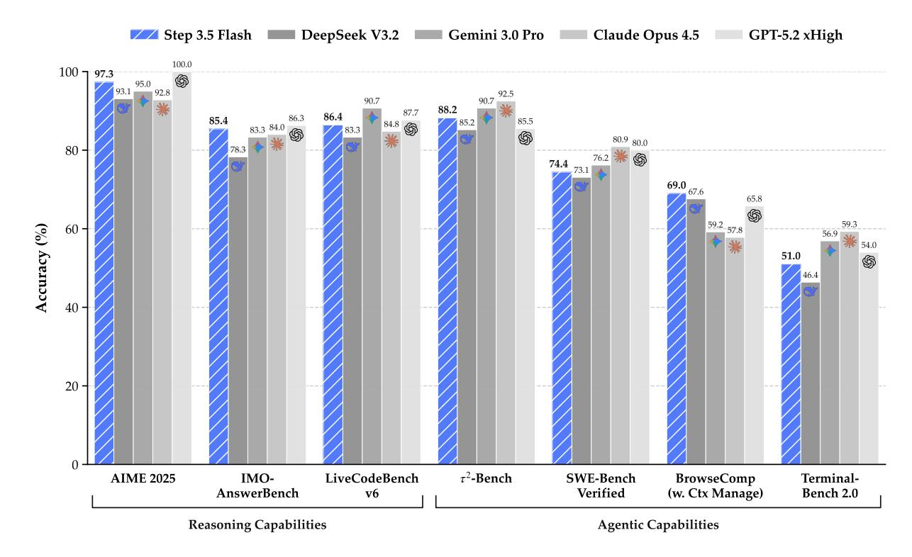
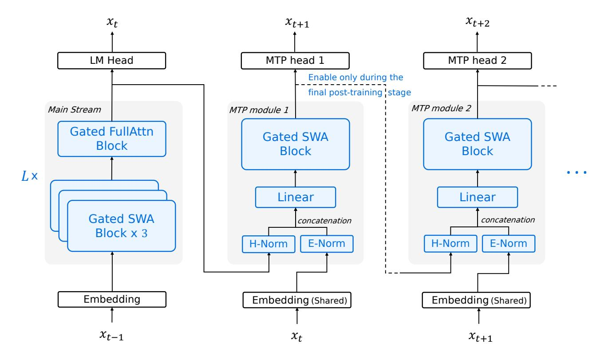
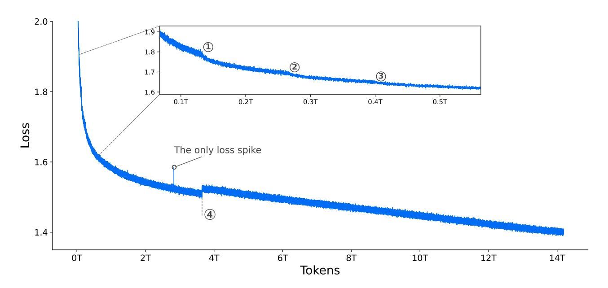
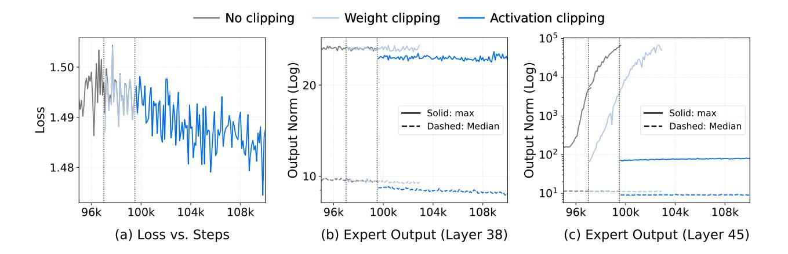
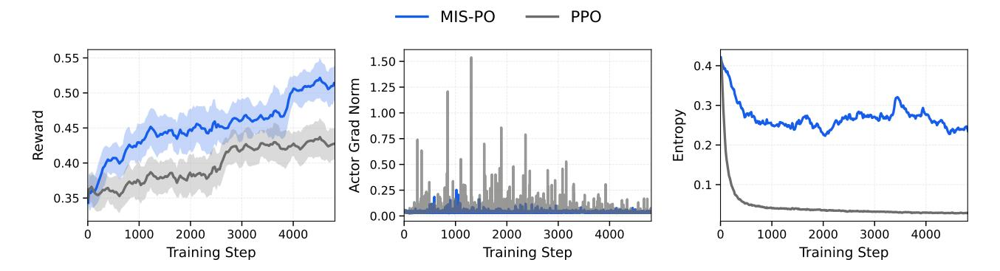
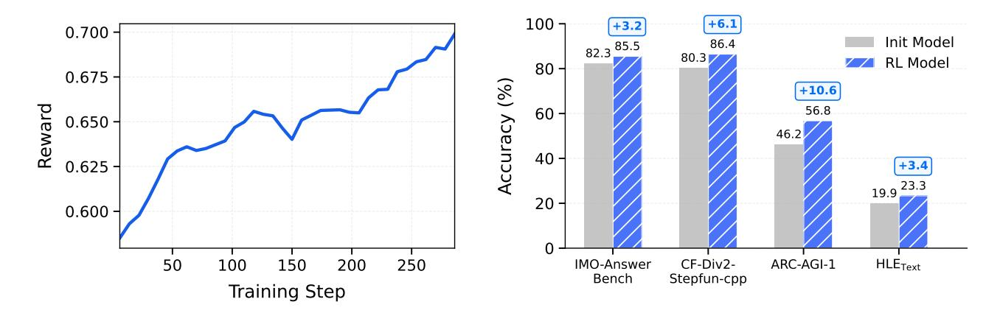

# Step 3.5 Flash: Open Frontier-Level Intelligence with 11B Active Parameters

StepFun Team

🞧 GitHub 😕 HuggingFace 🖵 ModelBlog

#### **Abstract**

We introduce **Step 3.5 Flash**, a sparse Mixture-of-Experts (MoE) model that bridges the gap between frontier-level agentic intelligence and computational efficiency. We focus on what matters most when building agents: reasoning that's sharp, and execution that's fast and reliable. Reflecting these priorities, Step 3.5 Flash pairs a **196B-parameter foundation** for high-fidelity modeling with **11B active parameters** for efficient inference, optimized by interleaved **3:1 Sliding Window/Full Attention** and **Multi-Token Prediction** (MTP-3) to minimize the latency and cost of multi-round agentic interactions. Toward frontier-level intelligence, we design a scalable RL framework that integrates verifiable signals and preference feedback while maintaining stability during large-scale off-policy training to drive consistent self-improvement across mathematics, code, and tool use. Step 3.5 Flash demonstrates strong intelligence across agent, coding, and math tasks, achieving 85.4% on IMO-AnswerBench and 86.4% on LiveCodeBench-v6 (2024.08–2025.05), 88.2% on  $\tau^2$ -Bench, 69.0% on BrowseComp (w. Context Manage), and 51.0% on Terminal-Bench 2.0 —performance on par with frontier models such as GPT-5.2 xHigh and Gemini 3.0 Pro. By redefining the efficiency frontier, Step 3.5 Flash provides a high-density foundation for deploying sophisticated agents in real-world industrial environments.

Figure 1: Step 3.5 Flash achieves frontier-level intelligence with only 11B active parameters (196B MoE), comparable to leading closed and open-source models.

# **Contents**

| 1 |     | Introduction                        |                                                     | 4  |  |  |  |  |  |  |  |  |
|---|-----|-------------------------------------|-----------------------------------------------------|----|--|--|--|--|--|--|--|--|
| 2 |     | Architecture                        |                                                     | 5  |  |  |  |  |  |  |  |  |
|   | 2.1 |                                     | Design Philosophy                                | 5  |  |  |  |  |  |  |  |  |
|   | 2.2 |                                     | Sparse MoE Backbone with Hybrid Attention           | 6  |  |  |  |  |  |  |  |  |
|   | 2.3 |                                     | Architecture Ablations and Results                  | 8  |  |  |  |  |  |  |  |  |
| 3 |     | Infrastructure                      |                                                     | 9  |  |  |  |  |  |  |  |  |
|   | 3.1 |                                     | Compute Cluster                                  | 9  |  |  |  |  |  |  |  |  |
|   | 3.2 |                                     | Training Framework                               | 9  |  |  |  |  |  |  |  |  |
|   | 3.3 |                                     | High-Throughput Lightweight Monitoring           | 10 |  |  |  |  |  |  |  |  |
| 4 |     | Pre-Training and Mid-Training 10 |                                                     |    |  |  |  |  |  |  |  |  |
|   | 4.1 |                                     | Training Stability                               | 11 |  |  |  |  |  |  |  |  |
|   |     | 4.1.1                               | Numerical Sensitivity of Muon                    | 11 |  |  |  |  |  |  |  |  |
|   |     | 4.1.2                               | Expert Collapse Beyond Routing Collapse          | 12 |  |  |  |  |  |  |  |  |
|   |     | 4.1.3                               | Localized Activation Blow-up in MoE Layers          | 12 |  |  |  |  |  |  |  |  |
|   | 4.2 |                                     | Training Curriculum                              | 13 |  |  |  |  |  |  |  |  |
|   |     | 4.2.1                               | Data Mixture                                     | 13 |  |  |  |  |  |  |  |  |
|   |     | 4.2.2                               | Schedule                                            | 14 |  |  |  |  |  |  |  |  |
|   |     | 4.2.3                               | Hyper-Parameters                                 | 15 |  |  |  |  |  |  |  |  |
| 5 |     | Post-Training                       |                                                     | 15 |  |  |  |  |  |  |  |  |
|   | 5.1 |                                     | Expert Model Construction and Self-Distillation  | 15 |  |  |  |  |  |  |  |  |
|   | 5.2 |                                     | Scalable RL                                         | 16 |  |  |  |  |  |  |  |  |
|   |     | 5.2.1                               | MIS-Filtered Policy Optimization (MIS-PO)           | 16 |  |  |  |  |  |  |  |  |
|   |     | 5.2.2                               | Reward System                                    | 18 |  |  |  |  |  |  |  |  |
|   |     | 5.2.3                               | Hyper-Parameters                                 | 19 |  |  |  |  |  |  |  |  |
|   | 5.3 |                                     | Data Synthesis & Curation                           | 19 |  |  |  |  |  |  |  |  |
|   |     | 5.3.1                               | General and Reasoning                            | 19 |  |  |  |  |  |  |  |  |
|   |     | 5.3.2                               | Generalized Tool Learning                        | 20 |  |  |  |  |  |  |  |  |
|   |     | 5.3.3                               | Code Agents                                         | 20 |  |  |  |  |  |  |  |  |

|   |     | 5.3.4 Search and Research Agents                  | 20 |
|---|-----|------------------------------------------------------|----|
|   | 5.4 | Agent Infrastructure                              | 21 |
| 6 |     | Evaluations                                          | 21 |
|   | 6.1 | Pre-training Evaluations                          | 21 |
|   | 6.2 | Post-training Evaluations                         | 23 |
| 7 |     | Limitations                                          | 23 |
| A |     | Architecture Details                                 | 27 |
|   | A.1 | Head-wise Gated Attention                         | 27 |
|   | A.2 | Speed Benchmark of Attention Enhancements         | 28 |
|   | A.3 | Meta Token                                           | 29 |
|   | A.4 | Pre-training Ablations Details                       | 29 |
| B |     | Detail Analysis of Localized Activation Blow-up      | 30 |
| C |     | Step Pre-training Data Foundation                    | 32 |
|   | C.1 | Knowledge Data Construction                       | 32 |
|   | C.2 | Code Data                                         | 33 |
|   | C.3 | Mathematics & STEM Data                           | 34 |
|   | C.4 | Data Infrastructure                               | 35 |
|   | C.5 | Data Ablations Setting                            | 35 |
| D |     | Post Training Details                                | 35 |
|   | D.1 | SFT Details                                          | 35 |
|   | D.2 | RL Details and Ablations                             | 36 |
|   | D.3 | Tool-integrated Reasoning and Parallel Reasoning  | 39 |
| E |     | Detailed Evaluation Protocols and Prompts            | 40 |
|   | E.1 | Evaluation Details of Pre-trained Models          | 40 |
|   | E.2 | Evaluation Details of Post-Trained Models            | 45 |
|   | E.3 | Internal Evaluation - Benchmarks and Methodology     | 52 |

# **1. Introduction**

While open-source large language models (LLMs) [\[1–](#page-54-0)[6\]](#page-54-1) have rapidly narrowed the performance gap with closed-source frontier systems [\[7–](#page-54-2)[9\]](#page-54-3) across verifiable tasks [\[10](#page-54-4)[–12\]](#page-54-5), new challenges emerge as agentic systems gain prominence. In particular, open-source models still trail closed-source frontiers in complex reasoning. Furthermore, critical efficiency bottlenecks hinder their application in long-context agentic tasks [\[13–](#page-54-6)[21\]](#page-55-0), let alone deployment in edge or resource-constrained settings.

In designing the architecture of Step 3.5 Flash, we focus on two core aspects: efficiency and capacity. We adopt a sparse Mixture-of-Experts (MoE) [\[22](#page-55-1)[–26\]](#page-55-2) architecture with 196B total parameters and only 11B activated per token, together with a 3:1 ratio of sliding-window attention (SWA) [\[27\]](#page-55-3) to full attention and multi-token prediction (MTP-3) [\[3,](#page-54-7) [28–](#page-55-4)[30\]](#page-55-5) to reduce long-context latency. To improve capacity under hybrid attention with minimal overhead, we increase the number of query heads in sliding-window attention (SWA) layers from 64 to 96 and use head-wise gated attention [\[31\]](#page-56-0). This design enables large-scale online deployment, sustaining ∼170 tokens/s on Hopper GPUs during the first week on OpenRouter [1](#page-3-1) .

On the pretraining side, we treat stability as a first-class requirement and build a comprehensive observability and diagnostic stack via a lightweight asynchronous metrics server with micro-batchlevel continuous logging. This infrastructure enables systematic identification and mitigation of large-scale MoE failure modes (*e.g.*, Muon-related precision sensitivity, expert collapse [\[32\]](#page-56-1), and activation blow-ups [\[5,](#page-54-8) [33\]](#page-56-2)). Combined with an improved Muon optimizer [\[34\]](#page-56-3) that offers more accurate and stable updates, we achieve stable training over 17.2T high-quality and diverse tokens with only a single transient loss spike. With this stable training regime, Step 3.5 Flash Base achieves competitive performance against larger counterparts, such as DeepSeek-V3.2-Exp Base [\[1\]](#page-54-0) and Kimi-K2-Base [\[5\]](#page-54-8), on math, coding and knowledge benchmarks. Notably, on SimpleQA [\[35\]](#page-56-4), it scores 31.6%, surpassing DeepSeek-V3.2-Exp Base despite using only one-third of the parameters.

Toward frontier-level intelligence, current post-training systems face two tightly coupled challenges: inefficient iteration of domain-specific experts for self-distillation [\[1](#page-54-0)[–4\]](#page-54-9) and limited scalability of Reinforcement Learning (RL) to long-horizon reasoning for MoE models. Training a single generalist to directly cover diverse domains often sacrifices domain-specific expertise, whereas maintaining separate expert models leads to fragmentation and an unsustainable cost of continual multi-model iteration. At the same time, as models are extended to deeper reasoning trajectories, even small token-level discrepancies in off-policy rollouts can accumulate into high-variance gradients. This effect is particularly severe in MoE models, where expert-level routing induces larger distributional shifts and destabilizes optimization in the frontier performance regime [\[1,](#page-54-0) [36–](#page-56-5)[38\]](#page-56-6).

To address these challenges, we propose a unified post-training recipe for large-scale RL built on a shared SFT foundation. The framework alternates between domain-specific specialization and global synthesis, enabling efficient expert iteration while maintaining a single, high-performing generalist. A dedicated mid-training phase scales the context window to 128k and strengthens core agentic and reasoning capabilities via synthetic data, providing a strong initialization for downstream post-training. To support stable and scalable RL within this unified framework, we introduce Metropolis Independence Sampling-Filtered Policy Optimization (MIS-PO) [\[39,](#page-56-7) [40\]](#page-56-8), replacing continuous importance weighting with discrete, distributional filtering at both token and trajectory levels. By restricting optimization to samples within a stable trust region, MIS-PO substantially reduces gradient variance while preserving effective learning signals, enabling RL to scale reliably to long-horizon reasoning and agentic behaviors.

1https://openrouter.ai

Step 3.5 Flash achieves competitive performance with leading frontier models and systems across a broad range of reasoning and agentic benchmarks, despite 11B active parameters. It delivers strong results under standard inference on reasoning tasks, including 85.4% on IMO-AnswerBench [\[41\]](#page-56-9) and 86.4% on LiveCodeBench-v6 (2024.08–2025.05) [\[12\]](#page-54-5), while also demonstrating robust long-horizon, tool-augmented capabilities with 88.2% on 2 -Bench [\[15\]](#page-55-6), 69.0% on BrowseComp (with context management) [\[17\]](#page-55-7), and 51.0% on Terminal-Bench 2.0 [\[16\]](#page-55-8). With PaCoRe [\[42\]](#page-56-10) deep think inference, Step 3.5 Flash further improves performance on reasoning-intensive benchmarks requiring extended deliberation and multi-round synthesis. Taken together, these results indicate that Step 3.5 Flash substantially narrows the gap between advanced open models and frontier proprietary systems in both reasoning and agentic settings.

# **2. Architecture**

#### **2.1. Design Philosophy**

The architecture of Step 3.5 Flash reflects a paradigm shift in model–system co-design. Beyond the traditional objectives of intelligence and cost, the era of autonomous agents elevates a third critical constraint: *inference latency*. In interactive agentic workflows [\[43,](#page-56-11) [44\]](#page-56-12), minimized latency translates directly to reduced wall-clock time for task completion, or conversely, allows for increased intelligence within a fixed time budget via test-time scaling [\[42,](#page-56-10) [45](#page-56-13)[–47\]](#page-56-14).

Agentic workloads typically exhibit a distinct profile: extensive context prefilling followed by prolonged, multi-turn interactive decoding. Accordingly, we co-design Step 3.5 Flash for low wall-clock latency along three coupled axes: *attention* (to accelerate long-context processing and have good affinity with MTP), *sparse MoE* (to prevent stragglers in distributed deployments that reduce throughput), and *multi-token prediction* (MTP; to facilitate fast generation through speculative decoding).

**Attention.** To accelerate prefilling, we employ a hybrid attention mechanism [\[33,](#page-56-2) [48,](#page-57-0) [49\]](#page-57-1) to mitigate the quadratic complexity of long-context processing. For decoding, we prioritize architectural compatibility with speculative decoding [\[50\]](#page-57-2), since verification efficiency is the dominant lever on bandwidth-bound hardware. These considerations motivate two attention design decisions:

- *Sliding-Window Attention (SWA).* We select SWA [\[27\]](#page-55-3) over linear attention [\[10,](#page-54-4) [51\]](#page-57-3) to maximize decoding efficiency. Although both have linear complexity, the state-update mechanism of linear attention complicates efficient draft tree generation and parallel tree verification needed for speculative decoding [\[52–](#page-57-4)[54\]](#page-57-5). In contrast, SWA preserves standard attention semantics and remains inherently amenable to parallel verification via masking. Moreover, in the absence of robust empirical evidence that linear attention yields superior long-context modeling for agentic tasks, we find that SWA with window size =512 strikes a favorable balance between kernel efficiency and capturing local dependencies.
- *Hardware-Aligned Grouped-Query Attention (GQA-8).* Targeting deployment on standard 8-GPU server nodes, we configure the model with eight heads (GQA-8) [\[55\]](#page-57-6). This aligns cache sharding with 8-way tensor parallelism and improves memory access patterns. Crucially, while GQA-8 makes attention more memory-bandwidth bound, it also creates computational slack that can absorb speculative drafting and verification overhead, enabling aggressive multitoken speculation without a proportional latency penalty.

**Sparse MoE.** On the feed-forward side, we employ fine-grained MoE [\[22–](#page-55-1)[26\]](#page-55-2) to reduce the average FFN compute while maintaining capacity. Expert parallelism (EP) [\[25\]](#page-55-9) is utilized to enable scalable

Figure 2: Illustration of Step 3.5 Flash. The model uses head-wise gated attention [31] with a leading Full Attention layer followed by L = 11 Hybrid Blocks, each interleaving 3 Sliding Window Attention (SWA) layers with one Full Attention layer (for visual clarity, the first layer is omitted in the figure). We apply zero-centered RMSNorm [57] throughout. The first three blocks use dense FFNs; later blocks employ sparse MoE FFNs. MTP modules use SWA and dense FFNs. To limit overhead, only MTP module 1 is trained during main training; MTP modules 2–3 are cloned from it and jointly fine-tuned in a lightweight final phase.

deployment. However, under EP, end-to-end latency can be dominated by *stragglers* induced by routing imbalance: token assignment skew concentrates workload on a small subset of experts and their hosting GPUs, throttling throughput at synchronization points. We therefore introduce an *EP-Group Balanced MoE Routing* strategy.

**Multi-Token Prediction (MTP).** To further reduce autoregressive latency, we incorporate Multi-Token Prediction (MTP) [29, 56] as a complementary lever to speculative decoding [50]. To keep speculation lightweight, we streamline the MTP heads by leveraging SWA and dense FFNs [3].

We further constrain the model size to under 200B parameters, enabling high-performance inference within the 128GB memory budget of high-end workstations.

#### 2.2. Sparse MoE Backbone with Hybrid Attention

As illustrated in Figure 2, Step 3.5 Flash adopts a 45-layer sparse-MoE Transformer backbone (3 dense layers and 42 MoE layers) paired with a specialized hybrid attention layer layout. Each MoE layer contains 288 routed experts plus one shared expert, with a top-k router activating k=8 experts per token. This configuration maintains an extensive knowledge capacity (196B total parameters) while restricting per-token activation to just 11B, ensuring inference latency remains low enough for highly

responsive agent interaction. Table [6](#page-26-2) summarizes key architecture hyperparameters of Step 3.5 Flash.

**Hybrid Attention Layer Layout.** To balance long-context efficiency with robust long-range connectivity, Step 3.5 Flash leverages an interleaved attention layout at a 3 : 1 ratio (SWA : Full) inspired by [\[33,](#page-56-2) [49,](#page-57-1) [58\]](#page-57-9), denoted as 31. This configuration repeats a four-layer motif consisting of three SWA layers (=512) followed by a single full GQA-8 layer. However, in our initial experiments, a naive interleaving strategy consistently underperforms a dense attention baseline across various benchmarks (Table [10\)](#page-30-0). To bridge this performance gap without adding practical overheads, we leverage two complementary enhancements: (i) an increased SWA query-head count, and (ii) adopting head-wise gated attention [\[31\]](#page-56-0).

**Augmented Query Heads in SWA.** Using a higher query-head number (from 64 to 96) effectively mitigates performance drop typically observed when transitioning from a uniform full-attention architecture to the 31 layout (Table [10\)](#page-30-0). We consider this to be nearly a "free lunch". Because in long-text scenarios, the overhead of naive SWA is very small, even though our solution scales up significantly.

**Head-wise Gated Attention.** A limitation of naive SWA is its inability to effectively absorb unused attention weights when there is no useful information in the input window [\[31,](#page-56-0) [59–](#page-57-10)[61\]](#page-57-11). Previous work [\[3,](#page-54-7) [33\]](#page-56-2) introduce learnable, data-independent sink tokens into the window to address this issue. Instead, we opt for a different approach by integrating a parameter-efficient head-wise gating mechanism [\[31,](#page-56-0)[62,](#page-57-12)[63\]](#page-58-0), which can be viewed as integrating data-dependent sink tokens. Please refer to Appendix [A.1](#page-26-1) for implementation details and further discussion. Head-wise gating is also negligible to both theoretical FLOPs and practical latency. We report more performance analysis and benchmarks for gating and augmenting the number of SWA heads in Appendix [A.2.](#page-27-0)

**MoE Expert-parallel Load Balancing.** We use loss-free load-balancing [\[29,](#page-55-10) [64\]](#page-58-1) to encourage *global* token balance across experts. However, this approach does not guarantee balanced loads across EP ranks at the micro-batch level, potentially leading to stragglers and reduced throughput. We therefore introduce an EP-level balancing loss that explicitly promotes uniform rank-level utilization [\[26\]](#page-55-2).

EP partitions experts E into disjoint groups {E } =1 across ranks. For token , let denote the top experts (mask , = **1**[ ∈ ]) and ,· the routing probabilities. Then, the EP load balancing loss L is:

$$p_{e} = \frac{1}{T} \sum_{t=1}^{T} p_{t,e}, \quad f_{e} = \frac{1}{TK} \sum_{t=1}^{T} s_{t,e}, \quad p_{g} = \sum_{e \in \mathcal{E}_{g}} p_{e}, \quad f_{g} = \sum_{e \in \mathcal{E}_{g}} f_{e}, \quad \mathcal{L}_{EP} = G \sum_{g=1}^{G} f_{g} p_{g}.$$
(1)

**Multi-token Prediction (MTP).** To speedup speculative decoding on long-context agentic workloads, we attach three lightweight multi-token prediction (MTP) heads. Each MTP head consists of a SWA and a dense FFN, adding only 0.81B parameters (∼0.41%). We index these heads by their *additional* prediction offset beyond the standard LM head: for ℎ ∈ {1, 2, 3}, MTP-ℎ predicts the token +1+ℎ conditioned on the backbone hidden states at position . To control training overhead, we activate and optimize only MTP-1 in most training stages. Once the backbone is well-trained, we initialize MTP-2 and MTP-3 from MTP-1 and jointly train all MTP heads in a lightweight post-training phase. Inspired by Fast-MTP [\[65\]](#page-58-2), we adopt position-dependent loss reweighting across prediction offsets in MTP heads to prevent over-optimizing for distant-token predictions.

| Layout    | SWA   | Rel. FLOPs       | Pre-train |           |      |      |      | Downstream Performance |         |      |
|-----------|-------|------------------|-----------|-----------|------|------|------|------------------------|---------|------|
|           | Heads | Decode / Prefill | Avg.      | Reasoning | Math | Code | Sci  | General                | LongCtx | Avg. |
| 𝐹𝐹𝐹𝐹      | 32    | ∼2.68 / 2.90     | 54.1      | 40.8      | 40.9 | 19.6 | 42.7 | 26.5                   | 28.8    | 33.2 |
| 𝑆1𝐹1      | 32    | ∼1.58 / 1.65     | 54.6      | 42.1      | 42.3 | 19.3 | 44.5 | 26.8                   | 29.6    | 34.1 |
| 𝑆3𝐹1      | 32    | 1.00 / 1.00      | 53.6      | 40.2      | 40.4 | 18.9 | 42.4 | 25.4                   | 27.5    | 32.5 |
| 𝑆3𝐹1+Head | 48    | ∼1.01 / 1.02     | 55.7      | 40.6      | 40.3 | 18.3 | 44.0 | 26.0                   | 28.2    | 32.9 |

Table 1: Downstream results on 30B-A3B. denotes full attention and denotes SWA. 31 indicates three layers followed by one layer in the hybrid layout. Rel. FLOPs are normalized to the 31 configuration and averaged over 64k/256k contexts (Table [8\)](#page-27-2). Pre-train Avg. aggregates results across general, math, and code benchmarks (Table [16\)](#page-48-0).

## **2.3. Architecture Ablations and Results**

We conduct extensive experiments to validate key design choices in Step 3.5 Flash, focusing on (i) attention layouts, including SWA and head scaling, and (ii) head-wise gated attention versus sink tokens. To ensure our efficiency optimizations do not degrade model performance, we adopt two complementary ablation protocols: one evaluates full end-to-end pipelines covering pre-training, 32k long-context extension, and 64k context-length supervised fine-tuning (SFT), and the other scales the analysis up to 100B parameters to study how these design choices behave with scale. Detailed architecture and evaluation setups for all tables are provided in Appendix [A.4.](#page-28-0) Key findings from these large-scale experiments are summarized below.

**SWA w.r.t. Long Context.** We train a 30B-A3B model through the full pipeline (1.4T-token pretraining followed by SFT) to evaluate the end-to-end impact of hybrid attention on reasoning and long-context performance. We ablate four attention layouts: all-full attention (), alternating SWA/full (11), a 3:1 SWA-to-full layout (31), and an 31 variant with increased SWA query heads (31+Head). To isolate attention-structure effects, we fix the SWA window size to =512 and disable MTP (see Appendix, Table [9](#page-29-1) and Table [10\)](#page-30-0).

Table [1](#page-7-0) shows a clear cost–quality trade-off across layouts. 31 achieves the lowest normalized attention-side FLOPs (normalized to 1.00 for prefill and 1.00 for decode separately), whereas is ∼2.68×/2.90× as expensive as 31; however, 31 exhibits a consistent quality degradation (*e.g.*, LongCtx drops from 28.8 to 27.5).

Increasing the number of SWA query heads largely compensates for this loss. Notably, 31+Head already surpasses during pretraining (55.7 vs. 54.1), and remains competitive after post-training: LongCtx improves from 27.5 to 28.2 and Sci from 42.4 to 44.0, closing most of the gap to the baseline with negligible additional attention cost. The remaining downside is limited and localized (*e.g.*, a modest drop on Code to 18.3), while overall quality trends favor 31+Head.

Interestingly, the alternating 11 layout delivers the best overall SFT quality and the strongest LongCtx score (29.6), but requires substantially higher attention-side prefill/decode FLOPs (∼1.58/1.65), about a 60% cost increase relative to 31+Head. We therefore adopt 31+Head as the default configuration for long-context agentic workloads, prioritizing its much lower prefill/decode cost with strong and stable long-context performance.

**Head-wise Gated Attention vs. Sink Tokens.** We conduct scaled, controlled pretraining experiments on a 100B-A10B MoE to study attention-side mechanisms under realistic scaling conditions.

| Method         | BBH  | MMLU | GPQA | MBPP | C-EVAL | CMMLU | Avg. |
|----------------|------|------|------|------|--------|-------|------|
| Sink Token     | 70.6 | 65.1 | 27.2 | 61.2 | 76.2   | 74.6  | 62.5 |
| Head-wise Gate | 73.7 | 67.0 | 28.1 | 62.6 | 77.9   | 77.1  | 64.4 |

Table 2: Pretraining-only evaluation on a 100B-A10B model under the 31 layout. Head-wise gating consistently outperforms a fixed sink token across benchmarks, including the overall average.

Specifically, we compare *sink tokens* and *head-wise gated attention* while holding the attention layout fixed to the same 31 configuration with window size =512. As shown in Table [2,](#page-8-3) head-wise gating consistently improves quality, raising the average performance from 62.46 to 64.43 (+1.97). We therefore adopt head-wise gated attention as the default mechanism in subsequent studies.

# **3. Infrastructure**

#### **3.1. Compute Cluster**

Step 3.5 Flash is trained on a large-scale cluster with 4,096 NVIDIA H800 GPUs. Each node contains 8 GPUs interconnected through NVLink and NVSwitch for high-bandwidth intra-node communication. For inter-node connectivity, the cluster relies on 8×200 Gbps RoCE links to maintain efficient synchronization and data exchange at scale.

#### **3.2. Training Framework**

The training of Step 3.5 Flash is powered by our internal *Steptron* framework, a lightweight highperformance system built on top of PyTorch [\[66\]](#page-58-3) and Megatron-LM [\[67\]](#page-58-4). Steptron unifies the full model development pipeline, supporting large-scale pre-training, post-training, and reinforcement learning (RL) workloads under a single engineering stack.

Step 3.5 Flash employs a hybrid parallelization strategy, including 8-way pipeline parallelism (PP) [\[68\]](#page-58-5) with virtual pipeline stages (VPP), and 8-way expert parallelism (EP) [\[25\]](#page-55-9), and ZeRO-1 Data Parallelism (DP) [\[69\]](#page-58-6). In order to facilitate efficient training of Step 3.5 Flash, we employ the following engineering techniques.

**Decoupled Parallelism.** Following Megatron-Core [\[70\]](#page-58-7), we implement a decoupled parallelization scheme that allows the attention and MoE modules to use different parallelization strategies. We assign them independent parallel groups and perform gradient reduction and scaling within each module's corresponding data-parallel group.

**Communication Optimization.** Concurrent DP communication streams for decoupled attention and MoE can saturate RoCE links, incurring considerable increases in DP overheads due to congestion. To address this, we propose two complementary communication optimizations that jointly reduce iteration time by up to 5%. First, *fabric-aware communication scheduling* partitions DP traffic into intra-node NVLink and inter-node RoCE phases, and pipelines them to fully utilize both fabrics. Second, *communication-aware rank placement* uses job-level communication profiles to place ranks across switches, reducing hop counts and steering heavy traffic away from inter-switch hotspots.

**Muon ZeRO-1 Resharding.** Muon [\[34\]](#page-56-3) requires full (unsharded) per-parameter gradients for Newton–Schulz orthogonalization, which conflicts with ZeRO-1 [\[69\]](#page-58-6) reduce-scatter that shards a parameter's gradient across DP ranks. The current implementation in Megatron-LM resolves this mismatch by naively all-reducing FP32 gradients to reconstruct full gradients prior to the Muon update but nearly doubles communication. We instead assign whole parameters to DP ranks and repack the gradients buffer into a rank-major buffer so a single reduce-scatter delivers each parameter's complete gradient to its owner. Since padding to the fattest rank incurs overhead that grows with the data-parallel size, we apply this only to expert parameters and use DP all-reduce for non-expert parameters. This hybrid strategy reduces end-to-end iteration time by approximately 5% with less than 4 GB additional memory compared to the naive all-reduce baseline.

**GPU Kernels Optimization.** We also apply kernel-level optimizations to improve training efficiency. In attention, we fuse QK normalization with RoPE. In MoE, we fuse multiple small operators to reduce kernel-launch overhead and memory traffic, and implement a fused MoE gather/scatter with grouped GEMM, similar to SonicMoE [\[71\]](#page-58-8).

**Fine-grained Selective Checkpointing.** Our training framework supports fine-grained activation recomputation with per-layer, submodule-level toggles (*e.g.*, attention, FFN, normalization, SiLU, and MoE permutation), enabling selective recomputation of only the most memory-intensive components to reduce peak memory with minimal overhead.

## **3.3. High-Throughput Lightweight Monitoring**

We collect a comprehensive suite of metrics (e.g., expert distribution within each micro-batch and gradient norms) for fine-grained monitoring of the training. However, the telemetry scale is immense: a 4,096-GPU workload generates nearly 6 million messages per iteration. Conducting a synchronous global reduction within the main loop would introduce a significant overhead of several seconds, effectively doubling the iteration time, which is clearly intolerable for high-performance training. To mitigate this, we develop a Lightweight Metrics Server to decouple telemetry processing from the training path. Each rank utilizes *StepRPC*, an in-house asynchronous communication framework, to asynchronously offload local metrics to the remote server. This approach reduces telemetry overhead to approximately 100 ms per iteration.

The Metrics Server buffers incoming metrics and triggers reduction and database persistence only after receiving *end-of-iteration* signals from all participating ranks, eliminating synchronization in the main loop. To ingest and process millions of messages with low latency, the server is implemented as a highconcurrency multi-process system with two decoupled modules: (i) a Message Receiver optimized for high-throughput ingestion, and (ii) a Reduction Processor responsible for aggregation and persistence. By exploiting multi-core parallelism within and across these modules, the server keeps pace with the telemetry stream and ensures that metrics management never lags behind training.

# **4. Pre-Training and Mid-Training**

**Overview.** This section summarizes our pre-training and mid-training process, with an emphasis on the practical stability constraints of large-scale sparse MoE training. We first describe training stability diagnostics and mitigations (Section [4.1\)](#page-9-2), then detail the curriculum used for pre-training and mid-training, including the data mixture, schedule, and key hyper-parameters (Section [4.2\)](#page-12-0).

Figure 3: Per-step training loss of Step 3.5 Flash, plotted **without smoothing or sub-sampling**. We observe merely **one** isolated loss spike across the full training duration. The initial training steps are omitted for clarity. Markers ①—③ indicate batch size increases to 8,192, 12,288, and 16,384, respectively. Marker ④ denotes the activation of the loss mask on meta tokens (see Appendix A.3 for details).

#### 4.1. Training Stability

Training stability is a **first-class** requirement for large-scale sparse MoE pre-training. To make stability actionable, we build a comprehensive observability and diagnostic stack based on a lightweight asynchronous metrics server with micro-batch-level continuous logging (described in Section 3.3). This infrastructure provides fine-grained visibility into both optimizer-level and expert-level signals, enabling systematic mitigation of recurring failure modes in large-scale MoE training.

In practice, we find three dominant instabilities that the metrics stack helps surface early and localize precisely: (i) transient loss spikes and occasional stochastic numerical blow-ups caused by Muon's [34] numerically sensitive polar-factor iteration under reduced precision, (ii) expert-side collapse ("dead experts") that can occur even when router dispatch statistics remain apparently healthy, and (iii) localized activation blow-ups confined to a small subset of experts.

With the mitigations guided by these diagnostics, the pre-training loss remains smooth throughout the run, exhibiting only a single loss spike. Figure 3 shows the full curve prior to learning-rate cooldown.

#### 4.1.1. Numerical Sensitivity of Muon

Muon approximates a semi-orthogonal update direction via a Newton–Schulz (NS) iteration [72]. In early experiments, we find modest, consistent loss reduction when using a faster-converging orthogonalization approximation. We therefore adopt the Polar Express [73] iteration and run a fixed T=6 steps to balance optimization quality and throughput.

However, we occasionally observe sharp, unrecoverable loss spikes despite using the recommended safety scaling [73]. The spikes are non-deterministic (often avoided by resuming from a nearby checkpoint), suggesting a numerical pathology. Simulations indicate that bfloat16 Polar Express can rarely yield extreme intermediate outliers under certain update statistics due to cumulative error in addition. We therefore cast **only** the Polar Express iteration (state and intermediates) to float16

while keeping the rest of the training mixed-precision. After this change, the spikes do not recur.

#### *4.1.2. Expert Collapse Beyond Routing Collapse*

Step-3 [\[32\]](#page-56-1), our prior work, reports that MoE training may exhibit "dead experts", often described as experts receiving negligible token dispatch for extended periods and therefore obtaining little effective gradient signal. In our prior investigation, we find that expert collapse can also manifest as an *expert-side* pathology even when router dispatch remains stable, *i.e.*, vanishing expert activations and stagnant or decaying expert parameter norms.

We observe that two factors are particularly influential: (i) Routed-expert aggregation requires explicit scaling. When incorporating a shared expert, it is important to introduce an explicit scaling factor to calibrate the relative contribution of the shared expert and the routed experts. While smaller models may implicitly learn such a balance, larger models are less reliable at self-calibration. A mismatch can suppress the effective contribution of routed experts even if routing frequencies appear healthy. (ii) Micro-batch balancing can be overly restrictive under fine-grained sparsity. For sparse, fine-grained MoE designs, micro-batch-level load-balancing constraints (as commonly implemented in Switch-style routing [\[22\]](#page-55-1)) can become overly stringent. As analyzed in [\[74\]](#page-58-11), micro-batch LBL may induce excessive cross-expert competition and hinder effective specialization.

We therefore prefer broader-scope balancing (*e.g.*, global-batch statistics) [\[74,](#page-58-11) [75\]](#page-58-12) or loss-free bias adjustment based on observed load [\[29,](#page-55-10) [64\]](#page-58-1). In practice, router dispatch statistics are typically stable and are not sensitive indicators of expert collapse. We recommend monitoring expert-side signals, including per-expert activation norms (*e.g.*, RMS/mean norm at the MoE FFN intermediate) and parameter norms (*e.g.*, Frobenius norms of expert projection matrices). When a subset of experts drifts toward near-zero activations/updates while the median remains stable (*e.g.*, decreasing min-to-median ratios), it provides an early warning of expert "death".

#### *4.1.3. Localized Activation Blow-up in MoE Layers*

As expert specialization matures during the main training phase, we observe a localized stability pathology in the deeper MoE layers. Specifically, the activation **norm** of a small subset of experts (often just one or two per layer) grows rapidly, while the majority of experts in the same layer remain well-behaved. This disparity results in a heavy-tailed activation distribution: the median expert activation norm remain stable, but the maximum activation norm explodes, significantly increasing the risk of numerical overflow and downstream instability.

Figure [4](#page-12-2) illustrates this failure mode. **Remarkably, this internal instability is entirely masked by the training loss**, which shows negligible variation despite the underlying explosion in norms shown in Panel (a). We track this phenomenon by monitoring the dispersion of per-expert FFN output norms. As observed in Panels (b) and (c), while the middle layers (*e.g.*, Layer 38) retain stable distributions, the final layers (*i.e.*, Layer 45) exhibit a rapidly widening gap between the maximum (solid lines) and the median (dashed lines). This indicates that activation energy is concentrating dangerously in a few "rogue" experts in the deeper network. To mitigate this, we evaluate two distinct interventions:

- Weight clipping on expert projections: We constrain the norm of the MoE FFN expert projection matrices. For each expert projection matrix , if its maximum activation norm max ∥∥ exceeds a threshold , we rescale it via ← · max ∥ ∥ . This is similar to MuonClip in attention [\[5\]](#page-54-8), but we perform clipping offline on the checkpoint rather than on-the-fly.
- Activation clipping inside experts: We apply element-wise clipping directly to the MoE FFN intermediate activations prior to the output projection, as in [\[33\]](#page-56-2).

Figure 4: Analysis of expert activation stability and mitigation strategies. In Panels (b)–(c), solid lines represent the maximum expert output norm, while dashed lines represent the median. (1) Depth-Dependent Instability: While training loss appears identical across methods (Panel a) and middle layers remain stable (e.g., Layer 38 in Panel b), the final layers (i.e., Layer 45 in Panel c) suffer from catastrophic norm explosion in the *No clipping* baseline. (2) Mitigation: *Weight clipping* merely delays this explosion. In contrast, *Activation clipping* effectively bounds maximum norms, ensuring stability across all layers.

Although the training loss appears indistinguishable across different mitigation strategies in Figure 4 (a), the max-to-median ratio reliably unmasks underlying instability. As evidenced in Panels (b) and (c), activation clipping ensures a stable trajectory for internal norms, whereas weight clipping alone fails to prevent the recurrence of outlier experts. Consequently, we establish the max-to-median ratio of per-expert activation norms as a robust and necessary metric for monitoring training stability.

The activation blow-up is driven by several factors. We observe that high-frequency bi-grams can trigger expert specialization. When using pre-norm [76,77], a single expert can amplify its output boundlessly and dominate the final output norm, leading to near-deterministic prediction behavior. This risk is exacerbated by SwiGLU [78], where strong alignment between the gate and up-projection branches produces sparse activations with extreme magnitudes. Muon further accelerates this collapse by amplifying persistent low-rank updates. A detailed analysis is provided in Appendix B.

#### 4.2. Training Curriculum

The training proceeds from broad open-domain coverage to increasingly agentic and long-context specialization. We first pre-train at 4k context on a broad open-domain mixture to establish general-purpose capabilities, then anneal the mixture toward higher-quality knowledge and more software-development data (code, PRs, issues, and commits) while extending the context window to 32k. Next, a dedicated mid-training stage expands the context window from 32k to 128k to strengthen long-horizon reasoning and improve initialization for downstream post-training and agentic workloads. Overall, we train on approximately 17.6T tokens for pre-training and 750B tokens for mid-training.

#### 4.2.1. Data Mixture

Our corpus combines general open-domain data with agentic-oriented data. We summarize the key sources below, more details can be refered in Appendix C.

**General Knowledge Data.** To support broad world knowledge, we build **StepCrawl** (Appendix [C.1.1\)](#page-31-2), an in-house crawling and curation infrastructure beyond standard Common Crawl [\[79\]](#page-59-3), to harvest trillions of high-quality tokens at scale from web pages (HTML) and book-/document-like sources (ePub/PDF). All content is processed with multi-stage quality filtering, site/category tagging, deduplication, and sanitization.

**Code Data.** Strong code capacity is foundational for agentic models. Our code corpus is curated and refined using a modified OpenCoder [\[80\]](#page-59-4) pipeline. We relax filtering from a zero-tolerance policy to allowing 0–6 heuristic violations (Appendix [C.2.1\)](#page-32-1) per document, balancing quality and diversity, and upsample code-centric data during annealing and mid-training to strengthen agent-related programming.

**PR/Issue/Commit Data.** To better match real software-engineering workflows, we curate a comprehensive PR/Issue/Commit dataset(Appendix [C.2.2\)](#page-32-2) from GitHub repositories with 10+ stars. This includes (1) Base Data validated against git diff (deduplicated against benchmarks [\[14,](#page-54-10) [81\]](#page-59-5)); (2) PR-Dialogue Data derived from PR threads and commits using Agentless-style templates [\[82\]](#page-59-6) for file localization and code repair; and (3) derivative software-engineering corpora used in mid-training and post-training.

**Tool-Use and Reasoning Data.** To improve tool-use robustness and multi-step reasoning, we add synthetic and semi-synthetic data spanning math/code/science/general knowledge, and domainspecific samples targeting search agent, SWE agent, and tool execution. During mid-training, we further introduce long-context samples (natural long documents and long-form synthetic tasks) to reinforce planning and reasoning over extended contexts.

# *4.2.2. Schedule*

**Pre-training schedule.** Pre-training consists of two stages:

- 1. **Pre-training Stage 1: Open-domain pre-training** (14.6T tokens, 4k context). Broad open-domain training to maximize coverage and foundational capability.
- 2. **Pre-training Stage 2: Annealing + long-context initialization** (3T tokens, 4k to 32k context). We anneal the data mixture toward code and PR/Issue/Commit-centric sources, while increasing the share of higher-quality knowledge and reasoning-dense samples. This stage starts with 2T tokens at 4k context, then transitions to 1T tokens at 32k context under the same annealed mixture to initialize long-context training.

**Mid-training schedule.** Mid-training also consists of two stages:

- 1. **Mid-training Stage 1: Specialization at 32k** (386B tokens, 32k context). We replay 81B tokens (21%) from pre-training to mitigate distribution shift and stabilize specialization, while emphasizing software-engineer and tool-use-centric mixtures.
- 2. **Mid-training Stage 2: Long-context specialization** (364B tokens, 128k context). We retain 10.5B replay tokens, and further specialize long-context capability with a mixture of synthetic longhorizon reasoning and natural long documents (selected from pre-training data with length > 32k), plus domain-specific data for code agent, search agent, and tool-use.

#### 4.2.3. Hyper-Parameters

**Pre-training hyper-parameters.** We use the Muon optimizer [34] throughout pre-training, set weight decay to 0.1 and gradeint clip to 1.0. The learning rate is linearly warmed up from 0 to  $2.5 \times 10^{-4}$  over the first 2,000 steps and then cosine-decayed to  $5 \times 10^{-5}$  over Pre-training Stage 1. In Pre-training Stage 2, we apply a secondary cosine decay from  $5 \times 10^{-5}$  to  $2 \times 10^{-5}$  over the 4k portion (2T tokens) and keep the learning rate fixed at  $2 \times 10^{-5}$  for the 32k portion (1T tokens). The global batch size gradually increases from 4096 to 16384 over the first 400B tokens, and keeps 16384 in the remaining training, and is set to 2k for the 32k portion of annealing. The MTP loss weight is set to 0.3 in Pre-training Stage 1 and 0.1 in Pre-training Stage 2, following [29]. For loss-free load balancing, the bias update rate is 0.001 for the first 14.6T tokens and decays to 0.0 during annealing, and an EP-group balance loss with coefficient 0.001 is applied throughout pre-training. For RoPE [83], we use  $\theta = 10,000$  for both full attention and sliding window attention (SWA) during 4k training, and set  $\theta_{\rm Full} = 1,000,000$  only for full attention and maintain  $\theta_{\rm SWA} = 10,000$  for the 32k portion of annealing.

**Mid-training hyper-parameters.** We continue to use Muon [34] during mid-training. We freeze the MoE router weights and disable the EP-group balance loss and fix the MTP loss weight to 0.1 for both mid-training stages. The learning rate is warmed up from 0 to  $2 \times 10^{-5}$  over the first 3% of iterations, kept constant in Mid-training Stage 1, and decayed to  $7.3 \times 10^{-6}$  in Mid-training Stage 2. For RoPE selective scaling, we set  $\theta_{\text{Full}} = 1,000,000$  at 32k (Mid-training Stage 1) and increase to  $\theta_{\text{Full}} = 5,000,000$  at 128k (Mid-training Stage 2), while keeping  $\theta_{\text{SWA}} = 10,000$  throughout mid-training [84].

## 5. Post-Training

In this section, we introduce a unified post-training recipe for large-scale Reinforcement Learning (RL), which begins with a unified Supervised Fine-Tuning (SFT) model. This framework enables consistent self-improvement by combining verifiable reward signals with human preference feedback, while maintaining stability even during large-scale off-policy training for Mixture-of-Experts (MoE) models. The process follows a two-phase approach similar to prior works [2,85]. First, we construct **Expert Models** by enhancing the unified SFT baseline with domain-specific RL across Math, Code, STEM, Tool-use, Long Context Understanding, Human Preference, and Agentic Reasoning. These specialized experts are then distilled into a generalist model using **Self-Distillation** and **Scalable RL**, ensuring the final model remains competitive with specialized baselines across diverse tasks. By systematically alternating between targeted specialization and broad synthesis, we achieve robust generalization without compromising expert-level performance.

#### 5.1. Expert Model Construction and Self-Distillation

We employ a two-stage SFT pipeline to build a robust foundation for subsequent RL. The first stage executes large-scale multi-domain SFT spanning Math, Code, STEM, Logic, General QA, Code Agent, Tool-use, Search Agent, and Long Context Understanding. Difficulty-aware filtering and strategic balancing are applied to foster broad agentic behaviors. The second stage explicitly maximizes reasoning density by injecting out-of-distribution (OOD) signals [46,86], comprising ~30k expert-level chemistry trajectories and synthetic arithmetic tasks. This targeted exposure to distinct reasoning patterns unlocks latent capabilities within just three epochs, equipping the model with the sophisticated structural complexity necessary to initialize the subsequent domain-specific RL phase.

Following domain-specific RL, we consolidate the divergent expert capabilities into a unified student model, initialized from the mid-train checkpoint. In this phase, the expert models generate high-

Figure 5: Scalability comparison between MIS-PO and PPO on our internal model. (1) Efficiency: MIS-PO demonstrates superior sample efficiency, achieving higher reward plateaus with an accelerated convergence trend. (2) Stability: MIS-PO significantly stabilizes training dynamics by suppressing gradient noise and eliminating the large spikes in the policy gradient norm. (3) Exploration Persistence: MIS-PO exhibits slower entropy decay, enabling a better exploration—exploitation balance.

quality trajectories using a prompt distribution shared with the first-stage SFT corpus, offering a more stable and efficient alternative to direct RL integration. This approach employs rejection sampling to eliminate undesirable patterns such as language mixing or overthinking, centralizing expert knowledge into a single student model. By establishing this high-quality foundation, self-distillation significantly reduces the optimization burden on subsequent RL stages.

**Hyper-Parameters.** The Muon optimizer [34] is employed with a 3% warmup and a cosine decay from  $1.0 \times 10^{-5}$  to  $5.0 \times 10^{-6}$ . We freeze the MoE router weights and disable the EP-group balance loss similar to mid-training. The SFT training is executed with an MTP loss weight of 0.1, a global batch size of 32, and a global sequence length of 128k. Regarding Rotary Position Embeddings (RoPE) [83], we maintain  $\theta_{SWA} = 10,000$  and adjust  $\theta_{Full} = 5,000,000$  to accommodate the 128k context length [84].

#### 5.2. Scalable RL

In RL for LLMs, we optimize a policy  $\pi_{\theta}$  to maximize terminal rewards over trajectories  $\tau = (s_0, a_0, \ldots, s_T)$ , where  $a_t$  denotes the token generated at state  $s_t$ . For reasoning tasks, however, this process faces severe instability arising from high gradient variance, further amplified by extremely long horizons and model scale (Figure 5 (2)). This variance primarily from **infrastructure divergence** between high-throughput inference engines and training frameworks, as well as the **off-policy misalignment** inherent to iterative updates. In such settings, importance sampling is inherently unstable, as minor token-level probability shifts compound into noisy gradients that impede convergence.

#### 5.2.1. MIS-Filtered Policy Optimization (MIS-PO)

To address these stability challenges, we propose MIS-PO, a method inspired by Metropolis Independence Sampling (MIS) [39,40]. We treat the inference policy as a proposal distribution and the training policy as the target, restricting updates to samples that remain sufficiently close to the target distribution. Unlike importance sampling, which scales gradients by bounded ratios and often suffers from high variance, MIS-PO applies binary masking to filter off-distribution samples and treats retained trajectories as effectively on-policy, resulting in significantly reduced gradient variance and stable optimization.

Formally, we define a binary indicator function  $\mathbb{I}(x) = \mathbb{I}[\rho_{\min} \le x \le \rho_{\max}]$  and apply it at two distinct granularities. At the **token level**, the function filters the probability ratio  $x_t = \pi_{\theta_{\text{old}}}(a_t|s_t)/\pi_{\theta_{\text{vilm}}}(a_t|s_t)$  to suppress localized mismatches between the training and inference policies [37]. At the **trajectory level**, we apply the same indicator to the geometric mean ratio  $\bar{\rho}(\tau) = (\prod_t x_t)^{\frac{1}{T}}$ , effectively discarding entire trajectories that have drifted significantly from the target distribution. The reformulated actor loss replaces continuous importance weights with these dual-level discrete masks:

$$\mathcal{L}_{actor} = -\mathbb{E}_{\tau \sim \pi_{\theta_{\text{vilm}}}} \left[ \mathbb{I}(x_t) \cdot \mathbb{I}(\bar{\rho}(\tau)) \cdot \log \pi_{\theta}(a_t | s_t) \cdot \hat{A}_t \right]. \tag{2}$$

By treating valid samples as effectively on-policy, this objective substantially reduces gradient variance for long-horizon reasoning tasks under a trust-region constraint. Figure 5 presents an ablation study over approximately 5,000 training steps, where MIS-PO exhibits significantly lower noise in the actor gradient norm than PPO, indicating improved scalability. More ablations are shown in Appendix D.2.3.

To further stabilize training dynamics, we employ several techniques: **Truncation-Aware Value Bootstrapping** [87] to correct the ambitious reward bias introduced by context-length truncation and **Routing Confidence** monitoring to predict instability specific to MoE architectures.

**Truncation-Aware Value Bootstrapping.** Assigning zero rewards to context-truncated trajectories conflates truncation with task failure. This ambiguity penalizes long-chain reasoning by failing to distinguish between incomplete and incorrect outcomes. To address this, we replace the zero reward with a bootstrapped value estimate of the final state, effectively treating truncation as a horizon interruption rather than a terminal failure. The modified reward for trajectory  $\tau_i$  is defined as:

$$\hat{R}_i = \begin{cases} V_{\phi}(s_T) & \text{if the response is truncated,} \\ R_i & \text{otherwise.} \end{cases}$$
 (3)

Empirically, this truncation-aware value bootstrapping stabilizes training even at truncation rates as high as 20%, preventing the reward degradation typically triggered by incomplete trajectories [88,89]. Ablation studies confirm that this technique is particularly beneficial for competition-level benchmarks, where long-horizon reasoning makes truncation effects most prevalent.

Routing Confidence as a Stability Proxy. Recent studies [36, 38] bridge RL stability with MoE routing consistency. Building on this, we propose the Routing Confidence ( $\Sigma_k$ ) as a proxy for stability, which is the average probability mass of activated experts. Low  $\Sigma_k$  implies high routing uncertainty, which amplifies the training-inference mismatch. Through preliminary experiments, we identify a distinct stability phase transition: models with low routing confidence are brittle and require extreme stabilization (*e.g.*, Router Replay [1,36,38], strict on-policy updates [90]). In contrast, models with high routing confidence maintain robustness, enabling off-policy training without complex interventions.

**RL Training Dynamics.** To provide a holistic view of our method, we illustrate the RL with verifiable rewards (RLVR) training dynamics and downstream evaluation improvements of Step 3.5 Flash in Figure 6. The steady rise in training rewards suggests a stable and effective learning process. Furthermore, Step 3.5 Flash achieves consistent performance gains across diverse evaluation benchmarks. Specifically, we observe substantial improvements of +3.2% on IMO-AnswerBench [91], +6.1% on CF-Div2-Stepfun-cpp (Appendix E.2.1: our custom CodeForces2 Div.2 Benchmark), +10.6% on ARC-AGI-1 [92], and +3.4% on HLEtext [93].

&lt;sup>2https://codeforces.com/

Figure 6: **RL training dynamics and cross-domain improvements of Step 3.5 Flash.** RL drives steady reward growth (left) and delivers consistent accuracy boosts across multiple benchmarks (right).

#### 5.2.2. Reward System

We decouple the RL framework into RL with verifiable rewards (RLVR [94]) and RL with non-verifiable rewards (*e.g.*, RLHF [95]), each supported by a distinct reward tailored to its supervision characteristics.

**Verifiable Rewards.** For RLVR, each prompt is paired with a task-specific verifier that outputs a reward. The rule-based checkers are used for logic, instruction following, and code, while model-based verifiers are employed for STEM tasks. In ablation studies over 450 RL training steps on our internal model, using model-based verifiers for STEM tasks outperforms direct vanilla math-verify by an average of 2.0%; additional details are provided in Appendix D.2.2.

Non-Verifiable Reward. We address non-verifiable tasks using a pairwise generative reward model (GenRM [96]) that benchmarks responses against a fixed reference. GenRM is a reasoning model that outputs a confidence score indicating the likelihood of a response winning. This score is subsequently converted into a Bradley–Terry win rate [97] to serve as the reward signal. Length control is modeled within GenRM as a confidence score penalty and propagated to the win-rate reward, effectively suppressing excessive length growth during RL training. We further ensure robustness by assigning zero reward to responses with fabricated citations, overconfident claims, or language inconsistencies.

**Agent Reward.** Search tasks are evaluated using an LLM based on entity-matching scores. For report generation, a rubric-based LLM judge evaluates the research query, rubric specifications, and candidate reports, producing ternary judgments (*satisfied*, *partially satisfied*, *unsatisfied*) [98]. As the intermediate category often misaligns with expert preferences, we map the outputs to asymmetric binary rewards, yielding clearer learning signals and faster convergence toward expert-aligned behaviors.

**GenRM Training and MetaRM.** We initialize the GenRM by fine-tuning our SFT model with RM-specific prompts. For RL training, we use curated pairwise preference data with a logsigmoid loss similar to the scalar reward model formulation. To improve the robustness of GenRM, we penalize responses exhibiting spurious reasoning (*i.e.*, correct preference derived from flawed logic) by integrating MetaRM, an additional verifier that reduces the training reward when such patterns

| Domain       | Num Samples | Tokens | Corpus Contribution |
|--------------|-------------|--------|---------------------|
| Math         | 68055       | 0.98B  | 11.19%              |
| Code         | 86421       | 1.23B  | 21.10%              |
| STEM         | 120399      | 0.55B  | 6.31%               |
| Logic        | 93323       | 0.81B  | 13.87%              |
| General      | 314495      | 0.80B  | 9.16%               |
| Code Agent   | 37240       | 0.90B  | 17.70%              |
| Tool-use     | 114507      | 0.76B  | 8.72%               |
| Search Agent | 20256       | 0.50B  | 8.75%               |
| Long Context | 15565       | 0.70B  | 4.00%               |
| Total        | 870687      | 7.23B  | 100.00%             |

Table 3: Data Statistics of first-stage SFT.

are detected. In ablation studies spanning 200 RL training steps on our internal model, MetaRM-augmented GenRM outperforms vanilla GenRM by 0.5% - 3% on every benchmark.

#### 5.2.3. Hyper-Parameters

For rollout, we set both the sampling temperature and top-p to 1.0 with a maximum sequence length of 128k tokens. Per generation, we sample 256 unique prompts with 16 responses each for reasoning tasks, 512 unique prompts with 8 responses each for human preference tasks, and 128 unique prompts with 8 responses each for tool-use tasks. After rollout, completed samples are partitioned into mini-batches and used for training over a single epoch, with 4 mini-batches for the actor and 12 mini-batches for the critic. Optimization is performed using the Muon optimizer with a weight decay of 0.1. The actor is trained with a learning rate of  $2 \times 10^{-6}$  and 20 warmup steps, while the critic uses a learning rate of  $5 \times 10^{-6}$  with 50 warmup steps. Following ORZ [90], we set both  $\gamma$  and  $\lambda$  to 1. We further adopt an unbiased KL loss [85] with a coefficient of 0.001 in the final stage. For Equation (2), the token-level and trajectory-level masking bounds are set to [0.5,2] and [0.996,1.001], respectively.

#### 5.3. Data Synthesis & Curation

We construct a diverse and difficulty-balanced prompt pool by aggregating open-source data, synthetic generations, and user trajectories. A unified synthesis and curation pipeline is applied, combining strict global filtering with domain-specific refinement to maximize reasoning density. Data quality is ensured through a hybrid of rule-based heuristics and model-based fidelity checks. The resulting dataset contains 871k samples (7.23B tokens), with detailed statistics summarized in Table 3.

#### 5.3.1. General and Reasoning

Our training corpus aggregates community prompts, expert responses, and synthetic data from diverse open-source, including Mathematics [90,99–110], Coding [111–113], and Science and Open-ended QA [114–117]. To maximize reasoning density, we employ a unified pipeline that couples strict global filtering with domain-specific refinement, enforcing quality via a hybrid of rule-based heuristics and model-based fidelity checks. Specifically, in mathematics, we ensure numerical stability through specialist-guided rejection sampling and synthetic large-number arithmetic. For programming, we prioritize offline executability by selecting rigorous algorithmic challenges while strictly purging RAG-related hallucinations. In particular, we mitigate the model's tendency to falsely claim access to

external search engines or pretend to retrieve online solutions. Furthermore, we restrict scientific data to unambiguous questions with unique, determinable solutions.

To enable generalization across practical scenarios, we expand open-source checkers[3](#page-19-3) and augment samples with several real-world constraints. In parallel, we collect general prompts from open-source, synthetic, and user trajectories to form a diverse, difficulty-balanced pool. This process yields a high-fidelity dataset comprising millions of samples at the billion-token scale.

# *5.3.2. Generalized Tool Learning*

We propose an execution-driven data generation framework for learning reliable tool-use behaviors in intelligent agents, addressing key limitations of existing synthetic pipelines such as data inconsistency, lack of verifiability, and model hallucinations. Instead of relying on random exploration [\[118,](#page-61-5) [119\]](#page-61-6) or model-based simulation [\[5,](#page-54-8) [120\]](#page-61-7), our approach decomposes tool-use behavior into atomic intents and models them using a finite state machine (FSM), explicitly separating abstract tool-call logic from parameterized execution constraints. Data is generated through a sample–execute–verify loop with rejection sampling, where all candidate trajectories are executed in real environments and validated by deterministic feedback, ensuring fidelity and eliminating hallucinated behaviors. By compositionally combining atomic intents, the framework supports scalable generation of complex, controllable tooluse scenarios. Using this paradigm, we construct over 100K high-quality trajectories totaling billions of tokens, providing precise supervision for tool-based planning, reasoning, and execution.

#### *5.3.3. Code Agents*

Code agents can self-improve through a closed-loop intervention between verifiable **environment construction** and **solution generation**, where executable feedback continuously refines both capabilities. We treat environment construction as a first-class capability alongside bug fixing and feature implementation, synthesizing it under verifiable reward signals. To this end, we develop a specialized agentic pipeline evolved from the SWE-factory [\[121\]](#page-61-8) framework, incorporating a cross-task memory pool that retrieves historical build successes as few-shot demonstrations and a loop-detection mechanism to prevent redundant exploration. This pipeline achieves a 40% environment-building success rate, forming a positive feedback loop for model self-evolution through dense supervision from construction trajectories, including shell commands and error recovery. To further improve signal quality, we normalize environment construction trajectories by abstracting and masking transient failures and redundant execution patterns that do not contribute to the final resolution. The bootstrapped environments function as dynamic testbeds, leveraging execution feedback and unit tests to generate high-quality synthetic data and reward signals for continuous alignment. Empirically, we observe a bidirectional transfer: construction expertise accelerates coding performance, while coding within these environments further improves construction accuracy, as shown in DockSmith [\[122\]](#page-62-0). Leveraging this evolution pipeline, we curate 50k verified environments spanning over 15k GitHub repositories and more than 20 programming languages. This diverse collection captures a broad spectrum of real-world scenarios, providing a robust foundation for training generalist code agents. Furthermore, we incorporate several prominent open-source environments, including SWE-smith [\[123\]](#page-62-1), SWE-Gym [\[124\]](#page-62-2), R2E-Gym [\[125\]](#page-62-3), SWE-rebench [\[126\]](#page-62-4), and SETA [\[127\]](#page-62-5).

#### *5.3.4. Search and Research Agents*

To facilitate advanced information-seeking, our pipeline integrates graph-based and multi-document synthesis to enforce multi-hop reasoning. By performing topological expansions on knowledge graphs

3https://github.com/allenai/open-instruct/tree/main/open\_instruct/IFEvalG

(*e.g.*, Wikidata5m [\[128\]](#page-62-6)) and simulating cross-website browsing trajectories, we generate data that reflects real-world research complexity. Crucially, to guarantee the necessity of external retrieval, we validate generated queries against DeepSeek-R1 [\[129\]](#page-62-7), systematically excluding instances solvable by this strong reasoning model without tool interaction. The resulting trajectories are refined through a structured report generation pipeline [\[98\]](#page-60-7) that enforces rigorous instruction compliance and structural integrity. Specifically, we enforce strict adherence to preset research plans, discarding any trajectories that deviate from the structure. Subsequently, valid outputs undergo iterative cleaning via modelbased judgers and heuristic rules to resolve fine-grained issues such as informal writing, temporal hallucinations, and mixed-language artifacts. This end-to-end approach achieves industry-leading performance on the RES EA RC HRUBR IC S [\[21\]](#page-55-0) benchmark.

#### **5.4. Agent Infrastructure**

**Reasoning with Tool-Use Template Design.** To effectively integrate reasoning and agentic capabilities into a single foundation model, it is crucial to determine the appropriate templates for the thinking process and tool usage. Regarding the reasoning template, we evaluate three management strategies. The approach of discarding reasoning history at every turn [\[129\]](#page-62-7), while incentivizing independent generation, leads to task failure in long-horizon tasks(*e.g.*, coding sessions exceeding 100 turns). Conversely, retaining the full reasoning history incurs prohibitive context consumption, which rapidly saturates the model's capacity and blocks subsequent tool invocations. To resolve this, we adopt a selective retention strategy: preserving reasoning traces exclusively for the tool-use trajectory triggered by the most recent user instruction. This design achieves an optimal trade-off between reasoning coherence and context efficiency, a practice aligned with recent frontier models [\[85,](#page-59-9) [130\]](#page-62-8). Regarding the tool-use template, we compared the prevalent JSON and XML formats. The rigid syntax of JSON, including escape sequences and delimiters, frequently induces parsing errors in small, under-trained models. In contrast, the XML format allows for flat string output with significantly lower grammatical overhead. Therefore, we select the XML format to ensure robustness in complex, real-world agentic coding scenarios.

**Scalable Code Agent Infrastructure.** Our integrated architecture focuses on scalable session management and cross-framework generalization to facilitate high-throughput agentic coding. Central to this is a proprietary Session-Router that orchestrates container lifecycles via Kubernetes and ensures interaction consistency through Tmux. This architecture supports thousands of concurrent environments with seamless state persistence, eliminating the need for manual, scaffold-specific Docker configurations. To ensure high generalization across diverse agentic workflows, we trained the model to adapt to a wide spectrum of interaction frameworks, ranging from academic standards (*e.g.*, Open-Hands [\[131\]](#page-62-9), SWE-agent [\[132\]](#page-62-10), and Terminus-2 [\[16\]](#page-55-8)) to enterprise grade protocols (*e.g.*, Kilocode [\[133\]](#page-62-11), Roocode [\[134\]](#page-62-12), and ClaudeCode [\[135\]](#page-62-13)). By exposing the model to these varied interaction paradigms during training, we effectively prevent it from overfitting to specific pipeline patterns, ensuring it remains robust regardless of the underlying execution environment.

# **6. Evaluations**

#### **6.1. Pre-training Evaluations**

**Evaluation Setup.** We evaluate Step 3.5 Flash on a series of benchmarks, encompassing various capabilities: (1) General language understanding and reasoning, including BBH [\[136\]](#page-63-0), MMLU [\[137\]](#page-63-1), MMLU-Redux [\[138\]](#page-63-2), MMLU-Pro [\[139\]](#page-63-3), HellaSwag [\[140\]](#page-63-4), WinoGrande [\[141\]](#page-63-5), GPQA [\[142\]](#page-63-6), SuperG-PQA [\[143\]](#page-63-7), and SimpleQA [\[144\]](#page-63-8). (2) Mathematics reasoning, including GSM8K [\[145\]](#page-63-9) and MATH [\[146\]](#page-63-10).

| Benchmark           |         | # Shots Step 3.5 Flash Base | MiMo-V2 Flash Base | GLM-4.5 Base | DeepSeek V3.1 Base | DeepSeek V3.2 Exp Base | Kimi-K2 Base |
|---------------------|---------|--------------------------------|-----------------------|-----------------|-----------------------|---------------------------|-----------------|
| # Activated Params  | -       | 11B                            | 15B                   | 32B             | 37B                   | 37B                       | 32B             |
| # Total Params      | -       | 196B                           | 309B                  | 355B            | 671B                  | 671B                      | 1043B           |
| GENER AL            |         |                                |                       |                 |                       |                           |                 |
| BBH                 | 3-shot  | 88.2                           | 88.5                  | 86.2            | 88.2†                 | 88.7†                     | 88.7            |
| MMLU                | 5-shot  | 85.8                           | 86.7                  | 86.1            | 87.4†                 | 87.8†                     | 87.8            |
| MMLU-Redux          | 5-shot  | 89.2                           | 90.6                  | -               | 90.0†                 | 90.4†                     | 90.2            |
| MMLU-Pro            | 5-shot  | 62.3                           | 73.2                  | -               | 58.8†                 | 62.1†                     | 69.2            |
| HellaSwag           | 10-shot | 90.2                           | 88.5                  | 87.1            | 89.2†                 | 89.4†                     | 94.6            |
| WinoGrande          | 5-shot  | 79.1                           | 83.8                  | -               | 85.9†                 | 85.6†                     | 85.3            |
| GPQA                | 5-shot  | 41.7                           | 43.5*                 | 33.5*           | 43.1*                 | 37.3*                     | 43.1*           |
| SuperGPQA           | 5-shot  | 41.0                           | 41.1                  | -               | 42.3†                 | 43.6†                     | 44.7            |
| SimpleQA            | 5-shot  | 31.6                           | 20.6                  | 30.0            | 26.3†                 | 27.0†                     | 35.3            |
| MATH EM ATI CS      |         |                                |                       |                 |                       |                           |                 |
| GSM8K               | 8-shot  | 88.2                           | 92.3                  | 87.6            | 91.4†                 | 91.1†                     | 92.1            |
| MATH                | 4-shot  | 66.8                           | 71.0                  | 62.6            | 62.6†                 | 62.5†                     | 70.2            |
| COD E               |         |                                |                       |                 |                       |                           |                 |
| HumanEval           | 3-shot  | 81.1                           | 77.4*                 | 79.8*           | 72.5*                 | 67.7*                     | 84.8*           |
| MBPP                | 3-shot  | 79.4                           | 81.0*                 | 81.6*           | 74.6*                 | 75.6*                     | 89.0*           |
| HumanEval+          | 0-shot  | 72.0                           | 70.7                  | -               | 64.6†                 | 67.7†                     | -               |
| MBPP+               | 0-shot  | 70.6                           | 71.4                  | -               | 72.2†                 | 69.8†                     | -               |
| MultiPL-E HumanEval | 0-shot  | 67.7                           | 59.5                  | -               | 45.9†                 | 45.7†                     | 60.5            |
| MultiPL-E MBPP      | 0-shot  | 58.0                           | 56.7                  | -               | 52.5†                 | 50.6†                     | 58.8            |
| CHI N ESE           |         |                                |                       |                 |                       |                           |                 |
| C-EVAL              | 5-shot  | 89.6                           | 87.9                  | 86.9            | 90.0†                 | 91.0†                     | 92.5            |
| CMMLU               | 5-shot  | 88.9                           | 87.4                  | -               | 88.8†                 | 88.9†                     | 90.9            |
| C-SimpleQA          | 5-shot  | 63.2                           | 61.5                  | 70.1            | 70.9†                 | 68.0†                     | 77.6            |

Table 4: Pre-training evaluation results. \* denotes cases where the original score was unavailable; we report results evaluated under the same test conditions as Step 3.5 Flash for fair comparison. † indicates Deepseek scores quoted from the MiMo-V2-Flash report [\[30\]](#page-55-5).

- (3) Coding, including HumanEval [\[147\]](#page-63-11), MBPP [\[148\]](#page-63-12), HumanEval+, MBPP+ [\[149\]](#page-63-13) and MultiPL-E [\[150\]](#page-64-0).
- (4) Chinese understanding, including C-Eval [\[151\]](#page-64-1), CMMLU [\[152\]](#page-64-2), and C-SimpleQA [\[153\]](#page-64-3).

**Evaluation Results.** Table [4](#page-21-1) summarizes the pre-training evaluation of Step 3.5 Flash across general reasoning, mathematics, code, and Chinese benchmarks. Despite activating only 11B parameters (196B total), Step 3.5 Flash remains broadly competitive with substantially larger sparse baselines (15–37B activated; 309–1043B total), demonstrating a strong accuracy–efficiency trade-off. On core general benchmarks, Step 3.5 Flash achieves 88.2 on BBH (within 0.5 of the best) and 85.8 on MMLU. Notably, Step 3.5 Flash reaches 31.6 on SimpleQA, outperforming DeepSeek-V3.2-Exp Base (27.0) while using only 196B total parameters versus 671B (i.e., ∼3.4× total parameters), highlighting stronger capability density per parameter budget. Step 3.5 Flash further demonstrates strong coding capabilities, including 81.1 on HumanEval, 67.7 on MultiPL-E HumanEval and 58.0 on MultiPL-E MBPP. Overall, these results show that Step 3.5 Flash delivers high strong performance per activated compute, providing a solid foundation for downstream reasoning and agentic post-training.

## **6.2. Post-training Evaluations**

We evaluate Step 3.5 Flash on representative benchmarks, including the reasoning oritend HLE (text subset) [\[154\]](#page-64-4), MMLU-Pro [\[139\]](#page-63-3), GPQA-Diamond [\[142\]](#page-63-6), AIME2025 [\[10\]](#page-54-4), HMMT [\[11\]](#page-54-12), IMO-AnswerBench [\[91\]](#page-60-0); the coding related LiveCodeBench-v6 (2024.08-2025.05) [\[12\]](#page-54-5), CF-Div2-Stepfun[4](#page-22-1) , SWE-Bench Verified [\[13\]](#page-54-6) and SWE-Bench Multilingual [\[14\]](#page-54-10); the agent series 2 -Bench [\[15\]](#page-55-6), Terminal-Bench 2.0 [\[16\]](#page-55-8), GAIA [\[19\]](#page-55-11), BrowseComp [\[17\]](#page-55-7), xbench-DeepSearch [\[20\]](#page-55-12), BrowseComp-zh [\[18\]](#page-55-13), and RES EAR C HRU BRIC S [\[21\]](#page-55-0); the general related ArenaHard v2 [\[155\]](#page-64-5), IFBench [\[156\]](#page-64-6) and MultiChallenge [\[157\]](#page-64-7); and the long-context related LongBench v2 [\[158\]](#page-64-8), MRCR [\[159\]](#page-64-9) [5](#page-22-2) , FRAMES [\[160\]](#page-64-10) and RepoQA [\[161\]](#page-64-11).

We further investigate the test-time scaling properties of Step 3.5 Flash on reasoning, general, and long-context benchmarks by adopting the **Parallel Coordinated Reasoning (PaCoRe)** paradigm [\[42\]](#page-56-10). Leveraging Step 3.5 Flash's extreme inference efficiency, this approach decouples reasoning capacity from context limitations by launching parallel reasoning trajectories and synthesizing their insights into higher-fidelity solutions via multi round coordination. Specifically, we employ a multi-round PaCoRe trajectory configuration as ® = [4, 4, 4, 4], yielding significant gains across benchmarks.

We maintain a maximum sequence length of 256k, using the default decoding configuration with decoding temperature and top-p of 1.0. And we apply YaRN [\[162\]](#page-64-12) with a scaling factor of 2.0 on top of the original 128k positional embeddings, restricting it to full-attention layers only. We report pass@1 accuracy for all approaches based on average performance of multiple independent generations per problem: 64 for AIME 2025, HMMT 2025 Feb., and HMMT 2025 Nov.; 8 for IMO-AnswerBench, LiveCodeBench, GPQA-Diamond, and MultiChallenge; 1 for HLE and 4 runs for all other benchmarks. More details are provided in Appendix [E.2.](#page-44-0)

**Evaluation Results.** Table [5](#page-23-0) presents a comprehensive comparison of Step 3.5 Flash against a broad set of strong baselines across reasoning, code agents, general agents, long-context understanding, and general capability benchmarks. Despite activating only 11B parameters (196B total), Step 3.5 Flash demonstrates strong performance across a wide range of tasks, particularly excelling on reasoningintensive benchmarks such as AIME 2025, HMMT 2025 Feb., HMMT 2025 Nov., IMO-AnswerBench, and LiveCodeBench-v6. It consistently outperforms open-source models with larger parameter counts and achieves performance on par with frontier models such as GPT-5.2 xHigh and Gemini 3.0 Pro. Notably, Step 3.5 Flash achieves strong results on agentic evaluations, including SWE-Bench Verified, Terminal-Bench 2.0, BrowseComp (with Context Manager), GAIA, and 2 -Bench, highlighting robust tool-use and long-horizon decision-making capabilities.

# **7. Limitations**

**Token Efficiency.** Step 3.5 Flash achieves frontier-level intelligence but currently requires longer generation trajectories than Gemini 3.0 Pro to reach comparable quality. Next step we will prune and compress the thinking for better efficiency while maintaining the same competitive performance.

**Efficient Universal Mastery.** We aim to unify generalist versatility with deep domain expertise. To achieve this efficiently, we are advancing variants of on-policy distillation, allowing the model to internalize expert behaviors with higher sample efficiency.

4https://huggingface.co/datasets/stepfun-ai/CF-Div2-Stepfun

5https://huggingface.co/datasets/openai/mrcr

| Benchmark                  | Step 3 | .5 Flash PaCoRe | MiniMax M2.1 | MiMo V2 Flash | GLM 4.7 | DeepSeek V3.2 | Kimi K2.5 | Gemini 3.0 Pro | Claude Opus 4.5 | GPT-5.2 xHigh |
|----------------------------|--------|--------------------|-----------------|------------------|------------|------------------|-----------|-------------------|-----------------------|------------------|
| # Activated params         | 1      | 1B                 | 10B             | 15B              | 32B        | 37B              | 32B       | -                 | -                     | -                |
| # Total params             | 19     | 6B                 | 230B            | 309B             | 355B       | 671B             | 1T        | -                 | -                     | -                |
| REASONING                  |        |                    |                 |                  |            |                  |           |                   |                       |                  |
| AIME 2025                  | 97.3   | 99.9               | 83.0            | 95.1*            | 95.7       | 93.1             | 96.1      | 95.0              | 92.8                  | 100.0            |
| HMMT 2025 Feb.             | 98.4   | 100.0              | 71.0*           | 95.4*            | 97.1       | 92.5             | 95.4      | 97.5†             | 92.9†                 | 99.4             |
| HMMT 2025 Nov.             | 94.0   | 97.8               | 74.3*           | 91.0*            | 93.5       | 90.2             | 91.1      | 94.5†             | 91.7*                 | 97.1*            |
| IMO-AnswerBench            | 85.4   | 88.8               | 60.4*           | 80.9*            | 82.0       | 78.3             | 81.8      | 83.3†             | 84.0†                 | 86.3†            |
| LiveCodeBench-v6           | 86.4   | 88.9               | 75.4*           | 81.6*            | 84.9       | 83.3             | 85.0      | 90.7†             | 84.8†                 | 87.7†            |
| CF-Div2-Stepfun-cpp        | 86.1   | 93.3               | 59.0*           | 46.9*            | 74.1*      | 81.6*            | 73.6*     | 83.5*             | 72.2*                 | -                |
| MMLU-Pro                   | 84.4   | 84.8               | 88.0            | 84.9             | 84.3       | 85.0             | 87.1      | 90.1†             | 89.5†                 | 87.4†            |
| GPQA-Diamond               | 83.5   | 85.0               | 83.0            | 84.1*            | 85.7       | 82.4             | 87.6      | 91.9              | 87.0                  | 92.4             |
| HLE text        | 23.1   | 27.9               | 22.2            | 22.1             | 24.8       | 25.1             | 31.5      | 37.7†             | 30.8†                 | 35.5†            |
| CODE AGENT                 |        |                    |                 |                  |            |                  |           |                   |                       |                  |
| SWE Verified               | 74.4   | _                  | 74.0            | 73.4             | 73.8       | 73.1             | 76.8      | 76.2              | 80.9                  | 80.0             |
| SWE Multilingual           | 67.4   | _                  | 72.5            | 71.7             | 66.7       | 70.2             | 73.0      | 65.0†             | 77.5†                 | 72.0†            |
| Terminal-Bench 2.0         | 51.0   | -                  | 47.9            | 38.5             | 41.0       | 46.4             | 50.8      | 56.9†             | 59.3†                 | 54.0†            |
| GENERAL AGENT              |        |                    |                 |                  |            |                  |           |                   |                       |                  |
| BrowseComp                 | 51.6   | -                  | 47.4            | 45.4             | 52.0       | 51.4             | 60.6      | 37.8†             | 37.0†                 | -                |
| BrowseComp (w. Ctx Manage) | 69.0   | -                  | 62.0            | 58.3             | 67.5       | 67.6             | 74.9      | 59.2†             | 57.8†                 | 65.8             |
| BrowseComp-ZH              | 66.9   | _                  | 47.8*           | 51.2*            | 66.6       | 65.0             | 62.3*     | 66.8*             | 62.4*                 | 76.1*            |
| GAIA                       | 84.5   | _                  | 64.3*           | 78.2*            | 61.9*      | 75.1*            | 75.9*     | 76.6*             | 76.1*                 | 83.5*            |
| xbench-DeepSearch-2505     | 83.7   | -                  | 68.7*           | 69.3*            | 72.0*      | 78.0*            | 76.7*     | 78.3*             | 77.0*                 | 83.0*            |
| xbench-DeepSearch-2510     | 56.3   | _                  | 43.0*           | 44.0*            | 52.3*      | 55.7*            | 40.0†     | 57.7*             | 59.3*                 | 67.0*            |
| RESEARCHRUBRICS            | 65.3   | _                  | 60.2*           | 54.3*            | 62.0*      | 55.8*            | 59.5*     | 50.1*             | 61.6*                 | 57.8*            |
| $	au^2$ -Bench             | 88.2   | -                  | 86.6*           | 84.1*            | 87.4       | 85.2*            | 85.4*     | 90.7              | 92.5                  | 85.5*            |
| GENERAL                    |        |                    |                 |                  |            |                  |           |                   |                       |                  |
| Arena-Hard-v2.0            | 74.0   | 93.1               | 63.1*           | 68.2*            | 73.1*      | 66.0*            | 85.8*     | 81.7†             | 76.7†                 | 80.6†            |
| MultiChallenge             | 55.7   | 60.8               | 50.5*           | 44.3*            | 67.8*      | 57.1*            | 73.6*     | 71.8*             | 65.8*                 | 71.9*            |
| IFBench                    | 67.4   | 56.8               | 70.0            | 64.0†            | 68.0†      | 61.0†            | 72.8*     | 70.4†             | 58.0†                 | <b>75.4</b> †    |
| LONG CONTEXT               |        |                    |                 |                  |            |                  |           |                   |                       |                  |
| LongBench v2               | 57.5   | 62.0               | 53.9*           | 60.6†            | 59.1*      | 58.4†            | 61.0      | 70.0*             | 67.8*                 | 62.4*            |
| MRCR-8needle               | 28.8   | 26.3               | 20.0†           | 19.9†            | 25.4†      | 27.2†            | 36.5*     | 73.0†             | 54.0*                 | 88.2*            |
| FRAMES-Oracle              | 76.5   | 77.2               | 76.5*           | 78.0*            | 75.1*      | 80.1*            | 77.4*     | 79.7*             | 85.8*                 | 87.3*            |
| RepoQA                     | 88.5   | 88.7               | 88.2*           | 91.2*            | 89.5*      | 91.9*            | 89.8*     | 91.5*             | 95.7*                 | 93.8*            |

Table 5: Comparison between Step 3.5 Flash and closed/open models. \* denotes cases where the original score was unavailable or inferior to our reproduced result; we therefore report results evaluated under the same test conditions as Step 3.5 Flash for fair comparison. † indicates scores quoted from non-official sources, including technical reports, or independent evaluation platforms. Our evaluation on HLE focuses on the text-only subset. BrowseComp (w. Ctx Manage) denotes the evaluation of BrowseComp with a Context Management enabled.

**RL** for Open-World Agentic Tasks. While Step 3.5 Flash demonstrates competitive performance on academic agentic benchmarks, the next frontier of agentic AI necessitates the application of RL to intricate, expert-level tasks found in professional work, advanced engineering, and scientific research. Solving these challenges is a prerequisite for deploying agents capable of genuine autonomy.

**Operational Scope and Constraints.** Step 3.5 Flash is tailored for coding and work-centric tasks, but may experience reduced stability during distribution shifts. This typically occurs in highly specialized domains or long-horizon, multi-turn dialogues, where the model may exhibit repetitive reasoning, mixed-language outputs, or inconsistencies in time and identity awareness.