PRINCETON UNIVERSITY

OpenClaw-RL

# OpenClaw-RL: Train Any Agent Simply by Talking

Yinjie Wang*, Xuyang Chen*, Xiaolong Jin*, Mengdi Wang†, Ling Yang†

https://github.com/Gen-Verse/OpenClaw-RL

Every agent interaction generates a next-state signal, namely the user reply, tool output, terminal or GUI state change that follows each action, yet no existing agentic RL system recovers it as a live, online learning source. We present OpenClaw-RL, a framework that employs next-state signals to optimize personal agents online through infrastructure and methodology innovations. On the infrastructure side, we extend existing RL systems to a server-client architecture where the RL server hosts the policy behind an inference API and user terminals stream interaction data back over HTTP. From each observed next state, the system extracts two complementary training signals, evaluative and directive, via a separate asynchronous server so that neither signal extraction nor optimization blocks inference. On the methodology side, we introduce a hybrid RL objective that unifies both signal types in a single update: directive signals provide richer, token-level supervision but are sparser, while evaluative signals are more broadly available. To stabilize distillation under teacher-student mismatch, we propose overlap-guided hint selection, which picks the hint whose induced teacher distribution maximally overlaps with the student's top- $k$  tokens, together with a log-probability-difference clip that bounds per-token advantages. Applied to personal agents, OpenClaw-RL enables an agent to improve simply by being used, recovering conversational signals from user re-queries, corrections, and explicit feedback. Applied to general agents, OpenClaw-RL is the first RL framework to unify real-world agent settings spanning terminal, GUI, SWE, and tool-call environments, where we additionally demonstrate the utility of next-state signals in long-horizon settings.

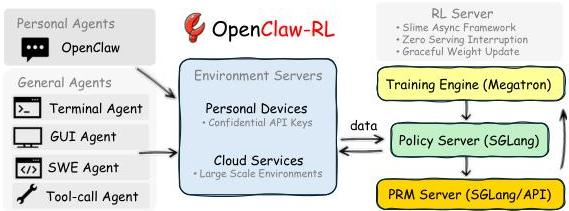
Figure 1 | OpenClaw-RL infrastructure overview. Interaction streams come from two agent types: Personal Agents (conversational, personalized), hosted on personal devices, and General Agents (terminal, GUI, SWE, and tool-call agents), hosted on cloud services. The collected samples flow into our RL server built on the asynchronous slime framework, which consists of four decoupled components: (1) the environment server, (2) PRM / Judge for reward computation, (3) Megatron for policy training, and (4) SGLang for policy serving. The environment for personal agents is simply the users' personal devices, which connect to the RL server over HTTP with confidential API keys. The environments for general agents are hosted on cloud services to enable scalable parallelization.

*Equal contribution; †Corresponding authors; Main contact: yangling0818@163.com

---

OpenClaw-RL: Train Any Agent Simply by Talking

# Contents

1 Introduction 3
2 OpenClaw-RL Infrastructure: Unified System for Personal and General Agents 5

2.1 Flexible Server-Client Architecture for Live Agents 5
2.2 Asynchronous Signal Extraction from Next States 5
2.3 Scalability: From Personal Agents to Real-World Agent Deployment 6

3 Methodology: Learning from Next-State Signals 6

3.1 Two Complementary Signals and A Hybrid RL Objective 7
3.2 Overlap-Guided Hint Selection 8
3.3 Step-wise Reward for General Agentic RL 9

3.3.1 Why Process Rewards Are Vital for Agentic Tasks 9
3.3.2 Integrate Outcome and Process Rewards 9

4 Experiments 10

4.1 Personal Agent Setup 10
4.2 General Agent Setup 10
4.3 Hybrid RL Extension Setup 11
4.4 OpenClaw-RL Effectively Optimizes Personal Agents 11
4.5 Unified RL Framework Across Terminal, GUI, SWE, and Tool-Call 12
4.6 Hybrid RL is More Efficient 13
4.7 Hybrid RL Generalizes to Agentic RL 13
4.8 Overlap-Guided Hint Selection Improves Efficiency and Stability 13
4.9 Log-Probability Difference Is Vital for Stability 14
4.10 Ablation on  $k$  and Support Set  $S_{i}$  14
4.11 Explore Different Policy and Reward Models 14

5 Related Work 15

5.1 RL for LLMs 15
5.2 Agentic RL and Tool-Use 15
5.3 Process Reward Models 15
5.4 On-Policy Distillation and Hindsight Methods 15
5.5 RL Training Infrastructure 16

6 Conclusion 16

A Experiment Details 21

A.1 Personal RL Configurations 21
A.2 General Agentic RL Hyperparameters 21
A.3 Hybrid RL Extension Experiment Configurations 22
A.4 Token-level OPD 22
A.5 Token-Level Log-Probability Shift Analysis 22
A.6 Algorithm Pseudocode 23
A.7 Personal RL Prompt Templates 24

B Additional Experiment Results 31

B.1 More Optimization Examples 31
B.2 Response Length and Truncation Ratio Example 32
B.3 PRM Ablation Results 33

C OPD Objective is Token-level KL 33

---

1 Introduction

Agentic systems powered by large language models (LLMs) have been shown to significantly improve productivity and are now widely deployed in industrial settings *(Anthropic, 2025; OpenAI, 2025; OpenClaw, 2026)*. The data generated through agent usage, such as user replies, tool execution results, and GUI state transitions, constitutes a valuable source of insights for improving agent frameworks *(Lee et al., 2026; Zhang et al., 2024)*, building memory systems *(Chhikara et al., 2025; Packer et al., 2023; Rasmussen et al., 2025; Wang and Chen, 2025; Xu et al., 2025)*, and producing high-quality training data for the models *(Ouyang et al., 2022)*. However, both the infrastructure and methodology for leveraging such usage data to improve language models in real time remain little explored.

The effectiveness of real-time learning for agentic models hinges on the careful design of both infrastructure and methodology. On the infrastructure side, the RL server must be flexible enough to integrate with users’ diverse and evolving agentic frameworks, and the optimization process must run asynchronously so as not to block inference-time usage. On the methodology side, the algorithm must fully exploit the extracted training signals while maintaining stability throughout optimization. In this work, we propose OpenClaw-RL, a framework that combines infrastructure and algorithmic innovations to achieve efficient and stable online optimization for personal agents.

We extend existing RL infrastructure *(Fu et al., 2025; Hu et al., 2024; Sheng et al., 2025; Zhu et al., 2025)*, which typically assumes batch data collection on the RL server, to support continuous learning for agentic models. In our setting, the RL server hosts the model behind an inference API. As user terminals query the model, the resulting interaction data is streamed back to the server over HTTP and used to train the model online. To extract training signals online, we identify the next state as a source of two complementary signal types: evaluative and directive. The evaluative signal is produced by a process reward model (PRM) that implicitly scores the preceding action: a user re-query signals dissatisfaction, a passing test signals success, and an error trace signals failure. Beyond scoring, the next state often carries directive information. For instance, when a user says “you should have checked the file first,” the message specifies not only that the response was wrong but also how it should change at the token level. Directive signals are therefore extracted from such next states as token-level hints, providing guidance rather than a scalar reward. By hosting the PRM as a separate server, signal extraction runs asynchronously with respect to policy rollout, so training-signal collection does not block policy inference.

While RLVR methods are limited to scalar rewards and thus cannot convert directive signals into policy gradients *(Guo et al., 2025; Hu et al., 2025; Shao et al., 2024; Yu et al., 2025a)*, on-policy distillation methods *(Agarwal et al., 2024; Hübotter et al., 2026; Shenfeld et al., 2026)* offer an alternative by allowing a teacher model, conditioned on a corrective hint, to provide token-level supervision to the student. Hindsight relabeling approaches *(Hübotter et al., 2026; Shi et al., 2026; Zhang et al., 2023)* show that adding structured correction information to the context can substantially improve outputs, but these methods all operate on fixed datasets. In concurrent work, *Buening et al. (2026)* improves online policy by directly prompting with next-state information, though the corrective hints remain implicit in the prompt rather than serving as explicit signals.

These distillation methods suffer from training instability and reduced effectiveness due to the distribution mismatch between teacher and student *(Li et al., 2026)*, a problem that is exacerbated when corrective hints are of low quality. We address this by proposing a novel hint-selection criterion based on the top-$k$ token overlap between teacher and student distributions. Among candidate hints, we select the one whose induced teacher distribution shares the most top-$k$ tokens with the student, either per token or aggregated over the sequence. Because the selected teacher already overlaps with the student in high-probability regions, distillation provides informative gradients while keeping the

---

OpenClaw-RL: Train Any Agent Simply by Talking

Student who uses OpenClaw to do homework, does not want to be found using AI.

Before:

The handbag cost $220. Here's how:

1. Shoes cost $80
2. 3 times the shoe cost = 3 × $80 = $240
3. Subtract $20 = $240 - $20 = **$220**

**Final Answer**: $220

AI-like

After several conversations:

Jillian's handbag cost $220. Here's the step-by-step solution: 1. 3 times the shoe cost: 3 * $80 = $240. 2. Subtract $20: $240 - $20 = $220.

TA who uses OpenClaw to grade homework, wants grading to be specific and detailed.

Before:

Correct answer: 220. Your solution is correct.

Tee brief

After several conversations:

The student correctly interprets the problem statement by expressing the handbag cost as "3 times the shoes' price minus $20". The step "3 times $80 is 240" accurately calculates the multiplication without errors. The step "subtract 20 from 240" correctly applies the $20 deduction as required by the problem. The student's double-check demonstrates strong verification practices.

Teacher who uses OpenClaw to comment, wants comments to be friendly and patient.

Before:

220 is correct. Step-by-step breakdown is clear and accurate.

Cold

After several conversations:

Steps clearly labeled with multiplication and subtraction

Verification step confirms the answer is correct

Excellent attention to detail in problem-solving

-- Try adding a quick check to make your verification even more thorough!

Figure 2 | Optimize your OpenClaw simply by using it. We provide simulation results here.

off-policy importance ratio close to unity, stabilizing the update. In addition, we apply a clip on the token-level log-probability difference to further stabilize training. Our analysis shows that evaluative and directive signals have complementary strengths: directive signals are more informative than the scalar rewards derived from evaluative signals, while evaluative signals are more frequent, since not every next state contains a useful hint. This motivates a hybrid RL objective that combines loss terms.

We demonstrate the effectiveness of OpenClaw-RL by first conducting main experiments on OpenClaw (OpenClaw, 2026). Specifically, we simulate settings in which users from different professions use OpenClaw for their own work and evaluate how efficiently the model learns to align with their preferences. We find that OpenClaw-RL outperforms memory and skill-evolution methods in optimization efficiency. Furthermore, we extend the algorithm to a general agentic RL setting to study its robustness. OpenClaw-RL achieves better optimization than RLVR methods while remaining stable.

Beyond personalization, OpenClaw-RL scales to large-scale general agent deployment. Built on the asynchronous slime (Zhu et al., 2025) infrastructure, we support cloud-hosted parallel environments across terminal, GUI, SWE, and tool-call settings, covering the most common real-world agent deployment scenarios. To our knowledge, this is the first open-source RL framework to unify these diverse agent types under a single training infrastructure. Across these settings, OpenClaw-RL achieves strong optimization with promising training dynamics, and we further demonstrate that next-state signals are particularly valuable in long-horizon environments where sparse outcome rewards alone provide insufficient learning signal.

# Contributions.

- Infrastructure for real-time personal agentic RL. We extend existing RL infrastructure to a server-client architecture that supports continuous, real-time learning from deployed agents. The system is flexible enough to integrate with users' diverse and evolving agent frameworks running on remote terminals, automatically extracts two complementary training signals, evaluative and directive, from observed next states, and runs signal extraction and policy optimization asynchronously so that neither blocks inference-time usage.
- Stable hybrid RL objective with overlap-guided distillation. We propose a hybrid RL objective that unifies evaluative and directive signals into a single update, exploiting their complementary strengths. We introduce overlap-guided hint selection, which chooses the corrective hint whose induced teacher distribution maximally overlaps with the student's top- $k$  tokens, together with a log-probability-difference clip that bounds per-token advantages. Together, these keep the off-policy importance ratio close to unity and yield efficient, stable optimization.
- First unified RL infrastructure for real-world agent settings. OpenClaw-RL is the first open

---

source RL framework to unify terminal, GUI, SWE, and tool-call agents under a single training infrastructure with cloud-hosted parallel environments, covering the most common real-world deployment scenarios and enabling direct comparison across agent types.
- Comprehensive evaluation across personalization and general agentic RL. We first simulate users from different professions using OpenClaw simultaneously and show that OpenClaw-RL can make the model align to per-user preferences within around 10.3 sessions, more efficiently than memory and skill-evolution methods. We further extend the algorithm to a general agentic RL setting, where it achieves better optimization than RLVR baselines while remaining stable.

## 2 OpenClaw-RL Infrastructure: Unified System for Personal and General Agents

We unify automatic optimization of personal OpenClaw agents and large scale agentic RL for general agents, including terminal, GUI, SWE, and tool-call settings, within a single framework.

We first describe the server–client architecture that enables integration with diverse and evolving agent frameworks through a stateless API (§2.1). We then present the fully decoupled asynchronous pipeline that extracts evaluative and directive signals from next states without blocking inference (§2.2). Finally, we show how the same infrastructure scales from sparse, session-based personal agent streams to dense, parallelized general agent across terminal, GUI, SWE, and tool-call settings (§2.3).

### 2.1 Flexible Server–Client Architecture for Live Agents

OpenClaw-RL is built around an inference-API server–client architecture (Figure 1). The RL server hosts the policy $\pi_{\theta}$ behind a stateless completion API; users’ agent frameworks, which may run on personal devices, terminals, or cloud instances, query the policy through this API and stream their interaction data back to the server over HTTP. This design imposes no constraint on the structure of the user-side framework: any agent that can issue API requests can act as a data source, and that framework may evolve, change tools, or be replaced entirely without reconfiguring the server.

Each API request is classified as either a main-line turn or a side turn. Main-line turns comprise the agent’s primary responses and tool execution results, which form trainable samples. Side turns cover auxiliary queries, memory organization, and environment transitions; they are forwarded to the model but do not produce training data. Each request also carries a session identifier, allowing the server to demultiplex concurrent interaction streams from multiple users and attribute each turn to the correct conversation session. This classification allows the RL framework to precisely identify which turns belong to which sessions, enabling targeted training on main-line turns only. For personal agents, the model is connected through a confidential API for private and secure deployment, and multiple users can be served simultaneously without cross-session interference. For large-scale training of general agents, cloud-hosted environments connect through the same API, enabling scalable parallelization without architectural changes.

### 2.2 Asynchronous Signal Extraction from Next States

The core architectural principle of OpenClaw-RL is full decoupling: policy serving, environment hosting, reward judging, and policy training run as four completely independent asynchronous components with no blocking dependencies between them. The model serves the next user request while the PRM judges previous responses and the trainer applies gradient updates. Weight updates are pushed to the serving engine at well-defined boundaries, so live users always see a consistent policy and never wait for training. The message of each new main-line request contains the reaction to the previous turn, whether a user’s reply or an environment’s execution result. This becomes

---

OpenClaw-RL: Train Any Agent Simply by Talking

the next-state signal  $s_{t+1}$  for the previous turn. The PRM is hosted as a separate inference server and is responsible for automatic signal extraction: given an action  $a_t$  and the next state  $s_{t+1}$ , it produces both an evaluative score and, when applicable, a directive hint. Because PRM judging is decoupled from policy serving, signal extraction can use a stronger model and run multiple votes per sample without affecting user-facing latency. This decoupling is what makes continuous training from live, heterogeneous interaction streams practical: no stream needs to be paused or batched to accommodate another component's schedule.

# 2.3. Scalability: From Personal Agents to Real-World Agent Deployment

OpenClaw-RL is designed to operate across the full spectrum from single-user personal agents to large-scale multi-environment general agent deployment. For personal agents, the environment is a single user's device and the interaction stream is sparse, session-based, and highly personalized. Built on slime (Zhu et al., 2025), OpenClaw-RL inherits a scalable training infrastructure for general agents, and we further support cloud-hosted environments across diverse agent settings. Hundreds of parallel environments hosted on cloud services produce a dense stream of structured execution signals, enabling scalable RL training.

Specifically, OpenClaw-RL supports a broad set of general-agent scenarios that cover the most common real-world deployment settings in our open-source implementation (Table 1). Terminal agents are a core component of computer-use systems: they are efficient, cheap to scale, and naturally aligned with the text-based interface of LLMs (Anthropic, 2026; OpenAI, 2026; Shen et al., 2026). GUI agents cover capabilities that terminal agents cannot access directly, such as visual interfaces and pointer-based interactions, making them necessary for more general computer-use tasks (Qin et al., 2025; Wang et al., 2025a,c; Xue et al., 2026). SWE agents represent a particularly important class of coding agents, where the environment provides rich executable feedback through tests, diffs, and static analysis (Cao et al., 2026). Tool-call agents are also critical, since external tools improve both reasoning capability and factual accuracy (Feng et al., 2025a).

Table 1 | Supported agent settings and their environment characteristics.

<table><tr><td>Setting</td><td>Environment</td><td>Next-state signal</td><td>Horizon</td></tr><tr><td>OpenClaw</td><td>Personal devices</td><td>user response / tool-call results</td><td>Long</td></tr><tr><td>Terminal</td><td>Shell execution sandbox</td><td>stdout/stderr, exit code</td><td>Long</td></tr><tr><td>GUI</td><td>Screen state + accessibility tree</td><td>Visual state diff, task progress</td><td>Long</td></tr><tr><td>SWE</td><td>Code repository + test suite</td><td>Test verdicts, diff, lint output</td><td>Long</td></tr><tr><td>Tool-call</td><td>API/function execution</td><td>Return values, error traces</td><td>Medium</td></tr></table>

# 3. Methodology: Learning from Next-State Signals

We convert next-state signals from heterogeneous interaction streams, including personal conversations, terminal interactions, GUI interactions, SWE tasks, and tool-call traces, into policy gradients.

We first show that the next state yields two complementary signal types, evaluative and directive, and introduce a hybrid RL objective that unifies them in a single per-token loss (§3.1). We then address the central stability challenge of hint-conditioned distillation by proposing overlap-guided hint selection and a log-probability-difference clip (§3.2). Finally, we describe how step-wise process rewards are integrated with outcome rewards to handle long-horizon general agentic settings (§3.3).

---

OpenClaw-RL: Train Any Agent Simply by Talking

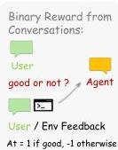
Figure 3 | Method Overview. For personal agents, we support both binary-reward optimization and on-policy distillation training. In our experiments, we find that their combination yields significant performance gains. For general agentic RL, in addition to standard RLVR, we provide integrated step-wise rewards and a simple but effective standardization approach (Wang et al., 2026).

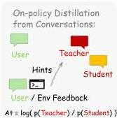

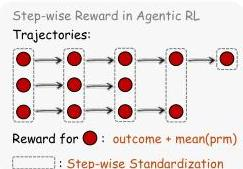

Table 2 | Complementary properties of the evaluative and directive signals, and the hybrid objective.

<table><tr><td>Property</td><td>Evaluative</td><td>Directive</td><td>Hybrid (Ours)</td></tr><tr><td>Source</td><td>Scalar PRM vote</td><td>Hint-conditioned teacher</td><td>Both</td></tr><tr><td>Granularity</td><td>Sequence-level</td><td>Token-level</td><td>Mixed</td></tr><tr><td>Information per sample</td><td>1 scalar</td><td>|Si| log-prob gaps</td><td>1 scalar + |Si| gaps</td></tr><tr><td>Frequency</td><td>Every scored turn</td><td>Turns with meaningful hint</td><td>Every scored turn</td></tr></table>

# 3.1. Two Complementary Signals and A Hybrid RL Objective

Evaluative signal. Given  $(a_{t}, s_{t+1})$ , the PRM is queried  $m$  times and each query returns a vote in  $\{+1, -1, 0\}$ . We take the majority  $r_{t} \in \{+1, -1, 0\}$  as the scalar reward at step  $t$ . The evaluative signal is dense by construction: every scored turn contributes a sample, regardless of whether the user reaction is explicit, such as "that worked," or implicit, such as a re-query or a passing test.

Directive signal. When evaluating  $(a_{t}, s_{t+1})$ , the PRM is also asked to decide whether  $s_{t+1}$  contains a meaningful correction in the first place: extracting a hint is only worthwhile when the next state actually carries directive content, and forcing extraction otherwise would yield low-quality hints that destabilize training. If the answer is yes, the PRM distills  $s_{t+1}$  into a concise hint  $h$  enclosed in [HINT_START] . . . [HINT_END]; if no, the turn produces no directive signal and contributes only the evaluative one. The hint is appended to the prompt as  $s_{t}^{h} = s_{t} \oplus h$ , and a teacher distribution  $\pi_{T}(\cdot \mid s_{t}^{h})$  is obtained by querying the same model under the hint-augmented prompt. The resulting signal is a full token-level distribution rather than a scalar, but it is also sparse: the directive signal fires only on the subset of turns where the PRM judges a meaningful correction to be present. For instance, a user's terse "thanks, looks good" or a passing test result carries strong evaluative content but no directive content; while an error trace pointing at a specific line yields a usable hint.

Complementary analysis. The two signals are complementary along two axes. In frequency, the evaluative signal is available on every scored turn, while the directive signal is only available on the subset of turns where the next state carries an extractable correction. In information density, the evaluative signal compresses an entire turn into a single scalar, while the directive signal carries per-token guidance through the teacher distribution  $\pi_T$ . RLVR can only consume the former and pure

---

OpenClaw-RL: Train Any Agent Simply by Talking

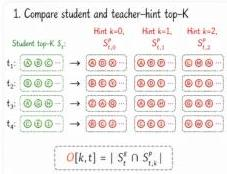
Figure 4 | Overlap-guided hint selection method overview.

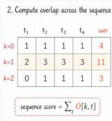

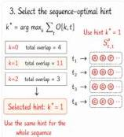

on-policy distillation can only consume the latter; neither alone uses the full content of  $s_{t+1}$ .

Hybrid objective. We therefore combine both signals into a single per-token loss for token  $i$

$$
\mathcal {L} _ {i} ^ {\text {h y b r i d}} = w _ {\mathrm {R L}} \mathcal {L} _ {i} ^ {\mathrm {G R P O}} + w _ {\mathrm {O P D}} \mathcal {L} _ {i} ^ {\mathrm {O P D}},
$$

where  $\mathcal{L}_i^{\mathrm{GRPO}}$  is the standard PPO clipped surrogate driven by the scalar advantage  $A_i^{\mathrm{grpo}}$ , and  $\mathcal{L}_i^{\mathrm{OPD}}$  is the distillation loss defined in equation 1. By default  $w_{\mathrm{RL}} = w_{\mathrm{OPD}} = 1$ . The two terms share the same trajectory and the same policy updates; the hybrid objective integrates their complementary strengths in frequency and information density (Table 2). In experiments, we will demonstrate that this hybrid objective improves optimization for both real-time personalization and agentic RL.

# 3.2. Overlap-Guided Hint Selection

A central failure mode of on-policy distillation is teacher-student distribution mismatch: when the teacher distribution  $\pi_T$  places mass on tokens the student has near-zero density on, the off-policy importance ratio explodes and the gradient becomes unstable (Li et al., 2026). Because we obtain the teacher by conditioning the same model on a hint  $h$ , the choice of hint directly controls the magnitude of mismatch: a vague or off-target hint pulls the teacher far from the student, while a precise one keeps the two distributions close on the tokens that matter.

Overlap as a selection signal. We exploit this observation by selecting hints based on the geometry of the induced teacher distribution rather than on hint length, teacher confidence, or other surface heuristics. Given  $y$  the generated response by the student, let  $S_{i}^{q} = \mathrm{top - k}\{\pi_{\mathrm{old}}(\cdot \mid s_{t},y_{&lt; i})\}$  denote the student's top-  $k$  vocabulary at response token position  $i$ , and  $S_{i,h}^{p} = \mathrm{top - k}\{\pi_{T}(\cdot \mid s_{t}^{h},y_{&lt; i})\}$  the teacher's top-  $k$  vocabulary at position  $i$  under candidate hint  $h$ . We define the overlap signal

$$
O [ h, i ] = \left| S _ {i} ^ {q} \cap S _ {i, h} ^ {p} \right|,
$$

which counts how many of the student's high-probability tokens remain high-probability under the hint-conditioned teacher. Among  $M$  candidate hints, we consider two selection schemes:

$$
h ^ {\star} (i) = \left\{ \begin{array}{l l} \arg \max  _ {h} \sum_ {i} O [ h, i ], &amp; \text {s e q u e n c e - l e v e l}, \\ \arg \max  _ {h} O [ h, i ], &amp; \text {t o k e n - l e v e l}, \end{array} \right.
$$

---

where the sequence-level mode picks one hint per trajectory and the token-level mode picks a different hint at each position. The token-level option is motivated by the fact that the empirical OPD loss is itself token-level rather than sequence-level (Appendix C). In our experiments, the two schemes achieve similar performance, with the sequence-level mode tending to be more stable in general agentic RL settings. Higher overlap means the teacher and the student already agree on what the response should look like at the level of vocabulary support, so distillation can move the student toward the teacher within its own high-density region rather than toward unfamiliar tokens.

##### Top-$k$ OPD loss with log-probability-difference clip.

Once $h^{\star}$ is chosen, we restrict the distillation loss to a vocabulary subset $S_{i}$, set to $S_{i}^{q}$ by default *(Li et al., 2022; Shenfeld et al., 2022)*. For each $v\in S_{i}$, we form an importance-weighted advantage from the log-probability gap between teacher and student, $A_{v}=\Delta_{v}\cdot w_{v}$, where $\ell_{\text{old}}(v)=\log\pi_{\text{old}}(v\mid s_{t},y_{<i})$, $\ell_{T,h^{\star}}(v)=\log\pi_{T}(v\mid s_{t}^{h^{\star}},y_{<i})$,

$w_{v}\ =\ \text{softmax}_{v\in S_{i}}\big{(}\ell_{\text{old}}(v)\big{)},\ \ \text{and}\ \Delta_{v}\ =\ \text{clip}\big{(}\ell_{T,h^{\star}}(v)-\ell_{\text{old}}(v),\ -C,\ +C\big{)}.$

The weight $w_{v}$ concentrates the advantage on tokens the student is actually likely to sample, while the clip on $\Delta_{v}$ bounds the per-token log-probability gap at $C$, capping the magnitude of any single distillation update even when the teacher is locally far from the student. With the per-vocab ratio $\rho_{v}=\exp\big{(}\ell_{\text{cur}}(v)-\ell_{\text{old}}(v)\big{)}$, where $\ell_{\text{cur}}(v)=\log\pi_{\text{cur}}(v\mid s_{t},y_{<i})$, the distillation loss takes the clipped-surrogate form summed over the subset:

$\mathcal{L}_{i}^{\text{OPD}}\ =\ \sum_{v\in S_{i}}\max\Big{(}-A_{v}\rho_{v},\ -A_{v}\text{clip}\big{(}\rho_{v},\ 1-\varepsilon_{\text{lo}},\ 1+\varepsilon_{\text{hi}}\big{)}\Big{)},$ (1)

with $\varepsilon_{\text{lo}}=0.2$ and $\varepsilon_{\text{hi}}=0.28$ following standard PPO clipping *(Schulman et al., 2017; Yu et al., 2023)*. The overlap-guided choice of $k^{\star}$ keeps $\rho_{v}$ near unity on the supervised tokens, while the $\Delta$-clip caps advantage magnitudes; together they bound both factors of the surrogate and yield stable updates without discarding the directional information carried by the hint.

### 3.3 Step-wise Reward for General Agentic RL

How to combine the outcome and process rewards in general agentic RL?

#### 3.3.1 Why Process Rewards Are Vital for Agentic Tasks

In long-horizon agentic tasks, outcome-only rewards provide gradient signal only at the terminal step, leaving the vast majority of turns unsupervised. A PRM assigns a reward to each turn based on the next-state signal, providing dense credit assignment throughout the trajectory. Recent work has provided strong empirical evidence for this. RLAnything *(Wang et al., 2022)* demonstrates that integrating step-wise PRM signals with outcome rewards consistently outperforms outcome-only training across GUI agents, text-game agents, and coding tasks. We build directly on this insight in OpenClaw-RL: our PRM judges each turn using the live next-state signal as evidence, and we demonstrate empirically (§4.5) that this dense signal is helpful for long-horizon RL settings.

#### 3.3.2 Integrate Outcome and Process Rewards

Verifiable outcomes are standard supervision signals in RLVR settings. Following RLAnything *(Wang et al., 2022)*, we integrate outcome and process rewards by simply adding them together, using $o+\sum_{i=1}^{m}r_{i}/m$ as the reward for step $t$, where the $r_{i}$ are independently assigned by $\text{PRM}(a_{t},s_{t+1})$. Unlike GRPO, the presence of step-wise rewards makes it less straightforward to compute advantages. *Feng

---

et al. (2025b)* group similar states and perform standardization within each group. However, in real-world settings such as terminal agents, states are not easily clustered. Therefore, we directly group actions with the same step index, which we find effective in our empirical studies.

## 4 Experiments

### 4.1 Personal Agent Setup

We use LLMs to simulate users from different professions interacting with OpenClaw on work tasks, and evaluate how efficiently the model learns to align with each user’s preferences. Three settings are considered—student, TA, and teacher—described below. In every session, the simulated user delegates a single task to OpenClaw on their personal computer; tasks are drawn from GSM8K *(Cobbe et al., 2021)*. The user’s first message in each session is hard-coded and does not disclose their preferences, allowing us to assess whether the model has internalized prior experience by examining its response to this opening message. We consider the optimization effect to have been achieved once the model’s response to the first message satisfies the user’s preferences in three consecutive sessions. The OpenClaw policy and reward model in this setting is Qwen3-4B-Thinking-2507 *(Yang et al., 2025a)*. We set the learning rate to $1\times 10^{-5}$ and the log-probability-difference clipping coefficient to $C=1$, and trigger a training step after every 16 collected samples. Users are simulated with Qwen3-32B to ensure faithful role-following. See more details in Appendix A.1.

- [leftmargin=*]
- Student who uses OpenClaw to do homework. In this setting, a student uses OpenClaw on a personal computer to complete homework while trying to avoid the appearance of relying on AI. A response is identified as AI-like when it contains markers such as bold text, numbered lists, or over-formatting like boxed final answers. The student interacts with OpenClaw to complete the homework in a non-AI-like style and asks for revisions whenever the response is AI-like.
- TA who uses OpenClaw to grade homework. Once the student finishes the homework, the TA uses OpenClaw to grade the assignments. The TA wants the grading to be specific and detailed, and considers a grading response insufficient when its length is below 100 tokens.
- Teacher who uses OpenClaw to comment. After grading, the teacher uses OpenClaw to write comments for the student based on the TA’s feedback. The teacher wants comments to be friendly and patient, identified by warm phrases such as “well done!” or “excellent!”

### 4.2 General Agent Setup

#### Models.

We use Qwen3-8B *(Team, 2025)*, Qwen3VL-8B-Thinking *(Bai et al., 2025)*, Qwen3-4B *(Team, 2025)*, and Qwen3-4B-SFT in terminal, GUI, SWE, and tool-call settings, respectively. Qwen3-4B-SFT is the model from *Zhu et al. (2025)*, fine-tuned on the dataset of *Feng et al. (2025a)*. The PRMs for GUI and tool-call agents are Qwen3VL-8B-Thinking and Qwen3-4B, respectively.

#### Datasets.

We use SETA RL data *(Shen et al., 2026)*, OSWorld-Verified *(Xie et al., 2024)*, SWE-Bench-Verified *(Jimenez et al., 2023)*, and DAPO RL data *(Yu et al., 2025a)* to train the terminal, GUI, SWE, and tool-call agents, respectively. The GUI agent is evaluated on the training set (excluded chrome and multi-apps tasks). The tool-call agent is evaluated on AIME 2024 *(Mathematical Association of America, American Mathematics Competitions, 2024)*. For the terminal and SWE agents, we report the average rollout-task accuracy over a window of RL steps.

---

OpenClaw-RL: Train Any Agent Simply by Talking

Table 3 | Optimization efficiency of different methods across settings. Our hybrid RL attains the best overall performance. Notably, jointly optimizing for multiple users amplifies the gains from RL, whereas the efficiency of memory and skill-evolution is largely unaffected. The reported metric is the minimum number of sessions required to achieve the optimization effect, as defined in Section 4.1. We run 5 independent trials with Qwen3-4B-Thinking-2507 and report the mean.

<table><tr><td rowspan="2">Setting</td><td colspan="5">Optimize all at the same time (joint)</td><td colspan="5">Optimize for each individual (separate)</td></tr><tr><td>Hybrid RL (Ours)</td><td>GRPO</td><td>OPD</td><td>Mem0</td><td>Cognee</td><td>Hybrid RL (Ours)</td><td>GRPO</td><td>OPD</td><td>Mem0</td><td>Cognee</td></tr><tr><td>Student</td><td>11.6</td><td>15.4</td><td>30.8</td><td>13.6</td><td>14.6</td><td>19.2</td><td>22.8</td><td>34.6</td><td>13.4</td><td>15.6</td></tr><tr><td>TA</td><td>8.2</td><td>12.0</td><td>34.0</td><td>15.8</td><td>15.4</td><td>11.8</td><td>22.4</td><td>36.0</td><td>16.0</td><td>14.8</td></tr><tr><td>Teacher</td><td>11.4</td><td>14.8</td><td>24.4</td><td>14.2</td><td>14.8</td><td>14.0</td><td>18.0</td><td>17.6</td><td>15.8</td><td>15.0</td></tr><tr><td>Average</td><td>10.3</td><td>14.1</td><td>29.7</td><td>14.5</td><td>14.9</td><td>15.0</td><td>21.1</td><td>29.4</td><td>15.1</td><td>15.1</td></tr></table>

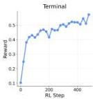
Figure 5 | We supports scalable RL for general agents across terminal, GUI, SWE, and tool-call settings.

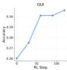

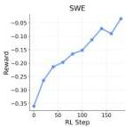

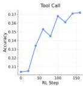

Hyperparameters. We set the learning rate to  $10^{-6}$ , the KL coefficient to 0.01, the lower and upper clip ratios to 0.2 and 0.28. We sample 8 tasks per step for the GUI and SWE, 16 for terminal, and 32 for the tool-call setting. For each task, we draw 8 samples. The maximum numbers of interaction steps for GUI, SWE, and terminal are 30, 20, and 10, respectively. See more details in Appendix A.2.

# 4.3. Hybrid RL Extension Setup

We study our algorithm's extension to general RL settings, focusing on multi-turn tool-call (Feng et al., 2025a) and RLVR. For the tool-call setting, we use Retool-4B, which is supervised-fine-tuned on the Retool dataset (Feng et al., 2025a), with Qwen3-8B as the PRM. For the RLVR setting, we use DeepSeek-R1-Distill-Qwen-1.5B as the policy model and Qwen3-4B as the PRM, training on DAPO (Yu et al., 2025a) and evaluating on AIME (Mathematical Association of America, American Mathematics Competitions, 2024). We set the learning rate to  $10^{-6}$ , the KL coefficient to 0.01, the log-probability-difference clipping coefficient to  $C = 2$ , and the lower and upper PPO clip ratios to  $\varepsilon_{\mathrm{lo}} = 0.2$  and  $\varepsilon_{\mathrm{hi}} = 0.28$ . We sample 32 tasks per training step, with the policy drawing 8 independent rollouts per task. We provide more details in Appendix A.3.

# 4.4. OpenClaw-RL Effectively Optimizes Personal Agents

We evaluate optimization efficiency by measuring how quickly the model learns to align with user preferences during OpenClaw usage. We consider three types of users, each with distinct jobs and

---

OpenClaw-RL: Train Any Agent Simply by Talking

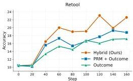
Figure 6 | Hybrid RL in multi-turn agentic RL and RLVR settings. Left: the ReTool multi-turn RL setting; right: RLVR. "PRM + Outcome" denotes the integrated approach introduced in Section 3.3, while "Outcome" refers to standard GRPO with verifiable outcome rewards.

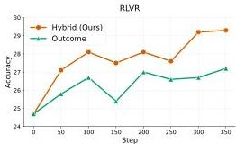

Table 4 | Ablation on model and method. Sequence-optimal and token-optimal hint selection achieve similar efficiency, both outperforming random hint selection. We use Qwen3-32B here and report the mean over 5 independent runs. The student, TA, and teacher settings are jointly optimized.

<table><tr><td>Setting</td><td>Hybrid RL sequence optimal</td><td>Hybrid RL token optimal</td><td>Hybrid RL random</td><td>GRPO</td><td>OPD</td></tr><tr><td>Student</td><td>14.0</td><td>13.8</td><td>18.6</td><td>17.2</td><td>34.4</td></tr><tr><td>TA</td><td>9.6</td><td>10.0</td><td>12.6</td><td>12.0</td><td>29.8</td></tr><tr><td>Teacher</td><td>13.8</td><td>13.4</td><td>17.0</td><td>18.2</td><td>25.6</td></tr><tr><td>Average</td><td>12.5</td><td>12.4</td><td>16.1</td><td>15.8</td><td>29.9</td></tr></table>

preferences. In addition to optimizing the model for a single user, OpenClaw-RL supports multiple individuals sharing the same model, with the model jointly optimized across their interactions. As shown in Table 3, our algorithm achieves the desired optimization effect with only about 10 conversation sessions under joint optimization and 15 under separate optimization, demonstrating its efficiency and practicality for real-world applications. We also provide concrete before-and-after optimization examples across these three settings (Figure 2), showing that the model's output pattern shifts toward the user's preferences through simple conversational interaction.

# 4.5. Unified RL Framework Across Terminal, GUI, SWE, and Tool-Call

We conduct experiments across widely used, real-world agent settings, including terminal, GUI, SWE, and tool-call scenarios (Figure 5). Our framework handles diverse model sizes and modalities, with large-scale environment parallelization to improve training scalability: we use 128 parallel environments for terminal agents, 64 for GUI and SWE agents, and 32 for tool-call agents. To evaluate the importance of process rewards in long-horizon tasks, we conduct RL training with integrated outcome and process rewards in the tool-call (250 steps) and GUI (120 steps) settings. Combining both reward types further improves performance: integrated rewards reach 0.25 and 0.33 in tool-call and GUI respectively, compared with 0.19 and 0.31 under outcome-only optimization. One trade-off is that hosting a PRM requires additional resources compared with outcome-only training.

---

OpenClaw-RL: Train Any Agent Simply by Talking

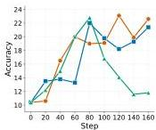
(1). Retool

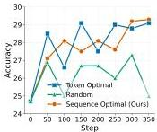
(2).RLVR
Figure 7 | (1)-(2). Comparison of hint selection methods in multi-turn RL and RLVR. Selecting hints via top- $k$  overlap effectively improves both training stability and final performance. We find the sequence optimal method tends to be more stable than token optimal, particularly in the RLVR setting. (3) Distribution of the log-probability difference between teacher and student. We observe that this difference can be highly extreme, motivating us to introduce a clipping mechanism.

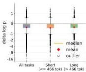
(3). log p delta

# 4.6. Hybrid RL is More Efficient

We compare the optimization efficiency of hybrid RL against its simple ablations using  $\mathcal{L}_i^{\mathrm{GRPO}}$  (GRPO) and  $\mathcal{L}_i^{\mathrm{OPD}}$  (OPD), as well as memory and skill-evolution methods Mem0 (Chhikara et al., 2025) and Cognee (Markovic et al., 2025). As shown in Table 3, hybrid RL is substantially more efficient than either GRPO or OPD alone, further validating our analysis of the complementary nature of these two objectives. Hybrid RL also reaches the target performance faster than the skill- and memory-evolving baselines. Notably, these baselines impose additional context overhead at inference time, whereas our RL approach only updates model weights, offering a more sustainable long-term solution. Under the joint optimization setting, the memory and skill-evolution methods perform comparably to their separate-optimization counterparts, while hybrid RL benefits significantly more from joint optimization. We hypothesize that this is because the three optimization objectives are inherently coupled for the policy model.

# 4.7. Hybrid RL Generalizes to Agentic RL

We apply our hybrid RL framework to large-batch training settings, including multi-turn agentic RL and RLVR. For multi-turn RL, hint generation focuses on tool-call feedback at each turn, and only turns deemed worth annotating by the PRM are included in the OPD data. For RLVR, the PRM has access to the ground-truth answer when generating hints for incorrect solutions, but is prompted to avoid leaking any specifics of the solution itself. As shown by the training curves in Figure 6, hybrid RL generalizes well to both agentic RL and RLVR under these large-batch settings, outperforming both the outcome-only and integrated-reward baselines.

# 4.8. Overlap-Guided Hint Selection Improves Efficiency and Stability

We compare different hint selection strategies in this section. As shown in the left panel of Figure 7, randomly selecting hints leads to training instability in the agentic RL setting. In the RLVR setting (Figure 7, right), both training efficiency and stability are adversely affected. Moreover, Table 4 shows that random selection yields substantially worse optimization efficiency than the sequence-optimal and token-optimal methods. Together, these results demonstrate the effectiveness of selecting hints via top- $k$  overlap. Comparing the two optimal-selection variants, we find that sequence-optimal

---

OpenClaw-RL: Train Any Agent Simply by Talking

Table 5 | Ablation on  $k$  and the support set  ${S}_{i}$  . We find that larger values of  $k$  tend to improve optimization,although the gain becomes very small when  $k \geq  4$  . Using the top-  $k$  overlap as the support set leads to a minor decrease in performance. We choose the joint optimization setting here.

<table><tr><td rowspan="2">Setting</td><td colspan="5">Si=Siq( student top-k)</td><td colspan="2">Si=Sq∩Sph,i,h* (top-k overlap)</td></tr><tr><td>k=2</td><td>k=4</td><td>k=8</td><td>k=20</td><td>token-level</td><td>k=2</td><td>k=4</td></tr><tr><td>Student</td><td>30.4</td><td>11.6</td><td>12.8</td><td>11.4</td><td>34.4</td><td>31.6</td><td>11.8</td></tr><tr><td>TA</td><td>12.0</td><td>8.2</td><td>7.6</td><td>7.8</td><td>36.0</td><td>14.0</td><td>16.4</td></tr><tr><td>Teacher</td><td>17.2</td><td>11.4</td><td>10.0</td><td>10.2</td><td>22.6</td><td>18.4</td><td>12.2</td></tr><tr><td>Average</td><td>20.2</td><td>10.3</td><td>10.1</td><td>9.8</td><td>31.0</td><td>21.3</td><td>13.5</td></tr></table>

selection tends to be more stable than token-optimal selection in large-batch training (Figure 7).

# 4.9. Log-Probability Difference Is Vital for Stability

We analyze training stability through token-level log-probability shifts. After sampling responses from the base generator, we fix each response and rescore the same token sequence under the original prompt and a hint-augmented prompt. The per-token difference measures how much the hint changes the likelihood of already-generated tokens, thereby isolating conditioning effects from generation randomness. As shown in Figure 7(3), the difference can take highly extreme values, indicating sharp divergence between teacher and student distributions on the same response. Such unbounded log-probability differences can amplify noisy updates and destabilize optimization. This is also observed in the Retool setting: without sufficient outcome-supervision control, the average response length keeps increasing, leading to final truncation ratios of 0.2 and 0.5 for clipping and non-clipping methods, respectively. These results show that clipping improves stability by suppressing extreme log-probability shifts and preventing uncontrolled length growth (see details in Appendix B.2).

# 4.10. Ablation on  $k$  and Support Set  $S_{i}$

We first study the influence of  $k$  on the optimization effect. From Table 5, we observe that larger values of  $k$  lead to stronger optimization effects only when  $k \leq 4$ , which aligns with the finding in (Li et al., 2026). In the degenerate case, namely token-level OPD, the performance drops very significantly. Therefore, in all our main experiments, we choose  $k = 4$  to maintain efficiency while preserving the maximum effect. We also explore using top-  $k$  overlap as the support set  $S_{i}$ , which offers an efficiency advantage, and find that the performance drops slightly.

# 4.11. Explore Different Policy and Reward Models

We also evaluate OpenClaw-RL using Qwen3-32B as the policy in the joint optimization setting (Table 4), demonstrating the robustness of our method on a larger model. However, we find that a larger model does not guarantee a faster optimization than a smaller one. We further use Qwen3-8B as a PRM teacher to guide the training of Qwen3-4B-Thinking-2057 in OpenClaw (Table 7), where we find the performance is very similar to using Qwen3-4B-Thinking-2057 as the teacher itself.

---

5 Related Work

### 5.1 RL for LLMs

RLHF *(Christiano et al., 2017; Ziegler et al., 2019)* established the PPO-based alignment pipeline. DPO *(Rafailov et al., 2023)* further bypasses explicit reward modeling via closed-form preference optimization; GRPO *(Shao et al., 2024)* eliminates the critic network through group-relative advantage estimation, and was further scaled by DeepSeek-R1 *(Guo et al., 2025)* and DAPO *(Yu et al., 2025a)*. ReasonFlux *(Yang et al., 2025b)* takes an orthogonal approach by applying hierarchical RL to optimize sequences of thought templates rather than raw token-level CoTs, achieving significant gains through structured reasoning. These systems operate in batch-offline mode, where data collection and training happen in separate phases with fixed datasets. OpenClaw-RL instead trains continuously from live interaction signals without any data pre-collection phase.

### 5.2 Agentic RL and Tool-Use

Foundational agent paradigms such as ReAct *(Yao et al., 2023)*, Toolformer *(Schick et al., 2023)*, and FireAct *(Chen et al., 2023)* enable multi-step interaction with external tools, but rely on demonstrations rather than online RL. Recent work applies RL to specific agent settings, SWE-agent *(Yang et al., 2024)* and ReTool *(Feng et al., 2025a)* for code and tool-use, DigiRL *(Bai et al., 2024)* and WebRL *(Qi et al., 2024)* for GUI agents, ArCHer *(Zhou et al., 2024)* and LOOP *(Chen et al., 2025)* for multi-turn credit assignment, but each targets a single environment with a dedicated training pipeline. DemyAgent *(Yu et al., 2025b)*, RLAnything *(Wang et al., 2026)*, and CURE *(Wang et al., 2025d)* advance agentic RL further by investigating data quality and closed-loop reward model co-optimization.

### 5.3 Process Reward Models

PRMs demonstrate that step-level supervision outperforms outcome-only supervision for math reasoning. Math-Shepherd *(Wang et al., 2024)* automates step-wise supervision via Monte Carlo estimation without human annotations; GenPRM *(Zhao et al., 2025)* scales PRM with generative chain-of-thought verification. ReasonFlux-PRM *(Zou et al., 2025)* extends PRMs to trajectory-aware evaluation for long-CoT reasoning, providing both offline data selection and online dense process-level rewards. PRIME *(Cui et al., 2025)* learns implicit process rewards from outcome labels. RLAnything *(Wang et al., 2026)* provides the large-scale evidence that step-wise PRM signals are essential for long-horizon agentic tasks, with jointly optimized reward model signals surpassing human-labeled supervision. We extend PRM-style judging to the online setting, where process rewards are inferred from live next-state signals rather than pre-collected ground truth, across heterogeneous long-horizon agentic settings.

### 5.4 On-Policy Distillation and Hindsight Methods

On-policy distillation *(Agarwal et al., 2024; Hübotter et al., 2026; Shenfeld et al., 2026)* trains a student on token-level supervision from a teacher evaluated at the student’s own rollouts, transferring fine-grained guidance that scalar-reward RLVR *(Guo et al., 2025; Hu et al., 2025; Shao et al., 2024; Yu et al., 2025a)* cannot. Self-distillation conditions a strong teacher on a corrective hint: hindsight relabeling *(Hübotter et al., 2026; Shi et al., 2026; Zhang et al., 2023)* formalizes this on fixed datasets rather than extracting hints automatically, while concurrent work by *Buening et al. (2026)* prompts online with next-state information but leaves the hints implicit rather than as explicit training signals. A central challenge is teacher-student distribution mismatch, which causes instability *(Li et al., 2026)* and worsens with low-quality hints. We propose an overlap-guided selection criterion that picks

---

the hint whose teacher distribution most overlaps with the student’s top-$k$ tokens; combined with a log-probability-difference clip, this improves efficiency and stability.

### 5.5 RL Training Infrastructure

OpenRLHF *(Hu et al., 2024)*, AReal *(Fu et al., 2025)*, veRL *(Sheng et al., 2025)*, ROLL *(Wang et al., 2025b)* and slime *(Zhu et al., 2025)* decouple rollout and training engines for scalable RL training. Built on slime, OpenClaw-RL enables four fully decoupled asynchronous loops, serving, rollout, PRM judging, and training, allowing continuous training from live multi-stream interactions with zero interruption to serving. This capability is absent from prior RL infrastructure, which assumes batch data collection rather than live deployment.

## 6 Conclusion

Every agent interaction produces a next-state signal that encodes how the agent performed and, often, how it should have acted differently. OpenClaw-RL is built on a single insight: these signals are stream-agnostic, and one policy can learn from all of them simultaneously. Personal conversations, terminal executions, GUI interactions, SWE tasks, and tool-call traces all flow into the same training loop. OpenClaw-RL shows that deployed agent interactions can be converted into useful online supervision by combining frequent evaluative signals with sparser but richer directive signals, with stable learning ensured through overlap-guided hint selection and log-probability-difference clipping. Two important challenges remain for real-world deployment. First, negative or adversarial user feedback, such as misleading corrections or malicious instructions, may poison the model if used directly for online updates, necessitating stronger training-data filtering. Second, a model optimized for personal usage may encode user-specific preferences and private information, making it an attractive target for attacks; protecting privacy and improving the safety of personalized online learning remain important directions for future work.