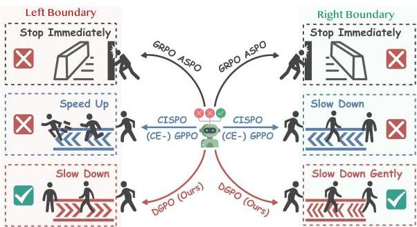
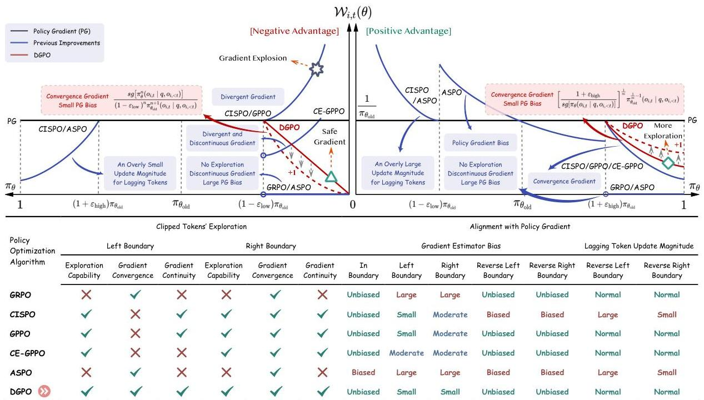
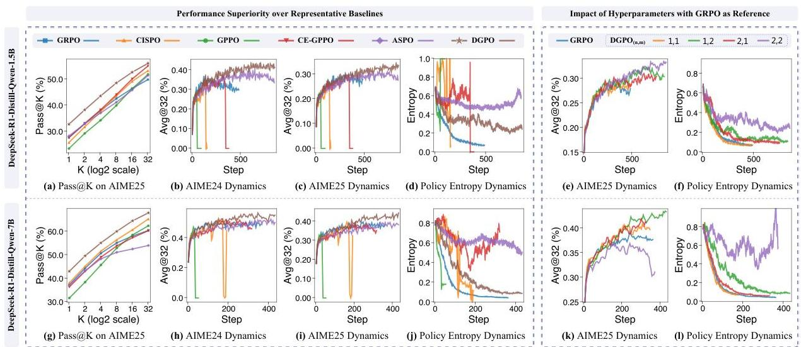
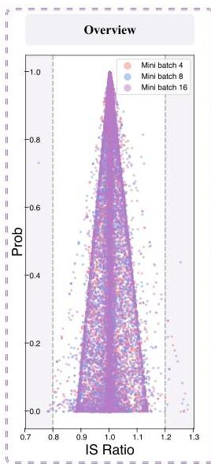
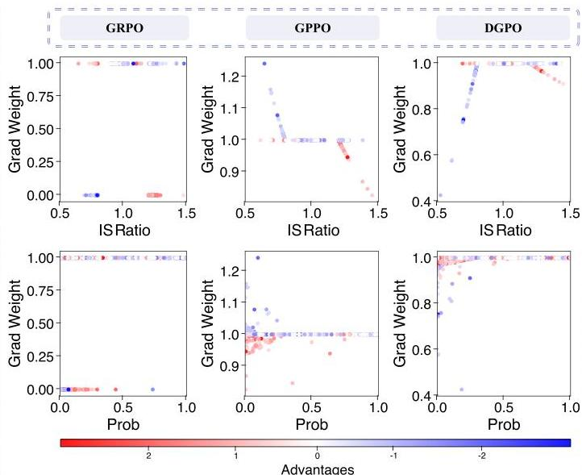
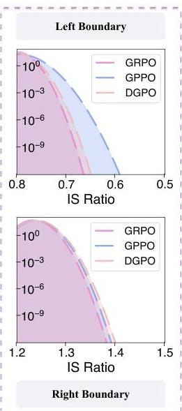

# From  $\log \pi$  to  $\pi$ : Taming Divergence in Soft Clipping via Bilateral Decoupled Decay of Probability Gradient Weight

Xiaoliang Fu $^{1,2,*}$ , Jiaye Lin $^{1,*}$ , Yangyi Fang $^{1,3,*}$ , Chaowen Hu $^{1}$ , Cong Qin $^{1,4}$ , Zekai Shao $^{2}$ , Binbin Zheng $^{1,5}$ , Lu Pan $^{1}$ , Ke Zeng $^{1,\dagger}$ $^{1}$ Meituan  $^{2}$ Fudan University  $^{3}$ Tsinghua University
$^{4}$ Peking University  $^{5}$ University of Science and Technology of China
{fuxiaoliang04, linjiaye, fangyangyi}@meituan.com

# Abstract

Reinforcement Learning with Verifiable Rewards (RLVR) has catalyzed a leap in Large Language Model (LLM) reasoning, yet its optimization dynamics remain fragile. Standard algorithms like GRPO enforce stability via "hard clipping", which inadvertently stifles exploration by discarding gradients of tokens outside the trust region. While recent "soft clipping" methods attempt to recover these gradients, they suffer from a critical challenge: relying on log-probability gradient  $(\nabla_{\theta}\log \pi_{\theta})$  yields divergent weights as probabilities vanish, destabilizing LLM training. We rethink this convention by establishing probability gradient  $(\nabla_{\theta}\pi_{\theta})$  as the superior optimization primitive. Accordingly, we propose Decoupled Gradient Policy Optimization (DGPO), which employs a decoupled decay mechanism based on importance sampling ratios. By applying asymmetric, continuous decay to boundary tokens, DGPO resolves the conflict between stability and sustained exploration. Extensive experiments across DeepSeek-R1-Distill-Qwen series models (1.5B/7B/14B) demonstrate that DGPO consistently outperforms strong baselines on various mathematical benchmarks, offering a robust and scalable solution for RLVR. Our code and implementation are available at: github.com/VenomRose-Juri/DGPO-RL.

# 1 Introduction

Reinforcement Learning (RL) has emerged as a transformative paradigm for aligning Large Language Models (LLMs) with human intent, shifting focus from imitation learning to goal-driven optimization (Ouyang et al., 2022; Shao et al., 2024; Guo et al., 2025). In reasoning-intensive domains like mathematics, Reinforcement Learning with Verifiable Rewards (RLVR) achieves remarkable success by leveraging ground-truth feedback to enhance accuracy and logical coherence (Lightman

Figure 1: Schematic overview of our DGPO algorithm. While "hard clipping" methods (GRPO/ASPO) discard gradients at boundaries, and prior "soft clipping" approaches (CISPO/GPPO/CE-GPPO) risk divergence on the left boundary and limit exploration on the right boundary, DGPO optimizes the gradient decay mechanism accordingly. By enforcing a controlled "Slow Down" behavior for stability and a "Slow Down Gently" behavior to sustain exploration, DGPO effectively resolves the exploration-stability conflict while maintaining minimal bias against the true policy gradient.

et al., 2023b; Shao et al., 2024). Beyond standard benchmarks, stronger reasoning has also shown promise in optimization modeling, tool-augmented mathematical problem solving, scientific explanation, and narrative generation (Liu et al., 2026; Luo et al., 2025; Shao et al., 2025b,a).

Despite this promise, RLVR optimization remains fragile from the conflict between exploration and stability. Algorithms like PPO (Schulman et al., 2015) and GRPO (Shao et al., 2024) enforce a trust region by "hard clipping" the Importance Sampling (IS) ratio  $(\pi_{\theta} / \pi_{\theta_{\mathrm{old}}})$ . While preventing destructive policy shifts, this inadvertently induces a vanishing gradient for exploration. Tokens drifting outside the trust region – representing valuable exploratory steps – receive zero updates, leading to entropy collapse and premature convergence (Williams and Peng, 1991; Eysenbach and Levine, 2021).

Recently, "soft clipping" approaches attempt to preserve gradients for out-of-bound tokens (Chen et al., 2025; Su et al., 2025a,b). However, we

---

identify a fundamental challenge: these methods predominantly operate on log-probability gradient ($\nabla_{\theta}\log\pi_{\theta}$). As probability approaches zero, the gradient weight of log-probability-based methods grows divergently. This causes catastrophic instability at the left boundary (where the IS ratio is extremely low), disproportionately penalizing tokens with vanishing probabilities.

Accordingly, we propose a paradigm shift: establishing probability gradient ($\nabla_{\theta}\pi_{\theta}$) as the primary optimization primitive over log-probability gradient ($\nabla_{\theta}\log\pi_{\theta}$). By analyzing the gradient landscape in probability space, we derive criteria for optimal weighting: (1) sustain exploration for clipped tokens, (2) ensure stability via convergent weights at boundaries, and (3) maximize alignment with the unbiased policy gradient.

In this paper, we propose Decoupled Gradient Policy Optimization (DGPO) guided by these principles. DGPO replaces “hard clipping” with a decoupled decay mechanism applied to the probability gradient weight. It applies a polynomial decay to tokens with low IS ratios (left boundary) for stability, and a reciprocal radical decay to tokens with high IS ratios (right boundary) to foster exploration. This mathematically guarantees gradient continuity and prevents the weight divergence seen in prior methods. Our contributions are summarized as:

- We introduce a novel perspective, establishing the gradient of probability, rather than log-probability, as the superior optimization primitive in LLMs, with two key insights: the inherent alignment of RL objectives and the geometric symmetry of probability space, which facilitates stable gradient design.
- We propose DGPO, which leverages a decoupled adaptive decay mechanism to reconcile the exploration-stability conflict. Crucially, this design preserves gradients for clipped tokens while rigorously preventing weight divergence.
- Comprehensive experiments against competitive baselines across mathematical reasoning benchmarks demonstrate the effectiveness of DGPO. Further results on diverse models scales confirm its scalability and robustness.

## 2 Related Works

### 2.1 RLVR in LLMs

RLVR utilizes deterministic signals (e.g., correct answers) rather than learned reward models to enhance LLM reasoning *(Uesato et al., 2022)*. Recent advancements like DeepSeek-Math *(Shao et al., 2024)* popularized GRPO, which efficiently normalizes rewards within a sampled group, eliminating the need for a critic. However, GRPO inherits the clipping-induced exploration limitations of PPO.

### 2.2 Importance Sampling and Clipping

IS enables off-policy training by correcting distribution shifts via the ratio $\pi_{\theta}/\pi_{\theta_{\text{old}}}$ *(Precup et al., 2000; Schulman et al., 2015)*. To prevent variance explosion, PPO *(Schulman et al., 2017)* clips this ratio within $[1-\varepsilon,1+\varepsilon]$. This “hard clipping” mechanism zeros out gradients for outlier tokens, prioritizing exploitation while neglecting low-probability tokens essential for exploration, causing rapid entropy decay *(O’Donoghue et al., 2016; Yu et al., 2025)*. To mitigate exploration losses, several methods dynamically adjust clipping bounds *(Yu et al., 2025; Yang et al., 2025a)*, allowing more updates for specific tokens. However, they still rely on hard boundaries, inevitably discarding gradient information for tokens beyond the adjusted thresholds.

### 2.3 Soft Clipping Policy Optimization

More recent approaches replace “hard clipping” with soft schemes. For instance, CISPO *(Chen et al., 2025)* combines “soft clipping” with soft dual clip *(Ye et al., 2020)*, while GPPO *(Su et al., 2025a)* retains a constant log-probability gradient weight for out-of-bound tokens. Crucially, both CISPO and GPPO suffer from left boundary instability: as $\pi_{\theta}\rightarrow 0$, the gradient grows indefinitely. Without proper decay mechanisms, this results in divergent updates that destabilize training. CE-GPPO *(Su et al., 2025b)* attempts to scale boundary gradients via hyperparameters but fails to resolve the underlying divergence. Distinctly, ASPO *(Wang et al., 2025)* proposes a reversed ratio to balance updates. Compared with these approaches, DGPO redefines the optimization target in probability space to ensure theoretical continuity and stability.

## 3 Preliminary

#### Problem Definition.

In this paper, we focus on RLVR settings. Given a query $q$ from dataset $\mathcal{D}$, a policy $\pi_{\theta}$ generates a response $o$. The rule-based reward function $r(q,o)\in\{-1,1\}$ evaluates the correctness of each response. Following GRPO *(Shao et al., 2024)*, for each query $q$, a group of $G$ outputs $\{o_{i}\}_{i=1}^{G}$ is sampled from the old policy $\pi_{\theta_{\text{old}}}$. The advantage $\hat{A}_{i}$ is computed by normalizing the

---

group-level rewards: $\hat{A}_i = (r(q,o_i) - \mu_R) / \sigma_R$, where $\mu_R$ and $\sigma_R$ denote the mean and standard deviation of the rewards within the group.

Unified Gradient Formulation. To align off-policy training with reward maximization while constraining policy shifts for stability, most RLVR algorithms employ IS and clipping mechanisms. Thus, we formulate a unified gradient estimator that encompasses these methods. Let $w_{i,t}(\theta) = \frac{\pi_{\theta}(o_{i,t}|q,o_{i,<t})}{\pi_{\theta_{\mathrm{old}}}(o_{i,t}|q,o_{i,<t})}$ $1="" $\mathcal{f}_{i,t}(\theta)$="" $\mathcal{f}_{i,t}(\theta)$,="" $\mathcal{f}_{i,t}^{\mathrm{ceo}}(\theta)="\begin{cases}1" $\mathcal{f}_{i,t}^{\mathrm{ceo}}(\theta),&{\rm="" $\mathcal{f}_{i,t}^{\mathrm{ceo}}(\theta)\right|="\frac{1}{\sum_{i=1}^{G}|o_{i}|}$" $\mathcal{f}_{i,t}^{\mathrm{ceo}}(\theta)\hat{a}_{i}\nabla_{\theta}\log\pi_{\theta}(o_{i,t}|q,o_{i,<t}).$="" $\mathcal{f}_{i,t}^{\mathrm{ceo}}(\theta)\right|="\frac{1}{\sum_{i=1}^{G}|o_{i}|}$" $1="" $1+\varepsilon_{\mathrm{high}})$="" $1+\varepsilon_{\mathrm{high}})$)="" $1-\varepsilon_{\mathrm{low}}$="" $1-\varepsilon_{\mathrm{low}}\right|="\frac{1}{\sum_{i=1}^{G}|o_{i}|}$" $1-\varepsilon_{\mathrm{high}})$).="" $\mathcal{f}_{i,t}^{\mathrm{ceo}}(\theta)$="" $\mathcal{f}_{i,t}^{\mathrm{ceo}}(\theta)\right|="\frac{1}{\sum_{i=1}^{G}|o_{i}|}$" $\mathcal{f}_{i,t}^{\mathrm{ceo}}(\theta)$="" $\mathcal{f}_{i,t}^{\mathrm{ceo}}(\theta)\right|$="" $\mathcal{f}_{i,t}^{\mathrm{cispo}}(\theta)="\begin{cases}0,&{\rm" $\mathcal{f}_{i,t}^{\mathrm{cispo}}(\theta)\right|="\frac{1}{\sum_{i=1}^{G}|o_{i}|}$" $\mathcal{f}_{i,t}^{\mathrm{cispo}}(\theta)\right|$="" $\mathcal{f}_{i,t}^{\mathrm{cispo}}(\theta)\right|$="" $1+\varepsilon_{\mathrm{high}})$)="" $1+\varepsilon_{\mathrm{high}})\right|="\frac{1}{\sum_{i=1}^{G}|o_{i}|}$" $1-\varepsilon_{\mathrm{low}}$="" $1+\varepsilon_{\mathrm{high}})\right|="\frac{1}{\sum_{i=1}^{G}|o_{i}|}$" $1-\varepsilon_{\mathrm{low}}\right|="\frac{1}{\sum_{i=1}^{G}|o_{i}|}$" $1+\varepsilon_{\mathrm{high}}$.="" $\mathcal{f}_{i,t}^{\mathrm{ceo}}(\theta)$="" $\mathcal{f}_{i,t}^{\mathrm{ceo}}(\theta)\right|="\frac{1}{\sum_{i=1}^{G}|o_{i}|}$" $\mathcal{f}_{i,t}^{\mathrm{ceo}}(\theta)$="" $\mathcal{f}_{i,t}^{\mathrm{cispo}}(\theta)$="" $\mathcal{f}_{i,t}^{\mathrm{cispo}}(\theta)\right|="\frac{1}{\sum_{i=1}^{G}|o_{i}|}$" $\mathcal{f}_{i,t}^{\mathrm{cispo}}(\theta)$="" $\mathcal{f}_{i,t}^{\mathrm{cispo}}(\theta)$="" $1+\varepsilon_{\mathrm{high}})$="" $1+\varepsilon_{\mathrm{high}})\right|="\frac{1}{\sum_{i=1}^{G}|o_{i}|}$" $1+\varepsilon_{\mathrm{high}})$)="" $1+\varepsilon_{\mathrm{high}})\right|="\frac{1}{\sum_{i=1}^{G}|o_{i}|}$" $1+\varepsilon_{\mathrm{high}}$.="" $1+\varepsilon_{\mathrm{high}})\right|="\frac{1}{\sum_{i=1}^{G}|o_{i}|}$" $1+\varepsilon_{\mathrm{low}}$="" $1+\varepsilon_{\mathrm{low}})$="" $1+\varepsilon_{\mathrm{low}})$)="" $1+\varepsilon_{\mathrm{low}})$)="" $1+\varepsilon_{\mathrm{low}})$)="" $1+\varepsilon_{\mathrm{low}})$)="" $1+\varepsilon_{\mathrm{low}})$)="" $1+\varepsilon_{\mathrm{low}})$)="" $1+\varepsilon_{\mathrm{low}})$)="" $1+\varepsilon_{\mathrm{high}})$)="" $1+\varepsilon_{\mathrm{high}})$)="" $1+\varepsilon_{\mathrm{low}})$)="" $1+\varepsilon_{\mathrm{high}})$)="" $1+\varepsilon_{\mathrm{low}})$)="" $1+\varepsilon_{\mathrm{high}})$)="" $1+\varepsilon_{\mathrm{low}})$)="" $1+\varepsilon_{\mathrm{high}})$)="" $1+\varepsilon_{\mathrm{low}})$)

---

Figure 2: Comparative analysis of gradient dynamics. We systematically contrast DGPO with the standard GRPO, prior "soft clipping" enhancements (CISPO, GPPO, and CE-GPPO), and importance sampling improvements (ASPO). The visualization highlights the theoretical properties regarding the exploration capability of clipped tokens and the alignment with the true policy gradient, demonstrating DGPO's superior stability and gradient consistency.

Probability as the Optimization Primitive. To substantiate this claim, we contrast the token-level objectives of Supervised Fine-Tuning (SFT) and RL. SFT maximizes the mean of expert token log-probabilities, with the gradient estimator as:

$$
\nabla_ {\theta} \mathcal {J} _ {\mathrm {S F T}} (\theta) = \mathbb {E} _ {\mathcal {D}} \sum_ {t = 1} ^ {| o |} \nabla_ {\theta} \log \pi_ {\theta} \left(o _ {t} \mid q, o _ {&lt;   t}\right). \tag {7}
$$

Conversely, RL (under binary advantage assumptions) equivalently maximizes the mean of expert token probabilities (derivation provided in Appendix A.1), yielding the estimator:

$$
\nabla_ {\theta} \mathcal {J} _ {\mathrm {R L}} (\theta) = \mathbb {E} _ {\mathcal {D}} \sum_ {t = 1} ^ {| o |} \nabla_ {\theta} \pi_ {\theta} \left(o _ {t} \mid q, o _ {&lt;   t}\right). \tag {8}
$$

Equations (7) and (8) reveal a fundamental distinction: SFT operates on log-probability, whereas RL inherently operates on probability. This distinction renders the SFT objective mathematically a lower bound of the RL objective (Qin and Springenberg, 2025), explaining the empirical performance ceiling often observed in SFT compared with RL (Wu et al., 2025). Consequently, we identify probability as the superior optimization primitive. Since the probability aligns more closely with the core requirements of LLM training, its gradient should be prioritized in algorithm design.

Geometric Symmetry and Boundedness. In LLM training, token probabilities reside in the symmetric and bounded interval  $(0,1)$ . This boundedness facilitates the analysis of gradient impacts on probability values and enables the design of symmetric gradient mechanisms. In contrast, log-probabilities span the asymmetric and unbounded interval  $(- \infty, 0)$ , complicating the gradient design.

## 4.2 Decoupled Gradient Policy Optimization

Instability in Soft Clipping. While clipped tokens often contain critical information essential for model performance (Liu et al., 2025; Su et al., 2025a), preserving their gradients requires a principled approach. Prior "soft clipping" works (Chen et al., 2025; Su et al., 2025a) maintain constant log-probability gradient weights in LP and HN cases. However, the gradient weights are present asymmetrically at the boundaries, contradicting the symmetric nature of probability values.

Thus, we define probability gradient weight as  $\mathcal{W}_{i,t}(\theta) = \frac{\nabla_{\theta}\mathcal{J}(\theta)}{A_i\nabla_{\theta}\pi_{\theta}(o_{i,t}|q,o_{i, &lt; t})}$ . As illustrated in Figure 2, while the right-boundary gradient weight decreases convergently (promoting stability), the left-boundary weight grows divergently. This causes negative-advantage tokens to shrink disproportionately—the smaller the probability, the larger the up

---

Table 2: Comparative analysis of gradient bias. We evaluate the bias magnitudes of DGPO and other baselines relative to the true policy gradient under different boundary conditions.

<table><tr><td>Bias Condition</td><td>Magnitude Comparison</td></tr><tr><td>In-Boundary Bias</td><td>0 = BiasM DGPO = BiasM GRPO = BiasM CISPO = BiasM GPPO = BiasM CE ≤ BiasM ASPO</td></tr><tr><td>Left-Boundary Bias</td><td>{0 &lt; BiasLN CGPO &lt; BiasLN CISPO = BiasLN GPPO &lt; BiasLN CE &lt; BiasLN GRPO = BiasLN ASPO, n = 1
0 &lt; BiasLN CISPO = BiasLN GPPO &lt; BiasLN CGPO &lt; BiasLN CE &lt; BiasLN GRPO = BiasLN ASPO, n &gt; 1}</td></tr><tr><td>Right-Boundary Bias</td><td>0 &lt; BiasHP DGPO ≤ BiasHP CISPO = BiasHP GPPO = BiasHP CE &lt; BiasHP GRPO = BiasHP ASPO</td></tr><tr><td>Reverse Left-Boundary Bias</td><td>0 = BiasLP DGPO = BiasLP GRPO = BiasLP GPPO = BiasLP CE &lt; BiasLP CISPO = BiasLP ASPO</td></tr><tr><td>Reverse Right-Boundary Bias</td><td>0 = BiasHN DGPO = BiasHN GRPO = BiasHN GPPO = BiasHN CE &lt; BiasHN CISPO = BiasHN ASPO</td></tr></table>

date magnitude—leading to training instability (Su et al., 2025b). Although CE-GPPO attempts to mitigate this via hyperparameters, it does not resolve the divergent growth, leaving the risk of collapse.

DGPO Formulation. To address these limitations, we propose DGPO in this paper, designed to: (1) preserve gradient for clipped tokens, (2) stabilize exploration via adaptive gradient decay, and (3) minimize policy gradient bias for alignment.

We define the weighting function  $\mathcal{W}_{i,t}^{\mathrm{DGPO}}(\theta)$  based on the regions defined in Table 1:

<table><tr><td rowspan="3">WdGPO(θ) = {Cleft·sgn[πθ(oi,t|q,oi, &lt;t)], if LN, Cright·sg-1/n[πθ(oi,t|q,oi, &lt;t)], if HP, 1/πθold; otherwise. (9)</td></tr></table>

Then, the objective function is formulated as:

$$
\mathcal {J} _ {\mathrm {D G P O}} (\theta) = \mathbb {E} _ {q \sim \mathcal {D}, \{o _ {i} \} _ {i = 1} ^ {G} \sim \pi_ {\theta_ {\mathrm {o l d}}} (\cdot | q)} \frac {1}{\sum_ {i = 1} ^ {G} | o _ {i} |}
$$

$$
\sum_ {i = 1} ^ {G} \sum_ {t = 1} ^ {| o _ {i} |} \mathcal {W} _ {i, t} ^ {\mathrm {D G P O}} (\theta) \hat {A} _ {i} \pi_ {\theta} \left(o _ {i, t} | q, o _ {i, &lt;   t}\right), \tag {10}
$$

where  $n, m \in \mathbb{Z}^+$  are hyperparameters controlling the decay rate, and  $sg[\cdot]$  denotes the stop-gradient operator.  $C_{\mathrm{left}} = (1 - \varepsilon_{\mathrm{low}})^{-n}\pi_{\theta_{\mathrm{old}}}^{-(n + 1)}(o_{i,t}|q,o_{i, &lt; t})$  and  $C_{\mathrm{right}} = (1 + \varepsilon_{\mathrm{high}})^{\frac{1}{m}}\pi_{\theta_{\mathrm{old}}}^{\frac{1}{m} -1}(o_{i,t}|q,o_{i, &lt; t})$  are constants ensuring continuity of gradient weights (derivation provided in Appendix A.2).

# 4.3 Theoretical Analysis and Advantages

Gradient Preserving and Exploration. Following prior gradient-preserving methods, DGPO adopts "soft clipping" to maintain gradient of clipped tokens. By retaining adaptively reduced gradients in both LN (Low Ratio, Negative Advantage) and HP (High Ratio, Positive Advantage) scenarios, DGPO enables sustained exploration for clipped tokens, enhancing the model's exploration potential and raising its convergence upper bound.

Symmetric Stability Control. To ensure training stability while adhering to the principle of trust region optimization (limiting divergence between  $\pi_{\theta}$  and  $\pi_{\theta_{\mathrm{old}}}$ ), gradient weights must decrease as the policy deviates. DGPO achieves this via a decoupled design: (1) Left Boundary: A positive integer power function of  $\pi_{\theta}$ , ensuring weights decay as probability decreases. (2) Right Boundary: A reciprocal radical power function of  $\pi_{\theta}$ , ensuring weights decay as probability increases.

Furthermore, DGPO manages entropy dynamics by controlling the "openness" of gradient weights. Since LN tokens drive entropy reduction and HP tokens drive entropy increase (Cui et al., 2025; Su et al., 2025b), the default symmetric setting ( $m = 1$  and  $n = 1$ ) may lead to rapid entropy decay. We balance this by adjusting  $n$  (reducing left-boundary openness) and  $m$  (increasing right-boundary openness). Additionally, multiplying gradient weights by  $C_{\mathrm{left}}$  and  $C_{\mathrm{right}}$  ensures continuity at the boundaries, ensuring a smooth transition between stable updates and decelerated exploration.

Minimal Bias Estimation. A critical challenge of existing RL algorithms is their deviation from the distribution correction principle of IS, resulting in significant bias relative to the true policy gradient. DGPO minimizes this bias to establish a stronger theoretical guarantee, which is the key factor for higher convergence bounds of model performance. Table 2 presents a comparative analysis of bias (proofs provided in Appendix A.3).

Notably, while CISPO and GPPO theoretically achieve minimal left-boundary bias when  $n &gt; 1$ , they suffer from divergent gradient weights, constituting the root cause of training collapse. DGPO uniquely balances these objectives: it ensures gradient continuity and adaptive convergence while achieving minimal bias at  $n = 1$ , and maintaining a constant bias ratio relative to CISPO/GPPO for  $n &gt; 1$ , thus offering a robust trade-off between

---

Table 3: Comparison results of different methods on various benchmarks. Avg@32 (%) and Pass@32 (%) are abbreviated as A@32 and P@32. The best results are bold, and the second-best results are underlined, respectively.

<table><tr><td rowspan="2">Method</td><td colspan="2">AIME24</td><td colspan="2">AIME25</td><td colspan="2">AMC23</td><td colspan="2">MATH500</td><td colspan="2">Minerva</td><td colspan="2">Olympiad</td><td colspan="2">Avg.</td></tr><tr><td>A@32</td><td>P@32</td><td>A@32</td><td>P@32</td><td>A@32</td><td>P@32</td><td>A@32</td><td>P@32</td><td>A@32</td><td>P@32</td><td>A@32</td><td>P@32</td><td>A@32</td><td>P@32</td></tr><tr><td colspan="15">DEEPSEEK-R1-DISTILL-QWEN-1.5B</td></tr><tr><td>GRPO</td><td>33.2</td><td>71.8</td><td>27.7</td><td>49.9</td><td>79.5</td><td>94.8</td><td>77.6</td><td>90.8</td><td>26.1</td><td>48.8</td><td>46.3</td><td>64.7</td><td>48.4</td><td>70.1</td></tr><tr><td>CISPO</td><td>34.8</td><td>69.1</td><td>25.8</td><td>53.3</td><td>76.9</td><td>94.9</td><td>76.8</td><td>91.8</td><td>26.5</td><td>54.2</td><td>45.8</td><td>65.8</td><td>47.8</td><td>71.5</td></tr><tr><td>GPPO</td><td>29.6</td><td>60.5</td><td>23.5</td><td>51.9</td><td>73.5</td><td>94.1</td><td>76.3</td><td>89.1</td><td>26.6</td><td>50.0</td><td>43.9</td><td>64.2</td><td>45.6</td><td>68.3</td></tr><tr><td>CE-GPPO</td><td>35.1</td><td>70.2</td><td>27.7</td><td>55.1</td><td>82.5</td><td>95.0</td><td>76.7</td><td>90.2</td><td>27.8</td><td>50.5</td><td>45.6</td><td>63.1</td><td>49.2</td><td>70.7</td></tr><tr><td>ASPO</td><td>36.4</td><td>73.2</td><td>28.3</td><td>51.5</td><td>83.1</td><td>94.7</td><td>74.6</td><td>90.5</td><td>26.0</td><td>49.8</td><td>44.9</td><td>63.7</td><td>48.9</td><td>70.6</td></tr><tr><td>Ours</td><td>43.3</td><td>79.3</td><td>32.8</td><td>56.1</td><td>86.0</td><td>95.0</td><td>77.9</td><td>91.0</td><td>28.2</td><td>50.4</td><td>48.0</td><td>66.4</td><td>52.7</td><td>73.0</td></tr><tr><td colspan="15">DEEPSEEK-R1-DISTILL-QWEN-7B</td></tr><tr><td>GRPO</td><td>48.2</td><td>82.5</td><td>37.4</td><td>60.5</td><td>88.1</td><td>96.6</td><td>84.8</td><td>92.4</td><td>37.4</td><td>57.2</td><td>57.2</td><td>73.9</td><td>58.9</td><td>77.2</td></tr><tr><td>CISPO</td><td>51.6</td><td>76.6</td><td>38.2</td><td>65.4</td><td>90.6</td><td>96.6</td><td>82.1</td><td>91.6</td><td>38.7</td><td>56.5</td><td>54.3</td><td>69.9</td><td>59.3</td><td>76.1</td></tr><tr><td>GPPO</td><td>43.1</td><td>72.5</td><td>31.7</td><td>62.5</td><td>85.6</td><td>94.9</td><td>83.2</td><td>95.4</td><td>33.1</td><td>59.3</td><td>53.2</td><td>74.3</td><td>55.0</td><td>76.5</td></tr><tr><td>CE-GPPO</td><td>48.7</td><td>76.9</td><td>36.4</td><td>60.4</td><td>90.5</td><td>95.0</td><td>84.3</td><td>93.3</td><td>39.0</td><td>55.4</td><td>54.9</td><td>72.5</td><td>59.0</td><td>75.6</td></tr><tr><td>ASPO</td><td>51.8</td><td>79.6</td><td>37.1</td><td>54.1</td><td>90.0</td><td>97.2</td><td>83.8</td><td>94.9</td><td>37.0</td><td>59.2</td><td>54.1</td><td>72.8</td><td>59.0</td><td>76.3</td></tr><tr><td>Ours</td><td>55.5</td><td>81.9</td><td>43.1</td><td>68.0</td><td>90.6</td><td>96.6</td><td>85.4</td><td>92.0</td><td>39.8</td><td>56.7</td><td>57.7</td><td>72.0</td><td>62.0</td><td>77.9</td></tr></table>

stability and theoretical correctness.

# 5 Experiments

# 5.1 Experimental Setup

Configurations. For all experiments, we employ DeepSeek-R1-Distill-Qwen (Guo et al., 2025) with various scales as backbone models to validate the effectiveness of DGPO. The open-source DAPOMath-17K dataset (Yu et al., 2025) is utilized for model training. During training, rule-based rewards are computed with math_verify (Kydlicek, 2025), while a conservative method prime_math is used for evaluation (Lightman et al., 2023a,b).

Moreover, to ensure consistent convergence dynamics across different model scales, we calibrate the learning rate to maintain a constant total gradient variance (derivation provided in Appendix A.4). Accordingly, the learning rates are set as follows:  $1.0 \times 10^{-6}$  for 1.5B,  $4.63 \times 10^{-7}$  for 7B, and  $3.27 \times 10^{-7}$  for 14B. We set the batch size to 512 and the mini-batch size to 32. This configuration enables 16 off-policy updates per IS step, sufficiently amplifying the influence of boundary tokens.  $\varepsilon_{\mathrm{low}}$  and  $\varepsilon_{\mathrm{high}}$  are fixed to 0.2. Detailed configurations are available in Appendix B.

Benchmarks and Metrics. We assess the generalization of reasoning capabilities on widely used mathematical benchmarks, i.e., AIME24 (MAA,

2024), AIME25 (MAA, 2025), AMC23 (MAA, 2023), MATH500 (Hendrycks et al., 2021), Minerva (Lewkowycz et al., 2022), and Olympiad-Bench (He et al., 2024). More details about benchmarks are described in Appendix B. We report Avg@32 to measure the expected performance and Pass@32 to gauge the potential capability.

Baselines. We benchmark DGPO against standard GRPO and variants employing distinct gradient weighting strategies, including "soft clipping" (CISPO and GPPO), scaled "soft clipping" (CE-GPPO, adopting the recommended  $\beta_{1} = 0.75$  and  $\beta_{2} = 1$ ), and reverse gradient weight (ASPO).

# 5.2 Main Results

Overall Performance. Table 3 presents the performance comparison across 1.5B and 7B scales. DGPO demonstrates superior performance across the majority of benchmarks on both scales. On the 1.5B model, DGPO surpasses the vanilla GRPO by  $+4.3\%$  and the best baseline (CE-GPPO) by  $+3.5\%$  in average Avg@32. On the 7B model, the improvement is also significant, with DGPO outperforming GRPO by  $+3.1\%$  and CISPO by  $+2.7\%$ . As shown in Figure 3(a,g), DGPO consistently maintains higher Pass@K scores on AIME2025 compared with all baselines, demonstrating superior potential capability. Detailed results of Pass@K  $(K = 1,\dots ,32)$  on AIME24 and AIME25 across

---

Figure 3: Comprehensive comparison of training dynamics and performance. Top row: DeepSeek-R1-Distill-Qwen-1.5B results. Bottom row: DeepSeek-R1-Distill-Qwen-7B results. Columns (L-R): Pass@K on AIME25, Avg@32 on AIME24/25, policy entropy, followed by hyperparameter analysis for Avg@32 and entropy.

all model scales are provided in Appendix C.3.

Training Dynamics. Figure 3(b,c,h,i) illustrates the training dynamics of Avg@32 on AIME2024 and AIME2025. DGPO consistently outperforms all baselines in the mid-to-late training stages. Notably, algorithms with divergent gradient weights at the left boundary (CISPO, GPPO, and CE-GPPO) succumb to training collapse, and algorithms with larger policy gradient bias (GRPO and ASPO) exhibit suboptimal convergence.

Figure 3(d,j) depicts the entropy dynamics. GRPO exhibits an entropy drop early in the training process, indicating premature exploitation that limits the achievable performance ceiling. Conversely, ASPO maintains excessively high entropy, reflecting over-exploration and insufficient exploitation, while CISPO, GPPO, and CE-GPPO show unstable entropy patterns leading to eventual collapse. DGPO demonstrates a moderate and controlled entropy reduction, signifying an optimal balance between exploration and exploitation.

# 5.3 Hyperparameter Analysis

We investigate the impact of hyperparameters  $n$  and  $m$  by expanding from the baseline ( $n = 1$ ,  $m = 1$ ) to four configurations: (1, 1), (1, 2), (2, 1), and (2, 2). Figure 3(e,k) shows their performance on AIME25 across 1.5B and 7B models.

Robustness and Patterns. All DGPO configurations outperform GRPO (with the exception of  $n = 2$  and  $m = 2$  on the 7B model), demonstrating our algorithm's robustness. However, the optimal

configuration varies by scale: (2, 2) for 1.5B and (1, 2) for 7B. Analyzing Figure 3(e,f,k,l), which reveals a consistent pattern: increasing  $n$  or  $m$  generally yields: (1) improved performance, (2) elevated overall entropy levels, but (3) reduced entropy stability. Notably, significant entropy volatility is observed only in the 7B model under the (2, 2) setting that negates the performance benefits.

Tuning Guideline. Based on these observations, we propose a heuristic for hyperparameter tuning: Enhance exploration by increasing  $n$  and  $m$  as long as entropy remains stable. Upon observing instability, revert to the preceding stable configuration. Empirically, we recommend  $n = 1$  and  $m = 2$  as a robust and conservative baseline configuration.

Table 4: Scalability analysis of average Avg@32 (A) and Pass@32 (P) across 1.5B, 7B, and 14B models.

<table><tr><td>Method</td><td>1.5B (A / P)</td><td>7B (A / P)</td><td>14B† (A / P)</td></tr><tr><td>GRPO</td><td>48.4 / 70.1</td><td>58.9 / 77.2</td><td>53.6 / 67.4</td></tr><tr><td>DGPO</td><td>52.7 / 73.0</td><td>62.0 / 77.9</td><td>56.7 / 70.4</td></tr><tr><td>Improvement</td><td>+4.3 / +2.9</td><td>+3.1 / +0.7</td><td>+3.1 / +3.0</td></tr></table>

Scaling to Larger Models. The instability of (2, 2) on 7B (absent in 1.5B) suggests that larger models exhibit higher intrinsic entropy volatility, necessitating more conservative hyperparameters.

---

(a) Prob vs IS Ratio

(b) IS Ratio vs Grad Weight and Prob vs Grad Weight

(c) IS Ratio
Figure 4: Comparison of gradient weight distributions (Prob: Probability, Grad: Gradient). (a) Overall distribution. (b) Detailed scatter plots of grad weight vs. IS ratio (top row) and prob (bottom row) across three methods: GRPO (left), GPPO (middle), and DGPO (right). Points are colored by advantage. (c) Boundary distribution analysis.

To validate this pattern, we apply the optimal 7B configuration  $(n = 1, m = 2)$  to the 14B model.

As summarized in Table 4, DGPO consistently outperforms GRPO across all model scales in both Avg@32 and Pass@32, which confirms that the benefits of our decoupled gradient mechanism effectively transfer to larger models. Furthermore, the training dynamics and entropy variations of the 14B model (shown in Appendix C.1) exhibit stable convergence patterns similar to 7B under DGPO.

# 5.4 Mechanistic Analysis via Visualization

Mechanism of Stability (Left Boundary). Why does DGPO prevent collapse? Figure 4(a) visualizes the joint distribution of probability and IS ratios in the final mini-batch. Crucially, tokens at both boundaries are predominantly low-probability tokens. Figure 4(b) further details the relationship between probability, IS ratio, advantage, and relative gradient weight (normalized by  $\pi_{\theta_{\mathrm{old}}}$  probability) for GRPO (zero weight), GPPO (divergent weight), and DGPO (convergent weight). As illustrated, GRPO's zero gradients at the left boundary lead to the narrowest ratio distribution and insufficient exploration. Conversely, GPPO's divergent weights induce an excessively broad distribution, eventually precipitating training collapse due to instability (Figure 3(b,c,h,i)) (Yang et al., 2025b). In contrast, DGPO maintains convergent relative weights, resulting in a ratio distribution

only slightly wider than GRPO that successfully balances stability with effective exploration.

Mechanism of Improvement (Right Boundary). Why does DGPO perform better? Compared with GRPO (where right-boundary tokens have zero gradient and the narrowest ratio distribution), DGPO maintains gradients to foster exploration. Compared with GPPO (which uses a reciprocal standard weight equivalent to DGPO's  $m = 1$ ), DGPO with  $m = 2$  employs a reciprocal radical weight. This design induces the widest ratio distribution on the right boundary (Figure 4(c)), significantly enhancing performance. This finding aligns with prior research suggesting that increasing the contribution of positive samples improves performance (Yang et al., 2025b; Xi et al., 2025), and is consistent with our hyperparameter analysis in Section 5.3 where increasing  $m$  boosts results.

# 6 Conclusion

In this paper, we revisit the fundamental optimization primitive in RLVR and establish probability—rather than log-probability—as the essential alignment target. We argue that the prevalent focus on log-probability gradients in prior "soft clipping" methods constitutes a misalignment with the true RL objective, leading to divergent gradient weights at boundaries and consequent training instability. To address this critical issue, we propose DGPO, which directly optimizes probability gra

---

dients via a decoupled decay mechanism based on IS ratios. This approach effectively resolves the inherent conflict between training stability and gradient preservation. Extensive experiments across the DeepSeek-R1-Distill-Qwen series models with multiple scales (1.5B, 7B, and 14B) demonstrate that DGPO consistently outperforms competitive baselines on various mathematical reasoning benchmarks, validating that aligning with the probability objective is crucial for unlocking the full potential of LLM reasoning capabilities through RL.

## 7 Limitations

We discuss two practical limitations of our work. (1) Domain Specificity: In line with most RLVR studies, our experiments are primarily conducted on mathematical reasoning datasets (e.g., AIME, MATH500) where verifiable rewards are readily available. While we believe the principles of probability gradients are generalizable, the efficacy of DGPO in domains with sparse or subjective rewards (e.g., creative writing) remains to be verified. (2) Computational Constraints: Due to limited computational resources, our scaling laws analysis is restricted to models up to 14B parameters. Although we observed consistent performance gains and predictable hyperparameter patterns from 1.5B to 14B, validating these findings on significantly larger foundation models (e.g., 70B+) would provide further insights into the method’s scalability.

## 8 Ethical Considerations

We have carefully considered the ethical implications of our research and provide the following statements: (1) Compliance and Transparency: Throughout this study, we have strictly followed established ethical guidelines. Our findings are reported honestly, and we provide comprehensive theoretical derivations to ensure transparency. (2) Data Usage: The datasets employed in our experiments (e.g., DAPO-Math-17k) originate from publicly available sources. No private, sensitive, or confidential user information was used at any stage of our research. (3) Reproducibility: We offer detailed descriptions of the hyperparameter configurations, including the specific tuning guidelines for $n$ and $m$, to ensure the reproducibility of our results. (4) Open Source: In the interest of openness and to facilitate future research in the RLVR community, we have made our code available anonymously and will fully open-source it upon the acceptance of this paper.