# PRISM: Demystifying Retention and Interaction in Mid-Training

Bharat Runwal, Ashish Agrawal, Anurag Roy, Rameswar Panda

IBM Research, MIT-IBM Watson AI Lab

We present PRISM, a comprehensive empirical study of mid-training design choices for large language models (LLMs). Through controlled experiments across seven base models spanning four families (Granite, LLaMA, Mistral, Nemotron-H), two architecture types (dense Transformer and attention-Mamba hybrid), and scales from 3B to 24B parameters, we show that a mid-training phase of $\sim$27B high-quality tokens yields consistent gains of +15 to +40 points on math, +5 to +12 points on code, and +6 to +13 points on science (GPQA-Diamond) benchmarks while preserving general performance. The full PRISM $\rightarrow$ RL pipeline improves the macro-average (domain-weighted) across six reasoning benchmarks from under 12 to 29–42 (a 3–4$\times$ improvement), whereas RL applied directly to most of the base models remains substantially less effective, with AIME scores near zero. Data composition choices matter most at mid-training, not at RL: including science data during mid-training unlocks +17 to +28 point GPQA-Diamond gains during RL, while changing the RL mix produces $<$2 point differences. Mechanistically, mid-training densely restructures $>$90% of model weights, while RL makes sparse, front-loaded refinements to $\sim$5% of parameters. Representation analysis (CKA) across three models and three input distributions confirms that RL consistently preserves mid-training’s representational geometry ($>$0.998 CKA) across both dense Transformers and hybrid architectures. Crucially, RL applies identical weight changes regardless of starting point, yet only succeeds on mid-trained models, consistent with mid-training placing the model in a weight configuration from which RL can effectively improve performance. Our results demonstrate that retention-aware mid-training is a highly effective intermediate step for reliable reasoning enhancement and provide practical guidance for designing robust mid-training pipelines.

Correspondence: Bharat Runwal at bharatrunwal@gmail.com
$\oplus$ Project Page: Website
$\otimes$ Models & Data: HuggingFace

## 1 Introduction

The training pipeline for Large Language Models (LLMs) has evolved beyond the traditional two-stage recipe of pre-training followed by alignment. State-of-the-art models now incorporate an additional intermediate stage, *mid-training*, in which higher-quality, domain-focused data mixtures are used to imbue reasoning capabilities before downstream fine-tuning and reinforcement learning (RL) *(Team et al., 2025; Olmo et al., 2025)*. Yet despite its growing adoption, mid-training remains poorly understood: the field lacks systematic guidance on *what data to use*, *when to apply it*, *how it interacts with RL*, and *whether it generalizes across architectures*.

We present PRISM (Demystifying Retention and Interaction in Mid-Training), shown in Fig. 1, a comprehensive empirical study that addresses these questions through controlled experiments across seven open-source base models spanning four families (Granite, LLaMA, Mistral, Nemotron-H), two architecture types (dense Transformer and attention-Mamba hybrid), and scales from 3B to 24B parameters. Using targeted mid-training mixtures of only $\sim$27B high-quality tokens, we produce the following key findings:

- Mid-training substantially improves reasoning performance. Across all tested models, PRISM yields +15 to +40 point gains on math benchmarks and +5 to +12 points on code, with science gains of +6 to +13 points on Granite and hybrid models, while preserving general-purpose performance.

---

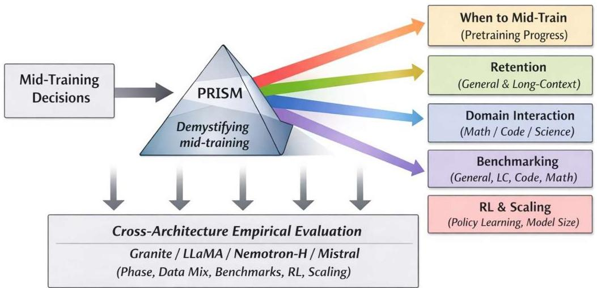
Figure 1 PRISM overview. Mid-training decisions are decomposed into their principal design axes, including retention of general and long-context abilities, domain interaction (math, code, science), benchmark selection, reinforcement learning compatibility, and scaling behavior. PRISM enables holistic evaluation of mid-training choices across model families at scale.

- Mid-training significantly enhances RL effectiveness. The full PRISM  $\rightarrow$  RL pipeline improves the macro-average (domain-weighted) across six reasoning benchmarks (AIME'24, AIME'25, MATH500, LiveCodeBench, Codeforces, GPQA-Diamond) from under 12 to 29-42, a  $3 - 4\times$  improvement. RL applied directly to base models is substantially less effective, with AIME scores remaining near zero.
- Data composition matters most at mid-training, not at RL. Changing the mid-training mix from Math+Code to Math+Code+Science shifts AVG by +3 to +6 points, while changing the RL mix produces &lt;2 point differences. Science data at mid-training unlocks +17 to +28 point GPQA-Diamond gains during RL.
- Benefits generalize across architectures and scales. Both dense Transformers and attention-Mamba hybrids benefit consistently from PRISM, from 3B to 24B parameters.
- RL expands the solvability frontier. For Granite-3.3, RL on PRISM-mid-trained models progressively solves prompts that were initially unsolvable, with training curves that remain non-saturating across hundreds of steps.
- Mid-training and RL operate through fundamentally different mechanisms. Weight-level analysis reveals that mid-training densely restructures  $&gt;90\%$  of parameters, while RL sparsely refines  $\sim 5\%$ , with identical weight footprints regardless of whether mid-training preceded it. Representation analysis (CKA) across three models and three input distributions confirms that RL consistently preserves mid-training's representational geometry ( $&gt;0.998$  CKA) across both dense Transformers and hybrid architectures, while mid-training's representational impact is model-specific. RL optimization is front-loaded, with most weight changes in the first  $\sim 200 - 400$  steps. Behaviorally, mid-training produces extended reasoning chains in model outputs. On held-out MATH500 problems, the full pipeline improves pass rates from  $2.6 - 66.6\%$  (base) to  $64.6 - 83.0\%$  across three model families.

The term mid-training has been used inconsistently in the literature. Some works treat it as a long-context extension phase (Abdin et al., 2024), others as a higher-quality annealing stage for domain knowledge (OLMo et al., 2025), and recent work investigates mid-training choices that prepare models for RL by incorporating instruction-following data and chain-of-thought traces (Wang et al., 2025). These different usages have converged in practice, but the field lacks a holistic study that systematically quantifies the trade-offs induced by mid-training design choices across data mixtures, evaluation strategies, and downstream RL. PRISM fills this gap.

---

The rest of the paper is organized as follows. We first discuss limitations of prior mid-training approaches, then describe our data mixtures and benchmark selection. We study *when* to mid-train, followed by domain-wise and cross-model-family analyses. We then present ablation studies on long-context restoration, context length, and token budget. We provide a detailed analysis of how reinforcement learning interacts with mid-trained models, including balanced vs. unbalanced RL mixes, base-model comparisons, solvability analysis, and a comprehensive pipeline-level evaluation. Finally, we present mechanistic analyses of the PRISM pipeline through weight divergence, representation similarity (CKA), prediction entropy, correctness studies, and RL weight trajectory dynamics across four model families and two architectures.

## 2 Limitations of Prior Mid-Training Approaches

Takeaway. Prior mid-training work often delivers domain-specific gains at the cost of generalization and holistic evaluation, and is rarely coupled with broad benchmark analysis or controlled studies of downstream RL behavior.

Recent mid-training strategies for LLMs have demonstrated notable improvements in targeted capabilities such as coding and mathematical reasoning by introducing higher-quality or domain-focused data between pre-training and downstream fine-tuning or RL *(Olmo et al., 2025; Wang et al., 2025)*. However, the term *mid-training* has been used inconsistently in the literature, referring to long-context extension, data annealing, and domain-specific capability refinement, without a unified framework or standardized evaluation.

##### Narrow evaluation hides regressions.

Many studies report gains on a limited set of domain-specific benchmarks (e.g., math or code) without assessing whether these improvements preserve general-purpose capabilities or interact with other reasoning dimensions *(Wang et al., 2025)*. Long-context extension work primarily evaluates context-window scaling and retrieval-style tasks, with limited analysis of its impact on general reasoning *(Abdin et al., 2024)*. Similarly, domain-focused mid-training recipes often emphasize improvements on math or code benchmarks while omitting broad generalization and cross-domain robustness evaluations *(OLMo et al., 2025; Wang et al., 2025)*.

##### Interaction with RL remains underexplored.

A further shortcoming is the lack of controlled investigation into how mid-training interacts with downstream optimization, particularly reinforcement learning. While prior work suggests that certain mid-training strategies can facilitate RL by better aligning representations with downstream objectives, these claims are typically evaluated within narrow experimental settings and lack systematic comparison across model families, domains, and benchmark suites *(Wang et al., 2025; Zhang et al., 2025)*.

##### Concurrent work.

Recent studies have begun to address parts of these gaps. *Liu et al. (2025)* show that mid-training can serve as a distributional bridge between pre-training and post-training, reducing distributional mismatch while preserving general capabilities. *Zhang et al. (2025)* develop controlled experimental frameworks that isolate the contributions of pre-training, mid-training, and RL to reasoning generalization, highlighting mid-training as a critical yet underexplored stage. Small-scale controlled experiments provide valuable mechanistic insights with high ablation density. PRISM complements this line of work by examining mid-training design choices at 3B-24B scale across four model families, two architecture types, and multi-stage pipelines including RL, providing empirical coverage at a scale not addressed by prior work.

Taken together, these limitations motivate PRISM: a retention-aware empirical framework that evaluates mid-training choices across multiple domains, benchmark axes, and downstream RL behavior across model families to uncover trade-offs overlooked by prior work.

##

---

<table><tr><td>Dataset</td><td>Type</td><td>Tokens (B)</td></tr><tr><td>DCLM-EDU (Allal et al., 2025)</td><td>General web data</td><td>111.46</td></tr><tr><td>Open-R1 (MoT) (Lozhkov et al., 2025)</td><td>Math reasoning</td><td>0.60</td></tr><tr><td>Nemotron Post-Training v1 (Nathawani et al., 2025)</td><td>Math</td><td>35.93</td></tr><tr><td>Megamath-Web-Pro (Zhou et al., 2025)</td><td>Math web</td><td>14.73</td></tr><tr><td>Open-R1 (MoT) (Penedo et al., 2025)</td><td>Code reasoning</td><td>1.18</td></tr><tr><td>OpenCodeReasoning-2 (Ahmad et al., 2025)</td><td>Code reasoning</td><td>1.12</td></tr><tr><td>RefinCode (Huang et al., 2025)</td><td>Code web</td><td>186.44</td></tr><tr><td>StarCoder2 (Lozhkov et al., 2024)</td><td>Code web</td><td>432.73</td></tr><tr><td>Open-R1 (MoT) (Bercovich et al., 2025)</td><td>Science reasoning</td><td>0.42</td></tr><tr><td>OpenThoughts3 (Guha et al., 2025)</td><td>Science reasoning</td><td>0.73</td></tr><tr><td>WildChat-1M (Zhao et al., 2024)</td><td>Chat</td><td></td></tr><tr><td>Tulu-3 SFT Personas (Lambert et al., 2025)</td><td>Chat</td><td>0.91</td></tr><tr><td>UltraChat-200k (Ding et al., 2023)</td><td>Chat</td><td></td></tr></table>

Table 1 Datasets used in mid-training mixtures. Token counts are reported in billions (Granite 3.3, 8B).

# 3 Data Mixtures for Mid-Training

Takeaway. Mid-training performance is highly sensitive to data composition; carefully tuned mixtures that balance general web and instruction data with domain-specific reasoning sources yield robust retention and consistent gains, and we adopt these empirically validated splits across all experiments.

Table 1 summarizes the datasets used for mid-training. For the Math and Code domains, we use two data types: general web documents to retain knowledge from pretraining, and domain-specific reasoning datasets to imbue problem-solving ability. For Science, we include only reasoning-focused datasets. Prior work such as OctoThinker (Wang et al., 2025) shows that incorporating a small amount of general instruction data can stabilize reinforcement learning; accordingly, we include chat and instruction-following datasets. However, unlike OctoThinker which focuses primarily on math, our goal is to support reasoning across diverse domains while retaining broad pretraining knowledge. To this end, we include general web data (DCLM-EDU) alongside domain-specific sources.

# 3.1 Dataset Preprocessing

We apply lightweight, deterministic preprocessing to all datasets to ensure data quality and evaluation integrity.

Web data filtering. For general web data, we use the DCLM-EDU corpus and retain documents with a quality score greater than or equal to 3, following the dataset's recommended filtering guidelines. This removes low-quality or noisy documents while preserving broad coverage of general knowledge.

Reasoning datasets. For OpenCodeReasoning-2, we retain only samples whose judgment is marked as right by the QwQ evaluator model and for which sufficient test coverage is available (i.e., pass_rate  $\neq -1$ ). From this filtered pool, we randomly sample 60k Python examples and 60k C++ examples. Other reasoning datasets are used as provided, without additional filtering beyond standard dedduplication.

Chat and instruction-following data. For chat-style datasets, all conversations are normalized by explicitly prefixing utterances with speaker roles ("User:" and "Assistant:"). For WildChat-1M, we further restrict the data to high-quality conversations generated by GPT-4, following prior evidence that such filtering improves stability in downstream reinforcement learning. For all reasoning datasets and chat data, we concatenate the question and answer with a single line break between them, following (Wang et al., 2025).

Fig. 2 reports the final per-source sampling weights for three progressively richer configurations: Math-only, Math+Code, and Math+Code+Science. After experimenting with various weightings across domains, we

---

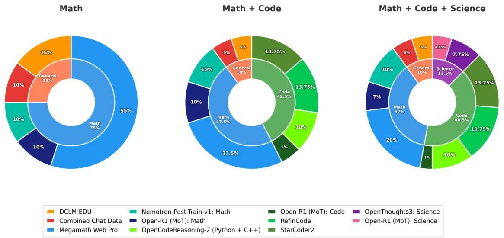
Figure 2 Mid-training data mixture configurations and per-source sampling percentages. The outer ring shows individual data sources; the inner ring groups them by domain category.

<table><tr><td>Category</td><td>Benchmarks</td><td>What it measures</td><td>Why it matters</td></tr><tr><td>General ability</td><td>Leaderboard-V1 (LB-V1) (ARC, HellaSwag, MMLU, TruthfulQA, Winogrande, GSM8K), Leaderboard-V2 (LB-V2) (IFEval, BBH, MATH, GPQA, MUSR, MMLU-Pro)</td><td>Broad multitask knowledge and robustness</td><td>Detects generalization regressions hidden by domain-specific gains.</td></tr><tr><td>Long-context</td><td>RULER</td><td>Long-context retrieval</td><td>Ensures mid-training does not degrade long-context retrieval capabilities.</td></tr><tr><td>Code</td><td>LiveCodeBench (Jain et al., 2024), Codeforces (Penedo et al., 2025)</td><td>Executable program synthesis and reasoning</td><td>Captures real-world coding ability.</td></tr><tr><td>Math</td><td>AIME (AIME), MATH500 (Lightman et al., 2023)</td><td>Mathematical reasoning</td><td>Highly sensitive to data quality and mid-training composition.</td></tr><tr><td>Science</td><td>GPQA-Diamond (Rein et al., 2023)</td><td>Expert-level scientific reasoning</td><td>Probes scientific reasoning capabilities</td></tr></table>

Table 2 Benchmark categories recommended for evaluating mid-training design choices.

found these configurations to provide the best balance between retaining broad pretraining knowledge and inducing targeted domain improvements; consequently, we adopt these splits as the default sampling policy for all experiments reported in this paper.

# 4 What to Evaluate: Benchmark Selection

Takeaway. Evaluate mid-training with a balanced suite that measures (i) general LLM ability, (ii) long-context behaviour, and (iii) domain-specific reasoning; otherwise, domain gains may mask regressions.

In PRISM we adopt a deliberately broad evaluation setup to surface both gains and regressions introduced by mid-training. Concretely, we combine general leaderboards (LB-V1 and LB-V2) with focused long-context, code, math, and science evaluations so that improvements in a single domain cannot hide capability loss elsewhere. Table 2 summarizes the benchmark categories and their roles.

---

Practical guidance for benchmark selection. As summarized in Table 2, effective evaluation of mid-training decisions requires both breadth and depth:

- Mix breadth and depth: combine general-purpose leaderboards (LB-V1 (Beeching et al., 2023) and LB-V2 (Fourrier et al., 2024)) with targeted domain benchmarks to expose global regressions while accurately measuring domain-specific gains.
- Measure long-context retention explicitly: evaluate long-context reasoning separately (e.g., RULER (Hsieh et al., 2024)), as mid-training dominated by short-context data can degrade long-context capabilities, often necessitating an additional lightweight fine-tuning stage to recover performance (see Section 8.1).

# 5 When to Mid-Train

Takeaway. On Granite-4 Micro (3B), mid-training is most effective when applied after long-context pretraining, yielding the largest gains in math, code, and science while preserving general reasoning. Whether this ordering generalizes across larger models or different architectures remains an open question. Conveniently, most open-source base models are released after long-context extension, making this the natural starting point in practice.

Mid-training is typically applied after pretraining, but the optimal timing within the pretraining pipeline remains unclear. Using Granite-4 Micro (3B), we apply the same mid-training recipe (Math+Code+Science, 8k context) at three different points: (i) after Phase 3 of pretraining, (ii) after Phase 4 (the final dense pretraining stage before long-context extension), and (iii) starting from the base model after long-context pretraining (Table 3).

<table><tr><td rowspan="2">Stage</td><td colspan="2">Leaderbds.</td><td colspan="2">Code</td><td colspan="2">Sci.</td><td colspan="3">Math</td></tr><tr><td>V1</td><td>V2</td><td>LCB</td><td>CF</td><td>GPQA</td><td>AI24</td><td>AI25</td><td>M500</td><td></td></tr><tr><td>Phase 3</td><td>63.30</td><td>19.44</td><td>7.05</td><td>8.61</td><td>19.53</td><td>9.38</td><td>16.09</td><td>65.88</td><td></td></tr><tr><td>Phase 4</td><td>62.84</td><td>20.85</td><td>7.89</td><td>7.95</td><td>17.85</td><td>10.00</td><td>14.06</td><td>61.70</td><td></td></tr><tr><td>After LC</td><td>62.91</td><td>20.53</td><td>10.39</td><td>6.18</td><td>25.93</td><td>23.59</td><td>20.94</td><td>77.44</td><td></td></tr></table>

Table 3 Effect of when mid-training is applied on Granite-4 Micro (3B). Phase  $3/4 =$  intermediate/late pretraining; After LC = after long-context extension.

Earlier phases yield gains, but later is better. Mid-training at earlier phases already produces meaningful improvements, but later stages consistently translate the mid-training signal into stronger downstream performance. Compared to Phase 3, Phase 4 mid-training modestly improves Leaderboard V2 (from 19.44 to 20.85) while maintaining similar code performance. However, both Phase 3 and Phase 4 underperform the final base model on math and science benchmarks.

After long-context extension produces the strongest results. Applying mid-training after long-context extension yields the best overall performance. Math performance improves substantially, with AIME24 increasing from 9.38 (Phase 3) and 10.00 (Phase 4) to 23.59, and MATH500 rising to 77.44. Code performance also improves, with LiveCodeBench reaching 10.39, while GPQA-Diamond reaches 25.93, exceeding both earlier phases.

General capabilities remain stable across timing choices. General-purpose leaderboards remain relatively stable across stages, indicating that later mid-training does not introduce large regressions in broad capabilities. Overall, these results suggest that while mid-training can be effective at multiple stages, applying it after long-context capabilities are established yields the most consistent gains across math, code, and science. We note that this is a preliminary finding based on a single model (Granite-4 Micro, 3B), and whether the same ordering holds across larger models or different architectures remains an open question. Additionally, post-long-context base models may be stronger starting points in absolute terms, confounding the timing effect with base model quality. The practical implication is limited to: given a choice of when to apply mid-training, post-LC is a reasonable default, and it is also the natural starting point for our broader PRISM study since most publicly released base models (e.g., LLaMA, Mistral) have already undergone long-context extension.

---

<table><tr><td rowspan="2">Mixture</td><td colspan="7">Leaderboard V1</td><td colspan="7">Leaderboard V2</td></tr><tr><td>ARC</td><td>HellaSwag</td><td>MMLU</td><td>TruthfulQA</td><td>Winogrande</td><td>GSM8K</td><td>OpenLLM V1 Avg</td><td>IFEval</td><td>BBH</td><td>MATH</td><td>GPQA</td><td>MUSR</td><td>MMLU-Pro</td><td>OpenLLM V2 Avg</td></tr><tr><td>Base</td><td>61.95</td><td>63.46</td><td>62.56</td><td>52.24</td><td>80.35</td><td>56.33</td><td>66.15</td><td>46.62</td><td>24.68</td><td>10.20</td><td>6.38</td><td>8.88</td><td>23.82</td><td>20.10</td></tr><tr><td>Math only</td><td>62.54</td><td>78.72</td><td>64.29</td><td>46.04</td><td>75.30</td><td>71.95</td><td>66.47</td><td>46.46</td><td>25.57</td><td>17.75</td><td>5.59</td><td>9.08</td><td>29.86</td><td>22.39</td></tr><tr><td>Math + Code</td><td>61.01</td><td>78.09</td><td>62.65</td><td>47.36</td><td>74.74</td><td>73.46</td><td>66.22</td><td>45.56</td><td>26.87</td><td>18.43</td><td>5.93</td><td>10.60</td><td>28.40</td><td>22.63</td></tr><tr><td>Math + Code + Science</td><td>61.69</td><td>78.12</td><td>62.98</td><td>46.96</td><td>74.90</td><td>74.22</td><td>66.48</td><td>46.44</td><td>26.32</td><td>20.02</td><td>7.27</td><td>8.60</td><td>29.55</td><td>23.03</td></tr></table>

# 6 Domain-wise Effects of Mid-Training Data

Takeaway. Mid-training performance is driven by data composition. Domain-specific data delivers large gains in its corresponding benchmarks, while balanced mixtures across math, code, and science achieve the best overall trade-off, improving domain reasoning while preserving general capabilities.

Having established the data sources and empirically validated mixture configurations in Section 3, we now examine how domain-specific data affects downstream performance. We mid-train the Granite-3.3 (8B) base model using three progressively richer data mixtures: Math-only, Math+Code, and Math+Code+Science, following the configurations in Fig. 2. All experiments use a fixed budget of  $\sim$ 27B tokens at a context length of 8192; additional hyperparameters are in Appendix Section A. We evaluate on both general-purpose leaderboards (LB-V1 and LB-V2) and domain-specific benchmarks, allowing us to isolate the effect of each domain and analyze the trade-offs between specialization and retention.

Math data drives the largest single-domain gains. Introducing math-specific data during mid-training leads to substantial improvements in mathematical reasoning. Compared to the baseline model, the Math-only mixture increases the Math average from 8.95 to 36.43, a gain of +27.48 points (Table 5). These gains demonstrate that high-quality math reasoning data is the primary driver of mathematical capability during mid-training.

Table 4 Leaderboard V1 and V2 results for Granite-3.3-8B mid-trained with the mixtures in Fig. 2.

<table><tr><td>Mixture</td><td>Code</td><td>Math</td><td>GPQA</td></tr><tr><td>Base</td><td>2.07</td><td>8.95</td><td>22.56</td></tr><tr><td>Math</td><td>2.81</td><td>36.43</td><td>17.34</td></tr><tr><td>Math+Code</td><td>10.71</td><td>44.99</td><td>19.02</td></tr><tr><td>Math+Code+Sci</td><td>10.58</td><td>48.75</td><td>29.12</td></tr></table>

Table 5 Domain-specific results for Granite-3.3 (8B). Code/Math are averages; full results in Appendix Table 19.

Code data is essential for programming benchmarks. Adding

code-specific data produces large improvements on programming benchmarks. While Math-only mid-training yields only marginal code gains over the baseline, increasing the Code average from 2.07 to 2.81 (+0.74), the Math+Code mixture raises the Code average to 10.71, corresponding to a +8.64 point improvement relative to the baseline (Table 5). Incorporating science data on top of code does not substantially alter code performance, with the Math+Code+Science mixture maintaining a similar Code average of 10.58.

Science data improves GPQA without sacrificing other domains. Including science data during mid-training improves performance on GPQA-Diamond without deteriorating code or math performance. Compared to the Math+Code mixture, the Math+Code+Science mixture increases GPQA-Diamond from 19.02 to 29.12 (+10.10 points). At the same time, the Code average remains stable (10.71 to 10.58), and the Math average further improves from 44.99 to 48.75 (Table 5). These results show that science-focused data can be added without sacrificing gains in other reasoning domains.

General performance is broadly maintained but with individual regressions. Mid-training introduces measurable trade-offs on general-purpose benchmarks. On Leaderboard V1, the Math-only mixture improves the overall average from 66.15 to 66.47 (+0.32), driven primarily by gains on GSM8K, while exhibiting regressions on individual benchmarks such as HellaSwag (~5 points across all mixtures) and TruthfulQA (Table 4). Leaderboard V2 averages increase monotonically with broader domain coverage, rising from 20.10 for the baseline to 22.39 for Math-only, 22.63 for Math+Code, and 23.03 for Math+Code+Science. Overall Leaderboard V1 averages remain near the baseline across mixtures, which we attribute in part to the consistent inclusion of general web data from DCLM-EDU; however, individual benchmarks such as HellaSwag

---

<table><tr><td rowspan="2">Model</td><td rowspan="2">Variant</td><td colspan="2">Leaderboards</td><td colspan="3">Code</td><td>Science</td><td colspan="4">Math</td></tr><tr><td>LB V1</td><td>LB V2</td><td>LCB</td><td>CF</td><td>Code Avg</td><td>GPQA-D</td><td>AIME24</td><td>AIME25</td><td>MATH500</td><td>Math Avg</td></tr><tr><td rowspan="2">Granite-3.3 (8B)</td><td>Base</td><td>66.15</td><td>20.10</td><td>2.15</td><td>1.99</td><td>2.07</td><td>22.56</td><td>0.46</td><td>0.31</td><td>26.09</td><td>8.95</td></tr><tr><td>PRISM</td><td>66.48</td><td>23.03</td><td>10.63</td><td>10.52</td><td>10.58</td><td>29.12</td><td>37.18</td><td>27.96</td><td>81.11</td><td>48.75</td></tr><tr><td rowspan="2">Granite-4 Micro (3B)</td><td>Base</td><td>66.01</td><td>21.82</td><td>0.24</td><td>2.28</td><td>1.26</td><td>21.55</td><td>16.09</td><td>12.34</td><td>50.42</td><td>26.28</td></tr><tr><td>PRISM</td><td>62.91</td><td>20.53</td><td>10.87</td><td>6.25</td><td>8.56</td><td>34.34</td><td>27.19</td><td>22.29</td><td>79.40</td><td>42.96</td></tr><tr><td rowspan="2">Granite-4-H Micro (3B)</td><td>Base</td><td>64.49</td><td>18.99</td><td>0.60</td><td>0.88</td><td>0.74</td><td>20.88</td><td>7.08</td><td>2.70</td><td>30.17</td><td>13.32</td></tr><tr><td>PRISM</td><td>64.21</td><td>18.75</td><td>15.53</td><td>8.02</td><td>11.78</td><td>32.66</td><td>33.69</td><td>23.49</td><td>82.73</td><td>46.64</td></tr><tr><td rowspan="2">Nemotron-H-8k (8B)</td><td>Base</td><td>71.35</td><td>23.84</td><td>1.19</td><td>3.60</td><td>2.39</td><td>4.21</td><td>2.13</td><td>2.29</td><td>49.46</td><td>17.96</td></tr><tr><td>PRISM</td><td>68.84</td><td>26.08</td><td>13.02</td><td>10.52</td><td>11.77</td><td>31.98</td><td>19.21</td><td>22.76</td><td>76.63</td><td>39.53</td></tr><tr><td rowspan="2">Mistral-7B</td><td>Base</td><td>60.88</td><td>14.89</td><td>0.00</td><td>0.15</td><td>0.07</td><td>26.94</td><td>0.00</td><td>0.10</td><td>1.68</td><td>0.59</td></tr><tr><td>PRISM</td><td>59.99</td><td>19.68</td><td>10.16</td><td>9.42</td><td>9.79</td><td>24.07</td><td>28.85</td><td>24.27</td><td>70.71</td><td>41.28</td></tr><tr><td rowspan="2">LLaMA-3.1 (8B)</td><td>Base</td><td>62.76</td><td>14.09</td><td>0.00</td><td>0.07</td><td>0.04</td><td>20.20</td><td>0.05</td><td>0.15</td><td>6.51</td><td>2.24</td></tr><tr><td>PRISM</td><td>65.21</td><td>21.46</td><td>6.09</td><td>5.45</td><td>5.77</td><td>21.04</td><td>16.45</td><td>19.32</td><td>73.47</td><td>36.41</td></tr><tr><td rowspan="2">Mistral-Small (24B)</td><td>Base</td><td>74.98</td><td>27.29</td><td>0.00</td><td>0.29</td><td>0.15</td><td>22.55</td><td>0.78</td><td>0.73</td><td>26.92</td><td>9.48</td></tr><tr><td>PRISM</td><td>69.52</td><td>27.42</td><td>10.03</td><td>10.08</td><td>10.06</td><td>22.05</td><td>32.91</td><td>27.34</td><td>80.80</td><td>47.02</td></tr></table>

Table 6 Base versus PRISM (Math+Code+Science) mid-training results across model families. Code Avg is the mean of LiveCodeBench (LCB) and Codeforces (CF). Math Avg is the mean of AIME24, AIME25, and MATH500. All values are reported to two decimal places.

show regressions of approximately 5 points, suggesting that domain-specific mid-training introduces some interference with general benchmarks.

# 7 PRISM Effects Across Model Families

Takeaway. Across model families, architectures, and scales, PRISM mid-training consistently improves reasoning performance. We observe gains of +15 to +40 points on math benchmarks and +5 to +12 points on coding benchmarks across all models. Science gains (GPQA-Diamond) are +6 to +13 points on Granite and hybrid models; for other families, science improvements primarily emerge after RL when science data is included at mid-training.

We evaluate PRISM mid-training across a diverse set of model families, architectures, and scales. Our experiments include dense Transformer models: Granite-3.3 (8B) (Granite Team, IBM, 2025), LLaMA-3.1 (8B) (Grattafori et al., 2024), Mistral-7B (Jiang et al., 2023), Mistral-Small-24B (Mistral AI Team, 2025), and Granite-4 Micro (3B). We additionally consider hybrid architectures within the Granite-4 family (IBM Granite Team, 2025): Granite-4-H Micro (3B) and Nemotron-H (8B) (NVIDIA et al., 2025), which combine attention and Mamba layers. Additional architectural and training details are in Appendix Section A. For most experiments, we perform PRISM mid-training at an 8k context length, which offers a favorable trade-off between computational cost and downstream performance (Section 8.2).

Table 6 summarizes the impact of PRISM mid-training across this diverse set of models. Across all families, PRISM consistently improves mathematical, coding, and scientific reasoning, while changes to general-purpose leaderboards are smaller and more model dependent.

Mid-training benefits generalize across all model families. PRISM yields strong improvements regardless of the underlying model family. Mistral-7B shows some of the largest gains, with MATH500 improving from 1.68 to 70.71 and Codeforces from 0.15 to 9.42. Mistral-Small (24B) similarly improves MATH500 from 26.92 to 80.80. LLaMA-3.1 (8B) benefits as well, improving AIME24 from 0.05 to 16.45 and LiveCodeBench from 0.00 to 6.09. These trends demonstrate that PRISM is effective across distinct model families and training recipes.

---

<table><tr><td rowspan="2">Model Variant</td><td colspan="5">RULER</td><td colspan="4">Code / Science</td><td colspan="4">Math</td></tr><tr><td>8k</td><td>16k</td><td>32k</td><td>64k</td><td>128k</td><td>LCB</td><td>CF</td><td>Code Avg</td><td>GPQA-D</td><td>AIME24</td><td>AIME25</td><td>MATH500</td><td>Math Avg</td></tr><tr><td>Granite-3.3 Base</td><td>85.81</td><td>82.40</td><td>75.53</td><td>64.91</td><td>59.09</td><td>2.15</td><td>1.99</td><td>2.07</td><td>22.56</td><td>0.46</td><td>0.31</td><td>26.09</td><td>8.95</td></tr><tr><td>Mid-Train (Math+Code)</td><td>89.02</td><td>60.44</td><td>21.52</td><td>11.71</td><td>6.46</td><td>11.11</td><td>10.30</td><td>10.71</td><td>19.02</td><td>32.44</td><td>28.33</td><td>74.22</td><td>44.99</td></tr><tr><td>Mid-Train + LC (Attention)</td><td>90.04</td><td>82.56</td><td>71.47</td><td>54.63</td><td>36.32</td><td>23.78</td><td>15.53</td><td>19.65</td><td>17.85</td><td>36.56</td><td>32.55</td><td>67.20</td><td>45.44</td></tr><tr><td>Mid-Train + LC (Full)</td><td>89.29</td><td>80.74</td><td>70.86</td><td>56.02</td><td>38.41</td><td>29.99</td><td>21.04</td><td>25.52</td><td>14.48</td><td>35.21</td><td>30.36</td><td>62.30</td><td>42.62</td></tr><tr><td>Merge (15% Base + 85% Mid-Train)</td><td>89.12</td><td>69.76</td><td>32.63</td><td>15.44</td><td>11.32</td><td>10.75</td><td>10.96</td><td>10.86</td><td>22.22</td><td>28.39</td><td>24.90</td><td>72.97</td><td>42.09</td></tr><tr><td>Merge + LC (Attention)</td><td>90.00</td><td>84.27</td><td>73.31</td><td>57.27</td><td>37.75</td><td>26.16</td><td>17.29</td><td>21.73</td><td>17.51</td><td>33.85</td><td>28.75</td><td>71.28</td><td>44.63</td></tr><tr><td>Merge + LC (Full)</td><td>89.83</td><td>84.08</td><td>73.89</td><td>60.06</td><td>42.16</td><td>29.51</td><td>21.56</td><td>25.54</td><td>15.82</td><td>33.75</td><td>30.78</td><td>68.91</td><td>44.48</td></tr></table>

Table 7 Restoring long-context capability after mid-training for Granite-3.3 (8B). RULER is evaluated from 8k to 128k input lengths. Downstream performance includes Code (LiveCodeBench, Codeforces), Science (GPQA-Diamond), and Math (AIME24, AIME25, MATH500).

Hybrid architectures benefit as much as dense models. Within the Granite-4 family, we observe that hybrid variants respond strongly to PRISM mid-training. The dense Granite-4 Micro (3B) shows substantial gains, improving MATH500 from 50.42 to 79.40 and LiveCodeBench from 0.24 to 10.87. Hybrid models, including Granite-4-H Micro (3B) and Nemotron-H (8B), also exhibit large improvements. For example, Nemotron-H (8B) increases AIME24 from 2.13 to 19.21, AIME25 from 2.29 to 22.76, and MATH500 from 49.46 to 76.63. While these results suggest that hybrid architectures can effectively leverage mid-training signal, differences in pretraining data and model scale prevent a direct attribution of these gains to architecture alone.

Larger models achieve higher absolute scores, but gains are universal. Although larger models achieve higher absolute scores, PRISM delivers meaningful gains at all scales. Smaller models often exhibit larger relative improvements, while larger models realize strong absolute gains without severe degradation on leaderboards. For instance, Mistral-Small (24B) improves MATH500 by more than +50 points while maintaining Leaderboard V2 performance, whereas LLaMA-3.1 (8B) improves Leaderboard V2 from 14.09 to 21.46. Overall, these results suggest that retention-aware, multi-domain mid-training provides consistent benefits across parameter scales.

# 8 Ablation Studies

Beyond data composition and model family, several practical design choices shape mid-training outcomes: how to restore long-context ability lost during short-context mid-training, how much context length to use during mid-training itself, and how many tokens are sufficient before gains saturate. We study each of these in controlled ablations on Granite models.

# 8.1 Restoring Long-Context Ability After Mid-Training

Mid-training is performed at an 8k context length, which naturally degrades long-context capabilities inherited from pretraining. In this section, we study practical strategies to restore long-context performance after mid-training using Granite-3.3 (8B). We evaluate two approaches: (i) directly performing a short long-context extension phase on the mid-trained checkpoint, and (ii) linearly merging the mid-trained model with the base model prior to long-context extension. For both approaches, we further compare training all parameters versus training only attention modules during the long-context phase.

Details of the data construction and preprocessing used for long-context restoration are provided in Appendix Section A.3. In particular, we augment the training data with code examples containing longer chains of thought, apply filtering to remove short-context samples, and use best-fit packing to efficiently construct long-context training sequences.

Mid-training severely degrades long-context ability. While the Granite-3.3 (8B) base model achieves a RULER score of 59.09 at 128k context, the Math+Code mid-trained model drops sharply to 6.46, despite strong performance at short context lengths (89.02 at 8k). This confirms that mid-training with short-context data

---

alone disrupts long-context behaviors learned during pretraining, motivating the need for explicit restoration strategies. Figure 3 illustrates the two restoration pipelines we evaluate.

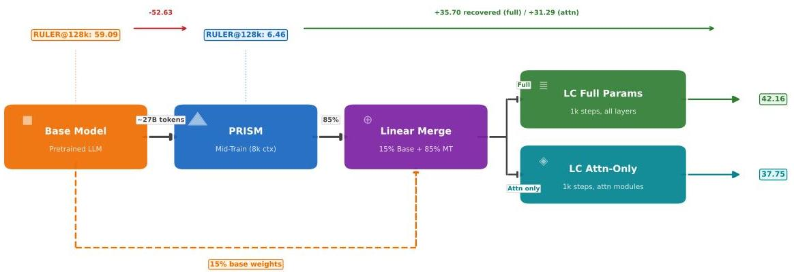
Figure 3 Long-context restoration pipeline. After PRISM mid-training degrades RULER@128k from 59.09 to 6.46, a linear merge (15% base + 85% mid-trained) followed by long-context extension recovers performance to 42.16 (full params) or 37.75 (attention-only).

A brief long-context extension phase largely restores performance. Applying 1k steps of long-context training directly on the mid-trained model raises RULER at 128k from 6.46 to 36.32 when training attention modules only, and to 38.41 when training all parameters. These improvements are consistent across intermediate context lengths, with RULER at 64k improving from 11.71 to over 54.63. At the same time, downstream reasoning performance is preserved or improved: Code Avg increases from 10.71 to 19.65 (attention-only) and 25.52 (full), while Math Avg remains above 42 across both variants (Table 7).

Merging with the base model yields the strongest recovery. Merging the mid-trained model with the base model prior to long-context extension yields the strongest recovery at long context lengths. With a  $15\%$  base and  $85\%$  mid-trained linear merge followed by long-context training, RULER at 128k improves further to 42.16, narrowing much of the gap to the base model. Importantly, this approach maintains strong downstream reasoning performance, achieving a Code Avg of 25.54 and a Math Avg of 44.48. Across strategies, full-parameter long-context training yields the strongest recovery, while attention-only training still provides meaningful RULER improvements with competitive downstream performance, offering a practical efficiency/performance trade-off.

# 8.2 Effect of Mid-Training Context Length

We study the effect of increasing the mid-training context length while keeping the data mixture fixed to Math+Code+Science and maintaining a comparable token budget (Table 8). All ablations use the Granite-4 Micro (3B) dense model.

Increasing context from 8k to 16k yields the largest gains: MATH500 improves from 79.40 to 82.47, AIME24 from 27.19 to 31.82, Codeforces from 6.25 to 8.90, and GPQA-Diamond from

<table><tr><td>Context</td><td>LB-V1</td><td>LB-V2</td><td>LCB</td><td>CF</td><td>GPQA</td><td>AIME24</td><td>AIME25</td><td>M500</td></tr><tr><td>Base</td><td>66.01</td><td>21.82</td><td>0.24</td><td>2.28</td><td>21.55</td><td>16.09</td><td>12.34</td><td>50.42</td></tr><tr><td>8k</td><td>62.91</td><td>20.53</td><td>10.87</td><td>6.25</td><td>34.34</td><td>27.19</td><td>22.29</td><td>79.40</td></tr><tr><td>16k</td><td>64.23</td><td>20.37</td><td>12.19</td><td>8.90</td><td>38.89</td><td>31.82</td><td>25.26</td><td>82.47</td></tr><tr><td>32k</td><td>64.41</td><td>20.35</td><td>12.54</td><td>9.79</td><td>24.24</td><td>32.08</td><td>20.72</td><td>81.34</td></tr></table>

Table 8 Mid-training context length ablation on Granite-4 Micro (3B) with Math+Code+Science mix. V1/V2 = Leaderboard V1/V2.

34.34 to 38.89. These results indicate that moderate long-context mid-training strengthens the model's ability to leverage multi-step reasoning signals present in math, code, and science data.

However, gains largely saturate beyond 16k. Extending to 32k yields small additional improvements on Codeforces  $(8.90 \rightarrow 9.79)$  and AIME24  $(31.82 \rightarrow 32.08)$ , but MATH500 regresses slightly  $(82.47 \rightarrow 81.34)$

---

and GPQA-Diamond drops substantially  $(38.89\rightarrow 24.24)$ . One plausible explanation is data distribution shift: the science component of the training mixture may be less suited to the document lengths sampled at  $32\mathrm{k}$ , causing the model to be trained on fewer high-quality science examples in practice. We leave a systematic investigation to future work. General-purpose performance remains stable, with Leaderboard V1 partially recovering from 62.91 at 8k to 64.41 at  $32\mathrm{k}$ . Overall, 16k provides the most favorable balance between reasoning gains and training efficiency.

# 8.3 Effect of Mid-Training Token Budget

We study the effect of increasing the mid-training token budget while keeping the context length fixed at 8k and using a Math+Code data mixture (Table 9). All experiments use the Granite-4 Micro (3B) dense model.

Relative to the base model, mid-training yields large gains in both math and code with modest budgets. At 10.49B tokens, Math Avg increases from 26.28 to 40.21 (+13.93), while Code Avg improves from 1.26 to 9.59. Increasing the budget to 15.73B further improves Math Avg to 42.07 while maintaining a strong Code Avg of 9.02.

<table><tr><td>Tok. (B)</td><td>LB-V1</td><td>LB-V2</td><td>Code</td><td>GPQA</td><td>Math</td></tr><tr><td>Base</td><td>66.01</td><td>21.82</td><td>1.26</td><td>21.55</td><td>26.28</td></tr><tr><td>10.49</td><td>63.45</td><td>19.50</td><td>9.59</td><td>19.19</td><td>40.21</td></tr><tr><td>15.73</td><td>63.24</td><td>19.79</td><td>9.02</td><td>23.06</td><td>42.07</td></tr><tr><td>26.21</td><td>63.28</td><td>19.63</td><td>8.69</td><td>19.19</td><td>42.22</td></tr><tr><td>31.46</td><td>63.16</td><td>20.05</td><td>7.62</td><td>21.38</td><td>42.42</td></tr></table>

Table 9 Token budget ablation on Granite-4 Micro (3B), Math+Code mix. Full table in Appendix 20.

Beyond 26.21B tokens, gains largely saturate. Math Avg remains nearly constant (42.22 to 42.42), while Code Avg declines from 8.69 to 7.62 as the budget increases to 31.46B. General-purpose leaderboard scores (LB V1 and V2) remain stable across budgets, and GPQA-Diamond shows no consistent trend. These results indicate that most benefits of Math+Code mid-training are realized within approximately 15B to 27B tokens for this model.

# 9 Effects of Reinforcement Learning on Mid-Trained Models

Takeaway. The PRISM  $\rightarrow$  RL pipeline improves the six-benchmark macro-average from under 12 to 29-42, a  $3 - 4\times$  improvement. Mid-training contributes the dominant gains (+14 to +18 points), RL adds a consistent second stage (+8 to +12 points), and RL on base models without mid-training is substantially less effective, with AIME scores remaining near zero for most models (Nemotron-H being an exception, showing moderate AIME progress from base). Science data at mid-training unlocks large GPQA-Diamond gains during RL (+17 to +28 points over MC-only), and RL progressively solves prompts that were initially unsolvable (shown for Granite-3.3).

A central question for PRISM is whether mid-trained models provide a better foundation for reinforcement learning than base models, and if so, how the mid-training and RL data compositions interact. In this section we address both questions through controlled experiments across six model families, two RL data mixes (balanced and unbalanced), and direct comparisons with RL applied to base models.

# 9.1 RL Setup: Data, Filtering, and Mixes

Table 10 summarizes the datasets used for RL across math, science, and code domains. We construct two RL data mixes, each subdivided into MC (math + code) and MCS (math + code + science) variants:

Unbalanced mix. We use the Granite-3.3-8B mid-trained model to filter prompts by difficulty. For each prompt, we sample 16 responses (temperature 1.0, top_p 1.0). For math, we select prompts with exactly one correct sample out of 16, yielding a hard subset of 19k prompts. For code and science, where most prompts are unsolvable, we retain all prompts with at least one correct sample, resulting in 7k code and 17k science prompts. Despite the domain imbalance, this mix produces strong improvements across all reasoning benchmarks.

---

Balanced mix. We equalize all domains to 19k prompts by augmenting code and science with a random subset of prompts having zero correct samples (out of 16) for the Granite-3.3-8B mid-trained model. We additionally apply randomized instruction-format templates to science prompts to increase format diversity. Note that some zero-score prompts may be solvable by other mid-trained models.

Training hyperparameters are consistent across model families. Algorithm details are provided in Appendix D.

<table><tr><td>Domain</td><td>Sources</td><td>Count</td></tr><tr><td>Math</td><td>DeepScaleR-Preview INTELLECT-2-RL Skywork-OR1-RL-Data</td><td>294K</td></tr><tr><td>Science</td><td>Nemotron-PT-v1-stem</td><td>100K</td></tr><tr><td>Code</td><td>DeepCoder-Preview Skywork-OR1-RL-Data OpenCodeInstruct</td><td>142K</td></tr></table>

Table 10 RL datasets and prompt counts.

# 9.2 RL on PRISM: Consistent Gains Across Models

We apply RL with the unbalanced MCS mix on top of PRISM-mid-trained models. Learning curves for Granite-3.3-8B, Mistral-Small 24B, and Nemotron-H (8B) are shown in Figs. 4-6; additional results for Mistral-7B, LLaMA-3.1-8B, and Granite-4 Micro (Dense, 3B) are provided in Appendix Figs. 18, 19, and 20.

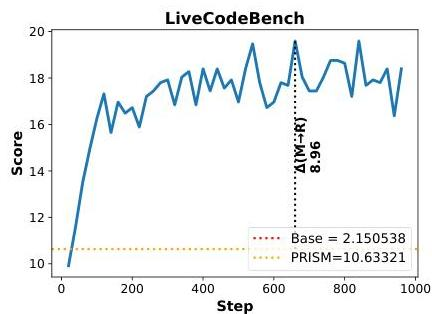
Granite-3.3 8B(Base  $\rightarrow$  PRISM  $\rightarrow$  RL

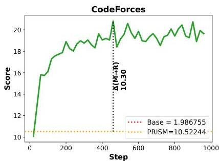
Granite-3.3 8B(Base  $\rightarrow$  PRISM  $\rightarrow$  RL

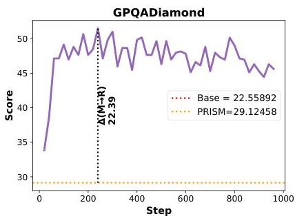

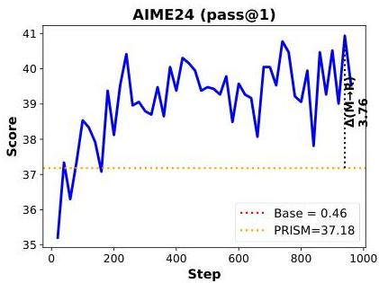
(a) LiveCodeBench, Codeforces, and GPQA-Diamond over RL steps.
(b) AIME24, AIME25, and MATH500 over RL steps.
Figure 4 PRISM  $\rightarrow$  RL: Granite-3.3-8B. RL training curves on the PRISM-mid-trained checkpoint using the unbalanced MCS mix. All benchmarks show consistent, monotonic improvements.

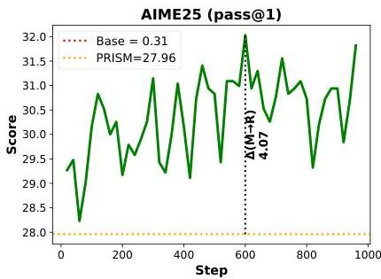
Granite-3.3 8B(Base  $\rightarrow$  PRISM  $\rightarrow$  RL

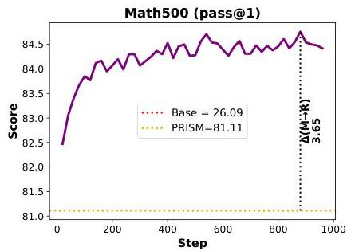

# 9.2.1 Gains across benchmarks.

RL on top of PRISM yields consistent, positive gains across nearly all benchmarks and model families. GPQA-Diamond shows the largest absolute improvements (e.g., Mistral-24B: +27.95, Granite-3.3: +22.39, Mistral-7B: +19.19, LLaMA: +18.35, Nemotron-H: +9.26). LiveCodeBench gains are substantial too (Granite-3.3: +8.96, Mistral-24B: +6.94, LLaMA: +8.96, Granite-4 Micro: +5.62, Mistral-7B: +6.21, Nemotron-H: +6.57), indicating improved code generation after PRISM  $\rightarrow$  RL (see also Appendix K.8). Codeforces improvements are more variable (+2.65 to +10.30), with Granite-3.3 showing the largest gain (+10.30). Math

---

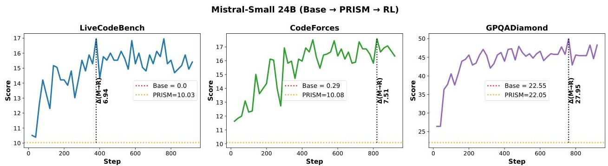
(a) LiveCodeBench, Codeforces, and GPQA-Diamond over RL steps.

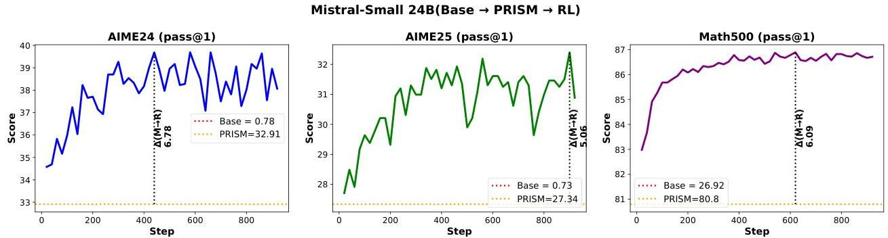
(b) AIME24, AIME25, and MATH500 over RL steps.
Figure 5 PRISM  $\rightarrow$  RL: Mistral-Small 24B. The largest model tested shows the strongest GPQA-Diamond gains (+27.95) and non-saturating code improvements.

benchmark gains (AIME24/AIME25) are typically in the 3-10.74 point range across models. Granite-4 Micro (3B) shows consistent but smaller absolute gains compared with the larger 8B models.

# 9.2.2 Non-saturating training curves.

Across both code and math benchmarks, many RL curves continue to trend upward or exhibit oscillations around an improving mean rather than clean saturation. This is visible in LiveCodeBench, Codeforces, AIME24/25, and MATH500, where scores often keep improving late into training, suggesting that the PRISM  $\rightarrow$  RL pipeline has not yet exhausted the available performance gains. Several models show noticeable improvements well after hundreds of RL steps (e.g., Granite-3.3 on Codeforces and LiveCodeBench; Mistral-24B on Codeforces and MATH500). This strengthens the case for viewing PRISM not as a final training stage, but as a launch point for deeper RL or multi-stage RL pipelines.

Generalization to recently released held-out benchmark. To further validate generalization, we evaluate Granite-3.3 (8B) and Mistral-Small (24B) on AIME 2026 (Mathematical Association of America, 2026), which was published after the completion of all training runs. Both models show consistent improvement over RL training steps on this fully held-out benchmark (Appendix J), confirming that the gains from the PRISM  $\rightarrow$  RL pipeline transfer to unseen mathematical reasoning challenges.

# 9.3 PRISM vs Base Models: Mid-Training is Essential for RL

To quantify the value of mid-training as an initialization for RL, we apply RL directly to four base models: Granite-3.3 (8B), LLaMA-3.1 (8B), Mistral-7B, and Nemotron-H (8B), using the same unbalanced mix. Learning curves for Granite-3.3 and Nemotron-H are shown in Figs. 7 and 8; LLaMA and Mistral-7B base RL curves are in Appendix Figs. 21 and 22.

---

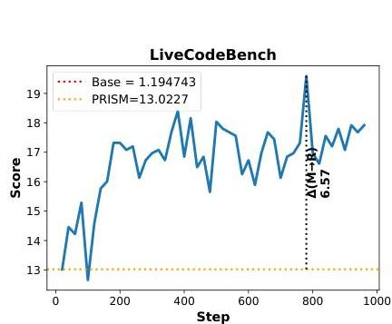
(a) LiveCodeBench, Codeforces, and GPQA-Diamond over RL steps.

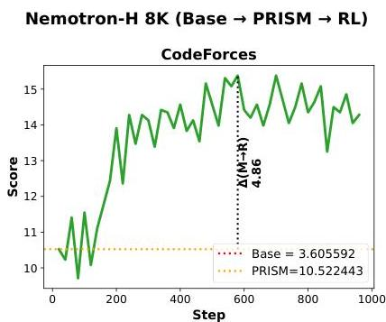

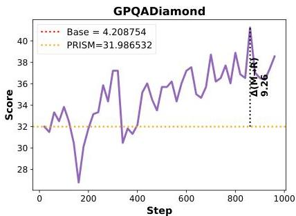

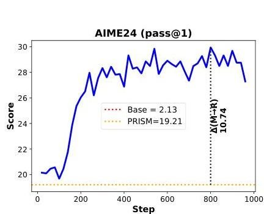
(b) AIME24, AIME25, and MATH500 over RL steps.

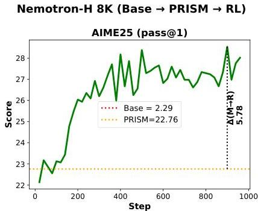
Figure 6 PRISM  $\rightarrow$  RL: Nemotron-H 8B (Hybrid). RL yields stable gains on the hybrid attention-Mamba architecture, confirming that mid-training benefits extend beyond dense Transformers.

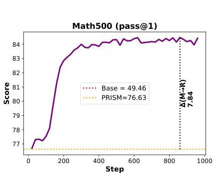

Granite-3.3 (8B). Figure 7 shows that RL on the base model produces noticeable gains on MATH500, coding, and science tasks, but fails to consistently improve on AIME24 and AIME25. Overall, RL on the base model underperforms RL on PRISM by a large margin, with final scores lower by  $\sim 37$  points in math,  $\sim 14$  points in code, and  $\sim 5$  points in science.

LLaMA-3.1 (8B) and Mistral-7B. Both models exhibit a similar pattern when RL is applied directly to their base checkpoints (Figs. 21 and 22 in Appendix): MATH500 and Coding benchmarks show modest gains, but AIME24 and AIME25 remain near zero throughout training, indicating that base models lack the foundational reasoning representations needed for RL to make progress on harder tasks. We see a regression in GPQA-Diamond performance, where RL on top of the base model leads to lower performance than the base model itself. In contrast, RL on the corresponding PRISM-mid-trained checkpoints achieves substantially higher scores across all benchmarks (Figs. 19 and 18).

Nemotron-H (8B). Nemotron-H base (Fig. 8) shows a slightly different pattern: RL produces some gains on MATH500 and moderate AIME24/25 progress from base, unlike most other models where AIME scores remain near zero. This may be attributed to stronger mathematical knowledge in Nemotron-H's pretraining data, which provides a better initialization for RL even without mid-training. Nonetheless, the gap compared to the PRISM RL results (Fig. 6) remains substantial, confirming that mid-training is critical even for hybrid architectures.

Across all four model families, a consistent conclusion emerges: RL on base models produces limited and often unstable improvements, particularly on harder benchmarks like AIME24/25, while RL on PRISM-mid-trained models yields large, stable, and monotonic gains. These results are consistent with prior findings (Wang et al., 2025; Zhang et al., 2025) and highlight that PRISM provides a substantially stronger initialization for RL-driven reasoning expansion.

---

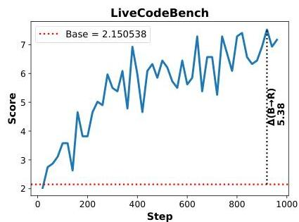
(a) LiveCodeBench, Codeforces, and GPQA-Diamond over RL steps.

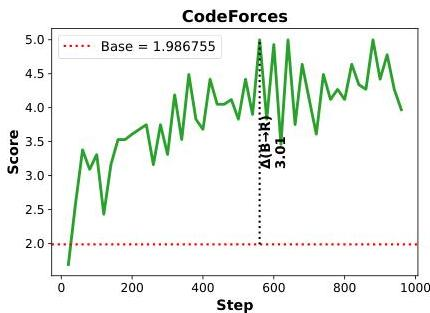
Granite-3.3 8B (Base  $\rightarrow$  RL)

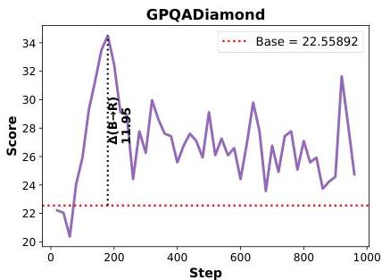

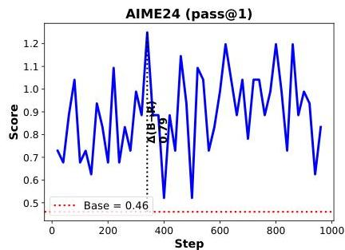
Granite-3.3 8B (Base  $\rightarrow$  RL)
(b) AIME24, AIME25, and MATH500 over RL steps.

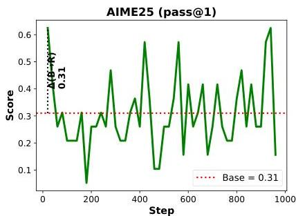
Figure 7 RL on Granite-3.3-8B base (no mid-training). AIME24/25 remain near zero throughout training, and overall gains are substantially smaller than the PRISM  $\rightarrow$  RL pipeline (Fig. 4).

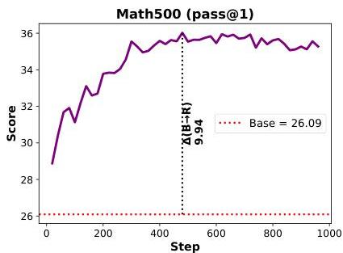

# 9.4 Balanced vs Unbalanced RL Mix

We next study whether equalizing prompt counts across domains affects RL outcomes. We apply RL with the balanced mix on top of PRISM for Mistral-Small 24B, Granite-4 Micro (Hybrid and Dense, 3B), and Granite-3.3 (8B). Learning curves for Granite-3.3 are shown in Fig. 9; results for the remaining models are in Appendix Figs. 23-25.

Across all four models, RL with the balanced mix produces consistent improvements over PRISM on both math and code benchmarks. On the dense Granite-4 Micro (3B), the balanced mix yields gains of  $+4.63$  on AIME24,  $+3.07$  on AIME25, and  $+3.38$  on MATH500, with code improvements of  $+4.30$  on LiveCodeBench and  $+6.06$  on GPQA-Diamond (Fig. 24). The hybrid Granite-4-H Micro (3B) shows even larger gains, particularly on Codeforces  $(+8.09)$  and GPQA-Diamond  $(+11.95)$ , with math improvements of  $+5.58$  on AIME24 and  $+6.41$  on AIME25 (Fig. 25).

Mistral-Small 24B also shows steady improvements on math and code benchmarks under the balanced mix (Fig. 23), though its GPQA-Diamond gain  $(+25.93)$  is slightly lower than that achieved by the unbalanced mix  $(+27.95$ , Fig. 5). Granite-3.3 (8B) benefits consistently from the balanced mix (Fig. 9), with improvements across all benchmarks.

Comparing with the unbalanced mix results (Figs. 4-20), we observe that math and code gains are broadly comparable across both mixes: for instance, the unbalanced mix on Granite-3.3 yields LiveCodeBench +8.96 and GPQA-Diamond +22.39 (Fig. 4), while the balanced mix on the same model produces similar trajectories (Fig. 9), showing that the balanced mix achieves comparable math and code gains to the unbalanced mix. For science, the effect of the balanced mix is model-dependent: the Granite-4 Micro variants show stronger GPQA-Diamond gains under the balanced mix, while Mistral-Small 24B performs slightly better with the unbalanced mix. We attribute the science improvements observed with the balanced mix primarily to the use of randomized instruction-format templates applied to science prompts, which expose the model to diverse

---

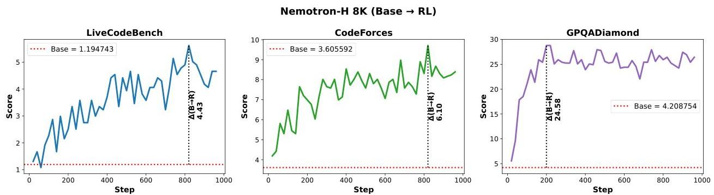
(a) LiveCodeBench, Codeforces, and GPQA-Diamond over RL steps.

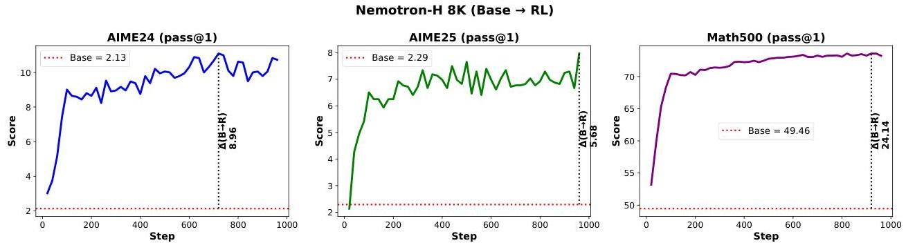
(b) AIME24, AIME25, and MATH500 over RL steps.
Figure 8 RL on Nemotron-H 8B base (no mid-training). Even for hybrid architectures, RL on the base model shows limited progress on harder benchmarks compared to PRISM  $\rightarrow$  RL (Fig. 6).

question phrasings during RL and improve robustness to prompt formatting on GPQA-Diamond. Across all models, training curves under the balanced mix remain stable and monotonically improving, with no training instabilities observed.

# 9.5 RL Expands the Solvability Frontier

A natural question is whether RL merely refines performance on already-solvable problems or actively expands the frontier of what the model can solve. Recall that the balanced mix includes prompts with zero correct samples out of 16 (score = 0) for code, and prompts with exactly one correct sample (score = 1) for math, representing the hardest tier of each domain. We track the pass rate of these prompts throughout RL training on Granite-3.3 (8B).

Figure 10 shows that the model progressively learns to solve prompts it could not handle at the start of

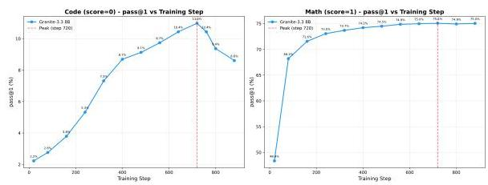
Figure 10 Pass rates on initially unsolved (code, score  $= 0$ ) and hardest (math, score  $= 1$ ) prompts during RL training of Granite-3.3 (8B) with the balanced mix.

RL. For code prompts that had a pass rate of zero under the mid-trained checkpoint, the pass rate steadily increases over training, indicating that RL enables the model to acquire new problem-solving strategies beyond what mid-training alone provides. Similarly, for the hardest math prompts (score = 1), the pass rate improves consistently, showing that RL amplifies the model's ability to solve problems at the boundary of its initial competence.

These results, combined with the non-saturating training curves observed above, provide evidence that the PRISM  $\rightarrow$  RL pipeline actively pushes the solvability boundary rather than merely polishing existing capabilities. This is consistent with recent findings by Sun et al. (2025), who show that RL can unlock

---

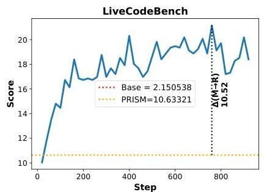
Granite-3.3 8B Balanced (Base  $\rightarrow$  PRISM  $\rightarrow$  RL)

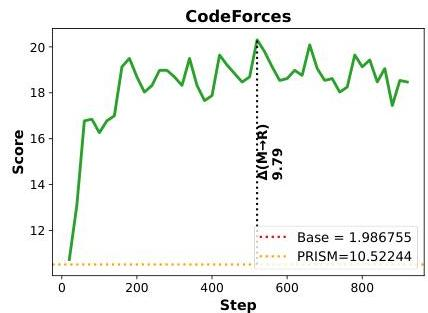
(a) LiveCodeBench, Codeforces, and GPQA-Diamond over RL steps.

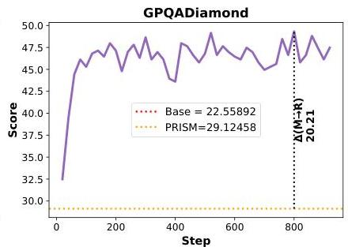

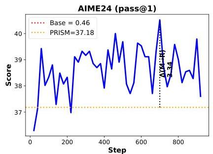
Granite-3.3 8B Balanced (Base  $\rightarrow$  PRISM  $\rightarrow$  RL)
(b) AIME24, AIME25, and MATH500 over RL steps.

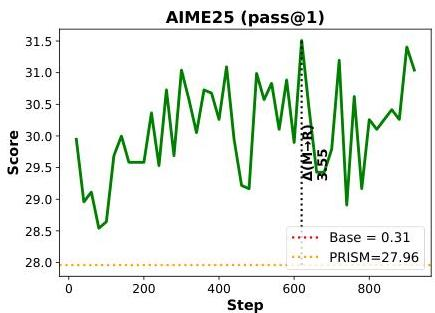
Figure 9 PRISM  $\rightarrow$  RL with balanced mix: Granite-3.3-8B. Domain-equalized RL produces comparable math and code gains to the unbalanced mix (Fig. 4), with stable training throughout.

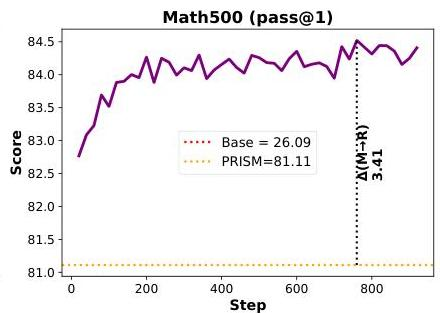

genuinely new algorithmic strategies in LLMs for previously unsolvable problem families. Mid-training produces a representation that is well-suited for RL-driven capability expansion.

# 9.6 The Full Pipeline: Broader RL Analysis

Table 11 presents a comprehensive view of the full Base  $\rightarrow$  Mid-training  $\rightarrow$  RL pipeline across three model families, two mid-training mixes (MC and MCS), and two RL mixes (MC and MCS). Each row reports the best-step checkpoint for the corresponding configuration.

# 9.6.1 A clear hierarchy: mid-training dominates, RL amplifies.

The most striking pattern in Table 11 is the consistent hierarchy of effect sizes across all three model families. Mid-training produces the largest single-stage jump: the six-benchmark macro-average (AVG) increases by  $+13.84$  for LLaMA  $(7.49 \rightarrow 21.33)$ ,  $+18.29$  for Granite-3.3  $(11.19 \rightarrow 29.48)$ , and  $+15.85$  for Mistral  $(9.20 \rightarrow 25.05)$ . RL then adds a consistent second-stage boost on top of these already-strong checkpoints:  $+8.36$  for LLaMA  $(21.33 \rightarrow 29.69)$ ,  $+12.28$  for Granite-3.3  $(29.48 \rightarrow 41.76)$ , and  $+10.09$  for Mistral  $(25.05 \rightarrow 35.14)$ . The combined PRISM  $\rightarrow$  RL pipeline improves AVG from under 12 to 29-42, a  $3 - 4 \times$  improvement.

# 9.6.2 Science data at mid-training unlocks large RL gains on GPQA.

One of the most impactful findings is that including science data during mid-training (MCS) dramatically amplifies GPQA-Diamond gains during RL. For Granite-3.3, MCS mid-training followed by MC RL achieves GPQA 52.86 (vs. 35.52 with MC mid-training + MC RL). The pattern is consistent: for LLaMA, MCS+MCS reaches GPQA 36.03 (vs. 23.06 for MC+MC), and for Mistral, MCS+MCS reaches 41.75 (vs. 29.12 for MC+MC). This suggests that science data during mid-training provides foundational representations that RL can leverage for scientific reasoning, even when the RL mix itself is not science-heavy.

---

<table><tr><td>Model</td><td>MT</td><td>RL</td><td>LCB</td><td>CF</td><td>Code Avg</td><td>AIME24</td><td>AIME25</td><td>MATH500</td><td>Math Avg</td><td>GPQA</td><td>AVG</td></tr><tr><td rowspan="7">LLaMA-3.1</td><td>-</td><td>-</td><td>0.00</td><td>0.07</td><td>0.04</td><td>0.05</td><td>0.15</td><td>6.51</td><td>2.24</td><td>20.20</td><td>7.49</td></tr><tr><td>MC</td><td>-</td><td>6.93</td><td>6.03</td><td>6.48</td><td>20.67</td><td>19.58</td><td>73.70</td><td>37.98</td><td>19.53</td><td>21.33</td></tr><tr><td>MCS</td><td>-</td><td>6.09</td><td>5.45</td><td>5.77</td><td>16.45</td><td>19.32</td><td>73.47</td><td>36.41</td><td>21.04</td><td>21.07</td></tr><tr><td>MC</td><td>MC</td><td>12.31</td><td>11.85</td><td>12.08</td><td>25.47</td><td>23.23</td><td>78.99</td><td>42.56</td><td>23.06</td><td>25.90</td></tr><tr><td>MC</td><td>MCS</td><td>11.83</td><td>12.80</td><td>12.32</td><td>24.43</td><td>23.12</td><td>78.62</td><td>42.06</td><td>24.75</td><td>26.38</td></tr><tr><td>MCS</td><td>MC</td><td>13.62</td><td>11.41</td><td>12.51</td><td>20.47</td><td>21.67</td><td>77.10</td><td>39.75</td><td>34.01</td><td>28.76</td></tr><tr><td>MCS</td><td>MCS</td><td>14.34</td><td>12.07</td><td>13.20</td><td>20.42</td><td>22.08</td><td>77.03</td><td>39.84</td><td>36.03</td><td>29.69</td></tr><tr><td rowspan="7">Granite-3.3</td><td>-</td><td>-</td><td>2.15</td><td>1.99</td><td>2.07</td><td>0.46</td><td>0.31</td><td>26.09</td><td>8.95</td><td>22.56</td><td>11.19</td></tr><tr><td>MC</td><td>-</td><td>11.11</td><td>10.30</td><td>10.71</td><td>32.44</td><td>28.33</td><td>74.22</td><td>44.99</td><td>19.02</td><td>24.91</td></tr><tr><td>MCS</td><td>-</td><td>10.63</td><td>10.52</td><td>10.58</td><td>37.18</td><td>27.96</td><td>81.11</td><td>48.75</td><td>29.12</td><td>29.48</td></tr><tr><td>MC</td><td>MC</td><td>20.79</td><td>18.76</td><td>19.78</td><td>40.36</td><td>33.33</td><td>85.88</td><td>53.19</td><td>35.52</td><td>36.16</td></tr><tr><td>MC</td><td>MCS</td><td>20.43</td><td>19.57</td><td>20.00</td><td>40.10</td><td>30.89</td><td>85.51</td><td>52.17</td><td>35.69</td><td>35.95</td></tr><tr><td>MCS</td><td>MC</td><td>20.31</td><td>20.46</td><td>20.38</td><td>40.62</td><td>30.89</td><td>84.62</td><td>52.04</td><td>52.86</td><td>41.76</td></tr><tr><td>MCS</td><td>MCS</td><td>17.20</td><td>18.03</td><td>17.62</td><td>40.42</td><td>29.58</td><td>83.99</td><td>51.33</td><td>51.52</td><td>40.16</td></tr><tr><td rowspan="7">Mistral-7B</td><td>-</td><td>-</td><td>0.00</td><td>0.15</td><td>0.07</td><td>0.00</td><td>0.10</td><td>1.68</td><td>0.59</td><td>26.94</td><td>9.20</td></tr><tr><td>MC</td><td>-</td><td>11.11</td><td>9.27</td><td>10.19</td><td>24.63</td><td>15.52</td><td>47.70</td><td>29.28</td><td>15.99</td><td>18.49</td></tr><tr><td>MCS</td><td>-</td><td>10.16</td><td>9.42</td><td>9.79</td><td>28.85</td><td>24.27</td><td>70.71</td><td>41.28</td><td>24.07</td><td>25.05</td></tr><tr><td>MC</td><td>MC</td><td>17.08</td><td>16.34</td><td>16.71</td><td>34.11</td><td>27.50</td><td>84.18</td><td>48.60</td><td>29.12</td><td>31.48</td></tr><tr><td>MC</td><td>MCS</td><td>16.61</td><td>15.60</td><td>16.10</td><td>33.02</td><td>26.93</td><td>83.80</td><td>47.92</td><td>28.28</td><td>30.77</td></tr><tr><td>MCS</td><td>MC</td><td>16.61</td><td>15.31</td><td>15.96</td><td>33.75</td><td>26.93</td><td>84.15</td><td>48.28</td><td>40.91</td><td>35.05</td></tr><tr><td>MCS</td><td>MCS</td><td>16.01</td><td>15.16</td><td>15.58</td><td>32.86</td><td>27.03</td><td>84.37</td><td>48.09</td><td>41.75</td><td>35.14</td></tr></table>

Table 11 Full Base  $\rightarrow$  Mid-training  $\rightarrow$  RL pipeline results across LLaMA-3.1-8B, Granite-3.3-8B, and Mistral-7B. MC = math + code mix; MCS = math + code + science mix. MT = mid-training mix; RL = RL mix. Highlighted rows show the best configuration per model.

# 9.6.3 RL data mix matters less than mid-training mix.

Changing the RL mix from MC to MCS produces comparatively small differences (typically  $&lt; 2$  AVG points), whereas changing the mid-training mix from MC to MCS can shift AVG by  $+3$  to  $+6$  points. For example, for Granite-3.3 with MC mid-training, switching RL from MC to MCS changes AVG only from 36.16 to 35.95  $(-0.21)$ , while switching mid-training from MC to MCS (with MC RL) jumps AVG from 36.16 to 41.76  $(+5.60)$ . This confirms that data composition choices have their greatest impact during mid-training, and RL primarily serves to amplify whatever capabilities mid-training has established.

# 9.6.4 Best configurations per model.

The highlighted rows in Table 11 show the best overall configuration for each family: MCS mid-training + MCS RL for LLaMA (AVG 29.69) and Mistral (AVG 35.14), and MCS mid-training + MC RL for Granite-3.3 (AVG 41.76). Granite-3.3 achieves the highest absolute scores across the board, with Code Avg of 20.38, Math Avg of 52.04, and GPQA of 52.86, demonstrating that the PRISM  $\rightarrow$  RL pipeline is most effective when built on a strong base model with broad mid-training coverage.

---

<table><tr><td>Model</td><td>MT</td><td>Transition</td><td>Attn</td><td>MLP</td><td>Mamba</td><td>Total</td><td>Sparsity</td></tr><tr><td rowspan="5">Granite-3.3 (8B)</td><td rowspan="3">MCS</td><td>Base → MT</td><td>0.175</td><td>0.329</td><td>-</td><td>0.175</td><td>9.3%</td></tr><tr><td>MT → RL</td><td>0.0003</td><td>0.0006</td><td>-</td><td>0.0003</td><td>95.9%</td></tr><tr><td>Base → RL (no MT)</td><td>0.0004</td><td>0.0007</td><td>-</td><td>0.0004</td><td>96.0%</td></tr><tr><td rowspan="2">MC</td><td>Base → MT</td><td>0.177</td><td>0.333</td><td>-</td><td>0.177</td><td>9.3%</td></tr><tr><td>MT → RL</td><td>0.0003</td><td>0.0006</td><td>-</td><td>0.0003</td><td>95.8%</td></tr><tr><td rowspan="3">Nemotron-H (8B, Hybrid)</td><td rowspan="3">MCS</td><td>Base → MT</td><td>0.230</td><td>0.289</td><td>0.138</td><td>0.112</td><td>2.7%</td></tr><tr><td>MT → RL</td><td>0.0007</td><td>0.0007</td><td>0.0003</td><td>0.0003</td><td>93.5%</td></tr><tr><td>Base → RL (no MT)</td><td>0.0006</td><td>0.0006</td><td>0.0003</td><td>0.0002</td><td>94.2%</td></tr></table>

Table 12 Weight divergence summary across models and architectures. Normalized L2 = ||w new - w old||2/||w old||2. Nemotron-H reports all three component types (Attention, MLP, Mamba). Sparsity = fraction of parameters with &lt;1% relative change. The dense/sparse asymmetry is consistent across all component types and architectures.

# 10 Understanding the PRISM Pipeline: Weight and Behavioral Analysis

Takeaway. Mid-training makes broad weight changes and reshapes model behavior; RL makes targeted refinements while preserving representational structure.

- Weights: Mid-training densely restructures  $&gt;90\%$  of parameters; RL sparsely refines  $\sim 5\%$ , with  $370 - 580 \times$  smaller magnitude. This dense/sparse asymmetry holds at any threshold from  $0.1\%$  to  $10\%$ .
- Representations: RL consistently preserves mid-training's representational geometry (CKA  $&gt;0.998$ ) across 3 models and 3 input distributions. Mid-training's representational impact is model-specific and cannot be universally characterized.
- Starting-point invariance: RL targets the same sub-components in identical proportions whether or not mid-training preceded it, yet only succeeds on mid-trained models.
- Behavior: Mid-training produces extended reasoning chains in model outputs. On held-out MATH500 problems, the full pipeline improves pass rates from  $2.6 - 66.6\%$  (base) to  $64.6 - 83.0\%$  (PRISM  $\rightarrow$  RL) across three model families.
- RL dynamics: Optimization is front-loaded ( $\sim 200 - 400$  steps), with the active parameter set growing progressively from  $\sim 1.5\%$  to  $\sim 5\%$ .

The preceding sections establish what mid-training and RL achieve in terms of benchmark performance. In this section, we investigate how these stages differ mechanistically, through four complementary lenses: (i) weight-level divergence and sparsity, (ii) representation similarity via CKA, (iii) prediction entropy and correctness, and (iv) RL weight trajectory dynamics. Weight and trajectory analyses use Granite-3.3 (dense) and Nemotron-H (attention-Mamba hybrid); CKA analysis additionally includes LLaMA-3.1 across three input distributions; and behavioral analyses include LLaMA-3.1.

# 10.1 Weight-Level Analysis: Dense Restructuring vs. Sparse Refinement

We compute per-layer normalized L2 divergence and update sparsity across pipeline transitions. The normalized L2 divergence for a weight matrix  $W$  is:

$$
\delta (W) = \frac {\left\| W _ {\text {n e w}} - W _ {\text {o l d}} \right\| _ {2}}{\left\| W _ {\text {o l d}} \right\| _ {2}} \tag {1}
$$

Update sparsity is the fraction of parameters with  $\delta &lt; 1\%$  (Eq. 1); this threshold is illustrative and the dense/sparse asymmetry holds at any threshold from  $0.1\%$  to  $10\%$  (see Appendix G). For Granite-3.3, we additionally compare MC and MCS mid-training mixtures. Results are shown in Figure 11 and Table 12.

Mid-training is a dense, global restructuring. Mid-training modifies the vast majority of parameters across all component types. For Granite-3.3,  $90.7\%$  of attention and  $98.1\%$  of MLP parameters change significantly

---

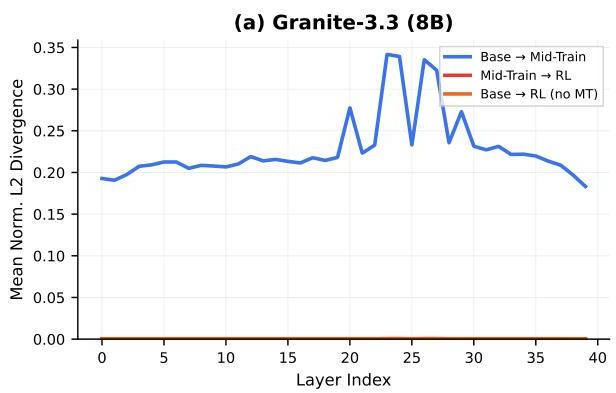

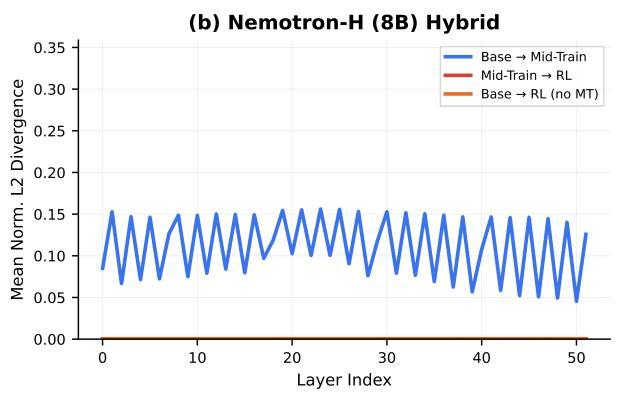

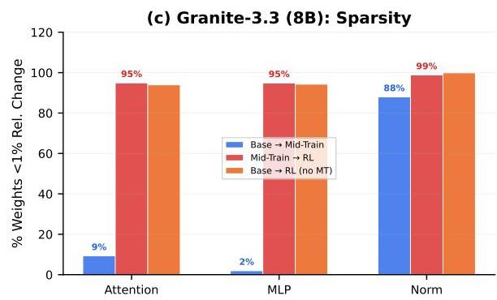
Figure 11 Mid-training densely restructures the network; RL makes sparse, surgical refinements. Top row: layer-wise normalized L2 divergence for Granite-3.3 (8B, left) and Nemotron-H (8B, right). Mid-training (blue) changes weights  $370 - 580 \times$  more than RL (red, orange), broadly across all layers with some layer-wise variation. For Nemotron-H, the repeating pattern reflects its hybrid architecture where Mamba-2, self-attention and FFN are separate sequential layers with independent residual connections (NVIDIA et al., 2025). Bottom row: update sparsity by component type. Mid-training modifies  $&gt;90\%$  of all parameters (attention, MLP, and Mamba alike), while RL leaves  $&gt;93\%$  unchanged.

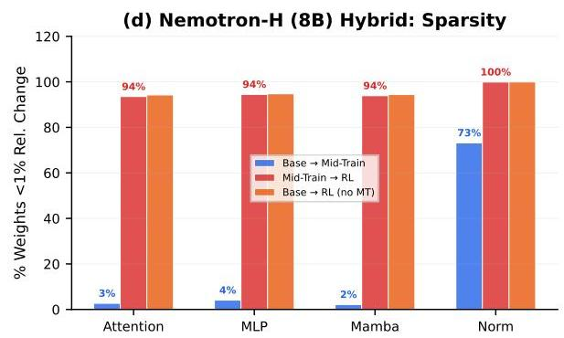

during mid-training. For Nemotron-H, all three component types undergo dense updates: attention (97.3%), MLP (95.9%), and Mamba (97.8%), with MLP showing the largest L2 divergence (0.289) followed by attention (0.230) and Mamba (0.138) (Table 12). Changes are broadly distributed across all layers with some layer-wise variation (Figure 11, top row), with the hybrid model showing a characteristic alternating pattern reflecting its architecture of separate Mamba-2, FFN, and attention layers (52 layers total:  $\sim 24$  Mamba,  $\sim 24$  FFN, 4 attention).

RL is a sparse, surgical refinement. In contrast, RL modifies only  $\sim 5\%$  of parameters across all architectures. L2 divergence is  $580\times$  smaller for Granite-3.3 (0.0003 vs. 0.175) and  $370\times$  smaller for Nemotron-H (0.0003 vs. 0.112). Over  $93\%$  of all weights remain within  $1\%$  of their mid-trained values (Figure 11, bottom row). Crucially, all three component types in the hybrid model show nearly identical sparsity during RL: attention  $(93.5\%)$ , MLP  $(94.5\%)$ , and Mamba  $(93.9\%)$ , confirming that the sparse RL update pattern is consistent across component types within the hybrid architecture. This sparsity is consistent with concurrent findings by Mukherjee et al. (2025), who identify in-distribution training as a key driver of update sparsity. We extend their analysis by demonstrating this asymmetry across two architectures and jointly with mid-training. We leave exploration of RL on domains not seen during mid-training to future work. At the sub-component level, value (V) and output (O) projections are consistently the most modified during RL  $(5.6 - 8.5\%)$ , while SSM parameters (A, dt) remain completely frozen; see Appendix H for the full breakdown.

Data composition determines the capabilities encoded, not the amount of change. Table 13 shows that MC and MCS mid-training produce nearly identical weight divergence profiles for both models: total L2 of 0.177 vs. 0.175 for Granite-3.3, and 0.113 vs. 0.112 for Nemotron-H, with matching per-component breakdowns. Yet the downstream GPQA-Diamond capabilities differ dramatically: for Granite-3.3, MCS+RL achieves 52.86 vs.

---

<table><tr><td>Model</td><td>Mix</td><td>Attn</td><td>MLP</td><td>Mamba</td><td>Total</td></tr><tr><td rowspan="2">Granite-3.3 (8B)</td><td>MC</td><td>0.177</td><td>0.333</td><td>-</td><td>0.177</td></tr><tr><td>MCS</td><td>0.175</td><td>0.329</td><td>-</td><td>0.175</td></tr><tr><td rowspan="2">Nemotron-H (8B)</td><td>MC</td><td>0.232</td><td>0.292</td><td>0.140</td><td>0.113</td></tr><tr><td>MCS</td><td>0.230</td><td>0.289</td><td>0.138</td><td>0.112</td></tr></table>

Table 13 MC vs. MCS weight divergence (Base→MT normalized L2). Both models show nearly identical per-component L2 norms across data compositions, confirming that the training intensity is matched between MC and MCS despite their different downstream capabilities.

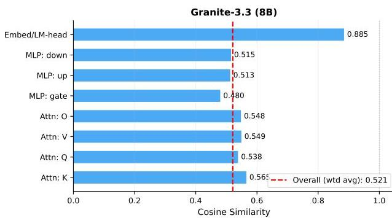
Cosine Similarity Between MC and MCS Weight Update Vectors

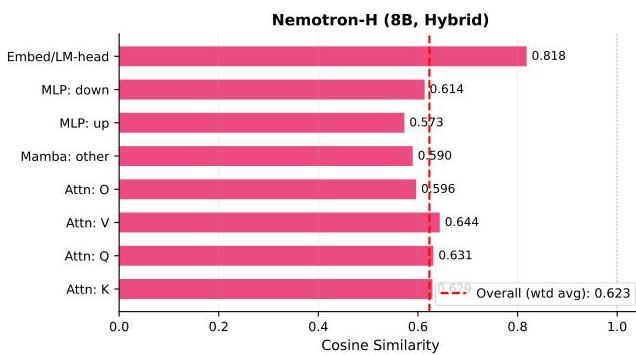
Figure 12 Data composition redirects weight updates across all sub-components. Cosine similarity between MC and MCS weight update vectors  $(\Delta W = W_{MT} - W_{base})$  for Granite-3.3 (left) and Nemotron-H (right). Overall cosine similarity of 0.52 and 0.62 respectively confirms that different data compositions steer weights in substantially different directions despite nearly identical magnitudes. The embedding/LM-head layers are most aligned (0.82–0.88), while attention, MLP, and Mamba layers all show low directional similarity (0.48–0.64).

35.52 for  $\mathrm{MC + RL}$  (Table 11). To directly measure what differs, we compute the cosine similarity between the MC and MCS weight update vectors per component (Figure 12):

$$
\cos \left(\Delta W _ {M C}, \Delta W _ {M C S}\right) = \frac {\left(W _ {M C} - W _ {\text {b a s e}}\right) \cdot \left(W _ {M C S} - W _ {\text {b a s e}}\right)}{\| W _ {M C} - W _ {\text {b a s e}} \| _ {2} \cdot \| W _ {M C S} - W _ {\text {b a s e}} \| _ {2}} \tag {2}
$$

The overall cosine similarity (Eq. 2) is only 0.521 for Granite-3.3 and 0.623 for Nemotron-H, indicating that despite traveling nearly identical distances in weight space (L2: 0.177 vs. 0.175 for G33; 0.113 vs. 0.112 for Nemotron-H), the two data compositions reach substantially different weight configurations. All sub-components (attention, MLP, Mamba) show similarly low directional alignment (0.48–0.64), with only the embedding layers remaining closer (0.82–0.88). These results are consistent with the view that data composition primarily affects what configuration the weights converge to, rather than the magnitude of the weight change (as measured by normalized L2).

RL's weight footprint is independent of the starting point. RL applied directly to base models (without mid-training) produces nearly identical weight changes to RL on mid-trained models, at both Granite-3.3 (0.0004 vs. 0.0003) and Nemotron-H (0.0002 vs. 0.0003). Yet the downstream outcomes differ drastically. A finer-grained sub-component analysis (Table 23, Appendix H) confirms that this invariance extends to individual weight matrices: RL targets the same sub-components in nearly identical proportions regardless of whether mid-training preceded it. For Granite-3.3, value projections change  $5.7\%$  (MT  $\rightarrow$  RL) vs.  $7.5\%$  (Base  $\rightarrow$  RL), output projections  $5.6\%$  vs.  $6.7\%$ , and MLP gate projections  $5.4\%$  vs.  $6.1\%$ . Nemotron-H shows the same pattern, with Mamba parameters (A, dt) remaining completely frozen in both cases. This reveals that RL's sub-component targeting is an intrinsic property of the optimization process, not a consequence of mid-training. The large difference in outcomes despite similar weight change patterns suggests that mid-training appears to create model configurations from which RL can effectively improve performance, though the causal mechanism

---

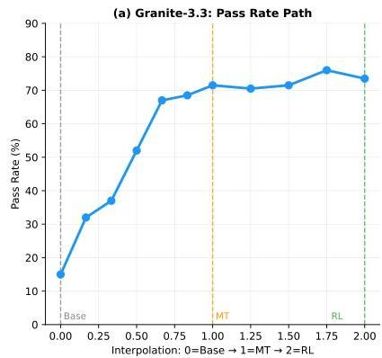
Figure 13: Pass rate landscape on held-out MATH500 problems. (a) Math pass rate at linearly interpolated weight checkpoints along the Base$\rightarrow$MT$\rightarrow$RL path for Granite-3.3 and LLaMA-3.1, evaluated on 200 held-out MATH500 problems (7680 generation tokens). Pass rate increases monotonically from Base to MT (16.9%$\rightarrow$75.5% for G33, 2.6%$\rightarrow$43.1% for LLaMA) and continues increasing through RL. (b) 2D pass rate landscape for Granite-3.3 centered at MT, with axes toward RL ($\alpha$) and toward Base ($\beta$). The RL direction consistently improves performance while moving toward Base degrades it.

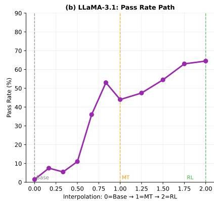

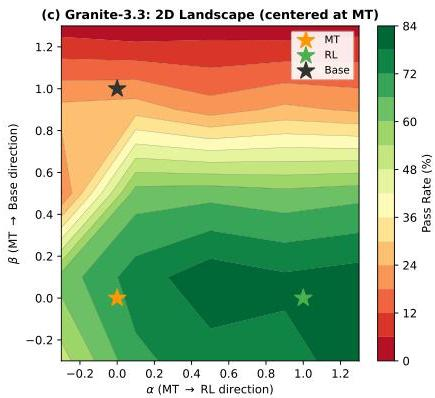

remains to be established, while base models do not benefit to the same degree despite receiving similar gradient-driven updates.

#### Pass rate landscape is consistent with mid-training creating a favorable configuration for RL.

To directly visualize this effect, we construct a *pass rate landscape* by linearly interpolating model weights along the training path and evaluating math pass rate at each interpolated checkpoint. We use 200 held-out MATH500 problems (not included in the RL training pool) with temperature 0.6, top-$p$ 0.95, and 7680 max generation tokens, scored with the same verifier as RL training. We evaluate Granite-3.3 and LLaMA-3.1 (Figure 13). The interpolated weights are:

$W(\alpha,\beta)=W_{\text{base}}+\alpha(W_{MT}-W_{\text{base}})+\beta(W_{RL}-W_{MT})$ (3)

where $\alpha=0,\beta=0$ recovers Base; $\alpha=1,\beta=0$ recovers MT; and $\alpha=1,\beta=1$ recovers RL (Eq. 3). The 1D path sets $\beta=0$ and varies $\alpha$ from 0 to 1, then fixes $\alpha=1$ and varies $\beta$ from 0 to 1. The 2D landscape evaluates pass rate on a $5\times 5$ grid over $(\alpha,\beta)$.

For Granite-3.3, pass rate increases from Base (17%) to MT (76%) as $\alpha$ increases from 0 to 1, then continues to RL (80%) along the $\beta$ axis. LLaMA shows a similar trend: Base (3%) to MT (44%) to RL (66%). The 2D landscape shows the RL direction consistently yields higher performance, while moving toward Base degrades it. No sharp barriers are apparent near the training path.

The next section examines this further at the representation level: while RL’s weight changes are consistent regardless of starting point, the resulting representations are dramatically more capable when built on top of mid-training.

### 10.2 Representation Similarity Across Pipeline Stages

To complement the weight-level analysis, we measure how mid-training and RL reshape the model’s internal *representations* using linear Centered Kernel Alignment (CKA) *(Kornblith et al., 2019)*:

$\text{CKA}(X,Y)=\frac{\|Y^{\top}X\|_{F}^{2}}{\|X^{\top}X\|_{F}\cdot\|Y^{\top}Y\|_{F}}$ (4)

where $X,Y\in\mathbb{R}^{n\times d}$ are mean-pooled hidden states from two checkpoints across $n$ inputs (Eq. 4). CKA$=1$ indicates identical representational geometry; lower values indicate greater divergence. We feed identical text through the Base, MT, and RL checkpoints, extracting mean-pooled hidden states at each layer. To ensure robustness, we evaluate on three input distributions: Wikipedia (general text), C4 (web text), and GSM8K (math prompts), across three models (Granite-3.3, LLaMA-3.1, Nemotron-H). To validate statistical

---

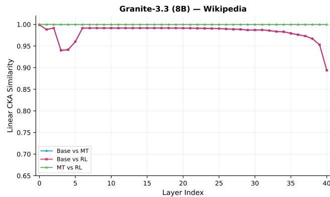

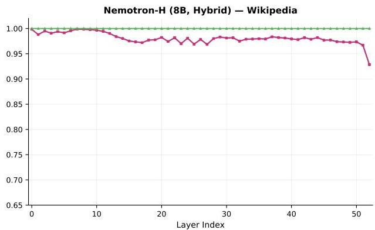

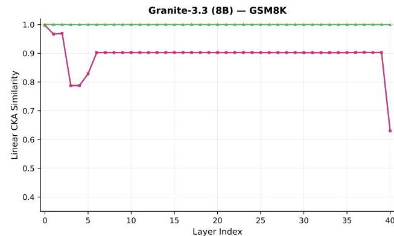
Figure 14 RL preserves representational geometry; mid-training reshapes it in model-specific ways. Layer-wise linear CKA (Kornblith et al., 2019) on Wikipedia (top) and GSM8K math prompts (bottom) for Granite-3.3 (left) and Nemotron-H (right), evaluated on 200 prompts per input type with batch-size-1 encoding. MT vs. RL (green) is  $\approx 1.0$  at every layer across both models and both input types, confirming RL preserves mid-training's representational geometry. Base vs. MT and Base vs. RL (blue, pink) are nearly identical, confirming all representational change comes from mid-training. The magnitude and layer pattern of mid-training's representational shift is model- and input-specific. See Table 14 for the full summary.

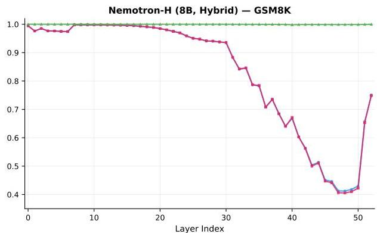

stability, we perform bootstrap resampling (20 resamples of 100 from 200 inputs) and find that all MT vs. RL CKA estimates have standard deviations of at most 0.0001, confirming that the results are stable and not sensitive to the choice of input subset. Figure 14 reports layer-wise linear CKA on Wikipedia and GSM8K for Granite-3.3 and Nemotron-H; additional models and input types are in Appendix I.

RL preserves the representational geometry that mid-training creates. Table 14 shows MT vs. RL  $&gt;0.998$  for all three models across all three input types. This holds for dense Transformers (Granite-3.3, LLaMA-3.1) and the hybrid attention-Mamba architecture (Nemotron-H) alike. Furthermore, Base vs. MT and Base vs. RL curves are nearly identical at every layer, confirming that all representational geometry change is attributable to mid-training; RL achieves its gains through modifications within this established structure. RL achieves its benchmark gains through adjustments within the representational space that mid-training established, suggesting a division of roles between the two training stages.

The output layer shows the largest mid-training shift. For Granite-3.3, the sharpest Base vs. MT CKA divergence consistently occurs at the final transformer layer (layer 40) across all three inputs, but its depth is input-dependent: CKA  $\approx 0.63$  on GSM8K math prompts versus  $\approx 0.89$  on Wikipedia and C4. This input-specificity suggests the output layer restructuring is most pronounced for math reasoning content, consistent with the behavioral shift observed in Section 10.3: base models produce short, direct answers (median 124 tokens), while mid-trained models produce extended reasoning chains (2,196 tokens).

---

<table><tr><td>Model</td><td>Arch.</td><td>Wiki</td><td>C4</td><td>GSM8K</td></tr><tr><td>Granite-3.3 (8B)</td><td>Dense</td><td>0.9999±0.0000</td><td>0.9999±0.0000</td><td>0.9997±0.0000</td></tr><tr><td>LLaMA-3.1 (8B)</td><td>Dense</td><td>0.9999±0.0000</td><td>0.9999±0.0000</td><td>0.9996±0.0001</td></tr><tr><td>Nemotron-H (8B)</td><td>Hybrid</td><td>0.9999±0.0000</td><td>0.9998±0.0000</td><td>0.9993±0.0001</td></tr></table>

Table 14 MT vs. RL representational similarity (minimum linear CKA ± bootstrap std) across input distributions. Values are the minimum layer-wise CKA across 20 bootstrap resamples of 100 from 200 inputs. RL consistently preserves mid-training's representational geometry (&gt;0.998) across all three models and all three input types, spanning both dense Transformers and hybrid attention-Mamba architectures.

<table><tr><td>Model</td><td>Stage</td><td>Pass</td><td>Med. Len</td><td>Neg-LP</td><td>Corr.</td><td>Incorr.</td></tr><tr><td rowspan="3">Granite-3.3 (8B)</td><td>Base</td><td>16.9%</td><td>120</td><td>0.382</td><td>-</td><td>0.383</td></tr><tr><td>MT</td><td>75.5%</td><td>2,254</td><td>0.138</td><td>0.128</td><td>0.153</td></tr><tr><td>RL</td><td>79.5%</td><td>1,700</td><td>0.141</td><td>0.135</td><td>0.160</td></tr><tr><td rowspan="3">LLaMA-3.1 (8B)</td><td>Base</td><td>2.6%</td><td>158</td><td>0.758</td><td>-</td><td>0.780</td></tr><tr><td>MT</td><td>43.1%</td><td>1,052</td><td>0.377</td><td>0.146</td><td>0.469</td></tr><tr><td>RL</td><td>64.6%</td><td>1,188</td><td>0.267</td><td>0.149</td><td>0.320</td></tr><tr><td rowspan="3">Nemotron-H (8B, Hybrid)</td><td>Base</td><td>66.6%</td><td>452</td><td>0.167</td><td>0.040</td><td>0.258</td></tr><tr><td>MT</td><td>61.6%</td><td>1,928</td><td>0.150</td><td>0.116</td><td>0.156</td></tr><tr><td>RL</td><td>83.0%</td><td>1,780</td><td>0.127</td><td>0.112</td><td>0.137</td></tr></table>

Table 15 Correctness, response length, and prediction confidence across pipeline stages on 200 held-out MATH500 problems (8 samples/prompt, 7680 max generation tokens, step-by-step reasoning prompt). Pass = mean pass rate across 8 samples per prompt (\%). Med. Len = median response length (tokens). Neg-LP = mean negative log-probability. Corr./Incorr. = mean neg-LP for correct/incorrect responses; - indicates too few correct samples. The PRISM  $\rightarrow$  RL pipeline consistently achieves the highest pass rates across all three model families.

Mid-training's representational impact is model- and input-specific. Unlike the RL finding (which is consistent across all models), the Base vs. MT divergence pattern varies considerably across models and input types. For Granite-3.3, the largest divergence is at the final output layer across all inputs (CKA  $\approx 0.63$  on GSM8K,  $\approx 0.89$  on Wikipedia and C4). Nemotron-H shows the most pronounced divergence on GSM8K, with a deep dip in later layers (CKA  $\approx 0.41$  at layer 48) while recovering to  $\approx 0.75$  at the final layer; on Wikipedia the final layer CKA is  $\approx 0.93$ , indicating the restructuring is heavily math-targeted. LLaMA-3.1 shows its deepest divergence on C4 web text (CKA  $\approx 0.71$  at layer 29) rather than GSM8K ( $\approx 0.78$ ), with the final layer recovering to  $\approx 0.90$ . Each model was pretrained on a different data distribution, which is consistent with differences in how mid-training reshapes their representations, though we do not have access to the pretraining corpus compositions and cannot verify this hypothesis directly. Rather than making universal claims about where mid-training acts, we simply observe that its effect is model-dependent, whereas RL's preservation of representational geometry is consistent across all four models.

# 10.3 Prediction Confidence and Correctness Across Pipeline Stages

We sample 200 held-out MATH500 problems (Lightman et al., 2023) and generate 8 responses per prompt at each pipeline stage using vLLM with temperature 0.6, top- $p$  0.95, 7680 max generation tokens, and a step-by-step reasoning prompt suffix. Pass rate is averaged across all 8 samples per prompt and then across 200 prompts. We collect per-token log-probabilities during generation and score correctness using the same math verifier employed during RL training. We report mean negative log-probability as a proxy for prediction confidence; note that this differs from predictive entropy, which would require marginalizing over the full output distribution. Results are in Table 15 and Figure 15.

Mid-training teaches models to reason, not just answer. The most striking behavioral change is in response length. LLaMA base generates a median of just 158 tokens on MATH500 problems, Granite-3.3 base produces 120, and Nemotron-H base 452. After mid-training, all three produce extended reasoning chains: LLaMA increases to 1,052 tokens, Granite-3.3 extends to 2,254, and Nemotron-H to 1,928 (Table 15). This is consistent

---

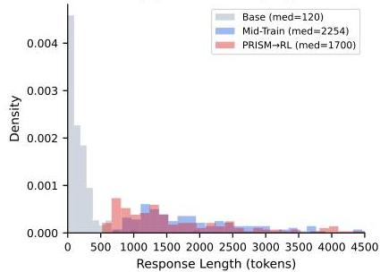
(a) Granite-3.3 (8B)

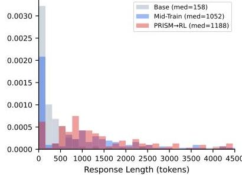
(b) LLaMA-3.1 (8B)

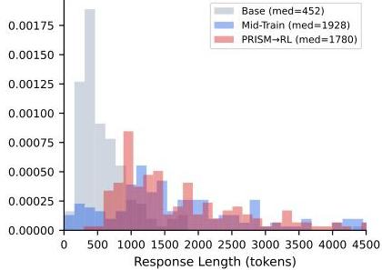
(c) Nemotron-H (8B)

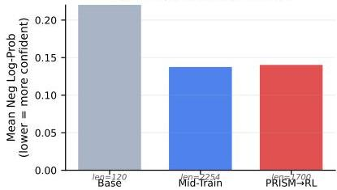
(d) Prediction Confidence

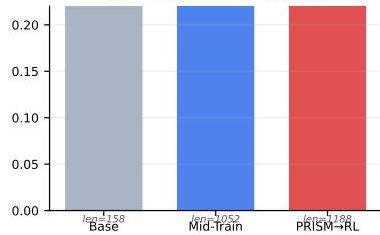
(e) Prediction Confidence
Figure 15 Mid-training transforms prediction behavior: models learn to reason longer with calibrated confidence. Evaluated on 200 held-out MATH500 problems. Top row: response length distributions shift from short outputs (Base, gray) to extended reasoning chains (MT, blue), with RL (red) adjusting length. Bottom row: mean negative log-probability at each stage.

(f) Prediction Confidence

with mid-training's primary behavioral effect being the acquisition of multi-step problem decomposition.

The full pipeline dramatically improves correctness. Granite-3.3 improves from  $16.9\%$  to  $79.5\%$  pass rate, LLaMA from  $2.6\%$  to  $64.6\%$ , and Nemotron-H from  $66.6\%$  to  $83.0\%$ . Nemotron-H is a notable case: the base model already achieves  $66.6\%$  on MATH500, generating 452-token responses that often reach direct correct answers. Mid-training introduces chain-of-thought reasoning patterns (extending to 1,928 tokens), but these extended generation strategies may conflict with the base model's existing direct-solution approaches, leading to a regression at the MT stage  $(61.6\%)$ . This tension is resolved by RL, which optimizes for correctness and recovers well above the base level  $(83.0\%)$ . This pattern of brief MT regression followed by strong RL recovery is consistent with the hypothesis that mid-training reshapes generation behavior in ways that require RL to fully unlock the capability gains. RL consistently improves over MT alone for all three models. Correct responses tend to have lower negative log-probability than incorrect ones across all stages and models (Table 15, Corr. vs. Incorr. columns), suggesting that higher model confidence is on average associated with correctness. This effect is most pronounced for LLaMA-3.1 (e.g., 0.149 correct vs. 0.320 incorrect at RL) and smallest for Nemotron-H at the RL stage (0.112 vs. 0.137).

Mid-training calibrates prediction confidence. Mid-training substantially reduces mean negative log-probability across all models, indicating increased overall confidence: Granite-3.3 from 0.382 to 0.138, LLaMA from 0.758 to 0.377, and Nemotron-H from 0.167 to 0.150. For LLaMA, the gap between correct and incorrect response confidence widens after mid-training (e.g., correct: 0.146 vs. incorrect: 0.469 at MT), indicating better calibration. Nemotron-H behaves differently: the base model is already highly confident on correct answers (neg-LP = 0.040) but very uncertain on incorrect ones (0.258); after mid-training and RL, confidence converges to a narrower range (correct: 0.112, incorrect: 0.137 at RL), making predictions more uniformly confident while still maintaining a separation between correct and incorrect responses.

RL refines toward efficient, correct reasoning. RL adjusts response length in a model-dependent direction: shortening for Granite-3.3 (2,254→1,700), while Nemotron-H (1,928→1,780) and LLaMA (1,052→1,188) show modest changes. In all cases, RL maintains or improves the confidence gap between correct and incorrect answers while substantially increasing pass rates, demonstrating that it optimizes both the quality and efficiency of the reasoning process that mid-training established.

---

Figure 16 RL optimization is front-loaded and starting-point-invariant. Top row: cumulative L2 divergence from the initial checkpoint over RL steps for Granite-3.3 (left) and Nemotron-H (right). Solid lines:  $\mathrm{MT} \rightarrow \mathrm{RL}$ ; dashed lines: Base  $\rightarrow$  RL. Most weight change occurs in the first  $\sim 200 - 400$  steps, then plateaus.  $\mathrm{MT} \rightarrow \mathrm{RL}$  and Base  $\rightarrow$  RL produce nearly identical divergence profiles, confirming that RL's weight footprint is independent of the starting point. Bottom row: sparsity evolution showing the fraction of parameters within  $1\%$  of their initial values. The active parameter set grows progressively from  $\sim 1.5\%$  at step 20 to  $\sim 5 - 6\%$  by step 960, with all component types following the same trajectory.

# 10.4 RL Weight Trajectory: Front-Loaded Optimization

We track weight evolution across RL training steps (20 to 960) for both Granite-3.3 and Nemotron-H, comparing MT  $\rightarrow$  RL and Base  $\rightarrow$  RL trajectories. Results are shown in Figure 16.

RL weight changes are front-loaded. Across both architectures, the majority of RL's cumulative weight divergence accumulates in the first  $\sim 200 - 400$  steps, with the L2 curve plateauing thereafter (Figure 16, top row). For Nemotron-H, attention divergence reaches  $80\%$  of its final value by step 400; for Granite-3.3, the pattern is similar. This front-loading is consistent with the benchmark learning curves, which show the steepest performance gains in early RL steps. The component hierarchy is also consistent across all runs: attention layers change most, followed by MLP, then Mamba (in hybrid models).

The active parameter set is emergent, not predetermined. RL does not modify a fixed subset of parameters from the outset. Instead, the fraction of changed parameters grows progressively: at step 20, only  $\sim 1.5\%$  of parameters have moved beyond the  $1\%$  relative threshold, expanding to  $\sim 5 - 6\%$  by step 960 (Figure 16, bottom row). This gradual activation pattern, combined with the front-loaded divergence, shows that RL's sparse update set is not fixed from the outset but expands progressively over the course of training.

Starting point does not affect RL's weight trajectory. Comparing  $\mathrm{MT} \rightarrow \mathrm{RL}$  (solid) with Base  $\rightarrow$  RL (dashed) on the same axes reveals nearly identical L2 and sparsity trajectories for both Granite-3.3 and Nemotron-H. The final L2 divergence differs by less than  $20\%$  between starting points, and sparsity converges to within 1 percentage point. This provides additional evidence, beyond the single-checkpoint analysis in Section 10.1,

---

that RL applies a similarly scaled and sparse update pattern regardless of the starting point. The difference in downstream performance is thus consistent with arising from *where* in weight space the updates land, rather than from differences in the magnitude or sparsity of how RL modifies weights.

## 11 Conclusion and Future Work

We presented PRISM, a comprehensive empirical study of mid-training design choices for LLMs. Through controlled experiments across seven base models from four families (Granite, LLaMA, Mistral, Nemotron-H), two architecture types (dense Transformer and attention-Mamba hybrid), and scales from 3B to 24B parameters, we established several findings that we believe are valuable for practitioners designing mid-training pipelines:

- A relatively small mid-training phase ($\sim$27B tokens) yields +15 to +40 point math gains and +5 to +12 point code gains across all tested models, with science gains of +6 to +13 points on Granite and hybrid models, while preserving general performance.
- Data composition choices matter most at mid-training, not at RL. Including science data during mid-training unlocks +17 to +28 point GPQA-Diamond gains during RL, while changing the RL mix produces $<$2 point differences.
- The full PRISM $\rightarrow$ RL pipeline improves the six-benchmark macro-average from under 12 to 29–42, a 3–4$\times$ improvement. RL applied directly to base models is substantially less effective.
- For Granite-3.3, mid-training at 8k context degrades long-context ability, but this can be largely restored via a brief extension phase combined with model merging. Note that all models in our study were pretrained with long-context phases, so the interaction between long-context pretraining and mid-training effectiveness may vary in other settings.
- For Granite-3.3, RL on mid-trained models progressively solves initially unsolvable prompts, with non-saturating training curves suggesting further gains are achievable.
- At the weight level, mid-training densely restructures $>$90% of parameters (370–580$\times$ larger than RL), while RL sparsely refines $\sim$5%, with identical footprints regardless of whether mid-training preceded it. Representation analysis (CKA) across three models and three input distributions confirms that RL consistently preserves mid-training’s representational geometry ($>$0.998) across both dense Transformers and hybrid architectures, while mid-training’s representational impact is model-specific. RL optimization is front-loaded, with most weight changes in the first $\sim$200–400 steps. Behaviorally, mid-training produces extended reasoning chains in model outputs.

##### Limitations and future directions.

Our study has several limitations that point to productive future work.

Model-specific RL data selection. For consistency across model families, we filtered RL prompts using a single model (Granite-3.3-8B mid-trained) and applied the same mix to all models. In practice, different mid-trained models have different difficulty profiles, and model-specific prompt selection would likely yield stronger per-model results. Our goal was not to produce optimal per-model recipes but to enable controlled cross-model comparisons. Investigating adaptive, model-aware RL data curation is a natural next step.

Broader domain coverage. Our mid-training mixtures focus on math, code, and science. Extending PRISM to additional domains such as multilingual reasoning, agentic tasks, and tool use would test whether the patterns we observe (e.g., domain synergies, retention via general web data) hold more broadly.

Scaling beyond 24B. Our largest model is Mistral-Small (24B). Verifying that PRISM’s findings extend to models at the 70B+ scale, where mid-training compute budgets and data requirements may differ qualitatively, remains an open question.

Long-context mid-training. Our primary experiments use 8k context during mid-training. While our ablations show that 16k yields additional gains, we did not explore mid-training at 32k+ with proportionally larger token budgets. Jointly optimizing context length and token budget during mid-training could further improve the reasoning/retention trade-off.

---

Overall, PRISM demonstrates that retention-aware mid-training is a highly effective intermediate step for reliable reasoning enhancement and RL scaling. We hope that the practical guidelines and comprehensive analyses provided in this work will help the community design more effective mid-training pipelines for modern LLMs.

---

References

- Abdin et al. (2024) Marah Abdin, Jyoti Aneja, Hany Awadalla, Ahmed Awadallah, Ammar Ahmad Awan, Nguyen Bach, Amit Bahree, Arash Bakhtiari, Jianmin Bao, Harkirat Behl, Alon Benhaim, Misha Bilenko, Johan Bjorck, Sébastien Bubeck, Martin Cai, Qin Cai, Vishrav Chaudhary, Dong Chen, Dongdong Chen, Weizhu Chen, Yen-Chun Chen, Yi-Ling Chen, Hao Cheng, Parul Chopra, Xiyang Dai, Matthew Dixon, Ronen Eldan, Victor Fragoso, Jianfeng Gao, Mei Gao, Min Gao, Amit Garg, Allie Del Giorno, Abhishek Goswami, Suriya Gunasekar, Emman Haider, Junheng Hao, Russell J. Hewett, Wenxiang Hu, Jamie Huynh, Dan Iter, Sam Ade Jacobs, Mojan Javaheripi, Xin Jin, Nikos Karampatziakis, Piero Kauffmann, Mahoud Khademi, Dongwoo Kim, Young Jin Kim, Lev Kurilenko, James R. Lee, Yin Tat Lee, Yuanzhi Li, Yunsheng Li, Chen Liang, Lars Liden, Xihui Lin, Zeqi Lin, Ce Liu, Liyuan Liu, Mengchen Liu, Weishung Liu, Xiaodong Liu, Chong Luo, Piyush Madan, Ali Mahmoudzadeh, David Majercak, Matt Mazzola, Caio César Teodoro Mendes, Arindam Mitra, Hardik Modi, Anh Nguyen, Brandon Norick, Barun Patra, Daniel Perez-Becker, Thomas Portet, Reid Pryzant, Heyang Qin, Marko Radmilac, Liliang Ren, Gustavo de Rosa, Corby Rosset, Sambudha Roy, Olatunji Ruwase, Olli Saarikivi, Amin Saied, Adil Salim, Michael Santacroce, Shital Shah, Ning Shang, Hiteshi Sharma, Yelong Shen, Swadheen Shukla, Xia Song, Masahiro Tanaka, Andrea Tupini, Praneetha Vaddamanu, Chunyu Wang, Guanhua Wang, Lijuan Wang, Shuohang Wang, Xin Wang, Yu Wang, Rachel Ward, Wen Wen, Philipp Witte, Haiping Wu, Xiaoxia Wu, Michael Wyatt, Bin Xiao, Can Xu, Jiahang Xu, Weijian Xu, Jilong Xue, Sonali Yadav, Fan Yang, Jianwei Yang, Yifan Yang, Ziyi Yang, Donghan Yu, Lu Yuan, Chenruidong Zhang, Cyril Zhang, Jianwen Zhang, Li Lyna Zhang, Yi Zhang, Yue Zhang, Yunan Zhang, and Xiren Zhou. Phi-3 technical report: A highly capable language model locally on your phone, 2024. https://arxiv.org/abs/2404.14219.
- Ahmed et al. (2025) Wasi Uddin Ahmad, Somshubra Majumdar, Aleksander Ficek, Sean Narenthiran, Mehrzad Samadi, Jocelyn Huang, Siddhartha Jain, Vahid Noroozi, and Boris Ginsburg. Opencodereasoning-ii: A simple test time scaling approach via self-critique, 2025. https://arxiv.org/abs/2507.09075.
- Ben Allal et al. (2023) Aime problems and solutions. https://artofproblemsolving.com/wiki/index.php/AIME_Problems_and_Solutions.
- Ben Ben Allal et al. (2024) Loubna Ben Allal, Anton Lozhkov, Elie Bakouch, Gabriel Martín Blázquez, Guilherme Penedo, Lewis Tunstall, Andrés Marafioti, Hynek Kydlíček, Agustín Piqueres Lajarín, Vaibhav Srivastav, Joshua Lochner, Caleb Fahlgren, Xuan-Son Nguyen, Clémentine Fourrier, Ben Burtenshaw, Hugo Larcher, Haojun Zhao, Cyril Zakka, Mathieu Morlon, Colin Raffel, Leandro von Werra, and Thomas Wolf. Smollm2: When smol goes big – data-centric training of a small language model, 2025. https://arxiv.org/abs/2502.02737.
- Bercovich et al. (2023) Edward Beeching, Clémentine Fourrier, Nathan Habib, Sheon Han, Nathan Lambert, Nazneen Rajani, Omar Sanseviero, Lewis Tunstall, and Thomas Wolf. Open llm leaderboard (2023-2024). https://huggingface.co/spaces/open-llm-leaderboard-old/open_llm_leaderboard, 2023.
- Berci et al. (2024) Akhiad Bercovich, Itay Levy, Izik Golan, Mohammad Dabbah, Ran El-Yaniv, Omri Puny, Ido Galil, Zach Moshe, Tomer Ronen, Najeeb Nabwani, Ido Shahaf, Oren Tropp, Ehud Karpas, Ran Zilberstein, Jiaqi Zeng, Soumye Singhal, Alexander Bukharin, Yian Zhang, Tugrul Konuk, Gerald Shen, Ameya Sunil Mahabaleshwarkar, Bilal Kartal, Yoshi Suhara, Olivier Delalleau, Zijia Chen, Zhilin Wang, David Mosallanezhad, Adi Renduchintala, Haifeng Qian, Dima Rekesh, Fei Jia, Somshubra Majumdar, Vahid Noroozi, Wasi Uddin Ahmad, Sean Narenthiran, Aleksander Ficek, Mehrzad Samadi, Jocelyn Huang, Siddhartha Jain, Igor Gitman, Ivan Moshkov, Wei Du, Shubham Toshniwal, George Armstrong, Branislav Kisacanin, Matvei Novikov, Daria Gitman, Evelina Bakhturina, Jane Polak Scowcroft, John Kamalu, Dan Su, Kezhi Kong, Markus Kliegl, Rabeeh Karimi, Ying Lin, Sanjeev Satheesh, Jupinder Parmar, Pritam Gundecha, Brandon Norick, Joseph Jennings, Shrimai Prabhumoye, Syeda Nahida Akter, Mostofa Patwary, Abhinav Khattar, Deepak Narayanan, Roger Waleffe, Jimmy Zhang, Bor-Yiing Su, Guyue Huang, Terry Kong, Parth Chadha, Sahil Jain, Christine Harvey, Elad Segal, Jining Huang, Sergey Kashirsky, Robert McQueen, Izzy Putterman, George Lam, Arun Venkatesan, Sherry Wu, Vinh Nguyen, Manoj Kilaru, Andrew Wang, Anna Warno, Abhilash Somasamudramath, Sandip Bhaskar, Maka Dong, Nave Assaf, Shahar Mor, Omer Ullman Argov, Scot Junkin, Oleksandr Romanenko, Pedro Larroy, Monika Katariya, Marco Rovinelli, Viji Balas, Nicholas Edelman, Anahita Bhiwandiwalla, Muthu Subramaniam, Smita Ithape, Karthik Ramamoorthy, Yuting Wu, Suguna Varshini Velury, Omri Almog, Joyjit Daw, Denys Fridman, Erick Galinkin, Michael Evans, Katherine Luna, Leon Derczynski, Nikki Pope, Eileen Long, Seth Schneider, Guillermo Siman, Tomasz Grzegorzek, Pablo Ribalta, Monika Katariya, Joey Conway, Trisha Saar, Ann Guan, Krzysztof Pawelec, Shyamala Prayaga, Oleksii Kuchaiev, Boris Ginsburg, Oluwatobi Olabiyi, Kari Briski, Jonathan Cohen, Bryan Catanzaro, Jonah Alben, Yonatan Geifman, Eric Chung, and Chris Alexiuk. Llama-nemotron: Efficient reasoning models, 2025. https://arxiv.org/abs/2505.00949.
- Ding et al. (2023) Ning Ding, Yulin Chen, Bokai Xu, Yujia Qin, Zhi Zheng, Shengding Hu, Zhiyuan Liu, Maosong Sun, and Bowen Zhou. Enhancing chat language models by scaling high-quality instructional conversations, 2023.

---

Clémentine Fourrier, Nathan Habib, Alina Lozovskaya, Konrad Szafer, and Thomas Wolf. Open llm leaderboard v2. https://huggingface.co/spaces/open-llm-leaderboard/open_llm_leaderboard, 2024.
- (4) Alexey Gorbatovski, Boris Shaposhnikov, Alexey Malakhov, Nikita Surnachev, Yaroslav Aksenov, Ian Maksimov, Nikita Balagansky, and Daniil Gavrilov. Learn your reference model for real good alignment, 2025. https://arxiv.org/abs/2404.09656.
- (5) Granite Team, IBM. Granite-3.3-8b-base. Hugging Face, 2025. https://huggingface.co/ibm-granite/granite-3.3-8b-base.
- (6) Aaron Grattafiori, Abhimanyu Dubey, Abhinav Jauhri, Abhinav Pandey, Abhishek Kadian, Ahmad Al-Dahle, Aiesha Letman, Akhil Mathur, Alan Schelten, Alex Vaughan, Amy Yang, Angela Fan, Anirudh Goyal, Anthony Hartshorn, Aobo Yang, Archi Mitra, Archie Sravankumar, Artem Korenev, Arthur Hinsvark, Arun Rao, Aston Zhang, Aurelien Rodriguez, Austen Gregerson, Ava Spataru, Baptiste Roziere, Bethany Biron, Binh Tang, Bobbie Chern, Charlotte Caucheteux, Chaya Nayak, Chloe Bi, Chris Marra, Chris McConnell, Christian Keller, Christophe Touret, Chunyang Wu, Corinne Wong, Cristian Canton Ferrer, Cyrus Nikolaidis, Damien Allonsius, Daniel Song, Danielle Pintz, Danny Livshits, Danny Wyatt, David Esiobu, Dhruv Choudhary, Dhruv Mahajan, Diego Garcia-Olano, Diego Perino, Dieuwke Hupkes, Egor Lakomkin, Ehab AlBadawy, Elina Lobanova, Emily Dinan, Eric Michael Smith, Filip Radenovic, Francisco Guzmán, Frank Zhang, Gabriel Synnaeve, Gabrielle Lee, Georgia Lewis Anderson, Govind Thattai, Graeme Nail, Gregoire Mialon, Guan Pang, Guillem Cucurell, Hailey Nguyen, Hannah Korevaar, Hu Xu, Hugo Touvron, Iliyan Zarov, Imanol Arrieta Ibarra, Isabel Kloumann, Ishan Misra, Ivan Evtimov, Jack Zhang, Jade Copet, Jaewon Lee, Jan Geffert, Jana Vranes, Jason Park, Jay Mahadeokar, Jeet Shah, Jelmer van der Linde, Jennifer Billock, Jenny Hong, Jenya Lee, Jeremy Fu, Jianfeng Chi, Jianyu Huang, Jiawen Liu, Jie Wang, Jiecao Yu, Joanna Bitton, Joe Spisak, Jongsoo Park, Joseph Rocca, Joshua Johnstun, Joshua Saxe, Junteng Jia, Kalyan Vasuden Alwala, Karthik Prasad, Kartikeya Upasani, Kate Plawiak, Ke Li, Kenneth Heafield, Kevin Stone, Khalid El-Arini, Krithika Iyer, Kshitiz Malik, Kuenley Chiu, Kunal Bhalla, Kushal Lakhotia, Lauren Rantala-Yeary, Laurens van der Maaten, Lawrence Chen, Liang Tan, Liz Jenkins, Louis Martin, Lovish Madaan, Lubo Malo, Lukas Blecher, Lukas Landzaat, Luke de Oliveira, Madeline Muzzi, Mahesh Pasupuleti, Mannat Singh, Manohar Paluri, Marcin Kardas, Maria Tsimpoukelli, Mathew Oldham, Mathieu Rita, Maya Pavlova, Melanie Kambadur, Mike Lewis, Min Si, Mitesh Kumar Singh, Mona Hassan, Naman Goyal, Narjes Torabi, Nikolay Bashlykov, Nikolay Bogoychev, Niladri Chatterji, Ning Zhang, Olivier Duchenne, Onur Çelebi, Patrick Alrassy, Pengchuan Zhang, Pengwei Li, Petar Vasic, Peter Weng, Prajjwal Bhargava, Pratik Dubal, Praveen Krishnan, Punit Singh Koura, Puxin Xu, Qing He, Qingxiao Dong, Ragavan Srinivasan, Raj Ganapathy, Ramon Calderer, Ricardo Silveira Cabral, Robert Stojnic, Roberta Raileanu, Rohan Maheswari, Rohit Girdhar, Rohit Patel, Romain Sauvestre, Ronnie Polidoro, Roshan Sumbaly, Ross Taylor, Ruan Silva, Rui Hou, Rui Wang, Saghar Hosseini, Sahana Chennabasappa, Sanjay Singh, Sean Bell, Seohyun Sonia Kim, Sergey Edunov, Shaoliang Nie, Sharan Narang, Sharath Raparthy, Sheng Shen, Shengye Wan, Shruti Bhosale, Shun Zhang, Simon Vandenhende, Soumya Batra, Spencer Whitman, Sten Sootla, Stephane Collot, Suchin Gururangan, Sydney Borodinsky, Tamar Herman, Tara Fowler, Tarek Sheasha, Thomas Georgiou, Thomas Scialom, Tobias Speckbacher, Todor Mihaylov, Tong Xiao, Ujjwal Karn, Vedanuj Goswami, Vibhor Gupta, Vignesh Ramanathan, Viktor Kerkez, Vincent Gonguet, Virginie Do, Vish Vogeti, Vítor Albiero, Vladan Petrovic, Weiwei Chu, Wenhan Xiong, Wenyin Fu, Whitney Meers, Xavier Martinet, Xiaodong Wang, Xiaofang Wang, Xiaoqing Ellen Tan, Xide Xia, Xinfeng Xie, Xuchao Jia, Xuewei Wang, Yaelle Goldschlag, Yashesh Gaur, Yasmine Babaei, Yi Wen, Yiwen Song, Yuchen Zhang, Yue Li, Yuning Mao, Zacharie Delpierre Coudert, Zheng Yan, Zhengxing Chen, Zoe Papakipos, Aaditya Singh, Aayushi Srivastava, Abha Jain, Adam Kelsey, Adam Shajnfeld, Adithya Gangidi, Adolfo Victoria, Ahuva Goldstand, Ajay Menon, Ajay Sharma, Alex Boesenberg, Alexei Baevski, Allie Feinstein, Amanda Kallet, Amit Sangani, Amos Teo, Anam Yunus, Andrei Lupu, Andres Alvarado, Andrew Caples, Andrew Gu, Andrew Ho, Andrew Poulton, Andrew Ryan, Ankit Ramchandani, Annie Dong, Annie Franco, Anuj Goyal, Aparajita Saraf, Arkabandhu Chowdhury, Ashley Gabriel, Ashwin Bharambe, Assaf Eisenman, Azadeh Yazdan, Beau James, Ben Maurer, Benjamin Leonhardi, Bernie Huang, Beth Loyd, Beto De Paola, Bhargavi Paranjape, Bing Liu, Bo Wu, Boyu Ni, Braden Hancock, Bram Wasti, Brandon Spence, Brani Stojkovic, Brian Gamido, Britt Montalvo, Carl Parker, Carly Burton, Catalina Mejia, Ce Liu, Changhan Wang, Changkyu Kim, Chao Zhou, Chester Hu, Ching-Hsiang Chu, Chris Cai, Chris Tindal, Christoph Feichtenhofer, Cynthia Gao, Damon Civin, Dana Beaty, Daniel Kreymer, Daniel Li, David Adkins, David Xu, Davide Testuggine, Delia David, Devi Parikh, Diana Liskovich, Didem Foss, Dingkang Wang, Duc Le, Dustin Holland, Edward Dowling, Eissa Jamil, Elaine Montgomery, Eleonora Presani, Emily Hahn, Emily Wood, Eric-Tuan Le, Erik Brinkman, Esteban Arcaute, Evan Dunbar, Evan Smothers, Fei Sun, Felix Kreuk, Feng Tian, Filippos Kokkinos, Firat Ozgenel, Francesco Caggioni, Frank Kanayet, Frank Seide, Gabriela Medina Florez, Gabriella Schwarz, Gada Badeer, Georgia Swee, Gil Halpern, Grant Herman, Grigory Sizov, Guangyi, Zhang, Guna Lakshminarayanan, Hakan Inan, Hamid Shojanazeri, Han Zou, Hannah Wang, Hanwen Zha, Haroun Habeeb, Harrison Rudolph, Helen Suk, Henry Aspegren, Hunter Goldman, Hongyuan Zhan, Ibrahim Damlaj, Igor Molybog, Igor Tufanov, Ilias Leontiadis, Irina-Elena Veliche, Itai Gat, Jake Weissman, James Geboski, James Kohli, Janice Lam, Japhet Asher, Jean-Baptiste Gaya, Jeff Marcus, Jeff Tang,

---

Jennifer Chan, Jenny Zhen, Jeremy Reizenstein, Jeremy Teboul, Jessica Zhong, Jian Jin, Jingyi Yang, Joe Cummings, Jon Carvill, Jon Shepard, Jonathan McPhie, Jonathan Torres, Josh Ginsburg, Junjie Wang, Kai Wu, Kam Hou U, Karan Saxena, Kartikay Khandelwal, Katayoun Zand, Kathy Matosich, Kaushik Veeraraghavan, Kelly Michelena, Keqian Li, Kiran Jagadeesh, Kun Huang, Kunal Chawla, Kyle Huang, Lailin Chen, Lakshya Garg, Lavender A, Leandro Silva, Lee Bell, Lei Zhang, Liangpeng Guo, Licheng Yu, Liron Moshkovich, Luca Wehrstedt, Madian Khabsa, Manav Avalani, Manish Bhatt, Martynas Mankus, Matan Hasson, Matthew Lennie, Matthias Reso, Maxim Groshev, Maxim Naumov, Maya Lathi, Meghan Keneally, Miao Liu, Michael L. Seltzer, Michal Valko, Michelle Restrepo, Mihir Patel, Mik Vyatskov, Mikayel Samvelyan, Mike Clark, Mike Macey, Mike Wang, Miquel Jubert Hermoso, Mo Metanat, Mohammad Rastegari, Munish Bansal, Nandhini Santhanam, Natascha Parks, Natasha White, Navyata Bawa, Nayan Singhal, Nick Egebo, Nicolas Usunier, Nikhil Mehta, Nikolay Pavlovich Laptev, Ning Dong, Norman Cheng, Oleg Chernoguz, Olivia Hart, Omkar Salpekar, Ozlem Kalinli, Parkin Kent, Parth Parekh, Paul Saab, Pavan Balaji, Pedro Rittner, Philip Bontrager, Pierre Roux, Piotr Dollar, Polina Zvyagina, Prashant Ratanchandani, Pritish Yuvraj, Qian Liang, Rachad Alao, Rachel Rodriguez, Rafi Ayub, Raghotham Murthy, Raghu Nayani, Rahul Mitra, Rangaprabhu Parthasarathy, Raymond Li, Rebekkah Hogan, Robin Battey, Rocky Wang, Russ Howes, Ruty Rinott, Sachin Mehta, Sachin Siby, Sai Jayesh Bondu, Samyak Datta, Sara Chugh, Sara Hunt, Sargun Dhillon, Sasha Sidorov, Satadru Pan, Saurabh Mahajan, Saurabh Verma, Seiji Yamamoto, Sharadh Ramaswamy, Shaun Lindsay, Shaun Lindsay, Sheng Feng, Shenghao Lin, Shengxin Cindy Zha, Shishir Patil, Shiva Shankar, Shuqiang Zhang, Shuqiang Zhang, Sinong Wang, Sneha Agarwal, Soji Sajuyigbe, Soumith Chintala, Stephanie Max, Stephen Chen, Steve Kehoe, Steve Satterfield, Sudarshan Govindaprasad, Sumit Gupta, Summer Deng, Sungmin Cho, Sunny Virk, Suraj Subramanian, Sy Choudhury, Sydney Goldman, Tal Remez, Tamar Glaser, Tamara Best, Thilo Koehler, Thomas Robinson, Tianhe Li, Tianjun Zhang, Tim Matthews, Timothy Chou, Tzook Shaked, Varun Vontimitta, Victoria Ajayi, Victoria Montanez, Vijai Mohan, Vinay Satish Kumar, Vishal Mangla, Vlad Ionescu, Vlad Poenaru, Vlad Tiberiu Mihailescu, Vladimir Ivanov, Wei Li, Wenchen Wang, Wenwen Jiang, Wes Bouaziz, Will Constable, Xiaocheng Tang, Xiaojian Wu, Xiaolan Wang, Xilun Wu, Xinbo Gao, Yaniv Kleinman, Yanjun Chen, Ye Hu, Ye Jia, Ye Qi, Yenda Li, Yilin Zhang, Ying Zhang, Yossi Adi, Youngjin Nam, Yu, Wang, Yu Zhao, Yuchen Hao, Yundi Qian, Yunlu Li, Yuzi He, Zach Rait, Zachary DeVito, Zef Rosnbrick, Zhaoduo Wen, Zhenyu Yang, Zhiwei Zhao, and Zhiyu Ma. The llama 3 herd of models, 2024. https://arxiv.org/abs/2407.21783.

Etash Guha, Ryan Marten, Sedrick Keh, Negin Raoof, Georgios Smyrnis, Hritik Bansal, Marianna Nezhurina, Jean Mercat, Trung Vu, Zayne Sprague, Ashima Suvarna, Benjamin Feuer, Liangyu Chen, Zaid Khan, Eric Frankel, Sachin Grover, Caroline Choi, Niklas Muennighoff, Shiye Su, Wanjia Zhao, John Yang, Shreyas Pimpalgaonkar, Kartik Sharma, Charlie Cheng-Jie Ji, Yichuan Deng, Sarah Pratt, Vivek Ramanujan, Jon Saad-Falcon, Jeffrey Li, Achal Dave, Alon Albalak, Kushal Arora, Blake Wulfe, Chinmay Hegde, Greg Durrett, Sewoong Oh, Mohit Bansal, Saadia Gabriel, Aditya Grover, Kai-Wei Chang, Vaishaal Shankar, Aaron Gokaslan, Mike A. Merrill, Tatsunori Hashimoto, Yejin Choi, Jenia Jitsev, Reinhard Heckel, Maheswaran Sathiamoorthy, Alexandros G. Dimakis, and Ludwig Schmidt. Openthoughts: Data recipes for reasoning models, 2025. https://arxiv.org/abs/2506.04178.

Cheng-Ping Hsieh, Simeng Sun, Samuel Kriman, Shantanu Acharya, Dima Rekesh, Fei Jia, Yang Zhang, and Boris Ginsburg. Ruler: What’s the real context size of your long-context language models?, 2024. https://arxiv.org/abs/2404.06654.

Siming Huang, Tianhao Cheng, J. K. Liu, Jiaran Hao, Liuyihan Song, Yang Xu, J. Yang, Jiaheng Liu, Chenchen Zhang, Linzheng Chai, Ruifeng Yuan, Zhaoxiang Zhang, Jie Fu, Qian Liu, Ge Zhang, Zili Wang, Yuan Qi, Yinghui Xu, and Wei Chu. Opencoder: The open cookbook for top-tier code large language models, 2025. https://arxiv.org/abs/2411.04905.

IBM Granite Team. Granite 4.0 language models. Hugging Face Collection, nov 2025. https://huggingface.co/collections/ibm-granite/granite-40-language-models. Accessed: 2026-02-05.

Naman Jain, King Han, Alex Gu, Wen-Ding Li, Fanjia Yan, Tianjun Zhang, Sida Wang, Armando Solar-Lezama, Koushik Sen, and Ion Stoica. Livecodebench: Holistic and contamination free evaluation of large language models for code, 2024. https://arxiv.org/abs/2403.07974.

Albert Q. Jiang, Alexandre Sablayrolles, Arthur Mensch, Chris Bamford, Devendra Singh Chaplot, Diego de las Casas, Florian Bressand, Gianna Lengyel, Guillaume Lample, Lucile Saulnier, Lélio Renard Lavaud, Marie-Anne Lachaux, Pierre Stock, Teven Le Scao, Thibaut Lavril, Thomas Wang, Timothée Lacroix, and William El Sayed. Mistral 7b, 2023. https://arxiv.org/abs/2310.06825.

Simon Kornblith, Mohammad Norouzi, Honglak Lee, and Geoffrey Hinton. Similarity of neural network representations revisited, 2019. https://arxiv.org/abs/1905.00414.

Nathan Lambert, Jacob Morrison, Valentina Pyatkin, Shengyi Huang, Hamish Ivison, Faeze Brahman, Lester James V. Miranda, Alisa Liu, Nouha Dziri, Shane Lyu, Yuling Gu, Saumya Malik, Victoria Graf, Jena D. Hwang,

---

Jiangjiang Yang, Ronan Le Bras, Oyvind Tafjord, Chris Wilhelm, Luca Soldaini, Noah A. Smith, Yizhong Wang, Pradeep Dasigi, and Hannaneh Hajishirzi. Tulu 3: Pushing frontiers in open language model post-training, 2025. https://arxiv.org/abs/2411.15124.

Hunter Lightman, Vineet Kosaraju, Yura Burda, Harri Edwards, Bowen Baker, Teddy Lee, Jan Leike, John Schulman, Ilya Sutskever, and Karl Cobbe. Let’s verify step by step. arXiv preprint arXiv:2305.20050, 2023.

Emmy Liu, Graham Neubig, and Chenyan Xiong. Midtraining bridges pretraining and posttraining distributions, 2025. https://arxiv.org/abs/2510.14865.

Anton Lozhkov, Raymond Li, Loubna Ben Allal, Federico Cassano, Joel Lamy-Poirier, Nouamane Tazi, Ao Tang, Dmytro Pykhtar, Jiawei Liu, Yuxiang Wei, Tianyang Liu, Max Tian, Denis Kocetkov, Arthur Zucker, Younes Belkada, Zijian Wang, Qian Liu, Dmitry Abulkhanov, Indraneil Paul, Zhuang Li, Wen-Ding Li, Megan Risdal, Jia Li, Jian Zhu, Terry Yue Zhuo, Evgenii Zheltonozhskii, Nii Osae Osae Dade, Wenhao Yu, Lucas Krauß, Naman Jain, Yixuan Su, Xuanli He, Manan Dey, Edoardo Abati, Yekun Chai, Niklas Muennighoff, Xiangru Tang, Muhtasham Oblokulov, Christopher Akiki, Marc Marone, Chenghao Mou, Mayank Mishra, Alex Gu, Binyuan Hui, Tri Dao, Armel Zebaze, Olivier Dehaene, Nicolas Patry, Canwen Xu, Julian McAuley, Han Hu, Torsten Scholak, Sebastien Paquet, Jennifer Robinson, Carolyn Jane Anderson, Nicolas Chapados, Mostofa Patwary, Nima Tajbakhsh, Yacine Jernite, Carlos Muñoz Ferrandis, Lingming Zhang, Sean Hughes, Thomas Wolf, Arjun Guha, Leandro von Werra, and Harm de Vries. Starcoder 2 and the stack v2: The next generation, 2024. https://arxiv.org/abs/2402.19173.

Anton Lozhkov, Hynek Kydlíček, Loubna Ben Allal, Guilherme Penedo, Edward Beeching, Quentin Gallouědec, Nathan Habib, Lewis Tunstall, and Leandro von Werra. Openr1-math-220k. https://huggingface.co/datasets/open-r1/OpenR1-Math-220k, 2025.

Mathematical Association of America. 2026 american invitational mathematics examination (aime) i & ii, 2026. https://maa.org/maa-invitational-competitions/.

Mistral AI Team. Mistral small 3. Mistral AI Blog, jan 2025. https://mistral.ai/news/mistral-small-3/.

Sagnik Mukherjee, Lifan Yuan, Dilek Hakkani-Tur, and Hao Peng. Reinforcement learning finetunes small subnetworks in large language models, 2025. https://arxiv.org/abs/2505.11711.

Dhruv Nathawani, Igor Gitman, Somshubra Majumdar, Evelina Bakhturina, Ameya Sunil Mahabaleshwarkar, Jian Zhang, and Jane Polak Scowcroft. Nemotron-Post-Training-Dataset-v1, July 2025. https://huggingface.co/datasets/nvidia/Nemotron-Post-Training-Dataset-v1.

NVIDIA, :, Aaron Blakeman, Aarti Basant, Abhinav Khattar, Adithya Renduchintala, Akhiad Bercovich, Aleksander Ficek, Alexis Bjorlin, Ali Taghibakhshi, Amala Sanjay Deshmukh, Ameya Sunil Mahabaleshwarkar, Andrew Tao, Anna Shors, Ashwath Aithal, Ashwin Poojary, Ayush Dattagupta, Balaram Buddharaju, Bobby Chen, Boris Ginsburg, Boxin Wang, Brandon Norick, Brian Butterfield, Bryan Catanzaro, Carlo del Mundo, Chengyu Dong, Christine Harvey, Christopher Parisien, Dan Su, Daniel Korzekwa, Danny Yin, Daria Gitman, David Mosallanezhad, Deepak Narayanan, Denys Fridman, Dima Rekesh, Ding Ma, Dmytro Pykhtar, Dong Ahn, Duncan Riach, Dusan Stosic, Eileen Long, Elad Segal, Ellie Evans, Eric Chung, Erick Galinkin, Evelina Bakhturina, Ewa Dobrowolska, Fei Jia, Fuxiao Liu, Gargi Prasad, Gerald Shen, Guilin Liu, Guo Chen, Haifeng Qian, Helen Ngo, Hongbin Liu, Hui Li, Igor Gitman, Ilia Karmanov, Ivan Moshkov, Izik Golan, Jan Kautz, Jane Polak Scowcroft, Jared Casper, Jarno Seppanen, Jason Lu, Jason Sewall, Jiaqi Zeng, Jiaxuan You, Jimmy Zhang, Jing Zhang, Jining Huang, Jinze Xue, Jocelyn Huang, Joey Conway, John Kamalu, Jon Barker, Jonathan Cohen, Joseph Jennings, Jupinder Parmar, Karan Sapra, Kari Briski, Kateryna Chumachenko, Katherine Luna, Keshav Santhanam, Kezhi Kong, Kirthi Sivamani, Krzysztof Pawelec, Kumar Anik, Kunlun Li, Lawrence McAfee, Leon Derczynski, Lindsey Pavao, Luis Vega, Lukas Voegtle, Maciej Bala, Maer Rodrigues de Melo, Makesh Narsimhan Sreedhar, Marcin Chochowski, Markus Kliegl, Marta Stepniewska-Dziubinska, Matthieu Le, Matvei Novikov, Mehrzad Samadi, Michael Andersch, Michael Evans, Miguel Martinez, Mike Chrzanowski, Mike Ranzinger, Mikolaj Blaz, Misha Smelyanskiy, Mohamed Fawzy, Mohammad Shoeybi, Mostofa Patwary, Nayeon Lee, Nima Tajbakhsh, Ning Xu, Oleg Rybakov, Oleksii Kuchaiev, Olivier Delalleau, Osvald Nitski, Parth Chadha, Pasha Shamis, Paulius Micikevicius, Pavlo Molchanov, Peter Dykas, Philipp Fischer, Pierre-Yves Aquilanti, Piotr Bialecki, Prasoon Varshney, Pritam Gundecha, Przemek Tredak, Rabeeh Karimi, Rahul Kandu, Ran El-Yaniv, Raviraj Joshi, Roger Waleffe, Ruoxi Zhang, Sabrina Kavanaugh, Sahil Jain, Samuel Kriman, Sangkug Lym, Sanjeev Satheesh, Saurav Muralidharan, Sean Narenthiran, Selvaraj Anandaraj, Seonmyeong Bak, Sergey Kashirsky, Seungju Han, Shantanu Acharya, Shaona Ghosh, Sharath Turuvekere Sreenivas, Sharon Clay, Shelby Thomas, Shrimai Prabhumoye, Shubham Pachori, Shubham Toshniwal, Shyamala Prayaga, Siddhartha Jain, Sirshak Das, Slawek Kierat, Somshubra Majumdar, Song Han, Soumye Singhal, Sriharsha Niverty, Stefania Alborghetti, Suseella Panguluri, Swetha Bhendigeri, Syeda Nahida Akter, Szymon Migacz, Tal Shiri, Terry Kong, Timo Roman, Tomer Ronen, Trisha Saar, Tugrul Konuk, Tuomas Rintamaki, Tyler Poon, Ushnish De, Vahid Noroozi, Varun Singh, Vijay Korthikanti, Vitaly Kurin, Wasi Uddin Ahmad, Wei Du, Wei Ping, Wenliang Dai,

---

Wonmin Byeon, Xiaowei Ren, Yao Xu, Yejin Choi, Yian Zhang, Ying Lin, Yoshi Suhara, Zhiding Yu, Zhiqi Li, Zhiyu Li, Zhongbo Zhu, Zhuolin Yang, and Zijia Chen. Nemotron-h: A family of accurate and efficient hybrid mamba-transformer models, 2025. https://arxiv.org/abs/2504.03624.

Team Olmo, :, Allyson Ettinger, Amanda Bertsch, Bailey Kuehl, David Graham, David Heineman, Dirk Groeneveld, Faeze Brahman, Finbarr Timbers, Hamish Ivison, Jacob Morrison, Jake Poznanski, Kyle Lo, Luca Soldaini, Matt Jordan, Mayee Chen, Michael Noukhovitch, Nathan Lambert, Pete Walsh, Pradeep Dasigi, Robert Berry, Saumya Malik, Saurabh Shah, Scott Geng, Shane Arora, Shashank Gupta, Taira Anderson, Teng Xiao, Tyler Murray, Tyler Romero, Victoria Graf, Akari Asai, Akshita Bhagia, Alexander Wettig, Alisa Liu, Aman Rangapur, Chloe Anastasiades, Costa Huang, Dustin Schwenk, Harsh Trivedi, Ian Magnusson, Jaron Lochner, Jiacheng Liu, Lester James V. Miranda, Maarten Sap, Malia Morgan, Michael Schmitz, Michal Guerquin, Michael Wilson, Regan Huff, Ronan Le Bras, Rui Xin, Rulin Shao, Sam Skjonsberg, Shannon Zejiang Shen, Shuyue Stella Li, Tucker Wilde, Valentina Pyatkin, Will Merrill, Yapei Chang, Yuling Gu, Zhiyuan Zeng, Ashish Sabharwal, Luke Zettlemoyer, Pang Wei Koh, Ali Farhadi, Noah A. Smith, and Hannaneh Hajishirzi. Olmo 3, 2025. https://arxiv.org/abs/2512.13961.

Team OLMo, Pete Walsh, Luca Soldaini, Dirk Groeneveld, Kyle Lo, Shane Arora, Akshita Bhagia, Yuling Gu, Shengyi Huang, Matt Jordan, Nathan Lambert, Dustin Schwenk, Oyvind Tafjord, Taira Anderson, David Atkinson, Faeze Brahman, Christopher Clark, Pradeep Dasigi, Nouha Dziri, Allyson Ettinger, Michal Guerquin, David Heineman, Hamish Ivison, Pang Wei Koh, Jiacheng Liu, Saumya Malik, William Merrill, Lester James V. Miranda, Jacob Morrison, Tyler Murray, Crystal Nam, Jake Poznanski, Valentina Pyatkin, Aman Rangapur, Michael Schmitz, Sam Skjonsberg, David Wadden, Christopher Wilhelm, Michael Wilson, Luke Zettlemoyer, Ali Farhadi, Noah A. Smith, and Hannaneh Hajishirzi. 2 olmo 2 furious, 2025. https://arxiv.org/abs/2501.00656.

Guilherme Penedo, Anton Lozhkov, Hynek Kydlíček, Loubna Ben Allal, Edward Beeching, Agustín Piqueres Lajarín, Quentin Gallouédec, Nathan Habib, Lewis Tunstall, and Leandro von Werra. Codeforces cots. https://huggingface.co/datasets/open-r1/codeforces-cots, 2025.

Negin Raoof, Etash Kumar Guha, Ryan Marten, Jean Mercat, Eric Frankel, Sedrick Keh, Hritik Bansal, Georgios Smyrnis, Marianna Nezhurina, Trung Vu, Zayne Rea Sprague, Mike A Merrill, Liangyu Chen, Caroline Choi, Zaid Khan, Sachin Grover, Benjamin Feuer, Ashima Suvarna, Shiye Su, Wanjia Zhao, Kartik Sharma, Charlie Cheng-Jie Ji, Kushal Arora, Jeffrey Li, Aaron Gokaslan, Sarah M Pratt, Niklas Muennighoff, Jon Saad-Falcon, John Yang, Asad Aali, Shreyas Pimpalgaonkar, Alon Albalak, Achal Dave, Hadi Pouransari, Greg Durrett, Sewoong Oh, Tatsunori Hashimoto, Vaishaal Shankar, Yejin Choi, Mohit Bansal, Chinmay Hegde, Reinhard Heckel, Jenia Jitsev, Maheswaran Sathiamoorthy, Alex Dimakis, and Ludwig Schmidt. Evalchemy, June 2025.

David Rein, Betty Li Hou, Asa Cooper Stickland, Jackson Petty, Richard Yuanzhe Pang, Julien Dirani, Julian Michael, and Samuel R. Bowman. Gpqa: A graduate-level google-proof q&a benchmark, 2023. https://arxiv.org/abs/2311.12022.

Zhihong Shao, Peiyi Wang, Qihao Zhu, Runxin Xu, Junxiao Song, Xiao Bi, Haowei Zhang, Mingchuan Zhang, Y. K. Li, Y. Wu, and Daya Guo. Deepseekmath: Pushing the limits of mathematical reasoning in open language models, 2024. https://arxiv.org/abs/2402.03300.

Yiyou Sun, Yuhan Cao, Pohao Huang, Haoyue Bai, Hannaneh Hajishirzi, Nouha Dziri, and Dawn Song. Rl grokking recipe: How does rl unlock and transfer new algorithms in llms?, 2025. https://arxiv.org/abs/2509.21016.

5 Team, Aohan Zeng, Xin Lv, Qinkai Zheng, Zhenyu Hou, Bin Chen, Chengxing Xie, Cunxiang Wang, Da Yin, Hao Zeng, Jiajie Zhang, Kedong Wang, Lucen Zhong, Mingdao Liu, Rui Lu, Shulin Cao, Xiaohan Zhang, Xuancheng Huang, Yao Wei, Yean Cheng, Yifan An, Yilin Niu, Yuanhao Wen, Yushi Bai, Zhengxiao Du, Zihan Wang, Zilin Zhu, Bohan Zhang, Bosi Wen, Bowen Wu, Bowen Xu, Can Huang, Casey Zhao, Changpeng Cai, Chao Yu, Chen Li, Chendi Ge, Chenghua Huang, Chenhui Zhang, Chenxi Xu, Chenzheng Zhu, Chuang Li, Congfeng Yin, Daoyan Lin, Dayong Yang, Dazhi Jiang, Ding Ai, Erle Zhu, Fei Wang, Gengzheng Pan, Guo Wang, Hailong Sun, Haitao Li, Haiyang Li, Haiyi Hu, Hanyu Zhang, Hao Peng, Hao Tai, Haoke Zhang, Haoran Wang, Haoyu Yang, He Liu, He Zhao, Hongwei Liu, Hongxi Yan, Huan Liu, Huilong Chen, Ji Li, Jiajing Zhao, Jiamin Ren, Jian Jiao, Jiani Zhao, Jianyang Yan, Jiaqi Wang, Jiayi Gui, Jiayue Zhao, Jie Liu, Jijie Li, Jing Li, Jing Lu, Jingsen Wang, Jingwei Yuan, Jingxuan Li, Jingzhao Du, Jinhua Du, Jinxin Liu, Junkai Zhi, Junli Gao, Ke Wang, Lekang Yang, Liang Xu, Lin Fan, Lindong Wu, Lintao Ding, Lu Wang, Man Zhang, Minghao Li, Minghuan Xu, Mingming Zhao, Mingshu Zhai, Pengfan Du, Qian Dong, Shangde Lei, Shangqing Tu, Shangtong Yang, Shaoyou Lu, Shijie Li, Shuang Li, Shuang-Li, Shuxun Yang, Sibo Yi, Tianshu Yu, Wei Tian, Weihan Wang, Wenbo Yu, Weng Lam Tam, Wenjie Liang, Wentao Liu, Xiao Wang, Xiaohan Jia, Xiaotao Gu, Xiaoying Ling, Xin Wang, Xing Fan, Xingru Pan, Xinyuan Zhang, Xinze Zhang, Xiuqing Fu, Xunkai Zhang, Yabo Xu, Yandong Wu, Yida Lu, Yidong Wang, Yilin Zhou, Yiming Pan, Ying Zhang, Yingli Wang, Yingru Li, Yinpei Su, Yipeng Geng, Yitong Zhu, Yongkun Yang, Yuhang Li,

---

Yuhao Wu, Yujiang Li, Yunan Liu, Yunqing Wang, Yuntao Li, Yuxuan Zhang, Zezhen Liu, Zhen Yang, Zhengda Zhou, Zhongpei Qiao, Zhuoer Feng, Zhuorui Liu, Zichen Zhang, Zihan Wang, Zijun Yao, Zikang Wang, Ziqiang Liu, Ziwei Chai, Zixuan Li, Zuodong Zhao, Wenguang Chen, Jidong Zhai, Bin Xu, Minlie Huang, Hongning Wang, Juanzi Li, Yuxiao Dong, and Jie Tang. Glm-4.5: Agentic, reasoning, and coding (arc) foundation models, 2025. https://arxiv.org/abs/2508.06471.
- Wang et al. (2025) Zengzhi Wang, Fan Zhou, Xuefeng Li, and Pengfei Liu. Octothinker: Mid-training incentivizes reinforcement learning scaling, 2025. https://arxiv.org/abs/2506.20512.
- Yang et al. (2024) An Yang, Baosong Yang, Binyuan Hui, Bo Zheng, Bowen Yu, Chang Zhou, Chengpeng Li, Chengyuan Li, Dayiheng Liu, Fei Huang, et al. Qwen2 technical report. arXiv preprint arXiv:2407.10671, 2024.
- Yao et al. (2024) Feng Yao, Liyuan Liu, Dinghuai Zhang, Chengyu Dong, Jingbo Shang, and Jianfeng Gao. Your efficient rl framework secretly brings you off-policy rl training, August 2025. https://fengyao.notion.site/off-policy-rl.
- Yen et al. (2025) Howard Yen, Tianyu Gao, Minmin Hou, Ke Ding, Daniel Fleischer, Peter Izsak, Moshe Wasserblat, and Danqi Chen. Helmet: How to evaluate long-context language models effectively and thoroughly. In International Conference on Learning Representations (ICLR), 2025.
- Zhang et al. (2024) Charlie Zhang, Graham Neubig, and Xiang Yue. On the interplay of pre-training, mid-training, and rl on reasoning language models, 2025. https://arxiv.org/abs/2512.07783.
- Zhao et al. (2024) Wenting Zhao, Xiang Ren, Jack Hessel, Claire Cardie, Yejin Choi, and Yuntian Deng. Wildchat: 1m chatGPT interaction logs in the wild. In The Twelfth International Conference on Learning Representations, 2024. https://openreview.net/forum?id=Bl8u7ZRlbM.
- Zhou et al. (2025) Fan Zhou, Zengzhi Wang, Nikhil Ranjan, Zhoujun Cheng, Liping Tang, Guowei He, Zhengzhong Liu, and Eric P. Xing. Megamath: Pushing the limits of open math corpora, 2025. https://arxiv.org/abs/2504.02807.

---

<table><tr><td>Category</td><td>Setting</td></tr><tr><td>Training steps</td><td>25,000</td></tr><tr><td>Micro batch size</td><td>1</td></tr><tr><td>Gradient accumulation steps</td><td>1</td></tr><tr><td>Effective batch size</td><td>1</td></tr><tr><td>Optimizer</td><td>AdamW</td></tr><tr><td>Learning rate</td><td>5 × 10-5</td></tr><tr><td>Weight decay</td><td>0.1</td></tr><tr><td>Adam β1,β2</td><td>(0.9, 0.95)</td></tr><tr><td>Adam ε</td><td>1 × 10-10</td></tr><tr><td>Learning rate schedule</td><td>Cosine decay</td></tr><tr><td>Warmup steps</td><td>500</td></tr><tr><td>Decay steps</td><td>24,500</td></tr><tr><td>Final LR factor</td><td>0.1</td></tr><tr><td>Precision</td><td>bfloat16 (bf16)</td></tr><tr><td>FSDP algorithm</td><td>2</td></tr><tr><td>Data parallel sharding</td><td>8</td></tr><tr><td>Data parallel replication</td><td>16</td></tr></table>

Table 16 PRISM mid-training hyperparameters.

<table><tr><td>Category</td><td>Setting</td></tr><tr><td>Training steps</td><td>1,000</td></tr><tr><td>Micro batch size</td><td>1</td></tr><tr><td>Gradient accumulation steps</td><td>1</td></tr><tr><td>Effective batch size</td><td>1</td></tr><tr><td>Evaluation during training</td><td>Disabled</td></tr><tr><td>Evaluation interval</td><td>109steps</td></tr><tr><td>Optimizer</td><td>AdamW</td></tr><tr><td>Learning rate</td><td>5 × 10-5</td></tr><tr><td>Weight decay</td><td>0.1</td></tr><tr><td>Adam β1,β2</td><td>(0.9, 0.95)</td></tr><tr><td>Adam ε</td><td>1 × 10-10</td></tr><tr><td>Learning rate schedule</td><td>Exponential decay</td></tr><tr><td>Warmup steps</td><td>100</td></tr><tr><td>Constant steps</td><td>0</td></tr><tr><td>Final LR factor</td><td>0</td></tr><tr><td>Precision</td><td>bfloat16 (bf16)</td></tr><tr><td>FSDP algorithm</td><td>2</td></tr><tr><td>Context parallelism</td><td>4</td></tr><tr><td>Data parallel sharding</td><td>4</td></tr><tr><td>Data parallel replication</td><td>9</td></tr><tr><td>Gradient checkpointing</td><td>Enabled</td></tr></table>

Table 17 Long-context restoration hyperparameters.