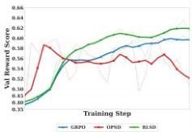
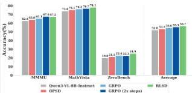
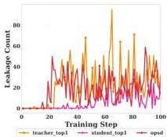
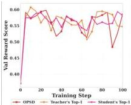
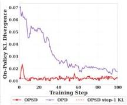
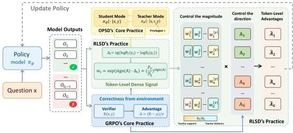
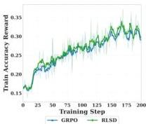
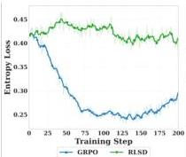
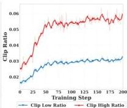
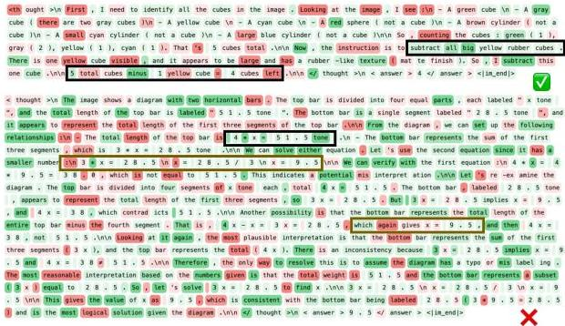

#

JINGDONG

# Self-Distilled RLVR

Chenxu Yang $^{1,2,*}$ , Chuanyu Qin $^{1,2,*}$ , Qingyi Si $^{3,*}$ , Minghui Chen $^{1,2}$ , Naibin Gu $^{1,2}$ , Dingyu Yao $^{1,2}$ , Zheng Lin $^{1,2,\dagger}$ , Weiping Wang $^{1}$ , Jiaqi Wang $^{3}$ , Nan Duan $^{3}$

$^{1}$ Institute of Information Engineering, Chinese Academy of Sciences, Beijing, China,  $^{2}$ School of Cyber Security, University of Chinese Academy of Sciences, Beijing, China,  $^{3}$ JD.COM

*Equal contribution., †Corresponding author.

# Abstract

On-policy distillation (OPD) has become a popular training paradigm in the LLM community. This paradigm selects a larger model as the teacher to provide dense, fine-grained signals for each sampled trajectory, in contrast to reinforcement learning with verifiable rewards (RLVR), which only obtains sparse signals from verifiable outcomes in the environment. Recently, the community has explored on-policy self-distillation (OPSD), where the same model serves as both teacher and student, with the teacher receiving additional privileged information such as reference answers to enable self-evolution. This paper demonstrates that learning signals solely derived from the privileged teacher result in severe information leakage and unstable long-term training. Accordingly, we identify the optimal niche for self-distillation and propose RLSD (RLVR with Self-Distillation). Specifically, we leverage self-distillation to obtain token-level policy differences for determining fine-grained update magnitudes, while continuing to use RLVR to derive reliable update directions from environmental feedback (e.g., response correctness). This enables RLSD to simultaneously harness the strengths of both RLVR and OPSD, achieving a higher convergence ceiling and superior training stability.

Email: yangchenxu@iie.ac.cn; linzheng@iie.ac.cn; siqingyi.phoebus@jd.com

(a) Average performance dynamics on the validation set.

(b) Performance comparison on reasoning tasks.
Figure 1 Performance on the trained Qwen3-VL-8B-Instruct model. In (a), OPSD reaches its peak performance early and degrades, whereas RLSD inherits the training stability of GRPO while achieving a higher convergence ceiling. In (b), GRPO and RLSD report results at 200 training steps, while GRPO  $(2\times$  steps) reports results at 400 steps; RLSD at 200 steps already surpasses GRPO trained for twice as many steps, demonstrating faster convergence.

---

Table 1 Comparison of training paradigms for post-training LLMs.

<table><tr><td>Method</td><td>Trajectory</td><td>Efficiency</td><td>Leakage Risk</td><td>Signal</td><td>Direction Anchoring</td></tr><tr><td>SFT</td><td>XOff-policy</td><td>✓High</td><td>✓N/A</td><td>✓Rich</td><td>XTeacher</td></tr><tr><td>RLVR (GRPO)</td><td>✓On-policy</td><td>✓High</td><td>✓N/A</td><td>XWeak</td><td>✓Environment</td></tr><tr><td>OPD</td><td>✓On-policy</td><td>XLow</td><td>✓N/A</td><td>✓Rich</td><td>XTeacher</td></tr><tr><td>OPSD</td><td>✓On-policy</td><td>✓High</td><td>XSevere</td><td>✓Rich</td><td>XTeacher</td></tr><tr><td>RLSD (Ours)</td><td>✓On-policy</td><td>✓High</td><td>✓N/A</td><td>✓Rich</td><td>✓Environment</td></tr></table>

# 1 Introduction

Reinforcement learning with verifiable rewards (RLVR) methods such as GRPO [1] have become a central paradigm for training large reasoning models [2, 3], where each trajectory receives only a single scalar signal determined by the outcome from the environment. On-policy distillation (OPD) [4, 5] complements this by leveraging a stronger teacher model to provide dense, token-level logits as learning signals along the student's own sampled trajectories, enriching the trajectory-level supervision to the token level and thereby achieving faster convergence. Recent work has shown that OPD from advanced teachers can match or even outperform RLVR [6], establishing it as an equally compelling paradigm (see Table 1 for a systematic comparison).

Despite its effectiveness, OPD relies on a separate, typically much larger teacher model, incurring substantial computational overhead. Moreover, since OPD requires computing token-level distributions over a shared vocabulary, the teacher and student models must share the same vocabulary, significantly reducing the practical scalability of this paradigm. On-policy self-distillation (OPSD) [7, 8] offers an appealing alternative: a single model serves as both teacher and student, where the teacher is the same model conditioned on privileged information  $r$  (such as a verified reasoning trace or environmental feedback) and the student operates solely on the input query. OPSD achieves several-fold improvements in token efficiency over GRPO without requiring any external model. However, we prove this efficiency gain is fragile: as illustrated by the red curve in Figure 1(a), performance peaks early and subsequently deteriorates, accompanied by systematic privileged information leakage, where the model explicitly appeals to an invisible reference solution during inference despite never having access to it (see Figure 2 for a representative example). These phenomena raise a natural question: why does OPD work while OPSD fails?

We trace the answer to a structural distinction between the two settings. In OPD, teacher and student observe the same input (information-symmetric), so the teacher's dense signal reflects superior reasoning under shared information access. In OPSD, the teacher conditions on privileged information that the student cannot observe (information-asymmetric), creating a fundamental mismatch. We prove that this asymmetry renders the OPSD objective ill-posed: it contains an irreducible mutual information gap  $I(Y_{t};R\mid X,Y_{&lt; t}) &gt; 0$  that the student can never eliminate, regardless of its capacity (Theorem 1). At the gradient level, we show that while the expected OPSD gradient is benign, the per-sample gradients carry an  $r$ -specific deviation whose variance is proportional to this mutual information. These theoretical findings are directly corroborated by our diagnostic experiments: the on-policy KL divergence between teacher and student stagnates under OPSD with no sustained reduction, whereas the same metric decreases steadily under OPD, as shown in Figure 3. Early in training, the beneficial gradient component dominates, producing rapid improvement; as the student approaches the teacher's marginal distribution, the deviation takes over, and its path-dependent accumulation drives the model toward encoding  $x\rightarrow r$  correlations in its parameters. This two-phase dynamic precisely accounts for the observed pattern of early gains followed by progressive degradation.

Our analysis pinpoints the root cause: in all distribution-matching formulations, the teacher's privileged evaluation  $P_{T}(y_{t} \mid r)$  enters the gradient direction, making leakage structurally unavoidable regardless of how the distillation target is compressed. Yet the evidence ratio  $P_{T}(y_{t}) / P_{S}(y_{t})$  also carries a useful signal: it measures how much the privileged information revises the model's belief about each token. The challenge is therefore not to discard this signal, but to change how it is used. A key insight underlying our design is that the signals governing update direction and update magnitude have asymmetric requirements: the directional signal can be sparse but must be reliable, as an erroneous direction harms the policy; the magnitude signal, by contrast, benefits from being as dense as possible to enable fine-grained

---

discrimination among tokens.

We propose RLVR with Self-Distillation (RLSD), which instantiates this principle by repurposing the teacher from a generative target to a *magnitude evaluator*. Specifically, the environment reward determines the *direction* of each token’s update (reinforcement or penalization), while the teacher’s evidence ratio modulates only the *magnitude*. This decoupling anchors gradient directions exclusively to the reliable environment reward, while retaining the teacher’s dense, token-level assessment for fine-grained credit discrimination across token positions. Notably, prior approaches to token-level credit assignment, such as value-function estimation in PPO *[9]* and various credit assignment methods *[10, 11]*, typically require training auxiliary networks or incur substantial additional overhead, yet still produce noisy estimates. In contrast, self-distillation provides a natural and virtually cost-free source of per-token credit information, requiring only a single additional forward pass. As summarized in Table 1, RLSD is the only paradigm that simultaneously achieves on-policy training, high token efficiency, rich update signals, and environment-anchored optimization, while serving as a drop-in replacement for the uniform advantage in standard GRPO without any auxiliary loss or model. Our contributions are as follows:

- We identify the root cause of OPSD’s failure through controlled experiments and formal analysis, proving that distribution matching under information asymmetry induces an irreducible gap that drives privileged information leakage through the gradient structure.
- We propose RLSD, a new training paradigm that unifies the strengths of RLVR and OPSD: the reliable environment reward governs update directions, while the privileged teacher provides rich, token-level modulation of update magnitudes.
- Extensive experiments demonstrate that RLSD achieves the best average accuracy across five multi-modal reasoning benchmarks, outperforming the base LLM by 4.69%, sustaining improvement beyond the point where self-distillation degrades.

## 2 Preliminaries

GRPO. Consider a language model $\pi_{\theta}$ trained to solve reasoning tasks. Given a question $x$, the model generates a response $y=(y_{1},\ldots,y_{T})$ autoregressively. In the RLVR setting, a verifier provides a binary reward $R(x,y)\in\{0,1\}$ indicating whether the response is correct. Group Relative Policy Optimization (GRPO) *[1]* samples a group of $G$ responses $\{y^{(1)},\ldots,y^{(G)}\}$ from the current policy for each question $x$, and computes a sequence-level advantage for each response relative to the group:

$A^{(i)}=\frac{R(x,y^{(i)})-\mu_{G}}{\sigma_{G}},$ (1)

where $\mu_{G}$ and $\sigma_{G}$ are the mean and standard deviation of the rewards within the group. The policy is then updated via a clipped surrogate objective:

$\mathcal{L}_{\text{GRPO}}(\theta)=\mathbb{E}\left[\frac{1}{G}\sum_{i=1}^{G}\frac{1}{|y^{(i)}|}\sum_{t=1}^{|y^{(i)}|}\min\Big{(}\rho_{t}^{(i)}A^{(i)},\;\text{clip}\Big{(}\rho_{t}^{(i)},1-\epsilon,1+\epsilon\Big{)}\,A^{(i)}\Big{)}\right],$ (2)

where $\rho_{t}^{(i)}=\pi_{\theta}(y_{t}^{(i)}\mid x,y_{<t}^{(i)})/\pi_{\theta_{\text{old}}}(y_{t}^{(i)}\mid x,y_{<t}^{(i)})$ is the importance sampling ratio between the current and old policies. A key limitation of GRPO is that all tokens within a response share the same advantage $A^{(i)}$, as the reward signal is provided only at the sequence level.

OPD and OPSD. On-Policy Distillation (OPD) *[4]* addresses the sparse reward problem by having the student $\pi_{\theta}$ sample its own trajectories while a separate, typically larger, teacher model $\pi_{\hat{\theta}}$ provides dense token-level supervision. While effective, maintaining a distinct teacher model throughout training introduces significant computational overhead. On-Policy Self-Distillation (OPSD) *[7, 8]* eliminates this requirement by instantiating both roles from a single model $\pi_{\theta}$: the teacher gains its informational advantage not from greater capacity, but from conditioning on privileged information $r$ (e.g., a verified reasoning trace).

Both methods share the same training paradigm. Given a dataset $\mathcal{S}=\{(x_{i},r_{i})\}_{i=1}^{N}$, the student generates on-policy rollouts $\hat{y}\sim P_{S}(\cdot\mid x)$, and training minimizes the per-token divergence between teacher and student

---

# OPSD-tuned Model Output  $(x)$ :

I need to determine if the sample mean is within $1 of the population mean. To do this, I must first calculate both means. . . . <omitted> ... Given that the reference solution uses 9 values, I will assume the sample has 9 prices ... <omitted>... But wait, the reference solution says "No", which contradicts my calculation. Let me re-examine. ...

(a) Leakage occurrence dynamics.

Figure 2 A representative example illustrating the privileged information leakage exhibited by the OPSD-trained model, where the model appeals to an invisible reference solution during inference.
(b) Performance on the validation set

(c) KL Divergence comparison.
Figure 3 Leakage, KL divergence, and validation performance of OPSD and its ablated variants.

distributions along the student's trajectory. The two frameworks differ only in how the teacher is defined:

Student:  $P_{S}(\cdot \mid y_{&lt; t})\triangleq \pi_{\theta}(\cdot \mid x,y_{&lt; t}),$  (3)

OPD Teacher:  $P_{T}(\cdot \mid y_{&lt; t}) \triangleq \pi_{\hat{\theta}}(\cdot \mid x, y_{&lt; t}),$  (4)

OPSD Teacher:  $P_{T}(\cdot \mid y_{&lt; t}) \triangleq \pi_{\theta}(\cdot \mid x, r, y_{&lt; t}).$  (5)

The shared training objective is:

$$
\mathcal {L} _ {\mathrm {O P (S) D}} (\theta) = \mathbb {E} _ {(x, r) \sim \mathcal {S}} \mathbb {E} _ {\hat {y} \sim P _ {S} (\cdot | x)} \left[ \frac {1}{| \hat {y} |} \sum_ {t = 1} ^ {| \hat {y} |} D \left(P _ {T} \| P _ {S}\right) \right], \tag {6}
$$

where  $D$  is a divergence measure such as the generalized Jensen-Shannon divergence. Gradients are backpropagated only through  $P_{S}$ , while  $P_{T}$  serves as a fixed target. OPSD achieves high token efficiency by providing dense, per-token supervision without requiring an external teacher model.

# 3 Why Does OPD Work While OPSD Fails?

## 3.1 Empirical Observations: Leakage and Performance Degradation

Before the formal analysis in §3.2, we document the empirical phenomena that motivate it.

Privileged information leakage. We first observe that OPSD-trained models systematically reference privileged information that is unavailable at inference time. Figure 2 presents a representative example in which the model explicitly appeals to an invisible "reference solution" during generation. Such behavior is not an isolated failure. As we quantify in the following analysis, this leakage intensifies progressively over the course of training.

Performance degradation. Figure 3(a) tracks the frequency of privileged information leakage over 100 training steps and reveals a monotonically increasing trend: the model becomes progressively more reliant on</omitted></omitted>

---

information it cannot access at test time. Figure 3(b) reports the corresponding validation accuracy, which peaks within the first 10–20 steps and subsequently declines, consistent with the escalating leakage.

KL divergence stagnation. A further diagnostic contrasts the on-policy KL divergence between teacher and student for OPD and OPSD (Figure 3(c)). Under OPD, the KL divergence decreases steadily throughout training, reflecting genuine convergence. Under OPSD, the divergence drops briefly in the first few steps but then plateaus at a level comparable to its initial value, exhibiting no sustained reduction. This stagnation suggests the existence of an irreducible gap in the OPSD objective that prevents meaningful convergence, a hypothesis we formalize in the next subsection.

These observations raise two questions: *why* does OPSD induce leakage, and *why* does it fail to reduce the KL divergence? We address both in the following theoretical analysis.

### 3.2 OPSD’s Failure: An Ill-Posed Objective

We formalize the structural deficiency of the distribution matching paradigm underlying OPSD and related methods. Our analysis proceeds at two levels: the objective function (§3.2.1) and the gradient dynamics (§3.2.2).

#### 3.2.1 The Irreducible Mutual Information Gap

Let $r$ denote the privileged information, drawn from the conditional distribution $P(r\mid x)$. Since any given question $x$ admits multiple semantically valid reasoning paths, $P(r\mid x)$ is a non-degenerate distribution with non-zero entropy. Even when each training instance $x_{i}$ is paired with a single reference trace $r_{i}$, from the epistemic perspective of the student, which can neither observe $r$ nor deterministically derive it from $x$, the privileged information remains an uncertain latent variable, and $P(r\mid x)$ should be treated as non-degenerate within the probabilistic modeling framework.

An optimal student policy that cannot condition on $r$ should recover the *marginal* teacher distribution via the law of total probability:

$P_{S}^{*}(y_{t}\mid x,y_{<t})=\mathbb{E}_{r\sim P(r\mid x,y_{<t})}[P_{T}(y_{t}\mid x,r,y_{<t})]\,.$ (7)

Letting $\bar{P}_{T}(y_{t})\triangleq\mathbb{E}_{r}[P_{T}(y_{t}\mid x,r,y_{<t})]$ denote this marginal, the *ideal* distillation objective is:

$\mathcal{L}^{*}(\theta)=\mathbb{E}_{x}\Big{[}D_{\text{KL}}\Big{(}\bar{P}_{T}(\cdot)\;\Big{\|}\;P_{S}(\cdot\mid x)\Big{)}\Big{]}\,.$ (8)

However, the OPSD objective enforces a *per-sample* match $P_{S}(\cdot\mid x)\to P_{T}(\cdot\mid x,r)$ for each concrete pair $(x,r)$:

$\mathcal{L}_{\text{OPSD}}(\theta)=\mathbb{E}_{x}\;\mathbb{E}_{r\sim P(r\mid x)}[D_{\text{KL}}(P_{T}(\cdot\mid x,r)\;\|\;P_{S}(\cdot\mid x))]\,.$ (9)

This forces a *conditionally independent* parameterization ($P_{S}$ does not take $r$ as input) to match a *conditionally dependent* target ($P_{T}$ depends on $r$), constituting a fundamentally ill-posed requirement.

###### Theorem 1 (KL Decomposition).

The OPSD objective and the ideal objective satisfy the identity:

$\mathcal{L}_{\text{OPSD}}\;=\;\mathcal{L}^{*}\;+\;I(Y_{t};R\mid X,\,Y_{<t}),$ (10)

where $I(Y_{t};R\mid X,Y_{<t})$ denotes the conditional mutual information between the current token $Y_{t}$ and the privileged information $R$ under the teacher distribution.

The proof is deferred to Appendix A.1. The mutual information term quantifies the extent to which the teacher’s token-level prediction depends on the privileged information that is, by construction, inaccessible to the student. Critically, $I(Y_{t};R\mid X,Y_{<t})$ is *independent of $\theta$*: it is entirely determined by the teacher’s conditional distributions and $P(r\mid x)$. The student’s optimization cannot eliminate this gap. Within the feasible set $\mathcal{F}=\{Q:Q(\cdot\mid x,y_{<t})$ does not condition on $r\}$, the global optimum is $P_{S}^{*}=\bar{P}_{T}$, at which the residual loss equals $I(Y_{t};R\mid X,Y_{<t})>0$, a strictly positive, irreducible lower bound that grows with the informativeness of the privileged signal.

---

This result provides a formal explanation for the KL stagnation observed in Figure 3(c): the OPSD divergence plateaus because the student quickly reaches the vicinity of $\tilde{P}_{T}$, after which the residual $I(Y_{t};R\mid X,Y_{<t})>0$ cannot be reduced through legitimate optimization. The dashed line in Figure 3(c), marking the OPSD KL at step 1, visually confirms that this loss floor is effectively reached within the earliest steps. More critically, this irreducible residual actively corrupts the optimization process. Under a biased objective, the optimizer continues to receive a non-vanishing loss signal and is driven to absorb harmful noise into the model parameters. As we will explain in the next section, this residual term directly contaminates the gradient direction, steering parameter updates away from genuine reasoning improvement and toward encoding spurious correlations between the input and the privileged information. Since the student’s architecture precludes direct conditioning on $r$, the only available pathway is to encode statistical correlations between $x$ and $r$ in the parameters $\theta$, effectively learning a mapping $x\rightarrow r$. This is the mathematical origin of privileged information leakage. In contrast, OPD employs an external teacher whose predictions do not condition on privileged information inaccessible to the student, so the mutual information gap does not arise, and the KL divergence decreases steadily.

#### 3.2.2 Gradient Structure: The Mechanism of Leakage

Theorem 1 establishes that $I(Y_{t};R\mid X)$ is $\theta$-independent, which may suggest that it exerts no influence on gradients. We demonstrate that, while this holds for the *expected* gradient, the *per-sample* gradients carry a deviation term whose variance is directly governed by this mutual information.

Benign expected gradient. Since $I(Y_{t};R\mid X)$ does not depend on $\theta$, we have $\nabla_{\theta}\mathcal{L}_{\text{OPSD}}=\nabla_{\theta}\mathcal{L}^{*}=-\sum_{v}\bar{P}_{T}(v)\nabla_{\theta}\log P_{S}(v)$. At the population level, the OPSD gradient is identical to that of the ideal marginal matching objective.

Pathological per-sample gradients. In practice, optimization operates on concrete samples $(x,r)$:

$g(\theta;r)=-\sum_{v\in\mathcal{V}}P_{T}(v\mid r)\cdot\nabla_{\theta}\log P_{S}(v).$ (11)

###### Proposition 1 (Per-Sample Gradient Decomposition).

For any specific realization of $r$, the per-sample gradient admits the decomposition:

$g(\theta;r)=\underbrace{-\sum_{v}\bar{P}_{T}(v)\nabla_{\theta}\log P_{S}(v)}_{g^{*}(\theta):\text{marginal matching}}+\underbrace{-\sum_{v}\big{[}P_{T}(v\mid r)-\bar{P}_{T}(v)\big{]}\nabla_{\theta}\log P_{S}(v)}_{\delta(\theta;r):\text{$r$-specific deviation}},$ (12)

satisfying: (i) $\mathbb{E}_{r}[\delta(\theta;r)]=0$, and (ii) $\mathbb{E}_{r}[\|\delta(\theta;r)\|^{2}]=\sum_{v}\operatorname{Var}_{r}[P_{T}(v\mid r)]\cdot\|\nabla_{\theta}\log P_{S}(v)\|^{2}$. The deviation vanishes identically when $I(Y_{t};R\mid X)=0$ and its variance increases monotonically with the mutual information.

The proof is provided in Appendix A.2. Property (i) may suggest that the deviation is innocuous on average; however, any optimizer that computes gradients on individual samples or mini-batches, such as SGD and Adam *[12]*, is inherently path-dependent. The zero-mean perturbations in nonlinear optimization do not necessarily cancel over the course of training.

Two-phase training dynamics. The decomposition in Proposition 1 partitions the per-sample gradient into a beneficial component $g^{*}$ and a deviation component $\delta$. Their relative magnitudes evolve over training and give rise to two distinct regimes that precisely correspond to the empirical phenomena reported in §3.1.

Early in training, the student $P_{S}$ is far from the teacher’s marginal $\bar{P}_{T}$, so the beneficial component dominates: $\|g^{*}(\theta)\|\gg\|\delta(\theta;r)\|$. In this regime, the gradient predominantly drives marginal matching, and the student rapidly acquires general reasoning capabilities. This corresponds to the steep rise in validation accuracy observed during the first 10–20 steps in Figure 3(b). As training progresses and $P_{S}$ approaches $\bar{P}_{T}$, the beneficial component $\|g^{*}(\theta)\|$ diminishes toward zero. The deviation component $\|\delta(\theta;r)\|$, however, remains bounded away from zero: its variance is governed by $I(Y_{t};R\mid X)$, which is independent of $\theta$ and therefore does not decay with optimization progress. Parameter updates thus become increasingly dominated by $\delta$, and

---

the path-dependent accumulation of these perturbations drives the model toward regions of parameter space that encode $x\to r$ correlations, triggering a self-reinforcing degradation. This transition marks the onset of the performance decline in Figure 3(b) and the monotonically increasing leakage counts in Figure 3(a).

Leakage bandwidth: controlled experiments. The gradient decomposition not only explains the failure of standard OPSD, but also makes a precise prediction: *any* variant in which the teacher’s privileged evaluation $P_{T}(\cdot\mid r)$ enters the gradient direction will suffer from leakage, regardless of how the distillation target is compressed. To test this prediction, we design two ablated variants alongside standard OPSD: (i) *Teacher’s Top-1*, which retains only the teacher’s most probable token $\arg\max_{v}P_{T}(v\mid r)$ as the target, and (ii) *Student’s Top-1*, which restricts the target support to the student’s most probable token $\arg\max_{v}P_{S}(v)$. We report leakage counts and validation accuracy for all three variants over 100 training steps in Figure 3(a,b).

All three variants confirm the prediction: leakage increases in every case. The gradient framework explains both the universality and the ordering of severity through the concept of *leakage bandwidth*, which we define as the effective number of token positions at which $r$-specific information enters the gradient direction. Full OPSD operates over the entire vocabulary $\mathcal{V}$: the teacher’s privileged preference $P_{T}(v\mid r)$ weights the gradient contribution of every token, yielding the widest bandwidth. Teacher’s Top-1 collapses the target to a single token $\arg\max_{v}P_{T}(v\mid r)$ that is entirely determined by $r$, narrowing the bandwidth but producing the most concentrated injection of privileged information, which explains why it exhibits the most severe leakage. Student’s Top-1 restricts the target support to $\arg\max_{v}P_{S}(v)$, yielding the narrowest bandwidth; yet the gradient weight $P_{T}(v^{*}_{S}\mid r)/P_{S}(v^{*}_{S})$ at the selected token remains a function of $r$, so leakage persists, albeit at the lowest rate. In all three cases, the directional dependence of the gradient on $r$ is irreducible (proof in Appendix A.3), explaining the universal occurrence of leakage observed in Figure 3(a). The performance degradation in Figure 3(b) follows directly: stronger leakage accelerates the transition from the first training phase to the second and produces more rapid decline.

We further analyze the implications of shared-parameter coupling in Appendix A.4, where we show that the interaction between gradient-level leakage and teacher drift under shared parameters gives rise to an impossibility trilemma: objective stability, sustained improvement, and leakage-free training cannot hold simultaneously under any parameter management strategy.

## 4 RLSD: Self-Distillation as RLVR’s Wingman

The preceding analysis identifies a precise root cause: distribution matching fails because privileged information enters the *gradient direction*, contaminating the optimization trajectory. Yet the same quantity at the heart of this failure, the evidence ratio $P_{T}(y_{t})/P_{S}(y_{t})$, also carries a useful signal: it measures how much the privileged information revises the model’s belief about each token. The challenge, then, is not to discard this signal, but to change *how* it is used. We propose RLVR with Self-Distillation (RLSD), which repurposes the teacher’s role entirely: instead of serving as a generative target for distribution matching, the discrepancy between $P_{T}$ and $P_{S}$ is used as a token-level credit assignment signal within the policy gradient framework. The privileged information influences only how much credit each token receives, not which tokens are reinforced or penalized, nor the direction of parameter updates.

### 4.1 From Distribution Matching to Credit Assignment

Step 1: Privileged information gain. Given a student-sampled trajectory $y=(y_{1},\ldots,y_{T})$, we compute the log-probability of each token under both the student context ($x$ only) and the teacher context ($x$ and $r$), and define the *privileged information gain* at each position:

$\Delta_{t}=\texttt{sg}(\log P_{T}(y_{t})-\log P_{S}(y_{t}))\,,$ (13)

where sg denotes the stop-gradient operator. Since teacher and student share the same model, $\Delta_{t}$ isolates the *marginal contribution of the privileged information $r$* to the prediction of $y_{t}$. A large positive $\Delta_{t}$ indicates that $r$ strongly supports this token; a negative value indicates that $r$ disfavors it. Crucially, $\Delta_{t}$ provides a dense, token-level signal that naturally reflects how much each token is informed by the privileged information, making it a principled and lightweight basis for fine-grained credit assignment within a trajectory. The

---

stop-gradient ensures that $\Delta_{t}$ serves purely as a weighting signal and does not introduce auxiliary gradient pathways.

Figure 4: An overview of our RLSD method.

Step 2: Direction-aware evidence reweighting. We construct a per-token weight from the privileged information gain, modulated by the sign of the sequence-level advantage:

$w_{t}=\exp(\text{sign}(A)\cdot\Delta_{t})=\left(\frac{P_{T}(y_{t})}{P_{S}(y_{t})}\right)^{\text{sign}(A)}.$ (14)

This formulation admits a natural Bayesian interpretation. $P_{S}(y_{t})$ represents the model’s prior assessment of token $y_{t}$, based solely on the question $x$. $P_{T}(y_{t})$ represents the posterior assessment after observing the privileged information $r$. The ratio $P_{T}(y_{t})/P_{S}(y_{t})$ is therefore an evidence ratio: the factor by which the privileged information revises the model’s belief about each token. Under mild modeling assumptions, this ratio can be shown to equal the Bayesian belief update $P(r\mid x,y_{\leq t})/P(r\mid x,y_{&lt;t})$, i.e., the degree to which generating $y_{t}$ increases the posterior probability that the privileged information $r$ is consistent with the trajectory (Theorem 4 in Appendix A.5).

The sign$(A)$ exponent implements direction-aware credit assignment. When $A&gt;0$, $w_{t}=P_{T}/P_{S}$: tokens that the privileged information supports receive larger weights, concentrating positive credit on the tokens most aligned with the correct reasoning trace. When $A&lt;0$, $w_{t}=P_{S}/P_{T}$: the ratio is inverted, so tokens that the privileged information disfavors bear greater blame, while tokens it supports receive attenuated punishment. Since $\exp(\cdot)&gt;0$ for all inputs, the weight is strictly positive, guaranteeing that the sign of the token-level advantage is never flipped by the reweighting. The environment reward retains exclusive authority over whether a trajectory is reinforced or penalized; the teacher only modulates the relative magnitude across tokens within a trajectory.

This design parallels the importance sampling ratio $\pi_{\theta}/\pi_{\text{old}}$ used in GRPO for policy updates. GRPO uses the ratio between current and old policies to control the step size of updates; RLSD uses the ratio between posterior and prior to control the credit distribution across tokens. Both are importance ratios operating within the same policy gradient framework, yielding a structurally unified formulation.

Step 3: Clipped credit assignment. Following the design philosophy of the clipped surrogate objective in PPO *[9]* and GRPO, we clip the evidence weights to bound the maximum influence of any single token:

$\hat{A}_{t}=A\cdot\text{clip}(w_{t},\ 1-\epsilon_{w},\ 1+\epsilon_{w})\,,$ (15)

---

Algorithm 1 RLSD: Reinforcement Learning with Self-Distillation
Require: Policy  $\pi_{\theta}$  dataset  $S = \{(x_i,r_i)\}_{i = 1}^N$  , verifier  $R(\cdot ,\cdot)$  , group size  $G$  , mixing coefficient  $\lambda$  , clip bounds  $\epsilon_w$
1: for each training iteration do
2: Sample a batch of questions  $\{x\}$  from  $S$
3: for each question  $x$  with privileged information  $r$  do
4: // Step 1: On-policy rollout
5: Sample  $G$  responses  $\{y^{(1)},\ldots ,y^{(G)}\} \sim \pi_{\theta}(\cdot \mid x)$
6: // Step 2: Sequence-level advantage from environment
7: for  $i = 1,\dots ,G$  do
8: Obtain reward  $R(x,y^{(i)})\in \{0,1\}$  from the verifier
9: end for
10: Compute  $A^{(i)} = \frac{R(x,y^{(i)}) - \mu_G}{\sigma_G}$  ▷ Group-relative advantage
11: // Step 3: Token-level credit assignment via self-distillation
12: for  $i = 1,\dots ,G$  do
13: Compute teacher logits via forward pass with  $(x,r,y^{(i)})$  ▷ Single extra forward pass
14: for  $t = 1,\dots ,|y^{(i)}|$  do
15:  $\Delta_t\gets \mathsf{sg}\Big(\log \pi_\theta (y_t^{(i)}\mid x,r,y_{&lt;  t}^{(i)}) - \log \pi_\theta (y_t^{(i)}\mid x,y_{&lt;  t}^{(i)})\Big)$
16:  $w_{t}\gets \exp \bigl (\mathrm{sign}(A^{(i)})\cdot \Delta_{t}\bigr)$
17:  $\hat{A}_t^{(i)}\gets A^{(i)}\cdot ((1 - \lambda) + \lambda \cdot \mathrm{clip}(w_t,1 - \epsilon_w,1 + \epsilon_w))$
18: end for
19: end for
20: end for
21: // Step 4: Policy update
22: Update  $\theta$  by maximizing  $\mathcal{L}_{\mathrm{RLSD}}(\theta) = \frac{1}{G}\sum_{i = 1}^{G}\frac{1}{|y^{(i)}|}\sum_{t = 1}^{|y^{(i)}|}\hat{A}_t^{(i)}$
23: end for

where  $\epsilon_w$  bounds the per-token credit deviation. The clipping in Eq. (15) serves an analogous role to the importance ratio clipping in GRPO: while GRPO clips the policy update step size, RLSD clips the credit redistribution magnitude. Both mechanisms act as trust-region constraints that stabilize training. In practice, to avoid an abrupt transition at the start of training, we linearly interpolate between the uniform advantage and the reweighted advantage over the training steps using  $\lambda \in [0,1]$ , gradually shifting to the uniform advantage. The final objective of RLSD is as follows:

$$
\mathcal {L} _ {\mathrm {R L S D}} (\theta) = \mathbb {E} \left\{\frac {1}{G} \sum_ {i = 1} ^ {G} \frac {1}{| y ^ {(i)} |} \sum_ {t = 1} ^ {| y ^ {(i)} |} \min  \left[ w _ {t} A ^ {(i)}, \operatorname {c l i p} \left(w _ {t}, 1 - \epsilon_ {w}, 1 + \epsilon_ {w}\right) A ^ {(i)} \right] \right\}, \tag {16}
$$

## 4.2 Integration with GRPO

The modified advantage  $\hat{A}_t$  is a drop-in replacement for the uniform advantage in the standard GRPO objective. The complete training procedure is summarized in Algorithm 1.

No auxiliary distillation loss is introduced; the only modification to the standard GRPO pipeline is the internal redistribution of credit within each trajectory. The additional computational cost amounts to one forward pass per response to obtain the teacher logits, which is negligible relative to the rollout generation that dominates wall-clock time.

---

4.3 A Unified Token-Level Advantage Perspective

To situate RLSD within the broader landscape, we observe that GRPO, on-policy self-distillation, and RLSD can all be expressed as instances of a single policy gradient template:

$\Delta\theta$ $\propto$ $\mathbb{E}_{y\sim P_{S}(\cdot|x)}\left[\sum_{t=1}^{|y|}\hat{A}_{t}\ \nabla_{\theta}\log P_{S}(y_{t}\mid x,y_{<t})\right],$ (17)

where the methods differ solely in how they define the token-level advantage $\hat{A}_{t}$.

GRPO assigns a uniform advantage across all tokens: $\hat{A}_{t}=A$, where $A$ is the sequence-level advantage from the verifier. This ensures that the optimization direction is fully grounded in the environment reward, but provides no token-level discrimination: every token within a trajectory receives identical credit regardless of its contribution to the final answer.

On-policy self-distillation methods replace the environment reward with a dense teacher signal. The specific form of $\hat{A}_{t}$ depends on the divergence measure: minimizing the reverse KL $D_{\text{KL}}(P_{S}\|P_{T})$ via the log-derivative trick yields $\hat{A}_{t}=\Delta_{t}=\log P_{T}(y_{t})-\log P_{S}(y_{t})$. The environment reward $R(x,y)$ is entirely absent from $\hat{A}_{t}$: even when a trajectory produces a wrong answer ($A<0$), tokens favored by the teacher ($\Delta_{t}>0$) still receive positive advantage, decoupling the optimization direction from the verifiable correctness signal.

RLSD resolves this tension by combining both sources of information. Its advantage (Eq. 15) uses the environment reward to determine the direction (sign) of each token’s update, while using the teacher’s privileged assessment to determine the magnitude (relative credit) within a trajectory. We provide a formal proof that these properties render RLSD structurally immune to privileged information leakage in Appendix A.6, and verify that RLSD simultaneously satisfies all three desiderata of the impossibility trilemma (Appendix A.4).

## 5 Experiment

### 5.1 Experimental Setup

Training Data and Benchmarks. We train our models on MMFineReason-123K *[13]*, a challenging subset derived from the MMFineReason-1.8M corpus via difficulty-based filtering. Specifically, inference is performed on each training sample using Qwen3-VL-4B-Thinking with four independent rollouts, and only samples where the model fails on all attempts are retained. This conservative criterion discards trivial examples and concentrates training signal on challenging problems, yielding faster convergence and more efficient use of computational resources.

We evaluate on five multimodal reasoning benchmarks spanning diverse mathematical and general reasoning capabilities. MMMU *[14]* is a massive multi-discipline benchmark covering college-level subjects across science, engineering, and humanities, requiring both perception and domain knowledge. MathVista *[15]* assesses mathematical reasoning grounded in visual contexts. MathVision *[16]* extends mathematical reasoning evaluation to more complex and competition-level visual problems. ZeroBench *[17]* is a challenging benchmark specifically designed to be unsolvable by current frontier models, providing a stress test for reasoning robustness. WeMath *[18]* evaluates fine-grained mathematical problem-solving abilities with structured difficulty levels. Together, these benchmarks provide a comprehensive and rigorous assessment of both the breadth and depth of multimodal reasoning performance. For all benchmarks, we report accuracy ($\%$) as the evaluation metric.

Models and Baselines. We conduct experiments on Qwen3-VL-8B-Instruct *[19]* as our base model. We compare RLSD against the following baselines. GRPO *[1]* is a standard RLVR method that estimates token-level advantages from sparse scalar outcome rewards at the sequence level, serving as our primary RL baseline. OPSD *[7]* is an on-policy self-distillation method where a single model acts as both teacher and student, with the teacher conditioned on privileged information (e.g., verified reasoning traces) to provide dense per-token supervision. SDPO *[8]* extends self-distillation to the reinforcement learning with rich feedback setting, treating the current model conditioned on environment feedback as a self-teacher to derive dense credit

---

Table 2 Multimodal reasoning results on the Qwen3-VL-8B-Instruct model. Bold indicates the best result among all models. Avg. is computed over the five selected benchmarks.

<table><tr><td>Method</td><td>MMMU</td><td>MathVista</td><td>MathVision</td><td>ZeroBench</td><td>Wemath</td><td>Avg.</td></tr><tr><td>Base LLM</td><td>62.44</td><td>73.80</td><td>47.37</td><td>19.76</td><td>54.10</td><td>51.49</td></tr><tr><td>GRPO</td><td>65.11</td><td>76.20</td><td>48.82</td><td>22.60</td><td>56.57</td><td>53.86</td></tr><tr><td>OPSD</td><td>63.82</td><td>75.10</td><td>47.53</td><td>21.06</td><td>54.95</td><td>52.49</td></tr><tr><td>SDPO</td><td>65.11</td><td>74.00</td><td>47.27</td><td>25.15</td><td>52.19</td><td>52.74</td></tr><tr><td>GRPO+OPSD</td><td>63.22</td><td>75.90</td><td>48.52</td><td>22.16</td><td>54.76</td><td>52.91</td></tr><tr><td>RLSD (Ours)</td><td>67.22</td><td>78.10</td><td>52.73</td><td>24.85</td><td>58.00</td><td>56.18</td></tr></table>

assignment signals. GRPO+OPSD is a straightforward combination baseline inspired by the MOPD approach proposed in MIMO-v2-Flash [6], which jointly optimizes reinforcement learning and distillation objectives. Specifically, we combine the GRPO loss with a distillation KL divergence loss via linear interpolation with a tuned weighting coefficient. Unlike MOPD, which relies on a separately trained expert model for distillation, we adopt the OPSD formulation by using the model's own rollout outputs as the distillation target, thereby eliminating the need for an external expert while still leveraging dense self-distillation signals alongside sparse environment rewards. We also include the Base LLM (i.e., Qwen3-VL-8B-Instruct without any post-training) as a reference to quantify the overall gains from post-training.

Implementation Details. We implement our method based on the VERL [20] and EasyR1 [21] frameworks. During training, the model's maximum context length is set to 8192, with a maximum prompt length of 4096 and a maximum response length of 4096. The same prompt and response length settings are used consistently during both training and evaluation. For GRPO, GRPO+OPSD, and RLSD, the learning rate is fixed at  $1 \times 10^{-6}$ ; for OPSD and SDPO, the learning rate is set to  $1 \times 10^{-5}$  following their original implementations. The training batch size is set to 256, and for each prompt, we sample 8 rollouts with a sampling temperature of 1.0. For all GRPO-based methods, we use clipping thresholds of  $\epsilon_{\mathrm{low}} = 0.2$  and  $\epsilon_{\mathrm{high}} = 0.28$ , and omit both the KL penalty loss and entropy regularization loss from the objective function. The hyperparameter  $\lambda$  in our RLSD is initialized at 0.5 and linearly decayed to 0 over the first 50 training steps, and  $\epsilon_w$  is set to 0.2. To maintain a stable self-distillation signal, the teacher model parameters are synchronized with the student model every 10 training steps and kept frozen in between. Regarding the privileged information required by different methods: OPSD requires verified reasoning traces, for which we use reasoning trajectories distilled from Qwen3-VL-235B-A22B-Thinking and verified as correct within the MMFineReason-123K dataset; SDPO follows its original setting in the paper, using a successful previous rollout as privileged context; RLSD requires only the final ground-truth answer without any reasoning trace, making it the least demanding in terms of privileged information. All experiments are conducted on 4 compute nodes, each equipped with 8 NVIDIA H200 140GB GPUs.

# 5.2 Experimental Results

# 5.2.1 Main Results

Table 2 presents the evaluation results across five multimodal reasoning benchmarks. RLSD achieves the highest average accuracy, outperforming the Base LLM by  $4.69\%$  and GRPO by  $2.32\%$  on average under the 4K setting. Compared to GRPO, RLSD benefits from dense token-level credit assignment, yielding notable gains on challenging mathematical datasets such as MathVista  $(+1.9\%)$  and MathVision  $(+3.91\%)$ , where fine-grained discrimination of reasoning steps matters most. RLSD also consistently outperforms the self-distillation baselines (OPSD and SDPO) in average accuracy. This empirical gap is consistent with our theoretical diagnosis in Section 3.2: while OPSD suffers from privileged information leakage due to distribution matching under information asymmetry, RLSD extracts the dense teacher signal while anchoring the update direction to the verifier reward, thereby producing more robust reasoning improvements. Moreover, RLSD also outperforms the additive fusion methods GRPO+OPSD by a margin of 3.27 points. Linearly combining bounded rewards with unbounded, high-variance kl losses causes severe scale mismatch, forcing a suboptimal trade-off that often destabilizes training. In contrast, RLSD effectively circumvents these pitfalls through multiplicative modulation. By exponentiating the teacher's signal into a dynamically bounded

---

(a) Training reward dynamics comparison.

(b) Training entropy dynamics comparison.

(c) Clip ratios on credit assignment
Figure 5 Training dynamics on the multimodel reasoning tasks.

relative multiplier, RLSD mathematically guarantees strict sign preservation.

# 5.2.2 Training Dynamics

Figure 5 illustrates the training dynamics over 200 optimization steps. As shown in Figure 5(a), RLSD demonstrates a steeper initial ascent and converges to a higher accuracy reward ceiling compared to standard GRPO, while avoiding the late-stage performance collapse observed in OPSD. Figure 5(b) reveals that GRPO suffers from rapid entropy collapse due to its uniform sequence-level reward, whereas RLSD maintains a consistently higher entropy level by selectively strengthening critical reasoning tokens without uniformly suppressing alternatives at every position. Finally, Figure 5(c) confirms that the clipped credit assignment mechanism is actively engaged, with clip ratios stabilizing around  $3\% -6\%$ , successfully bounding the teacher's per-token influence and acting as a trust-region constraint analogous to the importance ratio clipping in PPO/GRPO.

# 5.2.3 Case Study

Figure 6 provides a qualitative view of how RLSD redistributes sequence-level reward to the token level. In the correct cube-counting example, RLSD assigns larger credit to the tokens that actually determine correctness, such as identifying the relevant yellow cube and executing the final subtraction, while downweighting generic narration like "Looking at the image, I see ...". In contrast, in the incorrect bar-model example, RLSD concentrates the strongest blame on the misread relation "3x = 28.5" and the derived wrong answer "x = 9.5", whereas neutral setup tokens receive comparatively smaller penalties.

This behavior is consistent with the design goal of RLSD. The environment reward still determines whether a trajectory is reinforced or penalized, but the privileged teacher modulates the relative magnitude of token-level credit according to each token's contribution to the final outcome. The resulting update pattern is neither uniform like GRPO nor distribution matching like OPSD; instead, it acts as targeted token-level credit assignment anchored to verifier-grounded correctness.

# 6 Related Work

# 6.1 Credit Assignment in RLVR

Reinforcement learning with verifiable rewards (RLVR) methods such as GRPO [1] have become a standard paradigm for post-training reasoning models because they optimize against automatically checkable outcomes without human preference labels [1, 2]. Their central limitation is that the verifier provides a sequence-level signal, so every token in a rollout inherits the same advantage regardless of whether it corresponds to a pivotal deduction or a stylistic filler. This makes long-horizon reasoning fundamentally a credit assignment problem. A common response is to introduce process reward models (PRMs) or step-level value estimators that score intermediate reasoning steps [22-30]. Some of these methods rely on costly human step annotations, while

---

Figure 6 Token-level credit heatmaps under RLSD for two multimodal reasoning examples. Top: in a correct trajectory, larger credit is concentrated on the decisive counting and subtraction steps. Bottom: in an incorrect trajectory, the strongest blame is assigned to the misread bar-model relation and the derived wrong answer. Green denotes larger token-level credit magnitude and red denotes smaller token-level credit magnitude.

others replace them with automated or implicit supervision; in either case, they require auxiliary reward modeling and extra computation beyond the base policy.

More recent work seeks fine-grained credit assignment while staying strictly within a verifier-only RLVR pipeline. These methods reshape token-level updates using model-internal proxies such as entropy, uncertainty, key-token statistics, attention dynamics, or outcome sensitivity [10, 11, 31-36]. While they show that uniform sequence-level advantages are unnecessarily coarse, they estimate token importance entirely from intrinsic heuristics. Our method is complementary in motivation yet fundamentally different in mechanism: rather than relying on heuristic proxies, we extract rigorous token-level assessments via self-distillation under privileged context, while keeping the update direction anchored to the verifier reward.

# 6.2 On-Policy Distillation

Distillation has also been explored as an alternative source of dense token-level supervision for reasoning models. In on-policy distillation (OPD), a stronger teacher evaluates the student's own rollouts and provides token-level targets along on-policy trajectories [4, 5, 37]; recent reports suggest that strong teacher-guided distillation can even rival or complement RL-based post-training [6]. However, standard OPD requires maintaining an external, typically larger teacher throughout training. To eliminate this overhead, recent self-distillation methods let the same model act as both student and teacher, with the teacher conditioned on privileged information such as reference solutions or verifier feedback [7, 8]. Closely related on-policy distillation variants have also been explored for continual learning from demonstrations, context internalization, and reasoning compression, where the teacher is conditioned on demonstrations, auxiliary context, or conciseness instructions [38-41]. A recent concurrent work, TRRD [42], also identifies the conflict between additive KL penalties and reward maximization, proposing to inject teacher probabilities into the policy importance ratio. However, TRRD operates on the trust region anchor while RLSD directly modulates the advantage magnitude via a Bayesian evidence ratio.

---

The shared design choice across these methods is to retain a distribution-matching objective between a privileged or context-conditioned teacher and a less-informed student. Our work starts from a similar setting but departs from that paradigm. We show that when the teacher’s prediction depends on latent information unavailable to the student, matching the teacher distribution becomes structurally ill-posed and can induce privileged information leakage and unstable long-run training. RLSD therefore does not use the teacher as a generative target; instead, it repurposes the privileged discrepancy only as a scalar multiplier for credit assignment, decoupling dense token-level magnitude from the optimization direction.

## 7 Conclusion

In this work, we identified the fundamental limitation of on-policy self-distillation (OPSD): the information asymmetry between teacher and student renders the distribution-matching objective structurally ill-posed, inducing an irreducible mutual information gap that drives privileged information leakage and progressive performance degradation. We formalized this deficiency at both the objective level and the gradient level, explaining the empirically observed pattern of early gains followed by systematic collapse. Based on this analysis, we proposed RLSD, a new training paradigm that moves beyond distribution matching between the prior and posterior: instead of forcing the student to imitate the teacher’s conditional distribution, RLSD repurposes the discrepancy between them to provide fine-grained control over per-token update magnitudes, while anchoring the update directions to the environment reward. This design simultaneously inherits the rich, token-level supervision of OPSD and the reliable environmental grounding of RLVR, unifying the strengths of both paradigms within a single framework.

## 8 Limitations and Future Work

This paper focuses primarily on the theoretical analysis of OPSD’s structural limitations and the motivation and validation of the RLSD paradigm. To enable faster release, this version provides limited experiments, validating around multimodal reasoning scenarios. However, we have preliminarily validated RLSD across a broader range of settings, including pure text reasoning, video understanding, and additional model families beyond the Qwen series, and observed consistent gains. We will include these in the forthcoming version.
