# RAGEN-2: Reasoning Collapse in Agentic RL

Zihan Wang^{†∗,1}, Chi Gui^{†,12}, Xing Jin^{†,3}, Qineng Wang^{†,1}, Licheng Liu^{†,4},Kangrui Wang^{1},
Shiqi Chen^{5}, Linjie Li^{6}, Zhengyuan Yang^{7}, Pingyue Zhang^{1}, Yiping Lu^{1}, Jiajun Wu^{8}, Li Fei-Fei^{8},
Lijuan Wang^{7}, Yejin Choi^{8}, Manling Li^{1}

^{†}Core contributors. ^{∗}Project lead.
^{1}Northwestern University ^{2}UIUC ^{3}Independent ^{4}Imperial College London
^{5}Oxford University ^{6}University of Washington ^{7}Microsoft ^{8}Stanford University
https://ragen-ai.github.io/v2/

RL training of multi-turn LLM agents is inherently unstable, and reasoning quality directly determines task performance. Entropy is widely used to track reasoning stability. However, entropy only measures diversity within the same input, and cannot tell whether reasoning actually responds to different inputs. In RAGEN-2, we find that even with stable entropy, models can rely on fixed templates that look diverse but are input-agnostic. We call this template collapse, a failure mode invisible to entropy and all existing metrics. To diagnose this failure, we decompose reasoning quality into within-input diversity (Entropy) and cross-input distinguishability (Mutual Information, MI), and introduce a family of mutual information proxies for online diagnosis. Across diverse tasks, mutual information correlates with final performance much more strongly than entropy, making it a more reliable proxy for reasoning quality. We further explain template collapse with a signal-to-noise ratio (SNR) mechanism. Low reward variance weakens task gradients, letting regularization terms dominate and erase cross-input reasoning differences. To address this, we propose SNR-Aware Filtering to select high-signal prompts per iteration using reward variance as a lightweight proxy. Across planning, math reasoning, web navigation, and code execution, the method consistently improves both input dependence and task performance.

## 1 Introduction

Training multi-turn LLM agents with reinforcement learning (RL) is inherently challenging *[34, 72, 68]*. Researchers therefore monitor reward for outcome stability and entropy for reasoning process stability *[42, 32, 62]*, treating both as stability indicators of RL training.

However, entropy can be an ambiguous signal to understand reasoning quality. When entropy decreases, it may simply reflect the model becoming more specialized and confident on the task, which is a natural outcome of RL optimization *[68, 62]*. When entropy remains high, reasoning can still drift toward fixed templates that appear diverse within any single input but are effectively the same across inputs (Figure 1). We call this template collapse, a failure mode invisible to both metrics. This risk is especially acute in multi-turn settings: sparse rewards cannot distinguish input-driven reasoning from templated reasoning that merely happens to

---

succeed *[59, 60]*, and reasoning chains are hard to get directly supervised *[44, 6]*. As a result, template collapse can persist unnoticed during training, making agents unreliable and silently hurting their reasoning abilities.

To understand and mitigate template collapse, this paper addresses two questions. (Q1) How to diagnose? (§2) Entropy-based metrics *[61, 63, 69]* track within-input variability but miss input dependence across inputs, so they fail to detect template collapse. We propose a mutual information (MI) proxy *[5]* that scores each reasoning chain against all batch inputs to measure input dependence, without external models. (Q2) Why does it happen? (§3) We explain through a signal-to-noise ratio (SNR) lens. Task gradients draw signal from reward differences across within-input trajectories. Sampling noise and input-agnostic regularization (KL divergence and entropy regularization *[42, 62]*) dilute this signal. Low SNR lets noise dominate, erasing cross-input reasoning differences.

To address template collapse, based on the SNR view, we introduce SNR-Aware Filtering, which uses reward variance as a lightweight SNR proxy to select high-signal prompts each iteration, without additional supervision. Throughout training, the MI proxy monitors input dependence; across experiments, MI correlates with task performance significantly more strongly than entropy, validating it as a diagnostic for template collapse.

Together, they constitute a diagnostic framework for a systematic failure mode in multi-turn agent RL, validated across planning *[39]*, mathematical reasoning *[67, 16]*, web navigation, code execution, and tool use, under multiple RL algorithms, model scales, and modalities. SNR-Aware Filtering consistently improves input dependence and task performance, providing direct experimental support for the SNR mechanism.

Our contributions are summarized as follows:

1. Identifying template collapse. We find that template collapse occurs when reasoning appears diverse within inputs but becomes input-agnostic across inputs. We propose a mutual information proxy to detect it without external models.
2. Explaining template collapse via SNR. We show that low reward variance weakens task gradients while input-agnostic regularization remains constant, erasing input dependence. We provide gradient decomposition evidence across reward-variance buckets.
3. SNR-Aware Filtering. We propose filtering prompts by reward variance before each update. We demonstrate that this improves input dependence and performance across tasks, algorithms, scales, and modalities.

## 2 Template Collapse in Multi-turn Agent RL

### 2.1 Setup and Preliminaries

We study closed-loop multi-turn agent reinforcement learning *[60]*, where a policy $\pi_{\theta}$ is trained by repeatedly rolling out trajectories under the current policy and environment and updating on the collected experience. At each time step $t$, the agent observes $o_{t}$, generates a response consisting of reasoning tokens $z_{t}$ and an executable action $a_{t}$, and receives reward $r_{t}$, forming a trajectory $\tau=\{(o_{t},z_{t},a_{t},r_{t})\}_{t=1}^{T}$.

We use $X$ to denote the full context available to the model immediately before generating reasoning at turn $t$: this comprises the system prompt, all prior observations $o_{1:t}$, actions $a_{1:t-1}$, and reasoning tokens $z_{1:t-1}$. We use $Z$ to denote the reasoning token sequence the model generates for that turn, excluding action tokens and boundary markers (e.g., </think>).

###

---

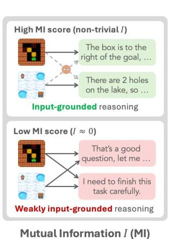
Figure 1 | Left: input-driven reasoning adapts to the current state; templated reasoning produces nearly identical responses across different inputs. Right: four reasoning regimes characterized along two axes: conditional entropy  $H(Z \mid X)$  (within-input diversity) and mutual information  $I(X;Z)$  (input dependence). Details in Section 2.

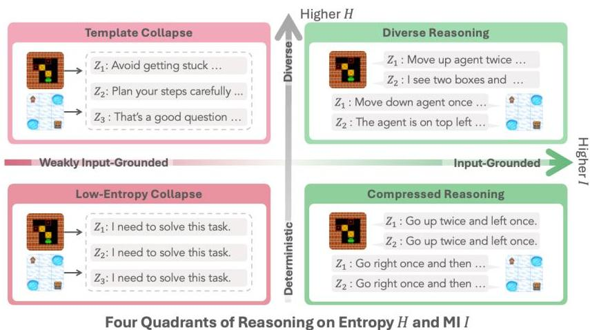

The standard PPO/GRPO objective contains regularization terms (KL divergence, entropy bonus) that act uniformly across all inputs regardless of their content:

$$
\mathcal {L} (\theta) = \mathbb {E} _ {x, \tau} [ A (\tau , x) ] - \lambda_ {\mathrm {K L}} D _ {\mathrm {K L}} (\pi_ {\theta} \| \pi_ {\mathrm {r e f}}) + \lambda_ {H} H (\pi_ {\theta}),
$$

where  $A(\tau, x)$  is the advantage.

## 2.2. Rethinking Reasoning Collapse from an Information-Theoretic Lens

Why entropy is insufficient to measure reasoning quality? Researchers proxy process stability with entropy and outcome stability with reward, treating both as evidence of healthy training. Stable entropy, however, does not guarantee stable reasoning. Reasoning diversity (marginal entropy)  $H(Z)$  decomposes via the standard identity [5]:

$$
H (Z) = I (X; Z) + H (Z \mid X),
$$

where  $I(X;Z)$  is input dependence (mutual information between input  $X$  and reasoning  $Z$ ), and  $H(Z\mid X)$  is within-input diversity (conditional entropy of reasoning given input). Entropy metrics proxy  $H(Z\mid X)$ , but neither captures a decline in  $I(X;Z)$ : the policy can sustain high  $H(Z\mid X)$  while  $I(X;Z)$  drops to zero, producing diverse but input-agnostic boilerplate. We call this template collapse.

Reasoning regimes with a mutual information view. Figure 1 illustrates four reasoning states along these two axes: (i) Diverse Reasoning (high  $H(Z \mid X)$ , high  $I(X;Z)$ ): the desired regime where reasoning is both varied within each input and systematically grounded across different inputs; (ii) Template Collapse (high  $H(Z \mid X)$ , low  $I(X;Z)$ ): superficially diverse but input-agnostic—the systematic blind spot of existing stability metrics; (iii) Compressed Reasoning (low  $H(Z \mid X)$ , high  $I(X;Z)$ ): input-faithful but overly deterministic; and (iv) Low-Entropy Collapse (low  $H(Z \mid X)$ , low  $I(X;Z)$ ): fully degenerate with deterministic and input-agnostic outputs. Among these, Template Collapse is uniquely problematic because entropy-based metrics can remain high

---

Table 1 | MI proxy family. All variants are derived from in-batch cross-scoring of reasoning traces against prompts, using matched (per-token log-prob under the true prompt) and marginal (per-token log-prob under the uniform prompt mixture) as base quantities. First-turn variants use only the first agent turn; trajectory variants sample across all turns.

<table><tr><th>Type</th><th>Proxy</th><th>Formula</th><th>Notes</th></tr><tr><td>Discrete bi linn k</td><td>Retrieval-Acc Recall@k</td><td>$\frac{1}{P_G} \sum_{i,k} 1[\arg \max_i \mathbf{L}_{i,k,i} = i]$ $\frac{1}{P_G} \sum_{i,k} 1[i \in \text{top-}k_j(\mathbf{L}_{i,k,j})]$</td><td>Chance level 1/P under template collapse $k \in \{2,4,8\}$</td></tr><tr><td>Continuous (raw)</td><td>MI-Est MI-Seq-Est</td><td>$\frac{1}{P_G} \sum_{i,k} (\text{matched}_{i,k} - \text{marginal}_{i,k})$ $\frac{1}{P_G} \sum_{i,k} (\mathbf{L}_{i,k,i} - \log \frac{1}{P} \sum_j e^{\mathbf{L}_{i,k,j}})$</td><td>Per-token; approaches 0 under collapse Per-sequence; no length normalization</td></tr><tr><td>Continuous (z-score)</td><td>MI-ZScore MI-ZScore-EMA</td><td>$\frac{1}{P_G} \sum_{i,k} \frac{\text{matched}_{i,k} - \text{marginal}_{i,k}}{\sigma_{\text{batch}}^{++}}$ $\frac{1}{P_G} \sum_{i,k} \frac{\text{matched}_{i,k} - \text{marginal}_{i,k}}{\sigma_{\text{EMA}}^{++}}$</td><td>Normalized by current-batch marginal std $\sigma_{EMA}^{(i)} = \alpha \sigma_{EMA}^{(i-1)} + (1-\alpha) \sigma_{batch}^{(i)}$</td></tr></table>

while input dependence collapses. Empirically, $I(X;Z)$ correlates significantly more strongly with task performance than entropy does (Figure 8).

### 2.3 Mutual Information Proxy Family

How do we estimate mutual information? True mutual information $I(X;Z)$ has no closed form for high-dimensional token sequences, so we propose an empirical proxy $\widehat{I}(X;Z)$ based on retrieval. The intuition: mutual information $I(X;Z)$ measures how much knowing the reasoning $Z$ tells us about which input $X$ produced it. When $I(X;Z)$ is high, different inputs yield distinguishable reasoning patterns—the model adapts its reasoning to the specific problem. When $I(X;Z)$ is low, reasoning becomes input-agnostic: observing $Z$ gives little clue about which $X$ it came from. This is the signature of template collapse. If reasoning truly collapses into templates, it should be easy to detect: a reasoning trace $Z$ generated from input $X_{i}$ will be equally likely under any other input $X_{j}$.

Method: In-Batch Cross-Scoring. Given $P$ prompts and $G$ reasoning samples per prompt from training rollouts, we compute teacher-forced log-likelihoods for every $(Z_{i,k},X_{j})$ pair, forming the scoring matrix $\mathbf{L}_{i,k,j} = \log p_{\theta}(Z_{i,k}\mid X_{j})$. We extract two length-normalized quantities:

$\text{matched}_{i,k}=\frac{\mathbf{L}_{i,k,i}}{|Z_{i,k}|},\qquad\text{marginal}_{i,k}=\frac{1}{|Z_{i,k}|}\log\frac{1}{P}\sum_{j}\exp(\mathbf{L}_{i,k,j}),$ (1)

where $\text{matched}_{i,k}$ is the per-token log-likelihood of reasoning $Z_{i,k}$ under its true source input $X_{i}$, and $\text{marginal}_{i,k}$ approximates the marginal log-likelihood $\log p_{\theta}(Z_{i,k})$ via a uniform mixture over all prompts in the batch.

Two Primary Proxies. We use two complementary proxies derived from Eq. 1:

(1) Retrieval-Acc (discrete, interpretable): We define

$\text{Acc}=\frac{1}{PG}\sum_{i=1}^{P}\sum_{k=1}^{G}\mathbb{I}\left[i=\arg\max_{j}\mathbf{L}_{i,k,j}\right].$

Under collapse, Acc approaches chance level $1/P$ (1.56% at $P$=64), providing an absolute reference.

(2) MI-ZScore-EMA (continuous, robust): We estimate input dependence as

$\widehat{I}(X;Z)=\frac{1}{PG}\sum_{i=1}^{P}\sum_{k=1}^{G}\Big{(}\text{matched}_{i,k}-\text{marginal}_{i,k}\Big{)},$

---

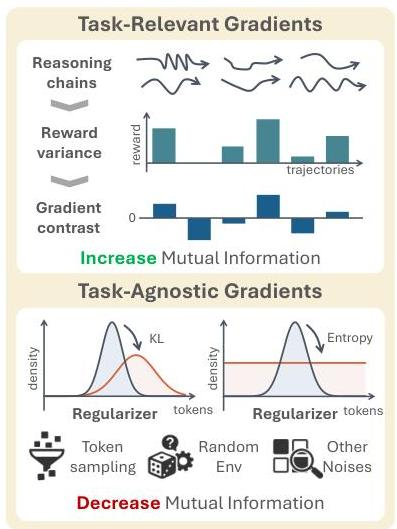
Figure 2 | Schematic Signal-to-Noise Ratio (SNR) view of RL updates. Left: total gradient decomposes into task gradient (sharpens with higher within-input reward variance) and regularization gradient. Right: high reward variance yields strong task gradient and better convergence (high SNR); low reward variance makes regularization gradient dominate, producing erratic updates and input-agnostic reasoning (low SNR).

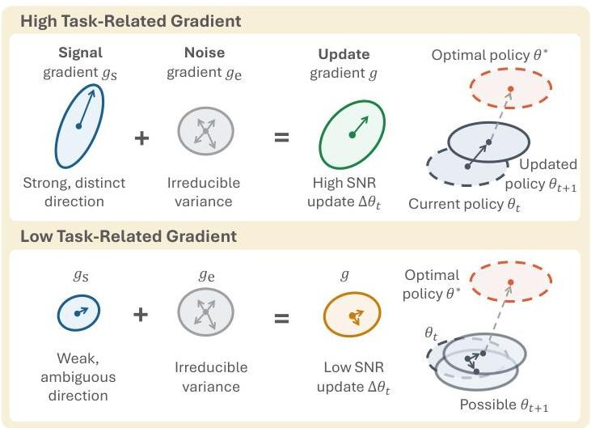

which increases when reasoning is much more compatible with its source input than with the batch mixture. In template-collapse regimes, matched $_{i,k} \approx$  marginal $_{i,k}$  for many samples and thus  $\widehat{I}(X;Z)$  approaches 0. We apply z-score normalization and exponential moving average (EMA) to stabilize training monitoring, yielding MI-ZScore-EMA.

Proxy Variants and Validation. Table 1 lists additional proxy variants, varying along three dimensions: (1) turn scope (first-turn only vs. trajectory-uniform sampling); (2) aggregation (discrete retrieval vs. continuous MI estimate); (3) length normalization (per-token vs. per-sequence). For comparison, conditional entropy  $H(Z \mid X) = -\frac{1}{PG} \sum_{i,k} \text{matched}_{i,k}$  and marginal entropy  $H(Z) = -\frac{1}{PG} \sum_{i,k} \text{ marginal}_{i,k}$  are logged in parallel, satisfying  $H(Z) = \widehat{I}(X;Z) + H(Z \mid X)$ . We set  $\epsilon = 10^{-3}$  and  $\alpha = 0.9$  for z-score normalization and EMA, respectively.

Empirically, Retrieval-Acc and MI-ZScore-EMA achieve positive Spearman correlation with final task performance (+0.39 for Trajectory MI-ZScore), substantially above entropy metrics, which show negative correlations (-0.11 to -0.14), confirming entropy is misleading in direction (Figure 8). All proxies reuse  $(X_{i},Z_{i,k})$  pairs from the training rollout and require no additional model or inference pass; implementation details are in Appendix C.

# 3. The Mechanism of Template Collapse: A Signal-to-Noise Ratio (SNR) View

We have defined template collapse (low  $I(X;Z)$ , high  $H(Z\mid X)$ ) and introduced an MI proxy to diagnose it. This section explains why RL training produces this failure mode and how to mitigate it. Our core finding: when policy gradient updates are dominated by input-agnostic noise rather than task-discriminative signal—low signal-to-noise ratio (SNR)—reasoning drifts toward templates that appear diverse within each input but ignore cross-input differences.

# 3.1. Observing Signal-Noise Imbalance in RL Gradients

We begin with an empirical observation that motivates the mechanistic analysis. Sorting training prompts by their within-input reward variance  $\widehat{\mathrm{Var}}(R \mid X)$  and grouping them into equal-sized

---

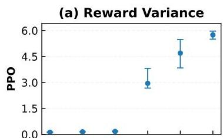

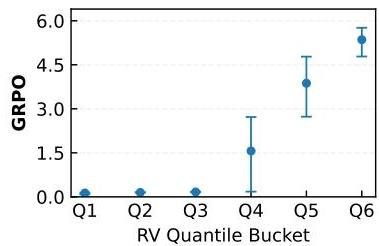
Figure 3 | Prompts sorted into six equal-sized reward-variance buckets Q1-Q6. We find: (a) Task gradient norm increases monotonically with bucket RV; (b) When RV near 0, substantial task gradients persist despite carrying almost no useful signal; (c) Regularizer gradient norm (KL + entropy) is flat across buckets. This directly supports the SNR mechanism under both algorithms.

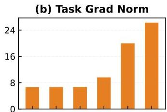

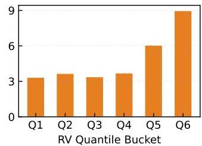

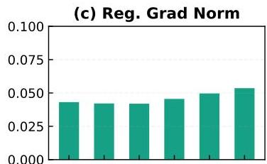

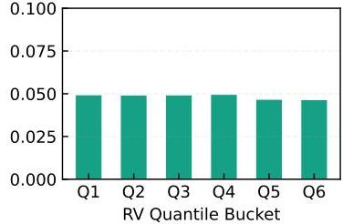

buckets, we measure the gradient norms contributed by task objectives versus regularization terms (Figure 3). Three patterns emerge consistently across algorithms:

1. Task gradient scales with reward variance:  $\| g_{\mathrm{task}}\|$  increases monotonically with bucket RV. High-variance prompts yield strong task-discriminative gradients; low-variance prompts produce weak gradients even when non-zero.
2. Regularization gradient is flat:  $\| g_{\mathrm{reg}}\|$  (from KL and entropy terms) remains constant across all buckets, applying uniform contraction to every reasoning chain regardless of its source prompt or reward signal.
3. Low-RV prompts produce gradient updates dominated by regularization: In the lowest-variance buckets, task gradients nearly vanish while regularization gradients persist, meaning updates are driven almost entirely by input-agnostic noise.

This gradient imbalance suggests that low reward variance weakens the task-discriminative component of updates, allowing input-agnostic regularization to dominate. When many prompts fall into this regime, the model learns to produce reasoning that satisfies regularization constraints (diverse, fluent) but ignores input-specific requirements—exactly the signature of template collapse.

# 3.2. Formalizing the SNR Mechanism via Gradient Decomposition

The empirical pattern above can be formalized through a signal-to-noise decomposition of policy gradients. Low within-input reward variance collapses advantages toward zero, weakening the task gradient. Simultaneously, input-agnostic regularization terms apply uniform contraction to every reasoning chain regardless of its source prompt. When the task gradient is weak, regularization dominates every update and pushes reasoning toward input-agnostic patterns, lowering  $I(X;Z)$ . This is the gradient-level mechanism behind template collapse (Figure 2; regularizer-dominance analysis in Appendix K).

For input  $x$  with  $G$  sampled trajectories, the advantage estimate is  $A_{g} = R_{g} - \bar{R}(x)$  and the task

---

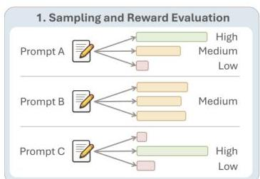
Figure 4 | SNR-Aware Filtering workflow. At each training iteration: (1) rollout generation collects trajectories; (2) within-prompt reward variance is computed as SNR proxy; (3) prompts are ranked by RV and top-p fraction retained, policy update performed only on high-signal subset. This filtering loop can prevent updating on noisy rollouts and requires no additional models/rollouts beyond standard RL.

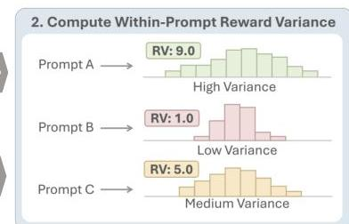

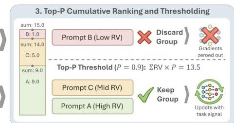

gradient is

$$
g _ {\text {t a s k}} (x) = \frac {1}{G} \sum_ {g} A _ {g} \nabla_ {\theta} \log \pi_ {\theta} (\tau_ {g} \mid x).
$$

The Cauchy-Schwarz inequality gives (Appendix H):

$$
\left| g _ {\text {t a s k}} (x) \right| \leq \sqrt {\operatorname {V a r} (R \mid X = x)} \cdot C.
$$

Low reward variance therefore weakens  $g_{\mathrm{task}}$  while leaving  $g_{\mathrm{reg}}$  unchanged, driving  $I(X;Z) \to 0$ . Critically,  $H(Z \mid X)$  need not decline: entropy regularization can sustain within-input diversity while input dependence collapses.

We formalize this through a three-noise decomposition of the total gradient:  $g_{\mathrm{total}} = g_{\mathrm{signal}} + g_{\mathrm{task - noise}} + g_{\mathrm{reg}}$ .

Table 2 | Three-noise decomposition of the policy update gradient.

<table><tr><td>Component</td><td>Source</td><td>Level</td><td>Ctrl.</td><td>Mitigation</td></tr><tr><td>gsignal</td><td>Meaningful reward differences across same-prompt trajectories</td><td>Prompt</td><td>No</td><td>SNR-Aware Filtering</td></tr><tr><td>gtask-noise</td><td>Sampling and environment stochasticity</td><td>Prompt</td><td>No</td><td>Filter high-noise prompts</td></tr><tr><td>greg</td><td>Uniform contraction per chain, independent of input (KL, entropy)</td><td>Chain</td><td>Yes</td><td>Tune λKL, λent</td></tr></table>

Signal and task noise both vary across prompts, but only the former carries task-discriminative information. Regularization noise acts uniformly at the chain level: every reasoning chain receives the same KL/entropy contraction regardless of its source prompt, making it inherently input-agnostic and the direct suppressive force on cross-input differences (Table 2).

In practice,  $g_{\mathrm{task}} = g_{\mathrm{signal}} + g_{\mathrm{task - noise}}$  merges the two prompt-level components. The SNR is  $\mathrm{SNR}(x) = \| g_{\mathrm{signal}}(x)\| /(\| g_{\mathrm{task - noise}}(x)\| +\| g_{\mathrm{reg}}\|)$ . Low SNR shifts updates toward input-agnostic directions, lowering  $I(X;Z)$  even when  $H(Z\mid X)$  remains high (Appendix K).

Low reward variance but non-vanishing gradient norm. When  $\widehat{\mathrm{Var}}(R \mid X) \approx 0$ , advantages collapse to zero and  $g_{\mathrm{task}} \approx 0$ , yet  $\| g_{\mathrm{total}} \| \approx \| g_{\mathrm{reg}} \|$  because  $g_{\mathrm{reg}}$  is independent of reward variance. Low-RV prompts therefore produce updates driven entirely by input-agnostic regularization noise, systematically lowering  $I(X;Z)$ . SNR-Aware Filtering removes these task-useless but regularization-active updates by filtering out low-RV prompts, the core mechanism by which the method restores input-conditioned reasoning.

---

3.3 SNR-Aware Filtering: Prioritizing High-Signal Updates

The gradient analysis above identifies the mechanism behind template collapse: low reward variance weakens task signal, allowing regularization noise to dominate and push reasoning toward input-agnostic patterns. This suggests a direct mitigation strategy: prioritize prompts with higher within-input reward variance, where advantage estimates carry stronger task-discriminative information and regularization is less likely to dominate the update.

We propose SNR-Aware Filtering: at each training iteration, estimate $\widehat{\text{Var}}(R\mid X)$ for each prompt and retain only the top fraction by variance before computing parameter updates (workflow in Figure 4). This concentrates gradient budget on high-SNR prompts and filters out low-variance updates that would be dominated by input-agnostic regularization.

Reward variance as SNR proxy. At each iteration, we estimate $\text{Var}(R\mid X)$ at the prompt level by sampling $G$ trajectories for the same prompt $X$ and computing the sample variance of episode returns:

$\widehat{\text{Var}}(R\mid X)$ $=\frac{1}{G-1}\sum_{g=1}^{G}\big{(}R_{g}(X)-\overline{R}(X)\big{)}^{2},$
$\overline{R}(X)$ $=\frac{1}{G}\sum_{g=1}^{G}R_{g}(X).$

Higher $\widehat{\text{Var}}(R\mid X)$ indicates trajectories can be meaningfully distinguished by reward, strengthening advantage estimates and increasing the likelihood that gradients align with task-relevant directions (Appendix H).

Top-$p$ filtering by reward variance. We keep the top fraction of prompts by variance score with keep rate $\rho\in(0,1]$, analogous to nucleus sampling *[14]* but ranking by per-prompt reward variance rather than token probability. Given $P$ prompts indexed by $i=1,\dots,P$ with variance scores $\widehat{\text{Var}}(R\mid X=x_{i})$, we rank by descending variance:

$\widehat{\text{Var}}(R\mid X=x_{\sigma(1)})\geq\widehat{\text{Var}}(R\mid X=x_{\sigma(2)})\geq\dots\geq\widehat{\text{Var}}(R\mid X=x_{\sigma(P)}),$

where $\sigma:\{1,\dots,P\}\rightarrow\{1,\dots,P\}$ is a permutation. Define the selection threshold as

$\tau=\rho\sum_{i=1}^{p}\widehat{\text{Var}}(R\mid X=x_{i}),$

and accumulate variance mass from the top until reaching $\tau$:

$S=\{\sigma(1),\dots,\sigma(k^{*})\}\,,\quad\text{where }k^{*}=\min\left\{k:\sum_{j=1}^{k}\widehat{\text{Var}}(R\mid X=x_{\sigma(j)})\geq\tau\right\}.$

The filtered objective becomes $\mathcal{L}_{\rho}(\theta)=\frac{1}{k^{*}}\sum_{i\in S}\sum_{j\in\mathcal{B}_{i}}L_{\theta}(\xi_{j})$, where $\mathcal{B}_{i}$ is the set of samples in group $i$. This adaptive selection naturally concentrates updates on high-signal prompts while automatically adjusting the kept count based on the variance distribution. Other filtering strategies (top-$k$, min-$p$) and implementation details are in Appendix G.

## 4 Experiments

We first establish that template collapse occurs reliably across training configurations (Section 4.2), then evaluate SNR-Aware Filtering as an intervention across tasks, algorithms, model scales, and modalities (Section 4.3; Table 4).

---

Table 3 | Summary of the features of the environments used.

<table><tr><td>Task</td><td>Stochastic</td><td>Multi-turn</td><td>State</td><td>Reward</td></tr><tr><td>Sokoban</td><td>X</td><td>✓</td><td>Grid</td><td>Dense</td></tr><tr><td>FrozenLake</td><td>✓</td><td>✓</td><td>Grid</td><td>Binary</td></tr><tr><td>MetaMathQA</td><td>X</td><td>✓</td><td>Text</td><td>Dense</td></tr><tr><td>Countdown</td><td>X</td><td>X</td><td>Text</td><td>Binary</td></tr><tr><td>SearchQA</td><td>X</td><td>✓</td><td>Text</td><td>Dense</td></tr><tr><td>WebShop</td><td>X</td><td>✓</td><td>Text</td><td>Dense</td></tr><tr><td>DeepCoder</td><td>X</td><td>X</td><td>Text</td><td>Dense</td></tr></table>

# 4.1. Experimental Testbed

We adopt the RAGEN [60] testbed and evaluate LLM agents on four controllable tasks that stress complementary decision-making regimes: irreversible planning (Sokoban), sparse-reward long-horizon navigation under stochastic transitions (FrozenLake), and symbolic math reasoning (MetaMathQA, Countdown). To further evaluate multi-turn reasoning and decision-making capabilities, we also include SearchQA [51], WebShop [64], and DeepCoder [25, 21, 15] (see Appendix B.1 for detailed descriptions).

**Environments and tasks.** Our testbed spans seven diverse environments with complementary characteristics (Table 3). Sokoban is a grid puzzle where the agent pushes boxes onto target cells; actions are effectively irreversible since boxes cannot be pulled [39]. FrozenLake is a navigation task with sparse rewards and stochastic transitions (slippery dynamics) [2]. MetaMathQA is a math QA task derived from MetaMathQA [67] where the agent may revise answers over multiple attempts, and we apply a diminishing reward across retries (halving each retry). Countdown is a single-turn numbers game [16] where the agent constructs an arithmetic expression to hit a target. SearchQA is a multi-turn question-answering task where the agent iteratively searches and synthesizes information to answer complex queries [51]. WebShop is an interactive web navigation task where the agent must search and purchase products matching user specifications [64]. DeepCoder is a code synthesis challenge where the agent generates program solutions to meet specified input-output requirements [25, 21, 15].

Training and evaluation setup. We train Qwen2.5-3B [35] with the veRL/HybridFlow stack [45], following RAGEN [60] defaults unless otherwise stated. We compare PPO [42], DAPO [68], GRPO [44], and Dr. GRPO [23] for up to 400 rollout-update iterations. Each iteration collects  $K = P \times G = 128$  trajectories per environment, with prompt batch size  $P = 8$  and group size  $G = 16$  trajectories per prompt. When applying SNR-Aware Filtering with keep rate  $\rho$ , we reduce the effective minibatch size accordingly and scale the per-step loss by  $\rho$ , so the optimization step size remains comparable.

# 4.2. Template Collapse as a Consistent Failure Mode

Across all training configurations, RL-trained agents reliably develop reasoning that is fluent but input-agnostic:  $I(X;Z)$  declines while  $H(Z \mid X)$  remains high, and this drift is invisible to entropy-based monitoring.

Observing template collapse through MI dynamics. We track three key metrics during training: task success rate, our MI proxy  $\widetilde{I}(X;Z)$  (Retrieval-Acc), and conditional entropy  $H(Z \mid X)$  (Figure 5). We present dynamics for all MI proxies in Appendix D.1. The trajectory reveals a

---

Entropy reg. (0.003) KL reg. (0.0003) Top-p Filtering
(p = 0.9)
No Filtering

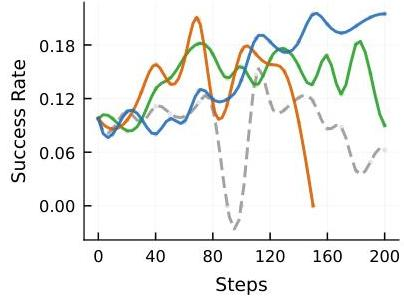
(a) Success Rate

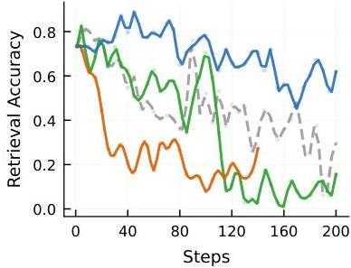
(b) Retrieval Accuracy

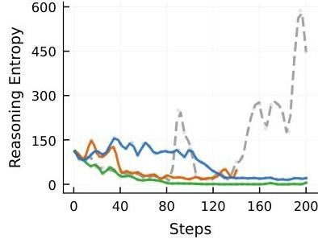
(c) Reasoning Entropy

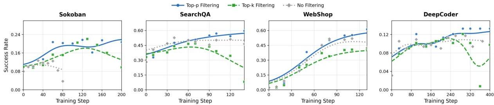
Figure 5 | Training dynamics under different intervention strategies. (a) Task success rate, (b) MI proxy (retrieval accuracy), and (c) reasoning entropy. Without filtering, MI degrades early while entropy spikes, signaling template collapse. Filtering effectively mitigates the decline in retrieval accuracy, with top-p SNR-Aware filtering best preserving both task performance and reasoning diversity.
Figure 6 | Comparison of filtering strategies showing Top- $p$  consistently outperforming Top- $k$  and no-filter baselines across four environments.

critical pattern: mutual information declines significantly before task performance degrades, while conditional entropy remains elevated throughout. This divergence is the hallmark of template collapse. Reasoning appears diverse within each input (high  $H(Z \mid X)$ ) but becomes increasingly input-agnostic across inputs (low  $I(X;Z)$ ).

The early decline of  $\widetilde{I}(X;Z)$  demonstrates that our MI proxy serves as an early warning signal, detecting reasoning degradation that entropy-based metrics miss entirely. This finding motivates using MI as a primary diagnostic alongside task performance, rather than relying solely on entropy for process monitoring.

Behavioral manifestation of template collapse. Beyond diagnostic metrics, template collapse manifests behaviorally as systematic reasoning compression. We do a more broadly evaluation by reproducing several experiments from existing evaluations spanning spatial agents [66], logic puzzle agents [3], visual agents [58], and math agents [22]. Figure 7 shows that reasoning length declines monotonically across all eight environments. As agents converge toward reusable templates, they produce shorter, more formulaic outputs—a behavioral signature of template collapse that complements MI-based diagnostics.

# 4.3. SNR-Aware Filtering Consistently Improves Performance

Comparing filtering strategies across environments. To evaluate the effectiveness of different filtering approaches, we compare three strategies: Top-p (nucleus-style) filtering, Top-k (fixed-count) filtering, and no filtering baseline. Figure 6 shows task success rates across four representative environments (Sokoban, FrozenLake, MetaMathQA, Countdown).

---

Table 4 | SNR-Aware Filtering results (\%) across algorithms, model scales, types, and modalities. Each cell reports baseline peak with filter delta in parentheses; Qwen2.5-VL-3B includes text (T) and image (V) inputs. Filtering improves average score across all variants.

<table><tr><td>Experiment Variants</td><td>Sokoban</td><td>FrozenLake</td><td>MetaMathQA</td><td>Countdown</td><td>Average</td></tr><tr><td>Baseline</td><td></td><td></td><td></td><td></td><td></td></tr><tr><td>PPO [42],</td><td></td><td></td><td></td><td></td><td></td></tr><tr><td>Qwen2.5-3B [35]</td><td>12.9 (+16.0)</td><td>67.0 (+10.9)</td><td>92.6 (+0.6)</td><td>97.9 (+0.0)</td><td>67.6 (+6.9)</td></tr><tr><td>Algorithm</td><td></td><td></td><td></td><td></td><td></td></tr><tr><td>DAPO [68]</td><td>16.2 (+5.1)</td><td>66.8 (+2.1)</td><td>90.8 (+2.8)</td><td>95.7 (+1.6)</td><td>67.4 (+2.9)</td></tr><tr><td>GRPO [44]</td><td>12.1 (+9.0)</td><td>70.9 (-3.0)</td><td>91.2 (+1.2)</td><td>95.7 (+2.2)</td><td>67.5 (+3.7)</td></tr><tr><td>Dr. GRPO [23]</td><td>12.1 (-0.4)</td><td>23.2 (+0.6)</td><td>91.2 (+1.4)</td><td>96.5 (+1.4)</td><td>55.8 (+0.8)</td></tr><tr><td>Model Scale (PPO)</td><td></td><td></td><td></td><td></td><td></td></tr><tr><td>Qwen2.5-0.5B [35]</td><td>3.3 (+22.9)</td><td>19.5 (+0.0)</td><td>10.0 (-0.2)</td><td>23.0 (-0.7)</td><td>14.0 (+5.5)</td></tr><tr><td>Qwen2.5-1.5B [35]</td><td>17.0 (+6.2)</td><td>36.5 (+1.6)</td><td>80.3 (+7.0)</td><td>56.6 (+1.6)</td><td>47.6 (+4.1)</td></tr><tr><td>Qwen2.5-7B [35]</td><td>42.4 (+4.9)</td><td>85.0 (-0.6)</td><td>84.0 (+11.7)</td><td>97.7 (+0.3)</td><td>77.3 (+4.1)</td></tr><tr><td>Model Type</td><td></td><td></td><td></td><td></td><td></td></tr><tr><td>Qwen2.5-3B-Instruct [35]</td><td>22.5 (+14.2)</td><td>83.6 (+2.3)</td><td>91.2 (+0.4)</td><td>96.3 (-0.6)</td><td>73.4 (+4.1)</td></tr><tr><td>Llama3.2-3B [26]</td><td>24.4 (+18.8)</td><td>84.6 (-0.2)</td><td>86.1 (+3.7)</td><td>99.2 (-1.2)</td><td>73.6 (+5.3)</td></tr><tr><td>Modality (Input Type)</td><td></td><td></td><td></td><td></td><td></td></tr><tr><td>Qwen2.5-VL-3B (T) [1]</td><td>53.0 (+6.0)</td><td>16.0 (+53.5)</td><td>-</td><td>-</td><td>34.5 (+29.8)</td></tr><tr><td>Qwen2.5-VL-3B (V) [1]</td><td>65.0 (+12.0)</td><td>19.5 (+59.5)</td><td>-</td><td>-</td><td>42.3 (+35.8)</td></tr></table>

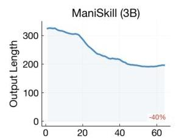

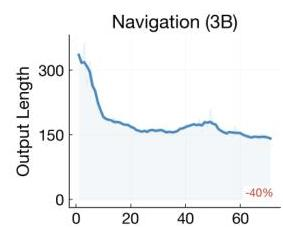

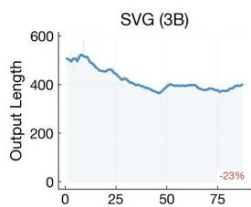

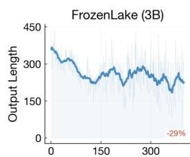

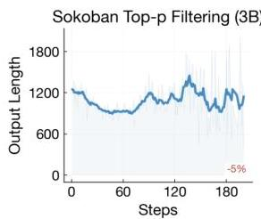
Figure 7 | Reasoning length decline across eight environments, showing systematic compression as a behavioral signature of template collapse.

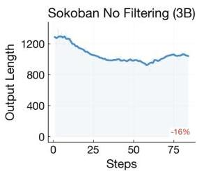

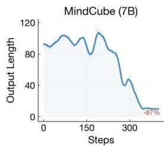

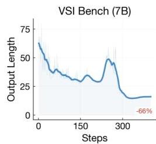

Top-p filtering consistently achieves higher success rates throughout training compared to both alternatives. The advantage over Top-k filtering is particularly noteworthy: while both methods prioritize high-variance prompts, Top-p's adaptive selection naturally adjusts to the variance distribution, rejecting entire batches when most prompts carry weak signal. In contrast, Top-k retains a fixed fraction regardless of signal quality, potentially including low-quality updates that dilute the training signal.

The no-filter baseline shows the weakest performance. This confirms that indiscriminate updates on all prompts, including those with near-zero reward variance, systematically degrades learning. These results motivate our choice of Top-p filtering as the primary SNR-Aware mechanism, with more comprehensive cross-environment results reported in Table 4.

---

Table 5 | Sweep over prompt batch size  $P$  and group size  $G$  (trajectories per prompt) on Sokoban (Qwen2.5-3B). NF = no filtering; F = SNR-Aware Filtering ( $\rho = 0.9$ ). Total rollout budget is fixed at 128 trajectories across all configurations.

<table><tr><td rowspan="2">P (prompts) × G (traj/prompt)</td><td colspan="3">Task Perf. (%)</td><td colspan="3">Step Time (s)</td><td colspan="3">VRAM (GB)</td></tr><tr><td>NF</td><td>F</td><td>Δ</td><td>NF</td><td>F</td><td>Δ%</td><td>NF</td><td>F</td><td>Δ</td></tr><tr><td>128 × 1</td><td>23.6</td><td>-</td><td>-</td><td>89.8</td><td>-</td><td>-</td><td>201.80</td><td>-</td><td>-</td></tr><tr><td>64 × 2</td><td>18.8</td><td>27.3</td><td>+8.6</td><td>91.8</td><td>64.9</td><td>-29%</td><td>201.39</td><td>201.83</td><td>+0.44</td></tr><tr><td>32 × 4</td><td>24.2</td><td>27.4</td><td>+3.2</td><td>89.8</td><td>52.6</td><td>-41%</td><td>202.11</td><td>201.67</td><td>-0.44</td></tr><tr><td>8 × 16</td><td>15.6</td><td>23.6</td><td>+8.0</td><td>89.2</td><td>65.9</td><td>-26%</td><td>201.54</td><td>201.90</td><td>+0.36</td></tr></table>

Table 4 summarizes our experimental matrix over four tasks, multiple RL algorithms, model scales/types, and input modalities. Across this grid, SNR-Aware Filtering yields two consistent effects. First, it improves peak task success rate in most settings (reported as the  $+\Delta$  next to each peak), demonstrating that prioritizing high-signal updates strengthens learning efficiency. Second, the gains span multiple experimental axes, including (i) the RL optimizer (PPO / DAPO / GRPO / Dr. GRPO), (ii) the model family and scale (Qwen2.5 from 0.5B to 7B; Llama3.2-3B), and (iii) the input modality (text- and image-conditioned Qwen2.5-VL). Here, DAPO and Dr. GRPO are recent strong baselines that directly target stable training and mitigate collapse-like failure modes. In Table 4, DAPO "no-filter" results correspond to the original algorithms without our filtering applied. DAPO itself also includes a filtering/acceptance step; it can be interpreted as a special case of our framework where the selection is fixed (equivalently, a top- $P$  filter with  $P \rightarrow 1.0$ ), while our SNR-Aware Filtering provides an explicit, tunable SNR knob via the keep rate  $\rho$ . This breadth suggests SNR-Aware Filtering serves as a general-purpose SNR control knob and works alongside standard stabilization terms (e.g., KL and entropy regularization).

Compute overhead of group sampling. SNR-Aware Filtering requires at least  $G = 2$  trajectories per prompt (group size) to estimate per-prompt RV. Since the total rollout budget is fixed at  $K = 128$  trajectories, varying the prompt batch size  $P$  and group size  $G$  is a repartitioning of that budget — all configurations incur identical rollout cost. Table 5 shows performance and wall-clock step time across configurations on Sokoban (Qwen2.5-3B). RV computation itself adds  $&lt; 0.1\%$  of iteration time. With filtering  $(\rho = 0.9)$ , fewer groups enter gradient computation, reducing per-step time by  $26 - 41\%$ . Configurations with group size  $G \geq 4$  and SNR-Aware Filtering match or outperform the  $128 \times 1$  baseline, confirming that the gains come at no additional compute cost.

# 5. Analysis

# 5.1. MI Diagnoses Collapse Better Than Entropy Across All Interventions

We demonstrate that MI separates high- and low-performance runs across all three intervention families better, and entropy could conflate them. At the same training budget, stronger SNR-Aware Filtering moves runs toward higher MI and better performance; KL and entropy tuning shift entropy without moving MI. We sweep three families of interventions (entropy regularization strength, KL constraint strength, and SNR-Aware Filtering keep rate) and compare their trajectories in both diagnostic spaces at fixed training steps (Figure 13). Entropy- and KL-based stabilizers induce larger changes in  $H(Z \mid X)$  than in  $\widehat{I}(X;Z)$ , and rarely move the model into the high- $\widehat{I}(X;Z)$  regime with clearly improved performance. In contrast, SNR-Aware Filtering traces a monotone improvement in both  $\widehat{I}(X;Z)$  and task success; pushing entropy too high leads to

---

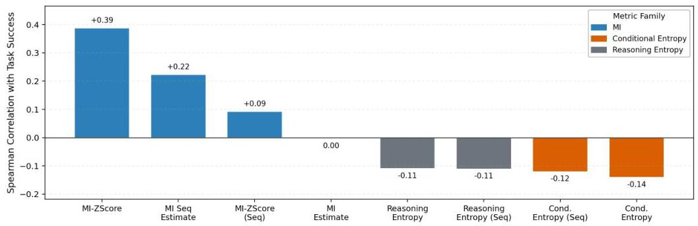
Figure 8 | Spearman correlations showing MI-family metrics positively predict performance while entropy metrics are near-zero or negative.

instability and performance collapse, while KL constraint mainly anchors the policy near its reference distribution without boosting input dependence.

We compute Spearman correlation between task success rate and each candidate diagnostic across runs with varying entropy regularization strength, KL constraint strength, and Top-p filtering kept mass (Figure 8). MI-family metrics achieve positive correlations, with Trajectory MI-ZScore reaching  $+0.39$ . In contrast, Reasoning Entropy and Conditional Entropy metrics show near-zero or negative correlations (between  $-0.11$  and  $-0.14$ ). This confirms that MI predicts performance twice as reliably as entropy does, and entropy actually points in the wrong direction. These results validate MI as a superior training monitor compared to entropy-based diagnostics for multi-turn agent RL.

The no-filter baseline shows the weakest performance. This confirms that indiscriminate updates on all prompts, including those with near-zero reward variance, systematically degrades learning. These results motivate our choice of Top-p filtering as the primary SNR-Aware mechanism, with more comprehensive cross-environment results reported in Table 4.

Table 4 summarizes our experimental matrix over four tasks, multiple RL algorithms, model scales/types, and input modalities. Across this grid, SNR-Aware Filtering yields two consistent effects. First, it improves peak task success rate in most settings (reported as the  $+\Delta$  next to each peak), demonstrating that prioritizing high-signal updates strengthens learning efficiency. Second, the gains span multiple experimental axes, including (i) the RL optimizer (PPO / DAPO / GRPO / Dr. GRPO), (ii) the model family and scale (Qwen2.5 from 0.5B to 7B; Llama3.2-3B), and (iii) the input modality (text- and image-conditioned Qwen2.5-VL). Here, DAPO and Dr. GRPO are recent strong baselines that directly target stable training and mitigate collapse-like failure modes. In Table 4, DAPO "no-filter" results correspond to the original algorithms without our filtering applied. DAPO itself also includes a filtering/acceptance step; it can be interpreted as a special case of our framework where the selection is fixed (equivalently, a top- $P$  filter with  $P \rightarrow 1.0$ ), while our SNR-Aware Filtering provides an explicit, tunable SNR knob via the keep rate  $\rho$ . This breadth suggests SNR-Aware Filtering serves as a general-purpose SNR control knob and works alongside standard stabilization terms (e.g., KL and entropy regularization).

# 5.2. Does SNR Mechanism Really Interpret Agent RL?

The SNR framing makes a concrete causal claim: template collapse is a gradient-level consequence of low reward variance, not a side effect of aggressive regularization or model capacity. We stress-test this claim with four questions: (1) Does directly controlling RV level causally drive

---

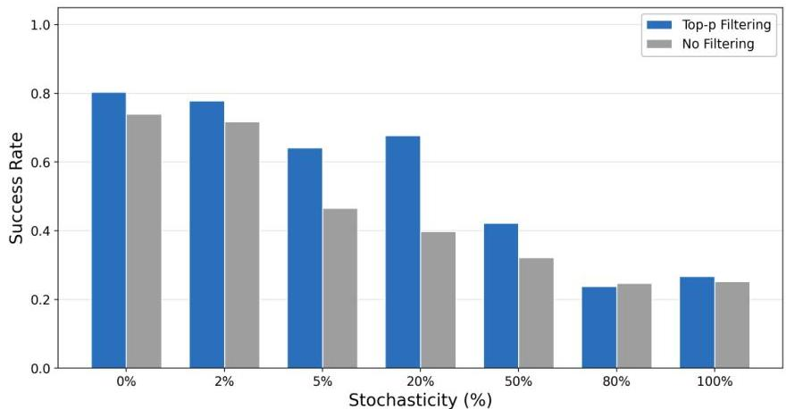
Figure 9 | In FrozenLake, median success rates for both Top-p filtering (orange) and no filtering (gray) decrease as environment stochasticity increases from  $0\%$  to  $100\%$ . SNR-Aware Filtering maintains a clear advantage from  $0\%$  to  $50\%$  stochasticity, but the gap closes at  $80\% - 100\%$ , where high transition noise weakens reward variance as an informative signal proxy.

performance and MI? (2) Does injecting environmental noise predictably weaken MI? (3) Do gains come from signal quality rather than prompt-distribution bias? (4) When does the filtering condition hold in practice? A positive answer to all four makes the SNR account difficult to dismiss.

Quartile ablation provides direct causal evidence. To move beyond correlation between RV and performance, we run a controlled intervention. We sort all prompt groups by within-prompt RV, divide them into four quartiles (Q1 = highest, Q4 = lowest), and train four separate runs — each updating on one quartile only, all other settings fixed (Table 6). Task performance and MI degrade monotonically from Q1 to Q4. Combined with Theorem G.1 ( $\| g_{\mathrm{task}} \| \leq \sqrt{\mathrm{RV}}$ ), this establishes the full causal chain: reward variance  $\rightarrow$  gradient quality  $\rightarrow$  input-dependent reasoning.

Table 6 | Quartile ablation on Sokoban (Qwen2.5-3B,  $P = 8$ ,  $G = 16$ , keeping  $25\%$  of prompts per step). Task performance and MI degrade monotonically from Q1 to Q4.

<table><tr><td>Quartile</td><td>RV Range</td><td>Task Perf (%)</td><td>MI Proxy</td><td>Entropy</td></tr><tr><td>Q1 (highest RV)</td><td>[4.4–5.6]</td><td>21.1</td><td>0.95</td><td>2.02</td></tr><tr><td>Q2</td><td>[1.5–4.2]</td><td>19.5</td><td>0.93</td><td>1.53</td></tr><tr><td>Q3</td><td>[0.0–0.2]</td><td>10.7</td><td>0.81</td><td>1.41</td></tr><tr><td>Q4 (lowest RV)</td><td>[0.0–0.1]</td><td>11.0</td><td>0.73</td><td>1.87</td></tr></table>

Controlled noise injection weakens MI. We run a direct intervention: varying environmental stochasticity and asking whether MI declines predictably in response. As environment and policy randomness increases, task return drops, conditional entropy rises, and  $\widehat{I}(X;Z)$  decreases monotonically (Figure 9). This is the expected consequence of the SNR chain. Additional noise inflates within-prompt return variance in a signal-free way, diluting the advantage estimates that task gradients depend on. Importantly, the filter's advantage also attenuates at very high noise (80–100%), which is itself informative: when the environment is so stochastic that even high-effort prompts yield noisy rewards, RV loses its discriminative power. The mechanism predicts exactly this boundary condition.

Prompt-level filtering outperforms trajectory-level filtering. The gains from SNR-Aware filtering could come from selecting discriminative prompts, or from discarding hard/noisy

---

trajectories. We disentangle these with a trajectory-level baseline: we keep all prompts but retain only the top-8 and bottom-8 trajectories per prompt by reward, preserving the prompt distribution while improving per-prompt SNR (Table 7). Trajectory-level filtering improves over no filtering. However, prompt-level SNR-Aware Filtering outperforms it by a wider margin. Within a naturally low-RV prompt, forcing within-prompt variance by sub-selecting trajectories amplifies noise. Selecting prompts that naturally produce discriminative signals is more effective.

Table 7 | Trajectory-level vs. prompt-level filtering on Sokoban (Qwen2.5-3B). Prompt-level SNR-Aware Filtering provides the largest gains; trajectory-level filtering confirms that the benefit is not due to prompt-distribution bias.

<table><tr><td>Method</td><td>Prompts Used</td><td>Traj/Update</td><td>Task Perf (%)</td><td>MI Proxy</td></tr><tr><td>No filter</td><td>8/8</td><td>128</td><td>12.9</td><td>0.83</td></tr><tr><td>Prompt-level RV (ρ=0.9)</td><td>3.2/8</td><td>50.6</td><td>23.6</td><td>1.80</td></tr><tr><td>Trajectory-level</td><td>8/8</td><td>64</td><td>16.8</td><td>0.20</td></tr></table>

When does SNR-Aware Filtering help? Finally, we find SNR-Aware Filtering improves performance better when cross-prompt RV heterogeneity is large enough to separate signal-rich from noise-only prompts. We find the metric Std(RV)/Mean(RV), computable from a single rollout batch, can effectively predict this (Table 8). When the ratio is high, the per-prompt RV distribution is bimodal and filtering cleanly separates signal from noise. When the ratio is near zero, all prompts carry similar RV and filtering discards data uniformly, like FrozenLake GRPO  $(\Delta = -5.0\%)$  ratio 0.33). This ratio is a cheap diagnostic which can be done before training.

Table 8 | Per-setting RV statistics and filtering effectiveness. Std/Mean of RV predicts whether SNR-Aware Filtering helps: high ratio means bimodal RV and effective filtering; low ratio means uniform RV and random discarding.

<table><tr><td>Setting</td><td>Filter Δ</td><td>P</td><td>G</td><td>RV Mean</td><td>RV Std</td><td>RV Var</td><td>RV Min</td><td>RV Max</td><td>Std/Mean</td></tr><tr><td>Sokoban, 14B</td><td>+4.6%</td><td>8</td><td>8</td><td>2.24</td><td>2.88</td><td>8.32</td><td>0.10</td><td>6.00</td><td>1.29</td></tr><tr><td>Sokoban, 3B</td><td>+3.2%</td><td>32</td><td>4</td><td>2.49</td><td>2.89</td><td>8.35</td><td>0.05</td><td>6.52</td><td>1.16</td></tr><tr><td>FrozenLake, 3B (GRPO)</td><td>-5.0%</td><td>32</td><td>8</td><td>0.54</td><td>0.18</td><td>0.03</td><td>0.22</td><td>0.76</td><td>0.33</td></tr></table>

How filtering adapts as training progresses? With the four predictions confirmed, we can now characterize how SNR-Aware Filtering behaves over the full training trajectory. Figure 10 tracks the effective kept ratio  $\rho_{\mathrm{eff}}$  and zero-variance prompt count over training. Both move in the expected direction: as the policy improves and converges, more prompts yield near-identical rollout rewards (zero-variance count rises), and the filter responds by becoming more selective (kept ratio falls). This automatic tightening is precisely what a fixed strategy like Top- $k$  with constant  $k$  cannot replicate. It would continue absorbing gradient budget from uninformative prompts even as signal quality deteriorates.

Reward collapse is visible at the distribution level. Figure 11 provides a complementary view of the same dynamics, tracking prompt-level reward distributions across early, mid, and late training in Sokoban. The shift is systematic: the hard portion shrinks as the policy improves, the mixed portion expands, and overall prompt-level variance collapses toward the late stages. This distribution-level signature mirrors the gradient-level story. Late training is not simply "easier" for the policy; it is a regime where reward variation has been compressed to the point that gradient updates carry progressively less task-discriminative information.

Format validity cannot substitute for content-sensitive diagnostics. One might hope that a coarser signal (whether the model's output follows the required format) could serve as a

---

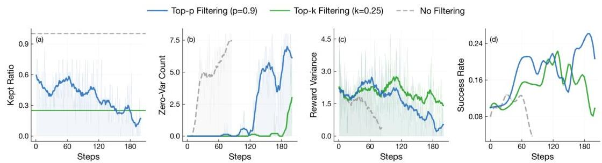

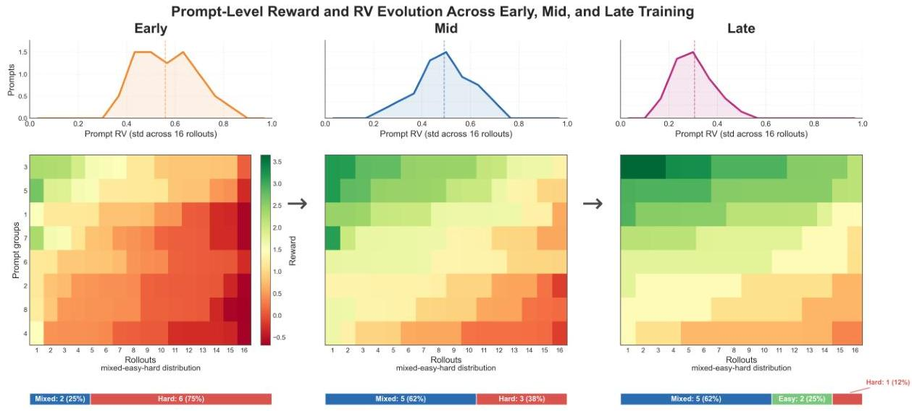
Figure 10 | Effective kept ratio and zero-variance prompt count, showing adaptive selection pressure as variance collapses during training.
Figure 11 | Prompt-level reward distribution across training phases, showing RV collapse as prompts shift toward uniform reward structures.

collapse indicator without the overhead of MI estimation. Figure 12 shows this does not hold: format validity is largely decoupled from collapse, with runs maintaining near-perfect validity while exhibiting low MI. Structural correctness and semantic input-dependence are separate dimensions. This reinforces the need for content-sensitive diagnostics, and explains why the MI proxy provides signal that format-based checks miss.

RV is largely orthogonal to entropy and response length, which explains why entropy-based stabilizers cannot prevent template collapse. Reward variance correlates weakly with conditional entropy (Spearman  $-0.14$ ) and response length (0.12), while correlating strongly with task reward (0.63). RV therefore targets a distinct axis of update quality rather than surface statistics, making it a complementary control knob to KL and entropy regularization. Figure 10 further shows that the effective kept ratio adapts over training: as more prompts drift toward near-zero RV, the filter automatically concentrates gradient updates on the shrinking pool of still-informative prompts.

What is the relationship between SNR-Aware Filtering and KL/entropy tuning stabilization? When training RL agents, practitioners typically tune KL penalty and entropy regularization coefficients to maintain training stability and prevent mode collapse. However, these interventions primarily control within-input diversity  $(H(Z\mid X))$  and cannot directly address the signal-to-noise imbalance that drives template collapse. Even with carefully tuned regularization, if most prompts have low reward variance, the task gradient remains weak and regularization forces

---

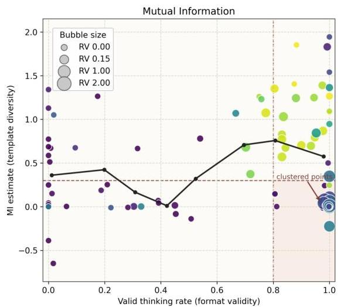
Figure 12 | Format validity versus MI and entropy diagnostics, showing that high validity does not guarantee high input dependence.

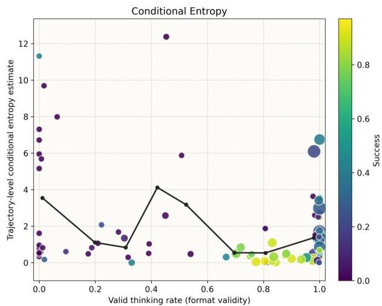

still dominate the update direction.

SNR-Aware Filtering is complementary: it selects high-signal prompts at each iteration, directly boosting the fraction of task-discriminative gradient in each update. This acts as a signal-enhancement mechanism rather than a noise-control mechanism. We provide a detailed empirical comparison of KL tuning, entropy tuning, and SNR-Aware Filtering in Section 5.1, showing that the three interventions move training dynamics along different axes (Figure 13).

# 6. Related Work

Reasoning collapse and policy degeneracy in closed-loop LM and Agent RL training.

LLM-agent RL reports various collapse phenomena [7, 61]: reasoning collapse (rationales becoming templated with weaker input correspondence) [61, 63, 69] and policy-level degeneracy (behavior concentrating on easy-to-reproduce patterns) [9, 59]. These echo model collapse in self-training, even when average metrics appear stable [12, 47].

Evaluating reasoning diversity, input dependence, and reasoning faithfulness.

Most diversity metrics do not test whether differences are systematically driven by inputs [53, 69]. Common measures include lexical overlap [20, 74], embedding dispersion [33, 53], and uncertainty analyses [27, 43], primarily capturing within-input variability and missing cross-input shifts [43, 53]. Recent work probes input dependence via behavioral tests [11, 37, 73] and retrieval-style matching [28, 10, 71, 19]. Work on reasoning faithfulness asks whether explanations reflect true decision bases [18, 54, 48, 70]. We instead focus on the phenomenon that reasoning may become less input-sensitive after RL.

# Stabilizing multi-turn Agent RL under closed-loop sampling.

Stability work spans KL control, entropy regularization, clipping, reward shaping, curricula, and replay mixtures [40, 42, 41, 13, 49, 32, 36, 50, 9, 59, 57, 62, 63]. For multi-step agents, stepwise rewards and self-correction signals are common [4, 30, 55, 24, 46, 56, 65, 8, 61]. However, these methods do not prevent drift toward input-agnostic templates: if rollouts receive similar rewards regardless of reasoning quality, gradients carry little information [29, 31, 47, 69]. We adopt a SNR view, using reward variance filtering low-signal samples to maintain effective SNR.

---

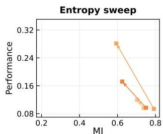

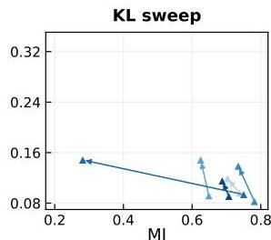

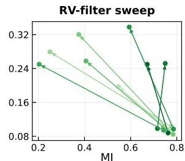

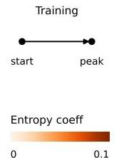

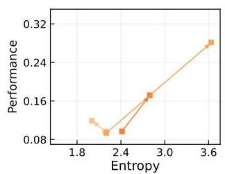
Figure 13 | Training dynamics under three interventions. For each setting, we choose two checkpoints (steps 10/400) and connect them into a trajectory (arrows point to later steps). Color intensity indicates weaker to stronger intervention.

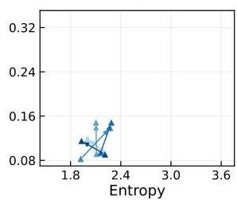

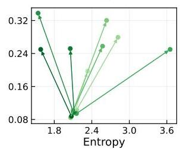

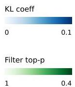

# 7. Conclusions and Limitations

We find closed-loop multi-turn agent RL can fail silently: reasoning drifts toward fluent but input-agnostic boilerplate while conditional entropy remains stable. We define this as template collapse. Built on this, the paper makes three contributions. First, we introduce a mutual information (MI) proxy between inputs and reasoning, which interprets template collapse and tracks task performance better than conditional entropy. To explain why collapse occurs, we propose SNR mechanism in RL and show that low within-input reward variance suppresses task gradients and lets regularization forces dominate, pushing policy outputs toward input-agnostic templates. To address this, we introduce SNR-Aware Filtering to prioritize prompts with reward variance before each parameter update, improving performance on average across tasks, model scales, and modalities and can integrate easily with existing training pipelines.

Limitations. The SNR decomposition assumes task-signal and regularization noise separate cleanly, though they may couple through gradient accumulation in practice. All experiments are single-agent; how template collapse propagates in multi-agent RL remains open. A capable model could game the filtering criterion by artificially inflating reward variance, a risk worth monitoring over long training horizons. The method requires reward variance to be a reliable signal proxy, which degrades in sparse or noisy reward environments. Aggressive filtering may narrow exploration coverage; the kept mass requires per-task tuning.

# 8. Acknowledgements

We thank Yuxiang Lin for help with RAGEN infrastructure and environments, and Kyunghyun Cho for insightful discussions on the manuscript.

---