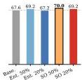
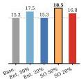
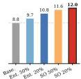
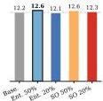
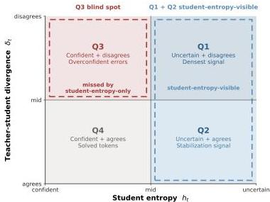

# TIP: Token Importance in On-Policy Distillation

Yuanda Xu^{∗†} Hejian Sang^{∗} Zhengze Zhou^{∗} Ran He^{∗} Zhipeng Wang Alborz Geramifard [Equal contribution.Correspondence to yuanda@math.princeton.edu]

###### Abstract

On-policy knowledge distillation (OPD) trains a student on its own rollouts under token-level supervision from a teacher, but not all token positions matter equally, and existing views of token importance are incomplete. We ask: which tokens carry the most useful learning signal in OPD? Our answer is that informative tokens come from two regions: positions with high student entropy, and positions with low student entropy plus high teacher–student divergence—where the student is overconfident and wrong. Empirically, student entropy is a strong first-order proxy. Retaining 50% of tokens with entropy-based sampling matches or exceeds all-token training while cutting peak memory by up to 47%; under more aggressive retention, memory savings reach up to 58%. But entropy alone misses a second important region. When we isolate low-entropy, high-divergence tokens, training on fewer than 10% of all tokens nearly matches full-token baselines, showing that overconfident tokens carry dense corrective signal despite being nearly invisible to entropy-only rules. We organize these findings with TIP (Token Importance in on-Policy distillation), a two-axis taxonomy over student entropy and teacher–student divergence that explains why entropy is useful yet structurally incomplete and motivates type-aware selection rules that combine uncertainty and disagreement. We validate this picture across three teacher–student pairs spanning Qwen3, Llama, and Qwen2.5 on MATH-500 and AIME 2024/2025, and on the DeepPlanning benchmark for long-horizon agentic planning, where Q3-only training with 20% of tokens surpasses full-token OPD. Our experiments are implemented by extending the open-source OPD repository https://github.com/HJSang/OPSD_OnPolicyDistillation, which provides the practical training base for reproducing this work and supports memory-efficient distillation of larger models under limited GPU budgets.

## 1 Introduction

Knowledge distillation transfers capability from a large teacher to a smaller student by training on the teacher’s output distributions *(Hinton et al., 2015)*, and is a primary driver of the rapid growth in small-model capacity *(Xiao et al., 2025)*. In on-policy distillation (OPD), the student generates its own responses and learns from the teacher’s corrections at each token *(Agarwal et al., 2024; Gu et al., 2025)*. Since the student generates the context, token importance is a property of the student–teacher state at each position. This raises a direct question: which tokens carry the most useful learning signal?

Our central claim is simple. In OPD, informative tokens come from two regions of the token state space: (1) positions with high student entropy, where the student is uncertain and still forming its prediction; and (2) positions with low student entropy but high teacher–student divergence, where the student is confident but misaligned with the teacher. The first region is easy to detect with entropy alone: retaining 50% of tokens by entropy-based sampling already matches or improves all-token training while substantially reducing memory. The second is easy to miss. Under more aggressive retention, entropy-only selection begins to lose a small set of low-entropy, high-divergence

---

Baseline (100%) Entropy 50% Entropy 20% Soft-OR 50% Soft-OR 20%

MATH-500

AIME'24

AIME'25
Figure 1: Cross-task summary: average accuracy by selection method. Each panel shows one benchmark; bar height is the mean accuracy (mean@16) averaged across three teacher-student pairs for mathematical reasoning (Qwen3-8B→4B, Llama-70B→8B, Qwen2.5-14B→1.5B) and across two teacher sizes (14B, 32B) for DeepPlanning. Methods: Base. = all-token OPD (100%); Ent. 50%/20% = entropy-based token selection at the stated retention ratio; SO 50%/20% = Soft-OR (Eq. 5) top-k selection. The dashed line marks the all-token baseline. Soft-OR consistently improves over entropy-only selection on the mathematical reasoning benchmarks and remains competitive on DeepPlanning, confirming that augmenting entropy with divergence recovers the Q3 blind spot without sacrificing Q1/Q2 coverage.

DeepPlanning

tokens—positions where the student is sharply peaked on a continuation that the teacher strongly disfavors. These overconfident tokens carry dense corrective signal despite being nearly invisible to any entropy-based rule.

We organize this picture with TIP, a two-axis taxonomy crossing student entropy and teacher-student divergence into four quadrants (Section 4). Theoretically, entropy is a strong first-order proxy but must conflate "confident and correct" with "confident and wrong," and a parameter-free Soft-OR score fixes this blind spot (Section 5). Experimentally, the combined score consistently improves over entropy-only selection on mathematical reasoning and remains competitive on agentic planning, where Q3-only selection is strongest (Section 7).

# Contributions.

1. We propose TIP, a two-axis taxonomy that organizes token importance by student entropy and teacher-student divergence, requiring no verification labels and no extra computation beyond the standard OPD loss.
2. We prove that entropy is a strong first-order proxy but any entropy-only score is structurally blind to overconfident tokens, and that a parameter-free Soft-OR score fixes this blind spot (Propositions 1-2, Remark 2).
3. We validate the taxonomy across several datasets and model families, and show that Soft-OR consistently outperforms entropy-only selection on mathematical reasoning while remaining competitive on long-horizon agentic planning in DeepPlanning [Zhang et al., 2026], where Q3-only selection is strongest.

# 2 Related Work

Curriculum learning and importance sampling. The idea that not all training examples contribute equally dates to curriculum learning [Bengio et al., 2009] and self-paced learning [Kumar et al., 2010], which order or weight samples by difficulty. Importance sampling extends this to gradient estimation: Katharopoulos and Fleuret [2018] select mini-batch elements by gradient norm, and Ren et al. [2018] learn per-example weights via meta-gradients. These methods operate at the example level. Our work pushes the granularity to individual tokens within a sequence, where the relevant axes are student uncertainty and teacher-student disagreement rather than a scalar difficulty score.

Off-policy vs. on-policy distillation. Classical sequence-level KD [Kim and Rush, 2016] trains the student on teacher-generated sequences (off-policy). On-policy distillation [Agarwal et al., 2024, Gu et al., 2025] instead lets the student generate its own rollouts and applies teacher supervision token-by-token, avoiding the train-test distribution mismatch inherent in off-policy data. Sang et al.

---

[2026]* further show that on-policy reverse KL self-distillation can compress lengthy reasoning chains into shorter ones. Distillation has proven effective across diverse settings—from pretraining to extreme compression to expanding reasoning capabilities beyond what RL alone achieves *[Gu et al., 2024, Xu et al., 2024, Yue et al., 2025]*. Because token importance in OPD is determined by the student’s own distribution at each position, it cannot be pre-computed from teacher outputs—it must be assessed online. This makes the choice of which tokens to train on a fundamentally different problem from off-policy sample selection.

##### Response-level selection.

Several methods operate at the sequence level: *Xu et al. [2026b]* select responses at the frontier of student competence, and LION *[Jiang et al., 2023]* uses quality signals. These approaches select rollouts to train on but treat all tokens within a response uniformly. A complementary question—which we address—is which token within a response carry the most signal.

##### Token-level importance in distillation and RL.

In RL, *Wang et al. [2025b]* showed that high-entropy “forking tokens” drive most gradient signal, *Cui et al. [2025]* further revealed that the covariance between token log-probability and advantage drives entropy collapse during policy optimization, SPINE *[Wu et al., 2025]* extends this idea to test-time RL by updating only decision-critical branch points with entropy-band regularization, and *Xu et al. [2026a]* identified overconfident errors as a critical failure mode. In distillation, AdaSwitch *[Peng et al., 2025]* switches between teacher and student guidance based on divergence, Entropy-Aware OPD *[Jin et al., 2026]* adapts the loss based on teacher entropy, SelecTKD *[Huang et al., 2025]* lets the teacher verify student-proposed tokens via a propose-and-verify procedure and masks or down-weights rejected positions, LeaF *[Guo et al., 2025]* uses gradient-guided comparison with a teacher to identify and prune confounding tokens during distillation, and AdaKD *[Xie et al., 2026]* combines a divergence-based token selector (LATF, top-$r$% by Hellinger distance) with token-level temperature scaling (IDTS). Beyond fine-tuning, EntroDrop *[Wang et al., 2025a]* shows that dropping low-entropy tokens during pretraining improves generalization under multi-epoch training, providing independent evidence that high-entropy positions carry most learning signal. EDIS *[Zhu et al., 2026]* further demonstrates that the temporal dynamics of token entropy—not just its magnitude—can diagnose correct vs. incorrect reasoning trajectories.

Several concurrent works also explore token-level weighting for distillation or compression *[Wang et al., 2020, Tavor et al., 2026, Kim and Baek, 2026]*. Most closely related is AdaKD *[Xie et al., 2026]*, whose LATF module performs hard top-$r$% selection by teacher–student Hellinger distance—a divergence-only view we ablate in Appendix B.2. Our Q3 specification is not a relabeling of “large-divergence tokens”: it is defined by the conjunction of low student entropy and high disagreement, and the two axes induce different selections (Table 3 vs. Table 8). The AdaKD ablation itself supports this: LATF alone yields only $+0.04$ average ROUGE-L on Qwen2-1.5B (their Table 3a), with AdaKD’s full gain coming from an orthogonal temperature-scaling module (IDTS). Our budget-matched comparison (Appendix B.2) reaches the same conclusion—divergence-only selection underperforms the baseline at equal budget, whereas the low-entropy + high-divergence selector remains competitive. Beyond this, our work studies all three signal sources—student entropy, teacher entropy, and teacher–student divergence—within a unified two-axis taxonomy, proves that any entropy-only rule is structurally blind to low-entropy, high-divergence tokens (Proposition 2), and proposes a parameter-free Soft-OR score that explicitly recovers this region, validated on mathematical reasoning and long-horizon agentic planning.

## 3 Setup

Let $T$ denote a frozen teacher and $S_{\theta}$ a trainable student over vocabulary $V$. A prompt $x\sim\mathcal{D}$ is drawn, the student generates a rollout $\mathbf{y}=(y_{1},\ldots,y_{m})\sim S_{\theta}(\cdot\mid x)$, and the teacher scores each position. The context at position $t$ is $c_{t}=(x,y_{<t})$. The standard on-policy distillation loss is:

$\mathcal{L}=\frac{1}{m}\sum_{t=1}^{m}D_{\mathrm{KL}}(P_{S}(\cdot\mid c_{t})\,\|\,P_{T}(\cdot\mid c_{t}))\,.$ (1)

We characterize each token position by two quantities, both already computed during training:

---

Table 1: Token taxonomy. Classification by student entropy  ${h}_{t}$  and teacher-student divergence  ${\delta }_{t}$  .

<table><tr><td>Quadrant</td><td>ht</td><td>δt</td><td>Learning role</td></tr><tr><td>Q1: High entropy, high divergence</td><td>High</td><td>High</td><td>Correct errors or consolidate fragile knowledge</td></tr><tr><td>Q2: High entropy, low divergence</td><td>High</td><td>Low</td><td>Stabilize underconfident predictions</td></tr><tr><td>Q3: Overconfident</td><td>Low</td><td>High</td><td>Break systematic confident biases</td></tr><tr><td>Q4: Solved</td><td>Low</td><td>Low</td><td>Negligible signal</td></tr></table>

Figure 2: TIP taxonomy as a two-axis map. Entropy determines whether the student is uncertain or confident; divergence determines whether the teacher agrees or disagrees. Q1 and Q2 are visible to entropy-based methods, while Q3 is the low-entropy blind spot that requires divergence to detect.

# Student entropy.

$$
h _ {t} = \frac {H \left(P _ {S} (\cdot \mid c _ {t})\right)}{\log | V |} \in [ 0, 1 ]. \tag {2}
$$

High  $h_t$  means the student is uncertain; low  $h_t$  means it is confident.

# Teacher-student divergence.

$$
\delta_ {t} = D _ {\mathrm {K L}} \left(P _ {S} (\cdot \mid c _ {t}) \| P _ {T} (\cdot \mid c _ {t})\right). \tag {3}
$$

High  $\delta_t$  means the teacher disagrees with the student. This is the per-token loss itself—no extra computation.

These two quantities define the plane in which we study token importance. The empirical question of this paper is whether useful training signal concentrates in particular regions of the  $(h_t, \delta_t)$  plane.

# 4 TIP Taxonomy: A Two-Axis View of Token Importance

We organize token importance along two axes already computed during standard OPD training: student entropy  $h_t$  and teacher-student divergence  $\delta_t$ . Crossing them yields four quadrants (Table 1, Figure 2). The quadrants are highly imbalanced: Q4 accounts for roughly  $40 - 47\%$  of all tokens, Q1 and Q2 together make up  $40 - 52\%$ , and Q3 constitutes only  $3 - 15\%$  across model families and datasets in the experimental setup, yet carries disproportionate corrective signal (Section 7.3; Appendix B.5 gives representative token-level examples, especially for Q1 and Q3).

---

5 Theoretical Analysis

The taxonomy suggests three predictions: high-entropy tokens should dominate learning (Q1/Q2 $\gg$ Q4); entropy-only selection should miss a specific class of tokens (Q3); and adding divergence should recover them. We formalize these below and test each one experimentally in Section 7. Specifically, we prove: (1) an oracle token weight favors Q1 $>$ Q2 $>$ Q3 $\gg$ Q4 (Proposition 1); (2) entropy-only scores are structurally blind to Q3 (Proposition 2); and (3) augmenting entropy with divergence restores coverage of all informative quadrants (Remark 2).

### 5.1 Oracle Token Weight

We want to identify which tokens most accelerate training. We formalize this as: what per-token weights $\{w_{t}\}$ minimize the expected loss after one gradient step?

Let $g_{t}=\nabla_{\theta}\ell_{t}$ be the per-token gradient, $\bar{\mu}_{t}=\mathbb{E}[g_{t}]$, and define $\bar{\phi}_{t}=\langle\nabla L,\bar{\mu}_{t}\rangle$ and $\bar{M}_{t}=\mathbb{E}[\|g_{t}\|^{2}]$. Under $\beta$-smoothness and a token-separable approximation that neglects cross-token covariance terms (Appendix A.1), a weighted step $\hat{g}=\sum_{t}w_{t}g_{t}$ satisfies the surrogate bound:

$\mathbb{E}[L(\theta-\eta\hat{g})]-L(\theta)\ \lesssim\ \sum_{t=1}^{m}\Bigl{(}-\eta\,w_{t}\,\bar{\phi}_{t}+\frac{\eta^{2}\beta}{2}\,w_{t}^{2}\,\bar{M}_{t}\Bigr{)}.$ (4)

###### Proposition 1 (Oracle token weight).

The bound is minimized at $w_{t}^{*}=\bar{\phi}_{t}/(\eta\beta\bar{M}_{t})$, with per-token descent $\Delta_{t}^{*}=-\bar{\phi}_{t}^{2}/(2\beta\bar{M}_{t})$.

Indeed, the bound is separable across tokens, so each coordinate minimizes $-\eta w_{t}\bar{\phi}_{t}+\frac{\eta^{2}\beta}{2}w_{t}^{2}\bar{M}_{t}$ independently. Differentiating gives $-\eta\bar{\phi}_{t}+\eta^{2}\beta w_{t}\bar{M}_{t}=0$, hence $w_{t}^{*}=\bar{\phi}_{t}/(\eta\beta\bar{M}_{t})$. Substituting back yields $\Delta_{t}^{*}=-\bar{\phi}_{t}^{2}/(2\beta\bar{M}_{t})$.

This is an oracle quantity (it depends on the population gradient), but it gives a clear interpretation: informative tokens have gradients that align well with descent without excessive energy. Across the four quadrants:

- Q1: Large $\bar{\phi}_{t}$ (strong correction), moderate $\bar{M}_{t}$ (well-conditioned) $\Rightarrow$ largest $w_{t}^{*}$.
- Q2: Moderate $\bar{\phi}_{t}$ (mild correction) $\Rightarrow$ moderate $w_{t}^{*}$.
- Q3: Positive $\bar{\phi}_{t}$ (real corrective signal despite low entropy) $\Rightarrow$ positive $w_{t}^{*}$.
- Q4: Near-zero $\bar{\phi}_{t}\Rightarrow$ negligible $w_{t}^{*}$.

The qualitative ordering is Q1 $>$ Q2 $>$ Q3 $\gg$ Q4.

###### Remark 1 (Quadrant ordering).

The ordering follows from the structure of each quadrant. At high divergence, the teacher’s correction is misaligned with the student’s current prediction, so $\bar{\phi}_{t}$ is large and positive. At high entropy, the student’s distribution is diffuse, spreading gradient energy across many vocabulary entries; $\bar{M}_{t}$ is moderate, yielding a favorable $\bar{\phi}_{t}^{2}/\bar{M}_{t}$ ratio for Q1. At low entropy ($h_{t}\approx 0$), the distribution is sharply peaked, so $\bar{M}_{t}$ is small—but Q3 still has positive $\bar{\phi}_{t}$ because the teacher strongly disagrees, giving $w_{t}^{*}>0$. Q4 has both small $\bar{\phi}_{t}$ (teacher agrees) and small $\bar{M}_{t}$, so $w_{t}^{*}\approx 0$.

In practice, $w_{t}^{*}$ is unavailable because it depends on population-level quantities. A natural proxy is student entropy $h_{t}$, but any such score is structurally blind to Q3:

###### Proposition 2 (Blind spot).

Let $\hat{w}(h_{t})=f(h_{t})$ be any non-decreasing score with $f(0)=0$ (e.g., $f(h)=h$ or $f(h)=\mathbbm{1}[h\geq\tau]$). Then Q3 tokens—which may have $w_{t}^{*}>0$—receive $\hat{w}(h_{t})\approx 0$. Entropy alone cannot distinguish “confident and correct” (Q4) from “confident and wrong” (Q3).

Appendix B.5 illustrates this concretely: Examples 1, 3, and 4 show Q3 tokens with $h_{t}<0.4$ that an entropy-only rule would discard, while Examples 2 and 5 show the contrasting high-entropy Q1 cases that entropy-based rules do capture.

Since divergence $\delta_{t}$ is already computed as part of the loss, the natural fix is a score that is nonzero whenever *either* axis is active. We define the Soft-OR score with min-max normalized inputs $\hat{h}_{t},\hat{\delta}_{t}\in[0,1]$:

$s_{t}=\hat{h}_{t}+\hat{\delta}_{t}-\hat{h}_{t}\cdot\hat{\delta}_{t}=1-(1-\hat{h}_{t})(1-\hat{\delta}_{t}).$ (5)

###

---

This is parameter-free:  $s_t$  is nonzero whenever either entropy or divergence is nonzero, without a tuning coefficient.

Remark 2 (Soft-OR fixes the blind spot). For any  $Q3$  token with  $\hat{h}_t \approx 0$  and  $\hat{\delta}_t &gt; 0$ , the entropy proxy gives  $\hat{w}_0(h_t) \approx 0$  (Proposition 2), but  $s_t \approx \hat{\delta}_t &gt; 0$ . Simultaneously,  $Q4$  tokens ( $\hat{h}_t \approx 0$ ,  $\hat{\delta}_t \approx 0$ ) remain suppressed:  $s_t \approx 0$ .  $Q1$  tokens retain the highest scores because both  $\hat{h}_t$  and  $\hat{\delta}_t$  are large ( $s_t \approx 1$ ). The Soft-OR score therefore tracks the oracle ordering  $Q1 &gt; Q2 &gt; Q3 \gg Q4$  without requiring  $\hat{\phi}_t$  or  $\hat{M}_t$ .

Empirical predictions. Table 2 maps each theoretical result to its experimental test.

Table 2: Theoretical predictions and experimental tests.

<table><tr><td>Result</td><td>Prediction</td><td>Tested in</td></tr><tr><td>Proposition 1</td><td>Q1/Q2 carry the most signal; removing Q4 improves efficiency</td><td>Section 7.2</td></tr><tr><td>Proposition 2</td><td>Entropy-only selection misses Q3 tokens</td><td>Section 7.3</td></tr><tr><td>Remark 2</td><td>Combined score recovers Q3 and outperforms entropy-only</td><td>Section 7.4</td></tr></table>

# 6 Method: Type-Aware Token Selection

Given a retention ratio  $\rho \in (0,1]$ , we retain the top- $\rho$  fraction of tokens by the Soft-OR score  $s_t = \hat{h}_t + \hat{\delta}_t - \hat{h}_t \cdot \hat{\delta}_t$  (Equation 5):

$$
\mathcal {T} = \operatorname {T o p K} \left(\left\{s _ {t} \right\} _ {t = 1} ^ {m}, \lfloor \rho m \rfloor\right). \tag {6}
$$

The training loss is:

$$
\mathcal {L} _ {\mathrm {T I P}} = \frac {1}{| \mathcal {T} |} \sum_ {t \in \mathcal {T}} D _ {\mathrm {K L}} \left(P _ {S} (\cdot \mid c _ {t}) \| P _ {T} (\cdot \mid c _ {t})\right). \tag {7}
$$

Setting  $\hat{\delta}_t = 0$  recovers entropy-only selection; including  $\hat{\delta}_t$  additionally promotes Q3 tokens. The score is parameter-free and both  $h_t$  and  $\delta_t$  are already computed during standard distillation, so the only extra cost is a min-max normalization and the top- $k$  sort— $O(m\log m)$  per rollout, negligible compared with forward and backward passes.

# 7 Experiments

We now validate each prediction of the taxonomy. Table 2 maps each theoretical result to its experimental test; we proceed from the strongest signal (high-entropy tokens, Section 7.2) to the blind spot (Q3, Section 7.3) to the combined score (Section 7.4).

# 7.1 Experimental Setup

Models. Three teacher-student pairs across three model families for mathematical reasoning, plus one pair for agentic planning:

- Qwen3 Small: Qwen3-8B (GRPO)  $\rightarrow$  Qwen3-4B [Yang et al., 2025]
- Llama: Llama-3.3-70B-Instruct  $\rightarrow$  Llama-3.1-8B-Instruct [Grattafori et al., 2024]
- Qwen2.5: Qwen2.5-14B-Instruct-thinking  $\rightarrow$  Qwen2.5-1.5B-Instruct [Qwen et al., 2025] ( $\sim 9 \times$  capacity gap, reasoning teacher)
- Qwen3 Agentic: Qwen3-{14B, 32B}  $\rightarrow$  Qwen3-1.7B [Yang et al., 2025] (all with thinking enabled, trained on agentic planning data)

Data and evaluation. For mathematical reasoning, training prompts are from DAPO [Yu et al., 2025], with evaluation on MATH-500 [Hendrycks et al., 2021] (500 problems) and AIME 2024/2025 (30 each). For agentic planning, training data is from DeepPlanning [Zhang et al., 2026], a benchmark featuring multi-day travel and multi-product shopping tasks that require proactive information acquisition, local constrained reasoning, and global constrained optimization; the Qwen3 Agentic pair is trained for 15 epochs. All models are trained with AdamW, a cosine schedule, and reverse KL on student-generated rollouts ( $\mathrm{lr} = 1 \times 10^{-6}$  for Qwen3 and Qwen2.5;  $\mathrm{lr} = 3 \times 10^{-7}$  for Llama).

---

Table 3: Entropy sampling across model pairs. Accuracy (%, mean@16 ± std). Sampling selects tokens with probability  $p_t \propto h_t$ . Bold marks the best per benchmark.

<table><tr><td>Model pair</td><td>Benchmark</td><td>100%</td><td>50%</td><td>20%</td><td>10%</td></tr><tr><td rowspan="3">Qwen3-8B (GRPO) → 4B</td><td>MATH-500</td><td>76.7 ± 0.7</td><td>78.6 ± 0.6</td><td>74.1 ± 0.9</td><td>70.8 ± 1.0</td></tr><tr><td>AIME'24</td><td>21.9 ± 1.2</td><td>23.8 ± 1.3</td><td>22.5 ± 1.1</td><td>21.1 ± 1.2</td></tr><tr><td>AIME'25</td><td>19.4 ± 1.1</td><td>20.7 ± 1.3</td><td>21.5 ± 1.2</td><td>19.2 ± 1.0</td></tr><tr><td rowspan="3">Llama-70B → 8B</td><td>MATH-500</td><td>71.0 ± 0.7</td><td>74.0 ± 0.8</td><td>73.6 ± 0.7</td><td>72.5 ± 0.8</td></tr><tr><td>AIME'24</td><td>21.5 ± 1.1</td><td>25.3 ± 1.5</td><td>18.8 ± 1.3</td><td>20.6 ± 1.4</td></tr><tr><td>AIME'25</td><td>4.9 ± 0.9</td><td>7.5 ± 1.1</td><td>10.0 ± 1.2</td><td>9.3 ± 1.0</td></tr><tr><td rowspan="3">Qwen2.5-14B → 1.5B</td><td>MATH-500</td><td>55.1 ± 0.9</td><td>54.9 ± 0.9</td><td>54.0 ± 0.9</td><td>55.1 ± 0.9</td></tr><tr><td>AIME'24</td><td>2.4 ± 0.7</td><td>3.3 ± 1.4</td><td>4.6 ± 1.3</td><td>2.7 ± 1.1</td></tr><tr><td>AIME'25</td><td>2.1 ± 0.9</td><td>1.0 ± 0.5</td><td>1.0 ± 0.6</td><td>1.3 ± 0.8</td></tr><tr><td>Peak Mem (GB, Qwen3)</td><td></td><td>72.0</td><td>38.1</td><td>35.5</td><td>35.3</td></tr><tr><td>Peak Mem (GB, Llama)</td><td></td><td>41.6</td><td>32.1</td><td>31.8</td><td>31.9</td></tr><tr><td>Peak Mem (GB, Qwen2.5)</td><td></td><td>35.8</td><td>19.7</td><td>15.0</td><td>14.9</td></tr></table>

# 7.2 High-Entropy Tokens (Q1/Q2)

We begin with the simplest test of the taxonomy: if Q1/Q2 tokens dominate learning signal while Q4 tokens are negligible, then selecting by student entropy should preserve most of the benefit of OPD.

Table 3 (and Figure 3 in the Appendix) confirm this prediction. Across all three model pairs, retaining  $50\%$  of tokens with entropy-based sampling matches or outperforms the all-token baseline on most benchmarks, while memory drops substantially. For Qwen3 Small, MATH improves from 76.7 to 78.6; for Llama, from 71.0 to 74.0. This indicates that many low-entropy tokens are effectively solved (Q4) and mainly dilute the gradient; Appendix B.5 gives token-level intuition for the contrasting high-entropy cases that do carry corrective signal (Examples 2 and 5).

At the same time, entropy alone is incomplete. As the retention ratio becomes more aggressive, performance often drops below the full-token baseline, suggesting that useful signal remains in the discarded low-entropy region as Proposition 2 indicates. We test this hypothesis directly in the next section by isolating the low-entropy, high-divergence tokens that entropy-only selection discards.

# 7.3 Overconfident Tokens (Q3)

We next test the blind-spot prediction directly by constructing the opposite of entropy-based selection: a selector that prioritizes tokens with low entropy but high teacher-student divergence—targeting the Q3 regime in the taxonomy.

Q3 selection procedure. We isolate overconfident tokens using a confidence-weighted divergence score:

1. Compute per-token forward KL:  $\delta_t^{\mathrm{fwd}} = D_{\mathrm{KL}}(P_T(\cdot \mid c_t)\| P_S(\cdot \mid c_t))$
2. Compute per-token student entropy  $h_t$  (Equation 2) and min-max normalize to [0,1]:  $\hat{h}_t = (h_t - h_{\min}) / (h_{\max} - h_{\min})$ .
3. Define confidence as  $\mathrm{conf}_t = 1 - \hat{h}_t$  (low entropy  $\Rightarrow$  high confidence).
4. Compute the Q3 score:  $w_{t}^{\mathrm{Q3}} = \delta_{t}^{\mathrm{fwd}}\cdot \mathrm{conf}_{t}$

Tokens with high  $w_{t}^{\mathrm{Q3}}$  are precisely the positions where the student is highly confident while the teacher strongly disagrees. Conceptually, the taxonomy defines Q3 using the reverse-KL disagreement axis in Equation 3; operationally, this experiment uses the forward-KL score above as a sharper detector of overconfident missing-mass errors. We use forward KL rather than the reverse KL of the taxonomy axis because forward KL penalizes missing mass—teacher-preferred continuations to which the student assigns near-zero probability—more heavily, making it a sharper detector of overconfidence. In practice, the two divergences are strongly correlated on Q3 tokens, so the choice does not materially change which tokens are selected.

Table 4 confirms that the Q3 region carries real corrective signal. For Qwen3, training on only 5.7K overconfident tokens (&lt;10% of all tokens) reaches 76.1 on MATH, versus 76.7 for the full-token

---

Table 4: Training on Q3 (overconfident) tokens only. Accuracy (\%, mean@16 ± std) when training exclusively on low-entropy, high-divergence tokens. Q3-only training with  $&lt; 10\%$  of all tokens can nearly match the all-token baseline across model pairs.

<table><tr><td>Model pair</td><td>Benchmark</td><td>Baseline (100%)</td><td>Q3 20%</td><td>Q3 10%</td></tr><tr><td rowspan="3">Qwen3-8B → 4B</td><td>MATH-500</td><td>76.7 ± 0.7</td><td>75.7 ± 0.8</td><td>76.1 ± 0.9</td></tr><tr><td>AIME'24</td><td>21.9 ± 1.2</td><td>20.2 ± 1.1</td><td>21.5 ± 1.3</td></tr><tr><td>AIME'25</td><td>19.4 ± 1.1</td><td>19.2 ± 1.1</td><td>17.1 ± 1.0</td></tr><tr><td rowspan="3">Llama-70B → 8B</td><td>MATH-500</td><td>71.0 ± 0.7</td><td>71.8 ± 1.0</td><td>70.4 ± 1.1</td></tr><tr><td>AIME'24</td><td>21.5 ± 1.1</td><td>20.2 ± 1.2</td><td>20.8 ± 1.1</td></tr><tr><td>AIME'25</td><td>4.9 ± 0.9</td><td>4.5 ± 0.7</td><td>4.1 ± 0.7</td></tr><tr><td rowspan="3">Qwen2.5-14B → 1.5B</td><td>MATH-500</td><td>55.1 ± 0.9</td><td>54.6 ± 0.9</td><td>54.1 ± 0.9</td></tr><tr><td>AIME'24</td><td>2.4 ± 0.7</td><td>2.5 ± 0.9</td><td>3.3 ± 1.4</td></tr><tr><td>AIME'25</td><td>2.1 ± 0.9</td><td>3.3 ± 1.4</td><td>0.8 ± 0.4</td></tr><tr><td>Peak Mem (GB, Qwen3)</td><td></td><td>72.0</td><td>36.4</td><td>36.2</td></tr><tr><td>Peak Mem (GB, Llama)</td><td></td><td>41.6</td><td>32.5</td><td>32.4</td></tr><tr><td>Peak Mem (GB, Qwen2.5)</td><td></td><td>35.8</td><td>19.7</td><td>19.6</td></tr></table>

baseline. For Qwen2.5, Q3-only training matches or exceeds the baseline on several benchmarks. These results validate the taxonomy's prediction that Q3 tokens are informative despite having near-zero entropy. Appendix B.5 provides concrete examples: a student that repeats a generic variable instead of substituting a concrete value (Ex. 1), an arithmetic computation error (Ex. 3), and a confident variable-level misstep in a derivation (Ex. 4)—all near-zero entropy, all strongly corrected by the teacher.

Q3 is not just "large divergence". Q3 tokens are by construction high- $\delta$ , but the selector is structurally different from a pure divergence view. Ranking by  $\delta_t$  alone at a budget matched to Q3-only underperforms the all-token baseline and only catches up when given  $5 \times$  more tokens (Appendix B.2, Table 8); it is the low-entropy conjunct that makes selection performant under tight budgets. Conversely, high student entropy is not a proxy for high divergence—the two axes induce different selections and different performance curves (Table 3 vs. Table 8), and entropy-only rules are provably blind to Q3 (Proposition 2). A related concern is that high- $\delta$  tokens already yield the largest per-token gradients and thus should dominate the update; but in full-token training the aggregate update sums over all positions—mostly low-/moderate- $\delta$  ones—and the operationally relevant question is which tokens are worth keeping under a budget, which Table 8 answers in favor of the low-entropy + high-divergence selector.

# 7.4 Type-Aware Selection (TIP)

The prediction of Remark 2 is that combining entropy with divergence should outperform entropy-only selection by recovering Q3 without sacrificing Q1/Q2. Table 5 and Figure 1 present the comparison, and Appendix B.5 provides concrete token-level examples of the Q1/Q3 behaviors that the combined score is designed to retain.

Top vs. bottom tokens by Soft-OR score. A natural sanity check is the complementary experiment: instead of training on the top  $50\%$  tokens by Soft-OR score, train on the bottom  $50\%$ . If the taxonomy is correct, these tokens should be predominantly Q4 (solved) and carry negligible learning signal.

Teacher entropy is uninformative. Teacher entropy is nearly constant across positions and therefore provides little discriminative signal for token selection; details are deferred to Appendix B.1. The useful axes are the student's state  $(h_t)$  and the student-teacher gap  $(\delta_t)$ , not the teacher's uncertainty.

# 7.5 Beyond Mathematical Reasoning: Agentic Planning

The preceding experiments focus on mathematical reasoning. To test whether TIP generalizes beyond this domain, we apply it to the DeepPlanning benchmark [Zhang et al., 2026] (Section 7.1).

---

Table 5: Main results: Baseline vs. Entropy-only vs. Soft-OR. Accuracy (%, mean@16 ± std). Soft-OR uses  $s_t = \hat{h}_t + \hat{\delta}_t - \hat{h}_t \cdot \hat{\delta}_t$  (Eq. 5) with Top-K selection. Bold marks the best per benchmark.

<table><tr><td rowspan="2">Model pair</td><td rowspan="2">Benchmark</td><td rowspan="2">Baseline 100%</td><td colspan="2">Entropy-only</td><td colspan="2">Soft-OR</td></tr><tr><td>50%</td><td>20%</td><td>50%</td><td>20%</td></tr><tr><td rowspan="3">Qwen3-8B → 4B</td><td>MATH-500</td><td>76.7 ± 0.7</td><td>78.6 ± 0.6</td><td>74.1 ± 0.9</td><td>79.1 ± 0.8</td><td>77.6 ± 0.7</td></tr><tr><td>AIME'24</td><td>21.9 ± 1.2</td><td>23.8 ± 1.3</td><td>22.5 ± 1.1</td><td>25.7 ± 1.4</td><td>24.5 ± 1.2</td></tr><tr><td>AIME'25</td><td>19.4 ± 1.1</td><td>20.7 ± 1.3</td><td>21.5 ± 1.2</td><td>21.9 ± 1.2</td><td>23.2 ± 1.2</td></tr><tr><td rowspan="3">Llama-70B → 8B</td><td>MATH-500</td><td>71.0 ± 0.7</td><td>74.0 ± 0.8</td><td>73.6 ± 0.7</td><td>74.7 ± 1.0</td><td>74.2 ± 0.7</td></tr><tr><td>AIME'24</td><td>21.5 ± 1.1</td><td>25.3 ± 1.5</td><td>18.8 ± 1.3</td><td>26.0 ± 1.4</td><td>21.0 ± 1.5</td></tr><tr><td>AIME'25</td><td>4.9 ± 0.9</td><td>7.5 ± 1.1</td><td>10.0 ± 1.2</td><td>11.5 ± 1.1</td><td>10.9 ± 1.4</td></tr><tr><td rowspan="3">Qwen2.5-14B → 1.5B</td><td>MATH-500</td><td>55.1 ± 0.9</td><td>54.9 ± 0.9</td><td>54.0 ± 0.9</td><td>56.2 ± 1.2</td><td>55.8 ± 0.9</td></tr><tr><td>AIME'24</td><td>2.4 ± 0.7</td><td>3.3 ± 1.4</td><td>4.6 ± 1.3</td><td>3.8 ± 1.2</td><td>5.0 ± 1.3</td></tr><tr><td>AIME'25</td><td>2.1 ± 0.9</td><td>1.0 ± 0.5</td><td>1.0 ± 0.6</td><td>1.5 ± 0.7</td><td>1.8 ± 0.6</td></tr></table>

Table 6: Top  $50\%$  vs. bottom  $50\%$  by Soft-OR score. Accuracy  $(\%)$ , mean@16 ± std). "Top" trains on the highest-scoring half by  $s_t$ ; "Bot." trains on the lowest-scoring half. The bottom tokens carry substantially less signal.

<table><tr><td rowspan="2">Benchmark</td><td colspan="2">Qwen3-8B → 4B</td><td colspan="2">Llama-70B → 8B</td><td colspan="2">Qwen2.5-14B → 1.5B</td></tr><tr><td>Top 50%</td><td>Bot. 50%</td><td>Top 50%</td><td>Bot. 50%</td><td>Top 50%</td><td>Bot. 50%</td></tr><tr><td>MATH-500</td><td>79.1 ± 0.8</td><td>72.3 ± 0.9</td><td>74.7 ± 1.0</td><td>67.4 ± 1.1</td><td>56.2 ± 1.2</td><td>50.3 ± 1.0</td></tr><tr><td>AIME'24</td><td>25.7 ± 1.4</td><td>15.5 ± 1.3</td><td>26.0 ± 1.4</td><td>17.2 ± 1.3</td><td>3.8 ± 1.2</td><td>1.5 ± 0.7</td></tr><tr><td>AIME'25</td><td>21.9 ± 1.2</td><td>12.8 ± 1.2</td><td>11.5 ± 1.1</td><td>2.9 ± 0.8</td><td>1.5 ± 0.7</td><td>0.8 ± 0.5</td></tr></table>

Setup. Using the Qwen3 Agentic pair described in Section 7.1, we train on  $80\%$  of the DeepPlanning Travel Planning tasks and evaluate on the remaining  $20\%$ . We report the average accuracy (Avg@16) over 16 samples. Following DeepPlanning, we score each plan by the fraction of personalized hard constraints satisfied; these scores are lower than commonsense scores because personalized requirements (e.g., budget limits, dietary restrictions) are more demanding.

Table 7: Agentic planning on DeepPlanning (Qwen3-1.7B student, thinking-enabled, Avg@16%). Left: reference and entropy-only methods. Right: Q3-only and Soft-OR. Q3-only 20% surpasses full-token OPD; Soft-OR matches or exceeds entropy-only.

<table><tr><td>Method</td><td>Teacher 14B</td><td>Teacher 32B</td></tr><tr><td>OPD, all tokens (100%)</td><td>11.7±0.07</td><td>12.8±0.07</td></tr><tr><td>+ Entropy-only 50%</td><td>12.1±0.06</td><td>13.1±0.07</td></tr><tr><td>+ Entropy-only 20%</td><td>11.6±0.07</td><td>12.7±0.06</td></tr></table>

<table><tr><td>Method</td><td>Teacher 14B</td><td>Teacher 32B</td></tr><tr><td>OPD + Q3-only 20%</td><td>12.6±0.07</td><td>13.6±0.07</td></tr><tr><td>OPD + Soft-OR 50%</td><td>12.0±0.06</td><td>13.1±0.08</td></tr><tr><td>OPD + Soft-OR 20%</td><td>12.1±0.06</td><td>12.6±0.07</td></tr></table>

Table 7 confirms that TIP generalizes to a fundamentally different domain, with entropy-based selection at  $50\%$  retention matching or exceeding full-token OPD (12.1 vs. 11.7 for 14B; 13.1 vs. 12.8 for 32B). The most striking finding is Q3: training on only  $20\%$  of overconfident tokens surpasses full-token OPD for both teachers (12.6 vs. 11.7; 13.6 vs. 12.8), confirming that entropy discards exactly the tokens with the densest corrective signal. This aligns with the structure of agentic tasks: a single wrong but confident commitment—booking a closed venue, violating a budget constraint—can invalidate an entire plan, making Q3 corrections especially concentrated. Appendix B.3 provides Best@16 results, confirming the same pattern.

# 8 Discussion and Conclusion

TIP establishes that token importance in OPD is governed by two axes—student entropy and teacher-student divergence—and that both are necessary. All three theoretical predictions (Propositions 1-2, Remark 2) are supported across three model families and two task domains (Tables 3-7), with the clearest result being the Q3 blind spot: entropy-only rules provably cannot distinguish "confident and correct" from "confident and wrong," yet fewer than  $10\%$  of tokens selected precisely for overconfidence nearly matches full-training performance. This picture is sharpest on DeepPlanning,

---

where Q3-only training with 20% of tokens surpasses full OPD (12.6 vs. 11.7 Avg@16 with the 14B teacher), suggesting that the value of catching overconfident errors grows when more downstream computation depends on a single committed step; the effect is weaker in mathematical reasoning, where mistakes are often more locally contained. More broadly, the two-axis framing applies to other settings where on-policy token-level supervision is used, including RLHF, process reward fine-tuning, and speculative decoding.

Limitations. (1) Q3 detection requires teacher output distributions, though $\delta_{t}$ is already part of the standard OPD loss. (2) Soft-OR uses per-batch min-max normalization, which may be sensitive to outlier tokens in a batch; alternatives such as running-average normalization remain to be studied. (3) All experiments use reverse KL supervision; whether the same quadrant ordering holds under forward KL or JSD is an open question.
