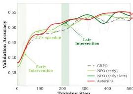
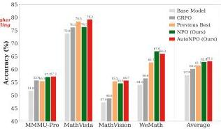
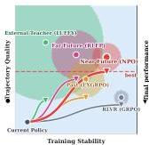
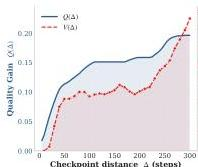
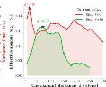
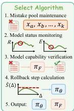
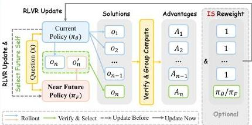
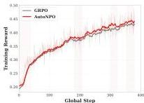
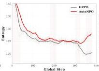
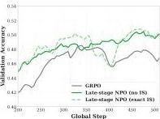

#

JINGDONG

# Near-Future Policy Optimization

Chuanyu Qin $^{1,2,*}$ , Chenxu Yang $^{1,2,*}$ , Qingyi Si $^{3,*}$

Naibin Gu $^{1,2}$ , Dingyu Yao $^{1,2}$ , Zheng Lin $^{1,2}$ , Peng Fu $^{1,2,\dagger}$ , Nan Duan $^{3}$ , Jiaqi Wang $^{3}$

$^{1}$ Institute of Information Engineering, CAS,  $^{2}$ School of Cyber Security, UCAS,  $^{3}$ JD.COM

*Equal contribution., †Corresponding author.

# Abstract

Reinforcement learning with verifiable rewards (RLVR) has become a core post-training recipe. Introducing suitable off-policy trajectories into on-policy exploration accelerates RLVR convergence and raises the performance ceiling, yet finding a source of such trajectories remains the key challenge. Existing mixed-policy methods either import trajectories from external teachers (high-quality but distributionally far) or replay past training trajectories (close but capped in quality), and neither simultaneously satisfies the strong enough (higher  $Q$ , more new knowledge to learn) and close enough (lower  $V$ , more readily absorbed) conditions required to maximize the effective learning signal  $S = Q / V$ . We propose Near-Future Policy Optimization (NPO), a simple mixed-policy scheme that learns from a policy's own near-future self: a later checkpoint from the same training run is a natural source of auxiliary trajectories that is both stronger than the current policy and closer than any external source, directly balancing trajectory quality against variance cost. We validate NPO through two manual interventions, early-stage bootstrapping and late-stage plateau breakthrough, and further propose AutoNPO, an adaptive variant that automatically triggers interventions from online training signals and selects the guide checkpoint that maximizes  $S$ . On Qwen3-VL-8B-Instruct with GRPO, NPO improves average performance from 57.88 to 62.84, and AutoNPO pushes it to 63.15, raising the final performance ceiling while accelerating convergence.

(a) Validation accuracy during training

(b) Performance comparison on reasoning tasks.
Figure 1 (a) Training dynamics: NPO's early-stage intervention accelerates convergence by  $\sim 2.1\times$ , while the late-stage intervention pushes beyond the vanilla GRPO plateau to a higher ceiling. AutoNPO unifies both interventions by triggering them automatically from online training signals. (b) Benchmark performance: NPO and AutoNPO consistently outperform GRPO and the best existing baseline across representative reasoning benchmarks.

---

1 Introduction

Reinforcement learning with verifiable rewards (RLVR) has become a core post-training recipe for reasoning models *[8, 20, 31]*, but pure on-policy exploration faces two structural limits: early training suffers from sparse correct trajectories, whereas later training often converges to a plateau after the rollout distribution narrows *[33, 36]*. A natural response is to enrich the learning signal by mixing in auxiliary trajectories from other sources, moving from pure on-policy updates to a mixed-policy regime. Recent work has explored this direction along two lines: importing stronger traces from outside the current policy through off-policy demonstrations *[25]*, expert prefixes *[9]*, or interleaved supervised corrections *[5, 16]*; or reusing successful trajectories produced during training itself, as in experience replay and restart-style methods *[35, 36]*. Yet both lines face a common tension. External trajectories carry rich signal but diverge in reasoning patterns from the current policy, making them difficult to internalize. Replayed trajectories stay close to the on-policy distribution and are readily learnable, but their quality is bounded by earlier checkpoints and may not support gains beyond the current policy. The key question is therefore how to find trajectories that are both *strong enough* to teach the current policy something new and *close enough* for it to actually learn from.

We formalize this tension as a trade-off between two quantities associated with any off-policy trajectory source. The first is signal quality $Q$: among prompts on which the current policy fails, the fraction for which the source can produce a verified-correct trajectory. The second is variance cost $V$: the gradient variance that arises when trajectories drawn from a different policy are incorporated through importance weighting $\pi_{\theta}/\pi_{\text{off-policy}}$. The effective learning signal is $\mathcal{S}=Q/V$: a source helps only when its signal quality is not overwhelmed by the variance it induces. As visualized in Figure 2(a), existing methods each occupy a suboptimal corner of this trade-off. When the auxiliary source is an external teacher *[25]* or a fully trained model (far-future policy) *[36]*, its trajectories have high $Q$, but the large variance $V$ they induce destabilizes training and cancels out most of the quality gain. Experience replay *[35]* initially keeps $V$ moderate, but $V$ drifts upward as stored trajectories grow stale, and $Q$ remains modest since it is inherently capped by the earlier checkpoints. Pure on-policy RLVR avoids variance but offers no $Q$ beyond what the current policy produces. None of them provides a tunable handle for optimizing $\mathcal{S}$.

Intuitively, the optimization process itself continuously produces such off-policy trajectory candidates: every later checkpoint along the same training run is a more optimized version of the current policy. As the step distance $\Delta$ grows, $Q$ increases (more optimization) but so does $V$ (more parameter drift), making $\Delta$ a natural dial for the $Q$–$V$ trade-off. A *near-future* checkpoint occupies the high-$\mathcal{S}$ region: far enough ahead to offer a meaningful $Q$ gain, yet close enough to keep $V$ small. This motivates Near-Future Policy Optimization (NPO), a simple mixed-policy scheme that guides the current policy using verified trajectories from a near-future checkpoint on the same training run. For each prompt, NPO replaces one slot of the rollout group with a correct trajectory that the future checkpoint actively re-generates, while the remaining slots retain original rollouts, leaving the underlying RL objective untouched. Because the guide is picked from the same training run, $\Delta$ becomes a freely chosen hyperparameter rather than a quantity that drifts passively with training.

We first validate NPO through two manual interventions at different training stages, treating them as probes of when near-future guidance helps. The first targets early training, using a slightly-ahead checkpoint from a short scout run to accelerate convergence. The second targets the late-stage plateau, using a stronger checkpoint obtained by continuing the same run past the plateau to break through the on-policy ceiling. As illustrated in Figure 1(a), both interventions produce clear gains over pure on-policy RLVR, showing that near-future guidance is useful across training stages. Building on this finding, we propose AutoNPO, which automates intervention timing: it monitors training signals such as reward stagnation and entropy decline, selects the guide checkpoint that maximizes an empirical estimate of $\mathcal{S}(\Delta)$, and injects future-self guidance online, capturing the benefits of both manual interventions within a single adaptive framework.

Our contributions are as follows.

1. We propose NPO, which improves RLVR by letting the current policy learn from near-future policy trajectories. We show that $\mathcal{S}(\Delta)=Q(\Delta)/V(\Delta)$ admits a unique optimum in checkpoint distance, at which NPO attains the best balance between signal quality and variance cost.

---

(a) Quality-Proximity Trade-off

(b)  $Q(\Delta)$  vs.  $V(\Delta)$  Decomposition

(c) Effective Learning Signal  $S(\Delta)$
Figure 2 Quality-stability trade-off and the effective learning signal  $S(\Delta)$ . (a) For each source, the dot marks its position on these two axes, the surrounding shaded disk visualizes the magnitude of its variance cost  $V$  (larger disk, larger  $V$ ), and the triangle marks the portion of the trajectory quality that is effectively usable under the variance cost it induces. NPO targets the high-  $S$  region in the upper-right of the plane. (b)  $Q(\Delta)$  (blue) and  $V(\Delta)$  (red) measured on a vanilla GRPO run with Qwen3-VL-8B-Instruct:  $Q$  rises concavely while  $V$  grows exponentially. (c) The ratio  $S(\Delta)$  exhibits a clear interior maximum for both anchors  $T = 0$  and  $T = 50$ , confirming the predicted U-shape.

2. NPO is plug-and-play and objective-preserving. Both theoretically and empirically, NPO dominates existing mix-policy baselines such as far-future, past, and external-teacher trajectories.
3. We validate NPO through two manual interventions and an adaptive variant AutoNPO, demonstrating two distinct gains: faster convergence in the early stage and a higher performance ceiling in the late stage. On Qwen3-VL-8B with GRPO, NPO improves average multi-modal performance from 57.88 to 62.84 (+4.96), and AutoNPO further pushes it to 63.15 (+5.27).

# 2 Motivation: The Quality--Variance Trade-off

Pure on-policy RLVR is limited by the boundary of the current policy's own exploration: correct trajectories are sparse early in training, and rollout diversity collapses late, so pass@1 improvements come mainly from redistribution within the base model's existing solution space rather than genuine capability expansion [33]. An ideal auxiliary trajectory source should therefore be strong enough to yield correct trajectories that the current policy cannot reliably discover, and close enough in distribution to keep off-policy updates stable. These two requirements are in tension, and to make the tension precise we formalize the effective learning signal that any off-policy source contributes.

Consider an off-policy guidance source whose checkpoint is  $\Delta$  optimization steps ahead of the current policy. Its contribution to learning is governed by two competing quantities. The first is signal quality  $Q(\Delta)$ : among prompts on which the current policy fails, the fraction for which the source can produce a verified-correct trajectory;  $Q$  grows with  $\Delta$  because a checkpoint further along the optimization path is stronger. The second is variance cost  $V(\Delta)$ : the gradient variance that arises when trajectories drawn from a different policy are incorporated through importance weighting. As  $\Delta$  grows,  $V$  rises approximately exponentially; we derive this upper bound formally in Appendix B and verify it empirically in Figure 2(b). The effective learning signal is then defined as:

$$
\mathcal {S} (\Delta) = \frac {Q (\Delta)}{V (\Delta)}. \tag {1}
$$

Since  $Q$  saturates with further training while  $V$  grows near-exponentially, their ratio first rises and then falls, admitting a unique interior optimum  $\Delta^{*}$  that maximizes  $S$ . Below this optimum the guide is too similar to the current policy to provide new information; above it, the variance cost overwhelms the marginal gain in quality. The full formal treatment, including the variance upper bound and importance-weight analysis, is deferred to Appendix B.

Figure 2(a) places representative trajectory sources in this plane and reveals the same pattern: each existing approach sits at a suboptimal corner of the  $Q - V$  trade-off. External teachers (e.g., LUFFY) have their dot

---

high on the $Q$ axis, but their large variance disk reflects a distributional gap so wide that the policy cannot absorb the signal, leaving the effective learning signal $S$ far smaller than the high $Q$ would suggest. Far-future replay methods (e.g., RLEP), which guide training with trajectories from a fully trained model, exhibit the same pattern: strong dot but large disk, and therefore a triangle well below the dot. Past-trajectory replay (e.g., ExGRPO) keeps its disk moderate, but its dot is itself lower, since trajectory quality is capped by earlier checkpoints. Pure on-policy RLVR (GRPO) stays on the right of the plane with a small disk, yet both its dot and its triangle are low, since the current policy cannot go beyond its own exploration frontier. A later checkpoint on the $same$ optimization run naturally escapes above failure modes. Because it shares initialization, architecture, and optimization history with the current policy and differs only by a bounded number of gradient steps, its parameter distance from the current policy stays small and controllable, which keeps $V(\Delta)$ low (see Appendix B for the formal bound). At the same time, further optimization makes $Q(\Delta)$ exceed both the current policy and any historical checkpoint at equal parameter distance. The near-future source therefore places both its dot and its triangle in the upper-right region where $Q$ is high and $V$ is small, realizing the effective learning signal $\mathcal{S}$ rather than dissipating it.

We empirically measure $Q(\Delta)$, $V(\Delta)$, and their ratio $\mathcal{S}(\Delta)$ on a vanilla GRPO run with Qwen3-VL-8B-Instruct (Figure 2(b,c); estimation details in Appendix). Figure 2(b) shows the decomposition: $Q(\Delta)$ rises quickly at small $\Delta$ and then flattens once the checkpoint has absorbed most of the near-term capability gains, while $V(\Delta)$ grows sharply and accelerates with $\Delta$, consistent with its predicted exponential form. Figure 2(c) shows the resulting $\mathcal{S}(\Delta)$ for two choices of current policy. From the base policy ($T$=0), $\mathcal{S}$ peaks at $\Delta^{\star}\approx 20$ steps; from a mid-training policy ($T$=50), the optimum shifts to $\Delta^{\star}\approx 70$ steps. In both cases $\mathcal{S}$ exhibits the predicted U-shape with a clear interior maximum, confirming that the best guide is neither too close (small $Q$) nor too far (explosive $V$). These observations directly motivate Near-future Policy Optimization, which realizes the high-$\mathcal{S}$ region through trajectories from a near-future checkpoint.

## 3 Near-Future Policy Optimization

NPO follows a simple idea: for a prompt that the current policy struggles with, the most useful auxiliary trajectory may come from a near-future checkpoint of the same training run. Rather than designing intricate rewards, NPO modifies only the source of one trajectory inside each rollout group.

### 3.1 Core Operation

Let $\{\pi^{(t)}\}_{t=0}^{T}$ denote the checkpoints produced over the course of a single RLVR run, and consider training step $t$ with current policy $\pi^{(t)}$. NPO continues training $\Delta$ steps to obtain a near-future checkpoint $\pi^{(t+\Delta)}$ from the same run, then rolls back to step $t$ and uses $\pi^{(t+\Delta)}$ to guide the current policy’s update. The rest of the training loop is left unchanged compared to vanilla RLVR, and NPO modifies only how the rollout group at step $t$ is formed.

Before the NPO segment begins, we use $\pi^{(t+\Delta)}$ to roll out each prompt $x$ offline, run the verifier, and keep one correct trajectory per prompt (with optional length or entropy filtering) as the guidance trajectory $o_{x}^{\prime}$. Prompts on which $\pi^{(t+\Delta)}$ fails to produce any correct trajectory are dropped from the guidance set. This cache is computed once and reused throughout the NPO segment, which spans roughly 40 training steps in our main experiments (Figure 1(a)), so the segment itself incurs no extra rollout cost from $\pi^{(t+\Delta)}$.

At step $t$, for a prompt $x$ the current policy samples a full on-policy group of $n$ trajectories,

$o_{i}\sim\pi^{(t)}(\cdot\mid x),\qquad i=1,\ldots,n,$ (2)

and we compute the on-policy pass-rate $\hat{p}(x)=\frac{1}{n}\sum_{i=1}^{n}r(x,o_{i})$. The cached guidance trajectory is injected only when the current policy is struggling on $x$: if $\hat{p}(x)\leq\tau_{\text{gate}}$ and $o_{x}^{\prime}$ exists in the cache, we replace the $n$-th slot by $o_{x}^{\prime}$; otherwise the on-policy group is used unchanged. Writing the chosen trajectory in the $n$-th slot as $\tilde{o}_{n}$, the resulting group is

\[ \mathcal{G}_{\text{NPO}}(x)=\{o_{1},\ldots,o_{n-1},\tilde{o}_{n}\},\qquad\tilde{o}_{n}=\begin{cases}o_{x}^{\prime}&\text{if }\hat{p}(x)\leq\tau_{\text{gate}}\text{ and }o_{x}^{\prime}\text{ exists},\\
o_{n}&\text{otherwise}.\end{cases} \] (3)

###

---

Group-relative advantages are then computed over $\mathcal{G}_{\text{NPO}}(x)$ as $A_{i}=(r_{i}-\text{mean}(\{r_{j}\}_{j=1}^{n}))/\text{std}(\{r_{j}\}_{j=1}^{n})$, and the clipped objective is:

$\mathcal{L}_{\text{NPO}}(\theta)=\mathbb{E}_{x,\mathcal{G}_{\text{NPO}}(x)}\left[\frac{1}{n}\sum_{i=1}^{n}\frac{1}{|o_{i}|}\sum_{t=1}^{|o_{i}|}\min\left(\rho_{i,t}^{q}(\theta)A_{i},\;\text{clip}\big{(}\rho_{i,t}^{q}(\theta),1-\epsilon,1+\epsilon\big{)}A_{i}\right)\right],$ (4)

with

$\rho_{i,t}^{q}(\theta)=\frac{\pi_{\theta}(o_{i,t}\mid x,o_{i,<t})}{q_{i}(o_{i,t}\mid x,o_{i,<t})},$ (5)

where $\pi_{\theta}$ denotes the policy currently being optimized (initialized from $\pi^{(t)}$ at the start of the segment) and the behavior policy $q_{i}$ is $\pi^{(t)}$ for all on-policy slots and $\pi^{(t+\Delta)}$ only for the guidance slot when $\tilde{o}_{n}=o_{x}^{\prime}$. For simplicity we ignore the minor drift between $\pi_{\theta}$ and $\pi^{(t)}$ accumulated between rollout collection and gradient updates, so the importance sampling (IS) correction is non-trivial only for the guidance slot. In practice this IS correction is optional: as $\pi^{(t+\Delta)}$ is a near-future checkpoint of the current policy, the ratio $\pi_{\theta}/\pi^{(t+\Delta)}$ stays close to one, and our ablation in Section 4.4 shows that treating $o_{x}^{\prime}$ as on-policy (i.e., setting $q_{i}=\pi^{(t)}$ uniformly) yields nearly identical performance. This is a direct consequence of the low-variance property that motivates NPO in the first place. Compared with the standard RLVR objective, the only change is that, on prompts the current policy struggles with, the $n$-th rollout is optionally replaced by a verified-correct sample from $\pi^{(t+\Delta)}$; the clipped objective, the verifier, and the group-relative advantage are all unchanged.

### 3.2 Two Manual Interventions

We first validate NPO through two manual interventions at different training stages, treating them as probes of *when* near-future guidance helps. Both share the mechanism described above and differ only in how $\pi^{(t+\Delta)}$ is obtained and which training window is replayed.

#### Early-Stage Bootstrapping.

In the first few training steps, most rollout groups contain no correct trajectory and the gradient signal collapses. The early intervention targets this cold-start regime: we train the base model for a short scout segment and take its final checkpoint as $\pi^{(t+\Delta)}$. We then restart training from the same base weights and use the scout checkpoint to supply guidance trajectories during the initial window. Because the scout is only slightly ahead, its trajectories remain close to the restarting policy while still solving prompts the fresh run cannot yet solve on its own, accelerating convergence past the sparse-reward regime, as shown in Figure 1(a).

#### Late-Stage Plateau Breakthrough.

Later in training the learning curve flattens and group accuracy stops improving on a stable set of prompts. The late intervention targets this plateau: we continue the run past the plateau, take a stronger checkpoint observed shortly after as $\pi^{(t+\Delta)}$, and replay the plateaued segment with guidance from that checkpoint on the same prompts. The stronger guide produces verified-correct trajectories on prompts that the plateaued policy cannot solve, breaking through the on-policy ceiling and lifting the run to a higher final performance.

#### Takeaway.

As shown in Section 4.2, both interventions produce clear gains over pure on-policy RLVR without changing the reward, the verifier, or the underlying optimizer. Together they demonstrate that near-future guidance is useful across training stages rather than confined to a single regime, motivating the adaptive controller described next.

### 3.3 AutoNPO: Adaptive Intervention

The two manual interventions in Section 3.2 rely on the user inspecting training curves to choose both an intervention point and a rollback distance. These choices are brittle across domains and datasets, and scale poorly to longer runs or multiple tasks. AutoNPO replaces them with an online controller built from signals already logged during standard RLVR training.

---

Figure 3 Overview of NPO and AutoNPO. Right: NPO mechanism (§3.1): a near-future policy $\pi_F$ supplies a verified guidance trajectory $o_x'$ for each prompt, which replaces one slot of the on-policy rollout group whenever the current policy $\pi_\theta$ is struggling on $x$. Left: AutoNPO (§3.3): online signals (reward stagnation, entropy drop, a mistake pool, a capability probe, and an estimated effective signal $S$) jointly decide when to intervene and how far to roll back.

Core idea. At any training step $t$, the current policy $\pi^{(t)}$ is a future-self of every earlier checkpoint $\pi^{(t - \Delta)}$ on the same run. If $\pi^{(t)}$ can now solve prompts on which some earlier $\pi^{(t - \Delta)}$ failed, it is qualified to serve as an NPO guide for the segment starting at $t - \Delta$. This observation turns the two manual choices into two automatable questions: (i) when should we intervene? and (ii) how far back should we roll? AutoNPO answers the first by monitoring exploration-collapse signals from existing training logs, and the second by picking the $\Delta$ that maximizes an empirical estimate of the effective learning signal $\hat{S}(\Delta) = \hat{Q}(\Delta) / \hat{V}(\Delta)$ from Section 2. Both decisions reuse quantities the controller already has at hand, so the adaptation adds no substantial overhead.

Mistake pool. AutoNPO maintains a lightweight mistake pool $\mathcal{B}$: each prompt whose group accuracy in the latest batch falls below a small threshold is added to $\mathcal{B}$ together with the step $t_{\mathrm{fail}}$ at which it was failed. Only two identifiers per entry are stored, so the overhead is negligible. The pool serves three roles, one for each stage of the controller pipeline. For the Trigger stage, $\mathcal{B}$ supplies the subset on which $\pi^{(t)}$ is probed. For the Rollback stage, $\mathcal{B}$ provides the evaluation set on which $\hat{S}(\Delta)$ is estimated. For the Execution stage, the slice $\mathcal{B}_{\Delta^*}$ directly defines the prompt set on which guidance trajectories are prepared and injected during replay.

Trigger. The controller uses a coarse-to-fine, two-stage check. The warning stage is zero-cost and fires when the Exponential Moving Average(EMA) of training reward stagnates while policy entropy keeps dropping in the same window. Both signals come from existing training logs, and their joint pattern is the characteristic signature of exploration collapse. Once warning has persisted for several probe intervals, the confirmation stage fires: $\pi^{(t)}$ is rolled out once on a small subset of $\mathcal{B}$. The rollout returns a pass-rate $\hat{p}$ that gates the final decision; the same rollout also provides the $\hat{Q}(\Delta)$ used below.

Rollback distance. If confirmation stage, AutoNPO picks the rollback distance that maximizes the empirical effective signal:

$$
\Delta^ {*} = \arg \max  _ {\Delta \in \mathcal {D}} \frac {\hat {Q} (\Delta)}{\hat {V} (\Delta)}, \tag {6}
$$

where $\mathcal{D}$ ranges over the set of saved checkpoints; $\hat{Q} (\Delta) = \mathrm{pass - rate}\bigl (\pi^{(t)};\mathcal{B}_{\Delta}\bigr)$ is evaluated on $\mathcal{B}_{\Delta}$, the slice of the pool failed during the segment starting at $t - \Delta$ (the segment that a rollback to $\Delta$ would actually replay); and $\hat{V} (\Delta)$ is a variance proxy estimated from the per-token KL between $\pi^{(t)}$ and $\pi^{(t - \Delta)}$, following the exponential form derived in Appendix B. All $\hat{Q} (\Delta)$ values are read off the single confirmation rollout, so the search adds no extra inference.

---

#### Execution.

Once $\Delta^{\star}$ is chosen, AutoNPO applies the Section 3.1 offline cache procedure with $\pi^{(t)}$ as the guide, but restricts it to prompts in $\mathcal{B}_{\Delta^{\star}}$ rather than the full segment: $\pi^{(t)}$ is rolled out on every $x\in\mathcal{B}_{\Delta^{\star}}$, outputs are verified, and one correct trajectory per prompt is cached. Training then rolls back to checkpoint $t-\Delta^{\star}$ and resumes with the NPO mechanism applied to that segment; during replay, the cached substitution fires whenever a sampled prompt lies in $\mathcal{B}_{\Delta^{\star}}$, and other prompts follow pure on-policy rollouts. Unlike the manual interventions in Section 3.2, which cache guidance for every prompt in the segment and gate substitution online via $\hat{p}(x)\leq\tau_{\text{gate}}$, AutoNPO restricts both cache generation and substitution to $\mathcal{B}_{\Delta^{\star}}$, which avoids cache cost on easy prompts. Once the run catches back up to step $t$, the controller enters a short cooldown before arming again. Algorithm 1 gives the full procedure.

## 4 Experiments

### 4.1 Experimental Setup

Training Data and Benchmarks. We train on MMFineReason-123K *[12]*, a challenging subset derived from the MMFineReason-1.8M corpus via difficulty-based filtering: each training sample is rolled out four times with Qwen3-VL-4B-Thinking *[2]*, and only those on which the model fails every attempt are kept. This conservative criterion discards trivial examples and concentrates the training signal on problems where improvement is still possible, which also aligns with the regime where NPO is designed to help. For evaluation, we use eight multimodal reasoning benchmarks that together cover visually grounded mathematics, broad subject knowledge, and fine-grained visual understanding. MathVista *[15]*, MathVision *[24]*, WeMath *[17]*, and MathVerse *[37]* target mathematical reasoning in visual contexts, ranging from general problem solving to competition-level diagrams and structured difficulty tiers. MMMU-Pro *[32]* and MMBench *[13]* probe broad multi-discipline knowledge and general multimodal competence. MM-Star *[3]* stresses fine-grained visual discrimination, and ZeroBench *[19]* serves as a particularly hard stress test, designed to remain unsolvable for current frontier models and therefore useful for probing the tail of the reasoning distribution. We report accuracy (%) on each benchmark and use the unweighted mean *Avg.* as the overall metric.

Models and Baselines. All experiments use Qwen3-VL-8B-Instruct *[2]* as the base policy, and every RL method is implemented on the same GRPO-style group-based RLVR backbone so that differences in performance reflect the choice of trajectory source. We compare NPO against four baselines that populate different regions of the quality–proximity spectrum discussed in Section 2: GRPO *[20]*, the pure on-policy reference; LUFFY *[25]*, which imports trajectories from a stronger external teacher and represents the high-quality but high-shift regime; ExGRPO *[35]*, which reuses successful trajectories from historical replay buffers; and RLEP *[36]*, which replays trajectories from a far-future model. We additionally report the Base LLM without post-training as a reference point for the overall gains.

Implementation Details. Our implementation is built on the EasyVideoR1 *[18]* framework. The maximum context length is 8192 tokens, split into a prompt budget of 4096 and a response budget of 4096, applied consistently at training and evaluation time. We train with a learning rate of $1\times 10^{-6}$ and a batch size of 256, and for each prompt sample $n=8$ rollouts at temperature 1.0. Clipping thresholds are set to $\epsilon_{\text{low}}=0.2$ and $\epsilon_{\text{high}}=0.28$, and we omit both the KL penalty and entropy regularization from the objective. For all NPO variants, a future-self trajectory is injected only when the on-policy group accuracy on that prompt falls at or below mix_policy_accuracy_threshold = 0.6, leaving confident groups untouched. All experiments are run on 4 compute nodes, each with 8 NVIDIA H200 140GB GPUs.

### 4.2 Main Results

Table 1 presents the evaluation results across eight multimodal reasoning benchmarks.

The quality-variance trade-off (in Sec. 2) are empirically validated. LUFFY, despite pulling from the strongest trajectory source, is the weakest RL-trained model and even regresses below the base on WeMath, a concrete instance of variance cost overwhelming signal quality. Replay-based methods (ExGRPO, RLEP) recover some of that gap but plateau clearly below NPO, consistent with a $Q$ bounded by the checkpoints that produced their replayed trajectories.

---

Table 1 Multi-modal reasoning results on Qwen3-VL-8B. The blue rows are our NPO variants. Bold indicates the best result in each column. Avg. is the unweighted mean over the eight benchmarks.

<table><tr><td>Method</td><td>MMMU-Pro</td><td>MathVista</td><td>MathVision</td><td>ZeroBench</td><td>WeMath</td><td>MMBench</td><td>MM-Star</td><td>MathVerse</td><td>Avg.</td></tr><tr><td>Qwen3-VL-8B-Instruct</td><td>51.75</td><td>73.80</td><td>47.37</td><td>19.76</td><td>54.10</td><td>89.79</td><td>71.83</td><td>54.61</td><td>57.88</td></tr><tr><td>LUFFY (external teacher)</td><td>54.23</td><td>73.80</td><td>54.00</td><td>20.51</td><td>52.38</td><td>89.49</td><td>69.47</td><td>55.58</td><td>58.68</td></tr><tr><td>GRPO (pure on-policy)</td><td>55.78</td><td>76.20</td><td>48.82</td><td>22.60</td><td>56.57</td><td>90.29</td><td>72.20</td><td>59.52</td><td>60.25</td></tr><tr><td>ExGRPO (historical replay)</td><td>55.49</td><td>77.30</td><td>55.46</td><td>19.01</td><td>62.67</td><td>90.44</td><td>72.00</td><td>56.89</td><td>61.16</td></tr><tr><td>RLEP (far future)</td><td>55.38</td><td>78.50</td><td>54.23</td><td>19.61</td><td>62.48</td><td>90.45</td><td>72.27</td><td>58.91</td><td>61.48</td></tr><tr><td>NPO, early-stage only (Ours)</td><td>56.85</td><td>76.60</td><td>54.31</td><td>26.35</td><td>62.76</td><td>90.41</td><td>70.30</td><td>59.38</td><td>62.12</td></tr><tr><td>NPO, early + late-stage (Ours)</td><td>57.07</td><td>76.30</td><td>54.61</td><td>24.85</td><td>66.95</td><td>90.30</td><td>72.20</td><td>60.00</td><td>62.84</td></tr><tr><td>AutoNPO (Ours)</td><td>57.24</td><td>79.20</td><td>55.72</td><td>24.70</td><td>66.00</td><td>90.63</td><td>72.63</td><td>59.11</td><td>63.15</td></tr></table>

Manual NPO improves broadly across benchmarks, and AutoNPO further matches or exceeds manually scheduled interventions. The early-stage-only NPO already surpasses every baseline on average and leads on ZeroBench, where correct trajectories are scarce and a warm guide matters most; adding the late-stage intervention on top yields the largest further gains on WeMath and MathVerse, where reasoning depth dominates and breaking through the on-policy plateau is most valuable. Building on this, AutoNPO reaches the best overall score, improving by  $+2.90$  over GRPO and  $+1.67$  over RLEP, and holds the top score on five of the eight tasks while staying competitive on the rest, indicating that online plateau detection and  $\hat{S}(\Delta)$ -driven rollback can identify intervention moments at least as informative as those chosen by hand.

# 4.3 Training Dynamics

Figure 4 shows that AutoNPO changes training dynamics in a targeted rather than uniformly aggressive way. The three panels tell a coherent story across optimization speed, exploration, and late-stage performance ceiling. Panel (a) compares training reward directly. AutoNPO rises more quickly at the beginning of training and then stays above GRPO through the rest of optimization. The first highlighted window corresponds to the early-stage guidance phase, which lifts the run onto a stronger trajectory, while the later retrospective windows produce additional step-wise gains rather than a diffuse, gradual shift. This indicates that AutoNPO improves optimization through a small number of well-timed interventions that accumulate over time. Panel (b) explains the mechanism behind this advantage. Pure GRPO undergoes a steady entropy collapse, the classic signature of a policy that has narrowed to a limited set of reasoning templates. AutoNPO instead maintains a higher-entropy policy throughout training, and after the highlighted intervention windows its entropy stops decaying and re-expands. This reopened exploration helps the policy avoid premature collapse of the rollout distribution, which in turn supports the higher late-stage validation plateau seen in panel (c).

(a) Training reward dynamics.

(b) Re-expanded entropy.
Figure 4 Training dynamics of (Auto)NPO compared with vanilla GRPO. Red shaded regions in panels (a) and (b) highlight AutoNPO's intervention windows. (a) Training reward dynamics: AutoNPO stays above GRPO throughout, with the gap widening step-wise after each intervention window. (b) Generation entropy: GRPO undergoes a steady entropy collapse, while AutoNPO's interventions actively re-expand exploration and preserve a substantially higher-entropy policy. (c) IS-correction ablation on the late-stage intervention: the two NPO variants with and without exact importance-sampling correction both clearly outperform GRPO, indicating that IS correction is marginal for NPO. Thick lines are smoothed curves; thin lines show raw logged values.

(c) IS correction is marginal.

---

4.4 Ablation on Importance-Sampling Correction

The near-policy property of NPO suggests that exact IS correction may be unnecessary in practice, because the future checkpoint is already close to the current policy and guidance is further gated by the on-policy pass-rate threshold. Figure 4 (c) tests this hypothesis on the late-stage intervention, where the compared methods share the same task window and are most directly comparable. Within the common step 200–510 interval, both NPO variants stay clearly above vanilla GRPO and are nearly indistinguishable from each other, confirming that exact IS correction is unnecessary in practice and can be safely dropped without sacrificing the gain. Dropping IS further saves memory and compute, since the guide’s per-token log-probabilities no longer need to be stored or recomputed. Crucially, this simplification is specific to NPO: for mix-policy baselines such as LUFFY, removing IS causes training to collapse, because their guides are distributionally far from the current policy. In NPO, the near-policy property of the guide makes it safe to omit.

## 5 Related Work

### 5.1 Mixed-Policy RLVR

RLVR has become the dominant post-training recipe for reasoning models *[8, 20, 31]*, and while GRPO variants such as DAPO, GSPO, and SAPO improve the on-policy optimization *[4, 6, 20, 26, 27, 28, 30, 31, 39]*, a growing line of work shows that the choice of trajectory source matters just as much. One category imports stronger supervision from outside the current policy: LUFFY mixes external teacher traces into training *[25]*, Prefix-RFT injects expert prefixes *[9]*, and ReLIFT, SRFT, and TRAPO interleave RL with targeted supervised updates *[5, 16, 23]*. These methods provide high-quality trajectories but introduce a large distributional gap. The other category reuses successful trajectories from training itself: RePO and ExGRPO maintain replay buffers of historical successes *[11, 35]*, and RLEP restarts training with replayed experience from a stronger seed policy *[36]*. These stay closer to the current policy but are bounded by the quality of earlier checkpoints, and stored trajectories drift away from the evolving policy over time.

NPO is closest in spirit to the replay-based family, yet differs in a key way: instead of reusing past trajectories, it takes a later checkpoint on the same optimization path to actively regenerate verified-correct trajectories on the current prompts, yielding guidance that is stronger than historical replay while remaining much closer to the current policy than any external teacher.

### 5.2 Self-Distillation and Self-Taught

Self-distillation and self-Taught methods explore how a model can learn from a stronger version of itself. Context distillation showed that the same model can serve as both teacher and student when given privileged context *[22]*, ReST and STaR bootstrap reasoning traces from the model’s own successful generations *[7, 34]*, and recent on-policy distillation methods provide token-level guidance from an internal or external teacher on the student’s own rollout distribution *[1, 10, 14, 21, 38]*.

NPO shares the intuition that a model can benefit from a stronger self, but the source of that strength is different: rather than conditioning the same-step model on extra context or demonstrations, NPO uses optimization time as privileged information, guiding the current policy with verifier-filtered, prompt-aligned trajectories from a later checkpoint. It therefore operates at the sequence level inside standard RLVR rather than through an additional token-level distillation loss, bridging mixed-policy RLVR and self-taught approaches.

## 6 Conclusion and Future Work

This paper explores a central question: what kind of auxiliary learning signal yields the greatest benefit when introduced into RLVR? We propose a core idea—Near-future Policy Optimization (NPO)—where the model’s temporal future self guides its present self, thereby obtaining signals that are sufficiently strong (high $Q$ ) and readily learnable (low $V$). We demonstrate the superiority and generality of NPO both theoretically and empirically. We instantiate this idea by mixing near-future policy trajectories into the current rollout

---

group within a mixed-policy framework. We encourage follow-up work to explore alternative mechanisms for injecting learnable signals from the near-future self, such as On-Policy Distillation.

This paper is the second contribution in our research program on Self-Taught RLVR, a conceptual framework we propose to unify the study of how reasoning models can learn from themselves. We explore three complementary dimensions of self-guidance: our prior work *[29]* studies the informed self—a self augmented by privileged information that teaches the base self; the present work focuses on the temporal self—a near-future self teaching its past self; and our upcoming work will introduce the parallel self. While each paper is self-contained, they collectively instantiate the Self-Taught RLVR paradigm.
