# TCOD: Exploring Temporal Curriculum in On-Policy Distillation for Multi-turn Autonomous Agents

Jiaqi Wang Wenhao Zhang Weijie Shi Yaliang Li James Cheng Tongyi Lab Alibaba Group

###### Abstract

On-policy distillation (OPD) has shown strong potential for transferring reasoning ability from frontier or domain-specific models to smaller students. While effective on static single-turn tasks, its behavior in multi-turn agent settings remains underexplored. In this work, we identify a key limitation of vanilla OPD in such settings, which we term Trajectory-Level KL Instability. Specifically, we observe that KL divergence increases together with a drop in success rate, and even after convergence, the KL remains high, leading to unstable training. This instability arises from inter-turn error compounding: as errors accumulate, the student is driven beyond the teacher’s effective support, rendering the supervision signal unreliable. To address this, we propose TCOD (Temporal Curriculum On-Policy Distillation), a simple yet effective framework that controls the trajectory depth exposed to the student and progressively expands it from short to long with a curriculum schedule. Experimental results across four student–teacher pairs on three multi-turn agent benchmarks (ALFWorld, WebShop, ScienceWorld) show that TCOD mitigates KL escalation and enhances KL stability throughout training, improving agent performance by up to 18 points over vanilla OPD. Further evaluations show that TCOD can even surpass the teacher’s performance and generalize to tasks on which the teacher fails.

## 1 Introduction

On-policy distillation has recently emerged as a primary paradigm for transferring complex reasoning capabilities from frontier models to their smaller counterparts *(Agarwal et al., 2024; Lu and Lab, 2025)*. These methods have demonstrated remarkable success in mathematical or question answering tasks by minimizing token-level KL divergence over student-generated rollouts *(Jang et al., 2026; Ko et al., 2026; Jin et al., 2026)*. However, these approaches are inherently designed for static, single-turn reasoning. Consequently, they leave the more challenging multi-turn agent setting underexplored, where the model must continuously reason and act based on a growing history of sequential interactions. It remains a critical open question whether the stability of vanilla OPD can safely generalize to such dynamic, long-horizon environments.

In this work, we present empirical evidence that naively applying vanilla OPD in this multi-turn regime leads to a fundamental failure mode, which we term Trajectory-Level KL Instability. Through experiments on ALFWorld *(Shridhar et al., 2020)*, we find that (i) the student models suffer from simultaneous KL escalation and success rate collapse, and (ii) although they eventually converge, they begin with prohibitively high KL divergence, both of which induce training instability. Crucially, as shown in Figure 1(left), we reveal the underlying mechanism: Compounding errors across turns progressively push the student into states outside the teacher’s effective support. As a result, the teacher assigns lower probabilities to tokens in student-generated responses, indicating increasing KL divergence at each turn and rendering its supervision signal unreliable.

---

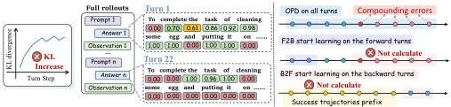
Figure 1: (left) In OPD for multi-turn agents, as the number of turns increases, the teacher assigns progressively lower probabilities to tokens in student-generated responses, indicating increasing KL divergence at each turn, rendering the supervision signal unreliable. (right) OPD uses all turns and thus includes compounding errors, whereas TCOD-F2B/B2F progressively expands from short to long trajectories, alleviating calculating the error turns.

To address this, we propose TCOD (Temporal Curriculum On-Policy Distillation), a simple yet effective framework that controls the trajectory depth exposed to the student and progressively expands it from short to long via a pacing strategy governed by a configurable curriculum growth rate. Based on this core idea, as shown in Figure 1(right), we introduce two practical variants with only minimal code modifications: Forward-to-Backward (TCOD-F2B), which restricts the student to the early steps of the trajectory and progressively extends it to the maximum explore horizon; and Backward-to-Forward (TCOD-B2F), which leverages the teacher to navigate the agent to near-terminal states, alleviating error accumulation in the early steps, while gradually extending the student's rollout horizon backward to the initial stages.

Built on top of TCOD-F2B/B2F, we evaluate four student-teacher pairs on three multi-turn agent benchmarks: ALFWorld (Shridhar et al., 2020), WebShop (Yao et al., 2022a), and ScienceWorld (Wang et al., 2022). Overall, TCOD alleviates KL instability and improves performance by recovering Qwen3-1.7B from near-zero success rates and boosting the larger one (e.g., Qwen2.5-7B) by up to 15.71 success rate points while reducing action rounds by an average of 2.97 steps. Moreover, TCOD does not merely imitate the teacher—on the hard split of ALFWorld where the teacher fails under pass@10 sampling, TCOD-B2F surpasses the teacher's success rate by up to 14 points, demonstrating generalization beyond the teacher's own capability boundary. Finally, TCOD-F2B/B2F are robust to the curriculum growth rate with less than  $2\%$  performance variation, and reduce total training time by up to  $32\%$  compared to vanilla OPD.

# 2 Related Work

LLM-based Multi-turn Agents. Large language models have demonstrated strong capabilities as multi-turn agents (OpenAI et al., 2024; Yang et al., 2025). A common paradigm interleaves reasoning and action generation via frameworks such as ReAct (Yao et al., 2022b), enabling agents to solve tasks in embodied planning, web navigation, and other interactive environments (Shridhar et al., 2020; Yao et al., 2022a; Wang et al., 2022; Merrill et al., 2026; HKUDS, 2026; Li et al., 2026). Recent systems such as OpenClaw (Wang et al., 2026; Contributors, 2026) further demonstrate the potential of LLM-based agents for long-horizon tasks, motivating increasing interest in general-purpose agentic frameworks. Despite these advances, training multi-turn agents remains challenging due to long-horizon credit assignment (Guo et al., 2025), memory management (Shi et al., 2026), and the sample inefficiency of reinforcement learning in sparse-reward settings (Feng et al., 2025; Penaloza et al., 2026).

On-Policy Distillation and its Limitations. On-Policy Distillation (Agarwal et al., 2024; Lu &amp; Lab, 2025) has emerged as a compelling alternative to on-policy post-training by replacing sparse scalar rewards with dense distillation signals and thereby improving sample efficiency. Existing work has improved OPD through several design choices, including objective design (Jang et al., 2026; Jin et al., 2026), optimization heuristics (Ko et al., 2026), and alternative supervision sources (Ye et al., 2026; Zhao et al., 2026). These methods, such as balancing forward and backward KL terms (Jang et al., 2026; Jin et al., 2026) and incorpo

---

rating RL-style heuristics such as reward clipping *(Ko et al., 2026)*, improve training stability and convergence. However, these approaches are primarily designed for single-turn settings and do not directly address multi-turn agent environments.

Curriculum Learning. Curriculum learning *(Bengio et al., 2009)* is a training strategy where a model is exposed to progressively more difficult examples as its competence grows. Recent works *(Zhang et al., 2026; Wang et al., 2025b)* apply this to the pre-training and post-training of LLMs, respectively. *Shi et al. (2025); Wang and Ammanabrolu (2025); Gong et al. (2026)* further apply curriculum learning to reinforcement learning methods, such as GRPO *Guo et al. (2025)*, but still rely on an external model to measure difficulty. *Lauffer et al. (2025)* trains the student only on the expert’s subsequent corrective actions, breaking the on-policy setting. Our approach avoids both by defining difficulty through increasing trajectory depth, using only student-generated data, keeping training simple, on-policy, and more stable.

## 3 Preliminary

In this paper, we consider multi-turn autonomous agents interacting with an environment over a finite horizon. Let $t\in\{0,\ldots,T-1\}$ denote the turn index within a trajectory, where $T$ is the maximum number of interaction steps. At each turn $t$, the agent receives an observation $o_{t}$, generates a response $a_{t}$, and the environment returns the next observation $o_{t+1}$. Following the recent agent frameworks *(Wang et al., 2025a)*, each response $a_{t}$ consists of a chain-of-thought reasoning trace followed by an executable action.

History State for Multi-turn Agent. Since the environment is generally partially observable, we define the agent state as the full interaction history up to the current observation:

$h_{t}=(o_{0},a_{0},o_{1},a_{1},\ldots,o_{t-1},a_{t-1},o_{t}).$ (1)

A complete trajectory is then $\tau=(h_{0},a_{0},h_{1},a_{1},\ldots,h_{T-1},a_{T-1})$, which terminates either when a termination action is taken or when the horizon $T$ is reached.

On-Policy Distillation for Multi-turn Agent. Given a teacher policy $\pi_{\phi}$ and a student policy $\pi_{\theta}$, the goal of on-policy distillation is to align the student with the teacher under the student’s own state distribution. The objective is:

$\mathcal{L}_{\text{OPD}}(\theta)=\mathbb{E}_{\tau\sim\pi_{\theta}}\left[\sum_{t=0}^{T-1}\mathcal{D}_{\text{KL}}\big{(}\pi_{\phi}(a_{t}\mid h_{t})\parallel\pi_{\theta}(a_{t}\mid h_{t})\big{)}\right],$ (2)

where $\mathcal{D}_{\text{KL}}(\pi_{\phi}\parallel\pi_{\theta})=\sum_{a_{t}}\pi_{\phi}(a_{t}\mid h_{t})\log\frac{\pi_{\phi}(a_{t}|h_{t})}{\pi_{\theta}(a_{t}|h_{t})}$ is the KL divergence measuring the discrepancy between the teacher policy $\pi_{\phi}$ and the student policy $\pi_{\theta}$.

## 4 TCOD: Temporal Curriculum On-Policy Distillation

In this section, we observe a key limitation of OPD in multi-turn agent settings, termed trajectory-level KL instability. Through empirical analysis, we show that OPD exhibits instability in long-horizon interactions, where compounding errors lead to escalating KL divergence and degraded performance. Motivated by these findings, we propose TCOD, a temporal curriculum strategy that progressively controls trajectory depth during training to improve stability and effectiveness in multi-turn distillation.

### 4.1 Trajectory-Level KL Instability in Multi-Turn On-Policy Distillation

In this section, we conduct a pilot study on ALFWorld to examine the behavior of OPD in multi-turn settings. We systematically evaluate student–teacher pairs across the Qwen3 and Qwen2.5 model families, including both larger-scale and domain-adapted teachers. For Qwen3, we use Qwen3-30B-A3B-Instruct as the teacher and Qwen3-{0.6, 1.7, 4}B as students. For Qwen2.5, we adopt a GRPO-trained Qwen2.5-7B model as the teacher and Qwen2.5-{0.5, 1.5, 3, 7}B as students.

---

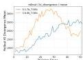
(a) Trajectory-level KL escalates during training.

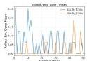
(b) Success rate collapses to zero as KL spikes.

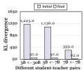
(c) Initial and final  $KL$  during OPD training.
Figure 2: Trajectory-level KL analysis across different teacher-student pairs on ALFWorld. (a)(b) show that the KL divergence escalates throughout training and task completion rates collapse. (c) shows the large gap between the initial and converged KL divergence during OPD training. (d) reveals the underlying reason: the KL divergence grows with the turn index, indicating compounding error amplification over the trajectory.

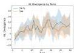
(d) Per-turn KL divergence increases as errors accumulate.

Observation 1: KL escalation and success rate collapse co-occur during training. Unlike prior work on single-turn settings such as mathematics or question answering, where the KL divergence consistently converges and decreases throughout training, we observe that the KL divergence escalates with the number of training steps in multi-turn agent scenarios. As shown in Figure 2a&amp;2b, when the student model (Qwen3-{0.6,1.7}B) is trained under vanilla OPD with a strong teacher (Qwen3-30B-A3B-Instruct), the trajectory-level KL divergence escalates rapidly, and the task success rate collapses to near-zero.

Observation 2: Although KL divergence converges, it suffers from a prohibitively high initial value. Moreover, we conduct experiments on different student models and observe that although their KL divergence eventually converges, they start with a prohibitively high value. As shown in Figure 2c, across different student-teacher pairs (Qwen3-3B distilled from Qwen3-30B-A3B-Instruct, and Qwen2.5-{3,7}B distilled from a GRPO-trained Qwen2.5-7B model), we consistently observe the initial KL divergence ( $\sim$  1000) is typically orders of magnitude larger than its converged value ( $\sim$  60), indicating severe instability during the training for multi-turn OPD. More details refer to Appendix B.

The underlying mechanism: Compounding error amplification over the trajectory. The above two observations motivated us to investigate why directly applying OPD to agents leads to such KL escalation and training instability. To this end, in Figure 2d, we visualize the per-turn KL divergence for Qwen2.5-3B distilled from a GRPO-trained Qwen2.5-7B and Qwen3-30B-A3B-Instruct, and observe a consistent increase with the turn index.

Regardless of whether the increasing KL divergence reflects the student's inability to imitate the teacher or is a consequence of the student entering out-of-distribution states where the teacher becomes uncertain, the underlying issue remains the same—error accumulation over turns. This is an inherent property of long-horizon multi-turn agents: student-generated actions and observations are appended to the history  $h_t$ , inducing causal coupling across turns and resulting in an increasing trend in KL divergence. For small students, this is catastrophic; for larger ones, it is partially tolerated but remains highly inefficient.

Remark 1. Note that Long-CoT increases the response length on the same environment state. However, multi-turn agents update the environment state at each interaction by incorporating new observations and actions, thereby amplifying compounding errors over the trajectory.

The above observations and analysis pose a challenge: how can we retain the benefits of OPD's dense signal while avoiding destabilization from accumulated errors in long-horizon interactions? To address this, we turn to curriculum learning, where the model is first trained on easy problems and progressively exposed to hard ones.

# 4.2 Our Proposal: Temporal Curriculum On-Policy Distillation

Building on the observations and insights from the previous section, we propose Temporal Curriculum On-Policy Distillation (TCOD), a principled approach that controls the trajectory depth of agent interactions during the training process. Specifically, we introduce two

---

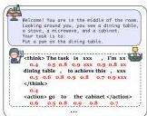

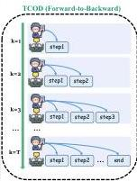
Figure 3: Overview of our method TCOD-F2B/B2F. Comparison of vanilla on-policy distillation and TCOD. Left is the OPD, middle is the illustration of TCOD-F2B, and right is TCOD-B2F.  $k$  is the linear pacing control the trajectory length. The blue step is executed by the student, and the red step is executed by the teacher with a stop gradient.

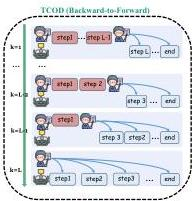

variants: TCOD-F2B and TCOD-B2F, which explicitly impose step constraints in forward and reverse curricula, respectively.

Forward-to-Backward Induced Temporal Curriculum On-Policy Distillation (TCOD-F2B). We implement a "shallow-to-deep" curriculum by restricting the maximum interaction steps of a trajectory during the training process. As shown in Figure 3(middle), in our TCOD-F2B, the student policy  $\pi_{\theta}$  rolls out for maximum  $k$  steps to finish the task, where  $k$  starts from a small number and progressively increases to a larger one, the objective is as follows:

$$
\mathcal {L} _ {T C O D - F 2 B} (\theta) = \mathbb {E} _ {\tau \sim \pi_ {\theta}} \left[ \sum_ {t = 0} ^ {k - 1} \mathcal {D} _ {K L} \left(\pi_ {\phi} \left(a _ {t} \mid h _ {t}\right) \| \pi_ {\theta} \left(a _ {t} \mid h _ {t}\right)\right) \right], \tag {3}
$$

where the student first focuses on early-turn learning signals and then progressively completes the task end-to-end, mitigating compounding errors and preventing horizon-induced KL collapse. However, determining the optimal step size and starting point is challenging, as different environments and models exhibit varying reasoning capabilities. To address this, we begin with linear pacing across the training step:

$$
k = k _ {\text {s t a r t}} + \left\lfloor n / \eta \right\rfloor , \quad n \in 1, \dots , N, \tag {4}
$$

where  $n$  represents the current training step and  $N$  is the total number of training steps,  $k_{\text{start}}$  defines the initial number of interaction steps and  $\eta$  controls the curriculum's growth rate. This approach requires only minor code changes. The whole algorithm is as follows:

Algorithm 1: Temporal Curriculum On-Policy Distillation: TCOD-F2B
1: Input: Student  $\pi_{\theta}$ , Teacher  $\pi_{\phi}$ , Environment  $\mathcal{E}$ , total steps  $N$ , curriculum parameters  $k_{\mathrm{start}}, \eta$
2: Output: Trained student policy  $\pi_{\theta}$
3: for  $n = 1, 2, \ldots, N$  do
4:  $k \gets \min(k_{\mathrm{start}} + \lfloor n / \eta \rfloor, T_{\max})$
5: Initialize  $s_0 \sim \mathcal{E}$ , history  $h_0 \gets \emptyset$
6: for  $t = 0, 1, \ldots, k - 1$  do
7: Sample  $a_t \sim \pi_{\theta}(\cdot | h_t)$ ; execute  $a_t$ ; update  $h_{t+1}$
8: end for
9:  $\mathcal{L} \gets \sum_{t=0}^{k} \mathcal{D}_{\mathrm{KL}}(\pi_{\phi}(a_t | h_t) \| \pi_{\theta}(a_t | h_t))$
10: Update  $\theta \gets \theta - \nabla_{\theta} \mathcal{L}$
11: end for
12: return  $\pi_{\theta}$

Furthermore, to better exploit the teacher model, we propose TCOD-B2F, which leverages the teacher to avoid early-turn error accumulation.

---

Backward-to-Forward Induced Temporal Curriculum On-Policy Distillation (TCOD-B2F). In this variant, the teacher policy $\pi_{\phi}$ acts as a “navigator.” We initialize the environment to an intermediate state obtained by executing the initial prefix of a pre-collected successful trajectory $\tau^{*}$ using the teacher policy $\pi_{\phi}$, and let the agent start interaction from this state. Specifically, as shown in Figure 3, the teacher executes the first $L-k$ steps of its successful trajectory $\tau^{*}$ in the environment, after which the student policy $\pi_{\theta}$ takes over from this immediate state to continue planning and execution. The objective is as follows:

$\mathcal{L}_{\text{TCOD\_B2F}}(\theta)=\mathbb{E}_{\tau\sim(\pi_{\phi},\pi_{\theta})}\left[\sum_{t=L-k+1}^{T-1}\mathcal{D}_{KL}\left(\pi_{\phi}(a_{t}|h_{t})\parallel\pi_{\theta}(a_{t}|h_{t})\right)\right],$ (5)

where $L$ denotes the length of the successful trajectory $\tau^{*}$ for a given task, and $k$ is defined as in Equation 4, monotonically expanding until the student completes the task end-to-end throughout training. This implementation is similarly lightweight, requiring only a simple warmup loop as shown in follows.

Algorithm 2 Temporal Curriculum On-Policy Distillation: TCOD-B2F
1:Input: Student $\pi_{\theta}$, Teacher $\pi_{\phi}$, Environment $\mathcal{E}$, total steps $N$, curriculum parameters $k_{\text{start}}$, $\eta$
2:Output: Trained student policy $\pi_{\theta}$
3:Pre-collect teacher successful trajectories $\mathcal{T}^{*}\leftarrow\{\tau^{*}\}$
4:for $n=1,2,\ldots,N$ do
5: $k\leftarrow\min(k_{\text{start}}+\lfloor n/\eta\rfloor,\,L)$
6: Sample $\tau^{*}\in\mathcal{T}^{*}$ with length $L$; initialize $s_{0}\sim\mathcal{E}$
7: for $t=0,1,\ldots,L-k-1$ do
8: Execute teacher action $a_{t}^{*}$ (stop gradient); update $h_{t+1}$
9: end for
10: for $t=L-k,\ldots,L$ do
11: Sample $a_{t}\sim\pi_{\theta}(\cdot\mid h_{t})$; execute $a_{t}$; update $h_{t+1}$
12: end for
13: $\mathcal{L}\leftarrow\sum_{t=L-k}^{L}\mathcal{D}_{\text{KL}}\left(\pi_{\phi}(a_{t}\mid h_{t})\parallel\pi_{\theta}(a_{t}\mid h_{t})\right)$
14: Update $\theta\leftarrow\theta-\nabla_{\theta}\mathcal{L}$
15:end for
16:return $\pi_{\theta}$

This mechanism effectively bypasses compounding action errors by ensuring the student only optimizes on trajectories initiated from successful, teacher-vetted prefixes. Crucially, the teacher steps of the trajectory do not contribute to the gradient, serving only to place the student on the “doorstep of success.” Detailed algorithms are provided in Appendix C.

Discussion of the train-test mismatch in TCOD-B2F. During training, the student starts from a teacher-navigated checkpoint, whereas at test time it must act end-to-end from scratch. To this end, we gradually reduce the teacher’s prefix from $L-1$ steps down to zero, ensuring that by the end of training the student executes the full trajectory from the initial state with no teacher intervention, fully aligning the training and test distributions. As shown in Appendix D.5, the end-to-end success rate on the test set increases steadily with training steps, confirming that the smooth curriculum transition effectively prevents catastrophic distribution shift in practice.

### 4.3 Asynchronous Training Details for Stability

While the core TCOD framework is conceptually straightforward, several practical design choices significantly impact training stability and efficiency in real-world deployments. All experiments were conducted on $8\times$ NVIDIA H20 (96GB) GPUs. We describe our key implementation strategies:

#### Asynchronous Rollout and Training.

To maximize GPU utilization, we decouple trajectory collection and model optimization into separate asynchronous processes. We use a pool

---

of actor processes for rollout to continuously sample trajectories, while a central learner process for training uses these trajectories from a shared buffer and performs gradient updates. We use a lock-free ring buffer to minimize synchronization overhead. In our experiments, we allocate  $4 \times \mathrm{H}20$  GPUs for actors and  $2 \times \mathrm{H}20$  GPUs for learners. Moreover, we use the remaining  $2 \times \mathrm{H}20$  GPUs for the teachers.

Staleness-Aware Sub-trajectory Experience Replay. To maximize sample efficiency in multi-turn environments, we decompose each complete trajectory into a set of recursive sub-trajectories. Specifically, for a trajectory of length  $n$ , we store each prefix sequence  $\tau_{1:t} = (s_0, a_0, \ldots, s_t)$  as an independent experience entry in the replay buffer for  $t \in \{1, \ldots, n\}$ . To prevent the input context from exceeding the model's effective memory limit, leading to training instability, we encapsulate the interaction history within the prompt as a structured context. Consequently, the number of rollouts generated per batch is dynamic, depending on the varying lengths of collected trajectories. In our asynchronous setting, each trajectory is tagged with the version number  $n$  of the policy  $\pi_{\theta_n}$  used for collection. We implement a staleness filter that discards any experience where  $n_{\text{current}} - n_{\text{old}} &gt; \Delta_{\text{max}}$ . Empirically, we find that  $\Delta_{\text{max}} = 2$  provides an optimal balance between sample efficiency and the strictness of the on-policy constraint.

# 5 Experiments

In this section, we conduct experiments on various benchmarks to evaluate our approach. Mainly, we design the experiments to study the following key questions:

Q1: Compared to vanilla OPD, how does TCOD alleviate KL escalation and recover the performance for small student models, and how does it enhance training stability and the performance for the larger ones?
Q2: Can TCOD enable the student to generalize effectively to tasks beyond the teacher's own capability boundary?
Q3: How sensitive is TCOD to the growth rate of the curriculum, and how does it compare to vanilla OPD in terms of training efficiency?

# 5.1 Experimental Setup

Benchmarks. We conduct experiments on three benchmarks including the embodied navigation environment ALFWorld (Shridhar et al., 2020), e-commerce platform WebShop (Yao et al., 2022a), and scientific reasoning ScienceWorld (Wang et al., 2022) as illustrated in Table 1, spanning a spectrum

of reasoning levels from simple to complex.

Max turns means the maximum exploration steps for each task. For ALFWorld, we evaluate on both the seen and unseen splits, where the unseen split contains novel room layouts and object combinations not encountered during training, serving as our OOD evaluation. We additionally construct a Hard set comprising tasks where the teacher fails under pass@10 sampling on the train split, to test whether TCOD can generalize beyond the teacher's own capability boundary. More benchmark details refer to Appendix D.1.

Training Details. For the main experiments on ALFWorld, we use Qwen2.5-3B and Qwen2.5-7B as student models, with Qwen2.5-7B fine-tuned via GRPO on the ALFWorld domain serving as the teacher. For the cross-benchmark evaluation, we adopt Qwen3-1.7B and Qwen3-4B as students, with Qwen3-30B-A3B-Instruct as the teacher. All experiments are conducted on  $8 \times$  NVIDIA H20 GPUs. We implement TCOD based on the Reinforcement Fine-Tuning framework Trinity-RFT (Pan et al., 2025). For expert trajectory collection for TCOD-B2F initialization, we adopt a pass@10 sampling strategy using the teacher model, retaining only successful trajectories. For simplicity, we fix  $k_{\mathrm{start}} = 1$  and  $\eta = 2$  and examine the impact of different  $\eta$  from  $\{2,4,6\}$  in Sec 5.4.

Table 1: Summary of the benchmarks used.

<table><tr><td>Benchmark</td><td>OOD</td><td>Type</td><td>Difficulty</td><td>Max Turns</td></tr><tr><td>ALFWorld-seen</td><td></td><td>Embodied</td><td>Easy</td><td>30</td></tr><tr><td>ALFWorld-unseen</td><td>✓</td><td>Embodied</td><td>Medium</td><td>30</td></tr><tr><td>ALFWorld-hard</td><td>✓</td><td>Embodied</td><td>Hard</td><td>30</td></tr><tr><td>Webshop</td><td></td><td>E-commerce</td><td>Medium</td><td>15</td></tr><tr><td>ScienceWorld</td><td></td><td>Scientific Reason</td><td>Hard</td><td>30</td></tr></table>

---

Table 2: Out-of-domain and hard set performance comparison between TCOD and OPD on ALFWorld. SR is success rate (\%) and Rounds is average action rounds per task. The best result is bolded and the second-best is underlined. Green and red subscripts indicate improvement and degradation over Vanilla OPD, respectively.

<table><tr><td rowspan="2">Method</td><td colspan="2">Valid Seen</td><td colspan="2">Valid Unseen</td><td colspan="2">Hard</td></tr><tr><td>SR ↑</td><td>Rounds ↓</td><td>SR ↑</td><td>Rounds ↓</td><td>SR ↑</td><td>Rounds ↓</td></tr><tr><td>Qwen2.5-7B-RL (Teacher)</td><td>85.71</td><td>10.61</td><td>76.87</td><td>13.06</td><td>6.61</td><td>27.31</td></tr><tr><td colspan="7">Qwen2.5-3B (Student)</td></tr><tr><td>Zero-Shot</td><td>7.86</td><td>28.73</td><td>2.24</td><td>29.63</td><td>0.83</td><td>29.88</td></tr><tr><td>SFT</td><td>32.14</td><td>22.85</td><td>25.37</td><td>24.16</td><td>4.96</td><td>29.12</td></tr><tr><td>Vanilla OPD</td><td>65.72</td><td>14.73</td><td>60.45</td><td>16.21</td><td>10.74</td><td>28.64</td></tr><tr><td>TCOD (B2F)</td><td>77.86↑12.14</td><td>12.57↓2.16</td><td>70.90↑10.45</td><td>14.56↓1.65</td><td>13.22↑2.48</td><td>28.16↓0.48</td></tr><tr><td>TCOD (F2B)</td><td>81.43↑15.71</td><td>11.76↓2.97</td><td>79.19↑18.74</td><td>12.47↓3.74</td><td>9.92↓0.82</td><td>28.57↓0.07</td></tr><tr><td colspan="7">Qwen2.5-7B (Student)</td></tr><tr><td>Zero-Shot</td><td>9.29</td><td>28.34</td><td>8.96</td><td>28.46</td><td>1.65</td><td>29.77</td></tr><tr><td>SFT</td><td>54.29</td><td>18.92</td><td>48.73</td><td>20.11</td><td>8.26</td><td>28.73</td></tr><tr><td>Vanilla OPD</td><td>75.37</td><td>13.18</td><td>72.14</td><td>13.37</td><td>13.22</td><td>27.89</td></tr><tr><td>TCOD (B2F)</td><td>86.43↑11.06</td><td>11.06↓2.12</td><td>77.61↑5.47</td><td>13.16↓0.21</td><td>20.66↑7.44</td><td>27.07↓0.82</td></tr><tr><td>TCOD (F2B)</td><td>82.14↑6.77</td><td>13.22↑0.04</td><td>76.12↑3.98</td><td>13.22↓0.15</td><td>18.18↑4.96</td><td>27.37↓0.52</td></tr></table>

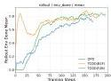
(a) Success Rates

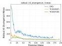
(b) KL Divergence

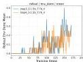
(c) Success Rates
Figure 4: Training Dynamics comparison of TCOD and OPD on ALFWorld. (a) and (b) show the success rate and KL divergence, respectively, for Qwen2.5-7B as the student. TCOD maintains a higher success rate and more stable KL divergence. (c) and (d) show the success rate and KL divergence, respectively, for Qwen2.5-1.5B as the student model. TCOD-F2B under  $\eta = 3,6$  mitigate the success rate collapse and kl escalation.

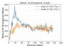
(d) KL Divergence

For baselines, we report the zero-shot student as the empirical lower bound and the teacher policy as the theoretical upper bound (Oracle). Moreover, we compare TCOD with standard knowledge transfer paradigms, including supervised fine-tuning (SFT) and vanilla on-policy distillation (OPD). For evaluation, we test all the benchmarks using success rate (SR), which measures the percentage of tasks completed successfully, where task completion is treated as a binary outcome. More details are provided in Appendix D.

# 5.2 Q1: Alleviating KL Escalation and Improving Performance

In Table 2, we present results of TCOD on ALFWorld with students (Qwen2.5-3B, Qwen2.5-7B) and a GRPO-trained Qwen2.5-7B teacher, reporting both success rate (SR) and average action steps. We find that TCOD-F2B and B2F substantially outperform vanilla OPD and SFT across model scales. Notably, TCOD reduces the average number of action steps by 2.97 steps, while improving SR by up to 15.71 over OPD, suggesting that curriculum learning from the teacher over trajectories leads to better performance. Figure 4a&amp;4b&amp;5b further show that TCOD achieves faster convergence in success rate and advantage, while maintaining more stable KL divergence than vanilla OPD.

Different Benchmarks and Model Sizes. In Table 3, we evaluate TCOD across three benchmarks using students Qwen3-1.7B and Qwen3-4B with a Qwen3-30B-A3B-Instruct teacher. Overall, TCOD-F2B and TCOD-B2F achieve comparable performance to vanilla OPD. Moreover, as illustrated in Figure 4c&amp;4d, TCOD-F2B under both  $\eta = \{3,6\}$  maintains stable KL throughout training and achieves an increasing success rate, effectively mitigating KL

---

Table 3: Performance comparison between TCOD-F2B/B2F and OPD. We report Success Rate (\%) on validation sets.  $\eta$  is the curriculum's growth rate. The best result is bolded and the second-best is underlined. Green and red subscripts indicate improvement and degradation over Vanilla OPD, respectively.

<table><tr><td>Method</td><td>WebShop ↑</td><td>ALFWorld ↑</td><td>ScienceWorld ↑</td><td>Avg ↑</td></tr><tr><td>Qwen3-30B (Teacher)</td><td>32.84</td><td>39.57</td><td>18.42</td><td>30.28</td></tr><tr><td colspan="5">Qwen3-1.7B (Student)</td></tr><tr><td>Vanilla OPD</td><td>0.14</td><td>0.32</td><td>0.05</td><td>0.17</td></tr><tr><td>TCOD (B2F) η=2</td><td>20.54↑20.40</td><td>24.55↑24.23</td><td>10.82↑10.77</td><td>18.64↑18.47</td></tr><tr><td>TCOD (B2F) η=4</td><td>21.12↑20.98</td><td>23.87↑23.55</td><td>11.34↑11.29</td><td>18.78↑18.61</td></tr><tr><td>TCOD (B2F) η=6</td><td>20.33↑20.19</td><td>24.91↑24.59</td><td>10.65↑10.60</td><td>18.63↑18.46</td></tr><tr><td>TCOD (F2B) η=2</td><td>21.15↑21.01</td><td>24.12↑23.80</td><td>10.45↑10.40</td><td>18.57↑18.40</td></tr><tr><td>TCOD (F2B) η=4</td><td>20.44↑20.30</td><td>25.03↑24.71</td><td>9.22↑9.17</td><td>18.23↑18.06</td></tr><tr><td>TCOD (F2B) η=6</td><td>21.78↑21.64</td><td>23.65↑23.33</td><td>11.08↑11.03</td><td>18.84↑18.67</td></tr><tr><td colspan="5">Qwen3-4B (Student)</td></tr><tr><td>Vanilla OPD</td><td>30.12</td><td>36.85</td><td>15.95</td><td>27.64</td></tr><tr><td>TCOD (B2F) η=2</td><td>32.15↑2.03</td><td>38.62↑1.77</td><td>17.46↑1.51</td><td>29.41↑1.77</td></tr><tr><td>TCOD (B2F) η=4</td><td>29.21↓0.91</td><td>37.84↑0.99</td><td>16.73↓0.78</td><td>27.93↑0.29</td></tr><tr><td>TCOD (B2F) η=6</td><td>29.05↓1.07</td><td>39.35↑2.50</td><td>15.88↓0.07</td><td>28.09↑0.45</td></tr><tr><td>TCOD (F2B) η=2</td><td>31.81↑1.69</td><td>38.95↑2.10</td><td>17.85↑1.90</td><td>29.54↑1.90</td></tr><tr><td>TCOD (F2B) η=4</td><td>30.54↑0.42</td><td>37.62↑0.77</td><td>17.23↑1.28</td><td>28.46↑0.82</td></tr><tr><td>TCOD (F2B) η=6</td><td>29.87↓0.25</td><td>37.88↑1.03</td><td>17.12↑1.17</td><td>28.29↑0.65</td></tr></table>

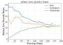
(a) Action Rounds

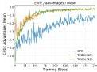
(b) Advantages
Figure 5: Further Analysis of TCOD-F2B/B2F on ALFWorld. (a)(b) is the average action rounds, advantages during training for Qwen2.5-7B as the student. TCOD effectively reduces the action rounds and achieves faster advantage convergence. (c)(d) is the maximum response length, policy gradient loss during training for Qwen2.5-1.5B as the student model. TCOD mitigates redundant responses while maintaining training stability.

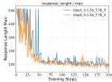
(c) Max Response length

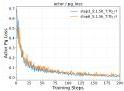
(d) Policy Gradient Loss

escalation and improving average success rate by 18.67. Furthermore, Figure 5c&amp;5d shows additional training metrics, where TCOD can recover from an explosion in response length, while the policy gradient loss decreases smoothly.

# 5.3 Q2: Generalizing Beyond the Teacher's Capability Boundary

Beyond the performance gains and KL stability achieved by TCOD, we further investigate whether TCOD can enable the student to surpass the teacher itself. Table 2 reports performance on both the unseen environment split and the hard split. Specifically, the hard split comprises 121 challenging tasks from ALFWorld where the teacher performs poorly. On the unseen split, TCOD already outperforms the teacher by up to 2.5 points in SR. More surprisingly, on the Train Hard split, both TCOD-B2F and TCOD-F2B substantially exceed the teacher's SR of 6.61, with TCOD-B2F achieving a gain of up to 14 points. This demonstrates that TCOD does not merely imitate the teacher, but develops a more robust policy that generalizes beyond the teacher's capability boundary.

---

# 5.4 Q3: Robustness, Sensitivity, and Efficiency Analysis of TCOD

Curriculum's Growth Rate  $\eta$  Ablation. Table 3 reports the effect of varying the curriculum's growth rate  $\eta \in \{2,4,6\}$  across different benchmarks. Performance remains consistently stronger than vanilla OPD across settings, with less than  $2\%$  variation in success rate, demonstrating that TCOD-F2B/B2F is not sensitive to the specific choice of  $\eta$ . This robustness makes TCOD easy to deploy in practice without extensive hyperparameter tuning. Nonetheless, as shown in Figure 4d, a larger  $\eta$  leads to more stable KL divergence during training, as the student spends more iterations mastering the current trajectory depth before the curriculum advances to longer horizons. In practice, we recommend starting with a small  $\eta$  to allow the curriculum to progress quickly in the early stages, and increasing  $\eta$  if the KL divergence instability during training is observed.

Domain-Specific vs. Larger Teacher. Comparing Table 2 and Table 3, we find that teacher quality strongly affects the upper bound of TCOD. In Table 2, the teacher is a GRPO-tuned Qwen2.5-7B on ALFWorld, reaching  $85.71\%$  success rate. Under this setting, TCOD-B2F with the same 7B backbone even slightly surpasses the teacher by 0.7 points. In Table 3, the teacher is Qwen3-30B-A3B-Instruct, a general model with weaker performance on the target domain. In this case, both vanilla OPD and TCOD fail to exceed the teacher, with about a 2-point gap. This suggests that the teacher's performance on the target domain matters more than model scale alone in enabling student improvement.

TCOD is computationally efficient. Figure 6 compares the total training cost of TCOD and vanilla OPD on ALFWorld and ScienceWorld. On both benchmarks, TCOD-F2B and TCOD-B2F reduce total training time by nearly  $32\%$  compared to vanilla OPD. This gain comes from the step-based curriculum in TCOD: early in training, the student takes fewer steps, producing shorter trajectories and faster data collection. Notably, TCOD-F2B is more efficient than TCOD-B2F. This is because TCOD-F2B limits the maximum interaction steps to  $k$ , while TCOD-B2F, though starting from intermediate states, still leads the student to take extra exploratory actions, producing longer trajectories. Figure 5a

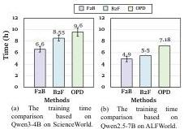
Figure 6: Training time comparison.

further verifies that TCOD-F2B uses fewer rollout action steps than TCOD-B2F, and both require fewer steps than vanilla OPD.

# 6 Conclusion

In this work, we identify a fundamental failure mode of vanilla OPD in multi-turn agents, termed Trajectory-Level KL Instability, where compounding errors across turns lead to escalating KL divergence and unreliable teacher supervision. Building on this insight, we propose TCOD, a simple and principled framework that controls the trajectory depth exposed to the student during training, instantiated through two practical variants: Forward-to-Backward (F2B) and Backward-to-Forward (B2F). Extensive experiments demonstrate that TCOD consistently stabilizes training, recovers small models from collapse, improves success rates for larger models, and reduces total training time compared to vanilla OPD. Beyond practical improvements, TCOD opens new directions for curriculum-guided training of long-horizon autonomous agents.
