# MEMENTO: Teaching LLMs to Manage Their Own Context

Vasilis Kontonis Yuchen Zeng Shivam Garg Lingjiao Chen Hao Tang Ziyan Wang Ahmed Awadallah Eric Horvitz John Langford Dimitris Papailiopoulos

Microsoft Research

Reasoning models think in long, unstructured streams with no mechanism for compressing or organizing their own intermediate state. We introduce MEMENTO: a method that teaches models to segment reasoning into blocks, compress each block into a memento, i.e., a dense state summary, and reason forward by attending only to mementos, reducing context, KV cache, and compute. To train MEMENTO models, we release OPENMEMENTOS, a public dataset of 228K reasoning traces derived from OpenThoughts-v3, segmented and annotated with intermediate summaries. We show that a two-stage SFT recipe on OPENMEMENTOS is effective across different model families (Qwen3, Phi-4, Olmo 3) and scales (8B-32B parameters). Trained models maintain strong accuracy on math, science, and coding benchmarks while achieving  $\sim 2.5\times$  peak KV cache reduction. We extend vLLM to support our inference method, achieving up to  $2\times$  throughput improvement while also enabling us to perform RL and further improve accuracy. Finally, we identify a dual information stream: information from each reasoning block is carried both by the memento text and by the corresponding KV states, which retain implicit information from the original block. Removing this channel drops accuracy by 15 pp on AIME24.

# Memento Data Gen

# A. Trace Selection

think) Okay, so I need to find the sum of all integer bases  $b &gt; 9$  for which  $17_{b}$  divides  $97_{b}$ . Let me convert to base 10... (/think) The answer is 70.

# B. Segmentation

# C. Compression

T1 Convert  $17_{b} = b + 7$ $97_{b} = 9b + 7$  ; set up divisibility...

T2 List divisors of 56; filter  $b + 7 &gt; 16$

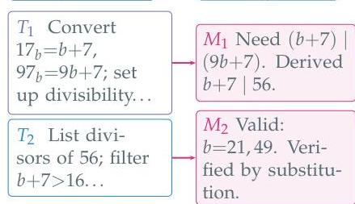
$80\%$  compression

# Memento Attention at Training/Inference

Prompt  $T_{1}$  generate  $T_{1}$

Prompt  $T_{1}$  M1 compress  $\rightarrow M_{1}$

Prompt  $T_{1}$  M1  $T_{2}$  mask  $T_{1}$ , gen.  $T_{2}$

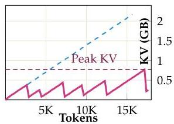
Qwen3-8B, AIME24 P2

Prompt  $T_{1}$  M1  $T_{2}$  M2 ...  $T_{n}$  Mn Answer

Thinking Masked Memento

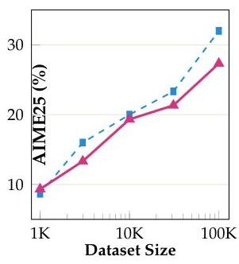
Figure 1: MEMENTO overview. Top left: SFT data generation pipeline. Starting from a reasoning trace, we split text into sentences, use an LLM to score each sentence boundary as a potential stopping point, optimize boundary selection algorithmically, and finally use an LLM to summarize each block into a memento. Top right: Sparse attention during inference. The model produces alternating thinking blocks  $(T_{i})$  and mementos  $(M_{i})$ ; once a memento is generated, KV cache entries for its preceding thinking block are physically removed. The sawtooth KV trace shows the resulting memory pattern. Bottom left: Data scaling on Qwen2.5-7B-Instruct (AIME25); MEMENTO scales similarly to vanilla SFT on OpenThoughts (Guha et al., 2025) across dataset sizes (Figure 4). Bottom center: Accuracy across three models on AIME26, GPQA-D, and LCB; lighter bars show RL gains for Qwen3-8B (Section 5). Bottom right: Peak KV cache (GB), averaged across all benchmark categories, showing  $\sim 2 - 2.5\times$  reduction.

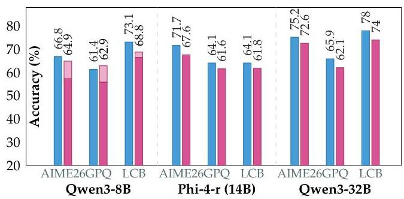
Base Memento +RL

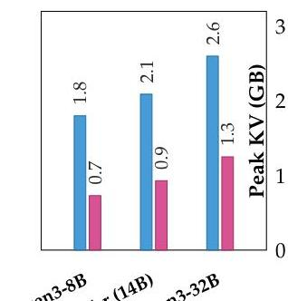

---

1 Introduction

Large language models routinely reason at test time, spending thousands of tokens working through a problem before arriving at an answer *(OpenAI, 2024; DeepSeek-AI et al., 2025; Qwen Team, 2024)*. This has led to dramatic gains on hard reasoning benchmarks, but has also created a new problem: reasoning models have no built-in mechanism to organize their chain-of-thought. A 32K-token CoT is a flat, unstructured stream, and there is no mechanism for the model to mark an intermediate result as worth keeping, or to compress a long derivation into a compact conclusion that it can reference later. Every past token sits in the attention window at equal cost, and the model has learned no way to drop it.

We propose Memento, an approach that trains models to segment their chain of thought into semantically coherent blocks and, after each block, generate a compressed summary that we call a memento. Rather than a summary in the usual expository sense, each memento is a minimal record of a reasoning block, preserving its conclusions, intermediate values, and key directional decisions in as few tokens as possible. Once a memento is produced, the preceding thinking block is masked within a single, uninterrupted generation call via a custom vLLM based engine *(Kwon et al., 2023)*: at every subsequent step, the model attends only to past mementos and the current block. Each block is compressed to a $\sim$5–20$\times$ smaller size on average, so the effective context the model attends to is a fraction of the full trace. The inference procedure is illustrated in Figure 1 (right).

Crucially, because masking happens in-place rather than by restarting generation, the KV cache entries of each memento are computed while the full block is still in context and retained after the block is masked. Despite the fact that the original thinking tokens are gone, they remain implicitly present in the representations of the memento KV states This creates a dual information stream: the explicit memento text plus an implicit representational channel through the cached KV states. We verify this experimentally: recomputing memento KVs without block context reduces accuracy by 15 pp on AIME’24 (Section 6.2.1), and our probing experiments (Section 6.2.2) demonstrate that block information not present in the memento text is still recoverable from the memento KV states, with upper layers carrying the most task-relevant signal.

A prime concern is that compression could destroy reasoning capacity. Our experiments across three model families, i.e., Qwen3 (8B/32B), Phi-4-reasoning (14B), and Olmo-3-7B-Think, show that this is not the case. On AIME’26, Qwen3-32B with Memento loses just 2.6 pp (72.6% vs. 75.2%) while cutting peak KV cache by $\sim$2$\times$. Averaged across the five benchmark groups in Table 1, the accuracy gap is 3.5 pp at 32B and 6.3 pp at 8B, and we observe that the gap shrinks with scale within the same model family, suggesting that larger models manage compressed context more effectively. Further, we show that RL fine-tuning can close the remaining gap, enabled by native block masking support in our vLLM fork.

To train Memento models, we construct OpenMementos, a public dataset of 228K segmented and summarized reasoning traces derived from OpenThoughts *(Guha et al., 2025)*. Building this dataset required solving a non-trivial annotation problem: reasoning traces lack natural segment boundaries, and naive summarization loses the precise intermediate state a model needs to continue. Our pipeline combines LLM-scored boundary detection, algorithmic segmentation, and iterative judge-refined summarization to produce training data where each memento is both faithful and minimal. Our key contributions can be summarized as follows:

1. OpenMementos: a 228K-trace public dataset of segmented, summarized reasoning chains, with the annotation pipeline and code.
2. Demonstration at scale across three model families (Qwen3 8B/32B, Phi-4-reasoning 14B, Olmo-3-7B-Think), showing that models internalize summarization as a learned capability while preserving reasoning accuracy at 2–3$\times$ peak KV cache reduction.
3. Native block masking in vLLM, a custom fork that supports in-place KV cache masking within a single generation call: a key infrastructure bottleneck for both inference and training with Memento. This

---

enables RL fine-tuning with block masking, which allows us to close the accuracy gap.
4. The dual information stream: we identify and verify that memento KV states encode information from masked blocks which is a mechanism absent in restart-based approaches. Removing this channel drops accuracy by 15 pp on AIME’24.

## 2 Related Work

Context management for long-running models is typically handled through external infrastructure—separate summarizers, memory modules, or orchestration logic *(Wu et al., 2025; Xu et al., 2025)*. We instead focus on teaching models to manage their own context during reasoning, as an internal capability rather than an external system. Among works that do train models for context management, MemAgent *(Yu et al., 2025)* learns to compress long input documents into a fixed-size memory via RL, and MEM1 *(Zhou et al., 2025)* takes a similar approach for multi-turn agent interactions, maintaining a compact internal state across tool calls and environment observations. Both primarily focus on managing external information—retrieved documents, tool outputs, and environment observations—rather than complex reasoning chains typically observed in models solving hard math or coding problems.

The most closely related works to ours train models to compress their own reasoning output in domains such as math: InftyThink *(Yan et al., 2025)*, InftyThink+ *(Yan et al., 2026)*, and Accordion-Thinking *(Yang et al., 2026)*. All three train models to segment reasoning into chunks and produce summaries that subsequent reasoning attends to in place of the original chunks. InftyThink relies on SFT alone, while InftyThink+ and Accordion-Thinking additionally apply RL to optimize summarization quality. All three operate at the text level: after each reasoning chunk, a summary is produced and the context is rebuilt from the accumulated summaries, discarding the original reasoning tokens and their KV cache representations. InftyThink and InftyThink+ do this via separate generation calls (explicit restart), while Accordion-Thinking implements mid-generation context rebuilding within a single inference pass. Memento differs in that it retains summary KV entries via in-engine attention masking rather than text-level context rebuilding, creating a dual stream of information: the explicit memento text, and the implicit representations encoded in the memento’s KV cache. Our experiments demonstrate that useful information is stored in these KV entries—dropping them and recomputing memento KVs without block context reduces AIME24 accuracy by 15 percentage points (Section 6.2.1). Beyond the KV-flow distinction, Memento differs in scale (three model families at 8B–32B vs. $\leq$7B), infrastructure (native block masking in vLLM enabling efficient RL rollouts), and public data (228K traces).

Another related work (PENCIL *(Yang et al., 2025)*) explores learned context management for models trained from scratch on synthetic tasks. PENCIL teaches models to erase intermediate reasoning via reduction rules, enabling small models to solve hard 3-SAT problems and Einstein’s Puzzle (a multi-constraint logic deduction) with bounded context. PENCIL demonstrates that the potential of context management extends beyond memory and throughput efficiency—it can enable models to solve significantly harder problems than standard CoT permits. Whether similar significant gains can be achieved in realistic settings such as math and coding problems, for instance through Memento-style compression, is an interesting direction for future work.

A closely related line of work compresses reasoning chunks into learned gist tokens—special-purpose tokens whose KV cache entries encode a compressed representation of the preceding chunk, after which the original tokens are evicted *(Zhang et al., 2025a; Monea et al., 2025)*. A limitation of gist-token approaches is that interpretability is lost: the compressed state is encoded entirely in hidden representations. Memento’s summaries are natural-language text, preserving interpretability while still achieving compression.

A complementary line of work aims to reduce the memory footprint of reasoning through shorter traces or direct KV cache compression. These include methods that train models to skip low-importance tokens *(Xia et al., 2025; Li et al., 2025)*, train on compressed reasoning traces *(Kang et al., 2025; Zhang et al., 2025b)*, or steer the model to produce shorter traces via RL *(Hou et al., 2025; Shrivastava et al., 2025)*. Other works replace explicit reasoning tokens with latent representations *(Shen et al., 2025; Hao et al., 2024)*. At the KV cache level, inference-time methods such as ThinKV *(Ramachandran et al., 2025)*, R-KV *(Cai

---

et al., 2025)*, and Reasoning Path Compression *(Song et al., 2025)* prune or quantize cache entries based on attention patterns, while architectures such as sliding-window attention *(Beltagy et al., 2020)* limit the attention span by design *(Team Olmo et al., 2025)*. These approaches are orthogonal to Memento and many can likely compose with it: for example, we show that Olmo-3-7B-Think that has sliding-window attention can be effectively combined with Memento.

## 3 OpenMementos Dataset

Training models to simultaneously reason and manage context requires high-quality annotated data: reasoning traces segmented into semantically coherent blocks, paired with dense summaries. A core challenge is that typical reasoning traces are not a sequence of independent thoughts; they are a continuous stream without “natural” boundaries. Here we describe our data generation pipeline (Figure 1, top left), which takes raw CoT traces and produces structured traces annotated with mementos.

#### Design rationale.

Each stage in our pipeline reflects a deliberate design choice. Early on, we tried having a frontier LLM directly segment CoTs into semantically coherent blocks. This failed. Even strong models struggle with a combinatorial optimization problem that considers all possible partitions, requiring simultaneous reasoning about block coherence, size balance, and semantic boundaries.

To simplify, we factored the problem: boundary scoring asks a local question (“is this a good place to slice the CoT?”), which LLMs handle well, while the global optimization of boundary selection given the LLM scores is handled algorithmically. We then use an LLM judge to grade the quality of summarization. Defining “good summary” programmatically is difficult, but LLMs can give reasonable scores against explicit rubrics. We then chose iterative refinement of mementos over single-shot summarization as initial mementos often miss key formulas or intermediate values; a zero-shot approach achieves only 28% pass rate (scoring $\geq 8/10$ on our rubric), while the judge-feedback loop brings this to 92%.

#### Stage 0: Seed selection.

We source 228K reasoning traces from OpenThoughts-v3 *(Guha et al., 2025)*, a widely-adopted dataset of CoT traces generated by QwQ-32B, and process them through our annotation pipeline to produce the final OpenMementos dataset. While we could regenerate traces using stronger teachers, we leverage OpenThoughts because: (1) substantial effort has already been invested in generating these traces at scale; (2) the OpenThinker-3 paper provides extensive baselines, making it an ideal testbed; and (3) our hypothesis that traces from a relatively strong reasoner (QwQ-32B) should transfer across model families is confirmed empirically (works for Qwen3, Phi-4, Olmo 3).

#### Stage 1: Sentence splitting.

We partition reasoning traces into atomic “sentences”: complete, modular thoughts that can stand alone. Code blocks and multi-line math are detected and protected as atomic units. Plain text is split at sentence boundaries (avoiding splits inside parentheses, inline math, or abbreviations). Finally, we merge logically connected fragments: sentences ending with colons are attached to the next; continuation words (Therefore, Thus, So) signal a need to merge with the preceding sentence; short fragments ($<$5 tokens) and consecutive math expressions are consolidated. This structure-aware splitting reduces candidate boundaries by $\sim$2$\times$ vs. naive sentence splitting (397 $\rightarrow$ 187 per trace on average).

#### Stage 2: Boundary scoring.

An LLM judge (GPT-5.x in our case) evaluates each inter-sentence boundary as a potential breakpoint, scoring from 0 (mid-thought, would disrupt flow) to 3 (major transition, natural chapter boundary). The prompt instructs: “Never score 2–3 mid-calculation. Score 0 if previous sentence ends with ‘:’ or ‘=’.” Because traces contain hundreds of boundaries, we score them in batches: the judge sees a window of consecutive sentences and scores each boundary within that window. See Figure 2 for an example of boundary scoring.

---

<table><tr><td colspan="2">Boundary scoring example — complex-plane geometry trace</td></tr><tr><td>[177] “Hence, this approach again leads to the only solution being zero.”</td><td>0.0</td></tr><tr><td>[178] “Therefore, unless I made a mistake ... the answer is the trivial solution.”</td><td>1.5</td></tr><tr><td>[179] “Perhaps the problem's answer is indeed zero, so the distance is zero.”</td><td>2.0</td></tr><tr><td>[180] “Alternatively, maybe I made an error in interpretation.”</td><td>3.0</td></tr><tr><td>[181] “Let me check with an example.”</td><td>0.5</td></tr><tr><td>...</td><td></td></tr><tr><td>[185] “Suppose I take r=2. Then u=5, v=±√7...”</td><td>0.0</td></tr><tr><td>[186] “But √56 ≈ 7.48, 8√2 ≈ 11.31, which are not equal.”</td><td>0.0</td></tr></table>

Figure 2: Boundary scoring assigns each inter-sentence boundary a score from 0 to 3. Sentence 179 wraps up a conclusion (score 2.0); sentence 180 pivots to a new strategy (score 3.0—the strongest possible boundary); sentences 185-186 are midderivation (scores 0.0—never split here). The segmentation optimizer selects cuts at high-scoring transitions.

Stage 3: Segmentation. Given  $n$  sentences with boundary scores  $s_1, \ldots, s_{n-1}$ , we partition the trace into  $K$  contiguous blocks by maximizing  $\frac{1}{K} \sum_{b \in \text{boundaries}} s_b - \lambda \cdot \sigma(\ell_1, \ldots, \ell_K) / \mu(\ell_1, \ldots, \ell_K)$ , subject to every block containing at least 200 tokens. Here,  $b$  is the boundary positions,  $\ell_k$  is the token count of the  $k$ -th block,  $\mu$  and  $\sigma$  are the mean and standard deviation of the block sizes, and  $\lambda = 0.5$ . We optimize over valid partitions and values of  $K$ . We observe that the first term rewards cutting at strong semantic boundaries: a partition that places cuts at score-3 transitions (major topic changes) scores higher than one cutting low-score transitions (mid-derivation). The second term penalizes uneven block sizes. The coefficient of variation  $\sigma / \mu$  is scale-invariant, so the penalty applies equally whether the trace is 5K or 50K tokens. Without this term, the optimizer would greedily cut at the top-scoring boundaries regardless of balance, often producing one very long block and several tiny ones.

Stage 4: Iterative memento generation. Each block is compressed into a memento: a terse state representation that preserves all logically relevant information (definitions, formulas, intermediate values, chosen strategies, rejected approaches) needed for subsequent blocks to succeed. Unlike traditional summarization, the goal is "lossless compression" of reasoning state: mementos must capture everything a future reasoning step might need, targeting  $\sim 15 - 25\%$  of original tokens while being purely extractive (no new derivations or error corrections).

Compressor. The compressor call (using GPT-5.x) receives all blocks and produces one memento per block using terse notation (semicolon-separated clauses, "name: value" pairs, compact math). The prompt instructs: "You are a STATE-COMPRESSOR. Minimize tokens subject to fully capturing all logically relevant information."

Judge. A separate LLM call (again using GPT-5.x) evaluates each memento on a 0–10 scale across six dimensions: (1) formulas extracted verbatim (0–3), (2) numerical values preserved (0–2), (3) methods explicitly named (0–2), (4) validation included (0–1), (5) no hallucinations (0–1), and (6) result-first structure (0–1). If the score falls below the acceptance threshold  $\tau = 8$  (out of 10), the judge provides actionable feedback (e.g., "Missing formula:  $K^2 - 3K + 3$ ) used to refine the memento; mementos scoring  $\geq \tau$  are accepted without refinement. We use max  $T = 2$  iterations, i.e., Compressor  $\rightarrow$  Judge  $\rightarrow$  Compressor  $\rightarrow$  Judge. Adding more iterations does not significantly improve memento quality and results in longer mementos. See Figure 11 for an example of the iterative improvement of mementos.

Iterative refinement is essential. Single-pass memento generation achieves only  $28\%$  pass rate ( $\geq 8/10$  judge score). Two iterations of judge feedback bring this to  $92\%$ . Initial mementos often miss critical formulas or intermediate values that downstream blocks need to reason correctly.

---

Dataset statistics. Figure 3 characterizes the final OPENMEMENTOS dataset (228K samples:  $54\%$  math,  $19\%$  code,  $27\%$  science). Math and code traces produce more blocks per sample (median 9) than science (median 7), and math has the largest blocks (median 3.8K chars). Summary sizes are remarkably stable across domains (median 509-603 chars), yielding median compression ratios of 0.16 (math), 0.18 (code), and 0.23 (science)—corresponding to  $\sim 4 - 6\times$  block-level compression. Across the full dataset, the average block contains  $\sim 1,150$  tokens and the average memento  $\sim 194$  tokens, for a trace-level compression of  $\sim 6\times$  (from  $\sim 10,900$  block tokens to  $\sim 1,850$  memento tokens per trace).

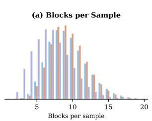
Figure 3: OPENMEMENTOS dataset distributions by domain (228K samples). (a) Math and code have  $\sim 9$  blocks/sample; science has  $\sim 7$ . (b) Block sizes range from 2.3K (science) to 3.8K (math) chars. (c) Summary sizes cluster around 509-603 chars across all domains, indicating a stable compression target. (d) Math achieves the tightest compression ratio (median 0.16) due to its larger blocks.

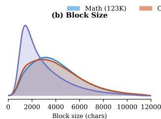

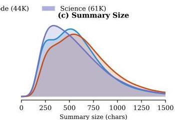

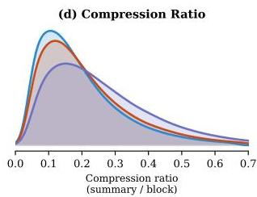

# 4 Training the MEMENTO Models

We use a two-stage SFT procedure on OPENMEMENTOS that separates format learning from context management. The intuition follows standard curriculum learning: we first let the model acquire the block-memento format under normal conditions, then introduce the harder constraint of operating without access to masked content, see Appendix A.4.1 for an ablation.

Stage 1: Full Attention: Standard causal attention over all tokens. Loss is computed on all tokens, including thinking blocks, mementos, special tokens, and the final answer. The model learns the block-memento format without any context management pressure.

Stage 2: Memento Attention: After each completed memento, the preceding thinking block is masked from all subsequent attention. This teaches the model to produce self-contained mementos that carry all information needed for downstream reasoning.

The attention mask implementation maintains a block cache that tracks whether each token belongs to a thinking block, summary, or other content. When  $&lt;|\text{summary\_end}|&gt;$  is generated, the preceding block is marked as completed and masked from future attention. For training, this mask is constructed upfront as a dense matrix; for inference, the block cache is stateful across autoregressive steps. Four special tokens  $(&lt;|\text{block_start}|&gt;, &lt;|\text{block_end}|&gt;, &lt;|\text{summary_start}|&gt;, &lt;|\text{summary_end}|&gt;)$  are added and initialized as the mean embedding of semantically related existing tokens (e.g.,  $&lt;|\text{block_start}|&gt;$  from block, start, begin, section, step) plus small Gaussian noise.

Data Scaling. When training "from scratch" a non-reasoning model (Qwen2.5-7B-Instruct), data scaling follows a similar monotonic trend as standard reasoning SFT (Guha et al., 2025). We study how performance scales with the amount of OPENMEMENTOS training data by fine-tuning Qwen2.5-7B-Instruct on varying amounts of data (1K, 3K, 10K, 31K, 100K examples), comparing vanilla OpenThoughts (OT), OPENMEMENTOS with full attention (OM/Full), and OPENMEMENTOS with memento attention (OM/Mem). As shown in Figure 4, all three methods improve monotonically from 1K to 100K. OT achieves the highest accuracy across all data budgets, while OM/Full and OM/Mem trail by a modest margin.

---

Figure 4: Training data scaling. Pass@1 accuracy on AIME24 and AIME25 for Qwen2.5-7B-Instruct fine-tuned on 1K-100K examples. All methods improve monotonically with data size.
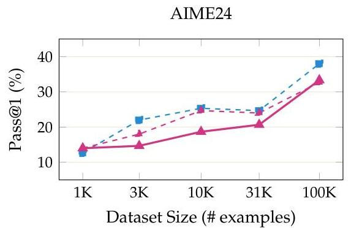
-OT(Base)-MEMENTO Full Att.-MEMENTO Mem. Att.

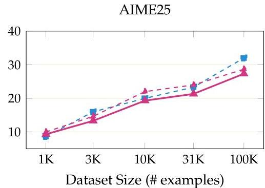

Fine-Tuning Reasoning Models. When starting with already strong reasoning models, we found that training for more epochs on fewer samples is more effective than training on more samples with fewer epochs. We train on 31K samples from the 228K OPENMEMENTOS pool with 32K sequence length, as further gains are more effectively attainable through reinforcement learning (Section 5) rather than additional supervised data. We release the full 228K dataset to support future research in both directions.

Hyperparameters. We use the same hyperparameters for all models and stages. Key hyperparameters: learning rate  $8 \times 10^{-5}$ , cosine schedule with  $5\%$  warmup, 5 epochs per stage, AdamW ( $\beta_{1} = 0.9$ ,  $\beta_{2} = 0.999$ ), no weight decay, bfloat16 precision, batch size 512, and 32 B200 GPUs. See Appendix A.2.1 for details.

Results and Evaluation. We evaluate MEMENTO across four model families and scales: Qwen3-8B, Phi-4-reasoning (14B), Qwen3-32B, and Olmo-3-7B. Example MEMENTO traces from Qwen3-32B are provided in Appendix A.5. All results report pass@1 accuracy. We evaluate on 14 benchmarks spanning competition mathematics (11 contests sourced from MathArena, grouped as "Comp. Math" in Table 1), standard math (MATH-500), science (GPQA Diamond), and code (LiveCodeBench v6); Table 1 summarizes accuracy alongside KV cache footprints.

Control Runs. To decouple the effect of performing SFT on already strong reasoning models (that leads to some performance loss) we do control (shown in Gray in Table 1) runs where we train the base models on the original unmodified OpenThoughts subsets. As one may expect the highest performance loss, both for MEMENTO and the control runs, happens for the most challenging Competition math benchmarks while for easier benchmarks such as MATH-500 MEMENTO is able to match baselines almost perfectly.

Scale Helps. Within the Qwen3 family the accuracy gap shrinks with scale, from  $-6.3\mathrm{pp}$  at 8B to  $-3.5\mathrm{pp}$  at 32B (averaged across the five benchmark groups in Table 1). This suggests that larger models manage compressed context more effectively and that further gains may be achievable at greater scale.

Peak KV cache and AUC savings. We observe that peak KV is reduced by  $2 - 3 \times$  and KV AUC (area under the KV-cache-size curve over generation steps) capturing total memory-time cost, by  $2 - 3.5 \times$  on competition math, with even larger reductions on benchmarks where the base model generates long responses. Figure 5 illustrates the range of per-problem KV cache behaviors produced by block masking.

Memento on Olmo-3-7B-Think. We applied our OPENMEMENTOS dataset and training recipe to Olmo-3-7B-Think, which uses a hybrid attention architecture: 24 of its 32 layers employ sliding-window attention

---

Table 1: MEMENTO achieves  $2 - 3 \times$  peak KV reduction on models with uniform attention layers while maintaining strong reasoning performance; RL on top of our Qwen3-8B further improves accuracy. Olmo-3-7B shows more modest savings ( $\sim 0.85 - 0.93 \times$ ) due to its hybrid sliding-window architecture (Section 4). The  $\Delta$  columns show changes of MEMENTO and Mem.+RL relative to Control: accuracy deltas are additive (pp); KV deltas are multiplicative (Method / Control, so  $0.39 \times$  means  $61\%$  KV reduction). Metrics. Accuracy (\%): pass@1 accuracy. Peak KV (GB): peak KV cache size; determines the minimum memory required to serve a request. AUC KV (GB-ktok): area under the KV-occupancy-vs-token curve, capturing total memory-time cost that penalizes both large footprints and long generations (see Figure 5 for an illustration). Rows. For each model we report Base (unmodified), Control (Base fine-tuned on the same OpenThoughts source traces used to create OPENMEMENTOS, but without block/memento annotations, for the same number of training examples), and MEMENTO (SFT on OPENMEMENTOS with block masking); for Qwen3-8B we additionally report MEMENTO+RL (Appendix A.2.3). Olmo-3 MEMENTO competition-math evaluations use 8 generations per problem (vs. 64 for all other models) and are run with HuggingFace Transformers rather than vLLM. See Appendix A.2.2 for full benchmark and evaluation details.

<table><tr><td colspan="2" rowspan="2"></td><td colspan="2">AIME'26</td><td colspan="2">Comp. Math</td><td colspan="2">MATH-500</td><td colspan="2">GPQA-D</td><td colspan="2">LCB v6</td></tr><tr><td>Val</td><td>Δ</td><td>Val</td><td>Δ</td><td>Val</td><td>Δ</td><td>Val</td><td>Δ</td><td>Val</td><td>Δ</td></tr><tr><td rowspan="12">Qwen3-8B</td><td rowspan="3">Base</td><td>Acc</td><td>66.81.1</td><td></td><td>54.30.3</td><td></td><td>90.50.9</td><td></td><td>61.42.4</td><td></td><td>73.11.0</td></tr><tr><td>Peak KV</td><td>2.41</td><td></td><td>2.71</td><td></td><td>0.84</td><td></td><td>1.23</td><td></td><td>1.76</td></tr><tr><td>AUC KV</td><td>25.3</td><td></td><td>30.9</td><td></td><td>4.3</td><td></td><td>6.6</td><td></td><td>15.6</td></tr><tr><td rowspan="3">Control</td><td>Acc</td><td>64.71.1</td><td></td><td>49.20.3</td><td></td><td>89.71.0</td><td></td><td>57.82.5</td><td></td><td>70.01.0</td></tr><tr><td>Peak KV</td><td>2.59</td><td></td><td>2.82</td><td></td><td>0.88</td><td></td><td>1.60</td><td></td><td>1.89</td></tr><tr><td>AUC KV</td><td>28.3</td><td></td><td>33.1</td><td></td><td>4.7</td><td></td><td>11.8</td><td></td><td>19.2</td></tr><tr><td rowspan="3">MEMENTO</td><td>Acc</td><td>57.31.1</td><td>-7.4%</td><td>45.10.3</td><td>-4.1%</td><td>90.10.9</td><td>+0.4%</td><td>55.82.5</td><td>-2.0%</td><td>66.51.0</td></tr><tr><td>Peak KV</td><td>1.02</td><td>0.39×</td><td>1.08</td><td>0.38×</td><td>0.41</td><td>0.47×</td><td>0.56</td><td>0.35×</td><td>0.60</td></tr><tr><td>AUC KV</td><td>9.7</td><td>0.34×</td><td>10.7</td><td>0.32×</td><td>1.9</td><td>0.40×</td><td>4.0</td><td>0.34×</td><td>5.6</td></tr><tr><td rowspan="3">Mem. + RL</td><td>Acc</td><td>64.91.1</td><td>+0.2%</td><td>49.40.3</td><td>+0.2%</td><td>91.00.9</td><td>+1.3%</td><td>62.92.4</td><td>+5.1%</td><td>68.81.0</td></tr><tr><td>Peak KV</td><td>1.45</td><td>0.56×</td><td>1.48</td><td>0.52×</td><td>0.68</td><td>0.77×</td><td>1.24</td><td>0.77×</td><td>1.12</td></tr><tr><td>AUC KV</td><td>14.9</td><td>0.53×</td><td>16.4</td><td>0.50×</td><td>3.2</td><td>0.68×</td><td>9.2</td><td>0.78×</td><td>10.3</td></tr><tr><td rowspan="10">Phi-4+ (14B)</td><td rowspan="3">Base</td><td>Acc</td><td>71.71.0</td><td></td><td>55.10.3</td><td></td><td>87.31.1</td><td></td><td>64.12.4</td><td></td><td>64.11.0</td></tr><tr><td>Peak KV</td><td>2.65</td><td></td><td>3.06</td><td></td><td>1.43</td><td></td><td>0.80</td><td></td><td>2.45</td></tr><tr><td>AUC KV</td><td>28.8</td><td></td><td>35.9</td><td></td><td>17.8</td><td></td><td>3.7</td><td></td><td>29.2</td></tr><tr><td rowspan="3">Control</td><td>Acc</td><td>69.81.0</td><td></td><td>51.40.3</td><td></td><td>90.60.9</td><td></td><td>64.12.4</td><td></td><td>65.01.0</td></tr><tr><td>Peak KV</td><td>3.04</td><td></td><td>3.48</td><td></td><td>1.04</td><td></td><td>2.11</td><td></td><td>2.64</td></tr><tr><td>AUC KV</td><td>28.6</td><td></td><td>36.7</td><td></td><td>4.9</td><td></td><td>14.2</td><td></td><td>26.8</td></tr><tr><td rowspan="3">MEMENTO</td><td>Acc</td><td>67.61.1</td><td>-2.2%</td><td>48.70.3</td><td>-2.7%</td><td>89.71.0</td><td>-0.9%</td><td>61.62.4</td><td>-2.5%</td><td>61.81.1</td></tr><tr><td>Peak KV</td><td>1.17</td><td>0.38×</td><td>1.25</td><td>0.36×</td><td>0.51</td><td>0.49×</td><td>0.80</td><td>0.38×</td><td>0.92</td></tr><tr><td>AUC KV</td><td>11.3</td><td>0.40×</td><td>13.1</td><td>0.36×</td><td>2.6</td><td>0.53×</td><td>6.2</td><td>0.44×</td><td>9.5</td></tr><tr><td rowspan="9">Qwen3-32P</td><td rowspan="3">Base</td><td>Acc</td><td>75.21.0</td><td></td><td>62.70.3</td><td></td><td>91.90.9</td><td></td><td>65.92.4</td><td></td><td>78.00.9</td></tr><tr><td>Peak KV</td><td>3.24</td><td></td><td>3.67</td><td></td><td>1.26</td><td></td><td>1.89</td><td></td><td>2.88</td></tr><tr><td>AUC KV</td><td>26.7</td><td></td><td>34.7</td><td></td><td>5.5</td><td></td><td>9.7</td><td></td><td>22.9</td></tr><tr><td rowspan="3">Control</td><td>Acc</td><td>74.11.0</td><td></td><td>58.50.3</td><td></td><td>91.80.9</td><td></td><td>64.62.4</td><td></td><td>75.30.9</td></tr><tr><td>Peak KV</td><td>3.83</td><td></td><td>4.51</td><td></td><td>1.36</td><td></td><td>2.45</td><td></td><td>3.05</td></tr><tr><td>AUC KV</td><td>35.2</td><td></td><td>48.5</td><td></td><td>6.2</td><td></td><td>15.7</td><td></td><td>27.7</td></tr><tr><td rowspan="3">MEMENTO</td><td>Acc</td><td>72.61.0</td><td>-1.5%</td><td>56.20.3</td><td>-2.3%</td><td>91.10.9</td><td>-0.7%</td><td>62.12.4</td><td>-2.5%</td><td>74.01.0</td></tr><tr><td>Peak KV</td><td>1.67</td><td>0.44×</td><td>1.74</td><td>0.39×</td><td>0.64</td><td>0.47×</td><td>1.07</td><td>0.44×</td><td>1.12</td></tr><tr><td>AUC KV</td><td>14.0</td><td>0.40×</td><td>15.7</td><td>0.32×</td><td>2.8</td><td>0.45×</td><td>7.6</td><td>0.48×</td><td>9.3</td></tr><tr><td rowspan="10">Olmo 3 (7B)</td><td rowspan="3">Base</td><td>Acc</td><td>67.91.1</td><td></td><td>52.70.3</td><td></td><td>91.30.9</td><td></td><td>50.82.5</td><td></td><td>64.51.0</td></tr><tr><td>Peak KV</td><td>3.95</td><td></td><td>4.21</td><td></td><td>2.11</td><td></td><td>3.21</td><td></td><td>3.33</td></tr><tr><td>AUC KV</td><td>50.8</td><td></td><td>60.1</td><td></td><td>10.7</td><td></td><td>30.8</td><td></td><td>40.0</td></tr><tr><td rowspan="3">Control</td><td>Acc</td><td>59.81.1</td><td></td><td>48.30.3</td><td></td><td>90.40.9</td><td></td><td>45.72.5</td><td></td><td>58.81.1</td></tr><tr><td>Peak KV</td><td>3.51</td><td></td><td>3.78</td><td></td><td>2.00</td><td></td><td>2.94</td><td></td><td>3.22</td></tr><tr><td>AUC KV</td><td>37.1</td><td></td><td>46.0</td><td></td><td>9.1</td><td></td><td>23.8</td><td></td><td>37.6</td></tr><tr><td rowspan="3">MEMENTO</td><td>Acc</td><td>55.42.2</td><td>-4.4%</td><td>48.10.9</td><td>-0.2%</td><td>91.10.9</td><td>+0.7%</td><td>49.52.5</td><td>+3.8%</td><td>56.01.1</td></tr><tr><td>Peak KV</td><td>3.21</td><td>0.91×</td><td>3.43</td><td>0.91×</td><td>1.70</td><td>0.85×</td><td>2.72</td><td>0.93×</td><td>2.21</td></tr><tr><td>AUC KV</td><td>37.8</td><td>1.02×</td><td>43.6</td><td>0.95×</td><td>8.5</td><td>0.93×</td><td>25.2</td><td>1.06×</td><td>20.6</td></tr></table>

window size 4096), while only 8 layers use full causal attention. Additionally, Olmo 3 uses multi-head attention (MHA, 32 KV heads) rather than grouped query attention (GQA, 8 KV heads in Qwen3). MEMENTO transferred with no architecture-specific modifications: accuracy is well preserved, with Comp. Math dropping only  $0.2\mathrm{pp}$  relative to Control and MATH-500 improving by  $0.7\mathrm{pp}$  (Table 1). However, KV cache savings are substantially more modest than for the other model families ( $\sim 0.85 - 0.93 \times$  peak vs.

---

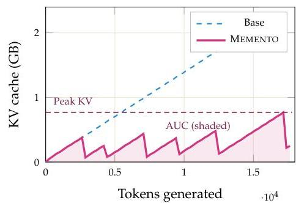
(a) Typical

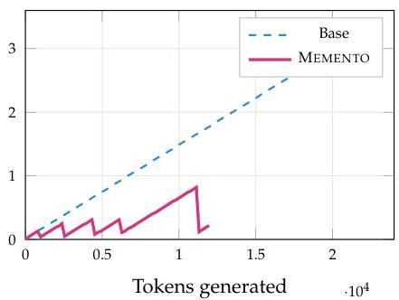
(b) Large reduction
Figure 5: KV cache traces on individual problems (Qwen3-8B, both answers correct). (a) AIME24 P2: typical sawtooth pattern with 6 compaction; peak 0.77 vs 2.17 GB  $(2.8\times$  reduction). (b) AIME24 P26: MEMENTO solves the problem in 12k tokens (vs 23k); frequent compaction keep peak at 0.82 vs 3.41 GB  $(4.2\times)$ . (c) AIME24 P5: MEMENTO generates  $3\times$  more tokens (31k vs 10k) with many compaction. Peak is still lower (1.27 vs 1.55 GB), but the total KV area-under-curve is  $2.1\times$  higher than the base—a failure mode where block masking induces excessive generation.

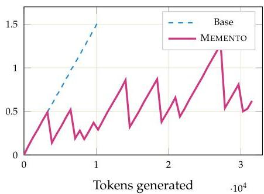
(c) Higher total KV usage

$0.35 - 0.47 \times$ . This is because sliding-window layers already cap their KV cache at 4096 tokens regardless of block masking—so  $75\%$  of layers gain nothing from eviction. Only the 8 full-attention layers benefit, limiting the overall reduction. On some benchmarks, the AUC metric is even slightly worse for MEMENTO (e.g., AIME'26:  $1.02 \times$ ), because summaries lengthen the response, increasing total memory-time cost despite a lower peak. LCB shows the largest savings ( $0.69 \times$  peak,  $0.55 \times$  AUC), likely because code problems have shorter responses where fewer tokens exceed the sliding window.

Models learn to summarize their own reasoning. After SFT on OPENMEMENTOS, models internalize the block-and-summarize process as a new capability: they produce self-contained mementos that reduce peak KV cache by  $2 - 3 \times$  on models with uniform attention while maintaining strong accuracy across benchmarks. On MATH-500 the gap is under 1 pp; on the hardest competition math benchmarks Qwen3-32B stays within 2.6 pp on AIME'26. The gap shrinks with scale  $(-6.3\mathrm{pp}$  at  $8\mathrm{B} \rightarrow -3.5\mathrm{pp}$  at 32B), suggesting MEMENTO becomes increasingly effective at larger model sizes. MEMENTO also transfers to Olmo-3-7B's hybrid sliding-window architecture with minimal accuracy loss, though KV savings are inherently limited by the sliding window's bounded cache.

Compression behavior. How does compression vary across model families and benchmarks? Summary sizes are remarkably stable (median 260-615 chars), matching the training distribution (Figure 3), while block sizes vary widely across models and tasks. This confirms the model learns a consistent compression skill that generalizes to harder problems. Figure 6 shows the full CDF of compression ratios across all four MEMENTO models, revealing that the bulk of blocks achieve  $5 - 20 \times$  compression with a thin tail of low-compression outliers.

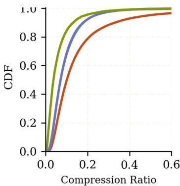
Figure 6: CDF of compression ratio (summary chars / block chars). OLMo3-7B and Qwen3-8B achieve the tightest compression on competition math. Phi-4 has the widest compression spread, especially on MATH-500.

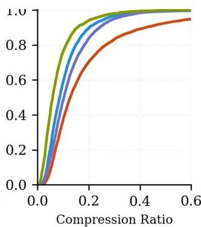

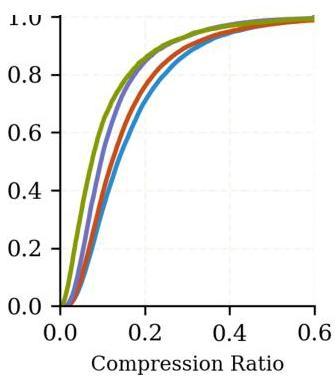

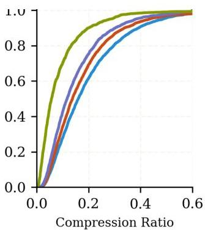

---

Summary length is stable; compression scales with difficulty. Across four model families and four benchmarks, mementos converge to  $\sim 260 - 615$  characters regardless of block length, matching training targets. Compression is strongest on competition math  $(9 - 27\times)$  and weakest on shorter-block benchmarks  $(6 - 9\times)$ , confirming the model learns a stable summary skill, not a fixed ratio.

# 5 Improving Accuracy via RL

Capability under compression. We first investigate whether we can match the baseline performance with MEMENTO or there is some inherent limitation due to compression. We focus on math, which is the most challenging domain for compression (Table 1). Generating  $n = 64$  independent completions per problem for all three model families on AIME 2024/25/26, we find that coverage (pass@64) is nearly identical: the gap averages only 2.6 pp and the Jaccard similarity between Base and MEMENTO solved sets averages  $96.4\%$ , reaching  $100\%$  in two of nine settings (Table 2).

Majority voting recovers the gap. The coverage analysis above shows that MEMENTO models can solve nearly the same problems as their base counterparts—they just do so less consistently. Majority voting (maj@k) makes this concrete: as shown in the left panel of Figure 7, all three MEMENTO SFT models match or exceed the Base pass@1 accuracy with just  $k = 2 - 3$  samples. For Qwen3-32B on AIME'26, maj@2 already surpasses the Base pass@1 line. This tells us two things: (1) the accuracy gap after SFT is a consistency problem, not a capa

Table 2: Problem coverage (pass@64) and solved-set overlap for Base vs. MEMENTO on AIME ( $n = 64$  per problem, 30 problems per benchmark).

<table><tr><td>Model</td><td>Bench.</td><td>Base</td><td>MEMENTO</td><td>Ret.</td><td>Jacc.</td></tr><tr><td rowspan="3">Qwen3-8B</td><td>AIME'24</td><td>93.3</td><td>90.0</td><td>96.4</td><td>96.4</td></tr><tr><td>AIME'25</td><td>93.3</td><td>86.7</td><td>92.9</td><td>92.9</td></tr><tr><td>AIME'26</td><td>86.7</td><td>90.0</td><td>100.0</td><td>96.3</td></tr><tr><td rowspan="3">Phi-4-r (14B)</td><td>AIME'24</td><td>93.3</td><td>93.3</td><td>100.0</td><td>100.0</td></tr><tr><td>AIME'25</td><td>93.3</td><td>90.0</td><td>96.4</td><td>96.4</td></tr><tr><td>AIME'26</td><td>93.3</td><td>90.0</td><td>96.4</td><td>96.4</td></tr><tr><td rowspan="3">Qwen3-32B</td><td>AIME'24</td><td>93.3</td><td>93.3</td><td>100.0</td><td>100.0</td></tr><tr><td>AIME'25</td><td>90.0</td><td>83.3</td><td>92.6</td><td>92.6</td></tr><tr><td>AIME'26</td><td>93.3</td><td>90.0</td><td>96.4</td><td>96.4</td></tr></table>

bility problem—the correct answers are in the distribution, they are just not the mode; and (2) RL is a natural fix, since it can sharpen the distribution toward correct traces without needing to teach new skills.

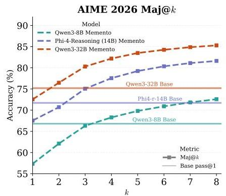
Figure 7: Majority-vote headroom and Qwen3-8B CISPO (MiniMax et al., 2025) RL trajectory. Left: AIME 2026 maj@k for the three MEMENTO SFT models (Table 1); horizontal lines show each Base model's pass@1. All models match Base accuracy by  $k = 2 - 3$ . Middle: per-step RL training accuracy (faint raw trace with 25-step moving average). Right: AIME'25 validation accuracy evaluated every 25 steps, peaking at  $66.2\%$  at step 350 (used in Table 1). Majority voting uses uniform tie-breaking among tied majority answers.

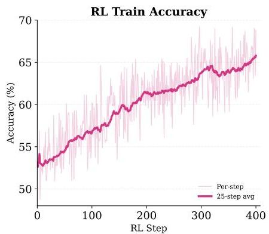

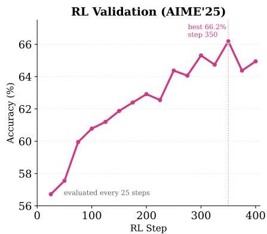

Recovering accuracy via RL. Given that the correct answers are already present in the MEMENTO distribution, RL should improve pass@1 by reallocating probability mass toward correct compressed traces rather than by teaching entirely new skills. We fine-tune the Qwen3-8B MEMENTO SFT checkpoint with CISPO (MiniMax et al., 2025), Clipped Importance-Sampled Policy Optimization, a GRPO (Shao et al., 2024) variant that clips and detaches the importance-sampling weight. Similarly to MiniMax et al. (2025), we

---

found CISPO to be more stable than standard GRPO during training. We also add a KL penalty ($\beta$=0.001) to prevent the response-length collapse we observed in initial runs without regularization, and adopt rule-based math rewards.

Rollouts use memento attention block masking via our custom vLLM engine (Section 6). Training uses sparse block-masked attention (similar to Stage 2 of SFT) to match the inference-time masking pattern. Full hyperparameters and training details are provided in Appendix A.2.3.

##### CISPO algorithm.

We use CISPO *(MiniMax et al., 2025)* (Clipped Importance-Sampled Policy Optimization), a GRPO *(Shao et al., 2024)* variant that replaces the PPO *(Schulman et al., 2017)* clipped surrogate objective with a stop-gradient clipped importance-sampling weight:

$L=-\operatorname{sg}\bigl{(}\text{clip}(r_{t}(\theta),1-\epsilon_{\text{low}},1+\epsilon_{\text{high}})\bigr{)}\cdot A_{t}\cdot\log\pi_{\theta}(a_{t}\mid s_{t}),$ (1)

where $r_{t}(\theta)=\pi_{\theta}/\pi_{\theta_{\text{old}}}$ is the importance ratio and sg denotes stop-gradient. Unlike PPO clipping, which zeros out gradients when the ratio exceeds the trust region, CISPO ensures every token contributes a gradient signal—the clipped ratio acts as a fixed per-token weight. We add a KL penalty term $\beta\cdot D_{\text{KL}}(\pi_{\theta}\|\pi_{\text{ref}})$ with $\beta=0.001$ to prevent excessive drift from the SFT checkpoint.

##### Block length capping.

Because we use accuracy as the sole reward signal, we observed the model learning to generate fewer and longer reasoning blocks, undermining the KV cache savings that block masking provides. To maintain low peak KV cache occupancy during RL rollouts, we cap individual blocks at 7K tokens: when a block exceeds this limit during generation, the vLLM engine forces a <|block_end|> token and the model continues from a new block.

The middle and right panels of Figure 7 show the training and validation trajectories. Train accuracy rises from 52.7% to 65.8% (25-step moving average) over 400 steps, while AIME’25 validation peaks at 66.2% at step 350. After RL, Memento+RL raises AIME’26 from 57.3 to 64.9 and Comp. Math from 45.1 to 49.4, while also improving GPQA-D from 55.8 to 62.9 above the 61.4 vanilla baseline. The compression remains substantial: peak KV rises from 1.08 to 1.48 GB after RL, still well below the 2.71 GB vanilla footprint. RL therefore converts the majority-voting headroom into stronger single-sample accuracy while preserving much of Memento’s memory advantage.

[leftmargin=*]
The pass@1 drop after SFT on OpenMementos reflects reduced consistency, not lost knowledge. Without any additional training, majority voting at $k$=3 already recovers base-model accuracy (Figure 7, left). With RL fine-tuning we can significantly improve pass@1 accuracy and match or improve over the control run for Qwen3-8B (Table 1).

## 6 Inference and the Implicit KV Channel

### 6.1 Serving Memento Models with vLLM

Memento’s block masking requires *non-standard, data-dependent sparse attention*: which tokens are masked depends on the generated sequence itself, not on a fixed pattern known at compile time. To the best of our knowledge, no production inference framework, including vLLM *(Kwon et al., 2023)*, SGLang *(Zheng et al., 2024)*, or TensorRT-LLM, provides a built-in mechanism for request-level custom sparse attention masks that evolve during generation. We therefore build native block masking support directly into vLLM’s V1 engine, extending it so that it *physically* removes masked tokens from the KV cache. Our approach operates purely at the Python level of vLLM, can be installed as a simple patch on top of an existing vLLM installation, and works with the vanilla FlashAttention and FlashInfer kernels, requiring no custom sparse attention kernel. For more details on the implementation, see Appendix A.3.2.

---

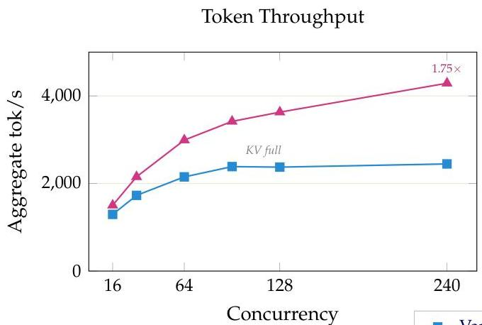
Figure 8: Serving throughput (Qwen3-8B,  $1 \times$  B200 GPU). AIME24  $\times$  8 repetitions (240 requests, 32K max tokens). Left: MEMENTO sustains  $1.75 \times$  higher token throughput at full concurrency. Right:  $1.58 \times$  faster batch completion. Vanilla plateaus as KV cache fills GPU memory.

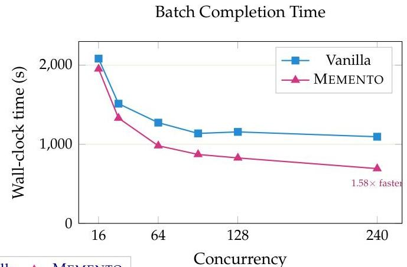

Throughput experiments. We benchmark serving throughput on Qwen3-8B with AIME24 × 8 repetitions (240 concurrent requests) with 32K max tokens on a single B200 GPU. At high concurrency, vanilla vLLM becomes KV-cache-bound: throughput plateaus as the KV cache fills GPU memory. MEMENTO's block masking frees KV cache entries as blocks complete, allowing the engine to sustain higher batch sizes and throughput throughout the run. MEMENTO sustains 4,290 tok/s vs. 2,447 for vanilla  $(1.75\times)$  and completes the batch in 693s vs. 1,096s  $(1.58\times$  faster). This infrastructure was also crucial for enabling RL fine-tuning with MEMENTO: generating 32K-token training rollouts requires an inference engine that natively supports block masking during generation, since each rollout must produce and compact blocks on the fly. Without the vLLM integration, generating these long traces at the scale required for RL would be infeasible.

Memento + vLLM. MEMENTO's vLLM integration physically removes masked KV entries, sustaining  $1.75 \times$  higher throughput at full concurrency on a single B200 GPU. Our vLLM implementation enabled us to perform reasoning RL by supporting on-the-fly block masking during 32K-token rollout generation.

# 6.2 The Dual Information Stream

# 6.2.1 KV Cache Ablation: Do Memento KV States Carry Block Information?

Under memento attention, block content is masked for future tokens, but the memento's KV values were computed during generation while the model could still attend to the full block. Do these KV states carry useful information beyond the memento text itself? We denote thinking block  $i$  as  $T_{i}$  and its corresponding memento as  $M_{i}$ .

Experiment. We compare two inference modes on the same Qwen3-8B memento attention checkpoint:

- Memento attention (normal): While generating  $M_{i}$ , the model attends to all tokens in  $T_{i}$  as well as the prompt and all preceding mementos. Once  $M_{i}$  is complete,  $T_{i}$  is masked from all subsequent attention—but  $M_{i}$ 's KV cache entries, which were computed with block context, are retained. Future tokens therefore attend to memento KV states that implicitly encode block content.
- Memento attention + restart: Generation of each memento proceeds in two steps. Step 1 (generation):  $M_{i}$ 's text is generated identically to normal memento attention: the model attends to  $T_{i}$  and produces the same summary tokens. Step 2 (KV recomputation): After  $M_{i}$  is complete, we discard the KV cache and run a fresh prefetch pass over the effective context: prompt  $+M_{1} + M_{2} + \dots + M_{i}$  (with standard causal masking within and across mementos). Critically, all past blocks are now masked and each memento's

---

KV entries are recomputed attending only to the prompt and preceding mementos, not to the block it originally summarized. The generated memento text is identical in both conditions; only the KV representations differ. This isolates the question: does the information encoded in the KV states (from having attended to the block during generation) matter beyond what the memento text conveys?

The 15 pp drop confirms that memento KV states carry significant information from the masked blocks. Mementos function as compressed pointers into cached reasoning state, not just standalone text replacements. This distinguishes MEMENTO from prior iterative summarization methods Yan et al. (2025); Wang et al. (2025) which discard original tokens entirely after summarization: unlike those methods, MEMENTO retains the KV cache, and this retention is critical.

KV states carry reasoning capacity. Recomputing memento KVs without block access drops AIME24 accuracy from  $66.1\%$  to  $50.8\%$ . Mementos are not standalone text replacements—their cached KV representations form a high-bandwidth implicit channel that restart-based methods discard.

Table 3: KV ablation on full AIME24 (30 problems, Qwen3-8B memento attention checkpoint, 32K generation). Block masking accuracy is from the 64-repetition evaluation in Table 1; the restart experiment uses 8 repetitions.

<table><tr><td>Inference mode</td><td>Pass@1</td></tr><tr><td>Memento att. (normal)</td><td>66.1%</td></tr><tr><td>Memento att. + restart</td><td>50.8%</td></tr><tr><td>Δ</td><td>-15.3 pp</td></tr></table>

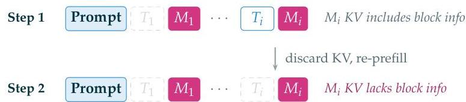
Figure 9: Restart ablation. Step 1:  $M_{i}$  is generated with full attention to  $T_{i}$  (same as normal memento attention). Step 2: KV cache is discarded and recomputed via prefetch over prompt +  $M_{1\_i}$  only— $T_{i}$  is masked, so  $M_{i}$ 's KV states no longer encode block information. The 15 pp accuracy drop (Table 3) shows the KV channel carries significant reasoning capacity.

# 6.2.2 Probing the Implicit KV Channel

The KV ablation in Section 6.2.1 shows that memento KV states matter for downstream accuracy. But what information do they carry? We design a probing experiment that injects a known signal into a masked block and measures how much of it can be recovered from downstream memento KV states that never directly attended to that block.

Experimental design. We inject a random 5-digit "passcode" (00000-99999) into the content of a target block  $T_{2}$  in a real AIME'25 reasoning trace, then run a forward pass with MEMENTO block masking (keep_last_n_blocks=0). We extract KV states (keys and values concatenated) from memento token positions at specific layers and train a probe (MLP,  $512 \times 256$  hidden units, 128 bottleneck) to predict the 5 individual digits from these features. We report the average accuracy across the 5 predictions (one for each passcode digit) with the random prediction baseline being  $10\%$ . Crucially, the validation split is label-unique: no digit combination appears in both train and validation, preventing memorization.

We evaluate three probing conditions:

- Direct: Probe the KV states of memento  $M_2$ , which can attend to the target block  $T_2$ . This measures the upper bound of information encoded in a single memento's KV states.
- Masked: Probe the KV states of memento  $M_3$ , which cannot attend to  $T_2$  as  $T_2$  has already been evicted from the KV cache by the time  $M_3$  is computed. Any signal recovered here must have propagated through the memento chain.

---

- Causal control: Probe the KV states of memento  $M_{1}$ , which precedes the target block  $T_{2}$  in the sequence. Since  $M_{1}$  is computed before  $T_{2}$  is even generated, it cannot contain any information about the passcode. This serves as a sanity check; we expect chance-level accuracy (10%).

We run this experiment at two scales:

- Qwen3-8B: 15K samples from AIME'25 traces generated by the 8B model, with injected passcodes, probing at layers 3 and 35.
- Qwen3-32B: 15K samples from AIME'25 traces generated by the 32B model, with injected passcodes, probing at layers 3 and 63.

Results. Figure 10 summarizes the findings. At the direct position, the memento text itself bears no relation to the passcode, yet the KV states recover the injected digits with  $60 - 70\%$  accuracy, demonstrating that KV representations encode far more information than the corresponding tokens. At the masked position, where the memento cannot attend to the target block, both models still recover the passcode well above chance (26.7% for Qwen3-8B, 23.0% for Qwen3-32B vs. 10% chance). The causal control, probing a memento that precedes the target block, shows exactly chance-level accuracy, confirming that the recovered signal is real and directional. Table 4 further shows that leakage concentrates in deeper layers. In Qwen3-8B, an early layer (the 4th) shows near-chance masked accuracy (10.8%) while the last layer (the 36th) reaches 26.5%; the pattern repeats in Qwen3-32B (12.8% at the 4th layer vs. 22.4% at the 64th). The same trend holds for the direct condition, where deeper layers carry substantially more signal (64.9% vs. 51.6% for 8B; 68.7% vs. 53.8% for 32B). This is consistent with the residual stream accumulating information across layers. We further validate these findings with a controlled toy transformer experiment (Appendix A.4.2): a 4-layer model trained on synthetic data exhibits the same leakage pattern (24.9% masked accuracy vs. 10% chance), with signal decaying gradually over distance but persisting up to 7 hops from the target block. Leakage remains constant across training checkpoints even as task accuracy improves, confirming the channel is architectural—not learned.

KV states carry an implicit information channel. Memento KV representations propagate block information across masked boundaries—an architectural effect that complements the explicit memento text and explains why single-pass MEMENTO outperforms restart-based methods.

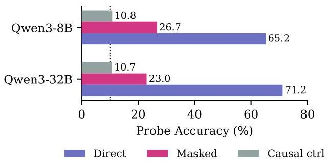
Figure 10: Probing the implicit KV channel. Both Qwen3-8B and Qwen3-32B recover the passcode well above  $10\%$  chance from masked memento positions (26.7% and 23.0%), while causal controls show exactly chance-level accuracy. The dotted line marks  $10\%$  chance (random guessing over 10 digits).

Table 4: Deeper layers carry the signal. Per-layer probe accuracy  $(\%)$  under direct and masked conditions (keep0). The leaked signal concentrates in deeper layers; early layers show near-chance masked accuracy.

<table><tr><td></td><td colspan="2">Qwen3-8B</td><td colspan="2">Qwen3-32B</td></tr><tr><td></td><td>Direct</td><td>Masked</td><td>Direct</td><td>Masked</td></tr><tr><td>4th layer (early)</td><td>51.6</td><td>10.8</td><td>53.8</td><td>12.8</td></tr><tr><td>Last layer</td><td>64.9</td><td>26.5</td><td>68.7</td><td>22.4</td></tr><tr><td>Both layers</td><td>65.2</td><td>26.7</td><td>71.2</td><td>23.0</td></tr><tr><td>Chance</td><td></td><td>10.0</td><td></td><td></td></tr></table>

# 7 Conclusion

We introduced MEMENTO, a method that teaches language models to manage their own context by segmenting reasoning into blocks, compressing each into a dense memento, and masking completed

---

blocks via sparse attention. Across three model families (Qwen3, Phi-4-reasoning, Olmo-3-7B-Think), Memento reduces peak KV cache by 2–3$\times$ and KV AUC by up to 3.5$\times$, translating to 1.75$\times$ higher serving throughput, while preserving strong reasoning accuracy: Qwen3-32B loses just 2.6 pp on AIME’26 and 3.5 pp averaged across five benchmark groups. The gap shrinks with scale (6.3 pp at 8B $\rightarrow$ 3.5 pp at 32B), and our initial CISPO RL result on Qwen3-8B recovers much of the remaining single-sample gap while retaining the KV savings.

A key finding is that mementos carry information from masked blocks through two complementary channels: the explicit summary text and the implicit KV representations computed while the block was still visible. Our KV ablation shows that removing this implicit channel degrades accuracy by 15 pp, distinguishing Memento from methods that simply discard context after summarization.

Looking forward, we see two natural extensions: scaling the RL recipe to larger models, and applying Memento to long-horizon agent tasks where agent steps form natural blocks and context windows are the primary bottleneck. We release OpenMementos (228K annotated reasoning traces) and our vLLM fork with native block masking support to facilitate further research.