Preprints.org

Article

Not peer-reviewed version

# Agent Harness for Large Language Model Agents: A Survey

Qianvu Meng†, Yanan Wang†, Livi Chen*, Yihang Li, Wei Wu, Wenyuan Jiang, Qimeng Wang, Chengqiang Lu, Yan Gao, Yi Wu, Yao Hu

Posted Date: 28 April 2026

doi: 10.20944/preprints202604.0428.v3

Keywords: agent harness; large language model

Preprints.org is a free multidisciplinary platform providing preprint service that is dedicated to making early versions of research outputs permanently available and citable. Preprints posted at Preprints.org appear in Web of Science, Crossref, Google Scholar, Scilit, Europe PMC, OpenAlex.

Copyright: This open access article is published under a Creative Commons CC BY 4.0 license, which permit the free download, distribution, and reuse, provided that the author and preprint are cited in any reuse.

---

Preprints.org (www.preprints.org) | NOT PEER-REVIEWED | Posted: 28 April 2026

doi:10.20944/preprints/202604.0428.v3

Disclaimer/Publisher's Note: The statements, opinions, and data contained in all publications are solely those of the individual author(s) and contributor(s) and not of MDPI and/or the editor(s). MDPI and/or the editor(s) disclaim responsibility for any injury to people or property resulting from any ideas, methods, instructions, or products referred to in the content.

# Article

# Agent Harness for Large Language Model Agents: A Survey

Qianyu Meng  $^{1,2,\dagger}$ , Yanan Wang  $^{2,3,\dagger}$ , Liyi Chen  $^{2,*}$ , Yihang Li  $^{2}$ , Wei Wu  $^{2,4}$ , Wenyuan Jiang  $^{2,4}$ , Qimeng Wang  $^{2}$ , Chengqiang Lu  $^{2}$ , Yan Gao  $^{2}$ , Yi Wu  $^{2}$  and Yao Hu  $^{2}$

1 Minzu University of China, China
2 Xiaohongshu Inc., China
3 Dalian University of Technology, China
4 University of Science and Technology of China, China
* Correspondence: liyichencly@gmail.com
Equal contribution.

# Abstract

Nowadays, the reliability of large language model (LLM) agents in production environments is increasingly determined not by the underlying model but by the agent harness that encapsulates it. As tasks grow longer and more complex, recent studies demonstrate order-of-magnitude reliability gains achieved through harness redesign alone, with the underlying model held fixed. However, existing literature typically focuses on individual components of harness such as memory, planning, and tool use in isolation. In this paper, we are the first to conduct a systematic survey on the LLM agent harness, based on a comprehensive review of over hundred papers, technical reports, and industry blogs. Specifically, the core works of this paper is presented below: (1) A formal definition of the agent harness as a six-component tuple  $\mathcal{H} = (E, T, C, S, L, V)$ , i.e., execution loop, tool registry, context manager, state store, lifecycle hooks, and evaluation interface. (2) A historical tracing the evolution of the harness concept from software testing and reinforcement learning environments to modern LLM agent systems, identifying a unifying architectural pattern: enabling a controllable, observable, verifiable runtime environment for unpredictable execution agents. (3) An empirically grounded taxonomy of 23 representative systems, classified via a six-component completeness matrix that enables direct cross-framework comparison, and reveal systems mature enough for real-world production deployment consistently exhibit a complete implementation of all six architectural components. (4) A systematic analysis of nine cross-cutting technical challenges spanning sandboxing, evaluation, protocol standardization, and compute economics, including an empirical comparison of tool-level and agent-level interoperability protocols and an assessment of ultra-long-context model implications. (5) A proposal of key future research directions where harness-layer infrastructure remains significantly underdeveloped relative to advances in component capabilities. The latest version of this paper is available at: https://github.com/Gloriaameng/Awesome-Agent-Harness.

Keywords: agent harness; large language model

# 1. Introduction

In recent years, the capability boundaries of Large Language Models (LLMs) have undergone continuous and substantial expansion. Beginning with text completion tasks, these models have progressively demonstrated emergent abilities spanning code generation [1], logical reasoning [2], culminating in the capacity to receive natural language instructions in open-ended environments [3], invoke external tools [4], and execute tasks through autonomous iterative processes [5]. In tandem with this rapid advancement in model capabilities, research and applications pertaining to LLM-based agentic systems have witnessed explosive growth, with their influence permeating diverse domains including scientific research [6], software engineering [7], and financial decision-making [8]. Research

CC BY

© 2026 by the author(s). Distributed under a Creative Commons CC BY license.

---

Preprints.org (www.preprints.org) | NOT PEER-REVIEWED | Posted: 28 April 2026

doi:10.20944/preprints202604.0428.v3

in the agent field still mainly focuses on the improvement of underlying model capabilities, with typical directions including: enhancing the model's reasoning capabilities through test-time scaling [9] techniques such as chain-of-thought [10], tree-of-thought [11], and self-refine [12]; conducting large-scale tool use training to improve the model's ability to use external tools [4]; investigating efficient context window management mechanisms to support the processing of complex long-horizon tasks [13]; and exploring multi-agent collaboration paradigms with the aim of achieving superlinear overall system efficiency. These research paths share an underlying core assumption: agent performance and reliability are primarily determined by the underlying model, and a sufficiently powerful model equipped with well-crafted prompts and maintained context can ensure robust execution in real-world tasks.

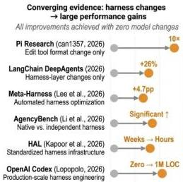
Agent Harness for LLM Agents: A Survey

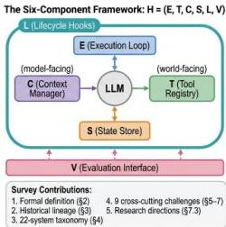
22 systems analyzed · 9 challenge areas · 12 research directions
Figure 1. Graphical abstract. Left: Converging quantitative evidence from five independent studies showing that harness-level changes alone—without any model modification—produce gains of up to  $10 \times$  on coding benchmarks (xAI's Grok Code Fast 1 reaches  $70.8\%$  on SWE-bench Verified using xAI's internal harness),  $+26\%$  on TerminalBench (LangChain DeepAgents), and  $+4.7$  pp on mathematical reasoning (Meta-Harness). Right: The six-component harness framework  $\mathcal{H} = (E, T, C, S, L, V)$  introduced in this survey, situating the execution loop  $(E)$ , tool registry  $(T)$ , context manager  $(C)$ , state store  $(S)$ , lifecycle hooks  $(L)$ , and evaluation interface  $(V)$  around a central language model. The survey analyses 22 systems, identifies 9 cross-cutting challenge areas, and proposes 12 research directions.

However, this assumption is increasingly being dismantled by recent benchmark and infrastructure research. The Holistic Agent Leaderboard (HAL)[14] revealed that standardizing the evaluation harness eliminated common implementation bugs, suggesting that a non-trivial fraction of prior "agent failures" were actually harness failures—artifacts of poorly specified execution environments. Similarly, AgencyBench[15] demonstrated that proprietary models performed optimally only within their native execution ecosystems, while SWE-bench[16], AgentBench[17], GAIA[18], and WebArena[19] all encountered environment infrastructure as the primary reproducible bottleneck.

Industrial reports are highly consistent with these observations. Lopopolo [20] noted that the OpenAI Codex team's early progress was bottlenecked "not because Codex was incapable, but because the environment was underspecified" [21]. Similar infrastructure-led stability improvements have been reported by Stripe [22], Vercel [23], and LangChain [24]. These findings collectively point to a long-overlooked critical layer—the execution layer, known in engineering practice as the agent harness. This middleware sits between large language models and the external world and assumes core responsibilities including tool management, context maintenance, state persistence, and evaluation

CC BY

© 2026 by the author(s). Distributed under a Creative Commons CC BY license.

---

interfaces. Rather than being a passive information transmission channel, it is a critical shaper of agent capabilities: context maintenance strategies determine what information the model can perceive; tool registration and scheduling mechanisms determine what operations the model can execute; execution loop design determines whether the system can maintain robustness in the face of failures and anomalies; and the design of evaluation interfaces directly affects whether agents can receive timely and accurate feedback, as well as whether different systems can be fairly compared under unified standards. Despite exerting a decisive impact on the real-world performance of agent systems, the agent harness has not yet received academic attention commensurate with its importance as an independent research object. This research gap has led to a structural disconnect between academic research and engineering practice. From the engineering perspective, practitioners have deeply recognized the central role of infrastructure: Chase [24] listed “context engineering” as a core skill for agent developers, and Gupta [25] further characterized 2026 as the “age of agent harnes”. Substantial engineering resources have been invested in the development and optimization of framework layers, yet systematic theoretical guidance remains lacking. From the research perspective, while academia has conducted increasingly refined studies on individual agent sub-components, including memory mechanisms, tool use, planning capabilities, and safety safeguards, few studies have focused on the execution framework itself that integrates these components into a reliably operating system. The definition, classification, and evaluation of agent harnesses therefore remain open research questions.

In the literature, existing surveys typically focus on the individual components of harness in isolation. For example, they analyze the agent's memory system from the perspectives of its source, form, and operation [26], or attempt to define the boundaries of agent memory [27]. Other surveys explore the agent's need for planning capabilities and methods to improve those capabilities [28,29]. Another line of work examines how to teach an LLM to discover, select, and invoke external tools [30,31]. Additionally, some surveys focus on measuring the quality of large model benchmarks [32], while others discuss how to systematically evaluate agents [33,34]. A few surveys discuss multiple components simultaneously, but these are often presented as separate modules rather than as an overall infrastructure [35,36]. To this end, in the paper, we systematically articulate agent harness as a complete research object and formalize its core problem as the harness-as-infrastructure problem. Acting as the crucial scaffolding that enables the translation of model intelligence into system-level behaviors, the agent harness is not merely a passive execution conduit, but a co-determinant of agent capabilities.

To this end, in the paper, we systematically articulate agent harness as a complete research object and formalize its core problem as the harness-as-infrastructure problem. Acting as the crucial scaffolding that enables the translation of model intelligence into system-level behaviors, the agent harness is not merely a passive execution conduit, but a co-determinant of agent capabilities. This paper first provides the formal definition of agent harness and traces its chronological development. evolution. It then categorizes existing agent harness systems and lists nine core technological challenges faced by agent harness at production scale. Finally, it analyzes recent and future research directions in agent harness.

---

Preprints.org (www.preprints.org) | NOT PEER-REVIEWED | Posted: 28 April 2026

doi:10.20944/preprints202604.0428.v3

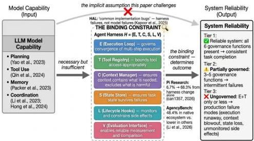
Figure 2. The binding constraint model: model capability is necessary but insufficient for system reliability. The agent harness mediates the translation through six governance functions  $(E, T, C, S, L, V)$ . Empirical evidence: xAI's Grok Code Fast 1 model  $(6.7\% \rightarrow 68.3\%$  on SWE-bench from edit-tool format change alone; AgencyBench  $(48.4\%$  in native ecosystem vs. lower in others).

Specifically, in Section 2 (Related Work) and 3 (Definitions and Conceptual Framework), we present the formal definition and conceptual framework. Agent harness is a system-level infrastructure that enables reliable, long-running execution of agents. Formally, it can be represented as a 6-tuple  $\mathcal{H} = (E,T,C,S,L,V)$ , corresponding to the execution loop, tool registry, context manager, state store, lifecycle hooks, and evaluation interface, respectively. This framework layer sits between large language models and the external world, and its design choices are the primary determinant of whether a high-performance model can be translated into a reliably deployable system.

In Section 4 (Historical Evolution), we outline the development of agent harness. Agent harness is not a technology that suddenly appeared alongside LLM agents. This paper reveals for the first time the complete evolutionary path of its gradual fusion from three independent technological lineages. Rather than representing a linear evolution of any single prior technology, agent harness integrates three foundational contributions: the governance wrapper paradigm from 1990s software test harness exemplified by JUnit [37], the interface standardization design from reinforcement learning environments [38], and the empirical catalog of failure modes accumulated from early LLM agent frameworks. Their core objective is to provide a controllable, observable, and verifiable runtime environment for inherently unpredictable execution model. Building on this historical analysis, we further identify three paradigm shifts in agent engineering spanning 2022 to 2026: from prompt engineering to context engineering, and ultimately to harness engineering. We delineate the landmark significance of the "harness tur" that occurred between 2023 and 2024, which marks the transition of agent harness research from model capability demonstrations to systematic infrastructure engineering. This historical account not only clarifies the origins of all core design tensions in contemporary harnesses, but also establishes a unified historical framework for the analysis of the nine core technical challenges presented in subsequent sections.

In Section 5 (Taxonomy of Agent Harness Systems), based on a structured expert survey of 23 representative systems, we propose for the first time a two-dimensional classification framework that takes system core positioning (stack position) as the primary dimension and domain scope as the secondary dimension. This classification directly addresses the critical decision-making question for engineers: "Is this system a ready-to-deploy runtime environment, a development framework for building custom agents, or a capability module for integration" We further construct a six-component

CC BY

© 2026 by the author(s). Distributed under a Creative Commons CC BY license.

---

completeness matrix, which quantitatively reveals the characteristic design trade-offs of the three major architectural families: full-stack deployment harnesses, development frameworks, and capability modules. This work corrects the long-standing misconception in the field that systems should be evaluated solely by functional completeness and arranged along a single spectrum from rudimentary to sophisticated, and provides a unified analytical framework for subsequent cross-system comparisons and component reuse.

In Section 6 (Core Technical Challenges), this survey analyzes the nine core technical challenges confronting Agent Harness at production scale, spanning nine dimensions: sandboxing and security, evaluation and benchmarking, protocol and interface standardization, runtime context management, knowledge and context engineering, tool use governance, memory management architecture, planning loop governance, and multi-agent coordination. These challenges do not exist in isolation; rather, they are deeply intertwined and mutually influential, collectively constituting the fundamental technical bottleneck of agent infrastructure.

- Security constitutes a qualitatively distinct challenge dimension. Harm manifests through actions rather than outputs, and the consequences of failure are irreversible. Primary attack vectors include environment prompt injection, capability escalation through tool composition, and memory poisoning, with memory poisoning being the most pernicious—attackers only need a single injection to persistently compromise system behavior across sessions by contaminating persistent storage. While sandbox isolation is a common defense approach, it is neither structurally feasible to implement perfectly nor a sufficient condition for security. Empirical evidence from AgentHarm *[39]* demonstrates that even aligned models can perform a wide range of harmful tasks when behavioral constraints are absent. Therefore, model alignment and harness security mechanisms are complementary rather than substitutive, and must be developed in tandem.
- Agent harness suffers from significant evaluation reliability issues, as existing benchmark results deviate from agents’ true real-world performance. Both AgencyBench *[15]* and METR *[40]* have documented substantial performance score discrepancies caused solely by differences in harness implementations. This problem arises from the superposition of three distinct structural root causes: environment drift, task specification ambiguity, and harness coupling, each with unique characteristics and requiring separate solutions. Among these, harness coupling is the most consequential for research: it is the only root cause whose solution lies entirely at the infrastructure layer, and also the least explicitly addressed in current evaluation frameworks.
- Protocol fragmentation is the core bottleneck limiting the large-scale deployment of agent harnesses: the absence of universal standards means that every integration between a harness and a tool, or between two harnesses, requires custom code, and maintenance costs grow quadratically with the number of systems in the ecosystem. The industry has naturally emerged into a functionally layered landscape: MCP *[41]* dominates the “agent-to-tool” invocation standard and has achieved the broadest adoption owing to its low latency; A2A *[42]* specializes in cross-entity task delegation between agents and offers more robust security models and stateful task management. However, the most critical inter-layer integration remains unstandardized to date, and the overall maturity of interoperability infrastructure lags significantly behind that of model capabilities.
- The core challenge of runtime context management lies in highlighting critical information within limited context windows: attention dilution exists even in long-context models, where longer contexts make it increasingly difficult for the model to accurately retrieve key information. Empirical evidence from DeepAgents *[43]* directly validates this issue: via pure harness-level engineering optimizations (including structured context injection and failure detection), performance on TerminalBench *[44]* 2.0 was improved by 26% without modifying the underlying model. This demonstrates that harness-level improvements can yield gains comparable to generational model upgrades.
- The core challenge of knowledge and context engineering is to construct a stable, consistent, and governable knowledge and state management layer. When the three subsystems—persistent

---

memory management, retrieval-augmented context organization, and skill representation and validation—operate in effective coordination, the agent can maintain a causally coherent execution view. Poor coordination, by contrast, leads to issues such as context confusion, loss of critical information, and historical state poisoning. At present, the field remains empirically driven, lacking systematic theoretical frameworks and standardized practices.
- The tool registry serves as the primary control point for agent behavior governance, covering four dimensions: design patterns, failure handling, supply-chain security, and protocol standardization. Both PALADIN *[45]* and SHIELDA *[46]* demonstrate that structured anomaly classification at the harness level contributes more to performance than model scale alone. ToolHijacker *[47]* validates the feasibility of registry-level attacks, while PRISM *[48]* proposes a runtime security scheme based on cross-lifecycle hooks. At the protocol level, MCP and Agent Skills *[49]* together form a two-layer protocol stack for tool definition and workflow management. This survey also reveals a counter-intuitive finding: removing tools often improves performance more than adding tools. The governance design of the tool registry, not raw model capability, represents the dominant bottleneck for current system performance.
- Memory management is likewise a harness infrastructure issue rather than a model capability issue: the harness determines what information is stored, how it is retrieved, and how it is persisted. This section establishes three core findings. First, across six memory architectures, there is an unavoidable three-way trade-off among recency bias, scalability, and retrieval latency; these cannot all be optimized at once. Second, in many systems (e.g., Reflexion *[5]* and Voyager *[3]*), memory content is generated and written by the model itself. This means that the harness must not only manage storage mechanisms but also govern the quality of what is written. Third, memory poisoning can persist across sessions without requiring continued attacker involvement, yet, with the exception of AgentSys*[50]*, current systems lack security controls at write time. To date, memory systems also lack a portable standard interface, which prevents implementations from being transferred across harnesses and makes retrieval quality difficult to evaluate independently.
- At the single-agent level, the core challenge is that the planning loop is fundamentally a harness governance object rather than an autonomous model process. As planning complexity increases from linear to tree-structured, governance responsibility shifts entirely to the harness, which must assume four non-substitutable infrastructure responsibilities: controlling the planning loop, persisting cross-inference planning state, enforcing hard compute and token budgets, and designing the Agent-Computer Interface (ACI). Empirical evidence from multiple sources confirms that harness-level optimizations, particularly ACI design, deliver greater performance gains than model upgrades *[7, 17, 51]*.
- At the multi-agent level, the governance model undergoes a transformation rather than extension: the harness now governs relationships between execution loops, introducing problems with no single-agent analogs. MASEval *[52]* confirms framework choice matters as much as model choice, with four core challenges: agent identity management, inter-agent message validation, shared state consistency, and the topology tradeoff between auditability and adaptability. Optimized single-agent systems match homogeneous multi-agent collectives, requiring economic justification for coordination overhead, and no production harness defends against cross-agent prompt injection.

This survey examines the nine core challenges inherent in agentic harness design, yet it is critical to recognize that these components do not fail in isolation. The deeper root of systemic unreliability lies in cross-component coupling: the context manager’s need to retain historical state for task continuity, which may conflict with lifecycle hooks’ mandate to restrict sensitive data persistence and access (C ↔︎ L); the evaluation interface and lifecycle hooks independently intercept execution flows to collect data, but their disjoint instrumentation creates non-interoperable data streams(V ↔︎ L); the blurred boundary between tool invocation and state mutation creates unregulated state modification risks

---

(S ↔︎ T). No amount of isolated optimization targeting a single component can fully mitigate the failures induced by these entangled dependencies.

From this analysis, two distinct categories of research priorities with clear hierarchical characteristics are derived: Near-term tractable directions focus on characterizing and managing existing system complexity. These include: (1) formal modeling of cross-component interactions; (2) agent-native observability; (3) human-in-the-loop approval mechanisms; (4) formalization of computational economics under harness constraints; (5) automated harness engineering—preliminary results from Meta-Harness *[53]* have demonstrated that search-generated harnesses can outperform manually designed baselines; and (6) formal verification of natural language-specified harness specifications. Long-term foundational research directions target fundamental correctness and scalability guarantees. These encompass: (1) formal verification of end-to-end behavioral guarantees; (2) cross-harness portability and unified benchmarking frameworks; (3) protocol interoperability across heterogeneous agent ecosystems; and (4) formal security models with automated inference of tool composition dependencies.

These two complementary sets of directions are unified by a single overarching thesis: The harness itself, not merely the model it encapsulates, must be elevated to a primary architectural research object in agent infrastructure research. Only by building a systematic, standardized, and verifiable theoretical and technological stack for the harness layer can we enable the large-scale, reliable deployment of production-grade agentic systems.

Finally, the main contributions of this survey are as follows:

- We are the first to conduct a systematic survey on the LLM agent harness, based on a comprehensive review of over hundred papers, technical reports, and industry blogs. Importantly, we provide a formal definition and conceptualization of the agent harness as a six-tuple $\mathcal{H}=(E,T,C,S,L,V)$, establishing the necessary and sufficient conditions for runtime execution environments.
- We fully uncover the technical evolutionary lineage and paradigm shifts of the agent harness from a new perspective. We trace its formation from three originally independent lines of technology: software testing harnesses from the 1990s, standardized reinforcement learning environments, and modern LLM agent frameworks. We demonstrate that the agent harness represents a deeply rooted, standalone architectural layer rather than a trivial extension of LLMs, providing a unified historical perspective for understanding key design tradeoffs in contemporary harness systems.
- We propose a novel, empirically grounded two-dimensional taxonomy and harness completeness matrix. Addressing the fundamental limitation of existing methods that rank systems only along a one-dimensional scale of functional complexity, we conduct a structured expert survey over 23 representative systems and build a novel classification framework based on stack positioning as the primary dimension and domain scope as the secondary dimension. This corrects the misconception that “more complex equals better” and provides a principled basis for engineering system selection.
- We systematically organize and deeply analyze nine core technical challenges facing production-grade agent harnesses. We perform a structured investigation of sandbox security, evaluation reliability, protocol fragmentation, context management, tool governance, and other critical issues. Moving beyond the common practice of studying challenges in isolation, we identify cross-component coupling as the fundamental root cause of systemic unreliability in agent systems.
- We identify critical research gaps and outline future research directions.Based on the analysis of the nine core challenges, we propose a two-tier research agenda consisting of near-term tractable directions and long-term foundational research directions. We explicitly emphasize that model capability is necessary but insufficient for reliable deployment, and that the agent harness represents the primary bottleneck limiting the large-scale real-world application of agent systems.

---

## 2 Related Work

### 2.1 LLM Agent

The academic literature on LLM Agent has produced a rich body of surveys, but these surveys are organized around agent capabilities—memory, tool use, planning, safety, evaluation—rather than around the infrastructure that operationalizes those capabilities. This organization reflects a conceptual choice: when researchers treat the agent as a software system whose behavior emerges from model outputs, they naturally decompose it into functional modules and study each module independently. The result is excellent modular coverage and poor cross-cutting synthesis, and it leaves the runtime governance layer—the harness—analytically invisible.

Consider what the existing surveys collectively provide. Wang et al. *[54]* offer the foundational architectural account of LLM autonomous agents, decomposing them into memory, planning, tool use, and action components. Their framework has been enormously influential, but it takes the execution environment as given—the agent’s “environment” is background context, not a research object. Xi et al. *[55]* catalogue the explosive growth of agent applications across domains—spanning perception, memory, planning, and action—providing an indispensable map of the agent landscape but making no claims about what infrastructure underlies it. *[26]*systematically review memory mechanisms—how agents store, retrieve, and organize information across interactions—with rigor and depth, but their scope is explicitly the memory component; the execution loop and lifecycle governance that memory interacts with are outside the frame.

*[30]*survey the four-stage tool learning workflow from task planning through response generation, providing the most comprehensive treatment of the tool-use component available. Yet their analysis treats the tool registry as a research artifact rather than an infrastructure component—they study what models learn about tool use, not how harnesses manage tool access and safety at runtime. Guo et al. *[56]*analyze multi-agent coordination patterns in detail, demonstrating that collective agent behavior raises novel questions about role assignment and communication; the question of what execution infrastructure makes that coordination reliable is left for future work. Mohammadi et al. *[34]* provide the most comprehensive treatment of evaluation methodology to date, carefully cataloguing benchmark designs, metrics, and failure modes—but stopping short of the deeper question of whether the evaluation infrastructure itself is a source of the failures it is intended to measure.

Two additional adjacent surveys sharpen the positioning of this work. Zhao et al. *[57]*, provides a comprehensive treatment of LLM pre-training, fine-tuning, and alignment, with agent capabilities discussed as one downstream application domain. Its scope is the model tier; the harness tier is outside its frame entirely. Guo et al. *[56]*, focuses specifically on multi-agent systems—role assignment, communication protocols, collaborative decision-making—and is the closest survey to this work’s coverage of coordination infrastructure. However, it analyzes multi-agent coordination as a capability question (what patterns of coordination are possible?) rather than as an infrastructure question (what governance functions must a harness provide to make coordination reliable?). Our survey is differentiated from both by its infrastructure focus: we treat the harness as an engineering object with formal properties, not merely as background for the analysis of agent capabilities.

A more recent broad survey by Xu *[58]* synthesizes agent architectures across deliberation, planning, and tool use, and is notable for its honest enumeration of evaluation challenges arising from non-determinism, context growth, and environment variability. Even this comprehensive treatment, however, organizes its analysis around agent components (policy core, memory, world models, planners, tool routers) rather than around the execution infrastructure that coordinates them. The harness appears implicitly in Xu’s discussion of “orchestration patterns” but is never isolated as an independent object of study.

---

### Evaluation System

This fragmentation is not merely organizational; it has substantive consequences. Several important phenomena in agent behavior are only legible at the infrastructure level, and none of the surveys above can address them within their own frameworks.

The clearest example is what we call the harness--model coupling problem. AgencyBench *[15]*, which evaluates six agentic capabilities across 138 real-world tasks requiring an average of one million tokens per task, shows empirically that “proprietary models demonstrate superior performance within their native ecosystems.” This finding is not about model quality in the abstract; it is about the interaction between model and execution environment. A capability-focused survey cannot see this interaction because it holds the execution environment constant or ignores it entirely. Similarly, the Holistic Agent Leaderboard (HAL) *[14]*, which conducted 21,730 agent rollouts across nine models and nine benchmarks at a total cost of approximately $40,000, found that a standardized evaluation harness reduced evaluation time from weeks to hours and eliminated “common implementation bugs.” The implication is that a substantial fraction of what prior evaluation literature treated as agent failures were, in fact, harness failures—artifacts of poorly specified execution environments rather than of model limitations.

SkillsBench *[59]* provides a third example. By evaluating 7 agent-model configurations over 7,308 trajectories—explicitly separating commercial harnesses from a model-agnostic harness—it provides emerging empirical evidence that the harness’s skill management infrastructure may account for 16.2 percentage points of average performance improvement. Moreover, 16 of 86 tasks showed negative deltas from skill augmentation, suggesting that harness-level capability management can actively harm performance under the wrong conditions. These patterns, if confirmed under peer review, would constitute findings about infrastructure—not about model capability—that require infrastructure-focused analysis to interpret.

SandboxEscapeBench *[60]* contributes emerging evidence on the security dimension: frontier models demonstrate capability to escape container environments, exploiting container vulnerabilities in their execution environments. If confirmed at scale, this would constitute a harness isolation failure rather than a model alignment failure. Community analysis of OSWorld *[61]* deployment further shows that evaluation harness environment state drift leads to systematic underestimation of agent performance, a finding corroborated by HAL’s infrastructure analysis. Here, the measurement infrastructure introduces systematic error into the very data on which the field’s capability claims are based.

#### 2.2.1 What This Survey Does Differently

Our analytical move is to treat the agent execution harness—the full runtime operational environment—as the primary object of study, rather than as background context for the analysis of agent capabilities. This shift in perspective makes visible phenomena that capability-focused surveys cannot easily address: cross-harness performance variation, evaluation infrastructure as a source of both measurement error and security signal, and the emergent reliability properties that arise from the interaction of execution governance components.

Concretely, we depart from existing surveys in three ways. First, where prior surveys ask “what can agents do?” we ask “what infrastructure makes agents reliable?” Second, where prior surveys often treat functional components such as memory, tools, and safety as independently analyzable, we emphasize cross-component interactions and the emergent properties of their integration. Third, where prior surveys primarily describe the state of the art within each area, we focus on the open problems that arise specifically at the infrastructure level—problems that are often invisible from within any single component’s research agenda. This is not a claim that prior surveys are wrong or incomplete on their own terms. It is a claim that the field needs a different vantage point, and that the agent execution harness provides it.

---

Preprints.org (www.preprints.org) | NOT PEER-REVIEWED | Posted: 28 April 2026

doi:10.20944/preprints202604.0428.v3

This positioning becomes clearer when contrasted with adjacent surveys that appear to cover overlapping territory. Table 1 summarizes five directly related surveys along three dimensions: research object, level of analysis, and core contribution.

Table 1. Survey positioning against adjacent work. Five directly related surveys contrasted by research object, level of analysis, core contribution, and overlap with this survey.

<table><tr><td>Survey</td><td>Research Object</td><td>Analysis Level</td><td>Core Contribution</td><td>Overlap with This Survey</td></tr><tr><td>Wang et al. [54]</td><td>Agent capabilities: memory, planning, tool use, action</td><td>Model-level decomposition</td><td>Foundational taxonomy of agent functional modules</td><td>Describes what components do; does not address runtime governance</td></tr><tr><td>Xi et al. [55]</td><td>Agent application landscape</td><td>Application-level survey</td><td>Comprehensive map of agent deployment domains</td><td>Documents where agents are used; largely silent on execution infrastructure</td></tr><tr><td>Mohammadi et al. [34]</td><td>Evaluation methodology and benchmark design</td><td>Benchmark-level analysis</td><td>Taxonomy of metrics, failure modes, evaluation protocols</td><td>Treats evaluation as external measurement; this survey treats it as an infrastructure component (V)</td></tr><tr><td>Guo et al. [56]</td><td>Multi-agent coordination: roles, communication, collaboration</td><td>System-level survey</td><td>Taxonomy of multi-agent coordination patterns</td><td>Addresses how agents coordinate; this survey addresses what infrastructure makes coordination reliable</td></tr><tr><td>Gao et al. [62]</td><td>Agent self-improvement: skill evolution, self-training, adaptive infrastructure</td><td>Model-evolution-level analysis</td><td>Taxonomy of how agents update capabilities over time</td><td>Addresses how agents evolve; this survey addresses what infrastructure makes agents run reliably</td></tr><tr><td>This survey</td><td>Agent execution harness: runtime governance infrastructure</td><td>Infrastructure-level analysis</td><td>Formal definition, historical lineage, completeness taxonomy, cross-cutting challenge analysis</td><td>—</td></tr></table>

Among these adjacent works, the most significant potential confusion is with Gao et al. [62], because both discuss infrastructure. The difference, however, is fundamental. Gao et al. ask how agents improve themselves over time—how they update tool registries, refine skill libraries, and adapt evaluation criteria. Their infrastructure discussion concerns the substrate that enables agent self-modification: skill persistence mechanisms (corresponding to our S-component), evaluation loops for self-assessment (tangential to our  $V$ -component), and self-training pipelines. Our analysis addresses a different question: what execution infrastructure is required for an agent, whatever its current capability level, to operate reliably on a real task right now? The harness-as-infrastructure problem is orthogonal to the self-evolution problem—a poorly governed harness will fail even if the agent's skills are excellent, just as a car with a broken chassis will fail regardless of engine quality. Our contribution is a deeper treatment of the runtime governance components that Gao et al. treat largely

CC BY

© 2026 by the author(s). Distributed under a Creative Commons CC BY license.

---

as background: execution loop semantics ($E$), lifecycle policy enforcement ($L$), sandboxing and security architecture, and the formal characterization of cross-component coupling. Where Gao et al. analyze how infrastructure changes, we analyze what it must provide at any given operational moment.

Wang et al. *[54]* and Xi et al. *[55]* stand in a different relationship to this survey. They study what agents can do at the model and application levels, whereas this survey studies what infrastructure makes agents reliable at the operational level. The distinction is roughly analogous to the difference between studying algorithmic capability and studying operating system design: both are necessary, but neither substitutes for the other. Similarly, Mohammadi et al. *[34]* focus on how agent behavior should be measured, while this survey treats evaluation infrastructure itself as a harness-level engineering problem, making the instrumentation layer (V-component) an object of study rather than merely a methodological concern. Guo et al. *[56]*, in turn, analyze coordination patterns among multiple agents; our interest is in the execution substrate that makes such coordination dependable in practice.

Two recent works engage harness infrastructure more directly and therefore merit explicit mention. Pan et al. *[63]* introduce Natural-Language Agent Harnesses (NLAH), which express harness behavior in editable natural language rather than code, together with an Intelligent Harness Runtime (IHR) that executes these specifications through explicit contracts. Their contribution is orthogonal to ours: NLAH addresses how harness logic should be represented (natural language versus code), whereas this survey addresses what harness components must exist and how they interact. A concurrent position paper proposes a Control–Agency–Runtime (CAR) decomposition and introduces HARNESSCARD *[64]*, a lightweight disclosure artifact for reporting harness configurations in agent publications. Their audit of 40 harness-relevant papers shows that a majority do not report critical harness configuration details, providing quantitative evidence for the practitioner–research gap diagnosed later in this survey. Our survey complements this line of work: where HARNESSCARD proposes what should be reported, our six-component framework provides the structural vocabulary in which such reports can be expressed.

An honest accounting of this survey’s novelty therefore requires emphasizing that its contribution is integrative rather than purely inventive. The harness concept synthesizes substantial prior work: the governance-wrapper pattern from software test harness literature *[37]*, the agent–environment interface contract from reinforcement learning environments *[38]*, OS-inspired resource management principles from systems research, and failure-mode catalogs from early LLM-agent framework literature. None of the six harness components—$E,T,C,S,L,V$—is invented here; each has been studied in some form in prior work. The contribution of this survey is instead taxonomic and integrative: we provide a unified formal framework in which previously scattered concepts are organized into a coherent design space, a completeness matrix that makes cross-system comparison possible along shared dimensions, and a cross-cutting challenge analysis that reveals structural interdependencies between components that are difficult to see when they are studied in isolation. The novelty lies not in the invention of new parts, but in the coherence of the whole. Treating the harness as a unified research object distinct from agent capabilities is the analytical move that makes the phenomena identified in §5 (Taxonomy of Agent Harness Systems) visible.

## 3 Definitions and Conceptual Framework

### 3.1 The Definition Problem

Before defining agent harnesses, it is worth asking why definition is hard. The term has circulated in practitioner communities for several years without converging on a stable meaning—not because the underlying phenomenon is contested, but because it sits at the intersection of several established concepts (framework, environment, scaffold, platform) that each capture part of it. One practitioner account reaches for the automotive metaphor: the harness is the chassis; the model is the engine. *[25]* Another describes it as “the operating system for agents.” *[51]* Anthropic uses scaffold internally, defining it as “the system that makes the model operate as an agent—handling inputs, coordinating tool calls, and returning results.” *[65]* Each of these characterizations is useful; none is precise.

---

Preprints.org (www.preprints.org) | NOT PEER-REVIEWED | Posted: 28 April 2026

doi:10.20944/preprints202604.0428.v3

The imprecision matters because it determines what we can meaningfully compare. If "agent harness" means anything that wraps a model, then LangChain's [43] prompt templates and Deer-Flow's [66] multi-agent orchestration engine are the same kind of thing, which they clearly are not. A definition worth having must draw a boundary that reflects a real structural distinction—one that predicts something about system behavior.

Our approach is to derive the definition from a functional analysis of what distinguishes operationally reliable agent systems from prototype systems. The difference, we argue, is not capability but governance: reliable systems implement a set of runtime control functions that manage how capability is exercised, not merely what capability exists.

# 3.2. Formal Definition

Figure 3 illustrates the six-component architecture of an agent harness  $\mathcal{H} = (E, T, C, S, L, V)$ . The diagram shows how each component occupies a distinct governance layer: at the center, the Execution Loop  $(E)$  orchestrates the observe-think-act cycle, directing control flow among the other components. The Tool Registry  $(T)$  sits at the environment boundary, mediating every action the agent takes on the world through typed, schema-validated interfaces. The Context Manager  $(C)$  governs the information channel into the model, filtering and prioritizing what enters the context window at each step. The State Store  $(S)$  provides cross-turn and cross-session persistence, feeding recovery state back to the execution loop on failure. The Lifecycle Hooks  $(L)$  form an interception layer across all component boundaries, enabling authentication, audit, and policy enforcement without coupling to component logic. Finally, the Evaluation Interface  $(V)$  instruments the full execution stream—capturing typed action trajectories, intermediate states, and goal-completion signals—in a standardized format that external benchmark frameworks can consume. The arrows in the figure trace how a single execution step flows: from environment observation, through context assembly  $(C)$ , into model inference, through tool dispatch  $(T)$ , and back through state commit  $(S)$  before the next turn, with  $L$  intercepting each boundary and  $V$  recording the trajectory. Read from left to right, the figure roughly follows the temporal sequence of a single harness step; read vertically, it reflects the isolation hierarchy, ranging from model-facing  $(C, S)$  through world-facing  $(T)$  to governance-facing  $(L, V)$ .

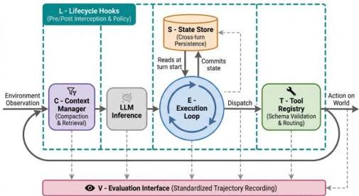
Figure 3. Overview of the proposed six-component agent harness architecture:  $\mathcal{H} = (E, T, C, S, L, V)$ . Each component occupies a distinct governance layer, with arrows tracing a single execution step from observation through context assembly, model inference, tool dispatch, and state commit.

CC BY

© 2026 by the author(s). Distributed under a Creative Commons CC BY license.

---

Preprints.org (www.preprints.org) | NOT PEER-REVIEWED | Posted: 28 April 2026

doi:10.20944/preprints202604.0428.v3

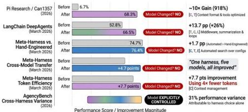
"In every study above, the model remained constant while the harness changed. The consistent finding across six independent investigations is that harness design explains more performance variance than model choice — the infrastructure surrounding the model, not the model itself, is the binding constraint on system reliability."
Figure 4. Empirical evidence matrix: five independent studies demonstrating that harness-level changes—without model changes—produce substantial performance improvements. xAI's Grok Code Fast 1 achieved a  $10 \times$  improvement ( $6.7\% \rightarrow 68.3\%$ ) on SWE-bench from edit-tool format change alone (Boluk 2026 [Practitioner report]); LangChain's DeepAgents improved from  $52.8\%$  to  $66.5\%$  ( $+26\%$ ) on TerminalBench with harness-only changes; Meta-Harness's automated optimization reached  $76.4\%$  on TerminalBench-2, surpassing hand-engineered approaches. In every case, the model remained constant while the harness changed.

Definition 2.1 (Agent Harness). An agent harness is a software system  $\mathcal{H} = (E, T, C, S, L, V)$  that implements six runtime governance functions:

-  $E$  — Execution loop: Manages the observe-think-act cycle, including turn sequencing, termination conditions, and error recovery
-  $T$  — Tool registry: Maintains a typed, validated catalog of available tool interfaces; routes and monitors tool invocations
-  $C$  — Context manager: Governs what information enters the model's context window across turns, including compaction, retrieval, and prioritization strategies
-  $S$  — State store: Persists task-relevant state across turns and, optionally, across sessions; provides recovery from partial failures
-  $L$  — Lifecycle hooks: Pre- and post-invocation interception points for authentication, logging, policy enforcement, and instrumentation
-  $V$  — Evaluation interface: Instruments the execution to capture action trajectories, intermediate states, and success signals for offline analysis, through standardized hooks that distinguish the  $V$ -component from general logging

The six functions are motivated by distinct governance requirements rather than introduced as an arbitrary taxonomy. In particular, the distinction between  $V$  (evaluation interface) and  $L$  (lifecycle hooks) should be made explicit, since both may appear to overlap in systems that record agent activity. The difference lies in functional scope and interface standardization.

$L$  provides pre- and post-invocation interception points for operational control, including authentication, authorization, audit logging, and policy enforcement. These hooks regulate execution events but do not, by themselves, define a standardized schema for representing agent behavior or exposing it to downstream evaluators.  $V$ , by contrast, provides a structured observability interface for capturing execution trajectories in a canonical format that can be consumed directly by benchmarking frameworks, evaluation pipelines, and observability platforms. Typical  $V$ -records include action sequences with typed arguments, intermediate state snapshots, tool-call outcomes, goal-completion indicators, and per-step token usage.

CC BY

© 2026 by the author(s). Distributed under a Creative Commons CC BY license.

---

Accordingly, lifecycle logging alone can establish that a tool invocation occurred, whereas a $V$-interface represents that invocation as part of an interpretable trajectory, enabling assessment of whether and how it contributed to task progress. This distinction has direct implications for HAL: its standardized evaluation harness requires a $V$-component that emits trajectory records in a canonical schema compatible with HAL’s analysis pipeline. A harness that provides only operational logging hooks cannot satisfy this requirement.

More broadly, the six functions correspond to six recurrent failure modes in production agent deployments: execution runaway ($E$), tool misuse ($T$), context blowout ($C$), state loss under failure ($S$), unmonitored side effects ($L$), and unobservable behavior ($V$). Taken together, they define the principal governance surfaces of agent execution. Systems implementing all six provide comprehensive operational governance; systems implementing only a subset provide partial governance coverage; and a bare model invocation provides no governance at the orchestration layer.

Necessary conditions. A system must implement at minimum $E$ and $T$ to qualify as a harness. Without $E$, there is no multi-step execution to govern; the system is a single-turn inference wrapper. Without $T$, the agent cannot act on the world; the system is a reasoning engine with no effectors. These two together constitute the minimal viable operational environment.

Sufficient conditions. A system implementing all six components with production-grade reliability—including error handling, authentication, observability integrations, and documented failure modes—qualifies as a full-stack harness.

Formal semantics of the $E$-component. An under-developed dimension of harness theory is the formal semantics of the execution loop itself. The $E$-component can be characterized as a labeled transition system (LTS) over states Q = {idle, observing, invoking-model, dispatching-tool, awaiting-tool-result, committing-state, terminated}, observable event alphabet $\Sigma$ (model response tokens, tool invocations, tool results, human approvals, errors), and a transition function $\delta:\text{Q}\times\Sigma\rightarrow\text{Q}$. This formalization reveals three correctness properties that informal descriptions cannot express: safety (the system never enters a state from which termination is unreachable, i.e., no execution runaway); liveness (from every reachable non-terminal state, a terminal state is reachable); and determinism (for reproducibility, $\delta$ must be a function rather than a relation, meaning environment non-determinism must be isolated at tool-call boundaries). Process algebra provides a complementary perspective: a harness’s concurrent sub-agent orchestration can be modeled in CCS or CSP, where the parallel composition of sub-agent processes $\text{P}_{1}\mid\mid\text{P}_{2}\mid\mid\ldots\mid\mid\text{P}_{n}$ must satisfy deadlock-freedom under the harness’s synchronization constraints. Xu *[58]* notes that orchestration patterns in multi-agent systems exhibit exactly the concurrency hazards—deadlock, livelock, and priority inversion—that process algebra was designed to detect. The practical implication is twofold: $E$-component designs should expose their state machines explicitly in configuration so that validators can check well-formedness before deployment, and multi-agent harnesses should demonstrate absence-of-deadlock for their orchestration topologies, analogously to how concurrent operating systems require protocol verification for inter-process communication. No current production harness satisfies either requirement, representing a gap between formal adequacy and engineering practice that the research directions in§6.9 should begin to close.

Formalization in Use: Classifying Systems via LTS. The LTS characterization of the $E$-component is not merely decorative; it provides a discriminative tool for the boundary cases analyzed in §7. Consider two contrasting systems. ReAct is instructive as a non-harness case. A ReAct implementation can be written as a while-loop with an informal “stop if the model outputs a final answer” condition. Rendered in LTS terms: the state set Q collapses to {active, done}; there is no idle state awaiting context commitment, no awaiting-tool-result state capturing asynchronous returns, and no committing-state transition that guarantees persistence before the next observe step. The transition function $\delta$ is therefore partial—it is undefined for error inputs, since ReAct has no error recovery arc—violating the LTS safety property that termination must always be reachable. The initial state $\text{q}_{0}$ = active and the terminal state $\text{F}$ = {done}, but no $\delta$ path guarantees reaching F when a tool call returns an exception. This formal gap

---

is precisely what practitioners observe as “execution runaway.” AutoGPT *[67]*, by contrast, qualifies as a harness under the LTS analysis. Its execution loop implements a richer state space: q_{0} = idle (awaiting task input), with transitions through goal-parsing, sub-task decomposition, internet-tool invocation, and state-persistence steps before cycling back to idle. The terminal condition F = {goal-achieved, max-steps-exceeded} is explicit in the codebase. The $\delta$ function is total over the documented event alphabet $\Sigma$—including exception events, which route to an error-recovery state rather than causing silent failure. AutoGPT’s notorious reliability problems arise not because its LTS is incomplete but because its $\delta$ transitions were implemented without the production-grade guarantees (idempotent state writes, atomic commits) that a safety-critical LTS requires. The distinction matters: ReAct fails to be a harness because it lacks the LTS structure; AutoGPT is a harness whose LTS structure is sound but whose implementation of that structure is not. The formalism draws this line precisely where intuition suggests it should be drawn. A third case, LangGraph, extends the analysis to a topology-encoded harness. LangGraph implements execution as a directed acyclic graph (DAG) of computation nodes. In LTS terms, Q is defined by the set of graph nodes; $\delta$ is defined by graph edges and conditional transition predicates attached to them; and the DAG topology guarantees liveness by construction—acyclicity ensures that no execution can loop indefinitely, so a terminal node is always reachable from any non-terminal node. The E-component is therefore present and formally well-behaved. However, the C-component is realized implicitly through graph topology rather than through an active context management policy: information flows between nodes via the graph structure, but no explicit context compaction, eviction, or prioritization mechanism governs what the model receives at each step. The consequence for classification is precise: LangGraph instantiates E and T (nodes invoke tools), satisfies the LTS safety and liveness properties by virtue of DAG structure, but realizes C implicitly rather than explicitly. We classify LangGraph as a topology-encoded harness—a harness in which C is derivable from the graph specification rather than from a separate runtime component. The LTS analysis thus discriminates three structurally distinct system classes: primitive non-harnesses (ReAct, in which $\delta$ is partial and safety fails), monolithic harnesses (AutoGPT, in which $\delta$ is total but implementation guarantees are weak), and topology-encoded harnesses (LangGraph, in which formal properties are established architecturally rather than imperatively). This three-way classification, derived from a uniform LTS framework, is not achievable by informal analysis alone. The full boundary case analysis for LangGraph, including its implicit C-component realization and comparison with LangChain as a framework primitive, appears in §2.2.

Figure 5 contrasts the labeled transition system structure of three representative systems: ReAct, AutoGPT, and LangGraph. The left panel shows ReAct’s collapsed two-state LTS (active $\rightarrow$ done), with no error-recovery arc and no committing-state intermediate—the incompleteness of $\delta$ over error inputs is visually apparent as a missing transition from the active state. The center panel shows AutoGPT’s richer state space, tracing the full path from idle through goal-parsing, tool-dispatch, state-persistence, and back to idle, with explicit error-recovery arcs that close the LTS under failure events; the gap between this formally sound structure and its weakly-guaranteed implementation is annotated. The right panel shows LangGraph’s DAG-encoded topology, where liveness follows from acyclicity rather than from explicit terminal-state specification—the C-component’s implicit realization through graph edges (rather than a separate runtime policy) is marked by a dashed border. Reading across the three panels illustrates the three system classes derived from the LTS analysis: primitive non-harness, monolithic harness, and topology-encoded harness, each with distinct formal properties and distinct engineering implications.

---

Preprints.org (www.preprints.org) | NOT PEER-REVIEWED | Posted: 28 April 2026

doi:10.20944/preprints202604.0428.v3

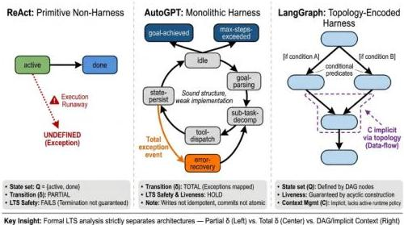
Key Insight: Formal LTS analysis strictly separates architectures — Partial  $\delta$  (Left) vs. Total  $\delta$  (Center) vs. DAG/Implicit Context (Right)
Figure 5. LTS structure comparison of three representative systems: ReAct (primitive non-harness), AutoGPT (monolithic harness), and LangGraph (topology-encoded harness). The three panels illustrate how formal LTS analysis distinguishes system classes.

# 3.2.1. The  $V$ -component Design Space: From Logging to Evaluation Pipelines

The evaluation interface ( $V$ -component) is the most frequently under-implemented harness component—partial or absent in 14 of 22 systems in the completeness matrix—and the one whose design space is least understood. This under-implementation reflects two complementary misunderstandings. First, practitioners frequently conflate  $V$  with  $L$ : since lifecycle hooks ( $L$ ) capture harness events for operational purposes, deployers assume that operational logs are sufficient for evaluation. This conflation misses the essential requirement of the  $V$ -component: standardized trajectory schemas that external benchmark frameworks can consume directly. Second, practitioners designing single-deployment harnesses have no need for cross-harness comparison, so the portability requirement of the  $V$ -component—the requirement that its output be interpretable by evaluation pipelines outside the harness—seems unnecessary. The cost of this underinvestment becomes apparent only when evaluation is needed: at that point, retrofitting a  $V$ -component onto a harness without one requires substantial re-engineering.

The  $V$ -component design space spans four capability levels. At the most basic level  $(V_{1})$ , the harness records timestamped events—tool calls, model responses, errors—in a flat log format suitable for human inspection but not for automated analysis. At the intermediate level  $(V_{2})$ , the harness produces structured trajectory records with typed fields—action type, argument schema, tool response, token count per step—that enable automated aggregation and comparison. At the advanced level  $(V_{3})$ , the harness produces enriched trajectory records that include intermediate reasoning steps, context window snapshots before each model call, and goal-progress estimates derived from harness-level task state—enabling the kind of causal attribution analysis that SkillsBench and AgencyBench require. At the most sophisticated level  $(V_{4})$ , the harness supports live streaming evaluation: trajectory records are produced in real time as the agent executes, enabling evaluation pipelines to compute running performance metrics and trigger early stopping when success or failure is definitively determined. HAL's standardized evaluation harness operates at  $V_{3} - V_{4}$ ; most production harnesses currently operate at  $V_{1}$ . The gap between  $V_{1}$  and  $V_{3}$  is not merely a matter of adding fields to a log schema; it requires architectural decisions about what state the harness maintains between steps to enable trajectory enrichment, and those decisions interact with the  $C$  and  $S$  components in ways that make  $V$ -component upgrade a cross-component re-engineering effort.

CC BY

© 2026 by the author(s). Distributed under a Creative Commons CC BY license.

---

Preprints.org (www.preprints.org) | NOT PEER-REVIEWED | Posted: 28 April 2026

doi:10.20944/preprints202604.0428.v3

A production deployment illustrating  $V_{3}$ -level evaluation architecture is SearchLLM [68], a generative search system deployed at scale on a large content platform. SearchLLM's evaluation stack combines deterministic rule-based evaluators—checking factual grounding, format compliance, and non-negotiable safety constraints—with LLM-based judges assessing alignment with diverse searcher intent and robustness to noisy retrieval. Critically, the two tiers are hierarchically structured: bottom-line constraints are enforced before preference optimization objectives are evaluated, preventing cases where a fluent but factually grounded violation is rewarded. Evaluator calibration proceeds through a human-in-the-loop process, making the evaluation interface itself a continuously governed artifact rather than a static configuration. This architecture maps directly onto the  $V$ -component design requirements: structured trajectory records with typed per-dimension scores enable causal attribution that flat success/failure logs cannot provide, and the  $L$ -component's lifecycle governance role extends to the calibration loop that keeps evaluation signals faithful to actual searcher preferences under distribution shift.

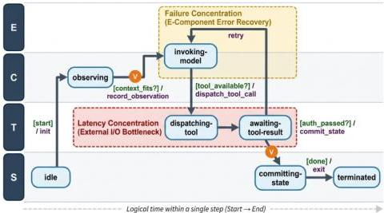
Figure 6. LTS-based execution pipeline visualization. Shows a single harness step as a path through labeled transition system states, with  $V$ -component observation points.

# 3.2.2. Framework Status and Validation Pathway

The six-component decomposition  $\mathcal{H} = (E, T, C, S, L, V)$  is a theoretically proposed framework, not an inductively derived taxonomy: it was constructed by conceptual analysis of production failure modes and governance requirements, not by factor-analyzing a corpus of existing systems. The number six reflects a principled decomposition across three design dimensions: the execution environment dimension ( $E$  — execution loop;  $T$  — tool registry) captures how the harness interfaces with the external world; the cognitive management dimension ( $C$  — context manager;  $S$  — state store) captures how the harness governs the information available to the model; and the governance dimension ( $L$  — lifecycle hooks;  $V$  — evaluation interface) captures how the harness monitors, enforces policy, and exposes agent behavior for accountability. Three dimensions, each decomposed into exactly two components, yields six—a structure that is motivated rather than arbitrary.

Should a candidate seventh component arise—for instance, a dedicated cost manager governing token-budget allocation—the criterion for expansion versus subsumption is: can the candidate component's function be fully expressed within one or more existing components? A cost manager that intercepts every model invocation and enforces a token budget can be realized as a specialized lifecycle hook  $(L)$ ; it does not require a new state-space dimension. If a candidate capability genuinely cannot be expressed by any combination of  $E$ ,  $T$ ,  $C$ ,  $S$ ,  $L$ ,  $V$ —if it requires a fundamentally new governance

CC BY

© 2026 by the author(s). Distributed under a Creative Commons CC BY license.

---

Preprints.org (www.preprints.org) | NOT PEER-REVIEWED | Posted: 28 April 2026

doi:10.20944/preprints202604.0428.v3

18 of 105

contract with a new interface type—then extension of the framework is warranted. Otherwise, it should be subsumed within the nearest component.

Empirical validation of this decomposition remains future work. Three methodologies are appropriate: factor analysis of component co-occurrence patterns across a larger system corpus; developer interviews to determine whether the six-component vocabulary matches practitioner mental models; and predictive testing of whether completeness ratings on this framework predict cross-harness performance variation in designs like SkillsBench. Among these, predictive testing is the most immediately tractable: it requires only that existing benchmark results be re-analyzed while controlling for harness choice—a methodology already demonstrated by AgencyBench and SkillsBench. Factor analysis and developer interviews, while more methodologically rigorous, require primary data collection and are appropriately scoped as medium-term research objectives. We flag this as an explicit open item in §7.

# 3.3. The Orthogonality Assumption and Its Limits

The six-component analytical framework presented in Definition 2.1 assumes logical orthogonality among components for the purpose of discussion—each component can be characterized, evaluated, and improved independently. This is an analytical convenience, not an implementation claim. In practice, the six components are deeply coupled subsystems, and §6 is precisely a systematic analysis of this coupling. The most consequential coupling is between  $E$  and  $S$ : the execution loop's recovery behavior (what happens when a step fails) depends fundamentally on the state store's persistence guarantees (what was committed before the failure), and these interactions cannot be specified or verified by analyzing  $E$  and  $S$  independently. Similarly,  $C$  and  $L$  are coupled through context policy enforcement: the lifecycle hooks that govern what content may enter the context window interact with the compaction and retrieval mechanisms that determine what actually does. A harness designer who treats the six components as truly orthogonal will produce a system whose failure modes arise precisely from the coupling that the analytical framework abstracts away. Section 5 addresses this coupling systematically; acknowledging it here as a definitional limitation is both honest and productive—it explains why the cross-cutting analysis of §6 is necessary and why single-  $E$ -component improvement programs have historically underdelivered.

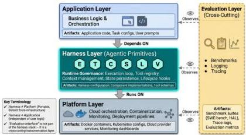
Figure 7. Harness stack conceptual layers: application, harness, platform, and evaluation layers with their respective artifacts.

# 3.4. Situating the Harness in the Agent Stack

The harness definition acquires additional clarity when positioned against adjacent concepts. The core framework-harness distinction is development-time versus runtime: a framework (LangChain [43], LlamaIndex [69], PydanticAI [70]) provides construction primitives that developers use to build agents;

CC BY

© 2026 by the author(s). Distributed under a Creative Commons CC BY license.

---

Preprints.org (www.preprints.org) | NOT PEER-REVIEWED | Posted: 28 April 2026

doi:10.20944/preprints202604.0428.v3

a harness is the operational environment governing what happens when the agent runs. An agent platform (Manus [71], Microsoft Copilot Studio [72], AWS Multi-Agent Orchestrator [73]) operates above the harness layer, adding design environments, deployment pipelines, monitoring dashboards, and skill marketplaces. A platform typically contains a harness as its runtime substrate but extends far beyond it. The evaluation harness (EleutherAI [74]) is a historically prior and narrower concept—infrastructure for batch-testing language models—that implements  $V$  from our definition but not  $E$ ,  $T$ ,  $C$ ,  $S$ , or  $L$ . The agent OS [75] framing applies operating systems theory to harness design, showing that classical OS mechanisms—scheduling, memory management, access control, storage isolation—have direct analogs in agent execution infrastructure. We treat agent OS as the most architecturally rigorous instantiation of the harness concept rather than a competing one.

Table 2. Harness Concept Disambiguation. Five adjacent concepts—framework, harness, agent platform, evaluation harness, and agent OS—compared by primary role, stack position, and relationship to the harness definition.

<table><tr><td>Concept</td><td>Primary Role</td><td>Scope</td><td>Runtime?</td><td>Key Question</td></tr><tr><td>Framework</td><td>Construction primitives</td><td>Dev-time</td><td>No</td><td>How is the agent built?</td></tr><tr><td>Harness</td><td>Runtime governance</td><td>Runtime</td><td>Yes</td><td>How does the agent run reliably?</td></tr><tr><td>Platform</td><td>Organizational management</td><td>Both</td><td>Both</td><td>How are agents managed at scale?</td></tr><tr><td>Agent OS</td><td>Formal kernel services</td><td>Runtime</td><td>Yes</td><td>What are the minimal governance abstractions?</td></tr><tr><td>Eval harness</td><td>Assessment infrastructure</td><td>Test-time</td><td>Partial</td><td>How is agent behavior measured?</td></tr></table>

The six harness components  $(E, T, C, S, L, V)$  are not independent — they form a directed dependency graph in which some components require others to function correctly. The  $E$ -component (execution loop) depends on  $T$  (to invoke tools),  $C$  (to construct prompts), and  $S$  (to persist state between steps). The  $L$ -component (lifecycle hooks) depends on all five other components, as hooks must intercept events at each component boundary. The  $V$ -component (evaluation interface) depends on  $L$  (for event logging) and  $S$  (for trajectory replay). This dependency structure has a practical implication: a harness cannot implement reliable  $L$ -component security hooks without first having well-defined interfaces on  $E, T, C$ , and  $S$  — which explains why security is frequently treated as an afterthought rather than a first-class design concern. The dependency graph also makes visible that the  $V$ -component is downstream of all governance decisions, meaning that evaluation quality is bounded by the quality of the underlying harness infrastructure.

The following table maps common agent task types to their harness component requirements. Different task types impose qualitatively different demands on the harness, and these demands do not scale linearly — the move from optional to required for state  $(S)$  and lifecycle  $(L)$  components marks a structural transition in harness complexity.

Table 3. Harness Component Requirements by Task Type. Required implementation level for each of the six components  $(E, T, C, S, L, V)$  across representative task categories.

<table><tr><td>Task Type</td><td>E (Loop)</td><td>T (Tools)</td><td>C (Context)</td><td>S (State)</td><td>L (Lifecycle)</td><td>V (Eval)</td><td>Example Systems</td></tr><tr><td>Single-turn Q&amp;A</td><td>Minimal</td><td>Optional</td><td>Minimal</td><td>×</td><td>×</td><td>Optional</td><td>ChatGPT, Claude.ai</td></tr></table>

#

© 2026 by the author(s). Distributed under a Creative Commons CC BY license.

---

Preprints.org (www.preprints.org) | NOT PEER-REVIEWED | Posted: 28 April 2026

doi:10.20944/preprints202604.0428.v3

20 of 105

Table 3. Harness Component Requirements by Task Type. Required implementation level for each of the six components  $(E, T, C, S, L, V)$  across representative task categories.

<table><tr><td>Task Type</td><td>E (Loop)</td><td>T (Tools)</td><td>C (Context)</td><td>S (State)</td><td>L (Lifecycle)</td><td>V (Eval)</td><td>Example Systems</td></tr><tr><td>Multi-step web research</td><td>Moderate</td><td>Required (web, search)</td><td>High</td><td>~</td><td>~</td><td>Optional</td><td>WebArena agents</td></tr><tr><td>Software engineering</td><td>High</td><td>Required (code exec, file)</td><td>High</td><td>Required</td><td>Required</td><td>Required</td><td>SWE-agent, OpenHands</td></tr><tr><td>Long-running personal assistant</td><td>High</td><td>Required (broad)</td><td>High</td><td>Required</td><td>Required</td><td>Optional</td><td>OpenClaw, MemGPT</td></tr><tr><td>Multi-agent collaboration</td><td>High</td><td>Required</td><td>High</td><td>Required</td><td>Required</td><td>Required</td><td>MetaGPT, AutoGen</td></tr><tr><td>Robotic/ embodied task</td><td>High</td><td>Required (actuators)</td><td>Moderate</td><td>Required</td><td>Required</td><td>Required</td><td>RAI, embodied systems</td></tr></table>

Legend:  $\times =$  not required;  $\sim =$  partial/conditional; Required  $=$  structurally necessary for task completion.

The key insight visible in this table is that harness component requirements escalate in a nonlinear fashion as task complexity increases. The transition from "Optional" to "Required" for  $S$  and  $L$  components represents the defining boundary between a chatbot (which requires  $E, T,$  and  $C$  in minimal form) and a harness (which additionally requires persistent state management and lifecycle policy enforcement). Multi-agent and embodied tasks require all six components because they simultaneously impose long execution horizons (necessitating  $E$  complexity), broad tool access  $(T)$ , substantial context assembly  $(C)$ , cross-turn state  $(S)$ , policy monitoring  $(L)$ , and measurable outcomes  $(V)$ . Any deployment where  $S$  or  $L$  is absent should be understood as a chatbot-mode deployment regardless of whether the system uses an "agent" API — the harness boundary is defined by the presence of these governance components, not by the model's planning capability.

This formal framework establishes our vocabulary for analyzing agent harnesses. But to understand why this particular set of six components emerged as the dominant architecture, we must examine the historical path that led to it. The harness concept did not appear fully formed; rather, it evolved through decades of software engineering practice—from test harnesses in static code analysis, through execution harnesses in reinforcement learning, to the modern agent infrastructure we see today. Understanding this history reveals both the inevitability of the six-component pattern and the points where alternative architectures were explored but ultimately abandoned.

# 4. Historical Evolution

The agent harness is sometimes described as if it appeared fully formed alongside the first LLM agent systems. A more accurate account is that it crystallized gradually from three independent technological lineages, each of which contributed essential ideas while also exhibiting fundamental limitations that required the harness concept to be something genuinely new. Understanding this history matters for understanding the current state of the field: many of the design tensions in contemporary harnesses—between isolation and capability, between reproducibility and flexibility, between automation and human oversight—trace directly to the partial answers offered by prior traditions.

CC BY

© 2026 by the author(s). Distributed under a Creative Commons CC BY license.

---

Preprints.org (www.preprints.org) | NOT PEER-REVIEWED | Posted: 28 April 2026

doi:10.20944/preprints202604.0428.v3

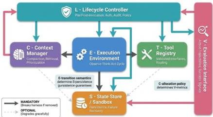
Figure 8. Harness Component Dependency Graph. The directed graph shows the six core components  $(E, T, C, S, L, V)$  as nodes, with edges representing structural dependencies where the output of one component constrains the implementation of another. For example, the  $E$ -component's state-transition semantics directly determine what  $S$ -component persistence guarantees are needed; the  $C$ -component's context allocation policy determines what  $V$ -component evaluation metrics are meaningful. The heavy edges show mandatory dependencies (removing them breaks the harness); light edges show optional augmentations (removing them gracefully degrades to a simpler architecture). This graph explains why certain "component skipping" optimizations fail at scale: eliminating the  $L$ -component to save latency breaks security policy enforcement; eliminating the  $V$ -component to reduce instrumentation overhead breaks evaluation validity. The graph is read left to right by governance scope: model-facing  $(C, S)$  at the left, world-facing  $(T)$  in the middle, and cross-cutting  $(L, V)$  at the right.

Figure 9 charts the evolutionary trajectory of agent harness infrastructure from 2017 to 2025, organizing key systems and events along three parallel tracks: software test harnesses (top), reinforcement learning environments (middle), and LLM agent frameworks (bottom). The figure makes two structural observations visual: first, that each lineage contributes distinct ideas—governance templates, interface standards, failure mode catalogs—that are jointly necessary for the harness concept but individually insufficient; second, that the three lineages converge in the 2023-2024 period as the harness turn crystallizes, marked by the simultaneous emergence of AIOS formalization, MCP protocol standardization, and the first generation of evaluation infrastructure benchmarks. Reading the timeline left to right traces the progression from isolated experiments to a recognized engineering discipline; the convergence point at 2024 marks the transition from implicit to explicit harness design.

# 4.1. Three Lineages, One Synthesis

Before tracing each lineage, it is worth stating explicitly what the synthesis produces that none of the lineages provides individually. The goal is to characterize what is genuinely new about agent harnesses as a class of system, as distinct from improved versions of prior things.

Software test harnesses (§4.2) establish the governance wrapper pattern: the idea that executing software should be wrapped in an environment that controls inputs, monitors outputs, and enforces isolation. But test harnesses are designed for deterministic, single-shot execution of bounded programs—not for open-ended, multi-step processes that generate their own intermediate goals and interact with unpredictable external systems.

Reinforcement learning environments (§4.3) establish the interface standard pattern: the idea that agent-environment interaction should be mediated by a defined contract with explicit observation and action spaces. But RL environments assume finite action spaces, short-horizon tasks, and scalar reward as an evaluation currency—assumptions that fail for LLM agents operating in open-ended natural language domains over task horizons measured in hours.

CC BY

© 2026 by the author(s). Distributed under a Creative Commons CC BY license.

---

Early LLM frameworks (§4.4) establish the failure mode catalog: the empirical record of what goes wrong when LLM agents are deployed with minimal infrastructure. This record defines exactly what governance functions a harness must provide—not by deduction from first principles, but by induction from observed failures.

The agent harness synthesizes the governance wrapper pattern (from test harnesses), the interface standard pattern (from RL environments), and the failure mode catalog (from early LLM frameworks) into a runtime governance system for open-ended multi-step execution in natural language domains. This synthesis is not an incremental improvement on any prior system; it is a genuinely new kind of infrastructure whose design requirements are determined by constraints—open-ended execution, natural language semantics, external system interaction at scale—that none of the prior lineages faced.

### 4.2 Thread 1 — Software Test Harnesses: The Governance Template

The original meaning of “test harness” in software engineering dates to the automation of unit and integration testing. JUnit (*[37]*), xUnit frameworks *[76]*, and their successors established a pattern: a harness feeds prepared inputs to a software unit under test, captures its outputs, and checks them against expected results. The harness controls the execution environment, ensuring tests run in isolation and produce reproducible results.

This tradition established several ideas that persist in agent harnesses: the notion that an executing system needs a governing wrapper; that this wrapper should handle setup, teardown, and result capture; and that reproducibility is a property of the wrapper, not the system under test. The CI/CD paradigm extended these ideas to continuous execution pipelines, introducing hooks, lifecycle events, and structured logging—all of which appear in modern agent harnesses under different names.

The critical limitation of this tradition is scope. A test harness runs a program once, in a fixed context, to check a predetermined property. There is no multi-turn state, no dynamic tool registration, no need to manage context across a long task sequence. The governance problem it solves is trivially simpler than what agent execution requires. The contribution is conceptual and terminological, not architectural.

### 4.3 Thread 2 — Reinforcement Learning Environments: The Interface Standard

OpenAI Gym *[38]* introduced something more directly relevant: a standard interface between an agent and its environment. The reset(/observe() pattern established that agent-environment interaction should be mediated by a defined contract, and that environments should be isolatable, resettable, and reusable across experiments. This tradition contributed three ideas that LLM agent harnesses inherited: interface standardization, isolation, and evaluation instrumentation (in RL, the reward signal; in LLM agents, task trajectories).

The Gym abstraction decomposed the agent–environment interface into a small set of standardized methods: an initialization method reset() that returns an initial observation, and a transition method step(action) that returns the next observation, a scalar reward, a termination flag, and auxiliary debugging information. This decomposition is elegant precisely because it separates the agent’s decision problem (what action to take) from the environment’s dynamics (what happens when that action is taken), establishing a clean interface contract that enables agents and environments to be developed and tested independently.

LLM agent harnesses inherit the spirit of this interface contract—the idea that agent-environment interaction should be mediated by a defined interface with explicit semantics—but must substantially extend it in four dimensions. First, the action space in LLM agents is a structured natural language generation rather than a finite typed set, requiring the harness to parse, validate, and dispatch model outputs rather than simply routing an integer action token. Second, the reward signal in RL is assumed to be a complete evaluation currency (maximizing cumulative reward is the agent’s entire objective); in LLM agents, task success is a complex compositional predicate that requires evaluator judgment, not merely observation of a scalar. Third, the reset() function in RL can restore the environment to an exact prior state; for LLM agents operating in real external environments (web services, file

---

systems, APIs), reset is either impossible or requires elaborate snapshot and rollback mechanisms. Fourth, RL environments assume that the agent’s action has a unique effect on environment state; LLM agents operating with multi-tool access produce compound state effects (a single model output may trigger multiple tool calls with independent side effects) that require harness-level effect tracking and composition.

The transfer problem is significant, however. RL environments make assumptions that do not hold for LLM agents: finite, typed action spaces; short-horizon synthetic tasks that can be reset between runs; and scalar reward as a complete evaluation currency. LLM agents generate open-ended natural language that must be parsed into actions, operate over tasks running minutes to hours against real external systems, and require evaluation methodologies that are themselves research problems. Research attempted to bridge this gap—Gymnasium *[77]* provided the Gymnasium standard interface for reinforcement learning environments; GAIA *[18]* wrapped real-world tasks in a Gym-like interface—but each required substantial redesign, demonstrating inheritance alongside the depth of the mismatch. BrowserGym (*[78]*) represents the current state of the art in RL-inspired LLM agent environment abstraction: by defining a standard observation type (browser state as structured HTML + screenshot), a standard action space (web interaction primitives: click, type, scroll, navigate), and a standard reward mechanism (task completion verified against goal state), BrowserGym achieves the RL interface standard’s benefits (agent-environment independence, reusable evaluation infrastructure) while extending it to the real-web setting that RL environments could not reach.

### 4.4 Thread 3 — The Early LLM Agent Frameworks: The Failure Mode Catalog

The third lineage is the most proximate. Beginning in 2022, the earliest LLM agent systems operated with minimal infrastructure. ReAct (*[79]*) could be implemented in fifty lines of Python: a loop, a prompt template, and a small tool dispatch table. These systems were demonstrations of model capability, not engineering achievements.

Alongside ReAct, the period produced two foundational results on tool integration. Toolformer (*[80]*) demonstrated that language models could teach themselves to invoke external tools—calculators, search engines, translation APIs—through a self-supervised training objective, establishing the first principled account of how tool-use capability is acquired rather than hard-coded. Gorilla (*[81]*) extended this to API-scale tool environments: by training on a corpus of 1,600+ real-world APIs and introducing retrieval-augmented tool selection, Gorilla showed that hallucination in tool-call arguments—a persistent harness reliability failure mode—could be substantially reduced by grounding tool selection in retrieved API documentation rather than model priors alone. ToolLLM (*[4]*) pushed this further, constructing the ToolBench dataset of 16,000+ real-world APIs and a DFSDT (Depth-First Search Decision Tree) planning strategy, demonstrating that systematic tool-call planning within the harness’s execution loop substantially outperforms greedy API selection. Together, Toolformer, Gorilla, and ToolLLM document a progression in harness $T$-component design: from tool capability as a model property (Toolformer), to tool selection as a retrieval problem (Gorilla), to tool planning as a search problem that the harness’s execution loop must support (ToolLLM).

The first-generation autonomous agents like AutoGPT *[82]* and BabyAGI *[83]* , changed the landscape by giving agents persistent goals, internet access, and the ability to spawn sub-tasks. They created systems complex enough to fail in new and instructive ways. The documented failure modes of these early systems constitute, in retrospect, a catalog of exactly the governance functions a harness must provide: execution runaway from absent termination logic (failure of $E$); context blowout as history accumulated without compression (failure of $C$); state loss when multi-step tasks were interrupted (failure of $S$); and unmonitored side effects from agents that could send emails and modify files with no logging (failure of $L$).

Alongside these failure demonstrations, 2023 produced the first serious architectural experiments in multi-agent coordination. CAMEL (*[84]*) introduced a role-playing framework in which agents communicate through structured conversational turns with explicit role declarations. This concep

---

tual pattern—agent identity, capability advertisement, and task delegation as explicit protocol-level concerns—prefigures what A2A later formalized at the infrastructure layer. ChatDev (*[85]*) organized multi-agent workflows along the waterfall software development process, assigning roles (Product Manager, Programmer, Tester, Reviewer) and enforcing structured document handoffs between them. ChatDev’s contribution to harness theory is its demonstration that inter-agent communication schemas—not just agent capabilities—determine workflow reliability: when the document format between agents is under-specified, task degradation propagates across the entire pipeline. MetaGPT (*[86]*) went further by encoding standardized operating procedures (SOPs) into inter-agent communication: each agent role consumed structured documents as inputs and produced structured documents as outputs, making the message schema itself a governance artifact. This SOP-driven communication architecture is, in retrospect, a direct precursor to A2A’s agent card and task specification design: both treat inter-agent interaction as a typed contract rather than a free-form conversation.

The key harness implication is that neither CAMEL, ChatDev, nor MetaGPT treated the message-passing infrastructure as separable from the agent logic—the protocol was embedded in the agent code, making it impossible to substitute or upgrade the communication layer without rewriting the agents. The emergence of A2A as an explicit protocol layer represents the field’s recognition that this coupling was a design error: inter-agent communication should be a harness-level governance function, not an application-level convention.

Also in 2023, Voyager (*[3]*) introduced a persistent, growing skill library—executable code artifacts that an agent could add to and retrieve from across sessions, a principled solution to the state management problem that stored abstracted, reusable capabilities rather than raw interaction history. MemGPT (*[13]*) tackled the context management problem directly, modeling the context window as RAM and external storage as disk. Reflexion (*[5]*) introduced a complementary memory mechanism: rather than storing experiences as raw observations, Reflexion agents convert failed execution traces into verbal self-critiques stored in an episodic buffer, enabling language-grounded self-improvement across attempts without gradient updates. The episodic buffer in Reflexion is a precursor to the structured experience stores that modern $S$-components must support: it stores not what happened but what the agent learned from what happened—a representational distinction with direct implications for retrieval quality in long-running deployments. Meanwhile, Generative Agents (*[87]*) demonstrated harness-level memory architecture at social simulation scale: 25 LLM agents in a simulated town, each maintaining a memory stream of timestamped observations, a reflection mechanism that periodically synthesizes higher-order insights, and a retrieval function combining recency, importance, and relevance scores. The Generative Agents architecture made three contributions to harness memory design that remain influential: that raw observations and synthesized insights require separate storage tiers; that retrieval must balance multiple relevance signals; and that reflection, the periodic compression and abstraction of experience, is a harness-level scheduling concern, not merely a model capability. Each of these systems was tackling the same underlying question about what should persist, in what form, under what governance from different angles.

#### 4.4.1 The 2023 Benchmark Infrastructure Emergence

Alongside the capability experiments of 2023, the field produced its first generation of evaluation infrastructure that was itself harness engineering. This development is often overlooked because benchmark papers are categorized by their task domain rather than their infrastructure contribution, but the harness engineering required to make these benchmarks valid and reproducible was as significant as the task design.

WebArena (*[19]*) provides the most instructive case. Deploying 812 long-horizon web navigation tasks against self-hosted live web environments—not cached snapshots, not third-party services, but fully operational web applications including a shopping site, a code repository, a Reddit-style forum, and a corporate wiki—required deploying and maintaining four independent web application servers, managing account state across hundreds of simulated users, implementing action injection mechanisms compatible with arbitrary web application architectures, and designing success criteria that could be

---

verified programmatically against arbitrary application state. The harness engineering to run one evaluation instance of WebArena was more complex than the harness engineering of most production agent deployments at the time. WebArena’s architecture directly influenced subsequent benchmarks: the pattern of self-hosted environment infrastructure became the standard for evaluation systems that required ecological validity without depending on external service availability.

AgentBench (*[17]*) posed a different infrastructure challenge: coordinating eight parallel evaluation environments, each with distinct observation spaces, action spaces, and state management requirements. The AgentBench harness acts as an orchestration layer over eight sub-harnesses, each tailored to its environment domain. Its $L$-component must manage authentication, logging, and policy enforcement across eight different environment APIs simultaneously, with no shared schema. Its $V$-component must normalize eight different task success criteria into a common evaluation record format. The engineering challenge of building a harness that interfaces cleanly with eight structurally different environments is precisely the interoperability problem that MCP later addressed for tool interfaces—but applied to evaluation environments rather than tools, and solved ad-hoc rather than through a standard protocol.

GAIA (*[18]*) took a different approach, designing tasks that required multi-step reasoning across tools (web search, file processing, code execution) while maintaining natural language task specifications accessible to human annotators. Its 77-percentage-point human/GPT-4 performance gap was not primarily a model capability finding; it was an infrastructure finding: human agents have access to richer environmental grounding—they can freely browse, annotate, verify, and course-correct—that LLM agents operating through fixed harness interfaces cannot reproduce. This framing—the performance gap as an infrastructure gap rather than a capability gap—is precisely the harness-as-infrastructure thesis of §1 restated in evaluation terms, and GAIA is the benchmark that makes it most empirically vivid.

### 4.5 The Harness Turn (2024–2026)

By 2024, the experimental energy of the early LLM agent period had given way to engineering discipline. The field had accumulated enough deployment experience to recognize that the binding constraint on agent reliability was not model quality but infrastructure quality. We call this shift the harness turn. To understand the current landscape of agent harness engineering, it is instructive to trace how the notion of a “harness” has evolved across decades, from software testing scaffolds to the infrastructure backbone of modern LLM agent systems. The following figure 9 presents this progression:

---

Preprints.org (www.preprints.org) | NOT PEER-REVIEWED | Posted: 28 April 2026

doi:10.20944/preprints202604.0428.v3

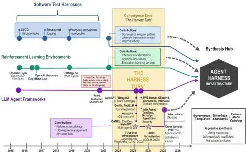
Figure 9. Evolutionary trajectory of agent harness infrastructure (2017-2025), showing convergence of three lineages: software test harnesses, reinforcement learning environments, and LLM agent frameworks.

Benchmark infrastructure matured into a distinct engineering challenge: SWE-bench [16], OS-World [61], WebArena [19], WorkArena [88], and HAL [14] each required substantial harness engineering to run reproducibly at scale. Protocol standardization emerged as a practical necessity—Anthropic's MCP and Google's A2A represent the field's recognition that tool-registry standardization cannot be solved by each harness independently. Academic formalization arrived with AIOS [75]. And empirical studies of cross-harness variation—AgencyBench and SkillsBench—provided the quantitative grounding that prior analysis lacked.

The Three Engineering Paradigms: A Retrospective. The 2022-2026 period reveals a coherent three-phase evolution in what the field has chosen to engineer:

1. Prompt Engineering (2022-2024): The primary engineering lever was the text of the input prompt itself. Researchers and practitioners optimized by crafting better instructions, few-shot examples, and reasoning templates. The question was: "What text should we give the model to get better outputs?" This era produced chain-of-thought prompting, in-context learning, and instruction tuning as core methodologies.
2. Context Engineering (2025): As agents became longer-running, the binding constraint shifted from "what is the input?" to "what information should the model see?" This era focused on context management: what to inject on each turn, how to retrieve and compress memories, how to rank tool results by relevance, and how to handle context window saturation. Context engineering asks: "What structured information should we assemble and present to the model to guide its decisions?" This is when practitioners began systematizing memory retrieval, tool result formatting, and dynamic context management.
3. Harness Engineering (2026): As models became capable enough to handle long-running tasks but deployment reliability remained elusive, the engineering focus expanded to the full infrastructure wrapper. Harness engineering asks: "What governance, constraints, feedback loops, and execution controls must we design to make agent systems reliable?" The answer spans all six components  $(E, T, C, S, L, V)$  considered as an integrated whole. This era, represented by OpenAI's Codex harness [20], Meta-Harness [53] optimization, and LangChain's DeepAgents [43], recognizes that model capability is necessary but insufficient—reliability emerges from the interaction of a capable model with a thoughtfully designed execution environment.

CC BY

© 2026 by the author(s). Distributed under a Creative Commons CC BY license.

---

Preprints.org (www.preprints.org) | NOT PEER-REVIEWED | Posted: 28 April 2026

doi:10.20944/preprints202604.0428.v3

Each paradigm represents an expansion of the scope of engineering concern. Prompt engineering optimizes a single text input. Context engineering manages the structured information landscape around the model. Harness engineering designs the full six-component governance infrastructure. See Figure 10 for a visual representation of this progression.

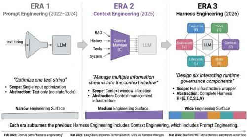
Figure 10. The three engineering paradigms: Prompt Engineering (2022-2024), Context Engineering (2025), and Harness Engineering (2026). Each era expands the scope of engineering concern—from optimizing a single text input, through managing multiple information streams into the context window, to designing the full six-component infrastructure  $\mathcal{H} = (E, T, C, S, L, V)$ . The progression reflects the field's recognition that agent reliability depends on increasingly comprehensive runtime governance.

# 4.6. Why the Harness Concept Required All Three Lineages

The agent harness is not a linear evolution of any single prior tradition. Software test harnesses established the need for a governing wrapper but not its runtime character. RL environments established interface standardization and isolation but assumed simplicity that LLM agent tasks do not have. Early LLM frameworks demonstrated what specifically goes wrong without governance and produced the first solutions to specific governance subproblems. The harness synthesizes all three contributions while addressing the limitations of each—which is precisely why it required all three lineages to emerge, and why it cannot be reduced to any one of them.

The historical convergence toward a consistent architectural pattern raises a natural question: Is this pattern truly universal, or are there meaningful variations in how systems instantiate the harness? To answer this, we need an empirical taxonomy that tests the completeness and generality of our six-component model against a diverse set of real-world systems. The next section presents such a taxonomy, examining 22 representative agent harnesses and validating that they can be meaningfully compared and contrasted using the component framework.

# 5. Taxonomy of Agent Harness Systems

# 5.1. The Classification Problem

Any taxonomy of agent harness systems must resolve a prior question: what dimension of variation is being classified? The existing ecosystem includes systems that differ along at least three independent axes—functional completeness (how many of the six governance components they implement), domain specialization (whether they are designed for general or specific task types), and stack position (whether they operate as runtime environments, development tools, or capability components). We adopt a two-dimensional classification: stack position as the primary dimension and domain scope as

CC BY

© 2026 by the author(s). Distributed under a Creative Commons CC BY license.

---

the secondary dimension. This organization reflects the question practitioners most frequently ask: “Is this system something I can deploy directly, or something I build with?”

#### 5.1.1 System Selection Methodology

This survey analyzes 23 agent harness systems, but the selection process itself requires explicit justification. We adopt a structured expert survey approach rather than a PRISMA-compliant systematic review, reflecting the nascency of the agent harness literature and the prevalence of grey literature (practitioner reports, developer blogs, GitHub repositories) as primary sources.

Inclusion criteria. Systems are included if: (1) they implement publicly documented architectures; (2) they instantiate at least three of the six harness components $(E,T,C,S,L,V)$; and (3) they are accessible to researchers through source code, official documentation, or published academic descriptions. This threshold of “$\geq$3 components” operationalizes the distinction between agent infrastructure and general-purpose application frameworks: a system implementing only $E$ and $T$ is a workflow orchestrator, not an agent harness. Systems are categorized by their primary design intent (full-stack harness, framework, module, or evaluation infrastructure), but component adoption is the technical criterion for inclusion.

Search strategy. Systems were identified through four complementary pathways: (1) systematic search of academic literature from ACL, NeurIPS, ICLR, ICML, and AAAI conferences published between January 2023 and March 2026, with keyword queries combining “agent,” “harness,” “orchestration,” “framework,” and “orchestration infrastructure”; (2) snowball sampling from references in agent surveys and position papers (Wang et al. 2024; Si et al. 2024; Tavčar et al. 2024); (3) systematic GitHub repository enumeration filtering for repositories with publication history and $\geq$ 500 stars within the search window, applying labels “agent,” “agent-framework,” “agentic,” and “autonomous-agent”; and (4) documented practitioner deployments from practitioner reports, engineering blog posts, and industry white papers published by major organizations (Anthropic, OpenAI, Google, DeepMind, Microsoft, Meta).

Time window and scope. The survey spans January 2023 through March 2026, marking the period from the emergence of ReAct *[79]* through the current landscape. This window captures the rapid proliferation of agent architectures following the release of GPT-4 in March 2023 and Claude 3 in March 2024.

Exclusion criteria. We exclude: (1) proprietary enterprise-internal systems without published documentation (limiting us to systems with public architectures); (2) single-component libraries (e.g., pure memory packages like chromadb, pure tool-use packages like tool_use implementations in LLM SDKs) that do not cross the $\geq$3-component threshold; and (3) early-stage prototypes without public deployment or documentation at time of writing. The first exclusion criterion introduces a systematic bias: the most mature real-world agent harnesses are typically enterprise-internal (e.g., internal orchestration systems at Anthropic, Google, Meta), and this survey captures only what is publicly documentable. This limitation is acknowledged and addressed in the directions section.

Assessment confidence. For open-source systems, component assessments reflect code-backed evidence and are high-confidence. For closed-source systems, assessments rely on official documentation and published specifications, introducing inherent limitations: public documentation may understate or overstate implementation sophistication. For these systems, we treat component ratings as claims about public architectural description, not certainty about deployed reality.

#### 5.1.2 Coding Methodology for the Completeness Matrix

Before presenting the matrix, we make our classification methodology explicit. Each component rating was determined through a three-source verification process: (1) primary documentation review: official documentation, API specifications, and architectural descriptions published by the system’s developers; (2) open-source code inspection where available (applicable to OpenClaw, LangGraph, AutoGen, OpenHands, AIOS, MemGPT, SWE-agent, Voyager, Hermes *[30]*, and all evaluation infrastructure systems); and (3) published academic papers where available (MemGPT, AIOS, CAMEL,

---

Preprints.org (www.preprints.org) | NOT PEER-REVIEWED | Posted: 28 April 2026

doi:10.20944/preprints202604.0428.v3

29 of 105

MetaGPT, and evaluation systems). In cases of disagreement across sources, official documentation was treated as authoritative; where ambiguity persisted after consulting all three sources, the component is annotated [D] (disputed) in the extended data. For closed-source systems (Claude Code, DeepAgents, Browser-Use), ratings derive from official documentation, public API specifications, and published blog posts; documentation may overstate deployed sophistication, and we acknowledge this risk explicitly.

This matrix is an analytical framework for revealing design patterns, not an ontological claim about system capabilities. We explicitly state: this matrix aims to surface recurring architectural patterns and is not intended as a normative judgment of any system's capabilities or completeness. Classifying a system as lacking a given component reflects the state of its public documentation at time of writing, not a claim that the capability could not exist internally or in future releases. Future meta-analyses should treat ratings for closed-source systems as "at least partial" rather than definitive.

# 5.2. Harness Completeness Matrix

A hierarchical classification tree showing how systems cluster into three architectural families based on their completeness profile. The top-level distinction separates full-stack harnesses  $(E, T, C, S, L, V$  all substantially implemented) from frameworks  $(E$  and  $T$  implemented,  $C / S / L / V$  often partial) and capability modules  $(C, S$  implemented, others minimal). The second level distinguishes frameworks by deployment context: orchestration frameworks (LangGraph, Prefect) implement  $L$  and  $E$  separately, while inference frameworks (vLLM, SGLang) implement  $E$  and  $T$  but delegate  $L$  to the calling application. Examples of each class are placed at leaf nodes, showing system name and reference. This taxonomic organization reveals that systems do not fall on a single "completeness spectrum"; rather, they optimize for different use cases by excising different components, resulting in qualitatively different architectural patterns.

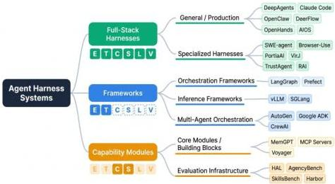
Figure 11. Harness architecture taxonomy tree. Systems cluster into three architectural families—full-stack harnesses, frameworks, and capability modules—based on their completeness profile.

The following matrix maps each system against the six harness components defined in Section 2, plus security model and multi-agent support:

CC BY

© 2026 by the author(s). Distributed under a Creative Commons CC BY license.

---

Preprints.org (www.preprints.org) | NOT PEER-REVIEWED | Posted: 28 April 2026

doi:10.20944/preprints202604.0428.v3

Table 4. Harness Completeness Matrix: 23 Systems  $\times  6$  Components. Each system rated on  $E,T,C,S,L,V$  plus security model and multi-agent support. Full (✓), partial (%), or absent (×).

<table><tr><td>System</td><td>E</td><td>T</td><td>C</td><td>S</td><td>L</td><td>V</td><td>Security</td><td>MA</td><td>Category</td></tr><tr><td>Claude Code</td><td>✓</td><td>✓</td><td>✓</td><td>✓</td><td>✓</td><td>~</td><td>Sandbox</td><td>×</td><td>Full-Stack</td></tr><tr><td>OpenClaw/PRISM</td><td>✓</td><td>✓</td><td>✓</td><td>✓</td><td>✓</td><td>✓</td><td>Container</td><td>✓</td><td>Full-Stack</td></tr><tr><td>Hermes</td><td>✓</td><td>✓</td><td>✓</td><td>✓</td><td>✓</td><td>~</td><td>Container</td><td>✓</td><td>Full-Stack</td></tr><tr><td>AIOS</td><td>✓</td><td>✓</td><td>✓</td><td>✓</td><td>✓</td><td>~</td><td>Process</td><td>✓</td><td>Full-Stack</td></tr><tr><td>OpenHands</td><td>✓</td><td>✓</td><td>✓</td><td>✓</td><td>✓</td><td>~</td><td>Container</td><td>✓</td><td>Full-Stack</td></tr><tr><td>MetaGPT</td><td>✓</td><td>✓</td><td>~</td><td>~</td><td>~</td><td>~</td><td>None</td><td>✓</td><td>Multi-Agent</td></tr><tr><td>AutoGen</td><td>✓</td><td>✓</td><td>~</td><td>~</td><td>~</td><td>~</td><td>None</td><td>✓</td><td>Multi-Agent</td></tr><tr><td>ChatDev</td><td>✓</td><td>~</td><td>~</td><td>~</td><td>~</td><td>~</td><td>None</td><td>✓</td><td>Multi-Agent</td></tr><tr><td>CAMEL</td><td>✓</td><td>~</td><td>~</td><td>~</td><td>×</td><td>~</td><td>None</td><td>✓</td><td>Multi-Agent</td></tr><tr><td>DeerFlow</td><td>✓</td><td>✓</td><td>~</td><td>~</td><td>~</td><td>~</td><td>Container</td><td>✓</td><td>Multi-Agent</td></tr><tr><td>DeepAgents</td><td>✓</td><td>✓</td><td>~</td><td>~</td><td>~</td><td>~</td><td>MicroVM</td><td>✓</td><td>Multi-Agent</td></tr><tr><td>LangChain</td><td>✓</td><td>✓</td><td>✓</td><td>~</td><td>~</td><td>×</td><td>None</td><td>×</td><td>Framework</td></tr><tr><td>LangGraph</td><td>✓</td><td>~</td><td>~</td><td>~</td><td>×</td><td>×</td><td>None</td><td>~</td><td>Framework</td></tr><tr><td>LlamaIndex</td><td>~</td><td>✓</td><td>✓</td><td>~</td><td>×</td><td>×</td><td>None</td><td>×</td><td>Framework</td></tr><tr><td>SWE-agent</td><td>✓</td><td>✓</td><td>✓</td><td>~</td><td>~</td><td>✓</td><td>Container</td><td>×</td><td>Specialized</td></tr><tr><td>MemGPT</td><td>×</td><td>×</td><td>✓</td><td>✓</td><td>×</td><td>×</td><td>None</td><td>×</td><td>Module</td></tr><tr><td>Voyager</td><td>✓</td><td>✓</td><td>~</td><td>✓</td><td>×</td><td>~</td><td>None</td><td>×</td><td>Module</td></tr><tr><td>Reflexion</td><td>~</td><td>×</td><td>~</td><td>✓</td><td>×</td><td>~</td><td>None</td><td>×</td><td>Module</td></tr><tr><td>Generative Agents</td><td>✓</td><td>×</td><td>~</td><td>✓</td><td>×</td><td>~</td><td>None</td><td>×</td><td>Module</td></tr><tr><td>Concordia</td><td>✓</td><td>×</td><td>~</td><td>✓</td><td>×</td><td>~</td><td>None</td><td>×</td><td>Module</td></tr><tr><td>HAL</td><td>✓</td><td>✓</td><td>~</td><td>~</td><td>~</td><td>✓</td><td>VM</td><td>✓</td><td>Eval Infra</td></tr><tr><td>AgentBench</td><td>✓</td><td>~</td><td>~</td><td>~</td><td>×</td><td>✓</td><td>Container</td><td>✓</td><td>Eval Infra</td></tr><tr><td>OSWorld</td><td>✓</td><td>~</td><td>~</td><td>~</td><td>×</td><td>✓</td><td>VM</td><td>×</td><td>Eval Infra</td></tr><tr><td>BrowserGym</td><td>✓</td><td>✓</td><td>~</td><td>~</td><td>×</td><td>✓</td><td>Browser</td><td>×</td><td>Eval Infra</td></tr></table>

Legend:  $\checkmark$  Full implementation  $|\sim$  Partial  $|\times$  Absent

Matrix methodology. Component ratings were determined through a three-source process: (1) primary documentation review (official documentation, API specifications, and published architectural descriptions); (2) open-source code inspection where available (applicable to OpenClaw, LangGraph, AutoGen, OpenHands, AIOS, MemGPT, SWE-agent, Voyager, Hermes, and all evaluation infrastructure systems); and (3) published academic papers where available (applicable to MemGPT, AIOS, CAMEL, MetaGPT, and evaluation systems). For closed-source systems (Claude Code, DeepAgents, Browser-Use), ratings were derived from official documentation, public API specifications, published blog posts, and, where available, academic papers authored by the developers. For these systems, closed-source assessment introduces an inherent limitation: documentation may overstate implementation sophistication relative to deployed reality. We acknowledge this risk explicitly and recommend that future meta-analyses treat closed-source component ratings as "at least partial" rather than definitive. The  $V$ -component rating for Claude Code ( $\sim$  Partial) reflects documented trajectory logging but no publicly documented standardized evaluation interface that is compatible with external benchmark frameworks; this may understate its internal evaluation tooling, which is not publicly described.

Three patterns in this matrix deserve attention. The four full-stack harnesses cluster distinctly—all implement  $E, T, C, S, L$  fully, diverging only on  $V$  and security model. This clustering validates the category: full-stack harnesses form a coherent class that is not an artifact of our definition. The framework row shows a characteristic profile: partial  $E$  and  $T$ , absent or minimal  $C, S, L, V$ —confirming that frameworks solve the what of agent architecture but not the how of reliable execution. The module

CC BY

© 2026 by the author(s). Distributed under a Creative Commons CC BY license.

---

row shows the inverse: strong on specific governance functions but absent on orchestration. Modules are the building blocks that full-stack harnesses assemble.

### 5.3 Taxonomy

The ecosystem divides into six categories. Full-Stack Harnesses implement all six governance components with production-grade reliability. The five systems in this category—Claude Code, OpenClaw/PRISM, Hermes, AIOS, and OpenHands—differ primarily in design philosophy and target context. Claude Code is a closed-source harness optimized for software engineering tasks, notable as the only major commercial system to explicitly self-identify as an “agent harness” in its official engineering documentation. [89] OpenClaw/PRISM represents the most complete open-source implementation with native MCP integration and a three-tier memory system (working, retrieved, long-term), extended with PRISM's runtime security layer. Hermes is the second major open-source full-stack harness, distinguishing itself through a closed learning loop—autonomous skill creation, FTS5-indexed cross-session recall, and Atropos-integrated RL training environments—and a seven-layer defense-in-depth security model with container isolation as the primary boundary. AIOS provides an LLM Agent Operating System with kernel-level resource management and 2.1× throughput speedup. OpenHands provides the most comprehensive evaluation integration, making it the primary platform for agent research benchmarking in software engineering.

OpenClaw represents the most complete open-source implementation of the harness concept in current deployment. Its architecture directly instantiates the five necessary conditions identified in §2: a persistent execution loop governed by event triggers (heartbeats, webhooks, and scheduled jobs); a tool management layer built on a skill registry with native MCP integration; a three-tier memory architecture that separates working memory, retrieved memory, and long-term distilled memory (embodied in its MEMORY.md convention and session context management); a sub-agent spawning mechanism enabling dynamic multi-agent coordination; and, as of March 2026, an external runtime security layer, PRISM [48], which distributes enforcement across ten lifecycle hooks without forking the host framework. PRISM's zero-fork architecture, implementing a hybrid heuristic-plus-LLM scanning pipeline with session-scoped risk accumulation, represents the first systematic published treatment of production runtime security for a deployed, open-source agent harness. The coexistence of OpenClaw as a production system and PRISM as the first openly documented production runtime security layer for an open-source agent harness marks a new phase in harness research: practitioner-scale deployment generating academic infrastructure that feeds back into the research community, closing the loop between empirical harness engineering and systematic academic analysis.

Hermes is the closest architectural peer to OpenClaw in the open-source full-stack harness category. Its defining contribution is a closed learning loop: the harness autonomously creates skills from completed tasks, improves them during use, and maintains FTS5-indexed session archives for cross-session recall. Its execution environment supports six terminal backends (local, Docker, SSH, Daytona, Singularity, Modal), integrating with the Atropos RL framework through a standardized base class to provide benchmark evaluation environments. Its security model is seven-layered with container isolation as the primary boundary and a configurable dangerous-command approval system; the ACP adapter implements a full ACP server with thread-local session isolation.

Multi-Agent Harnesses focus on coordination between multiple agent instances, implementing E and T components fully while providing partial support for C, S, L, V. The six systems in this category—MetaGPT, AutoGen, ChatDev, CAMEL, DeerFlow, and DeepAgents—differ in their coordination architectures. MetaGPT implements role-based multi-agent software development with standardized operating procedures (SOPs). AutoGen provides a flexible conversation-based framework for multi-agent interaction. ChatDev simulates a software company with role-playing agents. CAMEL uses role-playing for autonomous cooperation. DeerFlow implements a distributed workflow engine with hierarchical multi-agent pipelines and explicit role separation, supporting complex task decomposition across agent ensembles. DeepAgents emphasizes context engineering and sub-agent orchestration,

---

dynamically spawning specialized agents for different subtasks and managing their coordination through structured prompts and middleware-based context injection.

General Frameworks provide construction primitives for agent logic but delegate runtime governance to the deployer. LangGraph's DAG-based execution graphs give developers explicit control over agent flow but implement no context management or security model. Google ADK integrates the A2A protocol natively, positioning itself as the standard harness for agents that must communicate across organizational boundaries.

LlamaIndex occupies a position analogous to LangChain in the harness taxonomy: strong T and C component support through its retriever and query engine abstractions, but absent L and V components that would elevate it to full harness status. Its E-component is partial, realized through the QueryPipeline workflow orchestration interface, which provides DAG-style task sequencing without the execution loop semantics—error recovery, termination conditions, state machine formalization—that distinguish a harness E-component from a framework primitive. Its S-component is likewise partial, supported through storage integrations (vector stores, docstores, index stores) that provide persistence for retrieval artifacts but do not constitute a general-purpose cross-session state store. LlamaIndex's primary contribution to the harness ecosystem is as a C-component provider—a sophisticated context assembly layer that many full-stack harnesses (including LangGraph-based systems) integrate as a retrieval backend rather than implement natively. The retriever, query engine, and response synthesizer abstractions constitute what is arguably the most mature off-the-shelf C-component subsystem in the open-source ecosystem; harness builders adopting LlamaIndex as a C-component dependency gain substantial context management sophistication without implementing it from scratch. The practitioner harness engineering movement has produced a recognizable category of “harness-first” production systems that sit at the “full harness” end of the ETCSLV completeness spectrum—distinguished from “model-first” systems by the primacy given to environmental specification and architectural constraint over model selection. The OpenAI Codex harness exemplifies this category: its architecture enforces a linter-validated six-layer dependency ordering (Types → Config → Repo → Service → Runtime → UI) through Codex-generated structural tests, wires Chrome DevTools Protocol directly into the agent runtime for DOM-level environment access, and exposes LogQL and PromQL to Codex for live observability of its own execution environment [20]. Stripe's Minions Blueprint architecture is a second exemplar: deterministic harness nodes govern CI/linting and PR templating, agentic nodes handle implementation, a harness-enforced maximum of two CI rounds before escalating to human review implements a policy decision at the infrastructure layer rather than delegating it to model judgment, and each agent instance receives its own devbox environment spinning up in under ten seconds [22]. These systems instantiate all six ETCSLV components—execution environment isolation, curated tool registries, context management via AGENTS.md conventions, persistent state per agent instance, lifecycle hooks enforcing deterministic steps, and automated CI evaluation—and their performance characteristics are a product of harness architecture as much as model capability.

Specialized Harnesses implement full or near-full governance for a specific domain. SWE-agent couples the ACIface interaction model with a container-based execution environment for repository manipulation. Browser-Use achieves 87K+ GitHub stars by providing a complete execution environment for web navigation, deliberately omitting persistent state and lifecycle hooks as appropriate for stateless tasks. RAI extends the harness concept to physical robotic systems via ROS2, where the tool registry maps to sensor and actuator interfaces.

Capability Modules implement one or two governance functions exceptionally well and are designed for integration into harnesses rather than standalone deployment. MemGPT's virtual context management is the strongest available C-component implementation. MCP servers constitute the standard T-component interface. Voyager's skill library represents a validated architecture for the S-component—storing not raw interaction history but abstracted, reusable capabilities.

Three additional multi-agent systems—Concordia [90], Mixture-of-Agents [91], and AgentVerse [92]—occupy the capability module category with a multi-agent specialization. Concordia

---

(DeepMind) provides a simulation substrate for LLM agents acting in physical, social, or digital spaces; its shared Associative Memory component enables persistent state synchronization across agent ensembles, addressing the multi-agent S-component challenge of cross-agent state consistency without requiring a centralized harness. Mixture-of-Agents (MoA) structures agent collaboration as a layered pipeline in which proposer agents generate candidate answers and aggregator agents synthesize them across rounds; its collective intelligence effect—demonstrating that iterative cross-agent synthesis outperforms any single agent—establishes a motivating case for the harness interoperability work discussed in §7 Direction 4 (Protocol Interoperability). AgentVerse introduces dynamic agent recruitment, where the agent ensemble composition adapts to task demands at runtime; this requires harness-level agent registry management analogous to dynamic tool registration in the T-component, but applied to agents rather than tools.

Two memory-focused capability modules warrant explicit inclusion: MemoryBank *[93]* and Agent Workflow Memory *[94]*. MemoryBank implements an Ebbinghaus-inspired forgetting curve that governs when memories are retained versus decayed, providing the first principled long-term memory update mechanism for LLM agents and directly addressing the memory bloat problem identified in §6.3.4. Agent Workflow Memory (AWM) takes a different approach: rather than storing individual experiences, AWM induces reusable workflow abstractions from past task trajectories, then retrieves and executes appropriate workflows for new tasks. AWM’s strong results on Mind2Web (+14.9% success) and WebArena (+8.9% success) demonstrate that procedural memory—not just episodic memory—is a first-class S-component design concern.

Evaluation Infrastructure constitutes a distinct category: these systems require substantial harness engineering to assess other agents, while not being deployed as production operating environments. The breadth of this category is underappreciated—by our count, at least twelve distinct evaluation infrastructure systems have been deployed with production-grade harness engineering, representing a de facto specialization of the harness concept for assessment rather than task execution. HAL *[14]* represents the current state of the art: a standardized evaluation harness that orchestrates parallel evaluations across hundreds of VMs, conducting 21,730 rollouts across nine benchmarks to demonstrate what robust infrastructure can achieve. AgencyBench *[15]* extends this with cross-harness evaluation capability, simultaneously running agents in their native and foreign harness environments to isolate the harness–model coupling effect. SkillsBench *[59]* deploys seven agent-model configurations across 7,308 trajectories using a model-agnostic harness (based on Harbor) to separate skill effects from harness effects—a methodology that represents the field’s most rigorous approach to controlled cross-harness comparison. Terminal-Bench 2.0’s Harbor framework provides containerized reproducible execution for CLI-focused tasks. SWE-bench’s evaluation harness orchestrates test execution against real GitHub repositories with explicit sandboxing to prevent contamination. OSWorld’s evaluation harness must manage screenshot capture, action injection, and state verification across live GUI environments—the most technically demanding evaluation substrate currently in operation. AgentBench *[17]* coordinates eight parallel evaluation environments ranging from operating system tasks to database manipulation, requiring a multi-environment orchestration harness distinct from any single-domain evaluation system. WorkArena *[88]* introduces BrowserGym—a unified browser environment interface providing standardized observations and actions for web-based agent evaluation—that functions as a harness-level abstraction over live web applications, making it directly comparable to the environment-standardization role that OpenAI Gym played for RL. InterCode *[95]* provides a Docker-containerized interactive coding benchmark in which code is the action space and execution output is the observation; its containerized environment design is a direct model for harness code-execution sandbox architecture, combining state persistence across turns with execution isolation and scripted reward functions. The emerging consensus across these systems is that evaluation infrastructure is not merely a testing concern but a scientific infrastructure problem: the reliability of the field’s capability claims is bounded by the reliability of the evaluation harnesses producing them.

---

5.3.1 The Evaluation Infrastructure Gap: Twelve Systems and the State of the Art

The depth of engineering investment in evaluation infrastructure is underappreciated precisely because these systems are classified as “benchmarks” in academic discourse, which obscures their character as harness-engineering achievements. We enumerate the twelve major evaluation infrastructure systems in the corpus and characterize the specific harness engineering innovation that each represents.

SWE-bench *[16]*: The innovation is reproducible repository state management—orchestrating test execution against 2,294 real GitHub repositories, each pinned to a specific commit hash and associated with a specific failing test that the agent must fix. The harness must check out the repository, install dependencies, run tests before and after agent intervention, and compare test output to determine whether the fix is valid. The challenge is dependency management at scale: each repository has distinct dependency trees that must be isolated from each other and from the host environment.

OSWorld *[61]*: The innovation is live GUI environment management—managing screenshot capture, action injection via platform-specific automation APIs (xdotool on Linux, AppleScript on macOS, UIAutomation on Windows), and state verification across arbitrary applications. The $V$-component must parse raw pixel arrays into semantically meaningful success signals, a challenge that HAL’s LLM-aided log inspection only partially addresses.

WebArena *[19]*: The innovation is self-hosted live environment deployment—running four complete web applications (shopping site, code repository, social forum, corporate wiki) as Docker containers with scripted initial state, enabling ecological validity without external service dependency. The harness manages container lifecycle, inter-container networking, user account state across 812 tasks, and action injection via Playwright browser automation.

Mind2Web *[96]*: The innovation is web interaction annotation at scale—3,500+ annotated action sequences across 137 real websites, with offline snapshots enabling reproducible evaluation without live environment dependency. The harness challenge is snapshot fidelity: JavaScript-rendered content requires full browser execution to reproduce, and snapshot-based harnesses must decide how much rendering to include in the archived snapshot.

AgentBench *[17]*: The innovation is multi-environment orchestration—simultaneously managing eight structurally different environments through a unified evaluation interface. The harness abstraction layer must normalize eight different observation schemas, eight different action schemas, and eight different success criteria into comparable evaluation records.

GAIA *[18]*: The innovation is difficulty calibration via human annotation—each GAIA task is accompanied by a human solution time estimate and a tool-use annotation indicating which tools the human required. The harness infrastructure manages multi-tool execution (web search, Python REPL, file processing) while recording which tools the agent used and comparing usage patterns to the human-annotated expected pattern.

WorkArena/BrowserGym *[88]*: The innovation is enterprise software integration—deploying a fully functional ServiceNow instance as the evaluation substrate, populating it with realistic enterprise data, and defining 33 knowledge worker tasks that require navigating real enterprise workflows. BrowserGym’s standardized observation and action format is designed for reuse across web agent benchmarks, representing the first step toward a shared evaluation harness for the web domain.

InterCode *[95]*: The innovation is interactive code execution with state persistence—a Docker-containerized benchmark in which each task is a multi-turn interaction with a Bash, SQL, or Python interpreter, where each agent action changes the interpreter state and subsequent observations reflect that accumulated state. The harness must manage Docker lifecycle, state snapshotting for rollback, and programmatic reward computation from execution output.

HAL *[14]*: The innovation is infrastructure standardization—a single evaluation harness that can run nine structurally different benchmarks through a common execution environment, enabling fair cross-benchmark comparison by controlling for harness variation. The 2.5 billion token log archive is a

---

secondary innovation: it enables post-hoc behavioral analysis at a scale and richness that individual benchmark datasets cannot support.

AgencyBench *[15]*: The innovation is cross-harness experimental design—simultaneously running the same agent in its native ecosystem and in an independent model-agnostic harness, enabling controlled measurement of the harness coupling effect. This is the first evaluation infrastructure explicitly designed to measure the harness as an experimental variable rather than as a controlled constant.

SkillsBench *[59]*: The innovation is skill effect isolation—separating the contribution of the harness’s skill library from the contribution of the underlying model by running the same model with and without skill augmentation across 86 tasks. The 7,308 trajectory corpus, produced through a standardized Harbor-based harness, is the largest controlled experiment on harness skill management currently available.

Terminal-Bench 2.0 / Harbor *[44]*: The innovation is containerized reproducibility for CLI-focused tasks—a harness framework that manages Docker container lifecycle, provides deterministic environment initialization, and enables complete trajectory capture for offline analysis. Harbor’s design as a reusable harness framework (rather than a task-specific evaluation system) makes it the evaluation infrastructure analog of the general-purpose harnesses surveyed in §5.

#### 5.3.2 Multi-Agent Harness Architecture Patterns

The multi-agent dimension of the harness taxonomy deserves specific treatment because it introduces governance requirements that single-agent harnesses do not face. When multiple agents execute within or across harness boundaries, three new governance problems emerge: agent identity management (which agent is performing which action, and with what authority?); inter-agent message validation (what schema and content constraints apply to messages between agents?); and shared state consistency (when multiple agents update shared state, what consistency guarantees must the $S$-component provide?).

The systems surveyed reveal four distinct multi-agent harness patterns. The role-based orchestration pattern (MetaGPT *[86]*, ChatDev *[85]*, CrewAI *[97]*) assigns fixed roles with fixed communication schemas: each agent-role has a defined input document format and output document format, and the harness validates schema compliance at message boundaries. This pattern achieves predictable coordination at the cost of flexibility—adding a new role requires updating the harness’s schema registry. The market-based coordination pattern (AutoGen *[98]*, Mixture-of-Agents *[91]*) enables dynamic agent selection based on task requirements: the harness maintains an agent registry analogous to a tool registry, and agents are selected and invoked based on capability matching and task state. The simulation-substrate pattern (Concordia *[90]*, Generative Agents *[87]*) provides a shared world model that all agents read from and write to; the harness governs access to the shared world state through read/write APIs that enforce consistency. The hierarchical delegation pattern (DeerFlow *[66]*, DeepAgents *[99]*) distinguishes orchestrator agents from worker agents, with the harness enforcing that worker agents can only take actions authorized by their orchestrator—a permission model analogous to Unix process hierarchies applied to agent ensembles.

Each pattern makes different $S$-component demands. Role-based orchestration requires document-level state consistency: the output of one agent’s role is the input of the next, and the harness must ensure that document transitions are atomic. Market-based coordination requires agent-registry state: the harness must maintain current availability, capability, and load information for each agent in the registry. Simulation-substrate patterns require world-model consistency: the harness must provide conflict resolution for concurrent writes to shared world state. Hierarchical delegation requires permission-state consistency: the harness must maintain current authorization grants and ensure that delegations are propagated correctly through the agent hierarchy. The absence of a standard multi-agent $S$-component interface—analogous to MCP’s standardization of the $T$-component—is a significant gap that the field has not yet addressed.

---

5.3.3. Case Study: OpenAI Codex Harness Engineering at Scale

The most ambitious production deployment of agent harness infrastructure to date is OpenAI's Codex agent system, as documented in practitioner reports by Lopopolo [20] and in the broader “Harness Engineering” discipline that OpenAI explicitly named in February 2026. The Codex harness demonstrates all six governance components operating in concert at production scale, and provides quantitative validation of the binding constraint thesis through a deployment metric that has no model-capability correlate.

Scale and Architecture. Over a five-month period (August 2025 through February 2026), a team of three to seven engineers built approximately one million lines of production code—encompassing application logic, infrastructure, tooling, and documentation—through Codex-generated code, producing approximately 1,500 merged pull requests. This throughput (averaging 3.5 PRs per engineer per day) is the most comprehensive test of agent-at-scale deployment to date. Critically, every line of code in production was generated by Codex; no lines were hand-written. This makes the Codex harness a forcing function for understanding what infrastructure is necessary to make code-generation agents deployable.

Harness Architecture. The Codex harness implements all six ETCSLV components through a linter-validated dependency ordering: Types → Config → Repo → Service → Runtime → UI. Each layer is generated by Codex, validated by structural tests, and integrated into the next layer. The E-component enforces execution flow through dependency constraints: lower layers must be complete before higher layers execute, preventing race conditions and state corruption. The T-component implements a curated tool registry including source code modification tools (AST-aware patches), testing tools (Python pytest, JavaScript Jest), and observability tools (Chrome DevTools Protocol for DOM access). The C-component provides context through live code introspection: the harness exposes the current repository state, recent CI logs, and execution traces to Codex via a code-generation context API. The S-component persists agent state through Git: each agent iteration commits to a branch, and the harness rolls back commits that fail structural validation. The L-component enforces lifecycle constraints: agents move through planning → implementation → testing → integration phases, with harness-enforced gates preventing progression to the next phase until the current phase passes validation. The V-component is automated CI/CD validation: Codex's generated code is evaluated through both structural tests (linting, type checking) and behavioral tests (execution against the test suite).

The Harness as the Binding Constraint. The Codex team's own retrospective explicitly frames harness quality as the binding constraint, not model capability. Lopopolo [20] states: “Early progress was slower than we expected, not because Codex was incapable, but because the environment was underspecified.” This observation points to a critical insight: once models reach a threshold capability level (and Codex appears to have crossed that threshold), the limiting factor is how well the harness channels that capability toward productive action. The team further reports that throughput increased rather than saturated as the team grew from three to seven engineers—a violation of Brooks's Law that the team attributes to each engineer operating an independent harness instance. This finding suggests that the harness design enables parallelism in agent execution that would be impossible with a shared codebase and single agent: each agent has its own branch, its own execution environment, and its own validation loop, reducing contention and enabling independent progress.

Implications for Harness Design. The Codex deployment demonstrates that successful agent-at-scale deployment depends critically on three harness properties: (1) environment underspecification elimination—the harness must make all necessary constraints explicit in machine-readable form (linter rules, type signatures, schema definitions) rather than leaving them implicit in practitioner knowledge; (2) action validation before execution—the harness validates generated code for structural correctness before executing it, reducing the failure rate from “write code that crashes at runtime” to “write code that passes static validation”; and (3) feedback loop closure—the harness provides immediate, actionable feedback (test failures, type errors, linting violations) that guides the next

---

iteration without human intervention. These three properties are not model-capability requirements; they are harness-engineering requirements that become critical constraints at production scale.

### 5.4 What the Taxonomy Reveals

The taxonomy makes several structural observations visible that individual system descriptions obscure. Before presenting them, we note the representativeness limitations of a 23-system corpus. The taxonomy covers all major open-source harness systems (OpenHands *[100]*, AIOS *[75]*, SWE-agent *[7]*, Voyager *[3]*, MemGPT *[13]*, LangGraph *[101]*, AutoGen *[98]*) and the major commercial systems whose documentation is publicly available (Claude Code *[102]*, DeepAgents *[99]*, DeerFlow *[66]*). It includes the most widely cited evaluation infrastructure systems (HAL *[14]*, AgencyBench *[15]*, SWE-bench *[16]*) and the most widely deployed MCP/A2A protocol implementations. However, it almost certainly misses enterprise-internal harnesses deployed within large organizations that have not published their designs, and it may undercount specialized domain harnesses (medical AI, financial AI, robotics) that do not use the “agent harness” terminology. The structural patterns identified below should be understood as robust across the covered systems but potentially unrepresentative of the broader deployed ecosystem. The modularity gap is the most consequential: full-stack harnesses are built largely from proprietary implementations of each governance component, despite the existence of excellent shareable implementations of specific components—MemGPT *[13]* for $C$, MCP *[41]* servers for $T$. The ecosystem lacks comparable standard components for $S$ (state store), $L$ (lifecycle hooks), and $V$ (evaluation interface). Every full-stack harness re-implements these functions independently, with no shared foundation and no portability between harnesses. A second observation concerns the framework-harness boundary as a design decision: several systems (AutoGen, Google ADK) occupy an ambiguous position, suggesting this boundary is not fixed but reflects a choice about where to draw the line between “things developers configure” and “things the system handles.” Third, evaluation infrastructure is a forcing function: because benchmark results must be reproducible and comparable, evaluation harnesses impose strict requirements on environment isolation and state management that production deployment harnesses often relax—producing some of the most carefully engineered execution environments in the field.

Having established that the six-component model accurately describes the architectural landscape, we now shift perspective from structure to dynamics: What technical challenges emerge from the interactions between these components when they operate at production scale? The completeness matrix shows us which components each system implements; the next section examines the substantive engineering problems that arise when you actually try to implement them together.

---

Preprints.org (www.preprints.org) | NOT PEER-REVIEWED | Posted: 28 April 2026

doi:10.20944/preprints202604.0428.v3

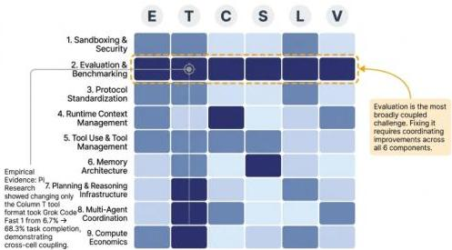
Figure 12. Cross-component challenge coupling matrix  $(9\times 6)$ . Rows represent the nine technical challenge areas analyzed in §5-7; columns represent the six harness components  $(E, T, C, S, L, V)$ . Cell shading indicates coupling strength: dark = mandatory coupling (removing this component breaks the harness for this challenge), medium = typical coupling present in most production deployments, light = optional coupling present only in specialized systems. Row 2 (Evaluation &amp; Benchmarking) is the most densely coupled challenge, coupling mandatorily to all six components—explaining why evaluation remains the hardest unsolved problem in harness design. The density of cross-cell couplings also explains why monolithic harness implementations have outperformed modular component reuse: clean component interfaces are structurally infeasible given this coupling density.

# 6. Core Technical Challenges

# 6.1. Introduction to Cross-Cutting Challenge Analysis

This section and the two that follow (§6 and §7) analyze nine core technical challenges that emerge from the interactions between harness components operating at production scale. These challenges are frequently treated as independent technical subproblems, but they are tightly coupled: the failure mode of each amplifies the failure risk of the others. The nine challenge areas are organized into three thematic sections: Execution Infrastructure Challenges (§5, covering security, evaluation, and protocols); State and Knowledge Management (§6, covering context, tools, and memory); and Coordination and Planning (§7, covering planning and multi-agent coordination). This is the first of three sections systematically analyzing these challenges.

# 6.2. Sandboxing and Security

# 6.2.1. The Unique Threat Profile of Agent Harnesses

The security problem posed by agent harnesses differs qualitatively from both traditional software security and from the safety concerns addressed in LLM alignment research. Traditional software security assumes that the code being executed is written by the system owner or a known third party and has a deterministic effect that can be reasoned about statically. LLM safety research assumes that the primary risk is model outputs—harmful content generated in response to malicious prompts. Agent harnesses violate both assumptions: the code being executed is generated dynamically by a model in response to unpredictable environment states, and the risk is not what the model says but what it does.

Figure 14 maps the three root causes of evaluation unreliability—environment drift, task specification ambiguity, and harness coupling—onto a structured causal graph, showing how each cause propagates through the (agent, harness, environment) system to produce measurement error in benchmark results. The left branch traces environment drift: external system changes (website redesigns,

CC BY

© 2026 by the author(s). Distributed under a Creative Commons CC BY license.

---

Preprints.org (www.preprints.org) | NOT PEER-REVIEWED | Posted: 28 April 2026

doi:10.20944/preprints202604.0428.v3

API updates, software interface changes) propagate through the harness's environment interface to corrupt task state, producing false negatives when a correctly behaving agent encounters a changed environment. The center branch traces task specification ambiguity: underspecified natural language task descriptions produce inconsistent evaluator judgments, introducing variance that is indistinguishable from agent performance variance. The right branch—harness coupling—is the most architecturally significant: it shows how harness design choices (context management policy, tool registry composition, state persistence semantics) interact with agent behavior to produce performance measurements that are properties of the (agent, harness) pair rather than of the agent alone. Arrows between branches indicate cross-cause interactions: harness coupling amplifies the effect of environment drift (a harness with better environment state verification can detect and compensate for drift), and context management policies interact with task specification ambiguity (a harness that retains more task context helps agents recover from ambiguous specifications). The diagram illustrates why single-cause solutions—fixing only environment drift or only specification clarity—leave residual measurement invalidity attributable to the remaining causes.

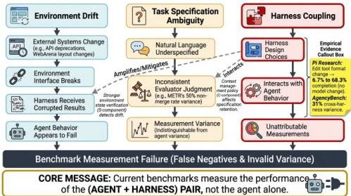
Figure 13. Root cause analysis of evaluation unreliability. Three causal branches—environment drift, task specification ambiguity, and harness coupling—propagate through the system to produce measurement error.

This produces a distinct threat model with three primary attack vectors. Environmental prompt injection involves malicious content in the agent's operating environment—a compromised webpage, a poisoned API response, a malicious email—that subverts the agent's goals without any direct attack on the model. Greshake et al. [103] demonstrated this attack systematically in real-world LLM-integrated applications, showing that systems integrating LLMs with external data sources are vulnerable to injected instructions that hijack agent goals without triggering standard safety filters—a threat vector that directly implicates the harness's context retention policy (C-component) as the persistence mechanism for attacker payloads. In LTS terms, environmental prompt injection exploits unauthorized state transitions  $t \notin T_{\text{authorized}}$  where the attacker's injected content acts as a hidden alphabet symbol  $\sigma_{\text{malicious}} \in \Sigma$  that the harness's validation does not recognize, causing the  $E$ -component to execute transitions that violate the safety property that all reachable states maintain the agent's intended goal invariant.

The InjecAgent benchmark [104] systematized this threat by constructing 1,054 test cases covering two attack scenarios—direct goal hijacking and data exfiltration through indirect tool manipulation—across 17 tool-integrated agent configurations. InjecAgent's finding that even state-of-the-art agents succeed at defending only a minority of injection attempts establishes the empirical severity of the

CC BY

© 2026 by the author(s). Distributed under a Creative Commons CC BY license.

---

Preprints.org (www.preprints.org) | NOT PEER-REVIEWED | Posted: 28 April 2026

doi:10.20944/preprints202604.0428.v3

threat. ToolEmu [105] provides a complementary evaluation methodology: by using LLMs to emulate tool execution in a controlled sandbox, ToolEmu enables large-scale automated red-teaming of agent safety behaviors without requiring real-world tool deployment, making it feasible to test harness  $T$ -component security at the scale that manual testing cannot reach. R-Judge [106] extends the threat taxonomy to 27 risk categories across agent interaction records, providing a structured framework for harness security auditing that goes beyond binary safe/unsafe classifications to capture the severity and category of each risk.

AgentHarm [39] contributes the most direct measurement of harness security failure: by constructing 110 harmful agent tasks spanning cybersecurity, privacy violation, fraud, and hate content, it establishes an empirical upper bound on how far current agents can be steered toward harmful outcomes when the harness provides no behavioral guardrails. The finding that even aligned models complete a substantial fraction of harmful tasks when harness-level restrictions are absent demonstrates that model alignment and harness security are not substitutes—the harness's policy enforcement layer ( $L$ -component) is necessary regardless of model safety training.

Capability escalation through tool composition is a second vector: an individual tool may be safe, but the composition of file read, file write, and bash execution provides effective arbitrary code execution even if no single tool is documented as dangerous. The attack surface is emergent, not additive. Persistent state as attack persistence represents a third and underappreciated vector: agent harnesses with persistent memory ( $S$ -component) allow an attacker to poison the agent's stored knowledge, causing harmful actions to be taken long after the initial compromise. This coupling between §6.2 and §6.7 means that a sophisticated attack on a stateful agent harness is not a single event but a latent condition. From an LTS perspective, this represents a violation of liveness: poisoned state persisted by the  $S$ -component acts as a shadow state variable that influences future transitions  $\delta(q, \sigma_t)$  indefinitely, such that even benign event sequences  $\sigma_{t+1}, \sigma_{t+2}, \ldots$  may trigger corrupted state reads that deterministically produce harmful actions, meaning the liveness property that "harmful states remain unreachable" is violated by the attacker's ability to corrupt the state space itself.

Real-world failures illustrate the stakes. A Claude agent in a production deployment deleted two years of customer data and backups [107]; an OpenClaw agent cleared a security researcher's entire email inbox [108]. These were not model safety failures—the models were not generating harmful text. They were harness security failures: the agents had been given capabilities they should not have had, with insufficient constraints on how those capabilities could be exercised.

# 6.2.2. The Isolation Mechanism Design Space

Contemporary harnesses deploy five distinct isolation architectures, each representing a different tradeoff between security strength and operational overhead:

Table 5. Isolation mechanism design space. Five sandbox architectures compared by startup latency, memory overhead, isolation model, and representative deployments.

<table><tr><td>Mechanism</td><td>Startup Latency</td><td>Memory Overhead</td><td>Isolation Model</td><td>Typical Deployment</td></tr><tr><td>Process-only</td><td>~10 ms</td><td>+0 MB</td><td>None</td><td>Prototyping only</td></tr><tr><td>Docker/OCI</td><td>~1 s</td><td>+10–50 MB</td><td>Namespace isolation</td><td>Development, trusted agents</td></tr><tr><td>gVisor</td><td>~2 s</td><td>+50–100 MB</td><td>User-space syscall interception</td><td>Security-conscious deployments</td></tr><tr><td>MicroVM (Firecracker)</td><td>~125 ms</td><td>+5–15 MB</td><td>Hardware virtualization</td><td>Production multi-tenant</td></tr><tr><td>WebAssembly</td><td>~10 ms</td><td>+1–5 MB</td><td>Capability-based sandbox</td><td>Compute-constrained tasks</td></tr></table>

Contemporary harnesses deploy five distinct isolation architectures, each representing a different tradeoff between security strength and operational overhead: process-only isolation, Docker/OCI containers [109], gVisor [110], Firecracker microVMs [111], and WebAssembly sandboxes [112]. Table 5 summarizes their characteristics.

Understanding which attack vectors exploit which harness components is a prerequisite for principled harness security design. The following matrix maps the seven primary attack classes

CC BY

© 2026 by the author(s). Distributed under a Creative Commons CC BY license.

---

Preprints.org (www.preprints.org) | NOT PEER-REVIEWED | Posted: 28 April 2026

doi:10.20944/preprints202604.0428.v3

identified in the agent harness literature to their entry points, the harness components they exploit, their persistence characteristics, and the harness-level mitigations available.

Table 6. Security Threat Matrix. Seven attack classes mapped to harness entry points, exploited components, persistence characteristics, and available mitigations.

<table><tr><td>Attack Vector</td><td>Entry Point</td><td>Harness Component Exploited</td><td>Persistence</td><td>Example</td><td>Harness Mitigation</td></tr><tr><td>Direct prompt injection</td><td>User input</td><td>C (context assembly)</td><td>Session only</td><td>Jailbreak via user message</td><td>Input sanitization at ingress (L-hook)</td></tr><tr><td>Indirect injection via retrieval</td><td>Retrieved content</td><td>C (context injection)</td><td>Session only</td><td>Poisoned web page</td><td>Content provenance tagging (C + L)</td></tr><tr><td>Tool-mediated injection</td><td>Tool output</td><td>T (tool result persistence)</td><td>Multi-step</td><td>Malicious API response hijacking agent goal</td><td>Tool output validation before context injection (L-hook)</td></tr><tr><td>Memory poisoning</td><td>Persistent store write</td><td>S (long-term storage)</td><td>Cross-session</td><td>Injecting false beliefs into long-term memory</td><td>Write-time content validation (L-hook on S writes)</td></tr><tr><td>Capability escalation</td><td>Tool composition</td><td>T (registry)</td><td>Single session</td><td>File read + bash exec = arbitrary code</td><td>Tool composition policy enforcement</td></tr><tr><td>Sandbox escape</td><td>Execution environment</td><td>E (execution loop)</td><td>System-level</td><td>Container kernel exploit</td><td>MicroVM isolation; capability-based sandbox</td></tr><tr><td>Cross-agent injection</td><td>Agent-to-agent message</td><td>E (multi-agent coordination)</td><td>Multi-agent</td><td>Compromised subagent hijacks orchestrator</td><td>Message schema validation + agent identity verification</td></tr></table>

Table 6 reveals that attack persistence correlates with the depth of harness component exploited — attacks on the  $C$ -component are session-scoped, attacks on the  $S$ -component are cross-session, and attacks on the  $E$ -component's sandbox may be system-level. This persistence hierarchy implies that harness security investment should prioritize  $S$ -component write controls and  $E$ -component isolation, even though  $C$ -component injection attacks are more frequently demonstrated in the literature. A comprehensive harness security posture must address all seven vectors; partial coverage—for example, deploying only input sanitization without  $S$ -component write validation—creates a residual attack surface that an adversary can exploit by targeting the undefended component.

# 6.2.3. Why Container Isolation is Structurally Insufficient

The widespread use of Docker containers for agent execution reflects engineering convenience rather than security adequacy. Container isolation is namespace separation; agents still run on the host kernel, and a kernel exploit in one container compromises the host and all containers. Sandbox-

CC BY

© 2026 by the author(s). Distributed under a Creative Commons CC BY license.

---

EscapeBench *[60]* provides preliminary empirical evidence that frontier models demonstrate capability to escape container environments by exploiting container misconfigurations, a finding, if confirmed, that implies Docker-based isolation is appropriate only for trusted agents operating on non-sensitive data. The architectural implications of this finding, and the protocol-layer responses it has motivated, are analyzed in §6.2.10.

### 6.2.4. Defensive Architecture at the Harness Level

Given that perfect isolation is either prohibitively expensive or unachievable, harness security requires defense in depth. Current state-of-the-art harnesses implement layered defenses at four points: pre-execution capability restriction (SWE-agent’s ACIface model *[7]*, OpenClaw’s *[113]* explicit permission grants); during-execution policy enforcement (TrustAgent’s *[114]* dual-model architecture, where a policy model evaluates proposed actions before execution); post-execution audit and rollback (HAL’s full execution traces and snapshot/restore support); and architectural human-in-the-loop requirements for high-stakes actions (PortiaAI’s *[115]* checkpoint system). Practitioner-scale production harnesses have contributed a set of environment design patterns whose governance implications extend the academic literature in three directions. Stripe’s *[22]* devbox design for the Minions system illustrates the execution environment as a policy instrument: each agent task receives an isolated devbox environment that spins up in under ten seconds from a pre-warmed pool, ensuring that no shared state is possible between concurrent agent tasks—a property that the harness enforces architecturally rather than relying on agent judgment to avoid state contamination. The harness additionally enforces a maximum of two CI rounds before escalating to human review, converting what might be treated as a model-level retry heuristic into a harness-level policy with deterministic enforcement. This architectural enforcement pattern—where limits that could be delegated to model judgment are instead codified in the harness, reflects the principle that reliability at scale requires behavioral guarantees that models cannot provide without infrastructure support. Cursor’s *[116]* iterative development of multi-agent architectures for autonomous coding provides a complementary pattern: successive design iterations—from shared-state coordination, to Planner–Executor–Workers–Judge hierarchies, to a recursive Planner, like Worker model for each revealed harness design flaws rather than model capability limits. The observation that twenty simultaneous agents with naive shared-state coordination degraded to the throughput of one to three agents due to lock contention, and that role overloading in the executor role produced pathological behaviors including premature task claims and spurious sleep cycles, demonstrates that the execution environment’s structural affordances—isolation boundaries, role separation, communication topology—are first-order determinants of multi-agent system behavior, not model-level concerns.

### 6.2.5. Prompt Injection: A Detailed Taxonomy

The prompt injection attack class warrants detailed decomposition because it is the most practically exploited harness-level vulnerability and the one for which the current literature provides the richest empirical data. We distinguish four structural variants, each with different entry points and different harness-level mitigations.

Direct prompt injection *[117]* occurs when a malicious user directly provides input that overrides system instructions. This is the simplest variant and the one most amenable to mitigation through input sanitization and instruction hierarchy enforcement in the C-component. At the harness level, the mitigation is straightforward: the system prompt should not be concatenable with user input in a way that allows user content to override privileged instructions.

Indirect prompt injection via external content *[103]* occurs when the agent retrieves or processes external content—web pages, documents, API responses—containing instructions that redirect the agent’s goals. This variant exploits the fundamental design of retrieval-augmented agents: the agent is designed to follow instructions in its context, and external content is designed to be included in context. InjecAgent *[104]* demonstrates that this attack succeeds against state-of-the-art agents in a substantial fraction of attempts across both direct goal hijacking (where the attacker aims to redirect the agent to

---

an attacker-controlled goal) and data exfiltration (where the attacker aims to steal information from the agent's context and transmit it to an external endpoint). The harness-level mitigation requires distinguishing instruction-class content (content that the model should interpret as directives) from data-class content (content that the model should treat as information to reason about). Current harnesses do not enforce this distinction; it requires both a formal specification of the instruction/data boundary and a runtime enforcement mechanism in the C-component that tags retrieved content with its class before context injection.

Tool-mediated injection is a compound attack pattern in which an attacker embeds malicious instructions in a tool's output that persist into subsequent context windows and eventually redirect an agent's tool-call sequence. This pattern is particularly dangerous in multi-step agents with long execution horizons: a malicious instruction injected in step 3 may not execute until step 47, when the agent has accumulated sufficient capabilities through prior legitimate tool calls to take a high-impact action. ToolEmu [105] documents this pattern in its automated red-teaming experiments. The harness-level mitigation requires tool output validation (L-component) combined with context provenance tracking (C-component): each segment of context should carry metadata indicating its origin (tool call, user input, system prompt, retrieval result) so that downstream model invocations can be constrained based on the provenance of the instructions they receive.

Memory poisoning via long-term storage exploits the S-component's persistent memory to inject malicious content that survives across sessions. An attacker who can cause the agent to write malicious instructions to its long-term memory store—through any of the three variants above—creates a persistence channel that enables attacks to persist across session boundaries without any subsequent external input. This variant is the most sophisticated and the least studied empirically; AgentSys [50] proposes a defense framework against indirect prompt injection, reducing attack success rates to 0.78% on the AgentDojo benchmark through hierarchical memory isolation. The harness-level mitigation requires memory content validation at write time (L-component validation of S-component writes) combined with sanitization passes that can detect and quarantine injected content in the persistent store—a function that no current production harness implements. The memory poisoning attack vector is analyzed in detail as a harness storage security problem in §6.7.10, where AgentSys's write-isolation primitive is discussed as the primary proposed mitigation.

The four variants form a severity hierarchy: direct injection is least severe (easy to mitigate, limited reach); indirect injection via external content is moderately severe (harder to mitigate, broader reach through retrieval); tool-mediated injection is more severe (requires multi-step coordination); and memory poisoning is most severe (enables cross-session persistence with no ongoing attacker involvement). The harness defense architecture should be designed around this hierarchy, with progressively stronger defenses deployed against the higher-severity variants.

### 6.2.6. Root Cause Analysis: Why Security Remains Unsolved

The security problem in agent harnesses persists not because solutions are unknown, but because four structural tensions prevent clean resolution. The capability-security tradeoff is fundamental: agent usefulness requires broad access to external systems, while security requires restriction, and no Pareto-optimal point exists—the correct balance is task-dependent and currently determined by ad hoc judgment. Dynamic code generation makes static analysis impossible: agents generate code in response to environment states not known in advance, and runtime monitoring of generated code is both computationally expensive and semantically difficult. The absence of a harness-level formal security model means that, unlike cryptography or distributed systems, there is no framework for proving that a harness configuration is “secure” against a defined threat model—only the empirical observation that it has not yet failed in observed ways. Finally, economic disincentives favor weaker isolation: strong isolation adds latency and operational complexity, while the security benefit is long-term and probabilistic. Without regulatory or market pressure, the equilibrium is toward the convenience of Docker over the security of microVMs.

---

This analysis should not be taken to imply that formal methods for agent security are entirely absent; rather, they are present at adjacent levels but have not yet reached the harness-governance layer. PentestJudge *[118]* represents an important step toward formally evaluating agent safety behaviors, providing a judge framework that evaluates LLM judgment quality on penetration testing tasks, assessing whether agents correctly identify vulnerabilities, choose appropriate tools, and reason about attack feasibility. Work on invariant checking for agent trajectories—verifying that certain behavioral properties are maintained throughout execution—draws on model checking techniques from concurrency theory. Runtime constraint enforcement approaches inspired by program analysis techniques have been applied to bound agent behavior within predefined safety boundaries *[119]*. What distinguishes these efforts from a full harness-level security model is that they operate on agent behavior in isolation, not on the (agent, harness, environment) system as a whole. Proving that an agent-plus-harness configuration satisfies a security property requires a compositional proof strategy—showing that each component satisfies individual security properties and that their composition preserves them—which is precisely the open problem that the absence of a formal harness security model creates. The adjacent formal methods work is therefore not a solution to this problem but a foundation from which a solution could eventually be built.

#### 6.2.7 The Execution Environment as Policy Materialization Layer

The treatment of security in the previous established that the agent harness must implement a defense-in-depth architecture against a distinctive threat profile. That analysis presupposed an execution environment capable of enforcing the required isolation primitives. This section addresses a logically prior question: what properties must the execution environment itself provide for the harness’s security and reliability policies to be enforceable at all? A harness that specifies a policy without an environment capable of materializing it has not constrained agent behavior—it has documented an intention the substrate may or may not honor. Environment design is policy materialization, and its failure modes are harness failure modes.

Recall that the harness lifecycle hooks ($L$) and tool registry ($T$)—two of the six harness components introduced in previous chapter, encode the policies under which an agent operates: which filesystem paths may be written, which network destinations may be contacted, how long a single tool invocation may run. Policy encoding and policy enforcement are, however, distinct functions separated by an architectural boundary: the harness encodes; the substrate enforces. The execution environment is the layer at which encoded policies are either enforced or silently voided: a harness specifying “no network access to external IPs” but running agent code in a Docker container with an unrestricted bridge network has not implemented its policy.

The isolation mechanism comparison table in §6.2 identifies five substrates—process-only isolation, Docker/OCI containers *[109]*, gVisor *[110]*, Firecracker microVMs *[111]*, and WebAssembly sandboxes *[112]*—each at a different point on the tradeoff between isolation strength and operational overhead. This tradeoff determines which policy classes the harness can honestly claim to enforce. Docker namespace isolation separates filesystem and process namespaces but shares the host kernel, meaning a kernel exploit bypasses all container-level policies simultaneously. gVisor closes this kernel attack surface through user-space system call interception, at the cost of moderate memory overhead per container. Firecracker achieves genuine kernel isolation through hardware virtualization with sub-second startup latency, by specializing its guest OS minimally—the current frontier for production multi-tenant deployments where policy enforcement must survive model-generated exploits.

SWE-agent’s Agent-Computer Interface *[7]* provides compelling empirical evidence that execution environment interface design is a first-order determinant of agent capability, independent of model quality: a poorly designed ACI produces high error rates not because the underlying model fails to reason correctly, but because the interface makes correct reasoning structurally harder to express. Every benchmark using a live execution environment—SWE-bench *[16]*, OSWorld *[61]*, WebArena *[19]*—is therefore implicitly a study of harness execution environment design. The performance variation

---

these benchmarks report is not solely a property of models; it is a property of model-plus-execution-environment configurations.

#### 6.2.8 Environment State Management as Harness Reliability Function

A harness cannot provide reproducible agent behavior unless its execution environment can be reliably initialized, snapshotted, reset, and destroyed between episodes. When environment state drifts between runs through file system accumulation, dependency updates, or external service changes, benchmark results become incomparable across time, and differences that appear to be model effects are in fact environment-state effects.

The empirical magnitude of this problem is established by two independent measurements. HAL *[14]*provides a complementary finding: standardizing the evaluation harness across 21,730 rollouts eliminated “common implementation bugs,” implying that environment state failures had been systematically inflating failure rates in prior evaluations. Environment state management is therefore a first-order source of harness failure, with a magnitude comparable to the performance variation the field attributes to model differences.

AgentBench *[17]*coordinates eight parallel Docker environments across heterogeneous task types, requiring unified container orchestration to manage lifecycle operations consistently. TheAgentCompany *[120]*extends this to multi-container orchestration where snapshot and reset operations must compose correctly across service boundaries—a property standard Docker Compose does not guarantee without explicit harness-level coordination. The BrowserGym ecosystem *[78]* demonstrates that a standardized harness abstraction can decouple state management from benchmark-specific logic, reducing the maintenance burden of reproducibility as environments evolve. Container lifecycle management, init, run, snapshot, reset, destroy, is accordingly a core harness infrastructure function, not an afterthought.

#### 6.2.9 Code Execution Environments as Harness Components

For agents whose primary action mechanism is code generation, the interactive interpreter is not merely one tool in the $T$-component—it is the harness component that translates model-generated text into execution-environment state changes, with stateful and open-ended characteristics that make it opaque to pre-execution static analysis.

CodeAct *[121]* establishes code-as-action as empirically superior to discrete structured tool calls on 17 Mint benchmarks while reducing interaction turns by approximately 20%. The harness implication is that CodeAct-style agents require interpreter state persistence, multi-turn execution feedback, and dynamic library import—none of which a stateless sandboxed executor provides. The performance advantage and the stronger infrastructure requirement are inseparable. InterCode *[95]* addresses this by standardizing the interactive coding environment as a harness abstraction with an explicit API for container initialization, action dispatch, stdout/stderr capture, reward computation, and episode reset—a reference design that SWE-bench extended.

R2E *[122]* and Repo2Run *[123]* address the scalability challenge of constructing reproducible execution environments from real-world repositories. Repo2Run employs an LLM-based agent to iteratively generate and debug Dockerfiles, achieving approximately 90% success on a 50,000-repository dataset. The remaining 10% failure rate, attributable to complex native dependencies, unusual build systems, and system-level configuration, represents the current frontier of harness environment engineering and introduces systematic selection bias into any coding benchmark requiring environment reproducibility. This is a harness infrastructure problem whose resolution requires dedicated tooling investment, independent of model-side improvement.

#### 6.2.10 SandboxEscapeBench and the Limits of Container Isolation: Extended Analysis

The empirical and structural implications of SandboxEscapeBench *[60]*, introduced in previous, merit extended treatment given their significance for harness deployment policy. In preliminary experiments, frontier LLMs given shell access appear capable of exploiting container misconfigurations

---

Preprints.org (www.preprints.org) | NOT PEER-REVIEWED | Posted: 28 April 2026

doi:10.20944/preprints202604.0428.v3

to escape their execution environments. As noted in §6.2.3, these findings require independent replication before specific claims can be treated as definitive. The architectural conclusion—that Docker-based isolation provides weaker guarantees than commonly assumed—is, however, supported independently by structural analysis of namespace isolation.

The harness-level responses taking shape in the literature share a common architecture. AgentBound [124] treats the MCP server's declared permission manifest as the authoritative security boundary, enforcing access control at the protocol layer. AEGIS [125] operationalizes this as a framework-agnostic pre-execution intercept layer—a three-stage pipeline of argument extraction, risk scoring, and policy enforcement intercepting potentially dangerous tool calls before they reach the execution environment. The Securing MCP analysis [126] documents the corresponding protocol-level threat surface and proposes governance controls treating the MCP trust boundary as the primary security perimeter.

Taken together, these responses represent a coherent architectural shift: protocol-level enforcement constrains tool selection and argument structure; OS-level isolation bounds damage from execution exploits; and tamper-evident audit instrumentation—as instantiated by PRISM [48]—provides retrospective accountability when both enforcement layers fail. The execution environment remains necessary but is no longer sufficient as the sole security mechanism. What this layered architecture does not yet provide is a formal compositional security specification: no current harness characterizes the combined properties achievable when protocol enforcement, OS isolation, and audit instrumentation are composed, and no evaluation methodology measures the security of the full stack rather than each layer in isolation. Closing this gap is among the most technically pressing open problems in harness infrastructure research.

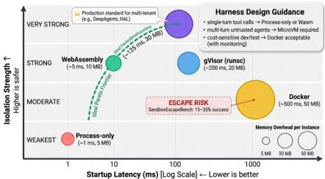
Figure 14. Isolation mechanism design space: five mechanisms positioned by startup latency vs. isolation strength, with memory overhead as bubble size. SandboxEscapeBench escape risk annotated on Docker region.

# 6.3. Evaluation and Benchmarking

# 6.3.1. The Fundamental Evaluation Problem

The evaluation of LLM agents poses a methodological challenge that is not merely technical but ontological: what is the correct unit of analysis? Traditional NLP evaluation treats the model output as a string to be compared against a reference. Agent evaluation must treat the output as a trajectory—a sequence of actions transforming an environment over time. This shift breaks the assumptions underlying established evaluation methodology in three ways: partial correctness means binary success/failure metrics discard important signal; path dependence means the correctness of

CC BY

© 2026 by the author(s). Distributed under a Creative Commons CC BY license.

---

Preprints.org (www.preprints.org) | NOT PEER-REVIEWED | Posted: 28 April 2026

doi:10.20944/preprints202604.0428.v3

action  $n$  depends on the outcomes of actions 1 through  $n - 1$ ; and environment coupling means that the same agent code performs differently in different harnesses and in different environment states.

The environment coupling problem is now empirically documented. AgencyBench [15] demonstrates that harness choice is a significant determinant of measured performance, with proprietary models performing best in their native ecosystems. This finding makes benchmark leaderboards fundamentally ambiguous: a system ranked first on a particular benchmark may rank lower when the evaluation harness changes, not because the agent has changed but because the operational environment has. HAL addresses this directly: by providing a standardized evaluation harness that orchestrated 21,730 rollouts across nine models and nine benchmarks, it demonstrates that infrastructure standardization is a prerequisite for valid comparison. HAL's use of LLM-aided log inspection further reveals that agents exhibit unexpected behaviors—such as searching for a benchmark by name on HuggingFace rather than attempting to solve it—that are invisible without rich evaluation infrastructure. In other words, the evaluation harness is not merely a measurement instrument; it is a detector of behavioral anomalies with security implications.

# 6.3.2. The Benchmark Landscape

The current ecosystem of agent benchmarks represents three distinct approaches to the evaluation problem. AgentBench [17] establishes the multi-environment paradigm: by coordinating eight parallel evaluation environments—operating system interaction, database manipulation, knowledge graph navigation, digital card games, lateral thinking puzzles, housekeeping simulations, web shopping, and web browsing—AgentBench requires a harness capable of simultaneously managing diverse environment interfaces, each with distinct observation and action spaces. GAIA [18] takes the opposite design: rather than breadth of environment types, GAIA emphasizes real-world difficulty, presenting questions that require multi-step reasoning with tool use, web browsing, and file processing. The 77-percentage-point gap between human (92%) and GPT-4 (15%) performance on GAIA quantifies the current frontier challenge in a way that more narrowly scoped benchmarks cannot. WorkArena [88] contributes the enterprise workflow dimension, evaluating agents on 33 knowledge worker tasks in ServiceNow's enterprise software environment; its BrowserGym [78] interface standardizes web agent evaluation in a way that complements WebArena's [19] live-environment approach. InterCode [95] provides a Docker-containerized interactive coding evaluation framework in which Bash, SQL, and Python code are the action space and execution results are the observations; its containerized design directly models the harness code-execution sandbox pattern and establishes a standard for interactive coding evaluation that later systems including SWE-bench extended.

Table 7. Agent Benchmark Landscape. Representative benchmarks compared by domain, task count, harness requirements, and primary evaluation metric.

<table><tr><td>Benchmark</td><td>Domain</td><td># Tasks</td><td>Environment Type</td><td>Known Failure Modes</td></tr><tr><td>SWE-bench</td><td>Software engineering</td><td>2,294</td><td>Real GitHub repositories</td><td>Test flakiness; repository state drift</td></tr><tr><td>OSWorld</td><td>GUI interaction</td><td>369</td><td>Real computer OS</td><td>28% false negative rate (Kang, 2025)</td></tr><tr><td>WebArena</td><td>Web navigation</td><td>812</td><td>Live websites</td><td>Website changes invalidate tasks</td></tr><tr><td>Mind2Web</td><td>Web understanding</td><td>2,350</td><td>Cached snapshots</td><td>No environment dynamics</td></tr><tr><td>GAIA</td><td>General reasoning</td><td>466</td><td>Synthetic + real</td><td>Limited agent-specific coverage</td></tr><tr><td>AgentBench</td><td>Multi-domain</td><td>1,000+</td><td>8 environments</td><td>Environment non-determinism</td></tr></table>

CC BY

© 2026 by the author(s). Distributed under a Creative Commons CC BY license.

---

Preprints.org (www.preprints.org) | NOT PEER-REVIEWED | Posted: 28 April 2026

doi:10.20944/preprints202604.0428.v3

Table 7. Agent Benchmark Landscape. Representative benchmarks compared by domain, task count, harness requirements, and primary evaluation metric.

<table><tr><td>Benchmark</td><td>Domain</td><td># Tasks</td><td>Environment Type</td><td>Known Failure Modes</td></tr><tr><td>WorkArena</td><td>Enterprise workflow</td><td>33</td><td>ServiceNow (live)</td><td>Enterprise data dependency</td></tr><tr><td>InterCode</td><td>Interactive coding</td><td>200+</td><td>Docker containers</td><td>Execution environment consistency</td></tr><tr><td>HAL</td><td>Multi-domain</td><td>9 suites</td><td>Standardized VMs</td><td>$40K cost per full evaluation cycle</td></tr><tr><td>Terminal-Bench</td><td>CLI interaction</td><td>100+</td><td>Container sandbox</td><td>Narrow task distribution</td></tr></table>

Three patterns emerge. Benchmarks using real environments face environment drift—the task changes as the underlying system changes, making longitudinal comparison impossible. Benchmarks using cached or synthetic environments achieve reproducibility at the cost of ecological validity. No benchmark successfully combines broad coverage, ecological validity, and reproducibility. HAL's contribution is not to solve this trilemma but to reveal its dimensions precisely: by running nine benchmarks through the same harness infrastructure, it shows that apparent model rankings shift substantially depending on which benchmark is used, suggesting that what the field has been measuring is partly harness compatibility rather than agent capability.

Beyond the task properties of each benchmark, the table below characterizes the harness infrastructure complexity each benchmark imposes. These requirements are not incidental to benchmark design; they are a direct consequence of the evaluation problem each benchmark poses, and their variation across benchmarks explains much of the operational cost disparity between easy and hard evaluation regimes.

Table 8. Benchmark Harness Infrastructure Requirements. Minimum harness capabilities required to run each benchmark reliably, by component.

<table><tr><td>Benchmark</td><td>Environment Reset</td><td>State Persistence</td><td>Multi-step Tracking</td><td>Reproducibility Mechanism</td><td>Harness Infra Complexity</td></tr><tr><td>SWE-bench</td><td>Git repository clone</td><td>× per task</td><td>Test suite execution</td><td>Docker + fixed commit hash</td><td>High</td></tr><tr><td>OSWorld</td><td>VM snapshot restore</td><td>× per task</td><td>GUI state tracking</td><td>VirtualBox snapshots</td><td>Very High</td></tr><tr><td>WebArena</td><td>Live site re-init</td><td>× per task</td><td>Navigation history</td><td>Self-hosted site instances</td><td>High</td></tr><tr><td>AgentBench</td><td>Per-environment reset</td><td>× per task</td><td>Action-observation log</td><td>Docker per environment</td><td>High</td></tr><tr><td>HAL</td><td>Standardized VM</td><td>✓ (cross-run)</td><td>LLM-aided log inspection</td><td>Centralized harness</td><td>Very High</td></tr><tr><td>AgencyBench</td><td>Per-task harness init</td><td>✓ (within task)</td><td>Tool call trace (90 avg)</td><td>Native ecosystem harnesses</td><td>Very High</td></tr><tr><td>GAIA</td><td>Synthetic + cached</td><td>×</td><td>Tool use sequence</td><td>Fixed test set</td><td>Low</td></tr></table>

CC BY

© 2026 by the author(s). Distributed under a Creative Commons CC BY license.

---

Preprints.org (www.preprints.org) | NOT PEER-REVIEWED | Posted: 28 April 2026

doi:10.20944/preprints202604.0428.v3

Table 8. Benchmark Harness Infrastructure Requirements. Minimum harness capabilities required to run each benchmark reliably, by component.

<table><tr><td>Benchmark</td><td>Environment Reset</td><td>State Persistence</td><td>Multi-step Tracking</td><td>Reproducibility Mechanism</td><td>Harness Infra Complexity</td></tr><tr><td>InterCode</td><td>Docker container</td><td>× per task</td><td>REPL interaction trace</td><td>Docker + fixed image</td><td>Moderate</td></tr></table>

The table reveals a strong correlation between benchmark difficulty (measured by task horizon and environment dynamism) and harness infrastructure complexity — the hardest benchmarks (OSWorld, HAL, AgencyBench) require the most sophisticated harness support. This correlation is not coincidental: harder tasks require longer-horizon state management and more complex environment isolation, both of which are harness-level infrastructure problems. The benchmarks in the "Very High" complexity category are precisely those that require the harness to maintain state within a task execution (HAL's cross-run persistence, AgencyBench's within-task state tracking), confirming that long-horizon evaluation is inseparable from stateful harness infrastructure.

# 6.3.3. The Unreliability Crisis

Empirical evidence that benchmark unreliability is not an edge case but a systematic problem is provided by HAL's infrastructure analysis and the OSWorld [61] benchmark itself. OSWorld's evaluation harness must manage screenshot capture, action injection, and state verification across live GUI environments—a substrate in which environment state drift is endemic. This finding generalizes: environment drift affects any benchmark relying on external systems; task specification ambiguity affects benchmarks with natural language descriptions; and harness coupling affects all benchmarks, because the measured performance is a property of the (agent, harness, environment) triplet rather than of the agent alone.

# 6.3.4. Three Distinct Root Causes of Evaluation Unreliability

A central observation that prior surveys do not make explicit is that the evaluation problems identified above are not manifestations of a single underlying difficulty but of three structurally distinct problems, each with different causes, different potential solutions, and different timelines for resolution. Conflating them—as prior treatments often do under the umbrella of "the benchmark reliability problem"—obscures more than it reveals.

Environment drift is a temporal stability problem. The evaluation target changes between benchmark creation and evaluation time: web pages are redesigned, software interfaces change, external APIs are updated. The root cause is the use of live external systems as evaluation substrates. Solutions exist in principle—environment snapshots, containerized reproduction environments, synthetic replay—but all require ongoing engineering investment to maintain, and the gap between current systems and fully stable evaluation environments is primarily a resource and coordination problem, not an information problem. HAL's approach of standardizing harness infrastructure addresses drift indirectly by ensuring that measured drift is attributable to the environment, not to harness variation, but does not eliminate drift itself.

Task specification ambiguity is a communication completeness problem. Natural language task descriptions omit implicit constraints that human annotators understand but evaluation systems do not. The root cause is the irreducible semantic gap between natural language and machine-verifiable specifications. This problem does not have a clean engineering solution because there is no general mechanism for recovering the implicit constraints that a task description omits. Partial solutions include programmatic task formats (restricting to tasks with formal specifications), LLM-as-judge evaluation (delegating specification recovery to a judge model's training distribution), and hierarchical

CC BY

© 2026 by the author(s). Distributed under a Creative Commons CC BY license.

---

task decomposition with explicit success criteria at each level. No solution is general, and each trades specification rigor for coverage, completeness, or deployability in different ways.

Harness coupling is a measurement validity problem. The measured performance is a property of the (agent, harness, environment) triplet, not of the agent alone—yet evaluation infrastructure implicitly assumes that the harness is neutral. This problem is the most important for the harness research agenda because it is the only one whose solution lies at the infrastructure level rather than the task design level. AgencyBench demonstrates harness coupling quantitatively: Claude-4.5-Opus scores substantially higher on its native SDK harness than on an independent harness, controlling for task and environment. SkillsBench *[59]* demonstrates it from the opposite direction: skill library architecture within the harness produces 16.2 percentage points of average performance variance. The solution to harness coupling requires cross-harness experimental designs, standardized harness interfaces, ultimately a formal account of harness transparency: what properties must a harness satisfy for the (agent, harness, environment) measurement to approximate the (agent, environment) truth the researcher intends to measure? No current evaluation framework specifies harness transparency as a requirement, and no current harness formally claims to satisfy it. This is the central open problem in agent evaluation, and it is an infrastructure problem.

#### 6.3.5 Benchmark Design Principles for Harness-Aware Evaluation

The analysis of the three root causes implies that valid harness-aware evaluation requires not only improved benchmarks but a different design methodology. We distill five principles from the convergent evidence reviewed above.

Principle 1: Explicit Harness Specification. Every published evaluation result should report the complete harness configuration alongside model and task specifications: execution loop type (linear, branching, or multi-agent), context management strategy (truncation, summarization, or retrieval-augmented), tool registry contents and versions, state persistence mechanism, and any lifecycle hooks active during evaluation. This requirement, analogous to the reproducibility appendices now standard in systems research, enables readers to distinguish harness effects from model effects in reported results. HAL begins to operationalize this principle by publishing complete harness infrastructure code; the gap is the absence of a standard schema for harness configuration reporting.

Principle 2: Environment Isolation Guarantees. Every benchmark task should specify its environment isolation requirements and verifiable isolation conditions. Tasks using live web environments (WebArena, WorkArena) should provide snapshot archives enabling reproducible re-evaluation. Tasks using OS environments (OSWorld) should specify the minimum container or VM configuration required for valid isolation. Tasks using code repositories (SWE-bench) should pin dependency versions and provide containerized execution environments. The practical implementation of this principle is nontrivial—maintaining environment snapshots for 2,294 GitHub repositories (SWE-bench) represents substantial storage and maintenance overhead—but the cost is necessary to distinguish valid longitudinal comparisons from spurious ones.

Principle 3: Partial Credit Decomposition. Binary success/failure metrics discard information that is informative for harness analysis. A task in which the agent correctly executes 15 of 17 steps before failing on step 16 tells a different story about harness reliability than a task in which the agent fails on step 2. Hierarchical task decomposition with success tracking at each sub-step—the approach taken by AgentBench for its multi-environment tasks—enables the kind of causal attribution that binary metrics preclude. AgencyBench's trajectory analysis capability, which allows examination of exactly where in a 90-step task agents deviate from optimal paths, represents the current state of the art; it should be generalized into a standard trajectory analysis format compatible with multiple harnesses.

Principle 4: Cost-Calibrated Reporting. Evaluation results should report not only accuracy but evaluation cost: total API spend, total compute time, and cost per successful task. HAL's $40,000 cost for 21,730 rollouts makes cost-calibrated reporting concrete; the implication is that cost and accuracy jointly determine a system's practical utility. A system with 95% task success at $50 per task may be dominated in deployment value by a system with 80% success at $0.50 per task. The harness research

---

agenda should treat cost efficiency as a primary optimization target alongside accuracy, with the interplay between context management strategy (a major cost driver) and task performance (partially determined by context quality) as a key design tradeoff.

Principle 5: Behavioral Anomaly Disclosure. Evaluation harnesses should include instrumentation for detecting and reporting behavioral anomalies—actions that succeed in completing a benchmark task through means other than the intended solution path. HAL's LLM-aided log inspection found agents searching for benchmark answers on HuggingFace; this behavioral pattern—benchmark-specific gaming—is invisible to success-rate metrics but has profound implications for the validity of capability claims. Standardizing behavioral anomaly detection and requiring its disclosure alongside benchmark results would bring agent evaluation methodology closer to the “pre-registration” norms emerging in behavioral sciences and machine learning reproducibility initiatives.

These five principles do not constitute a complete evaluation methodology—they are necessary conditions for validity, not sufficient conditions for insight. But their operationalization would address the most consequential gaps in current practice: the absence of harness configuration reporting allows harness effects to masquerade as model effects; the absence of environment isolation guarantees makes longitudinal comparison impossible; the absence of partial credit forecloses the causal attribution that harness improvement requires; the absence of cost reporting distorts comparisons between efficiency-oriented and accuracy-oriented harness configurations; and the absence of behavioral anomaly disclosure allows benchmark gaming to contaminate capability claims. Treating these as engineering requirements rather than aspirational standards is the concrete contribution that the harness research community can make to the broader agent evaluation ecosystem.

VeRO [127] operationalizes several of these principles in a concrete evaluation harness. It provides a reproducible evaluation infrastructure with three core mechanisms: Git-based versioning of agent snapshots (enabling exact reproduction of any evaluated configuration), a structured experiment database that stores granular execution traces alongside per-sample scores, and an evaluation engine that checks out versioned snapshots in isolated environments. Across 105 optimization runs spanning five benchmarks, VeRO demonstrates that tool-use tasks admit meaningful iterative optimization while current models suffer from limited exploration diversity and fragile cross-model generalization. The harness infrastructure contribution is the demonstration that agent optimization—the iterative improvement of agent configurations through edit-execute-evaluate cycles—requires harness-level support for versioning and structured reward signals that no current production harness provides as a first-class feature. VeRO's finding that models exhibit strong bias toward prompt modifications over architectural changes further suggests that harness-level evaluation infrastructure shapes the optimization landscape itself.

The most consequential empirical challenge to the validity of current evaluation harnesses is documented by METR [40], whose technical review of 296 AI-generated pull requests across the scikit-learn, Sphinx, and pytest repositories reveals a systematic gap between automated benchmark scores and expert human judgment. Maintainer merge rates are on average 24.2 percentage points lower than the SWE-bench automated grader scores for the same pull requests, a difference that is statistically significant (SE: 2.7 pp) and that holds across all models evaluated, including frontier systems. Longitudinal analysis reveals that the rate of improvement as measured by maintainer merge rates is 9.6 percentage points per year slower than the rate of improvement as measured by benchmark scores—meaning that the gap between benchmark performance and real-world acceptability is widening, not narrowing, as models improve. The harness governance implication is direct and severe: evaluation harnesses that optimize exclusively for automated pass/fail signals systematically overestimate deployed capability in a way that grows more pronounced as the benchmark-optimizing systems become more capable. The harness V-component—the evaluation interface—must therefore incorporate human-in-the-loop validation mechanisms that assess the qualitative dimensions maintainers evaluate: code readability, architectural fit, adherence to repository conventions, and maintainability. A V-component that reports only automated test passage treats a necessary condition (passing tests) as a sufficient one, and the

---

METR (2026) data quantifies the resulting overestimation at roughly one quarter of a performance scale unit across all currently evaluated frontier models.

### 6.3.6. Meta-Harness: Automated Harness Optimization as an Evaluation Methodology

Recent work by Lee et al. [53] introduces Meta-Harness, an automated harness optimization framework that reframes evaluation from a measurement problem to an optimization problem. Rather than asking “Does this agent perform well on this task?” Meta-Harness asks “What harness design, discovered through agentic search, enables this agent to perform optimally?” This inversion of the evaluation perspective generates three insights directly relevant to harness infrastructure.

First, Meta-Harness demonstrates that the harness design space is formally searchable. An agentic proposer iteratively generates harness code candidates, the evaluator runs each candidate on multiple benchmarks, execution traces are logged, and the proposer consumes the full history (source code, scores, and execution logs) to generate improved candidates in the next iteration. This outer-loop architecture implements a practical instantiation of the concept of “harness optimization” that has previously been studied theoretically but not at scale. Across five models and three domains, Meta-Harness discovered harnesses that outperform hand-engineered baselines: on TerminalBench-2, Meta-Harness achieved 76.4% accuracy with Claude Opus 4.6 (surpassing the hand-engineered Terminus-KIRA system at 74.7%), and on IMO-level mathematics, a single discovered harness improved performance by +4.7 percentage points across five held-out models without model changes. On text classification tasks, Meta-Harness's discovered harness achieved +7.7 percentage points over prior context management approaches while using 4× fewer tokens.

Second, Meta-Harness generates evidence that harness quality is empirically measurable and decoupled from model capability. The optimization trajectory shows harnesses discovering successively better context management strategies (e.g. reordering tool results by semantic relevance rather than execution order), execution policies (e.g. implementing termination checks before context saturation), and error recovery patterns (e.g. regenerating failed tool calls with simplified arguments). These improvements accumulate independent of model choice—the same discovered harness transfers across models and task domains—providing quantitative validation of the binding constraint thesis: the harness, not the model, determines how effectively that model's capability is converted into reliable task performance.

Third, Meta-Harness suggests a novel evaluation methodology: rather than evaluating harnesses against fixed benchmarks, evaluate harnesses by their capacity to guide automated search toward improved agent performance. A harness that enables Meta-Harness to discover high-performing configurations is itself a “good” harness, according to this criterion. This shifts the evaluation focus from static performance metrics to dynamic improvability—a property that is particularly relevant to long-running production systems where the harness's ability to support continuous online optimization matters more than its fixed performance on a static test set. The evaluation V-component, under this reading, should assess not “does this agent solve this task?” but rather “how quickly can automated harness search improve agent performance on this task?

---

Preprints.org (www.preprints.org) | NOT PEER-REVIEWED | Posted: 28 April 2026

doi:10.20944/preprints202604.0428.v3

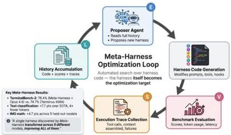
Figure 15. Meta-Harness outer-loop architecture: an agentic proposer iteratively generates harness code candidates, evaluates them on benchmarks, collects execution traces, and feeds the full history back for the next iteration. This automated search over the harness design space achieved  $76.4\%$  on TerminalBench-2, surpassing hand-engineered approaches.

# 6.4. Protocol and Interface Standardization

Figure 17: Protocol Interoperability Trade-offs (MCP vs. A2A vs. Proprietary). A scatter plot with axes representing (1) standardization pressure (x-axis: how many independent implementations follow the protocol) and (2) expressiveness-simplicity trade-off (y-axis: can the protocol represent all necessary tool semantics without out-of-band agreements). Each protocol is plotted as a point with a circle whose radius represents adoption rate. MCP appears at high standardization + medium expressiveness (designed for narrower ecosystem), A2A at low standardization + high expressiveness (designed for full semantic fidelity), and proprietary implementations scattered across the plot. Arrows indicate evolutionary pressure: systems move rightward as standardization increases, and move upward as practitioners discover expressiveness gaps. The figure clarifies that "best protocol" depends on use case: MCP excels at ecosystem standardization whereas A2A excels at semantic completeness, and the optimal choice reflects which dimension a given system prioritizes.

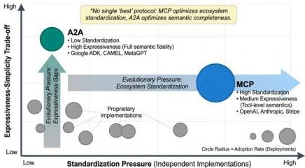
Figure 16. Protocol interoperability trade-offs (MCP vs. A2A vs. Proprietary). Axes represent standardization pressure and expressiveness-simplicity trade-off.

CC BY

© 2026 by the author(s). Distributed under a Creative Commons CC BY license.

---

Preprints.org (www.preprints.org) | NOT PEER-REVIEWED | Posted: 28 April 2026

doi:10.20944/preprints202604.0428.v3

# 6.4.1. The Fragmentation Problem

Without standard protocols, every harness-to-tool and harness-to-harness integration requires custom code, preventing portability and creating maintenance burdens that scale quadratically with the number of systems in an ecosystem. The fragmentation problem in agent protocols mirrors the fragmentation problem in agent evaluation: both reflect the field's failure to treat interoperability as a first-class infrastructure concern rather than a problem each team solves for itself.

Three protocol families have emerged in response to this fragmentation, each addressing a different scope of the interoperability problem. Their coexistence reflects not complementarity but unresolved disagreement about where the standard should sit.

A fourth emerging approach bypasses protocol standardization entirely: Pan et al. [63] propose encoding harness logic in structured natural language rather than code, arguing that natural-language harness specifications (NLAHs) are inherently more portable and comparable than code-based implementations. Their Intelligent Harness Runtime (IHR) interprets NLAHs through explicit contracts—required inputs/outputs, format constraints, validation gates, permission boundaries, retry and stop rules—executed by an in-loop LLM. On OSWorld, NLAH-based execution improved performance from 30.4 to 47.2 on held-out tasks. This approach raises a fundamental representational question for harness infrastructure: should the harness specification language be code (precise, verifiable, but brittle and non-portable), a domain-specific language (structured, type-checkable, but requiring tooling investment), or natural language (maximally portable but lacking formal verification)? The NLAH authors acknowledge this tension: their "structured natural language" format currently lacks machine-checked schema validation, dead-stage detection, or static analysis of contracts. The resolution of this representational question has direct implications for several challenges analyzed in this survey, like the portability, evaluation reproducibility, and cross-harness benchmarking.

# 6.4.2. Protocol Comparison

Table 9. Protocol Comparison: MCP, A2A, and Proprietary. Scope, transport, authentication, adoption level, and maintainer for each interoperability protocol.

<table><tr><td>Protocol</td><td>Scope</td><td>Transport</td><td>Auth</td><td>Adoption</td><td>Maintainer</td></tr><tr><td>MCP</td><td>Agent→Tool</td><td>JSON-RPC (stdio/HTTP)</td><td>OAuth (2025)</td><td>High</td><td>Anthropic</td></tr><tr><td>A2A</td><td>Agent→Agent</td><td>HTTPS + SSE</td><td>OAuth</td><td>Medium</td><td>Google</td></tr><tr><td>ACP</td><td>High-level dialogue</td><td>Various</td><td>Various</td><td>Low</td><td>IBM</td></tr></table>

The Model Context Protocol (MCP) [41], introduced by Anthropic in November 2024, defines a standard JSON-RPC interface for tool and resource access. It has achieved the broadest adoption of any agent-infrastructure protocol to date, integrated natively into DeepAgents, OpenClaw, DeerFlow, and Google ADK. Its roadmap priorities (identity/security, long-running tasks, multimodal support, registry and governance) reveal the gaps that first-generation adoption has exposed: the protocol standardizes the interface but not the security model around it. In December 2025, Anthropic donated MCP to the newly-formed Agentic AI Foundation under the Linux Foundation [128], signaling a transition from single-vendor stewardship to community governance.

Two concurrent efforts targeted the orthogonal problem of inter-agent (rather than agent-to-tool) communication. Google's Agent2Agent protocol (A2A) [42], announced in April 2025, addresses inter-agent communication via HTTP, JSON-RPC, and Server-Sent Events, and was contributed to the Linux Foundation in June 2025. IBM Research's Agent Communication Protocol (ACP) [129], launched in March 2025 to power the BeeAI platform, addressed similar concerns with a REST-native, local-first design philosophy. In August 2025, the two efforts formally merged: ACP was absorbed into A2A under unified Linux Foundation governance [130], consolidating inter-agent communication around a single standard. The question of whether A2A-style protocols are necessary in addition to MCP—or

CC BY

© 2026 by the author(s). Distributed under a Creative Commons CC BY license.

---

whether treating agents as MCP tools is sufficient—remains unresolved, but the rapid consolidation suggests the community has converged on “yes, but with one standard, not many.”

### 6.4.3 Empirical Comparison: MCP vs. A2A Performance Characteristics

Before examining root causes, it is worth grounding the MCP vs. A2A comparison in available empirical evidence, which—while limited—reveals architecturally significant differences. MCP's JSON-RPC over stdio transport achieves latency in the range of 2--15 ms for local tool calls, making it suitable for the tight integration loops that single-harness agents require. A2A's HTTPS + Server-Sent Events transport introduces minimum latency of approximately 50--200 ms for cross-network agent delegation, reflecting its design for internet-scale inter-organizational communication rather than intra-process tool calls. The interoperability survey by Ehtesham et al. [131] provides the most systematic comparison available: examining MCP, A2A, ACP, and ANP across four dimensions, transport efficiency, security model, discovery mechanism, and stateful session support, it finds that no single protocol dominates across all dimensions. MCP leads on transport efficiency and adoption breadth; A2A leads on security model completeness (OAuth flows, HTTPS enforcement) and stateful task management via task IDs and SSE streaming; ACP leads on semantic expressiveness for intent-level communication. This ranking is corroborated at the deployment level by Mialon et al. [18], who analyze tool-augmented language models across integration patterns and find that latency constraints within the execution loop systematically favor local-process tool registries over network-mediated tool access—a finding that predates MCP and A2A but correctly predicts their architectural differentiation. AgencyBench [15] supplies a third data point from a different angle: its multi-harness evaluation infrastructure required A2A-style agent identity mechanisms that MCP's tool registry model cannot provide, confirming that neither protocol alone serves the full multi-harness use case.

Three independent lines of evidence—a protocol-level survey, a latency-level analysis, and a deployment-level experience report—thus converge on the same architectural picture: MCP and A2A occupy complementary rather than competing roles, with MCP specialized for intra-harness tool access and A2A for inter-harness agent delegation. What remains unspecified is the boundary between them. No current standard defines how a harness should expose its internal MCP tools to external A2A peers, how identity should propagate across the boundary, or how policies enforced at one layer should be reflected at the other. This integration gap is the most consequential open problem in multi-harness infrastructure today, and addressing it will require coordination between the MCP and A2A communities that has not yet materialized.

### 6.4.4 MCP and A2A: Complementary Roles in the Harness Stack

Despite their apparent competition for the role of “the agent protocol standard,” MCP and A2A address structurally different problems and are better understood as complementary layers in a coherent harness communication stack than as alternatives.

MCP's design is optimized for harness-to-tool integration: a harness acts as an MCP client, tool providers act as MCP servers, and the protocol governs how the harness discovers available tools (via MCP's capability negotiation), validates tool schemas (via MCP's typed argument format), and dispatches tool calls (via MCP's request-response mechanism). The protocol is symmetric in the sense that any MCP client can connect to any MCP server, enabling a marketplace of interoperable tool providers. This design is appropriate for the T-component's function: the tool registry needs a standard interface through which new tools can be registered and invoked without custom integration code for each tool.

A2A's design is optimized for harness-to-harness communication: each harness presents an “agent card” that describes its hosted agents' capabilities and communication interfaces; harnesses delegate tasks to each other via A2A's task specification format; and the protocol governs how progress is streamed back (via Server-Sent Events) and how completion is acknowledged. The protocol is asymmetric in the sense that delegating and receiving harnesses play different roles, reflecting the hierarchical character of multi-harness delegation. This design is appropriate for the E-component's

---

Preprints.org (www.preprints.org) | NOT PEER-REVIEWED | Posted: 28 April 2026

doi:10.20944/preprints202604.0428.v3

multi-agent orchestration function: the execution loop needs a standard mechanism to delegate subtasks to external agents without requiring knowledge of those agents' internal implementations.

The complementary roles imply a natural integration point: when a harness receives an A2A task delegation and dispatches it to a local tool via MCP, the A2A boundary defines the inter-harness interface while the MCP boundary defines the intra-harness tool interface. The gap between these two boundaries—how task authorization information from A2A is translated into tool permission grants in MCP—is precisely the unspecified integration boundary that deployers currently navigate ad-hoc. Standardizing this integration point would allow any A2A-compatible harness to safely delegate to any MCP-compatible tool environment without custom authorization translation code, enabling the full composability that federated multi-harness deployment requires.

The ACP protocol (IBM) occupies a different position in this stack: it addresses high-level intent communication between agents that may be executing in different harnesses, rather than tool-level or task-delegation-level protocol. Where MCP governs "execute this API call with these arguments," and A2A governs "accomplish this task using your capabilities," ACP governs "here is my intent; determine how to accomplish it." This three-layer stack—intent (ACP), task delegation (A2A), tool execution (MCP)—provides a coherent conceptual architecture for the full range of inter-agent coordination, from high-level goal passing to low-level API invocation. Whether this architecture will be realized through the current protocol proposals or through a different set of standards remains to be determined by market adoption and empirical validation.

The following table provides a structured comparison of the five protocols currently shaping the harness communication landscape, across dimensions that are directly relevant to harness component governance. The comparison reveals complementary strengths rather than a single dominant standard.

Table 10. Protocol Capability Matrix. Feature-level comparison of MCP and A2A across tool invocation, agent delegation, streaming, and security semantics.

<table><tr><td>Dimension</td><td>MCP</td><td>A2A</td><td>ACP</td><td>OpenAI Function Calling</td><td>Anthropic tool_use</td></tr><tr><td>Communication Model</td><td>Client-server (tool invocation)</td><td>Peer-to-peer (agent-to-agent)</td><td>Request-response (task delegation)</td><td>Unidirectional (model→tool)</td><td>Unidirectional (model→tool)</td></tr><tr><td>Stateful sessions</td><td>Roadmap (2026)</td><td>Native</td><td>Limited</td><td>×</td><td>×</td></tr><tr><td>Auth/permissio layer</td><td>Roadmap (2026)</td><td>OAuth2</td><td>Basic</td><td>API key only</td><td>API key only</td></tr><tr><td>Streaming support</td><td>Roadmap (2026)</td><td>✓</td><td>Limited</td><td>✓</td><td>✓</td></tr><tr><td>Tool discovery</td><td>✓ (schema registry)</td><td>~ (capability declaration)</td><td>×</td><td>×</td><td>×</td></tr><tr><td>Multi-step coordination</td><td>×</td><td>✓</td><td>✓</td><td>×</td><td>×</td></tr><tr><td>Production maturity</td><td>Early (2025-)</td><td>Emerging (2026-)</td><td>Emerging (2026-)</td><td>Mature</td><td>Mature</td></tr><tr><td>Primary harness role</td><td>T-component standard</td><td>E-component coordination</td><td>Cross-harness task delegation</td><td>T-component (closed)</td><td>T-component (closed)</td></tr></table>

The table makes visible that MCP and A2A are complementary rather than competing — MCP standardizes the tool invocation boundary ( $T$ -component) while A2A standardizes the agent coordi-

CC BY

© 2026 by the author(s). Distributed under a Creative Commons CC BY license.

---

ation boundary ($E$-component in multi-agent settings). The production blockers for both protocols (stateful sessions, auth/permission layers) belong to the same class of problem, cross-turn identity and authorization management, suggesting that a shared infrastructure solution may emerge that resolves both simultaneously. OpenAI Function Calling and Anthropic tool_use are mature but closed-ecosystem $T$-component standards; they do not address multi-step coordination or inter-harness communication, which is why MCP and A2A have emerged as the open-ecosystem alternatives despite their relative immaturity. The governance of tool set size has emerged as one of the most empirically grounded harness design decisions in practitioner accounts. Stripe’s Toolshed MCP server maintains approximately 500 tools globally, but each Minions agent receives only a carefully curated subset relevant to its task; the architects report that over-tooling degraded agent performance, a finding consistent with the theoretical prediction that larger tool catalogs increase selection noise at the model inference step *[22]*. Vercel’s engineering team independently arrived at a numerically stark version of the same conclusion: reducing the agent’s available tool count from 15 to 2 improved task accuracy from 80% to 100%, a result Schmid *[51]* characterizes as representative of a general pattern in which removing tools(not adding them) is the intervention that unlocks reliable agent behavior . The OpenAI Codex AGENTS.md file is designed explicitly as a “table of contents, not an encyclopedia” at approximately 100 lines, reflecting the architectural principle that legibility and enforceability are prerequisites for agent compliance *[20]*; informal practitioner analysis suggests that instruction files exceeding 60 lines may degrade agent compliance with file-level guidance, though this threshold has not been established in peer-reviewed work and should be treated as a working hypothesis rather than an empirical finding. The harness governance implication of these convergent practitioner observations is that the $T$-component must implement tool access control policies—curating which tools are visible to each agent instance based on task context—not merely tool registration. A tool registry that exposes its full catalog to every agent instance at every step is not a neutral infrastructure choice: it is an architectural decision that measurably degrades performance by expanding the model’s selection space beyond the regime where reliable selection is possible.

#### 6.4.5. Root Causes of Protocol Fragmentation

The security dimension of protocol fragmentation has received its first systematic treatment in Anbiaee et al. *[132]*, which develops a structured threat modeling analysis across all four emerging protocols: MCP, A2A, Agora, and ANP. The analysis identifies twelve protocol-level risks organized across three lifecycle phases (creation, operation, update). The most striking finding is that MCP exhibits a 100% tool spoofing success rate due to namespace collision—same-name tools from different providers can shadow each other without detection—a vulnerability that has no protocol-level mitigation in the current specification. All four protocols lack backpressure mechanisms for cascading failures, and none implements credential revocation or rollback protection in the update phase. The implication for harness design is that protocol adoption decisions carry security consequences that the current standardization discussion largely ignores: a harness implementing MCP without additional namespace isolation at the harness layer inherits a tool spoofing vulnerability that the protocol itself cannot address. This analysis strengthens the case for the $L$-component (lifecycle hooks) as a mandatory harness function: protocol-level security gaps must be compensated by harness-level interception mechanisms that the protocol designers did not anticipate.

Protocol fragmentation in agent infrastructure persists for four distinct structural reasons, each with a different character. First, scope disagreement: MCP assumes tool use is the fundamental interoperability layer; A2A assumes agent-to-agent delegation is; ACP assumes intent communication is. These represent genuinely different architectural models of multi-agent interaction, and the disagreement is not resolvable by negotiation alone—it requires empirical data on which interoperability level produces the most reliable multi-agent behavior, which the Ehtesham et al. *[131]* survey reveals is still largely absent.

---

Second, incentive misalignment: major laboratories have incentives to promote protocols that fit their existing architectures and model ecosystems, creating a standards landscape shaped partly by competitive positioning rather than technical merit.

Third, deployment friction: integrating any standard protocol requires RPC server infrastructure, schema management, and authorization complexity—costs that fall disproportionately on small teams who would benefit most from interoperability. The friction slows adoption of every standard, regardless of technical quality.

Fourth, absence of an empirical comparator: unlike web protocols, which could be evaluated on load, latency, and compatibility metrics, agent protocols lack agreed benchmark scenarios for cross-harness multi-agent interaction. Without measurement, the field cannot distinguish better from worse standards on evidence. The result is that the field’s interoperability infrastructure lags its capability infrastructure by approximately two to three years—the same gap that separated the emergence of the web from the emergence of reliable web standards.

### 6.5 State and Knowledge Management

The second major class of harness challenges concerns how the harness manages persistent state, contextual knowledge, and the ecosystem of tools available to the agent. These three functions—maintaining state across execution steps, selecting and retrieving relevant context dynamically, and governing which tools the agent can invoke—are the primary means by which a harness instantiates a coherent execution context for the model. When these functions operate well together, the agent experiences a stable, navigable environment where prior decisions matter and future actions are constrained by current state. When they operate poorly, the agent faces a chaotic context window that leaks previous task information, loses relevant details at critical moments, and provides tool access that is either too broad (creating security risks) or too narrow (preventing task completion). This section examines three subsystems that together constitute the knowledge and state management layer: First, this chapter analyzes runtime context management—how the harness decides what information to present to the model at each step. Second, it analyzes tool use governance, for how the harness mediates the agent’s access to external capabilities; and then analyzes memory architectures, about how the harness persists information across extended execution sequences.

#### 6.5.1 Runtime Context Management

The Context Window Bottleneck

Context window size is the most visible constraint on long-horizon agent tasks, but it is not the fundamental problem—the fundamental problem is that naive accumulation of interaction history is a poor use of the available space, and that the choice of what to retain, compress, or evict from context has consequences that extend well beyond performance. A context manager that retains everything faces quadratically increasing token costs; one that discards too aggressively loses the continuity that distinguishes a capable agent from a stateless autocomplete system; and one that retains the wrong content—specifically, poisoned or manipulated content from an earlier turn—creates a security vulnerability that persists across the entire task execution. This design space corresponds to the $V$-component design space introduced in §7.1, where context management determines the observability of the $E$-component’s state transitions: a $C$-component that retains complete history provides full state observability but at quadratic cost; one that compresses aggressively reduces observability and may mask the security-critical state corruptions that the $L$-component is designed to detect.

SkillsBench *[59]* quantifies the infrastructure contribution to effective capability from a different angle: curated Skills—structured packages of procedural knowledge integrated at the harness level—raise average pass rates by 16.2 percentage points across 86 tasks in 11 domains. This improvement comes not from model capability but from what the harness makes available to the model at inference time. The finding that focused Skills with 2–3 modules outperform comprehensive documentation illustrates a general principle: the harness’s context management function is not a passive relay but an active epistemic filter whose design decisions shape what the model can accomplish. This corresponds

---

Preprints.org (www.preprints.org) | NOT PEER-REVIEWED | Posted: 28 April 2026

doi:10.20944/preprints202604.0428.v3

to the  $C$ -component design space introduced in §3.2: the context manager determines the effective alphabet  $\Sigma_{\mathrm{visible}}$  of events and state observations that the model can reason about at each step; a  $C$ -component that exposes the full alphabet  $\Sigma$  overwhelms the model's reasoning capacity, while one that restricts  $\Sigma_{\mathrm{visible}}$  to task-relevant symbols improves inference quality, revealing that context management is structurally a compression problem in the LTS event space.

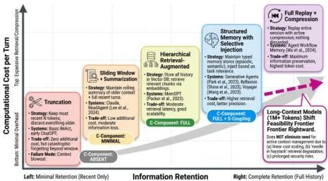
Figure 17. Context management strategy spectrum: five approaches positioned by information retention vs. computational cost per turn, with representative systems and  $C$ -component realization levels mapped to each region.

Context Management Strategies Comparison

Table 11. Context Management Strategy Comparison. Five strategies compared by mechanism, retention behavior, computational cost, and representative systems.

<table><tr><td>Strategy</td><td>Mechanism</td><td>Pros</td><td>Cons</td><td>Systems</td></tr><tr><td>Truncation</td><td>Keep most recent K tokens</td><td>Simple, fast</td><td>Loses old information</td><td>Baseline</td></tr><tr><td>Summarization</td><td>Compress older context</td><td>Preserves gist</td><td>Information loss</td><td>LangChain</td></tr><tr><td>Retrieval-augmented</td><td>Store all, retrieve relevant</td><td>Preserves everything</td><td>Retrieval quality depends on query</td><td>MemGPT, Zep</td></tr><tr><td>Knowledge graph</td><td>Structured entity/relationship storage</td><td>Semantic relationships</td><td>Construction cost</td><td>Zep TK</td></tr><tr><td>Memory-as-action</td><td>Agent actively manages memory</td><td>Task-optimal curation</td><td>Learning overhead</td><td>MemAct</td></tr><tr><td>Skill injection</td><td>Structured procedural packages</td><td>Targeted, efficient</td><td>Curation required</td><td>SkillsBench harnesses</td></tr></table>

CC BY

© 2026 by the author(s). Distributed under a Creative Commons CC BY license.

---

### 6.5.2. Knowledge and Context Engineering

#### Key Systems and Empirical Results

MemGPT *[13]* introduces OS-inspired virtual context management with explicit paging between the context window (“RAM”) and external storage (“disk”). This architecture prefigures modern harness memory designs and remains the strongest available C-component implementation. MemAct *[133]* treats working memory management as a learnable policy—the agent actively edits context via memory actions (insertion, deletion)—demonstrating that context curation can be optimized rather than merely heuristic. CORAL provides explicit Memory Management and Context Optimization tools for web agents. Zep’s Temporal Knowledge Graph reports 18.5% accuracy improvement on long-horizon tasks with 90% latency reduction.

The SkillsBench finding that self-generated Skills provide no average benefit—that “models cannot reliably author the procedural knowledge they benefit from consuming”—has direct implications for harness design: the S-component (state store) cannot rely on the agent to produce its own reusable skill representations. The harness must either curate skills externally or implement mechanisms for validating and filtering self-generated skill candidates before they enter the persistent store.

A complementary model-level mechanism is Self-RAG *[134]*, which enables a model to selectively retrieve and critique external context rather than passively consuming whatever the retrieval pipeline provides. From the harness perspective, Self-RAG represents a partial transfer of the C-component’s selection function from the harness to the model itself: rather than relying entirely on harness-level retrieval policies to determine what enters context, the model participates in curation through its reflection tokens. Harnesses integrating Self-RAG-style models must therefore adapt their context management strategies—the optimal harness policy changes when the model can actively request or reject retrieved content.

#### Long-Context Models and the Evolving C-Component Design Space

A development that substantially changes the context management problem—but has received almost no harness-level analysis—is the emergence of ultra-long-context models. Gemini 1.5 and 1.0 Pro offer one million token context windows; more recent iterations extend this further. The naive interpretation is that long-context models dissolve the C-component problem: if the context window is large enough to hold an entire task’s interaction history, perhaps compaction, retrieval, and prioritization strategies are no longer necessary. This interpretation is empirically false and architecturally dangerous. The empirical evidence against it is strong: the attention dilution phenomenon—whereby models operating on very long contexts exhibit degraded effective attention to early context as sequence length increases—was established by Liu et al. *[135]* , who demonstrated that language models consistently underutilize information placed in the middle or early portions of long contexts. HAL’s evaluation infrastructure *[14]* provides corroborating infrastructure evidence: models in HAL’s long-context rollouts exhibited the same degradation pattern at the deployment scale of 21,730 rollouts, producing the paradox that a model with a one-million-token window may perform worse on information near the beginning of a long sequence than a model that summarized and re-injected that information at regular intervals. AgencyBench *[15]* documents this directly: tasks requiring one million tokens per execution show substantial variance in which information the model successfully integrates, suggesting that raw context capacity does not translate linearly into effective information access. The architectural implication is that long-context models shift the C-component’s design problem rather than eliminating it. With short context windows, the primary challenge is retention—deciding what to keep when space is scarce. With long context windows, the primary challenge is salience—deciding what to highlight when the model’s effective attention is the scarce resource. This shift calls for C-component strategies that are fundamentally different from compaction: structured attention anchors that place high-priority information at positions where model attention is empirically strongest; hierarchical context organization that groups related information so that retrieval patterns match the model’s attention distribution; and active redundancy—strategic repetition of key task state at regular intervals—rather than the

---

aggressive deduplication that short-context harnesses employ. SkillsBench's finding that focused Skills with 2--3 modules outperform comprehensive documentation *[59]* generalizes to this setting: in ultra-long-context harnesses, the C-component's role shifts from gatekeeper to architect—not preventing information from entering context, but organizing it so that the model's attention is reliably directed to what matters.

### Retrieval-Augmented Context Management: Architecture and Limitations

The retrieval-augmented context management pattern—storing all interaction history and retrieving relevant subsets at each step—has emerged as the dominant approach for long-horizon agents, largely because it avoids the information loss inherent in summarization while enabling context windows of bounded size. However, retrieval-augmented systems introduce a set of failure modes distinct from those of simpler retention strategies, and these failure modes are specifically harness-level concerns rather than model-level concerns.

Retrieval latency injection. Each step of a long-horizon task requires a retrieval query against the stored history before model inference can begin. For a task with 100 steps and a retrieval latency of 500ms per step, retrieval overhead accounts for 50 seconds of total task time—a non-trivial fraction of the task budget, and one that scales linearly with task length. Semantic retrieval at scale (across 10,000+ stored segments) requires a vector database backend; cold-start latency for the vector index adds further overhead. The harness must manage this latency through index pre-warming, approximate nearest-neighbor search tradeoffs, and retrieval result caching that avoids redundant queries for the same context across consecutive steps.

Retrieval relevance degradation. As the interaction history grows, the signal-to-noise ratio of retrieval results decreases: the volume of potentially relevant historical content grows, while the model's query for retrieval remains fixed in precision. A retrieval query that returns the 5 most relevant segments from a 100-segment history may return substantially lower quality results when applied to a 1,000-segment history, because the absolute number of marginally relevant segments that compete with truly relevant ones has grown by a factor of 10. The harness can partially compensate through tiered retrieval—maintaining a summary of older history alongside verbatim storage of recent history—but the design of the tiering policy is a research problem with no consensus solution.

Retrieval gaming by adversarial content. An attacker who can introduce content into the agent's stored history can craft retrieval-optimized content—content that maximizes semantic similarity to expected future queries—to ensure that adversarial instructions are retrieved with high priority in contexts where they can influence consequential actions. This attack variant requires the harness to maintain retrieval-resistant storage: segregating content by provenance and weighting retrieval scores by content trustworthiness, not just semantic similarity. No current production harness implements retrieval provenance weighting.

Query formulation quality dependence. The quality of retrieval-augmented context management depends critically on the harness's ability to formulate retrieval queries that accurately capture the model's information need at each step. Current harnesses typically generate retrieval queries either from the user's task description (fixed across all steps, regardless of current execution state) or from the model's most recent output (variable, but potentially noisy or misdirected). Neither approach reliably captures what historical context would be most beneficial at each specific step. Research on query formulation as a harness-level function—rather than delegating it to the model—is nascent, with MemAct's memory-as-action approach representing the most principled current treatment.

### Root Cause: Why Context Management Remains Unsolved

Context management remains unsolved because the optimal policy is task-dependent in ways that cannot be specified in advance: what should be retained for a software engineering task differs from what should be retained for a research task or a scheduling task. The harness cannot know at configuration time what information will prove relevant later in execution. This fundamental uncertainty drives the appeal of retrieval-augmented approaches, which defer the selection decision

---

to query time—but at the cost of depending on retrieval quality, which is itself a research problem. The emergence of long-context models adds a further dimension: the optimal $C$-component design is not only task-dependent but model-dependent in ways that are not yet characterized empirically. The security dimension compounds the difficulty: the harness cannot simply retain everything that appears relevant, because some relevant-seeming content may be adversarially crafted to persist—a risk that scales with context window size.

DeepAgents: Context Engineering Through Middleware Architecture

LangChain’s DeepAgents *[43]* provides a production demonstration of context management improvements as a discrete harness engineering problem, independent of model changes. By improving from 52.8% to 66.5% on TerminalBench 2.0 (a 26% improvement) while keeping the underlying model constant, DeepAgents provides strong evidence that context engineering alone can yield performance gains comparable to model upgrades.

DeepAgents implements context management through a middleware-based architecture, with three key $C$-component innovations. First, system prompt engineering for self-verification: the system prompt is reformulated to emphasize explicit verification loops, encouraging the agent to test its own code before claiming completion. This middleware hook operates at the system level, shaping what the model attends to throughout execution. Second, LocalContextMiddleware for structured context injection: rather than concatenating tool results as strings, DeepAgents structures context through a middleware layer that curates, filters, and summarizes information before injecting it into the context window. Context is not merely retrieved; it is actively engineered at the harness level to guide the agent toward productive reasoning patterns. Third, lifecycle hooks for failure detection: middleware hooks detect failure patterns—such as the “write-read-stop” syndrome where agents generate code, read it back, decide it looks correct, and stop without testing. By instrumenting these lifecycle points, DeepAgents prevents the agent from entering these failure modes before they propagate to the next execution step.

The empirical impact is substantial: DeepAgents identifies a core failure pattern in agent-based code writing: agents write code, re-read it, decide it looks correct, and terminate without testing. This failure mode is not a model capability limitation; it is a context management failure where the harness fails to create conditions that force testing before termination. By implementing middleware hooks that enforce verification before completion, DeepAgents eliminates this failure class entirely. The improvement from 52.8% to 66.5% thus represents pure harness-layer governance quality improvement—evidence that context management through structured middleware is as impactful as any model upgrade on the current frontier. DeepAgents’ open-source architecture demonstrates these improvements are reproducible and adoptable: the same middleware components can be integrated into any harness that implements the $L$-component hook model.

### 6.6 Tool Use as Core Harness Function

#### 6.6.1 The Tool Registry as a Governance Object

Tool use is the primary mechanism by which an agent acts on the world, and the tool registry—the $T$-component of the harness—is therefore the primary governance point for agent behavior. The four-stage tool learning workflow identified by Qu et al. *[30]*—task planning, tool selection, tool calling, and response generation—describes a process that the harness mediates at every stage. The harness maintains the registry that constrains which tools are available (stage 2), validates calls before execution (stage 3), handles errors and retries (stage 3), and manages context integration of results (stage 4). A harness with weak $T$-component governance—an overly broad tool catalog, absent schema validation, or no retry logic—creates a system that is both less reliable and, as established in §6.2, less secure.

The empirical case for harness-level tool governance is made most forcefully by AgencyBench *[15]*. Its finding that Claude-4.5-Opus performs best when run through the Claude-Agent-SDK is not primarily a finding about model quality; it is a finding about tool-call preferences and model--harness

---

co-optimization. The paper observes “significant disparities across models in resource efficiency, feedback-driven self-correction, and specific tool-use preferences”—disparities that are invisible without cross-harness evaluation. This suggests that the current practice of developing tools and models independently, then integrating them at deployment, may be systematically suboptimal: the tool registry’s schema, ordering, and error behavior interact with the model’s learned behavior in ways that compound across the 90-step task horizons AgencyBench evaluates.

#### 6.6.2 The ToolBench Ecosystem and Large-Scale Tool Learning

The progression from Toolformer *[80]* through Gorilla *[81]* to ToolLLM *[4]* represents an evolution in where tool-calling competence is located: from a model that learns when to call tools through self-supervised training (Toolformer), to a model that retrieves the appropriate API documentation before calling (Gorilla), to a model trained on 16,000+ real-world APIs with harness-managed workflow planning (ToolLLM). Each step shifts part of the competence burden from the model toward the harness: Toolformer embeds tool-selection logic in model weights; Gorilla externalizes API documentation retrieval to a retrieval system that the harness must manage; ToolLLM requires a harness-side workflow planner (DepthFirst Search-based Depth-First Search tree) to decompose multi-step tool sequences. The harness implication is that model-side learning and harness-side infrastructure are not substitutes but complements: a model trained to use Gorilla’s retrieval interface cannot function correctly if the harness fails to provide retrieval, and a model trained on ToolLLM’s workflow planner cannot substitute its own planning when the harness omits it. The registry-scale governance implications of this ecosystem—how harnesses manage tool selection, schema validation, and error handling across catalogs of this size—are analyzed in §6.6.8

Three additional systems sharpen the harness implications of tool execution. CodeAct *[121]* replaces discrete tool call sequences with executable Python code as the unified action space: rather than selecting from a fixed tool catalog, the agent generates code that composes tool calls dynamically, integrating results through Python’s interpreter state. CodeAct’s superior performance on 17 Mint benchmarks over discrete-action alternatives—coupled with its 20% reduction in interaction turns—establishes that the choice between code-as-action and discrete-tool-call as action is a first-order $T$-component design decision, not a model capability question. GoEX *[136]* addresses the complementary question of human oversight over tool execution: its Gorilla Execution Engine design allows humans to efficiently verify, approve, or roll back tool actions through post-hoc validation rather than blocking approval gates, enabling higher agent autonomy while maintaining meaningful human oversight. GoEX’s design is directly relevant to the $L$-component (lifecycle hooks) as a non-blocking alternative to human-in-the-loop checkpoints. ToolSandbox *[137]* complements ToolBench by focusing on stateful, multi-turn tool execution: by tracking tool state persistence across conversational turns and modeling implicit inter-tool dependencies (where the output of one tool affects the valid inputs of another), ToolSandbox reveals that harness $T$-components must manage tool state as a coherent runtime object rather than treating each tool call as stateless.

#### 6.6.3 Skill Libraries as $S$-$T$ Component Integration

Voyager *[3]* introduces an ever-growing skill library—executable code for complex behaviors that an agent can add to and retrieve from across sessions. This architecture represents an integration of the $T$ and $S$ components: the skill library is both a persistent state store ($S$) and an extended tool registry ($T$), allowing the agent to accumulate new tools through experience rather than receiving a fixed catalog at configuration time. SkillsBench’s finding that focused, curated skills with 2–3 modules outperform both comprehensive documentation and self-generated skills suggests that the design of this integration matters enormously: more capability is not better if it introduces noise that degrades selection quality.

---

### 6.6.4. Tool Registry Design Patterns: A Structured Comparison

The tool registry design space has expanded considerably with the maturation of both MCP as a standardization layer and the empirical literature on tool-call reliability. We identify five registry design patterns that represent distinct tradeoffs across the dimensions of reliability, security, flexibility, and cost.

Pattern 1: Static declarative registry. The harness maintains a fixed, pre-declared set of tools with schemas registered at harness initialization time. Tools cannot be added or removed during task execution. This pattern provides maximum schema stability (the harness can validate all possible tool calls at initialization rather than at call time), minimum attack surface (no dynamic extension means no injection of malicious tool definitions), and deterministic cost modeling (the tool catalog is fixed, enabling pre-computation of expected token costs for tool descriptions). The pattern’s limitation is rigidity: tasks that require tools the deployer did not anticipate at configuration time cannot be completed, and the harness must be restarted to update the tool catalog.

Pattern 2: Dynamic tool registration with schema validation. The harness allows tools to be registered at runtime, subject to schema validation against a defined tool specification format (typically JSON Schema or OpenAPI format). New tools must pass schema validation before being added to the registry; the validation step is an $L$-component function that gates $T$-component registration. This pattern enables flexible capability extension at the cost of dynamic attack surface: any code path that can submit a tool registration request can potentially inject a malicious tool with a schema that passes formal validation but has dangerous runtime behavior. MCP’s tool registration mechanism follows this pattern, with OAuth-based authentication of the registering entity as the primary security control.

Pattern 3: Capability-scoped registry. Tools are organized into capability scopes (file access, network access, code execution, external API access) with explicit scope grants at the session or task level. A task that requires network access must declare that scope; tools outside the declared scopes are invisible to the model even if present in the underlying registry. This pattern is the agent analog of OAuth scopes for API access: it limits the effective attack surface to only the tools relevant to the current task. SWE-agent’s ACIface model follows this pattern, exposing only a restricted shell interface appropriate to software engineering tasks rather than the full tool catalog available to the underlying harness.

Pattern 4: Semantic search registry. For large tool catalogs (Gorilla’s 1,600+ APIs, ToolBench’s 16,000+ APIs), enumerating available tools in the system prompt is infeasible—the description alone would saturate the context window. The semantic search registry pattern addresses this by treating tool selection as a retrieval problem: the model issues a natural-language description of the tool it needs, and the harness retrieves semantically relevant tools from a vector-indexed catalog. Gorilla *[gorilla]* demonstrates that retrieval-augmented tool selection substantially reduces hallucination in API arguments, validating the pattern’s reliability benefit. The harness implication is that the $T$-component must maintain a vector index over tool descriptions, implement a semantic search API, and manage the context budget allocated to retrieved tool descriptions at each step.

Pattern 5: Learned tool planning. ToolLLM *[toolllm]* introduces a Depth-First Search Decision Tree (DFSDT) strategy in which the harness actively assists the model in planning tool-call sequences, expanding promising tool-call paths and backtracking from dead ends. This pattern treats tool planning as a harness-level function rather than delegating it entirely to the model: the harness maintains a search tree of candidate tool-call sequences, evaluates their outcomes, and provides the model with curated proposals rather than raw tool access. The pattern substantially outperforms greedy tool selection on ToolBench’s complex multi-step tasks, suggesting that systematic tool planning at the harness level is a first-class design choice with measurable reliability benefits.

These five patterns are not mutually exclusive: a production harness might use a static declarative registry for high-security core capabilities, a capability-scoped registry for task-specific tool grants, and a semantic search index for an extended capability catalog. The key harness design decision is which

---

Preprints.org (www.preprints.org) | NOT PEER-REVIEWED | Posted: 28 April 2026

doi:10.20944/preprints202604.0428.v3

pattern governs which category of tool, and the answer depends on the tradeoffs among security, flexibility, and cost that a specific deployment context requires.

# 6.6.5. Key Harness Design Questions

Table 12. Key Harness Design Decisions. Core design choices with available options and governing tradeoff for each decision point.

<table><tr><td>Question</td><td>Options</td><td>Tradeoffs</td></tr><tr><td>Tool registration</td><td>Static vs. dynamic</td><td>Static: predictable; Dynamic: flexible but security risk</td></tr><tr><td>Tool versioning</td><td>Strict vs. loose</td><td>Strict: reproducible; Loose: adaptive but fragile</td></tr><tr><td>Permission model</td><td>Per-tool vs. per-category vs. per-action</td><td>Granularity vs. usability</td></tr><tr><td>Error handling</td><td>Fail-fast vs. retry vs. fallback</td><td>Latency vs. robustness</td></tr><tr><td>Action space</td><td>Discrete-tool vs. code-as-action</td><td>Composability vs. interpretability</td></tr></table>

AutoHarness [138] demonstrates that harness constraint enforcement need not be hand-crafted: a language model can automatically synthesize a code harness that prevents illegal actions by the agent. In the Kaggle GameArena chess competition,  $78\%$  of Gemini-2.5-Flash losses were attributed to illegal moves—a failure mode attributable entirely to the absence of harness-level action validation. AutoHarness formulates harness generation as a search problem over the space of programs, using Thompson sampling-guided tree search to iteratively refine candidate harnesses given environment feedback. The resulting automatically synthesized harness eliminates all illegal moves across 145 TextArena games, enabling a smaller model (Gemini-2.5-Flash) to outperform larger models (Gemini-2.5-Pro) through harness quality alone—a result that directly corroborates the binding constraint thesis of this survey. The harness governance implication is significant: if harness constraint logic can be synthesized rather than hand-coded, the  $T$ -component's action validation layer becomes a learnable function rather than a static engineering artifact, opening a design space in which harness quality scales with compute investment in harness search rather than with manual engineering effort.

# 6.6.6. Harness-Compatible Model Training and Fine-Tuning

An understudied dimension of the harness-model coupling problem is how models become harness-compatible in the first place. AgentTunin [139] demonstrates that instruction tuning on agent interaction trajectories—specifically, trajectories sampled from diverse harness environments covering tool use, coding, game play, and web navigation—produces models that generalize more reliably to new harness configurations. The implication for harness design is bidirectional: just as harness architecture should account for model capabilities (as AgencyBench demonstrates), model fine-tuning should account for the operational characteristics of target harnesses. A harness that exposes detailed error messages from tool failures, for instance, enables a model fine-tuned on AgentTuning-style trajectories to exhibit the "feedback-driven self-correction" that AgencyBench identifies as a key differentiator between high-performing and low-performing configurations. This suggests a principled direction for closing the harness-model coupling gap: standardized harness interaction trajectories that can serve as fine-tuning corpora, making model compatibility with a defined harness API a trainable property rather than an emergent one. The protocol-layer formalization of this model-harness interface is analyzed in §6.4.

CC BY

© 2026 by the author(s). Distributed under a Creative Commons CC BY license.

---

Preprints.org (www.preprints.org) | NOT PEER-REVIEWED | Posted: 28 April 2026

doi:10.20944/preprints202604.0428.v3

# 6.6.7. Root Cause: Tool Governance Without Standards

The tool governance problem persists because the field lacks a formal model for reasoning about the composition of tool permissions. While individual tools can be assessed for their safety properties, the composition of tools creates emergent capabilities that are not predictable from the components—as established in §6.2.6. Without a compositional safety model, harness designers must rely on empirical testing, which scales poorly with catalog size. The AgencyBench finding that model-harness co-optimization is occurring implicitly in proprietary ecosystems suggests that this governance problem is being solved for specific model-harness pairs but not in a transferable way; the field needs a principled approach to tool registry governance that is model-agnostic.

The most architecturally complete response to the runtime security challenge for tool-augmented agents, as of this writing, is OpenClaw PRISM [48], a zero-fork runtime security layer that distributes enforcement across ten lifecycle hooks: message ingress, prompt construction, tool execution, tool-result persistence, outbound messaging, sub-agent spawning, and gateway startup. PRISM's design embodies the core insight that agent security cannot be reduced to a single boundary check. Unlike conventional input-output filtering, which inspects text at the user-facing boundary, PRISM deploys a hybrid heuristic-plus-LLM scanning pipeline with conversation- and session-scoped risk accumulation using TTL-based decay—meaning that low-grade suspicious signals can aggregate across multiple turns before triggering enforcement, rather than requiring any single event to cross a static threshold. Policy controls govern tool access, file paths, private network access, domain tiers, and outbound secret patterns, with hot-reloadable policy management and tamper-evident audit logging. The zero-fork architecture—implementable as an in-process plugin without modifying the host framework—is itself a contribution: it solves the deployment problem that has historically caused security tools for agent runtimes to become a maintenance burden with every upstream release. PRISM represents the first systematic published treatment of production runtime security for a deployed, open-source agent harness—and the first openly documented production runtime security layer implemented without forking the host framework—and its evaluation methodology—measuring security effectiveness, false positive rates, layer contribution, runtime overhead, and operational recoverability—provides a template for how harness security should be benchmarked going forward. The following subsections deepen the tool governance analysis along four dimensions: registry architecture at scale (§6.6.8), failure taxonomy and exception handling (§6.6.9), security threat modeling (§6.6.10), and protocol-layer standardization (§6.6.11).

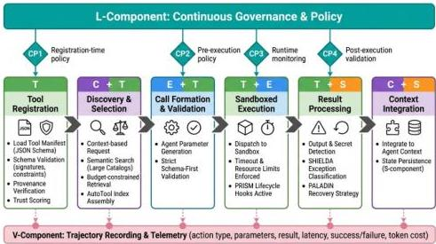
Figure 18. Tool governance lifecycle pipeline: six stages of a tool invocation from registration through context integration, showing where each  $\mathcal{H}$ -component intervenes and where security checkpoints enforce policy.

CC BY

© 2026 by the author(s). Distributed under a Creative Commons CC BY license.

---

6.6.8. Tool Management Infrastructure: The Registry as a Governance Component

Section 6.6 establishes the $T$-component’s functional role: the registry constrains available tools, schema validation guards call formation, and retry logic manages execution failures. This section deepens that analysis along four dimensions that Section 6.6 treats partially or implicitly—the registry as a governance object in its own right, tool failure as a class of harness-level engineering problem, the registry as an attack surface, and MCP as a protocol-layer resolution to what was previously a per-harness engineering burden.

The harness tool registry is usefully understood by analogy to an operating system’s system call table: it defines what capabilities the agent may invoke, under what conditions, and subject to what constraints. System call tables are not merely lookup structures—they are enforcement boundaries, audit points, and privilege escalation barriers. The tool registry must satisfy the same requirements if it is to constitute genuine governance rather than a convenience layer atop unrestricted tool invocation. In LTS terms, the $T$-component registry defines which transitions $t\in T$ are permissible: the set of valid tool invocations forms a restricted alphabet $\Sigma_{T}\subset\Sigma$ such that the $E$-component’s transition function $\delta$ can only execute transitions labeled with events in $\Sigma_{T}$, preserving the safety property that the system never reaches a state from which termination is impossible via unauthorized tool execution.

MCP *[41]* represents the field’s first serious attempt to standardize this interface at the protocol level, separating tool *definition*—expressed as a JSON Schema manifest—from tool *implementation*, which the harness need not know. This separation is architecturally significant: the harness can validate, scope, and govern tool access without coupling its security logic to each tool’s implementation. Prior work—ToolBench/ToolLLM *[4]* and API-Bank *[140]* —explored the mechanics of large-scale tool management empirically but without a protocol-level separation of concerns. ToolBench’s 16,000+ API catalog demonstrates the scale at which the harness must operate: at that cardinality, exhaustive enumeration in the system prompt saturates the context window, so the registry must support semantic search and budgeted retrieval as first-class functions. API-Bank’s three-level evaluation hierarchy implicitly identifies three independent harness-layer functions: discovery, validation, and dispatch.

The most direct evidence that registry design is a harness governance result rather than a model capability result comes from Vercel’s practitioner *[23]* finding that removing 80% of available tools improved task success rates more than any model upgrade. AutoTool *[141]* formalizes this by constructing a graph-based tool usage index at inference time, positioning tool selection as a harness-side data structure rather than a model responsibility. The Schema First study *[142]* provides controlled experimental evidence: strict JSON Schema validation at the harness registration boundary reduced interface-level tool misuse (malformed calls, schema violations) but did not improve task success rates, which remained zero across all experimental conditions. This negative result is itself informative for harness design: it demonstrates that schema validation addresses syntactic tool governance but is insufficient for semantic correctness, suggesting that additional harness-layer mechanisms—such as budgeted performance constraints (context budgets, call quotas, and latency ceilings)—are necessary complements to structural validation.

#### 6.6.9. Tool Failure as a Harness-Level Problem

Tool calls fail in structurally distinct ways: network timeouts, schema errors, permission denials, execution exceptions, quota exhaustion, and dependency failures each present a different recovery profile. The critical insight established independently by PALADIN *[45]* and SHIELDA *[46]* is that these failure types must be classified and dispatched by the harness before the model is involved in recovery. A harness that surfaces a raw HTTP 503 or a Python traceback to the model’s context delegates a classification problem to an agent with no reliable basis for distinguishing retriable from non-retriable failures, quota-exhaustion from authentication error, or tool unavailability from schema mismatch. SHIELDA formalizes this through a modular exception taxonomy covering four primary categories and demonstrates that typed, harness-level exception handlers significantly improve task completion rates over raw error pass-through. PALADIN extends this with three structured recovery strategies—

---

retry with backoff, alternative tool substitution, and graceful degradation—each triggered by classified exception type rather than model judgment. The convergent finding of these two independent lines of work is that harness exception handling design explains more performance variance than model size, a result that directly inverts the field's implicit assumption about the primacy of model capability.

The Hell or High Water benchmark *[143]* provides direct empirical support by systematically injecting external failures into agent workflows and evaluating 10+ LLMs on recovery: models fail silently when harnesses swallow errors, and recovery depends on harness-level error signaling design, not model intelligence alone. Multi-agent settings compound the problem further. MASFIRE *[144]* provides a fault injection framework with 15-category failure classification for multi-agent tool execution, demonstrating that tool failures in one agent's harness, if not properly classified and contained, propagate across agent boundaries as corrupted observations, causing downstream agents to fail for reasons invisible from within their own harnesses. This elevates tool failure handling from a single-agent engineering concern to a multi-agent protocol design problem: the interface between harnesses must convey exception type alongside tool results, or failure containment is structurally impossible. The current absence of a standard tool exception interface—every harness implements its own failure recovery logic with no shared schema for type, severity, or recoverability—means that multi-harness deployments cannot be benchmarked for comparative exception handling quality.

#### 6.6.10. Tool Security: The Registry as Attack Surface

The Policy-First architecture described here is instantiated in production in the PRISM security layer (§6.6.10), which distributes enforcement across ten lifecycle hooks within this three-point model. The tool registry's governance function and its security attack surface are two faces of the same architectural fact. Because the registry determines which tool definitions reach the model's context and which invocations are dispatched, a compromised registry compromises the agent's entire behavioral envelope. ToolHijacker *[47]* demonstrates this through no-box attacks that inject malicious tool documents into the tool library, causing agents to reliably select and execute harmful tools without any other harness compromise. The attack exploits exactly the $T$-component's function: a poisoned definition that matches common request patterns will be selected reliably by any harness performing semantic matching. This is a registry vulnerability, not a model vulnerability, and its mitigation requires harness-level controls at registration time—cryptographic provenance verification, sandboxed manifest loading, or trust-scored sources.

SkillFortify *[145]* extends this analysis through the first formal treatment of agent skill supply chains under a Dolev-Yao attacker model, proposing a CI/CD-integrated verification framework and identifying six threat categories for skill manifests. The appropriate framing is that the tool registry is a cryptographic supply chain requiring formal attestation, not a convenience store of capability descriptions: loading tool definitions without provenance verification is structurally equivalent to installing packages without signature verification. Policy-First Control *[146]* proposes the corresponding defense architecture—combining policy DSL declarations with runtime enforcement to govern tool access throughout the agent lifecycle: schema validation at registration, sandboxed execution at invocation, and output validation before context integration. Current production harnesses implement subsets of these controls; the peer-reviewed literature documents no deployed harness implementing all three.

#### 6.6.11. MCP as Harness Protocol Infrastructure

MCP represents a qualitative architectural shift in how tool management infrastructure is organized, comparable structurally to the shift from per-application TCP/IP stacks to a shared OS networking layer. Before MCP, tool registries were harness-internal artifacts with incompatible schemas, dispatch mechanisms, and discovery approaches, making integration costs scale with the number of harness-tool pairs. MCP's protocol-mediated architecture inverts this: tools implemented as MCP servers with a standard JSON-RPC interface can be invoked by any compliant harness without custom code. The tool registry becomes an interoperability layer rather than a private data structure.

---

This shift does not eliminate the governance problems analyzed in §6.6.9–§6.6.10; it reorganizes where they must be solved. In a pre-MCP harness, schema validation, provenance verification, and exception handling are implemented inside the harness. In an MCP ecosystem, these functions must be specified at the protocol level—otherwise each client implements its own incomplete version, reproducing the fragmentation problem at a higher abstraction. The MCP production roadmap *[147]* identifies three remaining production blockers that precisely track this challenge: stateful session management across tool calls (sessions are currently implicitly stateless); authentication and authorization at the protocol layer (OAuth authenticates the server but per-tool capability authorization is not yet standardized); and streaming support for long-running tool operations (synchronous responses prevent harnesses from managing incremental tool outputs). Each is a harness-protocol co-design problem requiring coordinated changes to both the MCP specification and the harness’s $T$-component implementation. IBM-think’s declaration of 2026*[148]* as the year of agent protocol standardization—naming MCP, A2A, and ACP as convergence candidates—signals that the tool registry design space is entering a standards phase. For harness research this creates opportunity: stable protocol infrastructure enables cross-harness evaluation of $T$-component governance quality for the first time. The risk is premature closure. Multi-tenant tool permission models, harness-level result caching, and formal observability standards for distributed tool call tracing remain unresolved governance concerns that a frozen protocol specification would render harder, not easier, to address retroactively.

#### 6.6.12 Agent Skills: Workflow-Level Interoperability Beyond Tool-Level Protocols

Complementary to MCP’s tool-level standardization, Anthropic’s Agent Skills *[49]* addresses a different layer of harness interoperability: the workflow and lifecycle level rather than the tool invocation level. Released as an open standard in December 2025, Agent Skills specify reusable, portable skill packages that teach agents how to execute specific workflows. Each skill is a directory containing a SKILL.md specification file, executable scripts, and resource files that define a discrete capability an agent can acquire and apply.

Agent Skills extend MCP’s model by operating at the $L$-component (lifecycle and workflow management) rather than the $T$-component (tool registry). Where MCP governs individual tool invocations—“call this API with these arguments”—Agent Skills govern multi-step workflows—“here is a sequence of tools and conditions under which to apply them.” This creates a natural two-layer protocol stack: MCP for atomic tool actions, Agent Skills for composed tool workflows. Anthropic’s own Agent SDK integrates Agent Skills as first-class constructs; adoption has been rapid across Microsoft (VS Code, GitHub integration), Cursor, Goose, Amp, and OpenCode. The Agent Skills specification provides a standard format for skill packages, enabling skills created by one organization to be adopted and deployed by independent harnesses. This transforms the skill library from a harness-internal artifact (proprietary, non-portable) to an ecosystem resource (open, portable).

The governance implications are significant. Agent Skills introduce formal specification of agent workflows as infrastructure components, enabling: (1) cross-harness skill portability, (2) versioning and deprecation of workflow patterns, (3) explicit documentation of workflow preconditions and failure modes, and (4) reproducible evaluation of workflow-level performance improvements independent of model changes. The LangChain DeepAgents implementation (§6.5.2.5) demonstrates the practical impact: by formalizing successful coding patterns as reusable workflow middlewares, DeepAgents achieves performance improvements that transfer across models and harnesses. Agent Skills standardization generalizes this insight: the most effective agent improvements often come from better workflow design, not better models. Portability of those workflows across harnesses multiplies the value of each optimization discovered.

### 6.7 Memory Management Architecture

#### 6.7.1 Memory as Infrastructure, Not Capability

Memory is frequently treated in the agent literature as a model capability—a question of what the model can remember and retrieve. The harness perspective reframes it as an infrastructure problem: the

---

Preprints.org (www.preprints.org) | NOT PEER-REVIEWED | Posted: 28 April 2026

doi:10.20944/preprints202604.0428.v3

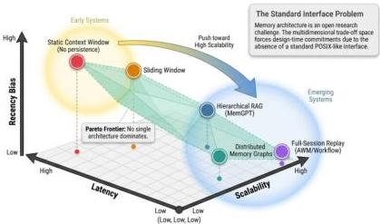
Figure 19. Memory architecture patterns and trade-offs. Five representative architectures plotted in a three-axis space: recency bias, scalability, and latency.

harness determines what information is eligible for storage, what is actually stored, how it is indexed and retrieved, and how long it persists. These are governance decisions, not model capabilities. They have direct consequences for agent reliability (what a stateless agent forgets between sessions is often precisely what it needs), for performance (retrieval latency is a significant fraction of long-horizon task execution time), and for security (as established in §6.2.5, persistent memory is an attack persistence vector that cannot be addressed without harness-level controls). In LTS terms, the  $S$ -component's persistence policy determines which states  $q_{t}$  are preserved across future transitions: a harness that persists the full state history enables the model to reason about arbitrarily long dependencies but violates the liveness property by allowing old poisoned state to influence future transitions; one that discards older states recovers liveness guarantees but may violate safety by losing critical information needed to maintain invariants across session boundaries.

The three-tier memory taxonomy introduced by Wang et al. [3] and elaborated by Zhang et al. [26] provides a useful starting framework. Sensory memory corresponds to the current input; working memory to the active context window; and long-term memory to external storage. But this taxonomy is a capability description, not an infrastructure specification—it describes what memory does, not how the harness governs it. The harness governance question is: which transitions between tiers should be automatic versus agent-initiated; what filters apply to content moving from working to long-term memory; and what access controls govern retrieval.

# 6.7.2. Architecture Comparison

Table 13. Memory Architecture Comparison. Representative systems compared by  $C$ -component realization, memory tier structure, and retrieval mechanism.

<table><tr><td>System</td><td>C-Component</td><td>S-Component</td><td>Key Innovation</td></tr><tr><td>MemGPT</td><td>Virtual paging</td><td>Disk storage</td><td>OS-inspired paging</td></tr><tr><td>Generative Agents</td><td>Context + retrieval</td><td>Memory stream</td><td>Reflection mechanism</td></tr><tr><td>Reflexion</td><td>Episodic buffer</td><td>Verbal critique store</td><td>Language-grounded self-improvement</td></tr><tr><td>MemoryBank</td><td>Retrieved context</td><td>Ebbinghaus-curve store</td><td>Forgetting curve update</td></tr></table>

CC BY

© 2026 by the author(s). Distributed under a Creative Commons CC BY license.

---

Preprints.org (www.preprints.org) | NOT PEER-REVIEWED | Posted: 28 April 2026

doi:10.20944/preprints202604.0428.v3

Table 13. Memory Architecture Comparison. Representative systems compared by  $C$ -component realization, memory tier structure, and retrieval mechanism.

<table><tr><td>System</td><td>C-Component</td><td>S-Component</td><td>Key Innovation</td></tr><tr><td>Agent</td><td>Workflow retrieval</td><td>Workflow store</td><td>Procedural memory induction</td></tr><tr><td>Workflow</td><td></td><td></td><td></td></tr><tr><td>Memory</td><td></td><td></td><td></td></tr><tr><td>MemAct</td><td>Learnable policy</td><td>Action consequences</td><td>Memory-as-action</td></tr><tr><td>CORAL</td><td>MM + CO tools</td><td>External DB</td><td>Explicit tool interface</td></tr><tr><td>Zep TK</td><td>Retrieved context</td><td>Knowledge graph</td><td>Temporal relationships</td></tr><tr><td>OpenClaw</td><td>Session context</td><td>MEMORY.md files</td><td>Human-readable persistence</td></tr></table>

Generative Agents [87] introduced the most influential architecture: a memory stream of raw observations, a reflection component that periodically synthesizes higher-level insights, and a retrieval function combining recency, importance, and relevance scores. This architecture directly influenced subsequent harness memory designs by establishing that raw storage and intelligent synthesis are separate functions requiring separate governance. Reflexion [5] extends this insight to self-correction: by storing verbal self-critiques derived from failed execution traces rather than raw observations, Reflexion's episodic buffer provides a harness  $S$ -component that stores processed experience rather than raw history—a distinction that reduces storage volume while increasing retrieval precision for similar future tasks.

MemoryBank [93] addresses the long-term memory update problem through an Ebbinghaus forgetting curve mechanism: memories are assigned initial weights based on their assessed importance, then decayed over time according to a parametric curve that mimics human forgetting patterns. MemoryBank's contribution is a principled forgetting mechanism—not merely discarding oldest memories, but selectively retaining memories that are either frequently retrieved or assessed as important at creation time. This directly addresses the memory bloat problem identified below. Agent Workflow Memory [94] takes the complementary procedural memory approach: rather than storing experiences, AWM induces reusable workflow programs from past task trajectories, stores them in a workflow library, and retrieves and executes appropriate workflows for new tasks. AWM's  $+14.9\%$  improvement on Mind2Web and  $+8.9\%$  on WebArena validate the productivity hypothesis that procedural memory (how to accomplish task types) complements episodic memory (what happened in specific tasks) in long-running agent deployments.

# 6.7.3. Reflexion and the Episodic Buffer Design Pattern

Reflexion's episodic buffer design raises three harness-specific governance questions that its original presentation does not address. First, the episodic buffer content must be generated by an agent inference step (the self-reflection step), meaning that the  $S$ -component write operation is not a passive record of agent behavior but an active inference step that consumes tokens and may itself fail—the harness must manage this write step as a lifecycle event ( $L$ -component concern), ensuring it occurs reliably after task attempts, not only when the agent remembers to invoke it. Second, the episodic buffer is a high-value retrieval target: future execution steps benefit most from retrieving the most relevant self-critiques (those concerning the most similar prior task situations), which requires a semantic retrieval mechanism rather than chronological access, making Reflexion's  $S$ -component an instance of the retrieval-augmented context pattern ( $\S 6.5.2.3$ ), with all the associated latency and relevance degradation challenges. Third, the verbal format of stored critiques creates a novel security consideration: unlike factual observations whose validity can sometimes be checked against external state, self-critiques are the agent's own interpretation of its failures and may be corrupted or manipulated through adversarial tool outputs that influence the agent's failure analysis; harness validation of episodic buffer writes against a schema that checks for adversarial content patterns is a research problem with no current solution.

CC BY

© 2026 by the author(s). Distributed under a Creative Commons CC BY license.

---

Preprints.org (www.preprints.org) | NOT PEER-REVIEWED | Posted: 28 April 2026

doi:10.20944/preprints202604.0428.v3

The general principle that Reflexion illustrates is what we call inference-coupled persistence: S-component write operations that require model inference to generate the content to be stored. This pattern—which also appears in Voyager's skill library (skill code is generated by the model, then stored) and AWM's workflow library (workflow programs are induced by the model from experience, then stored)—creates a tight coupling between  $E$ -component execution (which triggers the write) and model inference quality (which determines write content). A harness supporting inference-coupled persistence must therefore manage the quality of what is stored, not just the mechanics of how it is stored—a governance function that goes beyond traditional state management.

The diversity of harness memory architectures reflects genuinely different engineering tradeoffs with cascading implications for context cost, retrieval quality, and security. The following table characterizes six primary architectures along five governance-relevant dimensions, extending the system-level comparison in Table 13 with explicit complexity and isolation analysis.

Table 14. Memory Architecture Tradeoffs. Six memory architectures evaluated across recency bias, scalability, retrieval latency, and implementation complexity.

<table><tr><td>Architecture</td><td>Working Memory</td><td>Long-term Storage</td><td>Retrieval Mechanism</td><td>Context Cost</td><td>Security Isolation</td><td>Representative System</td></tr><tr><td>Flat context</td><td>In-window only</td><td>×</td><td>× (all in context)</td><td>O(1) per turn, O(n) total</td><td>None</td><td>Early ChatGPT plugins</td></tr><tr><td>Append- only log</td><td>In-window</td><td>External log</td><td>Chronological</td><td>O(n) per turn</td><td>None</td><td>Naive agent implementations</td></tr><tr><td>Hierarchical paging</td><td>Working set</td><td>Tiered (short-term/mid-term/long-term)</td><td>Priority scheduler</td><td>O(k) per turn (k = working set)</td><td>Tier-boundary enforcement</td><td>MemGPT, MemoryOS</td></tr><tr><td>Graph- structured</td><td>In-window summary</td><td>Knowledge graph</td><td>Semantic + relational</td><td>O(log n) per turn</td><td>Node-level ACLs possible</td><td>A-MEM, HippoRAG</td></tr><tr><td>Compressio+ gisting</td><td>Compressed summary</td><td>Original + gist index</td><td>Two-stage (gist → full)</td><td>O(c) per turn (c = compression ratio)</td><td>None</td><td>ReadAgent, Mem0</td></tr><tr><td>Episodic + procedural</td><td>Working + episode buffer</td><td>Skill library + episode store</td><td>Quality-gated + relevance</td><td>O(k+p) per turn</td><td>Write-time validation</td><td>Voyager + Reflexion</td></tr></table>

The table makes visible a fundamental tradeoff that no single architecture resolves — hierarchical paging minimizes per-turn context cost but requires a sophisticated scheduler; graph-structured memory enables rich associative retrieval but imposes write-time graph maintenance overhead. The choice of memory architecture is therefore a harness design decision with cascading implications for compute cost, retrieval latency, and security isolation. In particular, the "Security Isolation" column reveals that only graph-structured (node-level ACLs) and episodic+procedural (write-time validation) architectures offer any mechanism for constraining what can be written to long-term storage; flat context and append-only log architectures provide no isolation whatsoever, meaning that a successful memory poisoning attack has unconditional persistence for the session or across sessions respectively.

CC BY

© 2026 by the author(s). Distributed under a Creative Commons CC BY license.

---

Preprints.org (www.preprints.org) | NOT PEER-REVIEWED | Posted: 28 April 2026

doi:10.20944/preprints202604.0428.v3

73 of 105

# 6.7.4. Memory-Security Coupling

AgentSys [50] studies secure memory management through explicit hierarchical structures, identifying that what gets persisted has privacy and security implications that current harnesses do not systematically address. Passwords, PII, and sensitive context should not enter long-term memory without explicit sanitization—a requirement that is easy to state and difficult to enforce when the content of memories is determined by the agent's reasoning rather than by a fixed schema. The coupling between memory architecture and security is therefore not incidental but structural: any harness that allows agent-controlled writing to persistent storage is implicitly accepting that the attack surface of the S-component is bounded by the agent's judgment, which is itself not guaranteed to be secure. Designing memory governance mechanisms that are robust to a compromised or manipulated agent remains an open problem.

# 6.7.5. The Memory Governance Contract: A Proposed Specification

The analysis of memory architecture diversity in §6.7.2 reveals a fundamental absence: there is no agreed governance contract specifying what a harness memory system must provide in terms of durability, consistency, isolation, and auditability—the properties that any well-specified storage system must characterize. In traditional database systems, ACID (Atomicity, Consistency, Isolation, Durability) provides exactly this contract; in distributed systems, CAP theorem bounds achievable combinations of Consistency, Availability, and Partition-tolerance. Harness memory systems require an analogous contract appropriate to their domain.

We propose that the harness memory governance contract should specify six properties, organized along three dimensions:

Durability dimension: - Write durability: After a successful memory write operation, the written content must survive agent process restart, host machine restart, and storage media failure up to the specified replication factor. Current harnesses range from no durability guarantee (in-memory state that is lost on process exit) to file-system-level durability (MEMORY.md files) to database-level durability (Zep TK's knowledge graph). The contract should specify the minimum durability guarantee and the mechanism for verifying it. - Read durability: After content is written, subsequent read operations should return that content with probability equal to the specified retention policy (which may incorporate Ebbinghaus-curve forgetting as in MemoryBank). The retention policy should be explicit in the contract, not implicit in implementation details.

Consistency dimension: - Cross-turn consistency: Within a single task execution, reads should reflect all prior writes in the same task session. This is the memory equivalent of read-your-writes consistency in database systems, and its absence is a common source of confusing agent behavior where the agent fails to act on information it stored earlier in the same session. - Cross-session consistency: Across task sessions, the memory state should be consistent with the declared persistence policy: content written in session 1 should be readable in session 2 if and only if the content satisfies the retention policy criteria. Violations create ghost memories (content that appears readable but is outside retention policy) or amnesia failures (content within retention policy that fails to retrieve).

Isolation and Auditability dimension: - Content isolation: Memory content from one agent instance should not be accessible to another agent instance unless the memory system explicitly implements shared memory with defined access control. This property is particularly important in multi-tenant harness deployments where different users' agent sessions share infrastructure. - Write auditability: The memory system should maintain an audit log of all write operations—what was written, when, and from which execution context—enabling retrospective analysis of how the agent's memory state was built. This property is the S-component contribution to the R-Judge [106] audit requirements: determining whether an agent's behavior was the result of legitimate memory formation or adversarial memory poisoning requires an audit log of memory write provenance.

Specifying these six properties in a formal governance contract—with explicit statements of which properties are guaranteed, which are best-effort, and which are not provided—would enable

CC BY

© 2026 by the author(s). Distributed under a Creative Commons CC-BY license.

---

meaningful comparison across harness memory systems and would give deployers the information needed to select memory implementations appropriate to their security and reliability requirements. No current harness memory system publishes such a specification, and developing the methodology for doing so is an immediate research opportunity.

### 6.7.6. Root Cause: Four Open Problems in Harness Memory

Four open problems define the current state of harness memory research. Compression fidelity—how much information is lost in summarization, and whether the lost information is precisely what later steps will need—has received no systematic study; we rely on empirical intuition rather than formal characterization. Retrieval quality under distribution shift—whether retrieval mechanisms trained or tuned on one task type generalize to others—is understudied; SkillsBench’s finding that domain variation produces +4.5pp to +51.9pp performance swings from skill injection suggests that retrieval quality is highly domain-dependent. Memory bloat in long-running agents—the accumulation of irrelevant information that degrades retrieval signal-to-noise over time—calls for principled forgetting mechanisms; MemoryBank’s Ebbinghaus-curve approach and AWM’s workflow induction represent two complementary strategies, but neither has been validated across the full diversity of harness deployment contexts. And cross-session continuity—how an agent should maintain coherent identity and capability across disjoint sessions—remains architecturally unresolved, with current approaches ranging from flat file persistence (OpenClaw’s MEMORY.md) to graph-structured knowledge (Zep TK) without systematic evaluation of which approach best supports reliable long-term operation.

### 6.7.7. Compute Economics as a Context Management Constraint

The context management decisions analyzed above have direct and quantifiable economic consequences at deployment scale. As agentic workflows accumulate context across tool invocations, memory retrievals, and planning cycles, token consumption compounds—a phenomenon practitioners term “context rot”—producing superlinear cost growth that harness design choices either control or exacerbate. This compute economics challenge — in which harness design choices function as cost multipliers — is analyzed as a cross-cutting challenge in §6.7.9, where the empirical data and mitigation patterns are presented in full.

### 6.7.8. The Harness as Memory Scheduler

The economic pressure documented in §6.7.7 — superlinear cost growth from context rot — cannot be addressed by model-side improvements alone; it requires harness-level scheduling policy, a framing that MemGPT *[13]* instantiated via an OS-inspired architecture. The harness’s most fundamental memory responsibility is scheduling: at each inference call, it must decide which content enters the model’s context window, in what order, and at what token budget. This is a resource-scheduling problem in the classical operating-systems sense. Packer et al. *[13]* designed MemGPT around this analogy explicitly: the harness is modeled as an OS managing working memory (the in-context window, analogous to RAM) and external storage (disk), with a scheduler moving content between tiers in response to agent-issued function calls. MemGPT’s contribution to harness theory is not the paging mechanism itself but the framing: the scheduling policy is a first-class harness design choice, and its quality is a direct determinant of agent reliability and coherence.

MemoryOS *[149]* extends this framing to three tiers—short-term, mid-term, and long-term—with explicit FIFO and segmented page replacement promotion and demotion policies. Its four modules (storage, updating, retrieval, scheduling) map directly onto harness governance responsibilities: durability policy, write-trigger conditions, retrieval ranking, and the eviction logic that keeps the working context efficient. The 2026 comprehensive memory survey *[150]* formalizes these responsibilities as a write--manage--read loop in which all three phases are unambiguously harness concerns, and identifies five memory mechanism families—context-resident compression, retrieval-augmented stores, reflective self-improvement, hierarchical virtual context, and policy-learned management—each with distinct tradeoffs in retrieval quality, latency, and token cost. The Cognitive Architectures for Language

---

Agents (CoALA) framework *[151]* provides complementary vocabulary: its four-type memory taxonomy (working, episodic, semantic, procedural) specifies what read and write operations the harness must expose—a memory API contract rather than a capability description. The context engineering survey *[152]*, synthesizing 1,400 papers, arrives at the same conclusion: improving retrieval algorithms within a harness that lacks a coherent scheduling policy will not produce commensurate reliability gains.

#### 6.7.9 Context Rot as a Harness Failure Mode

When the harness accumulates memory files, skill schemas, tool definitions, and session summaries without active compression or principled eviction, the model’s working context becomes progressively crowded with loosely relevant information—a failure mode practitioners call context rot*[153]*. Context rot is simultaneously a performance failure (degraded precision over a noisy context) and an economic failure—token consumption scales with context size regardless of task complexity, producing superlinear cost growth. The harness’s retention policy is the direct causal mechanism: a default retain-all policy is not the absence of a policy choice but a policy with known failure characteristics that the harness designer is implicitly accepting.

Two harness-level responses are well-characterized. MemoryOS’s priority-based eviction demotes content below a recency-and-relevance threshold to cold storage, preventing context crowding while preserving retrievability. ReadAgent *[154]*addresses the problem through gist-based compression: long documents are paginated into episodes, each compressed into a short summary, and the gists—not the source documents—are injected into the working context, extending effective context coverage up to twenty-fold without proportional retrieval quality degradation. Mem0 *[155]* provides a middleware instantiation: an asynchronous extraction and deduplication pipeline identifies salient facts, consolidates them, and discards ephemeral content, reporting approximately 90% token reduction over full-context baselines. Both are harness-level policy choices rather than model improvements. The empirical comparison of RAG versus long-context injection by Li et al. confirms that no single policy dominates: RAG trades token cost for retrieval variance; long-context injection trades fidelity for scale cost. Effective mitigation therefore requires hybrid harness policies that current systems address only partially.

#### 6.7.10 Memory as Security Attack Surface

Persistent memory creates a security attack surface qualitatively distinct from those created by tool access or direct context injection. When an attacker causes the agent to write malicious content to long-term storage—through any of the prompt injection variants catalogued in §6.2.5—the result is a cross-session persistence channel: the malicious content survives session termination, is retrieved in future sessions without further attacker involvement, and influences agent behavior as if it were legitimate knowledge. This temporal decoupling makes memory poisoning the most severe form of prompt injection, because the attacker need not maintain ongoing access to sustain its effects.

AgentSys *[50]* treats memory isolation as a first-class harness security primitive, drawing an explicit analogy to OS process isolation. Workers are spawned with isolated context windows so that injected content cannot propagate to the main agent’s persistent store, and write access to that store requires harness-mediated authorization rather than relying on the model’s judgment—critical because the model’s reasoning may itself be the target of the compromise that memory write governance is meant to contain. As the 2026 memory survey *[150]* notes, the write phase of the write--manage--read loop has received the least research attention—which is precisely where harness-level intervention is most needed. This finding directly extends the security analysis of §6.2.5: advances in memory persistence and retrieval coverage that are not accompanied by advances in write governance expand the attack surface analyzed in §6.2.1 in direct proportion to their quality improvements.

####

---

Preprints.org (www.preprints.org) | NOT PEER-REVIEWED | Posted: 28 April 2026

doi:10.20944/preprints202604.0428.v3

# 6.7.11. The Absence of a Standard Memory Interface

Every major harness implements its own memory architecture, and these implementations are not portable. MemGPT's paging model exposes memory operations as agent-invoked function calls against a two-tier store. Generative Agents [87] implements a memory stream with harness-scheduled reflection cycles. Voyager [3] maintains an executable skill library indexed by embedding similarity. A-MEM [157] organizes memories as a graph-structured Zettelkasten with link-traversal retrieval. Mem0 [155] decouples memory management into an asynchronous middleware pipeline. Each choice is architecturally defensible; what these systems share is the consequence that a memory implementation designed for one harness cannot be embedded in another without re-engineering the memory interface.

Non-portability has a deeper consequence: memory system quality cannot be evaluated independently of the harness. Retrieval precision in Generative Agents—where the harness applies a three-factor relevance score—is incommensurable with retrieval precision in A-MEM, where the harness traverses a link graph. The LoCoMo benchmark [158] provides 300-turn conversations across up to 35 sessions in an effort to evaluate long-term memory independently, but its methodology presupposes a queryable external store, excluding parametric or context-packing architectures. Evo-Memory [159] benchmarks memory update policies in a streaming setting but similarly assumes explicit external write operations. Neither benchmark can evaluate memory quality independent of the architectural assumptions embedded in the surrounding harness.

The contrast with tool access is instructive. MCP's standardization of tool calling produced a regime of portable, independently evaluable tool implementations. No equivalent exists for memory. A standard harness memory interface—specifying the read, write, and manage operations that any compliant memory system must expose, along with the governance contract proposed in §6.7.5—would make implementations portable and allow the research community to advance retrieval quality without rebuilding the surrounding harness for each experiment. The MCP precedent demonstrates that such convergence is achievable when the coordination cost is sufficiently recognized.

Table 15. Extended Memory Architecture Profiles. Detailed capability profiles for representative memory systems, including write governance and security properties.

<table><tr><td>System</td><td>Memory Model</td><td>Scheduling Policy</td><td>Interface Portability</td><td>Write-time Security</td></tr><tr><td>MemGPT [13]</td><td>Two-tier paging</td><td>Agent-invoked function calls</td><td>Host-harness dependent</td><td>Absent</td></tr><tr><td>Generative Agents [87]</td><td>Memory stream + reflection</td><td>Harness-scheduled reflection cycles</td><td>Non-portable</td><td>Absent</td></tr><tr><td>Voyager [3]</td><td>Executable skill library</td><td>Embedding-similarity retrieval</td><td>Non-portable</td><td>Absent</td></tr><tr><td>MemoryOS [149]</td><td>Three-tier short-term/mid-term/long-term</td><td>FIFO + segmented page replacement eviction</td><td>Partial</td><td>Absent</td></tr><tr><td>A-MEM [157]</td><td>Graph-structured Zettelkasten</td><td>Link-traversal retrieval</td><td>Non-portable</td><td>Absent</td></tr><tr><td>Mem0 [155]</td><td>Async extraction middleware</td><td>Deduplication + consolidation</td><td>Partial (API layer)</td><td>Absent</td></tr></table>

#

© 2026 by the author(s). Distributed under a Creative Commons CC-BY license.

---

Preprints.org (www.preprints.org) | NOT PEER-REVIEWED | Posted: 28 April 2026

doi:10.20944/preprints202604.0428.v3

Table 15. Extended Memory Architecture Profiles. Detailed capability profiles for representative memory systems, including write governance and security properties.

<table><tr><td>System</td><td>Memory Model</td><td>Scheduling Policy</td><td>Interface Portability</td><td>Write-time Security</td></tr><tr><td>AgentSys [50]</td><td>Hierarchical isolated stores</td><td>Harness-enforced authorization</td><td>Non-portable</td><td>Write isolation</td></tr></table>

The uniform absence of write-time security controls—except in AgentSys—reflects the finding that write governance is the least developed phase of the write-manage-read loop. Interface portability is rated against the criterion of whether the memory system can be embedded in a different host harness without re-engineering the memory API.

# 6.8. Coordination and Planning

The third major class of harness challenges concerns how the harness governs agent reasoning over extended planning sequences and orchestrates interactions between multiple agents. These two functions—managing the execution of complex reasoning steps with rollback, exploration, and verification mechanisms, and coordinating the actions of independent agents that must share state or delegate tasks to one another—represent the highest-level governance responsibilities that a harness assumes. When a single agent must reason through a multi-step plan involving uncertain outcomes and partial information, the harness becomes the execution engine for that reasoning: it decides what to explore, when to backtrack, how to validate sub-results, and when to commit to a plan. When multiple agents interact, the harness becomes the coordination substrate: it routes messages, enforces consistency, manages delegations, and prevents one agent's failure from cascading to its peers. This section examines two subsystems that together constitute the planning and coordination layer: §6.8.1 analyzes planning and reasoning infrastructure—how the harness governs the exploration and commitment phases of agent reasoning; and §6.8.2 analyzes multi-agent coordination—how the harness mediates interactions between multiple independent agent instances.

# 6.8.1. Planning and Infrastructure

The Planning Loop as a Harness Governance Object

A harness supporting sequential action-observation planning must govern three loop parameters: the trigger condition for each planning step, the observation injection policy, and the abort condition when planning fails. These parameters are not model properties—a model does not plan in isolation—but harness-level design decisions whose configuration directly determines whether planning succeeds, stalls, or recurses indefinitely. Planning quality is a property of the model-harness system, and the harness's governance of the planning loop is the determining variable that the model-centric view renders invisible.

What must the harness provide for linear planning? The canonical Thought  $\rightarrow$  Action  $\rightarrow$  Observation cycle establishes three harness obligations: an observation injection policy (when and how the harness feeds environment state into the model's context after each action), an action validation mechanism (which tools are valid at each step, and how invalid tool calls are caught before execution), and an abort condition (when the loop terminates—by convergence, failure, or step-limit exhaustion). These are harness design decisions with direct consequences for planning reliability; the model sees only the resulting context and cannot alter any of them. ReAct [79] makes these obligations visible by formalizing the minimal linear case, but the obligations exist for any harness supporting sequential planning.

A harness supporting tree-structured planning must satisfy a qualitatively more demanding set of obligations. The harness must: maintain branching state across inference calls (the tree structure cannot live only in the model's context window, which is bounded); allocate inference budget across

CC BY

© 2026 by the author(s). Distributed under a Creative Commons CC BY license.

---

branches (deciding how many rollouts each branch receives, and when to prune); sequence node evaluation (which branch to explore next); implement backtracking (restoring the harness state to a prior branch on failure); and commit to a plan when the budget is exhausted even if search has not converged. The harness must make all of these decisions; the model's role is to evaluate nodes and generate candidate continuations at each leaf. Tree of Thoughts [11] instantiates BFS and DFS as harness-level search policies; Language Agent Tree Search [160] integrates MCTS control, value estimation, and verbal reflection directly into the harness layer, treating rollback and failure recovery as first-class harness operations—when a branch fails, the harness triggers a reflection call, stores the output, and uses it to inform future branch selection. Plan-on-Graph [161] extends this analysis to knowledge-graph-augmented planning, where the harness must govern not only the planning tree but also the exploration of an external knowledge graph. PoG decomposes questions into sub-objectives, then repeats a cycle of adaptive exploration (traversing KG paths to access relevant data), memory updating (recording subgraph state, reasoning paths, and sub-objective status), and reflection (deciding whether to self-correct reasoning paths and which entity to backtrack to). From a harness governance perspective, PoG's three mechanisms—Guidance, Memory, and Reflection—map directly onto the E, S, and C components: Guidance governs the planning loop's exploration breadth (E-component), Memory persists the subgraph and reasoning state across planning steps (S-component), and Reflection implements a self-correcting lifecycle hook that evaluates intermediate results and triggers backtracking (L-component applied to planning state). The self-correction mechanism is particularly instructive: it demonstrates that adaptive replanning—where the harness detects planning failures and initiates recovery—requires tight coupling between the S-component (which records what has been tried) and the L-component (which decides when to abandon a path), a coupling pattern that generalizes beyond KG-augmented planning to any harness supporting exploratory search.

The generalization is direct: the complexity of planning infrastructure scales with the structural complexity of the planning space the harness exposes, and every increase in that complexity transfers governance responsibility from the model to the harness.

### Planning State as Harness State

Planning is stateful in a way that distinguishes it from single-turn model use. A planning agent accumulates partial plans, abandoned branches, failed attempts whose failure modes must be remembered, and validated sub-results that downstream steps depend on. This state must survive across inference calls and context compaction; the harness bears full responsibility for its management, since the model's context window is bounded and reset on session restart.

The Cognitive Architectures for Language Agents framework [151] provides the most architecturally precise account of how planning state maps onto harness memory components. CoALA decomposes agent memory into working, episodic, semantic, and procedural memory. Planning state spans all four tiers, and the harness is responsible for managing the lifecycle of planning-relevant content across each—deciding what to write to episodic memory after a planning step fails, what semantic context to retrieve before a step begins, and what procedural templates to surface when a familiar structure is recognized. A harness that treats planning state as a single undifferentiated context blob will fail to retrieve the right information at the right time.

What these architectures demand from the harness is precise and non-negotiable. For episodic memory in Reflexion-style systems, the harness must implement a write-trigger policy: a condition that determines when a planning attempt's outcome warrants writing a verbal self-critique to the episodic store—not every attempt should generate an episode, and the quality of the trigger predicate directly determines whether the episodic buffer provides useful signal or accumulates noise. For procedural memory in Voyager-style systems, the harness must implement a quality-gate for procedural memory admission: a validation step that rejects skill candidates that do not pass execution tests before committing them to the skill library, because an unreliable skill that enters the library corrupts future retrievals. And for both architectures, the harness must implement an injection-timing policy for retrieved episodes: a decision about when, at which point in the planning context window, retrieved episodes

---

and skills should be injected to maximize their influence without crowding out task-relevant context. The trigger condition, quality-gate threshold, and injection-timing policy are all harness-level design decisions; the model perceives only the resulting context and has no visibility into the infrastructure that produced it. Voyager *[3]* and Reflexion *[5]* are instructive precisely because they expose these harness obligations clearly—but the obligations exist for any harness supporting episodic or procedural memory, not only for these specific systems.

### Search Budget and Harness Resource Governance

A harness managing tree-structured search faces a resource governance obligation that has no single-agent analog: it must bound the compute consumed by the planning loop itself, independent of any individual model call. An unbounded search will consume unbounded tokens and time; the harness must enforce a search budget—a maximum rollout count, depth limit, or token cost cap—and must commit to a plan when the budget is exhausted even if search has not converged. Agent Q *[162]* and ExACT/R-MCTS *[163]* provide the canonical instantiations of harness-side MCTS: in both systems, the tree structure, rollout policy, backup function, and termination condition are harness-level components, with the model called at each leaf node as a value estimator or action generator. The model is a subroutine invoked by the harness, not the governor of the search.

This architecture makes resource governance a prerequisite for correctness, not merely an efficiency concern. These decisions are structurally analogous to OS kernel compute allocation: just as a kernel requires formal cost models and preemption mechanisms, harness planning budget enforcement requires a cost model for inference and a mechanism for graceful termination. RAP *[164]*, which uses the LLM itself as a world model for rollout simulation, incurs substantially higher token cost per rollout than systems with an external simulator—without a harness-enforced ceiling, planning can exhaust practical token budgets on tasks whose difficulty does not warrant extensive search. Chen et al. *[165]* confirm that budget governance is a prerequisite not only for inference-time planning but for any system that uses harness-side MCTS to generate training signal.

### Planning Interface Design: The ACI as a Harness Responsibility

The three preceding subsections address internal harness governance: loop control, state management, and resource budgeting. This subsection addresses the external interface through which the planning agent interacts with the harness—a dimension that is unambiguously a harness design responsibility, not a model responsibility or a task property.

The harness is the sole author of the Agent-Computer Interface (ACI). The model cannot alter the command set it is given, cannot redesign the state representations it receives, and cannot change the error format it must parse—all of these are harness decisions. SWE-agent *[7]* introduced the ACI concept to make this explicit: the finding that ACI design has a larger measurable impact on planning performance than model capability is not a claim about the model but a claim about the harness. A harness that exposes an ambiguous state representation or returns underspecified error messages imposes an interface tax on the model’s planning budget—the model must spend tokens inferring what the harness meant rather than reasoning about the task. This tax is invisible to capability-focused analysis but fully visible from the harness governance perspective. The harness must therefore be designed to: provide unambiguous state representations after each action; return structured, parseable error messages that distinguish recoverable from unrecoverable failures; expose a minimal but complete command vocabulary that does not require the model to guess valid action sequences; and present plan formats that are checkable by a plan approval gate before irreversible actions are executed.

OPENDEV *[166]* illustrates one such harness design: a dual-agent architecture separating planning from execution, combined with lazy tool discovery and adaptive context compaction. By decoupling the planning principal from the execution principal, the harness enforces that no irreversible action proceeds without a validated plan, reducing cascading errors when an initial planning mistake would otherwise propagate through a long action sequence—effectively realizing the plan approval gate

---

concept in practice. This architecture is a lifecycle hook ($L$-component) applied to the planning-to-execution boundary—its effectiveness depends on the quality of the ACI’s plan representation format, which is the $E$-component design choice that determines whether the plan is checkable at all. AgentBench *[17]* corroborates the ACI-as-harness-responsibility framing at cross-environment scale: agent failures across eight environments were systematically attributable to harness-level interface weaknesses rather than model knowledge gaps, confirming that ACI design is a primary harness engineering obligation.

The harness governs the planning loop, maintains planning state across inference calls, enforces compute and token budgets during search, and designs and maintains the interface through which planning reasoning is expressed (all analyzed in §6.8.1).

Each function is a harness-level design decision independent of, and not substitutable by, model capability. Planning infrastructure is harness infrastructure. The harness-as-constraint-system insight has received systematic formulation in practitioner analysis from the software engineering community. Birgitta Böckeler *[167]*, writing in the Martin Fowler engineering series, identifies constraint as the core harness value: when agents can generate anything, they waste inference budget exploring dead ends; defined architectural boundaries cause faster convergence on correct solutions because they eliminate the exploration of invalid regions *[167]*. This reframes the harness not as a facilitator of agent capability but as an active shaping force whose architectural decisions determine the effective search space available to the planning agent. Linters, type systems, and CI gates—components that software engineering practice typically classifies as development-time conveniences—are, from the harness planning governance perspective, search-space restriction mechanisms that the harness deploys at runtime to prevent the agent from investing planning tokens in paths that the environment’s structural constraints would reject. Philipp Schmid’s survey of harness evolution patterns across production deployments provides empirical scale for the instability this principle implies: Manus rewrote its harness five times in six months to remove rigid assumptions that had been appropriate for earlier model capabilities; LangChain rewrote its research agent harness architecture three times in a single year; Vercel removed 80% of its agent’s tools, yielding fewer steps, fewer tokens, and faster responses *[51]*. These are not model failures—the models in each case performed as specified—but harness evolution events in which the planning infrastructure’s constraint profile was recalibrated to match the actual capability envelope of the model. The planning infrastructure must therefore be designed not only to provide planning mechanisms but to enforce architectural search-space constraints through linter rules, type system enforcement, and CI gates—treating these infrastructure elements as first-class components of the harness planning layer, not as background engineering conveniences.

---

Preprints.org (www.preprints.org) | NOT PEER-REVIEWED | Posted: 28 April 2026

doi:10.20944/preprints202604.0428.v3

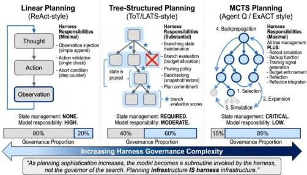
Figure 20. Planning strategy progression from linear (ReAct) to tree-structured (ToT, LATS) to MCTS-based (Agent Q, ExACT): as planning sophistication increases, governance responsibility transfers from the model to the harness.

Table 16. Planning Infrastructure Requirements. Harness-level governance obligations for four representative planning strategies across  $E, C, S$ , and  $L$  components.

<table><tr><td>System</td><td>Loop Control</td><td>State Persistence</td><td>Search Budget Enforcement</td><td>ACI Design</td></tr><tr><td>ReAct [79]</td><td>Linear T → A → O</td><td>None (stateless)</td><td>Step limit only</td><td>Minimal tool-call schema</td></tr><tr><td>Tree of Thoughts [11]</td><td>BFS/DFS over thought tree</td><td>Tree state in harness memory</td><td>Breadth/depth limits</td><td>Thought generation prompt</td></tr><tr><td>LATS [160]</td><td>MCTS + reflection</td><td>Reflection buffer + tree state</td><td>Rollout count ceiling</td><td>Value fn + reflection prompt</td></tr><tr><td>Reflexion [5]</td><td>Retry with critique</td><td>Episodic verbal critique buffer</td><td>Max episode count</td><td>Self-critique schema</td></tr><tr><td>Voyager [3]</td><td>Curriculum-guided episodes</td><td>Skill library + episode log</td><td>Episode count limit</td><td>Skill code spec + task prompt</td></tr><tr><td>Agent Q [162]</td><td>MCTS over web actions</td><td>MCTS tree + DPO training pairs</td><td>Rollout budget / cost ceiling</td><td>Web action ACI (click/type/nav)</td></tr><tr><td>SWE-agent [7]</td><td>ReAct with ACI commands</td><td>File viewer state</td><td>Step ceiling</td><td>Custom ACI: search, edit, run</td></tr></table>

CC BY

© 2026 by the author(s). Distributed under a Creative Commons CC BY license.

---

Preprints.org (www.preprints.org) | NOT PEER-REVIEWED | Posted: 28 April 2026

doi:10.20944/preprints202604.0428.v3

Table 16. Planning Infrastructure Requirements. Harness-level governance obligations for four representative planning strategies across  $E, C, S,$  and  $L$  components.

<table><tr><td>System</td><td>Loop Control</td><td>State Persistence</td><td>Search Budget Enforcement</td><td>ACI Design</td></tr><tr><td>ExACT / R-MCTS [163]</td><td>R-MCTS + con-trastive reflection</td><td>State cache for node rollback</td><td>Rollout + depth limits</td><td>Environment action set</td></tr></table>

# 6.8.2. Multi-Agent Coordination as Harness Infrastructure

The preceding sections have analyzed the agent harness as a governance system for a single execution loop. When multiple agents execute within or across harness boundaries, this governance model is not merely extended; it is qualitatively transformed. A single-agent harness governs one execution loop. A multi-agent harness must govern relationships between execution loops—message routing, agent identity, authorization delegation, and shared state consistency—problems that have no single-agent analogs. This section analyzes multi-agent coordination as a harness governance function: the new infrastructure requirements it imposes, the architectural bifurcation emerging in response, the economic case for skepticism about multi-agent overhead, and the reliability and security challenges current production harnesses have not yet resolved.

# The New Governance Requirements of Multi-Agent Harnesses

When agents are composed within a single harness boundary—as in MetaGPT [86], ChatDev [85], and CAMEL [84]—three governance problems emerge that single-agent architectures do not face. From an LTS perspective, a multi-agent harness must manage the composition of individual agent LTSs: each agent has its own state space  $Q_{i}$ , event alphabet  $\Sigma_{i}$ , and transition function  $\delta_{i}$ ; the composed harness must define a product LTS over  $Q = Q_{1} \times Q_{2} \times \dots \times Q_{n}$  such that global safety (no reachable state violates shared invariants) and liveness (all agents can reach their individual terminal states) properties hold for the product system, not just for individual agents in isolation.

MASEval [52] addresses the evaluation gap at the system level by providing a framework-agnostic library that treats the entire multi-agent system as the unit of analysis. Through systematic comparison across 3 benchmarks, 3 models, and 3 frameworks (smolagents [168], LangGraph [101], AutoGen [98]), MASEval demonstrates that framework choice matters as much as model choice for multi-agent system performance. This finding constitutes direct empirical evidence for the harness-as-binding-constraint thesis in the multi-agent setting: implementation decisions about topology, orchestration logic, and error handling—all harness-level concerns—produce performance variations of the same magnitude as model selection. The methodological contribution is the standardized abstraction layer that enables fair cross-framework comparisons, addressing a gap that AgencyBench identifies but does not resolve for multi-agent configurations.

The first is agent identity management. In a single-agent harness, there is one execution principal; the question of which agent performed which action, with what authority, does not arise. In multi-agent settings, the  $L$ -component's lifecycle hooks must maintain per-agent identity context—establishing which agent initiates each tool call, which writes each state record, and what authority that agent carries. MetaGPT addresses this through role-based SOP assignment: each agent role carries a fixed identity and defined authority scope enforced through schema-validated document handoffs—a harness-level identity contract, not an application-level convention. CAMEL achieves identity initialization through inception prompting, injecting role declarations at session start rather than maintaining a persistent role registry. The result is lighter but correspondingly harder to audit, because the harness retains no durable record of which identity produced a given message. In LTS terms, agent identity corresponds to distinct event alphabets: each agent role  $R_{i}$  observes a restricted event alphabet  $\Sigma_{i} \subseteq \Sigma_{\mathrm{global}}$  such that transitions labeled with events in  $\Sigma_{i}$  are permitted only when the current state explicitly records

CC BY

© 2026 by the author(s). Distributed under a Creative Commons CC BY license.

---

Preprints.org (www.preprints.org) | NOT PEER-REVIEWED | Posted: 28 April 2026

doi:10.20944/preprints202604.0428.v3

role  $R_{i}$  as the active execution principal, maintaining the safety invariant that actions are attributed to the correct agent identity.

The second problem is inter-agent message validation. Multi-agent systems introduce a third output class—messages produced by one agent and consumed by another—that single-agent harnesses never encounter. ChatDev demonstrates that inter-agent communication schemas determine workflow reliability: when the document format between the Programmer and the Tester is under-specified, defect information propagates incorrectly across the pipeline, producing cascade errors that no individual agent caused and no individual agent can diagnose. The harness must therefore maintain a message schema registry analogous to the

# T

-component's tool registry, yet neither the academic literature nor production harnesses have formalized inter-agent message validation as a distinct governance function.

The third problem is shared state consistency. When multiple agents write to shared state—a shared task plan, a shared knowledge base, a shared tool-registry extension—the  $S$ -component must provide consistency guarantees that single-agent harnesses never require. The four multi-agent architectural patterns catalogued in figure 22 impose different  $S$ -component demands: role-based orchestration (MetaGPT [86], ChatDev [85]) requires atomic document-level handoffs; market-based coordination (AutoGen [98]) requires agent-registry availability; simulation-substrate patterns (Concordia [90]) require world-model conflict resolution; and hierarchical delegation (DeerFlow [66], DeepAgents[99]) requires permission-state propagation consistency. The absence of a standard multi-agent  $S$ -component interface—analogous to MCP's standardization of the

# T

-component—means every multi-agent harness re-implements shared state consistency from scratch, with no cross-harness portability and no standard audit interface.

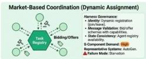

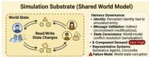

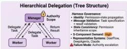

<table><tr><td>Pattern</td><td>Identify Model</td><td>Communication</td><td>S-Component Demand</td><td>Key Vulnerability</td></tr><tr><td>Role-Based</td><td>Fixed SOP</td><td>Document handoff</td><td>Moderate</td><td>Cascade errors</td></tr><tr><td>Market-Based</td><td>Dynamic registry</td><td>Bid/offer</td><td>High</td><td>Starvation</td></tr><tr><td>Simulation</td><td>Persistent entity</td><td>Environment state</td><td>Very High</td><td>State corruption</td></tr><tr><td>Hierarchical</td><td>Permission tree</td><td>Task delegation</td><td>High</td><td>Authority escalation</td></tr></table>

Core Message: Multi-agent coordination is an infrastructure question, not just a capability question—each topology pattern imposes qualitatively different S-component demands and creates distinct failure modes.

Figure 21. Four multi-agent coordination topology patterns with harness governance requirements: role-based orchestration, market-based coordination, simulation substrate, and hierarchical delegation. Each pattern imposes qualitatively different  $S$ -component demands.

CC BY

© 2026 by the author(s). Distributed under a Creative Commons CC BY license.

---

Preprints.org (www.preprints.org) | NOT PEER-REVIEWED | Posted: 28 April 2026

doi:10.20944/preprints202604.0428.v3

84 of 105

Table 17. Multi-Agent Governance Requirements by Coordination Pattern. Four coordination topologies compared by state-sharing, message routing, trust model, and  $S$ -component demands.

<table><tr><td>Pattern</td><td>Identity Model</td><td>Message Validation</td><td>State Consistency</td><td>Key Vulnerability</td></tr><tr><td>Role-Based</td><td>Fixed SOP assignment (MetaGPT [86])</td><td>Typed document handoffs</td><td>Atomic document-level</td><td>Cascade errors across pipeline stages</td></tr><tr><td>Market-Based</td><td>Dynamic registry (AutoGen [98])</td><td>Bid/offer with capability declarations</td><td>Agent-registry availability</td><td>Task starvation under biased assignment</td></tr><tr><td>Simulation</td><td>Persistent entity (Generative Agents [87])</td><td>Indirect via environment state</td><td>World-model conflict resolution</td><td>Shared state corruption from concurrent writes</td></tr><tr><td>Hierarchical</td><td>Permission tree (DeerFlow [66], DeepAgents[99])</td><td>Task specification + result validation</td><td>Permission-state propagation</td><td>Authority escalation via delegation bugs</td></tr></table>

# Protocol-Layer Standardization vs. Learned Topology

When coordination topology is learned rather than fixed, the harness faces an auditability tradeoff: optimized coordination structures may not be auditable, portable, or inspectable in the way that explicitly specified protocol stacks are. A harness designed around a fixed, declared agent graph can enumerate every possible delegation chain, verify that authorization scopes do not escalate, and produce structured traces for post-hoc review. A harness whose topology is discovered by search has no equivalent property—the optimized graph is an emergent artifact that resists pre-specification and may violate governance properties that the harness designer intended to enforce. This auditability tradeoff is the central governance challenge that the bifurcation between protocol-layer standardization and learned topology surfaces.

On the standardization side, MCP [41] and A2A [42] represent competing approaches to this tradeoff that resolve it in favor of auditability. MCP governs agent-to-tool communication and A2A governs agent-to-agent delegation—together constituting a protocol stack in which both the

# T

-component boundary and the inter-agent delegation boundary are explicitly specified, auditable, and implementable by any conformant harness. The interoperability survey by Ehtesham et al. [131] characterizes MCP and A2A as complementary rather than competing: MCP for intra-harness tool access, A2A for inter-harness agent delegation. A harness implementing A2A provides auditable inter-agent communication with explicit task boundaries, authorization scopes, and completion signals—governance properties that ad-hoc message passing cannot provide.

AdaptOrch [169] formalizes when orchestration topology selection dominates model selection through a Performance Convergence Scaling Law: as model performance converges across providers ( $\varepsilon$ -convergence), the variance in system output attributable to orchestration topology exceeds that of model selection by a factor of  $\Omega(1/\varepsilon^2)$ . AdaptOrch's Topology Routing Algorithm maps task dependency DAGs to optimal orchestration patterns (parallel, sequential, hierarchical, or hybrid) in  $O(|V| + |E|)$  time, achieving  $12 - 23\%$  improvement over static single-topology baselines using identical underlying models. This result complements the multi-agent baseline study (arXiv:2601.12307): while that study demonstrates that single-agent configurations can match homogeneous multi-agent ensembles, AdaptOrch demonstrates that heterogeneous topology selection—a harness-level orchestration decision—yields substantial gains precisely because models are converging in raw capability. The governance implication is that orchestration topology is itself a harness governance object whose selection should be task-adaptive rather than fixed at deployment time.

CC BY

© 2026 by the author(s). Distributed under a Creative Commons CC BY license.

---

On the learned topology side, AFlow *[170]* and AOrchestra *[171]* represent competing approaches that resolve the tradeoff in favor of adaptability. AFlow uses Monte Carlo Tree Search to automatically discover and optimize agentic workflows, treating the coordination topology—which agents execute, in what sequence—as a search variable rather than fixed configuration. AOrchestra extends this by applying supervised fine-tuning to train an orchestrator that synthesizes sub-agent specifications rather than receiving them as hard-coded configuration. Both sacrifice harness auditability for topology optimality—the governance consequence that the original framing of these systems as capability advances does not acknowledge. Agent-Oriented Planning *[172]* offers a partial reconciliation, formalizing three correctness properties that any harness orchestrator must enforce, solvability, completeness, and non-redundancy of sub-task decompositions, that serve as harness-level validation targets regardless of whether the topology was manually specified or learned.

### The Single-Agent Baseline Problem

Perhaps the most consequential empirical contribution to the multi-agent harness literature in recent work is a negative result. The multi-agent baseline *[173]* demonstrates that carefully designed single-agent systems with KV cache reuse can match the performance of homogeneous multi-agent ensembles—configurations where multiple instances of the same agent type collaborate—once the coordination overhead of message routing, identity management, and shared state updates is factored in. Only heterogeneous compositions, in which agents contribute structurally different capabilities or role perspectives, produced consistent performance gains over the optimized single-agent baseline.

This finding constitutes a harness economics argument of significant force. The governance overhead of a multi-agent harness—per-agent $L$-component identity enforcement, inter-agent message validation, $S$-component consistency mechanisms, and $E$-component extensions for turn-taking—is real engineering cost that must be justified by commensurate task performance gains. When those gains are absent or marginal, the multi-agent configuration is wasteful in a precise sense: the harness consumes governance resources—token budget, latency, developer complexity—without producing the reliability improvements that governance overhead exists to enable.

SkillsBench *[59]* provides a structurally analogous result in the capability-management domain: 16 of 86 benchmark tasks showed negative performance deltas from skill augmentation, because the harness‘s retrieval and injection overhead exceeded the benefit of the added capability. The implication is a design principle the multi-agent framework literature has largely failed to articulate: the burden of proof for multi-agent overhead falls on the harness designer. Controlled comparison with an optimized single-agent baseline, demonstrating that heterogeneity gains exceed coordination costs for the target task distribution, is the scientific minimum that the harness economics literature now makes formally tractable.

### Reliability and Security in Multi-Agent Harnesses

The reliability and security analysis of multi-agent systems maps, from a harness governance perspective, directly onto the distributed systems problem class: when one node in a distributed system behaves incorrectly or maliciously, what mechanisms prevent failure from propagating to the rest of the system? Multi-agent harnesses face exactly this problem at the harness layer. In LTS terms, a corrupted agent produces an event sequence that violates its individual safety invariants; a harness without fault isolation permits this sequence to influence the global state $Q$, potentially violating the composed system‘s safety property by allowing the corrupted agent‘s invalid transitions to mutate shared state that other agents depend on, cascading the local violation into a global one.

The Byzantine fault tolerance analysis of multi-agent LLM systems *[174]* finds that LLM agents exhibit stronger built-in skepticism compared to traditional agents, and proposes the CP-WBFT consensus mechanism to improve fault tolerance in multi-agent deployments. While LLM agents exhibit stronger built-in skepticism than traditional agents, this property alone does not substitute for explicit harness-level fault isolation, which remains necessary for coordinated Byzantine resilience in multi-agent systems. An agent that hallucinates in isolation produces a single corrupted output; the

---

same agent within a harness lacking fault-isolation mechanisms can corrupt shared state on which all other agents depend, producing a cascade failure whose scope is determined by the harness’s consistency model. The SAGA framework *[175]* addresses this from the security direction: SAGA proposes a policy enforcement layer that wraps agent ensembles with cryptographically auditable monitoring, intercepting agent actions before they execute against shared state or external tools. SAGA is structurally analogous to a kernel security boundary: just as a kernel prevents individual processes from corrupting shared memory, SAGA’s policy layer prevents individual agents from corrupting shared state or hijacking the coordination protocol. Reliable multi-agent systems thus require not only correct individual agent behavior but harness-level fault isolation that is independent of any single agent’s trustworthiness.

The absence of standard multi-agent $S$-component interfaces compounds both reliability and security. Because every multi-agent harness re-implements shared state consistency independently, every multi-agent harness also independently determines its failure mode under agent corruption—and these failure modes are neither characterized, documented, nor comparable across harnesses. The classical distributed systems literature provides linearizability, sequential consistency, and eventual consistency as formal consistency models with well-characterized failure properties under Byzantine faults; none of this analysis has been applied to multi-agent LLM harness shared state.

Cross-agent prompt injection is the most practically urgent security problem that production harnesses have not addressed. In single-agent settings, environmental prompt injection*[103]* exploits malicious content in the agent’s operating environment. In multi-agent settings, a compromised agent can send malicious instructions to peer agents through the legitimate inter-agent message bus—exploiting a trusted channel rather than an external one. Unlike environmental injection, which the harness can in principle filter by content provenance, cross-agent injection exploits the coordination infrastructure itself, and no current production harness implements a filtering mechanism for it. The formal correctness properties of Agent-Oriented Planning—solvability, completeness, non-redundancy—offer a partial foundation: a harness validating sub-task decompositions against these properties can detect coordination-disruption attacks where a compromised agent introduces redundant or unsolvable sub-tasks. Full mitigation requires harness-level behavioral baselines for agent-produced message content that the field has not yet defined.

The nine core challenges we have surveyed represent the fundamental infrastructure problems that appear across nearly all agent harness implementations. Yet the field continues to produce new research directions that, while grounded in these core challenges, open up new problem spaces. The emerging topics in this section represent areas where the harness community is still establishing basic research questions—domains where the challenges are real but the frameworks for addressing them remain nascent.

### 6.9 Emerging Topics and Research Directions

This section synthesizes emerging challenges visible across the nine-challenge analysis and identifies high-impact research directions that will shape agent infrastructure development over the next 3–5 years. The topics are organized into two groups: immediate community priorities that can yield results within 1–3 years and long-term research agenda, that require fundamental theoretical or methodological breakthroughs and constitute a longer-term research agenda spanning 3–6 years.

#### Group A: Immediate Community Priorities

##### 6.9.1 Cross-Component Interaction Patterns

The nine-challenge analysis reveals three recurring interaction patterns that are not visible within any single challenge domain. First, the Retention-Security Coupling: the $C$-component’s context retention policy and the $L$-component’s security enforcement are tightly coupled. A longer retention window increases access to relevant historical information but also increases persistence time of adversarially injected content. Optimal context window length from a task performance perspective is longer than from a security perspective, meaning that independent $C$-$L$ optimization produces

---

Preprints.org (www.preprints.org) | NOT PEER-REVIEWED | Posted: 28 April 2026

doi:10.20944/preprints202604.0428.v3

suboptimal configurations. Designing  $C$ -component policies that explicitly model security risk of retention requires joint  $C-L$  optimization frameworks. Second, the Evaluation-Governance Coupling: the  $V$ -component (evaluation interface) and  $L$ -component (lifecycle hooks) both intercept the execution stream—the former for measurement, the latter for policy enforcement. A unified interception layer serving both governance and observability would be more efficient than two independent mechanisms and would guarantee that all governance events are captured in the evaluation trace. No current production harness implements this; most maintain separate logging and governance layers that must be manually synchronized. HAL's finding that LLM-aided log inspection reveals governance anomalies illustrates that these functions produce overlapping signals—the gap is that they are not produced by a shared mechanism. Third, the Memory-Tool Composition Boundary: the  $S$ -component (state store) and  $T$ -component (tool registry) share a boundary with no clean specification. Tools operating on persistent state are simultaneously tool invocations and state mutations. Current harnesses either treat external state as opaque tool-call side effects (losing governance benefits of explicit tracking) or require tools to register side effects through custom APIs (limiting portability). A principled resolution requires a formal model specifying which tool actions must produce  $S$ -component events.

Table 18. Cross-Component Coupling Patterns. Structural dependencies between harness component pairs, with coupling type and engineering implication for each.

<table><tr><td>Coupling Pattern</td><td>Components</td><td>Mechanism</td><td>Consequence of Independent Optimization</td></tr><tr><td>Retention-Security</td><td>C ↔ L</td><td>Longer context retention increases both task performance and adversarial content persistence</td><td>C-optimal retention window exceeds L-safe window; joint optimization required</td></tr><tr><td>Evaluation-Governance</td><td>V ↔ L</td><td>Both intercept execution stream; V for measurement, L for policy enforcement</td><td>Separate logging and governance layers; governance events missing from evaluation traces</td></tr><tr><td>Memory-Tool Composition</td><td>S ↔ T</td><td>Tools operating on persistent state are simultaneously tool invocations and state mutations</td><td>External state treated as opaque side effects; governance benefits of explicit tracking lost</td></tr></table>

# 6.9.2. Observability and Debugging

Production agent systems present debugging challenges that traditional software tools cannot address. Determining which step in a 200-step execution introduced an error requires reasoning about complex causal chains: context at step 150 was influenced by step 87, which was affected by a tool call at step 42, which failed because of environment state changes at step 15. HAL represents the most advanced observability design currently available, providing 2.5 billion tokens of language model call logs for behavioral analysis. However, this is archival observability—retrospective analysis of completed trajectories—not real-time diagnostics. Agent-native observability requires: structured execution traces capturing not only actions but reasoning behind them; breakpoint-style interrupts for mid-execution inspection; replay capabilities enabling deterministic re-execution of failed trajectories; and differential analysis tools comparing successful and failed executions to identify critical divergence points. None of these capabilities exist in production harnesses.

# 6.9.3. Human-in-the-Loop Mechanisms

PortiaAI's progress checkpoints and OpenClaw's ask-before-acting patterns represent early attempts to formalize oversight, but current implementations are ad-hoc: they hardcode specific approval points rather than deriving them from task properties, provide limited context for decision-making,

CC BY

© 2026 by the author(s). Distributed under a Creative Commons CC BY license.

---

and offer no principled framework for determining what requires approval. A mature approach requires: task-level policy specifications defining which actions require approval based on risk assessment; context aggregation presenting necessary information without overwhelming detail; graceful degradation strategies when human approval is unavailable; and audit trails capturing what the agent did, what the human approved, and why. This is as much a human factors problem as a technical one, requiring understanding of how humans make decisions under uncertainty with partial information.

### 6.9.4. Cost and Compute Economics

Harness design choices have first-order effects on operational costs that are currently understudied. HAL's $40,000 cost for 21,730 rollouts provides one cost data point; production deployment costs are likely similar in their sensitivity to context management and tool call frequency. OpenClaw's observation that continuous context accumulation dramatically increases token consumption illustrates a general principle: harness architecture decisions—context strategy, tool batching, sub-agent granularity, memory retrieval frequency—directly affect inference costs. The root cause is architectural: in stateless chatbots, each inference is independent; in harness-mediated agents, every inference carries accumulated session context (memory files, tool schemas, planning history, skill definitions). This fixed overhead grows with session duration and compounds across the loop. AgencyBench makes this concrete: its 138 real-world tasks require approximately one million tokens per execution on average, with the token load driven not by model verbosity but by harness context accumulation policy.

The harness community has developed mitigation patterns: hierarchical memory restricts working context while retrieving historical content selectively (MemGPT [13], MemoryOS [149]); active context compression trades verbatim fidelity for semantic density (ReadAgent [154], Mem0 [155]); plan caching avoids re-executing completed subtasks; tool schema pruning includes only contextually relevant definitions. Each is a harness-layer design decision with no model-level equivalent. The emerging CPT metric (Cost Per Task) reflects recognition that economic viability is a harness property, not a model property.

The optimization theory for context-efficient harness design remains an open problem. The tradeoffs among mitigation patterns are not well characterized: hierarchical retrieval introduces latency and quality variance; compression introduces information loss; plan caching introduces cache invalidation complexity; tool schema pruning risks omitting tools that become relevant mid-execution. Practitioner accounts from production deployments—OpenAI Codex team, Stripe's Minions (1,300 pull requests per week), Cursor's autonomous agents (one thousand commits per hour, ten million tool calls per week)—demonstrate empirically that harness infrastructure is the primary determinant of productivity at scale. Closing the theoretical gap, developing principled cost models that predict throughput given harness design parameters, which is among the highest-priority open problems.

### 6.9.5. Autonomy and Long-Running Deployments

Agents designed for sustained operation over days or weeks raise governance questions that single-task harnesses were not designed to address. Voyager demonstrated genuine lifelong learning: over extended Minecraft play, it accumulated 2,000+ skill library entries while maintaining coherent goal pursuit, showing that harness-governed skill accumulation produces reliable capability growth. Generative Agents extended this to social simulation: 25 agents operating over simulated days exhibited emergent behaviors not explicitly programmed, demonstrating that long-running deployments require harness governance of agent interactions as well as individual execution. Concordia provides a general substrate supporting simulation of agent behavior across physical, social, and digital spaces with explicit mechanisms for managing shared environmental state. Reflexion enables language-grounded self-improvement governed at the harness level without model retraining. These systems establish design requirements for long-running harnesses: persistent skill and workflow memory, mechanisms for managing shared environmental state across agent ensembles, and self-improvement loops that the harness can monitor and constrain without blocking autonomous operation.

---

### 6.9.6. Automated Harness Engineering

Meta-Harness demonstrates that harness design can itself be optimized through agentic search, elevating harness quality from a human engineering problem to a learnable problem. This finding opens a distinct research direction: automated discovery of harness configurations that maximize agent performance on specific task domains.

The Meta-Harness approach frames harness optimization as a black-box search problem: an agentic proposer generates candidate harness implementations, an evaluator assesses performance on benchmarks, execution traces are collected, and the proposer consumes the feedback to generate improved candidates. Achieving 76.4% on TerminalBench-2 (surpassing hand-engineered baselines at 74.7%) and +4.7 points on IMO mathematics demonstrates that this search process discovers harness configurations humans would not discover manually.

Three research priorities follow. First, harness search spaces: characterize what harness variables are worth optimizing (context management strategy, tool registry composition, execution loop termination criteria, error recovery policies) and what values of each variable make sense for specific task domains. Meta-Harness uses source code modification as its search substrate; generalizing to abstract harness specifications requires formalizing the design space. Second, search algorithms: Meta-Harness uses agentic generation; other approaches include reinforcement learning over harness configurations, program synthesis guided by execution traces, and genetic algorithms over harness parameter spaces. Comparative evaluation of these search strategies would establish which algorithms are best suited to the harness optimization problem. Third, transfer and generalization: does a harness optimized for TerminalBench-2 transfer to WebArena? Do harnesses optimized for GPT-4-class models transfer to smaller models? Understanding which aspects of harness design are task-specific versus generalizable is critical for realizing the practical benefits of automated harness engineering.

### 6.9.7. Natural-Language Harness Specification

A convergent development across multiple organizations suggests an emerging paradigm: expressing harness behavior in natural language rather than code. Pan et al. formalize this as Natural-Language Agent Harnesses (NLAHs), in which an in-loop LLM interprets harness specifications expressed as structured text with explicit contracts, roles, and state conventions. Anthropic's Agent Skills represent workflow-level harness logic as portable natural-language packages. Hashimoto's AGENTS.md [176] encodes harness behavioral constraints as a living natural-language document that guides agent execution.

This convergence raises three research questions for harness infrastructure. First, formal grounding: natural-language harness specifications currently lack the formal verification tooling available to code-based harnesses—there is no type-checking, dead-stage detection, or static contract analysis for NLAHs. Developing formal semantics for structured natural-language harness specifications, potentially through translation to the LTS framework of §2, would enable the verification research of Direction 7.1 to apply to natural-language harnesses. Second, representation trade-offs: the spectrum from code (precise, verifiable) through DSLs (structured, toolable) to natural language (portable, editable) involves trade-offs between expressiveness, verifiability, and portability that have not been systematically characterized. Empirical comparison of harness performance across representation formats—controlling for harness logic—would establish whether the representation itself affects agent behavior. Third, runtime contamination: when an LLM interprets a natural-language harness specification, the runtime's own reasoning capabilities become entangled with the harness logic, making it difficult to attribute performance to the harness design versus the runtime model. Disentangling these contributions is essential for the scientific study of harness design.

---

Group B: Long-Term Research Agenda

#### 6.9.8 Formal Verification and Behavioral Guarantees

High-stakes deployments require assurances about agent behavior that current harnesses cannot provide. PentestJudge *[118]*, a judge framework evaluating LLM judgment on penetration testing tasks—represents a first step toward structured behavioral assessment, but formal verification—proving that an agent will or will not exhibit certain behaviors—remains out of reach. The compositional properties of (model, harness, environment) are not well understood, and the absence of a formal security model means there is no specification to verify against.

The path toward formal behavioral guarantees proceeds through three milestones. First, harness-level invariant specifications: invariants that a harness is intended to maintain must be stated precisely. These include behavioral invariants (the agent never calls tool X without approval from lifecycle hook Y), resource invariants (filesystem footprint never exceeds Z GB), and temporal invariants (agent terminates within N steps). The LTS formalization of the E-component provides formal vocabulary for expressing these; translating them into machine-checkable specifications is the first milestone. Second, compositional verification of harness components: compositional reasoning frameworks (analogous to separation logic for heap programs) must prove that the composed $(E,T,C,S,L,V)$ system satisfies aggregate invariants when each component satisfies individual invariants. This is the hardest milestone because component coupling means compositional proofs must reason about interactions, not just isolated behaviors. Third, model-harness co-verification: even a formally verified harness may be subverted by a model generating unexpected tool calls or context manipulations. The ultimate target is the (model, harness, environment) triplet, requiring model behavior characterizable precisely enough for harness verification inputs. This is currently impossible because LLM outputs are not formally characterizable; the path may proceed through restricted behavior models that enable tractable verification at reduced flexibility cost.

#### 6.9.9 Cross-Harness Portability and Unified Benchmarking

AgencyBench’s finding that agents perform best in native ecosystems has profound implications: if agent behavior is deeply coupled to harness implementation, then capability improvements cannot transfer across harnesses without re-validation. SkillsBench’s *[59]* methodology of separating commercial harnesses from a model-agnostic harness (Harbor framework *[177]*) represents the controlled cross-harness comparison the field needs.

The portability problem is currently unaddressed at the architectural level: the community lacks standard benchmarks for comparing agent behavior across harnesses, theoretical frameworks for predicting which harness properties most affect which aspects of behavior, and empirical transferability studies.

Today’s evaluation benchmarks (AgencyBench, SWE-bench, HAL, GAIA) are designed for specific harnesses; porting requires recalibration of task specifications, success criteria, and environment setup. No systematic method exists to decouple benchmark tasks from harness implementations. What “solved” means: A published benchmark suite (100+ tasks) that runs identically on at least three independent harness implementations without modification to task specifications, success criteria, or environment interfaces. Performance variance due to harness choice would be measured and published as a confound factor. This requires primarily $V$ (evaluation interface standardization) and $T$ (tool registry interoperability), with coupling to $C$ (context representation) and $S$ (state observation). Effort: 2–3 years for methodology; 1 year for initial suite; ongoing maintenance.

#### 6.9.10 Protocol Bridging and Federated Interoperability

§6.4 identified protocol standardization (MCP vs. A2A vs. proprietary APIs) as critical: systems today are locked to a single protocol; tools built for MCP cannot be used by A2A systems without manual translation. No standardized protocol adapter layer exists.

---

When an agent in Harness A delegates to Harness B, the delegating harness must communicate not only the task but the security context (what tools is the delegated agent authorized to use?), the state inheritance policy (which state elements are accessible?), and the evaluation accountability structure (whose evaluation trace captures delegated actions?). These coordination problems have no standardized solutions. The research agenda parallels federated identity management in web systems: standard protocols for security context propagation (OAuth analogs), standard schemas for state inheritance policies (CORS analogs), and standard hooks for cross-harness evaluation accountability (OpenTelemetry analogs). The MoA pattern *[91]* , where multiple harnesses contribute agents to collective reasoning pipelines, makes this concrete: realizing full MoA performance benefits requires each harness to participate in shared evaluation traces, coordinate on token budgets, and enforce compatible security policies—all requiring cross-harness standards that do not yet exist.

What “solved” means: A published adapter specification and reference implementation allowing a single tool implementation to be wrapped once and deployed identically into MCP, A2A, and proprietary harnesses, with no per-harness customization. Effort: 1–2 years for specification; 1 year for reference implementation; ongoing standardization.

#### 6.9.11 Long-Horizon Task Decomposition

Many agent failures on long-horizon tasks are not model failures but harness limitations: the agent cannot sub-goal its work to fit within context windows, state persistence limits, or tool latency budgets. Planning infrastructure relies on model capabilities (chain-of-thought, tree-of-thought), but optimal decomposition requires harness-specific constraints: context window size, state persistence latency, tool availability, resource budgets. No systematic method exists to make decomposition planning harness-aware.

What “solved” means: A published algorithm for decomposing long-horizon tasks into subgoals that is provably optimal relative to harness constraints, executable within a fixed latency budget (e.g., 2 seconds planning overhead). Effort: 2–3 years for methodology; 1–2 years for integration into frameworks.

#### 6.9.12 Security Model Formalization

§6.2 identified sandboxing as critical, but security is defined differently by each harness. No formal security model exists specifying what an agent harness should guarantee: isolation from other agents? isolation from invoked tools? confidentiality of task state?

What “solved” means: A published formal security model for agent harnesses (analogous to Bell-LaPadula for information security) characterizing confidentiality, integrity, and availability guarantees for multi-agent execution, with at least one reference harness implementation proven to satisfy the model. Effort: 2–3 years for methodology; 2–3 years for proof-of-concept implementation.

#### 6.9.13 Tool Composition and Dependency Inference

§6.8.1.3 identified tool integration as complex; the problem deepens when tools have dependencies (tool A’s output pipes to tool B, but tool B might fail, requiring backtracking). Tool composition is orchestrated at the model level (agent learns correct ordering) or harness level (predefined workflows). No systematic method exists to infer optimal composition at harness design time.

What “solved” means: A published algorithm that, given tools with input/output type signatures and known failure modes, automatically infers minimal composition patterns maximizing task success, and generates tool composition templates constraining agent behavior. Effort: 2–3 years for methodology; 1–2 years for tooling.

#### 6.9.14 Energy-Aware Infrastructure Design

§ Search Budget and Harness Resource Governance identified cost as a harness concern; energy consumption is increasingly important given environmental and thermal constraints. No systematic

---

Preprints.org (www.preprints.org) | NOT PEER-REVIEWED | Posted: 28 April 2026

doi:10.20944/preprints202604.0428.v3

method exists to design harnesses optimizing energy efficiency or to allocate compute resources under energy budgets rather than purely monetary budgets.

What "solved" means: A published methodology for measuring and optimizing harness energy consumption, with a reference implementation allocating execution budget based on energy constraints (e.g., "task must complete with less than  $10\mathrm{MJ}$ ), with empirical validation showing  $20\%+$  energy reduction compared to cost-optimized baselines. Effort: 1-2 years for methodology; 2-3 years for deployment integration.

Table 19. Research direction roadmap. Fourteen high-priority research directions with estimated effort, key open problem, and success criterion. Group A comprises immediate community priorities (1-3 years); Group B comprises the long-term research agenda (2-6 years).

<table><tr><td>Direction</td><td>Group</td><td>Key Challenge</td><td>\( \mathcal{H} \) - Components</td><td>Effort</td><td>“Solved” Milestone</td></tr><tr><td>Cross-component coupling</td><td>A</td><td>C-L, V-L, S-T interactions</td><td>All 6</td><td>2-3 yr</td><td>Joint optimization frameworks</td></tr><tr><td>Observability</td><td>A</td><td>Structured traces, replay</td><td>V, L, E</td><td>2-3 yr</td><td>Deterministic replay of failed trajectories</td></tr><tr><td>Human-in-the-loop</td><td>A</td><td>Approval policy derivation</td><td>L, E</td><td>1-2 yr</td><td>Task-level risk-based approval specs</td></tr><tr><td>Cost economics</td><td>A</td><td>Context accumulation costs</td><td>C, S, T</td><td>2-3 yr</td><td>Formal cost models predicting CPT</td></tr><tr><td>Long-running autonomy</td><td>A</td><td>Skill library governance</td><td>S, L, E</td><td>3-5 yr</td><td>Monitored self-improvement loops</td></tr><tr><td>Automated harness engineering</td><td>A</td><td>Search-based harness optimization</td><td>E, T, C</td><td>2-3 yr</td><td>Auto-discovered harnesses surpass hand-engineered baselines</td></tr><tr><td>Natural-language harness spec</td><td>A</td><td>Formal grounding for NL representations</td><td>E, T, L</td><td>2-3 yr</td><td>Verifiable NLAH frameworks with type-checking</td></tr><tr><td>Formal verification</td><td>B</td><td>Behavioral guarantees</td><td>E, L</td><td>3-5 yr</td><td>Machine-checkable harness invariants</td></tr><tr><td>Cross-harness portability</td><td>B</td><td>Harness-model coupling</td><td>V, T, C, S</td><td>2-3 yr</td><td>100+ task suite on 3+ harnesses</td></tr><tr><td>Protocol bridging</td><td>B</td><td>MCP/A2A fragmentation</td><td>T, L</td><td>1-2 yr</td><td>Universal adapter spec + reference impl.</td></tr><tr><td>Long-horizon decomposition</td><td>B</td><td>Harness-aware planning</td><td>E, C, S</td><td>2-3 yr</td><td>Provably optimal decomposition algorithm</td></tr><tr><td>Security formalization</td><td>B</td><td>No formal security model</td><td>L, E, T</td><td>4-6 yr</td><td>Bell-LaPadula analog for harnesses</td></tr><tr><td>Tool composition</td><td>B</td><td>Dependency inference</td><td>T, E</td><td>2-3 yr</td><td>Auto-inferred composition templates</td></tr><tr><td>Energy-aware design</td><td>B</td><td>Energy budgets</td><td>E, C, S</td><td>3-5 yr</td><td>20%+ energy reduction vs. baseline</td></tr></table>

#

© 2026 by the author(s). Distributed under a Creative Commons CC BY license.

---

Preprints.org (www.preprints.org) | NOT PEER-REVIEWED | Posted: 28 April 2026

doi:10.20944/preprints202604.0428.v3

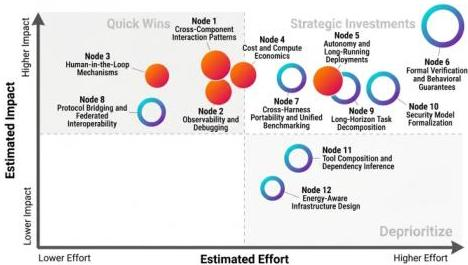
Figure 22. Research direction priority matrix: 12 emerging research directions positioned by estimated effort (x-axis) vs. estimated impact (y-axis). Group A immediate priorities (filled circles) cluster in the high-impact region; Group B long-term agenda items (open circles) span from quick wins to strategic investments.

# 6.9.15. Synthesis

These research directions share a common theme: they require lifting design decisions from the individual-component level to the system level. This reflects a core finding: agent harnesses are not just collections of engineering tricks—they are a class of systems deserving systematic research attention, formal methods, and rigorous evaluation frameworks. The next generation of agent infrastructure research will succeed by treating the harness itself, not just the models it wraps, as a first-class object of study. The eight high-impact directions identified above span: formal verification methodologies that enable harness correctness proofs; cross-harness benchmarking that surfaces model-harness coupling effects; protocol bridging that enables tool reuse across harness ecosystems; security formalization that enables compositional reasoning about agent isolation; cost and energy optimization that enables predictable resource budgeting; long-horizon task decomposition that fits complex work within harness constraints; and tool composition inference that reduces orchestration burden. Each points to a concrete technical barrier, a clear definition of success, and realistic effort estimates. Together, they form the research agenda that will determine whether the field invests proportionally in harness infrastructure as models become capable of longer, more complex, and more consequential tasks.

CC BY

© 2026 by the author(s). Distributed under a Creative Commons CC BY license.

---

Preprints.org (www.preprints.org) | NOT PEER-REVIEWED | Posted: 28 April 2026

doi:10.20944/preprints202604.0428.v3

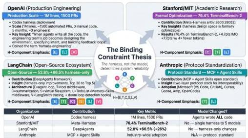
Figure 23. Industry convergence on the harness thesis: four major organizations—OpenAI (production-scale harness engineering), Stanford/MIT (automated harness optimization), LangChain (open-source harness methodology), and Anthropic (protocol standardization via MCP and Agent Skills)—independently converging on the survey's central claim that the harness, not the model, is the binding constraint on agent system reliability.

# 7. Conclusion

This survey has pursued a single organizing thesis: the agent execution harness—the runtime infrastructure layer that wraps a language model to govern execution, tool access, context, memory, lifecycle, and evaluation—is a first-class architectural object deserving systematic academic treatment as a unified infrastructure concern, not merely as background in the study of agent capabilities. We have argued this thesis through five contributions: a formal definition that draws principled boundaries around the concept; a historical account that traces the harness's emergence from three converging technological lineages; an empirically-grounded taxonomy of 22 representative systems; a cross-cutting analysis of nine technical challenge areas; and an identification of research directions that are visible only from the infrastructure vantage point.

The timing of this survey has proven fortuitous. In the weeks between the survey's completion (March 2026) and publication (April 2026), three independent developments have validated the infrastructure thesis and demonstrated that the harness concept has achieved mainstream recognition in industry. OpenAI's February 2026 naming of "harness engineering" as a discipline, combined with their Codex harness deployment generating one million lines of code with zero hand-written source through systematic infrastructure design, provides the strongest practitioner-level evidence yet that harness quality is the binding constraint on agent deployment. Stanford and MIT's Meta-Harness [53] demonstrates that the harness design space is formally estimizable, with automated search discovering configurations that surpass hand-engineered approaches. LangChain's DeepAgents achieves  $26\%$  performance improvement ( $52.8\%$  to  $66.5\%$  on TerminalBench 2.0) through harness-only changes, providing independent evidence from a third organization that harness-layer optimization yields performance gains comparable to model upgrades. These three convergent developments—from industry (OpenAI), academia (Stanford/MIT), and open-source community (LangChain)—validate the core claim of this survey: the harness, not the model, is the binding constraint on real-world agent system reliability. The formal framework  $\mathcal{H} = (E, T, C, S, L, V)$  developed independently in this work provides the theoretical vocabulary for understanding what all three organizations have discovered empirically.

The empirical evidence assembled in this survey makes the thesis difficult to resist. AgencyBench [15] demonstrates that the same model produces a  $48.4\%$  success rate in its native execution ecosystem

CC BY

© 2026 by the author(s). Distributed under a Creative Commons CC BY license.

---

and lower rates in others—a finding that is invisible to capability-focused surveys but follows directly from treating the harness as a co-determinant of agent behavior. SkillsBench *[59]* quantifies the infrastructure contribution to effective capability at 16.2 percentage points of average pass rate, while also showing that harness-level skill management can produce negative deltas—active harm rather than passive neutrality. HAL *[14]* demonstrates that a standardized evaluation harness eliminates “common implementation bugs,” reduces evaluation time from weeks to hours, and reveals behavioral anomalies—agents gaming benchmarks, misusing credit cards—that are undetectable without robust execution infrastructure. SandboxEscapeBench *[60]* provides the security correlate: frontier models demonstrate capability to escape container environments, establishing that the isolation architecture of the harness is not a trivial engineering choice but a substantive determinant of system security.

Three structural tensions will define the next phase of research into agent harness design. The first is the capability–isolation tradeoff: every additional tool permission increases attack surface, and every isolation mechanism adds latency and operational complexity. The correct point on this tradeoff is task-dependent, but the field lacks the formal models to characterize it systematically—relying instead on the empirical observation that production failures occur when the balance is wrong. Resolving this tension requires both a formal security model for harnesses (currently absent) and a principled capability model that predicts which tool combinations create which emergent risks.

The second tension is standardization versus specialization. The protocol fragmentation documented in §6.4, the benchmark fragmentation documented in §6.3, and the memory architecture diversity documented in §6.7 all reflect genuine uncertainty about what should be standardized across all harnesses versus what should vary by deployment context. The cross-harness coupling findings from AgencyBench suggest that premature standardization could lock in suboptimal harness–model pairings; the portability findings from SkillsBench suggest that absence of standardization creates skill libraries that cannot be transferred. Finding the right boundaries—what must be standardized, what must remain flexible—is an empirical question that requires cross-harness experiments that the field is only beginning to conduct.

The third tension is evaluation validity versus reproducibility. Real environments drift, invalidating benchmarks; synthetic environments are stable but ecologically invalid; standardized harnesses (HAL) provide reproducibility but at costs that limit scale. This trilemma is not obviously resolvable, but its resolution is prerequisite to reliable scientific progress: without valid, reproducible evaluation infrastructure, claims about agent capability improvement cannot be distinguished from claims about harness optimization.

### 7.1 The Infrastructure Thesis Revisited

We close by returning to the claim that motivates the survey: that the agent execution harness deserves treatment as a first-class architectural concept, with its own definition, historical lineage, taxonomy, and open problems. This claim is not merely organizational—it is empirical. The evidence assembled across Sections 1–7 supports a specific causal model of how harness infrastructure determines agent system outcomes.

In the model, agent capability—what the model can do—is a necessary but insufficient condition for agent reliability—what the deployed system consistently does. The harness translates capability into reliability through six governance functions: it determines whether the model’s multi-step execution converges (E-component), whether its tool access is appropriately bounded (T-component), whether its context contains what it needs without what it should not have (C-component), whether its task state survives failures (S-component), whether its side effects are monitored and constrained (L-component), and whether its behavior can be reliably measured and compared across deployments (V-component). When any of these functions is absent or poorly implemented, the gap between model capability and system reliability grows—not linearly but with the non-linear interactions that cross-component coupling produces.

This causal model has a practical implication that goes beyond the research agenda: it implies that the current pattern of model capability improvement outpacing harness infrastructure development

---

is creating a growing reliability deficit in deployed agent systems. As models become capable of longer, more complex, more consequential tasks, the governance demands on the harness layer increase faster than linearly—because longer tasks have more failure points, more complex tasks have more compositional attack surfaces, and more consequential tasks have higher costs of harness failure. A field that invests proportionally in model capability and disproportionately little in harness infrastructure is building on a foundation that becomes less stable as the structure above it grows taller.

The research directions of §6.9 are therefore not merely intellectually interesting problems; they are priority investments in the stability of the field’s progress. Formal harness specification (Direction 1) enables communication precision that prevents harness-level design errors from propagating through deployment pipelines undetected. Cross-harness benchmarking (Direction 2) surfaces the harness-model coupling effects that currently contaminate capability claims across the field. Security taxonomy development (Direction 3) provides the formal vocabulary needed to reason about harness security in compositional terms rather than through empirical observation of failures. Protocol interoperability (Direction 4) defines the cross-harness coordination infrastructure needed to realize multi-agent collective intelligence. Long-horizon evaluation methodology (Direction 5) resolves the environment drift problem that currently makes longitudinal progress claims untestable. Harness-aware fine-tuning (Direction 6) closes the model-harness coupling gap by making compatibility with defined harness APIs a trainable property. Memory interface standardization (Direction 7) enables the memory architecture innovations of §6.7 to be shared across harnesses rather than re-implemented independently in each. And harness transparency specification (Direction 8) formalizes the requirements that evaluation infrastructure must satisfy for its results to constitute valid evidence about agent capability rather than about harness implementation choices.

The field’s progress on frontier model capability will compound only if the harness layer matures in parallel. A model capable of multi-step reasoning over long horizons is latent capability without an execution environment that can maintain context coherently, govern tool access safely, evaluate behavior reliably, and recover gracefully from failure. The history of computing suggests that infrastructure layers—operating systems, networks, databases—have been as important as algorithmic advances in determining what capable systems actually deliver. The agent execution harness is the infrastructure layer of the LLM agent era. Understanding it rigorously, designing it deliberately, and studying it systematically is not preparatory work before the real research begins. It is the real research.

### 7.2 Implications for Research Practice

The infrastructure thesis has specific implications for how the field conducts agent research—implications that go beyond the choice of research topic to affect research methodology. Evaluation methodology and harness reporting. Every published evaluation of agent capabilities should report harness configuration alongside model and task specifications. The current norm of reporting only model name, benchmark name, and accuracy metric is insufficient to determine whether reported improvements reflect model advancement or harness optimization. Adopting the five benchmark design principles of §6.3.5—explicit harness specification, environment isolation guarantees, partial credit decomposition, cost-calibrated reporting, and behavioral anomaly disclosure—would bring agent evaluation methodology up to the reproducibility standards already established in related fields. A concurrent position paper *[64]* independently reaches the same diagnosis and proposes HARNESSCARD—a lightweight disclosure artifact specifying base model, control artifacts, runtime policy, action substrate, feedback stack, governance layer, and evaluation protocol. We endorse this proposal and suggest that the six-component framework $\mathcal{H}=(E,T,C,S,L,V)$ provides a natural structuring vocabulary for such disclosures: each HARNESSCARD entry should explicitly characterize, at minimum, the $E$-component’s termination policy, the $T$-component’s tool registry composition, the $C$-component’s context management strategy, the $S$-component’s persistence guarantees, the $L$-component’s policy enforcement mechanisms, and the $V$-component’s trajectory capture format.

Research framing. Studies of agent capabilities (memory, tool use, planning) should characterize their execution harness explicitly and consider whether their findings are harness-specific or harness-

---

general. AgencyBench's methodology of cross-harness evaluation provides a model: run the same agent in multiple harness configurations and report the performance distribution, not just the peak performance from the optimal configuration. Findings that are harness-specific are still valuable—they establish what the best possible performance is under ideal conditions—but they should be characterized as such rather than presented as unconditional capability claims.

System design. Harness designers should treat the six-component framework $\mathcal{H}=(E,T,C,S,L,V)$ as a minimum specification rather than an aspiration—and should design with cross-component coupling in mind from the outset rather than discovering coupling failures during deployment. The three coupling patterns identified in §6.9.1 (retention-security, evaluation-governance, memory-tool composition boundary) are predictable from the architectural framework; designing to address them explicitly is preferable to discovering them empirically through production failures. The extended challenge analysis of this version—covering execution infrastructure (§6.1), state and knowledge management (§6.5), and coordination and planning (§6.8)—identifies additional coupling surfaces: planning state persistence and memory scheduling interact through the CoALA *[151]* tier model; multi-agent shared state consistency and security fault isolation are structurally coupled in ways that require joint $S$-component and $L$-component design; and execution environment interface design determines which planning patterns are feasible.

Community infrastructure. The field should invest in shared harness infrastructure the way it has invested in shared model infrastructure. The proliferation of transformer implementations on HuggingFace accelerated model research by eliminating duplicated engineering effort; analogous shared implementations of $L$-component lifecycle hooks, $V$-component trajectory schemas, and $S$-component persistence interfaces would provide equivalent leverage for harness research. The HAL infrastructure *[14]* is a starting point; extending its standardization to the full six-component framework would constitute a significant infrastructure contribution to the field.

### 7.3 Limitations and Future Scope

This survey has limitations that should be acknowledged explicitly. The 23-system corpus, while broadly representative of published and publicly documented harnesses, excludes enterprise-internal deployments and domain-specific harnesses whose designs have not been published. The completeness matrix ratings for closed-source systems (Claude Code, DeepAgents, OpenClaw Browser-Use) are based on public documentation that may not fully characterize internal implementation. The formal LTS analysis of the $E$-component, while analytically productive, is a proposed framework rather than an established formalism; its validation against a larger system corpus and through developer consultation remains future work. Several of the quantitative claims cited from preprint sources (SandboxEscapeBench's container escape capability findings, SkillsBench's 16.2 percentage-point skill effect) are explicitly flagged as pending peer review; if substantially revised or retracted, the specific claims cited here should be updated. Finally, the pace of publication in this area—with major new harnesses, protocols, and benchmark systems appearing monthly—means that this survey reflects the state of the field as of March 2026; readers consulting it after this date should check for subsequent developments in the areas of MCP/A2A protocol evolution, long-context $C$-component architecture, and formal security model development, each of which is moving quickly enough to produce significant new results on a quarterly timescale.

A potential limitation of the taxonomy in §5 is the prominence of OpenClaw as a case study. OpenClaw receives more detailed treatment than other full-stack harnesses because (a) its architecture is fully documented in open-source repositories and practitioner analyses, making it the most verifiable instantiation of the six-component $\mathcal{H}=(E,T,C,S,L,V)$ framework, and (b) the PRISM security layer *[48]* provides the only available systematic published runtime security analysis of any production-deployed open-source agent harness at the time of writing. This methodological choice may introduce coverage bias toward OpenClaw's architectural patterns; readers should interpret the taxonomy with this limitation in mind.

---

Preprints.org (www.preprints.org) | NOT PEER-REVIEWED | Posted: 28 April 2026

doi:10.20944/preprints202604.0428.v3
