# The Synthetic Data Playbook: Generating Trillions of the Finest Tokens

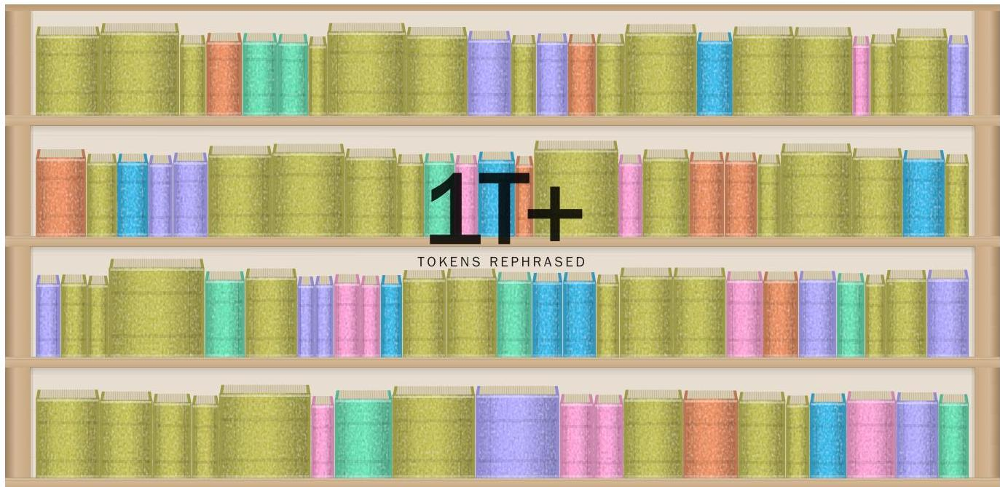

90 EXPERIMENTS · 1.958 DOCUMENTS · 1 PAGE ≈ 100M TOKENS

- Gemma (44)
- Qwen (12)
- SmolLM2 (10)
- Falcon (8)
- Granite (8)
- Llama (8)

How to turn noisy web text into state-of-the-art pretraining data with the right prompts, models, and infrastructure

AUTHORS

Joel Niklaus, Guilherme Penedo, Hynek Kydlicek, Elie Bakouch, Lewis Tunstall, Ed Beeching, Thibaud Frere, Colin Raffel, Leandro von Werra, Thomas Wolf

AFFILIATION

Hugging Face

PUBLISHED

Mar. 8, 2026

# Introduction

We ran 90 experiments, generated over 1 trillion tokens, and spent 12.7 GPU years to find the best recipe for synthetic pretraining data. The result is FinePhrase, a 486B token dataset that clearly outperforms all existing synthetic data baselines. It's available on the Hub, and this post walks you through everything we learned along the way.

---

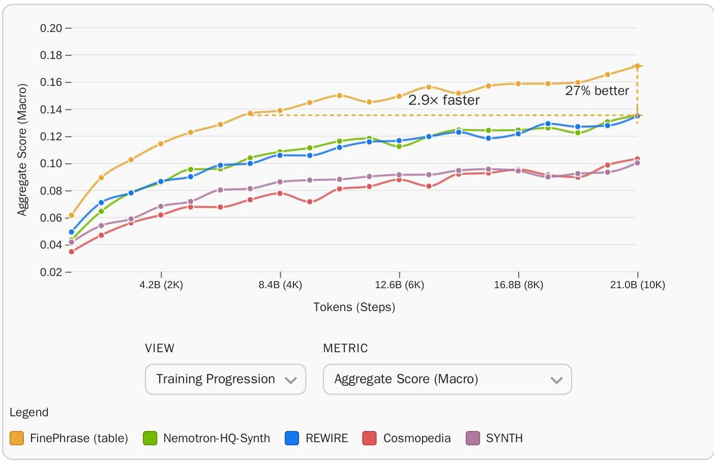
Figure 1: FinePhrase compared against synthetic data baselines across evaluation metrics.

If you read some of the latest LLM papers (e.g., Nemotron 3 (NVIDIA, 2025), Qwen3 (Yang et al., 2025), Phi-4 (Abdin et al., 2024), Arcee Trinity (Atkins, 2025, 2026)), you may have noticed that synthetic data has become a key component for LLM training data. It is quickly becoming one of the standard tools for building high quality datasets for LLM training. If we look back we can see several paradigm shifts for LLM data, especially for pretraining, and synthetic data is the natural latest step:

- After training the first language models on small-ish datasets like Wikipedia, people started scaling up the pretraining corpora including more and more data from the web. Datasets like C4 (Raffel et al., 2020) and The Pile (Gao et al., 2020) pushed into hundreds of gigabytes. Then FineWeb (Penedo et al., 2024) and DCLM (Li et al., 2025) brought things to the trillion-token scale, covering most of the crawlable web.
- When approaching the scaling limits of web data, the discussion shifted from volume to quality. Researchers started with stronger heuristics and dedduplication pipelines, then switched to neural classifiers looking for "educational" or "instruction-like" data. FineWeb-Edu used Llama 3 70B (Grattafori et al., 2024) to score educational quality, DCLM used model-based filtering to train a 7B model to  $64\%$  MMLU with 2.6T tokens. With higher quality data, some repetitions seemed fine.
- Now that we have mostly exhausted web text data and concluded that quality is more important, synthetic data has become an interesting option to up-cycle the data that the

---

classifiers would have normally excluded and thus increase the volume of data again. Cosmopedia (Ben Allal et al., 2024) was an early example, generating 25B tokens of textbooks and stories with Mixtral (Jiang et al., 2024). Today the latest LLMs are trained on trillions of synthetic tokens, matching the volume of unaltered data.

- But publicly indexed web data is only part of the picture. Massive amounts of user-generated content (emails, messages, proprietary codebases) remain untapped because they contain PII, toxic content, or copyrighted material. Generative Data Refinement (GDR) (M. Jiang et al., 2025) shows that LLMs can anonymize and detoxify such data while preserving its utility for training, outperforming industry-grade PII detectors with a single zero-shot prompt. By conditioning rewrites on each real example, GDR also preserves the diversity of the original data, avoiding the mode collapse that plagues purely synthetic generation. This could dramatically expand the usable data pool beyond what's publicly crawlable.

We are seeing a radical shift in compute allocation for model training: while the model training dominated the compute budget early on, we see more and more compute allocated to curate and improve the training datasets, both in pretraining and post-training.

The scale is staggering: NVIDIA used LLMs to rephrase around 2 trillion tokens of web text for their Nemotron-CC dataset (Su et al., 2024), while Z.ai generated 500 billion reasoning tokens to mid-train the GLM-4.5 series (Team et al., 2025). Here's how much synthetic data recent models are using:

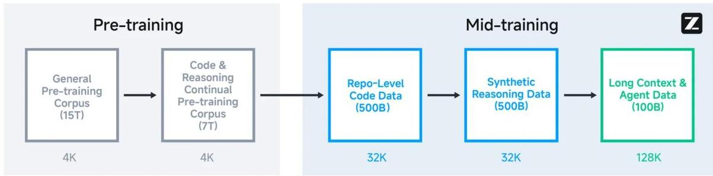
Figure 2: Scale of synthetic data usage in recent LLM training runs. Several recent models were trained on hundreds of billions to trillions of synthetic tokens.

Synthetic data also plays a central role in post-training via distillation, where a capable model generates targeted training data for domains like reasoning, instruction-following, and tool-use. For example, SmolLM3 (Hugging Face, 2025) was post-trained almost entirely on data generated from models like DeepSeek-R1 (DeepSeek-AI, 2025) and Qwen3.

However, how to do synthetic data generation properly still resembles alchemy these days: Which model should you use? Which prompts work best and how many do you need? And how do you even scale this effectively?

---

Our goal is to turn this alchemy into chemistry: replace intuition with systematic, reproducible experiments. Here's how we go about it:

We start by setting up the problem: what rephrasing is, which approaches exist, and what we want to test. Then we dive into the 90 Experiments we ran to figure out which prompts, models, and datasets actually work. The Analyses section zooms out to ask why things work the way they do. Next comes the Infrastructure that made all of this possible, including detailed throughput benchmarking of popular models (super important for getting the most data for your bucks). Finally, we put it all together into FinePhrase, our best configuration. The sections below are fairly self-contained, so feel free to jump around and skip whatever seems less interesting to you.

But wait, what about model collapse?

You might be wondering: doesn't training on synthetic data inevitably lead to model collapse? This is a common misconception that stems from research (Shumailov et al., 2024) showing severe degradation when models are trained exclusively and iteratively on their own outputs, without any new information or human data.

In practice, nobody trains models this way. Real-world pipelines mix synthetic with human data, use diverse reference materials in prompts, and apply synthetic data strategically rather than replacing entire training corpora. A large-scale empirical study training over 1,000 LLMs (Kang et al., 2025) confirms this nuanced picture: training on rephrased synthetic data mixed with natural web text (at around  $30\%$  synthetic) can speed up pretraining convergence by 5-10x, with no signs of degradation. Model collapse happens in a closed loop on a model's own outputs without new signal, which is not how practitioners use synthetic data. The real concern is frontier models generating training data for other frontier models in isolation. Thoughtful integration of synthetic data that introduces new knowledge or perspectives is a different story entirely. In FineWeb (Penedo et al., 2024) we also found no degradation from naturally occurring AI-generated data on the web.

Want to learn how to make GPUs go brrr and generate synthetic tokens at scale like this? This blog is for you!

---

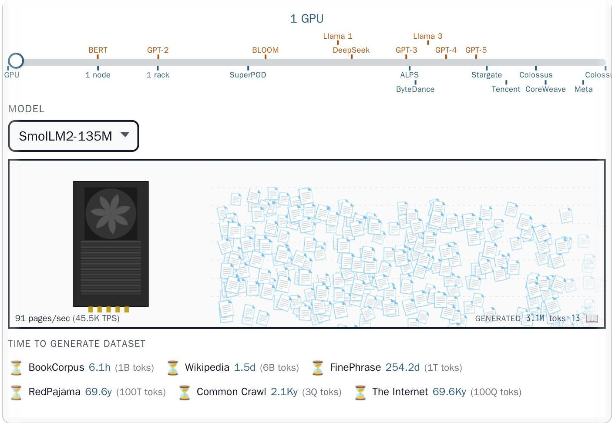
Figure 3: Drag the slider to scale up GPUs and watch the tokens fly. By the end of this post, you'll know exactly how to set this up.

Now let's start by defining what rephrasing actually means and laying out the design space.

# Rephrasing the Web

Several teams have already shown that rephrasing web content into cleaner formats can beat training on raw data: WRAP (Maini et al., 2024) rewrites text in different styles, Nemotron-CC (Su et al., 2024) extracts QA pairs and knowledge lists, REWIRE (Nguyen et al., 2025) does guided rewriting, BeyondWeb (Maini et al., 2025) tries continuation and summarization, and EntiGraph (Yang et al., 2024) uses entity-centric augmentation to synthesize diverse knowledge representations from small corpora. But nobody has done a systematic comparison across all these approaches, and the field still lacks a clear framework for what "rephrasing" even means. So let's fix that.

What is Rephrasing?

---

Rephrasing means running existing documents through a language model to produce variants that keep the meaning but change the presentation. That sounds simple, but the design space is huge. A document could be reformatted as a tutorial with worked examples, restructured as FAQ pairs, expanded with explanatory commentary, condensed into knowledge lists, or rewritten in Wikipedia style. Each transformation targets different capabilities: tutorials may help step-by-step reasoning, FAQs might boost question-answering, and math reformulations could strengthen quantitative skills. Which transformations actually work, and when? That's what we set out to answer.

# Three Axes of Synthetic Data

We think about synthetic data generation along three axes, each raising its own question:

1. Rephrasing strategy: Which transformations actually improve downstream performance? We compare prompts from prior work (REWIRE's guided rewriting, Nemotron's QA pairs and knowledge extraction) against novel formats (tutorials, FAQs, tables, math reformulations).
2. Generator model: How do model properties affect rephrase quality? We test across model families (Gemma (Gemma Team, 2025), Llama (Grattafori et al., 2024), Qwen (A. Yang et al., 2025), Granite (IBM Granite Team, 2024), Falcon (Technology Innovation Institute, 2024), SmolLM (Allal et al., 2025)), model generations (Qwen 1.5 (Bai et al., 2023) through Qwen 3 (A. Yang et al., 2025)), and scales (270M to 27B parameters).
3. Source data quality: When does seed quality matter? We rephrase both high-quality (FineWebEdu-HQ (Penedo et al., 2024), DCLM (Li et al., 2025)) and low-quality (FineWeb-Edu-LQ, Cosmopedia (Ben Allal et al., 2024)) sources to test whether rephrasing recovers value from noisy documents or just amplifies existing quality differences.

Prior work has explored these dimensions mostly in isolation. But their interactions are where the interesting questions live. Does the best strategy depend on source quality? Can small models rephrase high-quality data effectively, or do you need bigger models to salvage noisy documents? And cutting across all three axes: how do synthetic and original data interact? We compare synthetic-only training against mixing synthetic with original data, vary the choice of mix-in dataset, and test whether combining multiple prompts or model families increases diversity enough to replace original data entirely. Here's how we set up the pipeline to test all of this.

# How We Run Rephrasing

In practice, we rephrase documents using instruction-tuned models ranging from 270M to 27B parameters (primarily Gemma-3 (Gemma Team, 2025) variants) on filtered web corpora including

---

FineWeb-Edu (Penedo et al., 2024) and DCLM (Li et al., 2025), processing roughly 20B input tokens per quality tier. Our pipeline runs documents through customizable prompt templates that transform raw web text into structured formats (articles, tutorials, FAQs, discussions, commentaries) as well as distillation and continuation tasks inspired by prior work.

For inference we use vLLM (Kwon et al., 2023) with tensor parallelism, chunked prefetch, and speculative decoding (Leviathan et al., 2023) (n-gram prompt lookup with  $\sim 7$  draft tokens, acceptance rates around 0.7). Every rephrased document gets scored by both the FineWeb-Edu classifier and the DCLM quality scorer, and we track token counts, quality score deltas, and metadata including thinking traces when available. The whole thing runs distributed across 100 parallel tasks on a SLURM cluster with checkpointing, targeting 10B tokens of synthetic data for downstream ablations. More on the infrastructure in a later section.

# Source Datasets

Before diving into experiments, here's a quick overview of the datasets we compare against. We use "source data" and "seed data" interchangeably throughout.


<table><tr><td>CURATED</td><td>DCLM</td><td>FineWeb-Edu-HQ / LQ</td><td>Ultra-FineWeb</td></tr><tr><td colspan="4">A standardized benchmark providing a 240T token corpus from Common Crawl with model-based filtering as a key curation strategy. DCLM (DataComp-LM) enables training a 7B parameter model to 64% accuracy on MMLU with 2.6T tokens (Li et al., 2025).</td></tr></table>


<table><tr><td>SYNTHETIC</td><td>Nemotron-HQ-Synth</td><td>Cosmopedia</td><td>SYNTH</td><td>REWIRE</td></tr><tr><td colspan="5">Part of Nemotron-CC, a 6.3T token dataset using classifier ensembling and synthetic data rephrasing. The High-Quality-Synthetic subset contains synthetically rephrased data using Qwen3-30B-A3B (A. Yang et al., 2025) (Su et al., 2024).</td></tr></table>


With the datasets defined, we need a consistent way to tell whether one configuration is better than another.

# How We Measure Success

To evaluate each configuration, we follow the ablation methodology from FineWeb (Penedo et al., 2024): train a 1.2B parameter language model with a Qwen2-style architecture (A. Yang et al.,

---

2024) (details in the Appendix) on 20B tokens and evaluate on 12 benchmarks across six categories using 3-shot prompting with a single seed:

- General Knowledge: ARC (Clark et al., 2018), MMLU Redux (Gema et al., 2024)
- Reading Comprehension: SQuAD v2 (Rajpurkar et al., 2018), DROP (Dua et al., 2019)
- Reasoning: OpenBookQA (Mihaylov et al., 2018), XCSQA (Lin et al., 2021)
- Natural Language Understanding: WinoGrande (Sakaguchi et al., 2019), PIQA (Bisk et al., 2019), HellaSwag (Zellers et al., 2019)
- Math: GSM8K (Cobbe et al., 2021)
- Table Understanding: WikiTableQuestions (Pasupat &amp; Liang, 2015), TriviaQA (Joshi et al., 2017)

With all that context out of the way, let's get to the fun part: the experiments.

# Experiments

Time to put all of this to the test. We ran 90 experiments to systematically answer our questions, and the journey took some unexpected turns. Here's the full landscape of what we explored, with source datasets flowing through prompt strategies to model families:

---

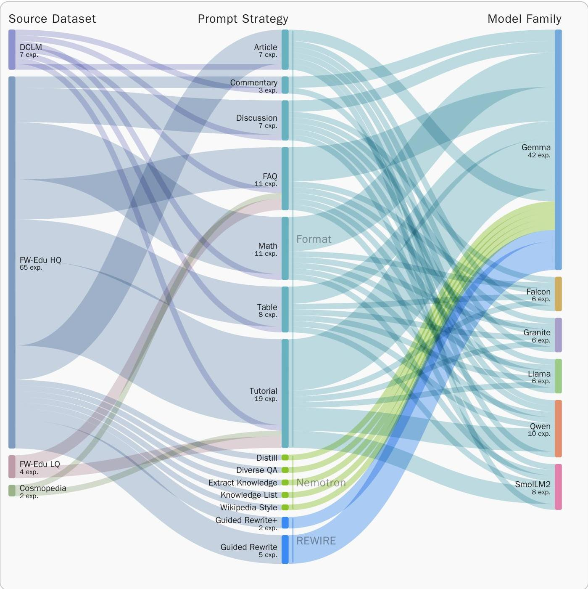
Figure 4: Flow of experiments from source datasets through prompt strategies to model families. Hover over nodes and links to see experiment counts.

We start by seeing how existing datasets stack up, then dissect what makes their prompts tick. From there we design our own prompts, explore how the rephrasing model affects quality, and investigate the interplay between synthetic and original data. Along the way, we stumble into some surprising findings about typos and template collapse. Each major section ends with a summary box highlighting the key takeaways.

How Do Existing Datasets Compare?

---

First things first: where does the bar sit? We establish baselines and train on eight popular datasets under identical conditions and compare their evaluation performance:

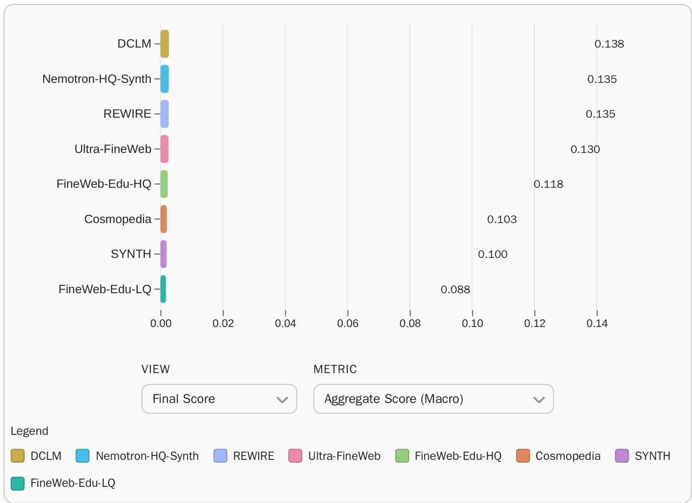
Figure 5: Comparison of baseline datasets across different evaluation metrics. Use the dropdown to switch metrics.

DCLM, Nemotron-HQ-Synth, and REWIRE come out on top by a clear margin. The remaining datasets, including Cosmopedia, FineWeb-Edu (both HQ and LQ), Ultra-FineWeb, and SYNTH, fall notably behind. DCLM is the strongest baseline and becomes our target to beat for everything that follows.

Nemotron-HQ-Synth and REWIRE are both mixes of several prompts. So what's actually doing the heavy lifting inside them?

# WHICH INDIVIDUAL PROMPTS MATCH DCLM?

We isolate each prompt from Nemotron-HQ-Synth (diverse_qa_pairs, extract_knowledge, distill, wikipedia_style_rephrasing, knowledge_list), the REWIRE guided_rewrite prompt, and the two baseline prompts from BeyondWeb (Maini et al., 2025) (continue, summarize), all using Gemma-3-1B on FineWeb-Edu-HQ as source:

---

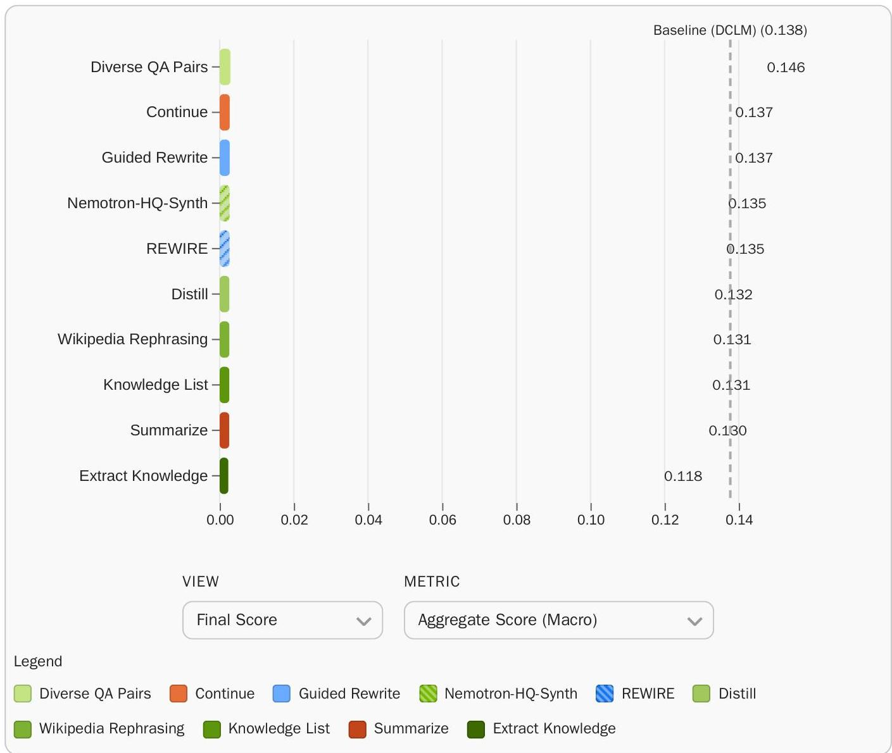
Figure 6: Individual prompt performance from existing synthetic datasets compared to the DCLM baseline.

On aggregate, only diverse_qa_pairs and REWIRE's guided_rewrite match DCLM. The BeyondWeb continue and summarize baseline-prompts don't reach DCLM level. So out of all the prompts from prior work, only two actually match our baseline. That's a pretty underwhelming hit rate.

But the aggregate hides a striking pattern. Switch to individual benchmarks with the dropdown and you'll see that DCLM dominates on HellaSwag and PIQA (commonsense reasoning), beating every single synthetic prompt. Meanwhile, almost all synthetic prompts comfortably beat DCLM on ARC (science knowledge) and SQuAD (reading comprehension). Rephrasing is essentially trading commonsense reasoning for factual recall. The aggregate score papers over this because gains on one side roughly cancel losses on the other. Keep an eye on this trade-off as you read on: it explains why mixing in original data matters, why DCLM is the best mix-in, and why synthetic-only training underperforms.

Can we do better with our own prompts?

---

# Can New Prompts Beat DCLM?

Since most existing prompts fail to beat DCLM, we designed nine novel prompt formats targeting different skills (article, commentary, discussion, explanation, faq, math, narrative, table, tutorial), all using Gemma-3-1B on FineWeb-Edu-HQ:

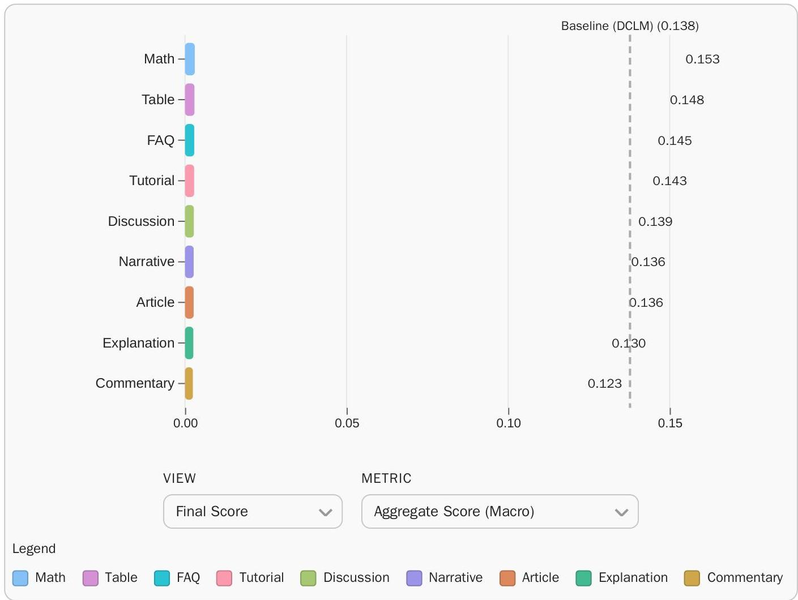
Figure 7: Nine new prompts compared against the DCLM baseline.

Four of them (faq, math, table, tutorial) clearly outperform DCLM, while the other five sit at or below DCLM level. The winning prompts share a common trait: they all restructure the source content into pedagogically rich formats rather than just paraphrasing it.

The commonsense-vs-knowledge trade-off from the previous section persists here too: switch to HellaSwag or PIQA and every single prompt, including the four winners, falls below DCLM. The new prompts win on aggregate because their ARC and SQuAD gains outweigh the commonsense losses, not because they improve across the board.

Each prompt also has a distinct benchmark signature. Table produces the strongest ARC boost (+7.5pp over DCLM), math is the only prompt that meaningfully moves GSM8K (+1.5pp, all others are within ±0.5pp) and also has the largest SQuAD gain (+11.2pp), and tutorial is the only prompt

---

that improves DROP (+1.4pp). GSM8K's resistance is notable: math reasoning appears to require math-specific content, not just any pedagogical restructuring.

So far we've been using Gemma-3-1B for everything. A natural question is: can we squeeze out more performance by throwing a bigger or better model at the problem?

# Impact of the Rephrasing Model

We look at this from three angles: model size, model family, and model generation.

# DOES THE MODEL SIZE MATTER?

We compare all Gemma-3 sizes (270M, 1B, 4B, 12B, 27B) on the math, tutorial, and REWIRE's guided rewrite prompts. Use the Setup dropdown to switch between them:

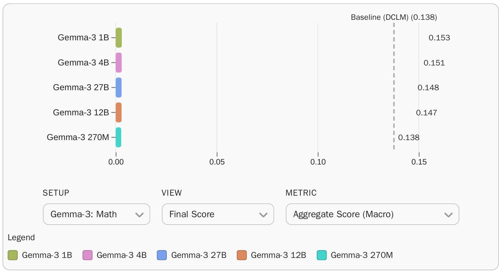
Figure 8: Model sizes across Gemma-3 and SmolLM2. Use the Setup dropdown to compare across models and prompts.

For math and tutorial, the 270M model underperforms, but 1B through 27B show no significant difference. SmolLM2 (135M, 360M, 1.7B) tells the same story on tutorial: there is a clear performance gradient up to the 1B range. The one exception is guided rewrite, where the 4B model edges ahead of the 1B, while 4B through 27B remain equivalent. This prompt is substantially more complex (detailed rewriting instructions, quality criteria, multi-step formatting requirements), which likely raises the minimum capability threshold. The takeaway: beyond a baseline capability (reached around 1B for simple prompts and 4B for complex ones), bigger

---

models don't buy you better synthetic data. This aligns with findings from Kang et al. (2025), who showed that scaling generators from 8B to 70B parameters did not yield superior pretraining data, and with SwallowMath-v2 (Fujii et al., 2025), which reports no downstream gains on math data from scaling the rewriter from Qwen3-30B-A3B to Qwen3-235B-A22B. This is great news for cost: you can use cheap, fast models for most rephrasing tasks.

That raises an interesting follow-up. REWIRE claims that you specifically need large models to salvage low-quality data. Does that hold up?

DO WE NEED BETTER MODELS FOR REPHRASING LOW-QUALITY DATA?

REWIRE (Nguyen et al., 2025) used Llama-3.3 70B and argued that upcycling low-quality data requires large models. We put this to the test by comparing Gemma-3-1B vs Gemma-3-12B on HQ vs LQ source data across four prompts (continue, summarize, faq, tutorial). Use the Setup dropdown to switch between prompts:

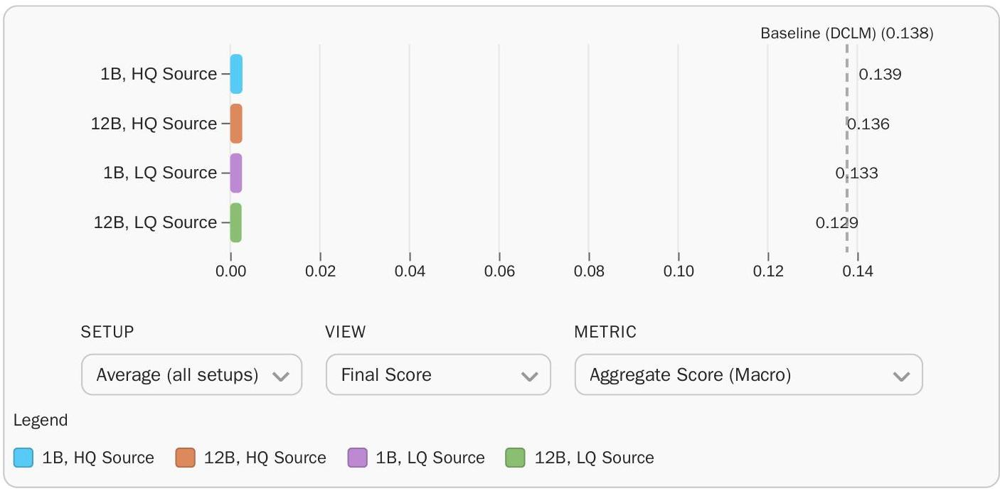
Figure 9: 1B vs 12B model on HQ vs LQ data. Use the Setup dropdown to compare across prompts.

The results are mixed: for some prompts 12B helps slightly with LQ data, but for the FAQ prompt the 1B model actually wins. We see no consistent advantage of using larger models for low-quality data.

So model size doesn't matter much. But what if you're using the wrong model family entirely?

DOES THE MODEL FAMILY MATTER?

---

We test six model families (SmolLM2, Falcon3 (Technology Innovation Institute, 2024), Qwen3, Gemma-3, Granite3 (IBM Granite Team, 2024), Llama-3.2) at  $\sim 1$ B scale on eight prompts. Use the Setup dropdown to compare across prompts:

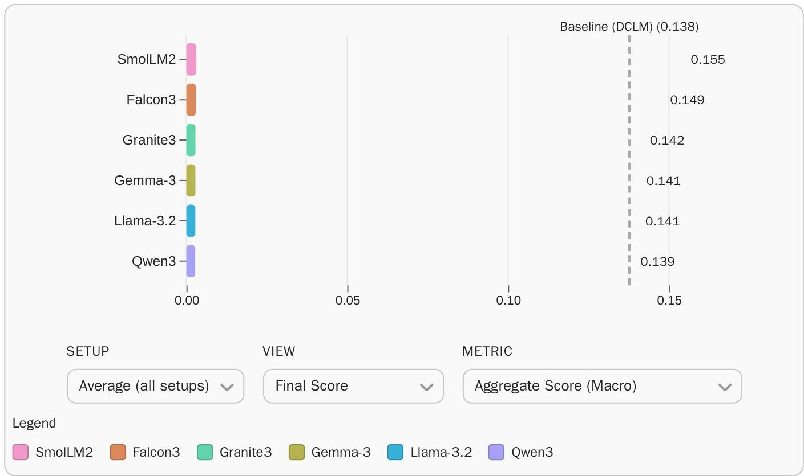
Figure 10: Model families compared at  $\sim 1$ B scale. Use the Setup dropdown to compare across prompts.

The result is striking: SmolLM2 consistently and clearly outperforms all others across every single prompt.

But where does that advantage actually come from? Switch to SQuAD: SmolLM2 leads by roughly +10pp over the average of the other model families, consistently across all prompts. It also pulls ahead on TriviaQA (+1 to +5pp). On HellaSwag, PIQA, and GSM8K, the differences between model families are tiny (1-2pp). SmolLM2's aggregate dominance is largely a QA story.

SmolLM2 is already over a year old at this point. If model quality matters, should we just wait for the next generation?

# DOES THE MODEL GENERATION MATTER?

We compare Qwen models from versions 1.5 (Bai et al., 2023), 2 (Yang et al., 2024), 2.5 (Yang, Yang, Zhang, et al., 2024), and 3 on the tutorial prompt:

---

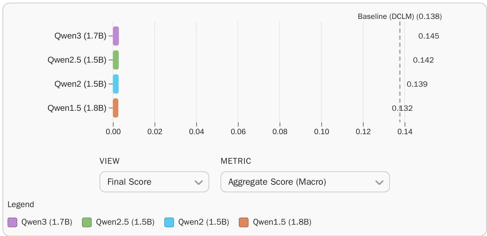
Figure 11: Qwen model generations (1.5 to 3) on the tutorial prompt.

The differences are small, but there is a consistent upward trend: newer versions lead to slightly higher evaluation performance, especially cumulative from version 1.5 to 3.

Putting together our findings on model size, family, and generation:

Summary: Impact of the Rephrasing Model

Model size: 1B is sufficient. Larger models do not help.

Model family: SmolLM2 dominates across all prompts.

Model generation: Newer is slightly better.

Practical takeaway: Use the newest, best-rephrasing 1B model you can find.

We've thoroughly explored the model dimension. The next obvious question: how much do the dataset choices matter?

# Impact of the Dataset Choices

So far we've always mixed synthetic data with a source dataset and a mix-in dataset. But do we even need the original data? And if so, which dataset should we mix in?

IS SYNTHETIC DATA ENOUGH?

---

The dream scenario would be generating all your training data synthetically, no curation needed. We test this by comparing synthetic-only training vs mixed training (synthetic + source) across all our prompts on DCLM and FineWeb-Edu-HQ sources:

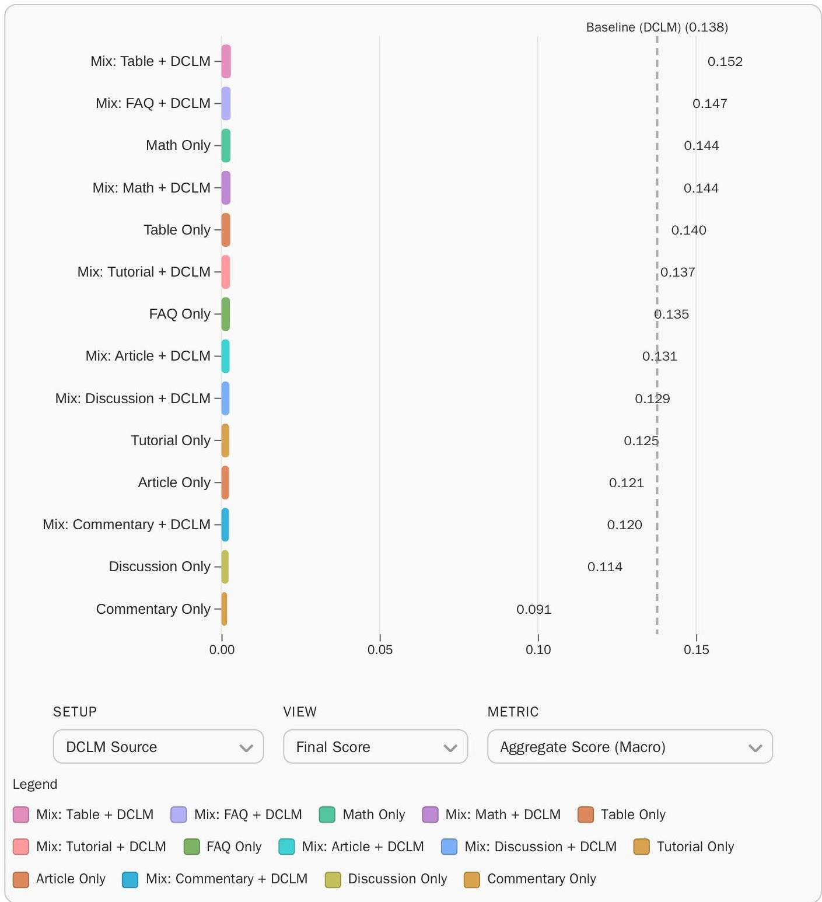
Figure 12: Synthetic-only vs mixed training. Use the Setup dropdown to compare across source datasets.

Unfortunately, synthetic-only training falls short of both DCLM and mixed training. Mixing consistently improves over both the synthetic-only and original-data-only baselines, regardless of prompt type. This echoes Kang et al. (2025), who found that pure synthetic data never

---

outperforms natural web text alone, but mixing roughly  $30\%$  rephrased synthetic data with natural text can accelerate convergence by 5-10x.

The per-benchmark view sharpens the picture. The benchmarks that benefit most from mixing are HellaSwag (+0.5 to +1.3pp) and, for most prompts, SQuAD (+4 to +12pp for Tutorial and FAQ). GSM8K doesn't move at all. The "always mix with original data" takeaway is driven primarily by commonsense recovery, not a uniform lift across all skills.

OK, so we need to mix in original data. But how much does the specific choice of mix-in dataset affect performance?

# DOES THE MIX-IN DATASET MATTER?

We apply the tutorial prompt using Gemma-3-1B on FineWeb-Edu-HQ, then mix in one of four datasets: DCLM, Cosmopedia, FineWeb-Edu-HQ, or FineWeb-Edu-LQ. Use the Setup dropdown to also see results with LQ source data:

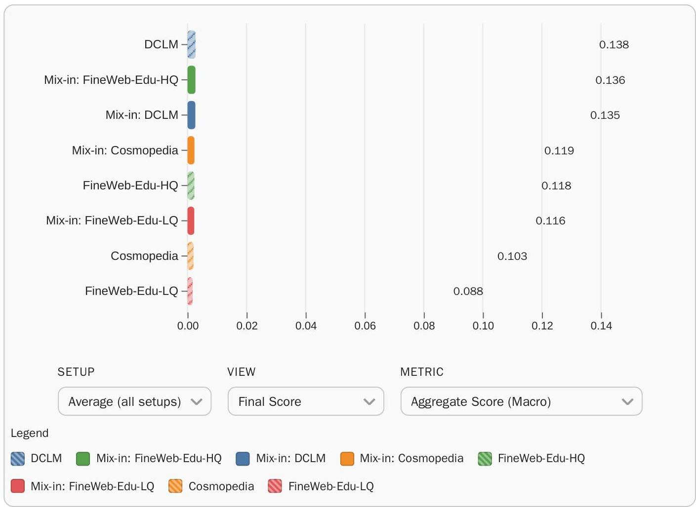
Figure 13: Effect of different mix-in datasets. Use the Setup dropdown to compare HQ vs LQ source data.

DCLM outperforms other mix-in datasets across the board. Adding synthetic data improves performance for all mix-in datasets, with the effect especially pronounced for the weaker ones.

---

This was one of our bigger surprises: the mix-in dataset is a major performance driver, sometimes more important than the synthetic data itself.

The per-benchmark view reveals that DCLM and FineWeb-Edu-HQ as mix-ins have complementary strengths, and the balance between them shifts depending on the source data quality. With HQ source, switch to HellaSwag and PIQA: DCLM as mix-in recovers most of the commonsense signal that rephrasing destroys, while FineWeb-Edu-HQ does not. Switch to SQuAD and DROP: FineWeb-Edu-HQ pulls ahead on reading comprehension. Their macro scores are virtually identical (0.143 vs 0.143), but DCLM edges ahead on micro because its commonsense gains are spread across more benchmarks.

DCLM's commonsense recovery is remarkably stable: across all 15 runs with DCLM as mix-in, HellaSwag scores land in a tight range of 0.086-0.092, while the 124 FW-Edu-HQ mix-in runs spread much wider (0.069-0.098). DCLM essentially clamps commonsense performance to a narrow band regardless of what you do with the synthetic portion.

Now switch to the LQ Source setup. Here FineWeb-Edu-HQ actually overtakes DCLM on both macro and micro. The reason is visible on ARC: FineWeb-Edu-HQ as mix-in scores +6pp over DCLM as mix-in, a gap far larger than with HQ source (+1pp). When the source data is low-quality, the rephrased output carries less knowledge on its own, so the mix-in's knowledge content matters more, and FineWeb-Edu-HQ's educational focus pays off. Meanwhile the HellaSwag gap narrows (-0.8pp vs -1.2pp with HQ source). The practical takeaway: DCLM is the better mix-in for high-quality sources, but FineWeb-Edu-HQ can be the better choice when rephrasing low-quality data.

If the mix-in dataset matters so much, what about the source dataset we're actually rephrasing?

DOES THE SOURCE DATASET MATTER?

We rephrase four datasets (DCLM, Cosmopedia, FineWeb-Edu-HQ, FineWeb-Edu-LQ) with faq and tutorial prompts, testing two regimes: (a) mix-in equals source, and (b) fixed mix-in (FineWeb-Edu-HQ). First, here's what happens when mix-in varies with source:

---

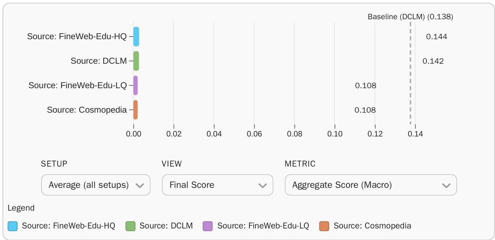
Figure 14: Effect of source dataset when mix-in equals source. Use the Setup dropdown to compare prompts.

Source quality appears to matter here: FineWeb-Edu-HQ and DCLM clearly outperform FineWeb-Edu-LQ and Cosmopedia. But when we fix the mix-in to FineWeb-Edu-HQ, the source effect nearly vanishes:

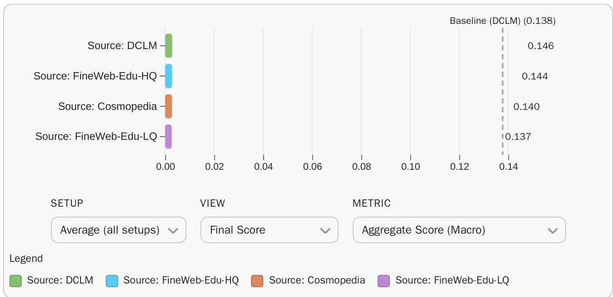
Figure 15: Effect of source dataset with FineWeb-Edu-HQ as fixed mix-in. Use the Setup dropdown to compare prompts.

This is exciting: it means you can rephrase even low-quality data and still get competitive results, as long as you pair it with a strong mix-in dataset. That opens up a much larger pool of source

---

data to draw from. But can we squeeze out even more performance by increasing diversity in the synthetic portion?

# DOES INCREASED DIVERSITY HELP?

We test three diversity strategies: mixing prompts, mixing model families, and mixing both. Use the Setup dropdown to compare strategies:

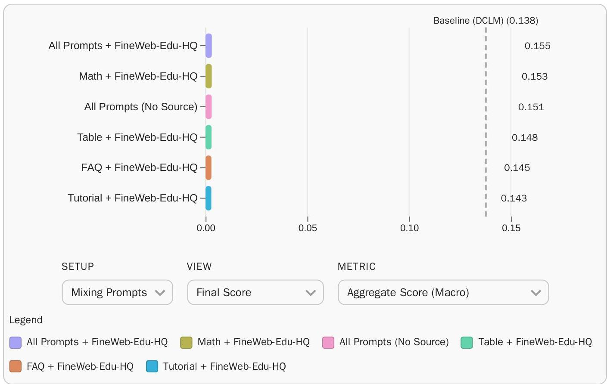
Figure 16: Different diversity strategies. Use the Setup dropdown to compare approaches.

None of them show a significant improvement over the best individual configuration. Performance averages rather than compounds. This was a bit disappointing. Z. Yang, Band, Li, et al. (2024) found that simple paraphrasing quickly saturates in their continued pretraining setting, while their entity-graph-based EntiGraph approach scales log-linearly by externalizing diversity to a combinatorial structure over entities. Our prompts may already capture enough structural diversity that additional mixing has diminishing returns at 20B tokens, but diversity benefits may emerge at larger scales where the model can better exploit the varied signal.

Putting together our findings on synthetic-only training, mix-in choice, source quality, and diversity:

Summary: Impact of the Dataset Choices

---

Synthetic-only: Not enough. Always mix with original data.

Mix-in dataset: Major performance driver. DCLM and FineWeb-Edu-HQ have complementary strengths (commonsense vs knowledge). Best choice depends on source quality.

Source dataset: Secondary. With a strong mix-in, even low-quality sources work.

Diversity: Does not compound at 20B token scale. Performance averages rather than improves.

Practical takeaway: Invest in a high-quality mix-in dataset. DCLM for high-quality sources,

FineWeb-Edu-HQ for low-quality ones.

We've covered prompts, models, and datasets. One last fun question: how sensitive is all of this to tiny details in the prompt itself?

# Do Typos in the Prompt Hurt?

While implementing the REWIRE prompt, we noticed it contained several typos and grammatical errors. So we cleaned it up and ran both versions:

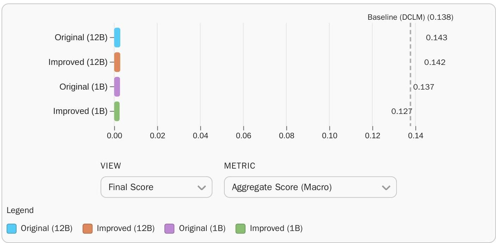
Figure 17: REWIRE prompt with original typos vs improved version at 1B and 12B scale.

Typos don't hurt at all. For the 1B model, the typo-laden original actually performs slightly better than the improved version. So much for prompt polish.

With that final detail in hand, let's take stock of everything we've found.

# Takeaways

---

Let's step back and summarize what we learned:


<table><tr><td>Question</td><td>Answer</td></tr><tr><td>How do existing datasets compare?</td><td>DCLM, Nemotron-HQ-Synth, and REWIRE lead. Most synthetic baselines fall behind.</td></tr><tr><td>Which individual prompts from the synthetic baselines match DCLM?</td><td>Only Diverse QA Pairs and REWIRE's Guided Rewrite.</td></tr><tr><td>Can new prompts beat DCLM?</td><td>Yes. FAQ, Math, Table, and Tutorial all outperform DCLM. Article, Commentary, Discussion, Explanation, and Narrative do not.</td></tr><tr><td>Does model size matter?</td><td>Not much. 1B is sufficient for simple prompts, 4B for complex ones.</td></tr><tr><td>Do we need better models for low-quality data?</td><td>No consistent advantage from larger models on low-quality sources.</td></tr><tr><td>Does the model family matter?</td><td>Yes. SmolLM2 dominates across all prompts.</td></tr><tr><td>Does the model generation matter?</td><td>Slightly. Newer Qwen versions trend better.</td></tr><tr><td>Is synthetic data enough?</td><td>No. Always mix synthetic with original data.</td></tr><tr><td>Does the mix-in dataset matter?</td><td>Yes, a major performance driver. DCLM and FineWeb-Edu-HQ have complementary strengths (commonsense vs knowledge), and the best choice depends on source data quality.</td></tr><tr><td>Does the source dataset matter?</td><td>Not with a strong mix-in. Even low-quality sources produce competitive results.</td></tr><tr><td>Does increased diversity help?</td><td>No, performance averages rather than compounds.</td></tr><tr><td>Do typos in the prompt hurt?</td><td>No. Typos have no negative effect on downstream performance.</td></tr></table>


So what actually matters? Prompt design, above all else. Structured formats like FAQ, Math, Table, and Tutorial consistently beat curated baselines. Everything else is surprisingly forgiving: a 1B model handles simple prompts just fine, 4B covers the complex ones, and going bigger buys you nothing. Source data quality barely matters either, as long as you mix in strong original data. That last point is worth emphasizing: low-quality sources with a good mix-in match high-quality sources, which means you can draw from a much larger and more diverse data pool. The recipe we landed on is simple: pick a structured prompt, use the smallest model that handles it, blend with high-quality original data, and pour the saved compute into volume.

---

Now let's look more closely at why these things work the way they do.

## Analyses

The experiments tell us what works. Now let's zoom out and ask why. We look at the cost of running these experiments, whether cheap proxy metrics can replace expensive training runs, what the rephrased outputs actually look like, and why a messier model sometimes wins.

## Is More Compute Worth It?

Running 90 experiments is not cheap. GPU time varies by two orders of magnitude: the cheapest run (Table with SmolLM2) took 8 days, while the most expensive (Guided Rewrite with Gemma-3 27B) consumed over 15 months of GPU time. Here's each experiment's downstream performance plotted against its GPU cost on a log scale, with a Pareto frontier connecting the most efficient configurations:

---

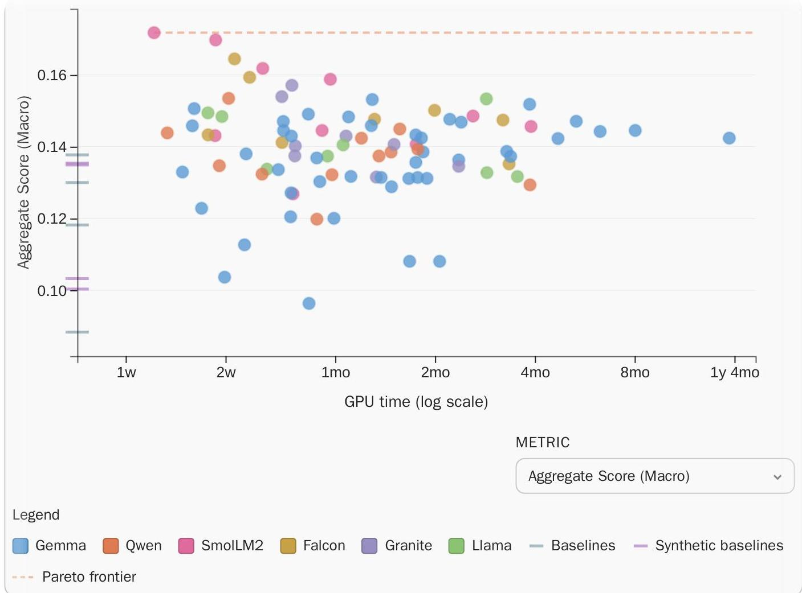
Figure 18: GPU time (log scale) vs downstream performance for all 90 experiments. The dashed line shows the Pareto frontier of most efficient configurations. Hover over points for details.

The Pareto frontier is dominated by small models with simple prompts. The best cost-performance tradeoffs come from 1B-class models (Gemma-3-1B, SmolLM2-1.7B) paired with format prompts like Math, Table, and FAQ. Scaling up to 12B or 27B models pushes GPU time by 5-10x while at the same time decreasing performance.

The message is clear: invest in prompt design, not model size. A well-chosen prompt on a 1B model will outperform a generic prompt on a 27B model at a tiny fraction of the cost. The only scenario where larger models might be justified is for complex prompts (like Guided Rewrite) that require more capable instruction following, but even there the gains are marginal.

Even the cheapest configurations still take over a week of GPU time, and we only know which ones work after rephrasing 10B tokens and then training a model. Wouldn't it be nice if we could just score the rephrased outputs directly and skip the expensive train-then-evaluate loop?

Can Quality Scores Predict Performance?

---

FineWeb-Edu-score and DCLM-score are great quality filters for human-written web data. If they also work for synthetic data, we could score rephrased outputs directly and iterate on prompts without running the full pipeline each time. We computed Spearman rank correlations between various edu-score and DCLM-score metrics (input scores, output scores, score differences, and relative improvements) and all downstream benchmark results across our 90 experiments. Here's the full correlation matrix:

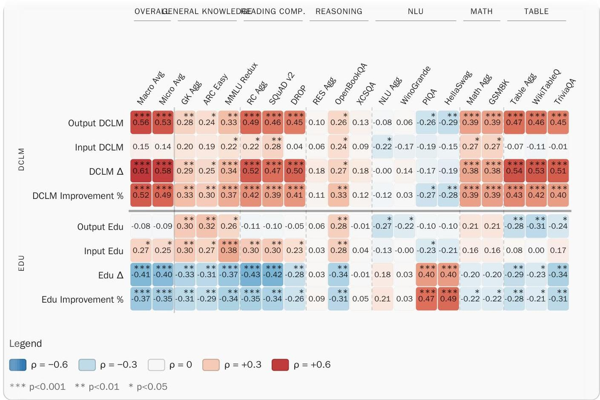
Figure 19: Spearman rank correlations between quality score metrics and downstream benchmark performance across 83 rephrasing experiments. Blue cells indicate positive correlations, red cells negative. Significance: *** p&lt;0.001, ** p&lt;0.01, * p&lt;0.05.

DCLM-score is a moderate predictor of aggregate performance. The DCLM-score difference (output minus input) shows the strongest correlation with agg_score_macro ( $\rho = 0.61$ ,  $p &lt; 0.001$ ), followed by the output DCLM-score ( $\rho = 0.56$ ). These are moderate correlations at best. The DCLM-score variants are particularly predictive for table understanding ( $\rho = 0.47 - 0.54$ ) and reading comprehension ( $\rho = 0.49 - 0.52$ ).

Edu-score tells a more nuanced story. The input edu-score (the score of the original data before rephrasing) correlates with aggregate performance ( $\rho = 0.27$ ,  $p &lt; 0.05$ ), but the output edu-score (the score of the rephrased data) shows essentially no correlation ( $\rho = -0.08$ , not significant). Starting with higher-quality source data matters, but the edu-score of the synthetic output is not a reliable proxy at all.

---

Neither score is a reliable universal proxy. WinoGrande shows essentially zero correlation with any predictor. The strongest individual correlations ( $\rho \approx 0.56 - 0.61$ ) are still only moderate, explaining roughly  $30\%$  of the variance at best. The bottom line: for synthetic data, there is no shortcut. You have to train models and evaluate them.

The correlation matrix tells us that quality scores are weak predictors, but not how scores change through rephrasing. The slope chart below visualizes this: each experiment is a line connecting its input score (left), output score (middle), and downstream agg_score_macro (right). Toggle between DCLM and edu-score views to see both perspectives:

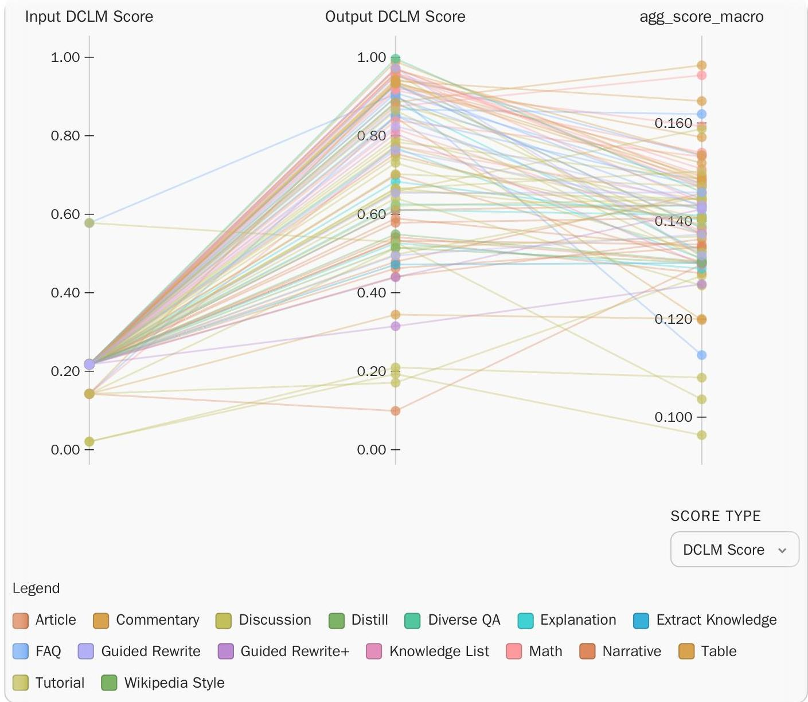
Figure 20: Slope chart showing how quality scores shift through rephrasing. Each line connects an experiment's input score, output score, and downstream performance. Toggle between DCLM and edu-score views.

DCLM scores almost universally increase through rephrasing. Nearly every experiment shows an upward slope from input to output DCLM score, regardless of prompt type or model. The rephrasing models produce cleaner, more structured text that the DCLM classifier rewards. But

---

the slope from output DCLM score to downstream performance is much flatter and noisier, confirming that a high DCLM score does not guarantee good training data.

Edu-scores tell the opposite story. Most experiments decrease the edu-score through rephrasing, particularly those starting from high-quality sources (FineWeb-Edu-HQ has high baseline educors). The edu-score classifier penalizes format changes like tables, FAQs, and math notation that our best prompts produce. This is a case where the proxy metric actively misleads: the "quality degradation" measured by edu-score corresponds to format transformations that improve downstream performance.

So quality scores designed for filtering web data don't transfer to synthetic data. Maybe looking at the outputs more directly helps. For instance, does the length of the rephrased output tell us anything?

# Do Chatty Models Make Better Data?

Different prompt formats produce wildly different output lengths. Here are the output tokens per document across four prompt types, broken down by model family:

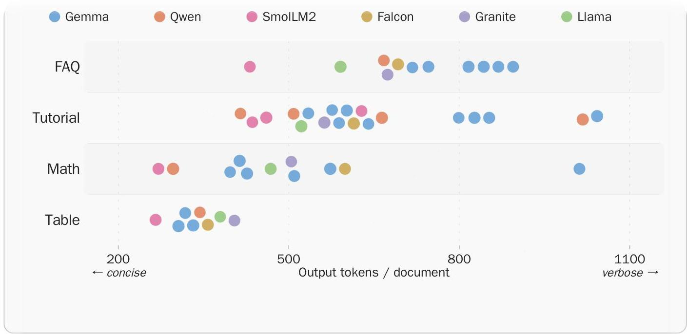
Figure 21: Output tokens per document across prompt types and model families. Hover over dots to see detailed statistics for each experiment.

Table and Math prompts tend to be concise, while FAQ and Tutorial prompts generate significantly more tokens per document. The spread within each prompt type varies across model families: some models are consistently verbose regardless of the prompt, while others adapt their output length to the task.

---

But does this variation actually affect downstream performance? Our prompts produce outputs ranging from  $25\%$  of the input length (Commentary) to  $150\%$  (Guided Rewrite at 12B). Here's each experiment's compression ratio plotted against its benchmark score:

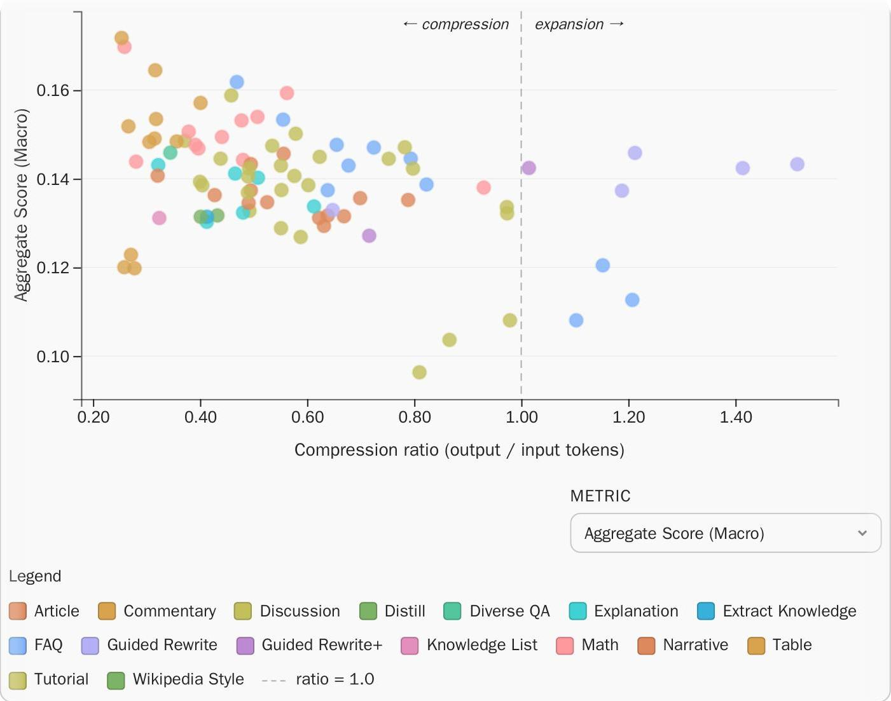
Figure 22: Compression ratio (output/input tokens) vs downstream performance. The dashed line marks ratio = 1.0 (no compression). Hover over points for details.

There is no meaningful relationship between compression ratio and performance. Highly compressive prompts (Commentary at 0.26x, Table at 0.25x) and expansive ones (Guided Rewrite at 1.5x) both appear across the full range of performance scores. The best-performing experiments cluster around 0.3x-0.8x compression, but this likely reflects the distribution of prompt types rather than any causal effect of compression itself. FAQ and Tutorial prompts, which happen to compress moderately, also happen to be the strongest prompts for other reasons (pedagogical restructuring, diverse output formats). What matters is the content and structure of the output, not its length relative to the input.

So output length doesn't predict quality either. But we stumbled onto something more interesting while looking at output diversity: a case where a model that follows instructions poorly actually produces better training data.

---

# Math Rephrasing: When "Worse" Outputs Win

This was one of our most surprising findings. We compared two  $\sim 1.7\mathrm{B}$  parameter models for generating math word problems: SmolLM2 and Qwen3. SmolLM2's outputs looked objectively worse, yet models trained on them performed better.

Qwen3 produced beautiful, structured outputs:

-  $100\%$  had proper Problem/Solution sections
-  $99\%$  had step-by-step formatting
-  $60\%$  included LaTeX math notation

Here's a typical Qwen3 output:

```txt
1 **Problem:**
2 A disc rotates at 120 rpm. How many revolutions in 5 minutes?
3
4 **Solution:**
5 1. Revolutions per minute = 120
6 2. Number of minutes = 5
7 3. Total revolutions = 120 × 5
8
9 $$120 \times 5 = 600$$
10
11 The disc makes 600 revolutions in 5 minutes.
12
13
```

SmolLM2 was messier:

- Only  $68\%$  had complete solutions
- Wide variance in output length (4 to 4,000 tokens)
- Mix of formats: questions, partial answers, full solutions

SmolLM2 outputs ranged from proper solutions to just questions like "What is the difference between X and Y?" or even 4-token fragments like "Areas Where We Service".

Yet models trained on SmolLM2's data outperformed those trained on Qwen3's data on downstream benchmarks. We suspect this is due to template collapse: Qwen3's outputs were too consistent. 115 out of 1,000 samples started with identical text, while SmolLM2's most common pattern appeared only 3 times.

---


<table><tr><td>Metric</td><td>SmolLM2</td><td>Qwen3</td></tr><tr><td>Most common start</td><td>3/1000</td><td>115/1000</td></tr><tr><td>Output length range</td><td>4-4,000</td><td>100-2,600</td></tr><tr><td>Unique patterns</td><td>High</td><td>Low</td></tr></table>


SmolLM2's quality distribution was actually reasonable:


<table><tr><td>Quality</td><td>Criteria</td><td>Share</td></tr><tr><td>Excellent</td><td>Has “solution” + numbered steps + 80+ tokens</td><td>45%</td></tr><tr><td>Good</td><td>Has “solution” + 50+ tokens</td><td>22%</td></tr><tr><td>Partial</td><td>30+ tokens but missing structure</td><td>25%</td></tr><tr><td>Poor</td><td>&lt;30 tokens</td><td>8%</td></tr></table>


The lesson: for pretraining data, diversity beats consistency. A model that doesn't follow instructions perfectly can actually produce better training data than one that does. This also helps explain why SmolLM2 dominates the model family comparison: it produces more varied outputs, which may matter more than precise instruction following.

# Summary: Analyses

Cost: Small models with simple prompts dominate the Pareto frontier. Invest in prompt design, not model size.

Quality scores: Neither edu-score nor DCLM-score reliably predicts downstream performance for synthetic data. There is no shortcut to training and evaluating.

Verbosity: Output length has no meaningful relationship with performance. What matters is content, not compression ratio.

Diversity: Template collapse hurts more than noisy outputs. A messier model that produces varied text can outperform a polished one that repeats the same template.

With the experiments and analyses behind us, let's talk about the infrastructure that made all of this possible.

---

Infrastructure

Each of our 90 experiments requires rephrasing around 10 billion tokens of web text. Even with KV caching, every output token still needs its own forward pass, and every web document has a few thousand tokens. With the wrong serving configuration, a single experiment takes weeks instead of days. Multiply that by 90 and the difference between a good and bad setup is literally months of GPU time.

Thanks to fast inference engines like vLLM (Kwon et al., 2023) and SGLang (Zheng et al., 2024), the raw generation speed is no longer the bottleneck. The hard part is the infrastructure around it: orchestrating thousands of prompts, keeping GPUs saturated, checkpointing outputs, and pushing everything to storage without losing progress when a worker crashes.

We made major extensions to DataTrove (Penedo et al., 2024) to handle this. DataTrove supports both local generation and large-scale distributed runs on Slurm clusters, handling chunking, checkpointing, distributed queueing, and Hugging Face dataset management so you can focus on synthetic data design rather than operational glue. We used it for every experiment in this blog post, from 10k-example test runs to the full FinePhrase production pipeline.

Here's an overview of the pipeline:

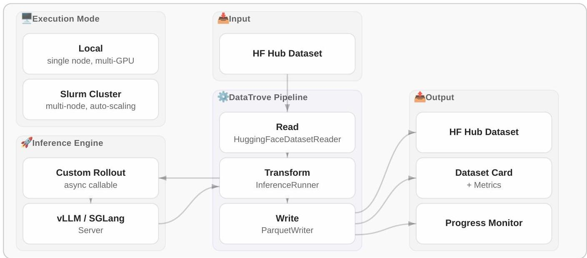
Figure 23: Overview of the DataTrove synthetic data generation pipeline. Documents flow through a three-stage pipeline (Read, Transform, Write), with the InferenceRunner dispatching rollout functions to vLLM/SGLang. The system supports local and Slurm-based execution with automatic upload and progress monitoring.

Let's walk through it.

---

# Generating synthetic data at scale

At the core is examples/inference/benchmark/generate_data.py, a Typer-powered entry point that orchestrates the full synthetic data loop:

1. Read: pull any split/config from the Hugging Face Hub via HuggingFaceDatasetReader.
2. Transform: stream examples through InferenceRunner, which talks to vLLM (or another server type) and handles chunking, retries, and metric logging.
3. Write: push results back to the Hub with ParquetWriter.

Because everything is declared as a DataTrove pipeline, you get deterministic checkpoints, resumability, and clean separation between each stage. No more bespoke scripts glued together with bash. The pipeline can easily scale to launch parallel generation jobs on a Slurm cluster, with automatic aggregation of generation metrics.

DataTrove provides two modes to generate synthetic data:

- Local execution: Run on a single machine with multiple workers for development and small-scale generation
- Slurm cluster: Distribute processing across multiple nodes for large-scale production workloads

Here's a simple example of local execution on 1 GPU to rewrite documents from FineWeb-Edu (Penedo, Kydlíček, allal, et al., 2024) as step-by-step tutorials using SmolLM3-3B:

```txt
python examples/inference/benchmark/generate_data.py \
--input-dataset-name HuggingFaceFW/fineweb-edu \
--input-dataset-config sample-10BT \
--input-dataset-split train \
--prompt-column text \
--prompt-template tutorial \
--model-name-or-path HuggingFaceTB/SmolLM3-3B \
--model-max-context 8192 \
--max-tokens 4096 \
--output-dataset-name fineweb-edu-benchmark \
--output-dir examples/inference/benchmark/results \
--seed 42 \
--temperature 0.0 \
--max-examples 10000 \
--examples-per-chunk 500 \
--tasks 1 \
--tp 1 \
--local-execution

---

Most arguments are self-explanatory, but let's take a look at the main ones that control the behavior of DataTrove pipelines:

- `tasks`: controls how many tasks the executor spawns. Each task processes a disjoint slice of the dataset.
- `examples-per-chunk`: controls how many prompts are batched before checkpointing.
- `tp`: controls the tensor parallel size.

Bigger chunks improve throughput but increase the work lost if you need to resume, so tune `examples-per-chunk` accordingly while using `tasks` mainly to spread the workload across independent jobs. That covers the basic pipeline. But how do you customize what happens inside the generation step?

# Custom Rollouts: Flexible LLM Inference Orchestration

At the heart of our inference system lies a powerful abstraction: the rollout function. A rollout is simply an async callable that receives a Document, a generate(payload) callback, and any extra resources you've configured. Inside the rollout, you have complete freedom to orchestrate one or many generate calls: sequentially, in parallel, or any combination.

This design separates what you want to generate from how the inference engine batches and executes requests. You focus on your application logic. The runner handles efficient GPU utilization.

```txt
Simple single-request rollout
```

The simplest rollout sends one request per document and returns the result directly:

```txt
1 async def simple_rollout(
2 document: Document, generate: Callable
3 ) -&gt; InferenceResult:
4 payload = {
5 "messages": [{"role": "user", "content": document.text}],
6 "max_tokens": 2048,
7 }
8 return await generate(payload)
9
```

The returned InferenceResult is automatically stored under document.metadata["rollout_results"].

---

Use case: Rephrasing web documents for LLM training. You're building a training corpus by rephrasing web documents into cleaner, more consistent prose. Most documents fit within context, outputs stay under 4k tokens, and you want minimal overhead. One request per document, no chunking logic, no coordination. The rollout wraps each document in a rephrasing prompt and returns the rewritten text directly.

- Chunked rollout for long documents
- CPU-heavy preprocessing with process pools
- Multiple rollouts per document

With the pipeline and rollout abstraction in place, the next question is purely about speed: how do you maximize tokens per second for each model?

## Throughput Benchmarking

With the pipeline in place, we turned to a question that can save (or waste) enormous amounts of money: how do you squeeze the most tokens per second out of each model? At the scale we're operating, even a 20% throughput improvement saves days of GPU time per experiment.

We ran a systematic benchmarking sweep across 18 models and open-sourced the entire setup (experiment launcher, analysis scripts, and sample configs) as a DataTrove inference benchmark example.

## BENCHMARKING SETUP

We benchmarked 18 models spanning 4 size categories (tiny to large) on H100 GPUs (8 GPUs per node) using vLLM as the inference engine. The goal: find the optimal serving configuration for each model to maximize output tokens per second per GPU.

- Tiny (&lt;1B): SmolLM2-135M-Instruct, SmolLM2-360M-Instruct, gemma-3-270m-it, Qwen3-0.6B
- Small (1B–10B): SmolLM2-1.7B-Instruct, gemma-3-1b-it, gemma-3-4b-it, Qwen3-1.7B, Qwen3-4B, Qwen3-8B

---

- Medium (10B–100B): gemma-3-12b-it, gemma-3-27b-it, Qwen3-14B, Qwen3-32B, Qwen3-30B-A3B, Qwen3-Next-80B-A3B, gpt-oss-20b
- Large (100B–500B): gpt-oss-120b, Qwen3-235B-A22B

The lineup spans four model families (SmolLM2, Gemma 3 (Gemma Team, 2025), Qwen3, and GPT-OSS (OpenAI, 2025)) and includes both **dense** transformers and **Mixture-of-Experts** (MoE) architectures.

All models were evaluated on the same task: rewriting documents from HuggingFaceFW/fineweb-edu (sample-10BT split) as step-by-step tutorials. Each run processed up to 10,000 examples with 8,192 tokens model max context, 4,096 max output tokens, and temperature 0.

All experiments ran on NVIDIA H100 80GB GPUs with 8 GPUs per node. We used vLLM as the inference engine with automatic prefix caching enabled and the flash_attn backend. The Flash-Attn (Dao, 2023) vLLM backend is more than 50% faster than FlashInfer (Ye et al., 2025) across our setups. This aligns with vLLM's backend priority: on Ampere/Hopper (SM 8.x–9.x) Flash Attention is tried first, whereas on Blackwell (SM 10.x) FlashInfer has priority and may be faster there. With the hardware and engine fixed, the remaining question is which serving parameters to tune.

## TIERED OPTIMIZATION

We adopted a two-tier sequential optimization approach. The second tier builds on the best configuration found in the previous tier:

- Tier 0 sweeps tp, mns, and mnbt to find the optimal parallelism and batching configuration.
- Tier 1 sweeps gmu and spec to achieve lossless speedup through speculation and memory tuning.

Tier 0 determines how many GPUs the model needs and how many sequences can be processed in parallel. The sweep covers:

- tp: 1, 2, 4, (8 for large models) — tensor parallelism across GPUs
- mns: 256, 512, 1024, 2048, 4096 — maximum concurrent sequences
- mnbt: 8192, 16384, 32768 — maximum tokens per forward pass

Tier 1 uses the best tp/mns/mnbt from tier 0 and additionally sweeps:

- gmu: 0.9, 0.95 — fraction of GPU memory allocated to the KV cache
- spec: none, ngram-6, ngram-8, suffix-32 — speculative decoding methods

---

This tiered approach reduces the search space dramatically. A full Cartesian product of all parameters would require  $\sim 600$  configurations per model. The tiered approach needs only  $\sim 15 + 8 = \sim 23$  per model. Even so, many configurations will fail or time out, so we need a strategy for that.

# TIMEOUT STRATEGY

All jobs were given a  $\sim 2$  hour SLURM time limit (1:59:00). This is deliberately aggressive: configurations that cannot complete 10,000 examples within 2 hours are not competitive. Bad configurations fail fast via OOM or timeout, and we simply skip them. This lets us cast a wide net without wasting cluster time on hopeless configurations.

Failure modes are automatically classified:

- OOM: Out-of-memory during model loading
- timeout: SLURM time limit exceeded (configuration too slow)
- server_fail: vLLM server failed to start (e.g., engine core initialization failure, insufficient GPU memory for the model at the given tp)

Combining the tiered design with aggressive timeouts, here's how many configurations we actually ran.

# SCALE OF THE SWEEP

The benchmark config defines 801 unique configurations across 8 experiment groups (18 models with  $\sim 23$  configurations each via the tiered approach):


<table><tr><td>Experiment</td><td>Configs</td><td>Description</td></tr><tr><td>tier0-tiny</td><td>60</td><td>4 models × tp=1 × 5 mns × 3 mnbt</td></tr><tr><td>tier0-small</td><td>180</td><td>6 models × tp=1,2 × 5 mns × 3 mnbt</td></tr><tr><td>tier0-medium</td><td>315</td><td>7 models × tp=1,2,4 × 5 mns × 3 mnbt</td></tr><tr><td>tier0-large</td><td>120</td><td>2 models × tp=1,2,4,8 × 5 mns × 3 mnbt</td></tr><tr><td>tier1-tiny</td><td>32</td><td>4 models × 2 gmu × 4 spec</td></tr><tr><td>tier1-small</td><td>48</td><td>6 models × 2 gmu × 4 spec</td></tr><tr><td>tier1-medium</td><td>56</td><td>7 models × 2 gmu × 4 spec</td></tr><tr><td>tier1-large</td><td>8</td><td>1 model × 2 gmu × 4 spec</td></tr></table>


---

So what did all 801 configurations tell us?

# RESULTS

Here's the progression from baseline (vLLM defaults) through tier 0 and tier 1 optimization for all 18 models. Hover over any point to see the exact configuration and throughput:

---

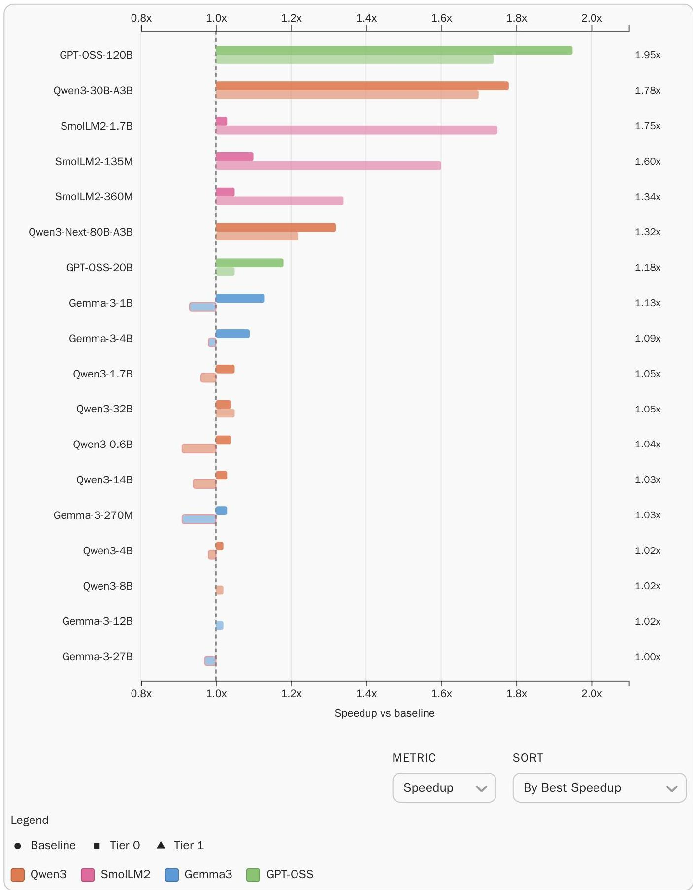
Figure 24: Throughput optimization across 18 models in two tiers. Tier 0 tunes serving parameters (tp, mns, mnbt). Tier 1 addsgpu-memory-utilization and speculative decoding. Shape encodes tier, color encodes model family.

The chart shows the gains, but what do they translate to in actual GPU time and cost?

---

WHAT THESE NUMBERS MEAN IN PRACTICE

Let's make this concrete with some back-of-the-envelope math. Each of our ablation experiments rephrases roughly 10 billion tokens. Consider gpt-oss-120b, a strong MoE model that balances quality and throughput well. With the baseline vLLM configuration (tp=1, 3,138 tps/gpu), a single 10B-token experiment takes 885 GPU-hours and costs roughly 2,656 USD at 3 USD/H100-hour. With the optimized configuration (tp=2, 6,117 tps/gpu), it drops to 454 GPU-hours and 1,362 USD. That's a saving of 431 GPU-hours and ~1,300 USD (49%) from nothing more than picking the right serving parameters. Over 90 experiments, that difference adds up to tens of thousands of GPU-hours and well over 100,000 USD.

These per-GPU numbers also answer a natural question: how many GPUs does it take to generate a billion tokens per hour? With the optimized configurations from our sweep:

- SmolLM2-135M (45,540 tps/gpu): 7 H100 GPUs (1 node)
- Qwen3-4B (8,086 tps/gpu): 35 H100 GPUs (~5 nodes)
- Qwen3-8B (6,443 tps/gpu): 44 H100 GPUs (~6 nodes)
- GPT-OSS-120B (6,117 tps/gpu): 46 H100 GPUs (~6 nodes)
- Gemma-3-27B (1,724 tps/gpu): 162 H100 GPUs (~20 nodes)

Notice that gpt-oss-120b matches Qwen3-8B in per-GPU throughput despite being a much larger model. Two things make this possible: only  $\sim 5\mathrm{B}$  of its 120B parameters are active per token (MoE), and the weights are MXFP4-quantized so the full model fits on a single 80GB GPU. That makes large MoE models the sweet spot for quality-per-GPU: a single 8-GPU node running gpt-oss-120b generates  $\sim 176$  million tokens per hour, and six nodes get you past the billion-token-per-hour mark. With the cost picture clear, let's distill the patterns across all 18 models.

# KEY FINDINGS

1. Tier 0 (parallelism/batching) delivers the biggest wins for large/MoE models. gpt-oss-120b gained 1.95x and Qwen3-30B-A3B gained 1.78x purely from finding the right tp and batch sizes.
2. Tier 1 (speculative decoding) delivers the biggest wins for small models. SmolLM2 models gained  $1.34 \times 1.75 \times$  from speculative decoding, with the best methods being suffix-32 (SmolLM2-1.7B-Instruct) and ngram-6 (SmolLM2-135M-Instruct, SmolLM2-360M-Instruct).
3. Tier 1 often hurts performance for models that are already well-tuned. For 8 out of 18 models, the tier 1 "best" was worse than the tier 0 best. This is because speculative decoding adds overhead that doesn't pay off when the model is already compute-saturated.

---

4. Many models are near-optimal with defaults. **gemma-3-27b-it**, **gemma-3-12b-it**, and **Qwen3-8B** saw essentially no improvement (0-2%), suggesting vLLM's defaults are well-chosen for these model sizes.

To understand why some models benefit more than others, let's briefly review the concepts of memory-bound vs compute-bound inference and speculative decoding.

Background: Memory-bound vs compute-bound inference

Background: Speculative Decoding

WHY DO SOME MODELS SEE LARGER IMPROVEMENTS?

Models with large speedups

gpt-oss-120b and Qwen3-30B-A3B (1.95x and 1.78x via tp=2). Both are MoE models that are severely memory-bound at tp=1. gpt-oss-120b (120B total, ~5B active) fits on a single GPU but leaves almost no room for the KV cache: server logs show only ~45,520 tokens of KV capacity at tp=1, enough for roughly 5 concurrent sequences at our 8,192-token context length. At tp=2 that jumps to ~810,000 tokens of KV capacity, enough for ~99 concurrent sequences. Moving to tp=2 halves per-GPU model memory and roughly doubles KV cache capacity, allowing the scheduler to batch far more sequences. The same pattern holds for Qwen3-30B-A3B (30B total, ~3B active). For these large MoE models, tp&gt;1 is critical not for compute parallelism but for KV cache headroom: the compute overhead of cross-GPU communication is minimal because only the active parameters participate in each forward pass.

SmolLM2 models (1.34x-1.75x via speculative decoding). These models are tiny enough that a single GPU has abundant memory. The bottleneck is the sequential nature of autoregressive decoding. Speculative decoding generates multiple tokens per verification step:

- SmolLM2-135M-Instruct with ngram-6: Server logs show 72-84% draft acceptance rate with mean acceptance length of 5.3-6.0 tokens. This means each verification step produces ~5-6 tokens instead of 1.
- SmolLM2-1.7B-Instruct with suffix-32: 48-53% acceptance rate with mean acceptance length of 2.5-3.1 tokens.

Interestingly, ngram works better for the 135M model but suffix wins for the 1.7B model. The 135M model produces more repetitive, template-like text that closely mirrors input phrasing, giving n-gram matching high acceptance rates (72-84%). The 1.7B model generates more diverse, paraphrased output where n-gram acceptance drops to 63-66%. Despite suffix-32 having a lower

---

per-token acceptance rate ( $\sim 48\%$ ), it speculates 32 tokens per step and verifies them in a single large batch, which is more GPU-efficient than n-gram's smaller 6-8 token batches. The net effect is that suffix-32 achieves  $\sim 9.2k$  tps vs ngram-6's  $\sim 8.3k$  tps for the 1.7B model.

Contrast with models where speculation hurts. The server logs reveal a stark difference in draft acceptance rates between models that benefit from speculation and those that don't (all using ngram-6):


<table><tr><td>Model</td><td>Avg Acceptance Rate</td><td>Mean Acceptance Length</td><td>Throughput Impact</td></tr><tr><td>SmolLM2-135M-Instruct</td><td>72-84%</td><td>5.3-6.0</td><td>+60%</td></tr><tr><td>SmolLM2-1.7B-Instruct</td><td>64-68%</td><td>4.9-5.1</td><td>+58% (ngram-6)</td></tr><tr><td>gemma-3-270m-it</td><td>63-83%</td><td>4.8-6.0</td><td>-2%</td></tr><tr><td>Qwen3-14B</td><td>23-50%</td><td>2.4-4.0</td><td>-16%</td></tr><tr><td>gemma-3-12b-it</td><td>20-24%</td><td>2.2-2.4</td><td>-8%</td></tr><tr><td>gemma-3-27b-it</td><td>19-26%</td><td>2.1-2.6</td><td>-11%</td></tr><tr><td>gpt-oss-120b</td><td>20-31%</td><td>2.2-2.9</td><td>-16%</td></tr></table>


The small SmolLM2 models achieve  $64 - 84\%$  acceptance rates with 5-6 tokens accepted per step, making speculation highly profitable. The medium/large models (Qwen3-14B, gemma-3-12b-it/27b-it, gpt-oss-120b) only achieve  $20 - 30\%$  acceptance with  $\sim 2.3$  tokens per step, barely better than no speculation. A likely explanation is that larger models generate more diverse, paraphrased text that diverges further from the input prompt, giving n-gram matching fewer opportunities for exact phrase reuse. At these low acceptance rates, the overhead of drafting and verifying rejected tokens outweighs the benefit.

The tutorial-rewriting task is particularly amenable to speculative decoding because the output frequently contains phrases from the input document, giving both ngram and suffix methods high acceptance rates. Tasks that preserve even more of the input text (such as summarization, text continuation, or guided rewriting where the model is explicitly asked to maintain the original author's voice) would likely see even larger speedups from speculative decoding, since draft acceptance rates would be higher. Not every model benefits, though.

Models with small or no speedups

gemma-3-27b-it (1.00x, baseline optimal). The baseline configuration (tp=2, mns=256, mnbt=8192) already achieves 97-98% KV cache utilization with sufficient concurrency. There is no memory bottleneck to relieve and no compute slack for speculation to exploit.

---

Notably, speculative decoding consistently fails or degrades performance across all Gemma 3 model sizes:

- gemma-3-1b-it: Crashes with all spec methods (server_fail). The root cause is a CUDA OOM during the rejection sampler warmup. vLLM's speculative decoding verification step calls logits.sort(dim=-1) over the full vocabulary during CUDA graph warmup. Gemma 3's large vocabulary (~258k tokens) requires ~12 GiB for this sort operation alone. Under the tier1-small config (mns=4096, mnbt=32768), speculative decoding also reduces available KV cache (18.8 GiB vs 31.3 GiB without spec), leaving only ~6.5 GiB free, far short of the 12 GiB needed. This is a vLLM-specific issue: the rejection sampler's full-vocabulary sort during warmup is a memory bottleneck for large-vocabulary models under high concurrency settings.
- gemma-3-270m-it: Spec decoding runs successfully but hurts throughput: ngram-6 and ngram-8 show ~2% regression, suffix-32 shows ~18% regression (from 21k to 17.8k tps).
- gemma-3-4b-it: 2% regression with spec decoding.
- gemma-3-27b-it: 3% regression with spec decoding.

gemma-3-12b-it, Qwen3-14B, Qwen3-8B (1.00x-1.03x). These 8B-14B dense models fit comfortably on 1-2 GPUs with enough KV cache for high concurrency (~98% utilization at baseline). They are neither memory-bound (so increasing tp doesn't help, it just adds cross-GPU communication overhead without freeing meaningful KV cache space) nor compute-bound enough for speculation to pay off (the overhead of disabling async scheduling and running verification passes outweighs the benefit of generating a few extra tokens per step). The vLLM defaults are essentially optimal for this size range on H100 GPUs. Stepping back, a few clean patterns emerge from the full sweep.

# Summary of patterns

- Increasing tp helps when the model is memory-bound (large MoE at  $tp = 1$ ). Doesn't help when the model already fits with good KV headroom.
- Increasing mns/mnbt helps when the KV cache has room for more sequences. Doesn't help when the KV cache is already saturated.
- Speculative decoding helps when the model is compute-bound (small models) AND the task has predictable outputs. Doesn't help when the model is memory-bound or task outputs are unpredictable.
- Increasing gmu helps when the KV cache is the bottleneck. Doesn't help when model weights already consume most memory.

The fundamental insight is that optimization gains depend on identifying the bottleneck: memory-bound models benefit from parallelism, compute-bound models benefit from speculation, and

---

well-balanced models have little room for improvement. All of this assumes you want maximum throughput from small-to-medium models, but what if you need a much larger model?

# SCALING TO LARGER MODELS

Everything above focuses on maximizing tokens per second per GPU, which is exactly what you want when generating trillions of tokens for pretraining data. But for post-training, the picture is different: you probably want bigger models to generate data for hard problems (reasoning, math, code), and you care less about total volume. Quality per token matters more than throughput.

For these use cases, DataTrove scales to models with hundreds of billions (or even a trillion) parameters via multi-node Slurm execution. Here's an example running Kimi-K2-Instruct (Moonshot AI, 2025) (1T total parameters, 32B active) on the s1K dataset (Muennighoff et al., 2025) to generate solutions to math and reasoning problems:

```txt
1 python examples/inference/benchmark/generate_data.py \
2 --input-dataset-name simplescaling/s1K-1.1 \
3 --input-dataset-split train \
4 --prompt-column question \
5 --model-name-or-path moonshotai/Kimi-K2-Instruct \
6 --model-max-context 32768 \
7 --trust-remote-code \
8 --output-dataset-name s1K-1.1-Kimi-K2-Instruct \
9 --tasks 1 \
10 --workers 1 \
11 --max-examples 100 \
12 --nodes-per-task 2 \
13 --tp 8 \
14 --pp 2 \
15 --optimization-level 0 \
16 --max-num-seqs 16
```

With a trillion-parameter model you won't be generating billions of tokens per hour, but you don't need to. A few thousand high-quality reasoning traces from a frontier model can be worth more than millions of tokens from a smaller one. To make these throughput numbers more tangible, let's visualize what they look like in practice.

# VISUALIZING THROUGHPUT

To get a feel for what these throughput numbers actually mean, pick two models and scale up the number of GPUs. Each page represents roughly 500 tokens of generated text. At high enough throughput, pages roll up into books (500 pages each), and books into shelves (500 books each).

---

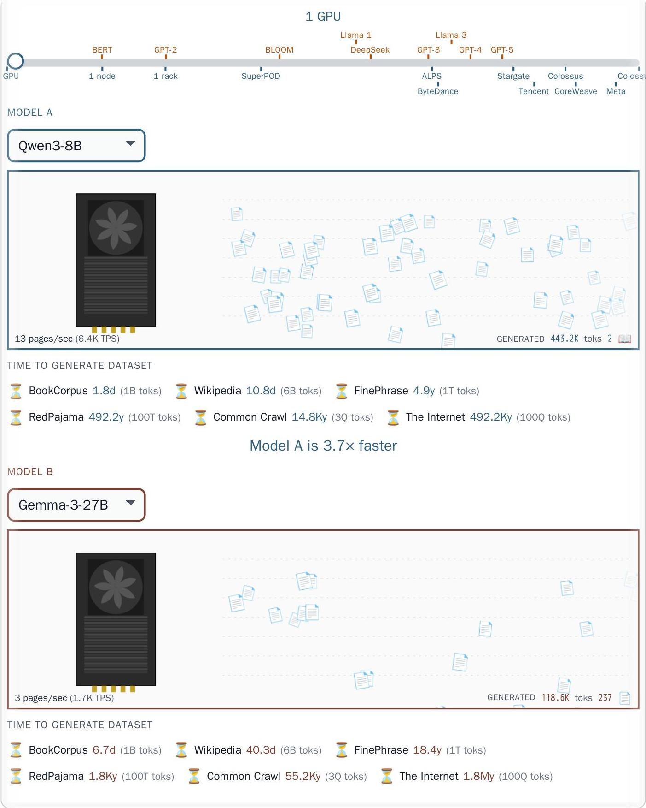
Figure 25: Side-by-side throughput comparison. Pick two models and adjust the GPU count to see the relative speedup. Scale mapping: 1 page = 500 toks, 1 book = 500 pages, 1 shelf = 500 books.

With all these infrastructure pieces in place, we have everything we need to build FinePhrase: the right prompts, the right model, and the machinery to run it all at scale.

---

Building FinePhrase

With the experiments done and the infrastructure battle-tested, it's time to put everything together. We take our findings and build FinePhrase, a large-scale synthetic dataset that rephrases 339 million documents from FineWeb-Edu (sample-350BT) into four structured formats, producing 1.35 billion samples and 486 billion completion tokens of synthetic pretraining data.

The recipe writes itself from the experiments: take the best model (SmolLM2-1.7B-Instruct), the best prompts (FAQ, Math, Table, Tutorial), the optimized inference settings from our throughput benchmarks, and the DataTrove infrastructure. Launch 100 parallel Slurm workers, each running on a single H100 GPU with suffix-32 speculative decoding. Let it run for about two weeks on spare compute on our cluster.

To get a sense of the scale: our infrastructure benchmarks showed that SmolLM2-1.7B-Instruct achieves  $\sim 9,200$  tokens per second per GPU with suffix-32 speculative decoding. With 100 GPUs running in parallel, that is  $\sim 920,000$  tokens per second, or about 3.3 billion tokens per hour. Rephrasing  $\sim 339$  million documents four times (once per prompt) at an average of  $\sim 359$  tokens per sample means roughly 486 billion tokens of total generation. At our throughput rate, that takes approximately 612 GPU-days, or about 6 wall-clock days with 100 GPUs (in practice closer to two weeks accounting for restarts, failed workers, and cluster contention).

# The Recipe

Every configuration choice traces directly back to a finding from our experiments or infrastructure benchmarks:

- Model: SmolLM2-1.7B-Instruct, which dominated all other model families across every prompt in our model family comparison
- Prompts: FAQ, Math, Table, and Tutorial, the four prompts that consistently beat DCLM in our experiments
- Source data: FineWeb-Edu sample-350BT, since our experiments showed that source quality is secondary when paired with a strong mix-in dataset
- Inference settings:  $\mathrm{tp} = 1$  with suffix-32 speculative decoding,  $\mathrm{mns} = 2048$ ,  $\mathrm{mnbt} = 16384$ ,  $\mathrm{gmu} = 0.90$ , all derived from the throughput benchmark that found a 1.75x speedup for SmolLM2-1.7B-Instruct with this configuration

The entire FinePhrase production run is defined in a single script that is intentionally thin. It declares the configuration and calls the generate_data script introduced in the Infrastructure section (the same script we used for all throughput benchmarking). Here is the core configuration:

---

1 KWARGS = {
2 "model_name_or_path": "HuggingFaceTB/SmolLM2-1.7B-Instruct",
3 "model_max_context": 8192,
4 "max_tokens": 2048,
5 "input_dataset_name": "HuggingFaceFW/fineweb-edu",
6 "input_dataset_config": "sample-350BT",
7 "output_dataset_name": "HuggingFaceFW/finephrase",
8 "max_num_seqs": 2048,
9 "max_num_batched_tokens": 16384,
10 "gpu_memory_utilization": 0.90,
11 "speculative_config": '{"method":"suffix","num_speculative_tokens":32}',
12 "enable_monitoring": True,
13 "examples_per_chunk": 100_000,
14 "workers": 100,
15 "tasks": 100,
16 }
17
18 PROMPT_TEMPLATES = {
19 "math": "Rewrite the document to create a mathematical word problem ...",
20 "table": "Rewrite the document as a structured table ...",
21 "faq": "Rewrite the document as a comprehensive FAQ ...",
22 "tutorial": "Rewrite the document as a clear, step-by-step tutorial ...",
23 }
24
25 for name, template in PROMPT_TEMPLATES.items():
26 generate_data_main(**KWARGS, name=f"finephrase_{name}", prompt_template=[name, template])

All the operational complexity lives in DataTrove itself: chunked processing with checkpoint-based resume, distributed Slurm execution, incremental Hub uploads, and automatic dataset card generation. The generate_data script wires these pieces together into a single CLI for synthetic data generation, which is why the FinePhrase production script is only less than 100 lines of code. Before any GPU time is spent, it runs pre-flight checks: check_hf_auth() verifies you have a write token, ensure_repo_exists() creates the output dataset repo, and validate_config() catches invalid parallelism settings and validates that prompt templates contain the [[DOCUMENT]] placeholder. It reads the model’s GenerationConfig from the Hub to inherit default sampling parameters rather than requiring you to hardcode them. The rollout function automatically truncates documents that exceed the context budget at newline boundaries, which is critical at 339 million documents where some will inevitably be too long.

On Slurm, a single generate_data call orchestrates three coordinated jobs: the inference job (100 parallel workers doing the actual generation), a monitor job (updating the dataset card with progress bars and ETAs), and a datacard job (generating final statistics after completion). The

---

monitor tracks the inference job ID and stops if inference fails. The datacard job uses Slurm's afterok dependency to run only on success. Once the jobs are running, the next challenge is keeping track of progress and getting results onto the Hub automatically.

# Automatic HF Upload and Progress Monitoring

We want you to be able to just press a button, let the GPUs go brrr, and check back in to the finished dataset. DataTrove continuously uploads data to your specified Hugging Face dataset repo whenever a chunk is finished, using ParquetWriter with hf:// paths so data appears on the Hub within minutes of generation, not after the full run completes. At the end, the InferenceDatasetCardGenerator pipeline step checks the logs directory, collects information about the throughput, and uploads a dataset card to document your new synthetic dataset. Here's an example of the auto-generated dataset card:

---

Figure 26: Example of an auto-generated dataset card with throughput metrics, uploaded to the Hugging Face Hub after inference completes.

For long-running inference jobs like FinePhrase (which runs for about two weeks), the

InferenceProgressMonitor runs as a separate Slurm job alongside the inference workers. It periodically scans the output directory, counts completed chunks across all 100 tasks, and updates the dataset card on the Hub with a progress bar and ETA for each prompt template. Here's the live progress dashboard during the FinePhrase generation run:

---

Figure 27: Live progress dashboard for FinePhrase, showing per-prompt completion status, document counts, and ETAs. The monitor runs as a separate Slurm job and updates the dataset card hourly.

Both the progress monitor and the dataset card generator are configured through an

InferenceDatasetCardParams object that captures the full run metadata. The generate_data script creates these pipelines automatically, but here is what happens under the hood:

---

```txt
1 params = InferenceDatasetCardParams( output_repo_id="HuggingFaceFW/finephrase", input_dataset_name="HuggingFaceFW/fineweb-edu", input_dataset_split="train", model_name="HuggingFaceTB/SmolLM2-1.7B-Instruct", # ... other params )
2
3
4 monitor_pipeline = [ InferenceProgressMonitor( params=params, update_interval=3600 )
5 ]
6
7
8
9 datacard_pipeline = [ InferenceDatasetCardGenerator(params=params)
17 ]
```

That's the happy path. But running 100 parallel workers for two weeks surfaced plenty of unhappy paths too.

# Improvements to DataTrove

Building FinePhrase wasn't just about running inference at scale. Processing 339 million documents across 100 parallel workers for two weeks stress-tests infrastructure in ways that small experiments never do. Every failure mode you can imagine showed up: documents that crash the model, workers racing to commit to the same repo, Slurm jobs dying on startup, and caches corrupting under contention. We merged over a dozen PRs to make this work. Here are the most impactful ones.

# GRACEFUL ERROR HANDLING FOR BAD DOCUMENTS

At 339 million documents, some will inevitably trigger errors: documents too long for the context window even after truncation, malformed content that produces invalid tokens, or edge cases in the tokenizer. Before PR #450, a single bad document would crash the entire worker, losing all progress for that task. The skip_bad_requests option lets the InferenceRunner catch provider-side BadRequestError exceptions, log the problematic document, and continue processing the rest of the chunk.

---

```txt
1 InferenceRunner(
2 rollout_fn=simple_rollout,
3 config=inference_config,
4 skip_bad_requests=True, # Log and skip instead of crashing
5 )
```

# FAST RESUME WITH CHECKPOINT-AWARE SKIPPING

The first version of `skip_bad_requests` had a subtle problem: skipped documents were not written to checkpoints. This meant chunks containing bad documents never reached completion, `last_chunk` never advanced, and every restart re-parsed the entire checkpoint history from scratch. For FinePhrase with 100,000 documents per chunk, this made restarts painfully slow (sometimes leading to multiple hours of wasted GPU time per worker). PR #464 fixes this by writing skipped documents to checkpoints with a special marker so they count toward chunk completion but are excluded from the final output. It also speeds up resume by sorting checkpoint files and skipping replay for chunks that are already complete.

# HARDENING HUB UPLOADS AGAINST TRANSIENT FAILURES

With 100 workers writing to the same Hugging Face Hub repository, transient failures aren't rare, they're guaranteed. We encountered three distinct failure modes and fixed each one:

- Commit races (PR #448): Two workers commit simultaneously and one gets 412 Precondition Failed with "A commit has happened since." The fix adds retry logic with exponential backoff to the DiskWriter, which all Hub-writing paths go through.
- Transient server errors (PR #463): 503 Service Unavailable and other transient API errors were not retried consistently. This PR normalizes retry logic across DiskWriter and HuggingFaceDatasetWriter so all transient errors are handled uniformly.
- LFS verification failures (PR #455): Large file uploads occasionally fail LFS verification on the server side. A one-line fix adds "lfs-verify" to the list of retryable error messages.

# ISOLATING THE XET Cache PER SLURM TASK

Hugging Face Hub uses Xet as a storage backend, and its local cache is not designed for concurrent access from 100 parallel processes. Shared cache access caused corruption and failures. PR #465 gives each Slurm task its own cache directory derived from the job, task, and process IDs:

---

```txt
1 export
HF_XET_CACHE="/tmp/hf_xet/${SLURM_JOB_ID}_{${SLURM_ARRAY_TASK_ID}_{${SLURM_PRO_CID}"
2 mkdir -p "$HF_XET_CACHE"
```

## MULTI-CONFIG DATASET SUPPORT

FinePhrase runs four prompt templates that produce four independent dataset configs (faq, math, table, tutorial). Without config-awareness, all four templates would fight over a single dataset card and progress counters would exceed 100%. PR #447 adds first-class config support: outputs go to config-specific folders (hf://datasets/HuggingFaceFW/finephrase/faq/, .../math/, etc.), the dataset card merges information from all configs, and the progress monitor tracks each config independently so you see four separate progress bars (as in the progress dashboard above).

## CONFIGURABLE SERVER STARTUP

vLLM server startup time varies wildly depending on model size, optimization level, and cluster load. With optimization_level=3 (the highest throughput setting), vLLM compiles CUDA graphs during startup, which can take several minutes. Fixed startup timeouts would kill healthy jobs that were simply slow to initialize. PR #451 makes all startup parameters configurable via InferenceConfig: timeout, max attempts, retry delay, and max retries.

## FIXING SLURM CPU BINDING

A one-liner, but without it nothing runs. Slurm's default CPU binding policy conflicts with how DataTrove launches vLLM servers, sometimes causing jobs to fail immediately with srun: error: CPU binding outside of job step allocation. PR #457 passes --cpu-bind=none to srun, disabling the restrictive binding policy.

```txt
1 SlurmPipelineExecutor(
2  srun_args={"cpu-bind": "none"},
3 ...
4)
```

With all these fixes in place, the pipeline ran to completion. So what does the resulting dataset actually look like?

## What's in the Dataset?

---

Browse some real examples from FinePhrase below. Each sample shows the original FineWeb-Edu source document alongside all four rephrased versions. Navigate through samples to see how the same web document becomes a FAQ, a math problem, a structured table, and a step-by-step tutorial:

---

617 / 1000

Random

# FINEWER-EDU

160 words · 1,001 chars

It can reach 19 cm long and has yellow spots on its back, though some specimens have no spots at all. Their primary habitat are deciduous forests with fish-free ponds or vernal pools for egg laying and larval development. They feed primarily on invertebrates like earthworms and slugs also they will eat almost any insect they can get. They are primarily subterranean, though can be found beneath surface debris on cool, damp days. The species was first described by George Shaw in 1802 in his General Zoology or Systematic Natural History. It is the State Amphibian of South Carolina.

The Spotted Salamander (Ambystoma maculatum) is a mole salamander common in the eastern United States and Canada.

No spotted salamander pets yet!

No spotted salamander pictures yet!

No spotted salamander videos yet!

No spotted salamander owners yet!

No spotted salamander blogs yet!

This article is licensed under the GNU Free Documentation License. It uses material from the Wikipedia article "Spotted Salamander".

ID: <urn:uuid:7cf72a92-45d5-481d-98f8-5bfdcfbaacf4>

Original Website: http://www.youpet.com/spotted-salamander/

CommonCrawl S3: s3://commoncrawl/crawl-data/CC-MAIN-2013-20/segments/1368705953421/warc/CC-MAIN-20130516120553-00013-ip-10-60-113-184.ec2.internal.warc.gz

# FAQ

342 words · 2,054 chars

Q: What is the Spotted Salamander?

A: The Spotted Salamander is a common salamander species in the eastern United States and Canada.

Q: What does the Spotted Salamander look like?

A: It has a distinctive yellow color on its back, though some specimens may have no spots. The species can reach up to 19 cm (7 inches) long.

Q: What is the Spotted Salamander's primary habitat?

A: Its primary habitat is deciduous forests with fish-free ponds or vernal pools for egg laying and larval development. They can also be found beneath surface debris on cool, damp days.

Q: What do Spotted Salamanders get?

# MATH

208 words · 1,175 chars

Problem:

A spotted salamander lives in certain areas and has yellow spots on its back. How many centimeters long can a spotted salamander be if it has several spots on it, but some specimens lack spots altogether?

Step-by-step calculation:</urn:uuid:7cf72a92-45d5-481d-98f8-5bfdcfbaacf4>

---

1. Convert centimeters to meters: Length in meters = 19 cm / 100 = 0.19 meters
2. Calculate the expected length: If all spotted salamanders had no spots, their length would be (19 centimeters - no spots) / 100 * 0.19 meters = 0.007 m
3. Calculate the expected length of spotted salamanders: If spotted salamanders had many spots, their length would be (19 centimeters + many spots) / 100 * 0.19 meters = 0.019 m


<table><tr><td>TABLE</td><td>97 words · 637 chars</td></tr><tr><td>Key Information</td><td></td></tr><tr><td>Species Name</td><td>Ambystoma maculatum</td></tr><tr><td>General Information</td><td>Type of Amphibian</td></tr><tr><td>Length</td><td>Variable (up to 19 cm)</td></tr><tr><td>Habitat</td><td>Deciduous forests with fish-free ponds or vernal pools</td></tr><tr><td>Diet</td><td>Invertebrates like earthworms and slugs; will eat almost any insect</td></tr><tr><td>TUTORIAL</td><td>262 words · 1,692 chars</td></tr><tr><td colspan="2">Tutorial: The Spotted Salamander (Ambystoma maculatum)</td></tr><tr><td colspan="2">I. Introduction
- A mole salamander commonly found in the eastern United States and Canada</td></tr><tr><td colspan="2">II. Physical Description
- 19 cm in length (typically)
- Yellow spots on its back
- Some specimens may lack spots
- Found in deciduous forests with fish-free ponds or vernal pools for egg laying and larval development
- Prefer subterranean habitats, though can be found beneath surface debris on cool, damp days</td></tr></table>


Figure 28: Browse real examples from the FinePhrase dataset. Each sample shows the original source document alongside all four rephrased versions (FAQ, Math, Table, Tutorial). Use the arrows or Random button to navigate between samples.

# How Does FinePhrase Compare?

In the introduction we showed a single FinePhrase prompt (table) against the baselines. Now that the full dataset is built, here's how all four FinePhrase prompts stack up against the strongest synthetic data baselines:

---

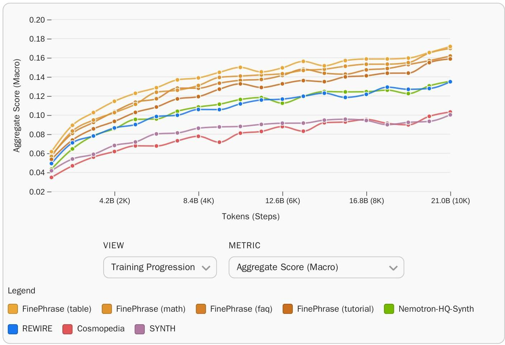
Figure 29: All four FinePhrase prompts compared against synthetic data baselines across evaluation metrics.

All four FinePhrase prompts outperform every synthetic baseline by a clear margin. Table and math lead the pack, with FAQ and tutorial close behind. The per-benchmark breakdown (switch with the dropdown above) tells a familiar story. FinePhrase prompts dominate on ARC, SQuAD, and DROP (knowledge and reading comprehension), while the baselines hold a slight edge on HellaSwag and PIQA (commonsense). This is the same commonsense-vs-knowledge trade-off we observed throughout the experiments, and it's exactly why FinePhrase is designed to be mixed with original data rather than used alone. The aggregate wins because the knowledge gains far outweigh the commonsense losses.

What makes this result especially compelling is the cost efficiency. Here is how FinePhrase compares to other synthetic data projects:

---


<table><tr><td>Dataset</td><td>Generator</td><td>Tokens</td><td>GPU Hours</td><td>Tokens/GPU-Hour</td></tr><tr><td>Cosmopedia</td><td>Mixtral 8x7B</td><td>25B</td><td>&gt;10K</td><td>&lt;2.5M</td></tr><tr><td>SYNTH</td><td>custom fine-tuned</td><td>80B</td><td>4K</td><td>20M</td></tr><tr><td>REWIRE</td><td>Llama-3.3 70B</td><td>400B</td><td>~352K</td><td>~1.1M</td></tr><tr><td>Nemotron-CC</td><td>Mistral NeMo 12B</td><td>1.9T</td><td>n/a</td><td>n/a</td></tr><tr><td>FinePhrase</td><td>SmolLM2-1.7B</td><td>486B</td><td>~14.7K</td><td>~33.1M</td></tr></table>


Figure 30: Compute cost comparison across synthetic data generation projects. All GPU hours are H100. REWIRE hours extrapolated from their reported 88K per 100B tokens. Nemotron-CC did not report generation cost.

FinePhrase achieves  $\sim 33\mathrm{M}$  tokens per GPU hour, roughly  $30\mathrm{x}$  more efficient than REWIRE and over  $13\mathrm{x}$  more than Cosmopedia. It generates more tokens than REWIRE while using  $24\mathrm{x}$  less compute, thanks to the combined payoff of a 1.7B model (vs 70B), optimized inference settings, and speculative decoding. The takeaway: you do not need large models for high-quality synthetic data generation.

That's the full picture: 90 experiments, a battle-tested infrastructure, and 486 billion tokens of public synthetic data. Let's wrap up with what we learned and where to go next.

# Conclusions

We ran 90 experiments, generated over 1 trillion tokens, and spent more than 111,000 GPU hours to figure out what actually matters for synthetic pretraining data. The answer is surprisingly simple: prompt design is the single biggest lever. Structured formats like Table, Math, FAQ, and Tutorial consistently beat both curated web baselines and prior synthetic methods, producing our best configuration, FinePhrase: 1.35 billion samples and 486 billion completion tokens generated from 339 million source documents. You don't need a large rephrasing model to get there: a 1B model is sufficient for most prompts, and even low-quality source data works fine when paired with a strong mix-in dataset. Template diversity matters more than template polish, and a messier model that produces varied outputs can outperform a polished one that repeats the same structure. SmolLM2-1.7B emerged as the best rephrasing model across all prompts, beating larger models from other families. There is no reliable proxy metric that can replace training and evaluating a model, so there is no shortcut around the full pipeline. We open-source all

---

infrastructure, prompts, and benchmarking code through DataTrove so you can build on these findings without reinventing the plumbing. That said, there's plenty left to explore.

# What's Next?

The biggest bottleneck to scaling synthetic data experiments is the compute cost of generation itself. Producing the 10B tokens with Gemma-3-1B-IT needed for a single ablation takes roughly 3,800 H100 GPU hours. Several avenues could bring this cost down significantly. Diffusion language models are promising: their parallel generation capabilities yield reported 2-10x inference speedups over autoregressive approaches. Models like LLaDA2.1-flash show that diffusion LMs can match autoregressive models on standard benchmarks while generating tokens in parallel, and SGLang already supports serving them, but broader ecosystem support (e.g., vLLM) is still missing. DFlash (Chen et al., 2026) could further speed up generation, though it is currently cumbersome to use and has limited model support. Mercury 2 (Labs, 2026) pushes this further, reaching over 1,000 tokens per second on NVIDIA Blackwell GPUs through parallel refinement rather than sequential decoding, with  $5x+$  speedups over autoregressive baselines. On the autoregressive side, speculative decoding support in vLLM remains limited (e.g., draft models are not well supported), leaving significant inference speedups on the table.

Beyond faster generation, we answered several questions about best practices but many remain wide open:

- Data repetition: Can you repeat data more often without performance loss if the repetitions are rephrased?
- Mixing ratio: We mixed unrephrased source data with synthetic data at equal proportions. Kang et al. (2025) found  $\sim 30\%$  rephrased synthetic to be optimal for their setup, but this likely depends on model size, data budget, and synthetic data type. How little synthetic data can you get away with:  $50\%$ ,  $20\%$ ,  $5\%$ ? What are the best data mixes for pretraining at scale?
- Generation parameters: What influence do temperature, top_p, and other sampling settings have on rephrasing quality?
- Context extension: Does chunked rollouts context extension during mid-training improve downstream performance?
- Best-of-N filtering: Can we generate multiple rollouts per example and score them to keep only the best one?
- Scaling to larger models: REWIRE (Nguyen et al., 2025) reports larger gains for bigger models trained on their data. Can we reproduce this?

---

Automatic prompt optimization: Does prompt optimization with tools like DSPy (Khattab et al., 2024) improve rephrasing performance?
- Longer pretraining: Our ablations trained for 21B tokens. Do the same findings hold at 100B+ token scales, and do prompt rankings shift with longer training?
- Source filtering: Should we filter documents before or after rephrasing? For instance, applying a math prompt to non-mathematical documents likely wastes compute and adds noise.
- Larger ablations and mixtures: We want to run more extensive mixture experiments, exploring how synthetic data interacts with source data at scale, in line with the recent smol-data effort.

The playbook is open. Build on it.