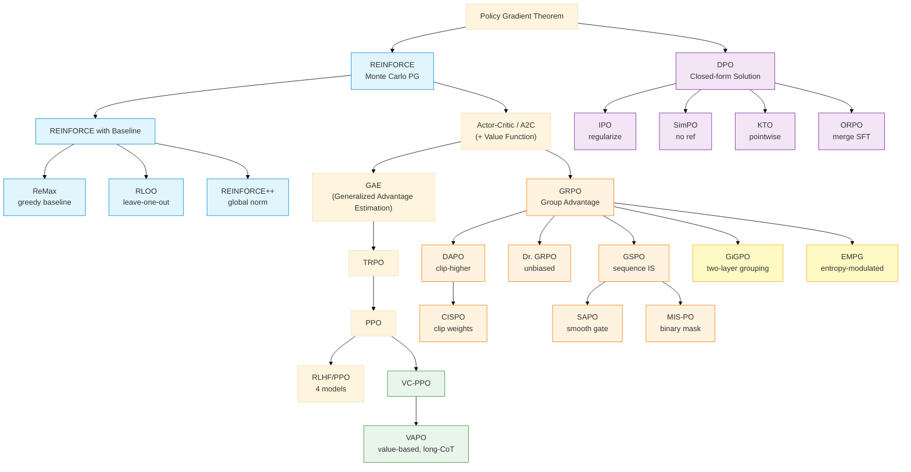

# LLM RL Algorithm Evolution

LLM 对齐本质上是一个分布迁移问题：把模型的输出分布从"能说话"调到"说好话"。这条路上的每一步算法创新，都在回答同一个问题的不同侧面——用什么信号优化？怎么高效优化？如何稳定地优化？

贯穿全文的核心公式：

$$\max_\pi \mathbb{E}_{y \sim \pi}[R(y)] - \beta \text{KL}(\pi \| \pi_\text{ref})$$

所有算法都是这个目标的不同求解方式。第一项追求高奖励，第二项防止模型跑偏。接下来的七幕叙事，就是围绕"怎么求解这个目标"展开的。

---

## 第一幕：为什么 LLM 需要 RL？

[[SFT]] 的本质是模仿学习——给模型看"好回答"，让它学着说。这有一个天花板：模型最多只能逼近标注者的水平，无法超越。更根本的问题是，SFT 只教模型"什么是好的"，不教它"什么是坏的"。模型学到的是 $P(\text{token} | \text{context})$ 的条件分布，但从未学过如何评判一个完整回答的质量。

RL 改变了学习范式：不再模仿固定答案，而是让模型自己生成回答，然后根据反馈调整策略。这意味着模型可以探索标注数据之外的空间，发现更好的回答方式。

> [!intuition] 从"抄作业"到"做题+批改"
> SFT 像抄学霸的作业——你能写出一样的答案，但不理解为什么。RL 像自己做题然后看批改——你可能一开始做得差，但逐渐理解什么是好的解题思路，甚至找到学霸没想到的方法。

这就引出了核心优化目标。$R(y)$ 是奖励信号（来自人类偏好或规则验证），$\text{KL}(\pi \| \pi_\text{ref})$ 约束模型不要偏离 SFT 后的初始策略太远。没有 KL 约束，模型会 reward hack——找到奖励函数的漏洞而非真正变好。

接下来的问题是：怎么优化这个目标？这需要回到策略优化的基础。

---

## 第二幕：策略优化基础脉络

> 这一幕快速串联经典 RL 的演进脉络。每个算法的细节在各自笔记中，这里只讲"为什么需要下一个"。

### 从 REINFORCE 到 PPO：四步演进

**起点：[[Policy Gradient]] 定理**告诉我们，策略的梯度可以用采样估计：

$$\nabla_\theta J(\theta) = \mathbb{E}_{\tau \sim \pi_\theta} \left[ \sum_t \nabla_\theta \log \pi_\theta(a_t|s_t) \cdot R(\tau) \right]$$

直觉：好轨迹的动作概率增加，坏轨迹的动作概率减少。

**第一步：[[REINFORCE]]** 直接用 Monte Carlo 采样估计这个梯度。问题是方差爆炸——一条轨迹的奖励波动太大，梯度信号噪声极高。

**第二步：引入 Baseline**。减去一个与动作无关的基线 $b$，梯度变为 $\nabla \log \pi \cdot (R - b)$。这不改变梯度期望，但大幅降低方差。最自然的 baseline 是 value function $V(s)$，由此引出 [[A2C|Actor-Critic]] 架构——Actor 负责决策，Critic 负责评估。

**第三步：[[GAE]]（Generalized Advantage Estimation）** 解决了 Advantage 估计中 bias 和 variance 的权衡。通过 $\lambda$ 参数在 TD 残差（低方差高偏差）和 Monte Carlo（高方差低偏差）之间插值：

$$\hat{A}_t^{\text{GAE}} = \sum_{l=0}^{\infty} (\gamma \lambda)^l \delta_{t+l}, \quad \delta_t = r_t + \gamma V(s_{t+1}) - V(s_t)$$

**第四步：信任域**。即使有了好的 Advantage 估计，策略更新幅度过大仍会导致崩溃。[[TRPO]] 用 KL 散度约束更新步长，但需要二阶优化，计算昂贵。[[PPO]] 用 clip 机制近似信任域，简单高效：

$$L^{\text{clip}} = \mathbb{E}_t \left[ \min \left( r_t(\theta) \hat{A}_t, \; \text{clip}(r_t(\theta), 1-\epsilon, 1+\epsilon) \hat{A}_t \right) \right]$$

其中 $r_t(\theta) = \frac{\pi_\theta(a_t|s_t)}{\pi_{\theta_\text{old}}(a_t|s_t)}$ 是[[Importance Sampling|重要性采样]]比率。

> [!warning] Token-level vs Sequence-level：一个贯穿全文的区别
> 在经典 RL 中，"动作"的定义很明确。但在 LLM 中，"动作"可以是一个 token，也可以是整个序列。这个选择深刻影响算法设计：
>
> - **Token-level**：每个 token 是一个动作，前缀是状态。对应 MDP 设定，$L(\theta)$ 是 $J(\theta)$ 的下界，保证单调改进。
> - **Sequence-level**：整个回答是一个动作，prompt 是状态。对应 contextual bandit 设定，$L(\theta)$ 和 $J(\theta)$ 的梯度等价。
>
> 两者没有绝对的对错——token-level 更精细但需要 credit assignment，sequence-level 更简单但信号更粗。这个区别在后面 [[GRPO]] 系列会反复出现。
>
> 详见 [[Clippings/Article/Policy Gradient, Sequence, and Token— Part I Basic Concepts|Policy Gradient Part I: Token vs Sequence]]。

到这里，我们有了一套完整的策略优化工具箱。下一步是把它应用到 LLM 对齐上。

---

## 第三幕：RLHF——第一个完整方案

[[InstructGPT]] 给出了第一个端到端的 LLM 对齐方案，分三个阶段：

1. **SFT**：用高质量指令数据微调，让模型学会遵循指令
2. **Reward Model 训练**：用 [[Bradley-Terry Model]] 将人类偏好转化为标量奖励
3. **PPO 优化**：用 RL 最大化奖励，同时用 KL 约束防止偏离

### 四个模型的显存压力

RLHF 的 PPO 阶段需要同时维护四个模型：

| 模型 | 角色 | 是否更新 |
|------|------|----------|
| Policy（Actor） | 生成回答 | 是 |
| Reference | 计算 KL 惩罚 | 否（冻结） |
| Reward Model | 打分 | 否（冻结） |
| Critic（Value） | 估计 Advantage | 是 |

对于一个 7B 模型，这意味着 ~28B 参数的显存占用。这是 RLHF 最大的工程痛点。

### 误区纠偏

> [!warning] 三个常见的思维误区
>
> **误区一：RLHF = PPO**
> RLHF 是框架，PPO 只是优化器之一。准确地说：RLHF = LLM + 任意 RL 算法 + 数据打分工具。Critic 是 PPO（Actor-Critic）需要的，不是 RLHF 需要的；Reference model 是 RLHF 提出的，和 PPO 无关。
>
> **误区二：去掉 Critic 是"进步"**
> RL 的发展史上，先有 REINFORCE（无 Critic），因为方差太大才引入 Critic 得到 Actor-Critic/PPO。[[GRPO]]、[[RLOO]] 去掉 Critic 是回到 REINFORCE 的思路，用其他方式降低方差——这是取舍，不是单纯的进步。
>
> **误区三：经典 RL 的 trick 在 RLHF 中都需要**
> 经典 RL 的很多技巧是围绕"训练数据难生产"提出的。但 LLM 生成回答很快（尤其有 vLLM 加速），完全可以让 rollout/train batch 比值很小（N=1~4），每条数据只用一次，不需要过度依赖[[Importance Sampling|重要性采样]]。
>
> 参考 [[Clippings/Article/RLHF 常见的思维误区|RLHF 常见的思维误区]]。

### RLHF 的痛点：后续所有创新的起点

RLHF 虽然有效，但暴露了两个根本性问题，催生了两条截然不同的演进路线：

**问题一：流程太重。** 4 个模型的显存压力、RM 的 [[Reward Hacking]] 风险、PPO 训练的不稳定性——能不能从根本上简化？

→ **第四幕：Direct Alignment**——绕过 RM，直接从偏好数据学习

**问题二：信号太粗。** Sequence-level 的标量奖励无法精确指导每个 token 的生成，[[Credit Assignment]] 困难——当任务需要长链推理时，这个问题尤为致命。

→ **第五幕：Online RL 回归**——回到 RL 框架，但用更高效的方式（去掉 Critic 或改进 Critic）

---

## 第四幕：Direct Alignment——绕过 RM 的捷径

### DPO 的核心洞察

[[DPO]] 的出发点很简单：既然 RLHF 的目标有闭式解，为什么还要用 RL 去近似？

从 RLHF 目标出发，最优策略有解析解：

$$\pi^*(y|x) = \frac{1}{Z(x)} \pi_\text{ref}(y|x) \exp\left(\frac{1}{\beta} r(y|x)\right)$$

反解奖励函数：

$$r(y|x) = \beta \log \frac{\pi^*(y|x)}{\pi_\text{ref}(y|x)} + \beta \log Z(x)$$

代入 [[Bradley-Terry Model]] 的偏好概率，$Z(x)$ 消掉，得到 DPO loss：

$$\mathcal{L}_\text{DPO} = -\mathbb{E}_{(x, y_w, y_l)} \left[ \log \sigma \left( \beta \log \frac{\pi_\theta(y_w|x)}{\pi_\text{ref}(y_w|x)} - \beta \log \frac{\pi_\theta(y_l|x)}{\pi_\text{ref}(y_l|x)} \right) \right]$$

> [!intuition] DPO 在做什么？
> 不训练 RM，不跑 RL，直接用偏好数据做监督学习。模型同时扮演"策略"和"隐式奖励函数"两个角色——policy ratio 本身就编码了奖励信息。
>
> 推导细节见 [[Clippings/Article/DPO 是如何简化 RLHF 的|DPO 是如何简化 RLHF 的]]。

### 变体谱系

DPO 开创了 Direct Alignment 路线，后续变体各自解决不同痛点：

| 方法 | 核心改进 | 去掉了什么 |
|------|----------|------------|
| [[DPO]] | 闭式解绕过 RM | RM + RL |
| [[IPO]] | Identity mapping 正则化 | 过拟合风险 |
| [[SimPO]] | Length-normalized reward | Reference model |
| [[KTO]] | 基于前景理论的 pointwise loss | Pairwise 数据需求 |
| [[ORPO]] | Odds ratio 合并 SFT | SFT 阶段 + Reference model |

### 关键转折：DPO 的根本局限

> [!warning] 这是全文最关键的转折点

DPO 看起来很美，但有两个根本问题：

**问题一：evaluate 能力 $\neq$ generate 能力**。DPO 本质上是在训练模型的评判能力（像 Reward Model 一样区分好坏），但我们的目标是提升生成能力。美食家不一定做得一手好饭。实践中，DPO 训练经常出现 chosen 和 rejected 的 loss 同时上升的现象——模型学会了"谁更好"，但两个都变差了。

**问题二：Offline 数据的根本局限**。DPO 用固定的偏好数据集训练，模型无法探索数据分布之外的空间。RLHF 中 PPO 做的事情恰恰是 DPO 缺失的——让模型自己生成，通过 online 采样将 evaluate 能力转化为 generate 能力。缺少这个 generate 过程，就缺少了 online 和 explore。

> DPO 对标的从来都不是 PPO，而是 Reward Model。二者不仅训练数据一样，loss 函数本质上也一致。那么 PPO 所做的一切操作，便是 DPO 效果不如 RLHF 的原因。
>
> —— [[Clippings/Article/dpo 的局限性|DPO 的局限性]]

当任务需要探索（如数学推理、代码生成），offline 方法走不通。这把我们推回了 online RL 的道路——但这次，我们带着 DPO 时代积累的简化思路回来了。
---

## 第五幕：Online RL 回归——Reasoning Model 时代

DPO 的局限把我们推回了 online RL。但这次回归不是简单地回到 PPO——reasoning model（数学推理、代码生成）对 RL 提出了新要求：奖励信号可以用 verifier 自动验证（不需要 RM），但序列极长（long-CoT 动辄数千 token），训练规模空前。

这催生了三条并行的技术路线。

### 支线 A：去掉 Critic——GRPO 家族

#### GRPO：用群体智慧替代 Value Function

[[GRPO]] 的核心洞察：既然 Critic 又贵又难训，能不能用同一个 prompt 的多个采样互相比较来估计 Advantage？

对每个 prompt $x$，采样 $G$ 个回答 $\{y_i\}_{i=1}^G$，用组内归一化计算 Advantage：

$$\hat{A}_i = \frac{r_i - \text{mean}(\{r_j\})}{\text{std}(\{r_j\})}$$

这个 group relative advantage 完全替代了 Value Function，省掉了 Critic 模型的显存和训练开销。GRPO 的目标函数沿用 PPO 的 clip 机制，但在 token level 上操作：

$$J_{\text{GRPO}} = \mathbb{E} \left[ \frac{1}{G} \sum_{i=1}^G \frac{1}{|y_i|} \sum_{t=1}^{|y_i|} \min \left( r_{i,t}(\theta) \hat{A}_i, \; \text{clip}(r_{i,t}(\theta), 1\!-\!\varepsilon, 1\!+\!\varepsilon) \hat{A}_i \right) \right]$$

注意一个微妙之处：$\hat{A}_i$ 是 sequence-level 的（整个回答共享同一个 Advantage），但 clip 操作在 token-level 上执行。这种混合在大规模训练中暴露了一系列问题。

#### 大规模训练暴露的问题 → 改进族

GRPO 在 DeepSeek-R1 等大规模训练中取得了突破性成果，但也暴露了系统性问题。以下每个改进都针对一个具体痛点：

**[[DAPO]]：解决 Entropy Collapse**

痛点：训练过程中策略熵急剧下降，模型丧失探索能力，输出趋于单一。根本原因是 clip 机制对高熵 token（低概率的"分叉 token"）不公平——当 $\pi_{\theta_\text{old}} = 0.01$ 时，$\varepsilon = 0.2$ 只允许概率增加 $0.012$，几乎无法更新。

方案：
- **Clip-Higher**：解耦上下界为 $\varepsilon_\text{low}$ 和 $\varepsilon_\text{high}$，放宽高熵 token 的更新上限
- **Dynamic Sampling**：过滤全对/全错的 prompt（它们不提供有效梯度信号）

**[[Dr. GRPO]]：修正两个优化偏差**

痛点一：GRPO 按 $1/|y_i|$ 做长度归一化，导致错误但较长的回答获得更多梯度——模型学会"说废话拖长度"。
痛点二：标准差归一化 $\text{std}(\{r_j\})$ 使不同 prompt 的梯度量级不一致，简单题的梯度被放大。

方案：移除长度归一化和标准差归一化，回到无偏的 REINFORCE 梯度估计。看似简单，但需要配合 global batch normalization 等稳定化技巧。

**[[GSPO]]：从 Token-level 回到 Sequence-level**

痛点：GRPO 在 token level 做 importance sampling（IS），但 Advantage 是 sequence level 的。这种不一致在大规模 MoE 模型上导致严重的训练不稳定——token-level IS ratio 的乘积可以指数级偏离 1。

方案：用序列级 IS ratio $\frac{\pi_\theta(y|x)}{\pi_{\theta_\text{old}}(y|x)}$ 替代 token 级，从根本上消除不一致。这呼应了第二幕中 token vs sequence 的讨论——在 LLM 的 contextual bandit 设定下，sequence-level 才是理论上自洽的选择。

**[[CISPO]]：保留所有 Token 的梯度贡献**

痛点：PPO/GRPO 的 clip 操作在触发时梯度为零——被 clip 的 token 完全不贡献学习信号。对于低概率但重要的 token（如推理中的关键转折词），这意味着它们几乎无法被强化。

方案：不 clip token updates，而是 clip importance sampling weights。将 IS ratio 作为 Advantage 的权重，用 stop-gradient 保留所有 token 的梯度：

$$J_{\text{CISPO}} = \mathbb{E} \left[ \text{sg}(\hat{r}_{i,t}) \cdot A_{i,t} \right]$$

**[[SAPO]]：用平滑门替代硬裁剪**

痛点：clip 操作是不连续的——ratio 在边界处梯度突变，导致优化景观不平滑。

方案：用温度控制的 sigmoid 门函数替代硬 clip，实现平滑过渡。非对称温度设计让正向更新（强化好回答）和负向更新（抑制坏回答）有不同的灵敏度。

**[[MIS-PO]]：二元掩码过滤 Off-Policy 样本**

痛点：大规模异步训练中，rollout 和 training 之间的策略差距导致严重的 off-policy 问题，IS 的连续权重引入高方差。

方案：用 Metropolis independence sampling 的接受-拒绝机制，将 IS 权重简化为二元掩码（0 或 1）。要么完全接受一个样本，要么完全丢弃，避免了连续权重的方差问题。

> [!comparison] GRPO 改进族的统一视角
> 这些改进看似各不相同，但都在回答同一个问题：**如何在去掉 Critic 后，仍然稳定地训练？**
>
> | 维度 | 问题 | 解决方案 |
> |------|------|----------|
> | Clip 机制 | 对高熵 token 不公平 | DAPO（解耦上下界）、CISPO（clip 权重而非更新）、SAPO（平滑门） |
> | IS 粒度 | Token vs Sequence 不一致 | GSPO（序列级 IS） |
> | 归一化 | 长度偏差 + 标准差偏差 | Dr. GRPO（移除两种归一化） |
> | Off-policy | 异步训练的分布偏移 | MIS-PO（二元掩码） |

### 支线 B：Critic-free 独立变体

GRPO 不是唯一的 critic-free 方案。另外三个算法从不同角度解决 REINFORCE 的高方差问题：

**[[ReMax]]：用 Greedy Decoding 作 Baseline**

核心洞察：RLHF 有三个经典 RL 没有的特殊性质——确定性转移、轨迹级奖励、快速模拟。ReMax 利用第三点：跑一次 greedy decoding（无采样），用其 reward 作为 baseline。只需一次额外前向传播，不需要训练任何额外模型。

**[[RLOO]]：Leave-One-Out 均值作 Baseline**

对每个回答 $y_i$，用其余 $G-1$ 个回答的平均奖励作为 baseline：$b_i = \frac{1}{G-1} \sum_{j \neq i} r_j$。这是一个无偏的 baseline 估计，且不需要任何额外模型。与 GRPO 的区别在于不做标准差归一化。

**[[REINFORCE++]]：Global Batch Normalization**

用整个 batch（而非单个 prompt 的 group）的统计量做归一化。解决了 GRPO 和 RLOO 在 group 内样本太少时 advantage 估计不稳定的问题。

> [!intuition] 三种 Baseline 策略的本质
> - **ReMax**：用"最佳确定性策略"作参照（greedy baseline）
> - **RLOO**：用"同伴的平均水平"作参照（leave-one-out baseline）
> - **REINFORCE++**：用"全局平均水平"作参照（global baseline）
> - **GRPO**：用"同组的相对排名"作参照（group normalization）
>
> 都是 REINFORCE + 更好的 baseline，只是 baseline 的来源不同。

### 支线 C：Value Model 回归

去掉 Critic 在短序列任务上效果很好，但 long-CoT（长链推理）暴露了一个根本问题：**credit assignment**。

当一个数学推理过程有 2000 个 token，最终答案错了，哪些 token 该"负责"？Sequence-level reward 只告诉你"整体错了"，无法区分"前 1500 token 的推理是对的，最后一步算错了"和"第一步方向就错了"。GRPO 给所有 token 分配相同的 Advantage，这在长序列上信号极其稀疏。

**[[VC-PPO]]：修复 PPO 在 Long-CoT 上的崩溃**

直接把 PPO 用在 long-CoT 上会崩溃——Critic 从随机初始化开始，在长序列上的 value 估计极不准确，导致 Advantage 信号全是噪声。VC-PPO 提出两个修复：
- **Value Pretraining**：先用 Monte Carlo return 预训练 Critic，让它在 RL 开始前就有合理的 value 估计
- **Decoupled GAE**：将 GAE 的计算与 Critic 的训练解耦，避免 Critic 的训练误差污染 Advantage 估计

**[[VAPO (2025)|VAPO]]：Value-Model-Based 的完整方案**

在 VC-PPO 基础上，VAPO 进一步引入 Length-Adaptive GAE——根据序列长度动态调整 $\lambda$ 参数，让短序列用更低的 $\lambda$（偏向 TD，低方差），长序列用更高的 $\lambda$（偏向 MC，低偏差）。在 AIME 2024 上，VAPO 以 60.4 分大幅超越 DAPO（50.0）和 DeepSeek-R1-Zero（47.0）。

> [!comparison] Value-free vs Value-based 的取舍
>
> | 维度 | Value-free（GRPO 系列） | Value-based（VAPO 系列） |
> |------|------------------------|------------------------|
> | 显存 | 省一个 Critic 模型 | 需要额外 Critic |
> | Credit Assignment | 粗粒度（sequence-level） | 细粒度（token-level） |
> | 短序列任务 | 足够好 | 过度设计 |
> | Long-CoT 任务 | 信号稀疏，效果受限 | 显著优势 |
> | 工程复杂度 | 低 | 高（需要 value pretraining） |
>
> 结论：不是谁更好，而是任务决定选择。对齐任务（回答通常 <500 token）用 GRPO 足够；长链推理任务（>2000 token）需要 VAPO。

### 支线 D：Agentic RL 的特殊挑战

前面讨论的算法主要针对单轮生成任务（数学推理、代码生成）。但当 LLM 作为 **agent** 与环境交互时（如 WebShop、ALFWorld），出现了新的挑战维度：**multi-turn credit assignment**。

一个 agent 任务可能包含 50 步交互，每步都是一个"观察 → 推理 → 行动"的循环，最终只有一个稀疏的 outcome reward。这比 long-CoT 更难——不仅序列长，而且每步的状态都在变化。

**[[GiGPO]]：两层分组结构**

GiGPO 的核心洞察：在相同任务下，多条轨迹会**自然地重复访问相同的环境状态**（如重复访问的网页、房间）。这些重复状态提供了"免费的" step-level groups——不需要额外 rollout，只需 retroactively 识别和分组。

两层 advantage 设计：
- **Episode-level**：整条轨迹的相对质量（与 GRPO 相同）
- **Step-level**：在相同状态下，不同动作的相对质量（通过 anchor state grouping 构建）

$$
A(a_t^{(i)}) = A^E(\tau_i) + \omega \cdot A^S(a_t^{(i)})
$$

关键优势：零额外 rollout 成本（< 0.002%），critic-free，在 ALFWorld 和 WebShop 上比 GRPO 提升 9-12%。

**[[EMPG]]：Entropy-Modulated Policy Gradients**

EMPG 从另一个角度解决 agent 的 credit assignment 问题：**利用 entropy 作为不确定性信号**，动态调制每步的学习信号。

核心机制：
1. **Self-Calibrating Gradient Scaling**：confident steps（低 entropy）放大更新，uncertain steps（高 entropy）衰减更新
2. **Future Clarity Bonus**：鼓励选择能导致更可预测下一步的 action（内在探索信号）

$$
A_{\text{mod}}(i,t) = A^{(i)} \cdot g(H_t^{(i)}) + \zeta \cdot f(H_{t+1}^{(i)})
$$

理论基础：policy gradient 的幅度与 entropy 天然耦合（Proposition 1），需要显式重新校准。

> [!comparison] GiGPO vs EMPG：互补的解决方案
>
> | 维度 | GiGPO | EMPG |
> |------|-------|------|
> | 核心思路 | 利用重复状态构建 step-level groups | 利用 entropy 调制梯度幅度 |
> | 信号来源 | 外部（环境状态匹配） | 内在（policy 不确定性） |
> | 依赖条件 | 需要重复状态 | 无特殊要求 |
> | 计算成本 | 极低（hashmap grouping） | 低（entropy 计算） |
> | 适用场景 | 状态空间有限的 agent 任务 | 通用 long-horizon 任务 |
>
> 两者可以组合使用——GiGPO 提供 step-level advantage，EMPG 调制学习信号的幅度。

---

## 第六幕：大规模训练的三大挑战

算法设计只是故事的一半。当 RL 训练扩展到千亿参数、万卡集群时，三个系统性挑战浮出水面。

### 挑战一：Entropy Collapse

[[Entropy Collapse]] 是 RL 训练中最普遍的失败模式：策略熵急剧下降，模型输出趋于确定性，丧失探索能力。

关键洞察来自对 token 熵分布的分析：绝大多数 token 的熵本来就很低（"结构完成者"，如填充推理步骤的细节），只有少数 token 具有高熵（"分叉 token"，如 `wait`、`however` 等逻辑连接词和假设引入词）。这些 forking tokens 决定了推理的方向——它们是模型"思考"的关键节点。

Entropy collapse 的本质是：clip 机制系统性地压制了这些高熵 forking tokens 的更新（如第五幕所述），导致模型逐渐丧失在关键节点做出不同选择的能力。

各算法的应对策略形成了一个谱系：DAPO 放宽高熵 token 的 clip 上界 → CISPO 用 stop-gradient 保留所有 token 的梯度 → SAPO 用平滑门替代硬 clip → 更激进的方案直接给 forking tokens 加 advantage bonus。

详见 [[Entropy Collapse]] 和 [[Clippings/Article/Entropy Collapse and Mitigation Strategies|Entropy Collapse and Mitigation Strategies]]。

### 挑战二：Reward Hacking

[[Reward Hacking]] 是 RM 的阿喀琉斯之踵：模型找到 RM 的盲点，生成高分但低质量的输出。典型表现包括过度冗长、重复特定模式、利用格式漏洞等。

KL 约束（核心公式中的第二项）是第一道防线，但不够。更根本的解决方向是：
- 用 verifiable reward（规则验证器）替代 learned reward（RM），这也是 reasoning model 时代 RL 能大规模成功的关键原因之一
- 多个 RM 集成，降低单个 RM 被利用的风险
- 定期用人类评估校准 RM

### 挑战三：Training-Inference Mismatch

[[Training-Inference Mismatch]] 是大规模 RL 训练中最隐蔽的问题。它有两个层面：

**理论层面：Learner-Sampler Mismatch**

现代 RL 框架用高度优化的推理引擎（vLLM、SGLang）做 rollout，用训练后端（FSDP、Megatron）做梯度更新。即使加载相同的权重 $\theta$，两个引擎计算的 token 概率可以显著不同——甚至出现 $\pi_\text{vllm}(a) = 1$ 而 $\pi_\text{fsdp}(a) = 0$ 的极端情况。

这破坏了 on-policy 假设，让训练悄悄变成了 off-policy。根源在于混合精度训练中 BF16 截断误差的累积，以及不同后端的数值实现差异。

**工程层面：异步训练的分布退化**

大规模训练中，rollout 和 training 是流水线化的。当 training 更新了策略后，之前 rollout 生成的数据就变成了 off-policy 的。并行度越高、序列越长，这个 gap 越大。

**解决方案**：

- **TIS（Truncated Importance Sampling）**：用截断的重要性比率 $\min\left(\frac{\pi_\text{learner}}{\pi_\text{sampler}}, C\right)$ 修正分布偏移，简单有效
- **[[GSPO]]**：序列级 IS 天然减少了 token 级累积误差
- **[[MIS-PO]]**：二元掩码直接丢弃偏移过大的样本

详见 [[Clippings/Article/Policy Gradient, Sequence, and Token— Part II Learner-Sampler Mismatch|Learner-Sampler Mismatch 理论分析]] 和 [[Clippings/Article/Your Efficient RL Framework Secretly Brings You Off-Policy RL Training|Off-Policy RL Training 工程分析]]。

### 挑战四：RL 缩放的可预测性

当 RL 训练规模扩展到 10 万 GPU 小时级别时，一个根本性问题浮现：**如何在不跑满全部计算预算的情况下，预测算法的最终性能？**

这不仅是成本问题——如果每个算法改进都需要跑满 10 万 GPU 小时才能验证，研究迭代速度会慢到无法接受。更关键的是，小规模表现好的方法在大规模可能更差（第五幕的"苦涩教训"），我们需要一个框架来识别真正可扩展的方法。

**[[The Art of Scaling RL Compute for LLMs (2025)|ScaleRL 论文]]的核心贡献**：建立 RL 的 Scaling Laws

通过 40 万 GPU 小时的系统研究，Meta 团队提出用 **sigmoid 曲线**拟合 RL 性能与计算量的关系：

$$R_C - R_0 = (A - R_0) \times \frac{1}{1 + (C_{\text{mid}}/C)^B}$$

三个参数的含义：
- **A**（Asymptotic Performance）：性能天花板——不同方法的 A 可以显著不同
- **B**（Scaling Exponent）：计算效率——loss aggregation、normalization 等主要影响 B
- **C_mid**：达到一半增益所需的计算量

> [!intuition] 为什么是 sigmoid 而非 power law？
> Pre-training 用 power law 是因为 loss 无界。但 RL 的性能指标（pass rate、reward）是有界的（0-1 之间），必然存在饱和效应。Sigmoid 能捕捉"早期缓慢 → 中期快速 → 后期饱和"的完整轨迹。

**三大实验发现**：

1. **性能上限不普适**：不同方法的渐近性能（A）差异显著。Loss 类型、batch size 等会影响天花板，而非只是收敛速度。

2. **拥抱苦涩教训**：小规模优势不代表大规模优势。需要通过拟合 A、B 参数来识别可扩展方法——这正是 scaling law 的价值。

3. **重新评估常见做法**：Loss aggregation、advantage normalization、curriculum 等主要影响**计算效率（B）**，对**渐近性能（A）**影响不大。这意味着它们是"加速器"而非"性能提升器"。

**[[ScaleRL]] 方法**：基于这些洞察，论文提出了一个可预测缩放的 RL 配方，在 10 万 GPU 小时的训练中，实际性能与从前 5 万小时外推的曲线高度吻合。ScaleRL 整合了：
- Asynchronous Pipeline-RL（生成器-训练器分离）
- CISPO loss（截断重要性采样）
- Prompt-level loss averaging
- Batch-level advantage normalization
- FP32 precision at logits

**方法论意义**：

这项工作为 RL 研究提供了**科学的评估框架**——类似 pre-training 的 scaling laws，但针对 RL 的特殊性（有界指标、探索-利用权衡）重新设计。研究者可以：
1. 在小规模（如 8k GPU 小时）拟合曲线
2. 外推到大规模（如 100k GPU 小时）预测最终性能
3. 通过比较 A 和 B 参数来评估算法改进

这让学术界能够在有限计算预算下参与 RL 算法研究，而不是被排除在需要万卡集群的实验之外。

---

## 全景图与选择指南

### 算法族谱

> [!note] 图例说明
> - **蓝色**：REINFORCE 系列（baseline 方法）
> - **橙色**：GRPO 系列（group-based, critic-free）
> - **紫色**：DPO 系列（direct alignment, offline）
> - **绿色**：VAPO 系列（value-based, long-CoT）
> - **黄色**：Agentic RL（multi-turn agent）
>
> **缩放提示**：在 Obsidian 阅读模式下，可以使用 Ctrl/Cmd + 滚轮缩放整个页面。如果图太大，可以右键图片选择"在新窗口打开"进行独立查看。
> - **紫色**：DPO 系列（direct alignment, offline）
> - **绿色**：VAPO 系列（value-based, long-CoT）
> - **黄色**：Agentic RL（multi-turn agent）

### 按场景选择

| 场景 | 推荐算法 | 理由 |
|------|----------|------|
| 通用对齐（helpfulness, safety） | DPO / SimPO | 简单高效，offline 数据足够 |
| 数学/代码推理（短 CoT） | GRPO + DAPO 技巧 | 有 verifier，不需要 RM；critic-free 省资源 |
| 长链推理（long CoT） | VAPO | 需要 token-level credit assignment |
| Multi-turn Agent（状态空间有限） | GiGPO | 利用重复状态，零额外成本的 step-level credit assignment |
| Multi-turn Agent（通用） | EMPG | Entropy 调制梯度，适用于任意 agent 任务 |
| 最强模型训练（无教师） | GRPO/VAPO + RL | 探索能力是核心优势 |
| 大规模 MoE 训练 | GSPO / MIS-PO | 解决 training-inference mismatch |

### 演进趋势

回顾全文，LLM RL 算法的演进呈现螺旋上升的模式：

**复杂（RLHF/PPO）→ 简化（DPO）→ 回归精细（VAPO）**

- 第一阶段：RLHF 证明了 RL 对齐的可行性，但 4 个模型太重
- 第二阶段：DPO 系列极致简化，但牺牲了 online 探索能力
- 第三阶段：GRPO 系列在简化和能力之间找到新平衡——去掉 Critic 但保留 online RL
- 第四阶段：VAPO 在需要时重新引入 Value Model，但带着前三阶段的经验做得更好

每一次"回归"都不是简单的倒退，而是在更高层次上重新审视被简化掉的组件是否真的不需要。这条演进线的终点还远未到来。

---

## 延伸阅读

**基础理论**：
- [[Clippings/Article/人人都能看懂的RL-PPO理论知识|人人都能看懂的 RL-PPO 理论知识]] — PPO 的直觉解释
- [[Clippings/Article/Policy Gradient, Sequence, and Token— Part I Basic Concepts|Policy Gradient Part I]] — Token vs Sequence 的深入分析

**批判性视角**：
- [[Clippings/Article/dpo 的局限性|DPO 的局限性]] — DPO 与 RM 的等价性分析
- [[Clippings/Article/RLHF 常见的思维误区|RLHF 常见的思维误区]] — 纠正对 RLHF 的常见误解

**大规模训练**：
- [[Clippings/Article/Entropy Collapse and Mitigation Strategies|Entropy Collapse 缓解策略]] — Forking tokens 与熵坍塌
- [[Clippings/Article/Your Efficient RL Framework Secretly Brings You Off-Policy RL Training|Off-Policy 训练问题]] — TIS 修复方案
- [[The Art of Scaling RL Compute for LLMs (2025)]] — RL 缩放规律与 ScaleRL 方法
